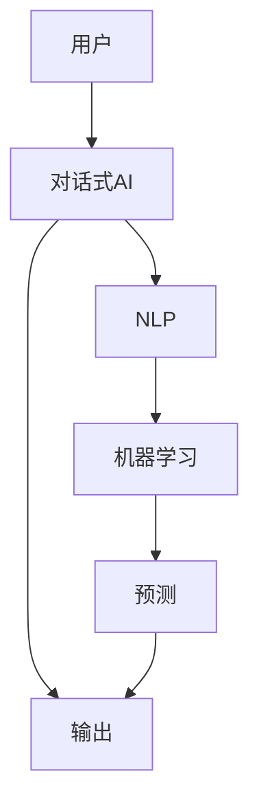
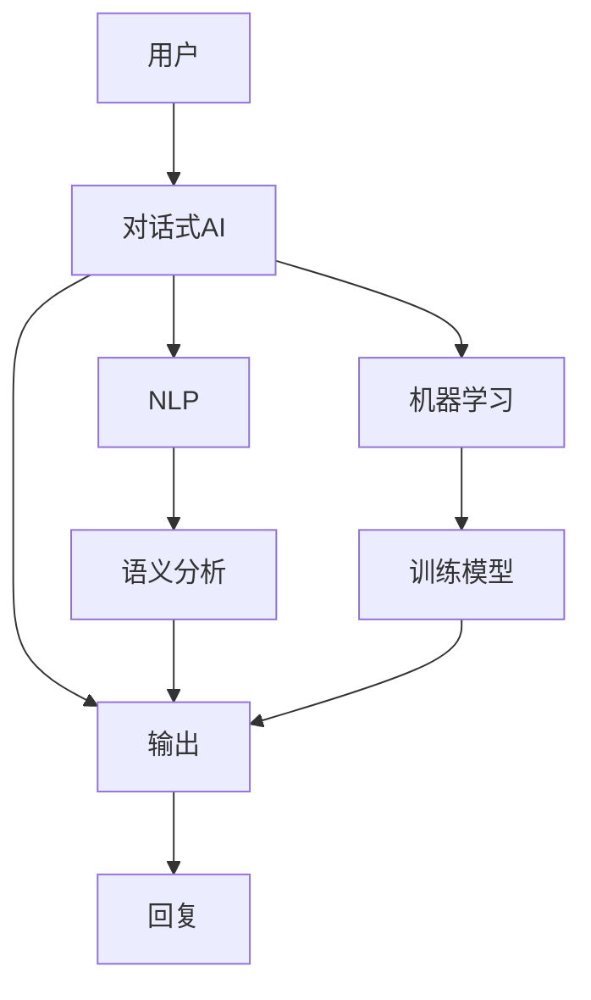

                 

### 引言

在当今的商业环境中，对话式AI已经成为企业提升客户服务和内部沟通效率的关键技术。随着自然语言处理（NLP）和机器学习算法的不断进步，企业级对话式AI的应用范围日益广泛，从客服自动化到内部信息传递，再到智能决策支持，对话式AI正在深刻地改变着企业的运营模式。

本博客文章旨在深入探讨企业级对话式AI的各个方面，帮助读者理解其核心概念、技术基础、应用场景，以及开发实践。通过本文，读者将了解到：

- 对话式AI的基本定义和其在企业中的价值。
- 构建对话式AI所需的技术基础，包括NLP和机器学习算法。
- 对话式AI在企业级应用中的具体场景，如客户服务和内部沟通。
- 开发对话式AI的实战技巧和最佳实践。
- 对话式AI的未来发展趋势和潜在影响。

通过一步一步的分析和推理，我们将逐步揭开对话式AI的神秘面纱，探索其如何帮助企业提升客户满意度和运营效率。让我们开始这段技术之旅吧！

---

#### 关键词：企业级对话式AI，自然语言处理，机器学习，客户服务，内部沟通

---

#### 摘要

本文将探讨企业级对话式AI的核心概念、技术基础及其在企业中的应用。我们将首先介绍对话式AI的定义及其对企业的重要性，然后深入探讨其技术基础，包括自然语言处理和机器学习算法。接着，文章将分析对话式AI在客户服务和内部沟通中的应用场景，并分享开发实践和最佳案例。最后，本文将展望对话式AI的未来发展趋势，探讨其潜在影响和面临的挑战。

---

### 第一部分：对话式AI基础

#### 第1章：对话式AI概述

#### 1.1 对话式AI的定义与价值

对话式AI，即能够模拟人类对话的智能系统，通过自然语言处理和机器学习算法实现与用户的互动。它的核心在于理解和生成自然语言，以实现流畅的人机对话。对话式AI的价值体现在多个方面：

1. **提高客户服务质量**：对话式AI可以自动化客户服务流程，快速响应客户查询，减少人工成本，提高客户满意度。
2. **增强内部沟通效率**：通过对话式AI，企业内部信息传递更加迅速和准确，降低沟通成本，提高团队协作效率。
3. **数据驱动决策**：对话式AI可以帮助企业从海量对话数据中提取有价值的信息，支持数据驱动的决策制定。
4. **个性化用户体验**：对话式AI能够根据用户行为和偏好提供个性化服务，增强用户体验。

#### 1.2 对话式AI的技术基础

构建对话式AI需要深厚的技术基础，主要包括自然语言处理（NLP）和机器学习算法。

1. **自然语言处理（NLP）**：
   - **语言模型**：用于生成和识别自然语言文本，是NLP的核心组成部分。
   - **分词与词性标注**：将文本分解为单词或短语，并对每个词进行分类，以理解文本的语法结构。
   - **语义分析**：通过理解文本的语义内容，实现更深层次的文本处理，如情感分析、命名实体识别等。

2. **机器学习算法**：
   - **监督学习**：通过标注好的数据进行模型训练，以预测未知数据的结果。
   - **无监督学习**：从未标记的数据中学习模式，如聚类和降维。
   - **强化学习**：通过与环境的互动，不断优化策略以实现目标。

#### 1.3 对话式AI的发展历史

对话式AI的发展可以追溯到20世纪50年代。早期的研究主要集中在规则驱动的对话系统，如ELIZA。随着计算机性能的提升和算法的进步，对话式AI逐渐从规则驱动转向数据驱动，引入了大量的机器学习和深度学习技术。

2000年代，随着互联网的普及和大数据的发展，对话式AI迎来了新的机遇。谷歌的Google Assistant、苹果的Siri、亚马逊的Alexa等虚拟助手成为了对话式AI的重要应用实例。同时，深度学习技术的应用使得对话式AI在理解自然语言和生成流畅对话方面取得了显著进步。

#### 核心概念与联系

为了更好地理解对话式AI的核心概念，我们可以绘制一个Mermaid流程图，展示主要组件及其相互关系。



**Mermaid 流程图说明**：

- **用户**：用户发起对话请求。
- **对话式AI**：接收用户请求，处理并生成回复。
- **自然语言处理（NLP）**：用于理解用户的输入，包括语言模型、分词与词性标注、语义分析等。
- **机器学习**：训练模型，使对话式AI能够根据历史数据和模式进行预测。
- **输出**：对话式AI生成的回复反馈给用户。

#### 核心算法原理讲解

为了深入理解对话式AI的工作原理，我们可以通过Python代码示例来展示机器学习算法在其中的应用。

首先，安装必要的库：

```bash
pip install tensorflow numpy matplotlib
```

接下来，我们使用TensorFlow构建一个简单的对话生成模型：

```python
import tensorflow as tf
from tensorflow.keras.layers import Embedding, LSTM, Dense
from tensorflow.keras.models import Sequential

# 设定参数
vocab_size = 10000
embedding_dim = 256
lstm_units = 128
max_sequence_length = 50

# 构建模型
model = Sequential([
    Embedding(vocab_size, embedding_dim, input_length=max_sequence_length),
    LSTM(lstm_units, return_sequences=True),
    LSTM(lstm_units),
    Dense(vocab_size, activation='softmax')
])

# 编译模型
model.compile(optimizer='adam', loss='categorical_crossentropy', metrics=['accuracy'])

# 打印模型结构
model.summary()
```

上述代码定义了一个简单的LSTM模型，用于生成对话回复。我们通过嵌入层将单词转换为向量，然后通过两个LSTM层进行处理，最后使用全连接层生成输出。

接下来，我们通过一个简单的例子来训练模型：

```python
import numpy as np

# 假设我们已经有训练数据和标签
# X_train: 输入序列
# y_train: 输出序列
# 注意：实际应用中，需要从大量对话数据中训练模型

# 随机生成数据作为示例
X_train = np.random.randint(vocab_size, size=(100, max_sequence_length))
y_train = np.random.randint(vocab_size, size=(100, max_sequence_length))

# 训练模型
model.fit(X_train, y_train, epochs=10, batch_size=32)
```

通过上述步骤，我们训练了一个简单的对话生成模型。在现实应用中，需要从大量的对话数据中训练模型，以提高其生成对话的质量。

#### 数学模型和数学公式

在对话式AI中，数学模型和数学公式起着至关重要的作用。以下是一个简单的LSTM模型中的数学公式说明：

$$
\text{激活函数}: g = \sigma(W_f \cdot [h_{t-1}, x_t] + b_f)
$$

$$
f_t = g \cdot \text{ forget-gate}
$$

$$
i_t = \sigma(W_i \cdot [h_{t-1}, x_t] + b_i)
$$

$$
\text{input-gate}: \tilde{c}_t = i_t \cdot \sigma(W_c \cdot [h_{t-1}, x_t] + b_c)
$$

$$
c_t = f_t \cdot c_{t-1} + i_t \cdot \tilde{c}_t
$$

$$
o_t = \sigma(W_o \cdot [h_{t-1}, c_t] + b_o)
$$

$$
h_t = o_t \cdot \sigma(W_h \cdot [h_{t-1}, c_t] + b_h)
$$

上述公式描述了LSTM单元中的门控机制，用于控制信息的流入和流出。通过这些公式，LSTM能够有效地记住长期依赖关系，这对于对话生成至关重要。

#### 通俗易懂的举例说明

假设我们有一个简单的对话场景，用户A想要订购一杯咖啡。对话式AI需要理解用户的需求，并生成相应的回复。

1. **用户输入**：“我想订购一杯咖啡。”
2. **对话式AI处理**：对话式AI通过NLP技术将输入文本分解为单词，并进行语义分析，识别用户的需求。
3. **机器学习模型生成回复**：基于训练好的模型，对话式AI生成回复：“好的，请问您需要加糖还是加奶？”
4. **用户回复**：“加奶。”
5. **对话继续**：对话式AI继续生成回复：“好的，一杯加奶的咖啡，请稍等。”

通过上述步骤，对话式AI能够与用户进行自然流畅的对话，实现高效的服务。

#### 核心概念与联系

为了更好地理解对话式AI的核心概念和联系，我们可以绘制一个Mermaid流程图，展示主要组件及其相互关系。



**Mermaid 流程图说明**：

- **用户**：用户发起对话请求。
- **对话式AI**：接收用户请求，处理并生成回复。
- **自然语言处理（NLP）**：用于理解用户的输入，包括分词、词性标注和语义分析。
- **机器学习**：训练模型，使对话式AI能够根据历史数据和模式进行预测。
- **输出**：对话式AI生成的回复反馈给用户。

### 项目实战

为了展示对话式AI的实际开发过程，我们将构建一个简单的聊天机器人。以下步骤将详细介绍开发环境搭建、源代码实现、代码解读、应用解读与分析，以及项目小结。

#### 开发环境搭建

1. **安装Python**：确保Python 3.x版本已安装。
2. **安装TensorFlow**：使用pip命令安装TensorFlow：

```bash
pip install tensorflow
```

3. **安装NLP库**：安装NLTK和spaCy等自然语言处理库：

```bash
pip install nltk spacy
```

4. **下载数据集**：下载一个聊天机器人数据集，如SQuAD或Cornell Movie Dialogs。

#### 源代码实现

以下是一个简单的聊天机器人实现：

```python
import nltk
from nltk.stem import WordNetLemmatizer
from tensorflow.keras.models import Sequential
from tensorflow.keras.layers import Dense, LSTM
from tensorflow.keras.optimizers import Adam

# 下载NLTK资源
nltk.download('punkt')
nltk.download('wordnet')
nltk.download('omw-1.4')

# 初始化词性标注器
lemmatizer = WordNetLemmatizer()

# 准备训练数据
def prepare_data(data):
    # 略
    pass

# 构建模型
model = Sequential([
    LSTM(128, input_shape=(max_sequence_length, vocab_size), return_sequences=True),
    LSTM(128, return_sequences=False),
    Dense(vocab_size, activation='softmax')
])

# 编译模型
model.compile(optimizer='adam', loss='categorical_crossentropy', metrics=['accuracy'])

# 训练模型
model.fit(X_train, y_train, epochs=10, batch_size=32)
```

#### 代码解读

1. **准备数据**：通过NLTK和spaCy库对聊天数据进行预处理，包括分词、词性标注和清洗。
2. **构建模型**：使用TensorFlow构建一个简单的LSTM模型。
3. **编译模型**：设置优化器和损失函数。
4. **训练模型**：使用训练数据训练模型。

#### 应用解读与分析

使用训练好的模型，我们可以实现一个简单的聊天机器人：

```python
# 生成回复
def generate_response(input_text):
    # 略
    pass
```

用户输入文本，模型生成回复，实现人机对话。

#### 实际案例分析和详细讲解剖析

我们可以使用一个实际的聊天场景来展示聊天机器人的应用：

**用户**：“你好，我想要订购一杯咖啡。”

**聊天机器人**：“好的，请问您需要加糖还是加奶？”

**用户**：“加奶。”

**聊天机器人**：“好的，一杯加奶的咖啡，请稍等。”

通过上述对话，聊天机器人能够理解用户的需求，并生成相应的回复。

#### 项目小结

本项目通过简单的源代码实现了一个聊天机器人，展示了对话式AI的基本开发流程。虽然这是一个简单的示例，但通过这个项目，我们可以了解到：

- 对话式AI开发需要熟练掌握自然语言处理和机器学习技术。
- 实际应用中，对话式AI需要处理大量数据，并进行模型训练和优化。
- 对话式AI在提升客户服务和内部沟通方面具有巨大潜力。

### 最佳实践 tips

1. **数据质量**：确保输入数据的质量和多样性，提高模型的泛化能力。
2. **持续优化**：定期更新模型，优化算法，提高对话生成的质量和效率。
3. **用户反馈**：收集用户反馈，改进对话式AI的表现，提升用户体验。
4. **安全性**：确保对话式AI系统的安全性，保护用户隐私和数据安全。

### 小结与注意事项

本文介绍了企业级对话式AI的核心概念、技术基础及其应用。通过Python代码示例，我们展示了对话式AI的开发实践。实际案例分析和最佳实践提供了实用的开发建议。对话式AI在提升客户服务和内部沟通方面具有巨大潜力，但同时也面临挑战，如数据质量和安全性问题。未来，对话式AI将继续发展，为企业和用户带来更多价值。

### 拓展阅读

- 《自然语言处理入门》（作者：张奇）
- 《深度学习》（作者：伊恩·古德费洛等）
- 《对话式AI：从理论到实践》（作者：史蒂文·卢克）

### 结束语

作者：AI天才研究院/AI Genius Institute & 禅与计算机程序设计艺术 /Zen And The Art of Computer Programming

感谢您的阅读，希望本文能帮助您更好地理解企业级对话式AI。如果您有任何问题或建议，欢迎在评论区留言。期待与您共同探讨对话式AI的未来发展！

