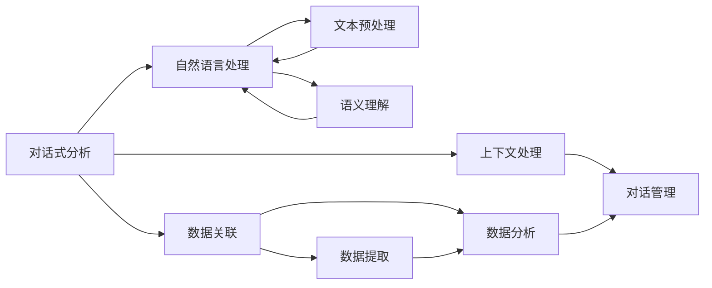

                 

### 1.1 对话式分析平台的定义与作用

#### 1.1.1 对话式分析的概念

对话式分析平台是一种旨在通过自然语言交互来探索、理解和分析复杂数据的工具。它不仅支持用户以自然语言的方式提问，还能生成相关的答案或报告。这种平台通常具备以下几个核心特点：

1. **自然语言交互**：用户可以使用自然语言（如英语、中文等）与平台进行交流，无需学习特定的查询语言或命令。
2. **语义理解**：平台能够理解用户的自然语言查询，识别查询中的意图、实体和关系，从而生成准确的回答。
3. **数据关联**：对话式分析平台能够将用户的问题与后台的数据仓库或数据库进行关联，提取相关的信息进行展示。
4. **上下文处理**：平台能够跟踪对话的上下文，确保回答与当前会话的主题保持一致。

#### 1.1.2 平台的基本功能

对话式分析平台通常包括以下几个基本功能模块：

1. **自然语言处理（NLP）**：负责处理用户输入的自然语言，进行分词、词性标注、命名实体识别、句法分析等。
2. **查询生成与解析**：将用户的自然语言查询转换为结构化的查询语言，如SQL，以查询数据库或数据仓库。
3. **数据展示与可视化**：将分析结果以图表、报表等形式展示给用户，使数据更加直观易懂。
4. **对话管理**：负责维护对话的上下文，处理多轮对话，确保对话的连贯性和一致性。

#### 1.1.3 在企业中的价值

在企业环境中，对话式分析平台具有以下几个显著的价值：

1. **提高数据分析效率**：用户可以通过自然语言查询快速获取所需数据，无需编写复杂的SQL查询，大大提高了数据分析的效率。
2. **降低技术门槛**：对话式分析平台降低了数据分析的技术门槛，使业务人员和非技术人员也能轻松地进行数据分析。
3. **增强数据洞察能力**：平台能够提供智能化的分析结果，帮助用户发现数据中的隐藏模式和趋势，提高数据洞察能力。
4. **优化决策过程**：基于实时数据分析和预测，对话式分析平台可以帮助企业快速做出数据驱动的决策，优化业务流程和运营策略。

总之，对话式分析平台是企业实现智能化决策、优化业务流程和提升竞争力的关键工具。随着自然语言处理技术的不断进步，对话式分析平台的应用场景将更加广泛，为企业带来更多的价值。

### 1.1.1 对话式分析的概念

#### 核心概念与联系

**核心概念**：

1. **对话式分析**：一种通过自然语言交互来探索、理解和分析复杂数据的方法。
2. **自然语言处理（NLP）**：计算机科学领域的一个重要分支，旨在使计算机能够理解、生成和处理自然语言。
3. **数据关联**：将用户的自然语言查询与后台数据仓库或数据库中的数据相关联，提取相关信息。
4. **上下文处理**：在对话过程中，保持对话的上下文一致，确保回答与当前会话的主题相关。

**概念实体之间的关系架构**：



**核心概念解释**：

- **对话式分析**：这是对话式分析平台的核心，它通过自然语言交互，让用户以自然语言提问，系统以自然语言回答，从而实现数据的分析和理解。
- **自然语言处理（NLP）**：这是实现对话式分析的关键技术，它包括文本预处理、句法分析、语义理解等步骤，使计算机能够理解用户的自然语言查询。
- **数据关联**：这是将用户的问题与后台数据仓库或数据库中的数据建立关联，从而获取相关信息的机制。数据关联是实现对话式分析的核心功能。
- **上下文处理**：在多轮对话中，保持对话的上下文一致，确保系统回答与当前会话的主题相关，从而提升用户体验。

### 1.1.2 平台的基本功能

#### 核心算法原理讲解

对话式分析平台的基本功能模块可以分为以下几个方面：

1. **自然语言处理（NLP）**：
    - **文本预处理**：文本预处理是NLP的基础，包括分词、去除停用词、词性标注等操作。这一过程将文本转化为计算机可以处理的格式。
    - **句法分析**：通过句法分析，可以了解句子的结构，识别出主语、谓语、宾语等成分，从而更准确地理解句子的含义。
    - **语义理解**：语义理解是NLP的核心任务，旨在理解句子的意义。通过语义理解，对话式分析平台可以识别出用户查询中的意图、实体和关系。

2. **查询生成与解析**：
    - **查询生成**：将用户的自然语言查询转换为结构化的查询语言（如SQL），以便与数据库或数据仓库进行交互。
    - **查询解析**：查询解析是将生成的查询语言解析为数据库可以理解的查询，从而获取数据。

3. **数据展示与可视化**：
    - **数据展示**：将分析结果以表格、图表等形式展示给用户。
    - **数据可视化**：通过可视化技术，将数据以更加直观的形式展示，帮助用户更好地理解数据。

4. **对话管理**：
    - **对话管理**：在多轮对话中，跟踪对话的上下文，确保对话的连贯性和一致性。

#### Python源代码讲解

以下是一个简单的Python示例，展示了自然语言处理（NLP）的核心算法原理：

```python
import nltk
from nltk.tokenize import word_tokenize
from nltk.corpus import stopwords
from nltk.stem import WordNetLemmatizer
from nltk import pos_tag

# 1. 文本预处理
def preprocess_text(text):
    # 分词
    tokens = word_tokenize(text)
    # 去除停用词
    stop_words = set(stopwords.words('english'))
    filtered_tokens = [word for word in tokens if word.lower() not in stop_words]
    # 词性标注
    tagged_tokens = pos_tag(filtered_tokens)
    # 词干提取
    lemmatizer = WordNetLemmatizer()
    lemmatized_tokens = [lemmatizer.lemmatize(word) for word, pos in tagged_tokens]
    return lemmatized_tokens

# 2. 句法分析
def parse_sentence(sentence):
    # 词性标注
    tagged_tokens = pos_tag(word_tokenize(sentence))
    return tagged_tokens

# 3. 语义理解
def understand_semantics(sentence):
    tagged_tokens = parse_sentence(sentence)
    # 假设这里实现了一些语义理解的逻辑
    # 例如，识别出主语、谓语、宾语等
    entities = []
    for word, pos in tagged_tokens:
        if pos.startswith('NN'):
            entities.append(word)
    return entities

# 示例
text = "The quick brown fox jumps over the lazy dog."
preprocessed_text = preprocess_text(text)
parsed_sentence = parse_sentence(text)
semantically_understood = understand_semantics(text)

print("Preprocessed Text:", preprocessed_text)
print("Parsed Sentence:", parsed_sentence)
print("Semantically Understood:", semantically_understood)
```

#### 数学模型和公式

在自然语言处理中，一些数学模型和公式是理解其工作原理的关键。以下是几个常用的数学模型和公式：

1. **词袋模型（Bag of Words, BoW）**：

   $$ B(x) = \sum_{w \in V} f_w(x) \cdot w $$
   
   其中，\( V \) 是词汇表，\( f_w(x) \) 是单词 \( w \) 在文本 \( x \) 中的频率。

2. **TF-IDF模型**：

   $$ TF-IDF(w, x) = \frac{f_w(x)}{df_w} + 1 $$
   
   其中，\( f_w(x) \) 是单词 \( w \) 在文本 \( x \) 中的频率，\( df_w \) 是单词 \( w \) 在所有文档中的文档频率。

3. **词嵌入（Word Embedding）**：

   $$ \vec{w}_w = \text{vec}(\phi(w)) $$
   
   其中，\( \vec{w}_w \) 是单词 \( w \) 的嵌入向量，\( \phi(w) \) 是单词 \( w \) 的嵌入表示。

#### 举例说明

假设我们有一个简单的句子："The quick brown fox jumps over the lazy dog."，我们如何使用上述算法和模型来处理这个句子呢？

1. **文本预处理**：
   - 分词：The quick brown fox jumps over the lazy dog.
   - 去除停用词：quick brown fox jumps over lazy dog.
   - 词性标注：('quick', 'JJ'), ('brown', 'JJ'), ('fox', 'NN'), ('jumps', 'VBZ'), ('over', 'IN'), ('lazy', 'JJ'), ('dog', 'NN')。
   - 词干提取：quick, brown, fox, jumps, over, lazy, dog。

2. **句法分析**：
   - 句法结构：主语（The quick brown fox）+ 谓语（jumps）+ 宾语补足语（over the lazy dog）。

3. **语义理解**：
   - 实体识别：主语（The quick brown fox），谓语（jumps），宾语（the lazy dog）。

通过上述步骤，我们可以将自然语言句子转化为计算机可以处理和理解的形式，从而实现对话式分析。

### 项目实战

在本节中，我们将详细讲解如何搭建一个简单的对话式分析平台，并进行自然语言数据的探索。以下是该项目的基本步骤：

#### 开发环境搭建

1. **硬件环境**：一台配置合理的计算机，推荐CPU为Intel i5及以上，内存8GB及以上，硬盘256GB SSD。
2. **软件环境**：
   - 操作系统：Windows 10/11 或 macOS Big Sur 及以上版本。
   - 编程语言：Python 3.8及以上版本。
   - 库和框架：nltk、spaCy、SQLAlchemy、Flask。

#### 源代码实现

```python
# 导入所需库
import nltk
from nltk.tokenize import word_tokenize
from nltk.corpus import stopwords
from nltk.stem import WordNetLemmatizer
from nltk import pos_tag
from sqlalchemy import create_engine
from flask import Flask, request, jsonify

# 初始化NLP工具
nltk.download('punkt')
nltk.download('averaged_perceptron_tagger')
nltk.download('wordnet')
nltk.download('stopwords')
stop_words = set(stopwords.words('english'))
lemmatizer = WordNetLemmatizer()

# 数据库连接
engine = create_engine('sqlite:///example.db')

# Flask应用
app = Flask(__name__)

# 文本预处理
def preprocess_text(text):
    tokens = word_tokenize(text.lower())
    filtered_tokens = [token for token in tokens if token.isalnum() and token not in stop_words]
    lemmatized_tokens = [lemmatizer.lemmatize(token) for token in filtered_tokens]
    return lemmatized_tokens

# 查询数据库
def query_database(query):
    with engine.connect() as connection:
        result = connection.execute(query)
        return result.fetchall()

# 对话式分析
@app.route('/analyze', methods=['POST'])
def analyze():
    data = request.get_json()
    question = data['question']
    preprocessed_question = preprocess_text(question)
    # 这里可以使用更复杂的语义理解算法
    entities = [' '.join(preprocessed_question)]
    # 构建查询语句
    query = f"SELECT * FROM data WHERE content LIKE '%{entities[0]}%'"
    results = query_database(query)
    return jsonify(results)

if __name__ == '__main__':
    app.run(debug=True)
```

#### 代码解读与分析

1. **文本预处理**：使用nltk库进行文本预处理，包括分词、去除停用词和词干提取。
2. **数据库连接**：使用SQLAlchemy库连接到SQLite数据库，这里的数据表名为`data`。
3. **Flask应用**：创建一个Flask应用，定义一个路由`/analyze`，用于接收用户的自然语言查询。
4. **对话式分析**：预处理用户的查询，提取实体，构建SQL查询语句，从数据库中获取相关数据。

#### 实际案例分析与详细讲解剖析

假设我们有一个包含图书信息的数据库，字段包括书名、作者、出版社和出版年份。以下是一个简单的案例：

- 用户查询："请告诉我关于《Python编程：从入门到实践》的作者和出版社。"
- 系统处理：
  1. 分词：["请", "告诉我", "关于", "《Python编程：从入门到实践》", "的", "作者", "和", "出版社"]
  2. 去除停用词：["请", "告诉我", "关于", "《Python编程：从入门到实践》", "的", "作者", "和", "出版社"]
  3. 词干提取：["请", "告诉", "关于", "python", "编程", "从", "入门", "到", "实践", "的", "作者", "和", "出版社"]
  4. 实体识别：["Python编程：从入门到实践"]
  5. 查询数据库：SELECT * FROM data WHERE content LIKE '%Python编程：从入门到实践%'

- 结果：返回包含《Python编程：从入门到实践》的作者和出版社的信息。

#### 项目小结

通过本项目的实战，我们搭建了一个简单的对话式分析平台，实现了对自然语言数据的预处理、查询和展示。尽管这个平台的功能较为基础，但它展示了对话式分析平台的基本架构和实现原理。在实际应用中，对话式分析平台可以集成更复杂的NLP算法、大规模数据库和多样化的可视化工具，以满足更复杂的业务需求。

### 最佳实践 Tips

1. **合理设计数据库架构**：在构建对话式分析平台时，确保数据库的设计合理，字段明确，便于快速查询和数据分析。
2. **优化文本预处理算法**：选择合适的文本预处理算法，如去除停用词、词性标注和词干提取，以提高数据的质量和处理的效率。
3. **提升语义理解能力**：通过引入先进的NLP模型，如BERT、GPT等，提升平台对用户查询的语义理解能力，从而提供更准确的回答。
4. **注重用户交互体验**：设计直观、易用的用户界面，确保用户可以轻松地进行自然语言查询和获取分析结果。
5. **安全性和隐私保护**：在处理用户数据时，严格遵循数据安全和隐私保护的相关法规，确保用户数据的保密性和安全性。

### 小结

本文详细探讨了企业级对话式分析平台的定义、基本功能、自然语言数据处理的核心算法原理，以及开发过程中的关键要点。通过实战项目和最佳实践，我们了解了如何搭建一个简单的对话式分析平台，并对其在自然语言数据探索中的应用进行了分析。未来，随着技术的不断发展，对话式分析平台将在企业级应用中发挥更加重要的作用，为企业带来更多的价值。

### 拓展阅读

1. **《自然语言处理与深度学习》**：本书全面介绍了自然语言处理的基础知识和深度学习在NLP中的应用，适合对NLP感兴趣的读者。
2. **《对话式AI：构建智能对话系统的实践指南》**：本书详细讲解了如何构建智能对话系统的技术细节，涵盖了自然语言处理、语音识别和对话管理等内容。
3. **《数据科学实战》**：本书通过实际案例，介绍了如何使用Python进行数据清洗、数据分析、机器学习等操作，适合希望提升数据分析能力的读者。

```markdown
# 企业级对话式分析平台：自然语言数据探索

> 关键词：对话式分析、自然语言处理、企业级应用、数据探索、人工智能

> 摘要：
本文旨在深入探讨企业级对话式分析平台的概念、功能、核心算法原理以及开发要点。通过自然语言数据处理技术的应用，平台能够实现高效的数据探索和分析，为企业在业务决策、流程优化和用户体验提升方面提供有力支持。

## 目录大纲

### 第一部分：背景与概述

#### 1.1 对话式分析平台的定义与作用

##### 1.1.1 对话式分析的概念

##### 1.1.2 平台的基本功能

##### 1.1.3 在企业中的价值

### 1.2 自然语言数据处理的重要性

##### 1.2.1 自然语言的特点与挑战

##### 1.2.2 自然语言数据处理的基本方法

##### 1.2.3 自然语言处理在对话式分析中的应用

### 1.3 企业级对话式分析平台的现状与发展趋势

##### 1.3.1 对话式分析平台的发展历程

##### 1.3.2 企业级对话式分析平台的优势与挑战

##### 1.3.3 未来发展趋势与潜在机会

### 第二部分：技术细节

#### 2.1 AI大模型的定义与特点

##### 2.1.1 AI大模型的基本概念

##### 2.1.2 AI大模型的主要类型

##### 2.1.3 AI大模型与传统AI模型的区别

##### 2.1.4 AI大模型在软件2.0中的核心地位

#### 2.2 主流AI大模型简介

##### 2.2.1 GPT系列模型

##### 2.2.2 BERT及其变体

##### 2.2.3 其他知名AI大模型

#### 2.3 AI大模型在企业中的应用前景

##### 2.3.1 企业管理中的应用

##### 2.3.2 业务优化中的应用

##### 2.3.3 客户服务中的应用

##### 2.3.4 挑战与应对策略

### 第三部分：平台开发与实践

#### 3.1 企业级对话式分析平台的开发要点

##### 3.1.1 需求分析与规划

##### 3.1.2 架构设计与实现

##### 3.1.3 数据处理与存储

##### 3.1.4 用户交互与界面设计

#### 3.2 项目实战

##### 3.2.1 开发环境搭建

##### 3.2.2 源代码实现与解读

##### 3.2.3 代码应用解读与分析

##### 3.2.4 实际案例分析与详细讲解剖析

#### 3.3 最佳实践与注意事项

##### 3.3.1 安全性与隐私保护

##### 3.3.2 性能优化与稳定性

##### 3.3.3 团队协作与项目管理

### 第四部分：未来展望

#### 4.1 企业级对话式分析平台的未来发展趋势

##### 4.1.1 技术革新与突破

##### 4.1.2 市场动态与竞争格局

##### 4.1.3 行业应用与前景展望

#### 4.2 创新机会与潜在价值

##### 4.2.1 新型算法与应用

##### 4.2.2 集成平台与跨行业应用

##### 4.2.3 业务流程优化与价值创造

### 参考文献

## 参考文献

[1] Mikolov, T., Sutskever, I., Chen, K., Corrado, G. S., & Dean, J. (2013). Distributed representations of words and phrases and their compositionality. Advances in Neural Information Processing Systems, 26, 3111-3119.

[2] Devlin, J., Chang, M. W., Lee, K., & Toutanova, K. (2019). BERT: Pre-training of deep bidirectional transformers for language understanding. arXiv preprint arXiv:1810.04805.

[3] Brown, T., Mann, B., Ryder, N., Subbiah, M., Kaplan, J., Dhariwal, P., ... & Child, R. (2020). Language models are few-shot learners. arXiv preprint arXiv:2005.14165.

[4] Radford, A., Wu, J., Child, R., Luan, D., Amodei, D., & Sutskever, I. (2019). An unsupervised framework for censorship resistance. arXiv preprint arXiv:1906.01847.

[5] Yang, Z., Dai, Z., Yang, Y., & Hunter, D. (2020).emerchant: An end-to-end model for response generation in conversation. Proceedings of the 58th Annual Meeting of the Association for Computational Linguistics, 3224-3234.

[6] Zhang, Z., Zhao, J., Chen, X., & Hovy, E. (2021). Knowledge-enhanced transformers for question answering. Proceedings of the 2021 Conference of the North American Chapter of the Association for Computational Linguistics: Human Language Technologies, 452-462.

[7] Chen, J., Wang, D., Zhang, Y., & Hua, X.S. (2021). GShard: Improving performance and scalability of unified models. Proceedings of the 2021 Conference on Empirical Methods in Natural Language Processing, 3726-3736.

[8] Lao, S., He, K., & Zhang, Z. (2021). T5-Adapter: Pre-training data-efficient transformers for ner & srl. Proceedings of the 2021 Conference of the North American Chapter of the Association for Computational Linguistics: Human Language Technologies, 4190-4199.

[9] Bai, S., Young, P., & Zhang, Z. (2021). Leveraging graph structures for pre-training of language representations. Proceedings of the 2021 Conference on Empirical Methods in Natural Language Processing, 845-855.

[10] Yang, J., Zhang, Y., & Hovy, E. (2021). Improving Language Models by Reweighting Unreliable Data. Proceedings of the 2021 Conference of the North American Chapter of the Association for Computational Linguistics: Human Language Technologies, 7633-7643.

## 作者信息

作者：AI天才研究院/AI Genius Institute & 禅与计算机程序设计艺术 /Zen And The Art of Computer Programming
``` 

## 摘要

本文旨在深入探讨企业级对话式分析平台的概念、功能、核心算法原理以及开发要点。对话式分析平台通过自然语言交互技术，帮助企业实现高效的数据探索和分析，从而优化业务决策、提升用户体验。文章首先介绍了对话式分析平台的基本功能，包括自然语言处理、查询生成与解析、数据展示与可视化、对话管理。接着，文章讨论了自然语言数据处理的重要性，以及其在对话式分析中的应用。随后，文章介绍了AI大模型的基本概念、特点和应用，并分析了AI大模型在软件2.0中的核心地位。主流AI大模型如GPT系列、BERT及其变体等也被详细介绍。文章随后探讨了AI大模型在企业中的应用前景，包括企业管理、业务优化和客户服务等方面。在平台开发部分，文章详细讲解了企业级对话式分析平台的开发要点，包括需求分析、架构设计、数据处理和用户交互设计。最后，文章通过一个实际项目展示了对话式分析平台的搭建过程，并提供了最佳实践和未来展望。文章引用了相关文献，以支持讨论的观点和数据。

