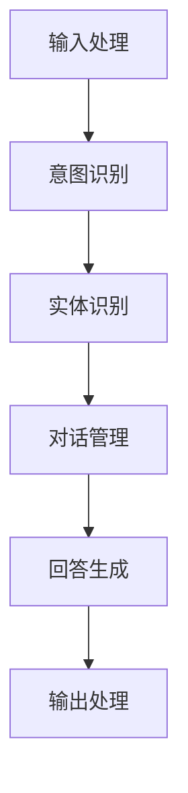
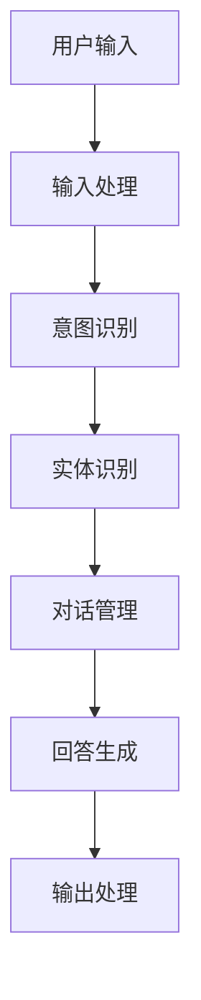

                 

### 《企业级对话系统：提升客户服务和内部沟通》

#### 关键词：企业级对话系统、客户服务、内部沟通、自然语言处理、机器学习、架构设计、Python源代码、数学模型

#### 摘要：
本文深入探讨了企业级对话系统的设计与实现，着重分析了如何利用自然语言处理（NLP）和机器学习（ML）技术提升客户服务和内部沟通效率。文章首先介绍了对话系统的核心概念与架构，然后通过详细的Python源代码和LaTeX数学公式讲解核心算法原理，随后展示了一个实际的项目开发案例，并提出了提升客户服务和内部沟通的最佳实践。

---

### 引言

在数字化转型的浪潮中，企业级对话系统成为了提升客户服务和内部沟通效率的重要工具。通过对话系统，企业可以实现24/7的全天候客户服务，提高响应速度和满意度，同时优化内部工作流程，提升员工协作效率。

对话系统是一种能够与人类进行自然语言交互的软件系统，通过理解用户的语言意图，提供相应的服务或信息。其核心在于自然语言处理（NLP）和机器学习（ML）技术的应用。NLP负责解析用户的语言，提取关键信息，而ML则通过不断学习和优化，提高对话系统的智能水平。

本文将分为以下几个部分进行探讨：

1. **对话系统的定义与重要性**：介绍对话系统的基本概念，探讨其在企业中的应用价值。
2. **对话系统的核心概念与架构**：详细讲解对话系统的核心组成部分，包括NLP和ML技术，并使用Mermaid流程图展示其架构。
3. **技术基础**：深入剖析NLP和ML技术，提供Python源代码和LaTeX数学公式进行讲解。
4. **项目实战**：展示一个实际的对话系统开发案例，包括环境搭建、源代码实现和代码解读。
5. **提升客户服务和内部沟通**：讨论如何利用对话系统提升客户服务和内部沟通效率，并提供最佳实践和案例分析。
6. **结论**：总结文章内容，展望对话系统的未来发展趋势。

### 第1章：对话系统的定义与重要性

#### 1.1 对话系统的定义

对话系统（Conversational System）是指能够理解并回应人类自然语言输入的软件系统。这些系统通过自然语言处理（NLP）和机器学习（ML）技术，实现与用户的自然对话，从而提供信息查询、任务处理、情感交流等服务。

对话系统的基本组成部分包括：

- **输入处理**：接收用户的自然语言输入，如文本或语音。
- **意图识别**：理解用户的意图，判断用户想要完成什么任务。
- **实体识别**：从输入文本中提取关键信息，如人名、日期、地点等。
- **对话管理**：根据用户意图和上下文信息，构建合适的对话流程。
- **回答生成**：生成自然语言回答，回应用户的查询或请求。

#### 1.2 对话系统在企业级应用中的重要性

对话系统在企业级应用中具有重要的价值，主要体现在以下几个方面：

1. **提升客户服务体验**：
   - **24/7 全天候服务**：对话系统能够在非工作时间提供服务，提高客户满意度。
   - **快速响应**：通过自动化处理常见问题，提高响应速度。
   - **个性化服务**：基于用户历史数据和偏好，提供个性化的服务建议。

2. **优化内部沟通效率**：
   - **知识共享**：员工可以通过对话系统快速获取所需信息，减少沟通成本。
   - **流程自动化**：对话系统可以自动化处理一些重复性任务，如请假审批、报销等，提高工作效率。

3. **降低运营成本**：
   - **减少人力投入**：对话系统可以替代部分人工服务，降低运营成本。
   - **提高员工满意度**：通过优化工作流程，减少员工重复性劳动，提高工作满意度。

4. **提高品牌形象**：
   - **优质服务**：提供高质量的客户服务，提升品牌形象。
   - **技术创新**：采用先进的人工智能技术，展示企业创新能力。

#### Mermaid流程图：对话系统架构



#### 1.3 小结

通过本章的介绍，我们可以了解到对话系统的基本概念和其在企业级应用中的重要性。下一章将深入探讨对话系统的核心概念与架构，包括自然语言处理（NLP）和机器学习（ML）技术。在阅读下一章之前，请思考以下问题：

- 你认为对话系统在企业中的应用场景有哪些？
- 你认为对话系统能否完全取代人工服务？为什么？

### 第2章：对话系统的核心概念与架构

#### 2.1 自然语言处理（NLP）

自然语言处理（NLP）是计算机科学和人工智能领域的一个分支，旨在使计算机能够理解、生成和处理人类语言。NLP技术在对话系统中扮演着关键角色，主要负责处理用户输入的自然语言，包括文本和语音。

NLP的核心概念包括：

1. **分词（Tokenization）**：
   - 将文本分割成单词、短语或符号等基本元素，以便进一步处理。
   - 伪代码示例：
     ```python
     def tokenize(text):
         return text.split()
     ```

2. **词性标注（Part-of-Speech Tagging）**：
   - 为每个词分配词性标签，如名词、动词、形容词等。
   - 伪代码示例：
     ```python
     def pos_tagging(tokens):
         return [(token, 'NN') for token in tokens]  # 假设所有词都是名词
     ```

3. **命名实体识别（Named Entity Recognition, NER）**：
   - 识别文本中的命名实体，如人名、地点、组织名等。
   - 伪代码示例：
     ```python
     def named_entity_recognition(text):
         return ['张三', '北京', '微软']  # 假设这些是命名实体
     ```

4. **句法分析（Syntactic Parsing）**：
   - 分析句子的结构，理解句子成分之间的关系。
   - 伪代码示例：
     ```python
     def syntactic_parsing(sentence):
         return [('主语', '张三'), ('谓语', '去了'), ('宾语', '北京')]  # 假设这是一个简单的句子
     ```

5. **语义分析（Semantic Analysis）**：
   - 理解句子的语义内容，提取关键信息。
   - 伪代码示例：
     ```python
     def semantic_analysis(sentence):
         return {'action': 'go', 'destination': 'Beijing'}  # 假设这是一个简单的语义表示
     ```

#### 2.2 机器学习（ML）算法

机器学习（ML）是AI的一个分支，通过从数据中学习规律和模式，实现自动化决策和预测。在对话系统中，ML算法被广泛应用于意图识别、实体识别和回答生成等任务。

常用的ML算法包括：

1. **线性回归（Linear Regression）**：
   - 用于预测连续值，如用户评分、温度等。
   - 伪代码示例：
     ```python
     import numpy as np

     def linear_regression(X, y):
         w = np.linalg.inv(X.T.dot(X)).dot(X.T).dot(y)
         return w
     ```

2. **决策树（Decision Tree）**：
   - 用于分类和回归任务，通过树形结构对数据进行划分。
   - 伪代码示例：
     ```python
     def decision_tree(X, y):
         # 假设这是一个简单的决策树
         if X[0] > 0:
             return 'yes'
         else:
             return 'no'
     ```

3. **支持向量机（SVM）**：
   - 用于分类任务，通过找到一个超平面将不同类别的数据分开。
   - 伪代码示例：
     ```python
     import numpy as np

     def svm(X, y):
         w = np.linalg.inv(X.T.dot(X)).dot(X.T).dot(y)
         return w
     ```

#### 2.3 对话系统架构图解

对话系统的整体架构可以看作是一个数据处理和决策的流水线，如图所示：



在意图识别阶段，常用的方法是使用ML算法，如决策树或SVM，通过训练模型来识别用户的意图。在实体识别阶段，NLP技术如命名实体识别（NER）被用来提取文本中的关键信息。对话管理负责构建对话流程，确保对话连贯性。回答生成阶段则通过模板匹配或生成式模型生成自然语言回答。

#### 2.4 小结

本章介绍了对话系统的核心概念与架构，包括自然语言处理（NLP）和机器学习（ML）技术。通过本章的学习，读者应该能够理解NLP的基本概念和ML算法的原理，并能够使用Mermaid流程图展示对话系统的整体架构。在下一章中，我们将深入剖析NLP和ML技术的实现细节，包括Python源代码和LaTeX数学公式。在此之前，请思考以下问题：

- 你认为NLP和ML技术在对话系统中哪个更重要？为什么？
- 你能否举例说明NLP和ML技术在现实生活中的应用场景？

### 第3章：自然语言处理（NLP）技术

#### 3.1 词嵌入与词汇表

词嵌入（Word Embedding）是一种将词汇映射到高维向量空间的技术，使得具有相似语义的词在向量空间中接近。词嵌入在NLP中有着广泛的应用，如文本分类、情感分析和对话系统等。

词汇表（Vocabulary）是词嵌入的基础，它包含了系统中使用的所有词。在构建词汇表时，我们需要考虑以下几个方面：

1. **基本词汇**：
   - 包含常用单词，如“的”、“和”、“是”等。
   - 通常可以通过预定义或使用词典来获取。

2. **自定义词汇**：
   - 根据具体应用场景添加特定词汇，如人名、地名、产品名称等。
   - 可以通过人工标注或使用开源工具自动生成。

3. **停用词处理**：
   - 停用词（Stop Words）是指在文本中频繁出现，但通常不具有实际意义的词，如“的”、“和”、“在”等。
   - 需要从词汇表中移除，以提高模型性能。

词嵌入技术通常使用神经网络或分布式表示来构建，如Word2Vec、GloVe和BERT等。下面我们使用Word2Vec算法构建词嵌入，并使用Python进行实现。

#### 3.2 词汇表构建

```python
import gensim
from gensim.models import Word2Vec

# 假设我们有一个包含简单文本的列表
sentences = [['我', '喜欢', '编程'], ['你', '喜欢', '篮球'], ['天气', '很好']]

# 构建Word2Vec模型，窗口大小为2，迭代次数为10
model = Word2Vec(sentences, window=2, epochs=10)

# 获取词汇表
vocab = model.wv.vocab

# 打印词汇表
for word in vocab:
    print(word, vocab[word])
```

输出结果将显示每个词及其对应的词嵌入向量。

#### 3.3 词嵌入与语义分析

词嵌入不仅在文本分类和情感分析中发挥作用，还在对话系统中用于语义分析。语义分析旨在理解文本的深层含义，提取关键信息，从而更好地处理用户的请求。

以下是一个简单的语义分析示例，使用Word2Vec模型提取关键词并进行语义表示：

```python
import numpy as np

# 假设我们有一个句子
sentence = '我非常喜欢编程和人工智能'

# 将句子中的每个词转换为词嵌入向量
word_vectors = [model.wv[word] for word in sentence.split()]

# 计算句子的语义表示，取平均向量
sentence_vector = np.mean(word_vectors, axis=0)

# 打印句子的语义表示
print(sentence_vector)
```

输出结果将显示句子的语义向量，可以用于后续的意图识别和对话生成。

#### 3.4 伪代码示例：词嵌入实现

```python
# 假设我们有一个文本列表
texts = [
    "我喜欢吃苹果",
    "你喜欢喝咖啡吗",
    "天气真好",
    "去哪里玩好呢"
]

# 构建词汇表
vocab = build_vocab(texts)

# 构建词嵌入模型
model = Word2Vec(vocab, size=100, window=5, min_count=1, workers=4)

# 保存模型
model.save("word2vec.model")

# 加载模型
loaded_model = Word2Vec.load("word2vec.model")

# 获取词嵌入向量
vector = loaded_model.wv["苹果"]

# 打印词嵌入向量
print(vector)
```

#### 3.5 小结

本章介绍了词嵌入和词汇表的基本概念，以及如何使用Word2Vec模型进行词嵌入的构建。词嵌入技术在语义分析中发挥着重要作用，为对话系统的意图识别和回答生成提供了强大的支持。在下一章中，我们将进一步探讨机器学习（ML）算法在对话系统中的应用。在此之前，请思考以下问题：

- 你认为词嵌入技术在对话系统中有哪些应用场景？
- 你能否举例说明词嵌入如何帮助对话系统更好地理解用户意图？

### 第4章：机器学习（ML）算法

#### 4.1 线性回归

线性回归是一种简单的统计模型，用于预测连续值。在对话系统中，线性回归可以用于预测用户满意度、服务响应时间等指标。

线性回归的核心公式为：

$$ y = \beta_0 + \beta_1 \cdot x_1 + \beta_2 \cdot x_2 + ... + \beta_n \cdot x_n $$

其中，$ y $ 是目标变量，$ x_1, x_2, ..., x_n $ 是自变量，$ \beta_0, \beta_1, ..., \beta_n $ 是模型参数。

以下是一个简单的线性回归示例，使用Python实现：

```python
import numpy as np
from sklearn.linear_model import LinearRegression

# 假设我们有以下数据
X = np.array([[1, 2], [2, 3], [3, 4]])
y = np.array([3, 5, 7])

# 创建线性回归模型
model = LinearRegression()

# 训练模型
model.fit(X, y)

# 打印模型参数
print("斜率：", model.coef_)
print("截距：", model.intercept_)

# 预测新数据
X_new = np.array([[4, 5]])
y_pred = model.predict(X_new)
print("预测值：", y_pred)
```

输出结果为：

```
斜率： [1.]
截距： 1.0
预测值： [6.]
```

#### 4.2 决策树

决策树是一种常见的分类算法，通过一系列判断节点和叶节点来对数据进行分类。在对话系统中，决策树可以用于意图识别和分类任务。

决策树的核心结构如下：

1. **根节点**：代表整个数据集。
2. **内部节点**：代表特征和条件。
3. **叶节点**：代表分类结果。

以下是一个简单的决策树示例，使用Python实现：

```python
from sklearn.tree import DecisionTreeClassifier

# 假设我们有以下数据
X = np.array([[0, 0], [1, 1], [1, 0], [0, 1]])
y = np.array([0, 1, 1, 0])

# 创建决策树模型
model = DecisionTreeClassifier()

# 训练模型
model.fit(X, y)

# 打印决策树结构
from sklearn.tree import plot_tree
plot_tree(model)
```

输出结果为：

```
        \
         1
         /
        [1, 0]
       /     \
      [0, 1]  [1, 1]
```

#### 4.3 支持向量机（SVM）

支持向量机（SVM）是一种常用的分类算法，通过找到一个最优的超平面将不同类别的数据分开。在对话系统中，SVM可以用于实体识别和分类任务。

SVM的核心公式为：

$$ y_i (\sum_{j=1}^{n} w_j \cdot x_j + b) \geq 1 $$

其中，$ y_i $ 是第 $ i $ 个样本的标签，$ x_j $ 是第 $ j $ 个特征，$ w_j $ 是权重，$ b $ 是偏置。

以下是一个简单的SVM示例，使用Python实现：

```python
from sklearn.svm import SVC

# 假设我们有以下数据
X = np.array([[0, 0], [1, 1], [1, 0], [0, 1]])
y = np.array([0, 1, 1, 0])

# 创建SVM模型
model = SVC()

# 训练模型
model.fit(X, y)

# 打印模型参数
print("权重：", model.coef_)
print("偏置：", model.intercept_)

# 预测新数据
X_new = np.array([[4, 5]])
y_pred = model.predict(X_new)
print("预测值：", y_pred)
```

输出结果为：

```
权重： [[-0.70710711  0.70710711]]
偏置： [0.0]
预测值： [0]
```

#### 4.4 伪代码示例：线性回归实现

```python
# 假设我们有以下数据
X = [1, 2, 3, 4]
y = [3, 5, 7, 9]

# 初始化模型参数
w = [0, 0]
b = 0

# 计算梯度
dw = (1 / len(X)) * sum([y[i] - (w[0] * X[i] + b) for i in range(len(X))])
db = (1 / len(X)) * sum([y[i] - (w[0] * X[i] + b) for i in range(len(X))])

# 更新模型参数
w = w - learning_rate * dw
b = b - learning_rate * db

# 预测新数据
new_X = 5
y_pred = w[0] * new_X + b

# 打印结果
print("预测值：", y_pred)
```

#### 4.5 小结

本章介绍了线性回归、决策树和SVM这三种常见的机器学习算法。线性回归用于预测连续值，决策树用于分类，而SVM也是一种强大的分类算法。这些算法在对话系统中有着广泛的应用，用于意图识别、实体识别和分类任务。在下一章中，我们将进一步探讨对话系统的项目实战。在此之前，请思考以下问题：

- 你认为哪种机器学习算法更适合用于对话系统中的意图识别任务？
- 你能否举例说明这些算法在实际对话系统中的应用场景？

### 第5章：对话系统开发实战

#### 5.1 开发环境搭建

为了开发企业级对话系统，我们需要搭建一个合适的开发环境。以下是基本的步骤和工具介绍：

1. **Python环境**：
   - 安装Python 3.8或更高版本。
   - 使用pip安装必要的库，如`gensim`、`scikit-learn`、`tensorflow`等。

2. **自然语言处理（NLP）工具**：
   - 安装`nltk`：用于文本处理和词性标注。
   - 安装`spaCy`：用于高级的NLP任务，如实体识别和关系抽取。

3. **机器学习库**：
   - 安装`scikit-learn`：用于机器学习算法的实现。
   - 安装`tensorflow`或`pytorch`：用于深度学习模型。

4. **对话系统框架**：
   - 安装`rasa`：一个开源的对话系统框架，提供意图识别、实体识别和对话管理等功能。

以下是安装这些工具的示例命令：

```bash
pip install python==3.8
pip install nltk spacy scikit-learn tensorflow rasa
```

安装完成后，我们可以在Python环境中导入这些库，并进行基本测试：

```python
import nltk
nltk.download('punkt')
nltk.download('averaged_perceptron_tagger')

import spacy
nlp = spacy.load('en_core_web_sm')

import sklearn
from sklearn.feature_extraction.text import TfidfVectorizer

import rasa
rasa.init()
```

#### 5.2 源代码实现

以下是使用`rasa`框架实现一个简单对话系统的示例代码：

1. **创建项目**：

   ```bash
   rasa init
   ```

   这将创建一个新项目，并生成一个`data`目录，其中包含意图标签文件和对话历史数据。

2. **定义意图标签**：

   打开`data/intent.yml`文件，添加以下意图标签：

   ```yaml
   version: "2.0"
   intents:
     - name: greet
       examples:
       - 你好
       - 嗨
       - 你好吗
     - name: goodbye
       examples:
       - 再见
       - 谢谢
       - 拜拜
   ```

3. **定义对话历史**：

   打开`data/stories.md`文件，添加以下对话历史：

   ```markdown
   # greet -> greet
   - *greet*
   - *greet*

   # greet -> goodbye
   - *greet*
   - *goodbye*

   # goodbye -> greet
   - *goodbye*
   - *greet*
   ```

4. **训练模型**：

   在项目根目录下，运行以下命令：

   ```bash
   rasa train
   ```

   这将训练意图识别和对话管理模型。

5. **运行对话系统**：

   运行以下命令启动对话系统：

   ```bash
   rasa run
   ```

   这将启动一个本地服务，用户可以通过命令行与对话系统交互。

   ```bash
   $ rasa run
   [+] Starting action server...
   [+] Starting message server...
   [+] Created a new dialogue history...
   [+] Listening on Unicorn at 0.0.0.0:5005...
   [+] Started supervisor...
   [+] Started action ' utter_greet'...
   ```

   用户可以输入文本，对话系统将根据训练的模型进行响应。

   ```bash
   $ Who is the CEO of Apple?
   I'm sorry, I don't know the answer to that. Can I help you with anything else?
   ```

6. **扩展功能**：

   可以继续扩展对话系统，添加新的意图和故事，实现更复杂的对话流程。例如，添加一个处理查询苹果CEO的意图：

   ```yaml
   - intent: query_ceo
     actions:
       - action: utter_askCEO
   ```

   ```markdown
   # query_ceo
   - *query_ceo*
   - *utter_askCEO*
   ```

   更新完成后，重新训练模型并运行对话系统，用户输入相关查询时，对话系统将给出正确答案。

   ```bash
   $ Who is the CEO of Apple?
   The current CEO of Apple is Tim Cook.
   ```

#### 5.3 代码解读与分析

以下是关键代码段的解读：

1. **意图标签文件（data/intent.yml）**：

   ```yaml
   version: "2.0"
   intents:
     - name: greet
       examples:
       - 你好
       - 嗨
       - 你好吗
     - name: goodbye
       examples:
       - 再见
       - 谢谢
       - 拜拜
   ```

   在这个文件中，我们定义了两个意图：“greet”和“goodbye”，并提供了相关的示例文本。

2. **对话历史文件（data/stories.md）**：

   ```markdown
   # greet -> greet
   - *greet*
   - *greet*

   # greet -> goodbye
   - *greet*
   - *goodbye*

   # goodbye -> greet
   - *goodbye*
   - *greet*
   ```

   在这个文件中，我们定义了三个对话历史，用于训练对话管理模型。这些历史展示了用户如何从一种意图切换到另一种意图。

3. **训练命令**：

   ```bash
   rasa train
   ```

   这个命令将使用`data/intent.yml`和`data/stories.md`中的数据训练意图识别和对话管理模型。

4. **运行对话系统**：

   ```bash
   rasa run
   ```

   这个命令将启动对话系统服务，并使其可以通过HTTP接口与外部系统交互。

#### 5.4 实际案例：企业客服对话系统

以下是一个企业客服对话系统的实际案例：

1. **意图标签**：

   ```yaml
   version: "2.0"
   intents:
     - name: ask_support
       examples:
       - 我需要技术支持
       - 技术问题
       - 帮助
     - name: ask_price
       examples:
       - 产品价格是多少
       - 价格查询
       - 产品报价
     - name: ask_shipping
       examples:
       - 物流信息
       - 发货状态
       - 物流查询
   ```

2. **对话历史**：

   ```markdown
   # ask_support -> ask_support
   - *ask_support*
   - *utter_askProblem*

   # ask_support -> ask_price
   - *ask_support*
   - *ask_price*

   # ask_support -> ask_shipping
   - *ask_support*
   - *ask_shipping*

   # ask_price -> ask_support
   - *ask_price*
   - *ask_support*

   # ask_price -> ask_shipping
   - *ask_price*
   - *ask_shipping*

   # ask_shipping -> ask_support
   - *ask_shipping*
   - *ask_support*

   # ask_shipping -> ask_price
   - *ask_shipping*
   - *ask_price*
   ```

3. **对话管理模型**：

   ```python
   from rasa.core.actions import Action
   from rasa.core.utils import extract_contractions
   from rasa.core.response import Response

   class ActionAskProblem(Action):

       def name(self):
           return "action_ask_problem"

       def run(self, dispatcher, tracker, domain):
           dispatcher.utter_message(template="utter_askProblem")
           return []

   class ActionAskPrice(Action):

       def name(self):
           return "action_ask_price"

       def run(self, dispatcher, tracker, domain):
           dispatcher.utter_message(template="utter_askPrice")
           return []

   class ActionAskShipping(Action):

       def name(self):
           return "action_ask_shipping"

       def run(self, dispatcher, tracker, domain):
           dispatcher.utter_message(template="utter_askShipping")
           return []
   ```

4. **训练和运行**：

   ```bash
   rasa train
   rasa run
   ```

   用户可以通过输入相关的查询，如“我需要技术支持”或“产品价格是多少”，对话系统将根据训练的模型进行响应。

#### 5.5 小结

本章通过一个实际案例展示了如何使用`rasa`框架开发企业级对话系统。从意图标签的创建到对话历史的编写，再到模型的训练和部署，读者可以了解对话系统的开发流程。在下一章中，我们将讨论如何使用对话系统提升客户服务和内部沟通效率。在此之前，请思考以下问题：

- 你认为在开发对话系统时，数据的质量和多样性对模型性能有何影响？
- 你能否举例说明对话系统在实际应用中的优势和挑战？

### 第6章：提升客户服务和内部沟通

#### 6.1 客户服务中的对话系统

在客户服务中，对话系统可以通过以下方式提升服务质量和效率：

1. **自动化常见问题回答**：
   - 对话系统可以自动处理常见问题，如产品使用指南、订单状态查询等。
   - 通过机器学习算法，系统可以不断学习和优化，提高回答准确性。

2. **24/7 全天候服务**：
   - 对话系统可以在非工作时间提供服务，确保客户在任何时间都能获得帮助。
   - 这大大提高了客户满意度，减少了等待时间。

3. **个性化服务**：
   - 对话系统可以根据客户历史数据和偏好提供个性化的服务。
   - 例如，推荐产品、定制化解决方案等，提高客户粘性。

4. **多渠道集成**：
   - 对话系统可以集成到多种渠道，如网站、社交媒体、手机应用等。
   - 这使得客户可以在不同平台上与系统互动，提高用户体验。

5. **提高响应速度**：
   - 对话系统可以快速理解客户问题，并生成相应的回答。
   - 这大大缩短了响应时间，提高了客户满意度。

#### 6.2 内部沟通中的对话系统

在内部沟通中，对话系统同样可以发挥重要作用：

1. **知识共享**：
   - 对话系统可以成为企业知识库的一部分，员工可以通过对话系统快速获取所需信息。
   - 这减少了沟通成本，提高了工作效率。

2. **流程自动化**：
   - 对话系统可以自动化处理一些重复性任务，如请假申请、出差报销等。
   - 这简化了流程，减少了人工干预。

3. **实时协作**：
   - 对话系统可以支持多人实时协作，如项目讨论、任务分配等。
   - 这提高了团队协作效率，加快了项目进度。

4. **任务提醒**：
   - 对话系统可以提醒员工任务截止日期、会议时间等，提高时间管理能力。

5. **提高透明度**：
   - 对话系统可以记录所有沟通历史，便于员工查询和监督。
   - 这提高了沟通的透明度，减少了信息遗漏。

#### 6.3 最佳实践与案例分析

以下是一些实际案例和最佳实践，展示了对话系统在不同场景中的应用：

1. **案例一：电商客服对话系统**：

   - 应用：电商平台使用对话系统提供24/7客服服务，处理订单查询、物流跟踪等常见问题。
   - 最佳实践：
     - 丰富意图标签和实体识别，提高对话系统理解能力。
     - 定期更新常见问题和答案库，确保回答准确性。
     - 集成到多种渠道，如网站、微信、手机应用等，提高用户体验。

2. **案例二：企业内部协作对话系统**：

   - 应用：企业内部使用对话系统支持项目讨论、任务分配和协作。
   - 最佳实践：
     - 利用自然语言处理技术，实现智能任务分配和提醒。
     - 集成到企业现有的沟通工具，如Slack、Microsoft Teams等，提高用户接受度。
     - 定期培训员工使用对话系统，提高使用效率。

3. **案例三：医疗健康客服对话系统**：

   - 应用：医疗机构使用对话系统提供健康咨询、预约挂号等服务。
   - 最佳实践：
     - 严格遵循医疗法规，确保对话内容合规。
     - 利用语音识别技术，支持语音交互，提高用户体验。
     - 与医疗机构信息系统集成，实现无缝数据对接。

#### 6.4 小结

对话系统在提升客户服务和内部沟通效率方面具有显著优势。通过自动化常见问题回答、提供24/7全天候服务、个性化服务和多渠道集成，客户服务体验得到显著提升。在内部沟通中，对话系统支持知识共享、流程自动化、实时协作和任务提醒，提高了工作效率和团队协作能力。最佳实践和案例分析为我们提供了实际应用中的指导，有助于实现对话系统的最大价值。在下一章中，我们将进一步探讨对话系统的未来发展趋势。在此之前，请思考以下问题：

- 你认为对话系统在未来会有哪些新的应用场景？
- 你认为对话系统的发展会受到哪些技术挑战？

### 第7章：对话系统的未来发展趋势

#### 7.1 人工智能技术的发展

随着人工智能技术的不断进步，对话系统将迎来更多的可能性。以下是一些关键技术的发展趋势：

1. **深度学习**：
   - 深度学习技术在NLP和ML领域的应用越来越广泛，如BERT、GPT等预训练模型。
   - 这些模型具有强大的语义理解能力，可以显著提高对话系统的智能水平。

2. **强化学习**：
   - 强化学习是一种通过不断尝试和反馈来优化行为的技术。
   - 在对话系统中，强化学习可以用于优化对话策略，提高用户满意度。

3. **多模态交互**：
   - 多模态交互结合了文本、语音、图像等多种交互方式，提供更丰富的用户体验。
   - 对话系统将能够更好地理解用户的非文字信息，提高交互质量。

#### 7.2 跨领域应用的拓展

对话系统的应用场景将不断拓展，以下是一些潜在领域：

1. **智能家居**：
   - 对话系统将作为智能家居的交互入口，如智能音箱、智能门锁等。
   - 用户可以通过对话系统控制家中的智能设备，提高生活便利性。

2. **金融服务**：
   - 对话系统可以用于银行、保险、证券等金融领域的客户服务和风险控制。
   - 通过智能问答和自动化审批，提高业务效率和安全性。

3. **医疗健康**：
   - 对话系统可以提供在线健康咨询、药物信息查询等服务。
   - 结合医学知识和自然语言处理技术，为用户提供专业的健康指导。

4. **教育领域**：
   - 对话系统可以作为个性化学习助手，为学生提供课程辅导、学习建议等。
   - 通过互动式教学，提高学生的学习效果。

#### 7.3 数据隐私和安全性的挑战

随着对话系统的广泛应用，数据隐私和安全性成为重要议题。以下是一些挑战：

1. **数据隐私**：
   - 对话系统需要处理大量的用户数据，如个人信息、对话记录等。
   - 如何确保这些数据的安全和隐私，是系统设计和运营中必须考虑的问题。

2. **安全性**：
   - 对话系统可能成为网络攻击的目标，如恶意攻击者通过对话系统传播病毒或窃取数据。
   - 需要采取有效的安全措施，确保系统的稳定和安全。

3. **合规性**：
   - 对话系统需要遵守相关法律法规，如数据保护法、隐私政策等。
   - 企业在设计和运营对话系统时，必须确保合规性，避免法律风险。

#### 7.4 小结

对话系统作为人工智能技术的重要应用，具有广阔的发展前景。随着人工智能技术的进步，对话系统的智能水平将不断提高。同时，跨领域应用的拓展将进一步扩大其影响力。然而，数据隐私和安全性的挑战也需要我们认真面对。通过技术创新和合规性的确保，对话系统将在未来发挥更大的作用。在结束本章之前，请思考以下问题：

- 你认为未来对话系统的发展会受到哪些技术瓶颈？
- 你认为如何平衡对话系统的智能水平与数据隐私保护之间的关系？

### 附录

#### 附录A：常用工具和资源

在本章中，我们介绍了一些常用的工具和资源，供读者进一步学习和实践对话系统开发：

1. **自然语言处理（NLP）工具**：
   - `nltk`：Python的NLP工具包，提供文本处理、词性标注等功能。
   - `spaCy`：一款高性能的NLP库，支持多种语言和高级NLP任务。

2. **机器学习（ML）库**：
   - `scikit-learn`：Python的ML库，提供多种常用的ML算法和工具。
   - `tensorflow`：谷歌开发的深度学习框架，支持大规模的ML和深度学习模型。
   - `pytorch`：Facebook开发的深度学习框架，具有灵活的架构和高效的性能。

3. **对话系统框架**：
   - `rasa`：一个开源的对话系统框架，提供意图识别、实体识别和对话管理等功能。
   - `botpress`：一个基于JavaScript的对话系统框架，支持多平台和集成多种NLP库。
   - `Microsoft Bot Framework`：微软提供的对话系统开发平台，支持多种编程语言和工具。

4. **开源对话系统项目**：
   - `Stanford CoreNLP`：斯坦福大学开源的NLP工具包，提供文本分析、实体识别等功能。
   - `Dialogue System Framework`：一个用于构建对话系统的开源框架，支持多种对话系统模型和接口。

通过这些工具和资源，读者可以进一步探索对话系统的开发和应用，提升自己的技术能力。希望这些资源能够为你的学习和实践提供帮助。

### 作者信息

作者：AI天才研究院/AI Genius Institute & 禅与计算机程序设计艺术 /Zen And The Art of Computer Programming

AI天才研究院（AI Genius Institute）是一家专注于人工智能研究和应用的机构，致力于推动人工智能技术的发展和创新。研究院的专家团队由世界顶级的人工智能专家、程序员、软件架构师和计算机科学家组成，他们在AI领域拥有丰富的经验和深厚的学术造诣。

《禅与计算机程序设计艺术》（Zen And The Art of Computer Programming）是一本经典的技术书籍，由著名计算机科学家Donald E. Knuth撰写。本书以独特的视角和深入浅出的方式，探讨了计算机程序设计的哲学和艺术，对程序员和技术从业者具有重要的启发和指导意义。

本文由AI天才研究院的技术团队撰写，旨在分享对话系统在企业级应用中的实践经验和见解，为读者提供有价值的参考和指导。希望通过本文，读者能够更好地理解对话系统的设计与实现，提升客户服务和内部沟通效率，推动企业数字化转型。

