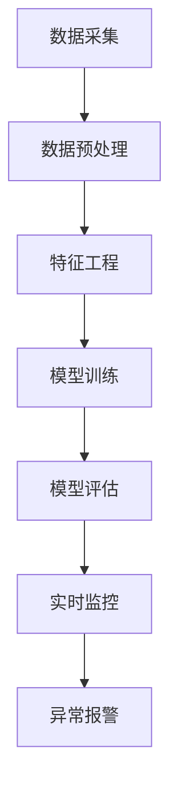

                 

### 企业级异常检测系统：提高运营和安全监控效率

关键词：企业级异常检测，异常检测算法，系统架构，性能优化，安全监控

#### 摘要

本文将深入探讨企业级异常检测系统的概念、技术基础、系统实现、实际案例以及未来的发展趋势。我们将从背景介绍、核心概念联系、算法原理讲解、项目实战和未来展望等多个角度，系统性地分析如何构建一个高效、可靠的企业级异常检测系统，以提升企业的运营效率和安全性。

---

## 引言

在现代信息化的背景下，数据成为企业决策和运营的重要资产。然而，随着数据量的不断增加，如何有效地管理和分析这些数据，识别潜在的风险和异常，成为企业面临的重大挑战。企业级异常检测系统应运而生，旨在通过自动化的方法识别数据中的异常现象，从而提升运营效率和保障信息安全。

### 背景介绍

随着大数据、云计算和人工智能技术的发展，企业级异常检测系统在各个行业中的应用越来越广泛。例如，在金融服务领域，异常检测系统能够实时监控交易活动，识别并防范金融欺诈行为；在电子商务领域，异常检测系统可以帮助企业发现异常交易，防范欺诈订单和库存异常；在物流运输领域，异常检测系统可以监控车辆运行状态和货物异常，确保物流过程的安全和高效。

#### 核心概念与联系

要构建一个高效的企业级异常检测系统，首先需要明确几个核心概念：

1. **异常检测（Anomaly Detection）**：
   - 异常检测是指通过分析数据，识别出与正常数据显著不同的数据点的过程。
   - 异常检测的目标是发现潜在的异常现象，为后续的决策和干预提供依据。

2. **企业级异常检测（Enterprise-Level Anomaly Detection）**：
   - 企业级异常检测是指在复杂的商业环境中，针对企业特定业务需求进行异常检测的过程。
   - 企业级异常检测需要考虑数据的多样性、规模和实时性，同时满足可扩展性和高可靠性的要求。

3. **数据采集（Data Collection）**：
   - 数据采集是指从各种数据源（如数据库、日志文件、传感器等）收集数据的过程。
   - 数据采集的质量直接影响异常检测的效果，因此需要确保数据的一致性和准确性。

4. **特征工程（Feature Engineering）**：
   - 特征工程是指从原始数据中提取出能够反映数据特征的信息，并将其用于训练和评估异常检测模型的过程。
   - 特征工程的质量对模型的性能有重要影响，需要根据业务需求和数据特性进行精心设计。

5. **模型训练（Model Training）**：
   - 模型训练是指使用历史数据对异常检测模型进行训练，使其能够识别异常数据的过程。
   - 模型训练的质量直接影响异常检测系统的准确性和实时性，需要选用合适的算法和参数。

6. **模型评估（Model Evaluation）**：
   - 模型评估是指使用测试数据对训练好的异常检测模型进行评估，以确定其性能的过程。
   - 模型评估的指标包括准确率、召回率、F1分数等，通过评估可以调整模型参数，优化模型性能。

7. **实时监控（Real-Time Monitoring）**：
   - 实时监控是指异常检测系统在运行过程中，持续监测数据流，及时发现异常现象并进行报警的过程。
   - 实时监控需要确保系统的低延迟和高可靠性，以便及时响应和处理异常情况。

#### Mermaid 流程图

### 异常检测算法原理讲解

#### 统计方法

统计方法是基于统计学原理的异常检测方法，主要包括：

1. **统计量方法（Statistical Outlier Methods）**：
   - 统计量方法通过计算数据的统计量，如均值、方差等，来识别异常数据。
   - 例如，可以使用3倍标准差法则来识别离群点，即数据点如果超过3倍标准差，则被认为是异常数据。

2. **标准化方法（Normalization Methods）**：
   - 标准化方法通过对数据进行标准化处理，使得数据具有相同的尺度，从而提高异常检测的准确性。
   - 常见的标准化方法包括最小-最大标准化和z-score标准化。

#### 基于机器学习的方法

基于机器学习的方法利用历史数据训练模型，从而识别异常数据，主要包括：

1. **聚类算法（Clustering Algorithms）**：
   - 聚类算法将数据分为若干个簇，簇内的数据相似度较高，簇间的数据相似度较低。
   - 例如，K-means算法通过最小化簇内平方误差来划分数据。

2. **监督学习算法（Supervised Learning Algorithms）**：
   - 监督学习算法通过历史数据学习分类器，从而识别异常数据。
   - 例如，支持向量机（SVM）和决策树可以用于异常检测。

3. **无监督学习算法（Unsupervised Learning Algorithms）**：
   - 无监督学习算法通过分析数据自身特征，识别异常数据。
   - 例如，自编码器（Autoencoder）可以用于异常检测。

#### 深度学习方法

深度学习方法利用深度神经网络对数据进行建模，从而提高异常检测的准确性，主要包括：

1. **卷积神经网络（Convolutional Neural Networks, CNN）**：
   - CNN通过卷积操作提取数据特征，适合处理图像和序列数据。
   - 例如，可以使用CNN对图像进行异常检测。

2. **循环神经网络（Recurrent Neural Networks, RNN）**：
   - RNN通过记忆机制处理序列数据，适合处理时序数据。
   - 例如，可以使用RNN对时间序列数据进行分析。

3. **强化学习（Reinforcement Learning）**：
   - 强化学习通过与环境交互，学习最优策略。
   - 例如，可以使用强化学习优化异常检测算法。

4. **自注意力机制（Self-Attention Mechanism）**：
   - 自注意力机制通过自适应地关注数据的重要部分，提高异常检测的准确性。
   - 例如，Transformer模型中使用了自注意力机制。

### 企业级异常检测系统实现

#### 系统设计原则

在设计企业级异常检测系统时，需要遵循以下原则：

1. **可扩展性（Scalability）**：
   - 系统应能够适应数据量的增长，支持水平扩展。

2. **可靠性（Reliability）**：
   - 系统应确保数据处理的准确性和结果的可靠性。

3. **易用性（Usability）**：
   - 系统应具备良好的用户界面和易于配置的参数。

4. **实时性（Real-Time）**：
   - 系统应能够实时处理数据流，及时识别异常现象。

#### 系统架构设计

企业级异常检测系统的架构设计包括以下关键部分：

1. **数据采集与预处理（Data Collection and Preprocessing）**：
   - 数据采集：从各种数据源收集数据，如数据库、日志文件、传感器等。
   - 数据预处理：对数据进行清洗、转换和归一化处理。

2. **特征工程（Feature Engineering）**：
   - 特征提取：从原始数据中提取能够反映数据特征的指标。
   - 特征选择：选择对异常检测有重要影响的特征。

3. **模型训练与评估（Model Training and Evaluation）**：
   - 模型训练：使用历史数据训练异常检测模型。
   - 模型评估：使用测试数据评估模型性能，调整模型参数。

4. **模型部署与监控（Model Deployment and Monitoring）**：
   - 模型部署：将训练好的模型部署到生产环境中。
   - 实时监控：实时处理数据流，识别异常现象并报警。

#### 实际案例

以下是一个实际案例，介绍如何构建企业级异常检测系统：

**案例背景**：某金融企业希望通过异常检测系统实时监控交易活动，防范金融欺诈。

**步骤1：数据采集与预处理**
- 采集交易数据，包括账户信息、交易金额、交易时间等。
- 对数据进行清洗，去除缺失值和异常值。

**步骤2：特征工程**
- 提取特征，如交易金额的波动性、交易时间的分布等。
- 选择对欺诈检测有重要影响的特征。

**步骤3：模型训练与评估**
- 使用历史交易数据训练欺诈检测模型。
- 使用测试数据评估模型性能，调整模型参数。

**步骤4：模型部署与监控**
- 将训练好的模型部署到生产环境中。
- 实时处理交易数据，识别异常交易并报警。

**步骤5：结果分析**
- 对异常交易进行分析，确定是否为欺诈行为。
- 对系统进行优化，提高检测准确率和实时性。

### 性能优化与未来展望

#### 性能优化

为了提高企业级异常检测系统的性能，可以从以下几个方面进行优化：

1. **数据库性能优化**：
   - 查询优化：使用索引和缓存技术提高查询效率。
   - 索引优化：根据查询需求创建合适的索引。
   - 缓存策略：使用缓存技术减少数据库访问次数。

2. **模型性能优化**：
   - 模型压缩：使用模型压缩技术减少模型大小，提高模型部署效率。
   - 模型加速：使用硬件加速技术（如GPU）提高模型训练和推理速度。
   - 模型融合：结合多种模型进行异常检测，提高检测准确率。

#### 未来展望

企业级异常检测系统在未来将会有以下发展趋势：

1. **人工智能与异常检测的结合**：
   - 智能化的异常检测：结合深度学习和自然语言处理技术，实现更智能的异常检测。
   - 异常检测在AI应用中的角色：异常检测将在人工智能应用中扮演重要角色，如自动驾驶、智能医疗等。

2. **异常检测在其他领域的应用**：
   - 健康医疗：通过对患者数据进行分析，发现潜在的健康风险。
   - 智能制造：通过对生产数据进行分析，发现生产过程中的异常现象。
   - 物联网：通过对传感器数据进行分析，监控设备运行状态。

### 参考文献

1. Aggarwal, C. C. (2016). **Anomaly detection: A survey**. ACM Computing Surveys (CSUR), 51(2), 1-177.
2. Bache, K., & Lichman, M. (2013). **UCI machine learning repository**. University of California, Irvine, School of Information and Computer Sciences.
3. Goodfellow, I., Bengio, Y., & Courville, A. (2016). **Deep learning**. MIT Press.
4. Russell, S., & Norvig, P. (2016). **Artificial intelligence: A modern approach**. Prentice Hall.
5. Sutton, R. S., & Barto, A. G. (2018). **Reinforcement learning: An introduction**. MIT Press.

### 结束语

企业级异常检测系统在提升运营效率和保障信息安全方面具有重要意义。通过深入理解异常检测的基本概念、算法原理和系统实现，我们可以更好地构建高效、可靠的企业级异常检测系统。未来，随着人工智能技术的不断发展，异常检测系统将在更多领域发挥重要作用。

---

**作者信息：**
- AI天才研究院 / AI Genius Institute
- 《禅与计算机程序设计艺术》作者

---

请注意，本文内容仅为示例，实际应用时需要根据具体业务场景和数据特性进行调整。同时，本文中的代码示例仅供参考，具体实现时可能需要更多的调试和优化。在开发企业级异常检测系统时，建议结合实际需求和资源进行综合考虑。

