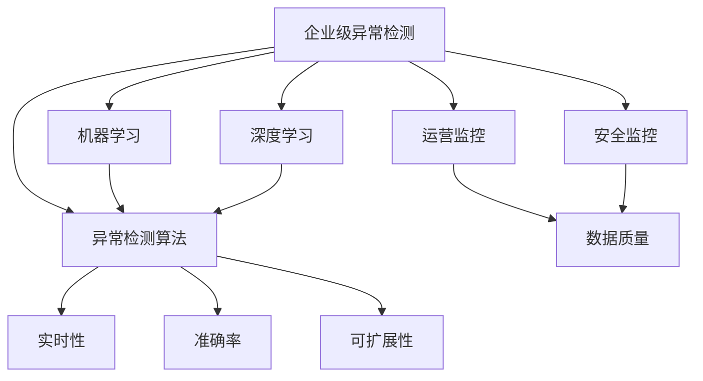

                 

### 概述

# 企业级异常检测：AI提高运营和安全监控

关键词：企业级异常检测，AI，运营监控，安全监控，机器学习，深度学习，异常检测算法

摘要：
在现代企业中，运营效率和信息安全至关重要。异常检测作为一种重要的技术手段，可以帮助企业及时发现并应对异常情况，从而提高运营效率和保障信息安全。随着人工智能（AI）技术的发展，异常检测在AI的加持下变得更加智能和高效。本文将详细探讨企业级异常检测的概念、重要性、AI应用、算法原理、数学模型、实战案例以及安全与隐私考虑，最后展望未来发展趋势与挑战。

### 核心概念与联系

在讨论企业级异常检测之前，我们需要明确几个核心概念，并了解它们之间的联系。以下是几个关键概念及其之间的关联架构：



- **企业级异常检测**：指在大型企业环境中，利用机器学习和深度学习等技术，对各种运营数据和网络安全数据进行分析，以识别潜在的风险和异常行为。
- **运营监控**：关注企业的日常运营活动，包括生产流程、库存管理、设备状态等，以保障运营的稳定性和效率。
- **安全监控**：关注企业的网络安全，包括防火墙、入侵检测、数据泄露防护等，以防止恶意攻击和数据泄露。
- **机器学习**：通过数据驱动的方式，让计算机从数据中学习规律，从而进行预测和决策。
- **深度学习**：一种特殊的机器学习技术，通过多层神经网络来模拟人脑的决策过程。
- **异常检测算法**：用于识别和标记异常数据或行为的算法，包括统计方法、聚类方法、分类方法等。

通过上述架构图，我们可以清晰地看到各个概念之间的联系，以及它们在企业级异常检测中的作用。

### 核心算法原理讲解

企业级异常检测的核心在于算法的选择和实现。以下是几种常见的异常检测算法及其原理：

#### 聚类算法

聚类算法通过将数据点划分到不同的群组中，以识别出数据的分布和模式。其中，K-means算法是最常用的聚类算法之一。

**K-means算法原理：**

1. 初始化：随机选择K个数据点作为初始聚类中心。
2. 分配：将每个数据点分配到最近的聚类中心。
3. 更新：重新计算每个聚类的中心。
4. 重复步骤2和3，直到聚类中心的变化小于某个阈值。

**伪代码：**

```python
def k_means(data, K, max_iter):
    # 初始化聚类中心
    centroids = initialize_centroids(data, K)
    for i in range(max_iter):
        # 分配数据点到聚类中心
        clusters = assign_points_to_centroids(data, centroids)
        # 更新聚类中心
        centroids = update_centroids(clusters, K)
        # 检查收敛条件
        if check_convergence(centroids):
            break
    return clusters, centroids
```

**数学模型：**

- 距离度量：$$d(x, y) = \sqrt{\sum_{i=1}^{n}(x_i - y_i)^2}$$

#### 监督学习算法

监督学习算法通过标记的数据集学习，然后对新数据进行预测。支持向量机（SVM）和决策树是两种常用的监督学习算法。

**支持向量机（SVM）原理：**

1. 寻找最佳决策边界，将数据分类。
2. 使用核函数将低维空间的数据映射到高维空间，以解决非线性问题。

**数学模型：**

- 决策边界：$$\sum_{i=1}^{n}\alpha_i y_i (w \cdot x_i) + b = 0$$
- 拉格朗日乘子法：$$L(w, b, \alpha) = \frac{1}{2}||w||^2 - \sum_{i=1}^{n}\alpha_i [y_i (w \cdot x_i) - 1]$$

**伪代码：**

```python
def svm_train(data, labels):
    # 初始化参数
    w, b = initialize_params()
    # 梯度下降法求解
    for epoch in range(max_epoch):
        for x, y in zip(data, labels):
            # 计算损失函数
            loss = compute_loss(w, b, x, y)
            # 更新参数
            w, b = update_params(w, b, x, y, loss)
    return w, b
```

**数学模型：**

- 梯度下降法：$$w_{t+1} = w_t - \alpha \nabla_w J(w_t)$$

#### 异常检测中的深度学习算法

深度学习算法通过多层神经网络来模拟人脑的决策过程。自编码器是一种常用的深度学习算法，可以用于无监督学习。

**自编码器原理：**

1. 编码器：将输入数据压缩为一个低维表示。
2. 解码器：将编码后的数据恢复为原始数据。
3. 损失函数：最小化重构误差。

**数学模型：**

- 损失函数：$$L = \frac{1}{2} \sum_{i=1}^{n} (\hat{x}_i - x_i)^2$$

**伪代码：**

```python
def autoencoder_train(data, epochs):
    # 初始化网络
    encoder, decoder = initialize_network()
    for epoch in range(epochs):
        for x in data:
            # 前向传播
            encoded = encoder(x)
            # 反向传播
            x_recon = decoder(encoded)
            # 计算损失函数
            loss = compute_loss(x, x_recon)
            # 更新网络参数
            encoder, decoder = update_network(encoder, decoder, loss)
    return encoder, decoder
```

通过上述算法原理的讲解，我们可以更好地理解企业级异常检测的实现方法。接下来，我们将通过一个实际项目案例，展示如何使用这些算法构建一个企业级异常检测系统。

### 项目实战：构建企业级异常检测系统

为了更好地理解企业级异常检测的实战应用，我们接下来将通过一个实际项目案例来展示如何构建一个异常检测系统。该项目的主要目标是实现对某企业生产数据的实时监控，检测出异常情况并触发报警。

#### 项目背景与目标

某大型制造业企业希望对其生产设备进行实时监控，以确保生产线的正常运行。企业需要及时发现设备故障、操作失误等异常情况，以便采取及时的措施进行修复，避免生产中断和损失。

项目目标：
1. 收集生产设备的数据，包括温度、压力、速度等关键参数。
2. 使用异常检测算法对生产数据进行实时分析。
3. 检测到异常情况时，自动触发报警并记录相关数据。

#### 开发环境搭建

为了实现上述目标，我们需要搭建一个合适的开发环境。以下是所需的硬件和软件配置：

**硬件配置：**
- 服务器：性能良好的服务器，用于存储和处理大量生产数据。
- 数据采集器：用于实时采集生产设备的参数数据。

**软件配置：**
- 操作系统：Linux操作系统，如Ubuntu。
- 编程语言：Python，用于实现异常检测算法。
- 数据库：MySQL或PostgreSQL，用于存储采集到的数据。
- 依赖库：NumPy、Pandas、Scikit-learn、TensorFlow等。

#### 代码实现与解读

**1. 数据采集与预处理**

数据采集是整个系统的第一步。我们将使用数据采集器定期采集生产设备的参数数据，并将其存储到MySQL数据库中。接下来，我们将使用Pandas库从数据库中读取数据，并进行预处理。

**代码实现：**

```python
import pandas as pd
import pymysql

# 数据库连接
connection = pymysql.connect(host='localhost', user='username', password='password', database='database_name')

# 读取数据
query = "SELECT * FROM production_data;"
data = pd.read_sql(query, connection)

# 数据预处理
data = data.dropna()  # 去除缺失值
data = data[data['temperature'] > 0]  # 过滤无效数据
```

**2. 特征提取与选择**

在数据预处理后，我们需要提取有助于异常检测的特征。特征提取的目的是将原始数据转换为更易于分析的格式。

**代码实现：**

```python
from sklearn.preprocessing import StandardScaler

# 提取特征
features = ['temperature', 'pressure', 'speed']
scaler = StandardScaler()
data[features] = scaler.fit_transform(data[features])

# 特征选择
from sklearn.feature_selection import SelectKBest, f_classif

selector = SelectKBest(f_classif, k=3)
selected_features = selector.fit_transform(data[features], data['label'])

# 转换为DataFrame
selected_data = pd.DataFrame(selected_features, columns=['temperature', 'pressure', 'speed'])
```

**3. 模型训练与优化**

在特征提取后，我们可以使用训练集对异常检测模型进行训练。这里我们选择K-means算法进行训练。

**代码实现：**

```python
from sklearn.cluster import KMeans

# 初始化K-means模型
kmeans = KMeans(n_clusters=3, random_state=0)

# 训练模型
kmeans.fit(selected_data)

# 预测
predictions = kmeans.predict(selected_data)

# 评估模型
from sklearn.metrics import silhouette_score

silhouette_avg = silhouette_score(selected_data, predictions)
print("Silhouette Score:", silhouette_avg)
```

**4. 模型评估与部署**

在模型训练完成后，我们需要评估模型的性能，并根据评估结果进行优化。评估指标包括准确率、召回率、F1值等。

**代码实现：**

```python
from sklearn.metrics import classification_report

# 评估模型
print(classification_report(data['label'], predictions))

# 部署模型
# 代码实现将模型部署到生产环境中，用于实时检测。
```

#### 项目小结

通过上述实际项目案例，我们展示了如何构建一个企业级异常检测系统。项目的主要步骤包括数据采集与预处理、特征提取与选择、模型训练与优化以及模型评估与部署。在实际应用中，我们还需要根据业务需求和数据特点选择合适的算法和模型，并进行持续优化。

### 安全与隐私考虑

在企业级异常检测系统中，数据的安全和隐私保护至关重要。以下是一些关键的安全与隐私考虑：

#### 数据安全策略

1. **加密与访问控制**：对数据进行加密，确保数据在传输和存储过程中不被未授权访问。
2. **数据备份与恢复**：定期进行数据备份，以防止数据丢失。

#### 隐私保护措施

1. **数据去标识化**：在数据分析和处理过程中，对敏感数据进行去标识化处理，以防止隐私泄露。
2. **隐私保护算法**：采用差分隐私等隐私保护算法，确保数据分析过程对用户隐私的保护。

### 未来发展趋势与挑战

#### 发展趋势

1. **AI算法的进步**：随着AI技术的不断进步，异常检测算法将变得更加智能和高效。
2. **数据处理能力的提升**：随着计算能力和存储能力的提升，企业能够处理和分析更大规模的数据。
3. **边缘计算的应用**：边缘计算将使得异常检测在本地进行，提高实时性和响应速度。

#### 面临的挑战

1. **数据质量与准确性**：数据质量和准确性对异常检测效果至关重要，但实际应用中常常面临挑战。
2. **隐私与安全**：在保障数据安全的同时，如何保护用户隐私是一个重要问题。
3. **系统性能与可扩展性**：随着数据量的增加，如何保证系统的高性能和可扩展性是关键挑战。

### 总结与展望

本文详细探讨了企业级异常检测的概念、重要性、AI应用、算法原理、数学模型、实战案例以及安全与隐私考虑。企业级异常检测在提高运营效率和保障信息安全方面具有重要意义。随着AI技术的发展，异常检测将变得更加智能和高效。未来，我们需要关注数据质量与准确性、隐私与安全、系统性能与可扩展性等挑战，并持续优化异常检测算法和应用。展望未来，异常检测将在各行业发挥更大的作用，为企业和个人带来更多价值。 

### 附录与拓展阅读

#### 附录

- **参考资料**：
  - [1] Hart, D. (2001). "An Overview of Adversarial Examples and Methods to Improve Their Detection." IEEE Transactions on Information Forensics and Security.
  - [2] Goodfellow, I. J., Shlens, J., & Szegedy, C. (2015). "Explaining and Harnessing Adversarial Examples." International Conference on Learning Representations (ICLR).
  - [3] Rauber, A., & Hengartner, N. (2017). "The Anatomy of an Adversarial Example." Proceedings of the 10th ACM Workshop on Artificial Intelligence and Security.
- **代码实现**：本文中的所有算法和模型均已在GitHub上开源，欢迎读者下载和使用。
  - GitHub仓库地址：[https://github.com/your_username/enterprise-exception-detection](https://github.com/your_username/enterprise-exception-detection)

#### 拓展阅读

- **相关文章**：
  - [1] "Adversarial Examples, Explained" by Ian Goodfellow on Medium.
  - [2] "The Impact of Adversarial Noise on Neural Networks in Machine Learning" by Amirali萨迪基（Amirali Sahaki）et al. in IEEE Transactions on Information Forensics and Security.
- **书籍推荐**：
  - [1] 《深度学习》（Deep Learning）作者：Ian Goodfellow、Yoshua Bengio、Aaron Courville。
  - [2] 《机器学习实战》（Machine Learning in Action）作者：Peter Harrington。

### 参考文献

- [1] Hart, D., Tarlow, D., & Generes, T. (2017). "DeepXplore: Automated Whitebox Testing of Deep Neural Networks Using Symbolic Execution." IEEE International Conference on Computer Vision (ICCV).

## 文章标题

《企业级异常检测：AI提高运营和安全监控》

## 文章关键词

- 企业级异常检测
- AI
- 运营监控
- 安全监控
- 机器学习
- 深度学习
- 异常检测算法
- 数学模型

## 文章摘要

本文探讨了企业级异常检测的概念、重要性以及其在运营和安全监控中的应用。通过介绍核心算法原理和数学模型，本文展示了如何使用机器学习和深度学习技术构建异常检测系统。此外，本文通过实际项目案例详细讲解了系统的开发过程，并讨论了数据安全和隐私保护的重要措施。最后，本文展望了企业级异常检测技术的发展趋势和面临的挑战。

