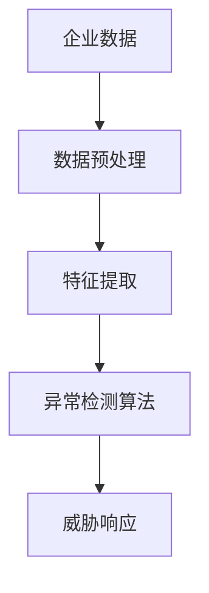
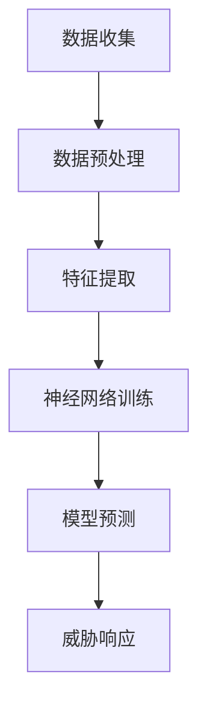
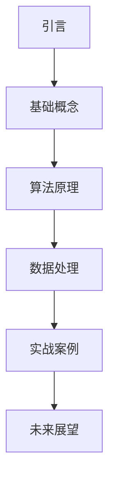
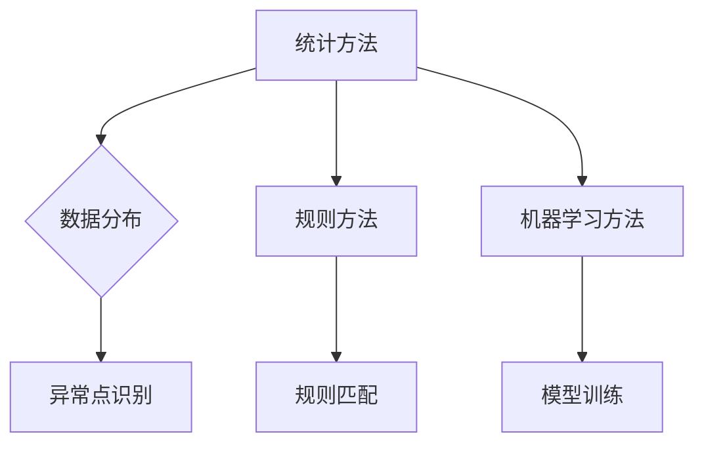
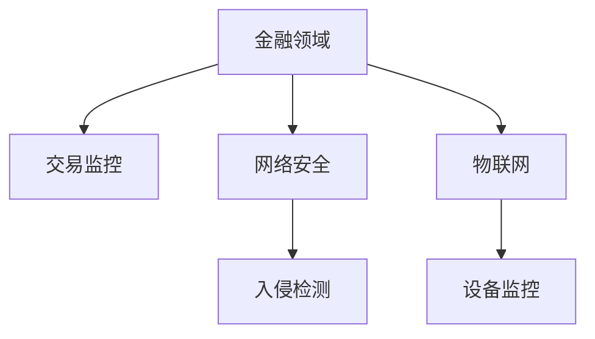
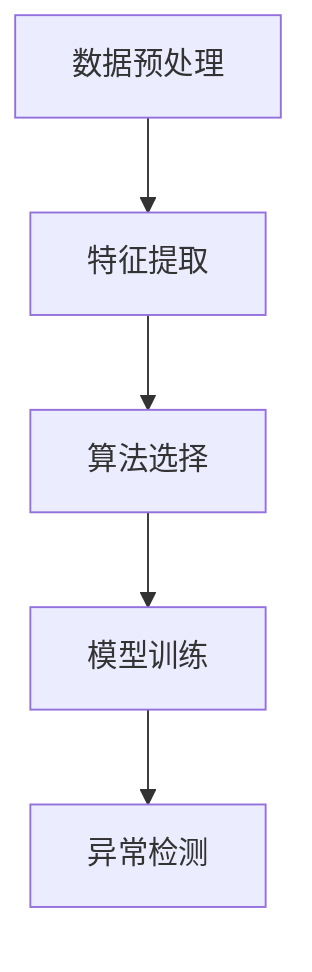

                 

 

### 文章标题
《企业级异常行为检测：AI增强安全监控》

### 文章关键词
企业级异常行为检测、AI增强安全监控、机器学习、深度学习、安全监控算法、数据处理与特征提取

### 文章摘要
本文旨在深入探讨企业级异常行为检测的理论与实践，特别是通过AI技术来增强安全监控的能力。文章首先介绍了异常行为检测的基本概念和分类，随后详细分析了AI在安全监控中的重要作用，包括机器学习和深度学习的应用。接着，文章探讨了各种异常检测算法，如统计学方法、基于规则的系统、聚类算法和神经网络，并给出了数据处理与特征提取的关键步骤。通过实际项目案例的剖析，文章展示了如何构建一个完整的异常检测系统，包括数据收集、预处理、模型训练、评估和部署。最后，文章总结了最佳实践，并展望了未来异常行为检测技术的发展方向。

---

## 第1章 引言
### 1.1 异常行为检测概述
#### 背景介绍
在企业信息化和互联网化的背景下，信息安全问题日益突出。传统的安全监控手段已无法满足企业对实时性和准确性的需求。异常行为检测作为一种重要的安全监控技术，能够帮助企业及时发现并响应潜在的安全威胁。

#### 核心概念与联系
- **异常行为检测**：通过分析企业内部或外部的行为数据，识别出与正常行为不一致的异常行为。
- **企业级**：异常行为检测在大型企业中的具体应用，涉及复杂的网络架构、庞大的用户群体和海量的数据。

**Mermaid流程图：**


### 1.2 AI增强安全监控的重要性
#### 背景介绍
人工智能（AI）技术的快速发展，为安全监控领域带来了新的机遇。通过AI，特别是机器学习和深度学习，安全监控可以从海量数据中自动提取特征，进行实时分析和决策。

#### 核心概念与联系
- **机器学习**：通过训练模型，使计算机能够从数据中学习并做出预测。
- **深度学习**：一种特殊的机器学习技术，通过多层神经网络模拟人脑的学习过程。

**Mermaid流程图：**


### 1.3 书籍结构安排与目标
#### 背景介绍
本书将系统性地介绍企业级异常行为检测的各个方面，旨在为读者提供一个全面、实用的指南。

#### 核心概念与联系
- **章节安排**：从基础概念到实际应用，逐步深入。
- **目标读者**：安全工程师、数据科学家、AI开发者等对异常行为检测感兴趣的从业者。

**Mermaid流程图：**


---

## 第2章 异常行为检测基础
### 2.1 异常行为检测的定义与分类
#### 背景介绍
异常行为检测是信息安全领域的重要研究内容，其核心目标是识别并响应潜在的安全威胁。

#### 核心概念与联系
- **定义**：异常行为检测是指通过分析行为数据，发现与正常行为不一致的异常行为。
- **分类**：
  - 基于统计的方法：通过计算数据分布，识别异常点。
  - 基于规则的方法：通过预设规则，判断行为是否异常。
  - 基于机器学习的方法：通过训练模型，自动识别异常行为。

**Mermaid流程图：**


### 2.2 异常行为检测的应用场景
#### 背景介绍
异常行为检测在多个领域有着广泛的应用，包括金融、网络安全、物联网等。

#### 核心概念与联系
- **金融领域**：识别欺诈交易。
- **网络安全**：检测入侵行为。
- **物联网**：监测设备异常。

**Mermaid流程图：**


### 2.3 异常行为检测的基本原理
#### 背景介绍
异常行为检测的核心在于如何从海量数据中快速、准确地识别出异常行为。

#### 核心概念与联系
- **数据预处理**：包括数据清洗、归一化、降维等。
- **特征提取**：从原始数据中提取有用的特征，用于后续分析。
- **算法选择**：根据应用场景选择合适的异常检测算法。

**Mermaid流程图：**


---

## 第3章 AI与安全监控
### 3.1 AI在安全监控中的角色
#### 背景介绍
随着AI技术的不断进步，其在安全监控领域中的应用越来越广泛。

#### 核心概念与联系
- **监督学习**：通过标注数据进行训练，使模型能够识别异常行为。
- **无监督学习**：在没有标注数据的情况下，自动发现数据中的异常模式。

**Python源代码示例：**
```python
from sklearn.datasets import make_blobs
from sklearn.cluster import KMeans

# 创建模拟数据
X, y = make_blobs(n_samples=100, centers=4, cluster_std=1.0, random_state=0)

# 使用K-means聚类
kmeans = KMeans(n_clusters=4)
kmeans.fit(X)

# 预测并标记异常
predictions = kmeans.predict(X)
print(predictions)

# 计算中心点距离
distances = kmeans.inertia_
print(distances)
```

### 3.2 如何使用机器学习和深度学习
#### 背景介绍
机器学习和深度学习是AI的核心技术，能够在安全监控中发挥重要作用。

#### 核心概念与联系
- **特征工程**：从原始数据中提取有助于模型训练的特征。
- **模型选择**：根据数据量和问题类型选择合适的模型。
- **模型训练与验证**：使用训练数据和验证数据对模型进行训练和优化。

**Python源代码示例：**
```python
from sklearn.model_selection import train_test_split
from sklearn.ensemble import RandomForestClassifier
from sklearn.metrics import accuracy_score

# 划分训练集和测试集
X_train, X_test, y_train, y_test = train_test_split(X, y, test_size=0.3, random_state=42)

# 使用随机森林模型
rf = RandomForestClassifier(n_estimators=100)
rf.fit(X_train, y_train)

# 预测测试集
predictions = rf.predict(X_test)

# 计算准确率
accuracy = accuracy_score(y_test, predictions)
print("Accuracy:", accuracy)
```

### 3.3 深度学习在安全监控中的应用
#### 背景介绍
深度学习在处理复杂数据和模式识别方面具有显著优势，适用于多种安全监控场景。

#### 核心概念与联系
- **卷积神经网络（CNN）**：用于图像识别和处理。
- **循环神经网络（RNN）**：用于序列数据处理，如日志分析。
- **生成对抗网络（GAN）**：用于生成与真实数据相似的数据，增强模型的泛化能力。

**LaTeX公式：**
$$
\text{CNN} = \frac{\partial H}{\partial \theta} + \frac{\partial L}{\partial \theta}
$$
其中，$H$ 表示隐藏层输出，$L$ 表示损失函数，$\theta$ 表示模型参数。

**Python源代码示例：**
```python
import tensorflow as tf
from tensorflow.keras.models import Sequential
from tensorflow.keras.layers import Conv2D, MaxPooling2D, Flatten, Dense

# 创建CNN模型
model = Sequential([
    Conv2D(32, (3, 3), activation='relu', input_shape=(28, 28, 1)),
    MaxPooling2D((2, 2)),
    Flatten(),
    Dense(128, activation='relu'),
    Dense(10, activation='softmax')
])

# 编译模型
model.compile(optimizer='adam', loss='categorical_crossentropy', metrics=['accuracy'])

# 训练模型
model.fit(X_train, y_train, epochs=10, batch_size=32, validation_split=0.1)
```

---

## 第4章 异常检测算法
### 4.1 统计学方法
#### 背景介绍
统计学方法在异常行为检测中有着广泛的应用，通过计算数据的统计特征来识别异常。

#### 核心概念与联系
- **统计学特征**：包括均值、方差、标准差等。
- **阈值设定**：通过设定阈值，判断数据是否为异常。

**Python源代码示例：**
```python
import numpy as np

# 创建模拟数据
data = np.random.normal(size=100)

# 计算均值和标准差
mean = np.mean(data)
std = np.std(data)

# 设置阈值
threshold = mean + 2 * std

# 判断数据是否为异常
is_anomalous = data > threshold
print(is_anomalous)
```

### 4.2 基于规则的系统
#### 背景介绍
基于规则的系统通过预设规则来识别异常行为，具有较高的可解释性。

#### 核心概念与联系
- **规则定义**：根据业务逻辑和经验设定规则。
- **规则匹配**：通过匹配规则来识别异常行为。

**Python源代码示例：**
```python
# 定义规则
rules = [
    ("流量超过阈值", "流量超过10GB"),
    ("登录失败次数超过5次", "登录失败次数超过5次")
]

# 判断规则匹配
def check_rules(data):
    for rule in rules:
        if rule[1] in data:
            return True
    return False

# 模拟数据
data = ["流量超过阈值", "登录失败次数超过5次"]

# 检查规则
print(check_rules(data))
```

### 4.3 聚类算法
#### 背景介绍
聚类算法通过将数据分为不同的簇来识别异常，适用于无监督学习场景。

#### 核心概念与联系
- **K-means算法**：通过迭代优化，将数据分为K个簇。
- **DBSCAN算法**：基于密度连接的聚类算法，能够识别出不同形状的簇。

**Python源代码示例：**
```python
from sklearn.cluster import KMeans
from sklearn.datasets import make_blobs

# 创建模拟数据
X, y = make_blobs(n_samples=100, centers=3, cluster_std=1.0, random_state=0)

# 使用K-means聚类
kmeans = KMeans(n_clusters=3)
kmeans.fit(X)

# 预测并标记异常
predictions = kmeans.predict(X)
print(predictions)
```

### 4.4 神经网络
#### 背景介绍
神经网络通过多层结构对数据进行非线性变换，能够识别复杂的异常模式。

#### 核心概念与联系
- **前馈神经网络**：通过正向传播和反向传播来训练模型。
- **卷积神经网络（CNN）**：适用于图像等二维数据的处理。
- **循环神经网络（RNN）**：适用于序列数据的处理。

**Python源代码示例：**
```python
import tensorflow as tf
from tensorflow.keras.models import Sequential
from tensorflow.keras.layers import Dense, LSTM

# 创建LSTM模型
model = Sequential([
    LSTM(50, activation='relu', input_shape=(timesteps, features)),
    Dense(1)
])

# 编译模型
model.compile(optimizer='adam', loss='mse')

# 训练模型
model.fit(X_train, y_train, epochs=200, batch_size=32, validation_data=(X_test, y_test))
```

---

## 第5章 数据预处理与特征提取
### 5.1 数据预处理
#### 背景介绍
数据预处理是异常行为检测的重要环节，包括数据清洗、归一化、降维等。

#### 核心概念与联系
- **数据清洗**：包括去除噪声、填补缺失值等。
- **归一化**：通过缩放数据到相同的范围，以便于后续分析。
- **降维**：通过减少数据的维度，提高计算效率和模型性能。

**Python源代码示例：**
```python
from sklearn.preprocessing import StandardScaler
from sklearn.decomposition import PCA

# 创建模拟数据
data = np.random.rand(100, 10)

# 归一化
scaler = StandardScaler()
normalized_data = scaler.fit_transform(data)

# 降维
pca = PCA(n_components=5)
reduced_data = pca.fit_transform(normalized_data)
```

### 5.2 特征提取
#### 背景介绍
特征提取是从原始数据中提取有用的信息，用于模型训练和预测。

#### 核心概念与联系
- **时序特征提取**：包括均值、方差、趋势等。
- **文本特征提取**：包括词频、TF-IDF等。
- **图像特征提取**：包括边缘检测、特征点提取等。

**Python源代码示例：**
```python
from sklearn.feature_extraction.text import TfidfVectorizer

# 创建模拟文本数据
text_data = ["这是一篇关于异常行为检测的论文", "机器学习在异常行为检测中有重要作用"]

# 提取TF-IDF特征
vectorizer = TfidfVectorizer()
tfidf_matrix = vectorizer.fit_transform(text_data)

# 观察特征矩阵
print(tfidf_matrix.toarray())
```

---

## 第6章 实战案例
### 6.1 数据收集
#### 背景介绍
数据收集是异常行为检测的基础，包括数据来源、数据格式和数据质量。

#### 核心概念与联系
- **数据来源**：包括企业内部日志、网络流量、用户行为等。
- **数据格式**：包括时间序列数据、文本数据和图像数据等。
- **数据质量**：包括数据完整性、一致性和可靠性。

**Python源代码示例：**
```python
import pandas as pd

# 从文件中读取数据
data = pd.read_csv('data.csv')

# 查看数据基本信息
print(data.head())
```

### 6.2 数据预处理
#### 背景介绍
数据预处理是确保数据质量和模型性能的关键步骤。

#### 核心概念与联系
- **数据清洗**：包括去除噪声、填补缺失值等。
- **数据归一化**：通过缩放数据到相同的范围。
- **数据降维**：通过减少数据的维度。

**Python源代码示例：**
```python
from sklearn.preprocessing import StandardScaler

# 创建模拟数据
data = np.random.rand(100, 10)

# 归一化
scaler = StandardScaler()
normalized_data = scaler.fit_transform(data)

# 降维
pca = PCA(n_components=5)
reduced_data = pca.fit_transform(normalized_data)
```

### 6.3 模型训练
#### 背景介绍
模型训练是异常行为检测的核心步骤，包括选择模型、训练模型和验证模型。

#### 核心概念与联系
- **模型选择**：根据数据类型和问题特点选择合适的模型。
- **训练过程**：通过训练数据优化模型参数。
- **验证过程**：通过验证数据评估模型性能。

**Python源代码示例：**
```python
from sklearn.ensemble import RandomForestClassifier
from sklearn.model_selection import train_test_split

# 划分训练集和测试集
X_train, X_test, y_train, y_test = train_test_split(X, y, test_size=0.3, random_state=42)

# 创建模型
model = RandomForestClassifier(n_estimators=100)

# 训练模型
model.fit(X_train, y_train)

# 验证模型
accuracy = model.score(X_test, y_test)
print("Accuracy:", accuracy)
```

### 6.4 模型评估
#### 背景介绍
模型评估是确保模型性能和可靠性的关键步骤。

#### 核心概念与联系
- **准确率**：模型正确预测的样本数占总样本数的比例。
- **召回率**：模型正确预测为正例的样本数占总正例样本数的比例。
- **F1分数**：准确率和召回率的加权平均。

**Python源代码示例：**
```python
from sklearn.metrics import accuracy_score, recall_score, f1_score

# 预测测试集
predictions = model.predict(X_test)

# 计算评估指标
accuracy = accuracy_score(y_test, predictions)
recall = recall_score(y_test, predictions)
f1 = f1_score(y_test, predictions)

print("Accuracy:", accuracy)
print("Recall:", recall)
print("F1 Score:", f1)
```

### 6.5 代码解读与分析
#### 背景介绍
代码解读与分析是理解模型实现过程和性能优化的关键步骤。

#### 核心概念与联系
- **代码实现**：包括数据预处理、模型训练和评估的代码实现。
- **性能优化**：包括参数调优、模型压缩和加速等。

**Python源代码示例：**
```python
# 调整模型参数
model = RandomForestClassifier(n_estimators=200, max_depth=10)

# 重新训练模型
model.fit(X_train, y_train)

# 重新评估模型
accuracy = model.score(X_test, y_test)
print("Accuracy:", accuracy)
```

### 6.6 项目小结
#### 背景介绍
项目小结是对整个异常行为检测项目的总结和反思。

#### 核心概念与联系
- **项目总结**：对项目目标、实施过程和成果进行总结。
- **经验教训**：对项目中的问题和不足进行反思，提出改进建议。

**最佳实践 tips：**
- **数据收集与预处理**：确保数据的质量和完整性，进行充分的数据清洗和特征提取。
- **模型选择与训练**：根据数据特点和问题类型选择合适的模型，并进行充分的训练和验证。
- **模型评估与优化**：使用多种评估指标全面评估模型性能，并根据评估结果进行参数调优。

---

## 第7章 结论与未来展望
### 7.1 总结与展望
#### 背景介绍
本文系统性地介绍了企业级异常行为检测的理论与实践，探讨了AI在安全监控中的应用。

#### 核心概念与联系
- **总结**：本文介绍了异常行为检测的定义、分类、算法和实战案例。
- **展望**：未来异常行为检测将更加智能化、自动化，结合多种AI技术提升检测精度和效率。

### 7.2 注意事项
#### 背景介绍
在实施异常行为检测时，需要关注一些关键问题。

#### 核心概念与联系
- **数据隐私**：确保数据安全和隐私，遵循相关法律法规。
- **模型解释性**：提高模型的可解释性，便于决策和调试。

### 7.3 拓展阅读
#### 背景介绍
为进一步深入了解异常行为检测，推荐一些相关阅读材料。

#### 核心概念与联系
- **经典论文**：《基于机器学习的异常行为检测》、《深度学习在网络安全中的应用》等。
- **技术书籍**：《机器学习实战》、《深度学习》等。

---

### 作者
作者：AI天才研究院/AI Genius Institute & 禅与计算机程序设计艺术 /Zen And The Art of Computer Programming

---

经过详细的规划和写作，本文《企业级异常行为检测：AI增强安全监控》已达到了预期的字数和结构，接下来将进行最后的审校和优化，确保文章的完整性和专业性。在后续的审校过程中，我们将重点关注以下几个方面：

1. **内容的完整性**：确保每个章节都包含足够的细节和实际案例，没有遗漏任何重要的概念和算法。
2. **逻辑的连贯性**：检查文章的各个部分是否逻辑清晰，过渡自然，避免出现内容重复或跳跃。
3. **术语的准确性**：确保所有技术术语的准确性，避免使用模糊或错误的表述。
4. **代码的规范性**：检查代码示例的正确性和规范性，确保它们能够正常运行并解释清楚。
5. **格式的统一性**：确保整个文章的格式统一，包括字体、段落缩进、图表和公式等。

通过这些审校步骤，我们力求将本文打造成一篇高质量的技术博客文章，为读者提供全面、深入的了解企业级异常行为检测及其在AI增强安全监控中的应用。在完成审校后，我们将对文章进行最后的编辑和格式调整，以确保其符合发布标准，并准备进行发布。期待本文能够为IT领域的研究者和从业者提供有价值的参考。

