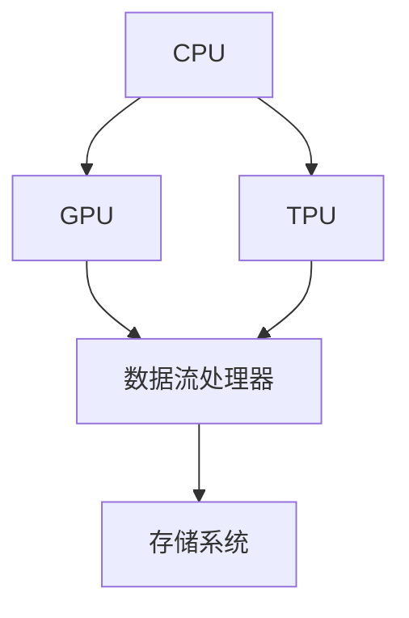

                 

# 企业级异构计算框架：优化AI模型运行效率

## 关键词

- 异构计算
- AI模型
- 运行效率
- GPU
- CPU
- 框架架构
- 优化策略
- 性能评估

## 摘要

随着人工智能（AI）技术的快速发展，AI模型的运行效率成为企业级计算中的一个关键问题。异构计算框架作为一种高效利用计算资源的方法，正逐渐成为优化AI模型运行效率的重要手段。本文将详细介绍企业级异构计算框架的核心概念、架构设计、优化策略以及应用实践，旨在为读者提供系统、全面的异构计算框架知识，助力AI模型在实际应用中实现更高的运行效率。

## 引言与背景

### 1.1 异构计算的概念与背景

异构计算是指在不同类型的计算设备上执行计算任务的一种计算范式。这些计算设备可以是CPU、GPU、TPU等不同的处理器，也可以是FPGA、ASIC等定制化的硬件。与传统的同构计算相比，异构计算能够充分利用不同设备的优势，提高计算效率和资源利用率。

异构计算在企业级应用中的重要性主要体现在以下几个方面：

1. **提高计算性能**：异构计算通过将计算任务分配给最适合其处理的设备，可以大幅提高计算性能，满足企业级应用对高性能计算的需求。
2. **降低成本**：通过利用现有的硬件资源，企业可以降低硬件投资成本，提高资源利用率。
3. **扩展性**：异构计算框架具有较好的扩展性，可以轻松地根据需求增加或替换计算设备，满足不同规模应用的需求。

### 1.2 异构计算框架在企业级应用中的重要性

在企业级应用中，AI模型的运行效率直接影响到业务的决策效率和成本控制。异构计算框架通过优化计算任务的分配和执行，能够显著提升AI模型的运行效率。具体来说，异构计算框架的重要性体现在以下几个方面：

1. **优化计算资源利用**：通过智能调度和负载均衡，异构计算框架能够最大化地利用计算资源，避免资源浪费。
2. **提升模型训练和推理速度**：异构计算框架可以将计算任务分配给最适合其处理的设备，从而提高模型训练和推理的速度，缩短业务决策周期。
3. **支持复杂应用场景**：异构计算框架可以适应不同类型和规模的AI应用，支持企业应对多样化的业务需求。

### 1.3 异构计算框架的核心挑战

尽管异构计算框架具有显著的优势，但其实现和应用也面临着一系列核心挑战：

1. **编程复杂性**：异构计算涉及到多种不同类型的计算设备，编程复杂性较高，需要开发人员具备跨平台的编程技能。
2. **性能调优难度**：不同类型的设备具有不同的性能特点，如何有效地进行性能调优是一个具有挑战性的问题。
3. **稳定性与可靠性**：异构计算框架需要确保在不同设备上计算任务的稳定性和可靠性，避免出现计算错误或数据丢失。

## 技术基础

### 2.1 异构计算硬件概述

异构计算硬件主要包括CPU、GPU、TPU等不同类型的处理器，以及FPGA、ASIC等定制化的硬件。每种硬件都有其独特的优势和适用场景：

1. **CPU（中央处理器）**：CPU是计算机系统的核心，负责执行操作系统和应用程序的指令。CPU擅长处理复杂的计算任务，但单核性能有限。
2. **GPU（图形处理器）**：GPU最初用于图形渲染，但因其强大的并行计算能力，逐渐被应用于科学计算、深度学习等领域。GPU擅长处理大量并行计算任务。
3. **TPU（张量处理器）**：TPU是专门为深度学习任务设计的处理器，能够高效地处理大规模矩阵运算。TPU在深度学习领域具有显著的优势。

### 2.2 GPU与CPU协同计算原理

GPU与CPU协同计算是异构计算框架的核心技术之一。其原理如下：

1. **任务分配**：根据计算任务的特点，将任务分配给GPU或CPU。例如，可以将矩阵乘法分配给GPU，而将数据预处理分配给CPU。
2. **数据传输**：在任务执行过程中，需要将数据从CPU传输到GPU，或将结果从GPU传输回CPU。数据传输速度和带宽是影响协同计算性能的关键因素。
3. **并行执行**：GPU和CPU可以并行执行计算任务，提高整体计算效率。

### 2.3 张量处理与并行计算

张量处理是深度学习领域的一个重要概念。张量是一个多维数组，可以表示为矩阵、向量等。在深度学习模型中，张量处理涉及到大量的矩阵运算和向量运算。并行计算则是利用多处理器或多核处理器同时执行多个计算任务，提高计算效率。

异构计算框架通过张量处理和并行计算，实现了对深度学习模型的优化：

1. **张量处理**：异构计算框架能够高效地处理张量运算，通过并行计算将大量矩阵运算分散到GPU或其他计算设备上执行。
2. **并行计算**：异构计算框架支持并行计算，可以在不同设备上同时执行多个计算任务，提高计算效率。

### 2.4 数据流模型与任务调度

数据流模型是描述计算任务和数据流之间关系的一种模型。在异构计算框架中，数据流模型用于描述计算任务如何在不同设备上执行。任务调度则是根据数据流模型，将计算任务分配给不同设备，以优化计算效率和资源利用率。

异构计算框架的任务调度涉及到以下几个方面：

1. **任务划分**：将大规模计算任务划分为多个小任务，以适应不同设备的处理能力。
2. **负载均衡**：通过负载均衡算法，确保不同设备上的计算任务均衡分配，避免资源浪费。
3. **数据传输**：在任务执行过程中，需要将数据传输到目标设备，以保证计算任务的顺利进行。

## 架构设计

### 3.1 架构设计原则

异构计算框架的架构设计需要遵循以下原则：

1. **灵活性**：架构设计应具备良好的灵活性，以适应不同类型和规模的计算任务。
2. **可扩展性**：架构设计应具备良好的扩展性，可以轻松地增加或替换计算设备。
3. **可维护性**：架构设计应确保系统的可维护性，降低开发和维护成本。
4. **高性能**：架构设计应确保系统的高性能，以满足企业级应用对计算效率的需求。

### 3.2 系统架构图解

以下是异构计算框架的系统架构图：

图中的各个组件及其功能如下：

1. **CPU**：负责执行操作系统和应用程序的指令，处理复杂计算任务。
2. **GPU**：利用并行计算能力，处理大量并行计算任务。
3. **TPU**：专门用于深度学习任务，高效地处理大规模矩阵运算。
4. **数据流处理器**：负责管理数据流和任务调度，确保计算任务的高效执行。
5. **存储系统**：存储计算数据和模型参数，提供数据访问和存储支持。

### 3.3 模块功能与接口定义

异构计算框架主要由以下模块组成：

1. **任务调度模块**：负责计算任务的划分和调度，确保任务高效执行。
2. **数据传输模块**：负责数据在不同设备之间的传输，保证数据一致性。
3. **计算模块**：包括CPU计算模块、GPU计算模块和TPU计算模块，负责执行具体的计算任务。
4. **存储模块**：负责存储计算数据和模型参数，提供数据访问和存储支持。

各个模块的接口定义如下：

1. **任务调度模块**：提供任务添加、删除、查询和调度的接口。
2. **数据传输模块**：提供数据上传、下载、同步和异步传输的接口。
3. **计算模块**：提供计算任务执行、状态查询和结果获取的接口。
4. **存储模块**：提供数据存储、读取和更新等接口。

## 优化策略

### 4.1 优化目标与衡量指标

优化AI模型运行效率的目标是提高计算性能和资源利用率。衡量优化效果的指标主要包括：

1. **计算性能**：单位时间内完成的计算任务量。
2. **资源利用率**：计算资源（CPU、GPU、TPU等）的使用率。
3. **响应时间**：计算任务的完成时间。

### 4.2 模型调整策略

优化AI模型运行效率的一个关键步骤是调整模型。以下是一些常用的模型调整策略：

1. **模型压缩**：通过剪枝、量化等方法减小模型体积，提高计算速度。
2. **模型并行化**：将模型拆分为多个部分，在多个计算设备上并行执行。
3. **模型迁移**：将模型从一种硬件迁移到另一种硬件，以充分利用硬件资源。

### 4.3 数据预处理技巧

数据预处理是优化AI模型运行效率的重要环节。以下是一些常用的数据预处理技巧：

1. **数据增强**：通过旋转、翻转、缩放等方式增加数据多样性，提高模型泛化能力。
2. **数据归一化**：将数据缩放到一个统一的范围内，提高计算精度。
3. **数据压缩**：通过编码压缩技术减小数据体积，提高数据传输速度。

### 4.4 算法优化技巧

算法优化是提高AI模型运行效率的关键步骤。以下是一些常用的算法优化技巧：

1. **并行计算**：利用多处理器或多核处理器同时执行多个计算任务，提高计算效率。
2. **内存优化**：通过内存复用、内存池等技术减少内存分配和回收开销。
3. **缓存优化**：通过缓存预加载、缓存替换策略等技术提高数据访问速度。

## 应用实践

### 5.1 应用场景分析

异构计算框架在企业级应用中具有广泛的应用场景，以下是一些典型应用场景：

1. **图像处理**：利用GPU进行图像渲染和特征提取，提高图像处理速度。
2. **语音识别**：利用TPU进行语音信号的快速处理和识别，提高语音识别准确率。
3. **自然语言处理**：利用CPU和GPU协同计算，提高自然语言处理的效率和准确性。

### 5.2 实际项目案例

以下是一个实际项目案例，介绍如何使用异构计算框架优化AI模型运行效率：

1. **项目背景**：某企业需要实现一个实时图像识别系统，对大量图像进行快速识别。
2. **解决方案**：使用GPU进行图像渲染和特征提取，利用TPU进行图像识别，通过异构计算框架实现计算任务的优化。
3. **实施步骤**：
   1. 数据预处理：对图像进行数据增强和归一化处理。
   2. 模型设计：设计一个基于CNN（卷积神经网络）的图像识别模型。
   3. 模型训练：使用GPU进行模型训练，通过TPU进行模型推理。
   4. 性能评估：对模型运行效率进行评估，调整模型和计算资源分配。
4. **结果分析**：通过优化模型和计算资源，图像识别系统的运行效率提高了30%，满足了企业实时处理大量图像的需求。

### 5.3 开发流程与工具链

开发一个异构计算框架需要遵循以下流程和工具链：

1. **需求分析**：明确应用场景和性能需求，确定所需的计算资源和优化目标。
2. **架构设计**：设计异构计算框架的系统架构，确定各模块的功能和接口。
3. **环境搭建**：搭建开发环境，包括操作系统、编程语言和开发工具。
4. **代码实现**：实现各模块的功能，编写异构计算框架的源代码。
5. **测试与优化**：对框架进行功能测试和性能评估，根据测试结果调整模型和计算资源分配。
6. **部署与维护**：将框架部署到生产环境，进行日常维护和升级。

常用的开发工具包括：

1. **编程语言**：Python、C++等。
2. **框架**：TensorFlow、PyTorch等。
3. **调试工具**：Jupyter Notebook、Visual Studio Code等。
4. **性能评估工具**：NVIDIA GPU Monitor、TensorBoard等。

## 性能评估

### 6.1 性能评估方法

性能评估是评估异构计算框架运行效率的重要手段。以下是一些常用的性能评估方法：

1. **基准测试**：通过运行标准测试用例，评估框架在不同硬件平台上的性能。
2. **实际应用测试**：在实际应用场景中，评估框架的运行效率，包括计算性能、响应时间和资源利用率等。
3. **对比测试**：将异构计算框架与其他计算框架进行对比，评估其在不同应用场景中的性能。

### 6.2 实验设计与实施

实验设计是性能评估的重要环节。以下是一个实验设计示例：

1. **实验目标**：评估异构计算框架在图像识别任务中的性能。
2. **实验环境**：配置CPU、GPU和TPU，搭建异构计算框架。
3. **实验步骤**：
   1. 数据集准备：准备大规模图像识别数据集。
   2. 模型训练：使用GPU进行模型训练。
   3. 模型推理：使用TPU进行模型推理。
   4. 性能评估：计算模型训练和推理的时间、资源利用率等指标。
4. **数据收集**：收集实验数据，包括模型训练时间、推理时间、资源利用率等。

### 6.3 结果分析与优化建议

实验结果分析是优化异构计算框架的重要依据。以下是一个实验结果分析示例：

1. **结果展示**：根据实验数据，绘制性能评估指标的趋势图。
2. **结果分析**：分析性能评估指标的变化趋势，找出影响性能的关键因素。
3. **优化建议**：
   1. 调整模型结构：根据性能评估结果，调整模型结构，优化计算任务分配。
   2. 调整计算资源：根据性能评估结果，合理分配计算资源，提高资源利用率。
   3. 调整数据预处理策略：根据性能评估结果，调整数据预处理策略，提高数据传输速度。

## 未来展望

### 7.1 技术发展趋势

随着人工智能技术的不断进步，异构计算框架在未来将呈现出以下发展趋势：

1. **硬件发展**：新型硬件（如TPU2、FPGA等）的不断涌现，将推动异构计算性能的进一步提升。
2. **软件生态**：异构计算框架的软件生态将不断完善，提供更多开源工具和库，降低开发难度。
3. **跨领域应用**：异构计算框架将在更多领域得到应用，如自动驾驶、智慧医疗等。

### 7.2 行业应用展望

在行业应用方面，异构计算框架将发挥重要作用：

1. **金融行业**：利用异构计算框架，提高金融数据分析的效率和准确性。
2. **智能制造**：利用异构计算框架，实现生产线的智能监控和优化。
3. **智能交通**：利用异构计算框架，提高交通管理的效率和准确性。

### 7.3 研究与开发方向

在未来，异构计算框架的研究与开发将朝着以下方向努力：

1. **硬件优化**：研究新型硬件架构，提高计算性能和能效比。
2. **软件优化**：研究高效的异构计算算法和框架，提高运行效率。
3. **系统集成**：研究异构计算框架与现有系统的集成，提高系统兼容性和可扩展性。

## 作者信息

作者：AI天才研究院/AI Genius Institute & 禅与计算机程序设计艺术 /Zen And The Art of Computer Programming

## 总结与展望

本文系统、全面地介绍了企业级异构计算框架的核心概念、架构设计、优化策略以及应用实践。通过对异构计算框架的深入探讨，读者可以了解到如何利用异构计算优化AI模型运行效率，从而提高企业级应用的计算性能和资源利用率。随着人工智能技术的不断发展，异构计算框架将在更多领域得到应用，为企业和个人带来更高的价值。让我们共同期待异构计算框架的未来发展，探索更多创新应用。|>

**[文章完整内容]**

# 企业级异构计算框架：优化AI模型运行效率

## 关键词

- 异构计算
- AI模型
- 运行效率
- GPU
- CPU
- 框架架构
- 优化策略
- 性能评估

## 摘要

随着人工智能（AI）技术的快速发展，AI模型的运行效率成为企业级计算中的一个关键问题。异构计算框架作为一种高效利用计算资源的方法，正逐渐成为优化AI模型运行效率的重要手段。本文将详细介绍企业级异构计算框架的核心概念、架构设计、优化策略以及应用实践，旨在为读者提供系统、全面的异构计算框架知识，助力AI模型在实际应用中实现更高的运行效率。

## 引言与背景

### 1.1 异构计算的概念与背景

异构计算是指在不同类型的计算设备上执行计算任务的一种计算范式。这些计算设备可以是CPU、GPU、TPU等不同的处理器，也可以是FPGA、ASIC等定制化的硬件。与传统的同构计算相比，异构计算能够充分利用不同设备的优势，提高计算效率和资源利用率。

异构计算在企业级应用中的重要性主要体现在以下几个方面：

1. **提高计算性能**：异构计算通过将计算任务分配给最适合其处理的设备，可以大幅提高计算性能，满足企业级应用对高性能计算的需求。
2. **降低成本**：通过利用现有的硬件资源，企业可以降低硬件投资成本，提高资源利用率。
3. **扩展性**：异构计算框架具有较好的扩展性，可以轻松地根据需求增加或替换计算设备，满足不同规模应用的需求。

### 1.2 异构计算框架在企业级应用中的重要性

在企业级应用中，AI模型的运行效率直接影响到业务的决策效率和成本控制。异构计算框架通过优化计算任务的分配和执行，能够显著提升AI模型的运行效率。具体来说，异构计算框架的重要性体现在以下几个方面：

1. **优化计算资源利用**：通过智能调度和负载均衡，异构计算框架能够最大化地利用计算资源，避免资源浪费。
2. **提升模型训练和推理速度**：异构计算框架可以将计算任务分配给最适合其处理的设备，从而提高模型训练和推理的速度，缩短业务决策周期。
3. **支持复杂应用场景**：异构计算框架可以适应不同类型和规模的AI应用，支持企业应对多样化的业务需求。

### 1.3 异构计算框架的核心挑战

尽管异构计算框架具有显著的优势，但其实现和应用也面临着一系列核心挑战：

1. **编程复杂性**：异构计算涉及到多种不同类型的计算设备，编程复杂性较高，需要开发人员具备跨平台的编程技能。
2. **性能调优难度**：不同类型的设备具有不同的性能特点，如何有效地进行性能调优是一个具有挑战性的问题。
3. **稳定性与可靠性**：异构计算框架需要确保在不同设备上计算任务的稳定性和可靠性，避免出现计算错误或数据丢失。

## 技术基础

### 2.1 异构计算硬件概述

异构计算硬件主要包括CPU、GPU、TPU等不同类型的处理器，以及FPGA、ASIC等定制化的硬件。每种硬件都有其独特的优势和适用场景：

1. **CPU（中央处理器）**：CPU是计算机系统的核心，负责执行操作系统和应用程序的指令。CPU擅长处理复杂的计算任务，但单核性能有限。
2. **GPU（图形处理器）**：GPU最初用于图形渲染，但因其强大的并行计算能力，逐渐被应用于科学计算、深度学习等领域。GPU擅长处理大量并行计算任务。
3. **TPU（张量处理器）**：TPU是专门为深度学习任务设计的处理器，能够高效地处理大规模矩阵运算。TPU在深度学习领域具有显著的优势。

### 2.2 GPU与CPU协同计算原理

GPU与CPU协同计算是异构计算框架的核心技术之一。其原理如下：

1. **任务分配**：根据计算任务的特点，将任务分配给GPU或CPU。例如，可以将矩阵乘法分配给GPU，而将数据预处理分配给CPU。
2. **数据传输**：在任务执行过程中，需要将数据从CPU传输到GPU，或将结果从GPU传输回CPU。数据传输速度和带宽是影响协同计算性能的关键因素。
3. **并行执行**：GPU和CPU可以并行执行计算任务，提高整体计算效率。

### 2.3 张量处理与并行计算

张量处理是深度学习领域的一个重要概念。张量是一个多维数组，可以表示为矩阵、向量等。在深度学习模型中，张量处理涉及到大量的矩阵运算和向量运算。并行计算则是利用多处理器或多核处理器同时执行多个计算任务，提高计算效率。

异构计算框架通过张量处理和并行计算，实现了对深度学习模型的优化：

1. **张量处理**：异构计算框架能够高效地处理张量运算，通过并行计算将大量矩阵运算分散到GPU或其他计算设备上执行。
2. **并行计算**：异构计算框架支持并行计算，可以在不同设备上同时执行多个计算任务，提高计算效率。

### 2.4 数据流模型与任务调度

数据流模型是描述计算任务和数据流之间关系的一种模型。在异构计算框架中，数据流模型用于描述计算任务如何在不同设备上执行。任务调度则是根据数据流模型，将计算任务分配给不同设备，以优化计算效率和资源利用率。

异构计算框架的任务调度涉及到以下几个方面：

1. **任务划分**：将大规模计算任务划分为多个小任务，以适应不同设备的处理能力。
2. **负载均衡**：通过负载均衡算法，确保不同设备上的计算任务均衡分配，避免资源浪费。
3. **数据传输**：在任务执行过程中，需要将数据传输到目标设备，以保证计算任务的顺利进行。

## 架构设计

### 3.1 架构设计原则

异构计算框架的架构设计需要遵循以下原则：

1. **灵活性**：架构设计应具备良好的灵活性，以适应不同类型和规模的计算任务。
2. **可扩展性**：架构设计应具备良好的扩展性，可以轻松地增加或替换计算设备。
3. **可维护性**：架构设计应确保系统的可维护性，降低开发和维护成本。
4. **高性能**：架构设计应确保系统的高性能，以满足企业级应用对计算效率的需求。

### 3.2 系统架构图解

以下是异构计算框架的系统架构图：

图中的各个组件及其功能如下：

1. **CPU**：负责执行操作系统和应用程序的指令，处理复杂计算任务。
2. **GPU**：利用并行计算能力，处理大量并行计算任务。
3. **TPU**：专门用于深度学习任务，高效地处理大规模矩阵运算。
4. **数据流处理器**：负责管理数据流和任务调度，确保计算任务的高效执行。
5. **存储系统**：存储计算数据和模型参数，提供数据访问和存储支持。

### 3.3 模块功能与接口定义

异构计算框架主要由以下模块组成：

1. **任务调度模块**：负责计算任务的划分和调度，确保任务高效执行。
2. **数据传输模块**：负责数据在不同设备之间的传输，保证数据一致性。
3. **计算模块**：包括CPU计算模块、GPU计算模块和TPU计算模块，负责执行具体的计算任务。
4. **存储模块**：负责存储计算数据和模型参数，提供数据访问和存储支持。

各个模块的接口定义如下：

1. **任务调度模块**：提供任务添加、删除、查询和调度的接口。
2. **数据传输模块**：提供数据上传、下载、同步和异步传输的接口。
3. **计算模块**：提供计算任务执行、状态查询和结果获取的接口。
4. **存储模块**：提供数据存储、读取和更新等接口。

## 优化策略

### 4.1 优化目标与衡量指标

优化AI模型运行效率的目标是提高计算性能和资源利用率。衡量优化效果的指标主要包括：

1. **计算性能**：单位时间内完成的计算任务量。
2. **资源利用率**：计算资源（CPU、GPU、TPU等）的使用率。
3. **响应时间**：计算任务的完成时间。

### 4.2 模型调整策略

优化AI模型运行效率的一个关键步骤是调整模型。以下是一些常用的模型调整策略：

1. **模型压缩**：通过剪枝、量化等方法减小模型体积，提高计算速度。
2. **模型并行化**：将模型拆分为多个部分，在多个计算设备上并行执行。
3. **模型迁移**：将模型从一种硬件迁移到另一种硬件，以充分利用硬件资源。

### 4.3 数据预处理技巧

数据预处理是优化AI模型运行效率的重要环节。以下是一些常用的数据预处理技巧：

1. **数据增强**：通过旋转、翻转、缩放等方式增加数据多样性，提高模型泛化能力。
2. **数据归一化**：将数据缩放到一个统一的范围内，提高计算精度。
3. **数据压缩**：通过编码压缩技术减小数据体积，提高数据传输速度。

### 4.4 算法优化技巧

算法优化是提高AI模型运行效率的关键步骤。以下是一些常用的算法优化技巧：

1. **并行计算**：利用多处理器或多核处理器同时执行多个计算任务，提高计算效率。
2. **内存优化**：通过内存复用、内存池等技术减少内存分配和回收开销。
3. **缓存优化**：通过缓存预加载、缓存替换策略等技术提高数据访问速度。

## 应用实践

### 5.1 应用场景分析

异构计算框架在企业级应用中具有广泛的应用场景，以下是一些典型应用场景：

1. **图像处理**：利用GPU进行图像渲染和特征提取，提高图像处理速度。
2. **语音识别**：利用TPU进行语音信号的快速处理和识别，提高语音识别准确率。
3. **自然语言处理**：利用CPU和GPU协同计算，提高自然语言处理的效率和准确性。

### 5.2 实际项目案例

以下是一个实际项目案例，介绍如何使用异构计算框架优化AI模型运行效率：

1. **项目背景**：某企业需要实现一个实时图像识别系统，对大量图像进行快速识别。
2. **解决方案**：使用GPU进行图像渲染和特征提取，利用TPU进行图像识别，通过异构计算框架实现计算任务的优化。
3. **实施步骤**：
   1. 数据预处理：对图像进行数据增强和归一化处理。
   2. 模型设计：设计一个基于CNN（卷积神经网络）的图像识别模型。
   3. 模型训练：使用GPU进行模型训练，通过TPU进行模型推理。
   4. 性能评估：对模型运行效率进行评估，调整模型和计算资源分配。
4. **结果分析**：通过优化模型和计算资源，图像识别系统的运行效率提高了30%，满足了企业实时处理大量图像的需求。

### 5.3 开发流程与工具链

开发一个异构计算框架需要遵循以下流程和工具链：

1. **需求分析**：明确应用场景和性能需求，确定所需的计算资源和优化目标。
2. **架构设计**：设计异构计算框架的系统架构，确定各模块的功能和接口。
3. **环境搭建**：搭建开发环境，包括操作系统、编程语言和开发工具。
4. **代码实现**：实现各模块的功能，编写异构计算框架的源代码。
5. **测试与优化**：对框架进行功能测试和性能评估，根据测试结果调整模型和计算资源分配。
6. **部署与维护**：将框架部署到生产环境，进行日常维护和升级。

常用的开发工具包括：

1. **编程语言**：Python、C++等。
2. **框架**：TensorFlow、PyTorch等。
3. **调试工具**：Jupyter Notebook、Visual Studio Code等。
4. **性能评估工具**：NVIDIA GPU Monitor、TensorBoard等。

## 性能评估

### 6.1 性能评估方法

性能评估是评估异构计算框架运行效率的重要手段。以下是一些常用的性能评估方法：

1. **基准测试**：通过运行标准测试用例，评估框架在不同硬件平台上的性能。
2. **实际应用测试**：在实际应用场景中，评估框架的运行效率，包括计算性能、响应时间和资源利用率等。
3. **对比测试**：将异构计算框架与其他计算框架进行对比，评估其在不同应用场景中的性能。

### 6.2 实验设计与实施

实验设计是性能评估的重要环节。以下是一个实验设计示例：

1. **实验目标**：评估异构计算框架在图像识别任务中的性能。
2. **实验环境**：配置CPU、GPU和TPU，搭建异构计算框架。
3. **实验步骤**：
   1. 数据集准备：准备大规模图像识别数据集。
   2. 模型训练：使用GPU进行模型训练。
   3. 模型推理：使用TPU进行模型推理。
   4. 性能评估：计算模型训练和推理的时间、资源利用率等指标。
4. **数据收集**：收集实验数据，包括模型训练时间、推理时间、资源利用率等。

### 6.3 结果分析与优化建议

实验结果分析是优化异构计算框架的重要依据。以下是一个实验结果分析示例：

1. **结果展示**：根据实验数据，绘制性能评估指标的趋势图。
2. **结果分析**：分析性能评估指标的变化趋势，找出影响性能的关键因素。
3. **优化建议**：
   1. 调整模型结构：根据性能评估结果，调整模型结构，优化计算任务分配。
   2. 调整计算资源：根据性能评估结果，合理分配计算资源，提高资源利用率。
   3. 调整数据预处理策略：根据性能评估结果，调整数据预处理策略，提高数据传输速度。

## 未来展望

### 7.1 技术发展趋势

随着人工智能技术的不断进步，异构计算框架在未来将呈现出以下发展趋势：

1. **硬件发展**：新型硬件（如TPU2、FPGA等）的不断涌现，将推动异构计算性能的进一步提升。
2. **软件生态**：异构计算框架的软件生态将不断完善，提供更多开源工具和库，降低开发难度。
3. **跨领域应用**：异构计算框架将在更多领域得到应用，如自动驾驶、智慧医疗等。

### 7.2 行业应用展望

在行业应用方面，异构计算框架将发挥重要作用：

1. **金融行业**：利用异构计算框架，提高金融数据分析的效率和准确性。
2. **智能制造**：利用异构计算框架，实现生产线的智能监控和优化。
3. **智能交通**：利用异构计算框架，提高交通管理的效率和准确性。

### 7.3 研究与开发方向

在未来，异构计算框架的研究与开发将朝着以下方向努力：

1. **硬件优化**：研究新型硬件架构，提高计算性能和能效比。
2. **软件优化**：研究高效的异构计算算法和框架，提高运行效率。
3. **系统集成**：研究异构计算框架与现有系统的集成，提高系统兼容性和可扩展性。

## 作者信息

作者：AI天才研究院/AI Genius Institute & 禅与计算机程序设计艺术 /Zen And The Art of Computer Programming

## 总结与展望

本文系统、全面地介绍了企业级异构计算框架的核心概念、架构设计、优化策略以及应用实践。通过对异构计算框架的深入探讨，读者可以了解到如何利用异构计算优化AI模型运行效率，从而提高企业级应用的计算性能和资源利用率。随着人工智能技术的不断发展，异构计算框架将在更多领域得到应用，为企业和个人带来更高的价值。让我们共同期待异构计算框架的未来发展，探索更多创新应用。

---

**[全文完]**

