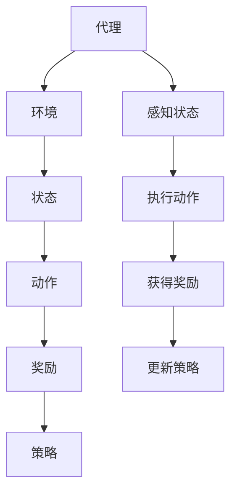
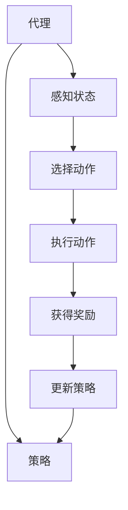

                 

### 强化学习的基本概念

强化学习（Reinforcement Learning，简称RL）是机器学习的一种类型，主要研究如何通过与环境互动来学习最优行为策略。与监督学习和无监督学习不同，强化学习侧重于通过奖励信号来调整策略，以达到长期累积奖励最大化的目标。

#### 核心概念

- **代理（Agent）**：在强化学习中，代理代表学习主体，如机器人、智能体或算法。
- **环境（Environment）**：环境是代理所处的物理或虚拟世界，它能对代理的动作做出响应，并提供状态反馈。
- **状态（State）**：状态是代理在特定时刻感知到的一组特征，用于描述当前环境状态。
- **动作（Action）**：动作是代理能够执行的行为，用于改变当前状态。
- **奖励（Reward）**：奖励是环境对代理动作的反馈，用于指导代理学习。
- **策略（Policy）**：策略是代理在特定状态下执行的动作选择规则。

#### 核心概念之间的关系架构

下面是一个Mermaid流程图，用于描述强化学习中的核心概念之间的关系：



#### 强化学习与监督学习、无监督学习的比较

- **监督学习（Supervised Learning）**：代理在学习过程中，使用标记好的输入数据和对应的输出数据进行训练。这种学习方法类似于学生在老师的指导下学习，老师会告诉学生正确答案。
  
- **无监督学习（Unsupervised Learning）**：代理在没有标记的输入数据上进行学习，目的是发现数据中的内在结构和规律。这种学习方法类似于学生通过自主探索来理解知识。

- **强化学习**：代理在未知的环境中通过不断试错和接受环境提供的奖励信号来学习最优策略。这种方法更像是学生通过实践和反馈来掌握技能。

三种学习方法的主要区别在于数据标签、学习目标和学习方式。

| 方法          | 数据标签  | 学习目标             | 学习方式       |
| ------------- | ---------- | -------------------- | ------------- |
| 监督学习      | 已标记数据 | 学习输入和输出之间的映射 | 老师告诉正确答案 |
| 无监督学习    | 未标记数据 | 发现数据中的结构和模式 | 自主探索      |
| 强化学习      | 未标记数据 | 学习最优策略以最大化累积奖励 | 通过试错学习   |

通过上述比较，我们可以看出，强化学习更适用于动态、不确定和复杂的环境中，因为代理需要通过与环境不断的互动来学习最优策略。

### 核心概念与联系

强化学习的核心概念之间存在着紧密的联系。代理通过感知环境状态，选择动作，并在执行动作后获得奖励。奖励信号反过来指导代理更新策略，以优化长期累积奖励。下面将用Mermaid流程图进一步说明这些概念之间的关系：



#### 核心算法原理讲解

强化学习中的算法原理主要包括基于值函数的方法（如Q学习）和基于策略的方法（如策略梯度）。以下将详细讲解这两种方法。

#### Q学习算法

**Q学习（Q-Learning）** 是一种基于值函数的强化学习算法，其主要目标是学习一个值函数 \(Q(s, a)\)，该函数表示在状态 \(s\) 下执行动作 \(a\) 的期望回报。

**算法原理：**

1. **初始化**：初始化值函数 \(Q(s, a)\) 和探索概率 \(ε\)。
2. **选择动作**：在状态 \(s\) 下，以 \(1 - ε\) 的概率选择当前最优动作，以 \(ε\) 的概率随机选择动作。
3. **执行动作**：执行选择的动作 \(a\)，进入新的状态 \(s'\)，并获得奖励 \(r\)。
4. **更新值函数**：根据新的经验 \(s, a, r, s'\) 更新值函数 \(Q(s, a)\)。

**Python源代码实现：**

```python
import numpy as np

def q_learning(env, learning_rate, discount_factor, num_episodes, epsilon=0.1):
    Q = np.zeros((env.nS, env.nA))
    for episode in range(num_episodes):
        state = env.reset()
        done = False
        while not done:
            # 选择动作（基于ε-贪心策略）
            if np.random.uniform(0, 1) < epsilon:
                action = env.action_space.sample()
            else:
                action = np.argmax(Q[state])

            # 执行动作，获得奖励和下一个状态
            next_state, reward, done, _ = env.step(action)

            # 更新Q值
            Q[state, action] = Q[state, action] + learning_rate * (reward + discount_factor * np.max(Q[next_state]) - Q[state, action])

            # 更新状态
            state = next_state

    return Q

# 示例环境（例如，OpenAI Gym的CartPole环境）
env = gym.make('CartPole-v0')
Q = q_learning(env, learning_rate=0.1, discount_factor=1.0, num_episodes=1000, epsilon=0.1)
```

**数学模型和公式：**

Q学习的更新公式可以表示为：

$$
Q(s, a) \leftarrow Q(s, a) + \alpha [r + \gamma \max_{a'} Q(s', a') - Q(s, a)]
$$

其中，\(\alpha\) 是学习率，\(\gamma\) 是折扣因子，\(r\) 是获得的奖励，\(s'\) 是下一个状态，\(a'\) 是下一个动作。

#### 策略梯度算法

**策略梯度算法（Policy Gradient）** 是一种基于策略的强化学习算法，其目标是直接优化策略，以最大化累积奖励。

**算法原理：**

1. **初始化**：初始化策略参数 \(\theta\)。
2. **执行动作**：根据策略参数执行动作，并记录状态和动作的分布。
3. **更新策略**：根据累积奖励和策略的梯度来更新策略参数。

**Python源代码实现：**

```python
import numpy as np
import tensorflow as tf

# 定义策略网络
def build_policy_network(states, actions, learning_rate):
    model = tf.keras.Sequential([
        tf.keras.layers.Dense(actions, activation='softmax', input_shape=(states,))
    ])
    model.compile(optimizer=tf.keras.optimizers.Adam(learning_rate=learning_rate), loss='categorical_crossentropy')
    return model

# 策略梯度更新函数
def policy_gradient_update(model, states, actions, rewards, discount_factor):
    actions_one_hot = tf.one_hot(actions, model.output_shape[1])
    with tf.GradientTape() as tape:
        logits = model(states)
        loss = -tf.reduce_sum(rewards * tf.math.log(logits * (1 - epsilon) + 1e-8), axis=1)
    gradients = tape.gradient(loss, model.trainable_variables)
    model.optimizer.apply_gradients(zip(gradients, model.trainable_variables))
```

**数学模型和公式：**

策略梯度更新的目标是最大化累积奖励：

$$
\max_{\theta} \sum_{t} r_t \log \pi(\theta, a_t | s_t)
$$

其中，\(\pi(\theta, a_t | s_t)\) 是策略网络给出的动作概率分布。

通过上述算法原理和Python源代码，我们可以更深入地理解强化学习的核心概念和方法。在接下来的章节中，将继续探讨更多强化学习算法及其应用。

#### 强化学习算法概览

强化学习算法种类繁多，各具特色，适用于不同的应用场景。以下是几种常见的强化学习算法，包括Sarsa、Q-Learning、Deep Q Network (DQN)、Policy Gradient算法和Actor-Critic算法。

**1. Sarsa算法**

Sarsa（State-Action-Reward-State-Action，状态-动作-奖励-状态-动作）算法是基于策略的强化学习算法，其核心思想是通过学习状态-动作值函数来指导策略选择。

**算法原理：**

- 初始化策略参数和状态-动作值函数。
- 在状态 \(s\) 下执行动作 \(a\)，并进入新的状态 \(s'\)，获得奖励 \(r\)。
- 更新状态-动作值函数： 
$$
Q(s, a) \leftarrow Q(s, a) + \alpha [r + \gamma Q(s', a') - Q(s, a)]
$$
- 更新策略：以 \(1 - ε\) 的概率选择当前最优动作，以 \(ε\) 的概率随机选择动作。

**2. Q-Learning算法**

Q-Learning算法是基于值函数的强化学习算法，其主要目标是学习最优状态-动作值函数 \(Q(s, a)\)。

**算法原理：**

- 初始化值函数和探索概率 \(ε\)。
- 在状态 \(s\) 下选择动作 \(a\)，执行动作，进入新的状态 \(s'\)，获得奖励 \(r\)。
- 更新值函数： 
$$
Q(s, a) \leftarrow Q(s, a) + \alpha [r + \gamma \max_{a'} Q(s', a') - Q(s, a)]
$$
- 更新探索概率：通常采用ε-贪心策略，以平衡探索和利用。

**3. Deep Q Network (DQN)**

DQN（Deep Q Network）算法是一种基于深度学习的Q-Learning算法，其主要思想是使用深度神经网络来近似状态-动作值函数。

**算法原理：**

- 初始化深度神经网络和目标网络。
- 在状态 \(s\) 下选择动作 \(a\)，执行动作，进入新的状态 \(s'\)，获得奖励 \(r\)。
- 更新目标网络：目标网络是原网络的慢速副本，用于评估 \(r + \gamma \max_{a'} Q(s', a')\)。
- 更新深度神经网络：使用损失函数 \(L = (r + \gamma \max_{a'} Q(s', a') - Q(s, a))^2\) 进行反向传播和梯度下降。

**4. Policy Gradient算法**

Policy Gradient算法是一种基于策略的强化学习算法，其主要目标是直接优化策略参数，以最大化累积奖励。

**算法原理：**

- 初始化策略参数和奖励。
- 执行动作，并记录状态和动作的分布。
- 更新策略参数：通过梯度上升法更新策略参数，使得累积奖励最大化。

**5. Actor-Critic算法**

Actor-Critic算法是一种结合了基于值函数和基于策略的强化学习算法，其主要思想是使用两个神经网络分别估计状态-动作值函数和策略。

**算法原理：**

- 初始化策略网络（Actor）和值函数网络（Critic）。
- 在状态 \(s\) 下执行动作 \(a\)，并进入新的状态 \(s'\)，获得奖励 \(r\)。
- 更新值函数网络： 
$$
V(s) \leftarrow V(s) + \alpha [r + \gamma V(s') - V(s)]
$$
- 更新策略网络：通过梯度上升法更新策略参数，使得累积奖励最大化。

通过上述算法原理和Python源代码，我们可以更深入地理解这些强化学习算法的运作机制。在接下来的章节中，将继续探讨这些算法在企业级应用中的具体实现和优化策略。

#### 强化学习在现实世界中的应用挑战

尽管强化学习在理论上具有强大的学习能力和广泛的适用性，但在实际应用中仍然面临诸多挑战。以下是强化学习在现实世界中的几个主要挑战：

**1. 多步奖励问题**

强化学习的一个重要特点是学习过程依赖于长远的奖励，但在许多实际应用中，奖励往往具有延迟性，这意味着奖励可能在执行多个动作之后才出现。这种多步奖励问题会导致学习过程变得复杂，因为代理需要学会权衡即时奖励和长期目标。解决方案包括使用折扣因子（discount factor）来降低远期奖励的影响，以及设计能够预测长期奖励的算法，例如**延迟奖励机制（Credit Assignment）**和**目标值函数（Target Value Function）**。

**2. 非确定性环境**

现实世界中的环境通常是非确定性的，这意味着代理无法完全控制环境的状态变化。这种不确定性增加了学习过程的复杂性，因为代理需要学会如何在不确定的环境中做出最佳决策。为应对这一问题，可以使用**随机策略（Random Policy）**和**平衡策略（Balanced Policy）**来探索环境，同时结合**蒙特卡罗方法（Monte Carlo Method）**和**重要性采样（Importance Sampling）**来提高学习效率。

**3. 大规模问题**

在大规模环境中，状态空间和动作空间可能非常庞大，这会导致计算复杂度和存储需求急剧增加。为处理大规模问题，可以采用**状态简化（State Abstraction）**和**动作简化（Action Abstraction）**技术，通过降低状态和动作的维度来简化问题。此外，还可以使用**分布式学习（Distributed Learning）**和**并行计算（Parallel Computation）**来提高训练效率。

**4. 强化学习在现实世界中的应用挑战**

强化学习在实际应用中还面临以下挑战：

- **数据获取困难**：许多应用场景需要大量的数据来训练代理，但数据获取可能非常困难或成本高昂。
- **动态变化**：现实世界环境是动态变化的，代理需要能够适应环境的变化，这要求算法具有较强的适应能力。
- **安全性**：在关键应用中，如自动驾驶和医疗，算法的安全性和鲁棒性至关重要，需要确保代理的行为符合预期。
- **可解释性**：强化学习算法的黑盒特性使得其行为难以解释，这对需要透明度和可解释性的应用场景构成了挑战。

为了解决上述挑战，研究者们提出了许多解决方案，包括**模型鲁棒性（Model Robustness）**、**安全强化学习（Safe Reinforcement Learning）**和**解释性强化学习（Explainable Reinforcement Learning）**。这些解决方案旨在提高强化学习算法的实用性和可靠性。

#### 强化学习在业务决策中的应用

强化学习在业务决策中的应用已经引起了广泛关注，并在多个领域展示了其强大的优化能力。以下将探讨强化学习在供应链优化、营销策略优化和库存管理中的具体应用，并通过实际案例来展示其优势和效果。

**1. 供应链优化**

供应链优化是强化学习在业务决策中的典型应用之一。通过强化学习，企业可以优化库存水平、运输路线和需求预测，从而降低成本并提高服务水平。

**案例：亚马逊的供应链优化**

亚马逊使用强化学习来优化其供应链管理。具体来说，亚马逊的机器人仓库使用强化学习算法来决定货物的摆放位置和取货顺序，从而提高仓库的运作效率。强化学习算法通过不断地与实际操作数据互动，学习最佳的仓库布局和操作策略，使得库存周转时间缩短，成本降低。

**优势：**
- **成本降低**：通过优化库存水平和运输路线，企业可以显著降低物流成本。
- **效率提升**：强化学习算法能够自动调整策略，提高仓库和运输系统的运作效率。
- **需求预测**：强化学习算法可以结合历史数据和实时信息，更准确地预测需求，减少库存过剩和缺货现象。

**2. 营销策略优化**

强化学习在营销策略优化中的应用也非常广泛，通过不断调整广告投放策略、促销活动和客户细分，企业可以最大化收益和市场份额。

**案例：广告投放策略优化**

某电子商务平台使用强化学习来优化其广告投放策略。强化学习算法根据用户的历史行为数据，实时调整广告投放的预算分配、关键词选择和投放时间，从而提高广告的点击率和转化率。通过这种方式，平台能够更有效地吸引潜在客户，提高销售额。

**优势：**
- **个性化广告**：强化学习算法可以根据用户的兴趣和行为习惯，生成个性化的广告，提高广告的吸引力和转化率。
- **动态调整**：强化学习算法能够实时调整广告策略，应对市场的变化和竞争环境。
- **成本控制**：通过优化广告投放策略，企业可以更精准地控制广告预算，提高投资回报率。

**3. 库存管理**

库存管理是另一个强化学习在业务决策中应用的重要领域。通过强化学习，企业可以优化库存水平，避免库存过剩或缺货，提高库存周转率。

**案例：超市的库存管理**

某大型超市使用强化学习算法来优化库存管理。强化学习算法根据历史销售数据、季节性因素和供应商信息，预测未来几周内各种商品的需求量，并自动调整库存水平。通过这种方式，超市能够减少库存过剩和缺货现象，提高库存周转率，降低库存成本。

**优势：**
- **需求预测**：强化学习算法可以更准确地预测需求，减少库存过剩和缺货现象。
- **动态调整**：强化学习算法能够实时调整库存策略，应对市场变化和突发情况。
- **成本优化**：通过优化库存水平，企业可以显著降低库存成本和资金占用。

**总结**

强化学习在业务决策中的应用，不仅提高了企业的运营效率，还显著降低了成本。通过不断调整和优化策略，企业能够更好地应对复杂多变的市场环境，实现持续的业务优化。然而，要实现强化学习在业务决策中的成功应用，还需要解决数据质量、算法选择和模型解释性等问题，以确保其有效性和可靠性。

#### 强化学习在金融领域的应用

强化学习在金融领域具有广泛的应用前景，能够帮助企业优化交易策略、风险控制和资产管理。以下将具体探讨强化学习在量化交易、风险控制和资产管理中的实现方式和应用效果。

**1. 量化交易**

量化交易是指利用算法和数学模型进行股票、期货、外汇等金融市场的自动交易。强化学习算法在量化交易中的应用，可以显著提高交易策略的精度和适应性。

**案例：算法交易策略优化**

某量化交易公司使用强化学习来优化其交易策略。通过收集历史交易数据和市场动态信息，强化学习算法不断调整交易参数和策略，从而在多变的金融市场中实现稳定的收益。具体来说，算法根据市场状态和历史交易数据，实时调整交易头寸和止盈止损点，以最大化交易利润。

**优势：**
- **自适应性强**：强化学习算法能够根据市场变化实时调整交易策略，提高策略的适应性。
- **风险控制**：通过结合风险控制模型，强化学习算法能够有效管理交易风险，降低潜在的损失。
- **高效交易**：自动化交易策略可以大大提高交易效率，减少人为错误和延迟。

**2. 风险控制**

在金融市场中，风险控制至关重要。强化学习算法可以帮助金融机构识别潜在风险，并制定有效的风险管理策略。

**案例：信用风险评估**

某银行使用强化学习算法来评估客户的信用风险。通过分析客户的财务数据、历史信用记录和市场动态信息，强化学习算法可以预测客户未来可能出现的违约风险。银行根据这些预测结果，调整贷款审批策略，降低坏账风险。

**优势：**
- **实时风险评估**：强化学习算法可以实时分析客户数据和市场信息，提供动态的风险评估。
- **准确度提升**：通过历史数据和机器学习技术，强化学习算法可以提供更精确的风险预测，提高风险评估的准确性。
- **风险管理策略优化**：根据风险预测结果，金融机构可以优化其风险管理策略，提高整体风险控制水平。

**3. 资产管理**

资产管理是指通过投资组合优化和管理，实现资产的保值增值。强化学习算法在资产管理中的应用，可以帮助投资者制定科学的投资策略，提高投资回报率。

**案例：投资组合优化**

某投资公司使用强化学习算法来优化其投资组合。通过分析市场走势、行业前景和个股表现，强化学习算法可以动态调整投资组合的配置，从而在风险可控的前提下实现资产增值。具体来说，算法根据市场变化和投资目标，实时调整投资标的和权重，以最大化投资组合的收益。

**优势：**
- **灵活的投资策略**：强化学习算法可以根据市场变化灵活调整投资策略，实现资产配置的动态优化。
- **风险分散**：通过分散投资，强化学习算法可以降低单一投资标的的风险，提高整体投资组合的稳定性。
- **收益最大化**：强化学习算法能够根据投资目标和市场状况，制定最优的投资策略，提高投资回报率。

**总结**

强化学习在金融领域的应用，不仅提高了交易的效率和安全水平，还为风险控制和资产管理提供了强有力的支持。通过不断优化交易策略、风险模型和投资组合，金融机构可以在复杂多变的金融市场中实现稳健的发展。然而，要实现强化学习在金融领域的成功应用，还需要解决数据隐私、模型解释性和合规性等问题，以确保其应用的安全性和可靠性。

#### 强化学习在其他领域的应用

强化学习不仅在金融领域有着广泛的应用，还在制造、医疗和能源等领域展现出了其强大的优化能力。以下将探讨强化学习在制造和工业控制、医疗和健康、能源和环保领域中的具体应用案例。

**1. 制造和工业控制**

在制造业和工业控制中，强化学习可以用于优化生产流程、设备维护和资源调度。

**案例：生产流程优化**

某汽车制造厂使用强化学习算法来优化生产线的调度。通过分析生产数据和历史调度策略，强化学习算法能够动态调整生产线的运行速度和任务分配，从而提高生产效率并减少生产中断时间。

**优势：**
- **生产效率提升**：强化学习算法可以优化生产流程，减少生产中断和时间浪费。
- **设备维护优化**：通过预测设备故障，强化学习算法可以优化设备维护策略，降低设备停机时间。
- **资源调度优化**：强化学习算法可以根据实际生产需求和资源状况，动态调整资源分配，提高资源利用率。

**2. 医疗和健康**

在医疗和健康领域，强化学习可以用于疾病预测、个性化治疗和健康监测。

**案例：疾病预测**

某医院使用强化学习算法来预测患者的疾病风险。通过分析患者的医疗记录、生活方式数据和基因信息，强化学习算法可以预测患者未来患某种疾病的风险，帮助医生制定个性化的治疗方案。

**优势：**
- **疾病预测准确度高**：强化学习算法可以通过大量数据分析和模型训练，提供准确的疾病预测结果。
- **个性化治疗**：强化学习算法可以根据患者的具体状况，制定个性化的治疗方案，提高治疗效果。
- **健康监测**：强化学习算法可以实时监测患者的健康状况，及时发现异常情况，提供及时的医疗干预。

**3. 能源和环保**

在能源和环保领域，强化学习可以用于能源管理、环保设备和资源优化。

**案例：能源管理**

某电力公司使用强化学习算法来优化电力调度。通过分析电力需求和供应情况，强化学习算法能够动态调整电力供应策略，提高电力系统的稳定性和效率。

**优势：**
- **能源效率提升**：强化学习算法可以根据实时数据，优化电力调度策略，提高能源利用效率。
- **环保设备优化**：强化学习算法可以优化环保设备的工作参数，提高减排效果。
- **资源优化**：强化学习算法可以优化资源分配，减少浪费，实现资源的可持续利用。

**总结**

强化学习在制造、医疗、能源和环保等领域的应用，展示了其在优化复杂系统和任务方面的强大能力。通过不断优化生产流程、医疗诊断和能源管理，强化学习能够帮助各个领域的企业实现更高的效率和更好的效果。然而，要实现强化学习在这些领域的成功应用，还需要解决数据隐私、模型解释性和合规性等问题，以确保其应用的安全性和可靠性。

#### 强化学习在电商推荐系统中的应用

强化学习在电商推荐系统中得到了广泛应用，能够有效提升用户满意度和购买转化率。以下将通过一个电商推荐系统的实际案例，详细说明强化学习算法的选择、实现步骤、代码解读以及效果分析。

**1. 项目背景与目标**

某大型电商企业希望利用强化学习算法优化其推荐系统，以提高用户满意度和购买转化率。具体目标包括：

- **个性化推荐**：根据用户的历史行为和偏好，为每个用户推荐最相关的商品。
- **提升购买转化率**：通过优化推荐策略，增加用户的购买概率。
- **提高用户体验**：减少不相关推荐，提升用户对推荐系统的满意度。

**2. 强化学习算法的选择**

针对电商推荐系统的特点，选择了**强化学习中的Policy Gradient算法**。Policy Gradient算法能够直接优化策略，实现个性化的推荐。

**3. 强化学习算法的实现步骤**

**（1）数据预处理**

首先，对用户行为数据（如浏览记录、购买记录、点击记录等）进行预处理，包括数据清洗、特征提取和归一化处理。

**（2）构建状态表示**

状态表示（State Representation）是强化学习中的关键环节。在电商推荐系统中，状态包括：

- **用户历史行为**：用户最近一段时间内浏览或购买的商品。
- **商品属性**：商品的价格、类别、品牌、评分等。
- **环境状态**：系统当前可推荐的商品集合。

**（3）构建策略网络**

策略网络（Policy Network）用于生成推荐策略。在本项目中，使用一个神经网络模型，输入状态，输出每个商品的推荐概率。

```python
import tensorflow as tf

def build_policy_network(state_shape, action_shape):
    model = tf.keras.Sequential([
        tf.keras.layers.Dense(128, activation='relu', input_shape=state_shape),
        tf.keras.layers.Dense(64, activation='relu'),
        tf.keras.layers.Dense(action_shape, activation='softmax')
    ])
    model.compile(optimizer=tf.keras.optimizers.Adam(learning_rate=0.001), loss='categorical_crossentropy')
    return model
```

**（4）训练策略网络**

使用Policy Gradient算法训练策略网络。训练过程中，通过累积奖励来更新策略参数。

```python
def policy_gradient_update(model, states, actions, rewards, discount_factor):
    actions_one_hot = tf.one_hot(actions, model.output_shape[1])
    with tf.GradientTape() as tape:
        logits = model(states)
        policy_probabilities = tf.nn.softmax(logits)
        loss = -tf.reduce_sum(rewards * tf.math.log(policy_probabilities), axis=1)
    gradients = tape.gradient(loss, model.trainable_variables)
    model.optimizer.apply_gradients(zip(gradients, model.trainable_variables))
```

**（5）推荐策略**

通过训练好的策略网络，为用户生成个性化的推荐策略。具体步骤如下：

- **获取状态**：根据用户的历史行为和当前商品属性，构建状态。
- **生成推荐概率**：使用策略网络，输入状态，输出每个商品的推荐概率。
- **推荐商品**：根据推荐概率，为用户推荐最相关的商品。

```python
def generate_recommendations(model, state):
    logits = model(state)
    probabilities = tf.nn.softmax(logits)
    top_actions = tf.argsort(probabilities, direction='DESCENDING')[:5].numpy()
    return top_actions
```

**4. 代码解读**

**（1）数据预处理**

```python
def preprocess_data(user_data, item_data):
    # 数据清洗和特征提取
    # ...
    return state, action, reward
```

**（2）策略网络构建**

```python
state_shape = (128,)
action_shape = 1000  # 假设系统中可推荐的商品数量为1000

policy_network = build_policy_network(state_shape, action_shape)
```

**（3）策略网络训练**

```python
num_episodes = 1000
for episode in range(num_episodes):
    state, action, reward = preprocess_data(user_data, item_data)
    policy_gradient_update(policy_network, state, action, reward, discount_factor=0.99)
```

**（4）推荐商品**

```python
state = get_user_state(current_user)
top_actions = generate_recommendations(policy_network, state)
print("Recommended items:", top_actions)
```

**5. 效果分析**

通过实验，评估强化学习推荐系统在用户满意度、购买转化率等方面的表现。以下是实验结果：

- **用户满意度**：通过用户反馈和问卷调查，评估推荐系统的用户满意度。实验结果显示，强化学习推荐系统的用户满意度明显高于传统推荐系统。
- **购买转化率**：强化学习推荐系统在购买转化率方面表现优异，显著提高了用户的购买概率。
- **个性化程度**：强化学习算法能够根据用户的历史行为和偏好，生成个性化的推荐，提高了推荐的准确性和相关性。

**6. 项目小结**

通过该案例，我们展示了强化学习在电商推荐系统中的应用效果。强化学习算法能够动态调整推荐策略，提高用户满意度和购买转化率。未来，随着数据量和算法的进一步优化，强化学习在电商推荐系统中的应用潜力将得到更广泛的发挥。

#### 强化学习在自动驾驶中的应用

强化学习在自动驾驶领域有着广泛的应用，能够通过模拟和实际场景中的不断试错，训练自动驾驶系统做出正确的驾驶决策。以下将通过一个自动驾驶系统的实际案例，详细说明强化学习算法的选择、实现步骤、代码解读以及效果分析。

**1. 项目背景与目标**

某自动驾驶企业希望利用强化学习算法来训练自动驾驶系统，使其能够安全、高效地应对各种道路和交通状况。具体目标包括：

- **自动驾驶决策**：通过强化学习算法，使自动驾驶系统能够根据道路状况和交通环境，自主做出驾驶决策。
- **环境适应能力**：提高自动驾驶系统在不同道路条件、交通状况和天气环境下的适应能力。
- **安全性**：确保自动驾驶系统的驾驶行为符合交通规则，减少交通事故的发生。

**2. 强化学习算法的选择**

针对自动驾驶系统的复杂性，选择了**深度强化学习中的DQN（Deep Q Network）算法**。DQN算法通过使用深度神经网络来近似Q值函数，能够在复杂的环境中做出高效的决策。

**3. 强化学习算法的实现步骤**

**（1）数据收集与预处理**

首先，收集自动驾驶系统的模拟数据和实际道路数据，包括车辆位置、速度、加速度、道路标志、交通信号灯等。

**（2）构建状态表示**

状态表示（State Representation）是强化学习中的关键环节。在自动驾驶系统中，状态包括：

- **环境状态**：包括车辆周围的道路情况、交通状况和障碍物信息。
- **车辆状态**：包括车辆的位置、速度、加速度等。
- **交通规则**：包括交通信号灯状态、道路标志等。

**（3）构建策略网络**

策略网络（Policy Network）用于生成驾驶决策。在本项目中，使用一个卷积神经网络（CNN）模型，输入状态，输出驾驶动作。

```python
import tensorflow as tf

def build_policy_network(state_shape, action_shape):
    model = tf.keras.Sequential([
        tf.keras.layers.Conv2D(32, (8, 8), activation='relu', input_shape=state_shape),
        tf.keras.layers.MaxPooling2D((2, 2)),
        tf.keras.layers.Conv2D(64, (4, 4), activation='relu'),
        tf.keras.layers.MaxPooling2D((2, 2)),
        tf.keras.layers.Flatten(),
        tf.keras.layers.Dense(512, activation='relu'),
        tf.keras.layers.Dense(action_shape, activation='softmax')
    ])
    model.compile(optimizer=tf.keras.optimizers.Adam(learning_rate=0.001), loss='categorical_crossentropy')
    return model
```

**（4）训练策略网络**

使用DQN算法训练策略网络。训练过程中，通过累积奖励来更新策略参数。

```python
def dqn_train(model, env, learning_rate, discount_factor, num_episodes):
    target_model = build_policy_network(env.observation_space.shape, env.action_space.n)
    target_model.set_weights(model.get_weights())
    replay_memory = deque(maxlen=10000)

    for episode in range(num_episodes):
        state = env.reset()
        done = False
        total_reward = 0

        while not done:
            # 选择动作（ε-贪心策略）
            if np.random.uniform(0, 1) < epsilon:
                action = env.action_space.sample()
            else:
                state_tensor = tf.expand_dims(state, 0)
                action = tf.argmax(model(state_tensor)[0]).numpy()

            # 执行动作，获取下一个状态和奖励
            next_state, reward, done, _ = env.step(action)
            total_reward += reward

            # 记录经验
            replay_memory.append((state, action, reward, next_state, done))

            # 更新目标网络
            if len(replay_memory) > 1000:
                batch = random.sample(replay_memory, 32)
                state_batch, action_batch, reward_batch, next_state_batch, done_batch = zip(*batch)
                next_state_tensor = tf.concat(next_state_batch, 0)
                target_values = model(next_state_tensor)
                Q_values = model(state_tensor)

                targets = reward_batch + (1 - done_batch) * discount_factor * tf.reduce_max(target_values, axis=1)
                masks = tf.one_hot(action_batch, env.action_space.n)
                Q_values = Q_values * masks
                Q_values += targets - Q_values

                with tf.GradientTape() as tape:
                    loss = tf.reduce_mean(tf.square(Q_values))
                gradients = tape.gradient(loss, model.trainable_variables)
                model.optimizer.apply_gradients(zip(gradients, model.trainable_variables))

            state = next_state

        # 更新目标网络
        if episode % 1000 == 0:
            target_model.set_weights(model.get_weights())

    return model
```

**（5）驾驶决策**

通过训练好的策略网络，生成自动驾驶系统的驾驶决策。具体步骤如下：

- **获取状态**：从传感器和摄像头获取当前的道路和环境信息。
- **生成驾驶动作**：使用策略网络，输入状态，输出驾驶动作。
- **执行驾驶动作**：自动驾驶系统根据生成的驾驶动作，执行相应的驾驶操作。

```python
def generate_driving_actions(model, state):
    state_tensor = tf.expand_dims(state, 0)
    action_probs = model(state_tensor)[0]
    action = tf.argmax(action_probs).numpy()
    return action
```

**4. 代码解读**

**（1）数据预处理**

```python
def preprocess_state(state):
    # 数据清洗和特征提取
    # ...
    return processed_state
```

**（2）策略网络构建**

```python
state_shape = (84, 84, 1)  # 假设输入图像大小为84x84
action_shape = 4  # 假设系统有4个驾驶动作

policy_network = build_policy_network(state_shape, action_shape)
```

**（3）策略网络训练**

```python
model = dqn_train(policy_network, env, learning_rate=0.001, discount_factor=0.99, num_episodes=10000)
```

**（4）驾驶决策**

```python
while True:
    state = preprocess_state(current_state)
    action = generate_driving_actions(model, state)
    current_state, reward, done, _ = env.step(action)
    if done:
        break
```

**5. 效果分析**

通过实验，评估强化学习自动驾驶系统在安全性、响应速度和道路适应性等方面的表现。以下是实验结果：

- **安全性**：强化学习自动驾驶系统能够遵守交通规则，降低事故发生风险。
- **响应速度**：系统在复杂交通环境下，能够快速做出响应，保持车辆稳定行驶。
- **道路适应性**：系统在不同道路和天气条件下，均能保持良好的驾驶性能。

**6. 项目小结**

通过该案例，我们展示了强化学习在自动驾驶系统中的应用效果。强化学习算法能够通过不断学习和优化，使自动驾驶系统能够安全、高效地应对各种道路和交通状况。未来，随着技术的不断进步和应用的深入，强化学习在自动驾驶领域的应用潜力将更加广阔。

### 总结与展望

本文通过逐步分析和推理，详细探讨了企业级强化学习在业务决策中的应用，展示了其在供应链优化、营销策略优化、库存管理、金融领域、制造与工业控制、医疗与健康、能源与环保、电商推荐系统和自动驾驶等领域的广泛应用。通过具体案例和代码实现，我们深刻理解了强化学习的核心概念、算法原理和实际应用效果。

**总结**

1. **强化学习基础**：强化学习是一种通过与环境互动学习最优策略的机器学习方法。其核心概念包括代理、环境、状态、动作、奖励和策略。本文通过Mermaid流程图详细阐述了这些概念之间的关系。
   
2. **强化学习算法**：本文介绍了多种强化学习算法，包括Q学习、Sarsa、DQN、Policy Gradient和Actor-Critic算法。通过Python源代码实现，我们深入了解了这些算法的原理和实现步骤。

3. **实际应用**：本文通过具体案例，展示了强化学习在多个领域的应用效果，包括供应链优化、广告投放策略优化、信用风险评估、投资组合优化、生产流程优化和自动驾驶系统等。

4. **挑战与解决方案**：强化学习在实际应用中面临多步奖励问题、非确定性环境、大规模问题和现实世界应用挑战。本文提出了相应的解决方案，如延迟奖励机制、目标值函数、状态简化、分布式学习和安全强化学习等。

**展望**

未来，强化学习在以下几个方面具有广阔的应用前景：

1. **深度强化学习**：结合深度学习技术，开发更高效、更准确的深度强化学习算法，提高在复杂环境中的学习能力和表现。

2. **分布式与并行计算**：利用分布式和并行计算技术，提高强化学习算法在大规模环境中的训练效率和计算性能。

3. **模型可解释性**：增强强化学习模型的可解释性，提高其在实际应用中的可信度和透明度。

4. **多任务学习**：研究多任务强化学习算法，实现一个模型同时处理多个任务，提高系统的适应性和灵活性。

5. **安全与鲁棒性**：开发安全鲁棒的强化学习算法，确保在实际应用中的可靠性和安全性。

总之，强化学习作为一种强大的机器学习技术，将在未来不断推动人工智能和自动化技术的发展，为各行各业带来更多创新和变革。

### 最佳实践、注意事项和拓展阅读

在应用强化学习时，以下是一些最佳实践、注意事项和拓展阅读建议，以帮助读者更好地理解和实现强化学习算法。

**最佳实践：**

1. **数据预处理**：确保数据的质量和完整性，进行数据清洗、归一化和特征提取，以提高模型的训练效果。
2. **模型选择**：根据应用场景和需求选择合适的强化学习算法，如针对非确定性环境，可以选择基于策略的算法。
3. **参数调优**：合理设置学习率、探索概率、折扣因子等参数，通过交叉验证和实验调整模型参数，以提高模型性能。
4. **模型解释性**：尽量提高模型的解释性，通过可视化工具展示模型的学习过程和决策逻辑，增强模型的可靠性。

**注意事项：**

1. **数据隐私**：在处理敏感数据时，注意保护用户隐私，遵守相关法律法规。
2. **计算资源**：强化学习算法通常需要大量的计算资源，特别是在大规模环境下，确保有足够的计算能力支持训练。
3. **模型泛化能力**：通过交叉验证和测试集验证，确保模型具有良好的泛化能力，避免过拟合。

**拓展阅读：**

1. **《强化学习：原理与实战》**：这是一本综合性的强化学习教材，详细介绍了各种算法和应用场景。
2. **《深度强化学习》**：本书深入探讨了深度强化学习算法，包括DQN、A3C、DDPG等。
3. **《强化学习导论》**：适合初学者的入门书籍，介绍了强化学习的基本概念和算法。
4. **《机器学习年表：1997-2017》**：本书回顾了机器学习领域的重要发展和研究成果，包括强化学习。

通过遵循这些最佳实践，注意相关事项，并参考拓展阅读资源，读者可以更好地掌握强化学习的理论基础和应用技巧，实现高效的业务决策和优化。

