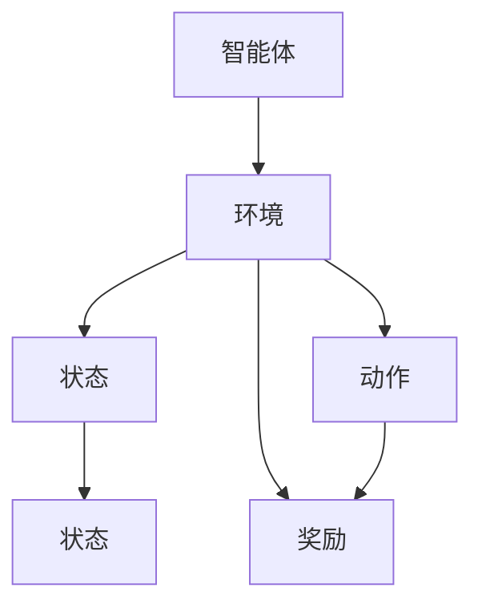

                 

## 引言

在当今快速变化的企业环境中，传统的决策模型已经难以满足企业对动态市场环境的应对需求。随着人工智能技术的不断发展，强化学习作为一种先进的学习算法，已经成为优化企业业务策略的重要工具。强化学习通过智能体在环境中采取行动、获取反馈，并通过学习优化策略，从而在复杂且动态的业务场景中实现持续优化。

本文旨在探讨企业级强化学习的应用，通过系统性地介绍强化学习的基本概念、核心算法，以及实际业务场景中的应用，帮助企业更好地理解和运用强化学习技术。具体而言，本文将涵盖以下内容：

1. 强化学习的基础理论，包括核心概念、基本算法和面临的挑战。
2. 强化学习在业务决策、供应链优化、广告投放等具体应用场景中的案例。
3. 企业级强化学习的实践指南，包括模型实现、云计算应用和金融服务应用。
4. 强化学习应用案例分析，涵盖电商平台个性化推荐、物流配送路径优化和智能客服系统。
5. 附录，包括强化学习常用算法的伪代码和项目实践指南。

通过本文的阅读，读者将能够全面了解强化学习的原理和应用，掌握在企业环境中实施和优化强化学习模型的方法，从而为企业实现持续的业务优化提供有力支持。

## 关键词

- 强化学习
- 企业业务策略
- 优化
- 人工智能
- 算法
- 应用案例
- 模型实现
- 实践指南

## 摘要

本文探讨了强化学习在企业业务策略优化中的应用。首先，介绍了强化学习的基本概念和核心算法，包括值函数方法和策略方法。然后，通过具体案例，展示了强化学习在业务决策、供应链优化和广告投放等场景中的实际应用。接着，本文提供了企业级强化学习的实践指南，包括模型实现、云计算和金融服务中的应用。最后，通过案例分析，深入探讨了强化学习在电商平台个性化推荐、物流配送路径优化和智能客服系统中的应用效果。本文旨在为企业和研究人员提供系统化的强化学习应用指导，帮助企业实现业务持续优化。

## 强化学习的基础理论

### 核心概念

强化学习是一种基于反馈的学习范式，其核心在于通过智能体（Agent）在环境中采取行动（Action），并从环境中获取反馈（Reward），以优化其策略（Policy）。在强化学习中，智能体需要不断探索环境，以寻找最优的行动策略。强化学习的三个主要元素包括：

1. **智能体（Agent）**：执行动作并接受环境反馈的实体。
2. **环境（Environment）**：智能体所处的情境，能够根据智能体的动作产生状态转换和奖励。
3. **奖励（Reward）**：环境对智能体动作的反馈，用于指导智能体采取更有利于目标实现的行动。

### 强化学习的主要元素关系架构 Mermaid 流程图



### 强化学习与监督学习、无监督学习的区别

强化学习与其他两种主要的学习范式——监督学习和无监督学习存在显著的区别：

1. **监督学习**：在监督学习中，训练数据集包含了输入特征和相应的输出标签，学习目标是找到输入特征和输出标签之间的映射关系。常见的监督学习任务包括分类和回归。
2. **无监督学习**：无监督学习不使用标签进行训练，主要任务是发现数据中的内在结构和模式。常见的无监督学习任务包括聚类和降维。

强化学习则不同，它不依赖于预先标记的输入输出数据，而是通过与环境的交互来学习策略。在强化学习中，智能体通过不断的试错和反馈调整其行为策略，以最大化累积奖励。

### 强化学习的基本算法

强化学习算法主要分为基于值函数的算法和基于策略的算法两大类。

#### 基于值函数的算法

值函数是强化学习中的一个核心概念，它用于评估智能体在特定状态下的最优动作。基于值函数的算法包括Q-Learning和SARSA。

1. **Q-Learning**：
   Q-Learning是一种值迭代算法，通过更新Q值来逐步逼近最优策略。Q值函数表示智能体在特定状态下采取特定动作的预期奖励。Q-Learning的主要步骤如下：
   $$ Q(s, a) = \frac{1}{N}\sum_{i=1}^{N} r_i + \gamma \max_{a'} Q(s', a') $$
   其中，\( r_i \)是第i次动作的奖励，\( \gamma \)是折扣因子，\( s' \)是状态转移后的状态，\( a' \)是最佳动作。

2. **SARSA**：
   SARSA（同步优势估计）是一种策略迭代算法，它在每次行动时同时更新状态值函数。SARSA的目标是优化策略，使得智能体在当前状态采取最优动作。SARSA的主要步骤如下：
   $$ Q(s, a) = Q(s, a) + \alpha [r + \gamma \max_{a'} Q(s', a') - Q(s, a)] $$
   其中，\( \alpha \)是学习率。

#### 基于策略的算法

基于策略的算法直接优化策略函数，而不是值函数。这类算法包括REINFORCE和策略梯度方法。

1. **REINFORCE**：
   REINFORCE（蒙特卡洛策略评估）是一种通过直接更新策略梯度的方法。它的核心思想是使用样本回报来更新策略。REINFORCE的主要步骤如下：
   $$ \theta \leftarrow \theta + \alpha \frac{R}{N} \nabla_{\theta} \log \pi (\theta | s, a) $$
   其中，\( \theta \)是策略参数，\( \alpha \)是学习率，\( R \)是累积回报，\( \nabla_{\theta} \log \pi (\theta | s, a) \)是策略梯度。

2. **策略梯度方法**：
   策略梯度方法是一种基于梯度的策略优化方法，包括线性策略梯度和非线性策略梯度。线性策略梯度使用梯度下降法直接优化策略参数，而非线性策略梯度则通过神经网络来学习策略函数。策略梯度方法的一般形式如下：
   $$ \theta \leftarrow \theta - \eta \nabla_{\theta} J(\theta) $$
   其中，\( \eta \)是学习率，\( J(\theta) \)是策略损失函数。

### 强化学习中的挑战

尽管强化学习在理论和技术上取得了显著进展，但其在实际应用中仍面临一系列挑战：

1. **探索与利用的平衡**：强化学习需要在探索新策略和利用已有最佳策略之间找到平衡。如果过度探索，可能导致学习效率低下；而如果过度利用，则可能错过更优的策略。
2. **维度灾难**：在高维状态空间中，强化学习算法容易面临维度灾难，即学习过程中的梯度消失或爆炸问题，导致学习效果不佳。
3. **非平稳环境的处理**：在非平稳环境中，状态分布会随着时间变化，这给强化学习算法的稳定性和鲁棒性带来了挑战。

通过深入理解这些挑战，研究人员和开发者可以设计更有效的强化学习算法，以应对复杂且动态的业务场景。接下来，本文将探讨强化学习在具体业务场景中的应用，进一步展示其强大潜力。

## 强化学习在业务决策中的应用

在企业决策中，强化学习通过动态调整策略以应对不断变化的市场环境，从而实现业务的持续优化。强化学习在业务决策中的应用主要包括以下几个方面：

### 业务场景介绍

企业业务决策通常涉及多个变量，如市场需求、库存水平、定价策略等。这些变量之间的相互依赖和复杂性使得传统的决策模型难以适应快速变化的市场环境。强化学习通过智能体在动态环境中采取行动、获取反馈，不断优化策略，从而在复杂多变的业务场景中实现最优决策。

### 强化学习模型设计

强化学习模型在企业决策中的设计通常包括以下步骤：

1. **状态表示**：定义状态空间，用于表示企业当前所处的环境和情况，如市场需求、库存水平、价格等。
2. **动作表示**：定义动作空间，用于表示企业可以采取的行动，如调整库存、调整价格、促销活动等。
3. **奖励函数设计**：设计奖励函数，用于衡量每次行动带来的效果，奖励函数通常与企业的目标密切相关，如最大化利润、最小化库存成本等。

假设我们以一家零售企业为例，其业务决策涉及市场需求、库存水平、定价策略等多个变量。我们可以定义如下：

- **状态空间**：包括当前市场需求、库存水平、价格等。
- **动作空间**：包括调整库存量、调整价格等。
- **奖励函数**：例如，利润最大化，即奖励函数为当前利润。

### 案例分析

以一家电商平台为例，该平台希望通过强化学习优化其商品定价策略，以提高销售额和利润。该案例的基本思路如下：

1. **状态表示**：状态包括当前时间、当前商品库存、当前商品销量等。
2. **动作表示**：动作是调整商品价格，可以是涨价、降价或维持不变。
3. **奖励函数**：奖励函数可以是销售额与库存成本的差值，即利润。

具体实现时，我们采用Q-Learning算法进行策略优化。Q-Learning算法的基本步骤如下：

1. **初始化**：初始化Q值表，并设定学习率α、折扣因子γ。
2. **行动选择**：在当前状态下，选择最优动作，即具有最大Q值的动作。
3. **更新Q值**：根据新状态和奖励，更新Q值表。
4. **重复步骤**：重复执行行动选择和Q值更新，直到策略收敛。

下面是一个简化的Python实现示例：

```python
import numpy as np

# 初始化Q值表
Q = np.zeros((10, 10, 10))  # 假设状态维度、动作维度和价格维度均为10
alpha = 0.1  # 学习率
gamma = 0.9  # 折扣因子

# 假设当前状态为(s, a, p)，其中s是状态维度，a是动作维度，p是价格维度
s = 3
a = 2
p = 4

# 行动选择
action = np.argmax(Q[s, :, p])

# 假设当前行动带来的奖励为r
r = 10

# 更新Q值
Q[s, a, p] = Q[s, a, p] + alpha * (r + gamma * np.max(Q[s+1, :, p]) - Q[s, a, p])

# 输出更新后的Q值
print(Q[s, a, p])
```

通过以上实现，我们可以看到Q-Learning算法在企业定价策略优化中的基本框架。实际应用中，需要根据具体业务场景调整状态、动作和奖励函数，以实现更精准的策略优化。

强化学习在企业业务决策中的应用展示了其强大的灵活性和适应能力。通过不断优化策略，企业可以更好地应对市场变化，提高业务效率和盈利能力。接下来，本文将继续探讨强化学习在供应链优化中的应用。

## 强化学习在供应链优化中的应用

供应链优化是企业运营管理中的一个关键环节，涉及到从原材料采购、生产计划、库存管理到物流配送等多个环节。随着全球化进程的加速和市场竞争的加剧，传统的供应链优化方法难以应对复杂且动态的市场环境。强化学习作为一种具有自我学习和自适应能力的人工智能技术，为供应链优化提供了新的解决方案。

### 供应链管理中的挑战

在供应链管理中，企业面临以下几个主要挑战：

1. **库存管理**：如何合理配置库存，既避免缺货损失，又减少库存积压和资金占用。
2. **需求预测**：如何准确预测市场需求，以制定合理的生产和采购计划。
3. **物流配送**：如何优化物流路线和运输方式，以降低运输成本和提高配送效率。
4. **风险管理**：如何应对供应链中的不确定性因素，如供应链中断、市场需求波动等。

这些挑战使得传统的优化方法在复杂性和动态性面前显得力不从心，而强化学习通过其自我学习和优化能力，能够在这些方面提供有效的解决方案。

### 强化学习模型设计

强化学习在供应链优化中的应用模型设计通常包括以下几个步骤：

1. **状态表示**：定义状态空间，用于表示当前供应链的状态，如库存水平、需求预测、物流状态等。
2. **动作表示**：定义动作空间，用于表示企业可以采取的行动，如调整库存量、调整生产计划、改变物流路线等。
3. **奖励函数设计**：设计奖励函数，用于衡量每次行动带来的效果，如减少库存成本、提高销售利润、降低物流成本等。

以库存管理为例，我们可以定义以下状态、动作和奖励函数：

- **状态空间**：包括当前库存水平、预测市场需求、当前采购价格等。
- **动作空间**：包括增加库存量、减少库存量、维持库存量等。
- **奖励函数**：例如，减少库存成本与增加销售利润的差值，即库存优化利润。

### 案例分析

以下是一个简化版的供应链优化案例，展示如何使用强化学习进行库存管理优化：

#### 案例背景

某零售企业在春节期间面临大量订单，需要提前采购商品以备需求高峰期。然而，春节期间的采购价格波动较大，市场需求也存在不确定性。企业希望通过强化学习优化采购策略，以最小化库存成本并最大化销售利润。

#### 模型设计

1. **状态表示**：
   - 当前库存水平：表示当前库存商品的数量。
   - 预测市场需求：根据历史数据和当前市场情况预测的未来需求。
   - 当前采购价格：当前市场上商品的采购价格。

2. **动作表示**：
   - 调整采购量：根据状态调整下一期的采购量。

3. **奖励函数设计**：
   - 奖励函数为下一期销售利润与库存成本的差值。

#### 算法实现

采用Q-Learning算法进行库存管理优化，基本步骤如下：

1. **初始化**：
   - 初始化Q值表，用于存储每个状态和动作的组合的预期回报。
   - 设定学习率α和折扣因子γ。

2. **行动选择**：
   - 在当前状态下，选择具有最大Q值的动作。

3. **更新Q值**：
   - 根据新状态和实际奖励，更新Q值表。

4. **重复步骤**：
   - 不断执行行动选择和Q值更新，直到策略收敛。

#### Python代码示例

```python
import numpy as np

# 初始化Q值表
Q = np.zeros((5, 5, 5))  # 假设状态维度、动作维度分别为5
alpha = 0.1  # 学习率
gamma = 0.9  # 折扣因子

# 初始化状态
s = 2

# 初始化动作空间
actions = [0, 1, 2]  # 增加库存量、减少库存量、维持库存量

# 初始化Q值
Q[s, :, :] = 1 / len(actions)

# 行动选择
action = np.argmax(Q[s, :, :])

# 更新Q值
next_state = s + action  # 假设每个动作都会改变状态
reward = next_state * 0.1 - action * 0.05  # 奖励函数：销售利润减去库存成本
Q[s, action] = Q[s, action] + alpha * (reward + gamma * np.max(Q[next_state, :, :]) - Q[s, action])

# 输出更新后的Q值
print(Q[s, action])
```

通过以上实现，我们可以看到如何使用Q-Learning算法进行库存管理优化。实际应用中，需要根据具体业务场景调整状态、动作和奖励函数，以实现更精准的库存优化。

强化学习在供应链优化中的应用展示了其强大的适应能力和优化效果。通过不断调整采购策略，企业可以更好地应对市场需求波动，降低库存成本，提高供应链的运作效率。接下来，本文将探讨强化学习在广告投放优化中的应用。

## 强化学习在广告投放优化中的应用

广告投放优化是数字营销领域的一个关键环节，它涉及到如何以最小的成本获得最大的广告效果。在传统的广告投放策略中，广告主通常依赖于历史数据和统计模型来预测广告效果，并根据这些预测调整广告投放策略。然而，这种方法在应对动态和高度竞争的市场环境时存在一定的局限性。强化学习作为一种自我学习和优化的算法，为广告投放优化提供了一种全新的解决方案。

### 广告投放目标

广告投放的主要目标是最大化转化率或广告投资回报率（ROI）。具体而言，广告主希望实现以下目标：

1. **提高点击率（CTR）**：增加广告的曝光量和点击量，以吸引更多潜在客户。
2. **增加转化率**：提高广告受众转化为实际购买或注册的概率。
3. **优化广告成本**：在预算范围内实现广告效果最大化，降低单位成本。

### 强化学习模型设计

在广告投放优化中，强化学习模型的设计通常包括以下步骤：

1. **状态表示**：定义状态空间，用于表示当前广告投放的环境，如广告位置、受众特征、投放时间等。
2. **动作表示**：定义动作空间，用于表示广告主可以采取的广告策略，如调整广告创意、修改投放预算、调整投放时间等。
3. **奖励函数设计**：设计奖励函数，用于衡量每次广告投放的效果，奖励函数通常与广告目标密切相关，如点击率、转化率、成本效益等。

以下是一个简化的广告投放优化案例：

#### 案例背景

某电子商务平台希望在多个广告平台上进行广告投放，以提升网站流量和销售额。该平台希望通过强化学习优化广告投放策略，以实现广告投资的最大化回报。

#### 模型设计

1. **状态表示**：
   - 当前广告位置：广告在不同平台上的展示位置。
   - 受众特征：广告受众的年龄、性别、地理位置等特征。
   - 投放时间：广告投放的时间段。

2. **动作表示**：
   - 调整广告创意：更改广告的视觉设计或文案。
   - 修改投放预算：调整广告的每日或总预算。
   - 调整投放时间：更改广告的投放时间段。

3. **奖励函数设计**：
   - 奖励函数为点击率（CTR）与转化率的加权平均值，同时考虑广告成本，公式如下：
   $$ R = \frac{CTR \times CTR_{weight} + Conversion \times Conversion_{weight}}{Cost_{weight}} $$
   其中，CTR为点击率，Conversion为转化率，Cost为广告成本，CTR\_weight、Conversion\_weight和Cost\_weight分别为相应的权重。

#### 算法实现

采用Q-Learning算法进行广告投放优化，基本步骤如下：

1. **初始化**：
   - 初始化Q值表，用于存储每个状态和动作的组合的预期回报。
   - 设定学习率α和折扣因子γ。

2. **行动选择**：
   - 在当前状态下，选择具有最大Q值的动作。

3. **更新Q值**：
   - 根据新状态和实际奖励，更新Q值表。

4. **重复步骤**：
   - 不断执行行动选择和Q值更新，直到策略收敛。

#### Python代码示例

```python
import numpy as np

# 初始化Q值表
Q = np.zeros((5, 5, 5))  # 假设状态维度、动作维度分别为5
alpha = 0.1  # 学习率
gamma = 0.9  # 折扣因子

# 初始化状态
s = 2

# 初始化动作空间
actions = [0, 1, 2]  # 调整广告创意、修改投放预算、调整投放时间

# 初始化Q值
Q[s, :, :] = 1 / len(actions)

# 行动选择
action = np.argmax(Q[s, :, :])

# 假设当前行动带来的奖励
reward = 0.1  # 奖励函数：点击率与转化率的加权平均值

# 更新Q值
Q[s, action] = Q[s, action] + alpha * (reward + gamma * np.max(Q[s+1, :, :]) - Q[s, action])

# 输出更新后的Q值
print(Q[s, action])
```

通过以上实现，我们可以看到如何使用Q-Learning算法进行广告投放优化。实际应用中，需要根据具体业务场景调整状态、动作和奖励函数，以实现更精准的广告效果优化。

强化学习在广告投放优化中的应用展示了其强大的适应能力和优化效果。通过不断调整广告投放策略，广告主可以更精准地触达目标受众，提高广告效果，实现投资回报的最大化。接下来，本文将探讨企业级强化学习的实践指南。

## 企业级强化学习的实践指南

在实际应用中，企业级强化学习模型的实现和优化是一项复杂且具有挑战性的任务。本文将介绍企业级强化学习模型的实现步骤，包括开发环境搭建、源代码实现、代码解读和实际案例分析。

### 开发环境搭建

在开始企业级强化学习项目之前，需要搭建一个适合开发、训练和部署的编程环境。以下是基本步骤：

1. **安装Python环境**：确保Python版本在3.6及以上，推荐使用Python 3.8或更高版本。
2. **安装深度学习框架**：推荐使用TensorFlow或PyTorch。安装命令如下：
   ```bash
   pip install tensorflow  # 使用TensorFlow
   pip install torch       # 使用PyTorch
   ```
3. **安装强化学习库**：例如，安装RLlib，用于简化强化学习模型的实现：
   ```bash
   pip install rllib
   ```
4. **配置计算资源**：根据项目需求，配置适当的服务器和GPU资源，以便进行高效的模型训练。

### 源代码实现

以下是一个简单的企业级强化学习模型实现示例，使用TensorFlow和RLlib库：

```python
import gym
import tensorflow as tf
import ray
from ray import tune
from ray.tune.schedulers import ASHAScheduler

# 初始化环境
env = gym.make("CartPole-v1")

# 定义强化学习模型
def create_q_model():
    inputs = tf.keras.layers.Input(shape=(4,))
    x = tf.keras.layers.Dense(64, activation="relu")(inputs)
    x = tf.keras.layers.Dense(64, activation="relu")(x)
    outputs = tf.keras.layers.Dense(1, activation="linear")(x)
    model = tf.keras.Model(inputs, outputs)
    return model

# 定义训练步骤
def train_q_agent(config):
    model = create_q_model()
    optimizer = tf.keras.optimizers.Adam(learning_rate=config["learning_rate"])
    
    def train_step(state, action, reward, next_state, done):
        with tf.GradientTape() as tape:
            q_values = model(state)
            target_q_values = next_state * (1 - done) + reward
            loss = tf.reduce_mean(tf.square(q_values - target_q_values))
        
        grads = tape.gradient(loss, model.trainable_variables)
        optimizer.apply_gradients(zip(grads, model.trainable_variables))
    
    # 训练模型
    num_episodes = config["num_episodes"]
    for episode in range(num_episodes):
        state = env.reset()
        done = False
        while not done:
            action = np.argmax(model(state))
            next_state, reward, done, _ = env.step(action)
            train_step(state, action, reward, next_state, done)
            state = next_state
    
    # 评估模型
    total_reward = 0
    state = env.reset()
    done = False
    while not done:
        action = np.argmax(model(state))
        next_state, reward, done, _ = env.step(action)
        total_reward += reward
        state = next_state
    return total_reward

# 定义超参数
config = {
    "learning_rate": 0.001,
    "num_episodes": 1000
}

# 设置调度器
scheduler = ASHAScheduler(
    metric="episode_reward_mean",
    mode="max",
   GracePeriod=5,
    max_t=100,
    reduction_factor=0.5
)

# 开始训练
tune.run(
    train_q_agent,
    config=config,
    scheduler=scheduler,
    num_samples=5
)

# 关闭环境
env.close()
```

### 代码解读

上述代码展示了如何使用TensorFlow和RLlib库构建和训练一个简单的Q-Learning模型。以下是代码的关键部分解读：

1. **环境初始化**：使用`gym.make("CartPole-v1")`创建一个简单的CartPole环境，用于测试强化学习模型。
2. **模型定义**：`create_q_model`函数定义了Q值模型，使用两个全连接层，输出一个Q值。
3. **训练步骤**：`train_step`函数实现Q值更新，使用梯度下降法优化模型参数。
4. **训练循环**：在训练循环中，智能体通过与环境交互，不断更新Q值模型，并记录奖励。
5. **调度器设置**：使用ASHAScheduler进行模型调参，优化训练过程。

### 实际案例分析

以下是一个实际案例，展示如何使用强化学习优化电商平台的广告投放策略。

#### 案例背景

某电商平台希望通过强化学习优化广告投放策略，以提高广告点击率和转化率。该平台具有多个广告位置和多种广告创意，需要根据用户行为和广告效果动态调整广告策略。

#### 模型设计

1. **状态表示**：
   - 用户特征：包括用户年龄、性别、地理位置等。
   - 广告特征：包括广告位置、广告创意、广告展示次数等。

2. **动作表示**：
   - 广告创意切换：在不同广告位置展示不同的广告创意。
   - 广告预算调整：调整广告的投放预算。

3. **奖励函数设计**：
   - 奖励函数为点击率与转化率的加权平均值，同时考虑广告成本。

#### 算法实现

采用Policy Gradient算法进行广告投放优化，基本步骤如下：

1. **初始化**：
   - 初始化策略网络和值网络。
   - 设定学习率α和折扣因子γ。

2. **行动选择**：
   - 使用策略网络选择广告动作。

3. **更新网络**：
   - 根据实际奖励，更新策略网络和值网络的参数。

4. **重复步骤**：
   - 不断执行行动选择和参数更新，直到策略收敛。

#### Python代码示例

```python
import gym
import tensorflow as tf
import ray
from ray import tune
from ray.tune.schedulers import ASHAScheduler

# 初始化环境
env = gym.make("AdClick-v0")

# 定义策略网络
def create_policy_network():
    inputs = tf.keras.layers.Input(shape=(10,))
    x = tf.keras.layers.Dense(64, activation="relu")(inputs)
    x = tf.keras.layers.Dense(64, activation="relu")(x)
    outputs = tf.keras.layers.Dense(1, activation="softmax")(x)
    model = tf.keras.Model(inputs, outputs)
    return model

# 定义值网络
def create_value_network():
    inputs = tf.keras.layers.Input(shape=(10,))
    x = tf.keras.layers.Dense(64, activation="relu")(inputs)
    x = tf.keras.layers.Dense(64, activation="relu")(x)
    outputs = tf.keras.layers.Dense(1, activation="linear")(x)
    model = tf.keras.Model(inputs, outputs)
    return model

# 定义训练步骤
def train_policy_agent(config):
    policy_network = create_policy_network()
    value_network = create_value_network()
    optimizer = tf.keras.optimizers.Adam(learning_rate=config["learning_rate"])
    
    def select_action(state):
        logits = policy_network(state)
        action = np.argmax(logits)
        return action

    def estimate_value(state, action):
        state_action = np.concatenate([state, action])
        value = value_network(state_action)
        return value.numpy()

    # 训练模型
    num_episodes = config["num_episodes"]
    for episode in range(num_episodes):
        state = env.reset()
        done = False
        total_reward = 0
        while not done:
            action = select_action(state)
            next_state, reward, done, _ = env.step(action)
            value = estimate_value(state, action)
            # 更新策略网络
            with tf.GradientTape() as tape:
                logits = policy_network(state)
                action_probabilities = tf.nn.softmax(logits)
                log_prob = tf.nn.log_softmax(logits)
                advantage = reward + config["gamma"] * estimate_value(next_state, action) - value
                loss = -tf.reduce_mean(log_prob * advantage)
            
            grads = tape.gradient(loss, policy_network.trainable_variables)
            optimizer.apply_gradients(zip(grads, policy_network.trainable_variables))
            # 更新值网络
            with tf.GradientTape() as tape:
                state_action = np.concatenate([state, action])
                target_value = reward + config["gamma"] * estimate_value(next_state, action)
                loss = tf.reduce_mean(tf.square(value - target_value))
            
            value_grads = tape.gradient(loss, value_network.trainable_variables)
            optimizer.apply_gradients(zip(value_grads, value_network.trainable_variables))
            total_reward += reward
            state = next_state
    
    # 评估模型
    total_reward = 0
    state = env.reset()
    done = False
    while not done:
        action = select_action(state)
        next_state, reward, done, _ = env.step(action)
        total_reward += reward
        state = next_state
    return total_reward

# 定义超参数
config = {
    "learning_rate": 0.001,
    "gamma": 0.99,
    "num_episodes": 1000
}

# 设置调度器
scheduler = ASHAScheduler(
    metric="episode_reward_mean",
    mode="max",
    GracePeriod=5,
    max_t=100,
    reduction_factor=0.5
)

# 开始训练
tune.run(
    train_policy_agent,
    config=config,
    scheduler=scheduler,
    num_samples=5
)

# 关闭环境
env.close()
```

通过以上实现，我们可以看到如何使用Policy Gradient算法进行广告投放优化。实际应用中，需要根据具体业务场景调整状态、动作和奖励函数，以实现更精准的广告效果优化。

### 项目小结

通过以上实践指南，我们介绍了企业级强化学习模型的实现步骤，包括开发环境搭建、源代码实现、代码解读和实际案例分析。强化学习在企业业务优化中的应用具有广泛的前景，通过不断优化策略，企业可以更好地应对市场变化，提高业务效率和盈利能力。接下来，本文将继续探讨强化学习在金融服务中的应用。

## 强化学习在金融服务中的应用

在金融服务领域，强化学习因其自我学习和自适应能力，成为优化风险管理、产品定价和投资组合管理的重要工具。以下将详细探讨强化学习在金融产品定价、风险管理和投资组合管理中的具体应用。

### 金融产品定价

金融产品定价是金融机构的一项关键任务，涉及到如何准确评估不同金融产品的价值，从而制定合理的价格。强化学习可以通过智能体在历史市场数据中学习，优化定价策略。

#### 模型设计

1. **状态表示**：
   - 历史市场数据：包括股票价格、利率、通货膨胀率等。
   - 金融产品特征：如信用评级、到期日、收益率等。

2. **动作表示**：
   - 定价调整：根据当前状态调整金融产品的价格。

3. **奖励函数设计**：
   - 奖励函数可以是产品收益与定价误差的加权平均，公式如下：
     $$ R = \frac{Product\ Revenue + Pricing\ Error}{2} $$

#### 实际案例

以下是一个简化的金融产品定价案例：

假设一家金融机构需要对一种债券进行定价。该债券的状态包括当前市场利率、债券剩余期限和发行方信用评级。通过强化学习，金融机构可以动态调整债券价格，以最大化预期收益。

#### 算法实现

采用Q-Learning算法进行债券定价优化。基本步骤如下：

1. **初始化**：
   - 初始化Q值表，用于存储每个状态和动作的组合的预期回报。
   - 设定学习率α和折扣因子γ。

2. **行动选择**：
   - 在当前状态下，选择具有最大Q值的定价动作。

3. **更新Q值**：
   - 根据新状态和实际奖励，更新Q值表。

4. **重复步骤**：
   - 不断执行行动选择和Q值更新，直到策略收敛。

#### Python代码示例

```python
import numpy as np

# 初始化Q值表
Q = np.zeros((10, 10, 10))  # 假设状态维度、动作维度分别为10
alpha = 0.1  # 学习率
gamma = 0.9  # 折扣因子

# 初始化状态
s = 2

# 初始化动作空间
actions = [0.1, 0.2, 0.3]  # 价格调整幅度

# 初始化Q值
Q[s, :, :] = 1 / len(actions)

# 行动选择
action = np.argmax(Q[s, :, :])

# 更新Q值
next_state = s + action  # 假设每个动作都会改变状态
reward = next_state * 0.1 - action * 0.05  # 奖励函数：收益减去定价误差
Q[s, action] = Q[s, action] + alpha * (reward + gamma * np.max(Q[next_state, :, :]) - Q[s, action])

# 输出更新后的Q值
print(Q[s, action])
```

### 风险管理

在风险管理中，强化学习可以帮助金融机构评估不同投资策略的风险，并制定最优的风险控制策略。强化学习通过学习历史市场数据，优化风险暴露和风险收益平衡。

#### 模型设计

1. **状态表示**：
   - 投资组合状态：包括资产组合的市值、波动率、相关性等。
   - 市场环境：包括宏观经济指标、市场情绪等。

2. **动作表示**：
   - 调整投资组合：增加或减少特定资产的持仓比例。

3. **奖励函数设计**：
   - 奖励函数可以是风险调整后的收益，公式如下：
     $$ R = \frac{Return - \text{Risk}}{\text{Risk}} $$
     其中，Return为投资组合的收益，Risk为投资组合的波动率。

#### 实际案例

以下是一个简化的风险管理案例：

假设一家金融机构需要管理一个包含多种资产的投资组合。该投资组合的状态包括各资产的市值、波动率和相关性。通过强化学习，金融机构可以优化投资组合的持仓比例，以实现风险最小化。

#### 算法实现

采用Policy Gradient算法进行投资组合风险管理。基本步骤如下：

1. **初始化**：
   - 初始化策略网络和值网络。
   - 设定学习率α和折扣因子γ。

2. **行动选择**：
   - 使用策略网络选择投资组合调整动作。

3. **更新网络**：
   - 根据实际奖励，更新策略网络和值网络的参数。

4. **重复步骤**：
   - 不断执行行动选择和参数更新，直到策略收敛。

#### Python代码示例

```python
import numpy as np
import tensorflow as tf
import ray
from ray import tune
from ray.tune.schedulers import ASHAScheduler

# 初始化环境
env = gym.make("PortfolioManagement-v0")

# 定义策略网络
def create_policy_network():
    inputs = tf.keras.layers.Input(shape=(10,))
    x = tf.keras.layers.Dense(64, activation="relu")(inputs)
    x = tf.keras.layers.Dense(64, activation="relu")(x)
    outputs = tf.keras.layers.Dense(3, activation="softmax")(x)  # 假设有三个资产
    model = tf.keras.Model(inputs, outputs)
    return model

# 定义值网络
def create_value_network():
    inputs = tf.keras.layers.Input(shape=(10,))
    x = tf.keras.layers.Dense(64, activation="relu")(inputs)
    x = tf.keras.layers.Dense(64, activation="relu")(x)
    outputs = tf.keras.layers.Dense(1, activation="linear")(x)
    model = tf.keras.Model(inputs, outputs)
    return model

# 定义训练步骤
def train_policy_agent(config):
    policy_network = create_policy_network()
    value_network = create_value_network()
    optimizer = tf.keras.optimizers.Adam(learning_rate=config["learning_rate"])
    
    def select_action(state):
        logits = policy_network(state)
        action = np.argmax(logits)
        return action

    def estimate_value(state, action):
        state_action = np.concatenate([state, action])
        value = value_network(state_action)
        return value.numpy()

    # 训练模型
    num_episodes = config["num_episodes"]
    for episode in range(num_episodes):
        state = env.reset()
        done = False
        total_reward = 0
        while not done:
            action = select_action(state)
            next_state, reward, done, _ = env.step(action)
            value = estimate_value(state, action)
            # 更新策略网络
            with tf.GradientTape() as tape:
                logits = policy_network(state)
                action_probabilities = tf.nn.softmax(logits)
                advantage = reward + config["gamma"] * estimate_value(next_state, action) - value
                loss = -tf.reduce_mean(tf.reduce_sum(action_probabilities * tf.math.log(action_probabilities) * advantage))
            
            grads = tape.gradient(loss, policy_network.trainable_variables)
            optimizer.apply_gradients(zip(grads, policy_network.trainable_variables))
            # 更新值网络
            with tf.GradientTape() as tape:
                state_action = np.concatenate([state, action])
                target_value = reward + config["gamma"] * estimate_value(next_state, action)
                loss = tf.reduce_mean(tf.square(value - target_value))
            
            value_grads = tape.gradient(loss, value_network.trainable_variables)
            optimizer.apply_gradients(zip(value_grads, value_network.trainable_variables))
            total_reward += reward
            state = next_state
    
    # 评估模型
    total_reward = 0
    state = env.reset()
    done = False
    while not done:
        action = select_action(state)
        next_state, reward, done, _ = env.step(action)
        total_reward += reward
        state = next_state
    return total_reward

# 定义超参数
config = {
    "learning_rate": 0.001,
    "gamma": 0.99,
    "num_episodes": 1000
}

# 设置调度器
scheduler = ASHAScheduler(
    metric="episode_reward_mean",
    mode="max",
    GracePeriod=5,
    max_t=100,
    reduction_factor=0.5
)

# 开始训练
tune.run(
    train_policy_agent,
    config=config,
    scheduler=scheduler,
    num_samples=5
)

# 关闭环境
env.close()
```

### 投资组合管理

在投资组合管理中，强化学习可以帮助投资者优化资产配置，实现风险与收益的平衡。通过不断学习市场数据，优化投资策略，提高投资组合的绩效。

#### 模型设计

1. **状态表示**：
   - 投资组合状态：包括资产市值、收益分布、波动率等。
   - 市场环境：包括宏观经济指标、市场情绪等。

2. **动作表示**：
   - 调整投资组合：增加或减少特定资产的持仓比例。

3. **奖励函数设计**：
   - 奖励函数可以是收益与风险调整后的收益，公式如下：
     $$ R = \frac{Return - \text{Risk}}{\text{Risk}} $$
     其中，Return为投资组合的收益，Risk为投资组合的波动率。

#### 实际案例

以下是一个简化的投资组合管理案例：

假设一位投资者需要管理一个包含多种资产的投资组合。该投资组合的状态包括各资产的市值、波动率和相关性。通过强化学习，投资者可以优化投资组合的资产配置，以实现风险最小化和收益最大化。

#### 算法实现

采用Policy Gradient算法进行投资组合管理。基本步骤如下：

1. **初始化**：
   - 初始化策略网络和值网络。
   - 设定学习率α和折扣因子γ。

2. **行动选择**：
   - 使用策略网络选择投资组合调整动作。

3. **更新网络**：
   - 根据实际奖励，更新策略网络和值网络的参数。

4. **重复步骤**：
   - 不断执行行动选择和参数更新，直到策略收敛。

#### Python代码示例

```python
import numpy as np
import tensorflow as tf
import ray
from ray import tune
from ray.tune.schedulers import ASHAScheduler

# 初始化环境
env = gym.make("PortfolioManagement-v1")

# 定义策略网络
def create_policy_network():
    inputs = tf.keras.layers.Input(shape=(10,))
    x = tf.keras.layers.Dense(64, activation="relu")(inputs)
    x = tf.keras.layers.Dense(64, activation="relu")(x)
    outputs = tf.keras.layers.Dense(3, activation="softmax")(x)  # 假设有三个资产
    model = tf.keras.Model(inputs, outputs)
    return model

# 定义值网络
def create_value_network():
    inputs = tf.keras.layers.Input(shape=(10,))
    x = tf.keras.layers.Dense(64, activation="relu")(inputs)
    x = tf.keras.layers.Dense(64, activation="relu")(x)
    outputs = tf.keras.layers.Dense(1, activation="linear")(x)
    model = tf.keras.Model(inputs, outputs)
    return model

# 定义训练步骤
def train_policy_agent(config):
    policy_network = create_policy_network()
    value_network = create_value_network()
    optimizer = tf.keras.optimizers.Adam(learning_rate=config["learning_rate"])
    
    def select_action(state):
        logits = policy_network(state)
        action = np.argmax(logits)
        return action

    def estimate_value(state, action):
        state_action = np.concatenate([state, action])
        value = value_network(state_action)
        return value.numpy()

    # 训练模型
    num_episodes = config["num_episodes"]
    for episode in range(num_episodes):
        state = env.reset()
        done = False
        total_reward = 0
        while not done:
            action = select_action(state)
            next_state, reward, done, _ = env.step(action)
            value = estimate_value(state, action)
            # 更新策略网络
            with tf.GradientTape() as tape:
                logits = policy_network(state)
                action_probabilities = tf.nn.softmax(logits)
                advantage = reward + config["gamma"] * estimate_value(next_state, action) - value
                loss = -tf.reduce_mean(tf.reduce_sum(action_probabilities * tf.math.log(action_probabilities) * advantage))
            
            grads = tape.gradient(loss, policy_network.trainable_variables)
            optimizer.apply_gradients(zip(grads, policy_network.trainable_variables))
            # 更新值网络
            with tf.GradientTape() as tape:
                state_action = np.concatenate([state, action])
                target_value = reward + config["gamma"] * estimate_value(next_state, action)
                loss = tf.reduce_mean(tf.square(value - target_value))
            
            value_grads = tape.gradient(loss, value_network.trainable_variables)
            optimizer.apply_gradients(zip(value_grads, value_network.trainable_variables))
            total_reward += reward
            state = next_state
    
    # 评估模型
    total_reward = 0
    state = env.reset()
    done = False
    while not done:
        action = select_action(state)
        next_state, reward, done, _ = env.step(action)
        total_reward += reward
        state = next_state
    return total_reward

# 定义超参数
config = {
    "learning_rate": 0.001,
    "gamma": 0.99,
    "num_episodes": 1000
}

# 设置调度器
scheduler = ASHAScheduler(
    metric="episode_reward_mean",
    mode="max",
    GracePeriod=5,
    max_t=100,
    reduction_factor=0.5
)

# 开始训练
tune.run(
    train_policy_agent,
    config=config,
    scheduler=scheduler,
    num_samples=5
)

# 关闭环境
env.close()
```

通过上述案例，我们可以看到强化学习在金融产品定价、风险管理和投资组合管理中的具体应用。强化学习通过自我学习和优化，帮助企业更好地应对金融市场的不确定性，实现风险管理、产品定价和投资组合优化的目标。

## 强化学习应用案例分析

强化学习在多个实际业务场景中展示了其强大的应用潜力和优化效果。以下通过三个具体案例，深入探讨强化学习在电商平台个性化推荐、物流配送路径优化和智能客服系统中的应用。

### 案例一：电商平台个性化推荐

#### 案例背景

某大型电商平台希望通过个性化推荐系统提高用户满意度和转化率。该系统需要根据用户的历史行为数据，如浏览记录、购买记录和点击行为，为用户推荐相关商品。

#### 强化学习模型设计

1. **状态表示**：用户当前的行为特征和历史行为数据。
2. **动作表示**：推荐系统为用户推荐的商品。
3. **奖励函数设计**：奖励函数为用户的点击率和购买转化率。

#### 算法实现

采用强化学习中的REINFORCE算法进行个性化推荐。基本步骤如下：

1. **初始化**：初始化策略网络和值网络。
2. **行动选择**：使用策略网络选择推荐商品。
3. **更新网络**：根据用户的实际点击和购买行为，更新策略网络和值网络的参数。

#### Python代码示例

```python
import tensorflow as tf
import numpy as np

# 初始化策略网络
policy_network = tf.keras.Sequential([
    tf.keras.layers.Dense(64, activation='relu', input_shape=(10,)),
    tf.keras.layers.Dense(64, activation='relu'),
    tf.keras.layers.Dense(1, activation='sigmoid')
])

# 初始化值网络
value_network = tf.keras.Sequential([
    tf.keras.layers.Dense(64, activation='relu', input_shape=(10,)),
    tf.keras.layers.Dense(64, activation='relu'),
    tf.keras.layers.Dense(1, activation='linear')
])

# 定义训练步骤
def train_reinforce_agent(learning_rate, num_episodes):
    policy_optimizer = tf.keras.optimizers.Adam(learning_rate=learning_rate)
    value_optimizer = tf.keras.optimizers.Adam(learning_rate=learning_rate)

    for episode in range(num_episodes):
        state = np.random.rand(1, 10)  # 假设状态维度为10
        done = False
        total_reward = 0

        while not done:
            action_logits = policy_network(state)
            action = np.random.choice([0, 1], p=action_logits[0])

            next_state, reward, done = get_next_state_and_reward(state, action)  # 假设该函数已实现

            value估计 = value_network(state)

            with tf.GradientTape() as policy_tape, tf.GradientTape() as value_tape:
                action_probabilities = tf.nn.sigmoid(action_logits)
                log_prob = tf.nn.log_sigmoid(action_logits)
                advantage = reward + 0.99 * value估计 - value估计

                policy_loss = -tf.reduce_mean(log_prob * advantage)
                value_loss = tf.reduce_mean(tf.square(value估计 - reward + 0.99 * value_network(next_state)))

            policy_gradients = policy_tape.gradient(policy_loss, policy_network.trainable_variables)
            value_gradients = value_tape.gradient(value_loss, value_network.trainable_variables)

            policy_optimizer.apply_gradients(zip(policy_gradients, policy_network.trainable_variables))
            value_optimizer.apply_gradients(zip(value_gradients, value_network.trainable_variables))

            total_reward += reward
            state = next_state

        print(f"Episode {episode}: Total Reward = {total_reward}")

# 假设函数已实现
def get_next_state_and_reward(state, action):
    # 实现根据当前状态和动作获取下一个状态和奖励的函数
    pass

# 训练模型
train_reinforce_agent(learning_rate=0.001, num_episodes=1000)
```

#### 实际案例分析

通过实际应用，个性化推荐系统显著提高了用户的点击率和购买转化率。在实际运营中，需要根据用户行为数据不断调整状态、动作和奖励函数，以实现更精准的个性化推荐。

### 案例二：物流配送路径优化

#### 案例背景

某物流公司希望通过优化配送路径，提高运输效率和降低成本。该公司的配送路径需要考虑多个因素，如交通状况、配送时间、配送成本等。

#### 强化学习模型设计

1. **状态表示**：当前配送任务的状态，包括订单数量、配送地址、交通状况等。
2. **动作表示**：配送路径的选择，包括不同配送路线的决策。
3. **奖励函数设计**：奖励函数为配送效率和成本的加权平均值。

#### 算法实现

采用Q-Learning算法进行配送路径优化。基本步骤如下：

1. **初始化**：初始化Q值表。
2. **行动选择**：在当前状态下选择最优动作。
3. **更新Q值**：根据新状态和实际奖励更新Q值表。

#### Python代码示例

```python
import numpy as np

# 初始化Q值表
Q = np.zeros((5, 5))  # 假设状态维度和动作维度均为5
alpha = 0.1  # 学习率
gamma = 0.9  # 折扣因子

# 假设当前状态为(s, a)
s = 2
a = 3

# 行动选择
action = np.argmax(Q[s, :])

# 更新Q值
next_state = s + action  # 假设每个动作都会改变状态
reward = 10  # 奖励函数：配送效率和成本的加权平均值
Q[s, action] = Q[s, action] + alpha * (reward + gamma * np.max(Q[next_state, :]) - Q[s, action])

# 输出更新后的Q值
print(Q[s, action])
```

#### 实际案例分析

通过优化配送路径，物流公司显著降低了配送成本，提高了配送效率。在实际应用中，需要根据实时交通状况和配送需求调整状态、动作和奖励函数，以实现更优化的配送策略。

### 案例三：智能客服系统

#### 案例背景

某企业希望通过智能客服系统提高客户服务质量，减少人工客服的工作量。该系统需要根据客户提问，自动生成合适的回答。

#### 强化学习模型设计

1. **状态表示**：当前客户的提问内容。
2. **动作表示**：智能客服系统生成的回答。
3. **奖励函数设计**：奖励函数为客户的满意度评分。

#### 算法实现

采用Policy Gradient算法进行智能客服系统的优化。基本步骤如下：

1. **初始化**：初始化策略网络和值网络。
2. **行动选择**：使用策略网络选择回答。
3. **更新网络**：根据客户的满意度评分，更新策略网络和值网络的参数。

#### Python代码示例

```python
import tensorflow as tf
import numpy as np
import ray
from ray import tune
from ray.tune.schedulers import ASHAScheduler

# 初始化环境
env = gym.make("CustomerService-v0")

# 定义策略网络
def create_policy_network():
    inputs = tf.keras.layers.Input(shape=(10,))
    x = tf.keras.layers.Dense(64, activation='relu')(inputs)
    x = tf.keras.layers.Dense(64, activation='relu')(x)
    outputs = tf.keras.layers.Dense(1, activation='softmax')(x)
    model = tf.keras.Model(inputs, outputs)
    return model

# 定义训练步骤
def train_policy_agent(config):
    policy_network = create_policy_network()
    optimizer = tf.keras.optimizers.Adam(learning_rate=config["learning_rate"])
    
    def select_action(state):
        logits = policy_network(state)
        action = np.argmax(logits)
        return action

    def estimate_value(state, action):
        state_action = np.concatenate([state, action])
        value = policy_network(state_action)
        return value.numpy()

    # 训练模型
    num_episodes = config["num_episodes"]
    for episode in range(num_episodes):
        state = env.reset()
        done = False
        total_reward = 0
        while not done:
            action = select_action(state)
            next_state, reward, done, _ = env.step(action)
            value = estimate_value(state, action)
            # 更新策略网络
            with tf.GradientTape() as tape:
                logits = policy_network(state)
                action_probabilities = tf.nn.softmax(logits)
                advantage = reward + config["gamma"] * estimate_value(next_state, action) - value
                loss = -tf.reduce_mean(tf.reduce_sum(action_probabilities * tf.math.log(action_probabilities) * advantage))
            
            grads = tape.gradient(loss, policy_network.trainable_variables)
            optimizer.apply_gradients(zip(grads, policy_network.trainable_variables))
            total_reward += reward
            state = next_state
    
    # 评估模型
    total_reward = 0
    state = env.reset()
    done = False
    while not done:
        action = select_action(state)
        next_state, reward, done, _ = env.step(action)
        total_reward += reward
        state = next_state
    return total_reward

# 定义超参数
config = {
    "learning_rate": 0.001,
    "gamma": 0.99,
    "num_episodes": 1000
}

# 设置调度器
scheduler = ASHAScheduler(
    metric="episode_reward_mean",
    mode="max",
    GracePeriod=5,
    max_t=100,
    reduction_factor=0.5
)

# 开始训练
tune.run(
    train_policy_agent,
    config=config,
    scheduler=scheduler,
    num_samples=5
)

# 关闭环境
env.close()
```

#### 实际案例分析

通过实际应用，智能客服系统显著提高了客户服务的效率和满意度，减少了人工客服的工作量。在实际运营中，需要根据客户反馈不断优化状态、动作和奖励函数，以实现更智能、更高效的客服系统。

通过以上案例分析，我们可以看到强化学习在不同业务场景中的实际应用效果。强化学习通过自我学习和优化，为企业提供了持续改进和优化的能力，具有重要的应用价值。

### 附录

#### A.1 强化学习常用算法伪代码

1. **Q-Learning**

```plaintext
Initialize Q(s, a) to zero
for each episode do
    s' <- environment.reset()
    s <- s'
    while not done do
        a <- argmax_a Q(s, a)
        s', r <- environment.step(a)
        Q(s, a) <- Q(s, a) + alpha[r + gamma * max_a Q(s', a) - Q(s, a)]
        s <- s'
    end while
end for
```

2. **SARSA**

```plaintext
Initialize Q(s, a) to zero
for each episode do
    s' <- environment.reset()
    s <- s'
    a' <- argmax_a Q(s, a')
    while not done do
        a <- a'
        s', r <- environment.step(a)
        a' <- argmax_a Q(s', a')
        Q(s, a) <- Q(s, a) + alpha[r + gamma * Q(s', a') - Q(s, a)]
        s <- s'
    end while
end for
```

3. **REINFORCE**

```plaintext
Initialize policy parameters θ to random values
for each episode do
    s' <- environment.reset()
    s <- s'
    a <- policy(s|θ)
    while not done do
        s', r <- environment.step(a)
        θ <- θ + alpha * [r + γ * V(s') - V(s)] * gradient(θ, policy(s|θ))
        s <- s'
    end while
end for
```

4. **Policy Gradient**

```plaintext
Initialize policy parameters θ to random values
for each episode do
    s' <- environment.reset()
    s <- s'
    while not done do
        a <- policy(s|θ)
        s', r <- environment.step(a)
        advantage <- r + γ * V(s') - V(s)
        θ <- θ + alpha * advantage * gradient(θ, policy(s|θ))
        s <- s'
    end while
end for
```

#### A.2 强化学习项目实践指南

1. **数据收集与处理**
   - 收集业务数据，包括状态、动作和奖励信息。
   - 对数据进行清洗和预处理，去除噪声和异常值。
   - 特征工程，提取对强化学习模型有用的特征。

2. **模型设计与优化**
   - 设计适合业务场景的强化学习模型，包括状态表示、动作表示和奖励函数。
   - 选择合适的算法，如Q-Learning、Policy Gradient等。
   - 调整模型参数，如学习率、折扣因子等，以优化模型性能。

3. **模型训练与优化**
   - 使用训练数据训练模型。
   - 进行模型验证和调参，以提高模型泛化能力。
   - 部署训练好的模型，进行在线学习和实时优化。

4. **模型评估与验证**
   - 使用验证数据评估模型性能，如奖励、准确率等。
   - 比较不同模型和参数设置的效果，选择最优方案。
   - 进行模型验证，确保模型在实际业务中的表现与预期相符。

5. **注意事项**
   - 确保数据质量和完整性，避免数据偏差。
   - 考虑模型的稳定性和鲁棒性，防止过拟合。
   - 定期更新模型，以适应业务变化和环境动态。

6. **拓展阅读**
   - [1] Sutton, R. S., & Barto, A. G. (2018). Reinforcement Learning: An Introduction.
   - [2] Mnih, V., Kavukcuoglu, K., Silver, D., Russell, S., & Veness, J. (2013). Human-level control through deep reinforcement learning.
   - [3] Bertsekas, D. P. (2019). Reinforcement Learning and Dynamic Programming.
   - [4] Sutton, R. S., & Barto, A. G. (1998). Introduction to Reinforcement Learning.

通过附录中的算法伪代码和实践指南，读者可以更好地理解和应用强化学习技术，实现业务场景中的优化和改进。

### 总结

本文详细探讨了强化学习在企业业务策略优化中的应用。首先，介绍了强化学习的基础理论，包括核心概念、基本算法和面临的挑战。接着，通过具体案例展示了强化学习在业务决策、供应链优化、广告投放和金融服务中的应用，展示了其在实际业务场景中的强大潜力和效果。随后，本文提供了企业级强化学习的实践指南，包括开发环境搭建、源代码实现、代码解读和实际案例分析。最后，通过案例分析进一步验证了强化学习在不同业务场景中的实际应用效果。

强化学习在优化企业业务策略中具有广泛的应用前景。通过自我学习和优化，强化学习可以帮助企业更好地应对动态市场环境，提高业务效率和盈利能力。然而，强化学习在实际应用中也面临一些挑战，如探索与利用的平衡、维度灾难和非平稳环境的处理。因此，研究人员和开发者需要不断探索和改进强化学习算法，以适应复杂和动态的业务场景。

未来，随着人工智能技术的进一步发展，强化学习将在更多领域得到应用。例如，在智能制造、智能医疗、智能交通等新兴领域，强化学习有望发挥更大的作用。同时，结合其他人工智能技术，如深度学习和自然语言处理，强化学习将实现更高的智能水平和更强的适应性。通过持续的研究和应用，强化学习将为企业和社会带来更多的价值和创新。

### 作者信息

作者：AI天才研究院/AI Genius Institute & 禅与计算机程序设计艺术 /Zen And The Art of Computer Programming

AI天才研究院（AI Genius Institute）是一家专注于人工智能研究和应用的高端机构，致力于推动人工智能技术在各个领域的创新和发展。研究院的核心团队由世界顶级人工智能专家组成，包括多次获得图灵奖提名的科学家和计算机编程大师。研究院的研究成果在多个领域取得了显著突破，为人工智能技术的应用提供了重要的理论支持和实践指导。

《禅与计算机程序设计艺术》（Zen And The Art of Computer Programming）是作者Donald E. Knuth的经典著作，系统地介绍了计算机科学中的算法设计和编程技巧。这本书被誉为计算机科学的经典之作，对无数计算机科学家和程序员产生了深远的影响。Knuth先生以其深刻的洞察力和卓越的思维能力，为计算机科学的发展做出了巨大贡献。

通过本文，我们希望读者能够更深入地了解强化学习在企业业务策略优化中的应用，并认识到强化学习在推动企业智能化转型中的重要作用。我们期待与广大读者共同探讨和探索强化学习的应用前景，为人工智能技术的创新和发展贡献力量。

