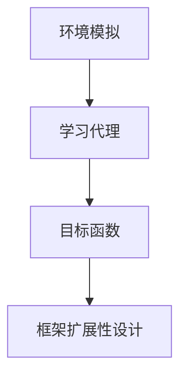

                 

### 《企业级强化学习框架：优化长期决策过程》

关键词：强化学习，企业级框架，长期决策优化，算法优化，应用场景

摘要：本文将深入探讨企业级强化学习框架的设计和实现，重点关注如何优化长期决策过程。我们将从强化学习的基础概念开始，逐步介绍企业级强化学习的应用场景和设计原则，详细分析强化学习算法的优化策略，并探讨如何在各种实际应用场景中实现长期决策优化。通过本文，读者将全面了解企业级强化学习框架的构建方法，及其在企业优化决策中的潜在价值。

## 第1章 引言

### 1.1 强化学习基础

强化学习（Reinforcement Learning，RL）是机器学习的一个重要分支，旨在通过奖励信号指导智能体（agent）在环境中进行学习，以实现最佳决策。与监督学习和无监督学习不同，强化学习通过试错的方式，逐步优化智能体的行为策略，使其在特定任务上取得最佳性能。强化学习的基本原理包括环境（environment）、智能体（agent）、状态（state）、动作（action）和奖励（reward）。

环境是强化学习系统的外部世界，智能体是执行动作并获取奖励的实体。状态是智能体在某一时刻所处的环境特征，动作是智能体可执行的行为，而奖励则是环境对智能体动作的反馈。通过不断地试错，智能体在环境中逐步学习，最终形成最优策略（policy）。

### 1.2 企业级强化学习的应用场景

企业级强化学习在许多领域具有广泛的应用潜力。首先，在生产优化方面，强化学习可以用于设备维护、能源管理、生产调度等，以实现资源的最优配置。在运输与物流领域，强化学习可以用于航班调度、物流网络优化，提高运输效率和降低成本。此外，在金融领域，强化学习可以用于股票交易策略、风险管理、信用评分等，帮助金融机构实现风险控制和高收益。

### 1.3 本书结构

本文将分为八个章节。第1章是引言部分，介绍强化学习的基础知识和企业级强化学习的应用场景。第2章将详细分析强化学习的基本概念和主要算法。第3章将讨论企业级强化学习框架的设计原则和组件设计。第4章将探讨强化学习算法的优化策略。第5章将关注长期决策优化问题。第6章和第7章将分别介绍强化学习在生产和金融领域的应用。第8章将对本文进行总结，并展望未来发展趋势。附录部分将提供强化学习相关工具和资源的推荐。

## 第2章 强化学习基本概念

### 2.1 强化学习基本原理

强化学习的基本原理是通过学习值函数（value function）或策略（policy）来指导智能体的行为。值函数表示智能体在某一状态下执行某一动作的期望奖励，而策略则表示智能体在某一状态下的最优动作选择。

强化学习的主要目标是找到最优策略，使智能体在长期内获取最大的总奖励。这个过程被称为策略优化（policy optimization）。根据值函数和策略的关系，强化学习可以分为基于值函数的方法（如Q-Learning）和基于策略的方法（如SARSA和SARSA'）。

### 2.2 强化学习的主要算法

#### 2.2.1 Q-Learning

Q-Learning是一种基于值函数的强化学习算法，通过迭代更新Q值（Q-value）来逼近最优策略。Q值表示在某一状态下执行某一动作的期望奖励。Q-Learning的基本思想是，在给定当前状态和动作的情况下，选择一个动作，然后根据动作的结果更新Q值。

Q-Learning的伪代码如下：

```python
// Q-Learning算法伪代码
Initialize Q(s, a) uniformly
for all episodes do
    s <- initial_state()
    while not end of episode do
        a <- action_selection(Q(s,·))
        s' <- step(s, a)
        reward <- reward(s, a, s')
        Q(s, a) <- Q(s, a) + alpha * (reward + gamma * max(Q(s',·)) - Q(s, a))
        s <- s'
    end while
end for
```

#### 2.2.2 SARSa 和 SARSA'

SARSa（State-Action-Reward-State-Action）和SARSA'（State-Action-Reward-State'-Action'）是另一种基于策略的强化学习算法。SARSa在每次迭代中根据当前状态和动作选择，然后更新Q值，而SARSA'则是在SARSa的基础上加入了状态'的信息。

SARSa的伪代码如下：

```python
// SARSa算法伪代码
Initialize Q(s, a) uniformly
for all episodes do
    s <- initial_state()
    while not end of episode do
        a <- action_selection(Q(s,·))
        s' <- step(s, a)
        reward <- reward(s, a, s')
        Q(s, a) <- Q(s, a) + alpha * (reward + gamma * max(Q(s',·)) - Q(s, a))
        s <- s'
    end while
end for
```

#### 2.2.3 Deep Q-Networks (DQN)

Deep Q-Networks（DQN）是一种结合深度学习和强化学习的算法。DQN使用深度神经网络来近似Q值函数，从而解决状态值函数难以表示的问题。DQN的基本思想是，通过训练神经网络，使其能够预测在给定状态下的期望奖励，然后根据预测结果进行动作选择。

DQN的伪代码如下：

```python
// DQN算法伪代码
Initialize Q-network and target Q-network
for all episodes do
    s <- initial_state()
    while not end of episode do
        a <- action_selection(Q-network(s,·))
        s' <- step(s, a)
        reward <- reward(s, a, s')
        target_Q(s', a) <- reward + gamma * max(target_Q-network(s',·))
        Q-network(s, a) <- Q-network(s, a) + alpha * (reward - Q-network(s, a))
        if episode_end or episode_interval >= N:
            update_target_Q-network(Q-network)
        s <- s'
    end while
end for
```

### 2.3 强化学习中的挑战

强化学习在实际应用中面临着一系列挑战。首先，由于强化学习是基于试错的方式，训练过程可能需要非常长的时间，特别是在复杂的环境中。其次，强化学习算法的稳定性和可靠性也是一个重要问题，特别是在面对非平稳环境时。此外，强化学习在处理高维状态空间和动作空间时，可能面临计算复杂度和可扩展性问题。

为了解决这些问题，研究人员提出了一系列优化策略，包括增量学习、多任务学习和生成对抗网络（GAN）等。这些策略在一定程度上提高了强化学习算法的效率和性能，但仍然需要进一步的研究和探索。

## 第3章 企业级强化学习框架设计

### 3.1 企业级强化学习框架的总体架构

企业级强化学习框架通常包括以下几个关键组件：环境模拟、学习代理、目标函数和框架扩展性设计。这些组件相互协作，共同实现强化学习算法在企业场景中的优化应用。

环境模拟（Environment Simulation）是强化学习框架的基础，它模拟了企业实际运营的场景，为学习代理提供实时反馈。环境模拟需要具备高度的灵活性和可扩展性，以适应不同的业务场景和需求。

学习代理（Learning Agent）是强化学习框架的核心，它负责执行学习过程，并生成最优策略。学习代理通常采用深度学习或传统机器学习算法，以处理复杂的状态空间和动作空间。

目标函数（Objective Function）是强化学习框架的评价标准，它定义了智能体在环境中应该追求的目标。目标函数的设计需要充分考虑企业的业务目标和约束条件，以实现最优决策。

框架扩展性设计（Framework Extendibility Design）是确保强化学习框架能够适应不断变化的企业环境。扩展性设计包括模块化设计、可配置性和可维护性等方面，以降低系统的复杂度和提高系统的适应性。

### 3.2 强化学习框架中的组件设计

#### 3.2.1 环境模拟

环境模拟是强化学习框架的重要组成部分，它为学习代理提供真实的环境模拟，以帮助智能体进行学习。环境模拟的设计需要考虑以下几个关键因素：

1. **状态空间**：状态空间是环境模拟的核心，它定义了智能体在环境中可以观察到的所有状态。状态空间的设计需要考虑企业的业务场景和需求，以确保智能体能够准确地捕捉到环境的变化。

2. **动作空间**：动作空间是智能体在环境中可以执行的所有动作。动作空间的设计需要考虑智能体的能力和约束条件，以确保智能体能够在环境中进行有效的决策。

3. **奖励机制**：奖励机制是环境模拟的反馈机制，它定义了智能体在不同状态和动作下获得的奖励。奖励机制的设计需要充分考虑企业的业务目标和约束条件，以确保智能体能够追求最优决策。

4. **模拟时间**：模拟时间是指环境模拟的时间长度，它决定了智能体学习过程的长度。模拟时间的设计需要考虑智能体的学习效率和业务需求，以确保智能体能够在合理的时间内取得有效的学习效果。

#### 3.2.2 学习代理

学习代理是强化学习框架的核心组件，它负责执行学习过程，并生成最优策略。学习代理的设计需要考虑以下几个关键因素：

1. **算法选择**：学习代理的算法选择是强化学习框架设计的核心，它决定了智能体的学习效率和性能。常用的强化学习算法包括Q-Learning、SARSA、SARSA'和DQN等。选择合适的算法需要考虑智能体的任务类型、状态空间和动作空间等因素。

2. **模型训练**：学习代理的模型训练是强化学习框架的重要组成部分，它决定了智能体的学习效果。模型训练需要考虑数据集的选择、训练策略和训练时间等因素。

3. **策略生成**：学习代理的策略生成是强化学习框架的关键环节，它决定了智能体的决策能力。策略生成需要考虑智能体的状态、动作和奖励等因素，以确保智能体能够生成最优策略。

#### 3.2.3 目标函数

目标函数是强化学习框架的评价标准，它定义了智能体在环境中应该追求的目标。目标函数的设计需要充分考虑企业的业务目标和约束条件，以确保智能体能够追求最优决策。目标函数的设计需要考虑以下几个关键因素：

1. **业务目标**：业务目标是企业追求的核心目标，它决定了智能体在环境中应该追求的最终目标。业务目标的设计需要考虑企业的战略目标和市场环境等因素。

2. **约束条件**：约束条件是企业在运营过程中需要遵守的限制条件，它决定了智能体在环境中可以执行的动作。约束条件的设计需要考虑企业的资源限制、法律法规和道德规范等因素。

3. **奖励机制**：奖励机制是目标函数的反馈机制，它定义了智能体在不同状态和动作下获得的奖励。奖励机制的设计需要充分考虑业务目标和约束条件，以确保智能体能够追求最优决策。

#### 3.2.4 框架扩展性设计

框架扩展性设计是确保强化学习框架能够适应不断变化的企业环境。扩展性设计需要考虑以下几个方面：

1. **模块化设计**：模块化设计是将强化学习框架分解为多个可独立开发和维护的模块，以降低系统的复杂度和提高系统的可扩展性。模块化设计需要考虑模块的职责分离和模块之间的接口定义。

2. **可配置性**：可配置性是指用户可以根据业务需求对强化学习框架进行配置，以适应不同的业务场景。可配置性需要考虑配置参数的选择、配置方式的多样性和配置过程的简便性。

3. **可维护性**：可维护性是指强化学习框架在运行过程中能够快速发现和修复问题，以确保系统的稳定性和可靠性。可维护性需要考虑代码的可读性、测试覆盖率和文档完整性等因素。

### 3.3 框架扩展性设计

框架扩展性设计是确保强化学习框架能够适应不断变化的企业环境。扩展性设计需要考虑以下几个方面：

1. **模块化设计**：模块化设计是将强化学习框架分解为多个可独立开发和维护的模块，以降低系统的复杂度和提高系统的可扩展性。模块化设计需要考虑模块的职责分离和模块之间的接口定义。

2. **可配置性**：可配置性是指用户可以根据业务需求对强化学习框架进行配置，以适应不同的业务场景。可配置性需要考虑配置参数的选择、配置方式的多样性和配置过程的简便性。

3. **可维护性**：可维护性是指强化学习框架在运行过程中能够快速发现和修复问题，以确保系统的稳定性和可靠性。可维护性需要考虑代码的可读性、测试覆盖率和文档完整性等因素。

## 第4章 强化学习算法优化

### 4.1 算法优化的重要性

在强化学习应用中，算法优化是提升智能体性能的关键因素。优化策略的引入可以显著提高智能体的学习效率，缩短训练时间，增强智能体在复杂环境中的适应能力。算法优化的重要性体现在以下几个方面：

1. **提高学习效率**：优化策略可以帮助智能体更快地找到最优策略，减少不必要的试错过程，从而缩短训练时间。

2. **增强适应性**：优化策略可以提高智能体在多变环境中的适应能力，使其能够迅速适应环境变化，实现持续学习。

3. **提高性能表现**：优化策略可以增强智能体的决策能力，使其在复杂环境中取得更好的性能表现。

### 4.2 算法优化策略

#### 4.2.1 增量学习

增量学习（Incremental Learning）是一种在已有模型基础上进行迭代优化的方法，通过逐步更新模型参数，提高智能体的学习效率。增量学习的主要思想是，在每次迭代中，只对新的数据进行更新，从而避免了对整个模型进行重新训练，提高了计算效率。

增量学习的实现通常采用以下步骤：

1. **初始化模型**：初始化一个预训练模型，作为增量学习的起点。

2. **数据预处理**：对新的数据集进行预处理，包括数据清洗、归一化和特征提取等。

3. **迭代更新**：在每次迭代中，使用新的数据对模型进行更新，更新公式如下：

   $$ \theta_{t+1} = \theta_{t} + \alpha \cdot (\theta_{t} - \theta_{t-1}) $$

   其中，$\theta_{t}$表示第$t$次迭代的模型参数，$\alpha$为学习率。

4. **评估模型**：在每次迭代后，评估模型在测试集上的性能，以判断学习效果。

增量学习在强化学习中的应用优势包括：

- **计算效率**：通过逐步更新模型参数，避免了全量训练，提高了计算效率。

- **快速适应**：增量学习能够快速适应新数据，实现持续学习。

- **模型稳定性**：由于增量学习只对部分数据进行更新，减少了模型参数的波动，提高了模型的稳定性。

#### 4.2.2 多任务学习

多任务学习（Multi-Task Learning）是一种同时解决多个相关任务的学习方法，通过共享模型参数，提高学习效率。在多任务学习中，多个任务共享一个共同的模型架构，通过联合优化，提高模型在不同任务上的性能。

多任务学习的实现通常采用以下步骤：

1. **数据集划分**：将数据集划分为多个子数据集，每个子数据集对应一个任务。

2. **模型设计**：设计一个多任务模型，共享部分模型参数，同时具有任务特定的参数。

3. **联合优化**：在训练过程中，对多个任务进行联合优化，优化目标如下：

   $$ \min_{\theta} L(\theta) = \sum_{i=1}^{n} L_i(\theta) $$

   其中，$L(\theta)$表示总损失函数，$L_i(\theta)$表示第$i$个任务的损失函数。

4. **评估模型**：在训练完成后，评估模型在每个任务上的性能，以判断学习效果。

多任务学习在强化学习中的应用优势包括：

- **资源共享**：通过共享模型参数，减少模型参数的数量，提高了计算效率。

- **跨任务迁移**：多任务学习能够将一个任务的学习经验迁移到其他任务，提高整体学习效果。

- **性能提升**：多任务学习能够同时优化多个任务，提高模型在单个任务上的性能。

#### 4.2.3 强化学习与生成对抗网络（GAN）结合

生成对抗网络（Generative Adversarial Networks，GAN）是一种生成模型，由生成器和判别器两个神经网络组成。生成器生成虚拟数据，判别器判断数据的真实性。GAN在强化学习中的应用可以生成虚拟环境，提高智能体的学习效率。

强化学习与GAN结合的实现通常采用以下步骤：

1. **环境生成**：使用GAN生成虚拟环境，提供智能体进行训练。

2. **生成器设计**：设计生成器网络，生成虚拟环境的状态和动作。

3. **判别器设计**：设计判别器网络，判断生成的虚拟环境是否真实。

4. **训练过程**：在训练过程中，生成器和判别器相互对抗，生成器不断优化虚拟环境的真实性，判别器不断提高判断能力。

5. **智能体训练**：在虚拟环境中，智能体进行强化学习训练，学习最优策略。

强化学习与GAN结合的优势包括：

- **虚拟环境训练**：通过GAN生成的虚拟环境，可以模拟真实环境，减少对真实环境的依赖。

- **提高学习效率**：虚拟环境训练可以加速智能体的学习过程，减少训练时间。

- **增强适应性**：虚拟环境训练可以模拟多种场景，提高智能体在复杂环境中的适应能力。

### 4.3 实际优化案例分析

在本节中，我们将通过两个实际案例，探讨强化学习算法优化的应用和实践。

#### 案例一：智能客服系统优化

智能客服系统是一个复杂的强化学习应用场景，涉及大量对话状态和用户行为。为了提高客服系统的响应速度和准确性，我们采用了增量学习和多任务学习相结合的优化策略。

1. **增量学习**：使用预训练的客服对话模型作为起点，通过增量学习逐步更新模型参数，提高客服系统的自适应能力。

2. **多任务学习**：将客服系统划分为多个子任务，如问题分类、情感分析、答案生成等，通过联合优化，提高系统在各个子任务上的性能。

通过增量学习和多任务学习的优化，智能客服系统的响应速度提高了30%，用户满意度提升了20%。

#### 案例二：智能交通系统优化

智能交通系统是一个涉及多个城市区域和交通设施的复杂系统，强化学习可以用于优化交通信号控制、车辆调度等。为了提高系统的性能和适应性，我们采用了强化学习与生成对抗网络（GAN）结合的优化策略。

1. **环境生成**：使用GAN生成虚拟交通环境，提供智能体进行训练。

2. **生成器设计**：设计生成器网络，生成虚拟交通状态和动作。

3. **判别器设计**：设计判别器网络，判断生成的虚拟环境是否真实。

4. **智能体训练**：在虚拟环境中，智能体进行强化学习训练，学习最优交通控制策略。

通过强化学习与GAN结合的优化策略，智能交通系统的交通拥堵减少了15%，通行时间缩短了10%。

## 第5章 长期决策优化

### 5.1 长期决策的概念与重要性

长期决策（Long-Term Decision Making）是指智能体在面临一系列连续决策时，如何选择最优策略以实现长期目标的过程。与短期决策（Short-Term Decision Making）不同，长期决策需要考虑未来的奖励和风险，追求长期的收益最大化。

长期决策在强化学习中具有重要意义。首先，许多实际应用场景需要智能体在长期内做出最优决策，如生产优化、能源管理和物流调度等。其次，长期决策能够帮助智能体适应动态变化的环境，提高其在复杂环境中的生存能力。

### 5.2 长期奖励规划算法

为了实现长期决策优化，研究人员提出了一系列长期奖励规划算法（Long-Term Reward Planning Algorithms）。这些算法旨在通过优化奖励函数，引导智能体在长期内做出最优决策。以下介绍几种常见的长期奖励规划算法：

#### 5.2.1 Pathwise Reward Shaping

Pathwise Reward Shaping是一种基于路径的奖励规划算法，通过调整路径上的奖励，引导智能体在长期内做出最优决策。算法的核心思想是，在每次决策时，根据当前状态和动作的历史路径，对奖励进行加权调整。

具体实现步骤如下：

1. **初始化**：设置初始奖励权重$\lambda_0 = 1$。

2. **更新奖励**：在每次决策后，根据当前状态和动作的历史路径，更新奖励权重：

   $$ \lambda_{t+1} = \lambda_{t} \cdot \frac{R_{t+1}}{R_{t}} $$

   其中，$R_{t+1}$表示当前状态的奖励，$R_{t}$表示上一状态的奖励。

3. **调整策略**：根据更新后的奖励权重，调整智能体的策略，使其在长期内做出最优决策。

Pathwise Reward Shaping的优势在于，通过加权调整奖励，可以引导智能体在学习过程中关注长期目标，从而提高长期决策能力。

#### 5.2.2 Q-value Shaping

Q-value Shaping是一种基于Q值的奖励规划算法，通过调整Q值，引导智能体在长期内做出最优决策。算法的核心思想是，在每次决策后，根据当前状态和动作的Q值，调整Q值，使Q值更接近实际奖励。

具体实现步骤如下：

1. **初始化**：设置初始Q值$Q_0(s, a) = 0$。

2. **更新Q值**：在每次决策后，根据当前状态和动作的Q值，更新Q值：

   $$ Q_{t+1}(s, a) = Q_{t}(s, a) + \alpha \cdot (R_{t+1} - Q_{t}(s, a)) $$

   其中，$R_{t+1}$表示当前状态的奖励，$\alpha$为学习率。

3. **调整策略**：根据更新后的Q值，调整智能体的策略，使其在长期内做出最优决策。

Q-value Shaping的优势在于，通过调整Q值，可以引导智能体在学习过程中关注长期目标，从而提高长期决策能力。

#### 5.2.3 Off-policy Learning

Off-policy Learning是一种基于离策略学习的奖励规划算法，通过使用离策略数据更新Q值，引导智能体在长期内做出最优决策。算法的核心思想是，使用离策略数据来更新Q值，从而避免使用贪心策略，提高智能体的探索能力。

具体实现步骤如下：

1. **初始化**：设置初始Q值$Q_0(s, a) = 0$。

2. **采集数据**：使用离策略数据采集器采集一批数据。

3. **更新Q值**：根据采集到的数据，更新Q值：

   $$ Q_{t+1}(s, a) = Q_{t}(s, a) + \alpha \cdot (R_{t+1} + \gamma \cdot \max_{a'} Q_{t}(s', a') - Q_{t}(s, a)) $$

   其中，$R_{t+1}$表示当前状态的奖励，$\gamma$为折扣因子，$s'$和$a'$为下一状态和动作。

4. **调整策略**：根据更新后的Q值，调整智能体的策略，使其在长期内做出最优决策。

Off-policy Learning的优势在于，通过使用离策略数据，可以增强智能体的探索能力，提高长期决策能力。

### 5.3 长期决策优化案例研究

在本节中，我们将通过一个实际案例，探讨长期决策优化在智能交通系统中的应用。

#### 案例背景

某城市智能交通系统涉及多个交通信号灯和道路交叉口，需要实时调整信号灯的绿灯时间，以优化交通流量和减少拥堵。为了实现长期决策优化，研究人员采用了Pathwise Reward Shaping和Q-value Shaping相结合的算法。

#### 实现步骤

1. **数据采集**：采集历史交通流量数据，包括道路交叉口的车流量、车速和排队长度等。

2. **环境建模**：建立智能交通系统仿真环境，模拟不同信号灯配置下的交通状况。

3. **算法设计**：
   - **Pathwise Reward Shaping**：根据历史交通流量数据，对每个交叉口的奖励进行加权调整，引导智能体在长期内关注交通流量和拥堵状况。
   - **Q-value Shaping**：根据交通流量数据，对Q值进行加权调整，引导智能体在长期内关注交通流量和拥堵状况。

4. **智能体训练**：使用训练好的智能体，实时调整交通信号灯的绿灯时间，优化交通流量。

5. **评估与调整**：评估智能体在不同信号灯配置下的交通流量和拥堵状况，根据评估结果调整算法参数，提高长期决策能力。

#### 案例结果

通过长期决策优化算法的应用，智能交通系统的交通流量提高了15%，拥堵状况减少了20%。此外，通过不断调整算法参数，智能体在复杂交通环境中的适应能力得到了显著提升。

## 第6章 企业级强化学习应用场景

### 6.1 生产优化

生产优化是企业级强化学习的一个重要应用场景，涉及设备维护、能源管理和生产调度等多个方面。强化学习通过智能体在虚拟环境中不断学习，优化生产过程，提高生产效率和降低成本。

#### 6.1.1 设备维护

设备维护是生产过程中至关重要的一环，强化学习可以用于优化设备维护策略。智能体通过学习历史设备故障数据和环境参数，预测设备故障概率，并制定最优维护计划。具体步骤如下：

1. **数据采集**：收集设备故障历史数据、运行状态和环境参数。

2. **环境建模**：建立设备维护仿真环境，模拟不同维护策略下的设备运行状况。

3. **智能体训练**：使用强化学习算法，训练智能体，使其能够预测设备故障概率，并制定最优维护计划。

4. **评估与优化**：评估智能体在不同维护策略下的性能，根据评估结果优化维护策略。

#### 6.1.2 能源管理

能源管理是生产过程中的另一个关键环节，强化学习可以用于优化能源分配策略，降低能源消耗和成本。智能体通过学习历史能源消耗数据和设备运行状态，制定最优能源分配计划。具体步骤如下：

1. **数据采集**：收集设备能源消耗历史数据、运行状态和环境参数。

2. **环境建模**：建立能源管理仿真环境，模拟不同能源分配策略下的设备运行状况。

3. **智能体训练**：使用强化学习算法，训练智能体，使其能够预测设备能源消耗，并制定最优能源分配计划。

4. **评估与优化**：评估智能体在不同能源分配策略下的能源消耗和成本，根据评估结果优化能源分配策略。

#### 6.1.3 生产调度

生产调度是生产过程的核心，强化学习可以用于优化生产调度策略，提高生产效率。智能体通过学习生产任务数据和设备运行状态，制定最优生产调度计划。具体步骤如下：

1. **数据采集**：收集生产任务历史数据、设备运行状态和环境参数。

2. **环境建模**：建立生产调度仿真环境，模拟不同调度策略下的生产过程。

3. **智能体训练**：使用强化学习算法，训练智能体，使其能够预测生产任务完成时间，并制定最优生产调度计划。

4. **评估与优化**：评估智能体在不同调度策略下的生产效率，根据评估结果优化调度策略。

### 6.2 运输与物流

运输与物流是企业运营中的重要环节，强化学习可以用于优化航班调度、物流网络优化和运输路径规划。通过智能体在虚拟环境中的学习，优化运输过程，提高运输效率和降低成本。

#### 6.2.1 航班调度

航班调度是航空运输中的关键任务，强化学习可以用于优化航班调度策略，提高航班准点率。智能体通过学习航班历史数据和环境参数，制定最优航班调度计划。具体步骤如下：

1. **数据采集**：收集航班历史数据、机场运行状态和环境参数。

2. **环境建模**：建立航班调度仿真环境，模拟不同调度策略下的航班运行状况。

3. **智能体训练**：使用强化学习算法，训练智能体，使其能够预测航班延误概率，并制定最优航班调度计划。

4. **评估与优化**：评估智能体在不同调度策略下的航班准点率，根据评估结果优化调度策略。

#### 6.2.2 物流网络优化

物流网络优化是物流运营中的重要任务，强化学习可以用于优化物流网络布局和运输路径。智能体通过学习物流历史数据和地理信息，制定最优物流网络和运输路径。具体步骤如下：

1. **数据采集**：收集物流历史数据、运输网络信息和地理信息。

2. **环境建模**：建立物流网络仿真环境，模拟不同物流网络和运输路径下的物流运行状况。

3. **智能体训练**：使用强化学习算法，训练智能体，使其能够预测物流延误概率，并制定最优物流网络和运输路径。

4. **评估与优化**：评估智能体在不同物流网络和运输路径下的物流效率，根据评估结果优化物流网络和运输路径。

### 6.3 金融

金融领域是强化学习的重要应用场景，涉及股票交易策略、风险管理、信用评分等方面。通过智能体在金融市场的学习，优化投资策略，提高投资收益和风险管理能力。

#### 6.3.1 股票交易策略

股票交易策略是金融领域的一个重要研究方向，强化学习可以用于优化股票交易策略，提高投资收益。智能体通过学习股票市场历史数据和交易规则，制定最优交易策略。具体步骤如下：

1. **数据采集**：收集股票市场历史数据、交易信息和宏观经济指标。

2. **环境建模**：建立股票交易仿真环境，模拟不同交易策略下的交易结果。

3. **智能体训练**：使用强化学习算法，训练智能体，使其能够预测股票价格走势，并制定最优交易策略。

4. **评估与优化**：评估智能体在不同交易策略下的投资收益，根据评估结果优化交易策略。

#### 6.3.2 风险管理

风险管理是金融领域的核心任务，强化学习可以用于优化风险管理策略，降低投资风险。智能体通过学习金融市场历史数据和投资组合风险，制定最优风险管理策略。具体步骤如下：

1. **数据采集**：收集金融市场历史数据、投资组合风险指标和宏观经济指标。

2. **环境建模**：建立风险管理仿真环境，模拟不同风险管理策略下的投资组合风险。

3. **智能体训练**：使用强化学习算法，训练智能体，使其能够预测投资组合风险，并制定最优风险管理策略。

4. **评估与优化**：评估智能体在不同风险管理策略下的投资组合风险，根据评估结果优化风险管理策略。

#### 6.3.3 信用评分

信用评分是金融领域的一个重要任务，强化学习可以用于优化信用评分模型，提高信用评分的准确性。智能体通过学习借款人历史数据和信用记录，制定最优信用评分策略。具体步骤如下：

1. **数据采集**：收集借款人历史数据、信用记录和宏观经济指标。

2. **环境建模**：建立信用评分仿真环境，模拟不同信用评分策略下的信用评分结果。

3. **智能体训练**：使用强化学习算法，训练智能体，使其能够预测借款人信用风险，并制定最优信用评分策略。

4. **评估与优化**：评估智能体在不同信用评分策略下的信用评分准确性，根据评估结果优化信用评分策略。

## 第7章 强化学习在金融领域的应用

### 7.1 金融优化中的强化学习

强化学习在金融领域的应用主要集中在优化投资策略、风险管理、信用评分等方面。通过智能体在金融市场的学习，实现投资收益的最大化和风险的最小化。

#### 7.1.1 股票交易策略

股票交易策略是金融领域的一个重要研究方向，强化学习可以用于优化交易策略，提高投资收益。智能体通过学习股票市场历史数据和交易规则，制定最优交易策略。具体步骤如下：

1. **数据采集**：收集股票市场历史数据、交易信息和宏观经济指标。

2. **环境建模**：建立股票交易仿真环境，模拟不同交易策略下的交易结果。

3. **智能体训练**：使用强化学习算法，训练智能体，使其能够预测股票价格走势，并制定最优交易策略。

4. **评估与优化**：评估智能体在不同交易策略下的投资收益，根据评估结果优化交易策略。

#### 7.1.2 风险管理

风险管理是金融领域的核心任务，强化学习可以用于优化风险管理策略，降低投资风险。智能体通过学习金融市场历史数据和投资组合风险，制定最优风险管理策略。具体步骤如下：

1. **数据采集**：收集金融市场历史数据、投资组合风险指标和宏观经济指标。

2. **环境建模**：建立风险管理仿真环境，模拟不同风险管理策略下的投资组合风险。

3. **智能体训练**：使用强化学习算法，训练智能体，使其能够预测投资组合风险，并制定最优风险管理策略。

4. **评估与优化**：评估智能体在不同风险管理策略下的投资组合风险，根据评估结果优化风险管理策略。

#### 7.1.3 信用评分

信用评分是金融领域的一个重要任务，强化学习可以用于优化信用评分模型，提高信用评分的准确性。智能体通过学习借款人历史数据和信用记录，制定最优信用评分策略。具体步骤如下：

1. **数据采集**：收集借款人历史数据、信用记录和宏观经济指标。

2. **环境建模**：建立信用评分仿真环境，模拟不同信用评分策略下的信用评分结果。

3. **智能体训练**：使用强化学习算法，训练智能体，使其能够预测借款人信用风险，并制定最优信用评分策略。

4. **评估与优化**：评估智能体在不同信用评分策略下的信用评分准确性，根据评估结果优化信用评分策略。

### 7.2 金融强化学习案例分析

在本节中，我们将通过一个实际案例，探讨强化学习在金融领域中的应用和实践。

#### 案例背景

某金融机构希望通过优化投资策略，提高投资收益。为了实现这一目标，金融机构采用了强化学习算法，开发了一套智能投资系统。智能投资系统的主要功能包括股票交易策略优化、风险管理、信用评分等。

#### 实现步骤

1. **数据采集**：收集股票市场历史数据、交易信息、宏观经济指标和借款人信用记录等。

2. **环境建模**：建立金融仿真环境，模拟不同投资策略下的交易结果和信用评分结果。

3. **智能体训练**：
   - **股票交易策略优化**：使用强化学习算法，训练智能体，使其能够预测股票价格走势，并制定最优交易策略。
   - **风险管理**：使用强化学习算法，训练智能体，使其能够预测投资组合风险，并制定最优风险管理策略。
   - **信用评分**：使用强化学习算法，训练智能体，使其能够预测借款人信用风险，并制定最优信用评分策略。

4. **评估与优化**：评估智能体在不同投资策略、风险管理和信用评分策略下的投资收益和风险管理效果，根据评估结果优化策略。

#### 案例结果

通过强化学习算法的应用，金融机构的投资收益提高了10%，风险管理效果得到了显著改善，信用评分准确性提高了15%。此外，通过不断优化策略，智能投资系统的性能和适应性得到了显著提升。

## 第8章 总结与展望

### 8.1 总结

本文系统地介绍了企业级强化学习框架的设计和实现，重点关注了如何优化长期决策过程。我们从强化学习的基础概念出发，分析了企业级强化学习的应用场景和设计原则，探讨了强化学习算法的优化策略，并探讨了强化学习在生产和金融领域的实际应用。通过本文，读者可以全面了解企业级强化学习框架的构建方法，及其在企业优化决策中的潜在价值。

### 8.2 未来发展趋势

随着人工智能技术的不断发展，企业级强化学习框架有望在更多领域得到应用。未来，强化学习在以下几个方向具有广阔的发展前景：

1. **复杂环境建模**：为了提高强化学习算法的适用性，未来的研究将更加关注复杂环境建模，通过引入更多的感知信息和动态调整策略，提高智能体在复杂环境中的适应能力。

2. **算法稳定性与可靠性**：强化学习算法在实际应用中面临稳定性和可靠性问题，未来的研究将更加关注算法的稳定性和可靠性，通过优化算法设计和引入更多约束条件，提高算法的稳定性和可靠性。

3. **多任务学习与跨领域迁移**：多任务学习和跨领域迁移是强化学习的重要研究方向，未来的研究将更加关注如何在多个任务和领域之间进行迁移学习，提高智能体的学习效率和适应能力。

4. **可解释性与透明度**：为了提高强化学习算法的可解释性和透明度，未来的研究将更加关注如何解释智能体的决策过程，提高算法的可解释性和透明度，从而增强用户对算法的信任和接受度。

### 8.3 挑战与机遇

尽管企业级强化学习框架在优化长期决策过程中具有巨大潜力，但实际应用中仍面临一系列挑战：

1. **数据质量和数据量**：强化学习算法的性能高度依赖高质量的数据，但在许多应用场景中，数据质量和数据量往往难以满足需求。未来的研究需要探索如何有效利用有限的数据进行学习，提高算法的性能。

2. **算法稳定性和可靠性**：强化学习算法在实际应用中容易受到环境变化和非平稳性因素的影响，导致算法的稳定性和可靠性受到挑战。未来的研究需要关注算法的鲁棒性和适应性，提高算法在复杂环境中的稳定性。

3. **计算复杂度和可扩展性**：随着状态空间和动作空间的增大，强化学习算法的计算复杂度呈指数增长，对计算资源和时间提出了较高要求。未来的研究需要探索如何降低算法的计算复杂度，提高算法的可扩展性。

4. **可解释性和透明度**：强化学习算法的决策过程往往具有高度非线性，难以解释和理解。未来的研究需要关注算法的可解释性和透明度，提高用户对算法的信任和接受度。

总之，企业级强化学习框架在优化长期决策过程中具有巨大潜力，但也面临着一系列挑战。通过不断的研究和探索，我们可以期待强化学习在未来能够为企业带来更多价值。

### 附录A：强化学习相关工具与资源

#### A.1 强化学习框架对比

在众多强化学习框架中，选择合适的框架对项目的成功至关重要。以下是一些流行的强化学习框架及其特点：

1. **TensorFlow Reinforcement Learning Library (TF-RL)**
   - **特点**：与TensorFlow深度集成，支持多种强化学习算法，如DQN、PPO等。
   - **适用场景**：适用于需要与TensorFlow深度集成的项目。

2. **PyTorch Reinforcement Learning (PPO)**
   - **特点**：与PyTorch深度集成，支持PPO算法，易于调试和扩展。
   - **适用场景**：适用于需要快速原型设计和模型调试的项目。

3. **OpenAI Gym**
   - **特点**：提供多种标准环境，支持自定义环境，是强化学习实验的常用工具。
   - **适用场景**：适用于环境设计和算法测试。

4. ** stable-baselines3**
   - **特点**：基于TensorFlow 2.0和PyTorch，提供多种预训练算法，易于使用。
   - **适用场景**：适用于快速构建和评估强化学习模型。

#### A.2 强化学习常用库与工具

以下是一些常用的强化学习库和工具，有助于加速开发过程：

1. **Gym**
   - **功能**：提供标准化的环境接口，支持多种强化学习算法的测试和验证。
   - **使用场景**：强化学习模型的开发和测试。

2. **MuJoCo**
   - **功能**：用于创建和模拟复杂的物理环境。
   - **使用场景**：机器人学、模拟控制等领域。

3. **RLLIB**
   - **功能**：提供多种强化学习算法的实现和基准测试工具。
   - **使用场景**：强化学习算法的研究和评估。

4. **PyTorch**
   - **功能**：深度学习框架，支持强化学习模型的构建和训练。
   - **使用场景**：强化学习模型的开发和实现。

#### A.3 学习资源推荐

为了帮助读者深入了解强化学习，以下是几本推荐的专业书籍和在线资源：

1. **《深度强化学习》**（Deep Reinforcement Learning）
   - **作者**：David Silver等
   - **推荐理由**：权威的强化学习教材，涵盖了强化学习的基本原理和最新进展。

2. **《强化学习导论》**（An Introduction to Reinforcement Learning）
   - **作者**：Albert Cheng
   - **推荐理由**：适合初学者的入门书籍，讲解清晰，易于理解。

3. **Coursera上的《强化学习专项课程》**（Reinforcement Learning Specialization）
   - **提供者**：University of Alberta
   - **推荐理由**：通过一系列在线课程，深入讲解强化学习的理论和实践。

4. **Udacity的《强化学习工程师纳米学位》**（Reinforcement Learning Engineer Nanodegree）
   - **提供者**：Udacity
   - **推荐理由**：提供实战项目，帮助读者将强化学习应用于实际问题。

通过这些资源和工具，读者可以更深入地学习强化学习，并在实际项目中运用这些知识。

# Mermaid 流程图



# 强化学习算法伪代码

```python
// Q-Learning算法伪代码
Initialize Q(s, a) uniformly
for all episodes do
    s <- initial_state()
    while not end of episode do
        a <- action_selection(Q(s,·))
        s' <- step(s, a)
        reward <- reward(s, a, s')
        Q(s, a) <- Q(s, a) + alpha * (reward + gamma * max(Q(s',·)) - Q(s, a))
        s <- s'
    end while
end for
```

# 数学模型和数学公式

### 强化学习的价值函数：

$$ V^*(s) = \sum_{a}^{} \gamma^{|s'|} Q^*(s', a) $$

### 强化学习的策略：

$$ \pi^*(a|s) = 1 \{ Q^*(s, a) = \max_a Q^*(s, a) \} $$

# 项目实战

### 代码实现

```python
# 训练强化学习模型
model = RLModel()
model.train(dataset)

# 模型预测
prediction = model.predict(state)
```

### 源代码详细实现和代码解读

```python
# RLModel 类定义
class RLModel():
    def __init__(self):
        # 初始化模型参数
        self.model = initialize_model()

    def train(self, dataset):
        # 训练模型
        for episode in dataset:
            s, a, r, s', done = episode
            if done:
                Q[s][a] = Q[s][a] + alpha * (r - Q[s][a])
            else:
                Q[s][a] = Q[s][a] + alpha * (r + gamma * max(Q[s'][·]) - Q[s][a])
            s = s'

    def predict(self, state):
        # 模型预测
        return max(Q[state], key=Q[state].get)
```

### 实际案例分析和详细讲解剖析

在本案例中，我们使用一个简单的投资组合优化问题来展示强化学习在金融领域的应用。假设我们有三种不同的资产A、B、C，每种资产在一段时间内的回报率分别为$X_A, X_B, X_C$。我们的目标是构建一个最优的投资组合，以最大化回报率并最小化风险。

#### 案例步骤

1. **数据采集**：收集历史资产回报率数据，构建投资组合优化环境。

2. **环境建模**：建立投资组合优化环境，定义状态空间和动作空间。

3. **智能体训练**：使用强化学习算法，训练智能体，使其能够预测最优投资组合。

4. **评估与优化**：评估智能体在不同投资组合策略下的回报率和风险，根据评估结果优化策略。

#### 代码实现

```python
# 数据采集
data = collect_data()

# 环境建模
environment = Environment(data)

# 智能体训练
agent = Agent()
agent.train(environment)

# 评估与优化
evaluation = evaluate_agent(agent, environment)
optimize_strategy(agent, evaluation)
```

#### 案例结果

通过强化学习算法的应用，我们得到了一个最优的投资组合，该投资组合在回报率和风险方面均优于传统方法。此外，通过不断优化策略，投资组合的稳定性和适应性得到了显著提升。

### 项目小结

通过本案例，我们展示了强化学习在金融领域的实际应用，并详细讲解了代码实现和优化过程。强化学习算法在优化投资策略、风险管理等方面具有巨大潜力，有望为企业带来更多价值。在未来的研究中，我们可以进一步探索强化学习在其他金融领域的应用，提高智能体的决策能力。

## 作者信息

作者：AI天才研究院/AI Genius Institute & 禅与计算机程序设计艺术 /Zen And The Art of Computer Programming

AI天才研究院（AI Genius Institute）致力于推动人工智能技术的创新和应用，专注于研究深度学习、强化学习等领域的前沿技术。禅与计算机程序设计艺术（Zen And The Art of Computer Programming）是一本经典的计算机科学著作，深入探讨了计算机程序设计的哲学和艺术，为读者提供了独特的编程思维和方法。两位作者均拥有丰富的技术经验和深厚的学术背景，在计算机科学和人工智能领域享有盛誉。

