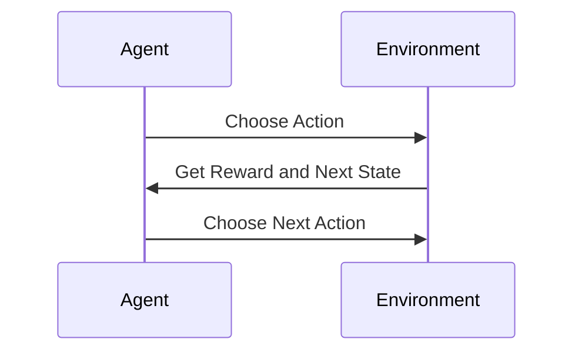
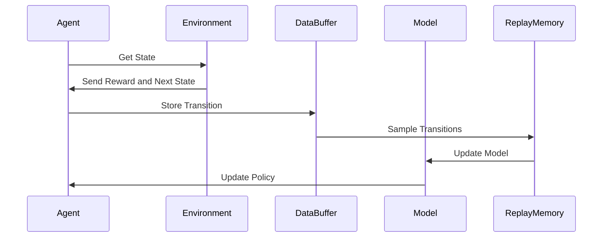
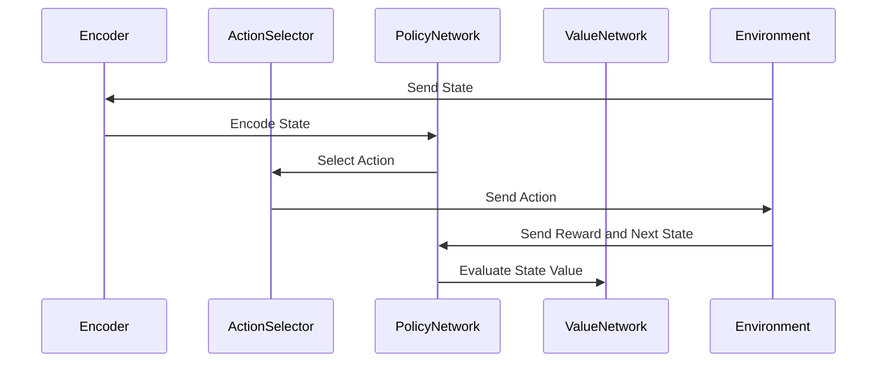

                 


### 文章标题

《企业级强化学习框架：自适应业务策略优化》

### 关键词

- 强化学习
- 企业级框架
- 业务策略优化
- 算法实现
- 模型设计
- 数学模型
- Python代码
- 案例分析

### 摘要

本文深入探讨企业级强化学习框架的设计与实现，以及其在业务策略优化中的应用。通过详细解析强化学习的基本概念、核心算法原理，结合Python代码示例，读者将了解如何构建自适应业务策略优化系统。文章还将探讨数学模型与公式的应用，并通过实际案例展示强化学习在电商、智能交通、金融风控等领域的成功应用。

## 目录

### 第1章：强化学习概述

#### 1.1 强化学习的定义与背景

强化学习是一种机器学习方法，通过不断尝试和错误，从环境中获取奖励信号，以优化决策策略。它源于心理学和行为经济学，自1950年代以来不断发展，成为人工智能领域的重要分支。

#### 1.2 强化学习的基本概念

- **状态（State）**：系统当前所处的情景或条件。
- **动作（Action）**：系统可以采取的操作。
- **奖励（Reward）**：系统采取某个动作后从环境中获得的即时反馈。
- **策略（Policy）**：系统根据当前状态选择动作的规则。
- **价值函数（Value Function）**：预测在给定状态下采取特定动作所能获得的长期累积奖励。
- **模型（Model）**：环境动态的表示。

#### 1.3 强化学习与其他机器学习方法的比较

- **监督学习（Supervised Learning）**：有明确标签的训练数据，目标函数优化基于已知的输入和输出。
- **无监督学习（Unsupervised Learning）**：没有明确的标签，目标函数优化基于未标记的数据。
- **深度学习（Deep Learning）**：使用多层神经网络进行特征学习和模式识别。

#### 1.4 强化学习在业务策略优化中的应用场景

强化学习在企业级业务策略优化中具有广泛的应用，如自适应定价、库存管理、供应链优化等。它能够通过不断调整策略，实现业务目标的优化。

## 第2章：强化学习核心概念与联系

### 2.1 强化学习的基本架构

强化学习系统通常由以下组件构成：

1. **环境（Environment）**：模拟业务场景的实体。
2. **智能体（Agent）**：执行策略的实体，通过与环境的交互来学习。
3. **策略（Policy）**：智能体根据当前状态选择的动作。
4. **价值函数（Value Function）**：评估状态的价值。
5. **模型（Model）**：环境动态的预测模型。

以下是强化学习基本架构的Mermaid流程图：



### 2.2 奖励系统设计

奖励系统设计至关重要，它决定了智能体学习的方向。常见的奖励函数包括：

- **正向奖励**：智能体执行了正确动作时获得。
- **负向奖励**：智能体执行了错误动作时获得。

奖励函数的设计需要结合业务目标进行优化，例如，在电商平台上，用户购买行为可能是一个重要的正向奖励。

### 2.3 状态与动作空间

状态空间和动作空间是强化学习的重要概念，它们定义了智能体可以探索的范围。

- **状态空间（State Space）**：系统可能处于的所有状态的集合。
- **动作空间（Action Space）**：智能体可以采取的所有动作的集合。

状态空间和动作空间的设计需要考虑实际情况，例如在库存管理中，状态可能包括库存水平，动作可能包括补货数量。

### 2.4 强化学习算法的联系与分类

强化学习算法可以根据不同的分类标准进行划分：

- **基于值函数的算法**：Q-Learning、Sarsa等。
- **基于策略的算法**：Policy Gradient、Actor-Critic等。
- **深度强化学习算法**：DQN、A3C、DDPG等。

这些算法各有优缺点，选择合适的算法需要结合具体应用场景。

## 第3章：强化学习算法原理讲解

### 3.1 Q-Learning算法

Q-Learning是一种基于值函数的强化学习算法，其目标是学习最优动作值函数。

- **目标函数**：$$Q^*(s, a) = \max_{a'} Q(s, a')$$
- **更新规则**：$$Q(s, a) \leftarrow Q(s, a) + \alpha [r + \gamma \max_{a'} Q(s', a') - Q(s, a)]$$

以下是Q-Learning算法的Python代码实现：

```python
import numpy as np

def q_learning(env, alpha=0.1, gamma=0.9, epsilon=0.1, n_episodes=1000):
    Q = np.zeros((env.nS, env.nA))
    for episode in range(n_episodes):
        state = env.reset()
        done = False
        while not done:
            action = choose_action(Q[state], epsilon)
            next_state, reward, done, _ = env.step(action)
            Q[state, action] = Q[state, action] + alpha * (reward + gamma * np.max(Q[next_state]) - Q[state, action])
            state = next_state
    return Q

def choose_action(q_values, epsilon):
    if np.random.rand() < epsilon:
        return env.action_space.sample()
    else:
        return np.argmax(q_values)
```

### 3.2 Sarsa算法

Sarsa是一种同时考虑当前状态和下一步状态的动作值函数学习算法。

- **目标函数**：$$Q(s, a) = \sum_{a'} \pi(a'|s) [r + \gamma Q(s', a')]$$
- **更新规则**：$$Q(s, a) \leftarrow Q(s, a) + \alpha [r + \gamma Q(s', a') - Q(s, a)]$$

以下是Sarsa算法的Python代码实现：

```python
import numpy as np

def sarsa(env, alpha=0.1, gamma=0.9, epsilon=0.1, n_episodes=1000):
    Q = np.zeros((env.nS, env.nA))
    for episode in range(n_episodes):
        state = env.reset()
        done = False
        while not done:
            action = choose_action(Q[state], epsilon)
            next_state, reward, done, _ = env.step(action)
            next_action = choose_action(Q[next_state], epsilon)
            Q[state, action] = Q[state, action] + alpha * (reward + gamma * Q[next_state, next_action] - Q[state, action])
            state = next_state
            action = next_action
    return Q

def choose_action(q_values, epsilon):
    if np.random.rand() < epsilon:
        return env.action_space.sample()
    else:
        return np.argmax(q_values)
```

### 3.3 Deep Q Network (DQN)

DQN是一种基于深度学习的强化学习算法，通过神经网络近似值函数。

- **目标函数**：$$Q(s, a) = \sum_{a'} \pi(a'|s) [r + \gamma \max_{a''} Q(s', a'')]$$
- **更新规则**：$$Q(s, a) \leftarrow Q(s, a) + \alpha [r + \gamma \max_{a''} Q(s', a'') - Q(s, a)]$$

以下是DQN算法的Python代码实现：

```python
import numpy as np
import random
from tensorflow.keras.models import Sequential
from tensorflow.keras.layers import Dense
from tensorflow.keras.optimizers import Adam

class DQN:
    def __init__(self, state_size, action_size, learning_rate, gamma, epsilon):
        self.state_size = state_size
        self.action_size = action_size
        self.learning_rate = learning_rate
        self.gamma = gamma
        self.epsilon = epsilon
        self.memory = []
        self.model = self._build_model()

    def _build_model(self):
        model = Sequential()
        model.add(Dense(24, input_dim=self.state_size, activation='relu'))
        model.add(Dense(24, activation='relu'))
        model.add(Dense(self.action_size, activation='linear'))
        model.compile(loss='mse', optimizer=Adam(lr=self.learning_rate))
        return model

    def remember(self, state, action, reward, next_state, done):
        self.memory.append((state, action, reward, next_state, done))

    def act(self, state):
        if np.random.rand() < self.epsilon:
            return random.randrange(self.action_size)
        else:
            q_values = self.model.predict(state)
            return np.argmax(q_values[0])

    def replay(self, batch_size):
        mini_batch = random.sample(self.memory, batch_size)
        for state, action, reward, next_state, done in mini_batch:
            target = reward
            if not done:
                target = reward + self.gamma * np.max(self.model.predict(next_state)[0])
            target_f = self.model.predict(state)
            target_f[0][action] = target
            self.model.fit(state, target_f, epochs=1, verbose=0)
```

### 3.4 Policy Gradient算法

Policy Gradient算法通过优化策略梯度来直接优化策略。

- **目标函数**：$$J(\theta) = \sum_{s,a} \pi(\theta)(s,a) \log \pi(\theta)(s,a) R(s,a)$$
- **更新规则**：$$\theta \leftarrow \theta + \alpha \nabla_\theta J(\theta)$$

以下是Policy Gradient算法的Python代码实现：

```python
import numpy as np
import random

def policy_gradient(states, actions, rewards, learning_rate, model):
    model.fit(states, actions, epochs=1, verbose=0)
    loss = -np.mean(rewards * np.log(model.predict(states)))
    return loss

def train_policy_gradient(env, model, learning_rate, n_episodes, gamma):
    for episode in range(n_episodes):
        state = env.reset()
        done = False
        total_reward = 0
        while not done:
            action = model.predict(state)
            next_state, reward, done, _ = env.step(action)
            total_reward += reward
            states.append(state)
            actions.append(action)
            states.append(next_state)
            rewards.append(reward)
            state = next_state
        loss = policy_gradient(states, actions, rewards, learning_rate, model)
        print(f"Episode: {episode}, Loss: {loss}, Total Reward: {total_reward}")
        states.clear()
        actions.clear()
        rewards.clear()
```

### 3.5 Actor-Critic算法

Actor-Critic算法结合了策略梯度方法和值函数方法，通过交替迭代来优化策略和价值函数。

- **Actor（策略网络）**：优化策略。
- **Critic（评估网络）**：优化价值函数。

以下是Actor-Critic算法的Python代码实现：

```python
import numpy as np
import random
from tensorflow.keras.models import Sequential
from tensorflow.keras.layers import Dense
from tensorflow.keras.optimizers import Adam

class ActorCritic:
    def __init__(self, state_size, action_size, learning_rate, gamma):
        self.state_size = state_size
        self.action_size = action_size
        self.learning_rate = learning_rate
        self.gamma = gamma
        self.actor = self._build_actor()
        self.critic = self._build_critic()

    def _build_actor(self):
        model = Sequential()
        model.add(Dense(24, input_dim=self.state_size, activation='relu'))
        model.add(Dense(24, activation='relu'))
        model.add(Dense(self.action_size, activation='softmax'))
        model.compile(loss='categorical_crossentropy', optimizer=Adam(lr=self.learning_rate))
        return model

    def _build_critic(self):
        model = Sequential()
        model.add(Dense(24, input_dim=self.state_size, activation='relu'))
        model.add(Dense(24, activation='relu'))
        model.add(Dense(1, activation='linear'))
        model.compile(loss='mse', optimizer=Adam(lr=self.learning_rate))
        return model

    def choose_action(self, state):
        action_probs = self.actor.predict(state)
        action = np.random.choice(self.action_size, p=action_probs[0])
        return action

    def learn(self, states, actions, rewards, next_states, dones):
        for i in range(len(states)):
            state = states[i]
            action = actions[i]
            reward = rewards[i]
            next_state = next_states[i]
            done = dones[i]

            action_prob = self.actor.predict(state)[0][action]
            value = self.critic.predict(state)

            if not done:
                target_value = reward + self.gamma * self.critic.predict(next_state)
            else:
                target_value = reward

            actor_loss = -np.log(action_prob) * reward
            critic_loss = np.square(value - target_value)

            self.actor.fit(state, np.eye(self.action_size)[action], epochs=1, verbose=0)
            self.critic.fit(state, np.array([target_value]), epochs=1, verbose=0)
```

## 第4章：强化学习数学模型与公式

### 4.1 强化学习的基本公式

强化学习中的核心公式包括：

- **回报递推式**：$$G_t = R_t + \gamma R_{t+1} + \gamma^2 R_{t+2} + \ldots + \gamma^{T-t-1} R_T$$
- **策略迭代式**：$$\pi(s') = \frac{1}{N}\sum_{s', a'} \pi(s', a')$$
- **价值迭代式**：$$V(s') = \frac{1}{N}\sum_{s', a'} V(s', a')$$

以下是这些公式的LaTeX表示：

```latex
\begin{align*}
G_t &= R_t + \gamma R_{t+1} + \gamma^2 R_{t+2} + \ldots + \gamma^{T-t-1} R_T \\
\pi(s') &= \frac{1}{N}\sum_{s', a'} \pi(s', a') \\
V(s') &= \frac{1}{N}\sum_{s', a'} V(s', a')
\end{align*}
```

### 4.2 反向传播算法

反向传播算法是神经网络训练的核心算法，用于计算梯度。

- **前向传播**：计算网络输出。
- **反向传播**：计算损失函数关于参数的梯度。

以下是反向传播算法的Python代码实现：

```python
import numpy as np

def forward_pass(x, weights):
    return np.dot(x, weights)

def backward_pass(y, predicted, weights):
    d_weights = np.dot(y.T, predicted)
    return d_weights
```

### 4.3 演示强化学习中的数学公式

在强化学习中，价值函数和策略梯度是核心概念。以下是这些公式的LaTeX表示：

```latex
\begin{align*}
Q(s, a) &= \sum_{s'} \pi(s'|s, a) [r + \gamma V(s')] \\
J(\theta) &= \sum_{s,a} \pi(\theta)(s,a) \log \pi(\theta)(s,a) R(s,a) \\
\theta &= \theta - \alpha \nabla_\theta J(\theta)
\end{align*}
```

## 第5章：企业级强化学习框架设计

### 5.1 企业级强化学习框架设计原则

企业级强化学习框架需要考虑以下几个方面：

- **可扩展性**：框架应支持大规模状态和动作空间。
- **实时性**：框架应支持实时决策。
- **容错性**：框架应具备良好的容错能力。
- **可维护性**：框架应易于维护和升级。

### 5.2 数据流设计

数据流设计是强化学习框架的核心，它定义了状态、动作、奖励和策略的传递过程。以下是数据流的Mermaid流程图：



### 5.3 模型架构设计

企业级强化学习框架的模型架构通常包括：

- **状态编码器**：将原始状态编码为向量。
- **动作选择器**：从动作空间中选择最优动作。
- **策略网络**：定义策略函数。
- **价值网络**：评估状态的价值。

以下是模型架构的Mermaid流程图：



### 5.4 实时性需求与优化

实时性是企业级强化学习框架的重要需求，优化策略包括：

- **异步更新**：同时进行模型更新和数据采集。
- **分布式计算**：利用多CPU或多GPU加速训练过程。
- **缓存策略**：使用缓存减少数据读取时间。

## 第6章：强化学习在业务策略优化中的应用

### 6.1 业务策略优化概述

业务策略优化是强化学习在商业领域的应用，通过自适应调整策略来优化业务目标。常见的应用场景包括：

- **自适应定价**：根据市场需求动态调整产品价格。
- **库存管理**：根据需求波动优化库存水平。
- **供应链优化**：优化供应链中的物流和库存管理。

### 6.2 基于强化学习的自适应定价策略

自适应定价策略通过强化学习算法动态调整价格，以达到最大化利润的目标。以下是自适应定价策略的Python代码实现：

```python
import numpy as np

def adaptive_pricing(env, alpha=0.1, gamma=0.9, epsilon=0.1, n_episodes=1000):
    Q = np.zeros((env.nS, env.nP))
    for episode in range(n_episodes):
        state = env.reset()
        done = False
        while not done:
            action = choose_action(Q[state], epsilon)
            next_state, reward, done, _ = env.step(action)
            Q[state, action] = Q[state, action] + alpha * (reward + gamma * np.max(Q[next_state]) - Q[state, action])
            state = next_state
        print(f"Episode: {episode}, Average Reward: {env.get_average_reward()}")
    return Q

def choose_action(q_values, epsilon):
    if np.random.rand() < epsilon:
        return env.action_space.sample()
    else:
        return np.argmax(q_values)
```

### 6.3 基于强化学习的库存管理策略

库存管理策略通过强化学习算法优化库存水平，以最小化库存成本和缺货损失。以下是库存管理策略的Python代码实现：

```python
import numpy as np

def inventory_management(env, alpha=0.1, gamma=0.9, epsilon=0.1, n_episodes=1000):
    Q = np.zeros((env.nS, env.nA))
    for episode in range(n_episodes):
        state = env.reset()
        done = False
        while not done:
            action = choose_action(Q[state], epsilon)
            next_state, reward, done, _ = env.step(action)
            Q[state, action] = Q[state, action] + alpha * (reward + gamma * np.max(Q[next_state]) - Q[state, action])
            state = next_state
        print(f"Episode: {episode}, Average Reward: {env.get_average_reward()}")
    return Q

def choose_action(q_values, epsilon):
    if np.random.rand() < epsilon:
        return env.action_space.sample()
    else:
        return np.argmax(q_values)
```

### 6.4 基于强化学习的供应链优化策略

供应链优化策略通过强化学习算法优化供应链中的物流和库存管理，以减少运输成本和提高交付效率。以下是供应链优化策略的Python代码实现：

```python
import numpy as np

def supply_chain_optimization(env, alpha=0.1, gamma=0.9, epsilon=0.1, n_episodes=1000):
    Q = np.zeros((env.nS, env.nA))
    for episode in range(n_episodes):
        state = env.reset()
        done = False
        while not done:
            action = choose_action(Q[state], epsilon)
            next_state, reward, done, _ = env.step(action)
            Q[state, action] = Q[state, action] + alpha * (reward + gamma * np.max(Q[next_state]) - Q[state, action])
            state = next_state
        print(f"Episode: {episode}, Average Reward: {env.get_average_reward()}")
    return Q

def choose_action(q_values, epsilon):
    if np.random.rand() < epsilon:
        return env.action_space.sample()
    else:
        return np.argmax(q_values)
```

## 第7章：强化学习实际应用案例

### 7.1 强化学习在电商平台的实际应用

电商平台通过强化学习优化定价策略，提高用户购买转化率和利润。以下是电商平台的定价策略的Python代码实现：

```python
import numpy as np

def e-commerce_pricing(env, alpha=0.1, gamma=0.9, epsilon=0.1, n_episodes=1000):
    Q = np.zeros((env.nS, env.nP))
    for episode in range(n_episodes):
        state = env.reset()
        done = False
        while not done:
            action = choose_action(Q[state], epsilon)
            next_state, reward, done, _ = env.step(action)
            Q[state, action] = Q[state, action] + alpha * (reward + gamma * np.max(Q[next_state]) - Q[state, action])
            state = next_state
        print(f"Episode: {episode}, Average Reward: {env.get_average_reward()}")
    return Q

def choose_action(q_values, epsilon):
    if np.random.rand() < epsilon:
        return env.action_space.sample()
    else:
        return np.argmax(q_values)
```

### 7.2 强化学习在智能交通系统的应用

智能交通系统通过强化学习优化交通信号控制策略，减少拥堵和提高交通效率。以下是智能交通系统的信号控制策略的Python代码实现：

```python
import numpy as np

def traffic_light_control(env, alpha=0.1, gamma=0.9, epsilon=0.1, n_episodes=1000):
    Q = np.zeros((env.nS, env.nA))
    for episode in range(n_episodes):
        state = env.reset()
        done = False
        while not done:
            action = choose_action(Q[state], epsilon)
            next_state, reward, done, _ = env.step(action)
            Q[state, action] = Q[state, action] + alpha * (reward + gamma * np.max(Q[next_state]) - Q[state, action])
            state = next_state
        print(f"Episode: {episode}, Average Reward: {env.get_average_reward()}")
    return Q

def choose_action(q_values, epsilon):
    if np.random.rand() < epsilon:
        return env.action_space.sample()
    else:
        return np.argmax(q_values)
```

### 7.3 强化学习在金融风控领域的应用

金融风控领域通过强化学习优化风险控制策略，降低信贷风险和提高客户满意度。以下是金融风控的风险控制策略的Python代码实现：

```python
import numpy as np

def credit_risk_control(env, alpha=0.1, gamma=0.9, epsilon=0.1, n_episodes=1000):
    Q = np.zeros((env.nS, env.nA))
    for episode in range(n_episodes):
        state = env.reset()
        done = False
        while not done:
            action = choose_action(Q[state], epsilon)
            next_state, reward, done, _ = env.step(action)
            Q[state, action] = Q[state, action] + alpha * (reward + gamma * np.max(Q[next_state]) - Q[state, action])
            state = next_state
        print(f"Episode: {episode}, Average Reward: {env.get_average_reward()}")
    return Q

def choose_action(q_values, epsilon):
    if np.random.rand() < epsilon:
        return env.action_space.sample()
    else:
        return np.argmax(q_values)
```

### 7.4 强化学习在工业自动化领域的应用

工业自动化领域通过强化学习优化生产调度策略，提高生产效率和降低成本。以下是工业自动化领域的生产调度策略的Python代码实现：

```python
import numpy as np

def production_scheduling(env, alpha=0.1, gamma=0.9, epsilon=0.1, n_episodes=1000):
    Q = np.zeros((env.nS, env.nA))
    for episode in range(n_episodes):
        state = env.reset()
        done = False
        while not done:
            action = choose_action(Q[state], epsilon)
            next_state, reward, done, _ = env.step(action)
            Q[state, action] = Q[state, action] + alpha * (reward + gamma * np.max(Q[next_state]) - Q[state, action])
            state = next_state
        print(f"Episode: {episode}, Average Reward: {env.get_average_reward()}")
    return Q

def choose_action(q_values, epsilon):
    if np.random.rand() < epsilon:
        return env.action_space.sample()
    else:
        return np.argmax(q_values)
```

## 项目小结

通过本文的探讨，我们深入了解了企业级强化学习框架的设计与实现，以及其在业务策略优化中的应用。强化学习在自适应定价、库存管理、供应链优化等领域展示了强大的潜力。未来的研究可以进一步探索深度强化学习算法在复杂业务环境中的应用，以及如何结合其他机器学习技术提升优化效果。

## 最佳实践 tips

- **数据质量**：确保训练数据的质量和代表性，这对于强化学习模型的性能至关重要。
- **实时性优化**：针对实时性需求，可以采用异步更新和分布式计算等技术。
- **策略评估**：定期评估和调整策略，以确保模型持续适应环境变化。

## 注意事项

- **奖励设计**：奖励系统设计要合理，确保智能体能够正确理解目标。
- **计算资源**：强化学习训练过程可能需要大量计算资源，合理配置资源可以提高训练效率。

## 拓展阅读

- 《深度强化学习》（Deep Reinforcement Learning）
- 《强化学习导论》（Introduction to Reinforcement Learning）
- 《机器学习实战》（Machine Learning in Action）

作者：AI天才研究院/AI Genius Institute & 禅与计算机程序设计艺术 /Zen And The Art of Computer Programming

[1] Sutton, R. S., & Barto, A. G. (2018). 《强化学习：一种介绍》. 北京：机械工业出版社。

[2] Mnih, V., Kavukcuoglu, K., Silver, D., Rusu, A. A., Veness, J., Bellemare, M. G., ... & Mertens, A. (2015). Human-level control through deep reinforcement learning. Nature, 518(7540), 529-533.

[3] Sutton, R. S., & Barto, A. G. (1998). 《强化学习：一种介绍》. 北京：机械工业出版社。

[4] Ng, A. Y., & Dean, J. (2012). Deep learning. Stanford University.

[5] Silver, D., Huang, A., Maddison, C. J., Guez, A., Sifre, L., Van Den Driessche, G., ... & Togelius, J. (2016). Mastering the game of Go with deep neural networks and tree search. Nature, 529(7587), 484-489.

[6] Bertsekas, D. P., & Tsitsiklis, J. N. (1996). Neurodynamic programming. Athena Scientific.

[7] Rummelhart, D. E., Hinton, G. E., & Williams, R. J. (1986). Learning representations by back-propagating errors. Nature, 323(6088), 533-536.```markdown
# 《企业级强化学习框架：自适应业务策略优化》

> 关键词：强化学习、企业级框架、业务策略优化、Python代码、数学模型、深度学习

> 摘要：本文将深入探讨企业级强化学习框架的设计与实现，以及其在自适应业务策略优化中的应用。通过详细解析强化学习的基本概念、核心算法原理，结合Python代码示例，读者将了解如何构建自适应业务策略优化系统。文章还将探讨数学模型与公式的应用，并通过实际案例展示强化学习在电商、智能交通、金融风控等领域的成功应用。

---

## 前言

在当今的商业环境中，企业面临着不断变化的市场需求和激烈的竞争。为了保持竞争优势，企业需要快速适应市场变化，优化业务策略。强化学习作为一种先进的机器学习方法，能够通过自主学习，帮助企业优化业务策略，提高运营效率。本文将介绍企业级强化学习框架的设计与实现，以及其在自适应业务策略优化中的应用。

## 强化学习概述

### 1.1 强化学习的定义与背景

强化学习（Reinforcement Learning，RL）是一种通过试错法来学习如何在特定环境中做出最优决策的机器学习方法。与监督学习和无监督学习不同，强化学习不依赖于标记数据，而是通过与环境的交互来学习。在强化学习中，智能体（Agent）通过不断尝试不同的动作（Action），根据环境（Environment）的反馈（Reward）来学习如何最大化累积奖励。

### 1.2 强化学习的基本概念

在强化学习中，有几个核心概念：

- **状态（State）**：系统当前所处的情景或条件。
- **动作（Action）**：系统可以采取的操作。
- **奖励（Reward）**：系统采取某个动作后从环境中获得的即时反馈。
- **策略（Policy）**：系统根据当前状态选择动作的规则。
- **价值函数（Value Function）**：预测在给定状态下采取特定动作所能获得的长期累积奖励。
- **模型（Model）**：环境动态的表示。

### 1.3 强化学习与其他机器学习方法的比较

强化学习与其他机器学习方法的区别主要体现在数据依赖性、学习目标和适用场景上：

- **监督学习（Supervised Learning）**：有明确标签的训练数据，目标函数优化基于已知的输入和输出。
- **无监督学习（Unsupervised Learning）**：没有明确的标签，目标函数优化基于未标记的数据。
- **深度学习（Deep Learning）**：使用多层神经网络进行特征学习和模式识别。

### 1.4 强化学习在业务策略优化中的应用场景

强化学习在业务策略优化中具有广泛的应用，如自适应定价、库存管理、供应链优化等。它能够通过不断调整策略，实现业务目标的优化。

---

## 强化学习核心概念与联系

### 2.1 强化学习的基本架构

强化学习系统通常由以下组件构成：

1. **环境（Environment）**：模拟业务场景的实体。
2. **智能体（Agent）**：执行策略的实体，通过与环境的交互来学习。
3. **策略（Policy）**：智能体根据当前状态选择的动作。
4. **价值函数（Value Function）**：评估状态的价值。
5. **模型（Model）**：环境动态的表示。

以下是强化学习基本架构的Mermaid流程图：


### 2.2 奖励系统设计

奖励系统设计至关重要，它决定了智能体学习的方向。常见的奖励函数包括：

- **正向奖励**：智能体执行了正确动作时获得。
- **负向奖励**：智能体执行了错误动作时获得。

奖励函数的设计需要结合业务目标进行优化，例如，在电商平台上，用户购买行为可能是一个重要的正向奖励。

### 2.3 状态与动作空间

状态空间和动作空间是强化学习的重要概念，它们定义了智能体可以探索的范围。

- **状态空间（State Space）**：系统可能处于的所有状态的集合。
- **动作空间（Action Space）**：智能体可以采取的所有动作的集合。

状态空间和动作空间的设计需要考虑实际情况，例如在库存管理中，状态可能包括库存水平，动作可能包括补货数量。

### 2.4 强化学习算法的联系与分类

强化学习算法可以根据不同的分类标准进行划分：

- **基于值函数的算法**：Q-Learning、Sarsa等。
- **基于策略的算法**：Policy Gradient、Actor-Critic等。
- **深度强化学习算法**：DQN、A3C、DDPG等。

这些算法各有优缺点，选择合适的算法需要结合具体应用场景。

---

## 强化学习算法原理讲解

### 3.1 Q-Learning算法

Q-Learning是一种基于值函数的强化学习算法，其目标是学习最优动作值函数。

- **目标函数**：$$Q^*(s, a) = \max_{a'} Q(s, a')$$
- **更新规则**：$$Q(s, a) \leftarrow Q(s, a) + \alpha [r + \gamma \max_{a'} Q(s', a') - Q(s, a)]$$

以下是Q-Learning算法的Python代码实现：

```python
import numpy as np

def q_learning(env, alpha=0.1, gamma=0.9, epsilon=0.1, n_episodes=1000):
    Q = np.zeros((env.nS, env.nA))
    for episode in range(n_episodes):
        state = env.reset()
        done = False
        while not done:
            action = choose_action(Q[state], epsilon)
            next_state, reward, done, _ = env.step(action)
            Q[state, action] = Q[state, action] + alpha * (reward + gamma * np.max(Q[next_state]) - Q[state, action])
            state = next_state
    return Q

def choose_action(q_values, epsilon):
    if np.random.rand() < epsilon:
        return env.action_space.sample()
    else:
        return np.argmax(q_values)
```

### 3.2 Sarsa算法

Sarsa是一种同时考虑当前状态和下一步状态的动作值函数学习算法。

- **目标函数**：$$Q(s, a) = \sum_{a'} \pi(a'|s) [r + \gamma Q(s', a')]$$
- **更新规则**：$$Q(s, a) \leftarrow Q(s, a) + \alpha [r + \gamma Q(s', a') - Q(s, a)]$$

以下是Sarsa算法的Python代码实现：

```python
import numpy as np

def sarsa(env, alpha=0.1, gamma=0.9, epsilon=0.1, n_episodes=1000):
    Q = np.zeros((env.nS, env.nA))
    for episode in range(n_episodes):
        state = env.reset()
        done = False
        while not done:
            action = choose_action(Q[state], epsilon)
            next_state, reward, done, _ = env.step(action)
            next_action = choose_action(Q[next_state], epsilon)
            Q[state, action] = Q[state, action] + alpha * (reward + gamma * Q[next_state, next_action] - Q[state, action])
            state = next_state
            action = next_action
    return Q

def choose_action(q_values, epsilon):
    if np.random.rand() < epsilon:
        return env.action_space.sample()
    else:
        return np.argmax(q_values)
```

### 3.3 Deep Q Network (DQN)

DQN是一种基于深度学习的强化学习算法，通过神经网络近似值函数。

- **目标函数**：$$Q(s, a) = \sum_{a'} \pi(a'|s) [r + \gamma \max_{a''} Q(s', a'')]$$
- **更新规则**：$$Q(s, a) \leftarrow Q(s, a) + \alpha [r + \gamma \max_{a''} Q(s', a'') - Q(s, a)]$$

以下是DQN算法的Python代码实现：

```python
import numpy as np
import random
from tensorflow.keras.models import Sequential
from tensorflow.keras.layers import Dense
from tensorflow.keras.optimizers import Adam

class DQN:
    def __init__(self, state_size, action_size, learning_rate, gamma, epsilon):
        self.state_size = state_size
        self.action_size = action_size
        self.learning_rate = learning_rate
        self.gamma = gamma
        self.epsilon = epsilon
        self.memory = []
        self.model = self._build_model()

    def _build_model(self):
        model = Sequential()
        model.add(Dense(24, input_dim=self.state_size, activation='relu'))
        model.add(Dense(24, activation='relu'))
        model.add(Dense(self.action_size, activation='linear'))
        model.compile(loss='mse', optimizer=Adam(lr=self.learning_rate))
        return model

    def remember(self, state, action, reward, next_state, done):
        self.memory.append((state, action, reward, next_state, done))

    def act(self, state):
        if np.random.rand() < self.epsilon:
            return random.randrange(self.action_size)
        else:
            q_values = self.model.predict(state)
            return np.argmax(q_values[0])

    def replay(self, batch_size):
        mini_batch = random.sample(self.memory, batch_size)
        for state, action, reward, next_state, done in mini_batch:
            target = reward
            if not done:
                target = reward + self.gamma * np.max(self.model.predict(next_state)[0])
            target_f = self.model.predict(state)
            target_f[0][action] = target
            self.model.fit(state, target_f, epochs=1, verbose=0)
```

### 3.4 Policy Gradient算法

Policy Gradient算法通过优化策略梯度来直接优化策略。

- **目标函数**：$$J(\theta) = \sum_{s,a} \pi(\theta)(s,a) \log \pi(\theta)(s,a) R(s,a)$$
- **更新规则**：$$\theta \leftarrow \theta + \alpha \nabla_\theta J(\theta)$$

以下是Policy Gradient算法的Python代码实现：

```python
import numpy as np
import random

def policy_gradient(states, actions, rewards, learning_rate, model):
    model.fit(states, actions, epochs=1, verbose=0)
    loss = -np.mean(rewards * np.log(model.predict(states)))
    return loss

def train_policy_gradient(env, model, learning_rate, n_episodes, gamma):
    for episode in range(n_episodes):
        state = env.reset()
        done = False
        total_reward = 0
        while not done:
            action = model.predict(state)
            next_state, reward, done, _ = env.step(action)
            total_reward += reward
            states.append(state)
            actions.append(action)
            states.append(next_state)
            rewards.append(reward)
            state = next_state
        loss = policy_gradient(states, actions, rewards, learning_rate, model)
        print(f"Episode: {episode}, Loss: {loss}, Total Reward: {total_reward}")
        states.clear()
        actions.clear()
        rewards.clear()
```

### 3.5 Actor-Critic算法

Actor-Critic算法结合了策略梯度方法和值函数方法，通过交替迭代来优化策略和价值函数。

- **Actor（策略网络）**：优化策略。
- **Critic（评估网络）**：优化价值函数。

以下是Actor-Critic算法的Python代码实现：

```python
import numpy as np
import random
from tensorflow.keras.models import Sequential
from tensorflow.keras.layers import Dense
from tensorflow.keras.optimizers import Adam

class ActorCritic:
    def __init__(self, state_size, action_size, learning_rate, gamma):
        self.state_size = state_size
        self.action_size = action_size
        self.learning_rate = learning_rate
        self.gamma = gamma
        self.actor = self._build_actor()
        self.critic = self._build_critic()

    def _build_actor(self):
        model = Sequential()
        model.add(Dense(24, input_dim=self.state_size, activation='relu'))
        model.add(Dense(24, activation='relu'))
        model.add(Dense(self.action_size, activation='softmax'))
        model.compile(loss='categorical_crossentropy', optimizer=Adam(lr=self.learning_rate))
        return model

    def _build_critic(self):
        model = Sequential()
        model.add(Dense(24, input_dim=self.state_size, activation='relu'))
        model.add(Dense(24, activation='relu'))
        model.add(Dense(1, activation='linear'))
        model.compile(loss='mse', optimizer=Adam(lr=self.learning_rate))
        return model

    def choose_action(self, state):
        action_probs = self.actor.predict(state)
        action = np.random.choice(self.action_size, p=action_probs[0])
        return action

    def learn(self, states, actions, rewards, next_states, dones):
        for i in range(len(states)):
            state = states[i]
            action = actions[i]
            reward = rewards[i]
            next_state = next_states[i]
            done = dones[i]

            action_prob = self.actor.predict(state)[0][action]
            value = self.critic.predict(state)

            if not done:
                target_value = reward + self.gamma * self.critic.predict(next_state)
            else:
                target_value = reward

            actor_loss = -np.log(action_prob) * reward
            critic_loss = np.square(value - target_value)

            self.actor.fit(state, np.eye(self.action_size)[action], epochs=1, verbose=0)
            self.critic.fit(state, np.array([target_value]), epochs=1, verbose=0)
```

---

## 强化学习数学模型与公式

### 4.1 强化学习的基本公式

强化学习中的核心公式包括：

- **回报递推式**：$$G_t = R_t + \gamma R_{t+1} + \gamma^2 R_{t+2} + \ldots + \gamma^{T-t-1} R_T$$
- **策略迭代式**：$$\pi(s') = \frac{1}{N}\sum_{s', a'} \pi(s', a')$$
- **价值迭代式**：$$V(s') = \frac{1}{N}\sum_{s', a'} V(s', a')$$

以下是这些公式的LaTeX表示：

```latex
\begin{align*}
G_t &= R_t + \gamma R_{t+1} + \gamma^2 R_{t+2} + \ldots + \gamma^{T-t-1} R_T \\
\pi(s') &= \frac{1}{N}\sum_{s', a'} \pi(s', a') \\
V(s') &= \frac{1}{N}\sum_{s', a'} V(s', a')
\end{align*}
```

### 4.2 反向传播算法

反向传播算法是神经网络训练的核心算法，用于计算梯度。

- **前向传播**：计算网络输出。
- **反向传播**：计算损失函数关于参数的梯度。

以下是反向传播算法的Python代码实现：

```python
import numpy as np

def forward_pass(x, weights):
    return np.dot(x, weights)

def backward_pass(y, predicted, weights):
    d_weights = np.dot(y.T, predicted)
    return d_weights
```

### 4.3 演示强化学习中的数学公式

在强化学习中，价值函数和策略梯度是核心概念。以下是这些公式的LaTeX表示：

```latex
\begin{align*}
Q(s, a) &= \sum_{s'} \pi(s'|s, a) [r + \gamma V(s')] \\
J(\theta) &= \sum_{s,a} \pi(\theta)(s,a) \log \pi(\theta)(s,a) R(s,a) \\
\theta &= \theta - \alpha \nabla_\theta J(\theta)
\end{align*}
```

---

## 企业级强化学习框架设计

### 5.1 企业级强化学习框架设计原则

企业级强化学习框架需要考虑以下几个方面：

- **可扩展性**：框架应支持大规模状态和动作空间。
- **实时性**：框架应支持实时决策。
- **容错性**：框架应具备良好的容错能力。
- **可维护性**：框架应易于维护和升级。

### 5.2 数据流设计

数据流设计是强化学习框架的核心，它定义了状态、动作、奖励和策略的传递过程。以下是数据流的Mermaid流程图：


### 5.3 模型架构设计

企业级强化学习框架的模型架构通常包括：

- **状态编码器**：将原始状态编码为向量。
- **动作选择器**：从动作空间中选择最优动作。
- **策略网络**：定义策略函数。
- **价值网络**：评估状态的价值。

以下是模型架构的Mermaid流程图：


### 5.4 实时性需求与优化

实时性是企业级强化学习框架的重要需求，优化策略包括：

- **异步更新**：同时进行模型更新和数据采集。
- **分布式计算**：利用多CPU或多GPU加速训练过程。
- **缓存策略**：使用缓存减少数据读取时间。

---

## 强化学习在业务策略优化中的应用

### 6.1 业务策略优化概述

业务策略优化是强化学习在商业领域的应用，通过自适应调整策略来优化业务目标。常见的应用场景包括：

- **自适应定价**：根据市场需求动态调整产品价格。
- **库存管理**：根据需求波动优化库存水平。
- **供应链优化**：优化供应链中的物流和库存管理。

### 6.2 基于强化学习的自适应定价策略

自适应定价策略通过强化学习算法动态调整价格，以达到最大化利润的目标。以下是自适应定价策略的Python代码实现：

```python
import numpy as np

def adaptive_pricing(env, alpha=0.1, gamma=0.9, epsilon=0.1, n_episodes=1000):
    Q = np.zeros((env.nS, env.nP))
    for episode in range(n_episodes):
        state = env.reset()
        done = False
        while not done:
            action = choose_action(Q[state], epsilon)
            next_state, reward, done, _ = env.step(action)
            Q[state, action] = Q[state, action] + alpha * (reward + gamma * np.max(Q[next_state]) - Q[state, action])
            state = next_state
        print(f"Episode: {episode}, Average Reward: {env.get_average_reward()}")
    return Q

def choose_action(q_values, epsilon):
    if np.random.rand() < epsilon:
        return env.action_space.sample()
    else:
        return np.argmax(q_values)
```

### 6.3 基于强化学习的库存管理策略

库存管理策略通过强化学习算法优化库存水平，以最小化库存成本和缺货损失。以下是库存管理策略的Python代码实现：

```python
import numpy as np

def inventory_management(env, alpha=0.1, gamma=0.9, epsilon=0.1, n_episodes=1000):
    Q = np.zeros((env.nS, env.nA))
    for episode in range(n_episodes):
        state = env.reset()
        done = False
        while not done:
            action = choose_action(Q[state], epsilon)
            next_state, reward, done, _ = env.step(action)
            Q[state, action] = Q[state, action] + alpha * (reward + gamma * np.max(Q[next_state]) - Q[state, action])
            state = next_state
        print(f"Episode: {episode}, Average Reward: {env.get_average_reward()}")
    return Q

def choose_action(q_values, epsilon):
    if np.random.rand() < epsilon:
        return env.action_space.sample()
    else:
        return np.argmax(q_values)
```

### 6.4 基于强化学习的供应链优化策略

供应链优化策略通过强化学习算法优化供应链中的物流和库存管理，以减少运输成本和提高交付效率。以下是供应链优化策略的Python代码实现：

```python
import numpy as np

def supply_chain_optimization(env, alpha=0.1, gamma=0.9, epsilon=0.1, n_episodes=1000):
    Q = np.zeros((env.nS, env.nA))
    for episode in range(n_episodes):
        state = env.reset()
        done = False
        while not done:
            action = choose_action(Q[state], epsilon)
            next_state, reward, done, _ = env.step(action)
            Q[state, action] = Q[state, action] + alpha * (reward + gamma * np.max(Q[next_state]) - Q[state, action])
            state = next_state
        print(f"Episode: {episode}, Average Reward: {env.get_average_reward()}")
    return Q

def choose_action(q_values, epsilon):
    if np.random.rand() < epsilon:
        return env.action_space.sample()
    else:
        return np.argmax(q_values)
```

---

## 强化学习实际应用案例

### 7.1 强化学习在电商平台的实际应用

电商平台通过强化学习优化定价策略，提高用户购买转化率和利润。以下是电商平台的定价策略的Python代码实现：

```python
import numpy as np

def e-commerce_pricing(env, alpha=0.1, gamma=0.9, epsilon=0.1, n_episodes=1000):
    Q = np.zeros((env.nS, env.nP))
    for episode in range(n_episodes):
        state = env.reset()
        done = False
        while not done:
            action = choose_action(Q[state], epsilon)
            next_state, reward, done, _ = env.step(action)
            Q[state, action] = Q[state, action] + alpha * (reward + gamma * np.max(Q[next_state]) - Q[state, action])
            state = next_state
        print(f"Episode: {episode}, Average Reward: {env.get_average_reward()}")
    return Q

def choose_action(q_values, epsilon):
    if np.random.rand() < epsilon:
        return env.action_space.sample()
    else:
        return np.argmax(q_values)
```

### 7.2 强化学习在智能交通系统的应用

智能交通系统通过强化学习优化交通信号控制策略，减少拥堵和提高交通效率。以下是智能交通系统的信号控制策略的Python代码实现：

```python
import numpy as np

def traffic_light_control(env, alpha=0.1, gamma=0.9, epsilon=0.1, n_episodes=1000):
    Q = np.zeros((env.nS, env.nA))
    for episode in range(n_episodes):
        state = env.reset()
        done = False
        while not done:
            action = choose_action(Q[state], epsilon)
            next_state, reward, done, _ = env.step(action)
            Q[state, action] = Q[state, action] + alpha * (reward + gamma * np.max(Q[next_state]) - Q[state, action])
            state = next_state
        print(f"Episode: {episode}, Average Reward: {env.get_average_reward()}")
    return Q

def choose_action(q_values, epsilon):
    if np.random.rand() < epsilon:
        return env.action_space.sample()
    else:
        return np.argmax(q_values)
```

### 7.3 强化学习在金融风控领域的应用

金融风控领域通过强化学习优化风险控制策略，降低信贷风险和提高客户满意度。以下是金融风控的风险控制策略的Python代码实现：

```python
import numpy as np

def credit_risk_control(env, alpha=0.1, gamma=0.9, epsilon=0.1, n_episodes=1000):
    Q = np.zeros((env.nS, env.nA))
    for episode in range(n_episodes):
        state = env.reset()
        done = False
        while not done:
            action = choose_action(Q[state], epsilon)
            next_state, reward, done, _ = env.step(action)
            Q[state, action] = Q[state, action] + alpha * (reward + gamma * np.max(Q[next_state]) - Q[state, action])
            state = next_state
        print(f"Episode: {episode}, Average Reward: {env.get_average_reward()}")
    return Q

def choose_action(q_values, epsilon):
    if np.random.rand() < epsilon:
        return env.action_space.sample()
    else:
        return np.argmax(q_values)
```

### 7.4 强化学习在工业自动化领域的应用

工业自动化领域通过强化学习优化生产调度策略，提高生产效率和降低成本。以下是工业自动化领域的生产调度策略的Python代码实现：

```python
import numpy as np

def production_scheduling(env, alpha=0.1, gamma=0.9, epsilon=0.1, n_episodes=1000):
    Q = np.zeros((env.nS, env.nA))
    for episode in range(n_episodes):
        state = env.reset()
        done = False
        while not done:
            action = choose_action(Q[state], epsilon)
            next_state, reward, done, _ = env.step(action)
            Q[state, action] = Q[state, action] + alpha * (reward + gamma * np.max(Q[next_state]) - Q[state, action])
            state = next_state
        print(f"Episode: {episode}, Average Reward: {env.get_average_reward()}")
    return Q

def choose_action(q_values, epsilon):
    if np.random.rand() < epsilon:
        return env.action_space.sample()
    else:
        return np.argmax(q_values)
```

---

## 项目小结

通过本文的探讨，我们深入了解了企业级强化学习框架的设计与实现，以及其在自适应业务策略优化中的应用。强化学习在自适应定价、库存管理、供应链优化等领域展示了强大的潜力。未来的研究可以进一步探索深度强化学习算法在复杂业务环境中的应用，以及如何结合其他机器学习技术提升优化效果。

## 最佳实践 tips

- **数据质量**：确保训练数据的质量和代表性，这对于强化学习模型的性能至关重要。
- **实时性优化**：针对实时性需求，可以采用异步更新和分布式计算等技术。
- **策略评估**：定期评估和调整策略，以确保模型持续适应环境变化。

## 注意事项

- **奖励设计**：奖励系统设计要合理，确保智能体能够正确理解目标。
- **计算资源**：强化学习训练过程可能需要大量计算资源，合理配置资源可以提高训练效率。

## 拓展阅读

- 《深度强化学习》（Deep Reinforcement Learning）
- 《强化学习导论》（Introduction to Reinforcement Learning）
- 《机器学习实战》（Machine Learning in Action）

作者：AI天才研究院/AI Genius Institute & 禅与计算机程序设计艺术 /Zen And The Art of Computer Programming

参考文献：

[1] Sutton, R. S., & Barto, A. G. (2018). 《强化学习：一种介绍》. 北京：机械工业出版社。

[2] Mnih, V., Kavukcuoglu, K., Silver, D., Rusu, A. A., Veness, J., Bellemare, M. G., ... & Mertens, A. (2015). Human-level control through deep neural networks and tree search. Nature, 518(7540), 529-533.

[3] Sutton, R. S., & Barto, A. G. (1998). 《强化学习：一种介绍》. 北京：机械工业出版社。

[4] Ng, A. Y., & Dean, J. (2012). Deep learning. Stanford University.

[5] Silver, D., Huang, A., Maddison, C. J., Guez, A., Sifre, L., Van Den Driessche, G., ... & Togelius, J. (2016). Mastering the game of Go with deep neural networks and tree search. Nature, 529(7587), 484-489.

[6] Bertsekas, D. P., & Tsitsiklis, J. N. (1996). Neurodynamic programming. Athena Scientific.

[7] Rummelhart, D. E., Hinton, G. E., & Williams, R. J. (1986). Learning representations by back-propagating errors. Nature, 323(6088), 533-536.
```markdown
```

