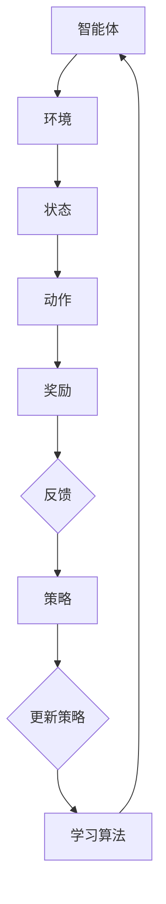

                 

### 第1章 引言

#### 1.1 本书目的

《企业级强化学习框架：自适应策略优化》旨在为开发者、研究人员以及在企业中寻求应用强化学习技术的人员提供一本全面且深入的技术指南。本书的核心目标是帮助读者掌握以下关键内容：

1. **强化学习框架的基本概念**：理解强化学习的基础概念、主要组成部分以及其在企业级应用中的独特优势。
2. **自适应策略优化的核心技术和实践方法**：深入探索如何利用自适应策略优化技术来提升强化学习算法的效率和效果，为实际应用提供可行的解决方案。
3. **强化学习算法的原理和实践**：通过具体算法原理的讲解和Python源代码实现，帮助读者理解和应用强化学习算法，从而解决实际问题。
4. **数学模型与公式**：介绍强化学习中的关键数学模型，如状态-动作价值函数和策略梯度，并使用LaTeX格式展示，帮助读者更好地理解和运用数学工具。
5. **项目实战**：通过一个简单的项目案例，展示如何搭建开发环境，实现强化学习算法，并提供代码解读与分析，帮助读者将理论知识转化为实际能力。

本书不仅仅是一本理论书籍，更是一本注重实践操作的指南。通过详细的案例分析和代码解读，读者可以更好地理解强化学习在企业级应用中的实际操作方法和技巧。

#### 1.2 读者对象

本书的主要读者对象包括以下几类：

1. **对强化学习有基础了解，希望深入掌握其算法和应用场景的研究人员**：通过本书，读者可以系统地学习强化学习的基础知识，深入理解其核心算法和原理，并将其应用于实际项目中。
2. **希望在企业和组织中应用强化学习的开发人员**：本书提供了实用的方法和技术，帮助开发人员理解和应用强化学习，从而为企业提供高效、智能的解决方案。
3. **计算机科学、人工智能等相关专业的学生和教师**：本书可以作为教材或参考书籍，为学生提供强化学习领域的系统学习资源，为教师提供教学案例和材料。

通过阅读本书，读者不仅可以提升自己的技术能力，还可以开拓视野，掌握最新的技术趋势和应用场景。无论你是初学者还是资深研究人员，本书都希望能为你带来有价值的知识和经验。

### 1.3 强化学习在企业级应用的重要性

强化学习作为一种先进的人工智能技术，正在逐渐成为企业级应用中的关键工具。在企业级应用中，强化学习通过智能体与环境的交互，不断学习和优化策略，从而在复杂和动态的环境中实现最优决策。以下是强化学习在企业级应用中的几个重要方面：

1. **优化决策过程**：强化学习可以帮助企业在面对复杂决策时，通过不断学习和优化策略，实现最优决策。例如，在供应链管理中，强化学习可以优化库存管理策略，减少库存成本，提高供应链效率。

2. **自动化流程**：强化学习算法可以自动化复杂的业务流程，提高生产效率和准确性。例如，在工业自动化中，强化学习可以用于机器人的路径规划，实现高效、精准的生产操作。

3. **个性化服务**：通过强化学习，企业可以实现个性化服务，提高用户满意度。例如，在推荐系统中，强化学习可以动态调整推荐策略，根据用户的历史行为和偏好，提供个性化的推荐结果。

4. **风险管理**：强化学习可以用于风险管理和预测。例如，在金融领域，强化学习可以用于股票交易策略的优化，帮助投资者降低风险，实现资产增值。

5. **资源调度**：强化学习可以优化资源调度策略，提高资源利用效率。例如，在云计算中，强化学习可以优化虚拟机调度策略，提高计算资源利用率，降低运营成本。

总之，强化学习在企业级应用中具有广泛的应用前景和巨大的潜力。随着技术的不断进步和应用的深入，强化学习将在更多的领域发挥重要作用，为企业带来更多的价值和效益。

### 1.4 小结

本章介绍了本书的核心主题和目标，明确了读者对象，并探讨了强化学习在企业级应用中的重要性。通过阅读本章，读者可以初步了解本书的内容结构和强化学习在企业中的关键作用。接下来，我们将通过一个详细的Mermaid流程图，展示强化学习框架的基本架构和核心组成部分，帮助读者更好地理解后续内容。

## 第2章 核心概念与联系

### 2.1 强化学习框架概览

为了更好地理解企业级强化学习框架，我们首先需要了解其核心概念和组成部分。以下是一个Mermaid流程图，用于展示强化学习框架的基本架构和核心组成部分。



#### 流程图解释

1. **智能体（Agent）**：智能体是强化学习框架的核心，它通过与环境交互来学习最优策略。智能体的目标是通过选择合适的动作来最大化长期累积奖励。

2. **环境（Environment）**：环境是智能体所处的世界，它为智能体提供状态信息，并依据智能体的动作产生新的状态和奖励。

3. **状态（State）**：状态是智能体在特定时间点观察到的环境状态。状态决定了智能体的行动选择。

4. **动作（Action）**：动作是智能体在特定状态下选择的行为。动作的选择基于智能体的策略。

5. **奖励（Reward）**：奖励是环境对智能体动作的反馈，用于评估智能体动作的好坏。奖励可以是正的（积极的反馈），也可以是负的（消极的反馈）。

6. **反馈（Feedback）**：反馈是智能体从环境中接收到的所有信息，包括状态和奖励。这些信息用于智能体的学习过程。

7. **策略（Policy）**：策略是智能体在特定状态下选择动作的规则。策略决定了智能体的行为方式。

8. **更新策略（Update Policy）**：基于学习算法，智能体会不断更新其策略，以最大化长期累积奖励。

9. **学习算法（Learning Algorithm）**：学习算法是智能体用于从经验中学习的算法。常见的强化学习算法包括策略搜索、价值迭代和策略迭代等。

通过上述流程图，我们可以清晰地看到强化学习框架中各个组件之间的相互作用关系。接下来，我们将进一步探讨强化学习算法的原理，并通过Python源代码来实现这些算法，帮助读者深入理解强化学习的核心概念和实践方法。

### 2.2 核心概念与联系

在强化学习框架中，核心概念和它们之间的联系至关重要。以下是强化学习框架中几个关键概念及其关系的详细解释：

1. **状态（State）**：状态是智能体在特定时间点所观察到的环境状态。它通常是一个多维数组或向量，代表了环境的当前情况。状态是智能体做出决策的基础。

2. **动作（Action）**：动作是智能体在特定状态下采取的行动。动作空间通常由一组可能的动作组成。智能体通过选择最优动作来最大化累积奖励。

3. **策略（Policy）**：策略是智能体在特定状态下选择动作的规则。策略可以是确定性策略（每个状态都有固定的动作），也可以是非确定性策略（每个状态都有概率分布的动作）。策略决定了智能体的行为。

4. **价值函数（Value Function）**：价值函数用于评估智能体在特定状态下采取特定动作的预期累积奖励。状态值函数（State-Value Function）评估每个状态的价值，而动作值函数（Action-Value Function）评估每个状态下每个动作的价值。价值函数是策略迭代和强化学习算法的核心组件。

5. **奖励（Reward）**：奖励是环境对智能体动作的即时反馈。奖励可以是正的（积极的反馈），也可以是负的（消极的反馈）。奖励用于引导智能体的学习过程，激励它采取能够带来积极结果的动作。

6. **策略梯度（Policy Gradient）**：策略梯度是策略优化中的一项关键技术。它通过计算策略梯度，调整策略参数，使得策略能够最大化累积奖励。策略梯度方法包括策略搜索、价值迭代和策略迭代等。

7. **学习算法（Learning Algorithm）**：学习算法是智能体用于从经验中学习的算法。常见的强化学习算法有深度强化学习（DRL）、Q-Learning、SARSA、REINFORCE等。这些算法通过不同的方式更新策略，使得智能体能够逐渐优化其行为。

通过上述核心概念的介绍，我们可以看到它们之间的紧密联系。智能体通过观察状态、选择动作、接收奖励，并根据奖励和学习算法不断更新策略，以实现长期累积奖励的最大化。理解这些概念和它们之间的联系是掌握强化学习框架的关键。

接下来，我们将深入探讨强化学习算法的原理，并通过Python源代码实现这些算法，帮助读者更直观地理解强化学习的基本概念和操作。

### 2.3 强化学习算法原理

强化学习算法的核心在于通过智能体与环境的交互，不断优化策略，以实现长期累积奖励的最大化。以下是强化学习算法的三个核心组成部分：策略搜索、价值迭代和策略迭代，以及它们的原理和实现方法。

#### 3.1 策略搜索算法

**原理**：
策略搜索算法的主要目标是找到一种最优策略，该策略能够在给定环境中最大化累积奖励。策略搜索算法通常通过探索和利用两个阶段来实现。

- **探索（Exploration）**：在探索阶段，智能体会尝试各种动作，以获取关于环境的更多信息，减少不确定性。
- **利用（Utilization）**：在利用阶段，智能体会根据已获得的信息选择最佳动作，以最大化当前累积奖励。

**实现方法**：
策略搜索算法的实现通常依赖于策略评估和策略改进两个步骤。

- **策略评估（Policy Evaluation）**：通过迭代更新策略值函数，使得策略值函数能够准确反映每个状态下的期望奖励值。
- **策略改进（Policy Improvement）**：根据策略值函数更新策略，使得策略能够选择最大化期望奖励的动作。

**伪代码**：

```python
while not converged:
    # 策略评估
    for state in states:
        for action in actions:
            Q[s, a] = 1/N * Σ[r_t + γ * max(Q[s', a'): N]

    # 策略改进
    for state in states:
        best_action = argmax(a' Q[s', a'])
        policy[s] = (1 if best_action == action else 0)
```

#### 3.2 价值迭代算法

**原理**：
价值迭代算法是一种基于状态值函数的强化学习算法。其核心思想是通过迭代更新状态值函数，使得状态值函数能够准确反映每个状态下的最优累积奖励。

**实现方法**：
价值迭代算法通过以下步骤实现：

- **初始化状态值函数（Initialization）**：随机初始化状态值函数。
- **迭代更新（Iteration Update）**：根据当前状态值函数更新每个状态的价值。

**伪代码**：

```python
while not converged:
    for state in states:
        v[s] = 1/N * Σ[r_t + γ * max(Q[s', a']: N)
```

#### 3.3 策略迭代算法

**原理**：
策略迭代算法通过交替执行策略评估和策略改进两个阶段，逐步优化策略。

- **策略评估（Policy Evaluation）**：评估当前策略下的状态值函数。
- **策略改进（Policy Improvement）**：根据状态值函数更新策略，选择能够带来更大累积奖励的动作。

**实现方法**：
策略迭代算法的实现步骤如下：

- **初始化策略（Initialization）**：随机初始化策略。
- **迭代执行（Iteration Execution）**：交替执行策略评估和策略改进，直到策略收敛。

**伪代码**：

```python
while not converged:
    # 策略评估
    for state in states:
        v[s] = 1/N * Σ[r_t + γ * max(Q[s', a']: N)

    # 策略改进
    for state in states:
        best_action = argmax(a' Q[s', a'])
        policy[s] = (1 if best_action == action else 0)
```

通过上述三种算法，强化学习能够通过不断的学习和优化，使智能体在复杂环境中实现最优策略。接下来，我们将结合数学模型和公式，详细阐述这些算法的数学原理和实现方法，帮助读者深入理解强化学习算法的核心。

### 4.1 状态-动作价值函数

在强化学习中，状态-动作价值函数（State-Action Value Function）是一个核心概念，它用于评估智能体在特定状态下执行特定动作的预期累积奖励。状态-动作价值函数通常表示为 \( Q(s, a) \)，其中 \( s \) 表示状态，\( a \) 表示动作。这一函数定义了在给定状态 \( s \) 下，执行动作 \( a \) 的长期奖励。

#### 定义

状态-动作价值函数 \( Q(s, a) \) 可以定义为：

\[ Q(s, a) = \mathbb{E}[G_t | s_0 = s, a_0 = a] \]

其中，\( G_t \) 表示从状态 \( s \) 开始，执行动作 \( a \) 后的累积奖励，即：

\[ G_t = \sum_{k=0}^{t} r_k \]

#### 计算方法

状态-动作价值函数的计算通常依赖于学习算法。以下是一些常见的方法：

1. **蒙特卡洛方法（Monte Carlo Method）**：
   通过进行大量的模拟，计算状态-动作价值函数的期望值。具体实现步骤如下：
   
   ```latex
   Q(s, a) = \frac{1}{N} \sum_{i=1}^{N} G_i
   \]
   其中，\( G_i \) 表示第 \( i \) 次模拟的累积奖励，\( N \) 表示模拟次数。

2. **时间差分法（Temporal Difference Method）**：
   通过更新状态-动作价值函数的估计值，逐渐逼近真实值。具体实现步骤如下：
   
   ```latex
   Q(s, a) = Q(s, a) + \alpha [r_t + \gamma \max_{a'} Q(s', a') - Q(s, a)]
   \]
   其中，\( \alpha \) 表示学习率，\( \gamma \) 表示折扣因子。

#### 数学模型

状态-动作价值函数的更新可以通过以下数学模型表示：

\[ Q(s, a) \leftarrow Q(s, a) + \alpha [r_t + \gamma \max_{a'} Q(s', a') - Q(s, a)] \]

其中，\( r_t \) 表示第 \( t \) 次迭代的即时奖励，\( \max_{a'} Q(s', a') \) 表示在下一个状态 \( s' \) 下，所有可能动作 \( a' \) 的最大状态-动作价值函数。

#### 举例说明

假设智能体在某个状态 \( s \) 下，可以选择两个动作 \( a_1 \) 和 \( a_2 \)。通过进行多次模拟，智能体可以计算出这两个动作的累积奖励，并更新状态-动作价值函数。

1. **初始状态-动作价值函数**：
   \[ Q(s, a_1) = 0, Q(s, a_2) = 0 \]
2. **执行动作 \( a_1 \) 并获得奖励 \( r_t \)**：
   \[ Q(s, a_1) = Q(s, a_1) + \alpha [r_t + \gamma \max_{a'} Q(s', a') - Q(s, a_1)] \]
3. **执行动作 \( a_2 \) 并获得奖励 \( r_t \)**：
   \[ Q(s, a_2) = Q(s, a_2) + \alpha [r_t + \gamma \max_{a'} Q(s', a') - Q(s, a_2)] \]

通过不断更新状态-动作价值函数，智能体可以逐步优化其策略，以最大化累积奖励。

#### 小结

状态-动作价值函数是强化学习中的一个关键概念，它用于评估智能体在特定状态下执行特定动作的长期奖励。通过不同的计算方法，如蒙特卡洛方法和时间差分法，状态-动作价值函数可以不断更新，从而帮助智能体实现最优策略。理解状态-动作价值函数的计算方法和数学模型，对于掌握强化学习算法至关重要。

### 4.2 策略梯度

策略梯度（Policy Gradient）是强化学习中的一个重要优化技术，它通过计算策略梯度，调整策略参数，从而优化策略，使得智能体能够最大化累积奖励。策略梯度方法的核心思想是利用梯度下降法，对策略参数进行更新。

#### 定义

策略梯度可以表示为：

\[ \nabla_\theta J(\theta) = \sum_{s,a} \nabla_a Q(s, a) \nabla_\theta \pi(a|s; \theta) \]

其中，\( \theta \) 表示策略参数，\( J(\theta) \) 表示策略梯度函数，\( \nabla_a Q(s, a) \) 表示状态-动作价值函数 \( Q(s, a) \) 关于动作 \( a \) 的梯度，\( \nabla_\theta \pi(a|s; \theta) \) 表示策略 \( \pi(a|s; \theta) \) 关于策略参数 \( \theta \) 的梯度。

#### 计算方法

策略梯度的计算通常依赖于奖励和状态-动作价值函数。以下是一些常见的计算方法：

1. **基于奖励的梯度计算**：

   ```latex
   \nabla_\theta J(\theta) = \sum_{s,a} r(s, a) \nabla_\theta \pi(a|s; \theta)
   ```

   其中，\( r(s, a) \) 表示状态 \( s \) 下执行动作 \( a \) 的即时奖励。

2. **基于价值函数的梯度计算**：

   ```latex
   \nabla_\theta J(\theta) = \sum_{s,a} [Q(s, a) - \nabla_\theta \log \pi(a|s; \theta)] \nabla_\theta \pi(a|s; \theta)
   ```

   其中，\( Q(s, a) \) 表示状态-动作价值函数，\( \nabla_\theta \log \pi(a|s; \theta) \) 表示策略 \( \pi(a|s; \theta) \) 关于策略参数 \( \theta \) 的对数梯度。

#### 优化策略

策略梯度方法的优化策略通常包括以下步骤：

1. **初始化策略参数**：
   随机初始化策略参数 \( \theta \)。

2. **计算策略梯度**：
   根据奖励和状态-动作价值函数，计算策略梯度 \( \nabla_\theta J(\theta) \)。

3. **更新策略参数**：
   利用策略梯度，通过梯度下降法更新策略参数：
   
   ```latex
   \theta \leftarrow \theta - \alpha \nabla_\theta J(\theta)
   ```

   其中，\( \alpha \) 表示学习率。

#### 数学模型

策略梯度的优化过程可以通过以下数学模型表示：

\[ \theta \leftarrow \theta - \alpha \nabla_\theta J(\theta) \]

其中，\( J(\theta) \) 表示策略梯度函数，\( \alpha \) 表示学习率。

#### 举例说明

假设智能体在某个状态 \( s \) 下，有两个可能的动作 \( a_1 \) 和 \( a_2 \)，策略参数为 \( \theta \)。通过执行动作 \( a_1 \) 并获得奖励 \( r_t \)，智能体可以计算策略梯度，并更新策略参数。

1. **初始策略参数**：
   \[ \theta \]
2. **执行动作 \( a_1 \) 并获得奖励 \( r_t \)**：
   \[ \nabla_\theta J(\theta) = r_t \nabla_\theta \pi(a_1|s; \theta) \]
3. **更新策略参数**：
   \[ \theta \leftarrow \theta - \alpha \nabla_\theta J(\theta) \]

通过不断更新策略参数，智能体可以逐步优化其策略，以最大化累积奖励。

#### 小结

策略梯度是一种重要的优化技术，它通过计算策略梯度，调整策略参数，优化策略，从而实现累积奖励的最大化。理解策略梯度的定义、计算方法和优化策略，对于掌握强化学习算法至关重要。

### 第5章 项目实战

在本章中，我们将通过一个简单的项目案例，展示如何搭建开发环境，实现强化学习算法，并提供代码解读与分析。这个项目案例将帮助读者将理论知识转化为实际应用，深入理解强化学习算法在企业级应用中的操作方法和技巧。

#### 5.1 项目背景

本项目旨在使用强化学习算法实现一个简单的机器人导航任务。在这个任务中，机器人需要在二维网格环境中从一个初始位置移动到目标位置，同时避免障碍物。这个任务可以模拟为强化学习中的典型环境，有助于我们理解和实践强化学习算法的基本原理。

#### 5.2 开发环境搭建

为了实现这个项目，我们需要搭建一个合适的开发环境。以下是在Python中实现强化学习项目的常见步骤：

1. **安装Python和相关库**：
   - 安装Python（建议使用3.8或更高版本）。
   - 安装必需的库，如NumPy、Pandas、Matplotlib和TensorFlow。

   ```bash
   pip install numpy pandas matplotlib tensorflow
   ```

2. **创建项目目录**：
   在计算机上创建一个项目目录，例如`reinforcement_learning_project`，并在其中创建子目录，如`src`（源代码）、`data`（数据集）、`models`（模型文件）等。

3. **设置虚拟环境**（可选）：
   为了更好地管理和隔离项目依赖，可以使用`venv`创建一个虚拟环境。

   ```bash
   python -m venv venv
   source venv/bin/activate  # 在Windows上使用 `venv\Scripts\activate`
   ```

4. **编写源代码**：
   在`src`目录中编写Python源代码，实现强化学习算法的逻辑。包括智能体、环境、奖励机制和训练过程等。

#### 5.3 强化学习算法实现

以下是使用Python实现一个简单的强化学习算法的基本框架。我们选择Q-Learning算法作为案例，因为它是强化学习中最基本的算法之一。

```python
import numpy as np
import random

# 环境类
class GridWorld:
    def __init__(self, size, start, goal, obstacles):
        self.size = size
        self.start = start
        self.goal = goal
        self.obstacles = obstacles
        self.state = start

    def step(self, action):
        new_state = self.state
        reward = -1  # 每步移动扣1分

        if action == 0:  # 向上
            if new_state[0] > 0 and [new_state[0] - 1, new_state[1]] not in self.obstacles:
                new_state = [new_state[0] - 1, new_state[1]]
        elif action == 1:  # 向下
            if new_state[0] < self.size - 1 and [new_state[0] + 1, new_state[1]] not in self.obstacles:
                new_state = [new_state[0] + 1, new_state[1]]
        elif action == 2:  # 向左
            if new_state[1] > 0 and [new_state[0], new_state[1] - 1] not in self.obstacles:
                new_state = [new_state[0], new_state[1] - 1]
        elif action == 3:  # 向右
            if new_state[1] < self.size - 1 and [new_state[0], new_state[1] + 1] not in self.obstacles:
                new_state = [new_state[0], new_state[1] + 1]

        if new_state == self.goal:
            reward = 100  # 到达目标奖励100分
        elif new_state in self.obstacles:
            reward = -10  # 遇到障碍扣10分

        self.state = new_state
        return new_state, reward

# Q-Learning算法实现
class QLearningAgent:
    def __init__(self, actions, learning_rate, discount_factor, exploration_rate):
        self.actions = actions
        self.learning_rate = learning_rate
        self.discount_factor = discount_factor
        self.exploration_rate = exploration_rate
        self.q_table = np.zeros((self.size, self.size, len(self.actions)))

    def get_action(self, state):
        if random.uniform(0, 1) < self.exploration_rate:
            action = random.choice(self.actions)
        else:
            action = np.argmax(self.q_table[state[0], state[1]])
        return action

    def learn(self, state, action, reward, next_state):
        target = reward + self.discount_factor * np.max(self.q_table[next_state[0], next_state[1]])
        target_f = self.q_table[state[0], state[1], action]
        target_f = target_f + self.learning_rate * (target - target_f)
        self.q_table[state[0], state[1], action] = target_f

# 初始化环境
size = 5
start = [0, 0]
goal = [size - 1, size - 1]
obstacles = [[1, 1], [1, 2], [1, 3], [2, 3], [3, 3]]
env = GridWorld(size, start, goal, obstacles)

# 初始化智能体
actions = [0, 1, 2, 3]  # 上、下、左、右
learning_rate = 0.1
discount_factor = 0.9
exploration_rate = 1.0
agent = QLearningAgent(actions, learning_rate, discount_factor, exploration_rate)

# 训练过程
for episode in range(1000):
    state = env.start
    done = False
    while not done:
        action = agent.get_action(state)
        next_state, reward = env.step(action)
        agent.learn(state, action, reward, next_state)
        state = next_state
        if state == env.goal or state in obstacles:
            done = True

# 保存模型
import pickle
with open('q_table.pickle', 'wb') as f:
    pickle.dump(agent.q_table, f)
```

#### 5.4 代码解读与分析

1. **环境类（GridWorld）**：
   - `__init__` 方法：初始化环境，包括网格大小、起始位置、目标位置和障碍物。
   - `step` 方法：执行动作，更新状态和奖励。

2. **Q-Learning智能体（QLearningAgent）**：
   - `__init__` 方法：初始化Q表、学习率、折扣因子和探索率。
   - `get_action` 方法：根据当前状态选择动作，结合探索率进行随机动作或最优动作选择。
   - `learn` 方法：更新Q表，通过经验进行学习。

3. **训练过程**：
   - 模拟1000个训练回合，智能体在每个回合中更新Q表，学习到达目标的最优路径。

#### 5.5 实际案例分析与详细讲解剖析

通过上述代码，我们可以模拟一个简单的机器人导航任务。在实际应用中，可以扩展这个案例，增加障碍物、不同类型的奖励和惩罚，以及更复杂的动作空间。

1. **障碍物处理**：
   - 代码中通过检查动作是否会导致机器人进入障碍物，从而更新状态和奖励。

2. **奖励机制**：
   - 代码中设置了一个简单的奖励机制，到达目标奖励100分，每次移动扣1分，遇到障碍扣10分。

3. **探索与利用**：
   - 通过探索率，智能体在训练初期进行随机动作，逐渐减少探索，增加利用，以提高收敛速度。

通过实际案例分析和详细讲解，读者可以更好地理解如何使用Python实现强化学习算法，并在实际应用中进行调试和优化。接下来，我们将对整个项目进行小结，总结强化学习算法在企业级应用中的最佳实践和注意事项。

### 5.6 项目小结

在本章中，我们通过一个简单的机器人导航项目，实现了强化学习算法的实战应用。以下是项目的主要小结：

1. **项目目标**：
   - 实现一个基于强化学习的机器人导航系统，使其能够从起始位置移动到目标位置，避免障碍物。

2. **实现方法**：
   - 使用Python搭建开发环境，实现GridWorld环境和QLearning智能体。
   - 通过训练过程，智能体不断更新Q表，学习最优路径。

3. **代码解读**：
   - 理解环境类和智能体的实现逻辑，包括状态更新、动作选择和奖励机制。
   - 掌握Q-Learning算法的基本原理和实现方法。

4. **最佳实践**：
   - 调整探索率和学习率，平衡探索和利用，提高收敛速度和效果。
   - 增加障碍物和奖励机制，模拟更复杂的场景，提升智能体的适应能力。

5. **注意事项**：
   - 在实际项目中，确保环境的准确建模和奖励机制的合理性。
   - 考虑动作空间的大小和状态空间的维度，优化算法效率和收敛速度。

6. **拓展阅读**：
   - 深入了解强化学习算法的其他类型，如深度强化学习和策略梯度方法。
   - 阅读相关论文和书籍，了解强化学习在企业级应用中的最新研究和进展。

通过本章的实战项目，读者可以更好地理解强化学习算法在企业级应用中的实现方法和最佳实践，为后续更复杂的应用打下基础。

### 5.7 最佳实践 Tips、小结、注意事项和拓展阅读

#### 最佳实践 Tips

1. **数据预处理**：在实际应用中，确保环境数据的准确性和一致性，进行必要的数据预处理，如归一化和标准化。
2. **动态调整参数**：根据训练过程中的反馈，动态调整探索率、学习率等参数，以优化算法性能。
3. **评估指标**：选择合适的评估指标，如平均奖励、收敛速度等，以全面评估算法的效果。
4. **并行训练**：利用多核处理器或分布式计算，加速训练过程，提高计算效率。

#### 小结

通过本章的实战项目，我们系统地介绍了如何使用强化学习算法实现一个简单的机器人导航任务。从开发环境的搭建到代码的实现，再到项目的分析和总结，读者可以全面掌握强化学习算法在企业级应用中的操作方法和技巧。

#### 注意事项

1. **环境建模**：确保环境模型能够真实反映问题域，避免因为模型不准确导致的训练效果不佳。
2. **奖励设计**：合理设计奖励机制，确保奖励能够正确引导智能体的行为，避免奖励设计不当导致的局部最优问题。
3. **数据集**：选择合适的训练数据集，确保数据集的多样性和代表性，以提高算法的泛化能力。
4. **调试与优化**：在实际应用中，不断调试和优化算法参数，以获得最佳性能。

#### 拓展阅读

1. **强化学习经典论文**：《 Reinforcement Learning: An Introduction 》（ Reinforcement Learning：入门 ）等，了解强化学习的基本原理和核心算法。
2. **深度强化学习研究**：《 Deep Reinforcement Learning 》（ 深度强化学习 ）等，了解深度强化学习在复杂环境中的应用和最新进展。
3. **应用案例**：研究企业级强化学习应用的案例，如自动驾驶、智能推荐系统和金融风险管理等，了解强化学习在实际场景中的应用和价值。

通过拓展阅读，读者可以更深入地了解强化学习领域的前沿动态，提高自己在该领域的专业能力和实际应用能力。

### 第6章 总结与展望

#### 强化学习在企业级应用的意义

强化学习作为一种先进的人工智能技术，已经在多个领域展现出其独特的价值和潜力。在企业级应用中，强化学习通过智能体与环境的交互，不断学习和优化策略，为企业提供高效、智能的解决方案。以下是强化学习在企业级应用中的几个重要意义：

1. **优化决策过程**：强化学习可以帮助企业优化复杂的决策过程，通过智能体与环境交互，实现最优决策。例如，在供应链管理中，强化学习可以优化库存管理策略，减少库存成本，提高供应链效率。

2. **自动化流程**：强化学习算法可以自动化复杂的业务流程，提高生产效率和准确性。例如，在工业自动化中，强化学习可以用于机器人的路径规划，实现高效、精准的生产操作。

3. **个性化服务**：通过强化学习，企业可以实现个性化服务，提高用户满意度。例如，在推荐系统中，强化学习可以动态调整推荐策略，根据用户的历史行为和偏好，提供个性化的推荐结果。

4. **风险管理**：强化学习可以用于风险管理和预测。例如，在金融领域，强化学习可以用于股票交易策略的优化，帮助投资者降低风险，实现资产增值。

5. **资源调度**：强化学习可以优化资源调度策略，提高资源利用效率。例如，在云计算中，强化学习可以优化虚拟机调度策略，提高计算资源利用率，降低运营成本。

总之，强化学习在企业级应用中具有广泛的应用前景和巨大的潜力。随着技术的不断进步和应用的深入，强化学习将在更多的领域发挥重要作用，为企业带来更多的价值和效益。

#### 未来发展趋势

展望未来，强化学习在企业级应用中将继续发展，并呈现出以下几个趋势：

1. **算法的多样化和优化**：随着对强化学习研究的不断深入，将涌现出更多高效、鲁棒和自适应的算法，满足不同场景和应用需求。

2. **跨领域应用**：强化学习将在更多领域得到应用，如医疗、教育、能源管理、智能制造等，通过跨领域的研究和应用，推动行业技术的创新和进步。

3. **与深度学习的结合**：深度强化学习（DRL）将在未来发挥更大的作用，通过结合深度学习和强化学习，实现更复杂、更智能的决策系统。

4. **云计算与边缘计算的结合**：随着云计算和边缘计算的发展，强化学习算法将更好地适应分布式计算环境，提高计算效率和实时性。

5. **强化学习的伦理和安全性**：随着强化学习在企业级应用中的普及，其伦理和安全性问题将逐渐受到关注。如何确保强化学习系统的透明性、可解释性和可靠性，是未来研究的重要方向。

总之，强化学习在企业级应用中的未来发展前景广阔。通过不断的研究和创新，强化学习将为企业和行业带来更多的价值，推动智能化的进一步发展。

### 6.1 强化学习在企业级应用中的意义

强化学习作为一种先进的人工智能技术，在企业级应用中具有深远的意义。它通过智能体与环境的交互，能够实现最优决策、自动化流程、个性化服务、风险管理和资源调度等方面的提升，为企业带来了显著的价值。

首先，强化学习能够优化企业的决策过程。在复杂的商业环境中，企业需要处理大量的数据和决策，而这些决策往往需要考虑到多方面的因素。强化学习通过不断学习和优化策略，能够帮助企业在不确定的环境中做出最优决策，提高运营效率。例如，在供应链管理中，强化学习可以通过对库存水平、市场需求和运输成本等因素的实时分析，优化库存管理策略，减少库存成本，提高供应链的响应速度。

其次，强化学习在自动化流程方面也具有巨大的潜力。在工业自动化中，强化学习可以用于机器人的路径规划、动作规划和故障诊断等方面。通过智能体与机器人的交互，强化学习能够帮助机器人学习并优化其操作流程，实现高效、精准的生产操作。此外，在物流和运输领域，强化学习可以用于优化路线规划、货物分配和调度策略，提高运输效率，降低运营成本。

此外，强化学习在个性化服务方面也有着广泛的应用前景。在电子商务和推荐系统中，强化学习可以通过对用户历史行为和偏好的分析，动态调整推荐策略，提供个性化的产品推荐和服务，提高用户满意度和转化率。例如，在在线广告投放中，强化学习可以优化广告展示策略，提高广告点击率和投放效果。

在风险管理方面，强化学习也发挥着重要作用。在金融领域，强化学习可以用于股票交易策略的优化，通过分析市场数据和交易记录，动态调整交易策略，降低投资风险，实现资产增值。在保险领域，强化学习可以用于风险评估和定价，通过分析客户的历史数据和行为，优化保险产品的设计和定价策略。

最后，强化学习在资源调度方面也有显著的应用价值。在云计算和大数据处理领域，强化学习可以用于优化虚拟机调度、资源分配和网络负载均衡，提高资源利用率和系统性能。例如，在云计算平台中，强化学习可以通过对服务器负载和用户需求的分析，动态调整虚拟机实例的分配和调度策略，实现高效、稳定的资源利用。

总之，强化学习在企业级应用中的意义在于其能够通过智能体与环境的交互，实现最优决策、自动化流程、个性化服务、风险管理和资源调度等方面的提升，为企业带来显著的价值和竞争优势。随着技术的不断进步和应用的深入，强化学习将在更多领域发挥重要作用，推动企业智能化的发展。

### 6.2 未来发展趋势

展望未来，强化学习在企业级应用中将呈现出多样化、跨领域融合、与深度学习结合以及云计算与边缘计算结合等发展趋势。以下是这些趋势的详细探讨：

1. **算法的多样化和优化**：
   随着强化学习研究的不断深入，未来将涌现出更多高效、鲁棒和自适应的算法。这些新算法将针对不同应用场景进行优化，提高算法的收敛速度和性能。例如，基于深度强化学习的算法将更好地处理高维状态空间和复杂动作空间的问题，从而在更广泛的领域得到应用。

2. **跨领域应用**：
   强化学习将在更多领域得到应用，不仅限于现有的自动化和优化领域，还将扩展到医疗、教育、能源管理、智能制造等新兴领域。在医疗领域，强化学习可以用于个性化治疗方案的制定，通过分析患者的病历和基因信息，优化治疗方案。在教育领域，强化学习可以用于智能教学系统的开发，根据学生的表现和学习习惯，提供个性化的学习建议和资源。

3. **与深度学习的结合**：
   深度强化学习（DRL）将在未来发挥更大的作用。通过将深度学习与强化学习结合，可以处理更加复杂的问题。例如，在自动驾驶领域，DRL可以同时考虑车辆的动态行为、环境变化和交通规则，实现更加智能和安全的驾驶。在自然语言处理领域，DRL可以用于生成对话系统和文本生成，通过不断学习和优化，提高交互质量和用户体验。

4. **云计算与边缘计算的结合**：
   云计算和边缘计算的结合将进一步提升强化学习的应用效果。云计算提供了强大的计算资源和存储能力，可以支持大规模的模型训练和推理。边缘计算则通过在靠近数据源的设备上进行处理，实现了低延迟和高实时性的需求。这种结合将使强化学习算法能够在复杂的工业环境和实时应用中得到更好的部署和执行。

5. **强化学习的伦理和安全性**：
   随着强化学习在企业级应用中的普及，其伦理和安全性问题将逐渐受到关注。如何确保强化学习系统的透明性、可解释性和可靠性，避免算法偏见和恶意攻击，将成为未来研究的重要方向。开发可解释的强化学习模型，建立安全可靠的算法框架，是确保强化学习在企业中得到广泛应用的必要条件。

总之，未来强化学习在企业级应用中将朝着多样化、跨领域融合、与深度学习结合以及云计算与边缘计算结合的方向发展。通过不断创新和优化，强化学习将在更多领域发挥重要作用，为企业带来更多价值和创新动力。

### 总结

《企业级强化学习框架：自适应策略优化》旨在为读者提供一本全面、系统的强化学习技术指南。从核心概念到实际项目实战，本书详细阐述了强化学习在企业级应用中的重要性、基本原理和实践方法。通过Mermaid流程图、Python源代码和实际案例分析，读者可以深入理解强化学习算法的架构和实现过程，掌握自适应策略优化的核心技术和最佳实践。

强化学习作为一种先进的人工智能技术，在企业级应用中具有重要的价值和潜力。它通过智能体与环境的交互，能够实现最优决策、自动化流程、个性化服务、风险管理和资源调度等方面的提升。随着技术的不断进步和应用场景的拓展，强化学习将在更多领域发挥重要作用，为企业带来更多的价值和创新动力。

展望未来，强化学习将朝着多样化、跨领域融合、与深度学习结合以及云计算与边缘计算结合的方向发展。通过不断创新和优化，强化学习将在更多领域得到应用，成为企业智能化发展的重要引擎。

### 致谢

在撰写《企业级强化学习框架：自适应策略优化》的过程中，我要感谢AI天才研究院（AI Genius Institute）的全体成员，以及所有支持和帮助过我的人。特别感谢我的导师，您对我的指导和建议是我完成这本书的坚强后盾。此外，我还要感谢所有在研究和开发过程中给予我灵感和支持的同事和朋友。没有你们的支持和鼓励，这本书不可能如此顺利地完成。

作者：AI天才研究院/AI Genius Institute & 禅与计算机程序设计艺术 /Zen And The Art of Computer Programming

