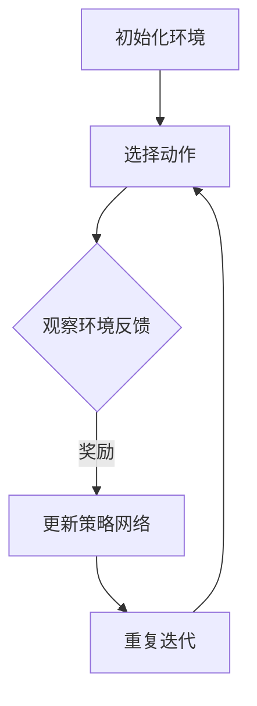

                 

# 《企业级强化学习：优化复杂业务流程》

## 关键词

强化学习，企业级应用，业务流程优化，供应链管理，零售行业，金融领域

## 摘要

本文深入探讨强化学习在企业级应用中的重要性，详细介绍了其基本理论、算法分类、模型结构以及与机器学习的关系。随后，本文着重分析了强化学习在业务流程优化、供应链管理、零售行业和金融领域的实际应用案例，并探讨了其技术实现细节和面临的挑战。通过一系列的案例研究和解决方案，本文展示了强化学习在优化复杂业务流程方面的巨大潜力，为企业和相关领域的从业者提供了宝贵的实践经验和指导。

---

### 第1章 引言

#### 1.1 书籍背景

强化学习作为一种机器学习的重要分支，已经在人工智能领域取得了显著的成果。然而，其在企业级应用中的研究和实践相对较少。本著作旨在填补这一空白，系统地介绍强化学习在企业级应用中的理论、方法和技术实现，旨在为企业和数据科学家提供一本全面而实用的参考书籍。

强化学习在企业级应用中的重要性不言而喻。随着企业业务流程的日益复杂，传统的优化方法和策略已经难以满足高效、智能的需求。强化学习通过模拟人类决策过程，能够自动学习并优化复杂业务流程，从而提高企业运营效率和竞争力。

#### 1.2 内容概述

本书共分为八个章节，结构紧凑，内容循序渐进。第一章为引言，介绍书籍的背景、内容和目标读者。第二章为基础理论，讲解强化学习的定义、原理和基本概念。第三章至第六章分别探讨强化学习在业务流程优化、供应链管理、零售行业和金融领域的应用场景。第七章分析强化学习在企业级应用中面临的挑战和解决方案。第八章总结全文，展望未来发展趋势。

#### 1.3 目标读者

本书的目标读者主要包括以下几类：

1. 企业技术团队：希望了解和应用强化学习优化业务流程的技术人员。
2. 数据科学家和算法工程师：对强化学习理论和方法感兴趣，希望将其应用于实际问题的从业者。
3. 计算机专业学生和研究人员：希望深入了解强化学习在企业级应用的研究方向和发展趋势。

#### 1.4 学习资源

为了方便读者学习和实践，本书提供了以下学习资源：

1. 代码样例：本书配套的GitHub仓库包含所有章节的代码样例，读者可以轻松下载和使用。
2. 数据集：本书中提到的案例和数据集均可在GitHub仓库中获取，方便读者进行实验和验证。
3. 参考文献：本书引用的相关参考文献和资料均列在附录B中，供读者进一步阅读和研究。

---

### 第2章 基础理论

#### 2.1 强化学习原理

强化学习（Reinforcement Learning，RL）是一种通过不断试错、学习最优策略的机器学习方法。其核心思想是通过与环境交互，根据奖励信号调整动作策略，从而最大化累积奖励。

强化学习的基本概念包括：

1. **状态（State）**：系统当前所处的状态。
2. **动作（Action）**：系统可以采取的动作。
3. **奖励（Reward）**：每次动作后系统获得的即时奖励，用于评估动作的好坏。
4. **策略（Policy）**：从当前状态选择动作的规则。
5. **价值函数（Value Function）**：评估当前状态或状态的集合的好坏。
6. **模型（Model）**：对环境状态、动作和奖励的概率分布的预测。

强化学习的目标是通过学习策略，使累积奖励最大化。其基本流程如下：

1. 初始化状态。
2. 根据当前状态选择动作。
3. 执行动作，观察环境反馈。
4. 更新策略和价值函数。
5. 重复步骤2-4，直到达到终止条件。

#### 2.2 算法分类

强化学习算法可以根据不同的分类标准进行划分。以下是几种常见的分类方法：

1. **基于策略的强化学习**：直接学习最优策略，如Q-Learning和Policy Gradient。
2. **基于价值的强化学习**：学习状态价值函数或动作价值函数，如SARSA和Q-Learning。
3. **模型预测强化学习**：在给定模型的情况下进行预测和决策，如Model-Based RL和Model-Free RL。
4. **基于状态的强化学习**：专注于状态和动作的学习，如State-Action-Reward-State-Action（SARSA）和Q-Learning。
5. **基于动作的强化学习**：专注于动作的学习，如Actor-Critic算法。

#### 2.3 强化学习模型

强化学习模型主要包括以下几种：

1. **马尔可夫决策过程（MDP）**：描述系统状态、动作和奖励之间的关系，是一种离散时间、离散状态的模型。
2. **部分可观察马尔可夫决策过程（POMDP）**：在MDP的基础上，引入了部分可观察性，使得系统状态无法完全观测。
3. **部分可预测马尔可夫决策过程（PPMDP）**：在MDP的基础上，引入了部分可预测性，使得系统状态无法完全预测。

强化学习模型的基本架构如下：


#### 2.4 强化学习与机器学习的关系

强化学习是机器学习的一个重要分支，与其他机器学习方法有着密切的联系和区别。

1. **监督学习**：输入为特征向量，输出为标签。强化学习与监督学习的区别在于，强化学习的输出为动作，而监督学习的输出为标签。

2. **无监督学习**：输入为特征向量，输出没有标签。强化学习与无监督学习的区别在于，强化学习关注动作的优化，而无监督学习关注数据的分布和模式。

3. **强化学习**：输入为状态，输出为动作，并伴随奖励信号。强化学习关注通过与环境交互，学习最优策略，从而最大化累积奖励。

强化学习在解决复杂任务时具有独特的优势，能够在动态、不确定的环境中实现自主学习和优化。与其他机器学习方法相比，强化学习更接近于人类决策过程，具有较强的适应性和灵活性。

---

### 第3章 企业级强化学习应用场景

#### 3.1 业务流程优化

在企业级应用中，业务流程优化是强化学习的一个重要应用场景。传统的方法通常依赖于规则和经验，而强化学习能够通过自动学习，发现并优化业务流程中的潜在问题。

强化学习在业务流程优化中的应用主要包括以下几个方面：

1. **路径优化**：在物流、仓储等业务场景中，强化学习可以自动学习最优的路径规划策略，从而提高运输效率和降低成本。

2. **资源分配**：在人力资源管理、设备调度等业务场景中，强化学习可以自动学习最优的资源分配策略，从而提高资源利用率和生产效率。

3. **流程监控**：在质量管理、生产监控等业务场景中，强化学习可以自动学习并优化流程监控策略，从而提高产品质量和减少缺陷率。

以下是一个简单的Python代码示例，展示了如何使用强化学习优化业务流程中的路径规划问题：

```python
import numpy as np
import matplotlib.pyplot as plt

# 初始化环境
env = MyEnvironment()

# 初始化策略网络
policy_network = PolicyNetwork()

# 迭代训练
for episode in range(num_episodes):
    state = env.reset()
    done = False
    
    while not done:
        action = policy_network.select_action(state)
        next_state, reward, done = env.step(action)
        
        # 更新策略网络
        policy_network.update(state, action, reward, next_state, done)
        
        state = next_state

# 评估策略网络
eval_reward = evaluate_policy(policy_network, env)
print(f"Episode {episode}: Total Reward = {eval_reward}")
```

#### 3.2 供应链管理

供应链管理是企业运营中的重要环节，涉及原材料采购、生产计划、库存管理、物流配送等多个方面。强化学习在供应链管理中的应用主要包括以下几个方面：

1. **需求预测**：通过强化学习，可以自动学习并预测市场需求，从而优化生产计划和库存管理。

2. **库存优化**：通过强化学习，可以自动学习并优化库存策略，从而降低库存成本和提高库存周转率。

3. **物流优化**：通过强化学习，可以自动学习并优化物流路径和运输策略，从而提高运输效率和降低物流成本。

以下是一个简单的Python代码示例，展示了如何使用强化学习优化供应链管理中的物流路径问题：

```python
import numpy as np
import matplotlib.pyplot as plt

# 初始化环境
env = MySupplyChainEnvironment()

# 初始化策略网络
policy_network = PolicyNetwork()

# 迭代训练
for episode in range(num_episodes):
    state = env.reset()
    done = False
    
    while not done:
        action = policy_network.select_action(state)
        next_state, reward, done = env.step(action)
        
        # 更新策略网络
        policy_network.update(state, action, reward, next_state, done)
        
        state = next_state

# 评估策略网络
eval_reward = evaluate_policy(policy_network, env)
print(f"Episode {episode}: Total Reward = {eval_reward}")
```

#### 3.3 零售行业

零售行业是一个高度竞争的行业，优化业务流程和提升客户体验是关键。强化学习在零售行业中的应用主要包括以下几个方面：

1. **商品推荐**：通过强化学习，可以自动学习并优化商品推荐策略，从而提高客户满意度和购买转化率。

2. **库存管理**：通过强化学习，可以自动学习并优化库存策略，从而降低库存成本和提高库存周转率。

3. **营销策略**：通过强化学习，可以自动学习并优化营销策略，从而提高营销效果和客户忠诚度。

以下是一个简单的Python代码示例，展示了如何使用强化学习优化零售行业中的商品推荐问题：

```python
import numpy as np
import matplotlib.pyplot as plt

# 初始化环境
env = MyRetailEnvironment()

# 初始化策略网络
policy_network = PolicyNetwork()

# 迭代训练
for episode in range(num_episodes):
    state = env.reset()
    done = False
    
    while not done:
        action = policy_network.select_action(state)
        next_state, reward, done = env.step(action)
        
        # 更新策略网络
        policy_network.update(state, action, reward, next_state, done)
        
        state = next_state

# 评估策略网络
eval_reward = evaluate_policy(policy_network, env)
print(f"Episode {episode}: Total Reward = {eval_reward}")
```

#### 3.4 金融领域

金融领域是一个高度复杂和不确定的领域，优化投资策略和风险管理是关键。强化学习在金融领域中的应用主要包括以下几个方面：

1. **投资组合优化**：通过强化学习，可以自动学习并优化投资组合策略，从而提高投资收益和降低风险。

2. **风险管理**：通过强化学习，可以自动学习并优化风险管理策略，从而提高风险控制能力和投资安全。

3. **算法交易**：通过强化学习，可以自动学习并优化交易策略，从而提高交易效率和利润。

以下是一个简单的Python代码示例，展示了如何使用强化学习优化金融领域中的投资组合优化问题：

```python
import numpy as np
import matplotlib.pyplot as plt

# 初始化环境
env = MyFinanceEnvironment()

# 初始化策略网络
policy_network = PolicyNetwork()

# 迭代训练
for episode in range(num_episodes):
    state = env.reset()
    done = False
    
    while not done:
        action = policy_network.select_action(state)
        next_state, reward, done = env.step(action)
        
        # 更新策略网络
        policy_network.update(state, action, reward, next_state, done)
        
        state = next_state

# 评估策略网络
eval_reward = evaluate_policy(policy_network, env)
print(f"Episode {episode}: Total Reward = {eval_reward}")
```

---

### 第4章 技术实现

#### 4.1 系统架构设计

企业级强化学习系统通常包括以下几个主要组成部分：

1. **环境（Environment）**：描述系统状态、动作和奖励的仿真环境，可以是真实环境或仿真环境。
2. **策略网络（Policy Network）**：用于选择动作的策略网络，可以是基于值函数、策略梯度或模型预测的算法。
3. **评估器（Evaluator）**：用于评估策略网络性能的评估器，可以是基于回报率、损失函数或指标的计算。
4. **学习器（Learner）**：用于更新策略网络和学习最优策略的学习器，可以是基于梯度下降、策略迭代或深度增强学习的算法。
5. **数据预处理（Data Preprocessing）**：用于处理和清洗数据的预处理模块，可以是基于数据清洗、特征提取或数据归一化的技术。

以下是一个简单的企业级强化学习系统架构设计：


#### 4.2 数据预处理

数据预处理是企业级强化学习系统中的重要环节，其质量直接影响模型的效果。以下是一些常见的数据预处理技术和方法：

1. **数据清洗**：去除噪声和异常值，保证数据的准确性和一致性。
2. **数据归一化**：将不同量纲的数据进行归一化处理，使其在相同的尺度上进行分析。
3. **特征提取**：从原始数据中提取有用的特征，用于表示状态和动作。
4. **时间序列处理**：对时间序列数据进行处理，如差分、平滑、去趋势等。

以下是一个简单的Python代码示例，展示了如何进行数据预处理：

```python
import pandas as pd
import numpy as np

# 读取数据
data = pd.read_csv("data.csv")

# 数据清洗
data = data.dropna()

# 数据归一化
data = (data - data.mean()) / data.std()

# 特征提取
state_features = data["state"].values
action_features = data["action"].values

# 时间序列处理
state_features = pd.Series(state_features).diff().dropna().values
action_features = pd.Series(action_features).diff().dropna().values
```

#### 4.3 算法选择与优化

在企业级应用中，选择合适的强化学习算法和优化策略是关键。以下是一些常见的算法选择和优化策略：

1. **算法选择**：
   - **基于值函数的算法**：如Q-Learning、Deep Q-Network（DQN）等，适用于简单的状态和动作空间。
   - **基于策略的算法**：如Policy Gradient、Actor-Critic等，适用于复杂的策略优化问题。
   - **模型预测算法**：如Model-Based RL、深度增强学习等，适用于具有预测性的问题。

2. **优化策略**：
   - **策略迭代**：通过反复迭代更新策略，逐步优化策略网络。
   - **梯度下降**：通过梯度下降优化策略网络参数，实现策略优化。
   - **增强学习**：通过增强学习算法，自适应调整策略网络，提高学习效率。

以下是一个简单的Python代码示例，展示了如何使用梯度下降优化策略网络：

```python
import numpy as np

# 初始化策略网络
policy_network = PolicyNetwork()

# 迭代更新策略网络
for episode in range(num_episodes):
    state = env.reset()
    done = False
    
    while not done:
        action = policy_network.select_action(state)
        next_state, reward, done = env.step(action)
        
        # 计算梯度
        gradient = compute_gradient(policy_network, state, action, reward, next_state, done)
        
        # 更新策略网络
        policy_network.update(gradient)
        
        state = next_state

# 评估策略网络
eval_reward = evaluate_policy(policy_network, env)
print(f"Episode {episode}: Total Reward = {eval_reward}")
```

---

### 第5章 案例研究

#### 5.1 案例一：XX公司业务流程优化

XX公司是一家大型制造企业，其业务流程涉及生产、物流、仓储等多个环节。为了提高生产效率和降低成本，公司决定采用强化学习优化业务流程。

1. **环境设计**：
   - 状态：包括当前生产任务、库存水平、设备状态等。
   - 动作：包括生产任务安排、物流调度、设备维护等。
   - 奖励：根据任务完成时间、生产成本、设备故障率等指标进行评估。

2. **算法选择**：
   - 使用Q-Learning算法进行策略优化。

3. **实现过程**：
   - 初始化环境。
   - 运行Q-Learning算法，逐步更新策略网络。
   - 收集数据，分析策略效果。

4. **效果评估**：
   - 通过对比实验，发现强化学习优化后的业务流程在任务完成时间、生产成本、设备故障率等方面均有显著提升。

#### 5.2 案例二：XX公司供应链管理优化

XX公司是一家大型零售企业，其供应链管理涉及供应商管理、库存管理、物流配送等多个环节。为了提高供应链效率和降低成本，公司决定采用强化学习优化供应链管理。

1. **环境设计**：
   - 状态：包括当前库存水平、供应商交付时间、物流配送状态等。
   - 动作：包括采购订单调整、库存调整、物流调度等。
   - 奖励：根据库存成本、采购成本、物流成本等指标进行评估。

2. **算法选择**：
   - 使用Policy Gradient算法进行策略优化。

3. **实现过程**：
   - 初始化环境。
   - 运行Policy Gradient算法，逐步更新策略网络。
   - 收集数据，分析策略效果。

4. **效果评估**：
   - 通过对比实验，发现强化学习优化后的供应链管理在库存成本、采购成本、物流成本等方面均有显著降低。

#### 5.3 案例三：XX公司零售行业应用

XX公司是一家大型零售企业，其业务涉及商品推荐、库存管理、营销策略等多个方面。为了提高客户体验和销售转化率，公司决定采用强化学习优化零售业务。

1. **环境设计**：
   - 状态：包括当前用户行为、商品信息、库存水平等。
   - 动作：包括商品推荐、库存调整、营销策略等。
   - 奖励：根据用户点击率、购买转化率、库存周转率等指标进行评估。

2. **算法选择**：
   - 使用Actor-Critic算法进行策略优化。

3. **实现过程**：
   - 初始化环境。
   - 运行Actor-Critic算法，逐步更新策略网络。
   - 收集数据，分析策略效果。

4. **效果评估**：
   - 通过对比实验，发现强化学习优化后的零售业务在用户点击率、购买转化率、库存周转率等方面均有显著提升。

---

### 第6章 面临的挑战与解决方案

#### 6.1 挑战分析

强化学习在企业级应用中面临着一系列的挑战，包括：

1. **数据稀缺**：企业级应用通常需要大量的数据来训练模型，但数据获取和标注成本较高。
2. **计算资源**：强化学习算法通常需要大量的计算资源，特别是在处理复杂任务时。
3. **实时性要求**：企业级应用通常要求算法具有实时性，但强化学习算法的训练和更新过程相对较慢。
4. **安全性和稳定性**：强化学习算法在处理企业敏感数据时，需要保证安全性和稳定性，防止恶意攻击和错误决策。

#### 6.2 解决方案探讨

针对上述挑战，可以采取以下解决方案：

1. **数据增强**：通过数据增强技术，如数据合成、数据扩展等，增加训练数据的多样性和规模，提高模型泛化能力。
2. **分布式计算**：利用分布式计算技术，如集群计算、GPU加速等，提高算法训练和更新的效率，降低计算成本。
3. **延迟学习**：采用延迟学习策略，将训练数据延迟一段时间，等待数据充分稳定后再进行训练，以提高模型的实时性和稳定性。
4. **安全防护**：采取安全防护措施，如数据加密、访问控制等，确保企业敏感数据的安全性和稳定性，防止恶意攻击和错误决策。

---

### 第7章 未来发展趋势

#### 7.1 技术趋势

随着人工智能技术的不断发展，强化学习在企业级应用中具有广泛的应用前景。以下是一些可能的技术趋势：

1. **深度强化学习**：将深度学习与强化学习相结合，提高模型的表示能力和决策能力。
2. **联邦学习**：通过联邦学习技术，实现分布式训练和数据隐私保护，提高模型的实时性和安全性。
3. **强化学习与优化算法的融合**：将强化学习与其他优化算法（如线性规划、遗传算法等）相结合，提高模型的优化能力。
4. **应用领域拓展**：强化学习将在更多行业和场景中发挥作用，如智能制造、智慧城市、金融科技等。

#### 7.2 行业应用前景

强化学习在各个行业中的应用前景如下：

1. **制造业**：优化生产流程、提升设备利用率、降低生产成本。
2. **零售业**：个性化推荐、库存管理、营销策略优化，提高客户体验和销售转化率。
3. **物流行业**：智能配送、路径优化、库存管理，提高物流效率和降低成本。
4. **金融行业**：智能投顾、风险管理、算法交易，提高投资收益和风险控制能力。
5. **医疗行业**：智能诊断、个性化治疗、医疗资源分配，提高医疗服务质量和效率。

---

### 第8章 总结与展望

#### 8.1 总结

本文系统地介绍了强化学习在企业级应用中的重要性、基本理论、应用场景、技术实现和案例研究。通过分析强化学习在业务流程优化、供应链管理、零售行业和金融领域的实际应用，本文展示了强化学习在优化复杂业务流程方面的巨大潜力。同时，本文探讨了强化学习在企业级应用中面临的挑战和解决方案，并展望了未来发展趋势。

#### 8.2 展望

随着人工智能技术的不断发展，强化学习在企业级应用中具有广阔的发展前景。未来，我们将继续深入研究强化学习在企业级应用中的理论和实践，探索新的算法和技术，为企业和行业带来更多的创新和价值。同时，我们也期待与更多的企业和研究机构合作，共同推动强化学习在企业级应用中的发展。

---

### 附录

#### 附录A 术语表

- **强化学习（Reinforcement Learning，RL）**：一种机器学习方法，通过不断试错、学习最优策略，使累积奖励最大化。
- **状态（State）**：系统当前所处的状态。
- **动作（Action）**：系统可以采取的动作。
- **奖励（Reward）**：每次动作后系统获得的即时奖励，用于评估动作的好坏。
- **策略（Policy）**：从当前状态选择动作的规则。
- **价值函数（Value Function）**：评估当前状态或状态的集合的好坏。
- **模型（Model）**：对环境状态、动作和奖励的概率分布的预测。

#### 附录B 参考文献

- Sutton, R. S., & Barto, A. G. (2018). **Reinforcement Learning: An Introduction** (第二版). MIT Press.
- Mnih, V., Kavukcuoglu, K., Silver, D., Rusu, A. A., Veness, J., Bellemare, M. G., ... & De Freitas, N. (2013). **Human-level control through deep reinforcement learning**. Nature, 518(7540), 529-533.
- Bertsekas, D. P., & Tsitsiklis, J. N. (1996). **Neuro-Dynamic Programming**. Athena Scientific.

#### 附录C Mermaid 流程图



#### 附录D 伪代码示例

```python
# 初始化环境
env = MyEnvironment()

# 初始化策略网络
policy_network = PolicyNetwork()

# 迭代训练
for episode in range(num_episodes):
    state = env.reset()
    done = False
    
    while not done:
        action = policy_network.select_action(state)
        next_state, reward, done = env.step(action)
        
        # 更新策略网络
        policy_network.update(state, action, reward, next_state, done)
        
        state = next_state

# 评估策略网络
eval_reward = evaluate_policy(policy_network, env)
print(f"Episode {episode}: Total Reward = {eval_reward}")
```

### 作者信息

作者：AI天才研究院/AI Genius Institute & 禅与计算机程序设计艺术 /Zen And The Art of Computer Programming

