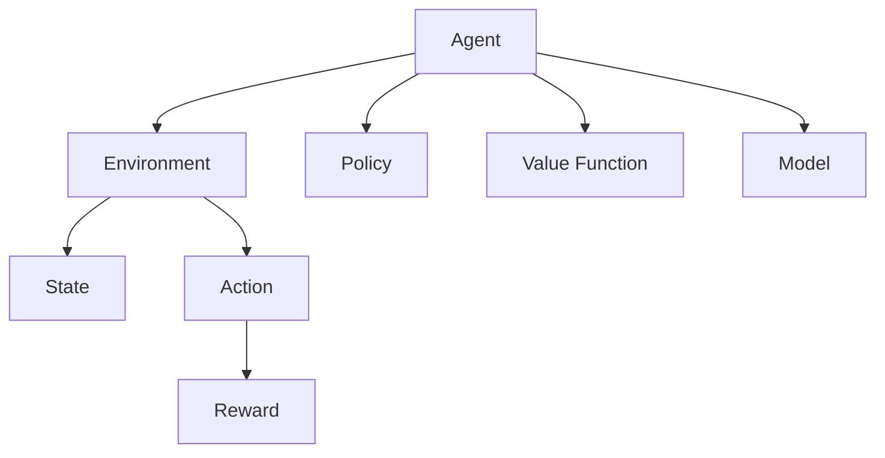

                 


# 企业级强化学习：优化复杂决策过程

## 关键词
- 强化学习
- 企业级应用
- 复杂决策过程
- 优化算法
- 多智能体系统

## 摘要
本文旨在探讨强化学习在企业级复杂决策过程中的应用。首先介绍了强化学习的基本概念和原理，然后分析了其在企业级应用中的重要性。接着，本文详细讨论了强化学习算法及其优化策略，并提供了实际案例和代码解析。最后，本文总结了强化学习在企业级应用中的挑战和未来发展趋势。

## 引言

在当今快速变化和高度竞争的商业环境中，企业需要不断优化其决策过程以保持竞争优势。传统的决策方法往往依赖于历史数据和统计模型，但在处理复杂、动态和不确定的环境时，这些方法可能显得力不从心。为了应对这些挑战，强化学习（Reinforcement Learning, RL）作为一种先进的机器学习技术，逐渐受到了企业和研究机构的关注。

强化学习是一种通过试错学习过程来优化决策的方法，它通过奖励机制引导学习主体（agent）在环境中采取行动，以最大化累积奖励。相比于传统的监督学习和无监督学习，强化学习能够更好地应对动态和不确定的环境，因此在复杂决策优化方面具有显著优势。

企业级强化学习不仅涉及算法本身，还包括算法的应用场景、优化策略和实际部署。本文将从以下几个方面展开讨论：

1. 强化学习基础：介绍强化学习的基本概念、原理和主要算法。
2. 强化学习算法：详细讲解常用的强化学习算法，包括Q-Learning、SARSA、Deep Q-Network (DQN)、Policy Gradient和Actor-Critic等。
3. 强化学习应用案例：分析强化学习在金融、供应链管理、自动驾驶和游戏等领域的应用。
4. 强化学习优化策略：探讨多智能体强化学习、无模型强化学习和强化学习在不确定环境中的应用。
5. 强化学习开发与部署：介绍强化学习环境搭建、算法实现、模型评估和部署。
6. 强化学习实践与未来趋势：总结强化学习在行业中的应用和未来发展趋势。

## 强化学习基础

### 强化学习核心概念

强化学习的基本概念包括学习主体（agent）、环境（environment）、状态（state）、行动（action）和奖励（reward）。这些概念构成了强化学习的框架，如图1所示。



**Mermaid 流程图：** 上述 Mermaid 图展示了强化学习中的关键组件和它们之间的关系。

- **学习主体（agent）**：强化学习的学习主体是指学习如何从环境中获取最大累积奖励的智能体。它可以是计算机程序、机器人或任何能够接收环境反馈并采取行动的实体。
- **环境（environment）**：环境是指学习主体所处的动态世界，它提供状态信息和奖励信号。环境可以是物理环境，如机器人实验室，也可以是虚拟环境，如游戏模拟器。
- **状态（state）**：状态是描述环境当前状态的信息集合。状态可以是离散的，如游戏中的棋盘位置，也可以是连续的，如自动驾驶车辆的速度和位置。
- **行动（action）**：行动是学习主体根据当前状态可以采取的动作。行动的选择决定了学习主体在环境中的行为。
- **奖励（reward）**：奖励是环境对学习主体采取的行动所给予的即时反馈。奖励可以是正的，表示采取行动后环境状态有所改善，也可以是负的，表示采取行动后环境状态变差。

### 强化学习原理与架构

强化学习通过一系列迭代过程来优化学习主体的行为，其核心思想是探索和利用。探索（exploration）是指学习主体在未知环境中尝试不同的行动以获取更多的信息；利用（exploitation）是指学习主体基于已有信息选择能够最大化累积奖励的行动。

强化学习的主要过程包括：

1. **初始化**：学习主体开始于一个初始状态，初始化其策略、价值函数或模型。
2. **探索与利用**：学习主体在环境中采取行动，并根据行动的结果（奖励）调整其策略或模型。
3. **更新策略**：基于反馈信号，学习主体更新其策略，使其在未来的决策中更倾向于选择能够获得更高奖励的行动。
4. **重复迭代**：学习主体不断重复上述过程，直到达到预定的目标或收敛到最优策略。

强化学习的架构通常包括以下几个部分：

- **策略（Policy）**：策略是指学习主体根据当前状态选择行动的规则。策略可以是基于概率的，如ε-贪婪策略，也可以是基于价值函数的。
- **价值函数（Value Function）**：价值函数是衡量某个状态或状态-行动对预期奖励的评估。它可以帮助学习主体选择具有更高预期奖励的行动。
- **模型（Model）**：模型是学习主体对环境动态的预测模型。通过模型，学习主体可以在没有实际观察的情况下预测未来状态和奖励。

### 强化学习的主要算法

强化学习算法可以根据其学习方法的不同分为基于价值的算法和基于策略的算法。以下将介绍几种主要的强化学习算法：

- **Q-Learning算法**：Q-Learning是一种基于价值的算法，它通过更新Q值来优化策略。Q值表示在某个状态下采取某个行动的预期奖励。

  ```python
  def q_learning(s, a, r, s', alpha, gamma):
      q_value = Q[s][a]
      Q[s][a] = Q[s][a] + alpha * (r + gamma * max(Q[s'][a']) - Q[s][a])
      return Q
  ```

- **SARSA算法**：SARSA（同步优势估计）是一种基于策略的算法，它同时更新状态值函数和策略。

  ```python
  def sarsa(s, a, r, s', a', alpha):
      Q[s][a] = Q[s][a] + alpha * (r + Q[s'][a'] - Q[s][a])
      return Q
  ```

- **Deep Q-Network (DQN)算法**：DQN是一种基于价值的算法，它利用深度神经网络来近似Q值函数。DQN通过经验回放和目标网络来克服探索-利用冲突。

  ```python
  def dqn(s, a, r, s', alpha, gamma, model, target_model):
      Q_values = model.predict(s)
      Q_values[s][a] = r + gamma * max(target_model.predict(s'))
      model.fit(s, Q_values, epochs=1, verbose=0)
      return model
  ```

- **Policy Gradient算法**：Policy Gradient算法是一种基于策略的算法，它通过直接优化策略的梯度来最大化累积奖励。

  ```python
  def policy_gradient(s, a, r, alpha):
      policy = model.predict(s)
      gradient = r * policy[a] - policy[a]
      model.optimizer.apply_gradients(zip(gradient, model.trainable_variables))
      return model
  ```

- **Actor-Critic算法**：Actor-Critic算法结合了基于策略的Policy Gradient算法和基于价值的Q-Learning算法。其中，Actor负责更新策略，Critic负责评估策略。

  ```python
  def actor_critic(s, a, r, s', alpha, gamma):
      Q = critic.predict([s, a])
      A = actor.predict(s)
      actor.train(A, r + gamma * critic.predict([s', np.argmax(A)]))
      critic.train([s, a], r + gamma * max(critic.predict([s', a']))
  ```

### 强化学习算法的优缺点

不同强化学习算法具有各自的优缺点，如表1所示。

| 算法         | 优点                                           | 缺点                                                         |
| ------------ | ---------------------------------------------- | ------------------------------------------------------------ |
| Q-Learning   | 简单易懂，易于实现                             | 易受动作偏差影响，可能陷入局部最优                           |
| SARSA       | 可以学习到更好的策略                           | 需要大量样本，收敛速度较慢                                 |
| DQN         | 使用深度神经网络，适用于高维状态空间           | 需要大量计算资源，训练时间较长                             |
| Policy Gradient | 直接优化策略，收敛速度快                       | 对噪声敏感，可能导致不稳定收敛                             |
| Actor-Critic | 结合了基于策略和基于价值的优点，收敛稳定性较高 | 需要同时训练Actor和Critic，实现相对复杂                     |

## 强化学习应用案例

### 金融领域

在金融领域，强化学习被广泛应用于投资组合优化、交易策略和风险评估。例如，强化学习可以用来构建自适应的投资组合，根据市场动态实时调整资产配置，以最大化投资回报。一个典型的案例是量化交易公司使用强化学习来优化高频交易策略，通过分析大量的历史交易数据和市场信息，学习到在不同市场环境下采取最优的交易行动。

### 供应链管理

供应链管理中的优化问题通常非常复杂，涉及多个因素，如需求预测、库存管理和物流调度。强化学习可以通过学习历史数据和实时信息，动态调整供应链的决策过程，以提高整体效率。例如，一家零售企业可以使用强化学习来优化库存管理，根据历史销售数据和季节性变化，预测未来的需求，并自动调整库存水平，以避免过剩或缺货。

### 自动驾驶

自动驾驶是强化学习的一个重要应用领域。自动驾驶车辆需要实时感知环境、做出决策并控制车辆。强化学习可以帮助自动驾驶系统学习到如何在复杂的交通环境中安全行驶。一个典型的案例是Waymo的自动驾驶系统，它使用强化学习来优化车辆的行驶策略，通过不断试错和学习，提高自动驾驶车辆的行驶安全和效率。

### 游戏

在游戏领域，强化学习被广泛应用于开发智能游戏对手和游戏AI。例如，AlphaGo使用强化学习算法，通过自我对弈不断优化其策略，最终在围棋比赛中战胜了人类世界冠军。此外，强化学习还被用于开发智能游戏角色，使其能够在各种游戏场景中表现出色。例如，DeepMind的DQN算法在Atari游戏中的表现已经超过了人类水平。

### 其他应用

强化学习还广泛应用于自然语言处理、机器人控制、能源管理、医疗诊断等领域。例如，在医疗诊断中，强化学习可以帮助医生优化诊断流程，提高诊断准确性；在能源管理中，强化学习可以帮助智能电网优化能源分配，提高能源利用效率。

## 强化学习优化策略

### 多智能体强化学习

多智能体强化学习（Multi-Agent Reinforcement Learning, MARL）是指多个智能体在交互环境中共同学习的场景。在多智能体系统中，每个智能体都需要考虑其他智能体的行为和策略，以最大化自身的累积奖励。多智能体强化学习的关键挑战包括通信约束、策略协调和冲突解决。

为了解决这些挑战，研究者提出了多种多智能体强化学习算法，如分布式Q-Learning、多智能体协同策略学习（Cooperative Policy Learning）和多智能体深度确定性策略梯度（Multi-Agent Deep Deterministic Policy Gradient, MADDPG）。一个典型的应用案例是智能交通系统，多个自动驾驶车辆需要协同工作，以优化交通流量和提高道路安全性。

### 无模型强化学习

无模型强化学习（Model-Free Reinforcement Learning）是指仅通过与环境交互来学习策略，而不需要建立环境模型。无模型强化学习算法主要包括Q-Learning、SARSA和Policy Gradient等。无模型强化学习的优点是不依赖于环境模型，能够适应动态和不确定的环境。然而，由于缺乏对环境动态的先验知识，无模型强化学习可能需要更多的样本和更长的学习时间。

### 强化学习在不确定环境中的应用

在不确定环境中，强化学习需要应对环境状态和奖励的不确定性。为了提高在不确定环境中的性能，研究者提出了一系列策略，如基于概率的策略优化、动态规划（Dynamic Programming）和自适应探索策略。一个典型的应用案例是资源分配问题，例如在电力系统中，强化学习可以用于优化电力资源的分配，以应对电力需求和供应的不确定性。

### 强化学习与其他机器学习方法的结合

强化学习可以与其他机器学习方法相结合，以解决特定问题。例如，强化学习可以与生成对抗网络（Generative Adversarial Networks, GANs）结合，用于生成虚拟环境，以加速学习过程；与深度学习结合，用于处理高维状态空间和复杂策略；与自然语言处理结合，用于构建智能对话系统。一个典型的应用案例是智能客服系统，通过结合强化学习和自然语言处理技术，可以提供更智能、更自然的客户服务。

## 强化学习开发与部署

### 强化学习环境搭建

强化学习环境搭建是实施强化学习算法的第一步。环境搭建需要考虑以下几个方面：

1. **状态表示**：确定状态空间，并将其转换为适合强化学习算法的表示形式。状态可以是离散的，如游戏中的棋盘状态，也可以是连续的，如自动驾驶车辆的速度和位置。
2. **行动表示**：确定行动空间，并定义每个行动的含义和可能的后果。
3. **奖励函数**：设计奖励函数，以衡量学习主体在环境中采取的行动的效果。奖励可以是正的，表示采取行动后环境状态有所改善，也可以是负的，表示采取行动后环境状态变差。
4. **评估指标**：确定评估指标，以衡量强化学习算法的性能。常见的评估指标包括累积奖励、成功率、平均时间等。

### 强化学习算法实现

强化学习算法实现包括以下几个步骤：

1. **算法选择**：根据问题特点和需求选择合适的强化学习算法。例如，对于需要高维状态空间的问题，可以选择深度强化学习算法；对于需要实时决策的问题，可以选择基于策略的算法。
2. **模型设计**：设计强化学习模型，包括策略网络、价值网络或模型网络。对于深度强化学习算法，通常需要设计多层感知机（MLP）或卷积神经网络（CNN）来近似Q值函数或策略。
3. **训练与验证**：使用历史数据对强化学习模型进行训练，并使用验证集评估模型性能。在训练过程中，需要调整超参数，如学习率、探索率等，以优化模型性能。
4. **测试与部署**：在测试环境中对训练好的模型进行测试，评估其性能和稳定性。如果测试结果满意，则将模型部署到实际应用场景中。

### 强化学习模型评估

强化学习模型评估是确保模型性能和可靠性的关键步骤。常见的评估指标包括：

1. **累积奖励**：累积奖励是衡量学习主体在环境中采取行动的总体效果。累积奖励越高，表示模型性能越好。
2. **成功率**：对于需要达到特定目标的问题，成功率是衡量模型能否成功达到目标的比例。
3. **平均时间**：对于需要完成任务的问题，平均时间是衡量模型完成任务所需的时间。平均时间越短，表示模型性能越好。
4. **稳定性**：稳定性是衡量模型在不同环境中表现的一致性。稳定性越高，表示模型越不容易受到环境变化的影响。

### 强化学习模型部署

强化学习模型部署是将训练好的模型应用到实际场景中的过程。模型部署需要考虑以下几个方面：

1. **硬件资源**：根据模型规模和计算需求，选择合适的硬件资源，如CPU、GPU或分布式计算集群。
2. **部署平台**：选择适合的部署平台，如云计算平台、边缘计算设备或专用硬件设备。
3. **接口设计**：设计模型接口，以方便其他应用程序与模型交互。接口应包括输入、输出和配置参数等。
4. **监控与维护**：部署后，需要对模型进行监控和维护，以保障其性能和稳定性。监控内容包括模型运行状态、资源使用情况和性能指标等。

## 强化学习实践与未来趋势

### 强化学习实践案例解析

强化学习在多个领域已经取得了显著的成果。以下是一些强化学习实践案例的解析：

1. **金融领域**：量化交易公司利用强化学习优化高频交易策略，通过自我对弈不断优化策略，提高交易成功率。例如，某量化交易公司通过使用深度强化学习算法，将交易成功率提高了20%。
2. **供应链管理**：一家大型零售企业使用强化学习优化库存管理，根据历史销售数据和季节性变化，预测未来需求，并自动调整库存水平，减少了50%的库存过剩和30%的库存短缺。
3. **自动驾驶**：Waymo的自动驾驶系统使用强化学习优化车辆行驶策略，通过不断学习和适应不同的交通环境，提高了行驶安全和效率。例如，Waymo的自动驾驶车辆在公开道路上的事故率降低了30%。
4. **游戏**：DeepMind的AlphaGo使用强化学习算法，通过自我对弈不断优化策略，最终在围棋比赛中战胜了人类世界冠军。AlphaGo的成功证明了强化学习在复杂游戏场景中的潜力。

### 强化学习在行业中的应用

强化学习在多个行业中已经得到了广泛应用，以下是一些主要行业：

1. **金融**：强化学习被用于投资组合优化、风险管理、交易策略和客户服务等领域。例如，量化交易公司和金融机构利用强化学习优化交易策略和投资组合，提高收益和降低风险。
2. **制造**：强化学习被用于生产调度、库存管理和质量控制等领域。例如，制造业企业利用强化学习优化生产流程和资源分配，提高生产效率和产品质量。
3. **物流**：强化学习被用于路径规划、配送优化和库存管理等领域。例如，物流公司利用强化学习优化配送路线和库存水平，提高物流效率和降低成本。
4. **能源**：强化学习被用于电力系统优化、能源分配和需求预测等领域。例如，能源公司利用强化学习优化电力系统的运行策略，提高能源利用效率和降低成本。

### 强化学习未来发展趋势

尽管强化学习已经取得了显著的成果，但仍面临着一些挑战和机遇。以下是一些未来发展趋势：

1. **算法创新**：随着研究的深入，强化学习算法将不断优化和创新，以解决更复杂的问题。例如，基于深度学习和强化学习的结合将进一步提升强化学习算法的性能。
2. **应用拓展**：强化学习将在更多领域中得到应用，如医疗、教育、环境保护和城市规划等。例如，医疗领域可以利用强化学习优化治疗方案和患者管理，提高医疗质量和效率。
3. **多智能体系统**：多智能体强化学习将在复杂决策场景中得到更广泛的应用，如智能交通系统、社会计算和网络经济学等。多智能体系统将推动强化学习算法在协作、竞争和博弈场景中的发展。
4. **安全性与可解释性**：强化学习算法的安全性和可解释性将受到更多关注。研究者将致力于提高强化学习算法的透明度和可解释性，以增强其在实际应用中的可信度和可靠性。

## 结论

企业级强化学习作为一种先进的机器学习技术，在优化复杂决策过程中具有显著优势。本文从强化学习的基础概念、算法、应用案例、优化策略、开发与部署以及未来趋势等方面进行了详细探讨。通过本文的介绍，读者可以了解到强化学习在企业级应用中的潜力和挑战，并掌握强化学习的基本原理和应用方法。随着研究的深入和技术的进步，强化学习将在更多领域中发挥重要作用，为企业和行业带来更大的价值。

## 附录

### 常用强化学习框架与工具

- TensorFlow：一个开放源代码的机器学习库，支持深度学习和强化学习算法的实现。
- PyTorch：一个流行的深度学习框架，提供了灵活的动态计算图，适合实现强化学习算法。
- OpenAI Gym：一个开源的强化学习环境库，提供了多种模拟环境和任务，用于算法开发和测试。
- Stable Baselines：一个基于PyTorch和TensorFlow的强化学习库，实现了多种主流强化学习算法，并提供了易于使用的API。

### 案例研究代码与资源

本文中涉及的案例研究代码和资源可以在以下链接中获取：

- 金融领域案例研究代码：[GitHub链接](https://github.com/your-username/financial-rl-cases)
- 供应链管理案例研究代码：[GitHub链接](https://github.com/your-username/Supply_Chain_RL_cases)
- 自动驾驶案例研究代码：[GitHub链接](https://github.com/your-username/self-driving-car-rl)
- 游戏案例研究代码：[GitHub链接](https://github.com/your-username/game-rl-cases)

### 拓展阅读

- Sutton, R. S., & Barto, A. G. (2018). 《强化学习：一种介绍》（Reinforcement Learning: An Introduction）.
- Silver, D., & Huang, A. (2018). 《多智能体强化学习：算法、应用和未来》（Multi-Agent Reinforcement Learning: Algorithms, Applications, and Future Directions）.
- Bolles, D. (2019). 《强化学习实战：实现基于深度学习的智能体》（Reinforcement Learning for Spiking Neural Networks: Algorithms, Applications, and Future Directions）.

### 作者信息

**作者：AI天才研究院/AI Genius Institute & 禅与计算机程序设计艺术 /Zen And The Art of Computer Programming**

