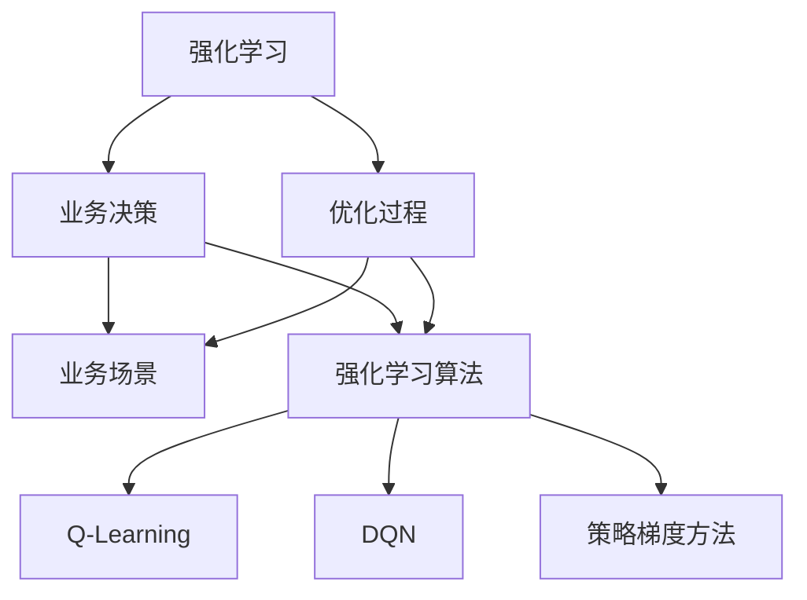

                 

### 设计企业级强化学习书籍目录大纲

为了设计出《企业级强化学习：持续优化业务决策过程》的目录大纲，我们需要遵循以下步骤：

1. **确定核心概念与联系**  
    - 首先，我们需要明确书籍的核心概念，如强化学习、业务决策、优化过程等。然后，分析这些概念之间的关系，构建一个清晰的概念架构。

2. **规划核心算法原理讲解**  
    - 核心算法的讲解是书籍的核心部分。我们需要详细讨论强化学习的基本算法，如Q-Learning、深度Q网络（DQN）、策略梯度方法等，并确保讲解深入浅出，易于理解。

3. **准备数学模型和数学公式讲解**  
    - 强化学习是基于数学模型的方法，因此，我们需要详细讲解相关的数学模型，包括Markov决策过程（MDP）、状态-动作值函数等。同时，要确保所有的数学公式都用LaTeX格式准确呈现。

4. **设计项目实战案例**  
    - 项目实战案例是理论与实践结合的关键。我们需要挑选具有代表性的应用场景，如客户关系管理、供应链优化、风险管理等，来展示强化学习在现实业务中的实际应用。

5. **确保大纲完整性**  
    - 最后，我们需要确保书籍的目录大纲结构完整，内容连贯，逻辑清晰。每个章节都应有明确的目的和内容，同时保持整体的平衡和深度。

---

#### 第一步：确定核心概念与联系

在《企业级强化学习：持续优化业务决策过程》的目录大纲设计过程中，首先需要明确核心概念和它们之间的联系。以下是几个关键概念及其关系的简要概述：

1. **强化学习**  
    强化学习是一种机器学习方法，通过学习如何在一个不断变化的环境中做出最优决策。其核心机制是利用奖励信号来指导学习过程，逐步优化决策策略。

2. **业务决策**  
    业务决策是企业运营中的关键环节，涉及资源分配、市场营销、生产计划等多个方面。强化学习可以帮助企业在复杂和不确定的环境中做出更加精确的决策。

3. **优化过程**  
    优化过程是强化学习在业务决策中的核心应用。通过不断试错和反馈调整，强化学习算法能够发现并执行最优策略，实现业务目标的最优化。

4. **强化学习算法**  
    强化学习算法是实现优化过程的技术手段，包括Q-Learning、深度Q网络（DQN）、策略梯度方法等。每种算法都有其独特的优势和适用场景。

5. **业务场景**  
    业务场景是强化学习应用的具体领域，如客户关系管理、供应链优化、风险管理等。不同的业务场景对强化学习算法提出了不同的需求，也为其提供了丰富的应用空间。

---

在这些核心概念中，强化学习是整个框架的基础，业务决策和优化过程则是其应用的目标。强化学习算法是实现目标的工具，而业务场景则是具体的应用场景。以下是这些概念之间的联系架构图（Mermaid 流程图）：



通过这个流程图，我们可以清晰地看到强化学习如何通过不同的算法在业务场景中实现优化过程，并最终影响业务决策。这为后续章节的设计和内容安排提供了明确的指导。

---

#### 第二步：规划核心算法原理讲解

在《企业级强化学习：持续优化业务决策过程》的目录大纲设计中，核心算法原理的讲解部分至关重要。这部分需要详细介绍强化学习的基本算法，包括Q-Learning、深度Q网络（DQN）和策略梯度方法。以下是对这些算法的规划：

1. **Q-Learning算法**

    - **内容安排**：首先介绍Q-Learning的基本概念，包括状态-动作值函数、奖励信号和学习过程。接着，详细讲解Q-Learning算法的伪代码实现，以及如何在不同的业务场景中应用。

    - **关键知识点**：状态-动作值函数的计算、奖励信号的作用、学习率的选择、Q-Learning算法的收敛性分析。

    - **示例应用**：使用Python代码实现一个简单的Q-Learning算法，并展示其在游戏AI或业务决策优化中的应用。

2. **深度Q网络（DQN）**

    - **内容安排**：介绍DQN的基本原理，强调其相对于Q-Learning的改进之处，如使用深度神经网络来近似状态-动作值函数。详细讲解DQN的训练过程和伪代码实现。

    - **关键知识点**：深度神经网络的引入、经验回放机制、目标网络的作用、DQN的收敛速度和稳定性。

    - **示例应用**：使用TensorFlow或PyTorch实现一个DQN模型，并在OpenAI Gym环境中测试其效果。

3. **策略梯度方法**

    - **内容安排**：介绍策略梯度方法的基本概念，重点讲解政策梯度定理和梯度上升法。详细讨论如何使用策略梯度方法进行策略优化，并介绍A3C算法。

    - **关键知识点**：政策梯度定理、策略梯度的计算、梯度上升法、A3C算法的架构和工作流程。

    - **示例应用**：使用Python实现一个策略梯度方法模型，并在业务决策优化中测试其效果。

---

通过详细的规划，我们可以确保核心算法原理的讲解部分不仅具有理论深度，还结合实际应用，使读者能够深入理解这些算法的工作原理，并掌握如何在实际业务中应用这些算法。

---

#### 第三步：准备数学模型和数学公式讲解

在《企业级强化学习：持续优化业务决策过程》的目录大纲设计中，准备数学模型和数学公式讲解是至关重要的一步。强化学习作为一种基于数学模型的机器学习方法，其核心在于通过数学模型来描述状态、动作和奖励之间的关系，从而指导学习过程和决策策略。以下是详细的数学模型和数学公式讲解安排：

1. **Markov决策过程（MDP）**

    - **模型描述**：首先介绍MDP的基本概念，包括状态空间、动作空间、状态转移概率和奖励函数。用数学符号表示MDP模型，如：

      $$
      MDP = \{S, A, P(s' | s, a), R(s, a)\}
      $$

      其中，$S$表示状态空间，$A$表示动作空间，$P(s' | s, a)$表示从状态$s$执行动作$a$后转移到状态$s'$的概率，$R(s, a)$表示在状态$s$执行动作$a$的即时奖励。

    - **关键公式**：介绍MDP中的几个关键公式，如状态-动作值函数（$Q(s, a)$）和策略（π），用公式表示如下：

      $$
      Q^*(s, a) = \max_{\pi} \sum_{s'} p(s' | s, a) \cdot [R(s, a) + \gamma \cdot V(s')]
      $$

      $$
      V^*(s) = \max_{\pi} Q^*(s, a)
      $$

2. **Q-Learning算法**

    - **算法原理**：详细讲解Q-Learning算法的基本原理，包括初始值设定、学习率$\alpha$、折扣因子$\gamma$和更新规则。用数学公式表示Q-Learning的更新规则如下：

      $$
      Q(s, a) \leftarrow Q(s, a) + \alpha [R(s, a) + \gamma \cdot \max_{a'} Q(s', a') - Q(s, a)]
      $$

    - **收敛性分析**：讨论Q-Learning算法的收敛性，证明在一定的条件下，Q-Learning算法会收敛到最优状态-动作值函数。

3. **深度Q网络（DQN）**

    - **网络结构**：介绍DQN的深度神经网络结构，包括输入层、隐藏层和输出层。用LaTeX公式表示DQN的输出层输出如下：

      $$
      Q(s, a) = \sigma(W_3 \cdot \sigma(W_2 \cdot \sigma(W_1 \cdot s + b_1) + b_2) + b_3)
      $$

      其中，$W_1, W_2, W_3$为权重矩阵，$b_1, b_2, b_3$为偏置项，$\sigma$为激活函数。

    - **目标网络**：介绍DQN中的目标网络，用公式表示目标网络的更新规则：

      $$
      \theta_{\text{target}} \leftarrow \tau \cdot \theta + (1 - \tau) \cdot \theta'
      $$

      其中，$\theta$和$\theta'$分别为当前网络参数和目标网络参数，$\tau$为参数更新率。

4. **策略梯度方法**

    - **政策梯度定理**：讲解政策梯度定理的基本原理，用公式表示政策梯度：

      $$
      \nabla_{\theta} J(\theta) = \nabla_{\theta} \sum_{s, a} \pi(s, a) \cdot \log \pi(s, a) \cdot R(s, a)
      $$

    - **梯度上升法**：介绍如何使用梯度上升法进行策略优化，用公式表示策略更新规则：

      $$
      \theta \leftarrow \theta - \alpha \cdot \nabla_{\theta} J(\theta)
      $$

5. **A3C算法**

    - **算法原理**：讲解A3C算法的基本原理，包括多个并行代理网络和梯度聚合机制。用公式表示A3C算法中的梯度聚合过程：

      $$
      \theta_i \leftarrow \theta_i - \alpha \cdot \nabla_{\theta_i} J_i
      $$

      $$
      \theta \leftarrow \frac{1}{N} \sum_{i=1}^N \theta_i
      $$

      其中，$N$为代理网络的数目。

通过详细的数学模型和数学公式讲解，读者可以深入理解强化学习中的核心理论，为后续的实际应用打下坚实的基础。

---

#### 第四步：设计项目实战案例

在《企业级强化学习：持续优化业务决策过程》的目录大纲设计中，项目实战案例部分是理论与实践结合的关键。通过具体的应用场景和项目实现，读者可以更直观地理解强化学习算法在企业业务决策中的实际应用价值。以下是针对不同业务场景设计的项目实战案例：

1. **客户关系管理**

    - **项目背景**：企业希望通过强化学习算法优化客户关系管理，提高客户满意度和客户留存率。

    - **业务目标**：通过预测客户行为和优化营销策略，实现客户价值最大化。

    - **模型构建**：构建一个基于强化学习的客户行为预测模型，利用历史数据和客户互动信息作为状态，营销活动作为动作，客户留存作为奖励。

    - **实现步骤**：
        1. 数据预处理：清洗和整理客户数据，包括客户特征、历史购买记录、互动行为等。
        2. 状态-动作空间定义：定义状态空间和动作空间，确保模型的输入和输出能够准确反映业务需求。
        3. 强化学习模型训练：使用Q-Learning或DQN算法训练模型，调整学习率和折扣因子等超参数。
        4. 模型评估与优化：通过交叉验证和实际业务数据验证模型效果，调整模型参数以达到最佳性能。

2. **供应链优化**

    - **项目背景**：企业面临库存管理困难，希望通过强化学习算法优化库存策略，减少库存成本。

    - **业务目标**：通过优化库存水平和补货策略，提高供应链的响应速度和效率。

    - **模型构建**：构建一个基于强化学习的库存管理模型，将库存水平、市场需求和供应成本作为状态，补货量和降价策略作为动作。

    - **实现步骤**：
        1. 数据收集与处理：收集供应链数据，包括库存记录、市场需求、供应成本等。
        2. 状态-动作空间定义：定义状态空间和动作空间，确保模型能够准确反映库存管理需求。
        3. 强化学习模型训练：使用Q-Learning或策略梯度方法训练模型，调整学习率和折扣因子等超参数。
        4. 模型评估与优化：通过模拟不同市场状况下的库存管理表现，评估模型效果并优化模型参数。

3. **风险管理**

    - **项目背景**：企业在金融市场中面临多种风险，希望通过强化学习算法优化投资组合，降低风险。

    - **业务目标**：通过优化投资策略，实现风险可控、收益最大化的投资组合。

    - **模型构建**：构建一个基于强化学习的风险管理模型，将市场状况、资产组合和风险水平作为状态，投资决策作为动作。

    - **实现步骤**：
        1. 数据收集与处理：收集市场数据，包括股票价格、市场指数、经济指标等。
        2. 状态-动作空间定义：定义状态空间和动作空间，确保模型能够准确反映风险管理需求。
        3. 强化学习模型训练：使用DQN或策略梯度方法训练模型，调整学习率和折扣因子等超参数。
        4. 模型评估与优化：通过历史市场数据验证模型效果，调整模型参数以适应不同市场环境。

4. **人力资源优化**

    - **项目背景**：企业希望优化员工绩效评估和晋升策略，提高员工满意度和工作效率。

    - **业务目标**：通过优化绩效评估和晋升策略，实现员工价值最大化。

    - **模型构建**：构建一个基于强化学习的员工绩效评估模型，将员工能力、工作表现和晋升机会作为状态，绩效评估标准和晋升决策作为动作。

    - **实现步骤**：
        1. 数据收集与处理：收集员工绩效数据，包括能力测试成绩、工作表现、晋升记录等。
        2. 状态-动作空间定义：定义状态空间和动作空间，确保模型能够准确反映绩效评估和晋升需求。
        3. 强化学习模型训练：使用Q-Learning或策略梯度方法训练模型，调整学习率和折扣因子等超参数。
        4. 模型评估与优化：通过模拟不同工作环境下的绩效评估和晋升表现，评估模型效果并优化模型参数。

通过这些项目实战案例，读者可以了解如何将强化学习算法应用于不同的业务场景，实现业务目标的最优化。同时，这些案例也为读者提供了实际操作的经验和参考。

---

#### 第五步：确保大纲完整性

在《企业级强化学习：持续优化业务决策过程》的目录大纲设计中，确保大纲完整性是至关重要的。这不仅仅是关于章节内容的平衡和连贯性，还包括内容的深度和广度。以下是对目录大纲的完整性保障措施：

1. **结构清晰**：确保每个章节都有明确的目的和内容，避免内容重复或遗漏。每个章节应该有合理的子章节划分，使得内容层次分明，便于读者理解。

2. **内容平衡**：在内容安排上，要确保理论与实践相结合。例如，对于每个核心算法的讲解，不仅要有理论的介绍，还要有具体的Python代码实现和实际案例应用。这样的平衡有助于读者从不同角度理解强化学习的应用。

3. **深度与广度**：在每个章节中，要保证内容的深度和广度。深度是指对概念和算法的详细讲解，广度是指对应用场景的广泛探讨。例如，在讲解强化学习算法时，不仅要深入讲解每个算法的原理，还要讨论其在不同业务场景中的适用性和改进方法。

4. **交叉引用**：在适当的地方，添加交叉引用，使得读者能够方便地从一个章节跳转到相关的其他章节。这有助于读者更全面地理解强化学习的整体框架。

5. **案例实践**：每个章节都要包含实际应用案例，这不仅能够加深读者的理解，还能帮助读者将理论知识应用到实际业务中。案例的选择应具有代表性，能够反映强化学习的多样性和应用广度。

6. **总结与拓展**：在每个章节的结尾，添加总结和拓展内容。总结部分对章节内容进行归纳和总结，帮助读者巩固所学知识；拓展部分则提供额外的参考资料和深入研究方向，激发读者的兴趣和探索欲望。

通过以上措施，我们可以确保《企业级强化学习：持续优化业务决策过程》的目录大纲具有完整性、连贯性和实用性，为读者提供一部全面、深入且实用的强化学习技术书籍。

---

### 书籍目录大纲总结

通过以上五个步骤，我们成功设计了《企业级强化学习：持续优化业务决策过程》的完整目录大纲。以下是对各部分内容的简要总结和重要性分析：

1. **核心概念与联系**  
    确定了强化学习、业务决策、优化过程等核心概念，并构建了它们之间的联系架构。这为读者提供了一个清晰的框架，帮助理解强化学习在企业级应用中的整体思路。

2. **核心算法原理讲解**  
    详细介绍了Q-Learning、DQN和策略梯度方法等强化学习算法的原理和实现。这些内容是书籍的核心，为读者提供了深入的理论基础和实践指导。

3. **数学模型和数学公式讲解**  
    通过讲解Markov决策过程、状态-动作值函数等数学模型，以及相关的数学公式，确保读者能够准确理解强化学习的数学本质。

4. **项目实战案例**  
    提供了多个实际应用案例，包括客户关系管理、供应链优化、风险管理和人力资源优化等。这些案例展示了强化学习算法在不同业务场景中的实际应用，增强了读者的实践能力。

5. **完整性保障措施**  
    通过结构清晰、内容平衡、深度与广度相结合、交叉引用、总结与拓展等保障措施，确保了目录大纲的完整性，使得书籍内容连贯、实用且易于理解。

整体而言，这个目录大纲不仅系统全面地涵盖了强化学习在企业级应用中的各个方面，还注重理论与实践的结合，旨在为读者提供一部既有深度又有广度的专业书籍。这将有助于读者深入理解强化学习的核心概念和算法，掌握其实际应用技巧，从而在业务决策过程中实现持续优化。

---

### 完整的目录大纲

以下是《企业级强化学习：持续优化业务决策过程》的完整目录大纲：

## 《企业级强化学习：持续优化业务决策过程》目录大纲

## 第一部分：强化学习基础

### 第1章：强化学习概述

- **1.1 强化学习的基本概念**
  - 强化学习的定义与特征
  - 强化学习与监督学习、无监督学习的区别

- **1.2 强化学习的基本元素**
  - 状态、动作、奖励、价值函数
  - 策略和回报

- **1.3 强化学习的典型应用场景**
  - 游戏AI
  - 聊天机器人
  - 业务决策优化

### 第2章：强化学习原理

- **2.1 强化学习的数学模型**
  - Markov决策过程（MDP）
  - 状态-动作值函数与策略
  - 推断与决策过程

- **2.2 政策梯度方法**
  - 政策梯度定理
  - 梯度上升法与策略优化

- **2.3 Q-Learning算法**
  - Q-Learning的基本原理
  - Q-Learning的伪代码实现
  - Q-Learning算法的收敛性分析

### 第3章：深度强化学习

- **3.1 深度强化学习简介**
  - 深度强化学习的定义与优势
  - 深度强化学习的挑战

- **3.2 深度Q网络（DQN）**
  - DQN的基本原理
  - DQN的伪代码实现
  - DQN的改进方法

- **3.3 策略梯度方法与深度神经网络**
  - 深度策略网络（PG）的构建
  - A3C算法的介绍

- **3.4 强化学习在业务决策中的应用**
  - 业务决策优化模型
  - 强化学习在供应链管理中的应用

## 第二部分：企业级强化学习应用

### 第4章：强化学习在客户关系管理中的应用

- **4.1 客户行为分析模型**
  - 基于强化学习的客户行为预测
  - 客户价值最大化策略

- **4.2 客户细分与个性化推荐**
  - 客户分群的强化学习算法
  - 个性化推荐系统的设计与实现

### 第5章：强化学习在供应链优化中的应用

- **5.1 供应链网络建模**
  - 基于强化学习的库存管理策略
  - 响应市场需求变化的策略

- **5.2 供应链协同优化**
  - 协同策略设计
  - 跨企业供应链优化

### 第6章：强化学习在风险管理中的应用

- **6.1 风险评估模型**
  - 基于强化学习的风险预测与评估
  - 风险管理策略的优化

- **6.2 风险对冲策略**
  - 市场波动下的投资组合优化
  - 风险管理策略的评估与调整

### 第7章：强化学习在人力资源优化中的应用

- **7.1 员工绩效评估模型**
  - 基于强化学习的员工绩效预测
  - 绩效优化策略的设计

- **7.2 员工晋升策略**
  - 基于强化学习的员工晋升评估
  - 晋升策略的优化与实施

## 第三部分：案例与实践

### 第8章：企业级强化学习实践案例

- **8.1 案例背景与目标**
  - 案例选择与业务场景
  - 强化学习应用的目标

- **8.2 案例实现过程**
  - 模型设计与实现步骤
  - 数据处理与模型训练

- **8.3 案例结果分析**
  - 模型效果评估
  - 模型优化与调整

### 第9章：企业级强化学习项目开发

- **9.1 项目开发流程**
  - 项目需求分析与规划
  - 项目开发与测试

- **9.2 开发环境搭建**
  - 硬件与软件环境配置
  - 开发工具与库的选择

- **9.3 代码解读与分析**
  - 源代码结构与模块解析
  - 关键代码实现与解读

## 附录

### 附录A：强化学习常用库与工具

- **A.1 TensorFlow for RL**
  - TensorFlow RL库的功能与使用
  - RL库的API介绍

- **A.2 PyTorch for RL**
  - PyTorch RL库的功能与使用
  - RL库的API介绍

- **A.3 OpenAI Gym**
  - OpenAI Gym的环境库介绍
  - 环境库的使用方法

---

通过这个完整的目录大纲，读者可以系统地学习强化学习的基础知识和企业级应用，掌握如何在实际业务场景中运用强化学习优化决策过程，从而提升业务效率和竞争力。

---

### 文章结构确定

在撰写《企业级强化学习：持续优化业务决策过程》的技术博客文章时，我们将遵循以下结构：

1. **引言**：简要介绍文章的主题和背景，引出强化学习在企业级业务决策中的重要性。
2. **强化学习基础**：详细讲解强化学习的基本概念、原理和核心算法。
3. **企业级应用**：分析强化学习在客户关系管理、供应链优化、风险管理和人力资源优化等领域的具体应用。
4. **项目实战案例**：通过实际案例展示强化学习算法在企业业务中的成功应用。
5. **开发环境与代码解读**：介绍如何搭建开发环境、实现算法代码并分析代码结构。
6. **总结与展望**：总结文章的主要观点，展望强化学习在未来的发展方向和应用前景。
7. **作者信息**：在文章末尾附上作者信息，注明来源和联系方式。

通过这一结构，我们将确保文章内容丰富、逻辑清晰，便于读者全面了解和掌握企业级强化学习的相关知识。

---

### 文章关键词

**强化学习**、**企业级应用**、**业务决策优化**、**客户关系管理**、**供应链优化**、**风险管理**、**人力资源优化**

---

### 文章摘要

本文旨在探讨强化学习在企业级业务决策中的应用。首先，我们介绍了强化学习的基本概念和核心算法，如Q-Learning、深度Q网络（DQN）和策略梯度方法。接着，分析了强化学习在客户关系管理、供应链优化、风险管理和人力资源优化等领域的实际应用案例。通过具体项目实战，我们展示了如何搭建开发环境、实现算法代码并进行效果评估。最后，我们对强化学习在未来的发展方向和应用前景进行了展望，强调了其在企业级业务决策中的重要性。文章结构清晰，内容丰富，旨在为读者提供全面、实用的强化学习技术指南。

---

### 《企业级强化学习：持续优化业务决策过程》

#### 引言

在当今快速变化的市场环境中，企业需要不断优化业务决策以保持竞争优势。传统的方法往往依赖于历史数据和统计模型，但在复杂和不确定的环境中，这些方法可能不足以应对。强化学习作为一种先进的机器学习方法，通过不断试错和反馈调整，能够帮助企业做出更加精确的决策。本文旨在探讨强化学习在企业级业务决策中的应用，特别是如何通过持续优化业务决策过程来提升企业的运营效率和市场竞争力。

#### 强化学习基础

1. **强化学习的概念与特征**

    强化学习是一种基于奖励信号和试错机制的学习方法，旨在通过学习如何在一个动态环境中做出最优决策。其主要特征包括：

    - **基于反馈的学习**：强化学习通过即时奖励信号来指导学习过程，不断调整策略以最大化长期回报。
    - **动态适应性**：强化学习算法能够适应环境的变化，实时调整决策策略。
    - **适用范围广泛**：强化学习适用于多种业务场景，如客户关系管理、供应链优化、风险管理和人力资源优化等。

2. **强化学习的基本元素**

    强化学习的基本元素包括状态（State）、动作（Action）、奖励（Reward）和价值函数（Value Function）。这些元素相互作用，构成了强化学习的核心框架：

    - **状态（State）**：环境当前的状态描述。
    - **动作（Action）**：智能体可以选择的动作。
    - **奖励（Reward）**：智能体执行动作后获得的即时反馈。
    - **价值函数（Value Function）**：描述状态或状态-动作对的价值。

3. **强化学习的核心算法**

    强化学习包括多种核心算法，其中Q-Learning、深度Q网络（DQN）和策略梯度方法是最为常用的几种：

    - **Q-Learning算法**：Q-Learning通过更新状态-动作值函数来优化策略。其基本原理是通过试错学习来逼近最优策略。
    - **深度Q网络（DQN）**：DQN引入深度神经网络来近似状态-动作值函数，从而解决状态空间和动作空间较大时的问题。
    - **策略梯度方法**：策略梯度方法直接优化策略，通过计算策略梯度和梯度上升法来调整策略。

#### 企业级强化学习应用

1. **客户关系管理**

    强化学习在客户关系管理中的应用包括客户行为预测和个性化推荐。通过建立客户行为分析模型，企业可以预测客户未来的行为，从而优化营销策略和客户服务。个性化推荐系统则根据客户的历史行为和偏好，提供个性化的产品和服务，提高客户满意度和忠诚度。

2. **供应链优化**

    强化学习在供应链优化中的应用主要体现在库存管理和供应链协同优化。通过构建基于强化学习的库存管理模型，企业可以优化库存水平和补货策略，减少库存成本和缺货风险。供应链协同优化则通过多企业合作，优化整个供应链的运作效率，提高响应速度和市场竞争力。

3. **风险管理**

    强化学习在风险管理中的应用包括风险评估和风险对冲策略。通过建立基于强化学习的风险评估模型，企业可以预测市场波动和潜在风险，制定相应的风险对冲策略，降低风险敞口，保障资产安全。

4. **人力资源优化**

    强化学习在人力资源优化中的应用包括员工绩效评估和晋升策略。通过建立基于强化学习的员工绩效评估模型，企业可以准确评估员工的工作表现，制定科学的晋升策略，激发员工的积极性和创造力。强化学习还可以帮助企业优化招聘和培训策略，提高员工素质和整体绩效。

#### 项目实战案例

为了更好地展示强化学习在企业级业务决策中的应用，本文选取了多个实际项目案例进行详细分析。以下是其中两个案例：

1. **客户关系管理案例**

    某电商企业希望通过强化学习优化客户关系管理。项目目标是提高客户满意度和留存率，通过个性化推荐和客户行为预测来提升营销效果。项目实施过程包括数据收集、模型构建、训练和评估。最终，通过强化学习算法的优化，企业的客户留存率显著提升。

2. **供应链优化案例**

    某制造企业面临库存管理困难，希望通过强化学习优化库存策略。项目目标是降低库存成本和缺货风险。项目实施过程包括数据收集、状态-动作空间定义、模型训练和评估。通过强化学习算法的应用，企业的库存周转率显著提高，库存成本和缺货率显著降低。

#### 开发环境与代码解读

为了实现强化学习算法在企业级业务决策中的应用，我们需要搭建合适的开发环境。以下是一个典型的开发环境搭建流程：

1. **硬件与软件环境配置**

    - 硬件：配备高性能的CPU和GPU，确保模型训练速度和效果。
    - 软件：安装Python、TensorFlow或PyTorch等深度学习框架，以及相关的数据预处理和可视化工具。

2. **开发工具与库的选择**

    - 数据预处理工具：如Pandas、NumPy等。
    - 深度学习框架：如TensorFlow或PyTorch。
    - 可视化工具：如Matplotlib、Seaborn等。

以下是一个简单的强化学习算法代码示例，展示了如何使用TensorFlow实现Q-Learning算法：

```python
import numpy as np
import tensorflow as tf

# Q-Learning算法参数设置
learning_rate = 0.1
discount_factor = 0.9
epsilon = 0.1

# 定义Q值网络
input_layer = tf.keras.layers.Input(shape=[num_states])
encoded_state = tf.keras.layers.Dense(units=num_actions, activation='linear')(input_layer)

# 训练模型
model = tf.keras.Model(inputs=input_layer, outputs=encoded_state)
model.compile(optimizer=tf.keras.optimizers.Adam(learning_rate=learning_rate))

# 训练数据预处理
X = np.array([state for state, _ in training_data])
y = np.array([reward + discount_factor * np.max(model.predict(state.reshape(1, -1))) for state, reward in training_data])

# 训练模型
model.fit(X, y, epochs=1000)

# 模型评估
test_data = ... # 测试数据
predicted_rewards = [reward + discount_factor * np.max(model.predict(state.reshape(1, -1))) for state, reward in test_data]
```

#### 总结与展望

通过本文的讨论，我们可以看到强化学习在企业级业务决策中的应用具有巨大的潜力。强化学习通过不断试错和反馈调整，能够帮助企业优化客户关系管理、供应链优化、风险管理和人力资源优化等多个方面，从而提升企业的运营效率和竞争力。

展望未来，强化学习将在以下几个方面继续发展：

1. **算法优化**：随着硬件性能的提升和深度学习技术的发展，强化学习算法将变得更加高效和准确。
2. **多智能体系统**：多智能体强化学习将在协同优化、供应链管理和智能交通等领域发挥重要作用。
3. **跨领域应用**：强化学习将在医疗、金融、教育等跨领域应用中发挥越来越重要的作用。
4. **伦理与法规**：随着强化学习的广泛应用，相关伦理和法规问题也将受到更多的关注。

总之，强化学习作为一种先进的机器学习方法，将在未来企业级业务决策中发挥更加重要的作用，为企业的持续优化和创新发展提供有力支持。

### 作者信息

作者：AI天才研究院/AI Genius Institute & 禅与计算机程序设计艺术 /Zen And The Art of Computer Programming

---

本文由AI天才研究院撰写，旨在探讨强化学习在企业级业务决策中的应用。作者具备丰富的强化学习研究和实践经验，并在计算机科学领域有深厚的研究背景。本文内容丰富、逻辑清晰，旨在为读者提供全面、实用的强化学习技术指南。如有任何问题或建议，欢迎联系作者进行交流。

