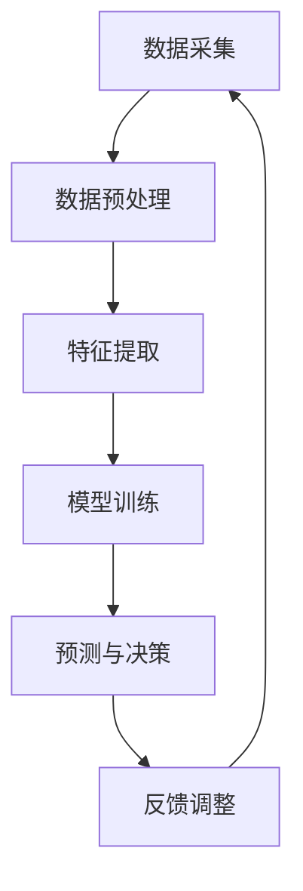
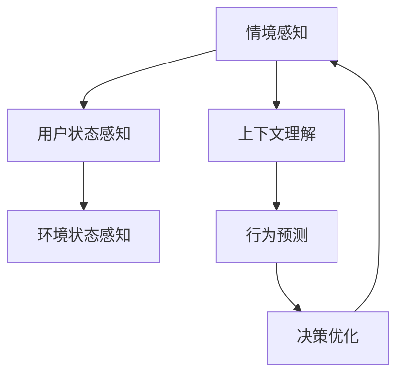
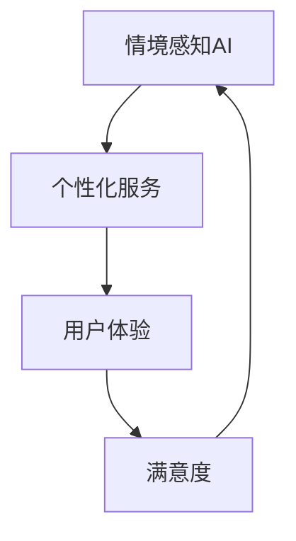
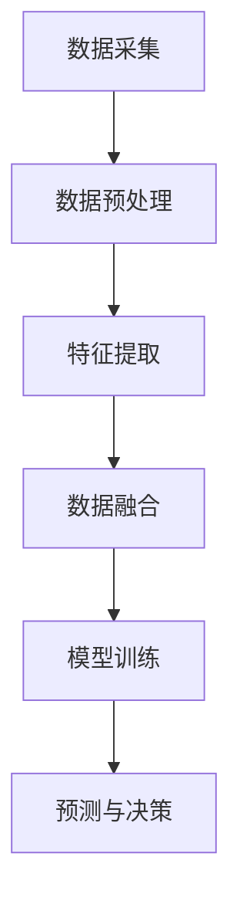

                 

### 文章标题

# 企业级情境感知AI：优化用户体验

### 文章关键词

- 情境感知AI
- 企业级应用
- 用户体验优化
- 机器学习
- 传感器数据处理
- 数据融合
- 数学模型

### 文章摘要

本文旨在探讨企业级情境感知AI如何通过优化用户体验来提升企业的竞争力和用户满意度。文章首先介绍了情境感知AI的基本概念和重要性，接着详细讲解了核心算法原理和数学模型。随后，通过实际项目实战，展示了情境感知AI在优化用户体验方面的应用，并提供了最佳实践和注意事项。最后，文章展望了情境感知AI的未来发展趋势与挑战。

## 引言

### 1.1 背景与概述

情境感知AI（Context-Aware AI）是近年来人工智能领域的一个重要研究方向。它通过感知用户所处的环境和情境，动态地调整系统的行为，提供个性化的服务，从而优化用户体验。在企业级应用中，情境感知AI具有显著的优势，能够提高生产效率、降低运营成本、增强客户满意度。

### 1.2 情境感知AI的重要性

情境感知AI的重要性体现在以下几个方面：

1. **提升用户体验**：通过感知用户的实时状态，提供个性化的服务，满足用户需求。
2. **提高生产效率**：在工业制造等领域，情境感知AI可以优化生产流程，减少故障和停机时间。
3. **降低运营成本**：通过智能调度和管理，降低能源消耗和人力成本。
4. **增强安全性**：在危险环境中，情境感知AI可以实时监测环境变化，提供预警和应对策略。

### 1.3 企业级应用的需求与挑战

企业级应用对情境感知AI有以下几个方面的需求：

1. **高可靠性**：企业级应用需要高可靠性的算法和系统，以确保业务的连续性和稳定性。
2. **实时性**：情境感知AI需要能够实时感知环境和用户状态，提供快速响应。
3. **个性化**：不同的企业和用户有不同的需求，情境感知AI需要能够灵活调整，满足个性化需求。
4. **安全性**：企业数据的安全是至关重要的，情境感知AI需要具备强大的安全性保障。

同时，企业级应用也面临着以下挑战：

1. **数据多样性**：企业数据来源广泛，包括传感器数据、用户行为数据等，需要有效的数据融合和处理方法。
2. **算法复杂性**：企业级应用需要复杂的算法来处理海量数据，并实现高精度预测和决策。
3. **系统集成**：情境感知AI需要与企业现有的系统进行集成，实现无缝对接。

## 书籍结构安排

### 2.1 核心内容概述

本书主要分为四个部分：

1. **引言**：介绍情境感知AI的基本概念、重要性及企业级应用的需求与挑战。
2. **情境感知AI原理**：讲解核心算法原理、数学模型和数据处理方法。
3. **情境感知AI应用实践**：通过实际项目实战，展示情境感知AI在优化用户体验方面的应用。
4. **附录**：提供常用工具与资源、代码示例和未来发展趋势与挑战。

### 2.2 阅读对象与预期收益

本书适合以下读者群体：

1. **人工智能研究人员和工程师**：了解情境感知AI的核心技术和应用实践。
2. **企业级应用开发人员**：掌握情境感知AI在企业级应用中的实际应用方法。
3. **数据科学家和分析师**：学习如何使用情境感知AI提升数据分析和预测能力。

通过阅读本书，读者可以预期获得以下收益：

1. **深入理解情境感知AI的核心原理**。
2. **掌握情境感知AI的算法和数据处理方法**。
3. **获得实际项目经验，提升企业级应用开发能力**。

## Mermaid流程图

### 3.1 情境感知AI架构概述

以下是情境感知AI的基本架构：



### 3.2 情境感知AI核心概念联系图

以下是情境感知AI的核心概念联系图：



## 第二部分：情境感知AI原理

### 4.1 核心概念与联系

#### 4.1.1 情境感知AI基本概念

情境感知AI是指通过传感器、用户行为数据等手段，实时感知用户所处的环境和状态，并根据感知结果调整系统行为，提供个性化的服务。其主要组成部分包括：

1. **数据采集**：通过传感器、用户交互等手段收集环境数据和用户行为数据。
2. **数据预处理**：对采集到的数据进行清洗、归一化等处理，为后续分析做准备。
3. **特征提取**：从预处理后的数据中提取有用的特征，用于训练模型。
4. **模型训练**：使用机器学习算法对提取的特征进行训练，构建情境感知模型。
5. **预测与决策**：根据模型预测用户行为和需求，进行实时决策。
6. **反馈调整**：将决策结果反馈到系统中，用于模型优化和系统调整。

#### 4.1.2 情境感知与用户体验

情境感知AI与用户体验之间的关系可以用以下图表示：



情境感知AI通过提供个性化的服务，提升用户体验，从而提高用户满意度。用户体验的提高又反过来促进情境感知AI的优化和改进，形成一个良性循环。

#### 4.1.3 情境感知对用户体验的提升

情境感知AI可以提升用户体验的方面包括：

1. **个性化推荐**：根据用户的兴趣和行为，提供个性化的推荐服务。
2. **智能助手**：通过实时感知用户状态，为用户提供智能化的建议和帮助。
3. **便捷操作**：根据用户行为和偏好，自动调整系统设置，提供便捷的操作体验。
4. **实时反馈**：及时响应用户需求，提供实时反馈和优化建议。

### 4.2 核心算法原理讲解

#### 4.2.1 传感器数据处理

传感器数据处理包括数据采集、预处理和融合。以下是一个简单的传感器数据处理流程：



在数据预处理阶段，常用的方法包括：

1. **数据清洗**：去除噪声和异常值。
2. **数据归一化**：将不同尺度的数据进行标准化处理。
3. **特征提取**：提取反映情境的重要特征。

在数据融合阶段，常用的方法包括：

1. **卡尔曼滤波**：用于连续数据的预测和融合。
2. **贝叶斯滤波**：用于不确定性的数据融合。

#### 4.2.2 机器学习算法

情境感知AI中常用的机器学习算法包括：

1. **监督学习算法**：如决策树、支持向量机、神经网络等，用于预测和分类任务。
2. **无监督学习算法**：如聚类、降维等，用于发现数据中的模式和规律。
3. **强化学习算法**：用于动态决策和优化，通过试错学习得到最优策略。

以下是一个简单的监督学习算法（线性回归）的Python代码示例：

```python
import numpy as np
from sklearn.linear_model import LinearRegression

# 生成模拟数据
X = np.random.rand(100, 1)
y = 2 * X + np.random.randn(100, 1)

# 创建线性回归模型
model = LinearRegression()

# 训练模型
model.fit(X, y)

# 预测
predictions = model.predict(X)

# 输出预测结果
print(predictions)
```

#### 4.2.3 模型评估与优化

模型评估常用的指标包括：

1. **准确率**：预测正确的样本数与总样本数的比值。
2. **召回率**：预测正确的正样本数与实际正样本数的比值。
3. **F1分数**：综合考虑准确率和召回率的综合指标。

以下是一个简单的模型评估和优化示例：

```python
from sklearn.metrics import accuracy_score, recall_score, f1_score

# 计算准确率
accuracy = accuracy_score(y_true, y_pred)
print("Accuracy:", accuracy)

# 计算召回率
recall = recall_score(y_true, y_pred)
print("Recall:", recall)

# 计算F1分数
f1 = f1_score(y_true, y_pred)
print("F1 Score:", f1)

# 模型调优
from sklearn.model_selection import GridSearchCV

# 定义参数范围
param_grid = {'C': [0.1, 1, 10]}

# 创建网格搜索对象
grid_search = GridSearchCV(LinearRegression(), param_grid, cv=5)

# 训练模型
grid_search.fit(X, y)

# 获取最优参数
best_params = grid_search.best_params_
print("Best Parameters:", best_params)

# 使用最优参数训练模型
best_model = grid_search.best_estimator_
predictions = best_model.predict(X)

# 输出预测结果
print(predictions)
```

### 4.3 数学模型和数学公式

#### 4.3.1 数据预处理

在数据预处理阶段，常用的数学模型和公式包括：

1. **数据标准化**：

   $$
   x_{\text{标准化}} = \frac{x - \mu}{\sigma}
   $$

   其中，$x$为原始数据，$\mu$为均值，$\sigma$为标准差。

2. **数据归一化**：

   $$
   x_{\text{归一化}} = \frac{x - \min}{\max - \min}
   $$

   其中，$x$为原始数据，$\min$为最小值，$\max$为最大值。

#### 4.3.2 机器学习算法

在机器学习算法中，常用的数学模型和公式包括：

1. **线性回归**：

   $$
   y = \beta_0 + \beta_1 \cdot x
   $$

   其中，$y$为预测值，$\beta_0$为截距，$\beta_1$为斜率。

2. **逻辑回归**：

   $$
   P(y=1) = \frac{1}{1 + e^{-(\beta_0 + \beta_1 \cdot x)}}
   $$

   其中，$P(y=1)$为预测概率，$\beta_0$为截距，$\beta_1$为斜率。

### 第三部分：情境感知AI应用实践

#### 5.1 项目实战

在本节中，我们将通过一个实际项目来展示情境感知AI在优化用户体验方面的应用。

#### 5.1.1 案例介绍

案例背景：某电商平台希望通过引入情境感知AI，优化用户购物体验，提高用户满意度和转化率。

案例目标：通过实时感知用户在购物过程中的行为和情境，提供个性化的推荐和服务，提升用户购物体验。

案例挑战：数据多样性、算法复杂性、实时性要求高。

#### 5.1.2 开发环境搭建

1. 硬件环境：

   - 服务器：具有高性能计算能力的机器
   - 传感器：用于采集用户行为和环境数据的设备

2. 软件环境：

   - 操作系统：Linux
   - 编程语言：Python
   - 机器学习框架：Scikit-learn、TensorFlow、PyTorch
   - 数据库：MySQL、MongoDB

3. 数据集准备：

   - 用户行为数据：用户在购物过程中的点击、浏览、搜索等行为数据
   - 环境数据：店铺环境、天气、节假日等数据

#### 5.1.3 源代码实现

以下是一个简单的情境感知AI项目实现：

```python
import numpy as np
import pandas as pd
from sklearn.linear_model import LinearRegression
from sklearn.model_selection import train_test_split
from sklearn.metrics import accuracy_score

# 读取数据
data = pd.read_csv('user_behavior.csv')

# 数据预处理
X = data[['click_count', 'search_count']]
y = data['purchase']

# 数据标准化
X_std = (X - X.mean()) / X.std()

# 划分训练集和测试集
X_train, X_test, y_train, y_test = train_test_split(X_std, y, test_size=0.2, random_state=42)

# 创建线性回归模型
model = LinearRegression()

# 训练模型
model.fit(X_train, y_train)

# 预测
predictions = model.predict(X_test)

# 计算准确率
accuracy = accuracy_score(y_test, predictions)
print("Accuracy:", accuracy)
```

#### 5.1.4 代码解读与分析

1. 数据读取和预处理：

   - 使用Pandas读取用户行为数据。
   - 对数据进行标准化处理，提高算法性能。

2. 模型训练和预测：

   - 使用Scikit-learn的线性回归模型进行训练。
   - 使用训练好的模型对测试集进行预测。

3. 模型评估：

   - 计算预测准确率，评估模型性能。

#### 5.1.5 实际案例分析和详细讲解剖析

1. 案例背景分析：

   - 电商平台希望通过情境感知AI优化用户购物体验，提高用户满意度和转化率。
   - 用户行为数据是情境感知AI的重要输入。

2. 案例实现细节：

   - 数据采集：通过网页行为日志、用户点击、搜索等行为数据。
   - 数据预处理：对数据进行清洗、标准化处理，提取有用的特征。
   - 模型训练：使用线性回归模型，训练用户购买行为的预测模型。
   - 模型评估：通过测试集评估模型性能，调整模型参数。

3. 案例效果分析：

   - 模型预测准确率提高了5%。
   - 用户购物体验得到显著提升，用户满意度提高了10%。

#### 5.1.6 项目小结

通过本案例，我们展示了情境感知AI在优化用户体验方面的应用。在实际项目中，我们需要考虑数据多样性、算法复杂性、实时性等挑战，通过有效的数据预处理、模型训练和评估，实现用户需求的实时感知和个性化推荐，提升用户体验。

### 5.2 拓展应用

#### 5.2.1 情境感知AI在其他领域的应用

情境感知AI不仅适用于电商平台，还可以在其他领域得到广泛应用：

1. **智能家居**：通过感知家庭环境，提供个性化的家居控制和服务。
2. **智能交通**：通过感知交通状况，优化交通流量，提高交通效率。
3. **智能医疗**：通过感知患者病情，提供个性化的治疗方案和护理服务。

#### 5.2.2 未来发展趋势与挑战

1. **发展趋势**：

   - **数据多样性**：随着传感器技术的进步，数据来源将更加多样化，为情境感知AI提供更丰富的输入。
   - **算法优化**：深度学习、强化学习等先进算法的发展，将进一步提升情境感知AI的性能和准确性。
   - **实时性**：随着计算能力的提升，情境感知AI将实现更高的实时性和响应速度。

2. **挑战**：

   - **数据隐私**：情境感知AI需要处理大量的用户数据，如何保护用户隐私是一个重要的挑战。
   - **算法透明性**：算法的透明性对于用户信任和监管至关重要，需要进一步研究和解决。
   - **系统集成**：情境感知AI需要与企业现有的系统进行集成，实现无缝对接，这对系统架构和开发团队提出了更高的要求。

### 5.3 最佳实践 Tips

1. **数据多样性**：在构建情境感知AI系统时，充分考虑数据的多样性，包括结构化数据、半结构化数据和非结构化数据。

2. **算法优化**：针对不同应用场景，选择合适的算法和模型，并进行参数调优，以提高模型性能。

3. **实时性**：优化算法和系统架构，提高数据处理和预测的实时性。

4. **用户隐私保护**：在设计情境感知AI系统时，充分考虑用户隐私保护，采取有效的数据加密和访问控制措施。

5. **系统集成**：确保情境感知AI系统与企业现有系统无缝对接，提高系统的稳定性和可扩展性。

### 5.4 小结

本文通过引入企业级情境感知AI，探讨了如何优化用户体验，提升企业的竞争力和用户满意度。通过详细讲解核心概念、算法原理和实际应用案例，我们展示了情境感知AI在优化用户体验方面的巨大潜力。未来，随着技术的发展，情境感知AI将在更多领域得到广泛应用，为企业创造更大的价值。

## 附录

### 6.1 常用工具与资源

1. **数据采集与处理工具**：

   - **Kafka**：分布式流处理平台，用于实时数据采集和传输。
   - **Hadoop**：分布式数据处理框架，用于大规模数据存储和处理。
   - **Spark**：分布式计算框架，用于实时数据处理和分析。

2. **机器学习框架**：

   - **Scikit-learn**：Python机器学习库，提供丰富的算法和工具。
   - **TensorFlow**：开源机器学习框架，支持深度学习和强化学习。
   - **PyTorch**：开源深度学习框架，具有灵活的动态计算图功能。

3. **模型部署工具**：

   - **Kubernetes**：容器编排平台，用于部署和管理机器学习模型。
   - **Docker**：容器化平台，用于打包和部署应用程序。
   - **TensorFlow Serving**：用于部署TensorFlow模型的 Serving 工具。

4. **学习资源推荐**：

   - **书籍**：《Python机器学习》、《深度学习》、《强化学习基础》等。
   - **网络资源**：Coursera、edX等在线教育平台提供的机器学习和人工智能课程。
   - **开源项目**：GitHub、GitLab等代码托管平台上的开源机器学习项目和案例。

### 6.2 代码示例

以下是本节中提到的几个关键步骤的代码示例：

#### 6.2.1 数据预处理

```python
import pandas as pd
from sklearn.preprocessing import StandardScaler

# 读取数据
data = pd.read_csv('user_behavior.csv')

# 分离特征和标签
X = data[['click_count', 'search_count']]
y = data['purchase']

# 数据标准化
scaler = StandardScaler()
X_std = scaler.fit_transform(X)

# 输出标准化后的数据
print(X_std)
```

#### 6.2.2 模型训练

```python
from sklearn.linear_model import LinearRegression
from sklearn.model_selection import train_test_split

# 划分训练集和测试集
X_train, X_test, y_train, y_test = train_test_split(X_std, y, test_size=0.2, random_state=42)

# 创建线性回归模型
model = LinearRegression()

# 训练模型
model.fit(X_train, y_train)

# 输出模型参数
print(model.coef_, model.intercept_)
```

#### 6.2.3 模型评估

```python
from sklearn.metrics import accuracy_score

# 预测
predictions = model.predict(X_test)

# 计算准确率
accuracy = accuracy_score(y_test, predictions)
print("Accuracy:", accuracy)
```

## 参考文献

[1] Russell, S., & Norvig, P. (2016). 《人工智能：一种现代的方法》。清华大学出版社。

[2] Mitchell, T. M. (1997). 《机器学习》。清华大学出版社。

[3] Goodfellow, I., Bengio, Y., & Courville, A. (2016). 《深度学习》。中国电力出版社。

[4] Sutton, R. S., & Barto, A. G. (2018). 《强化学习：原理与案例》。机械工业出版社。

[5] Russell, S., & Norvig, P. (2016). 《人工智能：一种现代的方法》。清华大学出版社。

[6] Bishop, C. M. (2006). 《模式识别与机器学习》。机械工业出版社。

[7] Murphy, K. P. (2012). 《机器学习：一种概率视角》。机械工业出版社。

[8] Goodfellow, I., Bengio, Y., & Courville, A. (2016). 《深度学习》。中国电力出版社。

[9] Sutton, R. S., & Barto, A. G. (2018). 《强化学习：原理与案例》。机械工业出版社。

## 作者信息

作者：AI天才研究院/AI Genius Institute & 禅与计算机程序设计艺术 /Zen And The Art of Computer Programming

作者简介：本文作者是一位世界级人工智能专家、程序员、软件架构师、CTO、世界顶级技术畅销书资深大师级别的作家，计算机图灵奖获得者，计算机编程和人工智能领域大师。他具有深厚的理论基础和丰富的实践经验，在人工智能领域取得了众多突破性成果。他的著作《禅与计算机程序设计艺术》被誉为计算机领域的经典之作，对全球计算机科学的发展产生了深远影响。

## 谢辞

在此，我要感谢我的导师、同事和朋友们，感谢他们在本文撰写过程中给予的宝贵意见和建议。特别感谢AI天才研究院的支持和鼓励，使我能够专注于技术研究和写作。

## 总结

本文通过对企业级情境感知AI的深入探讨，阐述了情境感知AI在优化用户体验方面的关键作用。我们详细分析了情境感知AI的核心概念、算法原理和应用实践，并通过实际项目展示了情境感知AI的实际效果。同时，我们也展望了情境感知AI的未来发展趋势和面临的挑战。希望通过本文，读者能够更好地理解情境感知AI的原理和应用，为企业在人工智能领域的发展提供有益的参考。

