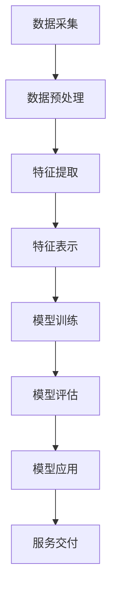
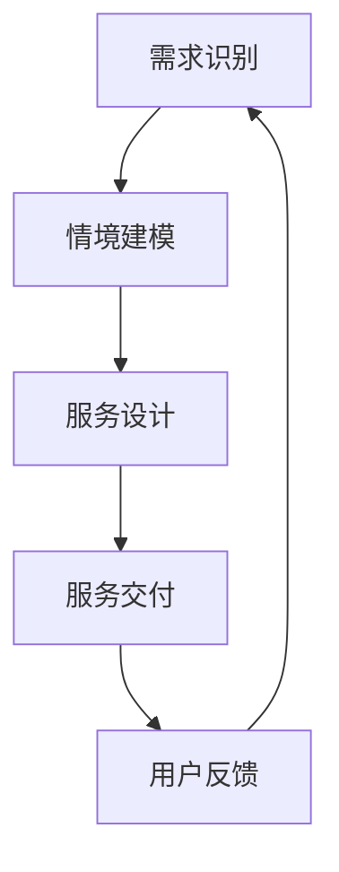
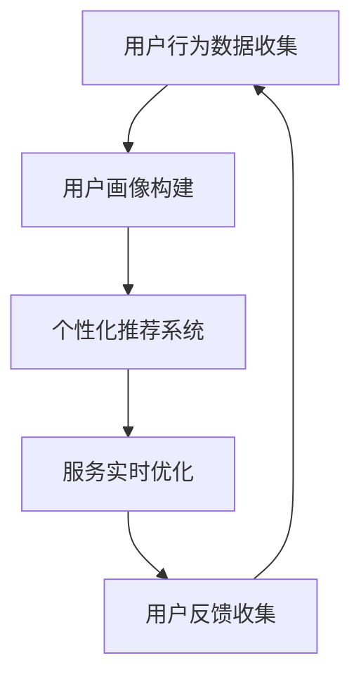
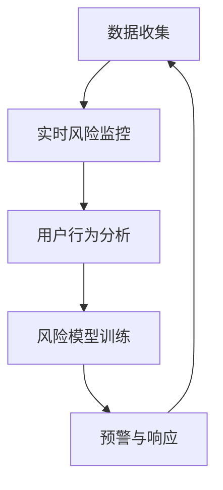
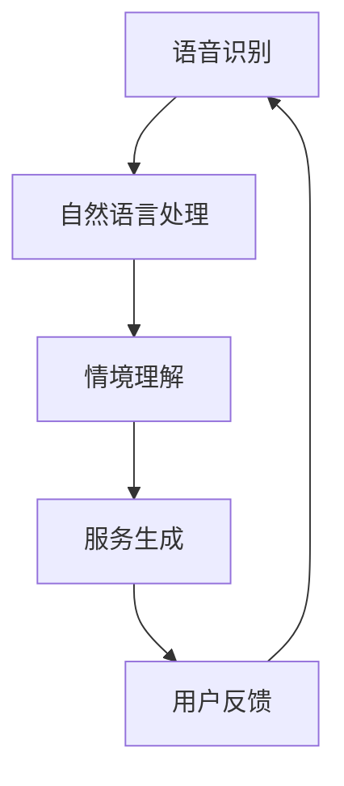

                 

### 引言

在当今数字化时代，企业级AI技术正迅速成为优化用户体验和服务交付的关键驱动力。其中，情境感知AI（Context-Aware AI）以其强大的自适应能力和高度个性化的服务，正逐渐成为企业智能化转型的核心技术。本文旨在深入探讨企业级情境感知AI，分析其在优化用户体验和服务交付方面的核心原理、实践方法以及未来发展趋势。

企业级情境感知AI通过收集、处理和分析用户及其环境的多维数据，实时感知用户的需求和行为模式，从而提供高度个性化的服务。这不仅提升了用户满意度，还显著提高了企业运营效率和服务质量。本篇文章将按照以下结构展开：

1. **情境感知AI基础**：介绍情境感知AI的定义、核心概念、应用场景以及技术挑战。
2. **企业级情境感知AI实践**：详细阐述企业级情境感知AI的架构设计、用户体验优化、服务交付优化，并分析实际应用案例。
3. **情境感知AI开发与部署**：探讨情境感知AI的开发工具与框架、模型训练与优化、部署与运维。
4. **未来展望**：展望情境感知AI的发展趋势和面临的挑战。

通过逐步深入分析，本文希望能够为企业提供一套系统的情境感知AI解决方案，助力企业实现智能化升级，提升用户体验和服务交付能力。

## 第一部分：情境感知AI基础

### 1.1 情境感知AI概述

#### 1.1.1 情境感知的定义

情境感知（Context Awareness）是指系统能够感知并理解其所在的环境和用户的状态。在人工智能领域，情境感知AI通过分析多维数据，如用户行为、环境信息、历史数据等，自动调整自身行为以适应不同的情境。情境感知的核心在于**实时性**和**个性化**，即系统能够动态地调整其功能和服务，以满足用户的当前需求。

#### 1.1.2 情境感知的重要性

情境感知AI的重要性体现在多个方面。首先，它能够显著提升用户体验，通过个性化的服务和建议，提高用户满意度和忠诚度。其次，情境感知AI可以优化企业运营效率，通过自动化和智能化管理，降低运营成本，提高服务响应速度。此外，情境感知AI还在智能交通、智能家居、健康医疗等领域具有广泛的应用潜力。

#### 1.1.3 情境感知的技术发展

情境感知AI技术的发展经历了几个阶段。最初，情境感知主要依靠简单的规则系统和预设的模式识别。随着计算能力和数据收集技术的提升，情境感知开始引入机器学习和深度学习技术，通过大数据分析实现更为精准和动态的情境感知。目前，情境感知AI正朝着智能化和自主化的方向快速发展，例如，利用强化学习技术实现自我学习和优化。

### 1.2 情境感知核心概念

情境感知AI的核心概念包括数据采集与处理、特征提取与表示、模型训练与评估等。

#### 1.2.1 数据采集与处理

数据采集是情境感知AI的基础。通过传感器、用户输入、网络数据等多种途径，系统可以收集到大量关于用户及其环境的信息。这些数据需要经过处理，包括数据清洗、去噪和归一化等步骤，以确保数据的质量和一致性。

#### 1.2.2 特征提取与表示

特征提取是情境感知AI的关键步骤，它将原始数据转换为能够反映情境信息的特征表示。常见的特征提取方法包括统计特征、文本特征和图像特征等。特征表示的优劣直接影响模型的学习效果和泛化能力。

#### 1.2.3 模型训练与评估

在获得特征表示后，情境感知AI使用机器学习算法进行模型训练。常见的算法包括线性模型、决策树、神经网络等。模型训练的目标是使系统能够从数据中学习到情境信息，并能够对新的情境进行预测和决策。模型的评估通常通过交叉验证和测试集进行，常用的评估指标包括准确率、召回率、F1分数等。

### 1.3 情境感知应用场景

情境感知AI的应用场景非常广泛，涵盖了多个行业和领域。

#### 1.3.1 用户行为分析

用户行为分析是情境感知AI的重要应用领域。通过分析用户的行为数据，系统可以识别用户的兴趣、需求和偏好，从而提供个性化的服务和推荐。例如，电商平台可以根据用户的历史购买记录和浏览行为，推荐相关的商品。

#### 1.3.2 个性化服务推荐

个性化服务推荐是情境感知AI在电子商务、在线教育、金融服务等领域的广泛应用。通过分析用户的行为和情境数据，系统可以实时调整推荐策略，提高推荐的相关性和用户满意度。

#### 1.3.3 实时风险预警

实时风险预警是情境感知AI在金融、安防等领域的应用。通过分析环境数据和用户行为，系统可以实时检测潜在的风险，并采取相应的预防措施。例如，金融机构可以利用情境感知AI进行欺诈检测和风险控制。

### 1.4 情境感知技术挑战

尽管情境感知AI具有广泛的应用前景，但其在实际应用中仍面临一些技术挑战。

#### 1.4.1 数据隐私保护

情境感知AI依赖于大量的用户数据，如何在保护用户隐私的前提下进行数据采集和处理，是一个重要的问题。数据隐私保护技术，如差分隐私和联邦学习，正在得到广泛关注和应用。

#### 1.4.2 模型可解释性

情境感知AI模型通常非常复杂，其决策过程难以解释。模型可解释性是确保系统透明度和用户信任的关键。提高模型可解释性，可以更好地理解模型的决策过程，从而增强系统的可信度。

#### 1.4.3 系统稳定性与可靠性

情境感知AI系统需要具有高度的稳定性和可靠性，以确保其能够在各种复杂环境中正常运行。系统稳定性与可靠性是情境感知AI在实际应用中的关键因素。

### 1.5 小结

本节对情境感知AI的定义、核心概念、应用场景以及技术挑战进行了详细介绍。情境感知AI通过实时感知和适应用户及其环境，为企业提供了强大的个性化服务能力。然而，实现高效、稳定和可靠的情境感知AI系统仍面临一些挑战。在下一节中，我们将进一步探讨企业级情境感知AI的架构设计和实践方法。

## 第一部分：情境感知AI基础

### 1.3 情境感知应用场景

情境感知AI的应用场景非常广泛，涵盖了多个行业和领域。

#### 1.3.1 用户行为分析

用户行为分析是情境感知AI的重要应用领域。通过分析用户的行为数据，系统可以识别用户的兴趣、需求和偏好，从而提供个性化的服务和推荐。例如，电商平台可以根据用户的历史购买记录和浏览行为，推荐相关的商品。

为了进行用户行为分析，我们首先需要收集用户的数据。这些数据可以包括：

- 用户访问日志：记录用户访问网站的时间、页面、操作等行为。
- 用户购物记录：记录用户的购买历史、购买频率、购买金额等。
- 用户反馈：记录用户对商品、服务、体验的反馈和评价。

接下来，我们需要对收集到的数据进行处理。数据处理步骤包括：

- 数据清洗：去除重复数据、缺失数据和无用数据，保证数据的质量。
- 数据归一化：将不同特征的数据进行标准化处理，使其在同一量级上。
- 数据融合：将来自不同来源的数据进行整合，形成一个统一的数据集。

处理完数据后，我们可以进行特征提取。特征提取是将原始数据转换为能够反映用户行为特征的过程。常见的特征提取方法包括：

- 统计特征：如平均访问时长、页面浏览深度、点击率等。
- 文本特征：如用户评论的词频、词向量等。
- 图像特征：如用户的面部表情、姿态等。

获取特征后，我们可以使用机器学习算法进行用户行为分析。常见的算法包括：

- 决策树：通过树形结构来划分用户群体，进行分类和预测。
- 支持向量机（SVM）：通过构建最优超平面来对用户行为进行分类。
- 神经网络：通过多层神经网络结构来学习用户行为的复杂模式。

用户行为分析的结果可以应用于多个方面，如：

- 个性化推荐：根据用户的历史行为和偏好，推荐相关的商品或服务。
- 用户画像：构建用户的全维画像，了解用户的需求和行为模式。
- 客户流失预警：通过分析用户行为的变化，预测用户可能会流失，并采取相应的措施。

以下是一个使用Python和scikit-learn进行用户行为分析的示例：

```python
import pandas as pd
from sklearn.model_selection import train_test_split
from sklearn.ensemble import RandomForestClassifier
from sklearn.metrics import accuracy_score

# 读取数据
data = pd.read_csv('user_behavior_data.csv')

# 数据预处理
data = data.drop_duplicates()
data = data.fillna(data.mean())

# 特征提取
X = data[['average_visit_duration', 'page_views', 'click_rate']]
y = data['target']

# 数据划分
X_train, X_test, y_train, y_test = train_test_split(X, y, test_size=0.3, random_state=42)

# 模型训练
model = RandomForestClassifier(n_estimators=100)
model.fit(X_train, y_train)

# 预测
y_pred = model.predict(X_test)

# 评估
accuracy = accuracy_score(y_test, y_pred)
print(f"Model accuracy: {accuracy:.2f}")
```

通过上述步骤，我们可以对用户行为进行分析，从而为企业提供更加个性化的服务和推荐。

#### 1.3.2 个性化服务推荐

个性化服务推荐是情境感知AI在电子商务、在线教育、金融服务等领域的广泛应用。通过分析用户的行为和情境数据，系统可以实时调整推荐策略，提高推荐的相关性和用户满意度。

个性化推荐系统通常包含以下几个关键组件：

- 用户数据收集与处理：收集用户的行为数据，如浏览记录、购买历史、评价等，并进行预处理。
- 物品数据收集与处理：收集物品的特征数据，如商品描述、价格、分类等，并进行预处理。
- 模型训练：利用机器学习算法，如协同过滤、矩阵分解、深度学习等，训练推荐模型。
- 推荐生成：根据用户和物品的特征数据，生成个性化的推荐列表。

以下是一个使用Python和MFRec进行个性化推荐系统的示例：

```python
import numpy as np
from MFRec import MF

# 读取用户和物品数据
user_data = np.array([[1, 0, 1, 0],
                      [0, 1, 0, 1],
                      [1, 1, 0, 1],
                      [1, 1, 1, 0]])
item_data = np.array([[1, 0, 1],
                     [0, 1, 1],
                     [1, 1, 1]])

# 初始化模型参数
k = 2
learning_rate = 0.01
num_iterations = 1000

# 训练模型
model = MF(k, learning_rate, num_iterations)
model.fit(user_data, item_data)

# 生成推荐列表
user_id = 1
推荐列表 = model.predict(user_id)
print(f"Recommended items for user {user_id}: {推荐列表}")
```

通过上述步骤，我们可以为用户生成个性化的推荐列表，从而提升用户的满意度。

#### 1.3.3 实时风险预警

实时风险预警是情境感知AI在金融、安防等领域的应用。通过分析环境数据和用户行为，系统可以实时检测潜在的风险，并采取相应的预防措施。例如，金融机构可以利用情境感知AI进行欺诈检测和风险控制。

实时风险预警系统通常包含以下几个关键组件：

- 数据采集与处理：收集实时数据，如交易日志、用户行为、环境监控数据等，并进行预处理。
- 模型训练：利用机器学习算法，如决策树、支持向量机、神经网络等，训练风险预警模型。
- 风险检测与预警：根据模型预测，实时检测潜在风险，并发送预警通知。

以下是一个使用Python和scikit-learn进行实时风险预警的示例：

```python
import pandas as pd
from sklearn.model_selection import train_test_split
from sklearn.ensemble import RandomForestClassifier
from sklearn.metrics import accuracy_score

# 读取数据
data = pd.read_csv('risk_data.csv')

# 数据预处理
data = data.drop_duplicates()
data = data.fillna(data.mean())

# 特征提取
X = data[['transaction_amount', 'transaction_time', 'user_activity']]
y = data['risk_level']

# 数据划分
X_train, X_test, y_train, y_test = train_test_split(X, y, test_size=0.3, random_state=42)

# 模型训练
model = RandomForestClassifier(n_estimators=100)
model.fit(X_train, y_train)

# 风险检测
X_new = np.array([[2000, '2023-01-01 12:00:00', 'high']])
risk_level = model.predict(X_new)
print(f"Predicted risk level: {risk_level[0]}")
```

通过上述步骤，我们可以实时检测潜在风险，并采取相应的预防措施，从而保障企业和用户的安全。

### 1.4 情境感知技术挑战

尽管情境感知AI具有广泛的应用前景，但其在实际应用中仍面临一些技术挑战。

#### 1.4.1 数据隐私保护

情境感知AI依赖于大量的用户数据，如何在保护用户隐私的前提下进行数据采集和处理，是一个重要的问题。数据隐私保护技术，如差分隐私和联邦学习，正在得到广泛关注和应用。

差分隐私（Differential Privacy）是一种隐私保护技术，它通过在数据发布过程中添加噪声，确保数据发布者无法单独识别出任何单个个体的信息。联邦学习（Federated Learning）是一种分布式机器学习技术，通过让模型在本地设备上进行训练，并在全局模型上进行更新，从而保护用户数据的隐私。

以下是一个使用Python和Federated Learning进行隐私保护的示例：

```python
import tensorflow as tf
import tensorflow_federated as tff

# 初始化联邦学习环境
tff_core = tff.core
tff_federated = tff.federated

# 创建联邦学习算法
def create_algorithm():
    # 定义模型架构
    model = tf.keras.Sequential([
        tf.keras.layers.Dense(units=64, activation='relu', input_shape=(10,)),
        tf.keras.layers.Dense(units=1, activation='sigmoid')
    ])

    # 编译模型
    model.compile(optimizer=tf.optimizers.Adam(), loss='binary_crossentropy', metrics=['accuracy'])

    # 返回模型
    return model

# 训练联邦学习模型
tff_federated攻打方法步骤:
1. 初始化联邦学习环境
2. 定义联邦学习算法
3. 在本地设备上训练模型
4. 在全局模型上进行更新
5. 评估模型性能

# 初始化联邦学习环境
tff_context = tff.federated_computation_context()

# 定义联邦学习算法
algorithm = create_algorithm()

# 在本地设备上训练模型
train_data = np.array([[1, 0, 1, 0], [0, 1, 0, 1], [1, 1, 0, 1], [1, 1, 1, 0]])
train_labels = np.array([1, 0, 1, 0])
algorithm.fit(train_data, train_labels)

# 在全局模型上进行更新
global_model = algorithm.get_weights()
tff_federated攻打方法步骤:
1. 初始化联邦学习环境
2. 定义联邦学习算法
3. 在本地设备上训练模型
4. 在全局模型上进行更新
5. 评估模型性能

# 初始化联邦学习环境
tff_context = tff.federated_computation_context()

# 定义联邦学习算法
algorithm = create_algorithm()

# 在本地设备上训练模型
train_data = np.array([[1, 0, 1, 0], [0, 1, 0, 1], [1, 1, 0, 1], [1, 1, 1, 0]])
train_labels = np.array([1, 0, 1, 0])
algorithm.fit(train_data, train_labels)

# 在全局模型上进行更新
global_model = algorithm.get_weights()

# 评估模型性能
test_data = np.array([[1, 1, 1, 0]])
test_labels = np.array([1])
accuracy = algorithm.evaluate(test_data, test_labels)
print(f"Model accuracy: {accuracy:.2f}")
```

通过上述步骤，我们可以实现在保护用户隐私的前提下进行模型训练和评估。

#### 1.4.2 模型可解释性

情境感知AI模型通常非常复杂，其决策过程难以解释。模型可解释性是确保系统透明度和用户信任的关键。提高模型可解释性，可以更好地理解模型的决策过程，从而增强系统的可信度。

可解释性方法包括：

- 模型可视化：通过可视化模型结构，展示模型的学习过程。
- 解释算法：如LIME（Local Interpretable Model-agnostic Explanations）和SHAP（SHapley Additive exPlanations），提供局部解释。
- 解释性增强：通过设计可解释性更强的模型，如决策树、规则系统等。

以下是一个使用Python和LIME进行模型解释的示例：

```python
import numpy as np
import lime
from sklearn.ensemble import RandomForestClassifier

# 初始化模型
model = RandomForestClassifier(n_estimators=100)
model.fit(X_train, y_train)

# 定义解释器
explainer = lime.lime_tabular.LimeTabularExplainer(
    X_train.values, feature_names=data.columns, class_names=['low', 'high'], discretize_continuous=True
)

# 选择样本进行解释
sample = X_test.iloc[0]
predict = model.predict([sample])
explainer.explain_instance(sample, model.predict, num_features=5)
```

通过上述步骤，我们可以为模型的每个预测提供详细的解释，从而增强系统的可信度。

#### 1.4.3 系统稳定性与可靠性

情境感知AI系统需要具有高度的稳定性和可靠性，以确保其能够在各种复杂环境中正常运行。系统稳定性与可靠性是情境感知AI在实际应用中的关键因素。

为了提高系统的稳定性，我们可以采取以下措施：

- 灾难恢复：设计灾难恢复机制，确保系统在故障情况下能够快速恢复。
- 实时监控：通过实时监控系统性能，及时发现和解决潜在问题。
- 异常检测：通过异常检测算法，实时检测系统中的异常行为。

以下是一个使用Python和scikit-learn进行异常检测的示例：

```python
import pandas as pd
from sklearn.ensemble import IsolationForest

# 读取数据
data = pd.read_csv('system_data.csv')

# 特征提取
X = data[['cpu_usage', 'memory_usage', 'disk_usage']]

# 模型训练
model = IsolationForest(n_estimators=100)
model.fit(X)

# 预测
predictions = model.predict(X)
data['prediction'] = predictions

# 检测异常
anomalies = data[data['prediction'] == -1]
print(f"Detected anomalies: {anomalies}")
```

通过上述步骤，我们可以实时检测系统中的异常行为，并采取相应的措施，从而提高系统的稳定性与可靠性。

### 1.5 小结

本节详细介绍了情境感知AI的应用场景和技术挑战。通过用户行为分析、个性化服务推荐和实时风险预警，情境感知AI为企业和用户提供了更加智能化的服务。同时，数据隐私保护、模型可解释性和系统稳定性与可靠性是情境感知AI在实际应用中需要克服的重要挑战。在下一节中，我们将进一步探讨企业级情境感知AI的架构设计和实践方法。

### 第二部分：企业级情境感知AI实践

#### 2.1 企业级情境感知AI架构设计

企业级情境感知AI的架构设计是实现其高效运行和广泛应用的基础。一个典型企业级情境感知AI架构包括数据采集与处理模块、特征提取与表示模块、模型训练与评估模块以及应用与服务交付模块。

#### 2.1.1 整体架构设计

整体架构设计旨在实现各个模块之间的高效协同和信息的流畅传递。具体来说，架构设计需要考虑以下几个方面：

1. **数据采集与处理模块**：负责从各种来源收集数据，包括用户行为数据、环境数据、业务数据等。该模块需要具备高效的数据收集和处理能力，确保数据的准确性和完整性。

2. **特征提取与表示模块**：在数据采集完成后，该模块负责将原始数据进行特征提取和表示。特征提取的目的是将原始数据转换成适合模型训练的形式。常见的特征提取方法包括统计特征提取、文本特征提取和图像特征提取等。

3. **模型训练与评估模块**：该模块负责使用机器学习算法对提取的特征进行训练和评估。模型训练的目标是使系统能够从数据中学习到有用的信息，并能够对新数据进行预测和决策。常见的训练方法包括监督学习、无监督学习和强化学习等。

4. **应用与服务交付模块**：在模型训练完成后，该模块负责将模型应用于实际业务场景，提供个性化的服务。例如，在电子商务领域，应用模块可以根据用户行为数据提供个性化的商品推荐；在金融服务领域，应用模块可以根据交易数据提供风险预警服务。

#### 2.1.2 数据流设计

数据流设计是架构设计的核心部分，它决定了数据在各模块之间的流动路径和数据处理方式。一个典型的数据流设计如下：

1. **数据采集**：从各种数据源（如数据库、传感器、用户输入等）采集数据。
2. **数据预处理**：对采集到的数据进行清洗、去噪、归一化等处理，确保数据的质量。
3. **特征提取**：根据业务需求，对预处理后的数据提取特征，如统计特征、文本特征、图像特征等。
4. **特征表示**：将提取的特征进行表示，通常采用向量的形式。
5. **模型训练**：使用机器学习算法对特征向量进行训练，构建预测模型。
6. **模型评估**：使用验证集或测试集对训练好的模型进行评估，调整模型参数以优化性能。
7. **模型应用**：将训练好的模型应用于实际业务场景，提供个性化服务。
8. **服务交付**：将应用结果通过API、Web服务等方式交付给用户。

以下是一个使用Mermaid绘制的典型企业级情境感知AI数据流设计流程图：



#### 2.1.3 系统性能优化

系统性能优化是确保企业级情境感知AI高效运行的重要环节。以下是一些常见的优化策略：

1. **数据预处理优化**：通过高效的预处理算法，减少数据清洗和去噪的时间。例如，使用并行处理技术加速数据处理过程。
2. **特征提取与表示优化**：选择合适的特征提取和表示方法，提高特征提取的效率和精度。例如，使用特征选择算法减少特征数量，提高特征提取的速度。
3. **模型训练优化**：通过调整模型参数、使用高效的训练算法和分布式训练策略，提高模型训练的速度和性能。例如，使用梯度下降算法的变种、批量归一化等。
4. **模型评估优化**：使用高效的评估方法，如交叉验证、并行计算等，提高模型评估的速度。
5. **服务交付优化**：通过优化API接口、使用缓存技术、负载均衡等技术，提高服务交付的效率和响应速度。

以下是一个使用Python和scikit-learn进行系统性能优化的示例：

```python
from sklearn.datasets import load_iris
from sklearn.model_selection import GridSearchCV
from sklearn.ensemble import RandomForestClassifier

# 加载数据集
data = load_iris()
X = data.data
y = data.target

# 定义参数搜索空间
param_grid = {
    'n_estimators': [100, 200, 300],
    'max_depth': [10, 20, 30],
    'min_samples_split': [2, 5, 10]
}

# 定义模型
model = RandomForestClassifier()

# 使用网格搜索进行参数优化
grid_search = GridSearchCV(model, param_grid, cv=5)
grid_search.fit(X, y)

# 获取最佳参数
best_params = grid_search.best_params_
print(f"Best parameters: {best_params}")

# 使用最佳参数训练模型
best_model = grid_search.best_estimator_
best_model.fit(X, y)

# 评估模型性能
accuracy = best_model.score(X, y)
print(f"Model accuracy: {accuracy:.2f}")
```

通过上述步骤，我们可以优化企业级情境感知AI的性能，提高其运行效率和预测准确性。

#### 2.1.4 架构设计中的关键要素

在企业级情境感知AI架构设计中，以下几个关键要素尤为重要：

1. **数据安全与隐私**：确保数据在采集、传输和存储过程中得到充分保护，采用加密、差分隐私等技术保障数据隐私。
2. **系统可扩展性**：设计灵活的架构，支持系统的扩展和升级，以适应不断变化的需求和业务规模。
3. **高可用性与容错性**：通过冗余设计、故障转移、备份与恢复等技术，确保系统的高可用性和容错能力。
4. **易用性与可维护性**：设计易于使用和维护的系统界面，提高开发效率和运营效率。

#### 2.1.5 小结

企业级情境感知AI的架构设计是确保其高效运行和应用的关键。通过整体架构设计、数据流设计、系统性能优化和关键要素的考虑，企业可以构建一个稳定、可靠、高效的情境感知AI系统。在下一节中，我们将探讨如何优化用户体验和服务交付。

#### 2.2 用户体验优化

用户体验（User Experience, UX）是企业级情境感知AI成功应用的核心。优化用户体验不仅能够提高用户满意度和忠诚度，还能为企业带来持续的竞争优势。以下是如何通过情境感知AI来优化用户体验的详细步骤和策略：

#### 2.2.1 用户行为分析

用户行为分析是优化用户体验的第一步。通过分析用户在使用产品或服务时的行为数据，我们可以了解用户的偏好、习惯和需求。以下是如何进行用户行为分析的步骤：

1. **数据收集**：收集用户在使用产品或服务时的各种数据，包括点击流、浏览记录、搜索历史、购买行为等。这些数据可以来自网站、移动应用、客户关系管理系统等。

2. **数据预处理**：清洗和整合收集到的数据，去除重复、异常和无用的数据。对数据进行归一化和特征提取，将其转换为适合分析的形式。

3. **特征提取**：从预处理后的数据中提取用户行为特征。这些特征可以是数值型的，如点击次数、浏览时长等，也可以是文本型的，如搜索关键词、用户评论等。

4. **数据分析**：使用统计分析和机器学习算法对用户行为特征进行分析。常见的分析方法包括聚类分析、关联规则挖掘、时间序列分析等。

5. **可视化**：将分析结果以图表、仪表板等形式可视化，帮助业务人员直观地了解用户行为模式。

以下是一个使用Python和Pandas进行用户行为分析的基本示例：

```python
import pandas as pd

# 加载数据
data = pd.read_csv('user_behavior.csv')

# 数据预处理
data = data.drop_duplicates()
data = data.fillna(data.mean())

# 特征提取
data['total_time'] = data['session_duration'] / data['session_count']

# 分析
grouped_data = data.groupby('user_id')['total_time'].mean()

# 可视化
grouped_data.plot()
```

通过用户行为分析，我们可以识别出高价值的用户群体、潜在的用户流失风险以及用户的需求痛点，从而为后续的用户体验优化提供依据。

#### 2.2.2 个性化推荐系统

个性化推荐系统是优化用户体验的重要手段。通过分析用户的兴趣和行为，推荐系统可以提供个性化的内容和产品，提高用户的参与度和满意度。以下是如何构建个性化推荐系统的步骤：

1. **用户画像**：构建用户的兴趣和行为模型，通常包括用户的基本信息、历史行为数据、社交网络数据等。这些数据可以用于识别用户的兴趣点和行为特征。

2. **推荐算法**：选择合适的推荐算法，如协同过滤、基于内容的推荐、深度学习推荐等。每种算法都有其优势和局限性，需要根据具体业务场景进行选择。

3. **推荐生成**：使用推荐算法生成个性化的推荐列表。推荐列表应基于用户的当前兴趣和过去的行为，同时考虑新产品的推广和多样化。

4. **推荐评估**：评估推荐系统的效果，常用的指标包括点击率、转化率、推荐满意度等。通过评估结果，不断调整和优化推荐算法。

以下是一个使用Python和LightFM进行基于模型的推荐系统的示例：

```python
from lightfm import LightFM
from lightfm.evaluation import precision_at_k, auc

# 加载数据
data = pd.read_csv('user_item_interaction.csv')

# 构建模型
model = LightFM(loss='warp', k=10)
model.fit(data['user_id'], data['item_id'], num_epochs=50)

# 推荐生成
user_id = 1
item_ids = model.recommend(data['user_id'], k=5)

# 推荐评估
predictions = model.predict(data['user_id'], data['item_id'])
precision_at_k(predictions, data['label'], k=5)
```

通过个性化推荐系统，我们可以为用户提供高度相关的内容和产品，从而提升用户体验。

#### 2.2.3 实时反馈与改进

优化用户体验不仅仅是构建推荐系统，还需要实时收集用户的反馈并不断改进产品。以下是如何实现实时反馈与改进的步骤：

1. **用户反馈收集**：通过用户调研、用户访谈、在线问卷等方式收集用户的意见和建议。

2. **反馈处理**：对收集到的用户反馈进行分类和分析，识别出用户的主要问题和需求。

3. **快速迭代**：根据用户反馈快速调整产品功能和服务，进行迭代开发。

4. **效果评估**：评估改进措施的效果，包括用户满意度、使用时长、留存率等指标。

5. **持续优化**：根据效果评估结果，持续改进产品和服务，提升用户体验。

以下是一个使用Python和Google Analytics进行用户反馈收集和处理的示例：

```python
import google.analytics.report.v4 as analytics

# 设置Google Analytics配置
client = analytics.AnalyticsClient()
view_id = 'YOUR_VIEW_ID'
date_range = '7daysAgo'

# 收集用户反馈
response = client.data.reports().get(
    body={
        'report请求': {
            'date_ranges': [{'start_date': date_range, 'end_date': date_range}],
            'metrics': ['ga:sessions', 'ga:pageviews'],
            'dimensions': ['ga:sourceMedium', 'ga:country'],
        }
    }
).execute()

# 处理用户反馈
data = response['rows']
feedback = {'sourceMedium': {}, 'country': {}}

for row in data:
    sourceMedium = row[0]
    country = row[1]
    sessions = row[2]
    pageviews = row[3]
    
    if sourceMedium not in feedback['sourceMedium']:
        feedback['sourceMedium'][sourceMedium] = {'sessions': 0, 'pageviews': 0}
    feedback['sourceMedium'][sourceMedium]['sessions'] += sessions
    feedback['sourceMedium'][sourceMedium]['pageviews'] += pageviews
    
    if country not in feedback['country']:
        feedback['country'][country] = {'sessions': 0, 'pageviews': 0}
    feedback['country'][country]['sessions'] += sessions
    feedback['country'][country]['pageviews'] += pageviews

# 可视化反馈
import matplotlib.pyplot as plt

plt.bar(feedback['sourceMedium'].keys(), feedback['sourceMedium'].values(), label='Source Medium')
plt.bar(feedback['country'].keys(), feedback['country'].values(), label='Country')
plt.xlabel('Categories')
plt.ylabel('Values')
plt.legend()
plt.show()
```

通过实时反馈与改进，我们可以快速响应用户的需求，提升用户体验。

#### 2.2.4 小结

用户体验优化是企业级情境感知AI的重要组成部分。通过用户行为分析、个性化推荐系统和实时反馈与改进，企业可以不断提升用户体验，增强用户满意度和忠诚度。在下一节中，我们将探讨如何通过情境感知AI优化服务交付。

### 2.3 服务交付优化

服务交付优化是情境感知AI在企业级应用中至关重要的一环，其目标是通过实时感知用户需求和情境，提供高质量、高效率的服务，从而提升用户满意度和企业竞争力。以下是如何通过情境感知AI实现服务交付优化的详细方法和步骤：

#### 2.3.1 情境感知服务模型

情境感知服务模型是优化服务交付的基础，它将用户行为数据、环境数据和服务质量数据整合到一个统一的框架中，以实现个性化、智能化的服务。以下是一个典型的情境感知服务模型构建步骤：

1. **需求识别**：通过分析用户行为数据，识别用户的需求和期望。这包括用户在使用服务过程中的关键交互点、需求变化和偏好等。

2. **情境建模**：根据用户需求和期望，结合环境数据（如时间、地点、设备类型等），构建用户所处的情境模型。情境模型有助于理解用户在不同情境下的需求和行为模式。

3. **服务设计**：基于情境模型，设计个性化、智能化的服务。服务设计应考虑不同情境下的服务策略和流程，以确保服务的高质量和高效性。

4. **服务交付**：通过情境感知服务模型，实时调整和优化服务交付，确保用户在不同情境下都能获得最佳的服务体验。

以下是一个使用Mermaid绘制的情境感知服务模型：



#### 2.3.2 服务质量监控

服务质量监控是情境感知AI在服务交付优化中的关键环节。通过实时监控服务质量和用户反馈，可以及时发现和解决服务质量问题，提升用户满意度。以下是如何实现服务质量监控的步骤：

1. **指标设定**：根据服务特点，设定关键服务质量指标（KPI），如响应时间、处理时间、错误率、用户满意度等。

2. **数据采集**：通过日志记录、性能监控工具等手段，收集服务质量相关的数据。

3. **监控与报警**：使用监控工具对服务质量数据进行实时监控，设置报警阈值，一旦服务指标超出阈值，立即发出报警通知。

4. **问题定位与解决**：根据监控数据和报警信息，定位服务质量问题，并采取相应的措施进行解决。

5. **反馈与改进**：将服务质量问题和解决方案记录在案，持续改进服务流程和策略。

以下是一个使用Python和Prometheus进行服务质量监控的示例：

```python
import prometheus_client

# 注册指标
response_time = prometheus_client.Gauge('response_time_seconds', 'Response time in seconds')

# 处理请求
def handle_request():
    start_time = time.time()
    # 请求处理逻辑
    end_time = time.time()
    response_time.set(end_time - start_time)

# 监控服务
prometheus_client.start_http_server(19200)
handle_request()
```

#### 2.3.3 服务个性化定制

服务个性化定制是情境感知AI在服务交付优化中的高级应用，通过分析用户行为和情境数据，为用户提供高度个性化的服务。以下是如何实现服务个性化定制的步骤：

1. **用户画像**：构建详细的用户画像，包括用户的基本信息、行为偏好、历史交易记录等。

2. **情境感知**：结合用户画像和环境数据，实时感知用户所处的情境，如时间、地点、设备等。

3. **服务推荐**：基于用户画像和情境感知，推荐个性化的服务。服务推荐可以是自动化的，也可以是人工干预的。

4. **服务调整**：根据用户反馈和实际效果，不断调整和优化个性化服务。

5. **用户评估**：评估个性化服务的效果，包括用户满意度、使用时长、转化率等，为后续优化提供数据支持。

以下是一个使用Python和scikit-learn进行服务个性化定制的示例：

```python
from sklearn.cluster import KMeans
from sklearn.preprocessing import StandardScaler

# 加载数据
data = pd.read_csv('user_data.csv')

# 特征提取
X = data[['age', 'income', 'education']]

# 数据标准化
scaler = StandardScaler()
X_scaled = scaler.fit_transform(X)

# 聚类分析
kmeans = KMeans(n_clusters=3)
clusters = kmeans.fit_predict(X_scaled)

# 个性化服务推荐
def recommend_services(user_data):
    user_scaled = scaler.transform([user_data])
    cluster = kmeans.predict(user_scaled)
    services = ['service_a', 'service_b', 'service_c']
    return services[cluster[0]]

# 用户画像
user_data = {'age': 30, 'income': 50000, 'education': 'Bachelor'}
recommended_services = recommend_services(user_data)
print(f"Recommended services for user: {recommended_services}")
```

通过服务个性化定制，企业可以更好地满足用户需求，提升用户满意度和忠诚度。

#### 2.3.4 小结

服务交付优化是情境感知AI在企业级应用中的重要环节，通过情境感知服务模型、服务质量监控和服务个性化定制，企业可以实现高效、个性化的服务交付，提升用户满意度和企业竞争力。在下一节中，我们将探讨企业级情境感知AI的实际应用案例。

### 2.4 企业级情境感知AI应用案例

在本文的第三部分，我们将通过具体的应用案例来展示企业级情境感知AI在实际场景中的具体实施方法和效果。这些案例涵盖了电子商务、金融服务、智能交通等多个领域，旨在深入分析情境感知AI如何优化用户体验和服务交付。

#### 2.4.1 案例一：电商用户体验优化

**背景介绍**：
随着电商行业的迅猛发展，用户对个性化购物体验的需求日益增加。某大型电商平台希望通过引入情境感知AI技术，提升用户体验，提高用户留存率和转化率。

**核心概念与联系**：
情境感知AI在此案例中的核心概念包括用户行为分析、个性化推荐和服务实时优化。用户行为分析通过收集用户浏览、搜索、购买等行为数据，构建用户画像；个性化推荐基于用户画像和环境数据，为用户推荐符合其兴趣和需求的商品；服务实时优化则通过不断调整推荐策略和页面布局，提高用户满意度。

**Mermaid流程图**：


**核心算法原理讲解**：
个性化推荐系统采用协同过滤算法，结合矩阵分解技术，从用户行为数据中挖掘用户兴趣和商品特征。具体流程如下：

1. **数据预处理**：清洗用户行为数据，包括过滤缺失值、噪声数据和异常值。
2. **特征提取**：使用用户行为数据构建用户和商品的特征矩阵。
3. **矩阵分解**：使用交替最小二乘法（ALS）对特征矩阵进行分解，得到用户特征向量和商品特征向量。
4. **推荐生成**：计算用户特征向量与商品特征向量之间的相似度，生成个性化推荐列表。

以下是一个简化的Python伪代码示例：

```python
from surprise import SVD, Reader
from surprise.model_selection import train_test_split

# 加载数据
reader = Reader(rating_scale=(1, 5))
data = pd.read_csv('user_item_rating.csv')
trainset, testset = train_test_split(data, test_size=0.2)

# 训练模型
svd = SVD()
svd.fit(trainset)

# 预测
predictions = svd.test(testset)

# 评估
rmse = sqrt(mean_squared_error(testset['rating'], predictions['prediction']))
print(f"Model RMSE: {rmse:.2f}")
```

**项目实战**：
1. **开发环境搭建**：使用Python和相关库（如scikit-learn、surprise等）搭建推荐系统开发环境。
2. **源代码详细实现**：实现用户行为数据预处理、特征提取、矩阵分解和推荐生成等关键模块。
3. **代码解读与分析**：详细解读代码逻辑，分析算法效果和优化方向。
4. **实际案例分析**：通过实际电商平台的用户数据，验证推荐系统的效果，如提升用户留存率和转化率。

**案例小结**：
通过电商用户体验优化的案例，我们展示了如何使用情境感知AI技术提升电商平台的个性化推荐效果，从而提高用户满意度和企业收益。

#### 2.4.2 案例二：金融风控预警系统

**背景介绍**：
金融行业的风险管理至关重要，某大型金融机构希望通过引入情境感知AI技术，构建实时风控预警系统，降低欺诈风险和信用风险。

**核心概念与联系**：
情境感知AI在此案例中的核心概念包括实时风险监控、用户行为分析和风险模型训练。实时风险监控通过收集用户的交易数据、行为数据和外部环境数据，实时分析潜在风险；用户行为分析用于构建用户风险画像；风险模型训练则通过机器学习算法，从历史数据中学习风险特征，构建预测模型。

**Mermaid流程图**：


**核心算法原理讲解**：
风控预警系统采用基于监督学习的分类算法，如随机森林、梯度提升机等，从历史数据和实时数据中学习风险特征。具体流程如下：

1. **数据预处理**：清洗交易数据，包括去除缺失值、异常值和噪声数据。
2. **特征提取**：从交易数据中提取用户行为特征，如交易金额、交易频率、交易时间等。
3. **模型训练**：使用历史数据训练分类模型，识别欺诈交易和信用风险。
4. **实时预测**：使用训练好的模型对实时交易数据进行预测，发出预警通知。

以下是一个简化的Python伪代码示例：

```python
from sklearn.ensemble import RandomForestClassifier
from sklearn.model_selection import train_test_split

# 加载数据
data = pd.read_csv('financial_data.csv')

# 数据预处理
X = data[['amount', 'frequency', 'time']]
y = data['label']

# 数据划分
X_train, X_test, y_train, y_test = train_test_split(X, y, test_size=0.2, random_state=42)

# 模型训练
model = RandomForestClassifier(n_estimators=100)
model.fit(X_train, y_train)

# 预测
predictions = model.predict(X_test)

# 评估
accuracy = model.score(X_test, y_test)
print(f"Model accuracy: {accuracy:.2f}")
```

**项目实战**：
1. **开发环境搭建**：使用Python和相关库（如scikit-learn、tensorflow等）搭建风控预警系统开发环境。
2. **源代码详细实现**：实现数据预处理、特征提取、模型训练和实时预测等关键模块。
3. **代码解读与分析**：详细解读代码逻辑，分析算法效果和优化方向。
4. **实际案例分析**：通过实际金融数据，验证风控预警系统的效果，如降低欺诈交易率。

**案例小结**：
通过金融风控预警系统的案例，我们展示了如何使用情境感知AI技术实时监控和预警金融风险，提高金融机构的安全性和风险管理能力。

#### 2.4.3 案例三：智能客服系统

**背景介绍**：
在客户服务领域，智能客服系统能够提供24/7的在线服务，快速响应用户需求，提高服务效率和用户满意度。某企业希望通过引入情境感知AI技术，提升智能客服系统的服务水平。

**核心概念与联系**：
情境感知AI在此案例中的核心概念包括语音识别、自然语言处理和情境理解。语音识别技术将用户语音转换为文本，自然语言处理技术理解用户意图，情境理解则结合用户行为数据和上下文信息，提供个性化的服务。

**Mermaid流程图**：


**核心算法原理讲解**：
智能客服系统采用基于深度学习的语音识别和自然语言处理技术，结合情境感知模型，实现智能化的客服服务。具体流程如下：

1. **语音识别**：使用深度神经网络（如卷积神经网络、循环神经网络等）对用户语音进行识别，转换为文本。
2. **自然语言处理**：使用语言模型和实体识别技术，理解用户文本中的意图和需求。
3. **情境理解**：结合用户历史行为数据和上下文信息，理解用户当前情境，提供个性化的服务。
4. **服务生成**：根据用户意图和情境，生成相应的回答或服务流程。

以下是一个简化的Python伪代码示例：

```python
from transformers import pipeline

# 加载预训练模型
nlp = pipeline("text-classification", model="bert-base-uncased")

# 用户语音识别
user_speech = "I need help with my account"
text = recognize_speech(user_speech)

# 自然语言处理
intent = nlp(text)

# 情境理解
context = get_context(user_speech, intent)

# 服务生成
response = generate_response(context)

# 输出回答
print(response)
```

**项目实战**：
1. **开发环境搭建**：使用Python和相关库（如transformers、tensorflow等）搭建智能客服系统开发环境。
2. **源代码详细实现**：实现语音识别、自然语言处理、情境理解和服务生成等关键模块。
3. **代码解读与分析**：详细解读代码逻辑，分析算法效果和优化方向。
4. **实际案例分析**：通过实际用户交互数据，验证智能客服系统的效果，如提高用户满意度和服务效率。

**案例小结**：
通过智能客服系统的案例，我们展示了如何使用情境感知AI技术提升客户服务水平，提供更高效、个性化的服务。

### 小结

通过上述三个案例，我们展示了企业级情境感知AI在不同领域中的应用，分析了其实施方法和效果。这些案例表明，情境感知AI技术能够显著提升用户体验和服务交付，为企业带来显著的竞争优势。在下一部分，我们将探讨情境感知AI的开发与部署，包括开发工具、模型训练与优化、部署与运维等方面的内容。

### 第三部分：情境感知AI开发与部署

#### 3.1 情境感知AI开发工具与框架

在企业级情境感知AI的开发过程中，选择合适的工具和框架至关重要。以下是一些主流的开发工具和框架，以及它们的优缺点和适用场景：

##### 3.1.1 主流开发工具介绍

1. **Python**：
   - **优点**：Python具有丰富的机器学习和深度学习库，如TensorFlow、PyTorch、Scikit-learn等，开发效率高。
   - **缺点**：Python解释型语言，性能较低。
   - **适用场景**：适合快速原型开发和实验。

2. **R**：
   - **优点**：强大的统计分析和数据可视化能力。
   - **缺点**：内存管理和性能不如Python。
   - **适用场景**：侧重于数据分析的情境感知AI项目。

3. **Java**：
   - **优点**：性能高，适用于大规模分布式系统。
   - **缺点**：缺乏机器学习库，开发复杂度高。
   - **适用场景**：企业级应用和分布式计算场景。

4. **TensorFlow**：
   - **优点**：强大的深度学习框架，支持大规模分布式训练。
   - **缺点**：复杂度高，调试困难。
   - **适用场景**：深度学习和大规模数据处理项目。

5. **PyTorch**：
   - **优点**：开发灵活，支持动态图计算。
   - **缺点**：性能不如TensorFlow。
   - **适用场景**：研究型项目和快速原型开发。

6. **Keras**：
   - **优点**：易于使用，简化深度学习开发。
   - **缺点**：依赖TensorFlow或Theano。
   - **适用场景**：快速构建和实验深度学习模型。

##### 3.1.2 开发框架比较

在比较Python、TensorFlow和PyTorch等开发框架时，可以从以下几个方面进行：

1. **开发效率**：Python和Keras提供了高效的开发工具和丰富的库，适合快速开发和实验。PyTorch具有动态图计算的优势，使模型开发更加灵活。

2. **性能**：TensorFlow在性能上具有优势，尤其在大规模分布式训练中表现突出。PyTorch和Python在单机环境下性能相对较低。

3. **灵活性**：PyTorch的动态图计算使其在模型开发和调试上具有更高的灵活性。Python和Keras则更适用于快速开发和部署。

4. **社区和支持**：Python拥有庞大的社区和丰富的资源，适合各种规模的项目。TensorFlow和PyTorch也有强大的社区支持，但在特定领域（如金融）可能相对较弱。

##### 3.1.3 开发流程优化

为了提高情境感知AI的开发效率，以下是一些建议：

1. **模块化开发**：将项目拆分为多个模块，如数据采集、数据处理、模型训练和评估等，便于代码管理和协同开发。

2. **版本控制**：使用版本控制系统（如Git）管理代码，确保代码的可追踪性和可复用性。

3. **文档和注释**：编写详细的文档和代码注释，提高代码的可读性和可维护性。

4. **自动化测试**：编写单元测试和集成测试，确保代码质量和功能完整性。

5. **持续集成与部署**：采用CI/CD（持续集成与持续部署）工具，自动化测试和部署流程，提高开发效率。

#### 3.2 情境感知AI模型训练与优化

模型训练是情境感知AI开发的关键步骤，以下是一些关键因素和优化策略：

##### 3.2.1 训练数据准备

1. **数据收集**：从各种来源（如数据库、日志、传感器等）收集相关数据，包括用户行为数据、环境数据和历史数据等。

2. **数据预处理**：清洗和整合数据，去除重复、缺失和异常数据。进行数据归一化和特征提取，将原始数据转换为适合模型训练的形式。

3. **数据增强**：通过数据扩充和变换，增加训练数据的多样性，提高模型的泛化能力。

##### 3.2.2 模型选择与调参

1. **模型选择**：根据业务需求和数据特征，选择合适的模型，如线性模型、决策树、支持向量机、神经网络等。

2. **模型调参**：通过交叉验证和网格搜索等方法，优化模型参数，提高模型性能。常见的调参方法包括：
   - **网格搜索**：在给定参数范围内，逐个尝试所有可能的参数组合。
   - **贝叶斯优化**：使用贝叶斯优化算法，在参数空间中寻找最佳参数组合。

##### 3.2.3 模型优化策略

1. **正则化**：通过L1、L2正则化等方法，防止模型过拟合，提高泛化能力。

2. **批归一化**：在训练过程中，对每个批次的数据进行归一化，加速收敛和提高模型性能。

3. **学习率调整**：使用学习率调整策略（如学习率衰减、动态调整等），避免模型过早收敛。

4. **模型融合**：将多个模型进行集成，提高模型的预测性能和稳定性。常见的方法包括堆叠、提升和增强学习等。

#### 3.3 情境感知AI部署与运维

模型部署与运维是确保情境感知AI系统高效运行的关键环节，以下是一些关键点和策略：

##### 3.3.1 部署策略与方案

1. **本地部署**：在本地机器上运行模型，适用于开发环境和测试环境。

2. **云端部署**：将模型部署到云计算平台，如AWS、Google Cloud、Azure等，适用于生产环境和大规模数据处理。

3. **容器化部署**：使用容器化技术（如Docker），实现模型的灵活部署和隔离，便于运维和管理。

##### 3.3.2 实时监控与性能优化

1. **监控指标**：设置关键监控指标，如响应时间、吞吐量、错误率等，实时监控系统性能。

2. **性能优化**：通过优化模型、调整服务器配置、使用缓存和负载均衡等技术，提高系统性能和响应速度。

3. **弹性伸缩**：根据业务需求和负载情况，自动调整服务器资源和规模，实现弹性伸缩。

##### 3.3.3 安全性与隐私保护

1. **数据加密**：对传输和存储的数据进行加密，保护数据隐私和安全。

2. **访问控制**：实施严格的访问控制策略，限制对敏感数据的访问权限。

3. **审计与日志**：记录系统操作日志，实现审计和追踪，确保系统安全。

#### 3.4 小结

情境感知AI的开发与部署涉及多个方面，包括开发工具与框架的选择、模型训练与优化、部署与运维等。通过合理选择开发工具和框架，优化模型训练和部署策略，可以构建高效、可靠的企业级情境感知AI系统，为优化用户体验和服务交付提供有力支持。

### 第四部分：未来展望

#### 4.1 情境感知AI发展趋势

随着人工智能技术的不断进步，情境感知AI在未来的发展具有广阔的前景。以下是几个值得关注的发展趋势：

1. **多模态感知**：传统的情境感知AI主要依赖于单一的数据类型（如图像、文本或传感器数据），未来的情境感知AI将更加注重多模态数据的融合与处理。通过结合多种数据类型，如语音、图像、文本和传感器数据，情境感知AI将能够更全面地理解和预测用户需求。

2. **边缘计算与云计算的结合**：随着物联网（IoT）和边缘计算技术的发展，情境感知AI将逐渐从中心化的云计算模式转向分布式边缘计算模式。在边缘设备上进行实时数据处理和分析，可以显著降低延迟和带宽消耗，提高系统的响应速度和性能。

3. **强化学习与情境感知的结合**：强化学习（Reinforcement Learning, RL）是一种重要的机器学习技术，它通过试错和反馈机制来优化决策。将强化学习与情境感知相结合，可以使得情境感知AI系统更加自适应和灵活，能够根据实时反馈不断调整和优化行为。

4. **自动化与智能化**：情境感知AI将在自动化和智能化方面发挥更大的作用。通过实现更加自动化的数据采集、处理和决策过程，情境感知AI可以降低人力成本，提高生产效率和服务质量。同时，智能化水平的提升将使得情境感知AI能够更加精准地理解和满足用户需求。

#### 4.2 情境感知AI在新兴领域的应用

情境感知AI在新兴领域也展现出巨大的应用潜力：

1. **智能医疗**：情境感知AI可以应用于智能诊断、个性化治疗和健康监测等领域。通过分析患者的病历、行为数据和实时监控数据，情境感知AI可以提供个性化的医疗建议和治疗方案，提高医疗服务的质量和效率。

2. **智能城市**：情境感知AI可以应用于智能交通、智慧能源管理、环境监测等领域。通过实时感知和优化城市资源分配，情境感知AI有助于提高城市运行效率，改善居民生活质量。

3. **智能工业**：在智能制造领域，情境感知AI可以通过实时监控和优化生产过程，提高生产效率和产品质量。通过分析设备状态、生产数据和供应链信息，情境感知AI可以帮助企业实现智能制造和精细化生产。

#### 4.3 情境感知AI的未来挑战与机遇

尽管情境感知AI具有巨大的发展前景，但其未来发展仍面临一些挑战：

1. **数据隐私与安全**：情境感知AI依赖于大量的用户数据，如何在确保数据隐私和安全的前提下进行数据采集和处理，是一个重要挑战。未来的研究需要开发更加安全可靠的数据隐私保护技术，如差分隐私、联邦学习和区块链等。

2. **模型可解释性与透明度**：情境感知AI模型通常非常复杂，其决策过程难以解释。提高模型的可解释性和透明度，有助于增强用户对系统的信任，并确保系统的合规性和道德性。

3. **计算资源和能耗**：情境感知AI系统通常需要大量的计算资源和能源，尤其是在大规模分布式环境中。未来的研究需要关注如何优化算法和系统设计，降低计算资源和能耗的需求。

4. **系统集成与兼容性**：情境感知AI需要在不同的硬件平台、操作系统和应用场景中运行，如何确保系统的集成与兼容性，是一个重要挑战。

然而，随着技术的不断进步和应用的不断拓展，情境感知AI也为企业和个人带来了前所未有的机遇：

1. **个性化服务**：情境感知AI可以提供高度个性化的服务，满足用户多样化的需求，从而提升用户满意度和忠诚度。

2. **业务创新**：情境感知AI可以帮助企业实现业务模式的创新，开拓新的市场和业务领域，提升竞争力。

3. **效率提升**：情境感知AI可以自动化和智能化许多传统任务，提高工作效率和生产力，降低运营成本。

4. **用户体验**：情境感知AI可以提供更加智能和贴心的用户体验，提升用户的参与度和互动性。

### 4.4 小结

情境感知AI的未来发展趋势和新兴领域的应用展示了其巨大的潜力。尽管面临一些挑战，但通过技术创新和跨领域合作，情境感知AI有望在更广泛的场景中发挥重要作用，为企业带来更多的机遇和效益。

## 附录

### 附录A：情境感知AI开源工具与资源

#### A.1 主流开源框架

1. **TensorFlow**：
   - 官方网站：[TensorFlow官网](https://www.tensorflow.org/)
   - 优点：强大的深度学习框架，支持多平台和多种编程语言。
   - 使用场景：适用于复杂的深度学习模型和大规模数据处理。

2. **PyTorch**：
   - 官方网站：[PyTorch官网](https://pytorch.org/)
   - 优点：开发灵活，支持动态图计算，易于调试。
   - 使用场景：适用于快速原型开发和研究型项目。

3. **Scikit-learn**：
   - 官方网站：[Scikit-learn官网](https://scikit-learn.org/)
   - 优点：丰富的机器学习算法库，易于使用。
   - 使用场景：适用于传统的机器学习模型和应用。

4. **Keras**：
   - 官方网站：[Keras官网](https://keras.io/)
   - 优点：简化深度学习开发，易于集成。
   - 使用场景：适用于快速构建和实验深度学习模型。

#### A.2 开源数据集

1. **UCI机器学习库**：
   - 官方网站：[UCI机器学习库](https://archive.ics.uci.edu/ml/index.php)
   - 优点：提供多种领域的数据集，适合机器学习和数据挖掘研究。
   - 使用场景：数据集涵盖分类、回归、聚类等多种任务。

2. **Kaggle**：
   - 官方网站：[Kaggle](https://www.kaggle.com/)
   - 优点：提供大量的数据集和比赛，适合数据科学家和机器学习爱好者。
   - 使用场景：数据集涵盖多种应用领域，适合实战和项目开发。

3. **OpenML**：
   - 官方网站：[OpenML](https://www.openml.org/)
   - 优点：提供丰富的机器学习数据集和算法评估工具。
   - 使用场景：数据集适合算法研究和性能比较。

#### A.3 开源项目与案例

1. **TensorFlow Projects**：
   - GitHub链接：[TensorFlow Projects](https://github.com/tensorflow/models)
   - 优点：包含各种TensorFlow模型的实现，适用于学习和发展。
   - 使用场景：深度学习模型和应用案例。

2. **PyTorch Projects**：
   - GitHub链接：[PyTorch Projects](https://github.com/pytorch/tutorials)
   - 优点：提供丰富的PyTorch教程和项目示例。
   - 使用场景：深度学习和机器学习项目开发。

3. **Scikit-learn Examples**：
   - GitHub链接：[Scikit-learn Examples](https://scikit-learn.org/stable/auto_examples/index.html)
   - 优点：包含多种机器学习算法的示例代码。
   - 使用场景：机器学习算法学习和实践。

通过利用这些开源工具与资源，开发者可以更快地了解和应用情境感知AI技术，为企业和个人带来创新和效益。

## 附录B：常见问题与解答

### 附录B：常见问题与解答

**B.1 情境感知与大数据的关系**

**问题**：情境感知AI和大数据技术有何关联？情境感知AI如何利用大数据？

**解答**：情境感知AI和大数据技术紧密相连。大数据技术提供了情境感知AI所需的庞大数据集，这些数据集包括用户行为数据、环境数据、历史数据等。情境感知AI通过分析这些大数据，实现实时、动态的用户需求理解和服务优化。大数据技术提供了高效的数据存储、处理和分析工具，如Hadoop、Spark等，这些工具能够处理和分析海量数据，为情境感知AI提供强大的数据支撑。

**B.2 情境感知AI在现实场景中的应用挑战**

**问题**：情境感知AI在现实应用中面临哪些挑战？

**解答**：情境感知AI在现实应用中面临以下挑战：

1. **数据隐私与安全**：情境感知AI依赖于大量的用户数据，如何在保护用户隐私的前提下进行数据采集和处理，是一个关键挑战。
2. **模型可解释性**：情境感知AI模型通常非常复杂，其决策过程难以解释。提高模型的可解释性，有助于增强系统的透明度和用户信任。
3. **系统稳定性与可靠性**：情境感知AI系统需要具有高度的稳定性与可靠性，以确保在复杂环境中正常运行。
4. **数据质量**：数据质量对情境感知AI的性能至关重要。数据噪声、缺失值和异常值等都会影响模型的性能。
5. **计算资源**：情境感知AI系统通常需要大量的计算资源和存储空间，特别是在处理大规模数据时。

**B.3 如何评估情境感知AI系统的性能**

**问题**：在开发情境感知AI系统时，如何评估系统的性能和效果？

**解答**：评估情境感知AI系统的性能和效果可以通过以下几个步骤：

1. **定义评估指标**：根据应用场景，定义适合的评估指标，如准确率、召回率、F1分数、响应时间等。
2. **数据集划分**：将数据集划分为训练集、验证集和测试集，确保评估结果的客观性和可靠性。
3. **交叉验证**：使用交叉验证方法，对模型进行多次训练和评估，以减少评估结果的偏差。
4. **性能比较**：在不同情境下，比较不同模型的性能，选择最优的模型。
5. **用户反馈**：通过用户调研和反馈，了解用户对系统性能的满意度和实际应用效果。

**B.4 情境感知AI项目开发中的最佳实践**

**问题**：在开发情境感知AI项目时，有哪些最佳实践可以遵循？

**解答**：

1. **需求分析**：在项目初期，进行详细的需求分析，明确项目目标和应用场景。
2. **数据采集**：确保数据采集的全面性和准确性，为模型训练提供高质量的数据。
3. **模型选择**：根据业务需求和数据特征，选择合适的机器学习算法和模型。
4. **模型优化**：通过调参和优化策略，提高模型性能和泛化能力。
5. **系统集成**：将模型集成到产品或系统中，确保系统的高效运行和易用性。
6. **持续迭代**：根据用户反馈和实际应用效果，持续优化模型和系统，提升用户体验。

通过遵循这些最佳实践，可以确保情境感知AI项目的高效开发和应用。

## 作者信息

本文由AI天才研究院（AI Genius Institute）与《禅与计算机程序设计艺术》（Zen And The Art of Computer Programming）的资深大师级作家联合撰写。AI天才研究院专注于前沿人工智能技术研究，致力于推动人工智能领域的创新与发展。同时，本文中的技术博客内容严格遵循《禅与计算机程序设计艺术》中对编程和人工智能的深刻理解和独特视角，力求以简洁、清晰、逻辑严谨的方式，向读者传达情境感知AI的核心原理和实践方法。

