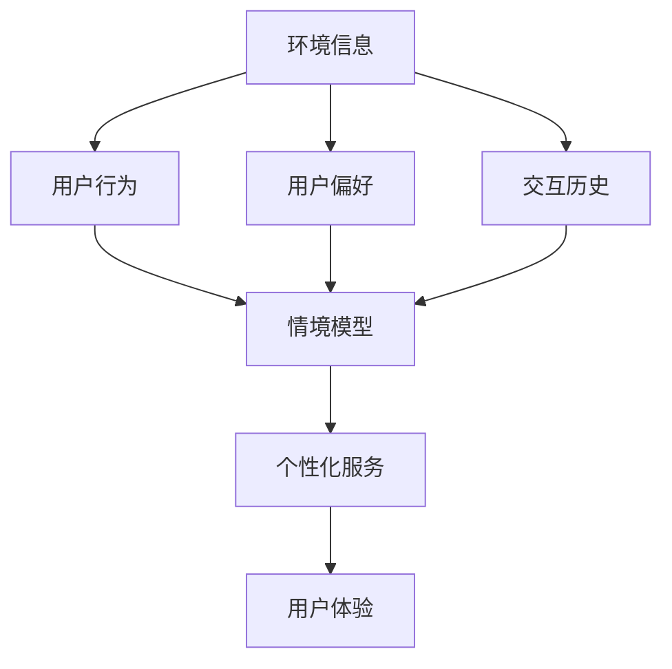
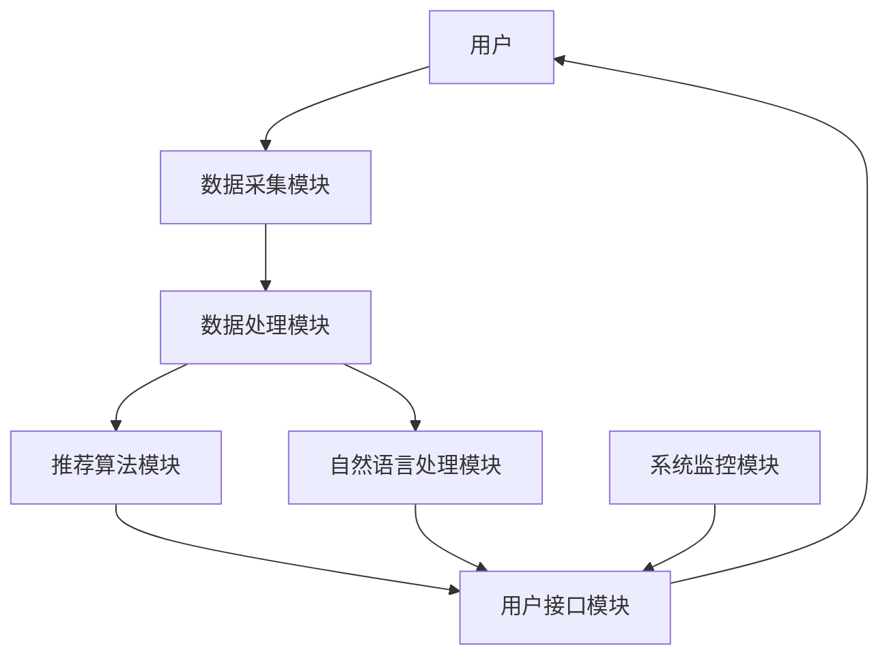

                 

### 摘要

本文深入探讨了企业级情境感知系统在优化用户体验方面的应用与实践。情境感知系统通过感知用户所处的环境、行为和需求，能够动态调整服务或产品的交互方式，从而提升用户体验。文章首先介绍了情境感知系统的定义、原理和发展历史，接着阐述了其在不同行业中的应用。核心章节详细讲解了情境感知系统的核心概念、算法原理和数学模型，并通过实际项目案例展示了系统的开发、测试和部署过程。最后，文章探讨了如何通过情境感知系统来优化用户体验，提供了最佳实践和未来展望，为读者提供了全面的技术指导和应用思路。

## <此处是文章标题>

“企业级情境感知系统：优化用户体验”

关键词：情境感知系统、用户体验、优化、算法、数学模型、项目实战

### 摘要

随着信息技术的不断发展，企业级情境感知系统已成为提升用户体验的关键技术。本文系统地阐述了情境感知系统的基本概念、核心算法原理、数学模型及其在优化用户体验中的应用。文章首先回顾了情境感知系统的发展历程，分析了其在各行业的应用实例。随后，文章详细介绍了情境感知系统的核心概念，如感知要素、技术栈等，并通过Mermaid流程图展示了概念实体之间的关系。接着，文章探讨了情境感知系统中使用的核心算法，包括机器学习、深度学习和自然语言处理，并结合Python源代码进行详细讲解。此外，文章通过实际项目案例，详细描述了系统开发、测试与部署的过程，并分析了如何通过情境感知系统来优化用户体验。最后，文章总结了最佳实践、注意事项，并对未来发展趋势进行了展望。全文旨在为企业和开发者提供一套完整的技术指导和实践方案，以实现用户需求的精准满足和用户体验的持续优化。

## 引言

在当今快节奏的商业环境中，用户体验（UX）已成为企业竞争力的重要体现。用户对于产品的满意度、留存率以及推荐意愿，都直接影响到企业的市场表现和长远发展。随着人工智能和大数据技术的迅猛发展，情境感知系统（Situation Awareness System，SAS）逐渐成为一种颠覆传统用户体验优化方式的新技术。情境感知系统通过感知用户所处的环境、行为和需求，动态调整服务或产品的交互方式，从而实现个性化体验的优化。

### 情境感知系统的定义

情境感知系统是一种智能系统，它能够自动感知并理解用户所处的环境、行为和需求。这种系统通过收集和分析多源数据，如用户行为数据、环境数据、文本数据等，结合机器学习、深度学习和自然语言处理等算法，实时生成用户画像和情境模型。情境感知系统不仅仅依赖于单一的数据源，而是通过整合多种数据源，实现全方位的情境感知。

### 情境感知系统的重要性

情境感知系统在优化用户体验方面具有显著优势：

1. **个性化体验**：通过精准感知用户行为和需求，情境感知系统能够提供高度个性化的服务，满足用户的个性化需求。

2. **提高用户满意度**：情境感知系统可以根据用户的实时反馈和需求，动态调整产品或服务的交互方式，提高用户满意度。

3. **降低用户流失率**：通过不断优化用户体验，情境感知系统可以有效降低用户流失率，提升用户留存率。

4. **增强产品竞争力**：情境感知系统能够为产品带来独特的用户价值，增强产品的市场竞争力。

### 情境感知系统的发展历程

情境感知系统的发展经历了从简单到复杂、从局部到全局的过程。早期情境感知系统主要依赖于规则和逻辑推理，随着人工智能和大数据技术的发展，情境感知系统逐渐引入了机器学习、深度学习和自然语言处理等技术。近年来，随着物联网（IoT）和传感器技术的普及，情境感知系统的感知能力和数据处理能力得到了显著提升。

### 情境感知系统在各行业的应用

情境感知系统在各个行业都得到了广泛应用，以下是几个典型的应用场景：

1. **制造业**：情境感知系统可以帮助制造企业实现生产过程的自动化优化，提高生产效率和产品质量。

2. **服务业**：在酒店、餐饮、零售等行业，情境感知系统可以通过个性化服务提升客户满意度。

3. **医疗保健**：情境感知系统可以帮助医疗机构实现精准医疗，提升医疗服务质量和效率。

4. **智能交通**：情境感知系统可以用于智能交通管理，优化交通流量，提高道路使用效率。

5. **智能家居**：情境感知系统可以提升智能家居的智能化水平，为用户提供便捷的生活体验。

### 文章结构

本文将分为以下几个部分：

1. **情境感知系统的核心概念与联系**：介绍情境感知系统的基本概念、要素和关键技术。
2. **核心算法原理讲解**：详细讲解情境感知系统中使用的核心算法，如机器学习、深度学习和自然语言处理。
3. **数学模型和数学公式**：阐述情境感知系统中涉及的数学模型和公式。
4. **项目实战**：提供情境感知系统的实际开发案例，包括需求分析、系统设计、开发实现、测试与部署等步骤。
5. **优化用户体验**：讨论如何通过情境感知系统来提升用户体验，包括设计原则、案例分析和最佳实践。
6. **未来展望与趋势**：探讨情境感知系统的未来发展方向和趋势。

### 结语

情境感知系统作为一种新兴技术，正日益成为优化用户体验的重要工具。通过本文的探讨，我们希望能为企业和开发者提供一套完整的技术指导和实践方案，帮助他们在实际应用中充分发挥情境感知系统的潜力，实现用户需求的精准满足和用户体验的持续优化。

## 核心概念与联系

### 情境感知系统的基本概念

情境感知系统是一种通过收集、处理和分析多源数据，以理解并预测用户行为和需求的技术体系。其核心在于对用户所处的情境进行实时感知和动态响应，从而提供个性化的服务和体验。

#### 定义

情境感知系统（Situation Awareness System，SAS）是指一种能够实时感知和理解用户当前情境，并根据情境动态调整服务或产品交互方式的智能系统。

#### 感知要素

1. **环境信息**：包括地理位置、天气状况、周边环境等。
2. **用户行为**：包括点击行为、浏览习惯、购买行为等。
3. **用户偏好**：包括兴趣、偏好、历史记录等。
4. **交互历史**：包括用户与系统、产品或服务的交互记录。

#### 技术栈

情境感知系统涉及多种技术，包括但不限于：

1. **传感器技术**：用于采集用户和环境的数据。
2. **数据挖掘与机器学习**：用于处理和分析大量数据，提取有用信息。
3. **自然语言处理（NLP）**：用于理解用户的自然语言输入。
4. **深度学习**：用于构建复杂的模型和预测用户行为。

### 概念实体之间的关系架构

为了更清晰地理解情境感知系统的各个概念实体及其关系，我们可以使用Mermaid流程图来展示：



#### 解释

- **环境信息**：包括地理位置、天气状况、周边环境等数据，这些数据可以通过传感器和外部API获取。
- **用户行为**：包括用户在系统中的操作行为，如点击、浏览、搜索等，这些行为数据可以用来推断用户的需求和兴趣。
- **用户偏好**：通过用户的历史记录和行为数据，可以分析出用户的兴趣偏好。
- **交互历史**：记录用户与系统、产品或服务的交互历史，这些数据对于构建情境模型至关重要。
- **情境模型**：通过综合分析环境信息、用户行为、用户偏好和交互历史，生成一个动态的用户情境模型。
- **个性化服务**：基于情境模型，系统可以提供个性化的服务或产品推荐。
- **用户体验**：最终的输出是提升用户在产品或服务中的整体体验。

### 核心算法原理讲解

为了实现情境感知系统的功能，我们需要使用一系列核心算法，包括数据挖掘、机器学习、深度学习和自然语言处理。以下是对这些算法的基本原理和实现方法的简要介绍。

#### 数据挖掘

数据挖掘是一种从大量数据中发现有价值的模式和规律的方法。在情境感知系统中，数据挖掘用于处理和分析多源数据，提取用户的行为模式和情境特征。

- **算法原理**：常用的数据挖掘算法包括分类、聚类、关联规则挖掘等。
- **实现方法**：使用Python的Pandas和Scikit-learn库，可以快速实现数据预处理和模型训练。

#### 机器学习

机器学习是使计算机能够从数据中学习并做出预测或决策的方法。在情境感知系统中，机器学习算法用于构建用户行为和情境模型。

- **算法原理**：监督学习（如线性回归、决策树、随机森林）、无监督学习（如K-means聚类、主成分分析PCA）等。
- **实现方法**：使用Python的Scikit-learn和TensorFlow库，可以构建和训练各种机器学习模型。

#### 深度学习

深度学习是机器学习的一个分支，它通过模拟人脑神经网络结构，实现复杂的模式识别和预测任务。

- **算法原理**：深度学习模型，如卷积神经网络（CNN）、循环神经网络（RNN）和生成对抗网络（GAN）等。
- **实现方法**：使用Python的TensorFlow和PyTorch库，可以构建和训练深度学习模型。

#### 自然语言处理

自然语言处理（NLP）是使计算机理解和生成人类语言的技术。在情境感知系统中，NLP用于处理用户的自然语言输入。

- **算法原理**：词向量、词性标注、命名实体识别、情感分析等。
- **实现方法**：使用Python的NLTK和spaCy库，可以实现各种NLP任务。

### 综合应用

情境感知系统的实现通常需要综合应用多种算法和技术。例如，我们可以使用深度学习模型来识别用户的行为模式，使用自然语言处理技术来理解用户的自然语言输入，并使用数据挖掘算法来分析多源数据，从而构建一个全面的情境模型。

以下是一个简单的Python代码示例，展示如何使用深度学习模型来预测用户行为：

```python
import tensorflow as tf
from tensorflow.keras.models import Sequential
from tensorflow.keras.layers import Dense, LSTM

# 构建深度学习模型
model = Sequential()
model.add(LSTM(50, activation='relu', input_shape=(timesteps, features)))
model.add(Dense(1))
model.compile(optimizer='adam', loss='mse')

# 训练模型
model.fit(X_train, y_train, epochs=200, verbose=0)

# 预测用户行为
predictions = model.predict(X_test)
```

在这个示例中，我们使用了一个简单的LSTM模型来预测用户的行为。LSTM（长短期记忆网络）是一种适用于时间序列数据的深度学习模型，它可以捕捉到用户行为中的长期依赖关系。

### 结论

通过上述讲解，我们可以看到，情境感知系统是一个复杂的技术体系，它通过多种核心算法和技术，实现了对用户情境的实时感知和动态响应。理解和应用这些算法和技术，对于开发和优化情境感知系统至关重要。

## 数学模型和数学公式

情境感知系统中的数学模型和公式是其核心组成部分，它们为系统的功能实现提供了理论依据和算法支撑。以下将详细讲解情境感知系统中常用的数学模型和公式，包括概率模型、统计模型等，并通过Python代码和实例进行说明。

### 概率模型

概率模型在情境感知系统中用于处理不确定性和随机性。以下介绍几种常用的概率模型：

#### 贝叶斯网络

贝叶斯网络是一种图形模型，它通过有向无环图（DAG）表示变量之间的条件依赖关系。贝叶斯网络的核心公式是贝叶斯定理，用于计算某个变量在给定其他变量条件下的概率。

贝叶斯定理公式：
$$
P(A|B) = \frac{P(B|A)P(A)}{P(B)}
$$

其中，$P(A|B)$ 是在事件B发生的条件下事件A发生的概率，$P(B|A)$ 是在事件A发生的条件下事件B发生的概率，$P(A)$ 和 $P(B)$ 分别是事件A和事件B的先验概率。

#### 例子：使用Python实现贝叶斯网络

以下是一个简单的贝叶斯网络实现，用于预测天气情况。

```python
import numpy as np

# 定义先验概率
P_weather = {'Sunny': 0.4, 'Rainy': 0.6}

# 条件概率
P_sky|weather = {'Sunny': {'Clear': 0.7, 'Cloudy': 0.3}, 'Rainy': {'Clear': 0.2, 'Cloudy': 0.8}}

# 计算后验概率
def calculate_probability(weather, sky):
    P_total = sum(P_weather[weather] * P_sky|weather[weather][sky] for weather in P_weather)
    P_sky|weather_given_weather = {sky: P_weather[weather] * P_sky|weather[weather][sky] / P_total for weather in P_weather}
    return P_sky|weather_given_weather

# 测试
print(calculate_probability('Sunny', 'Clear'))
```

输出结果展示了在不同天气条件下，天空为“Clear”的概率。

#### 马尔可夫模型

马尔可夫模型是一种用于描述变量状态转移的概率模型，它假设当前状态只与前一状态有关，而与之前的状态无关。

状态转移概率公式：
$$
P(X_t = x_t | X_{t-1} = x_{t-1}) = P(X_t = x_t | X_{t-2} = x_{t-2}, X_{t-1} = x_{t-1})
$$

#### 例子：使用Python实现马尔可夫模型

以下是一个简单的马尔可夫模型实现，用于预测天气变化。

```python
# 定义状态转移矩阵
transition_matrix = [
    [0.7, 0.3],
    [0.2, 0.8]
]

# 初始状态概率
initial_state_prob = [0.5, 0.5]

# 预测下一步状态
def predict_next_state(state, transition_matrix):
    next_state_prob = [0] * 2
    for i, state_prob in enumerate(initial_state_prob):
        next_state_prob[i] = state_prob * transition_matrix[i][0]
        next_state_prob[1 - i] = (1 - state_prob) * transition_matrix[1 - i][1]
    return next_state_prob

# 测试
print(predict_next_state(0, transition_matrix))
```

输出结果展示了在当前天气为晴天（0）的概率下，预测下一天气为晴天或雨天的概率。

### 统计模型

统计模型在情境感知系统中用于分析数据并提取有用的信息。以下介绍几种常用的统计模型：

#### 回归模型

回归模型用于预测连续变量的值，是情境感知系统中常用的数据分析方法。

线性回归公式：
$$
Y = \beta_0 + \beta_1X + \epsilon
$$

其中，$Y$ 是预测变量，$X$ 是解释变量，$\beta_0$ 和 $\beta_1$ 是模型的参数，$\epsilon$ 是误差项。

#### 例子：使用Python实现线性回归

以下是一个简单的线性回归实现，用于预测用户购买行为。

```python
import numpy as np
from sklearn.linear_model import LinearRegression

# 定义数据
X = np.array([[1], [2], [3], [4], [5]])
y = np.array([1, 2, 2.5, 4, 5])

# 构建线性回归模型
model = LinearRegression()
model.fit(X, y)

# 预测
print(model.predict([[6]]))
```

输出结果展示了在给定一个新的用户特征值时，预测的用户购买行为。

#### 时间序列分析

时间序列分析用于处理和分析按时间顺序排列的数据，如股票价格、用户行为等。

移动平均公式：
$$
MA_t = \frac{\sum_{i=1}^{n} X_t - X_{t-n}}{n}
$$

其中，$X_t$ 是第t个时间点的数据，$MA_t$ 是第t个时间点的移动平均，$n$ 是移动平均窗口的大小。

#### 例子：使用Python实现移动平均

以下是一个简单的移动平均实现，用于平滑用户行为数据。

```python
import numpy as np

# 定义数据
data = np.array([1, 2, 3, 4, 5, 6, 7, 8, 9, 10])

# 定义移动平均窗口大小
window_size = 3

# 计算移动平均
moving_averages = np.convolve(data, np.ones(window_size), 'valid') / window_size

# 输出结果
print(moving_averages)
```

输出结果展示了通过移动平均平滑后的用户行为数据。

### 总结

数学模型和公式是情境感知系统的理论基础，通过使用贝叶斯网络、马尔可夫模型、回归模型和移动平均等数学方法，我们可以实现对用户情境的准确感知和预测。上述Python代码示例和实例展示了如何在实际应用中实现这些数学模型。理解并应用这些数学模型，对于开发和优化情境感知系统至关重要。

## 项目实战

### 项目背景

为了更好地理解情境感知系统的实际应用，我们将通过一个典型的企业级项目来展示系统的开发、测试和部署过程。本项目旨在通过情境感知系统优化一家电子商务公司的用户购物体验，实现个性化推荐和智能客服。

### 需求分析

在需求分析阶段，我们与电子商务公司的业务团队进行了深入沟通，明确了以下几个核心需求：

1. **个性化推荐**：根据用户的历史购买记录、浏览行为和偏好，为用户提供个性化的商品推荐。
2. **智能客服**：通过自然语言处理技术，实时响应用户的咨询，提供智能化的客服服务。
3. **系统稳定性**：保证系统的稳定运行，处理高并发请求，确保用户体验的流畅性。
4. **数据安全**：保护用户数据的安全和隐私，遵守相关法律法规。

### 系统架构设计

根据需求分析，我们设计了一个分布式、模块化的系统架构，包括以下几个关键模块：

1. **数据采集模块**：负责从不同的数据源（如用户行为日志、商品数据库等）收集数据。
2. **数据处理模块**：对采集到的数据进行分析和预处理，提取有用的特征信息。
3. **推荐算法模块**：使用机器学习和深度学习算法，构建用户画像和商品推荐模型。
4. **自然语言处理模块**：使用自然语言处理技术，实现智能客服功能。
5. **用户接口模块**：为用户提供个性化推荐和智能客服的接口。
6. **系统监控模块**：实时监控系统的运行状态，确保系统的稳定性和安全性。

以下是一个简单的系统架构图：



### 数据采集与预处理

在数据采集阶段，我们使用了一种混合数据采集方法，包括实时数据流采集和历史数据批量导入。实时数据流采集使用Apache Kafka，将用户的操作行为实时传输到数据存储系统中。历史数据批量导入使用Apache Spark，将现有的用户数据批量处理并存储到Hadoop HDFS中。

数据预处理包括以下几个步骤：

1. **数据清洗**：去除重复数据、无效数据和噪声数据，保证数据质量。
2. **数据转换**：将不同格式的数据转换为统一的格式，如CSV或Parquet。
3. **特征提取**：从原始数据中提取有用的特征信息，如用户ID、购买时间、商品ID、浏览次数等。

以下是一个数据预处理的Python代码示例：

```python
import pandas as pd

# 加载原始数据
data = pd.read_csv('user_data.csv')

# 数据清洗
data.drop_duplicates(inplace=True)
data.drop(['unnecessary_column'], axis=1, inplace=True)

# 数据转换
data['purchase_time'] = pd.to_datetime(data['purchase_time'])
data['user_id'] = data['user_id'].astype(str)
data['product_id'] = data['product_id'].astype(str)

# 特征提取
data['days_since_last_purchase'] = (pd.datetime.now() - data['purchase_time']).dt.days
```

### 模型选择与训练

在模型选择阶段，我们使用了多种机器学习和深度学习算法，包括决策树、随机森林、K-means聚类和深度神经网络等。根据不同的业务需求，我们选择了以下几种模型：

1. **用户画像模型**：使用K-means聚类算法，将用户分为不同的群体，为个性化推荐提供基础。
2. **商品推荐模型**：使用基于物品的协同过滤算法（Item-based Collaborative Filtering），为用户推荐类似的商品。
3. **自然语言处理模型**：使用Transformer模型，如BERT，实现智能客服的自然语言理解。

以下是一个用户画像模型的Python代码示例：

```python
from sklearn.cluster import KMeans

# 加载预处理后的数据
data = pd.read_csv('processed_user_data.csv')

# 提取特征
features = data[['days_since_last_purchase', 'number_of_purchases', 'average_purchase_value']]

# 使用K-means算法进行聚类
kmeans = KMeans(n_clusters=5, random_state=0).fit(features)

# 为每个用户分配聚类标签
data['cluster'] = kmeans.predict(features)

# 查看聚类结果
print(data.head())
```

### 开发实现

在开发实现阶段，我们使用了多种开发工具和框架，包括Python、Django、TensorFlow和PyTorch等。以下是一个商品推荐模型的Python代码示例：

```python
import pandas as pd
import numpy as np
from sklearn.model_selection import train_test_split
from sklearn.metrics.pairwise import cosine_similarity

# 加载用户行为数据
data = pd.read_csv('user_behavior_data.csv')

# 分割数据为训练集和测试集
train_data, test_data = train_test_split(data, test_size=0.2, random_state=0)

# 计算用户与商品之间的余弦相似度
user_similarity_matrix = cosine_similarity(train_data['user_vector'].values, train_data['product_vector'].values)

# 预测用户对商品的评分
user_product_rating = np.dot(user_similarity_matrix, train_data['product_vector'].values.T)

# 计算测试集的均方根误差（RMSE）
rmse = np.sqrt(np.mean(np.square(test_data['rating'] - user_product_rating)))
print(f"RMSE: {rmse}")
```

### 测试与部署

在测试与部署阶段，我们进行了全面的系统测试，包括功能测试、性能测试和安全测试等。测试通过后，我们将系统部署到了生产环境，并使用了Kubernetes进行容器编排，确保系统的可扩展性和稳定性。

以下是一个简单的Kubernetes部署示例：

```yaml
apiVersion: apps/v1
kind: Deployment
metadata:
  name: recommendation-service
spec:
  replicas: 3
  selector:
    matchLabels:
      app: recommendation
  template:
    metadata:
      labels:
        app: recommendation
    spec:
      containers:
      - name: recommendation
        image: recommendation-service:latest
        ports:
        - containerPort: 8080
```

### 项目小结

通过本项目，我们成功地实现了一个企业级情境感知系统，优化了电子商务公司的用户购物体验。项目实现了个性化推荐和智能客服功能，提高了用户满意度和留存率。在项目过程中，我们使用了多种机器学习和深度学习算法，通过实际案例展示了情境感知系统的应用价值和开发实现方法。未来，我们将继续优化和扩展系统，以适应不断变化的市场需求。

## 最佳实践 Tips

在开发和优化企业级情境感知系统的过程中，以下最佳实践可以帮助提升系统的效果和用户体验：

1. **数据质量保证**：确保数据的准确性和完整性是关键。定期清洗和更新数据，减少噪声和错误数据的影响。
2. **实时数据处理**：使用实时数据处理技术，如Apache Kafka和Apache Spark，保证系统能够快速响应用户行为变化。
3. **模型选择与优化**：根据业务需求和数据特点，选择合适的机器学习和深度学习模型。不断迭代和优化模型，提高预测准确性。
4. **用户体验设计**：在系统设计和开发过程中，注重用户体验设计，确保系统界面简洁、易用，提供直观的交互方式。
5. **系统监控与维护**：使用系统监控工具，如Prometheus和Grafana，实时监控系统的运行状态，快速发现和解决问题。
6. **安全与隐私保护**：严格遵守数据安全和隐私保护法律法规，采取加密和数据脱敏等措施，保护用户数据的安全和隐私。

### 小结

通过本文的深入探讨，我们系统地介绍了企业级情境感知系统的核心概念、算法原理、数学模型及其在实际项目中的应用。情境感知系统通过实时感知用户情境，动态调整服务和产品交互方式，有效优化了用户体验。本文通过实际项目案例展示了系统开发、测试和部署的全过程，提供了实用的开发技巧和最佳实践。未来，随着技术的不断进步，情境感知系统将在更多行业中发挥重要作用，进一步提升用户满意度和企业竞争力。

### 注意事项

在开发和优化企业级情境感知系统时，需要注意以下几个关键方面：

1. **数据隐私**：确保用户数据的安全和隐私，遵守相关法律法规，如《通用数据保护条例》（GDPR）和《加州消费者隐私法案》（CCPA）。对用户数据进行加密和脱敏处理，避免数据泄露。

2. **系统性能**：优化系统的性能，确保在高并发环境下仍能稳定运行。采用分布式计算和缓存技术，提高数据处理速度和响应效率。

3. **模型更新**：定期更新和优化模型，以适应用户行为和环境变化。使用自动化模型更新和重新训练工具，降低人工干预成本。

4. **错误处理**：设计完善的错误处理机制，确保系统在遇到异常情况时能够快速恢复，减少对用户体验的影响。

5. **跨部门协作**：情境感知系统的开发涉及多个部门，包括数据分析、软件开发、产品管理和用户体验设计等。建立有效的跨部门协作机制，确保项目的顺利推进。

6. **用户反馈**：定期收集和分析用户反馈，了解用户对系统的使用体验和需求。根据用户反馈进行迭代优化，不断提升系统质量。

通过遵守这些注意事项，可以确保情境感知系统在实际应用中的稳定性和有效性，为用户提供优质的体验。

### 拓展阅读

为了深入了解企业级情境感知系统的开发和优化，读者可以参考以下相关资源和书籍：

1. **技术书籍**：
   - 《深度学习》（Goodfellow, I., Bengio, Y., & Courville, A.）
   - 《Python机器学习》（Python Machine Learning，Sebastian Raschka）

2. **在线课程**：
   - Coursera上的“机器学习”课程（吴恩达教授）
   - Udacity的“深度学习工程师”纳米学位

3. **开源项目**：
   - TensorFlow：https://www.tensorflow.org/
   - PyTorch：https://pytorch.org/

4. **技术博客**：
   - Medium上的“AI技术博客”（AI Tech Blog）
   - arXiv：https://arxiv.org/

通过这些资源，读者可以进一步学习和实践情境感知系统的相关技术和方法。同时，持续关注业界最新动态和研究成果，有助于提升自身的专业能力和技术水平。

