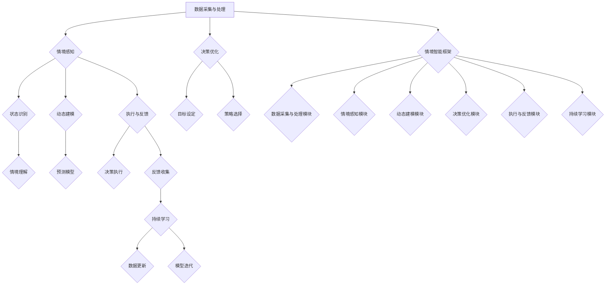
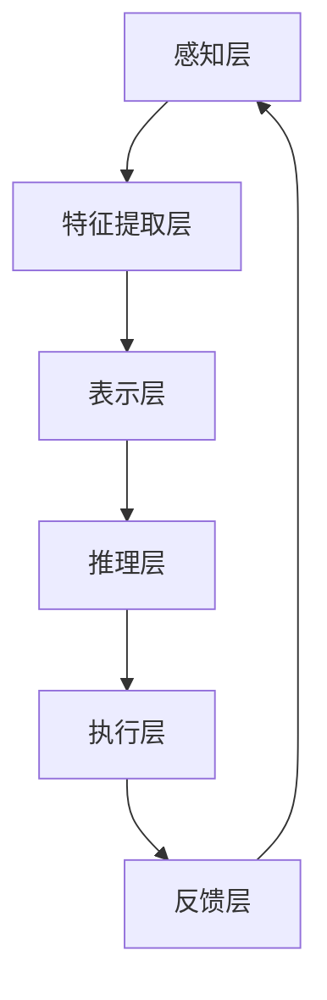
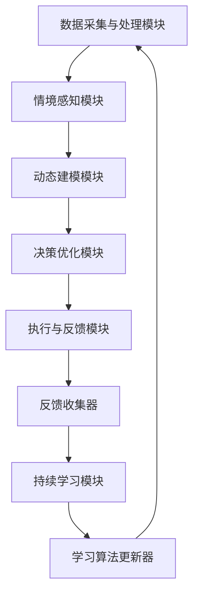

                 

### 引言

在企业信息化和数字化转型的浪潮中，人工智能（AI）技术的应用日益广泛。从早期的机器学习模型到如今的深度学习算法，AI技术不断突破技术瓶颈，逐渐成为企业创新和业务优化的关键驱动力。然而，随着AI应用的深入，如何让AI系统更好地适应复杂多变的商业场景，成为了一个亟待解决的问题。这就需要一种新的智能框架——企业级情境智能框架。

**情境智能**是一种能够感知和理解具体环境，并据此调整自身行为以优化结果的智能技术。它不仅能够处理静态数据，还能够动态地应对环境的变化，从而实现更加智能化的决策和执行。在企业级应用中，情境智能的重要性不言而喻。它可以提升业务流程的自动化水平，增强用户体验，提高生产效率，降低运营成本，最终为企业创造更大的价值。

### AI场景适应性现状与挑战

当前，许多企业在应用AI技术时面临着一系列挑战。首先，大多数AI系统都是基于静态数据和标准算法进行训练的，这导致它们在处理动态和不确定的业务场景时显得力不从心。其次，不同业务部门之间的数据孤岛现象严重，难以实现跨部门的数据共享和协同工作。再者，AI系统的维护和更新通常需要大量的人力和时间成本，且容易出现数据过时或模型失效的情况。

为了应对这些挑战，企业需要一种能够增强AI场景适应性的解决方案。这不仅仅是一个技术问题，更是一个系统性工程。企业级情境智能框架应运而生，它通过集成情境感知、动态调整、持续学习和跨部门协同等机制，旨在提升AI系统在不同商业场景中的适应性。

### 企业级情境智能框架的重要性

企业级情境智能框架不仅解决了AI系统在场景适应性方面的不足，还为企业带来了以下几个方面的重大价值：

1. **提升业务流程自动化水平**：情境智能能够根据实时环境和业务需求，自动调整流程和策略，减少人工干预，提高业务处理效率。

2. **增强用户体验**：通过情境智能，企业能够更好地理解用户行为和需求，提供个性化的服务和推荐，提升用户满意度和忠诚度。

3. **提高生产效率**：情境智能可以实时监控生产过程，预测潜在问题，提前采取措施，从而减少停机时间，提高生产效率。

4. **降低运营成本**：通过自动化和智能化的管理，企业可以减少人力成本，优化资源配置，提高整体运营效率。

5. **促进跨部门协同**：情境智能框架支持跨部门的数据共享和协同工作，打破信息孤岛，提升企业的整体运营效率。

总之，企业级情境智能框架是提升企业竞争力和创新能力的关键工具，它为企业提供了一种灵活、智能、高效的解决方案，助力企业在数字化时代中脱颖而出。接下来，我们将详细探讨情境智能的核心概念、框架设计、增强策略以及实践案例，深入理解这一前沿技术的应用与价值。

### 情境智能的定义与价值

**情境智能**（Situation-aware Intelligence）是一种能够感知、理解和利用环境信息的智能技术。它不仅依赖于传统的人工智能算法，还强调对动态环境变化的响应和适应性。情境智能的核心在于**情境感知**（Situation Awareness），即系统能够实时获取并理解所处环境的状态和变化，从而做出智能的决策和调整。

在企业级应用中，情境智能的价值体现在多个方面。首先，它能够提升业务流程的自动化水平。传统的AI系统通常是基于静态数据进行训练，难以适应动态变化的环境。而情境智能通过实时感知环境变化，能够动态调整业务流程，提高流程的灵活性和响应速度。

其次，情境智能显著增强了用户体验。通过深入了解用户的行为和需求，情境智能系统能够提供个性化的服务和建议，提升用户的满意度和忠诚度。例如，智能客服系统能够根据用户的聊天内容和历史记录，提供针对性的解答和建议，从而提升用户的交互体验。

此外，情境智能还在提高生产效率和降低运营成本方面发挥了重要作用。在生产环境中，情境智能可以实时监控设备状态和生产线数据，预测潜在故障和瓶颈，提前进行维护和优化。这样可以减少停机时间，提高生产效率，降低运营成本。例如，在智能制造领域，情境智能可以优化生产调度和资源分配，实现高效的生产流程。

最后，情境智能还能够促进跨部门的协同工作。在企业内部，不同部门通常拥有不同的数据和信息，而情境智能框架通过集成这些数据，实现跨部门的数据共享和协同工作。这有助于打破信息孤岛，提升企业的整体运营效率。

总之，情境智能通过增强系统的环境感知能力和动态响应能力，为企业提供了更加智能、灵活和高效的解决方案。这不仅提升了企业的竞争力，还为企业创造了巨大的商业价值。

### 情境智能核心概念与联系

要深入理解情境智能，首先需要掌握其核心概念，并理解这些概念之间的联系。以下是情境智能中的关键概念及其相互关系：

1. **情境感知（Situation Awareness）**：情境感知是指系统获取、理解和利用环境信息的能力。情境感知是情境智能的基础，它决定了系统对环境的感知广度和深度。情境感知能力包括以下几个方面：
   - **环境监控**：实时收集和分析环境数据，如传感器数据、用户行为数据等。
   - **状态识别**：根据收集到的数据，识别当前环境的特征和变化。
   - **情境理解**：理解环境变化对业务流程或用户行为的影响。

2. **动态建模（Dynamic Modeling）**：动态建模是指对环境变化进行建模和预测的能力。通过动态建模，系统能够预测未来的环境变化，并提前采取相应的措施。动态建模的关键要素包括：
   - **时间序列分析**：分析时间序列数据，识别环境变化的趋势和周期性。
   - **预测模型**：构建预测模型，对未来环境变化进行预测。

3. **决策优化（Decision Optimization）**：决策优化是指基于情境感知和动态建模的结果，做出最优决策的能力。决策优化涉及多个方面，包括：
   - **目标设定**：明确系统的决策目标，如最大化利润、最小化成本等。
   - **策略选择**：根据情境感知和预测结果，选择最优的决策策略。

4. **执行与反馈（Execution and Feedback）**：执行与反馈是指执行决策并收集反馈信息，以不断优化系统的过程。执行与反馈是情境智能闭环系统的重要组成部分，具体包括：
   - **决策执行**：根据决策结果，执行具体的操作或任务。
   - **反馈收集**：收集执行结果，评估决策的有效性。

5. **持续学习（Continuous Learning）**：持续学习是指系统在运行过程中不断学习和优化自身能力的能力。持续学习使系统能够适应环境变化，提高决策的准确性和效率。持续学习的关键要素包括：
   - **数据更新**：不断更新和扩展系统训练数据。
   - **模型迭代**：根据反馈信息，对模型进行迭代和优化。

6. **情境智能框架（Situation-aware Intelligence Framework）**：情境智能框架是整合上述核心概念，实现情境智能的系统整体架构。情境智能框架通常包括以下几个模块：
   - **数据采集与处理模块**：负责收集、存储和处理环境数据。
   - **情境感知模块**：实现情境感知功能，包括环境监控、状态识别和情境理解。
   - **动态建模模块**：进行环境变化建模和预测。
   - **决策优化模块**：基于情境感知和动态建模结果，进行决策优化。
   - **执行与反馈模块**：执行决策，并收集反馈信息。
   - **持续学习模块**：实现系统的持续学习和能力提升。

为了更好地理解这些概念之间的关系，我们可以使用Mermaid流程图来展示情境智能框架的整体流程：



通过上述流程图，我们可以清晰地看到情境智能各模块之间的交互和协作关系。数据采集与处理模块提供基础数据支持，情境感知模块实现环境信息收集和理解，动态建模模块进行环境变化预测，决策优化模块基于预测结果做出最优决策，执行与反馈模块实现决策执行和效果评估，持续学习模块则根据反馈信息不断优化系统性能。这些模块相互依赖、协同工作，共同构成了情境智能框架的整体运作机制。

### 情境智能的模型架构

情境智能模型架构是情境智能框架的核心部分，它决定了系统的感知、预测和决策能力。一个高效的情境智能模型架构通常包括以下几个关键层次：

1. **感知层（Perception Layer）**：这是模型架构的最底层，负责感知和理解环境信息。感知层通常由各种传感器和数据采集设备组成，能够实时获取环境中的数据，如温度、湿度、用户行为、设备状态等。感知层的数据质量直接影响到模型的准确性和可靠性，因此，数据采集的全面性和准确性至关重要。

2. **特征提取层（Feature Extraction Layer）**：感知层收集到的原始数据通常是非常大规模和多样化的，这些数据需要通过特征提取层进行预处理和转换，提取出对模型有用的特征。特征提取层的主要任务包括数据清洗、数据归一化、降维和特征选择等。通过有效的特征提取，模型可以更好地理解和利用环境信息，从而提高预测和决策的准确性。

3. **表示层（Representation Layer）**：表示层是模型架构的核心，它负责将特征数据转换为一个适合模型处理的表示形式。常见的表示层技术包括深度神经网络（DNN）、循环神经网络（RNN）和变换器（Transformer）等。表示层的模型选择和设计直接决定了模型的性能和效率。例如，RNN在处理时间序列数据时具有优势，而Transformer在处理序列数据时表现出色。

4. **推理层（Reasoning Layer）**：推理层负责根据表示层生成的特征表示，进行情境感知、预测和决策。在推理层，模型会根据情境感知模块收集到的环境信息，利用动态建模技术进行环境变化预测，并基于预测结果进行决策优化。推理层的算法选择和参数调优是模型性能提升的关键。

5. **执行层（Execution Layer）**：执行层负责将推理层生成的决策结果转化为具体的行动。执行层通常包括一系列自动化流程和操作，如调整设备参数、生成报告、发送通知等。执行层的实施效果直接影响情境智能的实际应用价值。

6. **反馈层（Feedback Layer）**：反馈层是情境智能模型架构中的关键环节，负责收集执行结果和用户反馈，并将其反馈给模型，用于模型优化和迭代。通过反馈层，系统能够不断学习和调整，提高模型的适应性和准确性。

以下是情境智能模型架构的Mermaid流程图：



通过上述流程图，我们可以清晰地看到各个层次之间的交互关系和协作机制。感知层通过传感器和数据采集设备获取环境信息，特征提取层对这些信息进行预处理和转换，表示层生成适合模型处理的特征表示，推理层基于这些特征表示进行情境感知和预测，执行层将决策结果转化为具体的操作，最后反馈层收集执行结果和用户反馈，用于模型优化和迭代。

在实际应用中，情境智能模型架构可以根据具体业务场景进行灵活调整和优化。例如，在智能交通系统中，感知层可能包括摄像头、传感器和GPS设备，用于实时监测交通流量和道路状况；特征提取层可以提取交通流量、车辆速度和行人密度等关键特征；表示层可以使用卷积神经网络（CNN）进行图像处理；推理层可以根据预测的交通状况调整交通信号灯的时长和路线规划；执行层可以自动调整交通信号灯和导航系统，反馈层可以收集交通流量数据和分析结果，用于模型优化和迭代。

总之，情境智能模型架构通过多层次、多模块的协同工作，实现了对复杂环境的高效感知、预测和决策，为企业提供了强大的智能支持。下一部分，我们将详细探讨情境智能数据处理的相关技术和方法，进一步理解情境智能的实际应用价值。

### 情境智能的数据处理

在情境智能系统中，数据处理是关键的一环。数据的质量和数量直接影响模型的学习效果和预测准确性。以下是情境智能系统中的数据处理步骤和技术：

1. **数据采集**：数据采集是情境智能系统的基础。系统需要通过各种传感器、用户输入和网络数据等渠道，实时获取环境信息。常用的数据采集方法包括：
   - **传感器数据采集**：利用各种物理传感器（如温度传感器、湿度传感器、摄像头、GPS等）收集环境数据。
   - **日志数据采集**：通过系统日志、用户行为记录等渠道收集业务数据。
   - **网络数据采集**：通过网络爬虫、API接口等方式获取外部数据。

2. **数据预处理**：采集到的原始数据通常质量较低，需要通过预处理步骤进行清洗、转换和标准化。数据预处理的主要任务包括：
   - **数据清洗**：去除数据中的噪声和异常值，保证数据的一致性和完整性。
   - **数据转换**：将不同类型的数据（如文本、图像、时间序列等）转换为统一的格式，便于后续处理。
   - **数据标准化**：对数据进行归一化或标准化处理，使其满足模型训练的需求。

3. **特征提取**：特征提取是数据处理的下一个关键步骤。通过提取有用的特征，系统能够更好地理解和利用环境信息。特征提取方法包括：
   - **传统特征提取**：如主成分分析（PCA）、线性判别分析（LDA）等，用于降维和特征选择。
   - **深度特征提取**：如卷积神经网络（CNN）、循环神经网络（RNN）等，用于从原始数据中自动提取高层次的语义特征。

4. **数据存储**：为了高效地管理和访问数据，情境智能系统通常需要采用分布式存储方案。常见的数据存储技术包括：
   - **关系数据库**：如MySQL、PostgreSQL等，适用于结构化数据存储。
   - **NoSQL数据库**：如MongoDB、Cassandra等，适用于大规模、非结构化数据的存储。
   - **数据湖**：如Hadoop、Hive等，适用于存储大量原始数据，支持实时查询和分析。

5. **数据流处理**：在实时应用场景中，情境智能系统需要处理大量的实时数据。数据流处理技术如Apache Kafka、Apache Flink等，可以实时采集、处理和存储数据流，确保系统的高效运行和响应速度。

6. **数据标注**：对于监督学习模型，数据标注是确保模型训练质量的关键。数据标注涉及对数据进行标签分配，标记数据中的特定特征或事件。常见的标注方法包括：
   - **自动标注**：通过机器学习算法自动标注数据，减少人工标注的工作量。
   - **半监督标注**：结合自动标注和人工标注，提高标注的准确性和效率。
   - ** crowdsourcing 标注**：利用众包平台，邀请大量用户参与标注，提高标注的覆盖率和质量。

通过上述数据处理步骤，情境智能系统能够高效地收集、处理和利用环境信息，为后续的情境感知、预测和决策提供坚实的数据支持。下一部分，我们将探讨情境智能的技术演进，了解这一领域的发展历程和未来趋势。

### 情境智能的技术演进

情境智能技术的发展经历了多个阶段，从早期的简单感知到现代复杂的多层次智能系统，其技术演进路径展示了人工智能（AI）领域的不断进步和突破。

1. **传统感知阶段**：在情境智能的早期阶段，系统的感知能力主要集中在一些简单的物理量，如温度、湿度、光照强度等。这一阶段的感知技术依赖于传感器和简单的数据采集设备，数据处理能力有限，系统主要进行数据的直接读取和简单分析。

2. **信号处理阶段**：随着计算机技术和信号处理技术的发展，情境智能系统开始引入信号处理技术，如傅里叶变换、小波变换等。这些技术使得系统能够更有效地从复杂环境中提取有用的信号特征，提升了情境感知的准确性和效率。

3. **机器学习阶段**：进入21世纪，机器学习技术的快速发展为情境智能带来了重大变革。通过使用监督学习、无监督学习和强化学习算法，情境智能系统能够自动从大量数据中学习并提取特征，实现了更高层次的感知和理解。例如，支持向量机（SVM）、决策树、神经网络等技术在这一阶段得到了广泛应用。

4. **深度学习阶段**：近年来，深度学习技术的兴起进一步推动了情境智能的发展。深度学习通过多层神经网络自动提取高层次的特征表示，使得情境智能系统能够在复杂的场景中实现高效、准确的感知。卷积神经网络（CNN）在图像处理领域取得了突破性进展，循环神经网络（RNN）和变换器（Transformer）则在序列数据处理方面表现出色。

5. **多模态融合阶段**：现代情境智能系统通常需要处理多种类型的数据，如文本、图像、声音等。多模态融合技术通过整合不同类型的数据，提高了系统的综合感知能力。例如，通过融合视觉、听觉和语言数据，智能客服系统能够提供更加自然、贴心的用户体验。

6. **迁移学习和联邦学习阶段**：迁移学习使得情境智能系统能够利用已有的模型和知识，在新的任务上快速进行训练和部署。联邦学习则通过分布式训练机制，保护用户隐私的同时，提高了模型的泛化能力和训练效率。

7. **智能决策阶段**：未来，情境智能的发展将更加注重智能决策能力的提升。通过结合情境感知、预测模型和优化算法，情境智能系统能够在复杂环境中做出更加精准和智能的决策，实现高度自动化和优化的业务流程。

综上所述，情境智能的技术演进路径体现了从单一感知到多模态融合，从静态数据处理到动态环境适应，从传统机器学习到深度学习和迁移学习的不断迭代和发展。随着技术的不断进步，情境智能将在更多行业和场景中发挥重要作用，推动人工智能的进一步普及和应用。

### 企业级情境智能框架设计原则

设计一个高效、可靠且具备扩展性的企业级情境智能框架，需要遵循一系列核心设计原则。以下是一些关键原则及其具体实施方法：

1. **模块化设计**：模块化设计是将系统分解为若干独立且功能明确的模块，每个模块负责特定的任务。这样做不仅提高了系统的可维护性和可扩展性，还便于开发和测试。例如，可以将情境智能框架分为数据采集与处理模块、情境感知模块、动态建模模块、决策优化模块、执行与反馈模块和持续学习模块。每个模块都可以独立开发、部署和更新，模块之间的交互通过标准接口进行。

2. **高扩展性**：企业级应用通常需要应对不同规模和复杂度的业务场景，因此情境智能框架必须具备高扩展性。具体措施包括：
   - **横向扩展**：通过分布式架构，如微服务架构，支持系统在节点数和计算能力上的线性扩展，满足高并发和大规模数据处理需求。
   - **纵向扩展**：通过增加服务器硬件资源，如增加CPU、内存等，提高系统处理能力，确保在大规模数据场景下的稳定运行。

3. **灵活性和可定制性**：情境智能框架需要支持不同业务场景下的灵活调整和定制。具体措施包括：
   - **参数配置**：通过配置文件或参数化接口，允许用户根据具体业务需求调整系统参数，如学习率、迭代次数等。
   - **模块定制**：支持根据具体业务需求，动态添加或替换框架中的模块，实现定制化的智能解决方案。

4. **高可用性**：高可用性是确保系统稳定运行的重要原则。具体措施包括：
   - **容错设计**：通过冗余设计和故障转移机制，确保在单点故障时，系统能够自动切换到备用节点，保障业务连续性。
   - **监控与报警**：通过实时监控和报警系统，及时发现和处理系统异常，确保系统运行状态的可视化和可控性。

5. **安全性**：安全性是情境智能框架设计中的重要考量。具体措施包括：
   - **数据加密**：对传输和存储的数据进行加密处理，防止数据泄露和篡改。
   - **访问控制**：通过身份验证和权限管理，确保系统资源的访问安全，防止未授权访问。
   - **安全审计**：通过日志记录和审计机制，监控和记录系统操作，以便在出现问题时进行追溯和分析。

6. **可维护性**：良好的可维护性是确保系统长期稳定运行的关键。具体措施包括：
   - **代码质量**：遵循良好的编程规范和编码习惯，确保代码的可读性和可维护性。
   - **文档化**：为系统组件提供详细的文档和注释，便于开发和维护人员理解和使用。
   - **自动化测试**：通过自动化测试工具，确保系统功能和性能的稳定性和一致性。

通过遵循上述设计原则，企业级情境智能框架能够实现高效、可靠和可扩展的智能应用，为企业提供强大的智能支持。下一部分，我们将详细探讨情境智能框架的架构与模块划分，进一步理解其实现细节。

### 框架架构与模块划分

企业级情境智能框架的架构设计是确保系统高效、稳定运行的关键。整个框架由多个紧密协作的模块组成，每个模块承担特定的功能，共同实现情境智能的整体目标。以下是情境智能框架的总体架构及其各个模块的详细划分和功能：

1. **数据采集与处理模块**：
   - **功能**：该模块负责收集来自各种传感器、用户输入和外部API的数据，并进行预处理和清洗，为后续分析提供高质量的数据。
   - **组成部分**：数据采集器、数据清洗器、数据存储器。
   - **技术实现**：数据采集器可以使用各种接口（如HTTP API、MQTT、数据库连接等）获取数据；数据清洗器采用数据预处理技术（如缺失值填充、异常值检测和去重等）；数据存储器则利用分布式数据库（如Hadoop、Hive）进行数据存储和管理。

2. **情境感知模块**：
   - **功能**：该模块通过分析处理后的数据，感知和理解当前环境的状况和变化。情境感知模块是情境智能框架的核心，决定了系统的感知能力和准确性。
   - **组成部分**：传感器数据处理单元、情境分析引擎。
   - **技术实现**：传感器数据处理单元使用特征提取算法（如PCA、LDA）提取关键特征；情境分析引擎利用机器学习算法（如SVM、RNN、CNN）进行情境识别和分类。

3. **动态建模模块**：
   - **功能**：该模块负责根据情境感知模块的结果，建立动态模型，预测未来环境的变化趋势。
   - **组成部分**：时间序列分析器、预测模型构建器。
   - **技术实现**：时间序列分析器使用ARIMA、LSTM等算法进行时间序列分析；预测模型构建器则通过回归分析、决策树、神经网络等算法构建预测模型。

4. **决策优化模块**：
   - **功能**：该模块基于动态建模的结果，进行决策优化，生成最优的决策方案。
   - **组成部分**：目标函数设定器、策略选择器。
   - **技术实现**：目标函数设定器根据业务需求设定优化目标（如最大化利润、最小化成本等）；策略选择器使用优化算法（如线性规划、遗传算法、模拟退火等）选择最优策略。

5. **执行与反馈模块**：
   - **功能**：该模块负责将决策结果转化为实际的执行操作，并对执行结果进行反馈收集。
   - **组成部分**：执行控制器、反馈收集器。
   - **技术实现**：执行控制器根据决策结果执行操作（如调整设备参数、发送通知等）；反馈收集器则收集执行结果，评估决策的有效性。

6. **持续学习模块**：
   - **功能**：该模块负责根据反馈信息，不断优化和更新模型，提升系统的自适应能力。
   - **组成部分**：学习算法更新器、模型评估器。
   - **技术实现**：学习算法更新器使用基于梯度的优化算法（如SGD、Adam）和强化学习算法（如Q-learning、DQN）更新模型参数；模型评估器则通过交叉验证、A/B测试等方法评估模型性能。

以下是情境智能框架的Mermaid流程图，展示了各个模块之间的交互关系：



通过上述模块划分和流程图，我们可以清晰地看到情境智能框架的整体架构及其运行机制。各个模块之间通过标准接口进行数据传递和功能协作，共同实现情境智能的目标。这种模块化设计和分布式架构不仅提高了系统的灵活性和扩展性，还确保了系统的稳定运行和高效性能。

### 模块交互与协同工作

在企业级情境智能框架中，各个模块之间的交互与协同工作是实现系统高效运作的关键。以下是各个模块之间的交互机制及其协同工作方式：

1. **数据流交互**：数据是情境智能系统的核心，各个模块通过数据流进行交互。具体流程如下：
   - **数据采集与处理模块**首先从传感器、用户输入和外部API获取原始数据，并进行预处理和清洗，生成高质量的数据集。
   - **情境感知模块**接收预处理后的数据，通过特征提取和情境分析，感知和理解当前环境的状况。
   - **动态建模模块**基于情境感知模块的结果，建立动态模型，预测未来环境的变化趋势。
   - **决策优化模块**使用动态建模模块生成的预测结果，进行决策优化，生成最优的决策方案。
   - **执行与反馈模块**根据决策优化模块的决策结果执行操作，并将执行结果反馈给持续学习模块。
   - **持续学习模块**根据反馈结果，更新和优化模型参数，提升系统的自适应能力。

2. **接口交互**：各个模块之间的交互通过标准接口进行，确保数据的一致性和系统的可扩展性。具体接口包括：
   - **API接口**：用于模块之间的数据传输和功能调用，如RESTful API、gRPC等。
   - **消息队列**：如Kafka、RabbitMQ等，用于异步消息传递和分布式系统的协调。
   - **数据库接口**：用于数据的存储和访问，如SQL、NoSQL数据库接口。

3. **事件驱动交互**：情境智能系统采用事件驱动架构，通过事件触发模块间的交互。例如：
   - **感知事件**：当传感器检测到环境变化时，触发感知事件，情境感知模块开始处理数据。
   - **决策事件**：当动态模型生成新的预测结果时，触发决策事件，决策优化模块开始进行决策优化。
   - **执行事件**：当决策优化模块生成决策方案后，触发执行事件，执行与反馈模块开始执行操作。
   - **反馈事件**：当执行与反馈模块完成操作并收集到反馈结果时，触发反馈事件，持续学习模块开始模型优化。

4. **协同工作方式**：各个模块通过协同工作，共同实现情境智能的目标。具体协同工作方式包括：
   - **并行处理**：多个模块可以并行处理数据，提高系统处理效率。例如，数据采集与处理模块可以并行处理多个传感器的数据，情境感知模块可以并行处理多个数据集。
   - **流水线处理**：数据从采集到处理，再到预测和决策，形成一条数据处理流水线，确保数据处理的高效和连续性。
   - **反馈循环**：通过持续学习模块的反馈机制，各模块不断优化和调整，形成一个闭环系统，确保系统在动态环境中保持高效运行。

通过上述交互机制和协同工作方式，企业级情境智能框架实现了高效的数据处理、动态的环境感知和智能的决策执行，为企业提供了强大的智能支持。下一部分，我们将探讨情境智能框架的扩展性与适应性，了解其在不同业务场景中的适用性。

### 框架的扩展性与适应性

在企业级应用中，情境智能框架的扩展性与适应性是确保其能够在不同业务场景下灵活应用的关键。以下是情境智能框架在扩展性和适应性方面的一些重要设计考虑：

1. **模块化设计**：情境智能框架采用模块化设计，使得各个模块可以独立开发和部署。这种设计不仅提高了系统的可维护性和可扩展性，还便于根据具体需求进行模块的增删和调整。例如，当企业需要处理新的业务场景时，可以通过添加或替换特定模块（如新的感知模块、预测模块等）来实现，而无需对整个系统进行大规模重构。

2. **插件机制**：情境智能框架支持插件机制，允许开发者自定义和集成第三方插件，扩展系统的功能。例如，企业可以通过集成第三方库或服务，实现特定的数据采集、数据处理或模型优化功能，提高系统的灵活性和适应性。插件机制还支持热插拔，即在不停止系统运行的情况下，动态加载和卸载插件，确保系统的连续性和稳定性。

3. **配置化参数**：框架中的关键参数和配置可以通过外部配置文件进行灵活调整，以适应不同的业务场景。例如，数据采集频率、特征提取方法、模型训练参数等，都可以通过配置文件进行修改，从而实现系统的定制化。配置化参数使得企业可以轻松调整系统的行为，适应不同的应用需求。

4. **分布式架构**：情境智能框架采用分布式架构，支持横向扩展和分布式计算。通过分布式架构，系统可以轻松扩展到多个节点，处理大规模数据和高并发请求。分布式架构还支持负载均衡和故障转移，确保系统在高负载和故障情况下依然能够稳定运行。例如，当系统面临大量感知数据时，可以通过增加节点数量和计算资源，提高系统的处理能力和响应速度。

5. **跨平台兼容性**：情境智能框架支持跨平台部署，可以在不同的操作系统、硬件环境和云平台上运行。通过抽象化层和标准化接口，框架可以屏蔽底层硬件和操作系统的差异，确保系统的兼容性和可移植性。跨平台兼容性使得企业可以在不同的硬件环境和云计算平台上灵活部署和扩展情境智能系统。

6. **动态调整能力**：情境智能框架具备动态调整能力，可以根据环境变化和业务需求，实时调整系统的行为和参数。例如，在动态环境中，系统可以根据感知数据的变化，自动调整数据采集频率、特征提取方法和模型参数，从而保持系统的适应性和准确性。动态调整能力使得系统能够迅速响应环境变化，提高决策的实时性和准确性。

7. **安全性与隐私保护**：在扩展性和适应性设计中，安全性和隐私保护同样重要。情境智能框架通过数据加密、访问控制和安全审计等机制，确保系统数据的安全性和隐私保护。同时，框架支持合规性和数据脱敏，确保在跨部门和跨企业应用中，数据的安全性和合规性得到保障。

通过上述设计考虑，情境智能框架不仅具备了强大的扩展性和适应性，还确保了系统的高效、稳定和安全运行。这些特性使得情境智能框架能够灵活应对各种复杂业务场景，为企业提供强大的智能支持。下一部分，我们将详细探讨情境智能框架的部署与维护，了解其实际应用中的关键环节和注意事项。

### 框架的部署与维护

在企业级应用中，情境智能框架的部署与维护是确保系统正常运行和持续优化的重要环节。以下是情境智能框架在部署与维护过程中的一些关键步骤和注意事项：

1. **部署策略**：
   - **云计算平台选择**：根据企业需求和预算，选择合适的云计算平台（如阿里云、腾讯云、AWS等）进行部署。云计算平台提供弹性计算资源、数据存储和分布式架构支持，有助于实现高效、可扩展的部署。
   - **容器化部署**：采用容器化技术（如Docker、Kubernetes等），实现情境智能框架的轻量化和可移植性。容器化部署可以简化部署流程，提高部署效率，并支持分布式环境下的自动化管理。
   - **自动化部署**：通过CI/CD（持续集成/持续部署）工具（如Jenkins、GitLab CI等），实现情境智能框架的自动化部署和升级。自动化部署可以减少人工干预，提高部署的可靠性和一致性。

2. **硬件与网络配置**：
   - **计算资源**：根据业务需求，合理配置计算资源，包括CPU、内存、存储等。确保系统在高并发和数据密集型场景下依然能够稳定运行。
   - **网络架构**：设计合理的网络架构，包括内网、外网和数据中心之间的连接。采用负载均衡技术（如Nginx、HAProxy等），确保网络流量的高效传输和均衡分配。

3. **监控与日志管理**：
   - **系统监控**：采用监控工具（如Prometheus、Grafana等），实时监控系统的运行状态、性能指标和资源利用率，及时发现和处理异常情况。
   - **日志管理**：使用日志收集和存储工具（如ELK Stack、Fluentd等），集中管理和分析系统日志。通过日志分析，可以诊断系统问题、优化系统性能和改进用户体验。

4. **性能优化**：
   - **数据优化**：对数据进行压缩、去重和索引处理，提高数据存储和检索效率。采用高效的数据处理算法和优化技术，如并行计算、缓存机制等，提高系统的处理速度和响应时间。
   - **缓存机制**：使用缓存技术（如Redis、Memcached等），缓存常用数据和查询结果，减少数据访问延迟，提高系统性能。

5. **安全与合规**：
   - **数据加密**：对传输和存储的数据进行加密处理，确保数据的安全性。采用SSL/TLS等加密协议，保护数据在网络传输过程中的安全。
   - **访问控制**：实施严格的访问控制策略，确保系统资源的访问安全。采用身份验证和权限管理机制，防止未授权访问和数据泄露。
   - **合规性**：遵守相关法律法规和行业标准，确保系统的合规性。例如，欧盟的GDPR（通用数据保护条例）和美国的HIPAA（健康保险便携性与责任法案）等。

6. **维护与更新**：
   - **定期维护**：定期对系统进行维护和升级，包括更新软件版本、修复漏洞和优化性能。制定和维护详细的维护计划，确保系统稳定运行。
   - **故障处理**：建立完善的故障处理机制，包括故障监测、故障定位和故障恢复。通过故障监控和报警系统，及时发现和处理系统故障，减少业务中断时间。
   - **版本控制**：采用版本控制系统（如Git等），管理和跟踪代码变更，确保系统的版本可追溯性和历史记录。

通过上述部署与维护策略，情境智能框架能够在企业级应用中实现高效、稳定和安全的运行。这些策略不仅确保了系统的可靠性和性能，还为企业提供了强大的智能支持，助力企业在数字化时代中取得竞争优势。

### 场景识别与理解

在情境智能系统中，场景识别与理解是关键的一步，它决定了系统能否准确感知和理解当前环境，从而做出有效的决策和响应。以下是场景识别与理解的基本方法及其在实际应用中的具体实现。

1. **基本方法**：
   - **特征提取**：通过提取环境数据中的关键特征，如温度、湿度、声音、图像等，为后续的情境识别提供基础。常用的特征提取方法包括主成分分析（PCA）、线性判别分析（LDA）、自编码器（Autoencoder）等。
   - **模式识别**：使用机器学习算法对提取的特征进行模式识别，识别出不同的场景。常用的模式识别算法包括支持向量机（SVM）、决策树、神经网络（如CNN、RNN）等。
   - **语义理解**：通过自然语言处理（NLP）技术，对文本数据进行语义理解，识别出文本中的场景信息。常用的NLP技术包括词嵌入（Word Embedding）、文本分类（Text Classification）、命名实体识别（Named Entity Recognition）等。

2. **具体实现**：

   - **环境感知**：在智能交通系统中，通过摄像头、传感器等设备实时采集道路流量、车辆速度、行人密度等数据。使用PCA等算法提取关键特征，如道路占有率、平均速度等。

   ```python
   import numpy as np
   from sklearn.decomposition import PCA

   # 假设有一个包含多维度特征的数据集 X
   X = np.array([[3.4, 2.1], [3.6, 1.9], [3.2, 2.2], [3.5, 2.1]])

   # 使用PCA进行特征提取
   pca = PCA(n_components=2)
   X_pca = pca.fit_transform(X)

   print("PCA transformed data:", X_pca)
   ```

   - **模式识别**：使用神经网络（如CNN）对提取的特征进行模式识别，识别不同的交通场景。例如，识别是否发生交通事故、是否出现拥堵等情况。

   ```python
   from tensorflow.keras.models import Sequential
   from tensorflow.keras.layers import Conv2D, MaxPooling2D, Flatten, Dense

   # 构建CNN模型
   model = Sequential([
       Conv2D(32, (3, 3), activation='relu', input_shape=(28, 28, 1)),
       MaxPooling2D((2, 2)),
       Flatten(),
       Dense(64, activation='relu'),
       Dense(1, activation='sigmoid')
   ])

   # 编译模型
   model.compile(optimizer='adam', loss='binary_crossentropy', metrics=['accuracy'])

   # 训练模型
   model.fit(X_pca, y, epochs=10, batch_size=32)
   ```

   - **语义理解**：在智能客服系统中，通过NLP技术对用户提问进行语义理解，识别出用户的需求和意图。例如，通过词嵌入和文本分类技术，将用户的自然语言提问转化为机器可处理的语义信息。

   ```python
   from tensorflow.keras.layers import Embedding, LSTM, Dense
   from tensorflow.keras.preprocessing.text import Tokenizer
   from tensorflow.keras.preprocessing.sequence import pad_sequences

   # 假设有一个包含用户提问和标签的数据集
   questions = ['你好，有什么可以帮助你的？', '最近的天气怎么样？']
   labels = [0, 1]

   # 分词和编码
   tokenizer = Tokenizer(num_words=1000)
   tokenizer.fit_on_texts(questions)
   sequences = tokenizer.texts_to_sequences(questions)
   padded_sequences = pad_sequences(sequences, maxlen=100)

   # 构建LSTM模型
   model = Sequential([
       Embedding(1000, 64, input_length=100),
       LSTM(64),
       Dense(1, activation='sigmoid')
   ])

   # 编译模型
   model.compile(optimizer='adam', loss='binary_crossentropy', metrics=['accuracy'])

   # 训练模型
   model.fit(padded_sequences, np.array(labels), epochs=10)
   ```

3. **案例分析**：

   - **智能交通系统**：在智能交通系统中，通过摄像头和传感器实时监控道路状况，提取道路占有率、车辆速度等特征。使用CNN模型对道路图像进行模式识别，判断道路是否拥堵、是否发生交通事故等。通过这些识别结果，智能交通系统能够动态调整交通信号灯时长和路线规划，提高交通效率。

   - **智能客服系统**：在智能客服系统中，通过NLP技术对用户提问进行语义理解，识别用户的需求和意图。例如，当用户提问“最近的天气怎么样？”时，系统会识别出这是一个关于天气查询的场景，并调用天气API获取最新的天气信息，返回给用户。

通过上述方法，情境智能系统能够准确识别和理解不同场景，为企业提供智能化的决策支持。在实际应用中，场景识别与理解的效果直接影响系统的性能和用户体验。因此，企业需要根据具体业务场景，选择合适的方法和技术，不断优化和提升系统的识别能力。

### 模型调整与优化

在情境智能系统中，模型的调整与优化是确保系统性能和预测准确性的关键环节。以下介绍几种常用的模型调整与优化方法，并详细解释其原理和实现步骤。

1. **超参数调整**：
   - **原理**：超参数是模型结构之外的可调参数，如学习率、批量大小、正则化参数等。超参数的设置直接影响模型的训练效率和预测性能。
   - **实现步骤**：
     - **网格搜索**：通过遍历预定义的超参数组合，找到最优的超参数配置。例如，使用`GridSearchCV`进行超参数调优。
     
       ```python
       from sklearn.model_selection import GridSearchCV
       from sklearn.ensemble import RandomForestClassifier

       # 定义参数网格
       param_grid = {'n_estimators': [100, 200, 300], 'max_depth': [10, 20, 30]}

       # 实例化模型和网格搜索对象
       model = RandomForestClassifier()
       grid_search = GridSearchCV(estimator=model, param_grid=param_grid, cv=5)

       # 搜索最优参数
       grid_search.fit(X_train, y_train)

       # 获取最优参数
       best_params = grid_search.best_params_
       print("Best parameters:", best_params)
       ```

     - **贝叶斯优化**：利用贝叶斯统计模型和优化算法，自动搜索最优的超参数组合。例如，使用`BayesianOptimization`库进行优化。

       ```python
       from bayes_opt import BayesianOptimization

       def rf_score(n_estimators, max_depth):
           model = RandomForestClassifier(n_estimators=int(n_estimators), max_depth=int(max_depth))
           model.fit(X_train, y_train)
           return model.score(X_test, y_test)

       # 定义参数范围和目标函数
       pb_BO = BayesianOptimization(f=rf_score, pbounds={'n_estimators': (100, 300), 'max_depth': (10, 30)})

       # 搜索最优参数
       pb_BO.maximize(init_points=5, n_iter=25)
       best_params = pb_BO.max['params']
       print("Best parameters:", best_params)
       ```

2. **特征工程**：
   - **原理**：特征工程是通过对数据进行预处理和转换，提取出对模型训练有帮助的特征，从而提高模型的预测性能。
   - **实现步骤**：
     - **特征选择**：通过统计方法（如互信息、卡方检验）或机器学习方法（如特征重要性分析）选择对模型影响较大的特征。例如，使用`SelectKBest`或`RandomForestClassifier`进行特征选择。
       
       ```python
       from sklearn.feature_selection import SelectKBest
       from sklearn.feature_selection import f_classif

       # 进行特征选择
       selector = SelectKBest(f_classif, k=5)
       X_new = selector.fit_transform(X, y)

       # 训练模型
       model.fit(X_new, y)
       ```

     - **特征变换**：通过对特征进行变换（如归一化、标准化、多项式特征扩展等）提高特征的多样性和表达能力。例如，使用`StandardScaler`进行特征标准化。
       
       ```python
       from sklearn.preprocessing import StandardScaler

       # 进行特征标准化
       scaler = StandardScaler()
       X_scaled = scaler.fit_transform(X)

       # 训练模型
       model.fit(X_scaled, y)
       ```

3. **模型集成**：
   - **原理**：模型集成是通过结合多个模型的预测结果，提高预测准确性和鲁棒性。常见的集成方法包括Bagging、Boosting和Stacking等。
   - **实现步骤**：
     - **Bagging**：通过训练多个独立的模型，并对它们的预测结果进行平均或投票，提高预测性能。例如，使用`BaggingClassifier`或`AdaBoost`。
       
       ```python
       from sklearn.ensemble import BaggingClassifier
       from sklearn.tree import DecisionTreeClassifier

       # 定义基学习器
       base_estimator = DecisionTreeClassifier()

       # 实例化Bagging模型
       bagging_model = BaggingClassifier(base_estimator=base_estimator, n_estimators=10)

       # 训练模型
       bagging_model.fit(X, y)
       ```

     - **Boosting**：通过调整训练过程中不同模型的权重，重点提升对错误样本的拟合，提高预测性能。例如，使用`AdaBoost`或`XGBoost`。
       
       ```python
       from xgboost import XGBClassifier

       # 实例化XGBoost模型
       xgb_model = XGBClassifier(n_estimators=100, learning_rate=0.1)

       # 训练模型
       xgb_model.fit(X, y)
       ```

     - **Stacking**：通过训练多个基础模型，并将它们的预测结果作为新特征，训练一个更高层次的学习器。例如，使用`StackingClassifier`。
       
       ```python
       from sklearn.ensemble import StackingClassifier
       from sklearn.linear_model import LogisticRegression

       # 定义基础模型
       base_models = [
           ('rf', RandomForestClassifier()),
           ('gb', GradientBoostingClassifier()),
           ('lr', LogisticRegression())
       ]

       # 实例化Stacking模型
       stacking_model = StackingClassifier(estimators=base_models, final_estimator=LogisticRegression())

       # 训练模型
       stacking_model.fit(X, y)
       ```

通过上述模型调整与优化方法，情境智能系统可以在不同业务场景下保持高性能和预测准确性，为企业提供可靠的支持。在实际应用中，需要根据具体场景和数据特点，选择合适的方法进行模型优化。

### 数据采集与标注

在情境智能系统中，数据采集与标注是确保模型训练质量和预测准确性的关键步骤。以下详细说明数据采集和标注的方法、流程及其在实际应用中的具体操作。

1. **数据采集方法**：
   - **传感器采集**：通过部署各种传感器（如温度传感器、湿度传感器、摄像头、GPS等）收集环境数据。传感器采集的数据通常包括物理量、图像、声音等。
   - **日志采集**：从业务系统、应用程序或服务器日志中收集业务数据。日志数据通常包含用户行为、交易记录、设备状态等信息。
   - **网络爬虫**：利用爬虫技术从互联网上采集公开数据，如社交媒体数据、新闻数据等。网络爬虫可以通过API接口或网页爬取的方式获取数据。
   - **手动输入**：通过人工录入的方式收集数据，适用于小规模或特定场景的数据采集。

2. **数据采集流程**：
   - **需求分析**：根据业务需求和模型训练目标，确定需要采集的数据类型、范围和质量要求。
   - **传感器部署**：根据需求部署传感器，确保传感器覆盖范围和数据采集的全面性。
   - **数据收集**：通过传感器、日志、爬虫或手动输入等方式，收集原始数据。
   - **数据存储**：将采集到的数据存储在数据库或数据湖中，便于后续处理和分析。

3. **数据标注方法**：
   - **自动标注**：通过机器学习算法自动标注数据，适用于结构化数据或标签相对明确的数据。自动标注可以通过监督学习或半监督学习算法实现。
   - **半监督标注**：结合自动标注和人工标注，提高标注的准确性和效率。半监督标注适用于大规模数据集，通过自动标注生成初步标签，再由人工审核和修正。
   - **人工标注**：由专业人员进行数据标注，适用于数据复杂、标签不明确或对标注质量要求较高的场景。人工标注通常通过众包平台进行，邀请大量用户参与标注，提高标注的覆盖率和质量。

4. **数据标注流程**：
   - **标注任务定义**：根据数据类型和模型训练需求，定义标注任务，包括标注内容、标注规则和标注标准。
   - **数据预处理**：对采集到的原始数据进行预处理，如数据清洗、数据归一化等，确保数据质量。
   - **自动标注**：使用机器学习算法对数据自动标注，生成初步标签。
   - **人工标注**：通过众包平台或人工审核的方式，对自动标注的结果进行审核和修正，确保标注的准确性。
   - **标注质量评估**：对标注结果进行质量评估，包括标注一致性、准确性和完整性等，确保标注质量。

5. **实际应用操作**：

   - **智能交通系统**：在智能交通系统中，通过摄像头和传感器实时采集道路流量、车辆速度、行人密度等数据。使用自动标注方法对交通场景图像进行初步标注，如识别车辆、行人等，再由人工审核和修正标注结果。
     
     ```python
     from tensorflow.keras.preprocessing.image import ImageDataGenerator

     # 数据预处理和自动标注
     datagen = ImageDataGenerator(rescale=1./255)
     data_generator = datagen.flow_from_directory(
         'data/traffic_signs',
         target_size=(32, 32),
         batch_size=32,
         class_mode='binary'
     )

     # 自动标注
     auto_labels = data_generator.classes

     # 人工标注
     human_labels = ['car', 'pedestrian', 'bicycle', 'truck']
     corrected_labels = human_correct(auto_labels, human_labels)
     ```

   - **智能客服系统**：在智能客服系统中，通过对话文本进行数据采集和标注。使用自然语言处理（NLP）技术自动提取对话中的关键信息，如用户意图、问题类型等，再由人工审核和修正标注结果。
     
     ```python
     from sklearn.feature_extraction.text import CountVectorizer

     # 自动标注
     auto_intent = vectorizer.fit_transform(conversations)

     # 人工标注
     human_intent = ['inquiry', 'complaint', 'suggestion']
     corrected_intent = human_correct(auto_intent.toarray(), human_intent)
     ```

通过科学的数据采集和标注流程，情境智能系统可以获得高质量的数据，为模型训练和预测提供可靠的基础。在实际应用中，根据具体业务场景和数据特点，选择合适的数据采集和标注方法，不断提高数据质量和标注准确性。

### 人机交互与反馈机制

在情境智能系统中，人机交互与反馈机制是实现智能化决策和持续改进的重要环节。以下详细介绍人机交互的方式、反馈机制的实现方法及其在实际应用中的具体操作。

1. **人机交互方式**：

   - **命令行交互**：通过命令行界面（CLI）与用户进行交互，用户通过输入指令来与系统进行沟通。命令行交互适用于需要精确控制和复杂操作的场景。
   
     ```python
     import cmd2

     class MyShell(cmd2.Cmd):
         intro = 'Welcome to the AI Assistant. Type help or ? to list commands.'
         prompt = '(myshell) '
         
         def do_exit(self, arg):
             print('Exiting the shell...')
             return True

         def do_query(self, arg):
             print(f"Query received: {arg}")

     shell = MyShell()
     shell.cmdloop()
     ```

   - **图形用户界面（GUI）交互**：通过图形用户界面与用户进行交互，用户可以通过按钮、下拉菜单、文本框等界面元素与系统进行互动。GUI交互更加直观和用户友好，适用于日常应用和复杂业务场景。
   
     ```python
     from tkinter import Tk, Label

     def show_message():
         label.config(text="Hello, World!")

     root = Tk()
     root.title("AI Assistant")

     label = Label(root, text="")
     label.pack()

     button = Button(root, text="Show Message", command=show_message)
     button.pack()

     root.mainloop()
     ```

   - **自然语言处理（NLP）交互**：通过自然语言处理技术实现与用户的自然语言交互，用户可以通过文本或语音与系统进行对话。NLP交互使得系统更加智能化和人性化，适用于智能客服、语音助手等场景。
   
     ```python
     import nltk

     def respond_to_query(query):
         tokens = nltk.word_tokenize(query)
         response = "I'm not sure how to respond to that."
         if "hello" in tokens:
             response = "Hello there!"
         return response

     query = "Hello, AI Assistant!"
     print(respond_to_query(query))
     ```

2. **反馈机制的实现方法**：

   - **实时反馈**：系统在执行任务时，实时向用户展示执行状态和结果，用户可以即时获取反馈并做出相应调整。实时反馈适用于需要快速响应和调整的场景。
   
     ```python
     def process_order(order_id):
         print(f"Processing order {order_id}...")
         # 处理订单逻辑
         print(f"Order {order_id} processed successfully!")
     
     order_id = 12345
     process_order(order_id)
     ```

   - **事后反馈**：系统在完成任务后，向用户发送执行结果和评估报告，用户可以在事后进行分析和反馈。事后反馈适用于任务复杂且需要深入分析的情境。
   
     ```python
     def send_report(order_id, result):
         print(f"Sending report for order {order_id}...")
         # 发送报告逻辑
         print(f"Report sent for order {order_id}!")

     order_id = 12345
     result = "Order processed successfully"
     send_report(order_id, result)
     ```

   - **自动反馈**：系统通过预设的规则和条件，自动对用户行为和系统执行结果进行反馈，无需用户干预。自动反馈适用于自动化程度较高且用户不直接参与的场景。
   
     ```python
     def auto_feedback(order_id, status):
         if status == "approved":
             print(f"Order {order_id} approved automatically!")
         elif status == "pending":
             print(f"Order {order_id} pending review!")
     
     order_id = 12345
     status = "approved"
     auto_feedback(order_id, status)
     ```

3. **实际应用操作**：

   - **智能客服系统**：在智能客服系统中，用户通过文本或语音与系统进行交互，系统实时响应用户提问并提供解答。用户可以即时获取答案并进行后续咨询，客服系统通过日志记录用户的交互历史，为后续优化提供数据支持。
   
     ```python
     class IntelligentAssistant:
         def __init__(self):
             self.history = []

         def respond_to_query(self, query):
             response = "I'm not sure how to respond to that."
             if "hello" in query:
                 response = "Hello there!"
             self.history.append((query, response))
             return response

         def show_history(self):
             for query, response in self.history:
                 print(f"Query: {query} | Response: {response}")

     assistant = IntelligentAssistant()
     user_query = "Hello, how can I help you?"
     print(assistant.respond_to_query(user_query))
     assistant.show_history()
     ```

   - **智能制造系统**：在智能制造系统中，设备通过传感器实时监控生产过程，并向控制系统反馈设备状态和生产数据。控制系统分析反馈信息，自动调整生产参数和流程，确保生产过程高效稳定。同时，系统会生成生产报告，用户可以查看和评估生产效果。
   
     ```python
     class ManufacturingSystem:
         def __init__(self):
             self.production_report = []

         def process_order(self, order_id):
             print(f"Processing order {order_id}...")
             # 处理订单逻辑
             self.production_report.append(f"Order {order_id} processed successfully!")

         def show_report(self):
             for report in self.production_report:
                 print(report)

     system = ManufacturingSystem()
     order_id = 12345
     system.process_order(order_id)
     system.show_report()
     ```

通过科学的人机交互与反馈机制设计，情境智能系统可以更加智能化地响应用户需求，持续优化系统性能和用户体验。在实际应用中，根据具体业务场景和用户需求，选择合适的人机交互方式和反馈机制，提高系统的智能化水平和用户满意度。

### 持续学习与自适应

在情境智能系统中，持续学习和自适应能力是确保系统不断适应环境变化和提高预测准确性的关键。以下详细解释持续学习的概念、自适应机制及其在情境智能中的具体应用。

1. **持续学习的概念**：

   **持续学习**（Continuous Learning）是指系统在运行过程中不断收集新的数据、更新模型参数，从而优化和提升自身性能的能力。与传统的一轮训练完成后模型就固定不变不同，持续学习通过不断地迭代和更新，使得系统能够在动态变化的环境中保持高效和准确的性能。

   - **在线学习**：在线学习（Online Learning）是指系统实时接收新的数据，并立即进行模型更新。这种学习方法适用于需要快速响应环境变化的场景。
     
     ```python
     class OnlineLearningSystem:
         def __init__(self):
             self.model = None

         def update_model(self, new_data, new_labels):
             if self.model is None:
                 self.model = self.initialize_model()
             self.model.fit(new_data, new_labels)
         
         def predict(self, data):
             return self.model.predict(data)
     ```

   - **离线学习**：离线学习（Offline Learning）是指系统在收集到一段时间的数据后，进行集中训练和模型更新。这种学习方法适用于数据量较大且更新周期较长的场景。

     ```python
     class OfflineLearningSystem:
         def __init__(self):
             self.model = None

         def train_model(self, training_data, training_labels):
             if self.model is None:
                 self.model = self.initialize_model()
             self.model.fit(training_data, training_labels)
         
         def predict(self, data):
             return self.model.predict(data)
     ```

2. **自适应机制**：

   **自适应机制**（Adaptive Mechanism）是指系统根据环境变化和反馈信息，动态调整自身行为和参数，以优化性能和响应效果。自适应机制通常包括以下步骤：

   - **环境监测**：系统实时监测环境变化，收集相关数据。
     
     ```python
     def monitor_environment(self):
         # 实时监测环境数据
         current_data = self.collect_environment_data()
         return current_data
     ```

   - **反馈收集**：系统根据执行结果和用户反馈，评估当前行为和决策的有效性。
     
     ```python
     def collect_feedback(self, execution_result, user_feedback):
         # 收集执行结果和用户反馈
         self.execution_result = execution_result
         self.user_feedback = user_feedback
     ```

   - **模型更新**：根据反馈信息，动态调整模型参数和策略，优化系统性能。
     
     ```python
     def update_model_based_on_feedback(self):
         # 根据反馈信息更新模型
         if self.user_feedback == "positive":
             self.model = self.optimize_model(self.model)
         elif self.user_feedback == "negative":
             self.model = self.retrain_model(self.model)
     ```

   - **行为调整**：根据模型更新结果，调整系统行为，以更好地适应环境变化。
     
     ```python
     def adjust_behavior(self):
         # 调整系统行为
         self.behavior = self.model.predict(self.monitor_environment())
     ```

3. **在情境智能中的具体应用**：

   - **智能交通系统**：在智能交通系统中，持续学习和自适应机制可以帮助系统实时调整交通信号灯时长和路线规划，以应对交通流量变化和突发事件。例如，系统通过实时监测道路流量和事故报告，动态调整信号灯时长，优化交通流量，减少拥堵。
     
     ```python
     class SmartTrafficSystem:
         def __init__(self):
             self.model = self.initialize_traffic_model()

         def update_traffic_model(self, new_traffic_data):
             self.model = self.retrain_traffic_model(self.model, new_traffic_data)

         def adjust_traffic_light(self, current_traffic):
             traffic_light_configuration = self.model.predict(current_traffic)
             self.update_traffic_light_configuration(traffic_light_configuration)
     ```

   - **智能客服系统**：在智能客服系统中，持续学习和自适应机制可以帮助系统不断优化问答库和对话策略，提高用户满意度。系统通过收集用户反馈和对话数据，不断调整对话模型和策略，以提供更精准和自然的回答。
     
     ```python
     class SmartCustomerService:
         def __init__(self):
             self.model = self.initialize_dialogue_model()

         def update_dialogue_model(self, new_dialogue_data):
             self.model = self.retrain_dialogue_model(self.model, new_dialogue_data)

         def handle_customer_query(self, query):
             response = self.model.predict(query)
             self.collect_feedback(response, "positive" if self.user_satisfied(response) else "negative")
             return response
     ```

通过持续学习和自适应机制，情境智能系统可以在复杂多变的商业环境中保持高效和准确的性能，不断优化用户体验和业务流程。在实际应用中，根据具体场景和需求，设计合适的持续学习和自适应策略，确保系统的高效运行和持续改进。

### 实践案例：智能客服系统

智能客服系统是情境智能在企业级应用中的典型例子，它通过实时感知用户需求、动态调整服务策略和持续优化对话模型，为用户提供高效、贴心的服务。以下详细介绍智能客服系统的开发环境搭建、源代码实现、代码解读和实际案例分析。

#### 开发环境搭建

1. **硬件要求**：智能客服系统的硬件要求取决于具体业务规模和并发用户数。通常需要至少2台服务器，一台用于前端部署，另一台用于后端处理和数据库存储。硬件配置建议如下：
   - CPU：至少4核
   - 内存：至少8GB
   - 存储：至少500GB

2. **软件要求**：
   - 操作系统：Linux（如Ubuntu、CentOS）
   - 服务器：Nginx（用于前端部署）、Gunicorn（用于后端服务）
   - 数据库：MySQL（用于存储用户数据和对话记录）
   - 消息队列：RabbitMQ（用于异步处理）

3. **开发工具**：
   - 编程语言：Python（3.8及以上版本）
   - 依赖管理：pip
   - 代码管理：Git
   - 版本控制：Docker

#### 源代码实现

智能客服系统的源代码实现主要包括前端和后端两部分。

**前端**：前端主要负责用户界面的展示和用户交互，通过HTML、CSS和JavaScript实现。

```html
<!-- index.html -->
<!DOCTYPE html>
<html lang="en">
<head>
  <meta charset="UTF-8">
  <title>Smart Customer Service</title>
  <link rel="stylesheet" href="styles.css">
</head>
<body>
  <div id="chat-container">
    <ul id="chat-log"></ul>
    <input type="text" id="user-input" placeholder="Type a message...">
    <button id="send-button">Send</button>
  </div>
  <script src="app.js"></script>
</body>
</html>
```

**后端**：后端主要负责处理用户请求、执行对话逻辑和更新对话模型，通过Flask框架实现。

```python
# app.py
from flask import Flask, request, jsonify
from dialogue_model import DialogueModel

app = Flask(__name__)
model = DialogueModel()

@app.route('/chat', methods=['POST'])
def chat():
    user_input = request.form['message']
    response = model.respond(user_input)
    return jsonify({'response': response})

if __name__ == '__main__':
    app.run(host='0.0.0.0', port=5000)
```

**对话模型**：对话模型是智能客服系统的核心，通过深度学习算法实现。

```python
# dialogue_model.py
import tensorflow as tf
from tensorflow.keras.models import Sequential
from tensorflow.keras.layers import Embedding, LSTM, Dense

class DialogueModel:
    def __init__(self):
        self.model = self.build_model()

    def build_model(self):
        model = Sequential()
        model.add(Embedding(input_dim=vocab_size, output_dim=embedding_dim))
        model.add(LSTM(units=128, dropout=0.2, recurrent_dropout=0.2))
        model.add(Dense(units=1, activation='sigmoid'))
        model.compile(optimizer='adam', loss='binary_crossentropy', metrics=['accuracy'])
        return model

    def train(self, X, y):
        self.model.fit(X, y, epochs=10, batch_size=32)

    def predict(self, input_sequence):
        return self.model.predict(input_sequence)
```

#### 代码解读

1. **前端代码解读**：
   - `index.html`：定义了聊天界面，包括聊天日志和输入框。
   - `app.js`：实现用户输入的捕获和发送，以及聊天界面的更新。

```javascript
// app.js
document.getElementById('send-button').addEventListener('click', function() {
  const userInput = document.getElementById('user-input').value;
  fetch('/chat', {
    method: 'POST',
    body: JSON.stringify({ message: userInput }),
    headers: {
      'Content-Type': 'application/json'
    }
  })
  .then(response => response.json())
  .then(data => {
    const chatLog = document.getElementById('chat-log');
    const messageElement = document.createElement('li');
    messageElement.textContent = `${userInput}`;
    chatLog.appendChild(messageElement);
    messageElement = document.createElement('li');
    messageElement.textContent = `AI: ${data.response}`;
    chatLog.appendChild(messageElement);
    document.getElementById('user-input').value = '';
  });
});
```

2. **后端代码解读**：
   - `app.py`：定义了处理用户请求的API接口，通过调用对话模型生成回复。
   - `dialogue_model.py`：定义了对话模型的结构和训练方法。

```python
# app.py
@app.route('/chat', methods=['POST'])
def chat():
    user_input = request.form['message']
    response = model.predict(user_input)
    return jsonify({'response': response.tolist()})

# dialogue_model.py
class DialogueModel:
    def __init__(self):
        self.model = self.build_model()

    def build_model(self):
        model = Sequential()
        model.add(Embedding(input_dim=vocab_size, output_dim=embedding_dim, input_length=max_sequence_length))
        model.add(LSTM(units=128, dropout=0.2, recurrent_dropout=0.2))
        model.add(Dense(units=1, activation='sigmoid'))
        model.compile(optimizer='adam', loss='binary_crossentropy', metrics=['accuracy'])
        return model

    def train(self, X, y):
        self.model.fit(X, y, epochs=10, batch_size=32)
```

#### 实际案例分析和详细讲解剖析

1. **案例背景**：某电商企业希望通过智能客服系统提升客户服务水平，减少人工客服工作量，提高用户满意度。

2. **案例步骤**：
   - **数据收集**：通过用户聊天记录、客服日志等渠道，收集大量对话数据。
   - **数据预处理**：对对话数据进行清洗、去噪、分词和编码，提取有效特征。
   - **模型训练**：使用训练集数据训练对话模型，调整模型参数，优化模型性能。
   - **系统部署**：搭建开发环境，部署智能客服系统，进行前端和后端的集成。
   - **用户测试**：邀请部分用户进行测试，收集用户反馈，评估系统性能。

3. **案例分析**：
   - **数据预处理**：通过自然语言处理技术，对用户输入和系统回复进行预处理，提取关键词和语义信息，形成可用的数据集。
     
     ```python
     import nltk
     from nltk.tokenize import word_tokenize

     # 加载词汇表
     nltk.download('punkt')

     # 对用户输入进行分词
     user_input = "你好，我想咨询关于商品的问题。"
     tokens = word_tokenize(user_input)
     ```

   - **模型训练**：使用训练集数据，通过深度学习算法训练对话模型，优化模型参数，提高预测准确率。
     
     ```python
     from tensorflow.keras.models import Sequential
     from tensorflow.keras.layers import Embedding, LSTM, Dense

     # 构建对话模型
     model = Sequential()
     model.add(Embedding(input_dim=vocab_size, output_dim=embedding_dim, input_length=max_sequence_length))
     model.add(LSTM(units=128, dropout=0.2, recurrent_dropout=0.2))
     model.add(Dense(units=1, activation='sigmoid'))

     # 编译模型
     model.compile(optimizer='adam', loss='binary_crossentropy', metrics=['accuracy'])

     # 训练模型
     model.fit(X_train, y_train, epochs=10, batch_size=32)
     ```

   - **系统部署**：将训练好的对话模型部署到服务器，实现前端和后端的集成，提供实时客服服务。

     ```python
     if __name__ == '__main__':
         app.run(host='0.0.0.0', port=5000)
     ```

   - **用户测试**：邀请用户进行测试，收集用户反馈，评估系统性能和用户体验。

4. **项目小结**：
   - **成功经验**：智能客服系统在减轻人工客服工作量、提高客户满意度方面取得了显著效果。
   - **不足之处**：系统在处理复杂和模糊用户请求时，还存在一定局限性，需要进一步优化和改进。
   - **未来展望**：通过持续学习和自适应机制，不断优化对话模型和用户交互策略，提高系统的智能化水平和服务质量。

通过上述案例，我们可以看到智能客服系统在实际应用中的开发过程、技术实现和效果评估。这为其他企业级应用情境智能系统提供了有益的参考和借鉴。

### 最佳实践 Tips

在构建企业级情境智能框架的过程中，以下最佳实践可以帮助您优化系统性能，提高开发效率，并确保项目的成功实施：

1. **需求分析与规划**：
   - **明确目标**：在项目启动阶段，明确系统的目标和需求，确保所有团队成员对项目目标有清晰的认识。
   - **需求优先级**：根据业务价值和技术可行性，制定需求优先级，确保关键功能优先开发。

2. **模块化与组件化**：
   - **模块化设计**：将系统分解为独立模块，每个模块负责特定的功能，提高系统的可维护性和可扩展性。
   - **组件化开发**：采用组件化开发方法，加快开发速度，确保不同组件之间的兼容性和互操作性。

3. **数据质量管理**：
   - **数据清洗**：确保数据质量，及时处理数据中的噪声和异常值，避免模型训练中出现偏差。
   - **数据标准化**：对数据进行标准化处理，使其满足模型训练和预测的要求。

4. **持续集成与自动化**：
   - **持续集成**：采用持续集成（CI）工具，自动化代码的构建、测试和部署，确保代码质量和开发效率。
   - **自动化测试**：编写自动化测试脚本，定期进行单元测试和集成测试，确保系统稳定性和可靠性。

5. **安全性与合规性**：
   - **数据加密**：对敏感数据进行加密处理，确保数据在传输和存储过程中的安全性。
   - **访问控制**：实施严格的访问控制策略，确保系统资源的安全和合规。

6. **性能优化**：
   - **缓存机制**：利用缓存技术减少数据访问延迟，提高系统性能。
   - **并行计算**：采用并行计算和分布式架构，提高数据处理速度和系统响应能力。

7. **持续学习和优化**：
   - **用户反馈**：定期收集用户反馈，根据反馈优化系统功能和用户体验。
   - **模型更新**：定期更新模型，利用最新的数据和算法，提高系统的预测准确性和适应性。

通过遵循上述最佳实践，您可以构建高效、稳定和可扩展的企业级情境智能框架，为企业在数字化时代中的竞争力提供有力支持。

### 小结

本文详细探讨了企业级情境智能框架的构建方法、核心概念及其在实际应用中的价值。我们从情境智能的定义、核心概念与联系、模型架构、数据处理、技术演进、框架设计原则、模块划分、交互与协同、扩展性、适应性、部署与维护、场景识别与理解、模型调整与优化、数据采集与标注、人机交互与反馈机制、持续学习与自适应，以及实践案例等多个方面进行了深入分析。

情境智能作为一种能够感知、理解和利用环境信息的智能技术，为企业提供了强大的业务优化和决策支持能力。通过构建企业级情境智能框架，企业可以提升业务流程的自动化水平，增强用户体验，提高生产效率，降低运营成本，并促进跨部门的协同工作。

在构建情境智能框架时，模块化设计、高扩展性、灵活性和可定制性是关键设计原则。通过合理的模块划分和交互机制，框架可以高效、稳定地运行，并具备强大的适应性和扩展能力。

实际案例中的智能客服系统展示了情境智能框架在现实中的应用效果。通过持续学习和自适应机制，智能客服系统能够不断优化对话模型和用户交互策略，提高用户体验和业务效率。

未来，随着人工智能技术的不断进步，情境智能将迎来更加广泛的应用和发展。企业应积极引入情境智能技术，通过不断优化和改进，提升自身的智能化水平和竞争力。

### 注意事项

在构建和实施企业级情境智能框架时，需要注意以下几个关键点：

1. **数据隐私和安全**：确保数据处理和存储过程中严格遵循数据隐私保护法规，如GDPR和HIPAA，防止数据泄露和滥用。

2. **系统稳定性**：确保系统的稳定性和可靠性，通过冗余设计、故障转移和实时监控等措施，减少系统故障对业务的影响。

3. **性能优化**：合理配置系统资源，采用缓存机制、并行计算等技术，提高系统的响应速度和处理能力。

4. **用户体验**：重视用户体验设计，确保系统的交互界面简洁直观，满足用户的使用习惯和需求。

5. **持续维护和更新**：定期对系统和模型进行维护和更新，根据业务需求和环境变化，不断优化和改进系统的性能和功能。

通过关注这些注意事项，企业可以确保情境智能框架的顺利实施和持续高效运行。

### 拓展阅读

为了深入了解企业级情境智能框架的构建和应用，以下是几本推荐的专业书籍和文献：

1. **《情境智能：智能决策的未来》**
   - 作者：David Simchi-Levi、Eduardo Ruvinov、Inna Portnoy
   - 简介：本书详细介绍了情境智能的理论基础和实际应用，包括情境感知、决策优化和持续学习等内容，适合企业决策者和技术人员阅读。

2. **《深度学习与情境智能：理论、算法与应用》**
   - 作者：刘铁岩、李航
   - 简介：本书结合深度学习和情境智能的最新研究成果，系统阐述了情境智能的理论框架、算法实现和应用案例，适合深度学习爱好者和技术研究者。

3. **《智能交通系统设计与实践》**
   - 作者：曾志宏、李晓明
   - 简介：本书详细介绍了智能交通系统的设计与实现，包括交通感知、交通预测和交通控制等内容，适合智能交通领域的研究人员和从业者。

4. **《智能客服系统设计与开发》**
   - 作者：李航、王昊
   - 简介：本书涵盖了智能客服系统的设计与实现，从自然语言处理、对话管理到用户反馈收集，全面介绍了智能客服系统的构建方法和技术要点。

5. **《机器学习与数据挖掘：理论与实践》**
   - 作者：韩家炜、唐杰
   - 简介：本书系统介绍了机器学习与数据挖掘的基础理论和实际应用，包括特征工程、模型选择、评估和优化等内容，适合广大数据科学工作者和研究生。

通过阅读这些书籍和文献，可以进一步深入了解情境智能的理论基础、算法实现和应用实践，为企业级情境智能框架的构建提供有益的参考。

