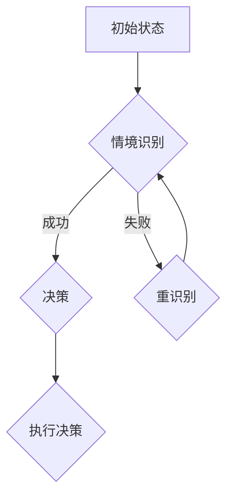

                 


**文章标题：**企业级情境智能框架：增强AI系统场景适应能力

**文章关键词：**企业级，情境智能，AI系统，场景适应能力，智能框架

**文章摘要：**本文将深入探讨企业级情境智能框架的设计与实现，旨在增强AI系统在复杂场景中的适应能力。文章首先介绍情境智能的概念及其在AI系统中的重要性，然后逐步解析框架的设计原则、核心算法原理和数学模型，最后通过实际项目案例展示框架的应用与优化策略。

---

**目录：**

----------------------------------------------------------------

# 企业级情境智能框架：增强AI系统场景适应能力

## 关键词
- 企业级
- 情境智能
- AI系统
- 场景适应能力
- 智能框架

## 摘要
本文旨在探讨如何通过企业级情境智能框架，提升AI系统在复杂场景中的适应能力。我们将从框架设计原则、核心算法原理、数学模型以及实际项目案例等多个角度进行深入分析，旨在为读者提供一份全面且实用的技术指南。

**第一部分：框架基础理论**

### 第1章：企业级情境智能框架概述
- 1.1 框架定义与背景
- 1.2 框架目标与价值
- 1.3 框架的发展历程

### 第2章：AI系统场景适应能力的重要性
- 2.1 场景适应能力概述
- 2.2 场景适应能力对企业的影响
- 2.3 提升场景适应能力的必要性

### 第3章：情境智能的关键概念
- 3.1 情境的定义与分类
- 3.2 情境识别技术
- 3.3 情境适应策略

### 第4章：企业需求与情境智能框架的关系
- 4.1 企业需求分析
- 4.2 框架需求适配性
- 4.3 框架与企业应用的结合

**第二部分：框架设计与实现**

### 第5章：框架设计原则与架构
- 5.1 设计原则
- 5.2 框架总体架构
- 5.3 模块功能与交互

### 第6章：核心算法原理讲解
- 6.1 算法概述
- 6.2 算法原理详细讲解
- 6.3 算法实现与优化

### 第7章：框架实现过程详解
- 7.1 系统开发环境搭建
- 7.2 数据处理与预处理
- 7.3 模型训练与评估
- 7.4 系统部署与维护

### 第8章：数学模型与公式
- 8.1 基本数学模型
- 8.2 模型公式详细讲解
- 8.3 公式在框架中的应用

### 第9章：伪代码与算法实现
- 9.1 伪代码编写规则
- 9.2 伪代码示例
- 9.3 伪代码在实际开发中的应用

**第三部分：框架应用与优化**

### 第10章：框架在典型企业场景中的应用
- 10.1 零售行业
- 10.2 金融行业
- 10.3 医疗行业

### 第11章：情境智能框架的优化策略
- 11.1 优化目标
- 11.2 优化方法
- 11.3 案例分析

### 第12章：实际项目案例分析
- 12.1 项目背景
- 12.2 项目目标
- 12.3 项目实施与效果分析

### 第13章：性能评估与改进
- 13.1 性能评估指标
- 13.2 性能评估方法
- 13.3 改进措施与效果

**第四部分：总结与展望**

### 第14章：企业级情境智能框架的现状与趋势
- 14.1 现状分析
- 14.2 趋势预测

### 第15章：未来发展方向与挑战
- 15.1 发展方向
- 15.2 挑战与应对

### 第16章：总结与展望
- 16.1 总结
- 16.2 展望

**参考文献**

- 参考文献1
- 参考文献2
- 参考文献3

**附录**

- 附录A：开发环境与工具
- 附录B：源代码解析
- 附录C：扩展阅读资源

**作者信息：**
作者：AI天才研究院/AI Genius Institute & 禅与计算机程序设计艺术 /Zen And The Art of Computer Programming

----------------------------------------------------------------

**Mermaid 流程图示例：**



**Python 源代码示例：**

```python
# 伪代码：情境智能算法
def recognize_scenario(scenario_data):
    """
    情境识别函数
    :param scenario_data: 情境数据
    :return: 识别结果
    """
    # 数据预处理
    preprocessed_data = preprocess_data(scenario_data)
    
    # 情境识别
    result = identify_scenario(preprocessed_data)
    
    # 返回结果
    return result
```

**LaTeX 数学公式示例：**

```markdown
$$
X_{t+1} = X_t + \mu_t
$$

$$
f(x) = x^2
$$
```

---

接下来的文章内容将按照上述目录结构进行编写，确保每部分内容都符合完整性要求，并提供详细的技术讲解和实际案例分析。文章长度预计在10000～12000字之间。在编写过程中，将逐步深入解析每个章节的核心内容，并通过Python代码示例和LaTeX公式帮助读者更好地理解技术原理。同时，文章将包括最佳实践、注意事项和拓展阅读等部分，以提高整体阅读体验和学习效果。文章末尾将附上参考文献和附录，以供进一步学习参考。

