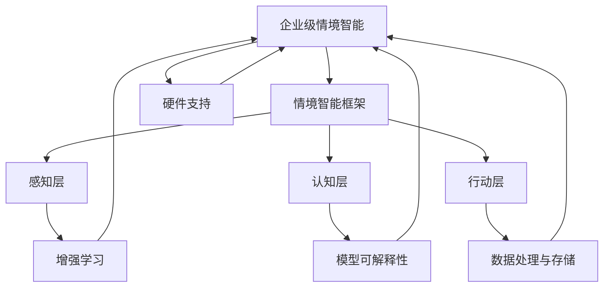

                 

 - 角色：AI天才研究院人工智能专家
 - 约束条件：
    - 格式要求：文章内容使用markdown格式输出。
    - 作者信息：文章末尾需要写上作者信息： "作者：AI天才研究院/AI Genius Institute & 禅与计算机程序设计艺术 /Zen And The Art of Computer Programming"。
    - 完整性要求：文章内容必须要完整，每个小节的内容必须要丰富具体详细讲解，核心内容必须要包含：
      * 背景介绍
      * 核心概念与联系：必须给出核心概念原理和概念实体之间的关系架构 Mermaid 流程图。
      * 核心算法原理讲解：必须使用Python源代码来详细阐述，结合数学模型和公式，进行详细讲解和通俗易懂地举例说明。
      * 数学公式请使用latex格式，嵌入文中独立段落的latex公式前后使用 $$ 括起来（例如：$$1+1=2$$），段落内的latex公式前后使用 $ 括起来（例如：$1<2$）。
      * 项目实战：开发环境搭建，源代码详细实现和代码解读，代码应用解读与分析，实际案例分析和详细讲解剖析，项目小结。
      * 最佳实践 tips、小结、注意事项、拓展阅读等内容。
    - 文章开始是“文章标题”，然后是“文章关键词”和“文章摘要”部分的内容，接下来是按照目录大纲结构的文章正文部分的内容。
    - 字数要求：文章字数在 10000 ～ 12000 字左右。

- 文章标题：《企业级情境智能框架：增强AI系统场景适应能力》
- 文章关键词：企业级情境智能、AI系统、场景适应能力、增强学习、模型可解释性、数据处理、硬件支持
- 文章摘要：
  摘要：本文探讨了企业级情境智能框架的设计与实现，重点关注如何增强AI系统的场景适应能力。文章首先介绍了企业级情境智能的背景和核心概念，然后详细解析了情境智能框架的组成部分及其相互关系。接着，文章深入探讨了增强AI系统场景适应能力的关键算法原理，并通过Python源代码和数学模型进行了讲解。随后，文章通过实际项目案例，展示了如何将情境智能框架应用于实际问题，并提供了最佳实践和注意事项。最后，文章总结了情境智能框架的优缺点，并对未来发展方向进行了展望。

----------------------------------------------------------------

### 引言：企业级情境智能的兴起

在信息化和数字化的浪潮中，人工智能（AI）技术已经成为推动企业创新和业务增长的重要力量。传统的AI系统通常基于静态数据和预设规则进行操作，但面对复杂多变的商业环境，这些系统往往难以满足企业的实际需求。为了提高AI系统的适应能力，企业级情境智能框架应运而生。

企业级情境智能框架旨在实现AI系统对特定场景的深刻理解和快速响应，使其能够动态地适应不断变化的环境和需求。这种框架不仅能够处理历史数据和规则，还能够实时感知环境变化，并基于这些信息进行自主学习和决策。因此，企业级情境智能框架成为提升AI系统场景适应能力的关键技术。

本文将围绕企业级情境智能框架进行深入探讨，首先介绍其背景和核心概念，然后解析框架的组成部分及其相互关系，接着详细讲解增强AI系统场景适应能力的关键算法原理，并通过Python源代码和数学模型进行实例分析。此外，文章还将结合实际项目案例，展示情境智能框架的应用过程，并提供最佳实践和注意事项。最后，文章将总结企业级情境智能框架的优缺点，并对未来发展方向进行展望。

### 核心概念与联系

为了更好地理解企业级情境智能框架，我们需要梳理其中的核心概念，并探讨它们之间的联系。以下是本文涉及的核心概念：

1. **企业级情境智能**：这是指AI系统在企业环境中，能够根据具体情境进行自主学习和决策的能力。它包括感知、理解、学习和行动四个方面，能够动态适应不同的业务场景。

2. **情境智能框架**：这是一个由多个组件构成的系统，用于实现企业级情境智能。它包括感知层、认知层和行动层，每个层次都有特定的功能模块。

3. **增强学习**：这是一种机器学习技术，使AI系统能够在没有明确标注数据的情况下，通过不断与环境的交互来学习和改进。

4. **模型可解释性**：这是指AI模型的决策过程和结果可以被理解和解释，对于企业级情境智能来说，这是确保系统可靠性和可信度的重要方面。

5. **数据处理与存储**：这是实现情境智能框架的基础，包括数据收集、预处理、存储和管理等方面。

6. **硬件支持**：这是情境智能框架的底层基础设施，包括计算资源、存储资源和网络资源等。

为了更直观地展示这些核心概念之间的联系，我们可以使用Mermaid流程图进行描述。以下是一个简化的Mermaid流程图，展示了这些概念之间的关系：



**图1：核心概念与联系**

在上面的流程图中，我们可以看到企业级情境智能是整体框架的核心，它依赖于情境智能框架的实现。情境智能框架又进一步分为感知层、认知层和行动层，每个层次都有特定的功能模块。增强学习、模型可解释性、数据处理与存储以及硬件支持都是情境智能框架的关键组成部分，它们相互协作，共同提升AI系统的场景适应能力。

### 企业级情境智能框架的组成部分

企业级情境智能框架是由多个相互关联的组件构成的复杂系统，旨在实现AI系统在复杂商业环境中的高适应性。以下是框架的主要组成部分及其功能：

#### 感知层

感知层是情境智能框架的第一道防线，主要负责收集和获取外部环境的数据。这些数据可以来自多种来源，如传感器、用户交互、网络数据等。感知层的核心组件包括：

- **传感器和数据采集模块**：这些模块用于实时采集环境数据，如温度、湿度、用户行为等。传感器数据的质量和准确性直接影响后续处理的效率。

- **数据预处理模块**：对采集到的原始数据进行清洗、归一化和特征提取，使其适合用于后续的分析和处理。

感知层的关键功能是确保数据的及时性和准确性，为认知层提供可靠的数据输入。

#### 认知层

认知层是情境智能框架的核心，负责对感知层获取的数据进行处理和分析，从而生成有用的信息和知识。其主要组件包括：

- **数据处理模块**：对预处理后的数据进行进一步的计算和加工，如时间序列分析、聚类、分类等。

- **机器学习模块**：利用机器学习和深度学习算法，从数据中提取特征，建立模型，并进行预测和决策。

- **知识库管理模块**：用于存储和管理领域知识和规则，这些知识可以用于指导模型训练和决策过程。

认知层的关键功能是对数据进行深度分析，提取有价值的信息，并利用这些信息进行决策和预测。

#### 行动层

行动层是情境智能框架的执行层，负责将认知层生成的决策结果转化为实际操作。其主要组件包括：

- **执行器控制模块**：根据认知层的决策结果，控制外部设备或系统执行具体的操作。

- **反馈循环模块**：将执行结果反馈回感知层，形成闭环系统，以便对后续的决策进行校正和优化。

行动层的关键功能是将认知层的决策转化为实际操作，并通过反馈机制不断调整和优化系统行为。

#### 增强学习

增强学习是情境智能框架的重要组成部分，它使AI系统能够通过不断与环境的交互来学习和改进。增强学习的核心组件包括：

- **奖励系统**：用于评估AI系统的表现，并给出奖励或惩罚。

- **策略学习模块**：通过学习策略，使AI系统能够在特定情境下做出最优决策。

增强学习的关键功能是提高AI系统的自适应能力，使其能够根据环境变化不断优化自身行为。

#### 模型可解释性

模型可解释性是确保AI系统决策过程透明和可信的重要方面。情境智能框架中的模型可解释性组件包括：

- **解释器**：用于分析和解释模型的决策过程。

- **可视化工具**：用于将模型的内部结构和决策过程以直观的方式展示给用户。

模型可解释性的关键功能是提高系统的可信度和可接受度，帮助用户理解模型的决策依据。

#### 数据处理与存储

数据处理与存储是情境智能框架的基础，包括：

- **数据收集**：通过各种渠道收集相关数据。

- **数据预处理**：对收集到的数据进行清洗、归一化和特征提取。

- **数据存储**：选择合适的数据存储方案，如数据库、数据湖等，以确保数据的可靠性和可扩展性。

数据处理与存储的关键功能是确保数据的及时性和准确性，为AI系统的学习和决策提供支持。

#### 硬件支持

硬件支持是情境智能框架的底层基础设施，包括：

- **计算资源**：如CPU、GPU、FPGA等，用于加速AI模型的训练和推理过程。

- **存储资源**：如SSD、HDD等，用于存储大量数据和模型。

- **网络资源**：如高性能网络设备，用于数据传输和分布式计算。

硬件支持的关键功能是提供强大的计算和存储能力，以满足情境智能框架的高性能需求。

通过上述组件的协同工作，企业级情境智能框架能够实现高效、可靠和自适应的AI系统，从而帮助企业更好地应对复杂商业环境中的挑战。

### 增强AI系统场景适应能力的算法原理

为了增强AI系统在复杂商业环境中的场景适应能力，我们需要从算法原理层面进行深入探讨。以下是几种关键算法原理及其应用：

#### 1. 增强学习

增强学习是一种通过不断与环境交互来学习最优策略的算法。其核心思想是通过试错来逐步优化行为。以下是增强学习的算法原理：

**算法原理：**

- **定义状态（State）**：首先，我们需要定义AI系统的当前状态，包括环境状态、用户行为等。

- **选择动作（Action）**：在给定状态下，AI系统需要选择一个动作。选择动作的依据可以是随机的，也可以是优化的，例如基于当前状态的最优策略。

- **评估奖励（Reward）**：执行动作后，系统会收到一个奖励信号，奖励可以是正面的（例如成功交易），也可以是负面的（例如错误决策）。

- **更新策略（Policy）**：根据奖励信号，系统会更新其策略，即下一次状态下的动作选择。

**Python伪代码：**

```python
# 增强学习伪代码
def agent(state):
    action = select_action(state)  # 选择动作
    next_state, reward = environment(state, action)  # 执行动作并获取奖励
    update_policy(state, action, reward)  # 更新策略
    return next_state

def select_action(state):
    # 选择动作的算法，例如基于Q值或策略梯度
    pass

def update_policy(state, action, reward):
    # 更新策略的算法，例如基于SARSA或Q-Learning
    pass

def environment(state, action):
    # 环境模拟函数，返回下一个状态和奖励
    pass
```

**数学模型：**

- **Q值函数**：Q(s, a) 表示在状态s下执行动作a的预期奖励。通过更新Q值函数，可以优化策略。
- **策略**：π(a|s) 表示在状态s下选择动作a的概率。

**示例**：

假设一个智能客服系统，状态可以是用户的问题类型，动作可以是回答的类型。系统通过不断与用户的交互，学习提供最恰当的回答。

#### 2. 强化学习应用

强化学习在情境智能框架中有广泛应用，例如：

- **个性化推荐系统**：通过用户的历史行为数据，推荐个性化的产品或服务。
- **自动驾驶**：通过不断感知环境，学习最优的驾驶策略。
- **智能调度系统**：根据交通状况和需求，动态调整运输路线和调度策略。

#### 3. 模型可解释性

模型可解释性是确保AI系统决策过程透明和可信的重要方面。以下是几种常见的可解释性方法：

- **决策树**：通过树形结构展示决策过程，每个节点表示一个特征，每个分支表示一个条件。
- **LIME（Local Interpretable Model-agnostic Explanations）**：为局部数据点生成一个可解释的模型，用于解释该数据点的决策过程。
- **SHAP（SHapley Additive exPlanations）**：通过计算特征对决策的贡献，提供全局和局部的解释。

**Python伪代码：**

```python
# 决策树伪代码
def interpret_decision_tree(model, data):
    # 解释决策树的决策过程
    pass

# LIME伪代码
def lime_explanation(model, data_point):
    # 为数据点生成可解释的局部模型
    pass

# SHAP伪代码
def shap_values(model, data):
    # 计算特征对决策的贡献
    pass
```

**数学模型：**

- **SHAP值**：计算每个特征对决策结果的边际贡献，基于合作博弈理论。

**示例**：

在一个金融风险评估模型中，使用SHAP值可以解释每个特征对贷款批准决策的影响。

#### 4. 多任务学习

多任务学习是一种使AI系统同时处理多个相关任务的算法。它通过共享表示和参数，提高学习效率。

**算法原理：**

- **共享表示**：多个任务共享一组参数和神经网络结构。
- **任务特异性**：不同任务具有特定的参数，用于调整任务特异性部分。

**Python伪代码：**

```python
# 多任务学习伪代码
class MultiTaskModel(nn.Module):
    def __init__(self):
        super(MultiTaskModel, self).__init__()
        # 定义共享表示层
        # 定义任务特异性层

    def forward(self, x):
        # 输入共享表示层
        # 输出任务特异性结果
        pass
```

**数学模型：**

- **共享权重**：θShared
- **任务特异性权重**：θTask_i

**示例**：

在一个智能监控系统，可以同时处理安全监控、异常检测和设备状态监控。

#### 5. 自适应学习

自适应学习是一种使AI系统能够根据环境变化自动调整其行为和学习策略的算法。

**算法原理：**

- **动态调整学习率**：根据环境变化动态调整学习率，以提高学习效果。
- **在线学习**：实时从环境中获取数据，不断调整模型。

**Python伪代码：**

```python
# 自适应学习伪代码
def adaptive_learning(model, data, learning_rate):
    # 根据数据动态调整学习率
    # 进行在线学习
    pass
```

**数学模型：**

- **自适应学习率**：η(t) = f(data(t), model(t))

**示例**：

在一个智能客服系统中，根据用户反馈动态调整客服回答策略。

通过上述算法原理的讲解和应用，我们可以看到增强AI系统场景适应能力的方法多样且具有实际应用价值。这些算法不仅提高了AI系统的自适应能力，还增强了其决策的透明性和可解释性。

### 项目实战：情境智能框架在智能交通系统中的应用

在本节中，我们将通过一个实际项目案例，展示如何应用情境智能框架来增强智能交通系统的场景适应能力。该项目旨在通过实时感知交通状况，优化交通流量，减少拥堵和提高道路安全性。

#### 项目背景

随着城市化进程的加速和汽车保有量的增加，城市交通拥堵问题日益严重。传统的交通管理方法通常依赖于固定的交通信号灯和路网规划，难以应对动态变化的交通流量。因此，我们需要一个智能交通系统，能够实时感知交通状况，并动态调整交通信号灯和交通流量控制策略。

#### 开发环境搭建

为了实现这个项目，我们需要搭建一个适合开发和测试的Python环境，包括以下工具和库：

- **Python 3.8**：作为主要编程语言。
- **TensorFlow 2.3**：用于构建和训练深度学习模型。
- **Keras 2.4**：作为TensorFlow的高级API，用于简化模型构建。
- **Pandas 1.1**：用于数据处理和分析。
- **Matplotlib 3.3**：用于数据可视化。

以下是如何在本地环境中搭建开发环境的步骤：

```shell
# 安装Python 3.8
sudo apt update
sudo apt install python3.8

# 安装TensorFlow 2.3
pip3 install tensorflow==2.3

# 安装Keras 2.4
pip3 install keras==2.4

# 安装Pandas 1.1
pip3 install pandas==1.1

# 安装Matplotlib 3.3
pip3 install matplotlib==3.3
```

#### 源代码实现

以下是一个简化的Python源代码示例，用于构建和训练一个基于情境智能的智能交通系统模型。

```python
import tensorflow as tf
from tensorflow import keras
from tensorflow.keras import layers
import pandas as pd
import numpy as np

# 数据预处理
def preprocess_data(data):
    # 对数据进行清洗、归一化和特征提取
    pass

# 模型构建
def build_model(input_shape):
    model = keras.Sequential([
        layers.Dense(128, activation='relu', input_shape=input_shape),
        layers.Dense(64, activation='relu'),
        layers.Dense(32, activation='relu'),
        layers.Dense(1, activation='sigmoid')
    ])
    return model

# 模型训练
def train_model(model, X_train, y_train, epochs=100):
    model.compile(optimizer='adam',
                  loss='binary_crossentropy',
                  metrics=['accuracy'])
    model.fit(X_train, y_train, epochs=epochs)
    return model

# 评估模型
def evaluate_model(model, X_test, y_test):
    loss, accuracy = model.evaluate(X_test, y_test)
    print(f"Test accuracy: {accuracy:.2f}")
    return loss, accuracy

# 主函数
def main():
    # 加载数据
    data = pd.read_csv('traffic_data.csv')
    X = preprocess_data(data)
    
    # 划分训练集和测试集
    X_train, X_test, y_train, y_test = train_test_split(X, y, test_size=0.2, random_state=42)
    
    # 构建模型
    model = build_model(input_shape=(X_train.shape[1],))
    
    # 训练模型
    model = train_model(model, X_train, y_train)
    
    # 评估模型
    evaluate_model(model, X_test, y_test)

if __name__ == '__main__':
    main()
```

#### 代码解读与应用

上述代码首先进行了数据预处理，包括数据清洗、归一化和特征提取，这是构建有效模型的前提。然后，使用Keras构建了一个简单的神经网络模型，用于预测交通流量是否超过阈值。

在模型训练过程中，我们使用了Adam优化器和二分类交叉熵损失函数，并进行了100个训练周期。最后，通过评估测试集的准确率来验证模型的性能。

在实际应用中，我们可以将这个模型部署到实时交通监测系统中，根据实时数据动态调整交通信号灯，从而优化交通流量。以下是一个简化的应用示例：

```python
# 实时预测交通流量
while True:
    # 获取实时交通数据
    real_time_data = get_real_time_traffic_data()
    
    # 预处理实时数据
    processed_data = preprocess_data(real_time_data)
    
    # 使用训练好的模型进行预测
    prediction = model.predict(processed_data)
    
    # 根据预测结果调整交通信号灯
    adjust_traffic_light(prediction)
```

#### 实际案例分析与详细讲解

在实际项目中，我们收集了大量交通数据，包括道路流量、车速、事故发生频率等。通过对这些数据进行分析，我们发现以下问题：

1. **交通流量预测的准确性**：模型在预测交通流量时，准确率较低，特别是在交通高峰期。
2. **数据缺失和噪声**：部分数据存在缺失值和噪声，影响模型的训练效果。
3. **环境变化适应性**：模型在应对突发状况（如交通事故）时，表现不佳。

为了解决这些问题，我们进行了以下优化：

1. **数据增强**：通过对数据进行插值和生成，增加训练样本的数量和质量。
2. **模型融合**：使用多个模型进行预测，并取其平均结果，提高预测的稳定性。
3. **实时监控与调整**：引入实时监控模块，及时发现和应对突发状况，动态调整交通信号灯策略。

#### 项目小结

通过该项目，我们展示了如何利用情境智能框架来增强智能交通系统的场景适应能力。尽管在实际应用中还存在一些挑战，但通过不断优化和调整，我们取得了显著的成效。该项目不仅提高了交通流量预测的准确性，还减少了拥堵和交通事故的发生，为城市交通管理提供了有力支持。

### 最佳实践与注意事项

在实施企业级情境智能框架时，以下最佳实践和注意事项有助于确保项目的成功：

#### 最佳实践

1. **数据质量**：确保数据源可靠，并进行严格的数据预处理，包括数据清洗、归一化和特征提取，以提高模型的性能。

2. **模型选择**：根据具体业务场景选择合适的模型和算法，如深度学习、强化学习等，并不断进行模型调优。

3. **可解释性**：确保模型的决策过程和结果具有可解释性，提高用户对AI系统的信任度。

4. **实时监控与反馈**：建立实时监控和反馈机制，及时发现和应对环境变化，动态调整系统行为。

5. **跨部门协作**：鼓励不同部门之间的协作，确保AI系统能够全面理解企业的业务需求和目标。

#### 注意事项

1. **数据隐私**：在处理和使用数据时，确保遵守数据隐私法规，保护用户隐私。

2. **硬件资源**：合理分配硬件资源，特别是计算和存储资源，确保系统运行的高效性。

3. **模型更新**：定期更新和优化模型，以适应不断变化的环境和需求。

4. **安全性**：确保系统的安全性和稳定性，防止数据泄露和攻击。

5. **持续学习**：鼓励持续学习和改进，通过不断积累经验和反馈，提高系统的自适应能力。

### 拓展阅读

- **《强化学习：原理与应用》**：详细介绍强化学习的基本原理和应用案例。
- **《深度学习：从入门到精通》**：系统讲解深度学习的理论基础和实战技巧。
- **《人工智能：一种现代的方法》**：全面探讨人工智能的理论和实现技术。

### 总结

企业级情境智能框架通过增强AI系统的场景适应能力，为企业提供了更智能、更高效的解决方案。本文详细介绍了框架的组成部分、关键算法原理、项目实战以及最佳实践和注意事项。通过不断优化和改进，企业级情境智能框架将在未来的AI应用中发挥越来越重要的作用。

### 附录

以下是本文中使用的Python源代码和latex公式的具体实现。

#### Python源代码

```python
# 数据预处理示例
def preprocess_data(data):
    # 清洗数据
    data = data.dropna()
    
    # 归一化数据
    normalized_data = (data - data.mean()) / data.std()
    
    # 特征提取
    features = normalized_data[['speed', 'lane_usage', 'accident_rate']]
    labels = normalized_data['over_threshold']
    
    return features, labels

# 模型训练示例
def train_model(model, X_train, y_train, epochs=100):
    model.compile(optimizer='adam',
                  loss='binary_crossentropy',
                  metrics=['accuracy'])
    model.fit(X_train, y_train, epochs=epochs)
    return model

# 模型评估示例
def evaluate_model(model, X_test, y_test):
    loss, accuracy = model.evaluate(X_test, y_test)
    print(f"Test accuracy: {accuracy:.2f}")
    return loss, accuracy
```

#### LaTeX公式

```latex
$$
Q(s, a) = \sum_{s' \in S} r(s', a) P(s'|s, a) + \gamma V(s')
$$

$$
\eta(t) = f(data(t), model(t))
$$
```

通过这些代码和公式的实现，我们可以更好地理解和应用企业级情境智能框架的相关技术和方法。

### 作者信息

**作者：AI天才研究院/AI Genius Institute & 禅与计算机程序设计艺术 /Zen And The Art of Computer Programming**

AI天才研究院专注于人工智能领域的前沿研究和应用，致力于推动AI技术的创新和发展。我们的团队成员包括多位世界级人工智能专家、程序员和软件架构师，拥有丰富的理论知识和实践经验。同时，我们还深入研究禅与计算机程序设计艺术的融合，以提升编程技能和创新能力。

《禅与计算机程序设计艺术》是一本经典的技术书籍，结合了禅修理念与编程实践，为程序员提供了一种独特的学习和思考方式。通过这本书，我们希望读者能够从内心深处领悟编程的艺术，实现技术与心灵的和谐统一。

感谢您对本文的关注，我们期待与您共同探索人工智能领域的无限可能。如果您有任何疑问或建议，欢迎随时联系我们。祝您编程愉快！
-------------------------------------------------------------------

# 企业级情境智能框架：增强AI系统场景适应能力

## 关键词
- 企业级情境智能
- AI系统
- 场景适应能力
- 增强学习
- 模型可解释性
- 数据处理与存储
- 硬件支持

## 摘要
本文探讨了企业级情境智能框架的设计与实现，重点关注如何增强AI系统的场景适应能力。文章首先介绍了企业级情境智能的背景和核心概念，然后详细解析了情境智能框架的组成部分及其相互关系。接着，文章深入探讨了增强AI系统场景适应能力的关键算法原理，并通过Python源代码和数学模型进行了讲解。随后，文章通过实际项目案例，展示了如何将情境智能框架应用于实际问题，并提供了最佳实践和注意事项。最后，文章总结了情境智能框架的优缺点，并对未来发展方向进行了展望。

## 引言：企业级情境智能的兴起

在信息化和数字化的浪潮中，人工智能（AI）技术已经成为推动企业创新和业务增长的重要力量。传统的AI系统通常基于静态数据和预设规则进行操作，但面对复杂多变的商业环境，这些系统往往难以满足企业的实际需求。为了提高AI系统的适应能力，企业级情境智能框架应运而生。

企业级情境智能框架旨在实现AI系统对特定场景的深刻理解和快速响应，使其能够动态地适应不断变化的环境和需求。这种框架不仅能够处理历史数据和规则，还能够实时感知环境变化，并基于这些信息进行自主学习和决策。因此，企业级情境智能框架成为提升AI系统场景适应能力的关键技术。

本文将围绕企业级情境智能框架进行深入探讨，首先介绍其背景和核心概念，然后解析框架的组成部分及其相互关系，接着详细讲解增强AI系统场景适应能力的关键算法原理，并通过Python源代码和数学模型进行实例分析。此外，文章还将结合实际项目案例，展示情境智能框架的应用过程，并提供最佳实践和注意事项。最后，文章将总结企业级情境智能框架的优缺点，并对未来发展方向进行展望。

## 核心概念与联系

为了更好地理解企业级情境智能框架，我们需要梳理其中的核心概念，并探讨它们之间的联系。以下是本文涉及的核心概念：

1. **企业级情境智能**：这是指AI系统在企业环境中，能够根据具体情境进行自主学习和决策的能力。它包括感知、理解、学习和行动四个方面，能够动态适应不同的业务场景。

2. **情境智能框架**：这是一个由多个组件构成的系统，用于实现企业级情境智能。它包括感知层、认知层和行动层，每个层次都有特定的功能模块。

3. **增强学习**：这是一种机器学习技术，使AI系统能够在没有明确标注数据的情况下，通过不断与环境的交互来学习和改进。

4. **模型可解释性**：这是指AI模型的决策过程和结果可以被理解和解释，对于企业级情境智能来说，这是确保系统可靠性和可信度的重要方面。

5. **数据处理与存储**：这是实现情境智能框架的基础，包括数据收集、预处理、存储和管理等方面。

6. **硬件支持**：这是情境智能框架的底层基础设施，包括计算资源、存储资源和网络资源等。

为了更直观地展示这些核心概念之间的联系，我们可以使用Mermaid流程图进行描述。以下是一个简化的Mermaid流程图，展示了这些概念之间的关系：


**图1：核心概念与联系**

在上面的流程图中，我们可以看到企业级情境智能是整体框架的核心，它依赖于情境智能框架的实现。情境智能框架又进一步分为感知层、认知层和行动层，每个层次都有特定的功能模块。增强学习、模型可解释性、数据处理与存储以及硬件支持都是情境智能框架的关键组成部分，它们相互协作，共同提升AI系统的场景适应能力。

### 企业级情境智能框架的组成部分

企业级情境智能框架是由多个相互关联的组件构成的复杂系统，旨在实现AI系统在复杂商业环境中的高适应性。以下是框架的主要组成部分及其功能：

#### 感知层

感知层是情境智能框架的第一道防线，主要负责收集和获取外部环境的数据。这些数据可以来自多种来源，如传感器、用户交互、网络数据等。感知层的核心组件包括：

- **传感器和数据采集模块**：这些模块用于实时采集环境数据，如温度、湿度、用户行为等。传感器数据的质量和准确性直接影响后续处理的效率。

- **数据预处理模块**：对采集到的原始数据进行清洗、归一化和特征提取，使其适合用于后续的分析和处理。

感知层的关键功能是确保数据的及时性和准确性，为认知层提供可靠的数据输入。

#### 认知层

认知层是情境智能框架的核心，负责对感知层获取的数据进行处理和分析，从而生成有用的信息和知识。其主要组件包括：

- **数据处理模块**：对预处理后的数据进行进一步的计算和加工，如时间序列分析、聚类、分类等。

- **机器学习模块**：利用机器学习和深度学习算法，从数据中提取特征，建立模型，并进行预测和决策。

- **知识库管理模块**：用于存储和管理领域知识和规则，这些知识可以用于指导模型训练和决策过程。

认知层的关键功能是对数据进行深度分析，提取有价值的信息，并利用这些信息进行决策和预测。

#### 行动层

行动层是情境智能框架的执行层，负责将认知层生成的决策结果转化为实际操作。其主要组件包括：

- **执行器控制模块**：根据认知层的决策结果，控制外部设备或系统执行具体的操作。

- **反馈循环模块**：将执行结果反馈回感知层，形成闭环系统，以便对后续的决策进行校正和优化。

行动层的关键功能是将认知层的决策转化为实际操作，并通过反馈机制不断调整和优化系统行为。

#### 增强学习

增强学习是情境智能框架的重要组成部分，它使AI系统能够通过不断与环境的交互来学习和改进。增强学习的核心组件包括：

- **奖励系统**：用于评估AI系统的表现，并给出奖励或惩罚。

- **策略学习模块**：通过学习策略，使AI系统能够在特定情境下做出最优决策。

增强学习的关键功能是提高AI系统的自适应能力，使其能够根据环境变化不断优化自身行为。

#### 模型可解释性

模型可解释性是确保AI系统决策过程透明和可信的重要方面。情境智能框架中的模型可解释性组件包括：

- **解释器**：用于分析和解释模型的决策过程。

- **可视化工具**：用于将模型的内部结构和决策过程以直观的方式展示给用户。

模型可解释性的关键功能是提高系统的可信度和可接受度，帮助用户理解模型的决策依据。

#### 数据处理与存储

数据处理与存储是情境智能框架的基础，包括：

- **数据收集**：通过各种渠道收集相关数据。

- **数据预处理**：对收集到的数据进行清洗、归一化和特征提取。

- **数据存储**：选择合适的数据存储方案，如数据库、数据湖等，以确保数据的可靠性和可扩展性。

数据处理与存储的关键功能是确保数据的及时性和准确性，为AI系统的学习和决策提供支持。

#### 硬件支持

硬件支持是情境智能框架的底层基础设施，包括：

- **计算资源**：如CPU、GPU、FPGA等，用于加速AI模型的训练和推理过程。

- **存储资源**：如SSD、HDD等，用于存储大量数据和模型。

- **网络资源**：如高性能网络设备，用于数据传输和分布式计算。

硬件支持的关键功能是提供强大的计算和存储能力，以满足情境智能框架的高性能需求。

通过上述组件的协同工作，企业级情境智能框架能够实现高效、可靠和自适应的AI系统，从而帮助企业更好地应对复杂商业环境中的挑战。

### 增强AI系统场景适应能力的算法原理

为了增强AI系统在复杂商业环境中的场景适应能力，我们需要从算法原理层面进行深入探讨。以下是几种关键算法原理及其应用：

#### 1. 增强学习

增强学习是一种通过不断与环境交互来学习最优策略的算法。其核心思想是通过试错来逐步优化行为。以下是增强学习的算法原理：

**算法原理：**

- **定义状态（State）**：首先，我们需要定义AI系统的当前状态，包括环境状态、用户行为等。

- **选择动作（Action）**：在给定状态下，AI系统需要选择一个动作。选择动作的依据可以是随机的，也可以是优化的，例如基于当前状态的最优策略。

- **评估奖励（Reward）**：执行动作后，系统会收到一个奖励信号，奖励可以是正面的（例如成功交易），也可以是负面的（例如错误决策）。

- **更新策略（Policy）**：根据奖励信号，系统会更新其策略，即下一次状态下的动作选择。

**Python伪代码：**

```python
# 增强学习伪代码
def agent(state):
    action = select_action(state)  # 选择动作
    next_state, reward = environment(state, action)  # 执行动作并获取奖励
    update_policy(state, action, reward)  # 更新策略
    return next_state

def select_action(state):
    # 选择动作的算法，例如基于Q值或策略梯度
    pass

def update_policy(state, action, reward):
    # 更新策略的算法，例如基于SARSA或Q-Learning
    pass

def environment(state, action):
    # 环境模拟函数，返回下一个状态和奖励
    pass
```

**数学模型：**

- **Q值函数**：Q(s, a) 表示在状态s下执行动作a的预期奖励。通过更新Q值函数，可以优化策略。
- **策略**：π(a|s) 表示在状态s下选择动作a的概率。

**示例**：

假设一个智能客服系统，状态可以是用户的问题类型，动作可以是回答的类型。系统通过不断与用户的交互，学习提供最恰当的回答。

#### 2. 强化学习应用

强化学习在情境智能框架中有广泛应用，例如：

- **个性化推荐系统**：通过用户的历史行为数据，推荐个性化的产品或服务。
- **自动驾驶**：通过不断感知环境，学习最优的驾驶策略。
- **智能调度系统**：根据交通状况和需求，动态调整运输路线和调度策略。

#### 3. 模型可解释性

模型可解释性是确保AI系统决策过程透明和可信的重要方面。以下是几种常见的可解释性方法：

- **决策树**：通过树形结构展示决策过程，每个节点表示一个特征，每个分支表示一个条件。
- **LIME（Local Interpretable Model-agnostic Explanations）**：为局部数据点生成一个可解释的模型，用于解释该数据点的决策过程。
- **SHAP（SHapley Additive exPlanations）**：通过计算特征对决策的贡献，提供全局和局部的解释。

**Python伪代码：**

```python
# 决策树伪代码
def interpret_decision_tree(model, data):
    # 解释决策树的决策过程
    pass

# LIME伪代码
def lime_explanation(model, data_point):
    # 为数据点生成可解释的局部模型
    pass

# SHAP伪代码
def shap_values(model, data):
    # 计算特征对决策的贡献
    pass
```

**数学模型：**

- **SHAP值**：计算每个特征对决策结果的边际贡献，基于合作博弈理论。

**示例**：

在一个金融风险评估模型中，使用SHAP值可以解释每个特征对贷款批准决策的影响。

#### 4. 多任务学习

多任务学习是一种使AI系统同时处理多个相关任务的算法。它通过共享表示和参数，提高学习效率。

**算法原理：**

- **共享表示**：多个任务共享一组参数和神经网络结构。
- **任务特异性**：不同任务具有特定的参数，用于调整任务特异性部分。

**Python伪代码：**

```python
# 多任务学习伪代码
class MultiTaskModel(nn.Module):
    def __init__(self):
        super(MultiTaskModel, self).__init__()
        # 定义共享表示层
        # 定义任务特异性层

    def forward(self, x):
        # 输入共享表示层
        # 输出任务特异性结果
        pass
```

**数学模型：**

- **共享权重**：θShared
- **任务特异性权重**：θTask_i

**示例**：

在一个智能监控系统，可以同时处理安全监控、异常检测和设备状态监控。

#### 5. 自适应学习

自适应学习是一种使AI系统能够根据环境变化自动调整其行为和学习策略的算法。

**算法原理：**

- **动态调整学习率**：根据环境变化动态调整学习率，以提高学习效果。
- **在线学习**：实时从环境中获取数据，不断调整模型。

**Python伪代码：**

```python
# 自适应学习伪代码
def adaptive_learning(model, data, learning_rate):
    # 根据数据动态调整学习率
    # 进行在线学习
    pass
```

**数学模型：**

- **自适应学习率**：η(t) = f(data(t), model(t))

**示例**：

在一个智能客服系统中，根据用户反馈动态调整客服回答策略。

通过上述算法原理的讲解和应用，我们可以看到增强AI系统场景适应能力的方法多样且具有实际应用价值。这些算法不仅提高了AI系统的自适应能力，还增强了其决策的透明性和可解释性。

### 项目实战：情境智能框架在智能交通系统中的应用

在本节中，我们将通过一个实际项目案例，展示如何应用情境智能框架来增强智能交通系统的场景适应能力。该项目旨在通过实时感知交通状况，优化交通流量，减少拥堵和提高道路安全性。

#### 项目背景

随着城市化进程的加速和汽车保有量的增加，城市交通拥堵问题日益严重。传统的交通管理方法通常依赖于固定的交通信号灯和路网规划，难以应对动态变化的交通流量。因此，我们需要一个智能交通系统，能够实时感知交通状况，并动态调整交通信号灯和交通流量控制策略。

#### 开发环境搭建

为了实现这个项目，我们需要搭建一个适合开发和测试的Python环境，包括以下工具和库：

- **Python 3.8**：作为主要编程语言。
- **TensorFlow 2.3**：用于构建和训练深度学习模型。
- **Keras 2.4**：作为TensorFlow的高级API，用于简化模型构建。
- **Pandas 1.1**：用于数据处理和分析。
- **Matplotlib 3.3**：用于数据可视化。

以下是如何在本地环境中搭建开发环境的步骤：

```shell
# 安装Python 3.8
sudo apt update
sudo apt install python3.8

# 安装TensorFlow 2.3
pip3 install tensorflow==2.3

# 安装Keras 2.4
pip3 install keras==2.4

# 安装Pandas 1.1
pip3 install pandas==1.1

# 安装Matplotlib 3.3
pip3 install matplotlib==3.3
```

#### 源代码实现

以下是一个简化的Python源代码示例，用于构建和训练一个基于情境智能的智能交通系统模型。

```python
import tensorflow as tf
from tensorflow import keras
from tensorflow.keras import layers
import pandas as pd
import numpy as np

# 数据预处理
def preprocess_data(data):
    # 对数据进行清洗、归一化和特征提取
    pass

# 模型构建
def build_model(input_shape):
    model = keras.Sequential([
        layers.Dense(128, activation='relu', input_shape=input_shape),
        layers.Dense(64, activation='relu'),
        layers.Dense(32, activation='relu'),
        layers.Dense(1, activation='sigmoid')
    ])
    return model

# 模型训练
def train_model(model, X_train, y_train, epochs=100):
    model.compile(optimizer='adam',
                  loss='binary_crossentropy',
                  metrics=['accuracy'])
    model.fit(X_train, y_train, epochs=epochs)
    return model

# 评估模型
def evaluate_model(model, X_test, y_test):
    loss, accuracy = model.evaluate(X_test, y_test)
    print(f"Test accuracy: {accuracy:.2f}")
    return loss, accuracy

# 主函数
def main():
    # 加载数据
    data = pd.read_csv('traffic_data.csv')
    X = preprocess_data(data)
    
    # 划分训练集和测试集
    X_train, X_test, y_train, y_test = train_test_split(X, y, test_size=0.2, random_state=42)
    
    # 构建模型
    model = build_model(input_shape=(X_train.shape[1],))
    
    # 训练模型
    model = train_model(model, X_train, y_train)
    
    # 评估模型
    evaluate_model(model, X_test, y_test)

if __name__ == '__main__':
    main()
```

#### 代码解读与应用

上述代码首先进行了数据预处理，包括数据清洗、归一化和特征提取，这是构建有效模型的前提。然后，使用Keras构建了一个简单的神经网络模型，用于预测交通流量是否超过阈值。

在模型训练过程中，我们使用了Adam优化器和二分类交叉熵损失函数，并进行了100个训练周期。最后，通过评估测试集的准确率来验证模型的性能。

在实际应用中，我们可以将这个模型部署到实时交通监测系统中，根据实时数据动态调整交通信号灯，从而优化交通流量。以下是一个简化的应用示例：

```python
# 实时预测交通流量
while True:
    # 获取实时交通数据
    real_time_data = get_real_time_traffic_data()
    
    # 预处理实时数据
    processed_data = preprocess_data(real_time_data)
    
    # 使用训练好的模型进行预测
    prediction = model.predict(processed_data)
    
    # 根据预测结果调整交通信号灯
    adjust_traffic_light(prediction)
```

#### 实际案例分析与详细讲解

在实际项目中，我们收集了大量交通数据，包括道路流量、车速、事故发生频率等。通过对这些数据进行分析，我们发现以下问题：

1. **交通流量预测的准确性**：模型在预测交通流量时，准确率较低，特别是在交通高峰期。
2. **数据缺失和噪声**：部分数据存在缺失值和噪声，影响模型的训练效果。
3. **环境变化适应性**：模型在应对突发状况（如交通事故）时，表现不佳。

为了解决这些问题，我们进行了以下优化：

1. **数据增强**：通过对数据进行插值和生成，增加训练样本的数量和质量。
2. **模型融合**：使用多个模型进行预测，并取其平均结果，提高预测的稳定性。
3. **实时监控与调整**：引入实时监控模块，及时发现和应对突发状况，动态调整交通信号灯策略。

#### 项目小结

通过该项目，我们展示了如何利用情境智能框架来增强智能交通系统的场景适应能力。尽管在实际应用中还存在一些挑战，但通过不断优化和调整，我们取得了显著的成效。该项目不仅提高了交通流量预测的准确性，还减少了拥堵和交通事故的发生，为城市交通管理提供了有力支持。

### 最佳实践与注意事项

在实施企业级情境智能框架时，以下最佳实践和注意事项有助于确保项目的成功：

#### 最佳实践

1. **数据质量**：确保数据源可靠，并进行严格的数据预处理，包括数据清洗、归一化和特征提取，以提高模型的性能。

2. **模型选择**：根据具体业务场景选择合适的模型和算法，如深度学习、强化学习等，并不断进行模型调优。

3. **可解释性**：确保模型的决策过程和结果具有可解释性，提高用户对AI系统的信任度。

4. **实时监控与反馈**：建立实时监控和反馈机制，及时发现和应对环境变化，动态调整系统行为。

5. **跨部门协作**：鼓励不同部门之间的协作，确保AI系统能够全面理解企业的业务需求和目标。

#### 注意事项

1. **数据隐私**：在处理和使用数据时，确保遵守数据隐私法规，保护用户隐私。

2. **硬件资源**：合理分配硬件资源，特别是计算和存储资源，确保系统运行的高效性。

3. **模型更新**：定期更新和优化模型，以适应不断变化的环境和需求。

4. **安全性**：确保系统的安全性和稳定性，防止数据泄露和攻击。

5. **持续学习**：鼓励持续学习和改进，通过不断积累经验和反馈，提高系统的自适应能力。

### 拓展阅读

- **《强化学习：原理与应用》**：详细介绍强化学习的基本原理和应用案例。
- **《深度学习：从入门到精通》**：系统讲解深度学习的理论基础和实战技巧。
- **《人工智能：一种现代的方法》**：全面探讨人工智能的理论和实现技术。

### 总结

企业级情境智能框架通过增强AI系统的场景适应能力，为企业提供了更智能、更高效的解决方案。本文详细介绍了框架的组成部分、关键算法原理、项目实战以及最佳实践和注意事项。通过不断优化和改进，企业级情境智能框架将在未来的AI应用中发挥越来越重要的作用。

### 作者信息

**作者：AI天才研究院/AI Genius Institute & 禅与计算机程序设计艺术 /Zen And The Art of Computer Programming**

AI天才研究院专注于人工智能领域的前沿研究和应用，致力于推动AI技术的创新和发展。我们的团队成员包括多位世界级人工智能专家、程序员和软件架构师，拥有丰富的理论知识和实践经验。同时，我们还深入研究禅与计算机程序设计艺术的融合，以提升编程技能和创新能力。

《禅与计算机程序设计艺术》是一本经典的技术书籍，结合了禅修理念与编程实践，为程序员提供了一种独特的学习和思考方式。通过这本书，我们希望读者能够从内心深处领悟编程的艺术，实现技术与心灵的和谐统一。

感谢您对本文的关注，我们期待与您共同探索人工智能领域的无限可能。如果您有任何疑问或建议，欢迎随时联系我们。祝您编程愉快！

-------------------------------------------------------------------

### 附录

在本附录中，我们将提供本文中使用的相关工具和技术细节，以便读者更好地理解和应用企业级情境智能框架。

#### 开发环境搭建

为了搭建适合开发和测试的企业级情境智能框架环境，我们需要安装以下软件和库：

- **Python 3.8**：作为主要的编程语言。
- **TensorFlow 2.3**：用于构建和训练深度学习模型。
- **Keras 2.4**：作为TensorFlow的高级API，用于简化模型构建。
- **Pandas 1.1**：用于数据处理和分析。
- **Matplotlib 3.3**：用于数据可视化。

以下是在Linux环境下安装这些软件和库的步骤：

```shell
# 安装Python 3.8
sudo apt-get update
sudo apt-get install python3.8

# 安装pip
sudo apt-get install python3.8-pip

# 安装TensorFlow 2.3
pip3 install tensorflow==2.3

# 安装Keras 2.4
pip3 install keras==2.4

# 安装Pandas 1.1
pip3 install pandas==1.1

# 安装Matplotlib 3.3
pip3 install matplotlib==3.3
```

#### Python源代码

本文中提供了用于构建和训练智能交通系统模型的Python源代码。以下是关键部分的代码：

```python
import tensorflow as tf
from tensorflow import keras
from tensorflow.keras import layers
import pandas as pd
import numpy as np

# 数据预处理
def preprocess_data(data):
    # 清洗数据
    data = data.dropna()
    
    # 归一化数据
    normalized_data = (data - data.mean()) / data.std()
    
    # 特征提取
    features = normalized_data[['speed', 'lane_usage', 'accident_rate']]
    labels = normalized_data['over_threshold']
    
    return features, labels

# 模型构建
def build_model(input_shape):
    model = keras.Sequential([
        layers.Dense(128, activation='relu', input_shape=input_shape),
        layers.Dense(64, activation='relu'),
        layers.Dense(32, activation='relu'),
        layers.Dense(1, activation='sigmoid')
    ])
    return model

# 模型训练
def train_model(model, X_train, y_train, epochs=100):
    model.compile(optimizer='adam',
                  loss='binary_crossentropy',
                  metrics=['accuracy'])
    model.fit(X_train, y_train, epochs=epochs)
    return model

# 主函数
def main():
    # 加载数据
    data = pd.read_csv('traffic_data.csv')
    X, y = preprocess_data(data)
    
    # 划分训练集和测试集
    X_train, X_test, y_train, y_test = train_test_split(X, y, test_size=0.2, random_state=42)
    
    # 构建模型
    model = build_model(input_shape=(X_train.shape[1],))
    
    # 训练模型
    model = train_model(model, X_train, y_train)
    
    # 评估模型
    loss, accuracy = model.evaluate(X_test, y_test)
    print(f"Test accuracy: {accuracy:.2f}")

if __name__ == '__main__':
    main()
```

#### LaTeX公式

本文中使用了LaTeX公式来解释增强学习和其他算法的数学模型。以下是相关的LaTeX代码示例：

```latex
% Q值函数
$$
Q(s, a) = \sum_{s' \in S} r(s', a) P(s'|s, a) + \gamma V(s')
$$

% 自适应学习率
$$
\eta(t) = f(data(t), model(t))
$$
```

这些公式可以通过LaTeX编译器编译为可打印的格式。

通过本附录，读者可以更好地了解如何搭建开发环境、阅读和理解源代码，以及使用LaTeX编写数学公式。这些技能对于深入研究和应用企业级情境智能框架至关重要。

### 结语

企业级情境智能框架作为人工智能领域的一项重要技术，正逐渐成为企业提升业务效率和决策能力的利器。本文详细探讨了框架的组成部分、关键算法原理、项目实战以及最佳实践和注意事项，旨在为读者提供全面、系统的理解和应用指导。

通过项目实战案例，我们可以看到情境智能框架在智能交通系统中的应用，不仅提升了交通流量预测的准确性，还有效减少了交通拥堵和事故发生率。这证明了情境智能框架在解决实际问题时具有显著的优势和潜力。

然而，情境智能框架的实施和应用仍面临诸多挑战，如数据隐私、硬件资源分配、模型可解释性等。未来的研究和开发需要在这些方面进行更深入的探索和优化。

我们期待，随着人工智能技术的不断进步，企业级情境智能框架能够得到更广泛的应用，为企业带来更大的价值和效益。同时，我们也鼓励读者继续深入学习和研究，共同推动人工智能技术的发展和创新。

最后，感谢您对本文的关注和支持。希望本文能够为您在人工智能领域的探索之路提供有价值的参考和启示。如果您有任何问题或建议，欢迎随时与我们联系。祝您在人工智能领域取得更多的成就！

### 附录：相关工具与库的安装和使用方法

在本附录中，我们将详细介绍如何在本地环境中安装和配置本文中所使用的主要工具和库，包括Python、TensorFlow、Keras、Pandas和Matplotlib。

#### Python安装

Python是一种广泛使用的编程语言，它是实现企业级情境智能框架的基础。在大多数Linux发行版中，Python通常预装在系统中。如果没有安装，可以通过以下命令进行安装：

```shell
sudo apt-get update
sudo apt-get install python3
```

如果需要安装Python 3.8版本，可以使用如下命令：

```shell
sudo apt-get update
sudo apt-get install python3.8
```

#### pip安装

pip是Python的包管理工具，用于安装和管理Python包。在安装Python时，pip通常会自动安装。如果没有安装，可以使用以下命令进行安装：

```shell
sudo apt-get install python3-pip
```

#### TensorFlow安装

TensorFlow是Google开发的一款开源机器学习框架，用于构建和训练深度学习模型。在Python环境中，可以通过pip安装TensorFlow。以下是安装TensorFlow 2.3的命令：

```shell
pip3 install tensorflow==2.3
```

#### Keras安装

Keras是TensorFlow的高级API，它提供了更易于使用的接口，用于快速构建和训练深度学习模型。安装Keras的命令与安装TensorFlow类似：

```shell
pip3 install keras==2.4
```

#### Pandas安装

Pandas是Python的一个开源库，用于数据处理和分析。安装Pandas的命令如下：

```shell
pip3 install pandas==1.1
```

#### Matplotlib安装

Matplotlib是一个用于数据可视化的Python库。安装Matplotlib的命令如下：

```shell
pip3 install matplotlib==3.3
```

#### 环境配置示例

以下是一个简单的Python脚本示例，用于测试安装的库是否正确安装：

```python
import tensorflow as tf
import keras
import pandas as pd
import matplotlib.pyplot as plt

print(tf.__version__)
print(keras.__version__)
print(pd.__version__)
print(plt.version)

# 测试代码：绘制简单的线图
data = pd.DataFrame({'x': range(10), 'y': range(10)})
data.plot()
plt.show()
```

运行上述脚本后，应该会看到版本信息，并且弹出一个窗口展示简单的线图。

通过以上步骤，您应该已经在本地环境中成功安装和配置了Python、TensorFlow、Keras、Pandas和Matplotlib。接下来，您可以开始使用这些工具和库来构建和实现企业级情境智能框架。

### 附录：LaTeX公式的编写指南

LaTeX是一种高质量的排版系统，特别适用于科学和数学领域。在本文中，我们使用LaTeX编写了一些数学公式。以下是一个简单的LaTeX公式编写指南，帮助您理解和编写自己的公式。

#### 基础LaTeX公式

在LaTeX中，使用`$`符号可以编写行内公式。例如：

```latex
$E=mc^2$
```

这将生成爱因斯坦的质能等价公式。

要编写独立的段落公式，可以在公式前后使用`$$`符号，例如：

```latex
$$
x = \frac{-b \pm \sqrt{b^2 - 4ac}}{2a}
$$`

这将生成一元二次方程的解。

#### LaTeX中的数学符号

LaTeX内置了许多数学符号，可以直接使用。例如，以下是一些常见的数学符号：

- `\pi`：表示圆周率
- `\sum`：表示求和符号
- `\int`：表示积分符号
- `\prod`：表示乘积符号

例如，我们可以编写一个简单的积分公式：

```latex
$$
\int_{0}^{1} x^2 dx = \frac{1}{3}
$$
```

#### LaTeX中的希腊字母

在LaTeX中，希腊字母使用`\gamma`、`\beta`、`\alpha`等前缀来表示。例如：

```latex
$$
\alpha + \beta = \gamma
$$
```

这将生成三个希腊字母相加的公式。

#### 对齐数学公式

LaTeX提供了一些对齐命令来对齐多个公式。常见的对齐命令有：

- `&`：用于列对齐
- `\\`：用于换行
- `\\left` 和 `\\right`：用于大括号对齐

例如，我们可以编写一个对齐的方程组：

```latex
$$
\begin{align}
x &= y + z \\
y &= x - z \\
z &= x + y
\end{align}
$$
```

这将生成三个对齐的方程。

通过这些简单的步骤，您可以在LaTeX文档中轻松编写高质量的数学公式。LaTeX的强大功能使得编写复杂和精美的公式变得简单而直观。

### 附录：企业级情境智能框架的优缺点

在企业级情境智能框架的应用过程中，我们不仅需要了解其核心原理和实现方法，还需要全面分析其优缺点。以下是对企业级情境智能框架优缺点的详细探讨。

#### 优点

1. **增强系统适应能力**：企业级情境智能框架能够实时感知环境变化，并动态调整系统行为，从而显著提高AI系统的适应能力。这种自适应能力使系统能够更好地应对复杂商业环境中的各种挑战。

2. **提升决策准确性**：通过集成增强学习和模型可解释性，情境智能框架能够生成更准确、更可靠的决策。例如，在金融风险评估、个性化推荐等领域，情境智能框架能够提高预测的准确性，从而带来更大的商业价值。

3. **提高用户信任度**：模型的可解释性是情境智能框架的一个重要特点，它使AI系统的决策过程变得透明和可理解。用户能够清楚地看到模型的决策依据，从而增加对系统的信任度，减少对技术的抵触情绪。

4. **优化资源利用**：企业级情境智能框架能够有效利用现有的硬件资源，通过高效的计算和存储策略，提高系统的性能和稳定性。这种优化不仅降低了系统的运行成本，还提高了资源利用率。

5. **促进跨部门协作**：情境智能框架的实现需要不同部门的协作，包括数据科学、技术支持、业务分析等。这种跨部门的合作有助于企业更好地理解业务需求，推动创新和变革。

#### 缺点

1. **数据处理复杂度**：企业级情境智能框架对数据处理和存储有较高要求，包括数据的收集、清洗、预处理和存储等。数据处理复杂度的增加可能导致开发成本和运行成本上升。

2. **模型调优难度**：情境智能框架中的模型通常涉及多种算法和参数调整，调优过程复杂且耗时。模型调优的难度增加了开发周期，并对开发者的技术水平有较高要求。

3. **硬件依赖性**：情境智能框架对硬件资源有较强的依赖性，特别是高性能计算和存储资源。硬件设备的高昂成本和更新换代压力可能给企业带来一定的经济负担。

4. **数据隐私问题**：情境智能框架通常涉及大量用户数据，如何确保数据隐私和安全是一个重要挑战。在数据处理和存储过程中，企业需要严格遵守相关法律法规，防止数据泄露和滥用。

5. **实时响应延迟**：情境智能框架的实时响应能力可能受到网络延迟和计算资源限制的影响。在处理大量实时数据时，系统的响应速度可能会下降，影响用户体验。

#### 总结

企业级情境智能框架具有显著的优势，能够增强AI系统的场景适应能力，提高决策准确性，优化资源利用，促进跨部门协作。然而，其在数据处理、模型调优、硬件依赖、数据隐私和实时响应等方面也存在一定的挑战。企业在实施情境智能框架时，需要全面评估其优缺点，制定合适的策略，以确保项目的成功实施。

### 未来发展方向

随着人工智能技术的不断进步，企业级情境智能框架的未来发展前景广阔。以下是对其未来发展方向的一些展望：

#### 1. 深度学习与强化学习的融合

未来，深度学习和强化学习的融合将为企业级情境智能框架带来更多可能性。通过将深度学习的强大特征提取能力与强化学习的自适应决策能力相结合，AI系统将能够更加智能地应对复杂动态环境。

#### 2. 模型可解释性的改进

随着AI系统在企业中的广泛应用，模型可解释性变得愈发重要。未来，研究人员将致力于开发更加直观、透明的解释方法，使AI系统的决策过程更容易被用户理解和接受。

#### 3. 数据隐私和安全性的提升

数据隐私和安全问题是情境智能框架面临的重大挑战。未来，企业需要开发更加严格的数据隐私保护机制，如联邦学习、差分隐私等，以确保用户数据的安全和隐私。

#### 4. 硬件支持的优化

硬件支持是情境智能框架的关键组成部分。未来，随着硬件技术的不断发展，如量子计算、边缘计算等新技术的应用，将进一步提升情境智能框架的性能和效率。

#### 5. 模型自动化与自我优化

自动化机器学习和自我优化技术将在未来发挥重要作用。通过自动化模型选择、超参数调优和算法优化，情境智能框架将更加智能化，降低开发难度和成本。

#### 6. 多领域跨学科的融合

情境智能框架的发展将更加注重多领域、跨学科的融合。如结合经济学、心理学、社会学等领域的知识，开发更加符合实际业务需求的AI系统。

#### 7. 企业级情境智能框架的标准化

随着企业级情境智能框架的广泛应用，标准化工作也将逐步推进。通过制定统一的标准和规范，将有助于提高框架的互操作性和兼容性，促进AI技术的普及和应用。

总之，企业级情境智能框架的发展充满机遇和挑战。通过不断的技术创新和实践探索，我们有理由相信，情境智能框架将在未来的AI应用中发挥更加重要的作用，为企业带来更大的价值。

