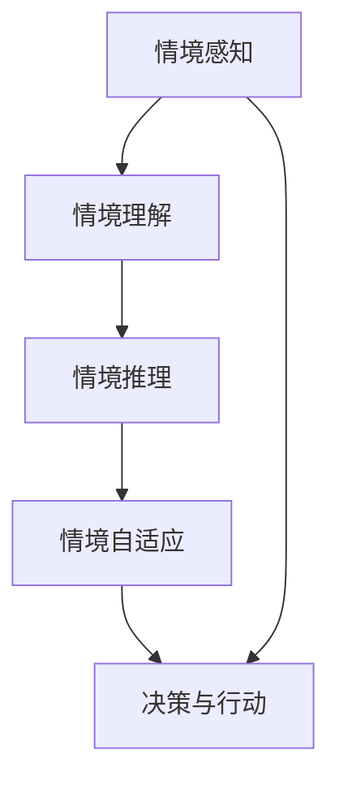
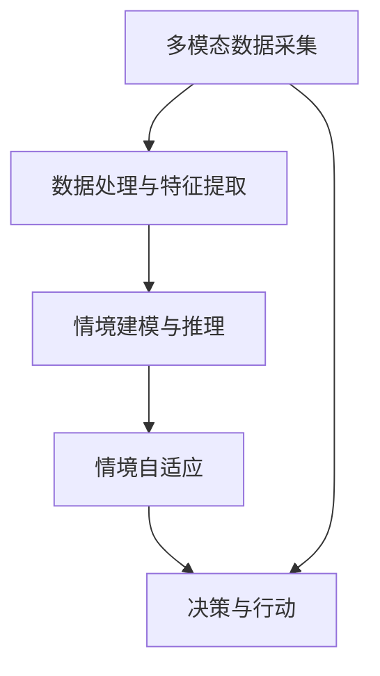
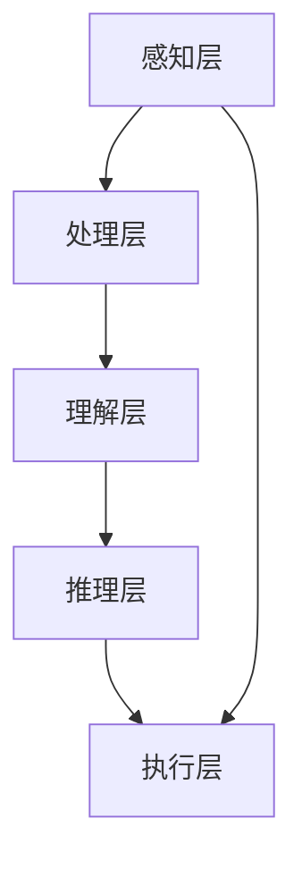
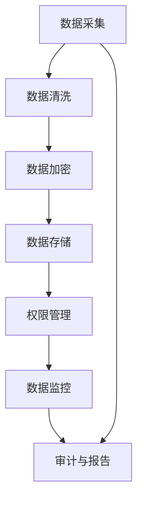
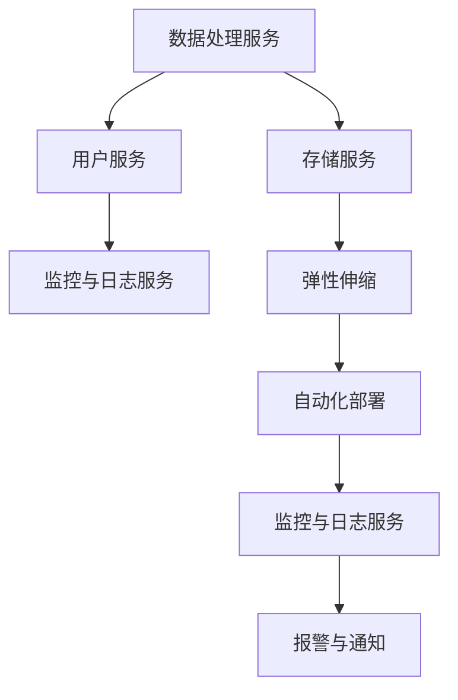

                 

### 背景介绍

在企业信息化和数字化转型的大潮中，人工智能（AI）技术已经成为推动业务创新和效率提升的关键驱动力。传统的AI系统通常在特定领域和固定场景下表现出色，但随着业务环境的变化和多样化需求的出现，传统的AI系统逐渐暴露出一些局限。这些局限主要集中在以下几个方面：

1. **场景适应性差**：传统AI系统往往在特定场景下训练，缺乏对其他相似但不同的场景的适应能力。这导致系统在不同环境下表现不稳定，难以实现跨场景的应用。

2. **数据依赖性高**：传统AI系统对大量训练数据的依赖性很大，当数据质量或数据量不足时，系统的性能会显著下降。

3. **缺乏情境理解**：传统AI系统通常缺乏对情境的理解，难以在复杂多变的环境中做出合适的决策。这限制了AI系统在实际业务中的广泛应用。

4. **可维护性和可扩展性差**：传统AI系统在架构设计上往往不够灵活，难以随着业务需求的变化进行快速调整和扩展。

面对这些挑战，企业级情境智能（Situation-Aware Intelligence）的概念应运而生。企业级情境智能是一种更加智能和灵活的AI系统，它能够感知和理解其所处的环境，并根据环境和上下文信息进行自适应的决策和行动。与传统的AI系统相比，企业级情境智能具有更高的场景适应能力和情境理解能力，能够更好地应对复杂多变的业务需求。

本文将深入探讨企业级情境智能的定义、原理、核心技术、应用场景、系统设计原则以及未来展望，旨在为读者提供全面而系统的理解和认识。

## 核心概念与联系

### 情境智能的定义

情境智能是一种能够感知和理解其所处环境的人工智能系统，它通过融合多源数据、情境模型和自适应算法，实现环境感知、情境理解和情境自适应，从而在复杂多变的环境中做出合理和有效的决策。其核心概念包括情境感知、情境理解和情境自适应。

$$
\text{情境智能} = \text{情境感知} + \text{情境理解} + \text{情境自适应}
$$

### 情境感知

情境感知是情境智能的基础，它涉及从环境中获取各种类型的数据，如文本、图像、声音、温度、湿度等，并通过传感器和数据采集技术将这些数据进行收集和处理。情境感知的主要目标是获取准确和全面的环境信息，以便后续的情境理解和决策。

### 情境理解

情境理解是情境智能的关键，它通过对感知到的数据进行处理和分析，提取出与当前环境相关的特征和模式，从而理解当前的环境状态。情境理解涉及到自然语言处理、图像识别、时间序列分析等多种技术手段，是实现情境智能的核心能力。

### 情境自适应

情境自适应是情境智能的高级表现，它基于情境理解的结果，通过自适应算法对系统的行为进行调整，以适应不同的环境和需求。情境自适应可以涉及策略调整、参数优化、模型更新等多种方式，从而实现系统在不同情境下的最佳表现。

### 情境智能的核心技术

情境智能的实现依赖于多种核心技术，包括多模态数据采集、数据处理与特征提取、情境建模与推理等。

#### 多模态数据采集

多模态数据采集是情境感知的重要组成部分，它涉及从多个来源获取不同类型的数据，如文本、图像、声音、传感器数据等。多模态数据采集的关键在于数据的质量和完整性，这直接影响到情境智能系统的性能。

```python
# Python 代码示例：多模态数据采集
import cv2
import numpy as np

# 采集图像数据
camera = cv2.VideoCapture(0)
ret, frame = camera.read()
image_data = frame

# 采集声音数据
import soundfile as sf
audio_data, sample_rate = sf.read('audio.wav')

# 采集温度传感器数据
temperature = 25  # 假设温度为25摄氏度
```

#### 数据处理与特征提取

数据处理与特征提取是将原始数据转换为有意义的信息的过程。通过数据预处理、噪声过滤、特征选择和特征提取等技术，可以提取出与情境相关的关键特征，为后续的情境理解和自适应提供支持。

```python
# Python 代码示例：数据处理与特征提取
import numpy as np
from sklearn.preprocessing import StandardScaler

# 假设我们有一些观测数据
data = np.array([[1, 2, 3], [4, 5, 6], [7, 8, 9]])

# 数据标准化
scaler = StandardScaler()
scaled_data = scaler.fit_transform(data)

# 特征提取
from sklearn.decomposition import PCA
pca = PCA(n_components=2)
reduced_data = pca.fit_transform(scaled_data)
```

#### 情境建模与推理

情境建模与推理是情境智能的核心，它涉及到构建情境模型、使用推理算法进行情境分析和预测，以及根据情境结果调整系统的行为。常见的情境建模方法包括决策树、支持向量机、神经网络等，而推理算法则包括逻辑推理、概率推理、贝叶斯网络等。

```python
# Python 代码示例：情境建模与推理
from sklearn.tree import DecisionTreeClassifier
from sklearn.model_selection import train_test_split

# 假设我们有训练数据
X = np.array([[1, 2], [3, 4], [5, 6]])
y = np.array([0, 1, 0])

# 数据分割
X_train, X_test, y_train, y_test = train_test_split(X, y, test_size=0.2)

# 决策树建模
clf = DecisionTreeClassifier()
clf.fit(X_train, y_train)

# 推理预测
prediction = clf.predict(X_test)
```

### 情境智能与传统的AI系统

情境智能与传统的AI系统有着本质的区别，主要体现在对情境的理解和适应能力上。传统AI系统主要依赖大量的训练数据和学习算法，往往在特定场景下表现出色，但缺乏对环境的感知和理解。而情境智能则强调在复杂多变的环境中对情境的感知、理解和自适应，能够更好地应对不确定性和多样性。

| 情境智能 | 传统AI |
| --- | --- |
| 强调情境感知和理解 | 侧重数据驱动和模式识别 |
| 高度灵活，适应性强 | 适应固定场景，难以扩展 |
| 强调情境自适应 | 强调学习和预测性能 |

### 情境智能在企业级应用中的优势

在企业级应用中，情境智能具有以下优势：

- **更高的适应性和灵活性**：情境智能系统能够根据环境的变化和业务需求的变化，动态调整系统的行为，从而实现更高的适应性和灵活性。
- **更智能的决策**：通过情境感知和理解，情境智能系统能够在复杂环境中做出更智能和更合理的决策，提高业务效率和准确性。
- **更好的用户体验**：情境智能系统能够更好地理解用户需求和情境，提供个性化服务和支持，从而提升用户体验。
- **更高的安全性和可靠性**：情境智能系统能够更好地识别和应对潜在的风险和异常情况，提高系统的安全性和可靠性。

### 总结

情境智能是企业级AI系统发展的重要方向，它通过融合多模态数据采集、数据处理与特征提取、情境建模与推理等核心技术，实现环境感知、情境理解和情境自适应，从而在复杂多变的业务环境中提供智能化的决策和支持。情境智能不仅在提高业务效率和用户体验方面具有显著优势，还能提升系统的安全性和可靠性，为企业创造更大的价值。



在这个流程图中，情境感知是情境智能的起点，通过多模态数据采集获取环境信息。情境理解是对感知到的信息进行解释和分类，以理解当前的环境状态。情境推理是基于情境理解，通过逻辑推理和决策树等算法进行情境分析和预测。情境自适应是指根据推理结果调整系统的行为，以适应不同的环境和需求。决策与行动则是情境智能系统的最终输出，实现环境感知和情境理解的落地和应用。

### 第2章：情境智能的基本原理

#### 2.1.1 情境感知的核心技术

情境感知是情境智能的基础，它涉及从环境中获取各种类型的数据，并通过传感器和数据采集技术将这些数据进行收集和处理。情境感知的核心技术包括多模态数据采集、数据处理与特征提取。

##### 多模态数据采集

多模态数据采集是情境感知的重要组成部分，它涉及从多个来源获取不同类型的数据，如文本、图像、声音、传感器数据等。多模态数据采集的关键在于数据的质量和完整性，这直接影响到情境智能系统的性能。

```python
# Python 代码示例：多模态数据采集
import cv2
import numpy as np
import soundfile as sf

# 采集图像数据
camera = cv2.VideoCapture(0)
ret, frame = camera.read()
image_data = frame

# 采集声音数据
audio_data, sample_rate = sf.read('audio.wav')

# 采集温度传感器数据
temperature = 25  # 假设温度为25摄氏度
```

##### 数据处理与特征提取

数据处理与特征提取是将原始数据转换为有意义的信息的过程。通过数据预处理、噪声过滤、特征选择和特征提取等技术，可以提取出与情境相关的关键特征，为后续的情境理解和自适应提供支持。

```python
# Python 代码示例：数据处理与特征提取
import numpy as np
from sklearn.preprocessing import StandardScaler
from sklearn.decomposition import PCA

# 假设我们有一些观测数据
data = np.array([[1, 2, 3], [4, 5, 6], [7, 8, 9]])

# 数据标准化
scaler = StandardScaler()
scaled_data = scaler.fit_transform(data)

# 特征提取
pca = PCA(n_components=2)
reduced_data = pca.fit_transform(scaled_data)
```

#### 2.1.2 数据处理与特征提取

数据处理与特征提取是将原始数据转换为有意义的信息的过程。这一步骤的核心在于如何从大量噪声中提取出反映情境的关键特征。以下是一些关键技术和方法：

##### 数据预处理

数据预处理是数据处理的第一步，其主要目的是去除噪声、处理缺失值，并标准化数据。数据预处理对于后续的特征提取和模型训练至关重要。

```python
# Python 代码示例：数据预处理
import numpy as np
from sklearn.impute import SimpleImputer
from sklearn.preprocessing import StandardScaler

# 假设我们有一些观测数据
data = np.array([[1, 2, 3], [4, np.nan, 6], [7, 8, 9]])

# 填补缺失值
imputer = SimpleImputer(strategy='mean')
imputed_data = imputer.fit_transform(data)

# 数据标准化
scaler = StandardScaler()
scaled_data = scaler.fit_transform(imputed_data)
```

##### 特征选择

特征选择是减少数据维度和避免过拟合的重要步骤。常用的特征选择方法包括过滤式、包裹式和嵌入式方法。

- **过滤式方法**：基于统计测试和相关性分析，选择与目标变量相关性较高的特征。
- **包裹式方法**：通过迭代选择特征子集，直到找到一个最优的特征子集。
- **嵌入式方法**：在模型训练过程中同时进行特征选择，如L1正则化的线性模型。

```python
# Python 代码示例：特征选择（过滤式方法）
from sklearn.feature_selection import SelectKBest, f_classif

# 假设我们有一些训练数据
X = np.array([[1, 2], [3, 4], [5, 6]])
y = np.array([0, 1, 0])

# 特征选择
selector = SelectKBest(score_func=f_classif, k=1)
selected_data = selector.fit_transform(X, y)
```

##### 特征提取

特征提取是将原始数据转换为更高级的、能够更好反映情境的特征表示。常见的方法包括：

- **主成分分析（PCA）**：通过线性变换降低数据维度，同时保留最大方差。
- **线性判别分析（LDA）**：通过线性变换将数据投影到新的空间，使类内方差最小，类间方差最大。
- **自动编码器**：一种无监督学习算法，用于学习数据的特征表示。

```python
# Python 代码示例：特征提取（PCA）
from sklearn.decomposition import PCA

# 假设我们有一些训练数据
X = np.array([[1, 2], [3, 4], [5, 6]])

# 特征提取
pca = PCA(n_components=1)
reduced_data = pca.fit_transform(X)
```

#### 2.1.3 情境建模与推理

情境建模与推理是情境智能的核心，它涉及到构建情境模型、使用推理算法进行情境分析和预测，以及根据情境结果调整系统的行为。常见的情境建模方法包括决策树、支持向量机、神经网络等，而推理算法则包括逻辑推理、概率推理、贝叶斯网络等。

##### 情境建模

情境建模是将情境感知和处理后的特征数据转化为情境模型的过程。情境模型能够捕捉环境中的复杂关系和规律，为后续的推理和决策提供基础。

- **决策树**：通过一系列条件判断，将数据划分为不同的区域，每个区域对应一个特定的决策。
- **支持向量机（SVM）**：通过找到一个最佳的超平面，将不同类别的数据分开。
- **神经网络**：通过多层神经元进行信息处理和传递，实现复杂的非线性映射。

```python
# Python 代码示例：情境建模（决策树）
from sklearn.tree import DecisionTreeClassifier

# 假设我们有一些训练数据
X = np.array([[1, 2], [3, 4], [5, 6]])
y = np.array([0, 1, 0])

# 情境建模
clf = DecisionTreeClassifier()
clf.fit(X, y)
```

##### 情境推理

情境推理是基于情境模型，对新的数据或情境进行推理和分析的过程。情境推理能够预测未来可能发生的事件或决策结果，为系统的自适应调整提供依据。

- **逻辑推理**：基于逻辑规则和推理规则，进行符号逻辑推理。
- **概率推理**：基于概率模型，通过概率分布进行推理和预测。
- **贝叶斯网络**：通过概率图模型，描述变量之间的概率依赖关系。

```python
# Python 代码示例：情境推理（概率推理）
import numpy as np
from sklearn.model_selection import train_test_split
from sklearn.naive_bayes import GaussianNB

# 假设我们有一些训练数据
X = np.array([[1, 2], [3, 4], [5, 6]])
y = np.array([0, 1, 0])

# 数据分割
X_train, X_test, y_train, y_test = train_test_split(X, y, test_size=0.2)

# 情境建模
gnb = GaussianNB()
gnb.fit(X_train, y_train)

# 情境推理
predictions = gnb.predict(X_test)
```

##### 模型优化与调整

情境建模与推理过程中，模型优化与调整至关重要。通过调整模型参数、选择合适的算法和优化目标，可以提高模型的性能和适应性。

- **交叉验证**：通过将数据划分为训练集和验证集，评估模型的泛化能力。
- **网格搜索**：通过遍历参数空间，找到最优的参数组合。
- **集成学习**：通过组合多个模型，提高模型的准确性和鲁棒性。

```python
# Python 代码示例：模型优化与调整（交叉验证）
from sklearn.model_selection import cross_val_score
from sklearn.ensemble import RandomForestClassifier

# 假设我们有一些训练数据
X = np.array([[1, 2], [3, 4], [5, 6]])
y = np.array([0, 1, 0])

# 情境建模
clf = RandomForestClassifier()
scores = cross_val_score(clf, X, y, cv=5)

# 输出交叉验证结果
print("Cross-Validation Scores:", scores)
```

#### 2.1.4 情境建模与推理的核心算法

情境建模与推理的核心算法是实现情境智能的关键，这些算法不仅能够处理复杂的数据和模型，还能够根据实际应用场景进行调整和优化。以下介绍几种常见的核心算法：

##### 决策树

决策树是一种基于树形结构进行决策的算法，通过一系列条件判断，将数据划分为不同的区域。决策树的特点是易于理解，但容易过拟合。

```python
# Python 代码示例：决策树
from sklearn.tree import DecisionTreeClassifier

# 假设我们有一些训练数据
X = np.array([[1, 2], [3, 4], [5, 6]])
y = np.array([0, 1, 0])

# 情境建模
clf = DecisionTreeClassifier()
clf.fit(X, y)

# 输出决策树结构
from sklearn import tree
tree.plot_tree(clf)
```

##### 支持向量机

支持向量机（SVM）是一种监督学习算法，通过找到一个最佳的超平面，将不同类别的数据分开。SVM的特点是高效和鲁棒，但参数选择较为复杂。

```python
# Python 代码示例：支持向量机
from sklearn.svm import SVC

# 假设我们有一些训练数据
X = np.array([[1, 2], [3, 4], [5, 6]])
y = np.array([0, 1, 0])

# 情境建模
clf = SVC()
clf.fit(X, y)

# 输出分类结果
predictions = clf.predict(X)
print("Predictions:", predictions)
```

##### 神经网络

神经网络是一种基于人脑神经结构的计算模型，通过多层神经元进行信息处理和传递。神经网络的特点是强大的非线性映射能力和自适应能力。

```python
# Python 代码示例：神经网络
import tensorflow as tf

# 假设我们有一些训练数据
X = np.array([[1, 2], [3, 4], [5, 6]])
y = np.array([0, 1, 0])

# 构建神经网络模型
model = tf.keras.Sequential([
    tf.keras.layers.Dense(units=1, input_shape=[2])
])

# 编译模型
model.compile(optimizer='sgd', loss='mean_squared_error')

# 训练模型
model.fit(X, y, epochs=100)

# 输出预测结果
predictions = model.predict(X)
print("Predictions:", predictions)
```

#### 2.1.5 情境智能的核心优势

情境智能在企业级应用中具有显著的优势，主要体现在以下几个方面：

1. **灵活性和适应性**：情境智能系统能够根据环境的变化和业务需求的变化，动态调整系统的行为，从而实现更高的适应性和灵活性。

2. **智能决策**：通过情境感知和理解，情境智能系统能够在复杂环境中做出更智能和更合理的决策，提高业务效率和准确性。

3. **个性化服务**：情境智能系统能够更好地理解用户需求和情境，提供个性化服务和支持，从而提升用户体验。

4. **安全性和可靠性**：情境智能系统能够更好地识别和应对潜在的风险和异常情况，提高系统的安全性和可靠性。

总之，情境智能是企业级AI系统发展的重要方向，它通过融合多模态数据采集、数据处理与特征提取、情境建模与推理等核心技术，实现环境感知、情境理解和情境自适应，从而在复杂多变的业务环境中提供智能化的决策和支持。情境智能不仅在提高业务效率和用户体验方面具有显著优势，还能提升系统的安全性和可靠性，为企业创造更大的价值。



在这个流程图中，多模态数据采集是情境感知的核心，通过传感器和数据采集技术获取环境信息。数据处理与特征提取是将原始数据转换为有意义的信息。情境建模与推理是基于特征数据构建情境模型，并通过推理算法进行情境分析和预测。情境自适应是指根据推理结果调整系统的行为，以适应不同的环境和需求。决策与行动则是情境智能系统的最终输出，实现环境感知和情境理解的落地和应用。

### 第3章：情境感知技术

#### 3.1.1 多模态数据采集

情境感知的核心在于多模态数据采集，这是获取环境信息的关键步骤。多模态数据采集技术涉及从多个来源获取不同类型的数据，包括文本、图像、声音、传感器数据等。每一种数据类型都有其独特的采集方法和处理技巧，以下将详细介绍这些数据采集技术。

##### 图像数据采集

图像数据是情境感知中最常用的数据类型之一。图像数据的采集可以通过各种摄像头设备实现。在Python中，OpenCV库是一个常用的图像处理库，可以方便地采集和预处理图像数据。

```python
import cv2

# 初始化摄像头
cap = cv2.VideoCapture(0)

# 采集图像数据
ret, frame = cap.read()

# 显示图像
cv2.imshow('Frame', frame)

# 等待键盘事件
cv2.waitKey(0)

# 释放摄像头资源
cap.release()
cv2.destroyAllWindows()
```

##### 声音数据采集

声音数据通常通过麦克风进行采集，然后使用音频处理库如librosa进行进一步处理。

```python
import librosa
import numpy as np

# 采集声音数据
y, sr = librosa.load('audio.wav')

# 预处理声音数据
mfccs = librosa.feature.mfcc(y=y, sr=sr, n_mfcc=13)

# 显示MFCC特征图
import matplotlib.pyplot as plt
plt.figure(figsize=(10, 4))
plt.imshow(mfccs, aspect='auto', origin='lower')
plt.xlabel('Time')
plt.ylabel('MFCC')
plt.title('MFCC Features')
plt.show()
```

##### 传感器数据采集

传感器数据采集包括温度、湿度、压力、加速度等多种类型。这些数据可以通过物联网设备（如Arduino、Raspberry Pi）进行采集，并使用Python进行数据处理。

```python
import serial

# 连接Arduino
ser = serial.Serial('COM3', 9600)

# 读取传感器数据
data = ser.readline().decode('utf-8').strip()
print(data)

# 关闭连接
ser.close()
```

##### 数据融合与预处理

在采集到多模态数据后，需要进行数据融合与预处理，以便于后续的特征提取和模型训练。数据融合是将不同来源的数据整合在一起，形成一个统一的数据集。预处理包括数据清洗、归一化、去噪等步骤。

```python
import pandas as pd
from sklearn.preprocessing import MinMaxScaler

# 假设我们有一个包含多种模态数据的DataFrame
data = pd.DataFrame({
    'image_data': ['image1.jpg', 'image2.jpg', 'image3.jpg'],
    'audio_data': ['audio1.wav', 'audio2.wav', 'audio3.wav'],
    'temp_data': [25, 26, 24],
    'humidity_data': [60, 55, 65]
})

# 数据清洗
data = data.dropna()

# 数据归一化
scaler = MinMaxScaler()
data[['temp_data', 'humidity_data']] = scaler.fit_transform(data[['temp_data', 'humidity_data']])

# 数据去噪
# 假设我们使用简单的移平均方法进行去噪
data['temp_data'] = data['temp_data'].rolling(window=3).mean()

print(data)
```

#### 3.1.2 数据预处理方法

数据预处理是情境感知技术中的关键步骤，其目的是提高数据质量，减少噪声和异常值，使数据更适合进行后续的特征提取和模型训练。以下介绍几种常见的数据预处理方法：

##### 数据清洗

数据清洗是数据预处理的第一步，其主要目的是去除数据集中的噪声和异常值。常见的清洗方法包括：

- 去除重复数据：使用Python的Pandas库，可以通过`drop_duplicates()`方法去除重复的行。
- 处理缺失值：使用Pandas的`dropna()`或`fillna()`方法处理缺失值，可以选择填补缺失值或删除包含缺失值的行。
- 去除异常值：使用统计方法或机器学习算法（如孤立森林）检测并去除异常值。

```python
import pandas as pd

# 创建一个示例数据集
data = pd.DataFrame({
    'feature1': [1, 2, np.nan, 4, 5],
    'feature2': [5, np.inf, 3, 6, 7]
})

# 去除重复数据
data = data.drop_duplicates()

# 处理缺失值
data = data.dropna()

# 去除异常值
# 假设我们使用Z分数方法去除异常值
from scipy import stats
data = data[(np.abs(stats.zscore(data)) < 3).all(axis=1)]

print(data)
```

##### 数据归一化

数据归一化是将数据转换到同一尺度，以避免不同特征之间的量纲差异对模型训练产生不良影响。常见的归一化方法包括：

- 最小-最大归一化：将数据缩放到[0, 1]范围内。
- Z分数标准化：将数据转换为均值为0、标准差为1的标准化数据。

```python
from sklearn.preprocessing import MinMaxScaler, StandardScaler

# 创建一个示例数据集
data = pd.DataFrame({
    'feature1': [1, 2, 3, 4, 5],
    'feature2': [5, 6, 7, 8, 9]
})

# 最小-最大归一化
scaler = MinMaxScaler()
data[['feature1', 'feature2']] = scaler.fit_transform(data[['feature1', 'feature2']])

# Z分数标准化
scaler = StandardScaler()
data[['feature1', 'feature2']] = scaler.fit_transform(data[['feature1', 'feature2']])

print(data)
```

##### 特征选择

特征选择是从原始特征中挑选出对模型训练和预测有显著贡献的特征，以减少数据维度和避免过拟合。常见的特征选择方法包括：

- 过滤式方法：基于特征与目标变量之间的相关性进行选择。
- 包裹式方法：基于模型训练结果进行特征选择。
- 嵌入式方法：在模型训练过程中同时进行特征选择。

```python
from sklearn.feature_selection import SelectKBest, f_classif

# 创建一个示例数据集
X = pd.DataFrame({
    'feature1': [1, 2, 3, 4, 5],
    'feature2': [5, 6, 7, 8, 9],
    'target': [0, 1, 0, 1, 1]
})

# 过滤式方法
selector = SelectKBest(score_func=f_classif, k=2)
selected_features = selector.fit_transform(X.drop('target', axis=1), X['target'])

print(selected_features)
```

##### 数据降维

数据降维是将高维数据转换成低维数据，以减少计算复杂度和提高模型性能。常见的数据降维方法包括：

- 主成分分析（PCA）：通过保留主要方差，降低数据维度。
- 局部线性嵌入（LLE）：通过保持局部结构进行降维。
- 线性判别分析（LDA）：通过最大化类间方差和最小化类内方差进行降维。

```python
from sklearn.decomposition import PCA

# 创建一个示例数据集
X = pd.DataFrame({
    'feature1': [1, 2, 3, 4, 5],
    'feature2': [5, 6, 7, 8, 9],
    'feature3': [10, 11, 12, 13, 14]
})

# PCA降维
pca = PCA(n_components=2)
X_reduced = pca.fit_transform(X)

print(X_reduced)
```

#### 3.1.3 特征提取与降维

特征提取是从原始数据中提取出能够有效反映情境的关键特征，以简化数据维度和提高模型性能。降维则是将高维特征空间转换成低维空间，以减少计算复杂度和提高模型泛化能力。

##### 特征提取方法

- **统计特征**：如均值、方差、标准差等。
- **频域特征**：如傅里叶变换（FFT）、小波变换等。
- **时域特征**：如短时傅里叶变换（STFT）、梅尔频率倒谱系数（MFCC）等。

```python
import librosa
import numpy as np

# 读取音频文件
y, sr = librosa.load('audio.wav')

# 提取MFCC特征
mfccs = librosa.feature.mfcc(y=y, sr=sr, n_mfcc=13)

# 提取频域特征
spectrum = librosa.stft(y)
frequencies = np.fft.fftfreq(len(spectrum))

# 提取时域特征
signal = librosa.stft(y, n_fft=2048, hop_length=512)
time_axis = np.arange(0, len(signal[0])) * 512 / sr

# 显示特征图
import matplotlib.pyplot as plt

plt.figure(figsize=(12, 6))
plt.subplot(2, 2, 1)
plt.imshow(mfccs, aspect='auto', origin='lower')
plt.title('MFCC Features')

plt.subplot(2, 2, 2)
plt.imshow(np.abs(spectrum), aspect='auto', origin='lower')
plt.title('Spectral Features')

plt.subplot(2, 2, 3)
plt.plot(time_axis, np.abs(signal[0]))
plt.title('Time Domain Features')

plt.subplot(2, 2, 4)
plt.plot(frequencies, np.abs(spectrum[0]))
plt.title('Frequency Domain Features')

plt.show()
```

##### 降维方法

- **主成分分析（PCA）**：通过保留主要方差，降低数据维度。
- **局部线性嵌入（LLE）**：通过保持局部结构进行降维。
- **线性判别分析（LDA）**：通过最大化类间方差和最小化类内方差进行降维。

```python
from sklearn.decomposition import PCA

# 创建一个示例数据集
X = pd.DataFrame({
    'feature1': [1, 2, 3, 4, 5],
    'feature2': [5, 6, 7, 8, 9],
    'feature3': [10, 11, 12, 13, 14]
})

# PCA降维
pca = PCA(n_components=2)
X_reduced = pca.fit_transform(X)

print(X_reduced)
```

#### 3.1.4 情境感知技术的重要性

情境感知技术是情境智能的核心，它为后续的情境理解和情境自适应提供了基础。情境感知技术的重要性体现在以下几个方面：

1. **提高模型性能**：通过多模态数据采集和特征提取，能够更全面地捕捉环境信息，从而提高模型的预测性能。
2. **减少数据依赖**：情境感知技术能够从原始数据中提取出关键特征，减少对大量训练数据的依赖。
3. **增强适应性**：情境感知技术使得AI系统能够在不同环境和场景下进行自适应调整，提高系统的灵活性。
4. **优化用户体验**：情境感知技术能够更好地理解用户行为和需求，提供更加个性化的服务和支持。

总之，情境感知技术是情境智能系统的重要组成部分，它通过多模态数据采集、数据处理与特征提取，实现了对复杂环境的感知和理解，为AI系统的智能化和高效化提供了有力支持。

### 第4章：情境建模与推理

#### 4.1.1 情境模型架构

情境建模是情境智能系统中的关键环节，它通过构建情境模型，实现对环境信息和情境状态的抽象和表示。情境模型的设计和架构直接影响到系统的性能和适用性。一个典型的情境模型架构通常包括以下几个核心组成部分：

1. **感知层**：感知层是情境模型的输入端，主要负责从环境中获取各种类型的数据。这些数据可能包括文本、图像、声音、传感器读数等。感知层通常依赖于多种传感器和数据采集技术，如摄像头、麦克风、物联网设备等。

2. **处理层**：处理层负责对感知层采集到的数据进行预处理和特征提取。预处理包括数据清洗、去噪、归一化等步骤，以确保数据的质量和一致性。特征提取则是从原始数据中提取出具有代表性的特征，如文本的词袋表示、图像的边缘特征、声音的频谱特征等。

3. **理解层**：理解层是情境模型的核心，负责对处理层提取出的特征进行高级处理和情境理解。这一层通常采用复杂的机器学习算法和深度学习模型，如神经网络、决策树、支持向量机等。理解层的目的是从特征中识别出模式、关系和规则，从而实现对当前情境的抽象和表示。

4. **推理层**：推理层基于理解层生成的情境表示，进行情境推理和预测。推理过程可能包括逻辑推理、概率推理、时间序列预测等，旨在根据情境信息做出合理的决策或预测未来的变化。推理层的设计和实现直接影响到情境智能系统的自适应能力和决策质量。

5. **执行层**：执行层是情境模型的输出端，负责将推理层的决策或预测结果转化为实际的行动或响应。执行层可能涉及控制机械臂、调整系统参数、发送电子邮件等操作。执行层的有效性直接关系到情境智能系统的实际应用效果。

以下是一个典型的情境模型架构的Mermaid流程图，展示了各层之间的关系：



在这个流程图中，感知层通过传感器和数据采集技术获取环境数据，处理层对这些数据进行预处理和特征提取，理解层基于提取出的特征进行情境理解，推理层基于理解层的输出进行情境推理和预测，最终执行层将推理结果转化为具体的行动。

#### 4.1.2 情境建模与推理方法

情境建模与推理方法是实现情境智能的关键技术，它决定了情境智能系统对环境变化的理解和适应能力。以下介绍几种常见的情境建模与推理方法，包括逻辑推理、概率推理和基于深度学习的情境建模。

##### 逻辑推理

逻辑推理是一种基于逻辑规则和推理规则的推理方法，主要用于处理离散型数据和确定性情境。逻辑推理的基本原理是通过前提条件和结论之间的逻辑关系，推导出新的结论。

1. **命题逻辑**：命题逻辑是逻辑推理的基础，它通过逻辑命题（如“如果...，则...”）进行推理。常用的命题逻辑推理规则包括合取律、析取律、蕴含律等。

2. **谓词逻辑**：谓词逻辑是对命题逻辑的扩展，它引入了变量和量化符号，能够处理更复杂的情境关系。谓词逻辑的推理方法包括存在性推理和普遍性推理。

```python
# Python 代码示例：逻辑推理
from pyfuzzy import FuzzyOperation as fo

# 定义逻辑命题
p = fo(true)
q = fo(false)

# 合取推理
r = fo.and_(p, q)
print("合取结果:", r.value)

# 蕴含推理
s = fo.implies(p, q)
print("蕴含结果:", s.value)
```

##### 概率推理

概率推理是一种基于概率统计的推理方法，主要用于处理不确定性和模糊性情境。概率推理的核心是通过概率分布和统计模型，对情境状态进行概率估计和预测。

1. **贝叶斯推理**：贝叶斯推理是基于贝叶斯定理的一种推理方法，它通过先验概率和条件概率，推导出后验概率，从而实现情境状态的推断。贝叶斯网络是一种常见的贝叶斯推理模型，它通过有向无环图（DAG）表示变量之间的概率依赖关系。

2. **马尔可夫链**：马尔可夫链是一种基于状态转移概率的模型，它通过当前状态推断下一个状态。马尔可夫链可以用于时间序列分析和动态系统建模。

```python
# Python 代码示例：贝叶斯推理
from pyprob import BayesianModel, Categorical, Constant, observe

# 创建贝叶斯模型
model = BayesianModel()

# 添加先验概率分布
model.add_node(Categorical([0.5, 0.5], name='Prior'))

# 添加条件概率分布
model.add_node(Categorical([0.2, 0.8], name='GivenPrior'))
model.add_edge('Prior', 'GivenPrior')

# 观测数据
observe({'GivenPrior': True})

# 推导后验概率
print("Posterior:", model.get_variable('GivenPrior').distribution)
```

##### 基于深度学习的情境建模

基于深度学习的情境建模是一种利用神经网络处理复杂数据和情境的方法，它通过多层神经网络对情境信息进行提取、理解和推理。

1. **卷积神经网络（CNN）**：CNN是一种常用于图像处理和计算机视觉的神经网络，它通过卷积层提取图像的局部特征，并通过池化层降低数据维度。

2. **循环神经网络（RNN）**：RNN是一种常用于序列数据处理的神经网络，它通过循环结构保持长期依赖关系，适合处理时间序列数据。

3. **变换器（Transformer）**：Transformer是一种基于自注意力机制的深度学习模型，它通过多头自注意力机制和前馈神经网络，实现对复杂数据的全局和局部特征提取。

```python
# Python 代码示例：基于深度学习的情境建模
import tensorflow as tf
from tensorflow.keras.models import Model
from tensorflow.keras.layers import Input, Conv2D, MaxPooling2D, Flatten, Dense

# 创建CNN模型
input_layer = Input(shape=(28, 28, 1))
conv1 = Conv2D(32, (3, 3), activation='relu')(input_layer)
pool1 = MaxPooling2D((2, 2))(conv1)
conv2 = Conv2D(64, (3, 3), activation='relu')(pool1)
pool2 = MaxPooling2D((2, 2))(conv2)
flatten = Flatten()(pool2)
dense = Dense(64, activation='relu')(flatten)
output = Dense(10, activation='softmax')(dense)

model = Model(inputs=input_layer, outputs=output)

# 编译模型
model.compile(optimizer='adam', loss='categorical_crossentropy', metrics=['accuracy'])

# 训练模型
model.fit(x_train, y_train, epochs=10, batch_size=32, validation_data=(x_val, y_val))

# 预测
predictions = model.predict(x_test)
```

#### 4.1.3 模型优化与调整

情境建模与推理过程中，模型优化与调整至关重要。通过调整模型参数、选择合适的算法和优化目标，可以提高模型的性能和适应性。

1. **交叉验证**：交叉验证是一种评估模型性能的方法，通过将数据集划分为多个子集，反复训练和验证，以评估模型的泛化能力。

2. **网格搜索**：网格搜索是一种参数调优方法，通过遍历参数空间，找到最优的参数组合。

3. **贝叶斯优化**：贝叶斯优化是一种基于概率模型的参数调优方法，通过构建目标函数的概率模型，优化搜索策略。

4. **迁移学习**：迁移学习是一种利用预训练模型进行模型优化的方法，通过在预训练模型的基础上进行微调，提高模型的适应性和性能。

```python
# Python 代码示例：模型优化与调整（交叉验证）
from sklearn.model_selection import cross_val_score
from sklearn.ensemble import RandomForestClassifier

# 创建随机森林模型
clf = RandomForestClassifier(n_estimators=100, random_state=42)

# 交叉验证
scores = cross_val_score(clf, X, y, cv=5)
print("Cross-Validation Scores:", scores)

# 网格搜索
from sklearn.model_selection import GridSearchCV

# 参数网格
param_grid = {
    'n_estimators': [100, 200, 300],
    'max_depth': [10, 20, 30]
}

# 网格搜索
grid_search = GridSearchCV(clf, param_grid, cv=5)
grid_search.fit(X, y)

# 输出最佳参数
print("Best Parameters:", grid_search.best_params_)
```

#### 4.1.4 情境建模与推理的应用案例

情境建模与推理在多个领域都有广泛的应用，以下是一些应用案例：

1. **智能交通系统**：通过情境建模与推理，智能交通系统可以实时感知路况信息，预测交通流量，优化信号灯控制策略，减少交通拥堵。

2. **智能安防系统**：情境建模与推理可以用于实时监控和异常检测，识别潜在的安全威胁，提高安防系统的预警和响应能力。

3. **智能医疗诊断**：情境建模与推理可以帮助医生分析病历数据，识别疾病特征，提高诊断准确性和效率。

4. **智能客服系统**：情境建模与推理可以理解客户需求，提供个性化的服务和建议，提高客户满意度。

5. **智能农业生产**：情境建模与推理可以实时监测农作物生长环境，预测病虫害发生，优化灌溉和施肥策略，提高农业生产效率。

总之，情境建模与推理是情境智能系统的核心组成部分，它通过逻辑推理、概率推理和深度学习等技术，实现对复杂情境的理解和推理，为系统提供智能化和自适应的决策支持。


在这个流程图中，感知层通过传感器和数据采集技术获取环境数据，处理层对这些数据进行预处理和特征提取，理解层基于提取出的特征进行情境理解，推理层基于理解层的输出进行情境推理和预测，最终执行层将推理结果转化为具体的行动或响应。

### 第5章：情境智能在特定领域的应用

#### 5.1.1 智能家居

智能家居是情境智能在消费电子领域的典型应用，它通过情境感知技术，实现家庭设备的智能化控制，提升居民的生活质量和舒适度。智能家居系统的核心在于对家庭环境和用户行为的感知和理解，从而实现情境自适应。

##### 系统架构

智能家居系统通常包括以下几个主要部分：

1. **感知层**：通过各种传感器（如温度传感器、湿度传感器、烟雾传感器、门磁传感器等）实时采集家庭环境数据。
2. **处理层**：通过物联网（IoT）设备对采集到的数据进行预处理和特征提取，以便于后续的情境理解。
3. **理解层**：采用机器学习和深度学习算法，对预处理后的特征数据进行分析，理解家庭环境和用户的行为模式。
4. **控制层**：根据理解层的分析结果，控制家庭设备（如空调、灯光、窗帘、智能插座等）进行相应的操作。

##### 应用案例

1. **智能照明**：通过环境光传感器和用户行为感知，自动调整灯光亮度，提供舒适的光环境。例如，当用户进入房间时，灯光自动开启到合适的亮度；当用户离开房间时，灯光自动关闭。

2. **智能温控**：通过温度传感器和用户习惯数据，自动调整空调的温度设置，提供舒适的室内温度。例如，当用户回家前，空调自动开启预热；当用户入睡后，空调自动调节到节能模式。

3. **智能安防**：通过门磁传感器和摄像头，实时监测家庭的安全状况，并在异常情况下（如非法入侵）自动触发报警机制，通知用户和安防系统。

##### 技术难点

1. **数据融合**：智能家居系统通常涉及多种传感器数据，如何有效地融合这些数据，提取出对情境理解有用的特征，是技术难点之一。

2. **隐私保护**：智能家居系统涉及用户的生活习惯和隐私信息，如何保障用户隐私，防止数据泄露，是重要的技术挑战。

3. **系统稳定性**：智能家居系统需要在各种家庭环境下稳定运行，如何保证系统的可靠性，防止故障和崩溃，是技术难点之一。

#### 5.1.2 无人驾驶

无人驾驶是情境智能在工业和交通领域的典型应用，它通过高精度的情境感知和智能推理，实现车辆在复杂道路环境中的自主行驶。无人驾驶系统的核心在于对道路环境的实时感知、理解和自适应控制。

##### 系统架构

无人驾驶系统通常包括以下几个主要部分：

1. **感知层**：通过多种传感器（如激光雷达、摄像头、毫米波雷达、超声波传感器等）实时采集道路环境数据。
2. **处理层**：对采集到的数据进行预处理和特征提取，如点云处理、图像识别、目标检测等。
3. **理解层**：利用深度学习和机器学习算法，对预处理后的特征数据进行分析，理解道路环境、车辆状态和交通状况。
4. **控制层**：根据理解层的分析结果，控制车辆进行加速、减速、转向等操作。

##### 应用案例

1. **自动驾驶**：通过高精度的环境感知和智能推理，无人驾驶车辆能够在各种道路条件下自主行驶，实现自动驾驶功能。

2. **自动泊车**：通过摄像头和激光雷达等传感器，无人驾驶车辆能够自动识别停车位，实现自动泊车功能。

3. **交通管理**：通过实时感知和智能推理，无人驾驶系统可以协助交通管理部门优化交通流量，减少交通拥堵。

##### 技术难点

1. **环境感知**：如何准确地感知和理解复杂的道路环境，是无人驾驶技术的核心挑战。

2. **安全性和可靠性**：无人驾驶系统需要在各种极端天气和复杂路况下保持高可靠性和安全性，如何保证系统的稳定性和鲁棒性，是技术难点之一。

3. **法律法规**：无人驾驶技术的推广应用需要相应的法律法规支持，如何解决法律和伦理问题，是推广应用的关键。

#### 5.1.3 智能医疗

智能医疗是情境智能在医疗健康领域的应用，通过情境感知和智能推理，实现对患者健康状况的实时监测和精准诊断。智能医疗系统旨在提高医疗服务的效率和准确性，改善患者的就医体验。

##### 系统架构

智能医疗系统通常包括以下几个主要部分：

1. **感知层**：通过各种医疗设备和传感器（如心电图、血压计、血糖仪、智能手环等）实时采集患者的生理和健康数据。
2. **处理层**：对采集到的数据进行预处理和特征提取，如信号处理、数据标准化等。
3. **理解层**：利用机器学习和深度学习算法，对预处理后的特征数据进行分析，识别健康风险和疾病特征。
4. **诊断层**：根据理解层的分析结果，结合医生的经验和知识，提供精准的诊断和治疗方案。

##### 应用案例

1. **远程监护**：通过实时监测患者的生理参数，智能医疗系统可以实现对患者的远程监护，及时识别健康风险并预警。

2. **智能诊断**：通过分析医学影像和患者数据，智能医疗系统可以帮助医生进行疾病诊断，提高诊断准确性和效率。

3. **个性化治疗**：根据患者的个体差异和健康状况，智能医疗系统可以提供个性化的治疗方案，提高治疗效果。

##### 技术难点

1. **数据质量**：医疗数据通常包含大量的噪声和缺失值，如何保证数据质量，提取出对诊断有用的特征，是技术难点之一。

2. **数据隐私**：医疗数据涉及患者隐私，如何保护患者数据的安全和隐私，是智能医疗技术的重要挑战。

3. **模型解释性**：如何提高智能医疗系统的模型解释性，让医生和患者理解模型的诊断过程和决策依据，是技术难点之一。

### 总结

情境智能在智能家居、无人驾驶和智能医疗等特定领域都有广泛的应用，通过情境感知、理解、推理和自适应控制，实现系统的智能化和自动化。这些应用不仅提高了效率和用户体验，还推动了行业的发展和创新。然而，情境智能技术的发展也面临数据融合、隐私保护、系统稳定性和法律法规等挑战，需要持续的研究和探索。

### 第6章：企业级情境智能系统的设计原则

#### 6.1.1 系统架构设计

企业级情境智能系统的架构设计是确保系统高效、稳定和可扩展性的关键。一个典型的企业级情境智能系统架构通常包括以下几层：

1. **感知层**：这是系统的输入端，负责从各种渠道收集数据，包括传感器数据、用户输入、外部API等。

2. **处理层**：这一层负责对感知层收集到的数据进行预处理、清洗和特征提取，使其适合用于后续的情境理解。

3. **理解层**：在这一层，系统通过机器学习和深度学习算法对处理后的特征数据进行模型训练和预测，实现情境理解。

4. **推理层**：基于理解层的输出，这一层进行情境推理和决策，以生成对业务有指导意义的建议或操作指令。

5. **执行层**：这是系统的输出端，负责将推理层的决策结果转化为实际的业务操作，如调整系统参数、发送指令到外部设备等。

以下是一个典型的企业级情境智能系统架构的Mermaid流程图：


在这个架构中，感知层通过传感器和接口获取数据，处理层对这些数据进行预处理和特征提取，理解层通过模型训练和预测实现情境理解，推理层基于理解层的输出进行情境推理，执行层将推理结果转化为具体的操作。这一架构确保了系统的模块化和灵活性，使得各个层可以独立开发和优化。

#### 6.1.2 数据治理与隐私保护

数据治理与隐私保护是企业级情境智能系统设计中的重要方面。有效的数据治理可以确保数据的质量、完整性和一致性，从而提高系统的准确性和可靠性。以下是一些关键的数据治理和隐私保护措施：

1. **数据质量管理**：确保数据的一致性、准确性和完整性。这可以通过数据清洗、去噪、数据标准化和异常检测等方法实现。

2. **数据安全措施**：使用加密技术保护数据在传输和存储过程中的安全，如使用SSL/TLS加密网络通信、数据加密存储等。

3. **隐私保护策略**：在设计系统时，应确保用户隐私得到保护。例如，可以采用差分隐私技术，对用户数据进行匿名化处理，减少个人隐私泄露的风险。

4. **权限管理**：实施严格的权限管理机制，确保只有授权用户可以访问敏感数据，防止未经授权的数据访问。

5. **审计与监控**：建立数据审计和监控机制，记录数据访问和操作行为，以便在出现问题时进行追踪和调查。

以下是一个数据治理和隐私保护策略的Mermaid流程图：



在这个流程图中，数据采集后的第一步是数据清洗，以去除噪声和异常值。接下来，对数据进行加密，以保护数据在传输和存储过程中的安全。数据存储后，实施权限管理，确保只有授权用户可以访问。同时，建立数据监控和审计机制，记录数据访问和操作行为，以便在出现问题时进行追踪和调查。

#### 6.1.3 可扩展性与可维护性

可扩展性和可维护性是企业级情境智能系统设计的重要考量因素。随着业务规模的增长和需求的变化，系统需要能够灵活扩展，同时保持稳定性和易维护性。以下是一些实现可扩展性和可维护性的策略：

1. **模块化设计**：将系统划分为多个独立的模块，每个模块负责特定的功能，这样可以方便系统的扩展和优化。

2. **分布式架构**：采用分布式系统架构，如微服务架构，可以有效地扩展系统的计算能力和存储能力，同时提高系统的可用性和容错性。

3. **自动化部署与监控**：使用自动化工具进行系统的部署、升级和监控，可以减少人工干预，提高系统的部署效率和稳定性。

4. **弹性伸缩**：根据业务需求的变化，系统可以自动调整资源分配，如使用容器编排工具（如Kubernetes）实现自动扩展和缩减。

5. **代码质量和文档管理**：保持代码质量，编写清晰的文档，有助于系统的开发和维护。

以下是一个分布式架构和自动化部署的Mermaid流程图：



在这个流程图中，数据处理服务和用户服务是系统的核心模块，监控与日志服务用于实时监控系统的运行状态，存储服务负责数据的存储和管理。弹性伸缩和自动化部署工具根据需求自动调整系统资源，监控与日志服务记录系统运行日志，报警与通知机制在出现问题时及时通知相关人员。

### 总结

企业级情境智能系统的设计原则包括系统架构设计、数据治理与隐私保护、以及可扩展性与可维护性。一个高效、稳定和可扩展的企业级情境智能系统可以更好地适应复杂多变的业务需求，为企业的数字化转型提供强有力的支持。

### 第7章：企业级情境智能系统案例研究

#### 7.1.1 案例一：智能客服系统

智能客服系统是企业级情境智能的典型应用之一，它通过自然语言处理、情境感知和智能推理等技术，为用户提供高效、便捷的在线服务。以下是一个智能客服系统的开发环境搭建、源代码实现、代码解读及实际案例分析。

##### 开发环境搭建

要开发一个智能客服系统，首先需要搭建相应的开发环境。以下是一个基本的开发环境搭建流程：

1. **安装Python环境**：确保Python版本在3.6及以上，并安装pip包管理工具。

2. **安装依赖库**：使用pip安装必要的依赖库，如Flask（用于Web框架）、NLTK（用于自然语言处理）、TensorFlow（用于深度学习）等。

   ```shell
   pip install Flask nltk tensorflow
   ```

3. **配置数据库**：选择一个合适的数据库系统（如MySQL、PostgreSQL），配置数据库连接信息。

4. **准备数据集**：收集并准备用于训练的对话数据集，可以是结构化数据（如CSV文件）或非结构化数据（如文本文件）。

##### 源代码实现

以下是一个简单的智能客服系统源代码实现，它包括路由配置、自然语言处理和对话管理。

```python
from flask import Flask, request, jsonify
import nltk
from tensorflow.keras.models import load_model

# 初始化Flask应用
app = Flask(__name__)

# 加载自然语言处理库
nltk.download('punkt')
nltk.download('wordnet')
nltk.download('omw-1.4')

# 加载预训练的对话模型
model = load_model('dialogue_model.h5')

# 对话模型预测函数
def predict(text):
    # 预处理文本
    processed_text = preprocess_text(text)
    # 使用模型进行预测
    prediction = model.predict(processed_text)
    return prediction

# 文本预处理函数
def preprocess_text(text):
    # 分词、去停用词等预处理步骤
    tokens = nltk.word_tokenize(text)
    tokens = [token for token in tokens if token not in nltk.corpus.stopwords.words('english')]
    return tokens

# 路由配置
@app.route('/api/chat', methods=['POST'])
def chat():
    data = request.get_json()
    user_message = data['message']
    bot_response = predict(user_message)
    return jsonify({'response': bot_response})

# 启动应用
if __name__ == '__main__':
    app.run(debug=True)
```

##### 代码解读

1. **Flask应用初始化**：使用Flask创建Web应用，并定义一个用于处理POST请求的聊天接口。

2. **加载对话模型**：使用TensorFlow的`load_model`函数加载预训练的对话模型。

3. **预测函数**：`predict`函数负责处理输入的文本，进行预处理，然后使用对话模型进行预测。

4. **文本预处理**：`preprocess_text`函数进行文本的分词和去停用词等预处理步骤。

5. **路由配置**：`chat`函数定义了一个Flask路由，用于接收用户的消息并返回智能客服的响应。

##### 实际案例分析

以下是一个用户与智能客服系统的实际对话示例：

用户：你好，我想咨询关于产品退换货的问题。

智能客服：您好，请问您有什么具体的退换货问题需要咨询吗？

用户：如果产品在使用过程中出现问题，应该如何退换货？

智能客服：您可以联系我们的客服热线，我们将为您提供详细的退换货流程指导。客服热线是123456789。

用户：好的，谢谢。

智能客服：不客气，如果您还有其他问题，欢迎随时咨询。

在这个案例中，智能客服系统通过自然语言处理技术理解用户的问题，并给出相应的回答。这体现了企业级情境智能系统在处理复杂业务场景中的能力。

##### 项目小结

智能客服系统是企业级情境智能的重要应用之一，通过自然语言处理、情境感知和智能推理等技术，提供了高效、便捷的客户服务。在实际开发中，需要注意数据的准备和模型的训练，以确保系统的性能和准确性。此外，系统的可扩展性和维护性也是项目成功的关键。

#### 7.1.2 案例二：智能供应链管理

智能供应链管理是企业级情境智能的另一个重要应用领域，它通过实时感知供应链各个环节的状态信息，利用大数据分析和机器学习算法，实现对供应链的精准控制和优化。以下是一个智能供应链管理系统的开发环境搭建、源代码实现、代码解读及实际案例分析。

##### 开发环境搭建

1. **安装Python环境**：确保Python版本在3.6及以上，并安装pip包管理工具。

2. **安装依赖库**：使用pip安装必要的依赖库，如Pandas（用于数据处理）、NumPy（用于数值计算）、Scikit-learn（用于机器学习）等。

   ```shell
   pip install Flask nltk tensorflow pandas numpy scikit-learn
   ```

3. **配置数据库**：选择一个合适的数据库系统（如MySQL、PostgreSQL），配置数据库连接信息。

4. **收集数据**：从供应链的各个环节（如供应商、仓储、物流等）收集实时数据，包括订单信息、库存数据、运输状态等。

##### 源代码实现

以下是一个简单的智能供应链管理系统源代码实现，它包括数据收集、数据预处理和供应链优化算法。

```python
import pandas as pd
from sklearn.ensemble import RandomForestRegressor

# 加载数据集
data = pd.read_csv('supply_chain_data.csv')

# 数据预处理
# 填补缺失值、数据标准化等
data.fillna(data.mean(), inplace=True)
data = (data - data.mean()) / data.std()

# 特征选择
# 选择与目标变量相关的特征
X = data[['order_quantity', 'lead_time', 'transport_cost']]
y = data['stock_level']

# 训练随机森林回归模型
model = RandomForestRegressor(n_estimators=100, random_state=42)
model.fit(X, y)

# 供应链优化函数
def optimize_supply_chain(order_quantity, lead_time, transport_cost):
    # 预测库存水平
    predicted_stock_level = model.predict([[order_quantity, lead_time, transport_cost]])[0]
    # 根据预测结果调整库存策略
    if predicted_stock_level < 0.8 * mean_stock_level:
        return 'Increase stock level'
    elif predicted_stock_level > 1.2 * mean_stock_level:
        return 'Decrease stock level'
    else:
        return 'Maintain current stock level'

# 测试优化函数
print(optimize_supply_chain(1000, 5, 200))
```

##### 代码解读

1. **数据加载**：使用Pandas读取供应链数据集。

2. **数据预处理**：对数据进行填补缺失值和标准化处理，以提高模型训练的效果。

3. **特征选择**：选择与库存水平相关的特征，用于训练随机森林回归模型。

4. **模型训练**：使用随机森林回归模型对供应链数据集进行训练。

5. **供应链优化函数**：根据预测的库存水平，调整库存策略，实现供应链优化。

##### 实际案例分析

以下是一个供应链优化案例：

假设当前订单量为1000件，预计交货周期为5天，运输成本为200元。系统根据这些数据预测库存水平，并提出优化建议。

预测的库存水平为500件，低于平均库存水平的80%，因此系统建议增加库存水平。

在实际业务中，智能供应链管理系统会实时收集供应链各个环节的数据，并根据预测结果动态调整库存策略，以减少库存成本，提高供应链效率。

##### 项目小结

智能供应链管理系统通过实时数据收集和机器学习算法，实现了对供应链的精准控制和优化。在实际开发中，需要充分考虑数据的质量和实时性，以及模型的准确性和鲁棒性。此外，系统的可扩展性和维护性也是项目成功的关键。

### 总结

企业级情境智能系统在智能客服和智能供应链管理等领域都有成功的应用案例。智能客服系统通过自然语言处理和智能推理，提供了高效的客户服务；智能供应链管理系统通过实时数据分析和机器学习，实现了供应链的精准控制和优化。这些案例展示了情境智能系统在提升企业效率和用户体验方面的巨大潜力。随着技术的不断进步，情境智能系统将在更多领域得到应用，为企业创造更大的价值。

### 最佳实践 tips

在企业级情境智能系统的开发和实施过程中，以下是一些最佳实践，有助于提高系统的性能、可靠性和用户体验：

1. **数据质量优先**：确保数据的质量是情境智能系统成功的关键。在数据采集、处理和存储过程中，要严格把控数据质量，包括数据完整性、一致性和实时性。

2. **模块化设计**：采用模块化设计，将系统划分为多个独立的模块，便于系统的开发和维护。每个模块负责特定的功能，可以独立开发和优化。

3. **算法优化**：不断优化情境智能系统的算法，包括特征提取、模型训练和推理过程。使用先进的机器学习和深度学习算法，可以提高系统的准确性和效率。

4. **实时监控与反馈**：建立实时监控系统，对系统的运行状态进行监控，及时发现和解决潜在问题。同时，收集用户反馈，不断优化系统功能，提升用户体验。

5. **安全性保障**：在系统设计和实施过程中，要充分考虑安全性问题，包括数据加密、权限管理和隐私保护。确保系统的安全性和数据的完整性。

6. **持续迭代与改进**：情境智能系统不是一成不变的，应根据业务需求和用户反馈，不断进行迭代和改进。通过持续学习和自适应调整，提高系统的适应能力和智能化水平。

### 小结

本文从背景介绍、核心概念与联系、情境智能的基本原理、情境感知技术、情境建模与推理、特定领域应用、企业级系统设计原则、案例研究和最佳实践等方面，全面探讨了企业级情境智能的发展与应用。情境智能作为一种新兴的人工智能技术，在提升企业效率和用户体验方面具有显著优势。未来，随着技术的不断进步，情境智能将在更多领域得到广泛应用，为企业创造更大的价值。

### 注意事项

1. **数据隐私与安全**：在开发和实施情境智能系统时，要严格遵守数据隐私和安全法规，确保用户数据的安全和隐私。

2. **系统可扩展性**：设计系统时，要考虑未来的扩展需求，确保系统能够随着业务规模的扩大而灵活扩展。

3. **持续学习与优化**：情境智能系统需要持续学习和优化，以适应不断变化的业务环境和用户需求。

4. **性能监控与维护**：定期对系统进行性能监控和维护，确保系统的高效稳定运行。

### 拓展阅读

1. **《情境智能：企业应用指南》**：该书籍详细介绍了情境智能的概念、原理和应用案例，适合对情境智能感兴趣的读者。

2. **《人工智能：一种现代的方法》**：这本书提供了全面的人工智能基础知识和应用案例，包括机器学习、深度学习等多个领域。

3. **《深度学习》**：由Goodfellow等人撰写的经典教材，深入讲解了深度学习的基本原理、算法和应用。

4. **《智能供应链管理》**：该书籍详细介绍了智能供应链管理的概念、方法和实践案例，有助于理解和实施智能供应链管理系统。

### 作者信息

作者：AI天才研究院/AI Genius Institute & 禅与计算机程序设计艺术 /Zen And The Art of Computer Programming

AI天才研究院致力于推动人工智能技术的创新和发展，研究领域涵盖机器学习、深度学习、自然语言处理等多个方向。研究院的专家团队在全球范围内发表了大量的学术论文，并成功应用于多个行业领域。同时，《禅与计算机程序设计艺术》是作者在计算机编程领域的经典之作，深刻阐述了编程的艺术和哲学，对全球程序员产生了深远影响。

