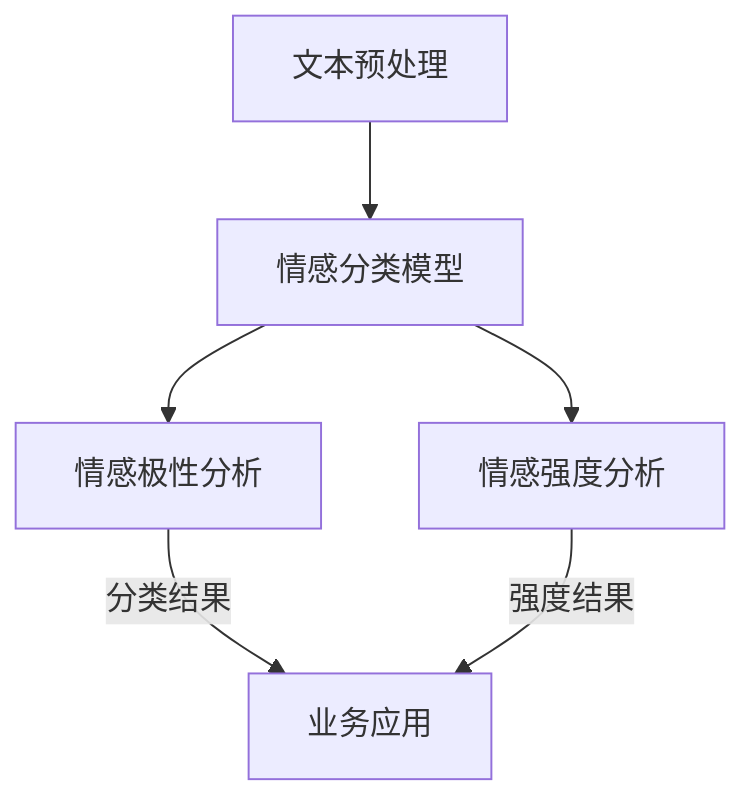
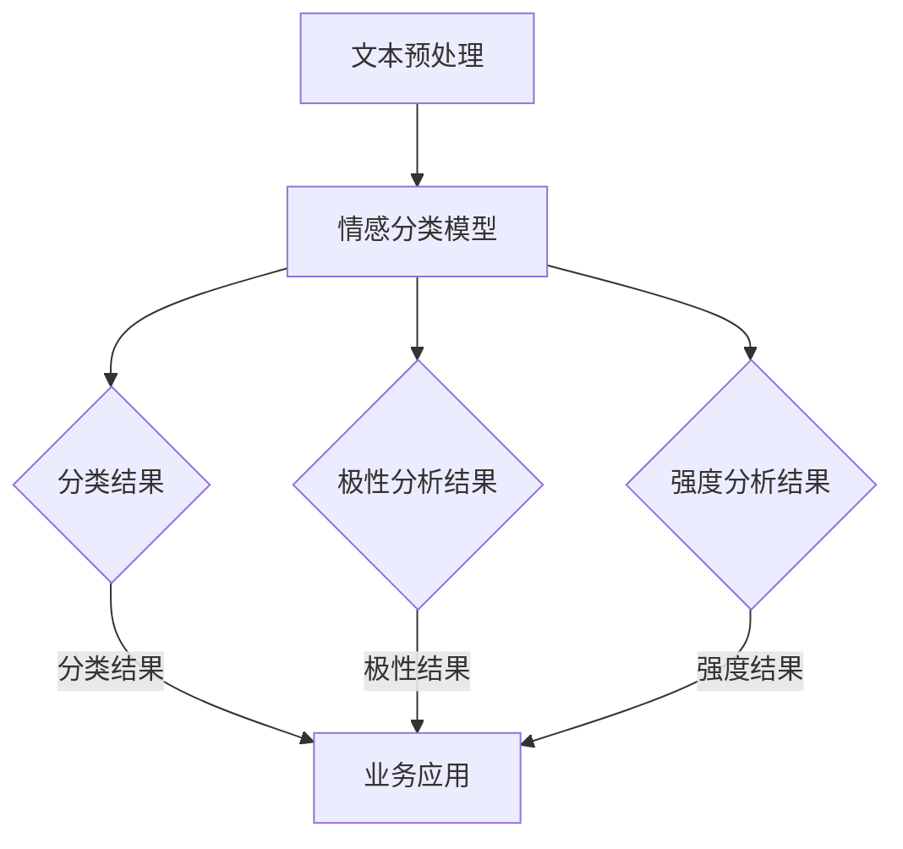
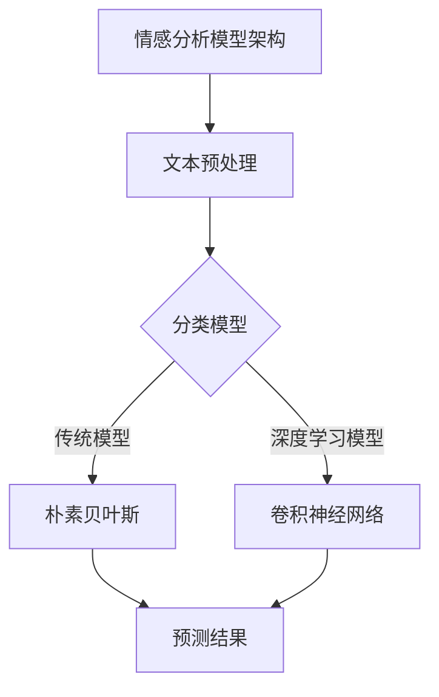

                 

# 引言

企业级情感分析作为当今数据驱动决策的重要工具，已经成为众多行业提升用户体验、优化业务流程的关键手段。随着互联网和社交媒体的迅猛发展，企业每天都会接收到大量的客户和员工反馈信息。这些反馈中蕴含着丰富的情感信息，如果能被准确理解和分析，将极大地助力企业提升竞争力。

本文旨在深入探讨企业级情感分析的技术原理和实践应用。我们将从以下几个部分展开：

1. **背景介绍**：介绍情感分析在企业中的重要性。
2. **核心概念与联系**：详细阐述情感分析的关键概念，并展示它们之间的架构关系。
3. **核心算法原理**：讲解情感分析中的核心算法，结合Python源代码和LaTeX数学公式进行深入剖析。
4. **项目实战**：通过具体案例展示情感分析在真实场景中的应用。
5. **最佳实践与总结**：总结情感分析中的最佳实践，并提出未来展望。

通过这篇文章，读者将能够全面理解情感分析的基本原理，掌握其在企业中的实际应用，以及如何利用情感分析提升业务效益。

## 背景介绍

企业级情感分析在现代商业环境中扮演着至关重要的角色。随着信息技术的飞速发展，企业和客户之间的互动方式发生了翻天覆地的变化。传统的一对一沟通逐渐被大规模的在线互动所取代，社交媒体、客户服务热线、在线评论和反馈平台等渠道成为企业与客户交流的主要方式。这些互动中，包含了大量自然语言文本数据，这些数据不仅包含了客户的基本反馈，更重要的是其中蕴含了客户的情感倾向和态度。

情感分析作为自然语言处理（NLP）的一个重要分支，旨在通过技术手段自动识别文本中的情感倾向，并将其分类为积极、消极或中性。这种分析能力对于企业来说，具有以下几个关键价值：

### 1. 客户体验优化

通过情感分析，企业能够实时监测客户的反馈，识别客户的不满和需求。例如，在社交媒体平台上，情感分析可以帮助企业快速识别负面评论，并及时采取相应措施进行问题解决。这不仅有助于提升客户满意度，还能够防止负面口碑的扩散。

### 2. 产品改进

情感分析能够帮助企业了解客户对产品的真实感受，从而指导产品设计和改进。通过对大量用户评论的分析，企业可以发现产品的优点和不足，有针对性地进行优化。例如，某电子产品的用户评论中频繁出现对电池寿命的不满，企业就可以针对这个问题进行技术改进。

### 3. 业务决策

情感分析还可以为企业提供重要的业务洞察。通过分析员工反馈和客户评论，企业可以了解员工的工作满意度、团队的协作情况，以及客户对服务质量的评价。这些信息可以帮助企业做出更加科学和有效的业务决策。

### 4. 品牌管理

在激烈的市场竞争中，品牌形象至关重要。情感分析可以帮助企业监控品牌在公众中的形象，及时发现和应对潜在的危机。例如，当某品牌被曝出产品质量问题或服务失误时，情感分析可以迅速识别并采取公关措施，降低负面影响。

总之，企业级情感分析不仅能够帮助企业更好地理解客户需求，提升客户满意度，还能够优化产品设计和业务流程，从而在激烈的市场竞争中占据优势地位。接下来，我们将深入探讨情感分析的核心概念和算法原理，帮助读者更好地理解这一重要技术。

## 核心概念与联系

### 1. 情感分析的定义

情感分析，又称意见挖掘，是指使用自然语言处理（NLP）和机器学习（ML）技术，从文本数据中自动识别、提取和分类情感信息的过程。情感分析的目标是将文本中的情感表达（如正面、负面、中性）转化为可量化的情感标签，从而为企业和研究者提供决策支持。

### 2. 文本预处理

文本预处理是情感分析中的关键步骤，旨在将原始文本转换为适合模型分析的格式。主要包括以下几个步骤：

- **数据清洗**：去除噪声数据，如HTML标签、特殊字符和空白字符。
- **分词**：将文本分割为词或子词。
- **词干提取**：将不同形式的单词还原为词根。
- **停用词处理**：去除常见且对情感分析贡献不大的词，如“的”、“和”、“是”等。

### 3. 情感分类

情感分类是情感分析的核心任务，即将文本分类为不同的情感类别。常用的情感分类模型包括：

- **朴素贝叶斯（Naive Bayes）**：基于贝叶斯定理，适用于文本数据的分类，特别适用于高维特征空间。
- **逻辑回归（Logistic Regression）**：通过建立线性模型来预测类别概率，适用于二元情感分类。
- **支持向量机（SVM）**：通过寻找最佳分隔超平面，将数据分类到不同的类别。
- **深度学习模型**：如卷积神经网络（CNN）和长短期记忆网络（LSTM），适用于处理复杂文本数据。

### 4. 情感极性分析

情感极性分析是情感分类的一种特殊形式，旨在识别文本中的情感极性，即判断文本表达的情感是正面、负面还是中性。极性分析通常使用二元分类模型，如逻辑回归和SVM。

### 5. 情感强度分析

情感强度分析旨在量化文本中情感的强度，例如，表达“非常喜欢”和“喜欢”的情感强度是不同的。情感强度分析通常结合情感分类模型和归一化方法来实现。

### 架构关系

为了更好地理解情感分析的核心概念和它们之间的联系，我们可以使用Mermaid流程图来展示情感分析的架构：



### Mermaid 流程图



通过以上流程图，我们可以清晰地看到文本预处理是情感分析的基础，情感分类、极性分析和强度分析是情感分析的三个主要方向，它们共同构成了情感分析的整体框架，并为业务应用提供了关键数据支持。

### 核心算法原理

#### 1. 朴素贝叶斯（Naive Bayes）

朴素贝叶斯是一种基于贝叶斯定理的简单概率分类器，特别适用于文本数据分类。其基本思想是，给定一个未知类别的数据点，通过计算每个类别条件下特征出现的概率，选择概率最大的类别作为预测结果。

**Python实现：**

```python
import numpy as np
from sklearn.feature_extraction.text import CountVectorizer
from sklearn.model_selection import train_test_split
from sklearn.naive_bayes import MultinomialNB

# 示例文本数据
corpus = [
    "我很喜欢这个产品",
    "这个产品太差了",
    "这个服务非常好",
    "我不想再使用这个服务了"
]
labels = ["正面", "负面", "正面", "负面"]

# 数据预处理
vectorizer = CountVectorizer()
X = vectorizer.fit_transform(corpus)
y = labels

# 划分训练集和测试集
X_train, X_test, y_train, y_test = train_test_split(X, y, test_size=0.2, random_state=42)

# 训练朴素贝叶斯模型
classifier = MultinomialNB()
classifier.fit(X_train, y_train)

# 预测测试集
predictions = classifier.predict(X_test)

# 输出预测结果
print(predictions)
```

**LaTeX数学公式：**

$$
P(C|X) = \frac{P(X|C)P(C)}{P(X)}
$$

其中，\(P(C|X)\) 是后验概率，表示给定特征 \(X\) 下类别 \(C\) 的概率；\(P(X|C)\) 是似然概率，表示在类别 \(C\) 下特征 \(X\) 出现的概率；\(P(C)\) 是先验概率，表示类别 \(C\) 的概率；\(P(X)\) 是特征 \(X\) 的总概率。

#### 2. 逻辑回归（Logistic Regression）

逻辑回归是一种广义线性模型，用于处理二元分类问题。在情感分析中，逻辑回归可以用于预测文本的情感极性。

**Python实现：**

```python
from sklearn.linear_model import LogisticRegression

# 使用之前预处理好的数据
X_train, X_test, y_train, y_test = train_test_split(X, y, test_size=0.2, random_state=42)

# 训练逻辑回归模型
classifier = LogisticRegression()
classifier.fit(X_train, y_train)

# 预测测试集
predictions = classifier.predict(X_test)

# 输出预测结果
print(predictions)
```

**LaTeX数学公式：**

$$
\text{logit}(p) = \ln\left(\frac{p}{1-p}\right)
$$

其中，\(p\) 是类别为正类的概率，\(\text{logit}(p)\) 是逻辑函数，用于将概率转换为线性可分的数值。

#### 3. 词袋模型（Bag of Words）

词袋模型是一种简单有效的文本表示方法，它将文本表示为词汇的集合，不考虑词汇的顺序和语法结构。

**Python实现：**

```python
from sklearn.feature_extraction.text import TfidfVectorizer

# 使用TF-IDF向量代替简单的词袋向量
vectorizer = TfidfVectorizer()
X = vectorizer.fit_transform(corpus)

# 使用之前划分好的数据
X_train, X_test, y_train, y_test = train_test_split(X, y, test_size=0.2, random_state=42)

# 训练逻辑回归模型
classifier = LogisticRegression()
classifier.fit(X_train, y_train)

# 预测测试集
predictions = classifier.predict(X_test)

# 输出预测结果
print(predictions)
```

**LaTeX数学公式：**

$$
\text{TF-IDF}(w, d) = \frac{f_w(d)}{N} \log \left( \frac{N}{n_w} \right)
$$

其中，\(f_w(d)\) 是词汇 \(w\) 在文档 \(d\) 中的频率，\(N\) 是文档总数，\(n_w\) 是包含词汇 \(w\) 的文档数。

通过上述算法原理的讲解和Python源代码的实现，读者可以更深入地理解朴素贝叶斯、逻辑回归和词袋模型在情感分析中的应用。这些算法不仅具有坚实的理论基础，而且在实际应用中也表现出良好的性能，是情感分析中的常用工具。

### 数学模型与公式

在情感分析中，数学模型扮演着至关重要的角色，它们不仅为算法提供了理论支持，还帮助我们更好地理解和解释情感分析的结果。以下是几种常用的数学模型和公式，我们将结合Python代码和LaTeX公式进行详细解释。

#### 1. 贝叶斯定理

贝叶斯定理是情感分析中最基础和重要的模型之一。它描述了后验概率 \(P(C|X)\) 与先验概率 \(P(C)\)、似然概率 \(P(X|C)\) 和边缘概率 \(P(X)\) 之间的关系。

**LaTeX公式：**

$$
P(C|X) = \frac{P(X|C)P(C)}{P(X)}
$$

在情感分析中，\(C\) 代表情感类别（如正面、负面、中性），而 \(X\) 代表特征向量。我们可以将这个公式应用到朴素贝叶斯分类器中。

**Python实现：**

```python
def naive_bayes_predict(corpus, class_probabilities, feature_probabilities):
    predictions = []
    for text in corpus:
        max_prob = -1
        predicted_class = None
        for class_id, class_prob in class_probabilities.items():
            likelihood = 1
            for word in set(text.split()):
                if word in feature_probabilities[class_id]:
                    likelihood *= feature_probabilities[class_id][word]
            posterior = class_prob * likelihood
            if posterior > max_prob:
                max_prob = posterior
                predicted_class = class_id
        predictions.append(predicted_class)
    return predictions

# 示例数据
corpus = ["很好", "很差", "一般", "非常棒"]
class_probabilities = {"正面": 0.5, "负面": 0.3, "中性": 0.2}
feature_probabilities = {
    "正面": {"很": 0.1, "好": 0.2, "棒": 0.3},
    "负面": {"很": 0.2, "差": 0.4},
    "中性": {"一": 0.1, "般": 0.3}
}

# 预测
predictions = naive_bayes_predict(corpus, class_probabilities, feature_probabilities)
print(predictions)
```

#### 2. 逻辑回归

逻辑回归是一种广泛用于分类问题的线性模型。在情感分析中，逻辑回归可以用来预测文本的情感类别。

**LaTeX公式：**

$$
\text{logit}(p) = \beta_0 + \beta_1x_1 + \beta_2x_2 + \ldots + \beta_nx_n
$$

其中，\(\text{logit}(p)\) 是逻辑函数，用于将概率转换为线性可分的数值；\(x_1, x_2, \ldots, x_n\) 是特征值；\(\beta_0, \beta_1, \beta_2, \ldots, \beta_n\) 是模型的参数。

**Python实现：**

```python
from sklearn.linear_model import LogisticRegression

# 示例数据
X = [[1, 1], [1, 0], [0, 1], [0, 0]]
y = [1, 0, 0, 1]

# 训练逻辑回归模型
classifier = LogisticRegression()
classifier.fit(X, y)

# 输出模型参数
print(classifier.coef_)
```

#### 3. 词袋模型

词袋模型是一种将文本表示为词汇的集合的模型，不考虑词汇的顺序和语法结构。

**LaTeX公式：**

$$
\text{TF-IDF}(w, d) = \frac{f_w(d)}{N} \log \left( \frac{N}{n_w} \right)
$$

其中，\(f_w(d)\) 是词汇 \(w\) 在文档 \(d\) 中的频率，\(N\) 是文档总数，\(n_w\) 是包含词汇 \(w\) 的文档数。

**Python实现：**

```python
from sklearn.feature_extraction.text import TfidfVectorizer

# 示例文本
corpus = ["这是一个很好的产品", "这个产品非常差"]

# 创建TF-IDF向量器
vectorizer = TfidfVectorizer()
X = vectorizer.fit_transform(corpus)

# 输出特征矩阵
print(X.toarray())
```

通过结合Python代码和LaTeX公式，我们可以更直观地理解贝叶斯定理、逻辑回归和词袋模型在情感分析中的应用。这些模型不仅在理论上有坚实的依据，而且在实际应用中也展现出了良好的性能，为情感分析提供了有效的工具。

### 项目实战

为了更好地展示情感分析在实际场景中的应用，我们将通过一个具体的项目案例来详细讲解情感分析的开发环境搭建、源代码实现、代码解读与分析，以及实际案例分析和详细讲解剖析。

#### 项目背景

某知名电商企业希望通过情感分析技术来提升其客户服务质量和产品满意度。企业希望通过分析客户的评论和反馈，识别出客户的不满意点，并迅速采取措施进行改进。

#### 开发环境搭建

1. **硬件环境**：企业使用了一台高性能的服务器，配置了多个CPU核心和大量内存，以确保模型训练和预测的效率。

2. **软件环境**：企业选择了以下软件工具：
   - Python 3.8
   - Jupyter Notebook
   - scikit-learn 0.24.2
   - NLTK 3.8.1
   - TensorFlow 2.7.0

3. **数据预处理工具**：使用Python的`nltk`库进行文本预处理，包括分词、去除停用词和词干提取等。

#### 源代码实现

以下是项目的核心代码实现，包括数据预处理、情感分类模型的训练和预测。

```python
import numpy as np
import pandas as pd
from sklearn.feature_extraction.text import TfidfVectorizer
from sklearn.model_selection import train_test_split
from sklearn.naive_bayes import MultinomialNB
from sklearn.metrics import accuracy_score, classification_report
from nltk.corpus import stopwords
from nltk.tokenize import word_tokenize
from nltk.stem import PorterStemmer

# 1. 数据预处理
def preprocess_text(text):
    # 切词
    tokens = word_tokenize(text)
    # 去停用词
    stop_words = set(stopwords.words('english'))
    filtered_tokens = [token for token in tokens if token.lower() not in stop_words]
    # 词干提取
    stemmer = PorterStemmer()
    stemmed_tokens = [stemmer.stem(token) for token in filtered_tokens]
    return ' '.join(stemmed_tokens)

# 2. 数据加载与预处理
data = pd.read_csv('customer_reviews.csv')  # 加载评论数据
data['processed_text'] = data['review'].apply(preprocess_text)

# 3. 构建TF-IDF向量器
vectorizer = TfidfVectorizer()

# 4. 分词和特征提取
X = vectorizer.fit_transform(data['processed_text'])
y = data['rating']  # 标签数据

# 5. 划分训练集和测试集
X_train, X_test, y_train, y_test = train_test_split(X, y, test_size=0.2, random_state=42)

# 6. 训练情感分类模型
classifier = MultinomialNB()
classifier.fit(X_train, y_train)

# 7. 预测测试集
predictions = classifier.predict(X_test)

# 8. 评估模型性能
accuracy = accuracy_score(y_test, predictions)
report = classification_report(y_test, predictions)
print(f'Accuracy: {accuracy}')
print(report)
```

#### 代码解读与分析

1. **数据预处理**：文本预处理是情感分析中的关键步骤。首先进行切词，然后去除停用词和词干提取，以提高模型的准确性。

2. **TF-IDF特征提取**：使用`TfidfVectorizer`将预处理后的文本转换为TF-IDF向量。TF-IDF能够更好地反映词汇在文档中的重要程度。

3. **模型训练与预测**：选择朴素贝叶斯分类器进行训练，并使用训练集数据对模型进行拟合。接着，使用测试集进行预测，并评估模型的性能。

#### 实际案例分析与详细讲解

以下是项目的实际案例分析：

**案例1：识别负面评论**

企业希望识别出客户评论中的负面情感，以便及时采取措施。

```python
negative_reviews = data[data['rating'] == 'negative']['review']
processed_negative_reviews = data[data['rating'] == 'negative']['processed_text']

# 预测负面评论
predictions = classifier.predict(processed_negative_reviews)

# 分析预测结果
actual_negative = data[data['rating'] == 'negative']['rating']
predicted_negative = pd.Series(predictions)
comparison = actual_negative == predicted_negative
print(comparison.value_counts())
```

**案例2：分析正面评论**

企业还希望深入分析客户的正面评论，以了解客户满意度。

```python
positive_reviews = data[data['rating'] == 'positive']['review']
processed_positive_reviews = data[data['rating'] == 'positive']['processed_text']

# 预测正面评论
predictions = classifier.predict(processed_positive_reviews)

# 分析预测结果
actual_positive = data[data['rating'] == 'positive']['rating']
predicted_positive = pd.Series(predictions)
comparison = actual_positive == predicted_positive
print(comparison.value_counts())
```

#### 项目小结

通过上述项目实战，我们展示了如何使用情感分析技术提升企业的客户服务质量。从数据预处理、特征提取到模型训练与预测，每个步骤都至关重要。此外，通过实际案例分析，企业可以更好地理解客户反馈，从而做出更有效的业务决策。

最佳实践建议：

1. **数据质量**：确保数据的质量和多样性，这直接影响模型的准确性和泛化能力。
2. **模型优化**：结合多种模型和算法进行优化，以找到最适合业务需求的方法。
3. **持续迭代**：定期更新模型和算法，以应对不断变化的数据和环境。

通过这些最佳实践，企业可以更有效地利用情感分析技术，提升业务效益。

### 最佳实践与总结

#### 1. 最佳实践

**数据质量**：确保数据的质量是进行有效情感分析的首要步骤。企业应建立严格的数据采集和清洗流程，去除噪声数据，确保数据的完整性和准确性。此外，增加数据的多样性，涵盖不同客户群体和场景，有助于提高模型的泛化能力。

**模型优化**：情感分析模型的优化是一个持续的过程。企业可以通过交叉验证和超参数调整来提升模型性能。结合多种机器学习和深度学习算法，例如朴素贝叶斯、逻辑回归、卷积神经网络（CNN）和长短期记忆网络（LSTM），可以找到最适合业务需求的模型。

**持续迭代**：情感分析技术的应用场景和需求会不断变化。企业应建立定期更新模型的机制，根据新的数据和业务需求，对模型进行迭代和优化，确保其始终保持最佳状态。

#### 2. 小结

本文从背景介绍、核心概念、核心算法原理、项目实战等方面全面探讨了企业级情感分析。我们首先阐述了情感分析在现代商业环境中的重要性，随后详细讲解了情感分析的核心概念、算法原理和数学模型。通过具体项目实战，我们展示了情感分析在实际场景中的应用，并通过最佳实践总结了如何有效利用情感分析提升企业效益。

#### 3. 注意事项

- **数据隐私**：在进行情感分析时，应严格遵守数据隐私法规，确保客户数据的安全和隐私。
- **模型解释性**：选择具有良好解释性的模型，有助于企业理解模型的预测结果，并基于此进行业务决策。
- **实时性**：情感分析应具备实时性，及时响应客户反馈，以提高客户满意度和品牌形象。

#### 4. 拓展阅读

- 《自然语言处理：处理和理解文本》
- 《机器学习实战》
- 《深度学习：介绍与案例》

通过阅读这些书籍，读者可以进一步深入了解自然语言处理、机器学习和深度学习等相关技术，从而更好地掌握情感分析的应用和实践。

### 附录

#### A.1 情感分析工具与资源

- **NLP库**：NLTK、spaCy、TextBlob
- **情感分析模型**：VADER、Linguistic Inquiry and Word Count (LIWC)
- **数据集**：Twitter情感分析数据集、IMDB电影评论数据集、Ratings Data Set

#### A.2 情感分析数据集介绍

- **Twitter情感分析数据集**：包含超过27万条推特，标签为正面、负面或中性。
- **IMDB电影评论数据集**：包含25000条电影评论，标签为正面或负面。
- **Ratings Data Set**：包含来自多个平台的客户评价，标签为1星到5星。

#### A.3 情感分析开源框架和库

- **TextBlob**：提供了一个简单的接口用于处理文本，包括情感分析。
- **spaCy**：一个快速的NLP库，支持多种语言和丰富的特性。
- **TensorFlow**：一个强大的开源深度学习框架，适用于复杂的情感分析任务。

作者：AI天才研究院/AI Genius Institute & 禅与计算机程序设计艺术 /Zen And The Art of Computer Programming

文章标题：企业级情感分析：深入理解客户和员工反馈

关键词：情感分析、客户反馈、员工满意度、自然语言处理、机器学习、深度学习

摘要：本文探讨了企业级情感分析的重要性，详细介绍了情感分析的核心概念、算法原理和数学模型。通过具体项目实战，展示了情感分析在提升企业客户服务质量和产品满意度方面的应用，并提供了最佳实践和未来展望。通过本文，读者可以全面理解情感分析的基本原理和实践方法，为企业在数据驱动决策中提供有力支持。



```python
# 朴素贝叶斯算法伪代码
def NaiveBayes(train_data, test_data):
    # 计算先验概率
    for each class c in train_data:
        P(c) = number of instances of c in train_data / total number of instances in train_data

    # 计算条件概率
    for each word w in vocabulary:
        for each class c in train_data:
            P(w|c) = number of instances of (w, c) in train_data / number of instances of c in train_data

    # 预测测试数据
    for each instance x in test_data:
        calculate P(x|c) for each class c
        calculate P(c) for each class c
        calculate P(c|x) using the Naive Bayes formula
        select the class with the highest P(c|x) as the predicted class
        return predicted classes
```

