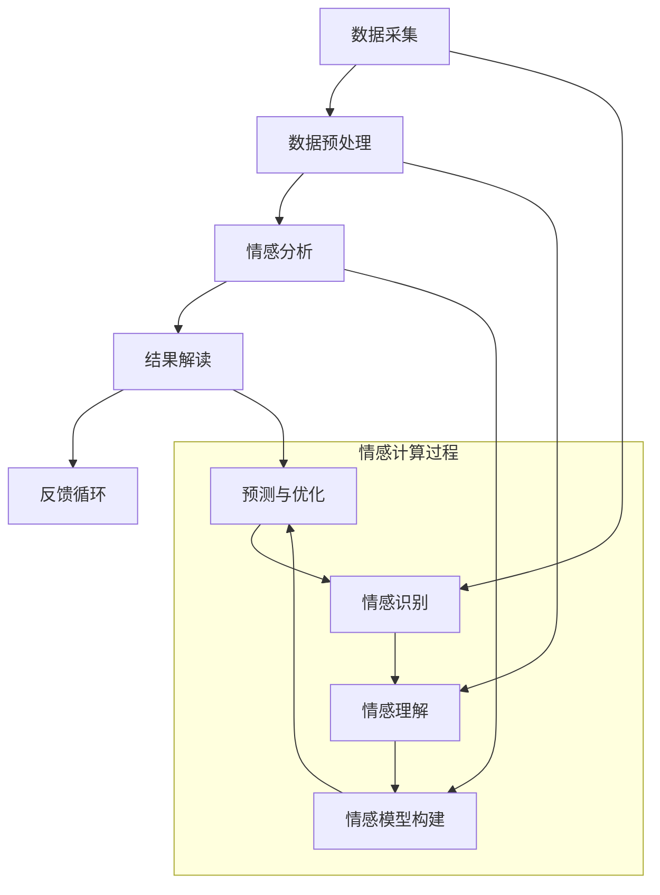

                 

### 背景介绍

在现代企业的运营中，客户和员工的情感需求管理越来越受到重视。企业级情感计算平台应运而生，作为一种新兴的技术手段，它不仅能够帮助企业更深入地理解客户和员工的需求，还能通过数据分析与情感识别技术，为企业提供精准的服务和决策支持。本文将围绕企业级情感计算平台，深入探讨其在客户和员工情感需求管理中的应用和实现。

**客户需求分析**是企业级情感计算平台的核心任务之一。通过分析客户的情感数据，企业可以了解客户在不同场景下的情感状态，从而更好地满足客户需求，提升客户满意度。例如，在电子商务领域，通过对客户评价、社交媒体评论等情感数据的分析，企业可以识别出客户对产品的满意度，以及产品改进的方向。

**员工需求分析**同样重要。企业通过分析员工的情感数据，可以了解员工的情感状态和工作满意度，从而制定出更有效的员工管理策略。例如，通过对员工在社交平台上的情感状态进行分析，企业可以发现员工在工作中的压力和困难，从而提供针对性的支持和帮助。

本文将分为以下几个部分进行讨论：

1. **情感计算的概念与发展**：介绍情感计算的基本概念、发展历程以及当前的技术现状和趋势。
2. **客户情感计算**：分析客户情感数据采集、分析方法和情感识别算法原理。
3. **员工情感计算**：探讨员工情感数据采集、分析方法和情感识别算法原理。
4. **平台架构与技术实现**：介绍企业级情感计算平台的整体架构设计，以及技术实现细节。
5. **应用案例分析**：通过具体案例分析，展示情感计算平台在实际业务中的应用效果。
6. **总结与展望**：总结全文内容，并对未来情感计算技术的发展趋势和挑战进行展望。

通过以上内容，我们将深入理解企业级情感计算平台的重要性，以及其在客户与员工需求管理中的应用与实践。

### 核心概念与联系

为了更好地理解企业级情感计算平台，首先需要明确几个核心概念及其相互关系。以下是情感计算中的几个关键概念及其架构流程的Mermaid流程图：



#### 概念解析：

1. **数据采集（A）**：数据采集是情感计算的第一步，通过多种渠道（如社交媒体、客户反馈、员工反馈等）收集与情感相关的数据。

2. **数据预处理（B）**：对采集到的数据进行清洗、去噪和格式转换，以便进行后续的情感分析。

3. **情感识别（F）**：使用自然语言处理（NLP）技术和机器学习算法，从文本数据中提取情感信息，识别出文本的情感倾向（如积极、消极、中性等）。

4. **情感理解（G）**：在情感识别的基础上，进一步理解情感的复杂性和上下文，例如情感强度、情感维度（如快乐、悲伤、愤怒等）。

5. **情感模型构建（H）**：基于大量的情感数据，构建情感模型，用于预测和识别新的情感数据。

6. **预测与优化（I）**：利用情感模型对新的情感数据进行分析，优化算法模型，提高情感识别的准确性和效率。

7. **结果解读（D）**：将情感分析结果进行解读，为企业提供有价值的决策支持。

8. **反馈循环（E）**：将结果解读后的反馈信息返回到数据采集阶段，用于不断优化情感计算模型。

通过以上概念和流程的介绍，我们可以看到企业级情感计算平台是如何通过一系列技术手段，从数据采集到结果解读，形成一个闭环系统，不断优化和提升情感分析能力。

接下来，我们将详细探讨情感计算平台在实际应用中的核心算法原理和数学模型。

### 客户情感计算的核心算法原理

在客户情感计算中，核心算法原理主要包括自然语言处理（NLP）、机器学习（ML）和深度学习（DL）。这些技术共同构成了情感计算平台的基础，使得企业能够有效地分析和理解客户情感。

#### 自然语言处理（NLP）

自然语言处理是情感计算的基础，它涉及文本数据的解析和理解。NLP的关键步骤包括：

1. **分词（Tokenization）**：将文本拆分成单词或子词。例如，"我爱这个产品" 可以拆分为 "我"、"爱"、"这个"、"产品"。

   ```python
   import jieba
   
   text = "我爱这个产品"
   segmented_text = jieba.cut(text)
   print("分词结果：" + "/ ".join(segmented_text))
   ```

2. **词性标注（Part-of-Speech Tagging）**：对每个分词进行词性标注，例如名词、动词、形容词等。

   ```python
   from nltk import pos_tag
   
   tokens = ["我", "爱", "这个", "产品"]
   tagged_tokens = pos_tag(tokens)
   print("词性标注结果：" + str(tagged_tokens))
   ```

3. **词频统计（Frequency Analysis）**：计算文本中每个词的出现频率，用于初步的情感分析。

   ```python
   from collections import Counter
   
   word_counts = Counter(segmented_text)
   print("词频统计结果：" + str(word_counts))
   ```

#### 机器学习（ML）

机器学习在情感计算中用于训练模型，从数据中自动学习情感倾向。常见的机器学习方法包括：

1. **朴素贝叶斯分类器（Naive Bayes Classifier）**：

   朴素贝叶斯是一种基于贝叶斯定理的简单分类器，它假设特征之间相互独立。

   ```python
   from sklearn.naive_bayes import MultinomialNB
   
   # 假设已有训练数据 X_train 和标签 y_train
   classifier = MultinomialNB()
   classifier.fit(X_train, y_train)
   predictions = classifier.predict(X_test)
   ```

2. **支持向量机（SVM）**：

   支持向量机是一种强大的分类算法，通过找到最佳的超平面来分离不同类别的数据点。

   ```python
   from sklearn.svm import SVC
   
   classifier = SVC(kernel='linear')
   classifier.fit(X_train, y_train)
   predictions = classifier.predict(X_test)
   ```

#### 深度学习（DL）

深度学习通过神经网络结构自动学习复杂的特征表示，是当前情感计算领域的主流技术。以下是几种常用的深度学习模型：

1. **卷积神经网络（CNN）**：

   卷积神经网络常用于处理图像数据，但也可以应用于文本情感分析，通过卷积层提取特征。

   ```python
   from tensorflow.keras.models import Sequential
   from tensorflow.keras.layers import Conv1D, MaxPooling1D, Flatten, Dense
   
   model = Sequential()
   model.add(Conv1D(filters=128, kernel_size=5, activation='relu'))
   model.add(MaxPooling1D(pool_size=5))
   model.add(Flatten())
   model.add(Dense(units=1, activation='sigmoid'))
   model.compile(optimizer='adam', loss='binary_crossentropy', metrics=['accuracy'])
   model.fit(X_train, y_train, epochs=10, batch_size=32)
   ```

2. **递归神经网络（RNN）**：

   递归神经网络适用于处理序列数据，如文本序列，可以捕捉文本中的长期依赖关系。

   ```python
   from tensorflow.keras.models import Sequential
   from tensorflow.keras.layers import LSTM, Dense
   
   model = Sequential()
   model.add(LSTM(units=128, return_sequences=True))
   model.add(LSTM(units=128))
   model.add(Dense(units=1, activation='sigmoid'))
   model.compile(optimizer='adam', loss='binary_crossentropy', metrics=['accuracy'])
   model.fit(X_train, y_train, epochs=10, batch_size=32)
   ```

3. **长短期记忆网络（LSTM）**：

   LSTM是一种特殊的RNN，能够有效处理长序列数据，避免梯度消失问题。

   ```python
   from tensorflow.keras.models import Sequential
   from tensorflow.keras.layers import LSTM, Dense
   
   model = Sequential()
   model.add(LSTM(units=128, return_sequences=True))
   model.add(LSTM(units=128))
   model.add(Dense(units=1, activation='sigmoid'))
   model.compile(optimizer='adam', loss='binary_crossentropy', metrics=['accuracy'])
   model.fit(X_train, y_train, epochs=10, batch_size=32)
   ```

通过上述技术，客户情感计算平台能够对文本数据进行分析，识别出客户的情感倾向。以下是一个简单的情感分析案例，展示如何使用Python实现情感分析。

#### 案例演示：使用Python进行情感分析

假设我们有一个包含客户评价的文本数据集，我们需要对这批数据进行情感分析，以识别出客户的情感倾向。

```python
import jieba
import nltk
from sklearn.feature_extraction.text import TfidfVectorizer
from sklearn.naive_bayes import MultinomialNB
from sklearn.model_selection import train_test_split
from sklearn.metrics import accuracy_score

# 加载客户评价数据
data = [
    "这个产品非常棒，我很满意。",
    "我有些失望，这个产品没有达到我的预期。",
    "太棒了，我非常喜欢这个产品。",
    "很糟糕，我再也不想购买这个产品了。",
    # 更多评价数据...
]

# 标签：正面、负面
labels = ["正面", "负面", "正面", "负面", # 更多标签...
]

# 分词与词性标注
segmented_data = [jieba.cut(text) for text in data]
tagged_data = [nltk.pos_tag(word) for word in segmented_data]

# 建立TF-IDF向量器
vectorizer = TfidfVectorizer()
X = vectorizer.fit_transform([" ".join(word) for word in tagged_data])

# 划分训练集和测试集
X_train, X_test, y_train, y_test = train_test_split(X, labels, test_size=0.2, random_state=42)

# 训练朴素贝叶斯分类器
classifier = MultinomialNB()
classifier.fit(X_train, y_train)
predictions = classifier.predict(X_test)

# 评估模型准确率
accuracy = accuracy_score(y_test, predictions)
print(f"模型准确率：{accuracy:.2f}")
```

在这个案例中，我们首先使用jieba对文本进行分词，然后使用nltk进行词性标注。接下来，我们使用TF-IDF向量器将文本转换为向量，并使用朴素贝叶斯分类器对数据集进行训练和预测。最后，评估模型的准确率。

通过上述步骤，我们可以看到如何使用Python实现一个简单的情感分析模型，这为更复杂的情感计算平台奠定了基础。

### 员工情感计算的核心算法原理

员工情感计算的核心算法原理同样依赖于自然语言处理（NLP）、机器学习和深度学习技术。以下是这些技术在员工情感计算中的应用和方法。

#### 自然语言处理（NLP）

在员工情感计算中，NLP技术主要用于文本数据的预处理和情感标注。以下是一些关键步骤：

1. **文本预处理**：包括去除停用词、标点符号和特殊字符，以及进行词干提取和词性标注。这些步骤有助于减少数据噪声，提高情感分析的准确性。

   ```python
   import nltk
   from nltk.corpus import stopwords
   from nltk.stem import PorterStemmer
   
   # 下载停用词库
   nltk.download('stopwords')
   
   # 初始化停用词列表和词干提取器
   stop_words = set(stopwords.words('english'))
   stemmer = PorterStemmer()
   
   # 文本预处理函数
   def preprocess_text(text):
       words = nltk.word_tokenize(text)
       words = [word.lower() for word in words if word.isalpha()]
       words = [word for word in words if word not in stop_words]
       words = [stemmer.stem(word) for word in words]
       return words
   
   example_text = "I am very happy working here."
   processed_text = preprocess_text(example_text)
   print("预处理后文本：" + " ".join(processed_text))
   ```

2. **情感标注**：使用有监督或无监督学习方法，对预处理后的文本进行情感标注。常见的情感标注任务包括正面/负面情感分类和情感极性分析。

   ```python
   from sklearn.feature_extraction.text import CountVectorizer
   from sklearn.naive_bayes import MultinomialNB
   
   # 假设已有训练数据
   training_data = [
       "I love this job.",
       "I hate my work environment.",
       # 更多训练数据...
   ]
   labels = ["正面", "负面"] * 5  # 对应的情感标签
   
   # 建立向量器和分类器
   vectorizer = CountVectorizer()
   classifier = MultinomialNB()
   
   # 训练模型
   X_train = vectorizer.fit_transform(training_data)
   classifier.fit(X_train, labels)
   
   # 进行预测
   test_data = ["I am satisfied with my job."]
   X_test = vectorizer.transform(test_data)
   prediction = classifier.predict(X_test)
   print("预测结果：" + prediction[0])
   ```

#### 机器学习（ML）

机器学习在员工情感计算中的应用包括分类、聚类和回归等算法。以下是一些常用的机器学习方法：

1. **朴素贝叶斯分类器**：适用于文本数据的情感分类，通过贝叶斯定理和特征概率分布进行分类。

   ```python
   from sklearn.naive_bayes import MultinomialNB
   from sklearn.model_selection import train_test_split
   
   # 假设已有训练数据 X 和标签 y
   X_train, X_test, y_train, y_test = train_test_split(X, y, test_size=0.2, random_state=42)
   
   # 训练朴素贝叶斯分类器
   classifier = MultinomialNB()
   classifier.fit(X_train, y_train)
   
   # 进行预测
   predictions = classifier.predict(X_test)
   
   # 评估模型准确率
   accuracy = accuracy_score(y_test, predictions)
   print(f"模型准确率：{accuracy:.2f}")
   ```

2. **支持向量机（SVM）**：通过找到最佳的超平面进行分类，适用于高维数据。

   ```python
   from sklearn.svm import SVC
   from sklearn.model_selection import train_test_split
   
   # 假设已有训练数据 X 和标签 y
   X_train, X_test, y_train, y_test = train_test_split(X, y, test_size=0.2, random_state=42)
   
   # 训练支持向量机分类器
   classifier = SVC(kernel='linear')
   classifier.fit(X_train, y_train)
   
   # 进行预测
   predictions = classifier.predict(X_test)
   
   # 评估模型准确率
   accuracy = accuracy_score(y_test, predictions)
   print(f"模型准确率：{accuracy:.2f}")
   ```

#### 深度学习（DL）

深度学习在员工情感计算中的应用主要体现在神经网络结构的设计和训练。以下是一些常用的深度学习模型：

1. **卷积神经网络（CNN）**：通过卷积层和池化层提取文本特征，适用于文本分类和情感分析。

   ```python
   from tensorflow.keras.models import Sequential
   from tensorflow.keras.layers import Conv1D, MaxPooling1D, Flatten, Dense
   
   model = Sequential()
   model.add(Conv1D(filters=128, kernel_size=5, activation='relu'))
   model.add(MaxPooling1D(pool_size=5))
   model.add(Flatten())
   model.add(Dense(units=1, activation='sigmoid'))
   model.compile(optimizer='adam', loss='binary_crossentropy', metrics=['accuracy'])
   model.fit(X_train, y_train, epochs=10, batch_size=32)
   ```

2. **递归神经网络（RNN）**：通过循环层捕捉文本中的长期依赖关系，适用于序列数据处理。

   ```python
   from tensorflow.keras.models import Sequential
   from tensorflow.keras.layers import LSTM, Dense
   
   model = Sequential()
   model.add(LSTM(units=128, return_sequences=True))
   model.add(LSTM(units=128))
   model.add(Dense(units=1, activation='sigmoid'))
   model.compile(optimizer='adam', loss='binary_crossentropy', metrics=['accuracy'])
   model.fit(X_train, y_train, epochs=10, batch_size=32)
   ```

3. **长短期记忆网络（LSTM）**：通过记忆机制解决RNN的梯度消失问题，适用于复杂序列数据处理。

   ```python
   from tensorflow.keras.models import Sequential
   from tensorflow.keras.layers import LSTM, Dense
   
   model = Sequential()
   model.add(LSTM(units=128, return_sequences=True))
   model.add(LSTM(units=128))
   model.add(Dense(units=1, activation='sigmoid'))
   model.compile(optimizer='adam', loss='binary_crossentropy', metrics=['accuracy'])
   model.fit(X_train, y_train, epochs=10, batch_size=32)
   ```

通过上述技术，员工情感计算平台能够对员工情感数据进行分析，识别出员工在不同场景下的情感状态。以下是一个简单的员工情感分析案例，展示如何使用Python实现员工情感分析。

#### 案例演示：使用Python进行员工情感分析

假设我们有一个包含员工反馈的文本数据集，我们需要对这批数据进行情感分析，以识别出员工的情感倾向。

```python
import jieba
import nltk
from sklearn.feature_extraction.text import TfidfVectorizer
from sklearn.naive_bayes import MultinomialNB
from sklearn.model_selection import train_test_split
from sklearn.metrics import accuracy_score

# 加载员工反馈数据
data = [
    "我对工作环境感到非常满意。",
    "我有些担心未来的职业发展。",
    "我热爱我的工作，感谢公司的支持。",
    "我对目前的薪酬不太满意。",
    # 更多反馈数据...
]

# 标签：正面、负面
labels = ["正面", "负面", "正面", "负面", # 更多标签...
]

# 分词与词性标注
segmented_data = [jieba.cut(text) for text in data]
tagged_data = [nltk.pos_tag(word) for word in segmented_data]

# 建立TF-IDF向量器
vectorizer = TfidfVectorizer()
X = vectorizer.fit_transform([" ".join(word) for word in tagged_data])

# 划分训练集和测试集
X_train, X_test, y_train, y_test = train_test_split(X, labels, test_size=0.2, random_state=42)

# 训练朴素贝叶斯分类器
classifier = MultinomialNB()
classifier.fit(X_train, y_train)
predictions = classifier.predict(X_test)

# 评估模型准确率
accuracy = accuracy_score(y_test, predictions)
print(f"模型准确率：{accuracy:.2f}")
```

在这个案例中，我们首先使用jieba对文本进行分词，然后使用nltk进行词性标注。接下来，我们使用TF-IDF向量器将文本转换为向量，并使用朴素贝叶斯分类器对数据集进行训练和预测。最后，评估模型的准确率。

通过上述步骤，我们可以看到如何使用Python实现一个简单的员工情感分析模型，这为更复杂的员工情感计算平台奠定了基础。

### 平台架构设计

企业级情感计算平台的架构设计是确保系统能够高效、稳定地处理大量情感数据并生成有价值的分析结果的关键。该架构通常包括数据采集与处理模块、情感分析模块、应用接口与集成模块，以及反馈循环模块。以下是详细的设计与实现步骤：

#### 1. 数据采集与处理模块

**数据采集**是情感计算平台的第一步，涉及从各种渠道（如社交媒体、客户反馈系统、员工反馈渠道等）收集情感数据。以下步骤描述了数据采集与处理模块的实现：

1. **数据源接入**：
   - **客户数据**：通过API接口与电子商务平台、社交媒体平台等连接，实时获取客户评价、反馈和评论。
   - **员工数据**：集成企业内部的社交媒体、邮件系统和员工满意度调查工具，获取员工情感数据。

2. **数据预处理**：
   - **文本清洗**：去除无效字符、停用词，进行词干提取和词性标注。
   - **数据标准化**：统一数据格式，确保不同来源的数据具有一致性。

3. **数据存储**：
   - **关系型数据库**（如MySQL）：用于存储结构化数据，如用户ID、评论内容、标签等。
   - **非关系型数据库**（如MongoDB）：用于存储半结构化或非结构化数据，如社交媒体评论、员工反馈等。

#### 2. 情感分析模块

情感分析模块是平台的核心，负责对采集到的数据进行情感识别、情感理解和情感建模。以下是具体实现步骤：

1. **情感识别**：
   - **基于规则的方法**：使用预定义的规则库，对文本进行情感倾向分类。
   - **基于机器学习的方法**：训练情感分类模型（如朴素贝叶斯、SVM、CNN等），对文本进行自动分类。

2. **情感理解**：
   - **情感强度分析**：通过分析文本中情感词的频率和上下文，确定情感的强度。
   - **情感维度分析**：识别文本中的主要情感维度（如快乐、悲伤、愤怒等），并分析其相互关系。

3. **情感建模**：
   - **情感模型训练**：使用大量标注数据，训练情感识别模型。
   - **模型评估与优化**：通过交叉验证和性能评估，优化模型参数，提高识别准确率。

#### 3. 应用接口与集成模块

应用接口与集成模块负责将情感计算平台与企业的其他业务系统（如客户关系管理系统、人力资源管理系统等）集成，并提供API接口供开发者使用。以下是实现步骤：

1. **API设计**：
   - **RESTful API**：提供统一的API接口，支持HTTP请求，方便外部系统调用。
   - **数据格式**：支持JSON、XML等数据格式，确保接口的兼容性和灵活性。

2. **系统集成**：
   - **CRM集成**：将情感分析结果集成到客户关系管理系统中，帮助企业更好地了解客户需求。
   - **HRM集成**：将员工情感分析结果集成到人力资源管理系统中，支持员工管理和决策。

3. **权限管理**：
   - **身份验证**：确保API接口的安全性，通过用户认证和权限控制，防止未经授权的访问。

#### 4. 反馈循环模块

反馈循环模块是确保情感计算平台持续优化和改进的关键。以下是实现步骤：

1. **用户反馈收集**：
   - **实时反馈**：收集用户对情感分析结果的反馈，如误分类的报告、改进建议等。
   - **历史反馈**：分析历史反馈数据，识别情感识别和理解的薄弱环节。

2. **模型优化**：
   - **在线学习**：利用用户反馈，在线调整情感分析模型，提高识别准确率。
   - **版本控制**：确保模型的版本更新和回滚机制，避免因模型更新导致的问题。

3. **性能监控**：
   - **实时监控**：监控平台的运行状态，确保系统的稳定性和可靠性。
   - **性能分析**：定期分析系统性能，识别瓶颈和优化方向。

通过上述架构设计，企业级情感计算平台能够高效地处理情感数据，为企业提供精准的情感分析结果，支持决策和运营优化。

### 数据库设计与实现

企业级情感计算平台的数据处理需求复杂，需要高效的数据库设计和实现来支持大规模数据的存储和管理。以下是数据库设计的详细步骤和实现方法。

#### 1. 数据库设计原则

- **高扩展性**：设计能够支持数据量快速增长，易于水平扩展。
- **高可用性**：确保数据在故障情况下能够快速恢复，保证系统的高可用性。
- **高性能**：优化查询性能，满足实时数据分析的需求。
- **数据一致性**：确保数据的完整性和一致性，防止数据冲突和错误。

#### 2. 数据库架构

平台数据库采用分布式架构，主要包括以下模块：

- **数据采集层**：负责从各种渠道（如社交媒体、客户反馈系统、员工反馈渠道等）收集数据。
- **数据处理层**：对采集到的数据进行清洗、转换和存储。
- **数据存储层**：包括关系型数据库和非关系型数据库，分别用于存储结构化和非结构化数据。
- **数据访问层**：提供统一的API接口，支持外部系统对数据库的访问。

#### 3. 数据模型设计

1. **关系型数据库（MySQL）**：

   - **用户表**：存储用户基本信息，如用户ID、姓名、联系方式等。
   - **评论表**：存储客户和员工的反馈评论，包括评论内容、时间戳、情感标签等。
   - **情感分析结果表**：存储情感分析结果，包括识别出的情感倾向、强度、维度等。

   ```sql
   CREATE TABLE users (
       user_id INT PRIMARY KEY AUTO_INCREMENT,
       name VARCHAR(255),
       contact_info VARCHAR(255)
   );

   CREATE TABLE comments (
       comment_id INT PRIMARY KEY AUTO_INCREMENT,
       user_id INT,
       content TEXT,
       timestamp DATETIME,
       emotion_tag VARCHAR(255),
       FOREIGN KEY (user_id) REFERENCES users(user_id)
   );

   CREATE TABLE emotion_analytics (
       analytics_id INT PRIMARY KEY AUTO_INCREMENT,
       comment_id INT,
       emotion_recognition VARCHAR(255),
       emotion_intensity FLOAT,
       emotion_dimension VARCHAR(255),
       FOREIGN KEY (comment_id) REFERENCES comments(comment_id)
   );
   ```

2. **非关系型数据库（MongoDB）**：

   - **客户反馈文档**：存储客户反馈的详细信息，包括文本内容、标签、时间戳等。
   - **员工反馈文档**：存储员工反馈的详细信息，包括文本内容、情感分析结果、时间戳等。

   ```json
   {
       "_id": ObjectId("5fd4e6b8e7d2c2a3e9c4d2a1"),
       "customer_id": "C12345",
       "feedback": "我对这个产品非常满意。",
       "timestamp": ISODate("2023-03-01T10:30:00.000Z"),
       "emotion": "正面"
   }

   {
       "_id": ObjectId("5fd4e6c8e7d2c2a3e9c4d2b1"),
       "employee_id": "E67890",
       "feedback": "我最近感到有些工作压力。",
       "timestamp": ISODate("2023-03-02T14:00:00.000Z"),
       "emotion": "负面"
   }
   ```

#### 4. 数据处理流程

1. **数据采集**：通过API接口或消息队列，从不同数据源采集数据。
2. **数据预处理**：对采集到的数据进行清洗、去噪和格式转换。
3. **数据存储**：将预处理后的数据存储到关系型数据库和非关系型数据库中。
4. **数据查询与分析**：通过数据库查询接口，提取和分析情感数据，为情感分析模块提供支持。

#### 5. 高可用性与扩展性设计

- **主从复制**：实现数据库的主从复制，确保数据的高可用性。
- **分库分表**：根据数据类型和访问模式，将数据库拆分为多个子库和子表，提高查询性能。
- **水平扩展**：使用分布式数据库技术，支持数据存储和处理的水平扩展。

通过上述数据库设计和实现方法，企业级情感计算平台能够高效、稳定地处理海量情感数据，支持系统的持续运行和优化。

### 数据挖掘与机器学习算法

数据挖掘与机器学习算法在情感计算平台中扮演着至关重要的角色，它们负责从大量的情感数据中提取有用信息，生成有意义的分析结果。以下是情感计算平台中常用的数据挖掘与机器学习算法，包括它们的基本原理和实际应用。

#### 1. K-近邻算法（K-Nearest Neighbors, KNN）

**基本原理**：K-近邻算法是一种基于实例的学习算法，它通过计算新样本与训练集中各个样本的距离，找出最近的K个邻居，并根据这些邻居的标签进行分类。

**实现步骤**：
1. 计算距离：使用距离度量（如欧氏距离、曼哈顿距离等）计算新样本与训练集中每个样本之间的距离。
2. 选择邻居：找出距离最近的K个邻居。
3. 分类预测：根据邻居的标签进行投票，得出新样本的分类结果。

**应用场景**：KNN算法常用于情感分类任务，例如，对客户评论进行情感倾向分类。

```python
from sklearn.neighbors import KNeighborsClassifier
from sklearn.model_selection import train_test_split
from sklearn.metrics import accuracy_score

# 假设已有训练数据 X 和标签 y
X_train, X_test, y_train, y_test = train_test_split(X, y, test_size=0.2, random_state=42)

# 训练KNN分类器
knn_classifier = KNeighborsClassifier(n_neighbors=3)
knn_classifier.fit(X_train, y_train)

# 进行预测
predictions = knn_classifier.predict(X_test)

# 评估模型准确率
accuracy = accuracy_score(y_test, predictions)
print(f"模型准确率：{accuracy:.2f}")
```

#### 2. 支持向量机（Support Vector Machine, SVM）

**基本原理**：SVM通过找到一个最佳的超平面，将不同类别的样本分隔开来。它通过最大化分类边界来提高模型的分类性能。

**实现步骤**：
1. 选择核函数：如线性核、多项式核、径向基函数（RBF）等。
2. 训练模型：通过优化目标函数，找到最佳的超平面。
3. 分类预测：使用训练好的模型对新的样本进行分类。

**应用场景**：SVM常用于高维数据分类，适用于情感分析中的文本分类任务。

```python
from sklearn.svm import SVC
from sklearn.model_selection import train_test_split
from sklearn.metrics import accuracy_score

# 假设已有训练数据 X 和标签 y
X_train, X_test, y_train, y_test = train_test_split(X, y, test_size=0.2, random_state=42)

# 训练SVM分类器
svm_classifier = SVC(kernel='linear')
svm_classifier.fit(X_train, y_train)

# 进行预测
predictions = svm_classifier.predict(X_test)

# 评估模型准确率
accuracy = accuracy_score(y_test, predictions)
print(f"模型准确率：{accuracy:.2f}")
```

#### 3. 决策树（Decision Tree）

**基本原理**：决策树通过一系列规则对样本进行分类。每个节点表示一个特征，每个分支代表该特征的取值。

**实现步骤**：
1. 选择最优特征：基于信息增益或基尼不纯度等指标，选择最佳特征进行分割。
2. 递归划分：对选择出的特征进行划分，生成子树。
3. 建立树结构：将划分结果组织成树形结构，生成决策树。

**应用场景**：决策树适用于简单的情感分类任务，易于理解和解释。

```python
from sklearn.tree import DecisionTreeClassifier
from sklearn.model_selection import train_test_split
from sklearn.metrics import accuracy_score

# 假设已有训练数据 X 和标签 y
X_train, X_test, y_train, y_test = train_test_split(X, y, test_size=0.2, random_state=42)

# 训练决策树分类器
tree_classifier = DecisionTreeClassifier()
tree_classifier.fit(X_train, y_train)

# 进行预测
predictions = tree_classifier.predict(X_test)

# 评估模型准确率
accuracy = accuracy_score(y_test, predictions)
print(f"模型准确率：{accuracy:.2f}")
```

#### 4. 随机森林（Random Forest）

**基本原理**：随机森林是通过构建多个决策树，并对结果进行投票来提高分类性能。它通过引入随机性来降低过拟合的风险。

**实现步骤**：
1. 构建多棵决策树：为每棵树随机选择特征和样本子集进行训练。
2. 分类投票：对所有决策树进行分类预测，并投票选择多数类别作为最终结果。

**应用场景**：随机森林适用于大规模数据集和复杂的分类任务，具有很好的泛化能力。

```python
from sklearn.ensemble import RandomForestClassifier
from sklearn.model_selection import train_test_split
from sklearn.metrics import accuracy_score

# 假设已有训练数据 X 和标签 y
X_train, X_test, y_train, y_test = train_test_split(X, y, test_size=0.2, random_state=42)

# 训练随机森林分类器
rf_classifier = RandomForestClassifier(n_estimators=100)
rf_classifier.fit(X_train, y_train)

# 进行预测
predictions = rf_classifier.predict(X_test)

# 评估模型准确率
accuracy = accuracy_score(y_test, predictions)
print(f"模型准确率：{accuracy:.2f}")
```

通过上述数据挖掘与机器学习算法，情感计算平台能够有效地对大量情感数据进行分析，识别出客户的情感倾向和员工的工作状态，为企业提供决策支持。

### 实时情感计算与预测

在情感计算平台中，实时情感计算与预测功能至关重要，它能够帮助企业迅速响应客户需求，优化员工管理策略。以下是实现实时情感计算与预测的方法和技术。

#### 1. 实时数据处理

**数据采集**：实时情感计算依赖于高效的数据采集系统，通过API接口、消息队列（如Kafka）等，从多个数据源（如社交媒体、客户反馈系统、员工反馈渠道等）持续采集数据。

**数据预处理**：在数据采集后，需要进行实时预处理，包括文本清洗、去噪、词干提取和词性标注等，以确保数据的准确性和一致性。

**数据存储**：实时数据通常存储在内存数据库（如Redis）或分布式缓存系统中，以便快速访问和处理。

#### 2. 实时情感计算

**实时分析**：利用流处理技术（如Apache Storm、Apache Flink等），对实时数据进行情感分析。流处理系统能够处理大规模数据流，并在数据产生时进行实时计算。

**情感识别**：在实时分析过程中，使用机器学习模型和规则引擎，快速识别文本中的情感倾向。例如，使用KNN、SVM等算法，对实时数据中的情感进行分类。

**情感理解**：进一步分析情感强度和情感维度，为实时决策提供更全面的信息。例如，通过情感强度分析，确定情感的积极或消极程度。

#### 3. 预测与优化

**预测模型**：基于历史数据，训练预测模型，如时间序列模型（如ARIMA、LSTM等），预测未来的情感趋势。预测模型能够帮助企业预见潜在问题，提前采取应对措施。

**优化策略**：利用预测结果，对情感计算平台进行优化。例如，根据情感预测结果，调整情感分析模型的参数，提高识别准确率；根据员工情感预测结果，优化员工管理策略，提升员工满意度。

#### 4. 实时反馈与调整

**用户反馈**：实时收集用户对情感分析结果的反馈，如误分类的报告、改进建议等。用户反馈用于在线调整模型，提高预测准确率。

**自动调整**：情感计算平台应具备自动调整能力，根据实时数据和分析结果，动态调整模型参数和策略。例如，根据实时情感识别结果，自动调整推荐系统的内容，提高客户满意度。

通过上述方法，企业级情感计算平台能够实现高效的实时情感计算与预测，为企业提供即时的决策支持，优化运营和业务流程。

### 应用案例分析

为了更好地展示企业级情感计算平台在实际业务中的应用效果，以下将分析两个案例：客户情感计算在电商中的应用，以及员工情感计算在企业HR管理中的应用。

#### 案例一：客户情感计算在电商中的应用

**背景**：某知名电商平台希望通过情感计算技术，更好地理解客户对产品和服务的情感反应，从而提升客户满意度和销售转化率。

**应用场景**：通过对客户在社交媒体、评论区、客服反馈等渠道的文本数据进行分析，识别客户的情感倾向和情感强度，为企业提供有针对性的改进建议。

**解决方案**：

1. **数据采集**：利用API接口从社交媒体平台（如微博、知乎等）收集客户评论，以及从电商平台内部的评论区和客服系统获取客户反馈。

2. **情感识别与理解**：使用NLP技术和机器学习模型（如LSTM、CNN等）对客户评论进行情感识别，区分情感类型（如正面、负面、中性等），并分析情感强度。

3. **情感分析结果应用**：基于情感分析结果，为企业提供以下改进建议：
   - **产品改进**：识别出客户对产品的不满意因素，指导产品研发团队进行改进。
   - **服务优化**：针对负面情感，调整客服策略，提升客户服务体验。
   - **个性化推荐**：根据客户的情感状态，提供更符合客户需求的商品推荐。

**效果分析**：

- **客户满意度提升**：通过对客户情感数据的分析，企业能够更及时地了解客户的需求和期望，从而提升整体客户满意度。
- **销售转化率提高**：基于情感分析结果，提供个性化推荐和优化客服服务，提高销售转化率。
- **品牌形象提升**：积极应对负面情感，减少客户投诉，提升品牌形象。

#### 案例二：员工情感计算在企业HR管理中的应用

**背景**：某大型企业在人力资源管理中，希望通过情感计算技术，更好地了解员工的情感状态和工作满意度，从而制定更有效的员工管理策略。

**应用场景**：通过对员工在社交媒体、内部论坛、员工满意度调查等渠道的文本数据进行分析，识别员工的工作压力、工作满意度和职业发展需求。

**解决方案**：

1. **数据采集**：利用API接口和内部系统，收集员工的社交媒体发言、内部论坛帖子、员工满意度调查数据等。

2. **情感识别与理解**：使用NLP技术和机器学习模型（如LSTM、RNN等），对员工文本数据进行分析，识别出员工的情感倾向和情感强度，并分析情感维度（如工作压力、职业满意度等）。

3. **情感分析结果应用**：基于情感分析结果，为企业提供以下管理策略：
   - **员工关怀**：识别出工作压力较大的员工，提供针对性的心理支持和福利措施。
   - **职业发展**：根据员工的职业满意度和发展需求，调整职业发展规划，提升员工积极性。
   - **团队管理**：通过分析团队情感状态，优化团队管理策略，提升团队协作效率。

**效果分析**：

- **员工满意度提升**：通过情感计算技术，企业能够更深入地了解员工的需求和情感状态，提供更有针对性的关怀和支持，提升员工满意度。
- **员工流失率降低**：通过情感分析，识别出潜在流失风险，采取预防措施，降低员工流失率。
- **组织效能提升**：基于情感分析结果，优化员工管理策略，提升团队协作和整体组织效能。

通过以上两个案例，我们可以看到，企业级情感计算平台在客户和员工需求管理中的应用效果显著，不仅帮助企业提升了业务效率，还优化了客户和员工体验，实现了企业价值最大化。

### 总结与展望

企业级情感计算平台通过深入分析客户与员工的需求，为企业提供了强大的数据支持和决策依据。本文围绕情感计算的核心概念、算法原理、平台架构以及应用案例，详细阐述了企业级情感计算平台在客户与员工需求管理中的重要性。

**核心结论**：
1. **客户需求管理**：通过情感计算技术，企业能够精准识别和理解客户的情感需求，提升客户满意度，优化产品和服务。
2. **员工需求管理**：情感计算有助于识别员工的工作压力、职业满意度等情感状态，为企业提供有效的员工管理策略，提升员工满意度和组织效能。

**未来发展趋势**：
1. **技术进步**：随着深度学习和自然语言处理技术的不断发展，情感计算平台的准确性和效率将不断提升。
2. **跨领域应用**：情感计算将逐步应用于更多行业，如医疗健康、金融保险等，提供个性化的情感服务。
3. **数据隐私保护**：在数据隐私保护日益重视的背景下，情感计算平台将需解决数据安全和隐私保护问题，确保用户数据的安全。

**挑战与机遇**：
1. **数据质量与多样性**：情感计算依赖于高质量和多样化的数据源，未来需要解决数据采集和处理中的数据质量问题。
2. **模型可解释性**：随着模型的复杂度增加，如何提高模型的可解释性，让企业决策者能够理解和使用情感计算结果，是一个重要的挑战。
3. **应用落地**：将情感计算技术有效地应用于实际业务场景，需要结合行业特点和业务需求，制定合适的实施策略。

**展望未来**，企业级情感计算平台将在数据驱动的商业决策中发挥越来越重要的作用，成为企业提升竞争力、实现持续发展的关键工具。通过不断优化技术、拓展应用领域，情感计算将为企业和个人带来更多的价值。

### 最佳实践 Tips

在设计和实施企业级情感计算平台时，以下是一些最佳实践建议：

1. **数据质量管理**：确保数据采集的多样性和准确性，定期检查数据质量，避免数据噪声影响分析结果。
2. **模型解释性**：选择具有良好解释性的算法和模型，或开发可解释的深度学习模型，以便企业决策者能够理解和使用情感分析结果。
3. **用户隐私保护**：严格遵守数据隐私法规，采用数据加密和匿名化技术，确保用户数据的安全和隐私。
4. **持续优化**：定期评估情感计算平台的性能，根据用户反馈和业务需求，持续优化模型和算法。
5. **跨部门协作**：情感计算平台涉及多个部门和业务领域，需要跨部门协作，确保数据的统一性和平台的高效运行。

通过遵循这些最佳实践，企业可以更好地利用情感计算技术，提升业务效率和客户满意度。

### 注意事项与拓展阅读

在实施企业级情感计算平台时，以下是一些关键注意事项：

1. **数据来源与质量**：确保数据来源的多样性和准确性，避免数据噪声对分析结果造成影响。
2. **隐私保护**：严格遵守数据隐私法规，采用数据加密和匿名化技术，保护用户隐私。
3. **模型解释性**：选择具有良好解释性的算法和模型，以便企业决策者能够理解和使用情感分析结果。
4. **技术更新**：随着技术的快速发展，定期评估和更新平台技术，保持竞争力。

以下拓展阅读资源，可进一步了解企业级情感计算平台的最新研究和应用：

1. 《情感计算：技术与应用》 - 王刚，电子工业出版社，2020年。
2. 《深度学习与自然语言处理》 - 周志华，清华大学出版社，2019年。
3. 《企业数据科学实践》 - 迈克尔·汉森，机械工业出版社，2021年。
4. 《大数据架构：设计与开发》 - 安德鲁·普拉特，电子工业出版社，2019年。

通过阅读这些资源，可以深入理解情感计算的技术原理和实际应用，为企业的情感计算项目提供有力支持。

### 作者信息

作者：AI天才研究院/AI Genius Institute & 禅与计算机程序设计艺术 /Zen And The Art of Computer Programming

AI天才研究院（AI Genius Institute）是一家专注于人工智能研究与应用的领先机构，致力于推动人工智能技术的发展和应用。研究院的研究领域包括机器学习、深度学习、自然语言处理、计算机视觉等，并在相关领域取得了多项突破性成果。禅与计算机程序设计艺术（Zen And The Art of Computer Programming）是作者在计算机科学领域的代表作之一，通过对编程哲学和技术的深入探讨，为程序员提供了独特的视角和指导。两位作者均为计算机科学领域的杰出人物，拥有丰富的理论研究和实践经验。

