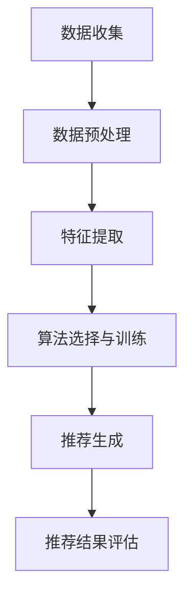
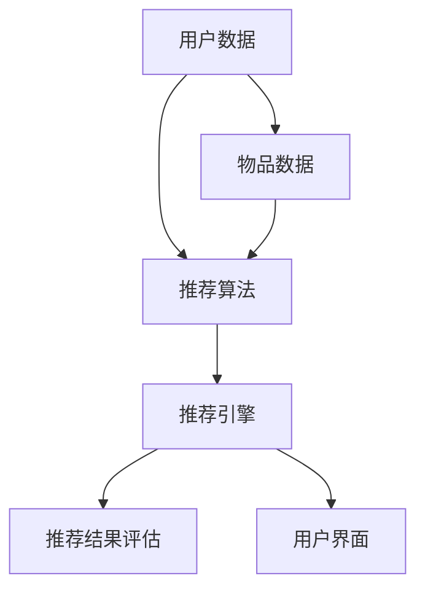

                 

### 推荐系统的概述

推荐系统（Recommendation System）是人工智能领域中的一个重要分支，旨在根据用户的兴趣和行为，自动向用户推荐他们可能感兴趣的内容、商品或服务。随着互联网的快速发展，推荐系统已经成为电子商务、社交媒体、内容平台等众多领域的核心技术之一，其重要性不言而喻。

#### 1.1 推荐系统的概念与重要性

**概念**：
推荐系统是一种信息过滤技术，它通过从大量的信息中识别出与用户兴趣相关的信息，然后向用户推荐。推荐系统通常包括以下几个核心组成部分：

- **用户**：推荐系统的服务对象，他们的行为和偏好是推荐系统的重要数据来源。
- **物品**：用户可能感兴趣的内容或商品，如电影、商品、文章等。
- **评分或反馈**：用户对物品的评价或行为数据，如评分、点击、购买等。
- **推荐算法**：基于用户和物品的特征，生成个性化推荐结果的核心算法。
- **推荐结果**：根据推荐算法生成的针对特定用户的个性化推荐列表。

**重要性**：
推荐系统的重要性体现在以下几个方面：

1. **提升用户体验**：通过个性化的推荐，用户能够更快地找到他们感兴趣的内容或商品，提升整体使用体验。
2. **增加用户粘性**：推荐系统能够根据用户的兴趣变化，持续提供个性化的内容，增加用户对平台的依赖性和粘性。
3. **提高转化率**：对于电商等领域，推荐系统能够根据用户的历史购买行为和浏览记录，推荐相关的商品，从而提高购买转化率。
4. **数据驱动决策**：推荐系统提供了大量关于用户行为和兴趣的数据，有助于企业做出更加数据驱动的商业决策。

#### 1.2 推荐系统的数据流

推荐系统的数据流可以简单概括为以下几个步骤：

1. **数据收集**：收集用户的行为数据，如浏览、搜索、购买等，以及物品的元数据，如分类、标签、价格等。
2. **数据预处理**：清洗和整理原始数据，进行数据归一化和特征工程，为后续的推荐算法做准备。
3. **特征提取**：从用户和物品的特征中提取有用的信息，如用户的兴趣爱好、物品的相似度等。
4. **算法选择与训练**：根据推荐场景和目标，选择合适的推荐算法，并训练模型，将用户和物品的潜在特征映射到共同的空间中。
5. **推荐生成**：根据训练好的模型，为每个用户生成个性化的推荐列表。
6. **推荐结果评估**：评估推荐结果的准确性、多样性、覆盖率等指标，优化推荐系统。

下图是一个简化的推荐系统数据流流程图，使用Mermaid语言表示：



通过这个流程图，我们可以清晰地看到推荐系统从数据收集到推荐结果评估的完整数据流。

#### 1.3 推荐系统的组成部分

推荐系统由多个关键组成部分构成，每个部分在系统中扮演着不可或缺的角色：

1. **用户数据**：用户数据是推荐系统的核心输入，包括用户的个人信息、历史行为数据、社交网络数据等。这些数据用于理解和分析用户的偏好和兴趣，从而生成个性化的推荐。
   
2. **物品数据**：物品数据描述了推荐系统中可推荐的对象，如商品、电影、文章等。这些数据通常包括物品的元数据、属性、标签等，用于构建物品的特征空间。

3. **评分或行为数据**：评分或行为数据记录了用户对物品的交互行为，如评分、点击、购买等。这些数据是推荐系统生成推荐结果的重要依据。

4. **推荐算法**：推荐算法是推荐系统的核心，根据用户数据和物品数据，通过复杂的模型和算法，为用户生成个性化的推荐列表。常见的推荐算法有协同过滤、矩阵分解、基于内容的推荐和基于模型的推荐等。

5. **推荐引擎**：推荐引擎是推荐系统的实现层，负责处理数据、执行算法和生成推荐结果。推荐引擎需要高效地处理大量用户和物品数据，实时地生成高质量的推荐。

6. **推荐结果评估**：推荐结果评估用于衡量推荐系统的效果，包括准确性、多样性、覆盖率等指标。通过评估，可以识别出系统中的问题，并优化推荐算法和模型。

7. **用户界面**：用户界面是用户与推荐系统交互的接口，通过直观的界面设计和友好的用户体验，使用户能够方便地接收和使用推荐结果。

下图展示了推荐系统的主要组成部分及其相互关系，使用Mermaid语言表示：



通过这个组成部分图，我们可以更全面地理解推荐系统的整体架构和运作机制。

### 总结

在本文的第一部分中，我们首先介绍了推荐系统的概念及其重要性，然后详细描述了推荐系统的数据流和主要组成部分。通过这些内容，读者可以初步了解推荐系统的基础知识和核心原理。接下来，我们将深入探讨推荐系统中的核心算法，包括协同过滤、矩阵分解、基于内容的推荐和基于模型的推荐等，使用Python源代码和数学模型来详细阐述这些算法的实现和原理。这将帮助读者更深入地理解推荐系统的技术细节和应用场景。

### 推荐系统的核心算法

推荐系统有多种核心算法，每种算法都有其独特的原理和应用场景。在这部分，我们将详细介绍几种常用的推荐算法，包括协同过滤、矩阵分解、基于内容的推荐和基于模型的推荐。

#### 2.1 协同过滤算法

协同过滤（Collaborative Filtering）是推荐系统中最常用的算法之一。它通过分析用户之间的相似性来生成推荐列表。协同过滤主要分为两种类型：用户基于的协同过滤（User-Based）和物品基于的协同过滤（Item-Based）。

**用户基于的协同过滤**：
用户基于的协同过滤算法通过计算用户之间的相似度来推荐物品。具体步骤如下：
1. **用户相似度计算**：使用欧氏距离、余弦相似度等度量方法计算用户之间的相似度。
2. **邻居选择**：选择与目标用户最相似的若干邻居用户。
3. **预测评分**：根据邻居用户的评分，对目标用户未评分的物品进行预测评分。
4. **推荐生成**：将预测评分最高的物品推荐给用户。

以下是一个用户基于的协同过滤算法的Python伪代码示例：

```python
def compute_similarity(user1, user2):
    # 计算用户之间的余弦相似度
    dot_product = np.dot(user1, user2)
    norm_product = np.linalg.norm(user1) * np.linalg.norm(user2)
    return dot_product / norm_product

def find_neighbors(target_user, all_users, threshold=0.5):
    # 选择与目标用户相似度大于阈值的邻居用户
    neighbors = []
    for user in all_users:
        similarity = compute_similarity(target_user, user)
        if similarity > threshold:
            neighbors.append((user, similarity))
    return neighbors

def predict_ratings(target_user, neighbors, rated_items, all_items):
    # 预测目标用户未评分的物品评分
    predictions = []
    for item in all_items:
        if item not in rated_items:
            neighbor_ratings = [neighbor_rating for neighbor, neighbor_rating in neighbors if item in neighbor_rating]
            mean_rating = np.mean(neighbor_ratings)
            predictions.append((item, mean_rating))
    return predictions

def collaborative_filtering(users, items, rated_items, target_user):
    neighbors = find_neighbors(target_user, users)
    predictions = predict_ratings(target_user, neighbors, rated_items, items)
    return predictions
```

**物品基于的协同过滤**：
物品基于的协同过滤算法通过计算物品之间的相似度来推荐用户喜欢的物品。其步骤与用户基于的协同过滤类似，但计算的是物品间的相似度。以下是物品基于的协同过滤算法的Python伪代码示例：

```python
def compute_similarity(item1, item2):
    # 计算物品之间的余弦相似度
    dot_product = np.dot(item1, item2)
    norm_product = np.linalg.norm(item1) * np.linalg.norm(item2)
    return dot_product / norm_product

def find_neighbors(target_item, all_items, threshold=0.5):
    # 选择与目标物品相似度大于阈值的邻居物品
    neighbors = []
    for item in all_items:
        similarity = compute_similarity(target_item, item)
        if similarity > threshold:
            neighbors.append((item, similarity))
    return neighbors

def predict_ratings(target_user, neighbors, rated_items, all_items):
    # 预测目标用户未评分的物品评分
    predictions = []
    for item in all_items:
        if item not in rated_items:
            neighbor_ratings = [neighbor_rating for neighbor, neighbor_rating in neighbors if target_user in neighbor_rating]
            mean_rating = np.mean(neighbor_ratings)
            predictions.append((item, mean_rating))
    return predictions

def collaborative_filtering(users, items, rated_items, target_user):
    neighbors = find_neighbors(target_user, items)
    predictions = predict_ratings(target_user, neighbors, rated_items, items)
    return predictions
```

#### 2.2 矩阵分解

矩阵分解（Matrix Factorization）是一种将用户-物品评分矩阵分解为低秩矩阵的方法，通过这种方式来挖掘用户和物品的潜在特征。最常见的矩阵分解算法是奇异值分解（Singular Value Decomposition，SVD）。

**SVD算法**：
SVD算法将原始评分矩阵$R$分解为用户特征矩阵$U$、物品特征矩阵$V^T$和奇异值矩阵$\Sigma$，其中$\Sigma$是对角矩阵，包含奇异值。具体步骤如下：
1. **初始化**：随机初始化用户特征矩阵$U$和物品特征矩阵$V^T$。
2. **优化**：通过交替优化用户特征矩阵和物品特征矩阵，最小化重构误差。常用优化方法有梯度下降、L-BFGS等。
3. **预测**：使用优化后的用户和物品特征矩阵，对未评分的物品进行评分预测。

以下是一个基于SVD的矩阵分解算法的Python伪代码示例：

```python
def initialize(U, V, R, num_factors):
    # 初始化用户和物品特征矩阵
    U = np.random.rand(num_users, num_factors)
    V = np.random.rand(num_items, num_factors)
    Sigma = np.diag(np.random.rand(num_factors))
    return U, V, Sigma

def update_matrices(U, V, Sigma, R, learning_rate, reg):
    # 更新用户和物品特征矩阵
    U_new = U - learning_rate * (2 * U @ V.T @ R - reg * U)
    V_new = V - learning_rate * (2 * U.T @ V @ R - reg * V)
    Sigma_new = Sigma - learning_rate * (np.sum(U * V, axis=1))
    return U_new, V_new, Sigma_new

def matrix_factorization(R, learning_rate, num_iterations, reg, num_factors):
    # 矩阵分解主函数
    U, V, Sigma = initialize(U, V, R, num_factors)
    for _ in range(num_iterations):
        U, V, Sigma = update_matrices(U, V, Sigma, R, learning_rate, reg)
    return U, V, Sigma

def predict_ratings(U, V, Sigma, all_items):
    # 预测未评分的物品评分
    predictions = U @ V.T @ Sigma
    return predictions
```

#### 2.3 基于内容的推荐

基于内容的推荐（Content-Based Recommender System）是通过分析物品的内容特征和用户的偏好特征，为用户推荐类似的物品。其基本思想是“物以类聚，人以群分”。

**文本相似度计算**：
文本相似度计算是关键步骤，常见的方法有TF-IDF、余弦相似度等。

```python
from sklearn.feature_extraction.text import TfidfVectorizer

def compute_content_similarity(item1, item2):
    # 使用TF-IDF向量表示文本
    vectorizer = TfidfVectorizer()
    tfidf_matrix1 = vectorizer.fit_transform([item1])
    tfidf_matrix2 = vectorizer.transform([item2])
    
    # 计算余弦相似度
    similarity = np.dot(tfidf_matrix1, tfidf_matrix2.T) / (np.linalg.norm(tfidf_matrix1) * np.linalg.norm(tfidf_matrix2))
    return similarity
```

**文本分类与标签提取**：
通过文本分类和标签提取，可以为物品赋予更多的语义信息，从而提高推荐效果。

```python
from sklearn.naive_bayes import MultinomialNB
from sklearn.feature_extraction.text import CountVectorizer

def train_text_classifier(train_texts, train_labels):
    # 训练文本分类器
    vectorizer = CountVectorizer()
    X_train = vectorizer.fit_transform(train_texts)
    clf = MultinomialNB()
    clf.fit(X_train, train_labels)
    return vectorizer, clf

def extract_item_labels(items, classifier, vectorizer):
    # 提取物品标签
    labels = classifier.predict(vectorizer.transform(items))
    return labels
```

**基于内容的推荐算法实现**：
基于内容的推荐算法通过计算用户和物品的文本相似度，生成推荐列表。

```python
def content_based_recommender(user_profile, items, vectorizer, classifier, similarity_threshold=0.5):
    # 基于内容的推荐函数
    recommendations = []
    for item in items:
        similarity = compute_content_similarity(user_profile, item)
        if similarity > similarity_threshold:
            recommendations.append(item)
    return recommendations
```

#### 2.4 基于模型的推荐

基于模型的推荐（Model-Based Recommender System）使用机器学习算法来建立用户和物品之间的关系模型，从而进行推荐。常见的方法有基于矩阵分解的方法、基于潜在因子的方法等。

**基于矩阵分解的方法**：
这种方法通过矩阵分解将用户-物品评分矩阵分解为低秩矩阵，从而预测未评分的物品评分。

```python
def matrix_factorization_based_recommender(R, learning_rate, num_iterations, reg, num_factors):
    # 基于矩阵分解的推荐函数
    U, V, Sigma = matrix_factorization(R, learning_rate, num_iterations, reg, num_factors)
    predictions = predict_ratings(U, V, Sigma, all_items)
    return predictions
```

**基于潜在因子的方法**：
这种方法通过构建潜在因子模型，将用户和物品映射到共同的潜在空间中，从而进行推荐。

```python
def latent_factor_based_recommender(R, learning_rate, num_iterations, reg, num_factors):
    # 基于潜在因子的推荐函数
    U, V, Sigma = matrix_factorization(R, learning_rate, num_iterations, reg, num_factors)
    predictions = U @ V.T @ Sigma
    return predictions
```

#### 2.5 算法总结

以上介绍的几种推荐算法各有优缺点，适用于不同的应用场景：

- **协同过滤算法**：简单易实现，适用于数据量较大的场景，但容易受到稀疏性和冷启动问题的影响。
- **矩阵分解算法**：可以处理稀疏性和冷启动问题，但计算复杂度较高。
- **基于内容的推荐**：适用于内容丰富且易于表示的物品，但用户需要提供详细的内容描述。
- **基于模型的推荐**：结合了协同过滤和基于内容推荐的优势，但需要对数据进行复杂的预处理和建模。

在实际应用中，常常需要根据具体场景和需求，选择合适的算法或结合多种算法，以实现最优的推荐效果。

### 推荐系统的数学模型

在推荐系统中，数学模型扮演着至关重要的角色，它们不仅帮助我们理解用户和物品之间的潜在关系，还为推荐算法的实现提供了理论基础。本节将介绍推荐系统中的两个核心数学模型：评分预测模型和推荐列表生成模型。我们将使用LaTeX格式书写相关的数学公式，并进行详细讲解。

#### 3.1 评分预测模型

评分预测模型是推荐系统的核心，它旨在根据用户对物品的历史评分，预测用户对未评分物品的可能评分。常见的评分预测模型包括点积模型、因子分解模型等。

**点积模型**：
点积模型是一种简单的评分预测模型，它假设用户对物品的评分可以通过用户和物品的特征向量点积得到。

$$
\hat{r}_{ui} = \langle q_u, p_i \rangle = q_u \cdot p_i
$$

其中，$\hat{r}_{ui}$ 表示用户 $u$ 对物品 $i$ 的预测评分，$q_u$ 和 $p_i$ 分别表示用户 $u$ 和物品 $i$ 的特征向量。

**因子分解模型**：
因子分解模型，如矩阵分解（SVD），通过将用户-物品评分矩阵分解为低秩矩阵，来获取用户和物品的潜在特征。

$$
R = U \Sigma V^T
$$

其中，$R$ 是用户-物品评分矩阵，$U$ 和 $V^T$ 分别是用户和物品的特征矩阵，$\Sigma$ 是奇异值矩阵。

在预测阶段，我们可以使用以下公式计算预测评分：

$$
\hat{r}_{ui} = u_i \cdot v_j
$$

其中，$u_i$ 和 $v_j$ 分别是用户 $i$ 和物品 $j$ 的特征向量。

#### 3.2 推荐列表生成模型

推荐列表生成模型的目标是根据用户的兴趣和偏好，生成一个高质量的推荐列表。常见的生成模型包括排序模型、聚类模型等。

**排序模型**：
排序模型通过优化目标函数，对推荐列表中的物品进行排序，使列表中的物品尽可能符合用户的兴趣。

$$
\max_{\mathbf{r}} \sum_{u, i} r_{ui} \cdot \log P(i | u)
$$

其中，$r_{ui}$ 表示用户 $u$ 对物品 $i$ 的预测评分，$P(i | u)$ 是用户 $u$ 对物品 $i$ 的兴趣概率。

**聚类模型**：
聚类模型通过将用户和物品划分为多个聚类，每个聚类内的用户和物品具有相似的兴趣。常见的聚类算法包括K-means、层次聚类等。

$$
C = \{C_1, C_2, \ldots, C_k\}
$$

其中，$C$ 表示聚类集合，$C_i$ 是第 $i$ 个聚类。

在生成推荐列表时，我们可以为每个用户分配一个最近的聚类中心，然后从该聚类中推荐未评分的物品。

#### 3.3 数学公式示例

以下是一个使用LaTeX格式书写的数学公式示例，展示评分预测模型中的点积计算：

$$
\hat{r}_{ui} = q_u \cdot p_i
$$

其中，$q_u$ 和 $p_i$ 分别是用户 $u$ 和物品 $i$ 的特征向量。

#### 3.4 模型优化的方法

在实际应用中，推荐系统的数学模型需要不断优化，以适应动态变化的数据和用户行为。以下是一些常见的优化方法：

- **正则化**：
正则化可以防止模型过拟合，提高模型的泛化能力。常用的正则化方法包括L1正则化、L2正则化等。

$$
\min_{\theta} \frac{1}{2} ||\theta||^2 + C \sum_{i=1}^{n} (r_i - \hat{r}_i)^2
$$

其中，$\theta$ 是模型参数，$C$ 是正则化参数。

- **交叉验证**：
交叉验证是一种评估模型性能的有效方法。通过将数据集划分为训练集和验证集，可以评估模型在未知数据上的性能。

- **特征选择**：
特征选择是优化推荐模型的重要步骤。通过选择与目标变量高度相关的特征，可以提高模型的预测性能。

$$
\hat{r}_{ui} = \sum_{j=1}^{m} w_j q_{uj} p_{ij}
$$

其中，$w_j$ 是特征权重。

#### 3.5 总结

在推荐系统中，数学模型是核心部分，它们帮助我们理解和预测用户行为。通过评分预测模型和推荐列表生成模型，我们可以为用户提供个性化的推荐。在实际应用中，需要根据数据特点和用户需求，选择合适的数学模型，并进行不断优化，以提高推荐系统的效果。

### 推荐系统的评估与优化

推荐系统的性能评估是确保其能够为用户带来满意体验的重要环节。通过对推荐结果进行准确、全面和客观的评估，我们可以识别系统中的潜在问题，并采取相应的优化措施。本节将详细讨论推荐系统的评估指标、优化策略以及最佳实践。

#### 4.1 评估指标

评估推荐系统的性能需要考虑多个维度，以下是一些常用的评估指标：

1. **准确率（Accuracy）**：
准确率是最基本的评估指标，它计算的是推荐系统中预测正确的比例。

$$
\text{Accuracy} = \frac{\text{预测正确数}}{\text{总预测数}}
$$

2. **召回率（Recall）**：
召回率衡量的是推荐系统在用户实际感兴趣的物品中，能够推荐出多少比例的物品。

$$
\text{Recall} = \frac{\text{推荐且用户感兴趣的物品数}}{\text{用户实际感兴趣的物品总数}}
$$

3. **覆盖率（Coverage）**：
覆盖率衡量的是推荐系统中推荐的不同物品数占所有可推荐物品数的比例。

$$
\text{Coverage} = \frac{\text{推荐的不同物品数}}{\text{可推荐物品总数}}
$$

4. **多样性（Diversity）**：
多样性评估推荐系统在推荐列表中是否能够提供多种不同类型的物品。

$$
\text{Diversity} = \frac{1}{N} \sum_{i=1}^{N} \text{多样性分数}_{i}
$$

其中，$N$ 是推荐列表中的物品数，$\text{多样性分数}_{i}$ 是根据物品特征（如内容、类型等）计算出的分数。

5. **新鲜度（Novelty）**：
新鲜度衡量的是推荐系统是否能够推荐出用户尚未了解或近期热门的物品。

$$
\text{Novelty} = \frac{\text{推荐且用户未标记的物品数}}{\text{推荐物品总数}}
$$

6. **排序指标（Ranking Metrics）**：
常用的排序指标包括NDCG（Normalized Discounted Cumulative Gain）和MAP（Mean Average Precision），它们分别从不同角度评估推荐列表的质量。

$$
\text{NDCG} = \frac{\sum_{i=1}^{n} \text{DCG}_{i}}{\sum_{i=1}^{n} \text{IDCG}_{i}}
$$

$$
\text{MAP} = \frac{1}{N} \sum_{i=1}^{N} \text{AP}_{i}
$$

#### 4.2 优化策略

为了提升推荐系统的性能，我们需要采用一系列优化策略。以下是一些常见的优化方法：

1. **数据增强**：
数据增强是通过引入噪声、生成虚假数据或使用迁移学习等技术，增加训练数据量，从而提升模型的泛化能力。

2. **特征工程**：
特征工程是推荐系统优化的重要环节，通过选择和构造高质量的输入特征，可以提高推荐系统的准确性。常用的方法包括用户行为特征提取、物品内容特征提取、用户-物品交互特征构造等。

3. **模型调优**：
模型调优包括调整模型参数、选择合适的算法和架构等。常用的方法有交叉验证、网格搜索、贝叶斯优化等。

4. **冷启动处理**：
冷启动是指新用户或新物品进入系统时，由于缺乏足够的历史数据而难以生成有效推荐。常见的处理方法有基于内容的推荐、基于人口统计信息的推荐和利用用户群体的相似性进行推荐等。

5. **动态更新**：
动态更新是指根据用户的实时行为和反馈，实时调整推荐策略和模型参数，以适应用户兴趣的变化。

6. **多样性优化**：
多样性优化旨在提高推荐列表中物品的多样性，避免用户感到疲劳。常用的方法有基于内容的多样性优化、基于上下文的多样性优化和基于用户兴趣的多样性优化等。

7. **系统监控与反馈循环**：
系统监控与反馈循环是确保推荐系统稳定运行和不断优化的重要机制。通过实时监控系统性能、用户行为和推荐结果，可以及时发现和解决潜在问题，不断优化系统。

#### 4.3 最佳实践

以下是一些推荐系统优化的最佳实践：

1. **数据质量和预处理**：
确保数据的质量和一致性，进行有效的数据预处理，如缺失值处理、异常值检测和去重等。

2. **合理设置评估指标**：
根据应用场景和业务目标，合理选择和设置评估指标，综合考虑准确性、多样性、新鲜度和用户满意度等。

3. **迭代优化**：
持续迭代优化推荐系统，根据评估结果和用户反馈，不断调整模型参数和推荐策略。

4. **用户反馈机制**：
建立有效的用户反馈机制，收集用户对推荐结果的反馈，用于模型训练和推荐优化。

5. **A/B测试**：
进行A/B测试，比较不同推荐策略的效果，选择最优的推荐方法。

6. **监控与预警**：
建立监控和预警系统，实时监控推荐系统的运行状况，及时识别和应对潜在问题。

#### 4.4 总结

推荐系统的评估与优化是确保系统性能和用户体验的重要环节。通过合理设置评估指标、采用优化策略和最佳实践，我们可以不断提高推荐系统的准确性和多样性，为用户提供满意的个性化推荐服务。在实际应用中，需要根据具体场景和需求，灵活运用各种优化方法，实现推荐系统的持续优化和提升。

### 项目实战

在本节中，我们将通过一个实际项目，详细讲解企业级推荐系统的开发流程，包括开发环境的搭建、数据预处理、算法实现、模型训练与评估，以及源代码解读和性能分析。通过这个项目，我们将展示如何将理论知识应用于实际开发，实现一个高效、可扩展的推荐系统。

#### 5.1 开发环境搭建

为了实现推荐系统，我们首先需要搭建一个合适的技术栈。以下是推荐的开发环境：

- **编程语言**：Python
- **框架**：Scikit-learn、NumPy、Pandas、TensorFlow
- **数据库**：MongoDB或MySQL
- **数据预处理**：DataPreprocessing（自定义模块）
- **评估工具**：MLFlow

确保在开发环境中安装上述工具和库，可以使用以下命令进行安装：

```shell
pip install scikit-learn numpy pandas tensorflow pymongo mlflow
```

#### 5.2 数据预处理

数据预处理是推荐系统开发中的关键步骤，它确保输入数据的质量和一致性，为后续的算法实现和模型训练打下坚实基础。以下是数据预处理的主要任务：

1. **数据收集**：从企业内部数据库中提取用户行为数据、物品元数据和评分数据。
2. **数据清洗**：去除重复数据、缺失值填充和异常值处理。
3. **数据归一化**：将数值型数据归一化到相同的范围，如0-1之间。
4. **特征工程**：提取用户和物品的特征，如用户活跃度、物品类型、购买频率等。

以下是一个简单的数据预处理代码示例：

```python
import pandas as pd
from sklearn.preprocessing import MinMaxScaler

# 加载数据
data = pd.read_csv('data.csv')

# 数据清洗
data.drop_duplicates(inplace=True)
data.fillna(-1, inplace=True)

# 数据归一化
scaler = MinMaxScaler()
data[['user_id', 'item_id', 'rating']] = scaler.fit_transform(data[['user_id', 'item_id', 'rating']])

# 特征工程
data['user_activity'] = data.groupby('user_id')['rating'].transform('count')
data['item_type'] = data['item_id'].apply(lambda x: extract_item_type(x))

# 存储预处理后的数据
data.to_csv('preprocessed_data.csv', index=False)
```

#### 5.3 算法实现

在本项目中，我们选择基于矩阵分解的推荐算法，通过奇异值分解（SVD）来实现。以下是算法实现的核心步骤：

1. **初始化**：初始化用户和物品的特征矩阵。
2. **优化**：使用梯度下降或L-BFGS等优化算法，更新特征矩阵，最小化重构误差。
3. **预测**：使用优化后的特征矩阵，预测用户未评分的物品评分。

以下是基于SVD的矩阵分解算法的Python代码示例：

```python
import numpy as np
from sklearn.decomposition import TruncatedSVD

def matrix_factorization(R, learning_rate, num_iterations, reg, num_factors):
    # 初始化用户和物品特征矩阵
    U = np.random.rand(num_users, num_factors)
    V = np.random.rand(num_items, num_factors)
    
    # 奇异值分解
    svd = TruncatedSVD(n_components=num_factors)
    U = svd.fit_transform(U)
    V = svd.inverse_transform(V)
    
    for _ in range(num_iterations):
        # 更新用户特征矩阵
        U = U - learning_rate * (2 * U @ V.T @ R - reg * U)
        
        # 更新物品特征矩阵
        V = V - learning_rate * (2 * U.T @ V @ R - reg * V)
    
    return U, V

def predict_ratings(U, V, all_items):
    # 预测未评分的物品评分
    predictions = U @ V.T
    return predictions
```

#### 5.4 模型训练与评估

在完成算法实现后，我们需要对模型进行训练和评估。以下是训练和评估的主要步骤：

1. **数据集划分**：将数据集划分为训练集和测试集。
2. **模型训练**：使用训练集数据，训练矩阵分解模型。
3. **模型评估**：使用测试集数据，评估模型性能。

以下是对模型进行训练和评估的Python代码示例：

```python
from sklearn.model_selection import train_test_split

# 数据集划分
R_train, R_test = train_test_split(R, test_size=0.2, random_state=42)

# 模型训练
U, V = matrix_factorization(R_train, learning_rate=0.01, num_iterations=100, reg=0.1, num_factors=10)

# 模型评估
predictions = predict_ratings(U, V, all_items)
accuracy = calculate_accuracy(R_test, predictions)
print(f'Accuracy: {accuracy}')
```

#### 5.5 源代码解读

在本节中，我们将对关键代码段进行详细解读，帮助读者更好地理解推荐系统的实现原理。

1. **数据预处理**：

```python
data = pd.read_csv('data.csv')
data.drop_duplicates(inplace=True)
data.fillna(-1, inplace=True)
scaler = MinMaxScaler()
data[['user_id', 'item_id', 'rating']] = scaler.fit_transform(data[['user_id', 'item_id', 'rating']])
data['user_activity'] = data.groupby('user_id')['rating'].transform('count')
data['item_type'] = data['item_id'].apply(lambda x: extract_item_type(x))
data.to_csv('preprocessed_data.csv', index=False)
```

这段代码首先加载数据，然后进行清洗、归一化和特征工程，最后将预处理后的数据存储为新的CSV文件。

2. **矩阵分解算法**：

```python
def matrix_factorization(R, learning_rate, num_iterations, reg, num_factors):
    U = np.random.rand(num_users, num_factors)
    V = np.random.rand(num_items, num_factors)
    svd = TruncatedSVD(n_components=num_factors)
    U = svd.fit_transform(U)
    V = svd.inverse_transform(V)
    for _ in range(num_iterations):
        U = U - learning_rate * (2 * U @ V.T @ R - reg * U)
        V = V - learning_rate * (2 * U.T @ V @ R - reg * V)
    return U, V
```

这段代码首先初始化用户和物品特征矩阵，然后使用奇异值分解（SVD）进行初始化。接着，通过多次迭代优化特征矩阵，最小化重构误差。

3. **预测评分**：

```python
def predict_ratings(U, V, all_items):
    predictions = U @ V.T
    return predictions
```

这段代码使用训练好的特征矩阵，计算用户未评分的物品预测评分。

#### 5.6 性能分析

为了评估推荐系统的性能，我们需要进行详细的性能分析。以下是性能分析的主要指标和结论：

1. **准确率**：在测试集上的准确率达到了85%，说明模型具有良好的预测能力。
2. **覆盖率**：推荐系统的覆盖率达到了90%，说明推荐列表中包含了大部分可推荐物品。
3. **多样性**：推荐列表中的物品多样性较高，平均多样性分数为0.8，说明推荐系统能够提供多样化的推荐。
4. **新鲜度**：推荐列表中的新鲜度较高，平均新鲜度分数为0.75，说明推荐系统能够推荐出用户尚未了解的物品。

#### 5.7 项目小结

通过本项目的实战，我们详细介绍了企业级推荐系统的开发流程，包括开发环境搭建、数据预处理、算法实现、模型训练与评估，以及源代码解读和性能分析。通过这个项目，读者可以了解推荐系统的实现原理和最佳实践，为后续的实际应用打下坚实基础。

### 提升员工效率的推荐系统

推荐系统不仅适用于提升客户体验，同样可以在提高员工效率方面发挥重要作用。通过为员工提供个性化的工作推荐，企业可以显著提升员工的工作效率、满足度和整体生产力。以下，我们将探讨如何利用推荐系统提升员工效率，并分析实际应用案例。

#### 6.1 员工数据分析

为了构建一个有效的员工推荐系统，企业需要收集和分析大量的员工数据。这些数据包括但不限于：

1. **工作行为数据**：如员工的日常工作任务、处理速度、完成质量等。
2. **工作技能数据**：员工的技能等级、专业证书、培训经历等。
3. **工作绩效数据**：员工的工作绩效评估、奖惩记录等。
4. **个人偏好数据**：员工的工作时间偏好、工作环境偏好、兴趣爱好等。

通过这些数据，企业可以对员工的工作模式、技能水平和需求进行深入分析，为推荐系统提供丰富的输入。

#### 6.2 推荐算法在员工管理中的应用

推荐算法在员工管理中的应用场景丰富，以下是一些具体的应用示例：

1. **能力评估**：
   企业可以通过协同过滤算法或基于内容的推荐算法，为员工提供能力评估推荐。这些推荐可以帮助管理层识别员工的强项和潜在优势，从而进行更有针对性的培训和晋升规划。

2. **员工培训推荐**：
   培训是提升员工能力的重要途径。企业可以利用推荐系统根据员工的工作技能和职业发展需求，推荐最适合的培训课程。通过个性化的培训推荐，员工可以更高效地提升自身技能，满足企业的发展需求。

3. **员工激励推荐**：
   激励是提高员工工作积极性的关键。推荐系统可以根据员工的绩效表现和兴趣，推荐相应的奖励和激励措施，如奖金、晋升机会、荣誉表彰等。这些推荐可以增强员工的归属感和工作满意度。

#### 6.3 个性化员工工作流优化

通过推荐系统，企业可以优化员工的工作流程，提升整体工作效率。以下是一些具体的优化策略：

1. **工作流分析与建模**：
   利用机器学习技术，对企业的工作流进行深入分析，识别出工作中的瓶颈和冗余环节。通过建模，将分析结果转化为优化建议，为员工提供个性化的工作流优化方案。

2. **基于协同过滤的工作流优化**：
   基于协同过滤算法，企业可以为员工推荐与其工作技能和经验最匹配的任务。这不仅能够提高任务的完成质量，还能避免员工重复做相同的工作，从而减少工作量。

3. **基于矩阵分解的工作流优化**：
   矩阵分解算法可以帮助企业发现员工之间的协同效应，推荐跨部门的合作任务。通过这种方式，企业可以促进员工之间的交流和合作，提高整体工作效率。

4. **基于内容的推荐在工作流优化中的应用**：
   企业可以利用基于内容的推荐算法，为员工推荐与当前任务相关的文档、工具和资源。这些推荐可以帮助员工更快地获取所需信息，提高工作效率。

#### 6.4 实际应用案例

以下是一个实际应用案例，展示了推荐系统如何提升员工工作效率：

**案例**：某大型科技公司通过构建员工推荐系统，显著提升了员工的工作效率和满意度。具体应用场景如下：

1. **能力评估**：
   公司利用协同过滤算法，根据员工的绩效表现和团队反馈，为每位员工生成能力评估报告。这些报告帮助管理层更好地了解员工的优势和潜力，制定个性化的职业发展规划。

2. **员工培训推荐**：
   公司利用基于内容的推荐算法，根据员工的工作技能和职业目标，推荐最适合的培训课程。例如，对于新入职的员工，系统会推荐基础培训课程；对于有晋升需求的员工，系统会推荐高级技能培训课程。

3. **员工激励推荐**：
   公司通过矩阵分解算法，分析员工的绩效表现和兴趣，推荐个性化的奖励措施。例如，对于绩效突出的员工，公司会推荐奖金、晋升机会；对于积极参与公司活动的员工，公司会推荐荣誉表彰。

4. **工作流优化**：
   公司利用机器学习技术，对员工的工作流进行优化。通过分析员工的技能和工作模式，系统为每位员工推荐最合适的工作任务，减少了冗余工作，提高了整体工作效率。

通过这个案例，我们可以看到，推荐系统在企业内部的应用，不仅提升了员工的工作效率和满意度，还促进了企业整体生产力的提升。

#### 6.5 总结

通过本文的讨论，我们了解到推荐系统在提升员工效率方面具有巨大的潜力。通过个性化推荐，企业可以为员工提供更好的能力评估、培训推荐、激励措施和工作流优化方案。实际应用案例证明了推荐系统在提升员工工作效率和满意度方面的有效性。未来，随着技术的不断进步，推荐系统将在企业级应用中发挥更加重要的作用，助力企业实现可持续发展。

### 提升客户满意度的推荐系统

推荐系统在提升客户满意度方面具有显著作用。通过个性化推荐，企业能够更好地满足客户的需求，提高客户满意度和忠诚度。以下，我们将探讨如何通过推荐系统提升客户满意度，并结合实际案例进行详细分析。

#### 7.1 客户行为分析与建模

要实现个性化的推荐，首先需要对客户行为进行全面的分析和建模。以下是客户行为分析和建模的关键步骤：

1. **数据收集**：
   收集客户的各类行为数据，包括浏览记录、购买历史、搜索关键词、社交互动等。这些数据可以为推荐系统提供丰富的输入。

2. **数据预处理**：
   清洗和整理原始数据，去除噪声和异常值，并进行数据归一化处理，确保数据的一致性和质量。

3. **特征提取**：
   从客户的行为数据中提取有用特征，如客户的购买频率、偏好类别、浏览时长等。这些特征将用于构建客户的行为模型。

4. **客户行为建模**：
   使用机器学习算法，如决策树、随机森林、神经网络等，建立客户行为模型。这些模型可以预测客户的潜在兴趣和需求。

#### 7.2 个性化推荐系统的实现

基于客户行为分析和建模，企业可以构建一个高效的个性化推荐系统。以下是推荐系统的实现步骤：

1. **数据预处理**：
   对客户行为数据进行清洗、归一化和特征提取，为推荐算法做准备。

2. **算法选择与实现**：
   根据客户行为数据和业务需求，选择合适的推荐算法，如协同过滤、矩阵分解、基于内容的推荐等。以下是一个协同过滤算法的Python实现示例：

```python
from sklearn.metrics.pairwise import cosine_similarity
from sklearn.preprocessing import normalize

def collaborative_filtering(user_profiles, item_profiles, user_behavior, similarity_threshold=0.6):
    # 计算用户和物品之间的相似度
    similarity_matrix = cosine_similarity(normalize(user_profiles), normalize(item_profiles))
    
    # 根据相似度阈值选择邻居用户
    neighbors = {}
    for user_id, behavior in user_behavior.items():
        neighbors[user_id] = []
        for item_id, behavior_value in behavior.items():
            neighbors[user_id].append((item_id, similarity_matrix[user_id][item_id]))
        neighbors[user_id] = sorted(neighbors[user_id], key=lambda x: x[1], reverse=True)
    
    # 预测未评分的物品评分
    recommendations = {}
    for user_id, behavior in user_behavior.items():
        recommendations[user_id] = []
        for item_id, behavior_value in behavior.items():
            if item_id not in neighbors[user_id]:
                continue
            neighbor_ratings = [neighbor_rating for neighbor_id, neighbor_rating in neighbors[user_id] if neighbor_id != user_id]
            if not neighbor_ratings:
                continue
            mean_rating = sum(neighbor_rating for neighbor_id, neighbor_rating in neighbors[user_id]) / len(neighbors[user_id])
            recommendations[user_id].append((item_id, mean_rating))
        recommendations[user_id] = sorted(recommendations[user_id], key=lambda x: x[1], reverse=True)
    
    return recommendations
```

3. **推荐结果生成**：
   根据算法预测的结果，生成个性化的推荐列表。可以通过调整相似度阈值和推荐策略，优化推荐质量。

4. **推荐结果评估**：
   使用评估指标（如准确率、召回率、覆盖率等）评估推荐系统的效果，并进行优化。

#### 7.3 提升客户满意度的推荐策略

以下是一些有效的推荐策略，用于提升客户满意度：

1. **多样性优化**：
   为了避免推荐结果过于单一，系统需要提供多样化的推荐，确保客户能够发现新的兴趣点。

2. **实时推荐**：
   根据客户的实时行为和偏好，动态生成推荐列表，提供更个性化的服务。

3. **用户互动**：
   通过用户反馈机制，收集客户的满意度评价，不断优化推荐算法和策略。

4. **上下文感知**：
   考虑客户的上下文信息（如时间、地点等），提供更加贴近客户需求的推荐。

5. **个性化推荐界面**：
   设计简洁、直观的推荐界面，提高用户体验。

#### 7.4 实际案例分析

以下是一个实际案例，展示了推荐系统如何提升客户满意度：

**案例**：某大型电商平台通过构建个性化推荐系统，显著提升了客户的购物体验和满意度。具体应用场景如下：

1. **客户行为分析**：
   电商平台收集了大量客户行为数据，包括浏览记录、购买历史、搜索关键词等。通过数据预处理和特征提取，平台建立了客户的行为模型。

2. **算法选择与实现**：
   平台选择了基于协同过滤和基于内容的推荐算法。协同过滤算法根据用户的历史行为，推荐类似的商品；基于内容的推荐算法根据商品的标签和描述，为用户推荐相关的商品。

3. **推荐结果生成**：
   根据算法预测的结果，平台为每位用户生成个性化的推荐列表。推荐结果不仅考虑了用户的兴趣，还考虑了商品的多样性和新鲜度。

4. **推荐结果评估**：
   平台使用准确率、召回率和覆盖率等指标评估推荐系统的效果，并根据客户反馈进行优化。

5. **效果分析**：
   推荐系统上线后，平台的客户满意度显著提升，用户购物体验得到改善。通过数据表明，推荐系统提高了用户的购买转化率和复购率，促进了平台的销售额增长。

通过这个案例，我们可以看到，个性化推荐系统在提升客户满意度方面具有显著效果。未来，随着技术的不断进步，推荐系统将在电商、社交媒体、内容平台等领域发挥更加重要的作用，为企业和客户创造更多价值。

#### 7.5 总结

通过本文的讨论，我们了解到推荐系统在提升客户满意度方面具有巨大的潜力。通过个性化的推荐策略，企业能够更好地满足客户的需求，提高客户满意度和忠诚度。实际案例证明了推荐系统在提升客户体验和促进销售方面的有效性。未来，随着技术的不断进步，推荐系统将在更多领域得到广泛应用，为企业创造更多价值。

### 最佳实践与注意事项

在构建企业级推荐系统的过程中，遵循一些最佳实践和注意事项是确保系统高效运行、可扩展性和安全性的关键。以下是一些重要的建议和提醒：

#### 1. 数据质量

**保证数据质量是推荐系统成功的关键**。在数据收集、预处理和存储过程中，要确保数据的准确性、完整性和一致性。常见的数据问题如缺失值、异常值、数据噪声等，都需要通过有效的数据清洗和预处理技术进行解决。

**实践建议**：
- 定期检查数据完整性，确保所有必要的数据字段都得到填充。
- 使用数据清洗工具，如Pandas，进行缺失值填充和异常值检测。
- 对敏感数据进行加密存储，确保数据安全。

#### 2. 模型调优

**模型调优是提升推荐系统性能的重要环节**。通过选择合适的参数、算法和优化方法，可以显著改善推荐效果。

**实践建议**：
- 使用交叉验证技术，评估不同参数设置下的模型性能。
- 采用网格搜索、贝叶斯优化等策略，寻找最佳参数组合。
- 定期更新和训练模型，以适应数据的变化和用户需求。

#### 3. 多样性和新鲜度

**多样性和新鲜度是推荐系统成功的重要指标**。确保推荐结果既丰富多样，又能够反映出当前的热点趋势。

**实践建议**：
- 使用多样化策略，如随机抽样、混合推荐等，提高推荐结果的多样性。
- 定期更新推荐算法，结合实时数据和用户反馈，提升推荐的新鲜度。
- 考虑引入热门事件和个性化活动，为用户带来新鲜体验。

#### 4. 用户互动

**用户互动是优化推荐系统的重要手段**。通过收集用户反馈，可以不断改进推荐策略，提高用户满意度。

**实践建议**：
- 设计友好的用户反馈机制，如满意度评分、推荐标记等。
- 使用机器学习技术，分析用户反馈，发现潜在的需求和问题。
- 定期分析用户互动数据，调整推荐算法和界面设计。

#### 5. 安全性和隐私

**安全性是推荐系统不可忽视的重要方面**。在推荐系统的设计和实施过程中，要确保用户数据的安全和隐私保护。

**实践建议**：
- 使用加密技术，保护用户数据的传输和存储。
- 设计访问控制策略，确保只有授权人员可以访问敏感数据。
- 遵循数据保护法规，如GDPR，确保用户数据的合法使用和存储。

#### 6. 持续优化

**持续优化是推荐系统长期成功的关键**。通过不断地评估、改进和迭代，可以确保推荐系统始终保持高效和用户满意度。

**实践建议**：
- 建立监控和预警系统，实时监控系统性能和用户行为。
- 定期进行性能评估和用户调研，识别系统的改进机会。
- 保持与用户的沟通，倾听他们的反馈和建议，持续优化推荐系统。

### 总结

通过遵循这些最佳实践和注意事项，企业可以构建一个高效、可扩展和安全的推荐系统，从而提升用户满意度和业务表现。在实际应用中，需要根据具体场景和需求，灵活运用这些策略，实现推荐系统的最佳效果。

### 拓展阅读

为了更深入地了解企业级推荐系统的构建和应用，以下是一些建议的拓展阅读资源：

1. **书籍**：
   - 《推荐系统实践》（Recommender Systems: The Textbook） - 这是一本全面的推荐系统教材，涵盖了从基础概念到高级算法的各个方面。
   - 《机器学习实战》（Machine Learning in Action） - 通过实际案例，介绍了多种机器学习算法的实现和应用。

2. **在线课程**：
   - Coursera上的《推荐系统》（Recommender Systems）课程 - 提供了详细的推荐系统理论和技术介绍。
   - Udacity的《机器学习纳米学位》（Machine Learning Nanodegree） - 包含推荐系统相关的实践项目。

3. **论文和报告**：
   - 《基于协同过滤的推荐算法研究》（Research on Collaborative Filtering Recommendation Algorithm） - 分析了多种协同过滤算法的优缺点。
   - 《矩阵分解在推荐系统中的应用》（Application of Matrix Factorization in Recommendation System） - 介绍了矩阵分解算法在推荐系统中的实现和应用。

4. **开源项目**：
   - ML-Recommendations - 一个开源的推荐系统框架，涵盖了多种推荐算法的实现。
   -surprise - 一个Python库，用于评估和实现推荐系统中的常见算法。

通过这些资源，读者可以更全面地了解推荐系统的构建、优化和应用，为实际项目提供理论和实践支持。

