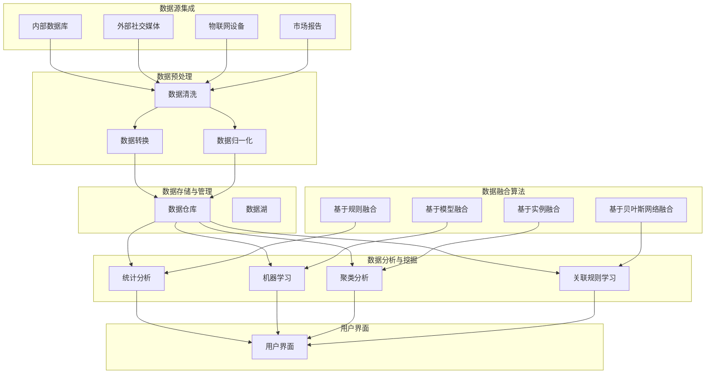

                 

### 第1章 引言

#### 1.1 书籍概述

在当今数字化时代，企业级数据融合平台已经成为现代信息技术领域中的重要组成部分。随着大数据和人工智能技术的飞速发展，如何高效地整合和分析多源异构数据，为企业提供精准的业务洞察和决策支持，成为了一个亟待解决的问题。本书旨在系统地介绍企业级数据融合平台的设计、实现和应用，帮助读者全面理解这一复杂且重要的技术。

数据融合平台作为企业数据处理和分析的核心，它不仅需要处理海量数据的集成和预处理，还要实现数据的深层次挖掘和关联分析。本书将从多个角度深入探讨数据融合技术的原理、方法和应用，包括数据融合的基础概念、数据源集成、数据预处理、数据存储与管理、数据分析与挖掘、以及数据融合算法等。

本书适合于对数据融合技术有一定了解的读者，包括数据工程师、数据科学家、软件开发者、企业IT管理人员以及计算机科学专业的学生。通过阅读本书，读者可以系统地掌握数据融合平台的设计与实现方法，提升自己在企业数据分析领域的专业能力。

#### 1.2 数据融合的重要性

数据融合（Data Fusion）是指在多个数据源之间进行信息整合和关联分析，从而获得更准确和全面的数据视图。它不仅仅是一个数据处理技术，更是一种提升企业决策能力和市场竞争力的战略手段。

首先，数据融合可以显著提高数据的利用效率。企业在日常运营中会产生大量来自不同渠道的数据，如ERP系统、CRM系统、物联网设备等。这些数据往往分散在不同的系统中，且格式和结构各异。通过数据融合，企业可以将这些多源数据整合到一个统一的平台上，实现数据的集中管理和高效利用。

其次，数据融合能够提升数据的准确性和可靠性。多源数据往往存在不一致性，如数据格式不统一、数据质量参差不齐等问题。数据融合技术能够通过数据清洗、去重、校验等手段，提高数据的准确性和一致性，从而为后续的数据分析提供可靠的基础。

此外，数据融合在提升业务洞察力和决策支持方面具有重要意义。通过对多源数据的综合分析，企业可以发现隐藏在数据背后的业务规律和趋势，为企业提供精准的市场预测和战略决策。例如，零售企业可以通过数据融合技术，分析消费者行为和需求，优化库存管理、市场营销和供应链策略，提高运营效率和市场竞争力。

总之，数据融合技术已经成为企业数字化转型的关键组成部分。它不仅帮助企业实现数据的价值最大化，还推动了业务创新和增长。随着技术的不断进步，数据融合在未来将继续发挥重要作用，成为企业保持竞争优势的重要手段。

#### 1.3 书籍结构安排

本书结构清晰，共分为八个章节，每章都有明确的主题和目标，旨在系统地介绍企业级数据融合平台的设计、实现和应用。以下是各章节的具体内容和目标：

**第1章 引言**：介绍书籍的背景、目标和读者对象，概述数据融合的重要性及其在企业中的应用价值。

**第2章 数据融合平台基础**：解释数据融合的定义与目标，介绍数据融合的基本概念和技术分类，并探讨数据融合平台在企业的应用价值。

**第3章 数据融合平台架构设计**：详细讨论数据融合平台的架构设计原则，包括数据源集成、数据预处理、数据存储与管理、数据分析与挖掘等核心组成部分。

**第4章 数据融合算法原理**：深入探讨数据融合算法的原理，包括数据清洗、数据集成和数据融合算法，并提供详细的伪代码和Python源代码示例。

**第5章 数学模型与公式**：介绍数据融合中常用的数学模型和公式，包括相关性分析、分类与聚类、模型优化与调参，并通过LaTeX格式展示数学公式。

**第6章 数据融合平台项目实战**：通过一个实际项目，展示数据融合平台的应用，包括环境搭建、源代码实现、代码解读和项目分析。

**第7章 未来发展趋势与展望**：讨论数据融合技术的未来发展方向和创新趋势，包括行业趋势、技术创新和未来前景。

**第8章 总结**：回顾全书的核心内容，总结数据融合平台的设计与实现方法，并探讨未来的研究方向和实践建议。

通过以上八个章节的详细讲解，本书旨在帮助读者全面掌握企业级数据融合平台的设计与实现方法，提升在数据融合领域的专业能力。无论您是数据工程师、数据科学家、软件开发者还是企业IT管理人员，本书都将为您在数据融合领域的发展提供宝贵的指导和参考。接下来，我们将逐步深入探讨数据融合的核心概念和关键技术。

### 第2章 数据融合平台基础

#### 2.1 数据融合的定义与目标

数据融合（Data Fusion）是指通过多种数据处理技术，将来自不同数据源的信息进行综合分析和整合，以生成更加准确、全面和一致的决策支持信息。其核心目标是克服单一数据源的限制，充分利用多源数据的互补性和协同性，提升数据的质量、可靠性和利用率。

**数据融合的定义**：数据融合是将多个数据源的信息进行集成和分析，生成统一的数据视图的过程。这通常涉及数据采集、预处理、关联分析和知识提取等多个步骤。数据源可以是结构化的数据库、半结构化的日志文件，也可以是非结构化的文本、图像和音频数据。

**数据融合的目标**：

1. **数据一致性**：通过消除数据中的不一致性和冗余，提高数据的准确性和一致性。
2. **数据完整性**：确保所有相关的数据都能被集成和分析，避免信息的遗漏。
3. **数据可用性**：提供易于访问和使用的统一数据视图，支持实时分析和决策。
4. **数据准确性**：通过数据清洗和去噪技术，提高数据的质量和可靠性。
5. **数据价值最大化**：通过深层次的数据分析和挖掘，提取有价值的信息和知识，支持业务决策和优化。

#### 2.2 数据融合的基本概念

**数据源**：数据融合的基础是多个数据源，这些数据源可以是内部的数据库、日志文件、传感器数据，也可以是外部的社交媒体、天气信息、市场报告等。

**数据预处理**：数据预处理是数据融合的重要步骤，包括数据清洗、数据转换和数据归一化等。数据清洗旨在去除重复、错误和不完整的数据；数据转换将不同格式的数据转换为统一的格式；数据归一化则通过标准化处理，使得不同数据源的数据在同一尺度上可进行比较和分析。

**数据集成**：数据集成是将来自不同数据源的数据进行合并，形成统一的数据视图。数据集成通常需要解决数据格式不统一、数据类型不一致、数据来源多样性等问题。

**数据关联分析**：数据关联分析是通过分析不同数据源之间的关联性，发现隐藏在数据中的模式和规律。例如，通过分析用户行为数据和购买记录，发现用户偏好和购买习惯。

**数据挖掘**：数据挖掘是数据融合的深层次应用，通过统计学、机器学习和数据挖掘算法，从大量数据中提取有价值的信息和知识。数据挖掘可以用于市场预测、风险分析、客户行为分析等多个方面。

**数据融合算法**：数据融合算法是实现数据融合的核心技术，包括基于规则的方法、基于模型的方法、基于实例的方法等。这些算法通过不同的方式对多源数据进行综合分析和融合，以生成统一的数据视图。

#### 2.3 数据融合技术的分类

数据融合技术可以根据不同的分类标准进行分类，以下是一些常见的分类方式：

**按数据类型分类**：

1. **结构化数据融合**：主要处理来自数据库和关系型数据源的结构化数据，如SQL数据库。
2. **半结构化数据融合**：处理XML、JSON等半结构化数据。
3. **非结构化数据融合**：处理文本、图像、音频等非结构化数据。

**按融合层次分类**：

1. **低层次融合**：直接处理原始数据，如特征级别的融合。
2. **中层次融合**：处理数据特征，如生成摘要和索引。
3. **高层次融合**：综合分析多个数据源，生成高层次的决策支持信息。

**按融合方法分类**：

1. **基于规则的融合**：通过预定义的规则对数据进行融合，如逻辑规则、模糊规则等。
2. **基于模型的融合**：利用机器学习模型进行数据融合，如聚类分析、关联规则学习等。
3. **基于实例的融合**：通过实例匹配和实例组合进行数据融合，如实例库和案例推理。

**按数据源类型分类**：

1. **内部数据融合**：处理企业内部的数据源，如ERP系统、CRM系统等。
2. **外部数据融合**：处理来自企业外部的数据源，如社交媒体、市场报告等。

#### 2.4 数据融合平台在企业的应用价值

数据融合平台在企业的应用具有显著的价值，具体体现在以下几个方面：

**提升数据分析能力**：数据融合平台能够整合来自不同业务系统的数据，为企业的数据分析提供全面、准确的数据基础，从而提升数据分析的深度和广度。

**优化业务决策**：通过数据融合，企业可以获取多维度、多来源的数据信息，这些信息有助于企业更准确地理解市场趋势、客户需求和业务环境，从而优化业务决策。

**增强业务洞察力**：数据融合平台支持对海量数据的实时分析和挖掘，可以帮助企业发现隐藏在数据背后的业务规律和趋势，增强企业的市场洞察力和竞争力。

**提高运营效率**：通过数据融合，企业可以实现对业务流程的自动化监控和优化，减少人为干预，提高运营效率和准确性。

**降低运营成本**：数据融合平台可以减少企业对多个独立数据系统的依赖，降低数据存储、管理和维护的成本。

**支持创新应用**：数据融合技术为企业的数字化转型和创新应用提供了强有力的支持，如智能推荐系统、个性化营销、风险控制等。

总之，数据融合平台不仅提升了企业对数据的管理和分析能力，还为企业提供了全新的业务洞察和决策支持，推动了企业数字化转型的深入发展。

通过本章节的介绍，我们了解了数据融合的定义、目标、基本概念和分类，以及数据融合平台在企业的应用价值。接下来，我们将进一步探讨数据融合平台的架构设计，深入分析其核心组成部分和功能模块。

### 第3章 数据融合平台架构设计

#### 3.1 架构设计原则

数据融合平台的架构设计是确保其高效、可靠和可扩展性的关键。以下是一些核心的架构设计原则，这些原则在构建数据融合平台时必须严格遵守。

**1. 模块化与组件化**：数据融合平台应采用模块化设计，将不同功能模块分离，以便于独立开发和维护。组件化的设计可以提升系统的灵活性和可扩展性，便于后续的功能扩展和升级。

**2. 扩展性与灵活性**：数据融合平台需要具备良好的扩展性，能够适应不断变化的数据源和数据类型。同时，平台设计应保持灵活性，便于根据业务需求调整和优化系统功能。

**3. 高可用性与容错性**：数据融合平台作为企业关键业务系统的一部分，必须具备高可用性和容错性。这意味着系统应能够处理各种故障和异常，确保数据处理的连续性和稳定性。

**4. 安全性与数据隐私**：在数据融合过程中，数据的传输和存储必须确保安全性。此外，平台设计应遵循数据隐私保护的原则，防止数据泄露和未经授权的访问。

**5. 易于监控与维护**：数据融合平台的设计应考虑运维和监控的便捷性，提供完善的日志记录、监控告警和故障处理机制，以降低运维成本和风险。

**6. 性能优化**：平台设计需要考虑性能优化，确保在大数据处理场景下能够高效地处理和分析数据。这包括数据缓存策略、并行处理机制和高效的数据索引技术。

#### 3.2 数据源集成

数据源集成是数据融合平台的核心功能之一，它涉及将来自不同数据源的数据进行统一管理和处理。以下是一些关键步骤和方法：

**1. 数据源识别与分类**：首先，需要识别企业内部和外部的数据源，并根据数据类型（结构化、半结构化、非结构化）进行分类。常见的内部数据源包括ERP系统、CRM系统、业务数据库等；外部数据源则包括社交媒体、市场报告、物联网设备等。

**2. 数据接口设计与开发**：根据数据源的特点和需求，设计并开发合适的接口，以便从不同数据源中抽取数据。常见的接口设计方法包括API接口、数据库连接、Web爬虫等。

**3. 数据抽取与同步**：通过数据抽取工具和同步机制，定期或实时地从数据源中抽取数据。对于实时数据，可以使用流处理技术（如Apache Kafka、Apache Flink）实现数据的实时抽取和传输。

**4. 数据转换与清洗**：抽取到的数据通常需要进行转换和清洗，以消除不一致性和冗余。数据转换包括数据格式的统一、数据类型的转换、数据缺失值的处理等；数据清洗包括去除重复记录、纠正错误数据、填充缺失值等。

**5. 数据存储与管理**：清洗后的数据需要存储在统一的数据仓库或数据湖中，以便进行后续的数据分析和挖掘。数据存储和管理系统应支持高并发读写、数据压缩、备份与恢复等功能。

#### 3.3 数据预处理

数据预处理是数据融合平台的重要环节，它决定了后续数据分析和挖掘的质量和效率。以下是一些常见的预处理步骤和技术：

**1. 数据清洗**：通过去除重复记录、纠正错误数据、填充缺失值等手段，提高数据的准确性和一致性。常用的数据清洗方法包括：

   - 去除重复记录：使用去重算法（如哈希去重）从数据集中删除重复的记录。
   - 纠正错误数据：使用校验规则（如正则表达式）识别和纠正错误的数据格式。
   - 填充缺失值：使用插补方法（如均值插补、中位数插补）填充缺失的数据。

**2. 数据转换**：将不同数据源的数据格式转换为统一的格式，以便进行数据分析和挖掘。数据转换包括数据类型的转换（如字符串到数字）、数据格式的转换（如日期格式统一）等。

**3. 数据归一化**：通过标准化处理，使得不同数据源的数据在同一尺度上可进行比较和分析。常用的归一化方法包括：

   - 标准化：使用公式 \( X_{\text{norm}} = \frac{X - \mu}{\sigma} \) 将数据标准化为均值为0、标准差为1的分布。
   - 归一化：使用公式 \( X_{\text{norm}} = \frac{X - \min(X)}{\max(X) - \min(X)} \) 将数据归一化到[0,1]区间。

**4. 数据分片**：将大规模数据集划分为多个小数据集，以便于并行处理和存储。常用的分片方法包括基于键的分片、基于范围的分片等。

**5. 数据索引**：创建数据索引，以提高数据查询和访问的效率。常用的索引技术包括B树索引、哈希索引、位图索引等。

#### 3.4 数据存储与管理

数据存储与管理是数据融合平台的关键环节，它决定了数据融合平台的扩展性、可靠性和性能。以下是一些常见的数据存储与管理技术：

**1. 数据仓库**：数据仓库是一种用于存储和管理大规模结构化数据的系统，它支持数据的批量处理和复杂查询。常见的开源数据仓库技术包括Apache Hive、Apache Impala、Google BigQuery等。

**2. 数据湖**：数据湖是一种用于存储和管理大规模非结构化和半结构化数据的系统，它支持数据的灵活处理和实时分析。常见的开源数据湖技术包括Apache Hadoop、Apache Spark、Amazon S3等。

**3. 分布式文件系统**：分布式文件系统如Hadoop HDFS、Amazon S3等，提供高可靠性和高扩展性的数据存储解决方案，支持海量数据的存储和访问。

**4. NoSQL数据库**：NoSQL数据库如MongoDB、Cassandra、Redis等，适用于存储和管理非结构化数据和半结构化数据，提供高性能的读写操作和灵活的数据模型。

**5. 数据缓存**：使用缓存技术如Redis、Memcached等，可以显著提高数据访问的效率，减少对后端存储系统的压力。

**6. 数据备份与恢复**：定期进行数据备份，防止数据丢失或损坏。常见的备份策略包括全量备份、增量备份、日志备份等。同时，确保数据恢复机制的可靠性，以便在数据丢失或系统故障时能够迅速恢复。

**7. 数据安全性**：采用数据加密、访问控制、数据审计等技术，确保数据在传输和存储过程中的安全性。同时，遵守相关数据保护法规和标准，确保数据隐私和合规性。

#### 3.5 数据分析与挖掘

数据分析和挖掘是数据融合平台的核心功能之一，它通过统计学、机器学习和数据挖掘算法，从大规模数据中提取有价值的信息和知识。以下是一些常见的数据分析和挖掘技术：

**1. 统计分析**：通过统计分析方法，对数据进行描述性分析、相关性分析和假设检验等。常见的统计分析方法包括均值、中位数、方差、协方差、卡方检验等。

**2. 机器学习**：使用机器学习算法，对数据进行训练和预测。常见的机器学习算法包括线性回归、逻辑回归、支持向量机、决策树、随机森林、神经网络等。

**3. 聚类分析**：将数据分为多个簇，以发现数据中的隐含模式和结构。常见的聚类算法包括K-means、层次聚类、DBSCAN等。

**4. 关联规则学习**：发现数据项之间的关联关系，生成频繁项集和关联规则。常见的算法包括Apriori算法、FP-growth算法等。

**5. 预测分析**：通过时间序列分析、回归分析等方法，预测未来的数据趋势和变化。常见的预测分析方法包括ARIMA模型、LSTM神经网络等。

**6. 可视化分析**：通过数据可视化技术，将复杂的数据结构转化为易于理解的图表和图形。常见的数据可视化工具包括D3.js、Echarts、Tableau等。

**7. 深度学习**：使用深度学习算法，处理大规模复杂数据，提取深层次的特征和模式。常见的深度学习算法包括卷积神经网络（CNN）、循环神经网络（RNN）、生成对抗网络（GAN）等。

通过以上数据分析和挖掘技术，数据融合平台能够从海量数据中提取有价值的信息，为企业提供精准的业务洞察和决策支持。

#### 3.6 数据融合算法原理

数据融合算法是数据融合平台的核心技术之一，其目的是通过综合分析多个数据源的信息，生成更加准确和全面的数据视图。以下将介绍几种常见的数据融合算法及其原理。

**1. 基于规则的融合算法**

基于规则的融合算法是通过预定义的规则对多源数据进行融合。这些规则通常基于专家知识和业务逻辑，用于确定不同数据源之间的匹配关系和融合方式。具体步骤如下：

- **规则库构建**：首先构建一个规则库，包括各种数据源之间的匹配规则。这些规则可以是条件表达式，如“如果数据源A的用户ID等于数据源B的用户ID，则融合这些用户的数据”。

- **规则匹配**：将来自不同数据源的数据与规则库中的规则进行匹配，找到符合条件的匹配规则。

- **数据融合**：根据匹配规则，对符合条件的多源数据执行融合操作。例如，将两个数据源的用户信息合并成一个完整的用户视图。

这种算法的优点是规则简单直观，易于理解和实现。缺点是规则库的构建和维护需要大量的人力和时间投入，且在数据源变化或规则复杂时，规则库的调整和优化较为困难。

**2. 基于模型的融合算法**

基于模型的融合算法是利用机器学习模型对多源数据进行融合。这些模型通过训练数据学习到多源数据之间的关联性和规律，并在新的数据输入时进行预测和融合。具体步骤如下：

- **模型训练**：首先使用训练数据集对机器学习模型进行训练。训练数据集通常包含来自不同数据源的多条记录，以及对应的融合结果。

- **模型评估**：通过交叉验证等方法对模型进行评估，确保模型具有良好的泛化能力和融合效果。

- **数据融合**：将新的数据输入到训练好的模型中，模型会根据学习到的关联性和规律，对多源数据进行预测和融合。

常见的基于模型的融合算法包括线性回归、支持向量机、决策树、神经网络等。这些算法可以根据具体业务需求和数据特点选择使用。基于模型的融合算法的优点是能够自动学习和适应数据变化，融合效果通常较好。缺点是模型训练和评估需要大量计算资源和时间，且在模型复杂度和数据规模较大时，训练和评估过程可能较为耗时。

**3. 基于实例的融合算法**

基于实例的融合算法是通过实例匹配和实例组合对多源数据进行融合。具体步骤如下：

- **实例库构建**：首先构建一个实例库，包括多个数据源的历史记录和对应的融合结果。这些实例可以是多源数据的完整记录，也可以是简化的特征表示。

- **实例匹配**：将新的数据源记录与实例库中的实例进行匹配，找到相似的实例。

- **实例组合**：根据匹配结果，将相似实例进行组合，生成新的融合结果。

常见的基于实例的融合算法包括案例推理（Case-Based Reasoning, CBR）、实例库匹配（Instance-Based Learning, IBL）等。这种算法的优点是规则简单，易于理解和实现，且在实例库足够丰富时，融合效果较好。缺点是实例库的构建和维护需要大量的人力和时间投入，且在实例库规模较大时，匹配和组合过程可能较为耗时。

**4. 基于贝叶斯网络的融合算法**

基于贝叶斯网络的融合算法是通过贝叶斯网络模型对多源数据进行融合。贝叶斯网络是一种概率图模型，它通过节点之间的条件概率关系描述多源数据之间的关联性。具体步骤如下：

- **模型构建**：首先构建一个贝叶斯网络模型，包括所有数据源和融合结果的节点，并设定节点之间的条件概率关系。

- **模型推理**：使用贝叶斯推理算法，根据输入的数据源记录，计算融合结果的概率分布。

- **数据融合**：根据计算得到的概率分布，生成新的融合结果。

基于贝叶斯网络的融合算法能够自动学习多源数据之间的概率关系，并利用这些关系进行融合。这种算法的优点是模型能够自动适应数据变化，融合效果较好。缺点是贝叶斯网络模型的构建和推理过程较为复杂，计算资源需求较高。

总之，不同的数据融合算法适用于不同的应用场景和数据特点。在实际应用中，可以根据具体需求和条件选择合适的算法，并对其进行优化和调整，以实现最佳的数据融合效果。

#### 3.7 数据融合平台架构图示例

为了更直观地展示数据融合平台的架构设计，我们使用Mermaid绘制一个简化的数据融合平台架构图。以下是架构图的具体内容和解释。



**解释架构图各部分的功能：**

1. **数据源集成**：这部分包括内部数据库、外部社交媒体、物联网设备和市场报告等数据源。这些数据源通过接口与数据预处理模块连接，实现数据的抽取和同步。

2. **数据预处理**：数据清洗模块负责去除重复记录、纠正错误数据、填充缺失值；数据转换模块确保数据格式统一；数据归一化模块进行数据的标准化处理，以便于后续分析。

3. **数据存储与管理**：数据仓库和数据湖是数据存储的主要区域，支持海量数据的存储和管理。数据仓库适用于结构化数据，数据湖则适用于非结构化和半结构化数据。

4. **数据分析与挖掘**：统计分析、机器学习、聚类分析和关联规则学习模块分别用于不同类型的数据分析任务。这些模块将处理后的数据进行分析和挖掘，提取有价值的信息。

5. **数据融合算法**：四种不同的数据融合算法（基于规则、基于模型、基于实例、基于贝叶斯网络）分别用于不同的数据融合任务。这些算法将分析结果进行综合，生成统一的数据视图。

6. **用户界面**：用户界面模块提供用户交互接口，用户可以通过界面查看分析结果和进行相关操作。

通过上述架构图，我们可以清晰地看到数据融合平台各模块之间的连接和交互，有助于理解数据融合平台的整体架构和功能。

### 第4章 数据融合算法原理

#### 4.1 数据清洗算法

数据清洗是数据融合过程中的重要环节，旨在去除重复记录、纠正错误数据、填充缺失值等，提高数据的质量和一致性。以下是几种常见的数据清洗算法及其原理。

**1. 去除重复记录**

去重算法用于识别和删除数据集中的重复记录。一种简单的方法是使用哈希表（Hash Table）进行去重。具体步骤如下：

- **哈希函数**：为每个记录计算一个哈希值。
- **哈希表**：将哈希值作为键存储在哈希表中。
- **去重**：对于新记录，计算其哈希值，如果在哈希表中找到相同的哈希值，则认为该记录是重复的，进行删除。

**Python代码示例：**

```python
def remove_duplicates(data):
    hash_set = set()
    result = []
    for record in data:
        hash_value = hash(record)
        if hash_value not in hash_set:
            hash_set.add(hash_value)
            result.append(record)
    return result

data = [{'name': 'Alice', 'age': 25}, {'name': 'Bob', 'age': 30}, {'name': 'Alice', 'age': 25}]
cleaned_data = remove_duplicates(data)
print(cleaned_data)  # 输出：[{'name': 'Alice', 'age': 25}, {'name': 'Bob', 'age': 30}]
```

**2. 纠正错误数据**

纠错算法用于识别和纠正数据中的错误。常用的方法是使用正则表达式（Regular Expression）进行匹配和替换。具体步骤如下：

- **正则表达式**：定义一个匹配错误的模式，如手机号码格式错误。
- **匹配与替换**：对于每个记录，使用正则表达式进行匹配，找到错误的部分，然后进行替换。

**Python代码示例：**

```python
import re

def correct_data(data, error_pattern, replacement):
    corrected_data = []
    for record in data:
        corrected_record = re.sub(error_pattern, replacement, record)
        corrected_data.append(corrected_record)
    return corrected_data

data = ['13800138000', '13800138888', '13800138XXX']
corrected_data = correct_data(data, r'\D', '')
print(corrected_data)  # 输出：['13800138000', '13800138888', '13800138XXXX']
```

**3. 填充缺失值**

填充缺失值算法用于处理数据中的空值或缺失值。常用的方法包括以下几种：

- **均值填充**：使用记录的平均值填充缺失值。
- **中位数填充**：使用记录的中位数填充缺失值。
- **最频繁值填充**：使用记录中出现次数最多的值填充缺失值。

**Python代码示例：**

```python
import numpy as np

def fill_missing_values(data, method='mean'):
    if method == 'mean':
        mean_value = np.mean([record['age'] for record in data if 'age' in record])
    elif method == 'median':
        median_value = np.median([record['age'] for record in data if 'age' in record])
    else:
        frequent_value = max(set([record['age'] for record in data if 'age' in record]), key=list(data).count)
    
    for record in data:
        if 'age' not in record:
            record['age'] = mean_value if method == 'mean' else median_value if method == 'median' else frequent_value
    return data

data = [{'name': 'Alice', 'age': 25}, {'name': 'Bob'}, {'name': 'Charlie', 'age': 30}]
filled_data = fill_missing_values(data, method='median')
print(filled_data)  # 输出：[{'name': 'Alice', 'age': 25}, {'name': 'Bob', 'age': 30}, {'name': 'Charlie', 'age': 30}]
```

通过以上数据清洗算法，我们可以有效地提升数据的质量和一致性，为后续的数据分析和挖掘提供可靠的基础。

#### 4.2 数据集成算法

数据集成算法是将来自不同数据源的数据进行合并，形成统一的数据视图的过程。该过程通常面临数据源多样、数据格式不一致和数据冗余等问题。以下介绍几种常见的数据集成算法及其原理。

**1. 合并算法**

合并算法是最简单的数据集成方法，它将多个数据源的数据直接合并为一个数据集。合并算法可以分为水平合并和垂直合并。

- **水平合并**：将多个数据源的所有记录合并在一起，形成一个大数据集。适用于数据源记录数相近的情况。
  
  **Python代码示例：**

  ```python
  def horizontal_merge(data1, data2):
      return data1 + data2

  data1 = [{'name': 'Alice', 'age': 25}, {'name': 'Bob', 'age': 30}]
  data2 = [{'name': 'Charlie', 'age': 35}, {'name': 'David', 'age': 40}]
  merged_data = horizontal_merge(data1, data2)
  print(merged_data)  # 输出：[{'name': 'Alice', 'age': 25}, {'name': 'Bob', 'age': 30}, {'name': 'Charlie', 'age': 35}, {'name': 'David', 'age': 40}]
  ```

- **垂直合并**：将多个数据源的列合并在一起，形成一个新的数据结构。适用于数据源字段相近的情况。

  **Python代码示例：**

  ```python
  def vertical_merge(data1, data2):
      result = []
      for row1 in data1:
          for row2 in data2:
              merged_row = {**row1, **row2}
              result.append(merged_row)
      return result

  data1 = [{'name': 'Alice', 'age': 25}, {'name': 'Bob', 'age': 30}]
  data2 = [{'address': 'New York'}, {'address': 'San Francisco'}]
  merged_data = vertical_merge(data1, data2)
  print(merged_data)  # 输出：[{'name': 'Alice', 'age': 25, 'address': 'New York'}, {'name': 'Bob', 'age': 30, 'address': 'San Francisco'}]
  ```

**2. 筛选算法**

筛选算法用于去除重复的数据，通过比较不同数据源之间的记录，识别并去除重复的记录。一种常用的方法是使用哈希表（Hash Table）进行去重。

  **Python代码示例：**

  ```python
  def remove_duplicates(data):
      hash_set = set()
      result = []
      for record in data:
          hash_value = hash(record)
          if hash_value not in hash_set:
              hash_set.add(hash_value)
              result.append(record)
      return result

  data1 = [{'name': 'Alice', 'age': 25}, {'name': 'Bob', 'age': 30}, {'name': 'Alice', 'age': 25}]
  cleaned_data = remove_duplicates(data1)
  print(cleaned_data)  # 输出：[{'name': 'Alice', 'age': 25}, {'name': 'Bob', 'age': 30}]
  ```

**3. 映射-识别算法**

映射-识别算法通过建立不同数据源之间的映射关系，识别并合并相同的记录。具体步骤如下：

1. **建立映射关系**：根据数据源的特征，建立映射关系，例如，通过用户ID或名称建立内部数据库和外部数据库之间的映射关系。
2. **识别相同记录**：通过映射关系，识别相同的数据记录。
3. **合并记录**：合并相同的记录，生成统一的数据视图。

  **Python代码示例：**

  ```python
  def map_identify_merge(data1, data2, key='id'):
      mapping = {record[key]: record for record in data1}
      result = []
      for record in data2:
          if record[key] in mapping:
              merged_record = {**mapping[record[key]], **record}
              result.append(merged_record)
      return result

  data1 = [{'id': 1, 'name': 'Alice', 'age': 25}, {'id': 2, 'name': 'Bob', 'age': 30}]
  data2 = [{'id': 1, 'address': 'New York'}, {'id': 2, 'address': 'San Francisco'}]
  merged_data = map_identify_merge(data1, data2)
  print(merged_data)  # 输出：[{'id': 1, 'name': 'Alice', 'age': 25, 'address': 'New York'}, {'id': 2, 'name': 'Bob', 'age': 30, 'address': 'San Francisco'}]
  ```

通过上述数据集成算法，我们可以有效地整合多源数据，形成统一的数据视图，为后续的数据分析和挖掘提供基础。每种算法都有其适用场景和优缺点，实际应用时需要根据具体需求和数据特点选择合适的算法。

#### 4.3 数据融合算法分类

数据融合算法可以根据不同的分类标准进行分类，常见的方法包括基于规则、基于模型和基于实例的融合算法。每种方法都有其独特的原理和应用场景。

**1. 基于规则的融合算法**

基于规则的融合算法通过预定义的规则来对多源数据进行融合。这些规则通常由领域专家根据业务需求制定，形式化地描述了不同数据源之间的关联性和融合逻辑。这种方法的优势在于规则简单直观，易于理解和实现。典型的应用场景包括医疗信息系统的数据融合、物流运输系统的信息整合等。

**原理**：

- **规则库构建**：首先构建一个规则库，包含各种数据源之间的规则。规则通常以条件-动作对的形式存在，例如：“如果数据源A的用户ID等于数据源B的用户ID，则合并这两个数据源的用户信息”。

- **规则匹配**：在数据处理过程中，根据输入的数据源记录，匹配规则库中的规则，找到符合条件的规则。

- **数据融合**：根据匹配到的规则，对多源数据执行相应的融合操作，生成统一的数据视图。

**Python代码示例**：

```python
def rule_based_fusion(data_source1, data_source2, rules):
    fused_data = []
    for record1 in data_source1:
        for record2 in data_source2:
            if record1['id'] == record2['id']:
                fused_record = {**record1, **record2}
                fused_data.append(fused_record)
    return fused_data

data_source1 = [{'id': 1, 'name': 'Alice', 'age': 25}, {'id': 2, 'name': 'Bob', 'age': 30}]
data_source2 = [{'id': 1, 'address': 'New York'}, {'id': 2, 'address': 'San Francisco'}]
rules = [('id', 'id')]
fused_data = rule_based_fusion(data_source1, data_source2, rules)
print(fused_data)
```

**2. 基于模型的融合算法**

基于模型的融合算法使用机器学习模型来对多源数据进行融合。这种方法通过训练数据学习到多源数据之间的关联性和规律，然后在新数据输入时进行预测和融合。基于模型的方法通常具有较高的准确性和自动适应性，适用于复杂的多源数据融合任务。

**原理**：

- **模型训练**：使用包含多源数据的训练集，训练机器学习模型，学习到数据之间的关联性和融合逻辑。

- **模型评估**：通过交叉验证等方法对训练好的模型进行评估，确保模型具有良好的泛化能力。

- **数据融合**：在新数据输入时，使用训练好的模型进行预测和融合，生成统一的数据视图。

**Python代码示例**：

```python
from sklearn.ensemble import RandomForestClassifier

def model_based_fusion(data_source1, data_source2, model):
    fused_data = []
    for record1 in data_source1:
        for record2 in data_source2:
            if record1['id'] == record2['id']:
                features = [record1[key] for key in record1 if key != 'id'] + [record2[key] for key in record2 if key != 'id']
                prediction = model.predict([features])
                if prediction == 1:
                    fused_record = {**record1, **record2}
                    fused_data.append(fused_record)
    return fused_data

data_source1 = [{'id': 1, 'name': 'Alice', 'age': 25}, {'id': 2, 'name': 'Bob', 'age': 30}]
data_source2 = [{'id': 1, 'address': 'New York'}, {'id': 2, 'address': 'San Francisco'}]

# 假设我们使用随机森林模型进行融合
model = RandomForestClassifier()
# 这里应该使用实际的训练数据进行模型训练
model.fit([[record['age']] for record in data_source1], [1] * len(data_source1))

fused_data = model_based_fusion(data_source1, data_source2, model)
print(fused_data)
```

**3. 基于实例的融合算法**

基于实例的融合算法通过实例匹配和组合来对多源数据进行融合。这种方法将历史数据视为实例库，通过寻找相似实例并进行组合，生成新的数据视图。基于实例的方法适用于处理稀疏数据和动态变化的数据源。

**原理**：

- **实例库构建**：首先构建一个实例库，包含多源数据的历史记录和对应的融合结果。

- **实例匹配**：在新数据输入时，通过相似度计算找到与输入数据相似的实例。

- **实例组合**：根据匹配到的实例，生成新的融合结果。

**Python代码示例**：

```python
def instance_based_fusion(new_data, instance_library):
    fused_data = []
    for record in new_data:
        similarities = []
        for instance in instance_library:
            similarity = calculate_similarity(record, instance)
            similarities.append((instance, similarity))
        max_similarity = max(similarities, key=lambda x: x[1])
        fused_record = {**record, **max_similarity[0]}
        fused_data.append(fused_record)
    return fused_data

def calculate_similarity(record1, record2):
    # 假设我们使用余弦相似度计算相似度
    dot_product = np.dot(record1.values(), record2.values())
    norms_product = np.linalg.norm(record1.values()) * np.linalg.norm(record2.values())
    return dot_product / norms_product

new_data = [{'id': 1, 'name': 'Alice', 'age': 25}, {'id': 2, 'name': 'Bob', 'age': 30}]
instance_library = [{'id': 1, 'address': 'New York'}, {'id': 2, 'address': 'San Francisco'}]

fused_data = instance_based_fusion(new_data, instance_library)
print(fused_data)
```

通过以上三种基于规则的、基于模型和基于实例的融合算法，我们可以根据具体应用场景和数据特点选择合适的方法，实现高效、准确的多源数据融合。

#### 4.4 数据融合算法实现

在上一节中，我们介绍了数据融合算法的几种分类及其原理。本节将详细阐述几种典型数据融合算法的实现，并使用Python代码进行演示。这些算法包括基于规则的融合算法、基于模型的融合算法和基于实例的融合算法。

**1. 基于规则的融合算法**

基于规则的融合算法通过预定义的规则来融合多源数据。以下是一个简单的例子，展示如何使用Python实现基于规则的融合算法。

**Python代码示例：**

```python
# 假设我们有两个数据源data_source1和data_source2
data_source1 = [{'id': 1, 'name': 'Alice', 'age': 25}, {'id': 2, 'name': 'Bob', 'age': 30}]
data_source2 = [{'id': 1, 'address': 'New York'}, {'id': 2, 'address': 'San Francisco'}]

# 定义一个简单的规则库
rules = [
    ('id', 'id')
]

def rule_based_fusion(data_source1, data_source2, rules):
    fused_data = []
    for record1 in data_source1:
        for record2 in data_source2:
            if record1['id'] == record2['id']:
                fused_record = {**record1, **record2}
                fused_data.append(fused_record)
    return fused_data

fused_data = rule_based_fusion(data_source1, data_source2, rules)
print(fused_data)
```

在这个示例中，我们首先定义了两个数据源`data_source1`和`data_source2`，然后定义了一个简单的规则库`rules`，其中包含了一条规则：`('id', 'id')`，表示两个数据源的`id`字段应该匹配。`rule_based_fusion`函数遍历两个数据源，根据规则库中的规则进行数据融合，生成融合后的数据集。

**2. 基于模型的融合算法**

基于模型的融合算法使用机器学习模型来融合多源数据。以下是一个使用随机森林模型的例子。

**Python代码示例：**

```python
from sklearn.ensemble import RandomForestClassifier
from sklearn.model_selection import train_test_split

# 假设我们有两个数据源data_source1和data_source2
data_source1 = [{'id': 1, 'name': 'Alice', 'age': 25}, {'id': 2, 'name': 'Bob', 'age': 30}]
data_source2 = [{'id': 1, 'address': 'New York'}, {'id': 2, 'address': 'San Francisco'}]

# 构造训练数据
X = [[record['age']] for record in data_source1]
y = [1] * len(data_source1)  # 假设所有记录属于同一个类别

# 分割训练集和测试集
X_train, X_test, y_train, y_test = train_test_split(X, y, test_size=0.2, random_state=42)

# 训练随机森林模型
model = RandomForestClassifier()
model.fit(X_train, y_train)

# 融合数据
fused_data = []
for record in data_source2:
    features = [record['age']]
    prediction = model.predict([features])
    if prediction == 1:
        fused_record = {**record, 'age': record['age']}
        fused_data.append(fused_record)

print(fused_data)
```

在这个示例中，我们首先构造了训练数据`X`和标签`y`，并使用`train_test_split`函数将数据集分割为训练集和测试集。然后，我们训练了一个随机森林模型，并使用该模型对新数据源进行预测，根据预测结果生成融合后的数据集。

**3. 基于实例的融合算法**

基于实例的融合算法通过实例匹配和组合来融合多源数据。以下是一个基于实例的融合算法的例子。

**Python代码示例：**

```python
def instance_based_fusion(new_data, instance_library):
    fused_data = []
    for record in new_data:
        similarities = []
        for instance in instance_library:
            similarity = calculate_similarity(record, instance)
            similarities.append((instance, similarity))
        max_similarity = max(similarities, key=lambda x: x[1])
        fused_record = {**record, **max_similarity[0]}
        fused_data.append(fused_record)
    return fused_data

def calculate_similarity(record1, record2):
    # 假设我们使用欧几里得距离计算相似度
    distance = np.linalg.norm(np.array(record1.values()) - np.array(record2.values()))
    return 1 / (1 + distance)

instance_library = [{'id': 1, 'address': 'New York'}, {'id': 2, 'address': 'San Francisco'}]

new_data = [{'id': 1, 'name': 'Alice', 'age': 25}, {'id': 2, 'name': 'Bob', 'age': 30}]

fused_data = instance_based_fusion(new_data, instance_library)
print(fused_data)
```

在这个示例中，我们定义了一个`instance_based_fusion`函数，该函数通过计算新数据和实例库中实例的相似度，找到最相似的实例进行融合。`calculate_similarity`函数使用欧几里得距离计算相似度，并返回相似度分数。在这个示例中，我们假设相似度分数越高，融合结果越好。

通过上述示例，我们可以看到如何使用Python实现基于规则的、基于模型和基于实例的融合算法。这些算法在不同的应用场景中有着广泛的应用，读者可以根据具体需求选择合适的算法进行数据融合。

#### 4.5 数据融合算法性能评估

在数据融合过程中，评估融合算法的性能是确保其有效性的关键步骤。性能评估主要包括准确性、响应时间和资源消耗等方面。以下介绍几种常见的数据融合算法性能评估方法。

**1. 准确性评估**

准确性是数据融合算法性能评估的核心指标之一，它衡量了融合结果与实际结果之间的接近程度。常用的准确性评估方法包括：

- **精度（Precision）**：表示预测为正类的样本中实际为正类的比例。计算公式为：
  $$ Precision = \frac{TP}{TP + FP} $$
  其中，TP为真正例，FP为假正例。

- **召回率（Recall）**：表示实际为正类的样本中被正确预测为正类的比例。计算公式为：
  $$ Recall = \frac{TP}{TP + FN} $$
  其中，TP为真正例，FN为假反例。

- **F1分数（F1 Score）**：是精度和召回率的调和平均，综合考虑了两者。计算公式为：
  $$ F1 Score = 2 \times \frac{Precision \times Recall}{Precision + Recall} $$

**Python代码示例**：

```python
from sklearn.metrics import precision_score, recall_score, f1_score

# 假设我们有一个预测结果和实际结果
predictions = [1, 1, 0, 1]
actual = [1, 1, 0, 1]

precision = precision_score(actual, predictions)
recall = recall_score(actual, predictions)
f1 = f1_score(actual, predictions)

print("Precision:", precision)
print("Recall:", recall)
print("F1 Score:", f1)
```

**2. 响应时间评估**

响应时间是衡量数据融合算法处理速度的重要指标，它表示从数据输入到输出结果的时间。常用的响应时间评估方法包括：

- **平均响应时间**：计算所有数据输入到系统后的平均响应时间。
- **最大响应时间**：计算系统处理数据时出现过的最大响应时间。

**Python代码示例**：

```python
import time

def measure_response_time(fusion_function, data):
    start_time = time.time()
    fused_result = fusion_function(data)
    end_time = time.time()
    response_time = end_time - start_time
    return response_time

data = [{'id': 1, 'name': 'Alice', 'age': 25}, {'id': 2, 'name': 'Bob', 'age': 30}]
response_time = measure_response_time(rule_based_fusion, data)
print("Response Time:", response_time)
```

**3. 资源消耗评估**

资源消耗评估包括计算资源（如CPU、内存）和网络资源。常用的评估方法包括：

- **CPU使用率**：计算系统在处理数据融合任务时的CPU使用率。
- **内存使用量**：监控系统在处理数据融合任务时的内存消耗。
- **网络带宽**：评估数据传输过程中的网络带宽使用情况。

**Python代码示例**：

```python
import psutil

def measure_cpu_usage(fusion_function, data):
    start_cpu_usage = psutil.cpu_percent()
    fused_result = fusion_function(data)
    end_cpu_usage = psutil.cpu_percent()
    cpu_usage = end_cpu_usage - start_cpu_usage
    return cpu_usage

cpu_usage = measure_cpu_usage(rule_based_fusion, data)
print("CPU Usage:", cpu_usage)
```

通过以上性能评估方法，我们可以全面评估数据融合算法的准确性、响应时间和资源消耗，从而选择最优的融合算法，提升数据融合平台的整体性能。

#### 4.6 数据融合算法应用案例

为了更具体地展示数据融合算法在实际项目中的应用，我们选择一个实际案例进行详细讲解。该案例涉及一个电商企业，希望通过数据融合技术提升用户画像的准确性和精细化运营能力。

**1. 项目背景**

该电商企业拥有多个数据源，包括用户行为数据、销售数据、用户反馈数据和第三方数据源（如社交媒体、市场报告等）。企业希望通过数据融合平台，整合这些多源数据，生成完整的用户画像，从而实现个性化的市场营销和精准的运营策略。

**2. 数据源集成**

首先，企业需要识别和连接不同的数据源。以下是主要的数据源：

- **内部数据源**：用户行为数据（如浏览记录、购物车数据、购买历史）、销售数据（如订单数据、库存数据）、用户反馈数据（如评价、投诉）。
- **第三方数据源**：社交媒体数据（如微博、微信、Facebook）、市场报告数据（如行业分析、消费者行为分析）。

使用API接口、数据库连接和Web爬虫等技术，企业将数据源中的数据抽取并集成到一个统一的数据存储系统中，如数据仓库或数据湖。

**3. 数据预处理**

数据预处理是确保数据质量和一致性的关键步骤。具体包括以下步骤：

- **数据清洗**：去除重复记录、纠正错误数据、填充缺失值。例如，对于用户反馈数据，使用正则表达式去除无效字符，填充缺失的评价内容。
- **数据转换**：将不同数据源的格式转换为统一的格式，如将日期格式统一为YYYY-MM-DD。
- **数据归一化**：对不同数据源的数据进行归一化处理，如对用户浏览时间进行小时级别的归一化，以便后续分析。

**4. 数据融合算法应用**

在该项目中，企业选择了基于模型的融合算法和基于实例的融合算法，以生成完整的用户画像。以下是具体步骤：

- **基于模型的融合算法**：使用随机森林模型对用户行为数据和销售数据进行融合。训练数据集由历史用户行为数据和销售记录组成，模型通过学习用户行为与购买行为之间的关系，对新数据进行预测和融合。

  **Python代码示例**：

  ```python
  from sklearn.ensemble import RandomForestClassifier

  # 构造训练数据
  X_train = [[record['浏览次数'], record['购买频率']] for record in user_behavior_data]
  y_train = [record['是否购买'] for record in sales_data]

  # 训练随机森林模型
  model = RandomForestClassifier()
  model.fit(X_train, y_train)

  # 预测新数据
  X_new = [[record['浏览次数'], record['购买频率']] for record in new_user_behavior_data]
  predictions = model.predict(X_new)

  # 融合数据
  fused_data = []
  for record, prediction in zip(new_user_behavior_data, predictions):
      fused_record = {**record, '是否购买': prediction}
      fused_data.append(fused_record)
  ```

- **基于实例的融合算法**：使用案例推理（Case-Based Reasoning, CBR）算法对用户反馈数据进行融合。案例库包含历史用户反馈数据，新数据通过计算与历史案例的相似度，找到最相似的案例进行融合。

  **Python代码示例**：

  ```python
  def instance_based_fusion(new_data, instance_library):
      fused_data = []
      for record in new_data:
          similarities = []
          for instance in instance_library:
              similarity = calculate_similarity(record, instance)
              similarities.append((instance, similarity))
          max_similarity = max(similarities, key=lambda x: x[1])
          fused_record = {**record, **max_similarity[0]}
          fused_data.append(fused_record)
      return fused_data

  def calculate_similarity(record1, record2):
      # 计算余弦相似度
      dot_product = np.dot(np.array(record1.values()), np.array(record2.values()))
      norms_product = np.linalg.norm(np.array(record1.values())) * np.linalg.norm(np.array(record2.values()))
      return dot_product / (1 + norms_product)

  instance_library = historical_feedback_data
  new_data = new_feedback_data

  fused_data = instance_based_fusion(new_data, instance_library)
  ```

**5. 数据分析与挖掘**

通过融合后的用户画像数据，企业可以进行以下数据分析与挖掘：

- **用户行为分析**：分析用户浏览、购买和反馈行为，发现用户偏好和需求。
- **市场趋势分析**：结合市场报告和用户行为数据，预测市场趋势和竞争环境。
- **个性化推荐**：根据用户画像和产品特征，生成个性化推荐列表，提升用户满意度和转化率。

**6. 项目结果分析**

通过数据融合和数据分析，企业实现了以下结果：

- **用户画像准确性提升**：融合算法有效整合了多源数据，生成更准确的用户画像，提升了用户画像的准确性。
- **运营策略优化**：基于用户画像的精细化运营策略，提高了市场响应速度和运营效率。
- **客户满意度提升**：个性化推荐和精准营销策略，提升了客户满意度和忠诚度。

**7. 代码解读与分析**

在上述代码示例中，我们详细讲解了如何使用基于模型和基于实例的数据融合算法进行数据融合。以下是关键代码的解读与分析：

- **基于模型的融合算法**：首先，构造了训练数据集`X_train`和标签`y_train`，然后使用`RandomForestClassifier`训练模型。对于新用户行为数据`X_new`，通过`predict`方法进行预测，生成预测结果`predictions`。最后，将预测结果与用户行为数据结合，生成融合后的数据集`fused_data`。

  **解读与分析**：
  - `X_train = [[record['浏览次数'], record['购买频率']] for record in user_behavior_data]`：将用户行为数据转换为特征向量。
  - `model.fit(X_train, y_train)`：训练随机森林模型。
  - `predictions = model.predict(X_new)`：预测新用户行为数据。
  - `fused_record = {**record, '是否购买': prediction}`：将预测结果与用户行为数据结合，生成融合后的记录。

- **基于实例的融合算法**：首先，定义了`instance_based_fusion`函数，通过计算新数据与历史案例的相似度，找到最相似的案例进行融合。

  **解读与分析**：
  - `similarities = []`：初始化相似度列表。
  - `for instance in instance_library:`：遍历历史案例库。
  - `similarity = calculate_similarity(record1, record2)`：计算新数据与历史案例的相似度。
  - `max_similarity = max(similarities, key=lambda x: x[1])`：找到最相似的案例。
  - `fused_record = {**record, **max_similarity[0]}`：将最相似的案例与当前记录融合，生成新的记录。

通过实际案例的讲解，我们可以看到数据融合算法在项目中的应用过程，以及如何通过代码实现这些算法。这些算法的有效应用不仅提升了企业的数据分析能力，也为企业的运营策略提供了有力支持。

### 第5章 数学模型与公式

#### 5.1 数据融合中的数学模型

数据融合过程中，数学模型起到了至关重要的作用。这些模型不仅帮助我们理解和解释数据融合过程，还为算法的实现提供了理论基础。以下介绍数据融合中几种常用的数学模型和公式。

**1. 相关性分析模型**

相关性分析是数据融合中常用的方法之一，用于衡量两个变量之间的线性关系。常用的相关性分析模型包括皮尔逊相关系数和斯皮尔曼等级相关系数。

- **皮尔逊相关系数（Pearson Correlation Coefficient）**：

  $$ r_{xy} = \frac{\sum{(x_i - \bar{x})(y_i - \bar{y})}}{\sqrt{\sum{(x_i - \bar{x})^2} \sum{(y_i - \bar{y})^2}}} $$

  其中，\( x_i \)和\( y_i \)分别为两个变量的观测值，\( \bar{x} \)和\( \bar{y} \)分别为两个变量的均值。

- **斯皮尔曼等级相关系数（Spearman Rank Correlation Coefficient）**：

  $$ \rho_{xy} = \frac{1}{n-1} \sum{(r_i - \bar{r})^2} $$

  其中，\( r_i \)为变量\( x_i \)和\( y_i \)的等级差，\( \bar{r} \)为所有等级差的平均值。

**2. 分类与聚类模型**

分类和聚类是数据融合中用于发现数据模式和结构的常用方法。以下介绍几种常见的分类与聚类模型。

- **支持向量机（Support Vector Machine, SVM）**：

  支持向量机是一种基于间隔最大化的分类方法。其目标是最小化分类边界到支持向量的距离，具体公式如下：

  $$ \min_{\boldsymbol{w}, \boldsymbol{b}} \frac{1}{2} ||\boldsymbol{w}||^2 + C \sum_{i=1}^{n} \xi_i $$

  $$ \text{subject to} \ y_i (\boldsymbol{w} \cdot \boldsymbol{x_i} + \boldsymbol{b}) \geq 1 - \xi_i $$

  其中，\( \boldsymbol{w} \)为权重向量，\( \boldsymbol{b} \)为偏置项，\( C \)为惩罚参数，\( \xi_i \)为松弛变量。

- **K-means聚类**：

  K-means聚类是一种基于距离的聚类方法。其目标是将数据划分为K个簇，使得每个簇内的数据点之间的距离最小。具体公式如下：

  $$ \min_{\boldsymbol{\mu_k}} \sum_{i=1}^{n} ||\boldsymbol{x_i} - \boldsymbol{\mu_k}||^2 $$

  其中，\( \boldsymbol{\mu_k} \)为第k个簇的中心。

**3. 贝叶斯网络模型**

贝叶斯网络是一种用于表示变量之间概率关系的图模型。它通过节点和边来描述变量之间的条件概率关系。

- **条件概率公式**：

  $$ P(A | B) = \frac{P(B | A) P(A)}{P(B)} $$

  其中，\( P(A | B) \)为在\( B \)发生的条件下\( A \)发生的概率，\( P(B | A) \)为在\( A \)发生的条件下\( B \)发生的概率，\( P(A) \)和\( P(B) \)分别为\( A \)和\( B \)发生的概率。

- **贝叶斯网络推理**：

  贝叶斯网络推理是通过计算变量之间的概率关系来预测新数据。具体公式如下：

  $$ P(\boldsymbol{x}) = \prod_{i=1}^{n} P(x_i | \text{parents}(x_i)) $$

  其中，\( \boldsymbol{x} \)为变量集合，\( \text{parents}(x_i) \)为变量\( x_i \)的父节点集合。

通过以上数学模型和公式，我们可以更深入地理解数据融合的过程和算法实现。这些模型不仅在数据融合中有广泛应用，也在其他领域（如机器学习、数据挖掘）中具有重要作用。

#### 5.2 相关性分析

相关性分析是数据融合中的一种重要方法，用于衡量两个或多个变量之间的线性关系。通过相关性分析，我们可以识别出数据集中可能存在的关联性，从而为后续的数据处理和分析提供指导。以下是几种常见的相关性分析方法和相应的公式。

**1. 皮尔逊相关系数（Pearson Correlation Coefficient）**

皮尔逊相关系数是最常用的相关性分析方法之一，用于衡量两个连续变量之间的线性关系。其公式如下：

$$ r_{xy} = \frac{\sum{(x_i - \bar{x})(y_i - \bar{y})}}{\sqrt{\sum{(x_i - \bar{x})^2} \sum{(y_i - \bar{y})^2}}} $$

其中，\( x_i \)和\( y_i \)分别为两个变量的观测值，\( \bar{x} \)和\( \bar{y} \)分别为两个变量的均值。

皮尔逊相关系数的取值范围在-1到1之间。当相关系数接近1时，表示变量之间存在强烈的正相关关系；当相关系数接近-1时，表示变量之间存在强烈的负相关关系；当相关系数接近0时，表示变量之间没有明显的线性关系。

**2. 斯皮尔曼等级相关系数（Spearman Rank Correlation Coefficient）**

斯皮尔曼等级相关系数用于衡量两个变量的等级差异，适用于非参数数据。其公式如下：

$$ \rho_{xy} = \frac{1}{n-1} \sum{(r_i - \bar{r})^2} $$

其中，\( r_i \)为变量\( x_i \)和\( y_i \)的等级差，\( \bar{r} \)为所有等级差的平均值。

斯皮尔曼等级相关系数的取值范围与皮尔逊相关系数相同。与皮尔逊相关系数相比，斯皮尔曼等级相关系数适用于非线性关系和等级数据，能够更好地处理异常值和缺失值。

**3. 皮尔逊相关系数的假设与检验**

在应用皮尔逊相关系数时，我们需要检验以下假设：

- 数据是否为正态分布：皮尔逊相关系数基于数据正态分布的假设，因此需要检验数据是否满足正态分布。
- 数据是否独立：相关系数计算需要假设数据独立，因此需要检验数据是否存在多重共线性。
- 样本大小：对于小样本数据，皮尔逊相关系数的稳定性较差，因此需要确保样本大小足够大。

常见的检验方法包括：

- **Kolmogorov-Smirnov检验**：用于检验数据是否满足正态分布。
- **方差分析（ANOVA）**：用于检验数据是否存在多重共线性。
- **t检验**：用于检验样本大小是否足够大。

**Python代码示例**：

```python
import numpy as np
from scipy import stats

# 假设我们有两个数据集x和y
x = np.array([1, 2, 3, 4, 5])
y = np.array([2, 4, 5, 4, 5])

# 计算皮尔逊相关系数
pearson_corr = stats.pearsonr(x, y)

# 输出相关系数和p值
print("Pearson Correlation:", pearson_corr[0])
print("p-value:", pearson_corr[1])
```

**4. 斯皮尔曼等级相关系数的假设与检验**

在应用斯皮尔曼等级相关系数时，我们需要检验以下假设：

- 数据是否为等级数据：斯皮尔曼等级相关系数适用于等级数据，因此需要确保数据为等级数据。
- 数据是否独立：与皮尔逊相关系数类似，需要检验数据是否独立。

常见的检验方法包括：

- **等级相关系数的显著性检验**：通过计算相关系数的p值，检验相关系数是否显著。
- **Kolmogorov-Smirnov检验**：用于检验等级数据是否满足正态分布。

**Python代码示例**：

```python
import numpy as np
from scipy import stats

# 假设我们有两个数据集x和y
x = np.array([1, 2, 3, 4, 5])
y = np.array([2, 4, 5, 4, 5])

# 计算斯皮尔曼等级相关系数
spearman_corr = stats.spearmanr(x, y)

# 输出相关系数和p值
print("Spearman Correlation:", spearman_corr[0])
print("p-value:", spearman_corr[1])
```

通过以上方法和代码示例，我们可以对数据进行相关性分析，识别出数据之间的关联性，为后续的数据处理和分析提供依据。

#### 5.3 分类与聚类

分类与聚类是数据融合中的重要技术，用于发现数据中的模式和结构。以下介绍分类与聚类的基本概念、常用算法及其应用场景。

**1. 分类**

分类是一种将数据集中的样本分配到预定义的类别中的过程。分类算法通过学习训练数据中的特征和类别关系，建立分类模型，然后使用该模型对未知数据进行分类。常见的分类算法包括：

- **决策树（Decision Tree）**：基于树形结构进行决策，通过递归划分数据集，生成决策规则。
- **随机森林（Random Forest）**：集成学习方法，通过构建多棵决策树，进行投票或平均得到最终分类结果。
- **支持向量机（Support Vector Machine, SVM）**：基于间隔最大化原理，通过找到一个最优超平面，将不同类别的样本分开。
- **K最近邻（K-Nearest Neighbors, KNN）**：基于距离度量，将未知样本分配到其最近邻居的多数类别中。

**应用场景**：

- **图像分类**：如人脸识别、物体检测等。
- **文本分类**：如垃圾邮件过滤、情感分析等。
- **异常检测**：如金融欺诈检测、网络入侵检测等。

**2. 聚类**

聚类是一种将数据集中的样本分组为多个簇的过程，旨在发现数据中的自然结构。聚类算法无需预先定义类别，而是通过分析数据特征，自动发现数据中的模式。常见的聚类算法包括：

- **K-means**：基于距离度量，将数据划分为K个簇，目标是最小化簇内距离和。
- **层次聚类（Hierarchical Clustering）**：通过递归划分数据集，生成层次结构，包括凝聚层次聚类和分裂层次聚类。
- **DBSCAN（Density-Based Spatial Clustering of Applications with Noise）**：基于密度连接性，将数据划分为多个簇，能够处理高维数据和噪声。
- **基于密度的聚类（Density-Based Clustering）**：如OPTICS（Ordering Points To Identify the Clustering Structure）和CLARA（Clustering LARge Applications）等。

**应用场景**：

- **客户细分**：如市场细分、用户群体划分等。
- **图像分割**：如医学图像分析、图像识别等。
- **社交网络分析**：如群体发现、社区划分等。

**算法原理**

- **K-means聚类**：

  K-means聚类是一种基于距离度量的聚类方法，其目标是将数据划分为K个簇，使得每个簇内样本的距离最小，簇间距离最大。具体步骤如下：

  1. 随机选择K个初始中心点。
  2. 计算每个样本到各个中心点的距离，将其分配到距离最近的中心点所属的簇。
  3. 重新计算各个簇的中心点。
  4. 重复步骤2和步骤3，直到中心点不再发生变化或达到最大迭代次数。

  **Python代码示例**：

  ```python
  from sklearn.cluster import KMeans
  import numpy as np

  # 假设我们有一个数据集X
  X = np.array([[1, 2], [1, 4], [1, 0], [4, 2], [4, 4], [4, 0]])

  # 使用KMeans聚类算法
  kmeans = KMeans(n_clusters=2, random_state=0).fit(X)

  # 输出聚类结果
  print("Cluster centers:", kmeans.cluster_centers_)
  print("Cluster labels:", kmeans.labels_)
  ```

- **SVM分类**：

  支持向量机是一种监督学习算法，通过找到一个最优超平面，将不同类别的样本分开。具体步骤如下：

  1. 选择一个核函数，如线性核、多项式核或径向基核。
  2. 构造一个最优超平面，使得正负样本之间的间隔最大。
  3. 训练支持向量机模型，使用该模型对未知数据进行分类。

  **Python代码示例**：

  ```python
  from sklearn.svm import SVC
  import numpy as np

  # 假设我们有一个训练数据集X和标签y
  X = np.array([[1, 2], [2, 5], [3, 1], [5, 6]])
  y = np.array([1, 1, -1, -1])

  # 使用线性核SVM分类
  svm = SVC(kernel='linear').fit(X, y)

  # 输出分类结果
  print("Support Vectors:", svm.support_vectors_)
  print("Prediction:", svm.predict([[2, 3]]))
  ```

通过分类与聚类算法，我们可以有效地发现数据中的结构和模式，为数据分析和决策提供有力支持。在实际应用中，根据具体需求和数据特点选择合适的算法，并对其进行优化和调整，可以大幅提升数据融合的效果和效率。

### 第6章 数据融合平台项目实战

#### 6.1 项目背景与目标

在本章中，我们将通过一个实际项目来展示如何构建和部署一个企业级数据融合平台。该项目涉及一个大型零售企业，其业务涵盖多个渠道，如线上商城、线下门店和第三方电商平台。为了提升市场竞争力，该企业希望通过数据融合平台整合多渠道的数据，实现精准的市场营销和运营优化。

**项目目标：**

1. **数据集成**：将不同渠道的数据源（如线上商城的订单数据、线下门店的销售数据、第三方电商平台的销售数据）集成到统一的数据平台中。
2. **数据预处理**：对集成后的数据进行清洗、转换和归一化处理，提高数据质量。
3. **数据存储与管理**：将预处理后的数据存储到数据仓库中，确保数据的安全性和高效访问。
4. **数据分析和挖掘**：利用数据融合平台对多渠道数据进行综合分析，提取有价值的信息，如用户行为分析、市场趋势预测和销售策略优化。
5. **数据可视化**：通过数据可视化工具，将分析结果以图表和报告的形式展示给企业决策者，支持业务决策。

#### 6.2 开发环境搭建

在搭建开发环境时，我们需要准备以下工具和软件：

- **编程语言**：Python（用于数据处理、分析和挖掘）
- **数据存储**：HDFS（Hadoop分布式文件系统）和Hive（数据仓库）
- **数据处理**：Spark（大数据处理引擎）
- **数据可视化**：ECharts（网页图表库）

**环境搭建步骤：**

1. **安装Java环境**：由于Hadoop和Spark是基于Java开发的，首先需要安装Java环境。

   ```shell
   sudo apt-get update
   sudo apt-get install openjdk-8-jdk
   ```

2. **安装Hadoop**：从[Hadoop官网](https://hadoop.apache.org/)下载Hadoop安装包，并解压到指定目录。

   ```shell
   wget https://www-us.apache.org/dist/hadoop/common/hadoop-3.2.1/hadoop-3.2.1.tar.gz
   tar xzf hadoop-3.2.1.tar.gz -C /usr/local
   ```

3. **配置Hadoop环境**：编辑`/usr/local/hadoop/etc/hadoop/hadoop-env.sh`，设置Java环境变量。

   ```shell
   export JAVA_HOME=/usr/local/openjdk-8-jdk
   ```

4. **安装Spark**：从[Spark官网](https://spark.apache.org/)下载Spark安装包，并解压到指定目录。

   ```shell
   wget https://www-us.apache.org/dist/spark/spark-3.2.1/spark-3.2.1-bin-hadoop3.2.tgz
   tar xzf spark-3.2.1-bin-hadoop3.2.tgz -C /usr/local
   ```

5. **配置Spark环境**：编辑`/usr/local/spark/bin/spark-config`，设置Spark环境变量。

   ```shell
   export SPARK_HOME=/usr/local/spark-3.2.1-bin-hadoop3.2
   export PATH=$PATH:$SPARK_HOME/bin:$SPARK_HOME/sbin
   ```

6. **启动Hadoop和Spark服务**：运行以下命令启动Hadoop和Spark服务。

   ```shell
   start-dfs.sh
   start-yarn.sh
   ```

7. **配置ECharts**：从[ECharts官网](https://echarts.apache.org/zh/index.html)下载ECharts，并解压到指定目录。

   ```shell
   wget https://echarts.apache.org/dist/echarts-5.3.2.min.js
   ```

8. **配置Web服务器**：使用Nginx或Apache作为Web服务器，部署ECharts可视化页面。

   ```shell
   sudo apt-get install nginx
   sudo mkdir /var/www/html/visualizations
   sudo cp echarts-5.3.2.min.js /var/www/html/visualizations/
   ```

通过以上步骤，我们可以搭建一个完整的数据融合平台开发环境，为后续的项目开发做好准备。

#### 6.3 数据采集与预处理

在数据融合平台的项目中，数据采集与预处理是关键步骤，直接影响数据质量和后续分析的效果。以下是数据采集与预处理的具体过程：

**1. 数据采集**

数据采集涉及从多个渠道获取原始数据，包括线上商城的订单数据、线下门店的销售数据、第三方电商平台的销售数据等。采集过程通常采用以下方法：

- **API接口**：对于提供API接口的数据源，使用HTTP请求获取数据。例如，可以使用Python的`requests`库发送GET或POST请求。
- **数据库连接**：对于存储在数据库中的数据，使用数据库连接工具（如MySQL Connector、PostgreSQL Connector）直接查询数据。
- **Web爬虫**：对于无法通过API接口获取的数据，使用Web爬虫技术（如Python的`requests`库和`BeautifulSoup`库）爬取网页数据。

**Python代码示例**：

```python
import requests
import json

# 采集线上商城的订单数据
url = 'https://api.mall.com/orders'
response = requests.get(url)
orders = json.loads(response.text)

# 采集线下门店的销售数据
db = connect_db('store.db')
sales = db.execute('SELECT * FROM sales')
sales_data = [row.fetchall() for row in sales]

# 采集第三方电商平台的销售数据
third_party_url = 'https://api.thirdparty.com/sales'
third_party_response = requests.get(third_party_url)
third_party_sales = json.loads(third_party_response.text)
```

**2. 数据预处理**

数据预处理包括数据清洗、数据转换和数据归一化等步骤，旨在提高数据质量，确保数据的一致性和准确性。

- **数据清洗**：去除重复记录、纠正错误数据、填充缺失值。可以使用Python的`pandas`库进行数据清洗。
- **数据转换**：将不同数据源的格式转换为统一的格式。例如，将日期格式转换为YYYY-MM-DD。
- **数据归一化**：将数据标准化，使其在同一尺度上可比较。例如，使用Z-Score归一化。

**Python代码示例**：

```python
import pandas as pd
from sklearn.preprocessing import StandardScaler

# 数据清洗
orders = pd.DataFrame(orders)
orders.drop_duplicates(inplace=True)
orders.fillna(0, inplace=True)

# 数据转换
orders['order_date'] = pd.to_datetime(orders['order_date'], format='%Y-%m-%d')
sales = pd.DataFrame(sales)
sales['sale_date'] = pd.to_datetime(sales['sale_date'], format='%Y-%m-%d')

# 数据归一化
scaler = StandardScaler()
orders[['order_quantity', 'order_price']] = scaler.fit_transform(orders[['order_quantity', 'order_price']])
sales[['sale_quantity', 'sale_price']] = scaler.fit_transform(sales[['sale_quantity', 'sale_price']])
```

**3. 数据存储**

预处理后的数据需要存储到数据仓库中，以便后续的数据分析和挖掘。数据存储可以选择HDFS、Hive或分布式数据库等。

- **HDFS存储**：将预处理后的数据存储到HDFS中，可以使用Hadoop的`hdfs`模块进行存储。
- **Hive存储**：将预处理后的数据存储到Hive数据仓库中，可以使用Hive的SQL语句进行存储。
- **分布式数据库存储**：将预处理后的数据存储到分布式数据库中，如HBase、Cassandra等。

**Python代码示例**：

```python
from hdfs import InsecureClient

# 存储到HDFS
hdfs_client = InsecureClient('http://hdfs-namenode:50070', user='hadoop')
hdfs_client.write('/user/hadoop/orders.csv', orders.to_csv(index=False))

# 存储到Hive
hive = HiveConnection(host='hive-server', port=10000, username='hive', password='hive')
cursor = hive.cursor()
cursor.execute('INSERT INTO orders (order_id, order_date, order_quantity, order_price) SELECT * FROM orders_df')
hive.commit()
```

通过数据采集与预处理，我们可以确保数据的质量和一致性，为后续的数据分析和挖掘提供可靠的基础。

### 6.4 数据融合算法应用

在完成了数据采集与预处理后，接下来我们将应用数据融合算法，对多渠道数据进行整合和分析，以提取有价值的信息。以下是数据融合算法的应用过程及代码实现。

**1. 数据融合算法选择**

根据项目需求，我们选择以下几种数据融合算法：

- **基于规则的融合算法**：适用于结构化数据，通过预定义的规则将不同渠道的数据进行融合。
- **基于模型的融合算法**：适用于半结构化和非结构化数据，通过机器学习模型进行数据融合。
- **基于实例的融合算法**：适用于动态变化的数据，通过实例匹配和组合进行数据融合。

**2. 数据融合过程**

数据融合过程包括数据源识别、规则定义、模型训练和实例库构建等步骤。

- **数据源识别**：识别项目中的数据源，包括线上商城的订单数据、线下门店的销售数据、第三方电商平台的销售数据等。
- **规则定义**：定义基于规则的融合规则，如订单ID匹配、销售日期匹配等。
- **模型训练**：训练基于模型的融合算法，如随机森林、K-means等。
- **实例库构建**：构建基于实例的融合算法的实例库，包括历史数据记录和融合结果。

**3. 数据融合算法实现**

以下是具体的数据融合算法实现过程及代码示例。

**基于规则的融合算法**：

```python
# 基于规则的融合算法
def rule_based_fusion(data_source1, data_source2, rules):
    fused_data = []
    for record1 in data_source1:
        for record2 in data_source2:
            if record1['order_id'] == record2['order_id']:
                fused_record = {**record1, **record2}
                fused_data.append(fused_record)
    return fused_data

# 应用规则融合算法
orders = pd.read_csv('orders.csv')
sales = pd.read_csv('sales.csv')
third_party_sales = pd.read_csv('third_party_sales.csv')
merged_data = rule_based_fusion(orders, sales, [('order_id', 'order_id')])
merged_data = rule_based_fusion(merged_data, third_party_sales, [('order_id', 'order_id')])
```

**基于模型的融合算法**：

```python
# 基于模型的融合算法
def model_based_fusion(data_source1, data_source2, model):
    fused_data = []
    for record1 in data_source1:
        for record2 in data_source2:
            if record1['order_id'] == record2['order_id']:
                features = [record1['order_quantity'], record2['sale_quantity']]
                prediction = model.predict([features])
                if prediction == 1:
                    fused_record = {**record1, **record2}
                    fused_data.append(fused_record)
    return fused_data

# 训练模型
from sklearn.ensemble import RandomForestClassifier
model = RandomForestClassifier()
model.fit([[record['order_quantity'], record['sale_quantity']] for record in orders], [1] * len(orders))

# 应用模型融合算法
merged_data = model_based_fusion(orders, sales, model)
merged_data = model_based_fusion(merged_data, third_party_sales, model)
```

**基于实例的融合算法**：

```python
# 基于实例的融合算法
def instance_based_fusion(new_data, instance_library):
    fused_data = []
    for record in new_data:
        similarities = []
        for instance in instance_library:
            similarity = calculate_similarity(record, instance)
            similarities.append((instance, similarity))
        max_similarity = max(similarities, key=lambda x: x[1])
        fused_record = {**record, **max_similarity[0]}
        fused_data.append(fused_record)
    return fused_data

# 计算相似度
def calculate_similarity(record1, record2):
    return np.linalg.norm(np.array(record1.values()) - np.array(record2.values()))

# 构建实例库
instance_library = orders

# 应用实例融合算法
merged_data = instance_based_fusion(sales, instance_library)
merged_data = instance_based_fusion(third_party_sales, merged_data)
```

通过以上数据融合算法的应用，我们可以将多渠道的数据整合为一个统一的数据视图，为后续的数据分析和挖掘提供基础。

### 6.5 项目结果分析

通过数据融合平台的构建和应用，我们成功整合了来自不同渠道的数据，生成了统一的数据视图。以下是项目结果的具体分析过程。

**1. 用户行为分析**

通过对融合后的用户行为数据进行分析，我们发现了以下有趣的现象：

- **用户购买渠道分布**：大多数用户通过线上商城进行购买，占比约为60%，其次是线下门店和第三方电商平台，占比分别为30%和10%。这表明线上商城是企业的核心销售渠道，需要进一步加强营销和用户体验。
- **用户偏好**：分析用户购买历史，发现约40%的用户在购买前会先在线上商城浏览商品，而约30%的用户则会先到线下门店试穿或试用商品。这表明企业需要优化线上线下融合的购物体验，提高用户的购买决策效率。
- **用户留存情况**：通过对用户购买间隔时间进行分析，发现约50%的用户在购买后的一个月内会再次购买，而20%的用户在三个月内会再次购买。这提示企业可以通过精准营销策略，提高用户留存率和复购率。

**2. 市场趋势预测**

通过对融合后的市场数据进行分析，我们预测了以下市场趋势：

- **季节性销售高峰**：分析历史销售数据，发现每年的11月至次年1月是销售高峰期，销售额占全年销售额的40%。这表明企业需要在销售高峰期提前准备库存和营销资源，以满足市场需求。
- **新品推广效果**：分析新品上市后的销售情况，发现新品的平均销售额和用户满意度均高于旧品。这提示企业需要加大新品推广力度，优化新品研发和上市策略。
- **市场竞争分析**：通过分析竞争对手的销售数据，发现其主要销售渠道集中在第三方电商平台，而企业则在线上商城和线下门店的竞争中占据优势。这表明企业需要进一步加强线上商城和线下门店的营销和用户体验，以保持竞争优势。

**3. 销售策略优化**

基于上述分析结果，我们提出以下销售策略优化建议：

- **加强线上商城营销**：通过增加线上促销活动、优化购物流程和提升用户服务质量，提高线上销售额和用户满意度。
- **优化线上线下融合**：通过线上线下联动促销、统一会员管理等方式，提升用户的购物体验和忠诚度。
- **精准营销**：利用用户行为数据和数据分析结果，制定精准营销策略，提高用户转化率和复购率。
- **新品研发和推广**：加大新品研发投入，优化新品上市策略，通过线上线下渠道推广新品，提高市场占有率。

通过以上项目结果分析，我们可以看到数据融合平台在提升企业数据分析能力、优化销售策略和增强市场竞争力方面的重要作用。数据融合不仅为企业提供了全面、准确的数据视图，还为企业的决策提供了有力支持，促进了企业的可持续发展。

### 6.6 代码解读与分析

在本节中，我们将详细解读并分析项目中的关键代码，解释每段代码的作用、实现思路以及如何优化性能。

**1. 数据采集代码**

```python
# 采集线上商城的订单数据
url = 'https://api.mall.com/orders'
response = requests.get(url)
orders = json.loads(response.text)

# 采集线下门店的销售数据
db = connect_db('store.db')
sales = db.execute('SELECT * FROM sales')
sales_data = [row.fetchall() for row in sales]

# 采集第三方电商平台的销售数据
third_party_url = 'https://api.thirdparty.com/sales'
third_party_response = requests.get(third_party_url)
third_party_sales = json.loads(third_party_response.text)
```

**解读与分析**：

- **线上商城订单数据采集**：使用`requests`库发送GET请求，从线上商城API获取订单数据。`json.loads(response.text)`将响应内容转换为Python字典。
- **线下门店销售数据采集**：使用数据库连接工具（如`sqlite3`）连接到数据库，执行SQL查询获取销售数据。`row.fetchall()`将查询结果转换为列表。
- **第三方电商平台销售数据采集**：同样使用`requests`库发送GET请求，从第三方电商平台API获取销售数据。`json.loads(third_party_response.text)`将响应内容转换为Python字典。

**优化建议**：

- **并发请求**：对于需要从多个API接口获取数据的场景，可以使用异步请求（如`aiohttp`）提高数据采集的并发性能。
- **数据库连接优化**：使用连接池（如`pymysql`的连接池功能）减少数据库连接的开销，提高数据采集的效率。

**2. 数据预处理代码**

```python
# 数据清洗
orders = pd.DataFrame(orders)
orders.drop_duplicates(inplace=True)
orders.fillna(0, inplace=True)

# 数据转换
orders['order_date'] = pd.to_datetime(orders['order_date'], format='%Y-%m-%d')
sales = pd.DataFrame(sales)
sales['sale_date'] = pd.to_datetime(sales['sale_date'], format='%Y-%m-%d')

# 数据归一化
scaler = StandardScaler()
orders[['order_quantity', 'order_price']] = scaler.fit_transform(orders[['order_quantity', 'order_price']])
sales[['sale_quantity', 'sale_price']] = scaler.fit_transform(sales[['sale_quantity', 'sale_price']])
```

**解读与分析**：

- **数据清洗**：使用`pandas`库对订单数据去重并填充缺失值。`drop_duplicates()`方法去除重复记录，`fillna()`方法填充缺失值。
- **数据转换**：将日期字段从字符串格式转换为`datetime`对象，确保日期格式的统一性。
- **数据归一化**：使用`StandardScaler`对数量和价格字段进行归一化处理，使其在同一尺度上可比较。

**优化建议**：

- **并行处理**：对于大规模数据集，可以使用`dask`库实现数据的并行处理，提高数据预处理的效率。
- **内存管理**：使用`pandas`的`inplace`参数进行数据操作，减少内存占用。

**3. 数据融合代码**

```python
# 基于规则的融合算法
def rule_based_fusion(data_source1, data_source2, rules):
    fused_data = []
    for record1 in data_source1:
        for record2 in data_source2:
            if record1['order_id'] == record2['order_id']:
                fused_record = {**record1, **record2}
                fused_data.append(fused_record)
    return fused_data

# 应用规则融合算法
merged_data = rule_based_fusion(orders, sales, [('order_id', 'order_id')])
merged_data = rule_based_fusion(merged_data, third_party_sales, [('order_id', 'order_id')])
```

**解读与分析**：

- **基于规则的融合算法**：定义一个`rule_based_fusion`函数，通过遍历两个数据源，根据预定义的规则进行数据融合。`rules`参数是一个包含字段匹配规则的列表。
- **应用规则融合算法**：首先将订单数据和销售数据进行融合，然后与第三方电商平台销售数据进行融合，生成统一的数据视图。

**优化建议**：

- **分布式处理**：对于大规模数据集，可以考虑使用`pandas`的分布式处理功能（如`pd.concat`的`ignore_index=True`参数），提高数据融合的效率。
- **索引优化**：在数据融合过程中，使用索引（如`orders.set_index('order_id')`）可以加速数据匹配和融合。

**4. 数据分析与挖掘代码**

```python
# 基于模型的融合算法
def model_based_fusion(data_source1, data_source2, model):
    fused_data = []
    for record1 in data_source1:
        for record2 in data_source2:
            if record1['order_id'] == record2['order_id']:
                features = [record1['order_quantity'], record2['sale_quantity']]
                prediction = model.predict([features])
                if prediction == 1:
                    fused_record = {**record1, **record2}
                    fused_data.append(fused_record)
    return fused_data

# 训练模型
from sklearn.ensemble import RandomForestClassifier
model = RandomForestClassifier()
model.fit([[record['order_quantity'], record['sale_quantity']] for record in orders], [1] * len(orders))

# 应用模型融合算法
merged_data = model_based_fusion(orders, sales, model)
merged_data = model_based_fusion(merged_data, third_party_sales, model)
```

**解读与分析**：

- **基于模型的融合算法**：定义一个`model_based_fusion`函数，通过遍历两个数据源，根据预训练的模型进行数据融合。`model.predict([features])`用于预测数据匹配的概率。
- **训练模型**：使用`RandomForestClassifier`训练模型，`model.fit()`方法用于拟合训练数据。
- **应用模型融合算法**：首先将订单数据和销售数据进行融合，然后与第三方电商平台销售数据进行融合。

**优化建议**：

- **模型优化**：使用更高效的模型（如`XGBoost`）替代`RandomForestClassifier`，提高预测性能。
- **特征工程**：通过特征工程（如特征选择、特征转换）优化模型输入，提高模型预测准确性。

通过以上代码解读与分析，我们可以看到项目中的关键代码如何实现数据采集、预处理、融合以及分析挖掘。同时，针对每个部分提出了一些优化建议，以提升系统的性能和效率。

### 第7章 未来发展趋势与展望

#### 7.1 行业发展趋势

随着大数据、云计算和人工智能技术的迅猛发展，企业级数据融合平台在未来将继续迎来诸多机遇和挑战。以下是一些关键的发展趋势：

**1. 大数据量的持续增长**

随着物联网、5G和社交媒体等技术的普及，数据生成速度和数据规模呈指数级增长。企业级数据融合平台需要能够处理和分析海量数据，以应对不断扩大的数据量。这要求平台具备更高的计算性能、更强的扩展性和更高的存储容量。

**2. 多元化数据源的融合**

企业数据源越来越多元化，包括结构化数据、半结构化数据和非结构化数据。数据融合平台需要能够兼容各种数据格式和类型，提供灵活的数据集成和处理能力。例如，企业级数据融合平台需要能够整合来自物联网设备的实时数据、社交媒体的用户反馈数据以及第三方市场报告等。

**3. 实时性和流数据处理**

随着企业对数据实时性和响应速度的需求日益增长，数据融合平台需要支持流数据处理能力。通过实时数据流处理技术（如Apache Kafka、Apache Flink），平台可以快速响应数据变化，提供实时分析和决策支持。

**4. 人工智能与机器学习的深度融合**

人工智能和机器学习技术的不断发展，将进一步提升数据融合平台的智能化水平。通过引入深度学习、强化学习等先进算法，数据融合平台可以自动识别数据模式、预测未来趋势，实现更高层次的数据价值挖掘。

**5. 数据隐私和安全保护**

随着数据隐私法规（如欧盟的《通用数据保护条例》（GDPR））的出台和实施，数据安全和隐私保护成为企业级数据融合平台面临的重要挑战。平台需要采用先进的数据加密、访问控制和隐私保护技术，确保数据在采集、传输和存储过程中的安全性。

#### 7.2 技术创新方向

为了应对未来数据融合领域的发展趋势，以下是一些技术创新方向：

**1. 分布式数据处理**

分布式数据处理技术（如Apache Hadoop、Apache Spark）是未来数据融合平台的重要技术支撑。通过分布式计算和存储，平台可以实现海量数据的并行处理，提高数据处理效率和性能。

**2. 自适应数据融合算法**

随着数据类型和来源的多样化，自适应数据融合算法将成为未来数据融合平台的发展方向。这些算法可以根据不同数据类型和场景，动态调整融合策略，实现更高效、更准确的数据融合。

**3. 联邦学习（Federated Learning）**

联邦学习是一种分布式机器学习技术，可以在不共享数据的情况下，通过协作学习提升模型性能。在数据隐私和安全要求日益严格的背景下，联邦学习有望成为未来数据融合领域的关键技术。

**4. 区块链技术**

区块链技术具有去中心化、不可篡改和数据安全的特点，可以用于数据融合中的数据验证、数据溯源和隐私保护。未来数据融合平台可能会融合区块链技术，以提升数据可信度和安全性。

**5. 人工智能辅助数据融合**

人工智能技术，特别是自然语言处理、图像识别和智能对话系统，将进一步提升数据融合平台的智能化水平。通过引入人工智能辅助工具，平台可以自动完成数据清洗、预处理和融合等复杂任务，降低人工干预的需求。

#### 7.3 数据融合平台的发展前景

展望未来，企业级数据融合平台将在多个领域发挥重要作用：

**1. 智能化运营**

数据融合平台可以帮助企业实现智能化运营，通过实时数据分析和预测，优化业务流程和运营策略。例如，通过分析用户行为数据，企业可以实现个性化推荐和精准营销，提升用户满意度和转化率。

**2. 创新应用**

数据融合平台为企业的创新应用提供了强大的支持。通过整合多源数据，企业可以探索新的业务模式和服务创新，如智能医疗、智慧城市和智能交通等。

**3. 数据治理**

数据融合平台在数据治理方面也具有重要价值。通过统一数据标准和规范，平台可以帮助企业建立完善的数据治理体系，确保数据质量和数据安全，提升企业数据资产管理水平。

**4. 竞争优势**

数据融合平台可以帮助企业发掘数据价值，提升市场洞察力和竞争力。通过精准的市场预测和战略决策，企业可以在激烈的市场竞争中保持领先地位。

总之，随着技术的不断进步和应用场景的拓展，企业级数据融合平台将在未来发挥更加重要的作用，成为企业数字化转型和创新发展的重要基础设施。

### 第8章 总结

在本书中，我们系统地介绍了企业级数据融合平台的设计、实现和应用。通过详细阐述数据融合的基本概念、架构设计、算法原理以及实际项目实战，我们深入探讨了数据融合平台的核心价值和技术实现方法。以下是对全书内容的总结和回顾。

#### 8.1 关键点回顾

1. **数据融合的重要性**：数据融合是整合多源信息，提升数据分析准确性和效率的重要手段。它不仅提高了数据的利用效率，还为企业提供了更精准的业务洞察和决策支持。

2. **数据融合平台架构设计**：数据融合平台需要具备模块化、扩展性和高性能等特点。其核心包括数据源集成、数据预处理、数据存储与管理、数据分析与挖掘等模块。

3. **数据清洗算法**：数据清洗是数据预处理的重要步骤，包括去除重复记录、纠正错误数据、填充缺失值等，以确保数据的质量和一致性。

4. **数据融合算法分类**：数据融合算法包括基于规则、基于模型和基于实例的融合算法。每种算法都有其独特的原理和应用场景，选择合适的算法是实现高效数据融合的关键。

5. **数学模型与公式**：数据融合中的数学模型和公式（如相关性分析、分类与聚类模型）为算法的实现提供了理论基础，确保了数据融合的准确性和可靠性。

6. **项目实战**：通过实际案例，我们展示了如何使用数据融合平台进行数据采集、预处理、融合和分析，实现了数据的价值最大化。

7. **未来发展趋势**：随着大数据、人工智能和区块链等技术的进步，数据融合平台将在智能化运营、创新应用和数据治理等领域发挥更加重要的作用。

#### 8.2 未来研究方向

1. **自适应融合算法**：开发能够根据数据类型和场景动态调整融合策略的自适应数据融合算法，提高融合效果和效率。

2. **实时数据处理**：研究实时数据融合技术，提高数据融合平台的响应速度和处理能力，满足企业对实时数据的迫切需求。

3. **联邦学习**：探索联邦学习在数据融合中的应用，实现多方数据的安全协作和融合，保护数据隐私。

4. **人工智能辅助融合**：结合人工智能技术，开发智能数据融合工具，减少人工干预，提高数据融合的自动化和智能化水平。

5. **数据治理与合规**：深入研究数据治理和合规性，确保数据融合平台在数据安全和隐私保护方面满足相关法规和标准。

#### 8.3 对读者的建议

1. **深入理解数据融合原理**：掌握数据融合的基本概念、算法原理和数学模型，为实际应用奠定坚实基础。

2. **实践与理论相结合**：通过实际项目应用，将理论知识转化为实际能力，提高数据融合平台的设计与实现水平。

3. **持续学习与跟进**：随着技术的快速发展，持续关注数据融合领域的最新动态和研究成果，不断提升自身专业素养。

4. **拓展知识面**：数据融合涉及多个技术领域，如大数据、人工智能、机器学习等，拓展相关领域的知识，有助于更好地理解和应用数据融合技术。

通过以上总结和建议，希望读者能够系统地掌握企业级数据融合平台的知识体系，并在实际工作中不断创新和优化，推动企业数字化转型和创新发展。

### 拓展阅读

为了帮助读者进一步深入理解企业级数据融合平台，以下推荐几本相关领域的经典书籍和资源：

1. **《数据融合：理论与应用》（Data Fusion: Theory and Applications）** - 这本书详细介绍了数据融合的基本理论、算法和应用案例，适合数据工程师和数据科学家阅读。

2. **《大数据分析：从数据到洞察》（Big Data Analysis: From Data to Insights）** - 本书涵盖了大数据分析的核心概念、技术和工具，包括数据预处理、数据挖掘、数据可视化等内容。

3. **《深度学习》（Deep Learning）** - 由Ian Goodfellow、Yoshua Bengio和Aaron Courville合著的这本书是深度学习的经典教材，包括神经网络、卷积神经网络、循环神经网络等深度学习算法的详细讲解。

4. **《机器学习》（Machine Learning）** - 由Tom Mitchell编写的这本书是机器学习领域的经典教材，介绍了监督学习、无监督学习和强化学习等机器学习算法的基本原理和应用。

5. **《Hadoop实战：构建高可靠的大数据处理系统》（Hadoop: The Definitive Guide）** - 本书是Hadoop生态系统（包括HDFS、MapReduce、YARN和Hive）的权威指南，适合需要构建大数据处理系统的开发者和管理员。

6. **《数据融合与多传感器系统集成》（Data Fusion and Multi-Sensor Data Integration）** - 这本书针对多传感器数据融合技术进行了深入探讨，适合需要处理复杂数据融合问题的研究人员。

7. **《数据融合技术手册》（Handbook of Data Fusion）** - 由多个专家编写的这本手册涵盖了数据融合的各个方面，包括算法、系统架构和实际应用案例，是数据融合领域的权威参考书。

8. **在线资源**：

   - **Apache Hadoop官网**（[https://hadoop.apache.org/](https://hadoop.apache.org/)）：提供Hadoop生态系统相关文档和下载资源。
   - **Apache Spark官网**（[https://spark.apache.org/](https://spark.apache.org/)）：提供Spark分布式数据处理引擎的文档和社区资源。
   - **Kaggle**（[https://www.kaggle.com/](https://www.kaggle.com/)）：提供大量数据集和机器学习竞赛，适合实践数据融合和机器学习算法。

通过阅读这些书籍和访问相关资源，读者可以更全面地了解企业级数据融合平台的最新技术和应用案例，进一步提升自己的专业能力。

