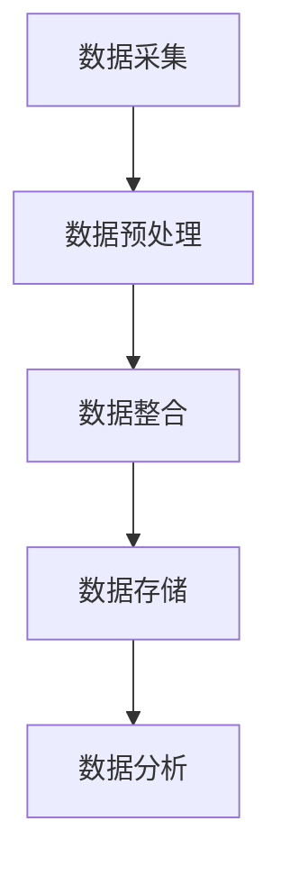
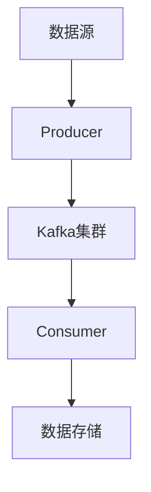
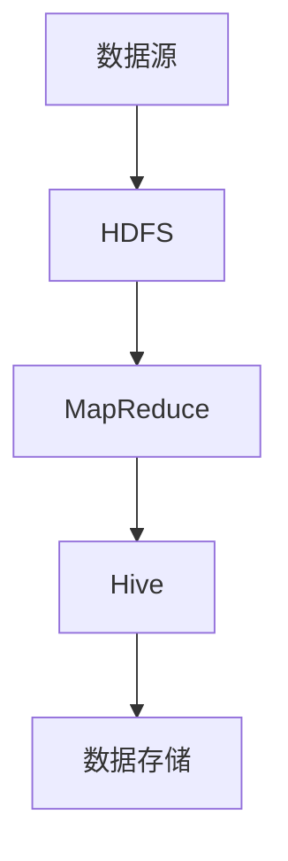
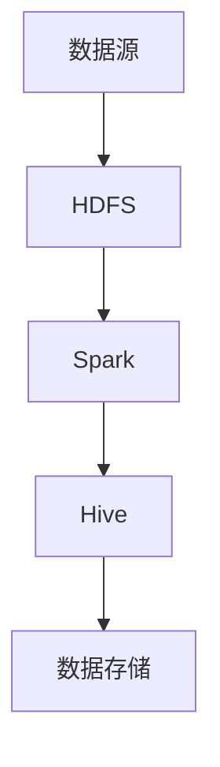
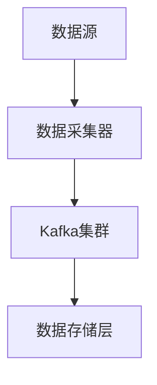
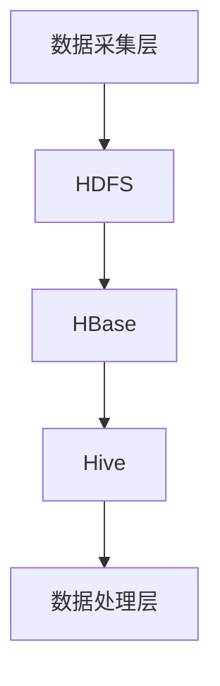
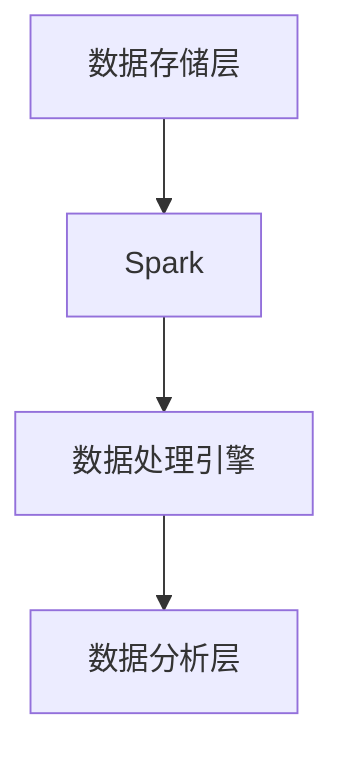
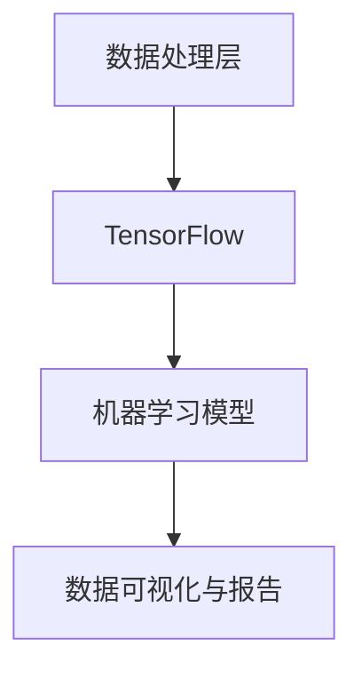

                 

## 引言

在现代信息化社会中，数据是企业发展的核心资源。然而，随着数据来源的多样化、数据量的指数级增长以及数据类型的丰富化，如何有效地整合和管理这些数据已经成为企业面临的重要挑战。为了应对这一挑战，企业级数据融合平台作为一种集成了数据集成、数据清洗、数据存储和数据分析等功能的综合性系统，逐渐成为数据管理领域的热点。

### 数据融合平台的定义与作用

数据融合平台是一种能够整合来自不同数据源的数据，提供统一视图的软件系统。它不仅仅是一个简单的数据集成工具，更是一个具备高度智能化和数据管理能力的数据管理平台。数据融合平台的主要作用包括：

1. **数据整合**：将来自不同数据源的数据整合到一个统一的数据存储中，为后续的数据分析提供基础。
2. **数据清洗**：对采集到的数据进行清洗、去噪、标准化等处理，确保数据的准确性和一致性。
3. **数据存储**：提供高效的数据存储和管理机制，支持数据的持久化存储和快速访问。
4. **数据分析**：利用先进的数据分析技术，从数据中提取有价值的信息，为企业的决策提供支持。

### 企业级数据融合的重要性

企业级数据融合平台对于企业的重要性不言而喻。以下是几个关键点：

1. **提升数据利用效率**：通过数据融合平台，企业可以更高效地利用分散在各处的数据，实现数据的整合与共享，从而提升数据的利用效率。
2. **支持业务决策**：统一的数据视图和深入的数据分析能力，为企业的业务决策提供强有力的数据支持，帮助企业更快地响应市场变化。
3. **降低数据孤岛现象**：通过数据融合平台，可以打破不同部门、不同系统之间的数据孤岛，实现数据的互联互通，提高企业的信息化水平。
4. **提高数据安全性**：企业级数据融合平台通常具备完善的安全机制，可以保障数据的安全性和隐私性。

### 数据融合与人工智能的关系

数据融合与人工智能（AI）技术的结合，为数据融合平台带来了新的发展机遇。以下是数据融合与人工智能之间的一些关键关系：

1. **数据驱动AI**：AI算法需要大量的高质量数据作为训练集，数据融合平台能够提供这些高质量的数据源，驱动AI算法的发展。
2. **AI赋能数据融合**：AI技术，尤其是机器学习和深度学习技术，可以用于数据融合过程中的数据清洗、去噪、特征提取等任务，提高数据融合的效率和准确性。
3. **智能数据融合**：结合AI技术，数据融合平台可以实现更加智能化的数据处理和分析，从数据中发现更深层次的规律和趋势。

综上所述，企业级数据融合平台不仅是数据管理的重要工具，更是人工智能技术发展的关键驱动力。通过构建高效的数据融合平台，企业可以更好地整合和管理数据资源，为业务创新和持续发展提供强大的支持。接下来，我们将进一步探讨数据融合的基本概念和关键技术，为构建高效的数据融合平台奠定基础。

## 数据融合基本概念

在深入探讨企业级数据融合平台之前，了解数据融合的基本概念至关重要。数据融合是指将来自不同数据源的数据进行整合、清洗、预处理，最终形成统一、准确、有价值的数据视图的过程。以下将介绍数据源类型、数据质量评估、数据清洗与预处理三个关键概念。

### 数据源类型

数据源是数据融合的基础，可以分为以下几种类型：

1. **结构化数据**：这类数据通常存储在关系型数据库中，如MySQL、PostgreSQL等。结构化数据的特点是有明确的字段定义和数据类型，便于查询和管理。
2. **半结构化数据**：这类数据没有固定的格式，但包含一定的结构信息，例如XML、JSON、HTML等。半结构化数据可以通过解析工具提取出有用的信息。
3. **非结构化数据**：这类数据没有固定的结构，例如文本、图片、音频、视频等。非结构化数据通常需要通过复杂的处理技术提取出有价值的信息。
4. **流数据**：流数据是指在短时间内不断产生和更新的数据，如金融交易数据、传感器数据等。流数据需要实时处理和分析。

### 数据质量评估

数据质量是数据融合的重要前提。评估数据质量可以从以下几个方面进行：

1. **准确性**：数据是否真实、可靠，与实际情况是否一致。
2. **完整性**：数据是否完整，没有缺失或遗漏。
3. **一致性**：数据在不同时间、不同来源之间是否保持一致。
4. **及时性**：数据是否及时更新，满足业务需求。
5. **唯一性**：数据是否具有唯一标识，避免重复记录。

常见的评估方法包括数据验证、数据比对、统计分析等。

### 数据清洗与预处理

数据清洗与预处理是确保数据质量的重要步骤，包括以下内容：

1. **数据清洗**：去除重复记录、处理缺失值、修正错误值等。例如，可以使用以下Python代码进行缺失值填充：
   ```python
   import pandas as pd
   
   df = pd.read_csv('data.csv')
   df.fillna(df.mean(), inplace=True)
   ```
2. **数据转换**：将数据转换为适合分析的形式，如数值化、编码化等。例如，使用以下Python代码将分类数据编码：
   ```python
   from sklearn.preprocessing import OneHotEncoder
   
   enc = OneHotEncoder()
   encoded_data = enc.fit_transform(df[['category']])
   ```
3. **特征工程**：选择和构建对分析任务有用的特征。例如，可以使用以下Python代码进行特征提取：
   ```python
   from sklearn.feature_extraction.text import TfidfVectorizer
   
   vectorizer = TfidfVectorizer()
   tfidf_matrix = vectorizer.fit_transform(df['text'])
   ```

### 数据融合的基本流程

数据融合的基本流程可以概括为以下几个步骤：

1. **数据采集**：从不同的数据源采集数据。
2. **数据预处理**：对采集到的数据进行清洗、转换和特征工程。
3. **数据整合**：将预处理后的数据整合到一个统一的数据视图中。
4. **数据存储**：将整合后的数据存储到数据仓库或数据湖中。
5. **数据分析**：利用整合后的数据进行分析，提取有价值的信息。

下面是一个Mermaid流程图，展示了数据融合的基本流程：



通过理解数据融合的基本概念和流程，我们可以更好地设计和实现高效的企业级数据融合平台。接下来，我们将探讨数据融合的技术和方法，为构建一个功能强大、高效可靠的数据融合平台奠定基础。

### 数据融合技术

数据融合技术是构建高效企业级数据融合平台的核心。数据融合涉及多种技术，包括数据集成、数据仓库和数据湖等。每种技术都有其独特的特点和应用场景，下面将分别进行介绍。

#### 数据集成

数据集成是将来自多个数据源的数据整合到一个统一的数据存储中，以便进行后续的数据分析和处理。数据集成技术主要包括以下几种方法：

1. **全量集成**：将所有数据源的数据一次性加载到统一的数据存储中。这种方法简单直接，但处理大量数据时效率较低，且可能导致数据存储资源的不足。
2. **增量集成**：仅加载新产生的数据或数据变更部分，提高数据集成的效率。这种方法适用于数据量巨大且实时性要求较高的场景。
3. **数据复制**：将数据源的数据复制到统一的数据存储中，实现数据的共享和访问。数据复制可以是全量复制或增量复制，根据实际需求选择合适的复制策略。

数据集成面临的主要挑战包括：

- **数据源多样性**：不同数据源的数据格式、结构和质量差异较大，需要统一的处理方法。
- **数据一致性和完整性**：确保集成后的数据在多个数据源之间保持一致性和完整性。
- **性能优化**：处理大量数据时，需要优化数据集成过程，提高系统性能。

常用的数据集成工具包括Apache Kafka、Apache Nifi、Apache Flume等。以下是Apache Kafka的架构示意图：



#### 数据仓库

数据仓库是一种用于存储、管理和分析大量历史数据的集中式数据库系统。数据仓库通常采用星型或雪花型模式进行数据建模，以支持复杂的数据查询和分析。以下是数据仓库的基本概念：

1. **星型模式**：以事实表为中心，围绕事实表构建多个维度表，形成星型结构。适用于读取密集型的分析查询。
2. **雪花型模式**：在星型模式的基础上，对维度表进行进一步的规范化，减少数据冗余。适用于更新密集型的分析查询。

数据仓库的主要优势包括：

- **高效的数据查询**：通过预定义的索引和优化查询，提高数据查询效率。
- **数据一致性**：统一的数据存储和模型，确保数据的一致性。
- **支持复杂分析**：提供丰富的数据分析功能，支持复杂的数据分析和报告。

然而，数据仓库也存在一些局限性：

- **扩展性限制**：随着数据量的增加，数据仓库的扩展性可能受到限制。
- **性能瓶颈**：大量数据的读写操作可能导致性能瓶颈。

常用的数据仓库技术包括Apache Hadoop、Google Bigtable、Amazon Redshift等。以下是Apache Hadoop的架构示意图：



#### 数据湖

数据湖是一种用于存储大规模非结构化和半结构化数据的分布式存储系统。与数据仓库不同，数据湖不进行预先的数据处理和结构化，而是保持数据的原始格式，以便在需要时进行自定义的处理和分析。以下是数据湖的基本概念：

1. **数据湖架构**：数据湖通常采用分布式文件系统（如HDFS、Alluxio）存储数据，并使用计算框架（如Spark、Flink）进行数据处理和分析。
2. **数据类型多样性**：数据湖支持多种数据类型，包括结构化数据、半结构化数据和非结构化数据，适应不同的数据需求。
3. **灵活性**：数据湖提供高度灵活的数据存储和处理能力，支持自定义的数据处理流程和分析方法。

数据湖的主要优势包括：

- **扩展性**：支持大规模数据的存储和处理，适应不断增长的数据需求。
- **灵活性**：保持数据的原始格式，便于后续的数据处理和分析。
- **支持实时处理**：结合实时计算框架，支持实时数据处理和分析。

然而，数据湖也存在一些挑战：

- **数据治理**：数据湖中的数据需要有效的治理和管控，以确保数据质量和合规性。
- **成本管理**：大规模数据存储和处理可能导致较高的成本。

常用的数据湖技术包括Apache Hadoop、Apache Spark、Amazon S3等。以下是Apache Hadoop的架构示意图：



综上所述，数据集成、数据仓库和数据湖是数据融合的三种关键技术，每种技术都有其独特的应用场景和优势。选择合适的数据融合技术，可以根据企业的需求和实际场景，构建高效、灵活的数据融合平台，为企业的数据管理和分析提供有力支持。

### AI技术基础

人工智能（AI）技术的发展，为数据融合带来了新的机遇和挑战。AI技术，特别是机器学习和深度学习，已经在数据清洗、特征提取、模型优化等多个环节中发挥着重要作用。下面，我们将简要介绍机器学习、深度学习和自然语言处理（NLP）这三个核心AI技术的基本概念和原理。

#### 机器学习

机器学习是一种通过算法让计算机自动学习和改进的方法。它通过从数据中学习规律和模式，然后使用这些规律和模式对未知数据进行预测或分类。机器学习主要包括以下几种类型：

1. **监督学习**：通过已标记的数据集训练模型，然后使用模型对未标记的数据进行预测。常见的算法包括线性回归、决策树、支持向量机（SVM）等。
2. **无监督学习**：在没有标记数据的帮助下，通过发现数据中的结构和模式来训练模型。常见的算法包括聚类算法（如K-means、DBSCAN）、降维算法（如PCA、t-SNE）等。
3. **半监督学习**：结合监督学习和无监督学习的方法，使用部分标记数据和大量未标记数据训练模型。

机器学习的主要流程包括数据预处理、模型选择、模型训练和模型评估。数据预处理是机器学习的重要步骤，包括数据清洗、归一化、特征选择等。以下是一个使用Python实现线性回归模型的示例代码：

```python
import numpy as np
from sklearn.linear_model import LinearRegression

# 准备数据
X = np.array([[1], [2], [3], [4], [5]])
y = np.array([1, 2, 3, 4, 5])

# 创建线性回归模型
model = LinearRegression()

# 训练模型
model.fit(X, y)

# 进行预测
predictions = model.predict(np.array([[6]]))

print(predictions)
```

#### 深度学习

深度学习是机器学习的一个分支，它通过构建多层次的神经网络来学习数据中的复杂特征和模式。深度学习的主要特点包括：

1. **神经网络**：深度学习模型是基于多层神经网络构建的，每一层都对输入数据进行特征提取和转换。
2. **反向传播**：深度学习模型使用反向传播算法来优化网络参数，提高模型的准确性。
3. **自动特征提取**：深度学习模型能够自动从数据中学习特征，无需人工进行特征工程。

常见的深度学习模型包括卷积神经网络（CNN）、循环神经网络（RNN）、长短时记忆网络（LSTM）等。以下是一个使用Python实现卷积神经网络（CNN）的示例代码：

```python
import tensorflow as tf
from tensorflow.keras import layers

# 创建模型
model = tf.keras.Sequential([
    layers.Conv2D(32, (3, 3), activation='relu', input_shape=(28, 28, 1)),
    layers.MaxPooling2D((2, 2)),
    layers.Flatten(),
    layers.Dense(128, activation='relu'),
    layers.Dense(10, activation='softmax')
])

# 编译模型
model.compile(optimizer='adam',
              loss='sparse_categorical_crossentropy',
              metrics=['accuracy'])

# 训练模型
model.fit(x_train, y_train, epochs=5)

# 进行预测
predictions = model.predict(x_test)

print(predictions)
```

#### 自然语言处理（NLP）

自然语言处理是人工智能的一个分支，它致力于使计算机能够理解和处理人类语言。NLP技术在数据融合中发挥着重要作用，包括文本分类、情感分析、命名实体识别等。以下是一些常见的NLP技术：

1. **词嵌入**：将单词映射为固定大小的向量表示，便于计算机处理。常见的词嵌入模型包括Word2Vec、GloVe等。
2. **文本分类**：将文本数据分类到预定义的类别中。常见的算法包括朴素贝叶斯、支持向量机、深度学习等。
3. **情感分析**：识别文本中的情感倾向，如正面、负面或中性。常用的技术包括机器学习和深度学习。
4. **命名实体识别**：识别文本中的特定实体，如人名、地点、组织等。常见的算法包括条件随机场（CRF）和卷积神经网络（CNN）。

以下是一个使用Python实现文本分类的示例代码：

```python
from sklearn.feature_extraction.text import TfidfVectorizer
from sklearn.naive_bayes import MultinomialNB
from sklearn.pipeline import make_pipeline

# 准备数据
X = ['I love this product', 'This is a bad product', 'I hate this product']
y = ['positive', 'negative', 'negative']

# 创建模型
model = make_pipeline(TfidfVectorizer(), MultinomialNB())

# 训练模型
model.fit(X, y)

# 进行预测
predictions = model.predict(['This product is great'])

print(predictions)
```

通过理解机器学习、深度学习和自然语言处理的基本概念和原理，我们可以更好地利用AI技术提升数据融合平台的效率和准确性。接下来，我们将探讨数据融合与AI技术的结合，为构建高效的企业级数据融合平台提供新的思路和方法。

### 数据融合与AI技术结合

在构建企业级数据融合平台时，结合AI技术可以显著提升数据处理和分析的效率和准确性。AI技术，尤其是机器学习和深度学习，可以在数据融合过程中扮演关键角色，帮助我们解决复杂的数据处理任务。以下将详细探讨数据融合与AI技术的结合方法，包括数据融合模型构建、模型优化和评估等。

#### 数据融合模型的构建

数据融合模型是将来自多个数据源的数据进行整合，并利用AI技术进行进一步分析和处理的关键组件。构建数据融合模型通常包括以下几个步骤：

1. **数据预处理**：对采集到的数据进行清洗、去噪和转换，使其适合进行AI分析。这一步是数据融合的基础，确保数据的准确性和一致性。
2. **特征提取**：从预处理后的数据中提取有用的特征，以便进行机器学习或深度学习分析。特征提取是数据融合与AI技术结合的核心步骤，直接影响模型的性能。
3. **模型选择**：根据分析任务的需求，选择合适的机器学习或深度学习模型。常见的模型包括线性回归、决策树、支持向量机（SVM）、神经网络和循环神经网络（RNN）等。
4. **模型训练**：使用已标记的训练数据集对模型进行训练，通过优化模型参数，使其能够准确预测或分类新的数据。

以下是一个使用Python实现数据融合模型的示例代码，该模型将整合多个数据源，并使用机器学习算法进行预测：

```python
import pandas as pd
from sklearn.ensemble import RandomForestClassifier
from sklearn.model_selection import train_test_split

# 读取数据
data = pd.read_csv('data.csv')

# 数据预处理
data = data.dropna()  # 去除缺失值
data = data[data['target'] != 'unknown']  # 去除目标为 'unknown' 的数据

# 特征提取
X = data[['feature1', 'feature2', 'feature3']]
y = data['target']

# 模型选择
model = RandomForestClassifier()

# 模型训练
X_train, X_test, y_train, y_test = train_test_split(X, y, test_size=0.2, random_state=42)
model.fit(X_train, y_train)

# 进行预测
predictions = model.predict(X_test)

# 模型评估
accuracy = model.score(X_test, y_test)
print(f'Model accuracy: {accuracy}')
```

#### 数据融合模型的优化

构建数据融合模型后，模型优化是提高其性能的重要步骤。优化方法包括以下几种：

1. **参数调优**：通过调整模型的超参数，如学习率、正则化参数等，来提高模型的准确性。常用的方法包括网格搜索（Grid Search）和贝叶斯优化（Bayesian Optimization）。
2. **特征选择**：通过选择对模型性能有显著影响的关键特征，提高模型的效率和准确性。特征选择方法包括基于信息增益（Information Gain）的过滤方法、基于模型的包裹方法（Wrapper Method）等。
3. **集成学习**：使用多个模型进行集成，提高模型的预测能力。常见的集成学习方法包括随机森林（Random Forest）、梯度提升树（Gradient Boosting Tree）等。

以下是一个使用Python实现模型参数调优的示例代码：

```python
from sklearn.model_selection import GridSearchCV

# 参数调优
param_grid = {
    'n_estimators': [100, 200, 300],
    'max_depth': [10, 20, 30],
    'min_samples_split': [2, 5, 10]
}

grid_search = GridSearchCV(
    estimator=model,
    param_grid=param_grid,
    cv=5,
    scoring='accuracy'
)

grid_search.fit(X_train, y_train)

# 获取最佳参数
best_params = grid_search.best_params_
print(f'Best parameters: {best_params}')

# 使用最佳参数训练模型
best_model = grid_search.best_estimator_
best_model.fit(X_train, y_train)

# 进行预测
predictions = best_model.predict(X_test)

# 模型评估
accuracy = best_model.score(X_test, y_test)
print(f'Model accuracy: {accuracy}')
```

#### 数据融合模型的评估

评估数据融合模型的性能是确保其有效性的关键步骤。常用的评估指标包括准确率（Accuracy）、精确率（Precision）、召回率（Recall）和F1分数（F1 Score）等。以下是一个使用Python实现模型评估的示例代码：

```python
from sklearn.metrics import accuracy_score, precision_score, recall_score, f1_score

# 评估模型
accuracy = accuracy_score(y_test, predictions)
precision = precision_score(y_test, predictions, average='weighted')
recall = recall_score(y_test, predictions, average='weighted')
f1 = f1_score(y_test, predictions, average='weighted')

print(f'Accuracy: {accuracy}')
print(f'Precision: {precision}')
print(f'Recall: {recall}')
print(f'F1 Score: {f1}')
```

通过上述步骤，我们可以构建和优化高效的数据融合模型，利用AI技术提高数据处理和分析的准确性和效率。接下来，我们将探讨企业级数据融合平台的架构设计，为构建一个功能强大、高效可靠的数据融合平台提供指导。

### 企业级数据融合平台架构设计

企业级数据融合平台的架构设计是确保其高效、可靠运行的关键。一个成熟的企业级数据融合平台通常包括数据采集层、数据存储层、数据处理层和数据分析层等多个层次，下面将分别介绍各层次的功能和设计原则。

#### 数据采集层

数据采集层负责从各种数据源收集数据，这些数据源可能包括企业内部的数据库、日志文件、传感器数据，以及外部的API接口、互联网数据等。数据采集层的主要功能包括：

1. **数据接入**：支持多种数据接入方式，如数据库连接、文件读取、Web服务调用等。
2. **数据同步**：实现数据的实时同步或定期同步，确保数据的一致性和完整性。
3. **数据质量监控**：对采集到的数据进行质量监控，及时发现和解决数据问题。

在数据采集层，可以采用分布式数据采集架构，例如使用Apache Kafka、Apache Nifi等工具，实现大规模、高并发的数据采集需求。以下是数据采集层的一个简单架构示意图：



#### 数据存储层

数据存储层是数据融合平台的核心，负责存储和管理大量的数据。根据数据的类型和需求，数据存储层可以采用关系型数据库、NoSQL数据库、数据仓库、数据湖等多种存储技术。数据存储层的主要功能包括：

1. **数据存储**：提供高效的数据存储机制，支持数据的持久化存储和快速访问。
2. **数据索引**：实现数据的快速检索和查询，提高数据访问效率。
3. **数据备份与恢复**：提供数据备份和恢复机制，确保数据的安全性和可靠性。

在数据存储层，可以选择使用Hadoop生态系统中的HDFS、HBase、Hive等工具，构建一个高扩展性、高可靠性的分布式存储架构。以下是数据存储层的一个简单架构示意图：



#### 数据处理层

数据处理层负责对存储在数据存储层中的数据进行清洗、转换、聚合等处理，以生成高质量的数据集，供后续的分析使用。数据处理层的主要功能包括：

1. **数据清洗**：去除数据中的噪音和错误，确保数据的准确性和一致性。
2. **数据转换**：将不同格式或类型的数据转换为统一的格式，便于后续处理和分析。
3. **数据聚合**：对大量数据进行汇总和统计，提取有价值的信息。

在数据处理层，可以使用Apache Spark、Flink等分布式计算框架，实现高效的数据处理和分析。以下是数据处理层的一个简单架构示意图：



#### 数据分析层

数据分析层负责利用机器学习和深度学习等技术，对处理后的数据进行分析和挖掘，提取有价值的商业洞察。数据分析层的主要功能包括：

1. **特征工程**：从原始数据中提取有用的特征，用于训练机器学习模型。
2. **模型训练**：使用训练数据集训练机器学习模型，进行预测或分类。
3. **模型评估**：评估模型的性能，并进行模型调整和优化。

在数据分析层，可以选择使用TensorFlow、PyTorch等深度学习框架，构建复杂的机器学习模型。以下是数据分析层的一个简单架构示意图：



#### 架构设计原则

在设计企业级数据融合平台时，需要遵循以下原则：

1. **高扩展性**：平台应能够支持大规模数据和高并发访问，适应业务规模的增长。
2. **高可靠性**：平台应具备数据备份和恢复机制，确保数据的安全性和可靠性。
3. **易维护性**：平台应具有良好的可扩展性和可维护性，便于后续的维护和升级。
4. **灵活性**：平台应支持多种数据源和数据类型的接入，适应不同的业务需求。
5. **安全性**：平台应具备完善的安全机制，确保数据的安全传输和存储。

通过遵循这些设计原则，可以构建一个高效、可靠、灵活的企业级数据融合平台，为企业的数据管理和分析提供强有力的支持。接下来，我们将通过实际案例研究，深入探讨数据融合平台在各个行业中的应用和实践。

### 案例研究

#### 案例一：电商数据融合

电商行业的数据融合平台是构建个性化推荐系统、用户行为分析和库存管理的重要工具。以下是一个电商数据融合平台的案例研究：

**项目背景**：
某大型电商平台希望通过数据融合平台整合用户行为数据、商品数据、销售数据和库存数据，实现个性化的商品推荐和精准的市场营销。

**数据源**：
- 用户行为数据：包括用户浏览、购买、评论等行为数据。
- 商品数据：包括商品的基本信息、价格、分类等。
- 销售数据：包括销售额、销售量、销售渠道等。
- 库存数据：包括库存数量、仓库位置等。

**项目实施**：

1. **数据采集**：使用Apache Kafka和Apache Nifi采集来自不同数据源的数据，包括日志文件、数据库和API接口。
2. **数据预处理**：使用Apache Spark对数据进行清洗、去噪和转换，生成统一格式的数据。
3. **数据融合**：将预处理后的数据整合到一个分布式数据仓库中，如Amazon Redshift。
4. **数据分析和建模**：使用机器学习和深度学习技术，如协同过滤（Collaborative Filtering）和深度神经网络（DNN），构建个性化推荐模型和用户行为分析模型。

**项目结果**：

- 通过数据融合平台，电商平台能够实时分析用户行为，为用户提供个性化的商品推荐。
- 库存管理更加精准，减少了库存积压和缺货现象。
- 市场营销活动更加精准，提高了用户转化率和销售额。

**项目小结**：

电商数据融合平台通过整合多源数据，实现了个性化推荐和精准营销，提高了用户满意度和业务收入。该项目展示了数据融合平台在电商行业的广泛应用和巨大价值。

#### 案例二：金融风控

金融风控数据融合平台是银行和金融机构防范风险、提高业务安全性的重要工具。以下是一个金融风控数据融合平台的案例研究：

**项目背景**：
某银行希望通过数据融合平台整合客户行为数据、交易数据和信用数据，实现实时风控和信用评估。

**数据源**：
- 客户行为数据：包括客户登录、查询、转账等行为数据。
- 交易数据：包括交易金额、交易时间、交易渠道等。
- 信用数据：包括客户信用评分、信用历史等。

**项目实施**：

1. **数据采集**：使用API接口和日志文件采集来自不同数据源的数据。
2. **数据预处理**：使用Apache Spark对数据进行清洗、去噪和转换，生成统一格式的数据。
3. **数据融合**：将预处理后的数据整合到一个分布式数据仓库中，如Google Bigtable。
4. **数据分析和建模**：使用机器学习和深度学习技术，如逻辑回归和神经网络，构建风控模型和信用评估模型。

**项目结果**：

- 通过数据融合平台，银行能够实时监测客户行为和交易，及时发现异常行为和潜在风险。
- 信用评估模型提高了贷款审批的准确性和效率。
- 风险控制措施更加精准，降低了欺诈风险和信用损失。

**项目小结**：

金融风控数据融合平台通过整合多源数据，实现了实时风控和信用评估，提高了银行的风险管理和业务效率。该项目展示了数据融合平台在金融行业的广泛应用和巨大价值。

#### 案例三：智能医疗

智能医疗数据融合平台是医疗行业实现精准医疗、疾病预测和患者管理的重要工具。以下是一个智能医疗数据融合平台的案例研究：

**项目背景**：
某医疗机构希望通过数据融合平台整合患者数据、健康数据、医疗数据和科研数据，实现个性化医疗和疾病预测。

**数据源**：
- 患者数据：包括患者基本信息、病史等。
- 健康数据：包括体检数据、健康指标数据等。
- 医疗数据：包括诊断结果、治疗方案、药物使用记录等。
- 科研数据：包括科研论文、临床试验数据等。

**项目实施**：

1. **数据采集**：使用API接口、传感器和医疗设备采集来自不同数据源的数据。
2. **数据预处理**：使用Apache Spark对数据进行清洗、去噪和转换，生成统一格式的数据。
3. **数据融合**：将预处理后的数据整合到一个分布式数据湖中，如Apache Hadoop。
4. **数据分析和建模**：使用机器学习和深度学习技术，如深度学习网络（DNN）和迁移学习（Transfer Learning），构建疾病预测模型和患者管理模型。

**项目结果**：

- 通过数据融合平台，医疗机构能够为患者提供个性化的治疗方案和健康建议。
- 疾病预测模型提高了疾病的早期发现率和治疗效果。
- 患者管理更加精细化，提高了患者满意度和治疗效果。

**项目小结**：

智能医疗数据融合平台通过整合多源数据，实现了个性化医疗和疾病预测，提高了医疗质量和患者满意度。该项目展示了数据融合平台在医疗行业的广泛应用和巨大价值。

### 总结

通过以上案例研究，我们可以看到数据融合平台在电商、金融和医疗等行业的广泛应用和显著效果。数据融合平台不仅提高了数据利用效率，还为业务决策提供了强有力的支持。未来，随着AI技术的进一步发展和数据量的不断增长，数据融合平台将在更多行业中发挥重要作用。

### 最佳实践和注意事项

在构建和运营企业级数据融合平台时，遵循最佳实践和注意事项能够提高项目的成功率，确保平台的稳定性和可靠性。以下是一些重要的最佳实践和注意事项：

#### 最佳实践

1. **数据质量管理**：确保数据质量是数据融合平台成功的关键。定期进行数据质量检查，及时修复数据中的错误和缺失，确保数据的准确性和一致性。
2. **灵活的架构设计**：设计一个具有高扩展性和灵活性的数据融合平台，能够适应不断变化的需求和技术发展。
3. **数据安全和隐私保护**：数据安全和隐私保护是数据融合平台的重要考虑因素。采用加密技术、访问控制和数据脱敏等方法，确保数据在存储、传输和处理过程中的安全性。
4. **持续集成与自动化**：通过持续集成（CI）和持续交付（CD）实现自动化部署和更新，提高开发效率和系统的稳定性。
5. **性能优化**：对数据融合平台的性能进行持续优化，包括数据存储、数据查询和数据处理的优化，确保系统在高并发访问下的高效运行。
6. **用户友好性**：设计用户友好的界面和操作流程，提高用户的使用体验，促进数据融合平台在企业内的普及和应用。

#### 注意事项

1. **需求分析**：在项目启动前，充分了解业务需求和用户需求，确保数据融合平台的功能和性能满足实际需求。
2. **数据源多样性**：充分考虑数据源的多样性，包括结构化、半结构化和非结构化数据，设计灵活的数据采集和处理策略。
3. **数据一致性**：确保数据在多个数据源之间保持一致，避免数据孤岛现象，提高数据的价值和利用率。
4. **性能监控**：建立完善的性能监控体系，实时监控数据采集、处理和分析的各个环节，及时发现和解决问题。
5. **合规性**：遵守相关的数据保护法规和行业标准，确保数据融合平台的合规性，避免法律风险。
6. **团队协作**：构建一个跨部门、多学科的项目团队，确保数据融合项目的顺利进行，提高项目的成功率。

通过遵循这些最佳实践和注意事项，企业可以构建和运营一个高效、稳定、可靠的企业级数据融合平台，为业务决策和持续发展提供强有力的支持。

### 小结与展望

本文通过详细探讨企业级数据融合平台，从数据融合基本概念、数据融合技术、AI技术基础、数据融合与AI结合、平台架构设计以及实际案例研究等方面，全面阐述了数据融合在现代企业信息化中的重要性。数据融合平台不仅能够有效整合和管理多源数据，提高数据的利用效率，还能通过AI技术实现智能化的数据分析，为企业的业务决策提供有力支持。

未来，随着大数据和人工智能技术的进一步发展，数据融合平台将发挥更加重要的作用。以下是几个值得关注的趋势：

1. **实时数据融合**：随着物联网和传感器技术的发展，实时数据融合将成为数据融合平台的重要发展方向。实时数据处理和实时分析能够帮助企业更快地响应市场变化，提高业务决策的及时性和准确性。
2. **智能数据治理**：数据治理是数据融合平台的重要一环。未来，智能数据治理技术将得到广泛应用，通过自动化、智能化的数据管理和治理工具，提高数据质量和数据安全。
3. **边缘计算与数据融合**：边缘计算技术将使数据融合平台能够将数据处理和分析延伸到边缘设备，提高数据处理的效率和响应速度，满足实时性和低延迟的需求。
4. **跨领域数据融合**：随着数据源的不断丰富，数据融合平台将能够整合更多类型的数据源，包括生物医学数据、交通数据、环境数据等，实现跨领域的数据融合和分析。
5. **数据隐私保护**：数据隐私保护是数据融合平台面临的重要挑战。未来的数据融合平台将更加注重数据隐私保护，通过数据加密、访问控制和隐私计算等技术，确保数据在存储、传输和处理过程中的安全性。

总之，数据融合平台作为企业信息化的重要组成部分，其发展前景广阔。通过不断创新和优化，数据融合平台将为企业带来更高的数据价值，推动业务创新和持续发展。未来，我们期待看到更多高效、智能、可靠的数据融合平台在各个行业中的广泛应用，为数字经济的发展贡献力量。

### 拓展阅读

对于希望深入了解企业级数据融合平台和AI技术的读者，以下是一些推荐读物和资源：

1. **书籍推荐**：
   - 《数据融合：多源信息处理技术与应用》（作者：张军、李晓亮）
   - 《深度学习》（作者：Ian Goodfellow、Yoshua Bengio、Aaron Courville）
   - 《机器学习实战》（作者：Peter Harrington）

2. **在线课程**：
   - Coursera上的《机器学习》课程（作者：Andrew Ng）
   - edX上的《深度学习基础》课程（作者：丹尼尔·科茨）

3. **技术博客和社区**：
   - Medium上的“AI for Business”
   - GitHub上的AI相关开源项目和文档

4. **学术期刊与会议**：
   - 《IEEE Transactions on Knowledge and Data Engineering》
   - 《ACM Transactions on Internet Technology》
   - 数据融合和机器学习相关的国际会议，如IEEE International Conference on Data Fusion

通过阅读这些书籍、课程、博客和文献，读者可以更深入地了解数据融合和AI技术的原理和实践，为实际项目提供指导和参考。希望这些资源能为您的学习和研究带来帮助。

