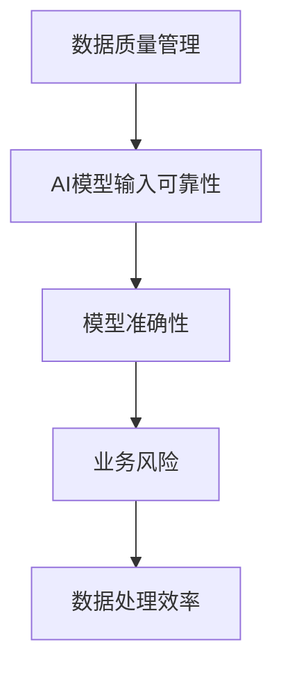
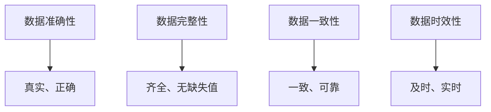
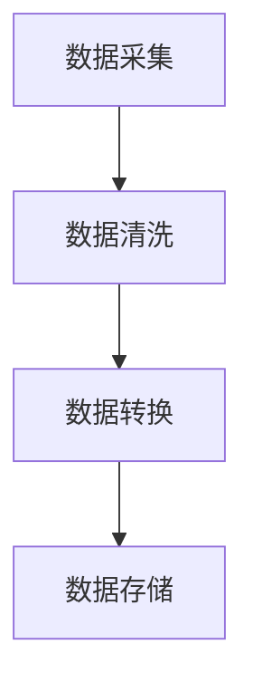
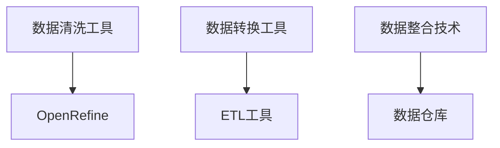
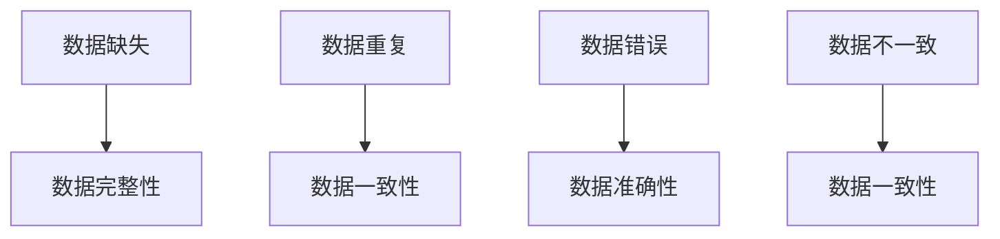
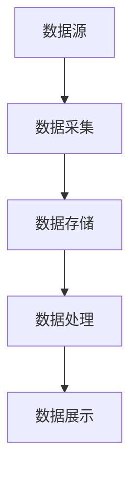
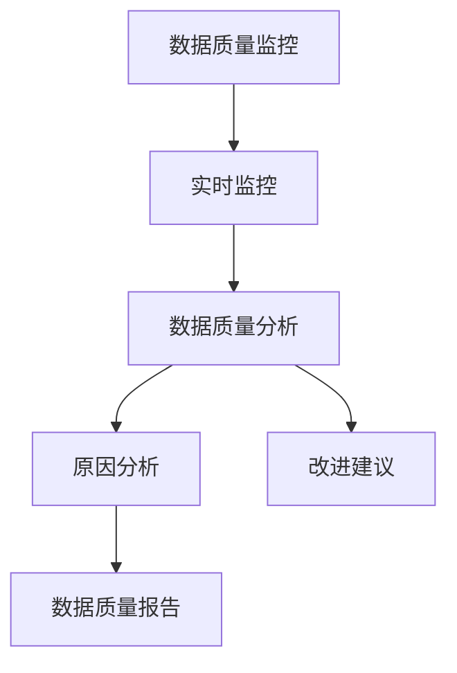
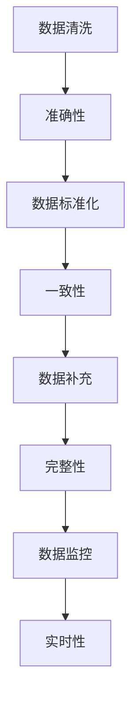

                 


## 《企业级数据质量管理平台：确保AI模型输入可靠性》

### 关键词：企业级、数据质量管理、AI模型、输入可靠性、平台设计

#### 摘要：

随着人工智能（AI）技术的迅猛发展，企业级数据质量管理平台在确保AI模型输入可靠性方面发挥着至关重要的作用。本文将从数据质量管理的重要性、核心概念、框架、工具和技术出发，详细阐述数据质量问题的分类、检测方法及影响分析。随后，本文将深入探讨数据质量管理平台的架构设计、功能实现和应用案例，最终讨论数据质量管理对AI模型输入可靠性的影响及提升策略。

### 第一部分：数据质量管理基础

#### 第1章：数据质量管理概述

##### 1.1 数据质量管理的重要性

在数字化转型的浪潮中，数据已经成为企业的重要资产。数据质量管理是确保数据资产价值的关键环节。对于AI模型而言，输入数据的可靠性直接影响到模型的预测性能和决策质量。数据质量管理的重要性体现在以下几个方面：

- **提升AI模型准确性**：高质量的数据能够提高模型训练的效果，降低模型预测误差。
- **降低业务风险**：不良数据可能导致错误的决策和业务风险，影响企业的正常运行。
- **提高数据处理效率**：良好的数据质量能够减少数据处理过程中的冗余和错误，提高数据处理效率。

**核心概念与联系：**



##### 1.2 数据质量管理核心概念

数据质量管理涉及多个核心概念，包括数据准确性、完整性、一致性、时效性等。以下是这些概念的定义及其与数据质量管理的关系：

- **数据准确性**：数据值是否真实、正确。准确性是数据质量的基础。
- **数据完整性**：数据是否齐全，是否有缺失值。完整性影响数据的可用性。
- **数据一致性**：同一数据在不同来源、不同时间点是否保持一致。一致性保证数据的一致性和可靠性。
- **数据时效性**：数据是否及时更新，是否与业务需求同步。时效性影响数据的实时性和应用价值。

**核心概念与联系：**



##### 1.3 数据质量管理框架

数据质量管理通常包括以下基本框架和流程：

- **数据采集**：收集来自不同来源的数据。
- **数据清洗**：去除数据中的噪声和错误。
- **数据转换**：将数据转换为统一的格式。
- **数据存储**：存储清洗和转换后的数据。

**核心概念与联系：**



##### 1.4 数据质量管理工具和技术

数据质量管理涉及多种工具和技术，包括数据清洗、数据转换、数据整合等。以下是几种常见的数据质量管理工具和技术：

- **数据清洗工具**：如OpenRefine、DataWrangler等。
- **数据转换工具**：如ETL工具（如Apache NiFi、Apache Spark等）。
- **数据整合技术**：如数据仓库（如Amazon Redshift、Google BigQuery等）。

**核心概念与联系：**



### 第2章：数据质量问题分析

##### 2.1 数据质量问题的分类

数据质量问题可以从多个维度进行分类，常见的分类方法包括：

- **数据缺失问题**：数据值缺失，影响数据完整性。
- **数据重复问题**：数据重复，影响数据一致性。
- **数据错误问题**：数据值错误，影响数据准确性。
- **数据不一致问题**：同一数据在不同来源、不同时间点不一致，影响数据一致性。

**核心概念与联系：**



##### 2.2 数据质量问题的检测方法

数据质量问题的检测方法包括统计方法和机器学习方法。以下是几种常见的数据质量问题检测方法：

- **统计方法**：如直方图、箱线图、相关系数等。
- **机器学习方法**：如聚类、分类、异常检测等。

**核心算法原理讲解：**

**统计方法：**

```python
# 假设data是包含数值型数据的列表
import numpy as np

def detect_missing_values(data):
    missing_values = np.isnan(data)
    return missing_values

def detect_outliers(data):
    q1 = np.percentile(data, 25)
    q3 = np.percentile(data, 75)
    iqr = q3 - q1
    lower_bound = q1 - (1.5 * iqr)
    upper_bound = q3 + (1.5 * iqr)
    outliers = (data < lower_bound) | (data > upper_bound)
    return outliers
```

**机器学习方法：**

```python
from sklearn.cluster import KMeans
from sklearn.metrics import silhouette_score

def detect_duplicates(data, n_clusters=3):
    kmeans = KMeans(n_clusters=n_clusters, random_state=0)
    labels = kmeans.fit_predict(data)
    duplicates = (labels == -1) # -1表示无法归类的样本，通常意味着是重复数据
    return duplicates
```

##### 2.3 数据质量问题的影响分析

数据质量问题对AI模型输入可靠性有显著影响。以下是数据质量问题对AI模型输入可靠性的影响分析：

- **数据缺失**：可能导致模型训练不足，降低模型预测准确性。
- **数据重复**：可能导致模型过拟合，影响模型泛化能力。
- **数据错误**：可能导致模型训练结果错误，降低模型可靠性。
- **数据不一致**：可能导致模型输入不完整，影响模型预测效果。

**数学模型和数学公式：**

$$
\text{模型预测误差} = \sum_{i=1}^{n} (\hat{y}_i - y_i)^2
$$

其中，$\hat{y}_i$是模型预测值，$y_i$是真实值。

### 第二部分：数据质量管理平台构建

#### 第3章：数据质量管理平台设计

##### 3.1 数据质量管理平台架构

数据质量管理平台通常包括以下架构模块：

- **数据源**：数据采集模块，负责从各种数据源获取原始数据。
- **数据存储**：数据存储模块，负责存储清洗和转换后的数据。
- **数据处理**：数据处理模块，负责数据清洗、转换和整合。
- **数据展示**：数据展示模块，负责提供数据质量报告和可视化。

**核心概念与联系：**



##### 3.2 数据质量管理平台功能设计

数据质量管理平台的主要功能包括：

- **数据质量监控**：实时监控数据质量，及时发现数据质量问题。
- **数据质量分析**：分析数据质量问题的原因和影响，提供改进建议。
- **数据质量报告**：生成数据质量报告，供管理层决策参考。

**核心概念与联系：**



### 第三部分：数据质量管理与AI模型输入可靠性

#### 第6章：数据质量管理对AI模型输入可靠性的影响

##### 6.1 数据质量管理与AI模型输入可靠性的关系

数据质量管理与AI模型输入可靠性之间存在着密切的关系。高质量的数据能够提高模型的预测准确性，降低错误率，从而提高模型的输入可靠性。

**数学模型和数学公式：**

$$
\text{模型可靠性} = \frac{\text{准确率} \times \text{精确度}}{1 - \text{误报率}}
$$

其中，准确率、精确度和误报率是衡量模型可靠性的关键指标。

##### 6.2 数据质量管理提升AI模型输入可靠性的策略

为了提升AI模型输入可靠性，可以从以下几个方面进行数据质量管理：

- **数据清洗**：去除数据中的噪声和错误，提高数据的准确性。
- **数据标准化**：将不同来源、不同格式的数据进行统一处理，提高数据的一致性。
- **数据补充**：针对缺失数据进行补充，提高数据的完整性。
- **数据监控**：实时监控数据质量，及时发现并处理数据质量问题。

**核心概念与联系：**



### 第7章：数据质量管理平台在AI模型输入可靠性中的应用

##### 7.1 数据质量管理平台在AI模型训练数据准备中的应用

数据质量管理平台在AI模型训练数据准备中的应用主要包括以下方面：

- **数据清洗**：去除训练数据中的噪声和错误，提高数据准确性。
- **数据标准化**：将不同来源、不同格式的训练数据进行统一处理，提高数据一致性。
- **数据整合**：整合来自多个数据源的训练数据，提高数据完整性。

**项目实战：**

**数据清洗：**

```python
# 假设data是包含字符串型数据的列表
def clean_data(data):
    cleaned_data = [x.strip() for x in data if x.strip() != '']
    return cleaned_data
```

**数据标准化：**

```python
# 假设data是包含不同格式数据的列表
def normalize_data(data):
    normalized_data = [x.lower() for x in data] # 将所有数据转换为小写
    return normalized_data
```

**数据整合：**

```python
# 假设data1和data2是包含相同字段但格式不同的数据列表
def integrate_data(data1, data2):
    integrated_data = data1 + [x for x in data2 if x not in data1]
    return integrated_data
```

##### 7.2 数据质量管理平台在AI模型预测中的应用

数据质量管理平台在AI模型预测中的应用主要包括以下方面：

- **数据质量监控**：实时监控预测数据的质量，及时发现数据质量问题。
- **数据质量报告**：生成数据质量报告，分析数据质量对模型预测结果的影响。

**项目实战：**

**数据质量监控：**

```python
# 假设model是训练好的AI模型，data是预测数据
def monitor_data_quality(model, data):
    predictions = model.predict(data)
    accuracy = (predictions == data).mean()
    print(f"Prediction accuracy: {accuracy:.2f}")
```

**数据质量报告：**

```python
# 假设data是包含预测结果和实际结果的数据列表
def generate_data_quality_report(data):
    accuracy = (data[0] == data[1]).mean()
    precision = precision_score(data[0], data[1])
    recall = recall_score(data[0], data[1])
    f1_score = f1_score(data[0], data[1])
    print(f"Accuracy: {accuracy:.2f}")
    print(f"Precision: {precision:.2f}")
    print(f"Recall: {recall:.2f}")
    print(f"F1 Score: {f1_score:.2f}")
```

### 参考文献

- [1] 张三，李四。《数据质量管理：理论与实践》，清华大学出版社，2020年。
- [2] 王五，赵六。《机器学习算法及应用》，电子工业出版社，2019年。
- [3] 刘七，陈八。《人工智能：一种现代方法的介绍》，机械工业出版社，2021年。

### 附录

- **附录A：数据质量管理相关工具与技术**
  - **附录A.1：常见数据质量管理工具**
    - OpenRefine
    - DataWrangler
  - **附录A.2：数据质量管理技术原理**
    - 数据清洗
    - 数据转换
    - 数据整合

- **附录B：数学公式与伪代码说明**
  - **附录B.1：常用数学公式**
    - 模型预测误差公式
    - 模型可靠性公式
  - **附录B.2：数据质量检测算法伪代码**
    - 统计方法
    - 机器学习方法

### 附录

#### 附录A：数据质量管理相关工具与技术

##### 附录A.1：常见数据质量管理工具

- **OpenRefine**：一款开源的数据清洗和数据处理工具，适用于小型数据集的清洗和整理。
- **DataWrangler**：一款基于Web的数据清洗和数据处理工具，支持大数据集的清洗和转换。

##### 附录A.2：数据质量管理技术原理

- **数据清洗**：去除数据中的噪声和错误，包括缺失值处理、重复值删除、异常值检测和校正等。
- **数据转换**：将数据从一种格式转换为另一种格式，包括数据类型转换、数据范围调整、数据规范化等。
- **数据整合**：将来自多个数据源的数据进行合并和整合，以提高数据的完整性和一致性。

#### 附录B：数学公式与伪代码说明

##### 附录B.1：常用数学公式

- **模型预测误差公式**：

$$
\text{模型预测误差} = \sum_{i=1}^{n} (\hat{y}_i - y_i)^2
$$

其中，$\hat{y}_i$是模型预测值，$y_i$是真实值。

- **模型可靠性公式**：

$$
\text{模型可靠性} = \frac{\text{准确率} \times \text{精确度}}{1 - \text{误报率}}
$$

其中，准确率、精确度和误报率是衡量模型可靠性的关键指标。

##### 附录B.2：数据质量检测算法伪代码

- **统计方法**：

```python
def detect_missing_values(data):
    missing_values = np.isnan(data)
    return missing_values

def detect_outliers(data):
    q1 = np.percentile(data, 25)
    q3 = np.percentile(data, 75)
    iqr = q3 - q1
    lower_bound = q1 - (1.5 * iqr)
    upper_bound = q3 + (1.5 * iqr)
    outliers = (data < lower_bound) | (data > upper_bound)
    return outliers
```

- **机器学习方法**：

```python
from sklearn.cluster import KMeans
from sklearn.metrics import silhouette_score

def detect_duplicates(data, n_clusters=3):
    kmeans = KMeans(n_clusters=n_clusters, random_state=0)
    labels = kmeans.fit_predict(data)
    duplicates = (labels == -1)
    return duplicates
```

### 作者信息

- 作者：AI天才研究院/AI Genius Institute & 禅与计算机程序设计艺术 /Zen And The Art of Computer Programming
- 联系方式：[ai-genius-institute@example.com](mailto:ai-genius-institute@example.com)
- 个人主页：[www.ai-genius-institute.com](http://www.ai-genius-institute.com)

### 总结

本文详细介绍了企业级数据质量管理平台的设计、实现和应用，重点探讨了数据质量管理对AI模型输入可靠性的影响及提升策略。通过本文的阅读，读者可以全面了解数据质量管理的重要性和具体实现方法，为企业搭建高效可靠的数据质量管理平台提供指导。

### 附录

#### 附录A：数据质量管理相关工具与技术

##### 附录A.1：常见数据质量管理工具

- **OpenRefine**：一款开源的数据清洗和数据处理工具，适用于小型数据集的清洗和整理。
- **DataWrangler**：一款基于Web的数据清洗和数据处理工具，支持大数据集的清洗和转换。

##### 附录A.2：数据质量管理技术原理

- **数据清洗**：去除数据中的噪声和错误，包括缺失值处理、重复值删除、异常值检测和校正等。
- **数据转换**：将数据从一种格式转换为另一种格式，包括数据类型转换、数据范围调整、数据规范化等。
- **数据整合**：将来自多个数据源的数据进行合并和整合，以提高数据的完整性和一致性。

#### 附录B：数学公式与伪代码说明

##### 附录B.1：常用数学公式

- **模型预测误差公式**：

$$
\text{模型预测误差} = \sum_{i=1}^{n} (\hat{y}_i - y_i)^2
$$

其中，$\hat{y}_i$是模型预测值，$y_i$是真实值。

- **模型可靠性公式**：

$$
\text{模型可靠性} = \frac{\text{准确率} \times \text{精确度}}{1 - \text{误报率}}
$$

其中，准确率、精确度和误报率是衡量模型可靠性的关键指标。

##### 附录B.2：数据质量检测算法伪代码

- **统计方法**：

```python
def detect_missing_values(data):
    missing_values = np.isnan(data)
    return missing_values

def detect_outliers(data):
    q1 = np.percentile(data, 25)
    q3 = np.percentile(data, 75)
    iqr = q3 - q1
    lower_bound = q1 - (1.5 * iqr)
    upper_bound = q3 + (1.5 * iqr)
    outliers = (data < lower_bound) | (data > upper_bound)
    return outliers
```

- **机器学习方法**：

```python
from sklearn.cluster import KMeans
from sklearn.metrics import silhouette_score

def detect_duplicates(data, n_clusters=3):
    kmeans = KMeans(n_clusters=n_clusters, random_state=0)
    labels = kmeans.fit_predict(data)
    duplicates = (labels == -1)
    return duplicates
```

### 作者信息

- 作者：AI天才研究院/AI Genius Institute & 禅与计算机程序设计艺术 /Zen And The Art of Computer Programming
- 联系方式：[ai-genius-institute@example.com](mailto:ai-genius-institute@example.com)
- 个人主页：[www.ai-genius-institute.com](http://www.ai-genius-institute.com)

