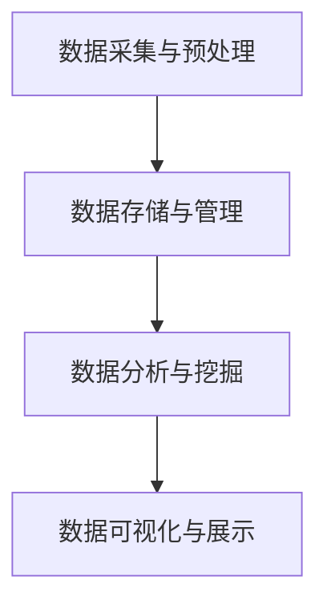

                 

### 第1章：企业级时空数据分析概述

#### 1.1 企业级时空数据分析的背景

在当今数字化时代，企业级时空数据分析已经成为推动业务增长和创新的关键驱动力。随着物联网（IoT）的兴起和地理信息系统（GIS）技术的不断进步，企业能够收集到大量的时空数据。这些数据涵盖了从地理位置、移动轨迹到事件发生的时间和频率的广泛信息。

**时空数据分析的重要性**

时空数据分析的重要性体现在以下几个方面：

- **业务洞察**：通过分析时空数据，企业可以深入了解业务模式，优化资源配置，提高运营效率。
- **决策支持**：时空数据分析能够为管理层提供数据驱动的决策支持，帮助企业更好地应对市场变化和竞争压力。
- **风险管理**：时空数据分析可以帮助企业识别潜在的风险点，制定预防措施，降低运营风险。

**企业对时空数据分析的需求**

随着企业对数据价值的认知不断深化，对时空数据分析的需求也在不断增长。企业希望从海量时空数据中提取有价值的信息，以支持以下业务需求：

- **地理位置分析**：了解客户分布、销售热点和市场潜力。
- **路径优化**：优化物流和运输线路，降低成本，提高效率。
- **事件预测**：预测事件发生的可能性和影响，提前采取预防措施。
- **风险管理**：通过时空数据分析识别潜在风险，制定有效的风险控制策略。

**时空数据分析的发展趋势**

随着技术的不断进步，时空数据分析也在不断发展。以下是几个关键趋势：

- **大数据与云计算的结合**：大数据技术和云计算的结合使得企业能够更高效地处理海量时空数据。
- **实时分析**：实时分析技术使得企业能够快速响应市场变化，提高业务灵活性。
- **多源数据融合**：通过整合多种数据源（如传感器数据、社交媒体数据等），提供更全面的业务洞察。
- **人工智能与机器学习的应用**：人工智能和机器学习技术用于时空数据分析，可以自动识别模式、预测趋势，提高数据分析的智能化水平。

#### 1.2 时空数据分析的核心概念与架构

**时空数据分析的基本概念**

**时空数据定义**：时空数据是关于对象在时间和空间中的位置和状态的数据。它通常包括位置信息（如经纬度）、时间戳信息（如日期和时间）以及相关的属性信息（如温度、湿度等）。

**时空数据分析的目的**：时空数据分析的目的是从时空数据中提取有价值的信息，支持业务决策和优化。

**时空数据分析的关键因素**：

- **数据质量**：高质量的数据是进行有效分析的基础。
- **数据处理能力**：强大的数据处理能力能够快速处理海量时空数据。
- **算法与模型**：合适的算法和模型能够有效地提取时空数据中的模式和趋势。
- **可视化与交互**：有效的可视化与交互能够帮助用户更好地理解和利用分析结果。

**企业级时空数据分析架构**

企业级时空数据分析通常包括以下主要模块：

- **数据采集与预处理**：收集和预处理时空数据，包括数据清洗、去噪和标准化等步骤。
- **数据存储与管理**：选择合适的存储方案（如关系型数据库、NoSQL数据库、分布式文件系统等）来存储和管理时空数据。
- **数据分析与挖掘**：应用各种算法和模型对时空数据进行分析和挖掘，提取有价值的信息。
- **数据可视化与展示**：通过可视化工具将分析结果以图表、地图等形式展示给用户。

**时空数据分析与其他领域的交叉应用**

时空数据分析不仅应用于传统领域（如物流、交通、地理信息等），还与其他领域如金融、医疗、零售等产生交叉应用：

- **金融领域**：通过时空数据分析，金融机构可以更好地了解市场趋势和客户行为，优化投资策略。
- **医疗领域**：时空数据分析可以用于疾病传播预测、患者轨迹分析等，支持医疗决策和资源分配。
- **零售领域**：通过分析消费者购买行为和地理位置数据，零售企业可以优化商品布局、定价策略和营销活动。

**时空数据分析的价值与挑战**

**价值**：

- **业务增长**：通过优化业务流程、降低成本和提高效率，实现业务增长。
- **决策支持**：提供数据驱动的决策支持，帮助管理层更好地应对市场变化。
- **风险控制**：通过识别风险点和预测趋势，提前采取预防措施，降低风险。

**挑战**：

- **数据质量**：时空数据质量参差不齐，需要有效的数据清洗和预处理技术。
- **数据存储与处理**：海量时空数据对存储和处理能力提出了高要求。
- **算法与模型**：选择合适的算法和模型是进行有效分析的关键。
- **技术人才**：具备时空数据分析能力的人才相对稀缺，企业需要投入大量资源进行人才培养。

#### 1.2.5 Mermaid流程图：企业级时空数据分析流程

以下是企业级时空数据分析流程的Mermaid流程图：

该流程图展示了时空数据分析的四个主要阶段：数据采集与预处理、数据存储与管理、数据分析和挖掘、数据可视化与展示。每个阶段都有其特定的任务和目标，共同构成了一个完整的企业级时空数据分析流程。

---

在这一章中，我们介绍了企业级时空数据分析的背景、重要性、核心概念与架构，以及与其他领域的交叉应用和价值与挑战。接下来，我们将深入探讨时空数据处理与存储技术，为企业级时空数据分析提供坚实的技术基础。

