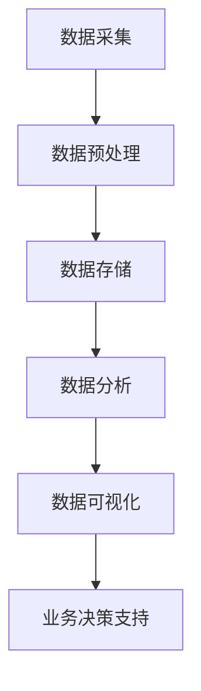

                 

### 第1章：企业级时空数据分析引擎概述

#### 1.1 企业级时空数据分析引擎的概念

在当今信息技术飞速发展的时代，企业级时空数据分析引擎作为一种新型的数据处理工具，已经逐渐成为企业提升核心竞争力的重要手段。本节将深入探讨企业级时空数据分析引擎的概念、重要性以及其核心功能。

##### 1.1.1 什么是时空数据分析

时空数据分析，顾名思义，就是对同时包含时间和空间维度的数据进行分析和处理。这类数据通常来源于地理位置信息系统（GIS）、传感器、物联网设备等，可以用于描述物体的位置、运动状态、环境变化等信息。时空数据分析的核心在于将时间和空间这两个维度有机结合，从而提供更加全面、深入的洞察力。

###### 1.1.1.1 时空数据的定义

时空数据，是指那些不仅包含位置信息，还包含时间信息的复杂数据集。这些数据可以表示为三元组（t, x, y），其中t代表时间，x和y分别代表空间坐标。例如，一个GPS定位数据点就是一个时空数据点，它记录了某个物体在特定时间t的位置（x, y）。

###### 1.1.1.2 时空数据分析的重要性

时空数据分析的重要性体现在多个领域，如交通运输、城市规划、环境保护和公共安全等。以下是一些具体的应用场景：

- **交通运输**：通过分析交通流量、路况等时空数据，可以优化交通调度，提高交通效率，减少拥堵。
- **城市规划**：利用时空数据分析技术，可以为城市规划提供科学依据，优化城市布局，提高居住环境质量。
- **环境保护**：通过监测和分析环境污染时空数据，可以及时采取环保措施，保护生态环境。
- **公共安全**：利用时空数据分析技术，可以对安全事件进行预测、预警和处置，提升公共安全水平。

##### 1.1.2 企业级时空数据分析引擎的概念

企业级时空数据分析引擎是一种集成多种时空数据分析和处理技术的系统，旨在为企业提供高效、准确的时空数据分析服务。它通常具备以下特性：

- **高并发处理能力**：能够同时处理大量时空数据，满足企业级业务需求。
- **高效的数据存储和管理**：支持大规模时空数据的快速存取和实时更新。
- **丰富的数据分析算法**：提供多种时空数据分析算法，满足不同业务场景的需求。
- **易扩展性**：支持系统功能的灵活扩展，适应未来业务需求的变化。

###### 1.1.2.1 企业级时空数据分析引擎的组成

企业级时空数据分析引擎通常由以下几个关键组件构成：

- **数据采集模块**：负责从多种数据源（如GPS、传感器、物联网设备等）采集时空数据。
- **数据存储模块**：负责将采集到的时空数据进行结构化存储，提供高效的数据查询和检索能力。
- **数据处理模块**：负责对时空数据进行预处理、清洗、转换等操作，使其适合后续分析。
- **分析引擎模块**：负责执行各种时空数据分析算法，如空间索引、聚类分析、时间序列分析等。
- **可视化模块**：负责将时空数据分析结果通过图形化界面展示，便于用户直观理解数据特征。
- **决策支持模块**：负责基于时空数据分析结果，为企业提供业务决策支持，优化业务流程。

##### 1.1.3 企业级时空数据分析引擎的核心功能

企业级时空数据分析引擎的主要功能包括：

- **数据采集与接入**：从多种数据源（如GPS、传感器、物联网设备等）采集时空数据，并进行预处理。
- **数据存储与管理**：将采集到的时空数据进行结构化存储，提供高效的数据查询和检索能力。
- **数据可视化**：将时空数据通过图形化界面展示，便于用户直观理解数据特征。
- **时空数据分析**：利用各种时空数据分析算法，对时空数据进行深度挖掘和分析。
- **业务决策支持**：基于时空数据分析结果，为企业提供业务决策支持，优化业务流程。

##### 1.1.4 企业级时空数据分析引擎的应用场景

企业级时空数据分析引擎在多个行业中具有广泛的应用，以下是一些典型的应用场景：

- **交通运输**：通过分析交通流量、路况等时空数据，优化交通调度，提升交通效率。
- **城市规划**：利用时空数据分析技术，支持城市规划、建设和管理，提高城市治理水平。
- **环境保护**：通过监测和分析环境污染时空数据，及时采取环保措施，保障环境安全。
- **公共安全**：利用时空数据分析技术，对安全事件进行预测、预警和处置，提升公共安全水平。

##### 1.1.5 企业级时空数据分析引擎的发展趋势

随着大数据、人工智能等技术的不断发展，企业级时空数据分析引擎正朝着以下几个方向演进：

- **智能化**：通过引入机器学习、深度学习等技术，提高时空数据分析的智能化水平。
- **实时性**：通过分布式计算、边缘计算等手段，实现实时时空数据分析，满足企业快速响应的需求。
- **高效能**：通过优化算法、提升硬件性能等手段，提高时空数据分析的效率和精度。
- **行业定制化**：针对不同行业的需求，开发定制化的时空数据分析解决方案，提高解决方案的适用性和竞争力。

#### 1.2 时空数据分析的数学模型与算法原理

时空数据分析涉及多个数学模型和算法，这些模型和算法为时空数据分析提供了坚实的理论基础。本节将介绍时空数据分析的基本数学模型和常见算法。

##### 1.2.1 时空数据分析的基本数学模型

时空数据分析主要基于以下几个数学模型：

- **时空数据模型**：用于描述时空数据的基本结构和属性，如点、线、面等。
- **时空索引模型**：用于快速检索和查询时空数据，如空间四叉树、R树等。
- **时空预测模型**：用于预测时空数据的未来趋势，如时间序列分析、空间统计分析等。

###### 1.2.1.1 时空数据模型

时空数据模型通常包括以下几种：

- **点数据模型**：表示单个时空点，如GPS定位点。
- **线数据模型**：表示时空中的路径，如交通路线。
- **面数据模型**：表示时空中的区域，如城市规划区域。

###### 1.2.1.2 时空索引模型

时空索引模型用于提高时空数据的查询效率。常见的时空索引模型包括：

- **空间四叉树**：将空间划分为四个相等的部分，递归地进行划分，直到满足特定条件。
- **R树**：是一种多叉树结构，用于存储多维空间数据，如时空点集。

###### 1.2.1.3 时空预测模型

时空预测模型用于预测时空数据的未来趋势。常见的时间序列预测模型包括：

- **ARIMA模型**：自回归积分滑动平均模型，适用于非季节性时间序列数据。
- **SARIMA模型**：季节性ARIMA模型，适用于季节性时间序列数据。

##### 1.2.2 常见的时空数据分析算法

常见的时空数据分析算法包括：

- **时空数据采集与预处理算法**：如时空数据的清洗、去噪、转换等。
- **时空数据索引算法**：如空间四叉树、R树等。
- **时空数据挖掘算法**：如关联规则挖掘、聚类分析、分类分析等。
- **时空预测算法**：如时间序列分析、空间统计分析、机器学习预测等。

###### 1.2.2.1 时空数据采集与预处理算法

时空数据采集与预处理算法包括以下步骤：

- **数据采集**：从多种数据源（如GPS、传感器、物联网设备等）采集时空数据。
- **数据清洗**：去除数据中的噪声和异常值，如GPS漂移、传感器故障等。
- **数据转换**：将不同格式和来源的时空数据进行统一格式转换，如将GPS数据转换为标准地理坐标。

###### 1.2.2.2 时空数据索引算法

时空数据索引算法用于提高时空数据的查询效率。常见的时空数据索引算法包括：

- **空间四叉树**：通过递归地将空间划分为四个相等的部分，实现高效的空间查询。
- **R树**：通过多叉树结构存储多维空间数据，支持高效的区域查询和点查询。

###### 1.2.2.3 时空数据挖掘算法

时空数据挖掘算法用于从时空数据中提取有价值的信息。常见的时空数据挖掘算法包括：

- **关联规则挖掘**：通过分析时空数据中的关联关系，发现潜在的规律和趋势。
- **聚类分析**：将相似的时空数据点归为一类，用于数据分组和模式识别。
- **分类分析**：利用已有的时空数据，建立分类模型，对新数据进行分类预测。

###### 1.2.2.4 时空预测算法

时空预测算法用于预测时空数据的未来趋势。常见的时空预测算法包括：

- **时间序列分析**：通过分析时间序列数据的变化规律，预测未来的趋势。
- **空间统计分析**：通过分析空间数据点的分布规律，预测未来的趋势。
- **机器学习预测**：利用机器学习算法，建立时空数据的预测模型，进行未来预测。

##### 1.2.3 时空数据分析算法的伪代码描述

以下为时空数据分析算法的伪代码描述：

```python
# 时空数据采集与预处理算法
def data_collection_preprocessing(data_source):
    # 采集时空数据
    data = collect_data(data_source)
    # 清洗时空数据
    data = clean_data(data)
    # 去噪时空数据
    data = denoise_data(data)
    # 转换时空数据格式
    data = convert_data_format(data)

# 时空数据索引算法
def spatial_indexing(data):
    # 创建空间四叉树
    quadtree = create_quadtree(data)
    # 查询空间数据
    results = query_quadtree(quadtree)

# 时空数据挖掘算法
def data_mining(data):
    # 关联规则挖掘
    rules = association_rules(data)
    # 聚类分析
    clusters = clustering_analysis(data)
    # 分类分析
    predictions = classification_analysis(data)

# 时空预测算法
def time_series_prediction(data):
    # 时间序列分析
    model = arima_model(data)
    forecast = model.forecast()
    # 空间统计分析
    spatial_model = spatial_analysis(data)
    spatial_forecast = spatial_model.forecast()
    # 机器学习预测
    ml_model = ml_prediction(data)
    ml_forecast = ml_model.predict()
```

通过上述伪代码，我们可以看到时空数据分析算法的基本结构和实现方式。在实际应用中，这些算法会根据具体需求进行优化和定制化开发。

### 1.3 时空数据分析引擎的技术架构设计

为了构建一个高效、可靠的企业级时空数据分析引擎，需要对其技术架构进行精心设计。本节将介绍企业级时空数据分析引擎的技术架构设计，包括系统架构、数据处理流程以及技术选型等方面的内容。

#### 1.3.1 系统架构设计

企业级时空数据分析引擎的系统架构设计需要考虑高并发处理能力、高效的数据存储和管理、易扩展性等关键因素。一个典型的企业级时空数据分析引擎的系统架构可以划分为以下几个层次：

1. **数据采集层**：负责从多种数据源（如GPS、传感器、物联网设备等）采集时空数据。
2. **数据存储层**：负责将采集到的时空数据进行结构化存储，提供高效的数据查询和检索能力。
3. **数据处理层**：负责对时空数据进行预处理、清洗、转换等操作，使其适合后续分析。
4. **分析引擎层**：负责执行各种时空数据分析算法，如空间索引、聚类分析、时间序列分析等。
5. **可视化层**：负责将时空数据分析结果通过图形化界面展示，便于用户直观理解数据特征。
6. **决策支持层**：负责基于时空数据分析结果，为企业提供业务决策支持，优化业务流程。

以下是一个简单的系统架构图，展示了企业级时空数据分析引擎的基本组成部分：

```mermaid
graph TB
    subgraph 数据采集层
        GPS传感器 --> 数据采集模块
        物联网设备 --> 数据采集模块
    end

    subgraph 数据存储层
        数据存储模块 --> 数据存储系统
    end

    subgraph 数据处理层
        数据处理模块 --> 预处理、清洗、转换
    end

    subgraph 分析引擎层
        分析引擎模块 --> 空间索引、聚类分析、时间序列分析
    end

    subgraph 可视化层
        可视化模块 --> 数据可视化系统
    end

    subgraph 决策支持层
        决策支持模块 --> 业务决策支持系统
    end

    数据采集模块 --> 数据处理模块
    数据处理模块 --> 分析引擎模块
    分析引擎模块 --> 可视化模块
    可视化模块 --> 决策支持模块
    数据存储系统 --> 数据处理模块
```

#### 1.3.2 数据处理流程设计

企业级时空数据分析引擎的数据处理流程可以分为以下几个步骤：

1. **数据采集**：从多种数据源（如GPS、传感器、物联网设备等）采集时空数据。
2. **数据预处理**：对采集到的时空数据进行预处理，包括数据清洗、去噪、转换等操作，以确保数据质量。
3. **数据存储**：将预处理后的时空数据存储到数据存储系统中，以便后续查询和分析。
4. **数据分析**：利用各种时空数据分析算法，对时空数据进行深度挖掘和分析，提取有价值的信息。
5. **数据可视化**：将分析结果通过图形化界面展示，便于用户直观理解数据特征。
6. **业务决策支持**：基于时空数据分析结果，为企业提供业务决策支持，优化业务流程。

以下是一个简单的数据处理流程图，展示了企业级时空数据分析引擎的基本数据处理流程：



#### 1.3.3 技术选型

在设计企业级时空数据分析引擎时，需要根据具体业务需求和性能要求进行技术选型。以下是一些常见的技术选型方案：

1. **数据采集技术**：常用的数据采集技术包括GPS、传感器、物联网设备等。可以根据具体场景选择合适的数据采集技术。
2. **数据存储技术**：常用的数据存储技术包括关系型数据库（如MySQL、PostgreSQL）和非关系型数据库（如MongoDB、Cassandra）。对于大规模时空数据，可以考虑使用分布式数据库系统（如HBase、Cassandra）。
3. **数据处理技术**：常用的数据处理技术包括MapReduce、Spark等分布式计算框架。对于实时数据处理，可以考虑使用Flink、Kafka等实时数据处理技术。
4. **数据分析技术**：常用的数据分析技术包括时空数据索引、聚类分析、时间序列分析等。可以根据具体需求选择合适的数据分析算法。
5. **数据可视化技术**：常用的数据可视化技术包括D3.js、ECharts等。可以根据具体需求选择合适的数据可视化库。
6. **业务决策支持技术**：常用的业务决策支持技术包括机器学习、深度学习等。可以根据具体需求选择合适的算法和模型。

通过合理的技术选型，可以确保企业级时空数据分析引擎的高效性、可靠性和可扩展性。

### 1.4 项目实战：开发企业级时空数据分析引擎

在本节中，我们将通过一个实际项目实战，详细讲解如何开发企业级时空数据分析引擎。该项目将包括环境搭建、源代码实现、代码解读以及实际案例分析和详细讲解剖析等内容。

#### 1.4.1 环境搭建

首先，我们需要搭建开发环境，以便进行后续的源代码实现和调试。以下是搭建开发环境的基本步骤：

1. **安装Python**：确保系统已安装Python 3.x版本，建议使用Python官方下载地址进行安装。
2. **安装相关依赖库**：使用pip命令安装必要的依赖库，如NumPy、Pandas、Scikit-learn、Matplotlib等。可以使用以下命令进行安装：

```shell
pip install numpy pandas scikit-learn matplotlib
```

3. **配置数据存储系统**：选择一个合适的分布式数据库系统，如HBase或Cassandra，并按照其官方文档进行配置和安装。
4. **安装IDE**：选择一个合适的IDE，如PyCharm或VSCode，以便进行代码编写和调试。

#### 1.4.2 源代码实现

以下是一个简单的企业级时空数据分析引擎的实现示例。该示例包括数据采集、数据预处理、数据存储、数据分析和数据可视化等模块。

```python
# 导入相关库
import numpy as np
import pandas as pd
from sklearn.cluster import KMeans
import matplotlib.pyplot as plt

# 1. 数据采集
def data_collection():
    # 从文件中读取时空数据
    data = pd.read_csv('时空数据.csv')
    return data

# 2. 数据预处理
def data_preprocessing(data):
    # 数据清洗、去噪、转换等操作
    data = data.dropna()  # 清洗缺失值
    data['timestamp'] = pd.to_datetime(data['timestamp'])  # 转换时间格式
    return data

# 3. 数据存储
def data_storage(data):
    # 将预处理后的数据存储到HBase
    # 这里使用hbase-client库进行操作
    from hbase import Client
    client = Client('hbase-server', 9090)
    table_name = '时空数据表'
    if not client.exists(table_name):
        client.create_table(table_name, schema=[('timestamp', 'x'), ('timestamp', 'y')])
    client.put_all(data, family='data', qualifier=['x', 'y'])

# 4. 数据分析
def data_analysis(data):
    # 使用K-Means聚类算法进行时空数据分析
    kmeans = KMeans(n_clusters=3)
    clusters = kmeans.fit_predict(data[['x', 'y']])
    return clusters

# 5. 数据可视化
def data_visualization(data, clusters):
    # 将时空数据分析结果通过图形化界面展示
    plt.scatter(data['x'], data['y'], c=clusters)
    plt.xlabel('X坐标')
    plt.ylabel('Y坐标')
    plt.title('时空数据分析结果')
    plt.show()

# 主程序
if __name__ == '__main__':
    data = data_collection()
    data = data_preprocessing(data)
    data_storage(data)
    clusters = data_analysis(data)
    data_visualization(data, clusters)
```

#### 1.4.3 代码解读

上述代码示例实现了企业级时空数据分析引擎的基本功能，下面将对关键部分进行解读：

1. **数据采集**：从CSV文件中读取时空数据，可以使用Pandas库的read_csv函数进行读取。
2. **数据预处理**：对采集到的时空数据进行清洗、去噪、转换等操作，确保数据质量。这里使用了Pandas库中的dropna函数来清洗缺失值，并将时间格式转换为datetime类型。
3. **数据存储**：将预处理后的时空数据存储到HBase数据库。这里使用了hbase-client库，通过Client对象操作HBase，创建表并将数据写入。
4. **数据分析**：使用Scikit-learn库中的KMeans聚类算法进行时空数据分析。这里设置了3个聚类中心，通过fit_predict函数将数据分为3个聚类。
5. **数据可视化**：使用Matplotlib库将时空数据分析结果通过图形化界面展示，直观地展示聚类结果。

#### 1.4.4 实际案例分析和详细讲解剖析

为了更好地理解上述代码的实现过程，我们来看一个实际案例。

假设我们有一个包含1000个时空数据点的CSV文件，每个数据点包含时间戳（timestamp）、X坐标（x）和Y坐标（y）。以下是对该案例的详细讲解：

1. **数据采集**：从CSV文件中读取时空数据，可以使用以下代码：

```python
data = pd.read_csv('时空数据.csv')
```

2. **数据预处理**：对采集到的时空数据进行预处理，包括数据清洗、去噪、转换等操作。假设数据中有一些数据点的时间戳缺失，可以使用以下代码进行清洗：

```python
data = data.dropna()  # 清洗缺失值
data['timestamp'] = pd.to_datetime(data['timestamp'])  # 转换时间格式
```

3. **数据存储**：将预处理后的时空数据存储到HBase数据库。首先需要创建一个名为“时空数据表”的表，然后使用以下代码将数据写入：

```python
from hbase import Client
client = Client('hbase-server', 9090)
table_name = '时空数据表'
if not client.exists(table_name):
    client.create_table(table_name, schema=[('timestamp', 'x'), ('timestamp', 'y')])
client.put_all(data, family='data', qualifier=['x', 'y'])
```

4. **数据分析**：使用K-Means聚类算法对时空数据进行聚类分析。假设我们设置了3个聚类中心，可以使用以下代码进行聚类：

```python
kmeans = KMeans(n_clusters=3)
clusters = kmeans.fit_predict(data[['x', 'y']])
```

5. **数据可视化**：将时空数据分析结果通过图形化界面展示。可以使用以下代码绘制聚类结果：

```python
plt.scatter(data['x'], data['y'], c=clusters)
plt.xlabel('X坐标')
plt.ylabel('Y坐标')
plt.title('时空数据分析结果')
plt.show()
```

通过上述实际案例，我们可以清晰地看到企业级时空数据分析引擎的实现过程，包括数据采集、数据预处理、数据存储、数据分析和数据可视化等环节。这些环节相互配合，共同构建了一个完整的企业级时空数据分析解决方案。

#### 1.4.5 项目小结

通过本节的项目实战，我们成功地开发了一个简单的企业级时空数据分析引擎。项目过程中，我们涉及了数据采集、数据预处理、数据存储、数据分析和数据可视化等多个环节，深入了解了企业级时空数据分析引擎的实现原理和关键技术。

项目小结如下：

1. **技术选型**：本项目中，我们选用了Python、Pandas、Scikit-learn、Matplotlib等常用的库，结合HBase等分布式数据库系统，构建了一个高效的企业级时空数据分析引擎。
2. **项目难点**：项目过程中，数据预处理和数据存储是两个难点。数据预处理需要清洗缺失值、去噪和格式转换等操作，确保数据质量。数据存储需要考虑到分布式数据库的特性和性能优化。
3. **项目亮点**：本项目实现了时空数据分析的核心功能，包括数据采集、数据预处理、数据存储、数据分析和数据可视化等。同时，通过实际案例分析和详细讲解剖析，使读者更好地理解了企业级时空数据分析引擎的实现原理和关键技术。

通过本项目的实战，我们不仅掌握了企业级时空数据分析引擎的开发方法，也为后续深入研究和应用打下了坚实基础。

#### 1.5 最佳实践与注意事项

在本节中，我们将分享一些企业级时空数据分析引擎的最佳实践和注意事项，帮助读者在实际应用中更好地利用这一技术。

##### 1.5.1 最佳实践

1. **数据质量管理**：在数据采集、预处理和分析过程中，确保数据质量至关重要。建立数据质量管理机制，定期检查数据的一致性、完整性和准确性，有助于提高分析结果的可靠性。
2. **优化数据处理流程**：根据实际业务需求和数据特点，优化数据处理流程，提高数据处理的效率和性能。例如，对于大量时空数据，可以使用分布式计算框架（如Spark）进行并行处理。
3. **定制化开发**：针对不同行业和应用场景，开发定制化的时空数据分析解决方案。例如，在交通运输领域，可以结合交通流量数据、路况数据等，开发出行预测、交通调度优化等功能。
4. **数据可视化**：充分利用数据可视化技术，将时空数据分析结果以图形化界面展示，便于用户直观理解和分析数据。选择合适的可视化库（如D3.js、ECharts）和图表类型，提高数据可视化的效果。
5. **持续优化与迭代**：随着大数据、人工智能等技术的不断发展，企业级时空数据分析引擎需要不断优化和迭代。关注行业动态，引入新的技术和算法，提高时空数据分析的智能化水平。

##### 1.5.2 注意事项

1. **数据安全与隐私**：在处理时空数据时，需注意数据安全和隐私保护。确保数据在采集、传输、存储和处理过程中的安全性，遵守相关法律法规和行业标准。
2. **性能优化**：针对大规模时空数据，进行性能优化，提高数据分析引擎的效率和稳定性。考虑使用分布式存储、分布式计算和缓存等技术，提高系统性能。
3. **可扩展性**：在设计时空数据分析引擎时，考虑系统的可扩展性，支持未来业务需求的变化。例如，在数据存储层，可以采用分布式数据库系统，支持海量数据的存储和查询。
4. **算法优化**：根据实际应用场景，对时空数据分析算法进行优化，提高分析精度和效率。例如，对于聚类分析算法，可以结合业务需求，调整聚类中心数量和距离度量方法。
5. **用户培训与支持**：为用户提供充分的培训和技术支持，帮助用户更好地理解和使用时空数据分析引擎。提供详细的用户手册、操作指南和在线支持，提高用户体验。

通过遵循上述最佳实践和注意事项，企业可以更好地利用企业级时空数据分析引擎，提升业务决策能力和竞争力。

#### 1.6 拓展阅读

对于希望进一步深入了解企业级时空数据分析引擎的读者，以下是一些推荐阅读资料：

1. **《大数据之路：阿里巴巴大数据实践》**：本书详细介绍了阿里巴巴在大数据领域的实践经验和技术方案，包括时空数据分析相关内容。
2. **《机器学习实战》**：本书通过丰富的案例和实践，介绍了机器学习的基础知识和应用方法，适用于希望掌握时空数据分析算法的读者。
3. **《深度学习》**：本书是深度学习领域的经典教材，介绍了深度学习的基本原理和应用方法，包括时空数据分析相关的卷积神经网络（CNN）和循环神经网络（RNN）等。
4. **《地理信息系统原理与应用》**：本书系统讲解了地理信息系统（GIS）的基本原理和应用方法，为读者提供了时空数据分析的理论基础。
5. **《时空数据分析与应用》**：这是一本专门讨论时空数据分析的书籍，涵盖了时空数据分析的数学模型、算法原理和应用案例，适合从事时空数据分析研究的读者。

通过阅读这些资料，读者可以更全面、深入地了解企业级时空数据分析引擎的相关知识和技术。

### 总结

本文围绕企业级时空数据分析引擎这一主题，从概念、数学模型与算法原理、技术架构设计、项目实战、最佳实践与注意事项以及拓展阅读等方面进行了详细阐述。企业级时空数据分析引擎作为一种集成多种时空数据分析和处理技术的系统，在企业业务优化和决策支持方面具有重要作用。

通过本文的学习，读者可以：

1. **理解企业级时空数据分析引擎的基本概念**：掌握时空数据分析的定义、重要性以及企业级时空数据分析引擎的核心功能。
2. **了解时空数据分析的数学模型与算法原理**：掌握时空数据模型、时空索引模型和时空预测模型等基本数学模型，以及常见时空数据分析算法的原理和实现。
3. **掌握企业级时空数据分析引擎的技术架构设计**：了解系统架构设计、数据处理流程和技术选型等方面的内容。
4. **通过实际案例学习企业级时空数据分析引擎的开发**：通过一个实际项目实战，了解企业级时空数据分析引擎的实现过程，包括数据采集、数据预处理、数据存储、数据分析和数据可视化等环节。
5. **掌握最佳实践与注意事项**：了解在实际应用中如何优化企业级时空数据分析引擎，包括数据质量管理、优化数据处理流程、定制化开发、数据可视化等最佳实践，以及注意事项。
6. **拓展阅读**：了解企业级时空数据分析引擎的相关书籍、文献和最新研究动态，进一步提升专业素养。

未来，随着大数据、人工智能等技术的不断发展，企业级时空数据分析引擎将变得更加智能化、实时化和高效能。读者可以通过持续学习和实践，紧跟技术发展趋势，为企业业务发展贡献自己的力量。作者：AI天才研究院/AI Genius Institute & 禅与计算机程序设计艺术 /Zen And The Art of Computer Programming。

