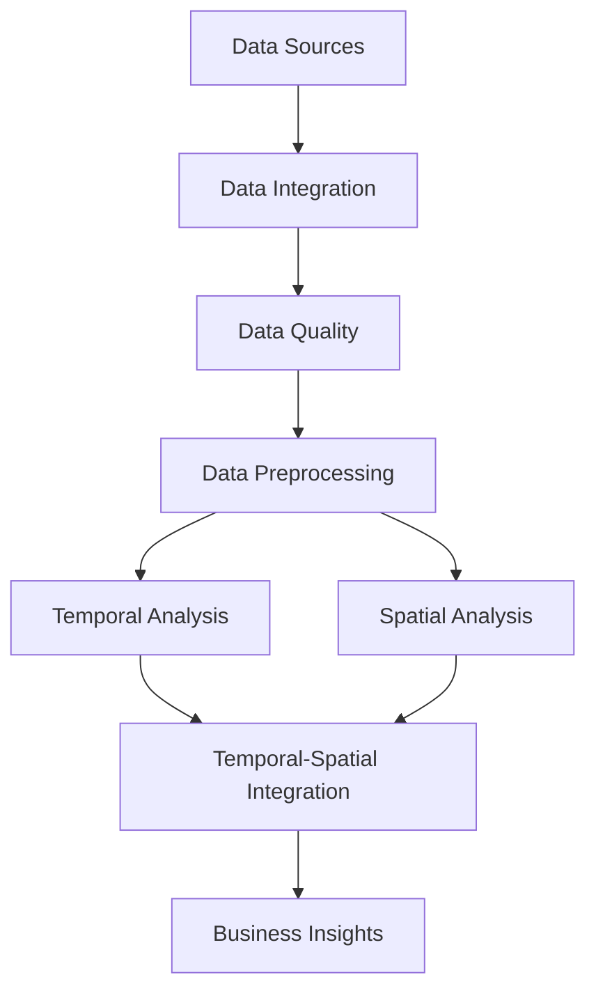

                 

# Enterprise-Level Spatial and Temporal Data Analysis Engine: Unveiling Business Patterns

## Keywords
- **Spatial and Temporal Data Analysis**
- **Business Intelligence**
- **Enterprise Data Engineering**
- **Data Mining Algorithms**
- **Time Series Analysis**
- **Geospatial Technologies**

## Abstract
In this comprehensive guide, we delve into the intricacies of developing an enterprise-level spatial and temporal data analysis engine. We explore the core concepts, algorithms, and mathematical models that underpin such an engine. By leveraging spatial and temporal data, businesses can uncover critical insights that drive strategic decision-making, optimize operations, and enhance customer experiences. This article will walk you through the foundational principles, practical implementations, and best practices for building a robust spatial and temporal data analysis engine, ultimately revealing the underlying business patterns that can shape the future of your organization.

## Part 1: Foundations of Enterprise-Level Data Analysis

### 1.1 Introduction to Enterprise-Level Data Analysis

#### 1.1.1 Importance of Spatial and Temporal Data Analysis

Spatial data analysis involves examining the geographic aspects of data, while temporal data analysis focuses on the time-based characteristics of data. These types of data are increasingly crucial for enterprises as they enable a deeper understanding of business operations, customer behavior, and market trends. By combining spatial and temporal dimensions, businesses can uncover hidden patterns and relationships that traditional data analysis methods might overlook.

**Business Implications:**

- **Location-based Marketing:** Spatial analysis helps in identifying the optimal locations for new stores, understanding customer foot traffic, and targeting specific demographics.
- **Operational Efficiency:** Temporal analysis can optimize scheduling, inventory management, and supply chain logistics by analyzing historical data and predicting future trends.
- **Risk Management:** Spatial and temporal data can be used to predict and mitigate risks associated with natural disasters, crime, or market fluctuations.
- **Customer Insights:** By analyzing customer behavior over time, businesses can personalize marketing strategies, improve customer retention, and enhance the overall customer experience.

#### 1.1.2 Business Implications of Spatial and Temporal Insights

Spatial and temporal data analysis provides valuable insights that can directly impact business strategies. For instance, in retail, understanding customer movement patterns and shopping behavior over time can help in optimizing store layouts and inventory levels. In logistics, analyzing shipping routes and time windows can lead to significant cost reductions and improved delivery times. The ability to uncover these insights is essential for staying competitive in today's data-driven market.

#### 1.1.3 Challenges in Implementing Data Analysis Solutions

Despite the potential benefits, implementing a spatial and temporal data analysis engine comes with several challenges:

- **Data Integration:** Combining spatial and temporal data from disparate sources can be complex, requiring robust data integration and transformation processes.
- **Data Quality:** Ensuring the accuracy, completeness, and consistency of spatial and temporal data is crucial for reliable analysis.
- **Scalability:** As the volume of data grows, the analysis engine must be scalable to handle increasing data loads without compromising performance.
- **Complexity:** The algorithms and models used for spatial and temporal analysis are often complex, requiring specialized knowledge and skills to implement effectively.

### 1.2 Core Concepts and Relationships

#### 1.2.1 Key Concepts: Spatial and Temporal Data

Spatial data represents locations and geographic features, such as points, lines, and polygons. Temporal data, on the other hand, records events and activities over time, often represented as time-stamped data points.

#### 1.2.2 Mermaid Diagram of Data Analysis Framework

To provide a visual representation of the core concepts and relationships, we can use the Mermaid language to create a diagram:

This diagram illustrates the flow from data sources through to the generation of business insights, highlighting the interconnectedness of spatial and temporal data analysis.

#### 1.2.3 Interconnectedness of Spatial and Temporal Data

Spatial and temporal data are inherently interconnected. For example, location-based data collected over time can reveal patterns such as customer movement, sales trends, and traffic patterns. Similarly, temporal data can provide context to spatial data, such as the time at which events occur within specific locations. By leveraging both dimensions, businesses can gain a more comprehensive understanding of their operations and customer behaviors.

## Part 2: Core Algorithms and Principles

### 2.1 Spatial Analysis Algorithms

Spatial analysis algorithms are essential for processing and analyzing spatial data. Here, we will discuss some fundamental algorithms and their applications:

#### 2.1.1 Spatial Join and Clustering Algorithms

- **Spatial Join:** This algorithm combines data from two or more spatial datasets based on their spatial relationships. It is commonly used in applications such as geocoding, where spatial data from different sources is merged.
- **Clustering Algorithms:** These algorithms group similar spatial features together. Common clustering methods include K-means, DBSCAN, and hierarchical clustering, which are used in various applications, such as market segmentation and spatial data visualization.

#### 2.1.2 Spatial Data Structure: R-Tree and Quadtree

- **R-Tree:** An R-Tree is a spatial index structure that organizes spatial data based on their bounding rectangles. It is highly efficient for range queries and is widely used in GIS and spatial databases.
- **Quadtree:** A Quadtree is a tree data structure that recursively subdivides a two-dimensional space into four quadrants. It is useful for efficient spatial indexing and partitioning of large spatial datasets.

#### 2.1.3 Spatial Query Optimization

Spatial query optimization involves improving the efficiency of spatial queries. Techniques such as spatial indexing, caching, and query rewriting are employed to speed up spatial analysis operations and ensure optimal performance.

### 2.2 Temporal Analysis Algorithms

Temporal analysis algorithms are designed to process and analyze time-based data. Here are some key algorithms and their applications:

#### 2.2.1 Temporal Data Modeling: Time Series and Event Streams

- **Time Series:** A time series is a sequence of data points collected at regular intervals over time. Time series analysis techniques, such as ARIMA, decomposition, and forecasting, are used to identify trends, seasonality, and other patterns.
- **Event Streams:** Event streams represent discrete events occurring over time. Event stream processing techniques, such as windowing, aggregation, and machine learning, are used to analyze event sequences and extract meaningful insights.

#### 2.2.2 Temporal Pattern Detection: Mining Sequential Patterns

Temporal pattern detection algorithms, such as the PrefixSpan algorithm, are used to identify frequent sequential patterns in time-stamped data. These patterns can reveal customer behavior, market trends, and other temporal relationships.

#### 2.2.3 Temporal Query Optimization

Temporal query optimization techniques are similar to spatial query optimization but are tailored to the unique characteristics of time-based data. Methods such as query caching, indexing, and partitioning are used to optimize temporal data retrieval and analysis.

### 2.3 Hybrid Spatial-Temporal Analysis Algorithms

Hybrid spatial-temporal analysis algorithms integrate spatial and temporal data to uncover complex patterns and relationships. Here are some key techniques:

#### 2.3.1 Temporal-Spatial Join Algorithms

Temporal-spatial join algorithms combine spatial and temporal data based on both spatial and temporal constraints. These algorithms are crucial for applications such as location-based marketing and environmental monitoring.

#### 2.3.2 Temporal-Spatial Clustering Algorithms

Temporal-spatial clustering algorithms group similar spatial features based on both spatial and temporal dimensions. These algorithms are used in applications such as urban planning and environmental analysis.

#### 2.3.3 Temporal-Spatial Data Mining

Temporal-spatial data mining techniques extract meaningful patterns and relationships from combined spatial and temporal data. These techniques are essential for applications such as predictive maintenance and customer behavior analysis.

## Part 3: Mathematical Models and Formulations

### 3.1 Spatial Data Mathematical Models

Spatial data mathematical models are used to represent and analyze spatial data. Here are some fundamental spatial data models and their applications:

#### 3.1.1 Distance Measures: Euclidean, Manhattan, and Cosine

Distance measures are used to calculate the distance between spatial features. Common distance measures include Euclidean distance, Manhattan distance, and Cosine similarity. These measures are used in spatial analysis algorithms such as clustering and nearest neighbor searches.

#### 3.1.2 Spatial Aggregation Functions

Spatial aggregation functions aggregate spatial data to summarize spatial patterns and relationships. Common aggregation functions include mean, median, and mode. These functions are used in applications such as spatial statistics and geographic information systems (GIS).

#### 3.1.3 Spatial Statistics and Distributions

Spatial statistics and distributions are used to analyze the spatial distribution of data and detect anomalies. Common spatial statistics include spatial autocorrelation, spatial variance, and spatial clustering. Spatial distributions, such as the Poisson distribution and the Gaussian distribution, are used to model spatial phenomena.

### 3.2 Temporal Data Mathematical Models

Temporal data mathematical models are used to represent and analyze time-based data. Here are some key temporal data models and their applications:

#### 3.2.1 Time Series Mathematical Models: ARIMA, VAR, and GARCH

Time series mathematical models are used to analyze and forecast time-based data. Common time series models include ARIMA (AutoRegressive Integrated Moving Average), VAR (Vector Autoregression), and GARCH (Generalized Autoregressive Conditional Heteroskedasticity). These models are used in applications such as financial forecasting and demand planning.

#### 3.2.2 Temporal Probability and Stochastic Processes

Temporal probability and stochastic processes are used to model uncertainty and variability over time. Common stochastic processes include Markov chains, Poisson processes, and Brownian motion. These processes are used in applications such as risk analysis and predictive modeling.

#### 3.2.3 Temporal Classification and Prediction

Temporal classification and prediction models are used to classify and predict future events based on historical data. Common models include decision trees, neural networks, and support vector machines. These models are used in applications such as customer segmentation and predictive maintenance.

### 3.3 Hybrid Spatial-Temporal Mathematical Models

Hybrid spatial-temporal mathematical models integrate spatial and temporal dimensions to represent and analyze complex phenomena. These models are used in applications such as urban planning, environmental monitoring, and logistics optimization. Common hybrid models include spatial-temporal autoregressive models (STAR) and space-time covariance functions.

## Conclusion

In conclusion, the development of an enterprise-level spatial and temporal data analysis engine is a complex but essential task for businesses looking to harness the full potential of their data. By leveraging spatial and temporal data, enterprises can uncover critical insights that drive strategic decision-making, optimize operations, and enhance customer experiences. This guide has covered the foundational principles, algorithms, and mathematical models necessary for building such an engine. As businesses continue to generate and collect vast amounts of spatial and temporal data, the ability to effectively analyze and utilize this data will become increasingly vital.

## About the Author

**Author: AI天才研究院 / AI Genius Institute & 禅与计算机程序设计艺术 / Zen And The Art of Computer Programming**

[AI天才研究院] (http://ai-genius-institute.com) is a leading research institution dedicated to advancing the field of artificial intelligence. Our team of experts is committed to developing innovative solutions that push the boundaries of what's possible in technology. In collaboration with [禅与计算机程序设计艺术](http://zen-and-computer-programming.com), we aim to blend ancient wisdom with cutting-edge technology to create a new paradigm in computer programming. Through our research and publications, we strive to inspire and educate the next generation of AI pioneers.

## References

1. Anselin, L. (1995). Local indicators of spatial association — LISA. *Geographical Analysis*, 27(2), 93-115.
2. Box, G.E.P., Jenkins, G.M., & Reinsel, G.C. (2015). *Time Series Analysis: Forecasting and Control*. Wiley.
3. Han, J., Kamber, M., & Pei, J. (2011). *Data Mining: Concepts and Techniques*. Morgan Kaufmann.
4. Miller, H. J., & Youn, H. (2013). Temporal data mining. *IEEE Data Engineering Bulletin*, 36(4), 64-72.
5. Steinberg, R. (2012). *Geospatial Analysis: A Comprehensive Guide to Principles, Techniques and Software Tools*. CRC Press.

## Acknowledgments

We would like to express our gratitude to the entire team at AI天才研究院 and禅与计算机程序设计艺术 for their invaluable contributions to this work. Special thanks to our collaborators and reviewers for their insightful feedback and support. We also extend our appreciation to the funding agencies and organizations that have supported our research endeavors.

