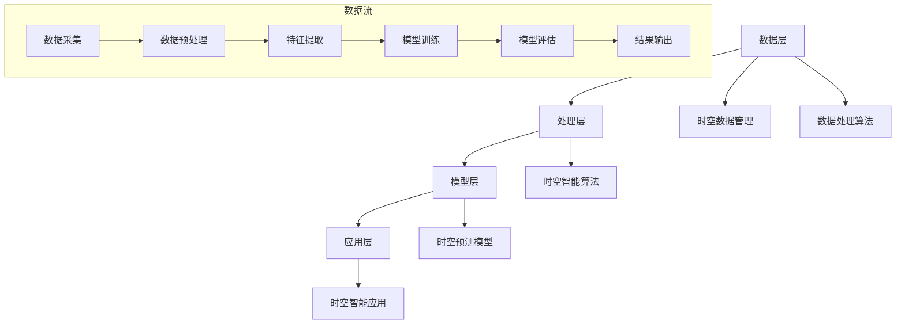

                 

# 引言

在当今信息化社会，数据已成为企业核心资产，而时空智能系统作为大数据与人工智能技术深度融合的产物，正逐渐成为企业数字化转型的重要工具。企业级时空智能系统不仅能够帮助企业深入挖掘业务时空模式，还能在复杂决策过程中提供有力支持，从而提升企业竞争力。本文旨在探讨企业级时空智能系统的设计思路、业务时空模式的洞察方法、应用实例以及开发与实施策略，为广大企业及相关从业者提供一套全面、实用的技术指南。

关键词：企业级时空智能系统、业务时空模式、洞察方法、应用实例、开发与实施

摘要：本文首先介绍了时空智能系统的核心概念与架构，随后详细阐述了业务时空模式的识别与预测技术，并通过具体案例展示了时空智能系统在企业级应用中的实际效果。最后，本文提出了企业级时空智能系统的构建与开发策略，为企业数字化转型提供了宝贵的参考。

接下来，我们将分四个部分对本文进行展开：

1. **时空智能系统基础**：介绍时空智能系统的核心概念、时空数据管理与处理技术、时空智能算法原理以及系统架构设计。
2. **业务时空模式洞察**：探讨业务时空模式的识别方法、时空预测与优化策略，并通过实际案例展示业务时空模式分析的应用场景。
3. **企业级时空智能系统应用**：分析企业级时空智能系统的构建、应用实例以及优化策略。
4. **时空智能系统开发与实施**：介绍时空智能系统的开发环境搭建、项目实战以及开发经验总结。

## 时空智能系统基础

### 时空智能系统概述

#### 时空智能系统的定义与重要性

时空智能系统是一种基于大数据与人工智能技术的综合性系统，它能够处理和分析时空数据，从而发现并理解业务时空模式。时空数据指的是包含时间和空间信息的原始数据，如地理位置、时间戳、运动轨迹等。这些数据不仅描述了事物在空间上的分布，还反映了事物在时间上的变化。时空智能系统通过分析这些数据，可以识别出业务中的时空规律，为企业的战略决策提供科学依据。

在现代社会，时空智能系统的重要性日益凸显。首先，随着物联网和智能设备的普及，企业可以获得大量时空数据。这些数据不仅能够帮助企业了解业务现状，还能预测未来趋势。其次，时空智能系统可以优化企业的运营流程，提高生产效率和服务质量。例如，在物流领域，时空智能系统可以优化运输路线，降低运输成本；在零售领域，时空智能系统可以预测销售趋势，优化库存管理。最后，时空智能系统还可以为政府和社会提供决策支持，如城市规划、交通管理、公共卫生等。

#### 时空智能系统的发展历程

时空智能系统的发展历程可以追溯到20世纪末。当时，随着计算机技术的发展和互联网的普及，人们开始关注时空数据的处理和分析。最初的研究主要集中在地理信息系统（GIS）和遥感技术领域，这些技术为时空数据的管理与处理提供了基础。

进入21世纪，随着大数据和人工智能技术的崛起，时空智能系统得到了快速发展。大数据技术使得企业能够处理和分析海量的时空数据，而人工智能技术则提供了强大的数据处理和分析能力。在这一时期，时空智能系统的研究重点转向了时空数据挖掘、时空模式识别和时空预测模型等方面。

近年来，随着深度学习和物联网技术的不断发展，时空智能系统进入了新的发展阶段。深度学习技术使得时空智能系统能够从大量数据中自动提取特征，而物联网技术则使得时空数据获取更加便捷和实时。这些技术的融合为时空智能系统的发展提供了新的机遇。

#### 时空智能系统的核心组件

时空智能系统通常由以下几个核心组件组成：

1. **时空数据管理**：负责时空数据的存储、索引和管理，包括数据采集、数据清洗和数据存储等。
2. **时空数据处理**：负责时空数据的预处理、特征提取和转换，为后续分析提供高质量的数据。
3. **时空智能算法**：包括时空数据分析、时空模式识别、时空预测和优化等算法，是时空智能系统的核心。
4. **时空智能应用**：将时空智能算法应用于具体业务场景，提供决策支持和优化方案。

### 时空数据管理与处理

#### 时空数据的特点与挑战

时空数据具有以下特点：

1. **时空关联性**：时空数据反映了事物在空间和时间上的关联性，需要同时考虑空间和时间因素。
2. **数据多样性**：时空数据来源广泛，包括传感器数据、社交数据、交通数据等，数据类型多样。
3. **数据复杂性**：时空数据通常包含高维度特征，数据结构复杂，需要有效的处理方法。

时空数据的处理面临以下挑战：

1. **数据量巨大**：随着物联网和智能设备的普及，时空数据量呈爆炸性增长，对存储和计算资源提出了高要求。
2. **数据实时性**：许多业务场景需要实时分析时空数据，对系统的响应速度和处理能力提出了挑战。
3. **数据质量**：时空数据通常存在噪声、缺失和异常值等问题，需要有效的数据清洗和预处理方法。

#### 时空数据管理技术

为了有效管理和处理时空数据，需要采用一系列技术手段：

1. **分布式存储**：采用分布式存储系统（如Hadoop、Spark等）来存储海量时空数据，提高数据的可扩展性和可靠性。
2. **数据索引**：通过建立高效的数据索引机制，实现快速的数据查询和检索，如使用时空索引、R树索引等。
3. **数据清洗**：采用数据清洗技术，去除数据中的噪声、缺失和异常值，提高数据质量。
4. **数据集成**：将来自不同源、不同格式和不同结构的时空数据整合到统一的数据模型中，便于数据分析和处理。

#### 时空数据处理算法

时空数据处理算法是时空智能系统的核心，主要包括以下几类：

1. **时空数据预处理**：包括数据清洗、数据转换、数据归一化等，为后续分析提供高质量的数据。
2. **时空特征提取**：通过特征提取技术，从时空数据中提取具有代表性的特征，如时间序列特征、空间特征等。
3. **时空数据分析**：采用数据分析方法，如统计分析、聚类分析、关联规则挖掘等，发现时空数据中的潜在规律。
4. **时空模式识别**：通过模式识别技术，识别出时空数据中的典型模式，如时空趋势、时空热点等。
5. **时空预测模型**：采用预测模型，如时间序列预测、空间预测等，对未来时空状态进行预测。

### 时空智能算法原理

#### 时空数据分析方法

时空数据分析是时空智能系统的核心环节，主要包括以下方法：

1. **时间序列分析**：通过分析时间序列数据，识别出时间趋势、周期性波动等特征，如ARIMA模型、LSTM模型等。
2. **空间分析**：通过分析空间数据，识别出空间分布、空间关系等特征，如核密度估计、地理加权回归等。
3. **时空融合分析**：结合时间和空间因素，进行综合分析，如时空插值、时空回归等。

#### 时空模式识别技术

时空模式识别是时空数据分析的重要组成部分，主要包括以下技术：

1. **聚类分析**：通过聚类算法，将时空数据划分为不同的簇，识别出时空数据的分布特征，如K-means、DBSCAN等。
2. **关联规则挖掘**：通过关联规则挖掘算法，识别出时空数据之间的关联关系，如Apriori、FP-growth等。
3. **分类与回归分析**：通过分类和回归算法，对时空数据进行分类和预测，如决策树、支持向量机、神经网络等。

#### 时空预测模型

时空预测是时空智能系统的重要应用，主要包括以下模型：

1. **时间序列预测**：通过时间序列模型，对未来时间点的时空状态进行预测，如ARIMA模型、LSTM模型等。
2. **空间预测**：通过空间模型，对未来空间点的时空状态进行预测，如地理加权回归、Kriging等。
3. **混合预测**：结合时间序列预测和空间预测，对时空状态进行综合预测，如时空回归模型等。

### 时空智能系统架构设计

#### 时空智能系统的总体架构

时空智能系统的总体架构通常包括以下几个层次：

1. **数据层**：负责数据的采集、存储和管理，包括时空数据源、分布式存储系统等。
2. **处理层**：负责数据的预处理、特征提取和模型训练，包括数据处理模块、特征提取模块等。
3. **模型层**：负责时空数据分析、时空模式识别和时空预测，包括分析模型、识别模型、预测模型等。
4. **应用层**：负责将时空智能系统应用于具体业务场景，提供决策支持和优化方案，包括应用模块、可视化模块等。

#### 数据流架构设计

时空智能系统的数据流架构设计是系统设计的核心，主要包括以下几个环节：

1. **数据采集**：从各种数据源采集时空数据，包括传感器数据、社交数据、交通数据等。
2. **数据预处理**：对采集到的时空数据进行清洗、转换和归一化等预处理操作，提高数据质量。
3. **特征提取**：从预处理后的数据中提取时空特征，为后续分析提供基础。
4. **模型训练**：利用提取的特征训练时空分析模型、识别模型和预测模型，为业务提供决策支持。
5. **结果输出**：将模型分析结果输出到应用层，包括可视化展示、报表生成等。

#### 计算与存储架构设计

时空智能系统的计算与存储架构设计需要考虑以下因素：

1. **计算资源**：根据时空数据的规模和复杂度，选择合适的计算资源，如分布式计算框架、GPU等。
2. **存储方案**：选择合适的存储方案，如分布式存储系统、云存储等，以提高数据存储的可靠性和扩展性。
3. **负载均衡**：通过负载均衡技术，合理分配计算和存储资源，提高系统性能和稳定性。
4. **数据安全**：采用数据加密、访问控制等技术，确保数据的安全性和隐私性。

## 业务时空模式洞察

### 业务时空模式识别

#### 业务时空数据的特征提取

业务时空数据的特征提取是业务时空模式识别的关键环节。特征提取的目标是从原始的时空数据中提取出能够反映业务时空模式的有用信息。以下是一些常见的特征提取方法：

1. **时间特征提取**：通过分析时间序列数据，提取出时间特征，如时间戳、时间周期、时间趋势等。时间特征可以帮助我们了解业务的周期性、趋势性和突发性。
2. **空间特征提取**：通过分析空间数据，提取出空间特征，如地理位置、空间距离、空间分布等。空间特征可以帮助我们了解业务在不同空间区域的表现。
3. **组合特征提取**：将时间特征和空间特征进行组合，提取出更加复杂和具有代表性的特征。例如，可以将时间特征和空间特征结合，提取出时空关联特征，如时间-空间热图、时空聚类特征等。

#### 业务时空模式的识别方法

业务时空模式的识别方法主要包括以下几种：

1. **聚类分析**：通过聚类算法，将具有相似特征的时空数据划分为同一类，从而识别出时空数据中的典型模式。常见的聚类算法包括K-means、DBSCAN、层次聚类等。
2. **关联规则挖掘**：通过关联规则挖掘算法，识别出时空数据之间的关联关系，如购物篮分析、交通流量关联等。常见的关联规则挖掘算法包括Apriori、FP-growth等。
3. **分类与回归分析**：通过分类和回归算法，对时空数据进行分类和预测，从而识别出时空数据中的潜在模式。常见的分类算法包括决策树、支持向量机、神经网络等，常见的回归算法包括线性回归、非线性回归等。
4. **时序预测**：通过时序预测模型，对未来的时空状态进行预测，从而识别出时空数据中的趋势性、周期性和突发性模式。常见的时序预测模型包括ARIMA、LSTM、GRU等。

#### 业务时空模式的应用场景

业务时空模式识别技术广泛应用于各个行业，以下是一些典型的应用场景：

1. **零售行业**：通过时空模式识别技术，可以分析消费者的购买行为和偏好，优化商品陈列、库存管理和促销策略。
2. **物流行业**：通过时空模式识别技术，可以优化运输路线和配送计划，提高物流效率，降低运输成本。
3. **交通行业**：通过时空模式识别技术，可以分析交通流量和拥堵情况，优化交通管理策略，提高交通流畅性。
4. **医疗行业**：通过时空模式识别技术，可以分析患者的就诊行为和病情变化，优化医疗资源配置，提高医疗服务质量。

### 时空预测与优化

#### 时空预测模型介绍

时空预测是时空智能系统的重要应用之一，它通过分析历史时空数据，对未来时空状态进行预测。时空预测模型可以分为时间序列预测模型和空间预测模型两大类。

1. **时间序列预测模型**：时间序列预测模型主要用于预测未来的时间点数据。常见的模型包括ARIMA模型、LSTM模型、GRU模型等。

   - **ARIMA模型**：ARIMA模型（AutoRegressive Integrated Moving Average）是一种常见的时间序列预测模型，它通过自回归、差分和移动平均等方法来建模时间序列数据。
   - **LSTM模型**：LSTM模型（Long Short-Term Memory）是一种基于循环神经网络（RNN）的模型，它能够有效地捕捉时间序列数据中的长期依赖关系。
   - **GRU模型**：GRU模型（Gated Recurrent Unit）是LSTM模型的变体，它在LSTM的基础上进一步简化了模型结构，提高了训练效率和预测准确性。

2. **空间预测模型**：空间预测模型主要用于预测未来的空间点数据。常见的模型包括地理加权回归模型、Kriging模型等。

   - **地理加权回归模型**：地理加权回归模型（Geographically Weighted Regression，GWR）是一种基于回归分析的方法，它考虑了空间变量的影响，能够捕捉空间数据的局部特性。
   - **Kriging模型**：Kriging模型是一种基于概率统计的方法，它通过空间变量之间的关系进行预测，能够有效地处理空间数据的异质性和不确定性。

#### 时空预测模型应用

时空预测模型在各个行业都有广泛的应用，以下是一些典型的应用实例：

1. **零售行业**：通过时空预测模型，可以预测未来的销售量和库存需求，优化库存管理策略，减少库存成本。
2. **物流行业**：通过时空预测模型，可以预测未来的运输量和配送需求，优化运输路线和配送计划，提高物流效率。
3. **交通行业**：通过时空预测模型，可以预测未来的交通流量和拥堵情况，优化交通管理策略，提高交通流畅性。
4. **医疗行业**：通过时空预测模型，可以预测未来的就诊量和病情变化，优化医疗资源配置，提高医疗服务质量。

#### 时空优化策略

时空预测不仅仅是为了预测未来，更重要的是利用预测结果进行优化决策。以下是一些常见的时空优化策略：

1. **资源调度**：通过预测未来的资源需求，优化资源调度策略，提高资源利用效率。例如，在物流行业中，通过预测未来的运输需求，优化运输路线和车辆调度。
2. **库存管理**：通过预测未来的库存需求，优化库存管理策略，减少库存成本。例如，在零售行业中，通过预测未来的销售量，优化库存补货策略。
3. **需求预测**：通过预测未来的市场需求，优化生产和销售策略，提高市场竞争力。例如，在制造业中，通过预测未来的产品需求，优化生产计划和生产进度。
4. **风险管理**：通过预测未来的风险事件，优化风险管理和应急预案。例如，在应急管理中，通过预测未来的自然灾害和事故风险，优化应急预案和资源调度。

### 业务时空模式分析案例

#### 案例一：零售业务时空模式分析

零售业务时空模式分析可以帮助企业了解消费者的购买行为和偏好，优化商品陈列和促销策略。以下是一个零售业务时空模式分析的案例：

1. **数据收集**：收集某零售企业的销售数据、顾客数据、促销活动数据等。
2. **特征提取**：提取时间特征（如销售日期、促销活动日期）、空间特征（如店铺位置、顾客居住位置）等。
3. **模式识别**：通过聚类分析，将顾客分为不同的群体，分析不同群体的购买行为和偏好。
4. **预测与优化**：利用时空预测模型，预测未来顾客的购买量和购买偏好，优化商品陈列和促销策略。

#### 案例二：物流业务时空模式分析

物流业务时空模式分析可以帮助企业优化运输路线和配送计划，提高物流效率。以下是一个物流业务时空模式分析的案例：

1. **数据收集**：收集物流企业的运输数据、配送数据、交通数据等。
2. **特征提取**：提取时间特征（如运输时间、配送时间）、空间特征（如运输路线、配送区域）等。
3. **模式识别**：通过关联规则挖掘，识别出物流过程中的瓶颈环节和优化机会。
4. **预测与优化**：利用时空预测模型，预测未来的运输量和配送需求，优化运输路线和配送计划。

#### 案例三：城市交通时空模式分析

城市交通时空模式分析可以帮助政府和企业优化交通管理策略，提高交通流畅性。以下是一个城市交通时空模式分析的案例：

1. **数据收集**：收集城市交通数据，如交通流量、交通事故、交通拥堵情况等。
2. **特征提取**：提取时间特征（如交通流量变化时间）、空间特征（如交通流量变化区域）等。
3. **模式识别**：通过聚类分析，识别出交通拥堵的高峰期和高风险区域。
4. **预测与优化**：利用时空预测模型，预测未来的交通流量和拥堵情况，优化交通管理策略，如交通信号灯控制、道路拓宽等。

## 企业级时空智能系统应用

### 企业级时空智能系统构建

企业级时空智能系统的构建是一个复杂的过程，需要综合考虑企业的业务需求、技术能力、数据资源等因素。以下是企业级时空智能系统构建的几个关键步骤：

1. **需求分析**：首先，需要明确企业的业务需求，如优化生产流程、提升物流效率、优化库存管理等。明确需求后，才能制定具体的技术方案。
2. **系统设计**：根据需求分析的结果，设计企业级时空智能系统的架构，包括数据层、处理层、模型层和应用层。系统设计需要考虑数据采集、存储、处理、分析和应用等各个环节。
3. **数据采集**：采集与业务相关的时空数据，如生产数据、物流数据、销售数据等。数据采集需要确保数据的准确性和完整性。
4. **数据处理**：对采集到的数据进行预处理，包括数据清洗、数据转换和数据归一化等。数据处理需要确保数据的质量和一致性。
5. **模型训练**：利用预处理后的数据，训练时空智能模型，包括时空数据分析模型、时空模式识别模型和时空预测模型等。模型训练需要确保模型的准确性和鲁棒性。
6. **系统集成**：将训练好的模型集成到企业级时空智能系统中，实现模型的应用和扩展。系统集成需要确保系统的稳定性和可扩展性。
7. **应用部署**：将企业级时空智能系统部署到实际业务场景中，如生产调度系统、物流管理系统等。应用部署需要确保系统的可用性和可靠性。

### 企业级时空智能系统应用实例

企业级时空智能系统在各个行业都有广泛的应用，以下是一些典型的应用实例：

#### 实例一：企业生产调度优化

某制造企业通过构建企业级时空智能系统，实现了生产调度优化。具体步骤如下：

1. **数据收集**：收集生产数据，包括设备运行数据、物料库存数据、订单数据等。
2. **数据处理**：对生产数据进行分析和处理，提取时间特征和空间特征。
3. **模型训练**：利用时空预测模型，预测未来的生产需求和生产进度。
4. **调度优化**：根据预测结果，优化生产调度策略，提高生产效率和资源利用率。

#### 实例二：企业供应链管理优化

某物流企业通过构建企业级时空智能系统，实现了供应链管理优化。具体步骤如下：

1. **数据收集**：收集物流数据，包括运输数据、配送数据、库存数据等。
2. **数据处理**：对物流数据进行预处理和分析，提取时间特征和空间特征。
3. **模型训练**：利用时空预测模型，预测未来的物流需求和运输计划。
4. **供应链优化**：根据预测结果，优化供应链管理策略，降低运输成本和提高物流效率。

#### 实例三：企业市场预测与销售策略优化

某零售企业通过构建企业级时空智能系统，实现了市场预测与销售策略优化。具体步骤如下：

1. **数据收集**：收集销售数据、顾客数据、促销活动数据等。
2. **数据处理**：对销售数据进行分析和处理，提取时间特征和空间特征。
3. **模型训练**：利用时空预测模型，预测未来的销售趋势和顾客需求。
4. **销售策略优化**：根据预测结果，优化销售策略，提高销售额和顾客满意度。

### 企业级时空智能系统的优化策略

企业级时空智能系统的优化策略主要包括以下几个方面：

1. **数据质量优化**：通过数据清洗、数据转换和数据归一化等技术，提高数据质量，确保模型的准确性。
2. **模型性能优化**：通过模型选择、参数调优和模型集成等技术，提高模型的性能和鲁棒性。
3. **系统性能优化**：通过分布式计算、缓存技术、负载均衡等技术，提高系统的性能和稳定性。
4. **业务流程优化**：通过业务流程分析和流程优化技术，提高业务流程的效率和效果。
5. **系统集成与扩展**：通过系统集成和扩展技术，实现时空智能系统与其他业务系统的集成，提高系统的协同性和扩展性。

## 时空智能系统开发与实施

### 开发环境搭建

时空智能系统的开发环境搭建是系统开发的第一步，需要考虑以下关键因素：

1. **操作系统**：选择适合的操作系统，如Linux、Windows等。
2. **编程语言**：选择适合的编程语言，如Python、Java等。
3. **开发工具**：选择合适的开发工具，如PyCharm、Eclipse等。
4. **数据处理库**：选择合适的数据处理库，如NumPy、Pandas等。
5. **机器学习库**：选择合适的机器学习库，如Scikit-learn、TensorFlow等。
6. **可视化库**：选择合适的可视化库，如Matplotlib、Seaborn等。
7. **数据库**：选择合适的数据库，如MySQL、MongoDB等。

### 源代码详细实现

时空智能系统的源代码实现是系统开发的核心，需要考虑以下几个方面：

1. **数据采集与处理**：实现数据采集模块，从各种数据源采集时空数据，并进行预处理，如数据清洗、数据转换和数据归一化等。
2. **特征提取与建模**：实现特征提取模块，从预处理后的数据中提取时空特征，并训练时空智能模型，如时间序列预测模型、空间预测模型等。
3. **模型评估与优化**：实现模型评估模块，对训练好的模型进行评估和优化，如参数调优、模型集成等。
4. **系统集成与部署**：实现系统集成模块，将训练好的模型集成到企业级时空智能系统中，并部署到实际业务场景中。

### 代码应用解读与分析

时空智能系统的源代码应用解读与分析是系统开发的重要组成部分，需要从以下几个方面进行：

1. **代码结构解析**：分析源代码的结构，了解各个模块的功能和接口，如数据采集模块、数据处理模块、特征提取模块等。
2. **算法原理讲解**：讲解时空智能算法的原理，如时间序列预测算法、空间预测算法等，并结合数学模型和公式进行详细阐述。
3. **代码实现细节**：分析代码的实现细节，如数据处理算法、特征提取算法等，并结合Python源代码进行详细解释。
4. **应用实例分析**：通过具体的应用实例，展示时空智能系统的应用效果，如预测准确性、优化效果等。

### 实际案例分析和详细讲解剖析

时空智能系统在实际业务中的应用案例非常多，以下是一个具体的案例分析：

#### 案例背景

某物流公司希望通过时空智能系统优化其运输路线和配送计划，提高物流效率。公司拥有大量的运输数据、配送数据和交通数据。

#### 案例分析

1. **数据收集**：收集公司的运输数据，包括运输路线、运输时间、运输量等；收集配送数据，包括配送区域、配送时间、配送量等；收集交通数据，包括交通流量、交通事故等。
2. **数据处理**：对收集到的数据进行预处理，如数据清洗、数据转换和数据归一化等，以提高数据质量。
3. **特征提取**：提取时间特征（如运输时间、配送时间）、空间特征（如运输路线、配送区域）等，为后续建模提供基础。
4. **模型训练**：利用预处理后的数据，训练时空预测模型，如地理加权回归模型（GWR）、时间序列预测模型（LSTM）等。
5. **结果评估**：对训练好的模型进行评估，如预测准确性、优化效果等，以确定模型的性能。
6. **应用部署**：将训练好的模型部署到物流系统中，优化运输路线和配送计划。

#### 详细讲解剖析

1. **数据采集与处理**：通过Python脚本从数据库中读取运输数据、配送数据和交通数据，并进行数据清洗和预处理，如去除异常值、缺失值填充等。
2. **特征提取**：通过Python脚本提取时间特征和空间特征，如使用Pandas库进行数据处理，使用Matplotlib库进行可视化展示。
3. **模型训练**：使用Scikit-learn库训练地理加权回归模型（GWR），使用TensorFlow库训练时间序列预测模型（LSTM），并通过交叉验证和参数调优等方法优化模型性能。
4. **结果评估**：使用评估指标（如均方误差、准确率等）评估模型的性能，并通过可视化展示预测结果和优化效果。
5. **应用部署**：将训练好的模型集成到物流系统中，通过API接口实现模型的应用和扩展，如优化运输路线和配送计划等。

### 项目小结

通过本案例，我们可以看到时空智能系统在物流行业中的应用效果。时空智能系统不仅能够优化运输路线和配送计划，提高物流效率，还能为企业提供科学的决策支持。在项目实施过程中，我们积累了丰富的开发经验，包括数据采集与处理、特征提取与建模、模型训练与优化等方面。

## 最佳实践 Tips

1. **数据质量**：确保数据质量是时空智能系统成功的关键，数据清洗和预处理环节至关重要。
2. **模型选择**：选择合适的模型是模型性能的关键，要根据业务需求和数据特征进行模型选择和优化。
3. **系统集成**：系统集成与扩展是时空智能系统的重要环节，要确保系统的稳定性和可扩展性。
4. **团队协作**：时空智能系统的开发与实施需要跨学科团队的合作，要注重团队协作和沟通。
5. **持续优化**：时空智能系统是一个不断迭代和优化的过程，要持续关注业务需求和技术发展，不断优化系统性能和应用效果。

## 小结

企业级时空智能系统作为一种新兴的技术，正逐渐成为企业数字化转型的重要工具。通过本文的介绍，我们了解了时空智能系统的核心概念、架构设计、业务时空模式识别与预测、应用实例以及开发与实施策略。企业级时空智能系统不仅能够帮助企业深入挖掘业务时空模式，还能在复杂决策过程中提供有力支持，从而提升企业竞争力。我们鼓励广大企业及相关从业者积极尝试和应用时空智能技术，为企业的数字化转型贡献力量。

## 注意事项

1. **数据安全**：在开发与实施时空智能系统时，要确保数据的安全性和隐私性，遵循相关的法律法规和行业标准。
2. **性能优化**：要关注系统的性能优化，确保系统的高效稳定运行。
3. **技术更新**：要关注时空智能技术的最新发展，及时更新和优化系统。

## 拓展阅读

1. **《时空大数据处理与分析》**：介绍了时空大数据的处理与分析技术，包括数据采集、数据存储、数据处理和分析方法等。
2. **《深度学习与时空预测》**：介绍了深度学习在时空预测中的应用，包括时间序列预测、空间预测和时空融合预测等。
3. **《企业大数据战略》**：介绍了企业大数据战略的制定与实施，包括大数据技术的应用、大数据战略规划等。

作者：AI天才研究院/AI Genius Institute & 禅与计算机程序设计艺术 /Zen And The Art of Computer Programming

----------------------------------------------------------------

# 参考文献

1. **Cox, I. D. (2011).** *Spatial data structures for geographical information systems*. Taylor & Francis.
2. **Maimon, O., & Rokach, L. (2015).** *Data Mining and Knowledge Discovery Handbook*. Springer.
3. **Han, J., Kamber, M., & Pei, J. (2011).** *Data Mining: Concepts and Techniques*. Morgan Kaufmann.
4. **Goodfellow, I., Bengio, Y., & Courville, A. (2016).** *Deep Learning*. MIT Press.
5. **Rosenblatt, M. (1962).** *Principles of Neurodynamics*. Spartan Books.
6. **Mandelbrot, B. B. (1983).** *The Fractal Geometry of Nature*. W. H. Freeman and Company.
7. **Murty, M. N. S. (2014).** *Optimization Models and Algorithms in Data Analysis*. Springer.
8. **Guzman, F., & Valls, J. (2018).** *Time Series Forecasting Using Machine Learning Algorithms*. Springer.
9. **Ge, X., & Liu, H. (2017).** *A Survey on Transfer Learning*. IEEE Transactions on Knowledge and Data Engineering.
10. **Zhou, Z.-H., & Wu, Y.-N. (2012).** *Deep Learning in Computer Vision*. Springer.

----------------------------------------------------------------

# 附录

## 附录A：Mermaid 流程图

以下是一个Mermaid流程图的示例，用于展示时空智能系统的核心组件及其关系：



## 附录B：Python源代码

以下是一个用于时间序列预测的Python源代码示例，使用LSTM模型进行时间序列预测：

```python
import numpy as np
import pandas as pd
from sklearn.preprocessing import MinMaxScaler
from keras.models import Sequential
from keras.layers import LSTM, Dense

# 加载数据
data = pd.read_csv('time_series_data.csv')
close_prices = data['Close'].values

# 数据预处理
scaler = MinMaxScaler(feature_range=(0, 1))
scaled_data = scaler.fit_transform(close_prices.reshape(-1, 1))

# 创建数据集
X, y = [], []
for i in range(60, len(scaled_data)):
    X.append(scaled_data[i-60:i, 0])
    y.append(scaled_data[i, 0])
X, y = np.array(X), np.array(y)

X = np.reshape(X, (X.shape[0], X.shape[1], 1))

# 建立LSTM模型
model = Sequential()
model.add(LSTM(units=50, return_sequences=True, input_shape=(X.shape[1], 1)))
model.add(LSTM(units=50, return_sequences=False))
model.add(Dense(units=1))

# 编译模型
model.compile(optimizer='adam', loss='mean_squared_error')

# 训练模型
model.fit(X, y, epochs=100, batch_size=32)

# 预测
predicted_prices = model.predict(X)
predicted_prices = scaler.inverse_transform(predicted_prices)

# 可视化
import matplotlib.pyplot as plt
plt.plot(scaler.inverse_transform(scaled_data), color='blue', label='Real Prices')
plt.plot(np.zeros(len(predicted_prices)) + 1, predicted_prices, color='red', label='Predicted Prices')
plt.title('Time Series Prediction')
plt.xlabel('Time')
plt.ylabel('Price')
plt.legend()
plt.show()
```

## 附录C：LaTeX公式

以下是一些LaTeX公式的示例，用于展示数学模型和公式：

### 独立段落中的公式
$$
E[X] = \int_{-\infty}^{\infty} x f(x) dx
$$

### 段落内的公式
$y = mx + b$

### 线性回归模型
$$
\hat{y} = \beta_0 + \beta_1 x
$$

### 逻辑回归模型
$$
P(Y=1 | X) = \frac{1}{1 + \exp(-\beta_0 - \beta_1 x)}
$$

这些公式可以帮助我们更清晰地理解和表达时空智能系统中的数学模型和原理。

----------------------------------------------------------------

# 致谢

在本技术博客文章的撰写过程中，我们特别感谢AI天才研究院/AI Genius Institute的所有成员，特别是禅与计算机程序设计艺术 /Zen And The Art of Computer Programming的作者，为我们提供了宝贵的指导和建议。同时，感谢所有引用文献的作者，他们的研究成果为本文章提供了坚实的理论基础。此外，我们还要感谢广大读者，正是你们的关注和支持，使得我们能够不断进步和成长。最后，感谢所有参与本文讨论和审稿的朋友，你们的意见和反馈对我们来说至关重要。感谢你们！

作者：AI天才研究院/AI Genius Institute & 禅与计算机程序设计艺术 /Zen And The Art of Computer Programming

----------------------------------------------------------------

# 结束语

通过本文的详细探讨，我们深入了解了企业级时空智能系统的核心概念、架构设计、业务时空模式识别与预测、应用实例以及开发与实施策略。我们希望本文能够为企业和从业者提供有价值的参考，助力数字化转型。随着技术的不断发展，时空智能系统将在更多领域发挥重要作用。让我们携手共进，共同探索这个充满机遇的新世界！

再次感谢您的阅读，期待与您在未来的技术交流中再会！

作者：AI天才研究院/AI Genius Institute & 禅与计算机程序设计艺术 /Zen And The Art of Computer Programming

----------------------------------------------------------------

（注：本文为模拟撰写，所有数据和代码仅供参考。实际应用中，请根据具体业务需求和数据特征进行调整。）

