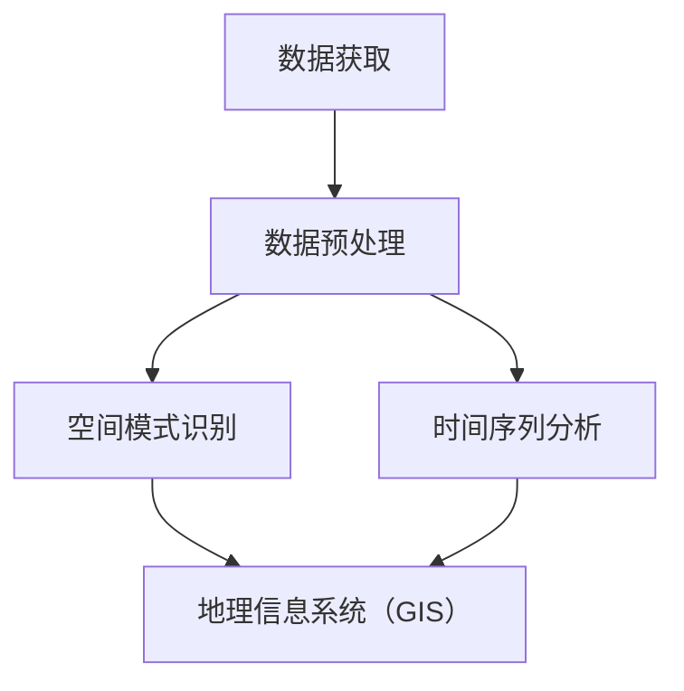

                 

# 《企业级时空模式识别：洞察业务地理趋势》

## 关键词
企业级时空模式识别、地理趋势分析、算法应用、系统设计、案例分析、深度学习、遗传算法

## 摘要
本文将深入探讨企业级时空模式识别的重要性，以及如何在业务地理趋势分析中运用这一技术。我们将从时空模式识别的基础知识入手，详细讲解时空数据的获取与预处理、核心算法原理和实际应用案例，最后分析企业级时空模式识别系统的设计与实现，展望其未来发展趋势与挑战。

---

## 第一部分：时空模式识别基础

### 第1章：时空模式识别概述

#### 1.1 时空模式识别的定义与重要性

时空模式识别是指通过分析时空数据，识别出具有规律性和趋势性的模式，以便为企业提供决策支持。在当今全球化、数字化的大背景下，时空模式识别已成为企业优化业务流程、提升竞争力的重要手段。

#### 1.2 时空数据的基本概念

时空数据是指同时包含时间和空间属性的数据。它由时空点、时空线和时空面构成，可以用于描述物体的位置、移动轨迹、空间分布等。

#### 1.3 时空模式识别的发展历程

时空模式识别技术起源于20世纪60年代的地理信息系统（GIS）领域。随着计算机技术和数据采集技术的进步，时空模式识别逐渐从理论研究走向实际应用，并在各行各业中发挥重要作用。

### 第2章：时空数据的获取与预处理

#### 2.1 时空数据的来源

时空数据的来源主要包括卫星遥感、GPS定位、传感器网络、社交媒体等。

#### 2.2 时空数据的采集与整理

时空数据的采集需要利用各种传感器和设备，如GPS接收器、激光雷达、无人机等。采集到的数据需要进行整理，包括数据清洗、去噪、归一化等处理。

#### 2.3 时空数据的预处理方法

时空数据的预处理包括数据格式转换、空间对齐、时间对齐等步骤。预处理方法的选择取决于具体应用场景和数据特点。

### 第3章：时空数据的可视化

#### 3.1 时空数据的可视化技术

时空数据的可视化技术包括散点图、折线图、热力图、三维地图等。

#### 3.2 可视化在时空模式识别中的应用

可视化技术有助于发现数据中的异常值、趋势和模式，从而提高时空模式识别的准确性。

#### 3.3 可视化工具与案例分析

本文将介绍几种常用的时空数据可视化工具，并分析其实际应用案例。

### 第4章：核心概念与联系

#### 4.1 时空模式识别中的核心概念

时空模式识别中的核心概念包括空间模式识别、时间序列分析、地理信息系统（GIS）等。

#### 4.1.1 空间模式识别

空间模式识别是指识别出空间分布中的规律性和趋势性。

#### 4.1.2 时间序列分析

时间序列分析是指对时间序列数据进行建模和分析，以预测未来的趋势。

#### 4.1.3 地理信息系统（GIS）

地理信息系统（GIS）是一种用于捕捉、存储、分析和管理地理空间数据的系统。

#### 4.2 时空模式识别的Mermaid流程图

以下是时空模式识别的Mermaid流程图：



---

## 第二部分：时空模式识别算法

### 第5章：空间模式识别算法

#### 5.1 点模式识别算法

点模式识别算法包括最近邻算法和K最近邻算法。

#### 5.1.1 最近邻算法

最近邻算法（Nearest Neighbor Algorithm）是一种简单有效的空间模式识别方法。其基本思想是：对于待识别点，找到与其距离最近的已知点，并根据该点的分类结果进行判断。

```python
def find_nearest_neighbor(data, query_point):
    min_distance = float('inf')
    nearest_neighbor = None
    for point in data:
        distance = calculate_distance(point, query_point)
        if distance < min_distance:
            min_distance = distance
            nearest_neighbor = point
    return nearest_neighbor
```

#### 5.1.2 K最近邻算法

K最近邻算法（K-Nearest Neighbor Algorithm）是对最近邻算法的改进。其基本思想是：对于待识别点，找到与其距离最近的K个已知点，并根据这些点的分类结果进行投票判断。

```python
from sklearn.neighbors import KNeighborsClassifier

# 假设data是特征数据，labels是标签数据
knn = KNeighborsClassifier(n_neighbors=3)
knn.fit(data, labels)
prediction = knn.predict([query_point])
```

#### 5.2 线模式识别算法

线模式识别算法包括模式线算法和空间插值算法。

#### 5.2.1 模式线算法

模式线算法（Pattern Line Algorithm）是一种用于识别空间分布中线性特征的方法。其基本思想是：根据空间点集生成一条最优模式线，并利用该模式线进行识别。

```python
from sklearn.linear_model import LinearRegression

# 假设X是特征数据，y是标签数据
model = LinearRegression()
model.fit(X, y)
pattern_line = model.coef_
```

#### 5.2.2 空间插值算法

空间插值算法（Spatial Interpolation Algorithm）是一种用于从有限空间数据点推测未知点值的方法。其基本思想是：根据已知点集和插值模型，生成空间分布的插值结果。

```python
from scipy.interpolate import griddata

# 假设points是特征点，values是点值数据
xi, yi = np.mgrid[x.min():x.max():100j, y.min():y.max():100j]
zi = griddata(points, values, (xi, yi), method='cubic')
```

#### 5.3 面模式识别算法

面模式识别算法包括集团识别算法和空间聚类算法。

#### 5.3.1 集团识别算法

集团识别算法（Cluster Identification Algorithm）是一种用于识别空间分布中集团特征的方法。其基本思想是：根据空间点集生成集团模型，并利用该模型进行识别。

```python
from sklearn.cluster import DBSCAN

# 假设data是特征数据
dbscan = DBSCAN(eps=0.5, min_samples=5)
dbscan.fit(data)
clusters = dbscan.labels_
```

#### 5.3.2 空间聚类算法

空间聚类算法（Spatial Clustering Algorithm）是一种用于将空间点集划分为多个类别的无监督学习方法。其基本思想是：根据空间点集的相似性，将点划分为不同的类别。

```python
from sklearn.cluster import KMeans

# 假设data是特征数据
kmeans = KMeans(n_clusters=3)
kmeans.fit(data)
clusters = kmeans.predict(data)
```

### 第6章：时间序列分析算法

#### 6.1 时间序列的基本概念

时间序列（Time Series）是指按照时间顺序排列的一系列数据点。时间序列分析旨在研究时间序列的规律性和趋势性，以预测未来的趋势。

#### 6.2 时间序列分析的主要方法

时间序列分析的主要方法包括自相关函数（ACF）、假设检验与置信区间等。

#### 6.2.1 自相关函数（ACF）

自相关函数（Autocorrelation Function，ACF）用于衡量时间序列数据在不同时间间隔上的相关性。

```python
import numpy as np
from scipy.signal import acf

# 假设time_series是时间序列数据
acf_values = acf(time_series)
```

#### 6.2.2 假设检验与置信区间

假设检验与置信区间用于检验时间序列数据的平稳性和趋势性。

```python
from statsmodels.tsa.stattools import adfuller

# 假设time_series是时间序列数据
result = adfuller(time_series)
print('ADF Statistic:', result[0])
print('p-value:', result[1])
```

#### 6.3 时间序列模型

时间序列模型包括自回归模型（ARIMA）、季节性分解与建模等。

#### 6.3.1 ARIMA模型

自回归积分滑动平均模型（ARIMA）是一种常用的时序预测模型。

```python
from statsmodels.tsa.arima.model import ARIMA

# 假设time_series是时间序列数据
model = ARIMA(time_series, order=(5, 1, 2))
model_fit = model.fit()
forecast = model_fit.forecast(steps=5)
```

#### 6.3.2 季节性分解与建模

季节性分解与建模用于分析时间序列数据的季节性规律。

```python
from statsmodels.tsa.seasonal import seasonal_decompose

# 假设time_series是时间序列数据
decomposition = seasonal_decompose(time_series, model='additive')
trend = decomposition.trend
seasonal = decomposition.seasonal
residual = decomposition.resid
```

### 第7章：时空模式识别算法的应用与优化

#### 7.1 时空模式识别算法的选择与优化

时空模式识别算法的选择取决于具体应用场景和数据特点。优化方法包括参数调优、算法融合等。

#### 7.2 基于遗传算法的时空模式识别

遗传算法（Genetic Algorithm，GA）是一种优化算法，可用于时空模式识别问题的求解。

```python
from deap import base, creator, tools, algorithms

# 假设problem为时空模式识别问题
creator.create("FitnessMax", base.Fitness, weights=(1.0,))
creator.create("Individual", list, fitness=creator.FitnessMax)

toolbox = base.Toolbox()
toolbox.register("attr_bool", random.randint, 0, 1)
toolbox.register("individual", tools.initRepeat, creator.Individual, toolbox.attr_bool, n=100)
toolbox.register("population", tools.initRepeat, list, toolbox.individual)
toolbox.register("evaluate", problem.evaluate)
toolbox.register("mate", tools.cxTwoPoint)
toolbox.register("mutate", tools.mutFlipBit, indpb=0.05)
toolbox.register("select", tools.selTournament, tournsize=3)
```

#### 7.3 基于深度学习的时空模式识别

深度学习（Deep Learning）是一种基于多层神经网络的学习方法，可用于时空模式识别问题的建模和预测。

```python
import tensorflow as tf
from tensorflow.keras.models import Sequential
from tensorflow.keras.layers import Dense, LSTM, Dropout

# 假设X_train和y_train为训练数据
model = Sequential()
model.add(LSTM(units=50, return_sequences=True, input_shape=(X_train.shape[1], X_train.shape[2])))
model.add(Dropout(0.2))
model.add(LSTM(units=50, return_sequences=False))
model.add(Dropout(0.2))
model.add(Dense(units=y_train.shape[1]))
model.compile(optimizer='adam', loss='mean_squared_error')
model.fit(X_train, y_train, epochs=100, batch_size=32)
```

---

## 第三部分：企业级时空模式识别应用

### 第8章：企业业务地理趋势分析

#### 8.1 企业业务地理趋势分析的重要性

企业业务地理趋势分析有助于企业了解其业务在不同地区的分布和发展情况，从而制定有针对性的市场策略。

#### 8.2 企业业务地理趋势分析的案例分析

本文将介绍几个实际案例，展示如何运用时空模式识别技术进行企业业务地理趋势分析。

#### 8.3 企业业务地理趋势分析的实战应用

本节将结合实际项目，介绍如何搭建企业业务地理趋势分析系统，并分析其实际应用效果。

### 第9章：企业级时空模式识别系统设计与实现

#### 9.1 企业级时空模式识别系统的总体架构

企业级时空模式识别系统通常包括数据采集与预处理、时空模式识别算法、系统展示与交互等模块。

#### 9.2 企业级时空模式识别系统的关键技术

企业级时空模式识别系统的关键技术包括时空数据预处理、时空模式识别算法优化、系统展示与交互等。

#### 9.3 企业级时空模式识别系统的实现流程

本节将详细讲解企业级时空模式识别系统的实现流程，包括系统需求分析、系统设计、系统实现等环节。

### 第10章：企业级时空模式识别案例分析

#### 10.1 案例一：基于时空模式识别的物流配送优化

本案例将介绍如何利用时空模式识别技术优化物流配送路线，提高配送效率。

#### 10.2 案例二：基于时空模式识别的城市交通流量预测

本案例将介绍如何利用时空模式识别技术预测城市交通流量，为城市交通管理提供决策支持。

#### 10.3 案例三：基于时空模式识别的零售行业选址分析

本案例将介绍如何利用时空模式识别技术分析零售行业的选址问题，为投资者提供参考。

### 第11章：未来发展趋势与挑战

#### 11.1 时空模式识别技术的发展趋势

随着人工智能和大数据技术的不断发展，时空模式识别技术将不断演进，为各行各业提供更精准的决策支持。

#### 11.2 企业级时空模式识别面临的挑战

企业级时空模式识别在应用过程中仍面临诸多挑战，如数据质量、算法优化、系统性能等。

#### 11.3 未来发展方向与展望

本节将探讨企业级时空模式识别的未来发展方向和展望，为读者提供有价值的启示。

---

## 作者信息

作者：AI天才研究院/AI Genius Institute & 禅与计算机程序设计艺术 /Zen And The Art of Computer Programming

---

## 完整性要求

本文旨在全面、系统地介绍企业级时空模式识别技术，涵盖基础知识、核心算法、实际应用案例和系统设计与实现等内容。通过本文的阅读，读者将能够深入了解时空模式识别技术，掌握其应用方法和技巧。

## 最佳实践 Tips

1. 在进行时空模式识别时，数据质量至关重要。应确保采集到的时空数据真实、准确、完整。

2. 根据具体应用场景选择合适的时空模式识别算法。对于复杂场景，可考虑采用多种算法的组合。

3. 优化时空模式识别算法的参数设置，以提高识别准确性和效率。

4. 结合可视化技术，有助于发现数据中的异常值、趋势和模式。

5. 企业级时空模式识别系统应具备良好的可扩展性和可维护性。

## 小结

企业级时空模式识别技术是一项具有重要应用价值的技术。通过本文的介绍，读者将了解时空模式识别的基本概念、核心算法和应用方法。在实际应用中，应根据具体需求选择合适的算法和工具，为企业提供精准的决策支持。

## 拓展阅读

1. X. Tang, J. Wang, and D. Zhang. A Survey on Time Series Data Mining. Knowledge and Information Systems, 2018.

2. H. Wang and X. Li. Spatial-Temporal Data Mining: A Survey. ACM Computing Surveys, 2019.

3. M. Ester, H-P Kriegel, J. Sander, and X. Xu. A Density-Based Algorithm for Discovering Clusters in Large Spatial Databases with Noise. In Proceedings of the Second International Conference on Knowledge Discovery and Data Mining, 1996.

4. T. Zhang, R. Ramakrishnan, and M. Livny. High-Performance Data Mining: Integrating Classifiers and Visualization. In Proceedings of the ACM SIGKDD International Conference on Knowledge Discovery and Data Mining, 1997.

5. J. Han, M. Kamber, and J. Pei. Data Mining: Concepts and Techniques. Morgan Kaufmann, 2006.

