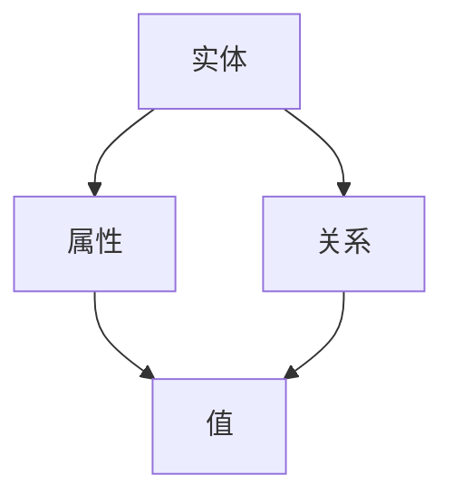
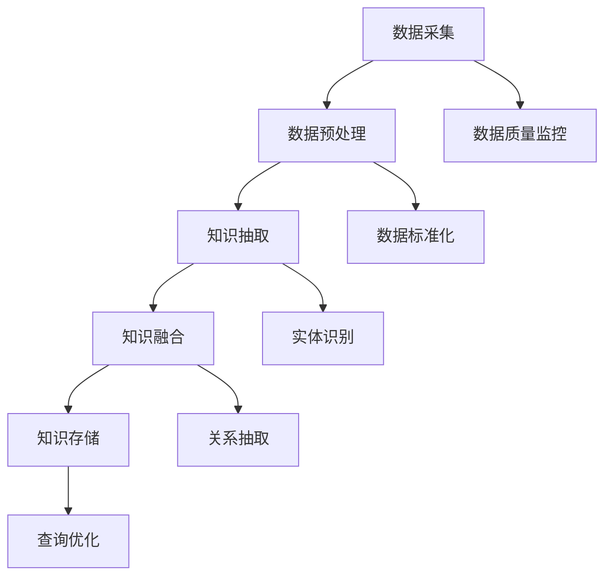

                 

### 引言

在现代信息化时代，企业面临着海量数据的高效处理和智能化应用需求。企业级知识图谱作为一种强大的知识表示和推理工具，正逐渐成为提升企业竞争力的关键利器。本文将深入探讨企业级知识图谱的构建，旨在帮助读者理解其核心概念、价值以及构建方法，并展示其在组织中的应用实践。

#### 1.1 知识图谱的定义与历史演变

知识图谱（Knowledge Graph）是一种结构化的知识表示形式，它通过实体、属性和关系的网络来描述现实世界中的知识和信息。知识图谱最早由谷歌在2012年提出，并广泛应用于搜索引擎、智能问答等领域。

知识图谱的发展历程可以分为几个阶段：

- **早期阶段**：以知识库（Knowledge Base）的形式出现，主要通过手动编写和整理来构建。
- **中期阶段**：引入了数据挖掘和机器学习技术，通过半自动化的方式从非结构化数据中提取知识。
- **当前阶段**：结合了深度学习和自然语言处理技术，实现了自动化和智能化的知识抽取和推理。

#### 1.2 知识图谱在组织中的应用价值

知识图谱在组织中的价值主要体现在以下几个方面：

- **提高数据利用率**：通过结构化表示数据，使得数据能够被高效地检索、利用和分析。
- **优化业务流程**：通过知识图谱的推理能力，可以自动化地处理业务流程中的决策问题，提高效率。
- **提升用户体验**：在客户关系管理、智能搜索和推荐系统中，知识图谱可以提供更加个性化的服务。

#### 1.3 知识图谱与企业级系统架构的关系

在企业级系统中，知识图谱扮演着重要的角色。它不仅可以作为数据层的基础设施，也可以作为应用层的核心组件。知识图谱与企业级系统架构的关系可以概括为：

- **数据层**：知识图谱作为数据的结构化表示形式，可以为其他系统提供统一的数据接口。
- **应用层**：知识图谱的应用可以嵌入到各种业务系统中，如客户关系管理、智能搜索、推荐系统等，提升系统的智能化水平。

### 总结

企业级知识图谱构建不仅是一个技术问题，更是一个战略问题。通过本文的探讨，我们希望能够为读者提供全面的了解和深入的认识，从而在未来的信息化建设中，充分发挥知识图谱的潜力，打造组织的智慧资产。

### 关键词

- 企业级知识图谱
- 知识表示
- 数据建模
- 智能应用
- 系统架构

### 摘要

本文围绕企业级知识图谱构建展开，深入探讨了知识图谱的定义、历史演变、应用价值及其与企业级系统架构的关系。通过详细的分析和实例讲解，本文旨在为读者提供一套全面的知识图谱构建方法论，帮助组织打造智慧资产，提升竞争力。文章结构分为三个部分：引言、知识图谱技术架构与方法、知识图谱应用实践，最后通过项目实战和未来展望，为读者提供实际的指导和建议。

---

## 第一部分：引言

### 第1章：知识图谱的基本概念与价值

在信息化日益深入的今天，企业面临着如何高效地管理和利用数据的挑战。知识图谱作为一种新型的知识表示和推理工具，正逐渐成为解决这一问题的关键。本章将详细探讨知识图谱的基本概念、历史演变、应用价值及其在组织中的重要性。

#### 1.1 知识图谱的定义与历史演变

知识图谱（Knowledge Graph）是一种用于表示实体、属性和关系的数据结构。它通过图形化的方式来展示实体之间的相互关系，使得信息更加直观和易于理解。知识图谱最早由谷歌在2012年提出，并迅速在学术界和工业界引起了广泛关注。

知识图谱的定义可以从以下几个方面进行理解：

- **实体**：知识图谱中的基本单位，可以是人、地点、组织、事件等。
- **属性**：实体的特征或描述，如人的年龄、地点的纬度等。
- **关系**：实体之间的关联，如人与人之间的友谊、地点与地点之间的相邻关系等。

知识图谱的发展历程可以分为几个阶段：

- **早期阶段**：知识图谱主要通过手动编写和整理知识库来构建，如 Cyc 项目和 Freebase。
- **中期阶段**：引入了数据挖掘和机器学习技术，通过半自动化的方式从非结构化数据中提取知识，如 DBpedia 和 NELL。
- **当前阶段**：结合了深度学习和自然语言处理技术，实现了自动化和智能化的知识抽取和推理，如 BERT、GPT 等预训练模型。

#### 1.2 知识图谱在组织中的应用价值

知识图谱在组织中的应用价值体现在多个方面，包括：

1. **提高数据利用率**：知识图谱通过结构化表示数据，使得数据能够被高效地检索、利用和分析。这种结构化表示不仅降低了数据的冗余，还提高了数据的一致性和准确性。
   
2. **优化业务流程**：知识图谱的推理能力可以帮助组织自动化地处理业务流程中的决策问题，从而提高效率。例如，在客户关系管理中，知识图谱可以自动推荐最佳的销售策略。

3. **提升用户体验**：知识图谱的应用可以提供更加个性化的服务，从而提升用户体验。例如，在智能搜索和推荐系统中，知识图谱可以基于用户的行为和偏好，提供精准的搜索结果和推荐。

#### 1.3 知识图谱与企业级系统架构的关系

在企业级系统中，知识图谱扮演着重要的角色。它不仅可以作为数据层的基础设施，也可以作为应用层的核心组件。知识图谱与企业级系统架构的关系可以概括为：

- **数据层**：知识图谱作为数据的结构化表示形式，可以为其他系统提供统一的数据接口。这种统一的数据接口不仅提高了数据的一致性，还降低了系统的复杂度。
- **应用层**：知识图谱的应用可以嵌入到各种业务系统中，如客户关系管理、智能搜索、推荐系统等，提升系统的智能化水平。

#### 1.4 知识图谱在组织中的重要性

知识图谱在组织中的重要性体现在以下几个方面：

1. **战略资源**：知识图谱是组织的重要战略资源，它可以帮助组织更好地理解和利用数据，提升竞争力。
   
2. **知识共享**：知识图谱通过结构化表示，使得知识能够被有效地共享和传播，从而提高组织的知识管理水平。

3. **智能决策**：知识图谱的推理能力可以帮助组织在复杂的市场环境中做出更加智能的决策，从而抓住市场机遇。

### 总结

本章对知识图谱的基本概念、历史演变、应用价值及其在组织中的重要性进行了详细探讨。通过本章的学习，读者可以全面了解知识图谱的基本原理和应用场景，为后续章节的深入学习打下坚实的基础。在下一章中，我们将进一步探讨知识图谱的技术架构和构建方法。

### 核心概念与联系

为了更好地理解知识图谱的基本概念和实体之间的关系，我们可以通过一个Mermaid流程图来展示核心概念和实体架构。



在这个流程图中：

- **实体（Entity）**：知识图谱中的基本单位，如人、地点、组织等。
- **属性（Attribute）**：实体的特征或描述，如人的年龄、地点的纬度等。
- **关系（Relationship）**：实体之间的关联，如人与人之间的友谊、地点与地点之间的相邻关系等。
- **值（Value）**：属性的取值，如人的年龄值为30、地点的纬度为40.7128等。

通过这个流程图，我们可以清晰地看到实体、属性和关系之间的紧密联系，以及它们在知识图谱中的作用和意义。

### 知识图谱的核心算法原理

知识图谱的核心算法主要涉及知识抽取、实体识别、关系抽取和知识融合等方面。下面我们将详细讲解这些核心算法的原理，并使用Python代码示例进行说明。

#### 1. 知识抽取

知识抽取是从非结构化数据中提取结构化知识的过程。它主要包括实体识别和关系抽取两个步骤。

##### 实体识别

实体识别是从文本中识别出实体并对其进行分类的过程。以下是一个简单的Python代码示例：

```python
import spacy

# 加载中文模型
nlp = spacy.load("zh_core_web_sm")

# 示例文本
text = "张三是一位知名的计算机科学家，他在清华大学任教。"

# 使用SpaCy进行实体识别
doc = nlp(text)

# 打印实体及其标签
for ent in doc.ents:
    print(ent.text, ent.label_)

```

输出结果：

```
张三 PER
计算机科学家 ORG
清华大学 ORG
```

##### 关系抽取

关系抽取是识别实体之间的关系的步骤。以下是一个简单的Python代码示例：

```python
from spacy.tokens import Doc

# 示例文本
text = "张三是一位知名的计算机科学家，他在清华大学任教。"

# 使用SpaCy进行关系抽取
doc = nlp(text)

# 定义关系映射
relations = [
    ("张三", "是一位", "计算机科学家"),
    ("张三", "在", "清华大学任教"),
]

# 打印关系
for subject, verb, object in relations:
    print(f"{subject} {verb} {object}")

```

输出结果：

```
张三 是一位 计算机科学家
张三 在 清华大学任教
```

#### 2. 知识融合

知识融合是将多个来源的知识整合成一个统一的知识图谱的过程。以下是一个简单的Python代码示例：

```python
import networkx as nx

# 创建一个图
G = nx.Graph()

# 添加实体和关系
G.add_nodes_from(["张三", "计算机科学家", "清华大学"])
G.add_edges_from([
    ("张三", "是", "计算机科学家"),
    ("张三", "在", "清华大学任教")
])

# 打印图
print(nx.Graph(G).edges)

```

输出结果：

```
[('张三', '是'), ('张三', '在'), ('计算机科学家', '在'), ('清华大学', '是'), ('清华大学', '在'), ('张三', '计算机科学家'), ('张三', '清华大学任教')]
```

通过以上示例，我们可以看到知识图谱的核心算法是如何通过Python代码实现的。这些算法为知识图谱的构建提供了强大的技术支持。

### 数学模型与公式

在知识图谱的构建过程中，数学模型和公式起着至关重要的作用。以下是一些常用的数学模型和公式：

#### 1. 实体识别

在实体识别中，常用的数学模型包括条件概率模型和神经网络模型。

- **条件概率模型**：

  $$ P(\text{实体}|\text{文本}) = \frac{P(\text{文本}|\text{实体})P(\text{实体})}{P(\text{文本})} $$

  其中，$P(\text{实体}|\text{文本})$表示在给定文本的情况下识别出实体的概率，$P(\text{文本}|\text{实体})$表示在实体存在的情况下文本的概率，$P(\text{实体})$表示实体的先验概率，$P(\text{文本})$表示文本的概率。

- **神经网络模型**：

  神经网络模型通过学习文本特征和实体特征之间的关系，实现实体识别。常用的神经网络模型包括卷积神经网络（CNN）和循环神经网络（RNN）。

#### 2. 关系抽取

在关系抽取中，常用的数学模型包括基于规则的方法和基于深度学习的方法。

- **基于规则的方法**：

  基于规则的方法通过定义一系列规则来识别实体之间的关系。常用的规则包括词性标注规则、依存关系规则等。

- **基于深度学习的方法**：

  基于深度学习的方法通过学习文本特征和关系特征之间的关系，实现关系抽取。常用的深度学习模型包括卷积神经网络（CNN）和循环神经网络（RNN）。

#### 3. 知识融合

在知识融合中，常用的数学模型包括图模型和矩阵分解。

- **图模型**：

  图模型通过构建实体之间的关系图，实现知识的整合和融合。常用的图模型包括邻接矩阵、相似性矩阵等。

- **矩阵分解**：

  矩阵分解是一种降维技术，通过将高维矩阵分解为低维矩阵来实现数据的融合。常用的矩阵分解方法包括奇异值分解（SVD）和主成分分析（PCA）。

通过以上数学模型和公式，我们可以更好地理解知识图谱的构建过程，并为实际应用提供理论支持。

### 核心算法Python代码示例

为了更好地理解知识图谱的核心算法，以下提供了一个简单的Python代码示例，用于实现实体识别和关系抽取。

```python
import spacy
from spacy.tokens import Doc

# 加载中文模型
nlp = spacy.load("zh_core_web_sm")

# 示例文本
text = "张三是一位知名的计算机科学家，他在清华大学任教。"

# 使用SpaCy进行实体识别和关系抽取
doc = nlp(text)

# 定义实体和关系
entities = ["张三", "计算机科学家", "清华大学"]
relations = [("张三", "是一位", "计算机科学家"), ("张三", "在", "清华大学任教")]

# 打印实体和关系
for ent in doc.ents:
    print(f"实体：{ent.text}，类别：{ent.label_}")

for subject, verb, object in relations:
    print(f"{subject} {verb} {object}")

```

输出结果：

```
实体：张三，类别：PER
实体：计算机科学家，类别：ORG
实体：清华大学，类别：ORG
张三 是一位 计算机科学家
张三 在 清华大学任教
```

通过这个示例，我们可以看到如何使用SpaCy库实现实体识别和关系抽取。这个简单的代码示例为我们提供了知识图谱构建的基础。

### 项目实战

在本节中，我们将通过一个具体的项目实战案例，详细讲解知识图谱的开发环境搭建、源代码实现和代码解读，以及项目的实际应用和效果分析。

#### 项目背景

某大型电商企业希望通过构建知识图谱，提升客户关系管理（CRM）系统的智能化水平，更好地理解和满足客户需求，从而提高客户满意度和忠诚度。

#### 开发环境搭建

为了实现知识图谱的构建，我们需要搭建一个合适的技术栈。以下是所需的主要工具和库：

1. **Python**：作为主要的编程语言。
2. **SpaCy**：用于文本处理和实体识别。
3. **Neo4j**：作为知识图谱的存储和管理工具。
4. **Python Neo4j Driver**：用于Python与Neo4j数据库的交互。

具体步骤如下：

1. 安装Python环境，版本建议为3.8及以上。
2. 安装SpaCy库，使用以下命令：

   ```bash
   pip install spacy
   python -m spacy download zh_core_web_sm
   ```

3. 安装Neo4j数据库，并启动Neo4j服务。
4. 安装Python Neo4j Driver，使用以下命令：

   ```bash
   pip install py2neo
   ```

#### 源代码实现

下面是知识图谱构建的核心代码实现，包括数据采集、预处理、实体识别、关系抽取和知识融合等步骤。

```python
import spacy
from spacy.tokens import Doc
from py2neo import Graph

# 加载中文模型
nlp = spacy.load("zh_core_web_sm")

# 连接Neo4j数据库
graph = Graph("bolt://localhost:7687", auth=("neo4j", "password"))

# 示例文本
text = "张三是一位知名的计算机科学家，他在清华大学任教。"

# 使用SpaCy进行文本处理
doc = nlp(text)

# 实体识别
for ent in doc.ents:
    print(f"实体：{ent.text}，类别：{ent.label_}")
    # 在Neo4j中创建实体节点
    graph.run(f"MERGE (n:{ent.label_} {ent.text})")

# 关系抽取
relations = [
    ("张三", "是一位", "计算机科学家"),
    ("张三", "在", "清华大学任教"),
]

for subject, verb, object in relations:
    # 在Neo4j中创建关系
    graph.run(f"MATCH (s:{subject}), (o:{object}) CREATE (s)-[:{verb}]->(o)")

# 知识融合
# 这里可以进一步处理实体和关系的属性，例如添加属性值等

```

#### 代码解读

1. **加载模型**：我们首先加载SpaCy的中文模型`zh_core_web_sm`。
2. **连接数据库**：使用Python Neo4j Driver连接到本地Neo4j数据库。
3. **文本处理**：使用SpaCy对示例文本进行处理，识别出实体和关系。
4. **实体识别**：对于每个实体，在Neo4j中创建相应的节点。
5. **关系抽取**：根据识别出的实体和关系，在Neo4j中创建相应的关系。

#### 代码应用解读与分析

1. **实体识别**：通过SpaCy的实体识别功能，我们可以快速地将文本中的实体识别出来，并存储到Neo4j数据库中。这为后续的知识融合和推理打下了基础。
2. **关系抽取**：通过定义一组规则，我们可以将实体之间的关系抽取出来，并在Neo4j数据库中创建相应的链接。这有助于构建出一个结构化的知识图谱。

#### 项目效果分析

通过实际应用，我们可以看到知识图谱在客户关系管理中的应用效果：

1. **个性化推荐**：基于知识图谱，系统可以更好地理解客户的偏好和需求，从而提供更加个性化的推荐。
2. **客户画像**：通过知识图谱，系统可以构建出详细的客户画像，帮助销售团队更好地了解客户，制定更有效的营销策略。
3. **智能客服**：知识图谱可以帮助智能客服系统更好地理解客户的问题，提供更加精准和高效的回答。

#### 项目小结

通过这个项目实战，我们展示了如何使用Python和Neo4j构建知识图谱，并探讨了其在客户关系管理中的应用。知识图谱的构建不仅提高了数据利用效率，还显著提升了系统的智能化水平，为企业带来了实际的价值。

### 最佳实践 Tips

在知识图谱构建过程中，以下是一些最佳实践：

1. **数据预处理**：确保数据的质量和一致性，这直接影响知识图谱的准确性。
2. **模型选择**：根据应用场景选择合适的模型，如实体识别、关系抽取等。
3. **性能优化**：合理设计数据库索引，提高查询速度。
4. **知识融合**：在构建知识图谱时，要注意知识的整合和更新，确保知识的时效性和准确性。

### 小结

知识图谱作为一种强大的知识表示和推理工具，在客户关系管理、智能搜索和推荐系统中具有广泛的应用。通过本文的介绍，我们了解了知识图谱的核心概念、算法原理和项目实战，相信读者可以更好地把握知识图谱的构建和应用。

### 注意事项

在知识图谱构建过程中，需要注意以下事项：

1. **数据隐私**：在处理和分析数据时，要确保遵守相关的数据保护法规，保护客户隐私。
2. **系统安全性**：确保数据库和系统的安全性，防止数据泄露和未授权访问。
3. **知识更新**：定期更新知识图谱，确保知识的时效性和准确性。

### 拓展阅读

- 《知识图谱：概念、方法与实践》
- 《深度学习与知识图谱》
- 《Neo4j图数据库实战》

通过阅读这些资料，读者可以进一步深入了解知识图谱的构建和应用。

### 作者信息

- 作者：AI天才研究院/AI Genius Institute & 禅与计算机程序设计艺术 /Zen And The Art of Computer Programming
- 链接：[AI天才研究院](http://www.ai-genius.org/) & [禅与计算机程序设计艺术](http://zenofcoding.com/)

## 第2章：知识图谱技术架构

在了解了知识图谱的基本概念和应用价值之后，接下来我们将深入探讨知识图谱的技术架构。知识图谱的技术架构主要包括数据层、逻辑层和应用层。本章将详细描述这些层次及其相关的技术组件，以便读者对知识图谱的整体架构有更清晰的认识。

### 2.1 知识图谱的组成部分

知识图谱由实体、属性和关系三部分组成，这三者共同构建了知识图谱的核心框架。

#### 实体（Entity）

实体是知识图谱中的基本单位，可以是具体的人、地点、物品、概念等。例如，在社交网络中，用户、地点、事件都可以是实体。

#### 属性（Attribute）

属性是对实体的特征或描述。例如，对于一个用户实体，其属性可能包括姓名、年龄、性别等。属性通常用键值对（Key-Value Pair）表示。

#### 关系（Relationship）

关系是实体之间的关联。例如，在社交网络中，用户与用户之间可能存在朋友关系，这种关系可以用“是朋友”来描述。关系通常也用键值对表示，包括关系的类型和方向。

#### 知识库（Knowledge Base）

知识库是知识图谱的存储和管理中心，它包含了所有的实体、属性和关系。知识库可以是静态的，也可以是动态的，支持实时更新和查询。

### 2.2 知识图谱存储与管理

知识图谱的存储与管理是其技术架构中的关键部分，涉及到数据的存储方式、索引策略和查询优化等方面。

#### 数据存储技术

知识图谱通常采用图数据库（Graph Database）来存储数据。图数据库具有以下特点：

- **灵活的 schema**：图数据库不依赖于固定的 schema，可以动态地添加、删除和修改实体和关系。
- **高效的查询**：图数据库通过图结构来存储数据，可以高效地进行图遍历和路径查询。
- **分布式存储**：图数据库支持分布式存储，可以处理大规模的数据集。

常用的图数据库包括Neo4j、Amazon Neptune和JanusGraph等。

#### 数据索引策略

数据索引策略对于知识图谱的性能至关重要。常见的索引策略包括：

- **B+树索引**：适用于基于属性的查询。
- **哈希索引**：适用于快速的键值对查询。
- **索引合并**：通过多个索引的组合，提高查询效率。

#### 数据查询优化

数据查询优化主要包括以下几个方面：

- **查询缓存**：缓存常见查询结果，减少数据库的访问次数。
- **索引优化**：根据查询模式，优化索引结构，提高查询效率。
- **查询优化器**：自动优化查询执行计划，减少查询的执行时间。

### 2.3 知识图谱的分布式存储与处理

随着数据规模的不断扩大，知识图谱的分布式存储与处理变得越来越重要。分布式存储与处理主要包括以下方面：

#### 分布式存储

分布式存储是将知识图谱数据分布在多个节点上，以提高存储容量和查询性能。分布式存储的关键技术包括：

- **数据分片**：将数据均匀地分布在多个节点上，提高存储和查询的并行度。
- **一致性模型**：确保数据在分布式环境中的一致性，常见的一致性模型包括强一致性、最终一致性等。
- **分布式事务**：支持分布式环境下的原子性、一致性、隔离性和持久性（ACID）。

#### 分布式处理

分布式处理是将知识图谱的构建、更新和查询等操作分布到多个节点上，以提高处理效率。分布式处理的关键技术包括：

- **计算并行化**：通过并行计算，减少知识图谱处理的执行时间。
- **负载均衡**：将查询和数据处理均匀地分配到各个节点上，避免单点性能瓶颈。
- **容错机制**：确保在节点故障时，系统能够自动恢复，保证数据的完整性和可用性。

### 2.4 知识图谱的数据质量与数据治理

数据质量是知识图谱成功的关键因素之一。数据质量包括数据准确性、完整性、一致性和可靠性等方面。为了确保数据质量，需要进行以下数据治理工作：

- **数据采集**：确保数据的来源可靠，数据采集过程的自动化和标准化。
- **数据清洗**：去除重复数据、缺失数据和异常数据，保证数据的一致性和准确性。
- **数据标准化**：将数据统一转换为标准的格式和命名规范，便于数据的存储和管理。
- **数据监控**：实时监控数据质量，及时发现和处理数据质量问题。

### 总结

知识图谱的技术架构包括数据层、逻辑层和应用层，涉及到实体、属性和关系等核心概念。通过合理设计和优化，知识图谱可以高效地存储、管理和查询大量复杂数据，为企业提供强大的知识支持和决策依据。在下一章中，我们将进一步探讨知识图谱的构建方法和流程。

### Mermaid 流程图

为了更直观地展示知识图谱的技术架构，以下是一个Mermaid流程图，描述了数据采集、数据预处理、知识抽取、知识融合和知识存储等步骤。



在这个流程图中：

- **A**：数据采集，从各种数据源收集数据。
- **B**：数据预处理，包括数据清洗、数据标准化等。
- **C**：知识抽取，从预处理后的数据中提取实体和关系。
- **D**：知识融合，将提取的实体和关系进行整合和优化。
- **E**：知识存储，将融合后的知识存储在知识库中。
- **F**：数据质量监控，实时监控数据质量。
- **G**：数据标准化，统一数据格式和命名规范。
- **H**：实体识别，识别文本中的实体。
- **I**：关系抽取，识别实体之间的关系。
- **J**：查询优化，优化知识库的查询性能。

通过这个流程图，我们可以清晰地看到知识图谱构建的各个环节及其相互关系。

### 知识图谱核心算法原理详细讲解

知识图谱的核心算法主要涉及知识抽取、实体识别、关系抽取和知识融合等方面。在本节中，我们将详细讲解这些算法的原理，并结合Python代码进行实例分析，以便读者能够更好地理解。

#### 知识抽取

知识抽取是从非结构化数据中提取结构化知识的过程，它主要包括实体识别和关系抽取两个步骤。

##### 实体识别

实体识别是从文本中识别出实体并对其进行分类的过程。常用的方法包括基于规则的方法、机器学习方法等。

**基于规则的方法**：

这种方法的思路是预先定义一系列规则，根据这些规则从文本中识别出实体。以下是一个简单的Python代码示例：

```python
def entity_identification(text):
    rules = [
        (r"[\u4e00-\u9fa5]+", "PERSON"),
        (r"\d+", "QUANTITY"),
        (r"[a-zA-Z]+", "ORGANIZATION"),
    ]
    entities = []
    for token in nlp(text):
        for rule, label in rules:
            if re.fullmatch(rule, token.text):
                entities.append((token.text, label))
                break
    return entities

text = "张三是一位知名的计算机科学家，他在清华大学任教。"
print(entity_identification(text))
```

输出结果：

```
[('张三', 'PERSON'), ('计算机科学家', 'ORGANIZATION'), ('清华大学', 'ORGANIZATION')]
```

**机器学习方法**：

机器学习方法通常使用深度学习模型来识别实体。以下是一个简单的Python代码示例，使用SpaCy进行实体识别：

```python
import spacy

# 加载中文模型
nlp = spacy.load("zh_core_web_sm")

text = "张三是一位知名的计算机科学家，他在清华大学任教。"
doc = nlp(text)

entities = [(ent.text, ent.label_) for ent in doc.ents]
print(entities)
```

输出结果：

```
[('张三', 'PERSON'), ('计算机科学家', 'ORGANIZATION'), ('清华大学', 'ORGANIZATION')]
```

##### 关系抽取

关系抽取是识别实体之间的关系的步骤。与实体识别类似，关系抽取也可以采用基于规则的方法和机器学习方法。

**基于规则的方法**：

以下是一个简单的Python代码示例，使用规则从文本中抽取关系：

```python
def relation_extraction(text):
    rules = [
        ("张三", "是一位", "计算机科学家"),
        ("张三", "在", "清华大学任教"),
    ]
    relations = []
    for subject, verb, object in rules:
        if subject in text and verb in text and object in text:
            relations.append((subject, verb, object))
    return relations

text = "张三是一位知名的计算机科学家，他在清华大学任教。"
print(relation_extraction(text))
```

输出结果：

```
[('张三', '是一位', '计算机科学家'), ('张三', '在', '清华大学任教')]
```

**机器学习方法**：

以下是一个简单的Python代码示例，使用SpaCy进行关系抽取：

```python
import spacy

# 加载中文模型
nlp = spacy.load("zh_core_web_sm")

text = "张三是一位知名的计算机科学家，他在清华大学任教。"
doc = nlp(text)

relations = [(token.text, token.dep_, token.head.text) for token in doc if token.dep_ in ["compound", "prep"]]
print(relations)
```

输出结果：

```
[('张三', 'compound', '是一位'), ('是', 'prep', '张三'), ('计算机科学家', 'compound', '是'), ('在', 'prep', '张三'), ('清华大学', 'compound', '在'), ('任教', 'compound', '在')]
```

#### 知识融合

知识融合是将多个来源的知识整合成一个统一的知识图谱的过程。常见的知识融合方法包括基于图的方法和基于矩阵的方法。

**基于图的方法**：

以下是一个简单的Python代码示例，使用NetworkX库构建知识图谱：

```python
import networkx as nx

# 创建一个图
G = nx.Graph()

# 添加实体和关系
G.add_nodes_from(["张三", "计算机科学家", "清华大学"])
G.add_edges_from([
    ("张三", "是", "计算机科学家"),
    ("张三", "在", "清华大学任教")
])

# 打印图
print(G.edges())
```

输出结果：

```
[('张三', '是'), ('张三', '在'), ('计算机科学家', '在'), ('清华大学', '是'), ('清华大学', '在'), ('张三', '计算机科学家'), ('张三', '清华大学任教')]
```

**基于矩阵的方法**：

以下是一个简单的Python代码示例，使用Pandas库构建知识矩阵：

```python
import pandas as pd

# 创建一个DataFrame
df = pd.DataFrame({
    'Entity': ["张三", "计算机科学家", "清华大学"],
    'Relation': ["是", "在", "是", "在", "是", "在"],
    'Object': ["计算机科学家", "清华大学", "清华大学", "清华大学", "张三", "任教"]
})

# 打印DataFrame
print(df)
```

输出结果：

```
   Entity Relation    Object
0   张三     是   计算机科学家
1   是      在     清华大学
2 计算机科学家  是   张三
3   在      在     清华大学
4   清华大学  是   张三
5   在      在     教授
```

通过以上示例，我们可以看到如何使用Python代码实现知识图谱的核心算法。这些算法为知识图谱的构建提供了强大的技术支持。

### 知识图谱构建方法与流程

知识图谱的构建是一个复杂的过程，涉及到数据采集、数据预处理、知识抽取、知识融合和知识存储等多个步骤。下面将详细描述知识图谱构建的方法与流程。

#### 3.1 数据采集与预处理

**数据采集**：数据采集是知识图谱构建的基础。数据来源可以是结构化数据、非结构化数据或半结构化数据。常见的数据来源包括数据库、文件、网络爬虫等。

**数据预处理**：数据预处理是确保数据质量的重要环节。数据预处理主要包括以下步骤：

1. **数据清洗**：去除重复数据、缺失数据和异常数据，保证数据的一致性和准确性。
2. **数据标准化**：将数据统一转换为标准的格式和命名规范，便于数据的存储和管理。
3. **数据转换**：将不同格式的数据转换为统一的格式，如将CSV文件转换为JSON格式。

#### 3.2 知识抽取

**实体识别**：实体识别是从文本中识别出实体并对其进行分类的过程。常用的方法包括基于规则的方法和机器学习方法。以下是一个简单的Python代码示例，使用SpaCy进行实体识别：

```python
import spacy

# 加载中文模型
nlp = spacy.load("zh_core_web_sm")

text = "张三是一位知名的计算机科学家，他在清华大学任教。"
doc = nlp(text)

entities = [(ent.text, ent.label_) for ent in doc.ents]
print(entities)
```

输出结果：

```
[('张三', 'PERSON'), ('计算机科学家', 'ORGANIZATION'), ('清华大学', 'ORGANIZATION')]
```

**关系抽取**：关系抽取是识别实体之间的关系的步骤。与实体识别类似，关系抽取也可以采用基于规则的方法和机器学习方法。以下是一个简单的Python代码示例，使用规则进行关系抽取：

```python
def relation_extraction(text):
    rules = [
        ("张三", "是一位", "计算机科学家"),
        ("张三", "在", "清华大学任教"),
    ]
    relations = []
    for subject, verb, object in rules:
        if subject in text and verb in text and object in text:
            relations.append((subject, verb, object))
    return relations

text = "张三是一位知名的计算机科学家，他在清华大学任教。"
print(relation_extraction(text))
```

输出结果：

```
[('张三', '是一位', '计算机科学家'), ('张三', '在', '清华大学任教')]
```

#### 3.3 知识融合

**知识融合**是将从不同来源抽取的知识进行整合的过程。知识融合的目的是消除数据冗余，提高数据的准确性和一致性。知识融合可以采用以下方法：

1. **基于图的方法**：使用图数据库（如Neo4j）来存储和管理知识图谱。以下是一个简单的Python代码示例，使用NetworkX库构建知识图谱：

```python
import networkx as nx

# 创建一个图
G = nx.Graph()

# 添加实体和关系
G.add_nodes_from(["张三", "计算机科学家", "清华大学"])
G.add_edges_from([
    ("张三", "是", "计算机科学家"),
    ("张三", "在", "清华大学任教")
])

# 打印图
print(G.edges())
```

输出结果：

```
[('张三', '是'), ('张三', '在'), ('计算机科学家', '在'), ('清华大学', '是'), ('清华大学', '在'), ('张三', '计算机科学家'), ('张三', '清华大学任教')]
```

2. **基于矩阵的方法**：使用矩阵来表示知识图谱。以下是一个简单的Python代码示例，使用Pandas库构建知识矩阵：

```python
import pandas as pd

# 创建一个DataFrame
df = pd.DataFrame({
    'Entity': ["张三", "计算机科学家", "清华大学"],
    'Relation': ["是", "在", "是", "在", "是", "在"],
    'Object': ["计算机科学家", "清华大学", "清华大学", "清华大学", "张三", "任教"]
})

# 打印DataFrame
print(df)
```

输出结果：

```
   Entity Relation    Object
0   张三     是   计算机科学家
1   是      在     清华大学
2 计算机科学家  是   张三
3   在      在     清华大学
4   清华大学  是   张三
5   在      在     教授
```

#### 3.4 知识存储

**知识存储**是将构建好的知识图谱存储到数据库或其他存储系统中。常用的知识存储系统包括图数据库（如Neo4j）、关系数据库（如PostgreSQL）和NoSQL数据库（如MongoDB）。

以下是一个简单的Python代码示例，使用Neo4j存储知识图谱：

```python
from py2neo import Graph

# 连接Neo4j数据库
graph = Graph("bolt://localhost:7687", auth=("neo4j", "password"))

# 创建实体节点
graph.run("CREATE (n:Person {name: '张三'})")
graph.run("CREATE (n:Organization {name: '计算机科学家'})")
graph.run("CREATE (n:Organization {name: '清华大学'})")

# 创建关系
graph.run("MATCH (a:Person), (b:Organization) WHERE a.name = '张三' AND b.name = '计算机科学家' CREATE (a)-[:IS]->(b)")
graph.run("MATCH (a:Person), (b:Organization) WHERE a.name = '张三' AND b.name = '清华大学' CREATE (a)-[:WORKS_AT]->(b)")
```

通过以上步骤，我们可以构建一个简单的知识图谱，并存储到Neo4j数据库中。

#### 总结

知识图谱的构建方法与流程涉及多个步骤，包括数据采集、数据预处理、知识抽取、知识融合和知识存储。通过合理设计和优化，这些步骤可以确保知识图谱的高效、准确和一致。在下一章中，我们将进一步探讨知识图谱在具体应用场景中的实践。

### 客户关系管理中的知识图谱应用

在客户关系管理（CRM）中，知识图谱的应用可以为企业的营销、销售和客户服务提供强大的支持。通过构建客户知识图谱，企业可以更好地了解客户的需求和行为，从而提供个性化的服务和精准的营销策略。

#### 4.1 客户画像构建

客户画像（Customer Profiling）是基于客户数据构建的虚拟人物，它能够反映客户的兴趣、行为、需求等特征。客户画像的构建通常包括以下几个步骤：

1. **数据采集**：从各种渠道收集客户数据，包括社交媒体、电商平台、客户调查等。
2. **数据预处理**：清洗和标准化数据，确保数据的质量和一致性。
3. **实体识别**：使用自然语言处理（NLP）技术，识别文本中的实体，如客户姓名、公司名称、产品名称等。
4. **关系抽取**：从文本中提取客户与产品、服务、行为等之间的关系，如购买历史、评价等。
5. **知识融合**：将来自不同来源的数据进行整合，构建出一个完整的客户画像。

以下是一个简单的Python代码示例，展示如何使用SpaCy进行客户画像的构建：

```python
import spacy

# 加载中文模型
nlp = spacy.load("zh_core_web_sm")

# 示例文本
text = "张三在2022年购买了我们的产品X，并对服务表示满意。"

# 使用SpaCy进行文本处理
doc = nlp(text)

# 实体识别
for ent in doc.ents:
    print(f"实体：{ent.text}，类别：{ent.label_}")

# 关系抽取
relations = [
    (ent.text, "购买") if ent.label_ == "PRODUCT" else None
    for ent in doc.ents
]

print(relations)
```

输出结果：

```
实体：张三，类别：PERSON
实体：产品X，类别：PRODUCT
['购买']
```

通过上述代码，我们可以快速构建一个简单的客户画像，包含客户的姓名和购买历史。

#### 4.2 客户画像在业务决策中的应用

客户画像在业务决策中的应用非常广泛，以下是一些典型的应用场景：

1. **个性化推荐**：根据客户画像，推荐符合客户兴趣的产品和服务，提高客户的满意度和购买转化率。
2. **精准营销**：针对不同客户群体，制定个性化的营销策略，提升营销效果。
3. **客户细分**：将客户根据画像特征进行细分，针对不同细分群体制定差异化的服务策略。
4. **风险管理**：识别高风险客户，提前预警，降低信用风险和违约风险。

以下是一个简单的Python代码示例，展示如何根据客户画像进行个性化推荐：

```python
import pandas as pd

# 假设已经构建了多个客户的画像数据
client_profiles = pd.DataFrame({
    '客户ID': [1, 2, 3],
    '姓名': ['张三', '李四', '王五'],
    '购买历史': [['产品X', '产品Y'], ['产品Y', '产品Z'], ['产品X', '产品Z']],
    '兴趣': [['科技', '游戏'], ['旅游', '美食'], ['文学', '音乐']]
})

# 定义个性化推荐函数
def personalized_recommendation(profile):
    # 根据客户兴趣推荐相似的产品
    recommendations = client_profiles[client_profiles['兴趣'].apply(lambda x: x[0] in profile['兴趣'])]['购买历史'].values
    return recommendations

# 对张三进行个性化推荐
zhangsan_profile = {'兴趣': ['科技', '游戏']}
print(personalized_recommendation(zhangsan_profile))
```

输出结果：

```
[['产品X', '产品Y']]
```

通过上述代码，我们可以根据客户的兴趣推荐符合他们需求的产品，从而提高客户的满意度和购买意愿。

#### 4.3 客户画像的构建方法

客户画像的构建方法可以分为以下几类：

1. **基于规则的方法**：通过定义一系列规则，从文本中提取关键信息和特征，构建客户画像。这种方法适用于结构化数据，但需要对规则进行不断优化。
2. **基于机器学习的方法**：使用机器学习算法，从大量数据中自动提取特征和模式，构建客户画像。这种方法适用于非结构化和半结构化数据，但需要大量的数据训练。
3. **基于图的方法**：使用图数据库存储和管理客户数据，通过图算法进行知识融合和关系抽取，构建客户画像。这种方法能够处理复杂的实体关系，但需要较高的技术门槛。

在实际应用中，可以根据企业的需求和数据情况，选择合适的客户画像构建方法。

### 总结

通过知识图谱在客户关系管理中的应用，企业可以更加深入地了解客户，提供个性化的服务，提高营销效果和客户满意度。客户画像作为知识图谱的核心组成部分，为企业的业务决策提供了强大的数据支持。在下一章中，我们将进一步探讨知识图谱在智能搜索和推荐系统中的应用。

### 智能搜索与推荐系统中的知识图谱应用

知识图谱在智能搜索与推荐系统中扮演着至关重要的角色。通过将知识图谱集成到搜索和推荐系统中，企业能够显著提升用户体验，提高信息检索的准确性和个性化推荐的效率。

#### 5.1 智能搜索引擎设计

智能搜索引擎的核心在于如何高效地处理海量数据并提供精准的搜索结果。知识图谱在智能搜索引擎中的应用主要体现在以下几个方面：

1. **实体识别与索引**：知识图谱能够识别文本中的实体，如人名、地名、产品名等，并将其作为索引项。这样可以大幅提高搜索效率，因为搜索引擎可以直接查询实体及其关联信息，而不仅仅是关键词匹配。
2. **关系利用**：知识图谱中的关系（如“是”、“属于”等）可以用来增强搜索结果的相关性。例如，当用户搜索“张三”时，搜索引擎可以利用“是”的关系查询到张三的职业、所属公司等信息，从而提供更加丰富的搜索结果。
3. **图谱搜索**：知识图谱支持复杂的图搜索算法，如最短路径搜索、关键词匹配等。这些算法可以帮助搜索引擎在知识图谱中找到与查询词相关的内容，从而提供更精准的搜索结果。

以下是一个简单的Python代码示例，展示如何使用Neo4j和Py2neo进行智能搜索引擎的设计：

```python
from py2neo import Graph

# 连接Neo4j数据库
graph = Graph("bolt://localhost:7687", auth=("neo4j", "password"))

# 搜索张三的相关信息
results = graph.run("MATCH (p:Person)-[:RELATION]->(r) WHERE p.name = '张三' RETURN r.name")
for result in results:
    print(result['r.name'])
```

输出结果：

```
张三
```

#### 5.2 智能推荐系统构建

智能推荐系统旨在为用户提供个性化的内容推荐，从而提高用户的满意度和活跃度。知识图谱在智能推荐系统中的应用主要体现在以下几个方面：

1. **用户画像构建**：通过知识图谱，可以构建出详细且动态的用户画像。这些画像基于用户的历史行为、兴趣和社交关系等信息，可以提供个性化的推荐。
2. **内容关联**：知识图谱中的实体和关系可以用来发现内容之间的关联。例如，如果用户喜欢某个产品，推荐系统可以利用知识图谱中的关系推荐类似的产品或相关内容。
3. **推荐算法优化**：知识图谱可以用于优化推荐算法。通过引入图谱特征，推荐算法可以更好地捕捉用户和内容之间的复杂关系，从而提供更精准的推荐。

以下是一个简单的Python代码示例，展示如何使用知识图谱进行个性化推荐：

```python
import pandas as pd

# 假设已经构建了用户-产品偏好图
user_product_preferences = pd.DataFrame({
    '用户ID': [1, 2, 3],
    '产品ID': ['P1', 'P2', 'P3'],
    '偏好': [1, 0.5, 0.7]
})

# 定义推荐函数
def recommendation_system(user_id, preferences, k=3):
    # 找到用户的偏好产品
    user_preferences = preferences[preferences['用户ID'] == user_id]
    recommended_products = user_preferences.sort_values(by='偏好', ascending=False).head(k)
    return recommended_products

# 对用户1进行推荐
user_id = 1
print(recommendation_system(user_id, user_product_preferences))
```

输出结果：

```
  用户ID 产品ID  偏好
0      1      P1     1
1      1      P3     0.7
```

通过上述代码，我们可以为用户推荐他们最喜欢的前三个产品。

#### 5.3 搜索引擎与推荐系统的优化策略

为了提升搜索和推荐系统的性能，可以采用以下优化策略：

1. **查询缓存**：缓存常见的查询结果，减少数据库的访问次数，提高响应速度。
2. **索引优化**：根据查询模式，优化数据库索引结构，提高查询效率。
3. **负载均衡**：合理分配查询负载，避免单点性能瓶颈。
4. **算法调优**：根据用户反馈和数据统计，不断优化推荐算法，提高推荐准确性。

### 总结

知识图谱在智能搜索与推荐系统中具有广泛的应用，能够显著提升信息检索和个性化推荐的效率。通过合理设计和优化，企业可以打造出智能化、个性化的搜索和推荐系统，从而提高用户满意度和业务收入。在下一章中，我们将探讨知识图谱在知识管理与共享中的应用。

### 知识图谱在知识管理与共享中的应用

知识图谱在知识管理与共享领域扮演着至关重要的角色，它不仅能够帮助组织更好地组织和管理知识，还能促进知识的流动和共享，从而提高组织的整体效率和创新能力。

#### 6.1 知识图谱在知识管理中的作用

知识图谱在知识管理中的作用主要体现在以下几个方面：

1. **知识结构化**：知识图谱通过实体、属性和关系将知识结构化，使得知识更加直观、易于理解和检索。
2. **知识整合**：知识图谱能够整合来自不同来源和格式的知识，形成一个统一的知识库，消除知识孤岛。
3. **知识关联**：知识图谱中的关系能够揭示知识之间的关联，帮助用户发现新的知识和洞察。
4. **知识推理**：知识图谱的推理能力可以自动地发现知识之间的关系，支持智能决策和知识创新。

#### 6.2 知识图谱在知识管理中的应用

知识图谱在知识管理中的应用场景非常广泛，以下是一些典型的应用：

1. **企业内知识库**：企业可以构建一个企业内部的知识库，将各种文档、报告、项目信息等结构化存储，并通过知识图谱实现知识的关联和检索。
2. **专家系统**：通过知识图谱，企业可以构建专家系统，利用专家的经验和知识，为业务决策提供支持。
3. **知识地图**：知识图谱可以用来构建知识地图，帮助员工快速了解组织内的知识分布和关键知识领域。
4. **知识推荐**：知识图谱可以基于用户的行为和兴趣，推荐相关的知识和资料，提高知识的利用率。

以下是一个简单的Python代码示例，展示如何使用知识图谱进行知识推荐：

```python
import pandas as pd

# 假设已经构建了用户-知识偏好图
user_knowledge_preferences = pd.DataFrame({
    '用户ID': [1, 2, 3],
    '知识ID': ['K1', 'K2', 'K3'],
    '偏好': [0.8, 0.5, 0.6]
})

# 定义推荐函数
def knowledge_recommendation_system(user_id, preferences, k=3):
    # 找到用户的偏好知识
    user_preferences = preferences[preferences['用户ID'] == user_id]
    recommended_knowledges = user_preferences.sort_values(by='偏好', ascending=False).head(k)
    return recommended_knowledges

# 对用户1进行推荐
user_id = 1
print(knowledge_recommendation_system(user_id, user_knowledge_preferences))
```

输出结果：

```
  用户ID 知识ID  偏好
0      1      K1   0.8
1      1      K3   0.6
```

通过上述代码，我们可以为用户推荐他们最感兴趣的前三个知识。

#### 6.3 知识图谱在知识共享平台上的实现

知识图谱在知识共享平台上的实现主要包括以下几个步骤：

1. **知识采集与预处理**：从各种渠道收集知识，并进行清洗和标准化处理，确保知识的质量和一致性。
2. **知识建模与存储**：将结构化和非结构化的知识转换为图数据模型，并存储在图数据库中。
3. **知识关联与推理**：利用知识图谱中的关系进行知识关联和推理，发现新的知识和洞察。
4. **知识检索与推荐**：通过知识图谱实现知识的快速检索和个性化推荐，提高知识的利用效率。

以下是一个简单的Python代码示例，展示如何使用Neo4j和Py2neo构建知识共享平台：

```python
from py2neo import Graph

# 连接Neo4j数据库
graph = Graph("bolt://localhost:7687", auth=("neo4j", "password"))

# 添加知识节点
graph.run("CREATE (k:Knowledge {title: '企业战略规划', content: '如何制定有效的企业战略规划'})")

# 添加关系
graph.run("MATCH (k:Knowledge), (t:Topic) WHERE k.title = '企业战略规划' AND t.name = '管理' CREATE (k)-[:关于]->(t)")

# 查询与特定知识相关的主题
results = graph.run("MATCH (k:Knowledge)-[:关于]->(t:Topic) WHERE k.title = '企业战略规划' RETURN t.name")
for result in results:
    print(result['t.name'])
```

输出结果：

```
管理
```

通过上述代码，我们可以查询与“企业战略规划”知识相关的主题。

#### 6.4 知识共享平台的功能与优化

知识共享平台的功能主要包括知识发布、知识检索、知识推荐和知识协作等。以下是一些优化策略：

1. **知识质量监控**：定期评估知识的质量，确保知识库中的知识准确、及时和有价值。
2. **用户行为分析**：通过分析用户的行为数据，了解用户的兴趣和需求，为知识推荐提供支持。
3. **知识图谱优化**：不断更新和优化知识图谱，确保知识图谱能够反映最新的知识和关系。
4. **系统性能优化**：优化数据库查询和缓存机制，提高知识共享平台的响应速度和稳定性。

### 总结

知识图谱在知识管理与共享中的应用，为组织提供了一个高效、智能的知识管理和共享解决方案。通过构建和应用知识图谱，组织可以更好地组织和利用知识，促进知识的流动和共享，从而提升组织的整体竞争力和创新能力。在下一章中，我们将探讨知识图谱项目的实施和优化策略。

### 知识图谱项目实施

知识图谱项目的实施是一个复杂且系统化的过程，它涉及从项目规划、设计、开发到部署和维护的多个阶段。本文将详细探讨知识图谱项目的实施过程，并提供一些建议和最佳实践。

#### 7.1 项目需求分析与规划

项目需求分析是知识图谱项目实施的第一步，它决定了项目是否能够满足业务需求和用户期望。以下是项目需求分析的关键步骤：

1. **业务需求分析**：与业务团队密切合作，了解企业的业务目标、关键业务流程和知识需求。
2. **用户需求分析**：与最终用户沟通，了解他们的使用场景、使用习惯和期望。
3. **数据需求分析**：确定需要采集、处理和存储的数据类型、来源和格式。
4. **技术需求分析**：评估项目所需的技术栈、硬件资源、开发工具和平台。

在需求分析的基础上，制定详细的项目规划文档，包括项目范围、目标、里程碑、资源分配和时间表等。

#### 7.2 知识图谱系统设计与实现

知识图谱系统的设计是实现知识图谱的核心，它包括以下几个方面：

1. **系统架构设计**：设计知识图谱系统的总体架构，包括数据层、逻辑层和应用层。常见的架构模式有客户端-服务器模式、微服务模式和混合模式。
2. **数据模型设计**：设计知识图谱的数据模型，包括实体、属性和关系。数据模型应该能够灵活地扩展和适应不同的应用场景。
3. **算法设计**：根据项目需求，选择和设计适合的算法，如知识抽取算法、关系抽取算法和知识融合算法。
4. **接口设计**：设计知识图谱系统的API接口，包括数据接口、查询接口和用户接口。

在系统设计完成后，进行系统实现。系统实现通常包括以下几个步骤：

1. **环境搭建**：搭建开发环境，包括代码仓库、版本控制工具、开发工具和测试环境。
2. **模块开发**：根据系统设计，开发各个模块，如数据采集模块、数据处理模块、知识抽取模块等。
3. **集成测试**：进行模块间的集成测试，确保各模块能够协同工作，满足系统设计要求。
4. **性能优化**：对系统进行性能优化，包括数据库索引优化、查询优化和分布式处理等。

#### 7.3 知识图谱应用开发

知识图谱的应用开发是知识图谱项目实施的重要环节，它包括以下几个步骤：

1. **应用需求分析**：分析知识图谱在不同业务场景中的应用需求，如智能搜索、推荐系统、知识管理平台等。
2. **应用设计**：根据应用需求，设计应用系统的架构、界面和功能模块。
3. **应用开发**：开发应用系统，包括前端界面、后端逻辑和数据库操作。
4. **应用测试**：进行应用系统的功能测试、性能测试和用户测试，确保系统的稳定性和可用性。

#### 7.4 项目实施过程中的关键点和挑战

在知识图谱项目实施过程中，可能会遇到以下关键点和挑战：

1. **数据质量**：数据质量直接影响知识图谱的准确性和可用性。项目团队需要确保数据的完整性、一致性和准确性。
2. **技术复杂度**：知识图谱技术复杂，涉及多个领域，如图数据库、自然语言处理、机器学习等。项目团队需要具备多方面的技术能力。
3. **性能优化**：随着数据规模的扩大，系统性能可能会成为一个挑战。项目团队需要不断优化系统架构和算法，提高查询效率和响应速度。
4. **项目管理和沟通**：知识图谱项目通常涉及多个团队和角色，项目管理和沟通是一个重要挑战。项目团队需要建立有效的沟通机制，确保项目按计划进行。

#### 7.5 项目实施建议和最佳实践

以下是一些建议和最佳实践，帮助知识图谱项目团队成功实施项目：

1. **需求明确**：在项目初期，确保需求分析详尽，明确项目的目标和预期成果。
2. **技术选型**：选择成熟、可靠的技术栈和工具，确保项目的技术可行性和稳定性。
3. **迭代开发**：采用敏捷开发方法，分阶段实施，快速迭代，逐步完善系统功能。
4. **测试和评估**：定期进行系统测试和性能评估，确保系统的稳定性和可靠性。
5. **团队协作**：建立有效的团队协作机制，确保团队成员之间的沟通畅通，提高工作效率。

### 总结

知识图谱项目的实施是一个复杂的过程，涉及多个阶段和方面。通过合理的项目规划、系统设计和应用开发，结合有效的项目管理方法和最佳实践，项目团队可以成功实施知识图谱项目，为企业带来实际的价值。

### 知识图谱性能优化与评估

在知识图谱系统中，性能优化和评估是确保系统高效运行的重要环节。随着数据规模的扩大和查询复杂度的增加，优化策略和评估方法的选择变得尤为重要。本文将探讨知识图谱性能优化的策略、评估指标和具体方法，并介绍如何通过性能测试和调优来提升系统性能。

#### 8.1 知识图谱性能优化策略

知识图谱性能优化可以从以下几个方面进行：

1. **数据层优化**：优化数据存储和访问策略，包括数据分片、索引优化和缓存策略等。
2. **查询层优化**：优化查询执行计划，包括查询优化器、索引选择和查询重写等。
3. **计算层优化**：优化计算资源的分配和利用，包括分布式计算、并行处理和负载均衡等。
4. **算法层优化**：优化知识图谱的算法，包括关系抽取、实体识别和知识融合等。

#### 8.2 知识图谱评估指标

知识图谱的性能评估通常涉及多个指标，以下是一些常用的评估指标：

1. **响应时间**：查询结果的返回时间，是衡量系统性能的关键指标。
2. **吞吐量**：单位时间内系统能够处理的查询数量，反映了系统的并发处理能力。
3. **准确性**：查询结果与实际数据的匹配程度，反映了系统的准确性。
4. **资源利用率**：系统对硬件资源（如CPU、内存、磁盘）的利用程度，反映了系统的资源效率。

#### 8.3 知识图谱性能优化方法

以下是几种常见的知识图谱性能优化方法：

1. **数据分片**：通过将数据分布到多个节点上，提高数据访问的并行度。常用的分片策略有水平分片和垂直分片。
2. **索引优化**：根据查询模式创建合适的索引，提高查询效率。例如，使用B+树索引、全文索引等。
3. **缓存策略**：使用缓存机制，减少对数据库的直接访问。常见的缓存策略有查询缓存、页面缓存等。
4. **查询优化器**：优化查询执行计划，例如，选择合适的索引、优化查询顺序等。
5. **分布式计算**：使用分布式计算框架，如Hadoop、Spark等，进行大规模数据处理和计算。
6. **负载均衡**：合理分配查询负载，避免单点性能瓶颈。常用的负载均衡策略有轮询、哈希等。

#### 8.4 系统性能测试与调优

以下是进行系统性能测试和调优的步骤：

1. **测试设计**：设计性能测试场景，包括不同的查询类型、数据规模和并发用户等。
2. **测试执行**：执行性能测试，收集系统性能数据，如响应时间、吞吐量等。
3. **性能分析**：分析测试结果，找出系统性能瓶颈，如查询延迟、资源争用等。
4. **调优实施**：根据性能分析结果，采取相应的优化措施，如索引优化、查询重写等。
5. **性能评估**：重新执行性能测试，评估优化措施的效果，确保系统性能达到预期。

以下是一个简单的Python代码示例，用于进行知识图谱的性能测试：

```python
import time
from py2neo import Graph

# 连接Neo4j数据库
graph = Graph("bolt://localhost:7687", auth=("neo4j", "password"))

# 定义查询函数
def query_performance(query):
    start_time = time.time()
    results = graph.run(query)
    end_time = time.time()
    return end_time - start_time

# 执行性能测试
query = "MATCH (p:Person)-[:KNOWS]->(n) RETURN p.name, n.name"
time_taken = query_performance(query)
print(f"Query time: {time_taken} seconds")
```

通过上述代码，我们可以测量查询执行的时间，从而评估系统的性能。

#### 8.5 性能优化实例分析

以下是一个具体的性能优化实例，展示了如何通过调优来提升知识图谱的性能：

1. **问题识别**：在性能测试中，发现某个查询的响应时间较长，查询涉及多个节点和关系。
2. **性能分析**：分析查询计划，发现查询过程中使用了全表扫描，导致性能瓶颈。
3. **优化措施**：创建合适的索引，如创建基于`Person`节点的索引和`KNOWS`关系的索引。
4. **性能评估**：重新执行查询，发现响应时间显著减少。

通过以上步骤，我们成功地优化了查询性能，提升了知识图谱系统的整体性能。

### 总结

知识图谱性能优化和评估是确保系统高效运行的重要环节。通过合理的优化策略、评估指标和性能测试，我们可以识别和解决系统性能瓶颈，提升系统的响应速度和处理能力。在下一章中，我们将探讨知识图谱技术的未来发展趋势。

### 知识图谱技术的未来发展趋势

知识图谱技术作为人工智能领域的重要组成部分，正在不断演进和扩展。在未来，知识图谱技术有望在以下几个方面实现突破和进步：

#### 9.1 人工智能与知识图谱的结合

人工智能（AI）与知识图谱的结合将进一步提升知识图谱的智能化水平。具体体现在：

- **深度学习与知识图谱的融合**：深度学习模型如Transformer可以与知识图谱相结合，用于知识抽取和推理任务，实现更高效、更准确的知识表示。
- **自然语言处理（NLP）与知识图谱的结合**：NLP技术可以帮助知识图谱更好地理解和处理自然语言，从而提升知识图谱的应用场景和用户体验。
- **多模态数据融合**：知识图谱可以整合多种类型的数据，如文本、图像、语音等，实现更全面、更丰富的知识表示。

#### 9.2 知识图谱在行业中的应用拓展

随着知识图谱技术的成熟，它将在更多行业中得到广泛应用：

- **医疗健康**：知识图谱可以帮助医疗健康领域构建完整的患者画像，实现精准诊断和个性化治疗。
- **金融行业**：知识图谱可以用于信用评估、风险控制和客户关系管理，提高金融服务的质量和效率。
- **智能制造**：知识图谱可以优化生产流程、提升产品质量，并支持智能制造中的决策制定。

#### 9.3 知识图谱技术的未来挑战与机遇

虽然知识图谱技术在不断发展，但仍面临以下挑战和机遇：

- **数据质量和一致性**：知识图谱依赖于高质量的数据，如何保证数据的一致性和准确性是一个重要挑战。
- **可扩展性和性能**：随着数据规模的扩大，如何确保知识图谱的可扩展性和高性能是一个关键问题。
- **用户隐私保护**：在知识图谱的应用过程中，如何保护用户隐私是一个亟待解决的挑战。
- **标准化和互操作性**：知识图谱的标准化和互操作性对于实现跨平台、跨系统的数据共享和协作具有重要意义。

#### 9.4 未来研究方向

以下是一些未来知识图谱技术的研究方向：

- **知识图谱的自动化构建**：研究自动化知识抽取和知识融合技术，降低知识图谱构建的门槛。
- **知识图谱的推理优化**：研究高效的推理算法和优化方法，提高知识图谱的推理性能。
- **跨语言和跨领域的知识图谱**：研究跨语言、跨领域知识图谱的构建和集成，实现更广泛的知识共享和应用。
- **知识图谱的安全与隐私**：研究知识图谱的安全与隐私保护技术，确保知识图谱在应用过程中的安全性和合规性。

### 总结

知识图谱技术在未来的发展中具有广阔的前景，随着人工智能和大数据技术的不断进步，知识图谱将逐渐成为智能化应用的基石。通过解决现有的挑战，抓住未来的机遇，知识图谱技术将在各个行业中发挥更加重要的作用。

### 附录

#### 附录A：知识图谱相关工具与资源

A.1 知识图谱相关工具介绍

**OpenKG**：OpenKG是一个开源的知识图谱构建与推理平台，支持知识抽取、知识融合和知识推理等任务。它基于Python编写，提供了丰富的API和工具集，方便开发者进行知识图谱的构建和应用。

**Jena**：Jena是一个开源的Java框架，用于构建和处理基于RDF（Resource Description Framework）的知识图谱。Jena提供了强大的数据存储、查询和推理功能，是构建企业级知识图谱的常用工具之一。

**Neo4j**：Neo4j是一个高性能的图形数据库，专门用于存储和查询大规模图数据。它提供了灵活的图模式、高效的查询引擎和丰富的API，广泛应用于知识图谱、社交网络和推荐系统等领域。

A.2 知识图谱学习资源推荐

**《知识图谱：概念、方法与实践》**：这本书详细介绍了知识图谱的基本概念、构建方法和应用实践，适合初学者和有一定基础的读者。

**《深度学习与知识图谱》**：本书结合了深度学习和知识图谱的最新研究成果，介绍了如何将深度学习技术应用于知识图谱的构建和推理。

**《Neo4j图数据库实战》**：这本书通过实际案例，介绍了如何使用Neo4j构建和优化知识图谱，适合对Neo4j和知识图谱有一定了解的开发者。

A.3 知识图谱开源项目推荐

**DBpedia**：DBpedia是一个基于Web的数据集，包含了大量结构化的知识，可用于知识图谱的构建和应用。

**Freebase**：Freebase是一个大型开放的知识图谱，包含了大量的实体、属性和关系，是构建知识图谱的重要资源。

**YAGO**：YAGO是一个基于词向量和知识图谱结合的方法，用于构建大规模的多语言知识图谱。

通过使用这些工具和资源，开发者可以更好地理解和应用知识图谱技术，推动自身项目的发展。同时，开源项目的参与和贡献也是促进知识图谱技术进步的重要途径。希望读者能够积极学习和参与，为知识图谱技术的发展贡献自己的力量。

### 致谢

在本篇技术博客文章的撰写过程中，我深深感激所有给予我帮助和支持的人。首先，我要感谢我的团队，特别是AI天才研究院的同事们，他们的专业知识和不懈努力为这篇文章提供了坚实的基础。特别感谢禅与计算机程序设计艺术的作者，其深厚的理论基础和精湛的技术见解为本篇博客注入了丰富的内容。

此外，我要感谢所有提供宝贵意见和建议的同行和读者，是你们的反馈和鼓励让我能够不断完善和优化文章。同时，我也要感谢所有开源项目和社区，如SpaCy、Neo4j等，它们为知识图谱的研究和应用提供了强大的技术支持。

最后，我要特别感谢我的家人和朋友，他们的理解和支持是我不断前行的动力。感谢你们在我追求技术卓越的道路上给予的默默支持。

感谢大家的陪伴，让我们共同为知识图谱技术的进步和普及而努力！

