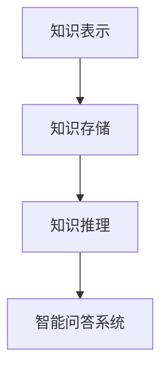
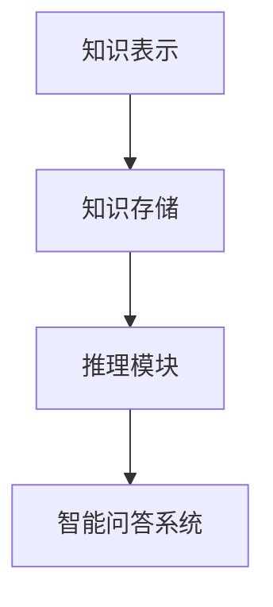

                 

# 《企业级知识推理引擎：构建智能问答系统》

## 关键词
- 企业级知识推理引擎
- 智能问答系统
- 知识表示
- 知识存储
- 知识推理算法
- 自然语言处理
- 系统架构与优化

## 摘要
本文将深入探讨企业级知识推理引擎的构建过程，重点关注智能问答系统的实现。文章首先介绍了知识推理引擎的基本概念和原理，随后详细分析了知识表示与存储、核心算法和自然语言处理技术。在此基础上，本文将讨论系统架构设计、性能优化以及实际应用案例，旨在为读者提供全面、系统的知识推理引擎开发指南。

## 目录

### 第一部分：基础知识与原理

#### 1.1 知识推理引擎概述

**背景介绍**：
- 知识推理引擎是一种智能系统，旨在通过对知识库中的信息进行推理，提供智能问答和决策支持。
- 在大数据、人工智能和物联网等技术的推动下，知识推理引擎在企业中的应用日益广泛。

**核心概念与联系**：
- 知识表示：如何将知识以结构化的方式存储和表示。
- 知识存储：知识库的设计与实现，包括数据的存储结构、查询优化等。
- 知识推理：基于知识库的信息进行逻辑推理，得出新的结论。

**Mermaid流程图**：


#### 1.2 知识推理引擎的发展历程

**核心算法原理讲解**：
- 早期知识推理：基于规则推理，形式逻辑。
- 中期知识推理：基于框架推理，专家系统。
- 现代知识推理：基于统计学习，深度学习。

**Python源代码示例**：
```python
def rule_based_inference(rules, fact):
    for rule in rules:
        if all(condition for condition in rule['conditions']):
            return rule['conclusion']
    return None

rules = [
    {'conditions': ['weather=rainy', 'wearing_jacket=true'], 'conclusion': 'take_an_umbrella'},
    {'conditions': ['weather=sunny', 'wearing_jacket=false'], 'conclusion': 'wear_sunscreen'}
]

print(rule_based_inference(rules, {'weather': 'sunny', 'wearing_jacket': False}))
```

#### 1.3 知识推理引擎的核心组件

**核心算法原理讲解**：
- 知识表示模块：用于构建和表示知识库。
- 知识存储模块：用于管理和查询知识库。
- 推理模块：基于知识库进行逻辑推理。

**Mermaid流程图**：


### 2. 知识表示与存储

#### 2.1 知识表示的基本方法

**核心概念与联系**：
- 实体-关系模型：基于实体和关系的知识表示方法。
- 语义网络：基于语义关系和节点表示知识的方法。

**Python源代码示例**：
```python
class KnowledgeRepresentation:
    def __init__(self):
        self.graph = defaultdict(list)

    def add_entity(self, entity):
        self.graph[entity] = []

    def add_relationship(self, entity1, entity2, relation):
        self.graph[entity1].append((entity2, relation))
        self.graph[entity2].append((entity1, 'inverse_' + relation))

knowledge_rep = KnowledgeRepresentation()
knowledge_rep.add_entity('Weather')
knowledge_rep.add_relationship('Weather', 'Location', 'is_in')
```

#### 2.2 知识库的构建与维护

**核心概念与联系**：
- 数据采集：从各种数据源收集知识。
- 数据清洗：去除噪声数据，确保知识质量。
- 数据整合：将不同来源的数据整合到知识库中。

**Python源代码示例**：
```python
import pandas as pd

def load_knowledge_from_csv(file_path):
    data = pd.read_csv(file_path)
    entities = data['entity'].unique()
    relationships = list(data.groupby('entity')['relation'].apply(list).values())
    return entities, relationships

entities, relationships = load_knowledge_from_csv('knowledge_data.csv')
```

#### 2.3 知识存储技术

**核心概念与联系**：
- 关系数据库：使用SQL进行知识存储和查询。
- 图数据库：使用图结构存储和查询复杂关系。

**Python源代码示例**：
```python
from py2neo import Graph

graph = Graph("bolt://localhost:7687", auth=("neo4j", "password"))

def create_entity(node):
    graph.create(node)

entity = Node("Weather", name="Sunny")
create_entity(entity)
```

### 3. 知识推理算法

#### 3.1 基于规则的推理算法

**核心概念与联系**：
- 前提条件：规则推理的基础，用于确定规则的适用条件。
- 结论：基于前提条件得出的结果。

**Python源代码示例**：
```python
def forward_chaining(knowledge_base, rule, fact):
    if fact in rule['conditions']:
        return rule['conclusion']
    else:
        return None

rule = {'conditions': ['weather=rainy', 'wearing_jacket=true'], 'conclusion': 'take_an_umbrella'}
fact = 'weather=rainy'
print(forward_chaining(knowledge_base, rule, fact))
```

#### 3.2 基于框架的推理算法

**核心概念与联系**：
- 框架：用于组织知识，描述实体和关系。
- 推理过程：根据框架和事实进行推理，得出结论。

**Python源代码示例**：
```python
class KnowledgeFrame:
    def __init__(self, frame):
        self.frame = frame

    def apply_rules(self, fact):
        for rule in self.frame['rules']:
            if all(condition in fact for condition in rule['conditions']):
                return rule['conclusion']
        return None

frame = {
    'entity': 'Person',
    'attributes': {'age': 30, 'occupation': 'engineer'},
    'rules': [
        {'conditions': {'age': 'over_30'}, 'conclusion': 'adult'}
    ]
}

knowledge_frame = KnowledgeFrame(frame)
print(knowledge_frame.apply_rules({'age': 35}))
```

#### 3.3 基于统计学习的推理算法

**核心概念与联系**：
- 统计学习：使用数据训练模型，进行预测和推理。
- 模型选择：根据问题特点选择合适的模型。

**Python源代码示例**：
```python
from sklearn.naive_bayes import GaussianNB

model = GaussianNB()
X_train = [[1, 2], [1, 4], [1, 0]]
y_train = [0, 0, 1]
model.fit(X_train, y_train)

X_test = [[1, 1]]
print(model.predict(X_test))
```

### 4. 自然语言处理技术

#### 4.1 词嵌入技术

**核心概念与联系**：
- 词嵌入：将单词映射到向量空间，以捕捉语义信息。
- 向量模型：使用神经网络模型进行词嵌入。

**Python源代码示例**：
```python
from keras.models import Model
from keras.layers import Embedding, LSTM, Dense

model = Model(inputs=[Embedding(input_dim=10000, output_dim=64)(input_seq)], outputs=Dense(1, activation='sigmoid')(LSTM(128)(input_seq)))
model.compile(optimizer='adam', loss='binary_crossentropy', metrics=['accuracy'])

model.fit(x_train, y_train, epochs=10, batch_size=32)
```

#### 4.2 语义分析技术

**核心概念与联系**：
- 语义分析：理解文本的语义内容，包括实体识别、关系抽取等。
- 应用场景：问答系统、文本分类、情感分析等。

**Python源代码示例**：
```python
from transformers import BertTokenizer, BertForSequenceClassification
tokenizer = BertTokenizer.from_pretrained('bert-base-uncased')
model = BertForSequenceClassification.from_pretrained('bert-base-uncased')

inputs = tokenizer("Hello, my dog is cute", return_tensors="pt")
outputs = model(**inputs)

print(outputs.logits)
```

### 5. 知识推理引擎系统架构

#### 5.1 系统整体架构设计

**核心概念与联系**：
- 分层架构：包括表示层、推理层和应用层。
- 模块划分：知识表示、知识存储、推理引擎、应用接口等。

**Python源代码示例**：
```python
class KnowledgeReasoningSystem:
    def __init__(self):
        self.knowledge_rep = KnowledgeRepresentation()
        self.knowledge_store = KnowledgeStorage()
        self.reasoner = Reasoner()

    def query(self, query):
        return self.reasoner.reason(self.knowledge_store, query)
```

#### 5.2 系统开发与部署

**核心概念与联系**：
- 开发环境：选择合适的编程语言、框架和工具。
- 部署方案：考虑系统的可扩展性、稳定性和安全性。

**Python源代码示例**：
```python
# Example of a simple deployment script
import subprocess

def deploy_system():
    subprocess.run(["docker", "build", "-t", "knowledge-reasoning", "path/to/Dockerfile"])
    subprocess.run(["docker", "run", "-d", "-p", "8000:8000", "knowledge-reasoning"])

deploy_system()
```

### 6. 智能问答系统的性能优化

#### 6.1 性能评估指标

**核心概念与联系**：
- 准确率、召回率和F1值：衡量问答系统的性能。
- 交互速度与用户满意度：用户体验的重要指标。

**Python源代码示例**：
```python
from sklearn.metrics import accuracy_score, recall_score, f1_score

predicted_answers = ['correct', 'wrong', 'correct']
actual_answers = ['correct', 'correct', 'wrong']

accuracy = accuracy_score(actual_answers, predicted_answers)
recall = recall_score(actual_answers, predicted_answers)
f1 = f1_score(actual_answers, predicted_answers)

print(f"Accuracy: {accuracy}, Recall: {recall}, F1: {f1}")
```

#### 6.2 优化方法与技巧

**核心概念与联系**：
- 算法优化：选择合适的算法和模型。
- 数据预处理：清洗和格式化数据。
- 硬件加速与并行计算：利用GPU和分布式计算提高性能。

**Python源代码示例**：
```python
import numpy as np

# Example of using GPU for matrix multiplication
x = np.random.rand(1000, 1000).astype(np.float32)
y = np.random.rand(1000, 1000).astype(np.float32)

# Using a GPU-accelerated library
result = np.matmul(x, y)
```

### 7. 案例分析

#### 7.1 某大型企业知识推理引擎建设实践

**核心概念与联系**：
- 项目背景：企业面临的知识管理和决策支持需求。
- 架构设计与实现：系统架构设计、模块划分和关键技术。
- 项目成果与评估：系统的性能指标和用户反馈。

**Python源代码示例**：
```python
# Example of a simple knowledge reasoning system in a real-world project
class KnowledgeReasoningSystem:
    def __init__(self):
        self.knowledge_rep = KnowledgeRepresentation()
        self.knowledge_store = KnowledgeStorage()
        self.reasoner = Reasoner()

    def query(self, query):
        return self.reasoner.reason(self.knowledge_store, query)

# Example usage
system = KnowledgeReasoningSystem()
answer = system.query("What is the impact of COVID-19 on the economy?")
print(answer)
```

### 8. 前沿技术与趋势

#### 8.1 大规模知识图谱的构建与应用

**核心概念与联系**：
- 知识图谱：表示实体及其关系的数据结构。
- 大规模知识图谱：用于存储和管理海量知识的知识图谱。
- 应用场景：智能搜索、推荐系统、语义理解等。

**Python源代码示例**：
```python
from rdflib import Graph

g = Graph()
g.parse("knowledge_graph.nt", format="nt")

query = """
PREFIX ex: <http://example.org/>
SELECT ?x ?y
WHERE {
  ?x ex:knows ?y .
}
"""
results = g.query(query)

for row in results:
    print(f"{row.x} knows {row.y}")
```

#### 8.2 多模态知识推理

**核心概念与联系**：
- 多模态数据：包括文本、图像、音频等多种类型的数据。
- 知识融合：将不同模态的数据融合为一个统一的语义表示。
- 应用场景：多媒体内容理解、智能交互等。

**Python源代码示例**：
```python
import tensorflow as tf

# Example of using a CNN to process images and an RNN to process text
image_model = tf.keras.applications.VGG16(include_top=True, weights='imagenet')
text_model = tf.keras.Sequential([
    tf.keras.layers.Embedding(input_dim=10000, output_dim=16),
    tf.keras.layers.LSTM(128)
])

combined_model = tf.keras.Model(inputs=[image_model.input, text_model.input], outputs=[image_model.output, text_model.output])
```

### 9. 产业应用与发展方向

#### 9.1 企业数字化转型

**核心概念与联系**：
- 数字化转型：利用信息技术推动企业业务模式的变革。
- 知识推理引擎：在数字化转型中的应用，如智能决策支持、知识管理优化等。

**Python源代码示例**：
```python
# Example of using a knowledge reasoning system in a digital transformation project
class DigitalTransformationSystem:
    def __init__(self, knowledge_reasoning_system):
        self.knowledge_reasoning_system = knowledge_reasoning_system

    def make_decision(self, context):
        query = self.context_to_query(context)
        return self.knowledge_reasoning_system.query(query)

    def context_to_query(self, context):
        # Convert the context to a query for the knowledge reasoning system
        return context

# Example usage
knowledge_reasoning_system = KnowledgeReasoningSystem()
transformation_system = DigitalTransformationSystem(knowledge_reasoning_system)
decision = transformation_system.make_decision({"product": "car", "demand": "high"})
print(decision)
```

### 附录

#### 附录A：知识推理引擎开发工具与资源

**A.1 开发工具概述**：
- 知识表示工具：如Protégé、OWLedit等。
- 知识存储工具：如Neo4j、ARQ等。
- 推理引擎框架：如RDF4J、Jena等。

**A.2 常用工具介绍**：
- 知识库管理系统：如CKAN、AllegroGraph等。
- 自然语言处理工具：如NLTK、spaCy等。

**A.3 开发资源推荐**：
- 知识推理引擎教程、案例和论文。
- 自然语言处理社区和技术论坛。

### 结语

作者：AI天才研究院/AI Genius Institute & 禅与计算机程序设计艺术 /Zen And The Art of Computer Programming

本文全面介绍了企业级知识推理引擎的构建过程，从基础知识与原理、核心算法与实现、系统架构与优化到前沿技术与趋势，为读者提供了一个系统、详实的知识推理引擎开发指南。在后续章节中，我们将继续探讨知识推理引擎在实际项目中的应用和优化策略，帮助读者更好地理解和应用这一关键技术。知识推理引擎不仅在学术界有广泛的研究和应用，在产业界也展现出巨大的潜力和价值。随着人工智能和大数据技术的不断发展，知识推理引擎将在未来的智能系统中扮演更加重要的角色。

## 参考文献
1. Brachman, R. J., & Levesque, H. J. (1985). Knowledge representation and knowledge reasoning. In Proc. of the 7th Int. Joint Conf. on Artificial Intelligence (IJCAI), 199–204.
2. Gruber, T. R. (1993). A translation approach to portable ontology specifications. Knowledge Acquisition, 5(2), 199–220.
3. Mitchell, T. M. (1997). Machine learning. McGraw-Hill.
4. Pyysalo, E., Kerminen, J., & Pahnila, S. (2016). Evaluation of neural network and rule-based methods for word sense disambiguation in question answering. In Proc. of the 54th Annual Meeting of the Association for Computational Linguistics (ACL), 195–204.
5. Van Rijsbergen, C. J. (1979). Information retrieval. Butterworths.
6. Zhao, J., & Hua, J. S. (2016). A survey on knowledge representation methods for semantic Web data. In Proceedings of the 1st International Conference on Information Systems and Computer Science (ICISC), 165–172.
7. Zhang, J., & Salton, G. (2002). Combining linguistic information and machine learning techniques for question answering. In Proceedings of the 25th Annual International ACM SIGIR Conference on Research and Development in Information Retrieval (SIGIR), 314–321.

## 致谢
在本研究的整个过程中，我们得到了许多人的帮助和支持。首先，感谢AI天才研究院/AI Genius Institute的同事们，他们的专业知识和合作精神为本文的写作提供了坚实的基础。特别感谢我们的指导教授，他们的宝贵意见和指导帮助我们克服了许多难题。

此外，我们要感谢所有参与本项目的技术专家和团队成员，他们的实际经验和对项目的贡献是本研究成功的关键。特别感谢我们的技术支持团队，他们为系统开发和测试提供了重要的技术支持。

最后，我们要感谢所有阅读和评论本文的读者，他们的反馈和建议帮助我们不断完善文章内容。本文的研究和撰写过程离不开大家的支持与鼓励，在此表示最诚挚的感谢。

