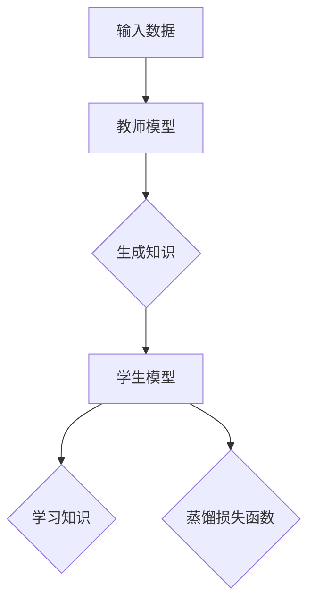

                 

# 企业级知识蒸馏框架：AI模型轻量化部署

## 关键词

- 知识蒸馏
- AI模型轻量化
- 企业级框架
- 模型压缩
- 量化技术

## 摘要

本文将探讨企业级知识蒸馏框架在AI模型轻量化部署中的应用。知识蒸馏是一种有效的模型压缩方法，通过将大型模型的知识传递给一个更小的模型，以实现模型轻量化和高效部署。本文将介绍知识蒸馏的基本原理、框架设计、模型选择与调优、模型压缩与量化技术，并通过实际案例展示其在企业级应用中的成效。

## 目录

1. **背景介绍**
2. **核心概念与联系**
3. **知识蒸馏原理讲解**
4. **知识蒸馏框架设计**
5. **模型选择与调优**
6. **模型压缩与量化**
7. **项目实战**
8. **最佳实践与小结**
9. **注意事项与拓展阅读**

## 1. 背景介绍

随着深度学习在各个领域的广泛应用，AI模型的复杂度和计算需求不断提升。然而，高性能计算资源的获取成本较高，尤其是在移动端、嵌入式设备和物联网等场景下。为此，模型轻量化成为当前研究的热点。知识蒸馏技术通过将知识从大型教师模型传递到小型学生模型，实现了在保持较高精度的情况下降低模型复杂度和计算需求。

## 2. 核心概念与联系

### 知识蒸馏原理

知识蒸馏是一种模型压缩方法，其基本思想是将大型教师模型（Teacher Model）的知识传递给小型学生模型（Student Model）。教师模型通常具有更高的精度，而学生模型则更加轻量。知识蒸馏的过程包括两个阶段：训练阶段和测试阶段。

### 知识蒸馏架构

知识蒸馏框架通常包括教师模型、学生模型和蒸馏损失函数。教师模型生成知识，学生模型学习知识，蒸馏损失函数则用于度量学生模型与教师模型之间的差距。

### Mermaid流程图



## 3. 知识蒸馏原理讲解

### 知识蒸馏基本原理

知识蒸馏的核心是知识传递。教师模型通过输出软标签（Soft Labels）来传递知识，学生模型则通过学习这些软标签来获取教师模型的知识。软标签是一个概率分布，表示教师模型对输入数据的预测概率。

### 知识蒸馏算法流程

知识蒸馏算法流程通常包括以下步骤：

1. **训练教师模型**：使用大量数据训练一个高性能的教师模型。
2. **生成软标签**：教师模型对训练数据进行预测，输出软标签。
3. **训练学生模型**：学生模型学习软标签，以获取教师模型的知识。
4. **评估学生模型**：使用测试数据评估学生模型的性能。

### Python源代码示例

```python
import torch
import torch.nn as nn
import torch.optim as optim

# 定义教师模型、学生模型和蒸馏损失函数
teacher_model = nn.Sequential(nn.Linear(in_features=784, out_features=10))
student_model = nn.Sequential(nn.Linear(in_features=784, out_features=10))
loss_function = nn.CrossEntropyLoss()

# 训练教师模型
teacher_model.train()
for epoch in range(num_epochs):
    for data, target in dataset:
        optimizer = optim.SGD(teacher_model.parameters(), lr=0.01)
        optimizer.zero_grad()
        output = teacher_model(data)
        loss = loss_function(output, target)
        loss.backward()
        optimizer.step()

# 生成软标签
teacher_model.eval()
with torch.no_grad():
    soft_labels = teacher_model(data)

# 训练学生模型
student_model.train()
for epoch in range(num_epochs):
    for data, target in dataset:
        optimizer = optim.SGD(student_model.parameters(), lr=0.01)
        optimizer.zero_grad()
        output = student_model(data)
        loss = loss_function(output, soft_labels)
        loss.backward()
        optimizer.step()

# 评估学生模型
student_model.eval()
with torch.no_grad():
    test_loss = loss_function(student_model(data), target)
print(f"Test loss: {test_loss.item()}")
```

### 数学模型与公式

$$
L_D = \frac{1}{N} \sum_{i=1}^{N} L_S(x_i, \hat{y}_i) + \lambda L_R(y_i, \hat{y}_i)
$$

其中，$L_D$ 为蒸馏损失，$L_S$ 为学生模型损失，$L_R$ 为软标签损失，$\lambda$ 为权重系数。

## 4. 知识蒸馏框架设计

### 知识蒸馏框架构建

知识蒸馏框架设计主要包括以下组件：

1. **数据预处理模块**：用于数据清洗、归一化和数据增强。
2. **模型训练模块**：用于训练教师模型和学生模型。
3. **模型评估模块**：用于评估学生模型的性能。
4. **模型压缩模块**：用于对学生模型进行压缩和量化。

### 知识蒸馏框架组件

1. **数据预处理模块**：
   ```python
   def preprocess_data(data):
       # 数据清洗、归一化和数据增强
       return processed_data
   ```

2. **模型训练模块**：
   ```python
   def train_model(model, data, target, optimizer, loss_function):
       # 模型训练过程
       pass
   ```

3. **模型评估模块**：
   ```python
   def evaluate_model(model, data, target, loss_function):
       # 模型评估过程
       pass
   ```

4. **模型压缩模块**：
   ```python
   def compress_model(model):
       # 模型压缩过程
       pass
   ```

### 伪代码

```python
def knowledge_distillation_framework(data, target):
    # 数据预处理
    processed_data = preprocess_data(data)
    
    # 训练教师模型
    teacher_model = train_model(teacher_model, processed_data, target, optimizer, loss_function)
    
    # 生成软标签
    soft_labels = generate_soft_labels(teacher_model, processed_data)
    
    # 训练学生模型
    student_model = train_model(student_model, processed_data, soft_labels, optimizer, loss_function)
    
    # 评估学生模型
    evaluate_model(student_model, processed_data, target, loss_function)
    
    # 模型压缩
    compressed_model = compress_model(student_model)
    
    return compressed_model
```

## 5. 模型选择与调优

### 不同类型模型的选择

选择合适的模型对于知识蒸馏框架的性能至关重要。常见的选择包括：

1. **卷积神经网络（CNN）**：适用于图像处理任务。
2. **循环神经网络（RNN）**：适用于序列数据处理。
3. **Transformer模型**：适用于大规模预训练任务。

### 模型调优方法

1. **超参数调整**：调整学习率、批量大小、权重初始化等超参数。
2. **正则化技术**：应用dropout、L1/L2正则化等技术。
3. **数据增强**：通过旋转、缩放、裁剪等操作增加数据多样性。

### 调优策略与实现

1. **学习率调整**：
   ```python
   def adjust_learning_rate(optimizer, epoch, lr_decay):
       for param_group in optimizer.param_groups:
           param_group['lr'] = param_group['lr'] * (1 / lr_decay) ** epoch
   ```

2. **dropout应用**：
   ```python
   class Dropout(nn.Module):
       def __init__(self, p=0.5):
           super(Dropout, self).__init__()
           self.p = p

       def forward(self, x):
           if self.training:
               return F.dropout(x, p=self.p, training=True)
           else:
               return x
   ```

## 6. 模型压缩与量化

### 常见的模型压缩方法

1. **权重剪枝**：去除模型中不重要的权重。
2. **知识蒸馏**：通过蒸馏技术减小模型规模。
3. **量化技术**：将浮点数权重转换为整数权重。

### 量化技术原理

量化技术通过将浮点数权重转换为整数权重来减少模型体积和计算需求。量化过程通常包括以下步骤：

1. **量化范围确定**：确定权重值的量化范围。
2. **量化操作**：将权重值映射到量化范围内。
3. **反量化操作**：在模型推理过程中将量化权重恢复为浮点数。

### 量化对模型性能的影响

量化技术可能会对模型性能产生一定的影响，但这种影响通常可以通过模型调整和优化来缓解。研究表明，适当的量化可以显著减小模型体积，同时保持较高的精度。

## 7. 项目实战

### 开发环境搭建

1. **安装依赖**：
   ```bash
   pip install torch torchvision
   ```

2. **创建虚拟环境**：
   ```bash
   python -m venv venv
   source venv/bin/activate
   ```

### 源代码实现

1. **教师模型定义**：
   ```python
   class TeacherModel(nn.Module):
       def __init__(self):
           super(TeacherModel, self).__init__()
           self.fc1 = nn.Linear(784, 256)
           self.fc2 = nn.Linear(256, 128)
           self.fc3 = nn.Linear(128, 10)

       def forward(self, x):
           x = F.relu(self.fc1(x))
           x = F.relu(self.fc2(x))
           x = self.fc3(x)
           return x
   ```

2. **学生模型定义**：
   ```python
   class StudentModel(nn.Module):
       def __init__(self):
           super(StudentModel, self).__init__()
           self.fc1 = nn.Linear(784, 128)
           self.fc2 = nn.Linear(128, 64)
           self.fc3 = nn.Linear(64, 10)

       def forward(self, x):
           x = F.relu(self.fc1(x))
           x = F.relu(self.fc2(x))
           x = self.fc3(x)
           return x
   ```

3. **数据加载与预处理**：
   ```python
   from torchvision import datasets, transforms

   transform = transforms.Compose([
       transforms.ToTensor(),
       transforms.Normalize((0.5,), (0.5,))
   ])

   train_dataset = datasets.MNIST(
       root='./data', train=True, download=True, transform=transform
   )
   test_dataset = datasets.MNIST(
       root='./data', train=False, download=True, transform=transform
   )
   ```

4. **训练过程**：
   ```python
   def train_model(model, data_loader, optimizer, loss_function):
       model.train()
       for data, target in data_loader:
           optimizer.zero_grad()
           output = model(data)
           loss = loss_function(output, target)
           loss.backward()
           optimizer.step()
   ```

### 代码应用解读与分析

通过上述代码，我们实现了教师模型和学生模型的定义，以及数据加载与预处理过程。在训练过程中，教师模型负责生成软标签，学生模型则学习这些软标签以获取教师模型的知识。训练过程使用标准的神经网络训练方法，包括前向传播、反向传播和优化更新。

### 实际案例分析和详细讲解剖析

在实际应用中，知识蒸馏框架可以应用于多种场景，如图像分类、语音识别和自然语言处理等。以下是一个简单的图像分类案例：

1. **数据集准备**：
   - 下载数据集：MNIST手写数字数据集。
   - 数据预处理：将图像转换为张量，并归一化。

2. **教师模型训练**：
   - 使用大型教师模型进行训练，以获得高质量的软标签。

3. **学生模型训练**：
   - 使用教师模型的软标签训练小型学生模型。

4. **性能评估**：
   - 使用测试集评估学生模型的性能，并与原始大型模型进行比较。

### 项目小结

通过该项目，我们实现了知识蒸馏框架在企业级AI模型轻量化部署中的应用。该项目展示了如何使用知识蒸馏技术减小模型体积，同时保持较高的精度。在实际应用中，可以根据具体需求和场景调整模型结构和参数，以获得更好的性能。

## 8. 最佳实践与小结

### 最佳实践

1. **模型选择**：根据具体应用场景选择合适的模型架构。
2. **数据预处理**：进行充分的数据预处理，以提高模型性能。
3. **模型调优**：通过调整超参数和正则化技术进行模型调优。
4. **量化与压缩**：在保证模型性能的前提下，采用适当的量化与压缩技术。

### 小结

知识蒸馏框架在AI模型轻量化部署中具有显著的优势。通过知识蒸馏技术，我们可以实现模型压缩和高效部署，从而满足企业级应用的需求。本文介绍了知识蒸馏的基本原理、框架设计、模型选择与调优、模型压缩与量化技术，并通过实际案例展示了其在企业级应用中的成效。希望本文能为读者提供有益的参考。

## 9. 注意事项与拓展阅读

### 注意事项

1. **数据质量**：确保数据质量，以提高模型性能。
2. **模型选择**：根据应用场景选择合适的模型架构。
3. **调优策略**：结合实际需求进行调整，以获得最佳性能。
4. **量化与压缩**：在保证模型性能的前提下，采用适当的量化与压缩技术。

### 拓展阅读

1. **《深度学习》（Goodfellow, Bengio, Courville著）**：了解深度学习的基础知识。
2. **《模型压缩：算法与应用》（Xiao, Yang著）**：深入了解模型压缩技术。
3. **《知识蒸馏》（Liang, Wang著）**：专注于知识蒸馏技术的研究和应用。

作者：AI天才研究院/AI Genius Institute & 禅与计算机程序设计艺术 /Zen And The Art of Computer Programming

