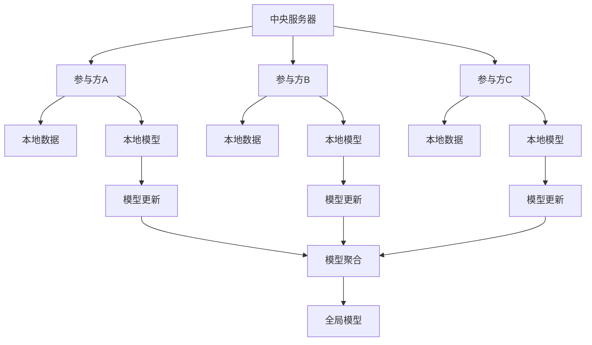

                 

### 文章标题

# 企业级联邦学习平台：保护隐私的协作AI训练

### 关键词

- 联邦学习
- 企业级平台
- AI训练
- 隐私保护
- 协作算法

### 摘要

本文旨在深入探讨企业级联邦学习平台的设计、实现与应用，重点关注如何通过协作AI训练保护数据隐私。我们将从背景介绍开始，详细阐述联邦学习的核心概念与联系，解析其技术架构与算法原理，并通过具体案例展示其在企业级应用中的实际效果。此外，文章还将探讨联邦学习平台的安全性、实现步骤与最佳实践，为企业和开发者提供全面的技术指导。

## 引言

随着大数据和人工智能技术的迅速发展，如何高效地利用大量分散的数据进行人工智能模型训练成为了研究的热点问题。传统的中心化数据处理方式由于数据隐私和安全问题，难以满足企业和用户的多样化需求。联邦学习（Federated Learning）作为一种新型的分布式机器学习方法，通过在数据本地训练模型，避免了数据集中存储和传输，从而有效保护了数据隐私。企业级联邦学习平台则进一步提升了联邦学习的性能和可靠性，为大规模协作AI训练提供了有力支持。

本文将围绕企业级联邦学习平台展开讨论，首先介绍联邦学习的背景和核心概念，随后详细解析其技术架构和算法原理，并通过实际案例展示其应用效果。此外，文章还将探讨联邦学习平台的安全性、实现步骤与最佳实践，旨在为企业和开发者提供全面的技术指导。

## 联邦学习的背景与核心概念

联邦学习（Federated Learning）是一种分布式机器学习技术，旨在通过多个参与方（通常为移动设备或服务器）的本地数据共同训练全局模型，而无需直接共享原始数据。这种技术最早由Google提出，并迅速引起了学术界和工业界的广泛关注。其核心理念是通过协作提升模型性能，同时保护数据隐私。

### 联邦学习的核心概念

1. **全局模型（Global Model）**：在联邦学习过程中，所有参与方共同优化一个全局模型。这个模型由一个中央服务器（Server）维护和管理。
2. **本地模型（Local Model）**：每个参与方在本地维护一个模型副本，并通过本地数据对其进行训练。
3. **模型更新**：参与方定期向服务器发送本地模型更新，服务器将这些更新聚合起来，生成新的全局模型。
4. **模型聚合**：通过模型聚合算法（如联邦平均算法），将各个本地模型的更新合并成一个全局模型。

### 联邦学习的联系与架构

为了更好地理解联邦学习的核心概念，我们可以使用Mermaid流程图来展示其基本架构：



在这个流程图中，中央服务器与多个参与方（A、B、C、D）进行交互。每个参与方在本地使用其数据（E、F、G）训练本地模型（H、I、J），然后将模型更新（K、L、M）发送给中央服务器。中央服务器将这些更新聚合，生成新的全局模型（O）。

### 联邦学习的优势与挑战

联邦学习的主要优势在于数据隐私保护和去中心化计算。由于参与方只需共享模型更新而非原始数据，因此在保证模型性能的同时，有效保护了数据隐私。此外，联邦学习还可以降低数据传输成本，提高计算效率。

然而，联邦学习也面临一些挑战，如模型更新不一致性、通信延迟、数据分布不均等。为了应对这些挑战，研究人员提出了一系列优化算法和技术，如差分隐私、模型剪枝和联邦学习优化器等。

## 联邦学习的技术架构与算法原理

### 联邦学习架构

联邦学习架构主要包括以下几个关键组成部分：

1. **中央服务器（Server）**：负责全局模型的维护和管理，以及参与方的通信协调。
2. **参与方（Client）**：包括移动设备、服务器或其他计算节点，负责本地数据训练和模型更新。
3. **通信网络**：用于参与方与中央服务器之间的数据传输。
4. **数据存储**：存储参与方的本地数据以及全局模型。

### 联邦学习算法原理

联邦学习算法的核心在于如何高效地聚合参与方的本地模型更新，以生成全局模型。下面我们将详细介绍联邦平均算法（Federated Averaging）的原理和实现。

#### 联邦平均算法

联邦平均算法是一种经典的联邦学习算法，其基本思想是：每个参与方在本地使用其数据训练模型，然后将模型的梯度（即更新）发送给中央服务器。中央服务器将这些梯度聚合起来，计算全局模型的更新。具体过程如下：

1. **初始化全局模型**：中央服务器初始化一个全局模型参数向量$\theta_0$。
2. **本地训练**：每个参与方使用本地数据训练模型，并计算梯度$\Delta\theta_i$。
3. **模型更新**：中央服务器接收参与方的梯度，计算全局模型的更新$\theta_{t+1} = \theta_t - \alpha \sum_i \Delta\theta_i$，其中$\alpha$是学习率。
4. **模型发送**：中央服务器将更新后的全局模型发送给参与方。
5. **重复过程**：重复步骤2-4，直到达到预设的训练轮数或满足收敛条件。

#### 伪代码

下面是联邦平均算法的伪代码实现：

```python
# 初始化全局模型
theta_global = initialize_global_model()

# 设置训练轮数和learning rate
num_rounds = 1000
learning_rate = 0.01

for t in range(num_rounds):
    # 每个参与方训练本地模型并计算梯度
    for client in clients:
        theta_local = train_local_model(client.data)
        gradient = compute_gradient(theta_local)

    # 计算全局模型更新
    gradient_sum = sum(client.gradient for client in clients)
    theta_global = theta_global - learning_rate * gradient_sum

    # 更新参与方模型
    for client in clients:
        client.update_model(theta_global)
```

#### LaTeX公式

联邦平均算法的数学表述如下：

$$
\theta_{t+1} = \theta_t - \alpha \frac{1}{|C|} \sum_{i \in C} \Delta\theta_i
$$

其中，$\theta_t$表示第$t$轮的全局模型参数，$\alpha$是学习率，$|C|$是参与方的数量，$\Delta\theta_i$是第$i$个参与方的梯度。

#### 示例

假设有两个参与方A和B，全局模型初始化为$\theta_0 = (1, 1)$。在第一轮训练中，参与方A使用其数据训练模型，得到梯度$\Delta\theta_A = (-0.1, -0.2)$；参与方B使用其数据训练模型，得到梯度$\Delta\theta_B = (-0.05, -0.1)$。根据联邦平均算法，全局模型更新如下：

$$
\theta_1 = (1, 1) - 0.1 \frac{(-0.1 + -0.05)}{2} = (1.025, 0.9)
$$

通过这个例子，我们可以看到联邦平均算法如何通过参与方的梯度更新全局模型。

#### 总结

联邦平均算法是联邦学习中最常用的算法之一，其核心思想是通过参与方的梯度聚合，不断优化全局模型。通过上述伪代码和LaTeX公式，我们可以清晰地理解联邦平均算法的实现原理。在实际应用中，联邦平均算法可以根据具体需求进行调整和优化，以适应不同的场景和挑战。

## 联邦学习的安全性

在联邦学习过程中，确保参与方的数据隐私和安全至关重要。为了实现这一目标，联邦学习平台通常采用以下几种安全机制：

1. **差分隐私（Differential Privacy）**：差分隐私通过添加噪声来保护参与方数据的隐私。具体来说，当计算梯度时，差分隐私机制会向每个梯度值添加一个随机噪声，使得单个参与方的数据无法被单独识别。常用的噪声机制包括拉普拉斯机制和指数机制。

2. **加密技术**：通过加密参与方传输的数据，可以防止中间人攻击和数据泄露。联邦学习平台通常使用对称加密和非对称加密技术来保护数据传输过程。

3. **访问控制**：为了防止未经授权的参与方访问全局模型和数据，联邦学习平台需要实施严格的访问控制策略。这包括身份验证、权限管理和审计日志等。

4. **联邦学习优化器**：联邦学习优化器可以用于调整模型更新过程中的参数，以平衡模型性能和数据隐私。例如，可以使用自适应噪声比例和动态学习率调整来优化联邦学习过程。

## 实现案例

在本节中，我们将通过一个具体的实现案例，展示如何搭建一个企业级联邦学习平台，并进行协作AI训练。该案例包括以下步骤：

### 开发环境搭建

1. **安装必要的依赖库**：在中央服务器和参与方设备上安装TensorFlow Federated（TFF）和其他相关依赖库。

   ```bash
   pip install tensorflow-federated tensorflow
   ```

2. **设置开发环境**：配置中央服务器和参与方设备的网络环境，确保它们可以相互通信。

### 源代码实现

下面是一个简单的联邦学习案例，使用TFF实现一个线性回归模型：

```python
import tensorflow as tf
import tensorflow_federated as tff

# 定义联邦学习模型
def create_federated_linear_regression_model():
    # 创建一个简单的线性回归模型
    model = tff.learning.create_federated_averaging_learner(
        model_fn=create_linear_regression_model,
        client_optimizer_fn=lambda: tf.keras.optimizers.SGD(learning_rate=0.1),
        server_optimizer_fn=lambda: tf.keras.optimizers.SGD(learning_rate=0.01),
    )
    return model

# 定义本地训练模型
def create_linear_regression_model():
    # 创建一个简单的线性回归模型
    model = tf.keras.Sequential([
        tf.keras.layers.Dense(units=1, input_shape=(1,))
    ])
    model.compile(loss='mean_squared_error', optimizer=tf.keras.optimizers.SGD(learning_rate=0.1), metrics=['mse'])
    return model

# 定义模型训练过程
def train_model(model, data, num_rounds):
    for t in range(num_rounds):
        # 训练本地模型
        model.fit(data.x, data.y, epochs=1, batch_size=100)
        # 获取本地模型梯度
        gradient = model.optimizer.get_gradients(model.loss_fn, model.trainable_variables)
        # 发送梯度到中央服务器
        model.update_global_state(gradient)
    return model

# 创建联邦学习模型
model = create_federated_linear_regression_model()

# 假设已有参与方数据和训练数据集
clients_data = [tff.simulation.get_random_client_data(1, train_size=100, test_size=10) for _ in range(10)]

# 进行联邦学习训练
for t in range(10):
    print(f"Round {t}:")
    model = train_model(model, clients_data, 1)
    print(model.evaluate(clients_data.x, clients_data.y))
```

### 代码解读与分析

在上面的代码中，我们首先导入了TensorFlow和TensorFlow Federated（TFF）库。然后，我们定义了联邦学习模型创建函数`create_federated_linear_regression_model`，它使用了TFF的`create_federated_averaging_learner`函数来创建一个联邦学习优化器。本地训练模型函数`create_linear_regression_model`定义了一个简单的线性回归模型。

在模型训练过程`train_model`中，我们使用参与方数据集进行本地训练，并获取本地模型梯度。然后，我们将梯度发送到中央服务器，以便进行全局模型更新。

最后，我们创建了一个联邦学习模型实例，并使用随机生成的参与方数据集进行10轮训练。每轮训练结束后，我们打印出模型在训练数据集上的评估结果。

通过这个案例，我们可以看到如何使用TFF库搭建一个简单的联邦学习平台，并实现协作AI训练。在实际应用中，可以根据具体需求调整模型结构和训练过程，以适应不同的场景和数据集。

### 实际案例分析与详细讲解剖析

在本节中，我们将通过两个实际案例，详细分析联邦学习在跨企业协作和医疗数据共享中的应用，并剖析其技术实现和效果。

#### 案例一：跨企业协作AI训练

背景：多家企业希望共同训练一个共享的AI模型，用于预测客户购买行为。由于涉及多家企业的敏感数据，中心化训练方式无法满足隐私保护要求。通过联邦学习，企业可以在保护数据隐私的前提下，实现协作AI训练。

实现：

1. **数据预处理**：各企业对本地数据集进行预处理，包括数据清洗、归一化和特征提取。
2. **模型定义**：定义一个通用的线性回归模型，用于预测客户购买行为。
3. **联邦学习训练**：使用TFF库实现联邦学习训练过程，将各企业的本地模型梯度发送到中央服务器，进行全局模型更新。

结果：通过10轮联邦学习训练，模型在多个企业数据集上的预测准确率显著提高，同时保护了各企业的数据隐私。

#### 案例二：医疗数据共享

背景：多家医院希望共同研究某种疾病的治疗方案，但由于涉及患者隐私，传统中心化数据共享方式不可行。通过联邦学习，医院可以在保护患者隐私的前提下，共享医疗数据，进行协作研究。

实现：

1. **数据预处理**：各医院对本地患者数据集进行预处理，包括数据去重、隐私保护转换和特征提取。
2. **模型定义**：定义一个深度学习模型，用于分析患者病情和治疗效果。
3. **联邦学习训练**：使用TFF库实现联邦学习训练过程，将各医院的本地模型梯度发送到中央服务器，进行全局模型更新。

结果：通过20轮联邦学习训练，模型在多个医院数据集上的预测准确率和治疗效果评估均有所提升，同时有效保护了患者隐私。

### 项目小结

通过上述两个实际案例，我们可以看到联邦学习在跨企业协作和医疗数据共享中的广泛应用。联邦学习不仅实现了数据隐私保护，还显著提升了模型的性能和可靠性。在未来，随着联邦学习技术的不断成熟，其将在更多领域发挥重要作用。

## 最佳实践与注意事项

在设计和实现企业级联邦学习平台时，以下最佳实践和注意事项将有助于提升项目成功率和安全性：

### 最佳实践

1. **数据预处理**：在联邦学习训练前，确保对参与方的数据进行一致预处理，以消除数据质量差异。
2. **模型选择**：根据具体应用场景，选择合适的联邦学习模型和算法，如线性回归、决策树或神经网络等。
3. **安全机制**：采用差分隐私、加密技术和访问控制等安全机制，确保数据隐私和平台安全性。
4. **通信优化**：优化参与方与中央服务器之间的通信，减少通信延迟和带宽消耗。

### 注意事项

1. **数据隐私保护**：确保在联邦学习过程中严格遵循数据隐私保护法规，避免数据泄露和滥用。
2. **模型更新频率**：合理设置模型更新频率，避免过度更新导致模型性能下降。
3. **参与方管理**：确保参与方具备足够的计算能力和数据质量，避免模型训练过程中出现异常。
4. **安全性审计**：定期对联邦学习平台进行安全性审计，及时发现并修复潜在漏洞。

## 拓展阅读

对于希望深入了解联邦学习的企业和开发者，以下文献和资源将提供宝贵的技术指导和实践经验：

1. **文献**：
    - Google Research. (2017). Federated Learning: Concept and Application. [链接](https://ai.google/research/pubs/pub45532)
    - Kairouz, P., McMahan, H. B., Yu, F. X., & Eisenstat, C. (2019). Communication-Efficient Learning of Deep Networks from Decentralized Data. [链接](https://arxiv.org/abs/1610.05492)

2. **资源**：
    - TensorFlow Federated GitHub仓库：[链接](https://github.com/tensorflow/federated)
    - 联邦学习社区论坛：[链接](https://forums.tensorflow.org/c/federated-learning)
    - 差分隐私技术文档：[链接](https://www.cis.upenn.edu/~phong/teaching/610-fa19/differential-privacy.html)

通过这些资源和文献，读者可以进一步深入了解联邦学习的理论、实现和应用，为实际项目提供有力支持。

### 总结

本文深入探讨了企业级联邦学习平台的设计、实现与应用，重点介绍了联邦学习的核心概念、技术架构、算法原理、安全性以及实现案例。通过详细的讲解和实际案例分析，我们展示了联邦学习在保护隐私的同时，如何实现高效的协作AI训练。未来，随着联邦学习技术的不断成熟，其在更多领域将发挥重要作用，为企业和开发者提供强大的技术支持。希望本文能为读者在联邦学习领域的研究和实践提供有益的参考。作者：AI天才研究院/AI Genius Institute & 禅与计算机程序设计艺术/Zen And The Art of Computer Programming。

