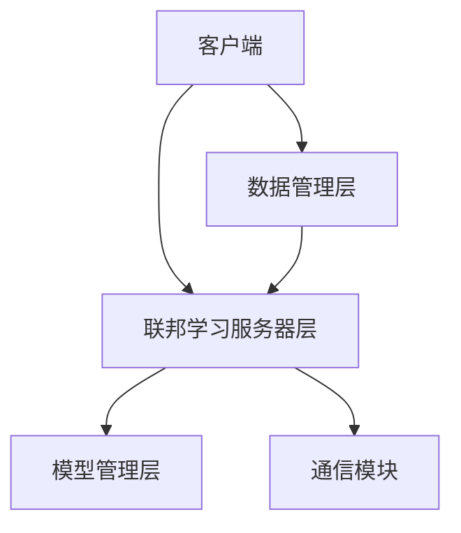

                 

### 书名：企业级联邦学习框架：保护隐私的协作AI训练

> 关键词：联邦学习、隐私保护、协作AI训练、企业级框架、同步与异步联邦学习、安全优化、应用案例

> 摘要：
本文将深入探讨企业级联邦学习框架的设计与实现，重点分析其保护隐私、实现协作AI训练的核心原理和技术。通过对联邦学习的基本概念、基础技术、安全与隐私保护、设计原则、核心组件、案例分析以及应用与未来展望的详细阐述，本文旨在为IT从业者提供全面而实用的指导，助力企业高效构建和部署联邦学习系统。

## 第一部分：联邦学习基本概念

### 第1章：联邦学习的起源与发展

#### 1.1 联邦学习的背景

#### 1.1.1 数据隐私保护的需求

在当今信息化社会中，数据已成为企业和组织的重要资产。然而，随着数据量的急剧增加，数据隐私保护问题也日益突出。传统的集中式数据处理方式往往无法满足隐私保护的需求，因为数据需要在集中的服务器上进行处理和分析，从而增加了数据泄露的风险。联邦学习作为一种新的数据处理方式，正是为了解决这一问题而诞生的。

#### 1.1.2 联邦学习的诞生

联邦学习（Federated Learning）的概念最早由Google在2016年提出。其核心思想是通过在数据保持本地的情况下进行模型训练，从而避免了将数据上传到中心服务器。这样，不仅可以保护数据的隐私，还可以实现分布式数据处理，提高系统的效率和安全性。

#### 1.1.3 联邦学习的发展现状

自提出以来，联邦学习在学术界和工业界都受到了广泛关注。在学术界，研究人员不断提出新的算法和优化方法，以提高联邦学习的性能和效率。在工业界，众多企业已经开始部署联邦学习系统，用于各种应用场景，如金融、医疗、物联网等。

#### 1.2 联邦学习的基本概念

##### 1.2.1 联邦学习的定义

联邦学习是一种机器学习技术，它允许多个参与者（通常是数据持有者）在一个共同的机器学习模型上进行协作训练，而无需共享他们的数据。模型训练过程在各个参与者的本地设备上执行，然后通过加密的梯度聚合来更新全局模型。

##### 1.2.2 联邦学习的关键特性

1. **隐私保护**：联邦学习通过本地训练和加密梯度聚合，确保数据在整个训练过程中不被泄露。
2. **分布式处理**：联邦学习允许多个参与者共同参与模型训练，提高了系统的效率和扩展性。
3. **协作性**：联邦学习实现了参与者之间的协作，使得模型可以整合各个参与者的知识，提高模型的性能。

##### 1.2.3 联邦学习与传统机器学习的区别

1. **数据分布**：传统机器学习通常需要将数据上传到中心服务器进行训练，而联邦学习则是在各个本地设备上训练模型。
2. **隐私保护**：传统机器学习容易受到数据泄露的风险，而联邦学习通过加密和本地训练，提高了数据的隐私保护水平。
3. **系统架构**：传统机器学习通常是一个集中的系统，而联邦学习是一个分布式的系统，具有较高的扩展性。

#### 1.3 联邦学习在企业和研究中的应用

##### 1.3.1 企业级联邦学习应用案例

在企业级应用中，联邦学习已被广泛应用于金融、医疗、零售等领域。例如，金融机构可以使用联邦学习来构建风险预测模型，而无需共享敏感的客户数据。医疗机构可以利用联邦学习来分析患者的健康数据，提高诊断和治疗的准确性。

##### 1.3.2 联邦学习在研究领域的应用

在研究领域，联邦学习被用于解决各种复杂的问题。例如，研究人员可以利用联邦学习来分析大规模的数据集，如气候数据、生物数据等，以发现潜在的模式和趋势。此外，联邦学习也被用于训练复杂的深度学习模型，如图像识别、自然语言处理等。

### 第2章：联邦学习的基础技术

#### 2.1 联邦学习框架

##### 2.1.1 联邦学习框架的基本架构

联邦学习框架通常包括以下几个关键组件：

1. **客户端**：负责在本地设备上加载数据、初始化模型并进行本地训练。
2. **服务器**：负责收集来自各个客户端的梯度，进行聚合更新并分发新的全局模型。
3. **通信模块**：负责在客户端和服务器之间传输数据和模型。

##### 2.1.2 联邦学习框架的关键组件

1. **模型**：联邦学习通常使用预训练模型，例如深度神经网络，然后在各个客户端进行本地训练。
2. **加密算法**：为了保护数据的隐私，联邦学习使用加密算法对梯度进行加密。
3. **通信协议**：联邦学习使用安全的通信协议，如TLS，确保数据在传输过程中的安全。

##### 2.1.3 常见的联邦学习框架

目前，已经出现了多种联邦学习框架，如Google的TensorFlow Federated（TFF）、微软的茯苓（茯苓联邦学习框架）等。这些框架提供了丰富的工具和接口，方便开发者构建和部署联邦学习系统。

#### 2.2 同步联邦学习

##### 2.2.1 同步联邦学习的原理

同步联邦学习是一种联邦学习的方式，其中所有客户端按照相同的频率向服务器发送本地梯度。这种方式的优点是模型更新是同步的，有利于收敛。

##### 2.2.2 同步联邦学习的算法流程

1. **初始化**：客户端初始化模型并在本地训练。
2. **发送梯度**：客户端将本地训练的梯度发送到服务器。
3. **聚合更新**：服务器收集所有客户端的梯度，进行聚合更新。
4. **分发新模型**：服务器将更新后的模型分发给所有客户端。

##### 2.2.3 同步联邦学习的优点与挑战

**优点**：
- **同步更新**：同步联邦学习可以保证模型更新的同步，有利于收敛。
- **简单实现**：同步联邦学习算法相对简单，易于实现。

**挑战**：
- **通信开销**：同步联邦学习需要所有客户端按照相同的频率发送梯度，可能导致通信开销较大。
- **延迟问题**：由于通信延迟，同步联邦学习可能导致模型更新不及时。

#### 2.3 异步联邦学习

##### 2.3.1 异步联邦学习的原理

异步联邦学习是一种联邦学习的方式，其中客户端可以按照不同的频率向服务器发送本地梯度。这种方式的优点是具有更高的灵活性和扩展性。

##### 2.3.2 异步联邦学习的算法流程

1. **初始化**：客户端初始化模型并在本地训练。
2. **发送梯度**：客户端将本地训练的梯度发送到服务器，无需按照固定频率。
3. **聚合更新**：服务器收集所有客户端的梯度，进行聚合更新。
4. **分发新模型**：服务器将更新后的模型分发给所有客户端。

##### 2.3.3 异步联邦学习的优点与挑战

**优点**：
- **灵活性强**：异步联邦学习允许客户端按照不同的频率发送梯度，具有更高的灵活性。
- **扩展性好**：异步联邦学习可以更好地适应大规模分布式系统。

**挑战**：
- **不一致性问题**：由于客户端发送梯度的时间不同，可能导致模型更新的不一致性，影响收敛。
- **实现复杂**：异步联邦学习算法相对复杂，需要更多的优化技术。

#### 2.4 联邦学习的优化方法

##### 2.4.1 优化目标

联邦学习的优化目标包括：
- **模型性能**：提高模型的准确性和泛化能力。
- **通信效率**：减少客户端与服务器之间的通信开销。
- **安全性**：确保数据的隐私和安全。

##### 2.4.2 常用的优化算法

常用的优化算法包括：
- **梯度下降**：传统的优化算法，适用于同步联邦学习。
- **异步优化算法**：如Asynchronous Stochastic Gradient Descent（ASGD），适用于异步联邦学习。
- **分布式优化算法**：如Mini-batch SGD，用于减少通信开销。

##### 2.4.3 优化方法的对比与选择

不同的优化方法适用于不同的联邦学习场景。在选择优化方法时，需要考虑以下因素：
- **系统规模**：大规模系统更适合使用分布式优化算法。
- **通信网络**：高延迟网络适合使用异步优化算法。
- **模型复杂度**：复杂模型适合使用分布式优化算法。

## 第3章：联邦学习的安全与隐私保护

#### 3.1 联邦学习的安全挑战

##### 3.1.1 安全威胁类型

联邦学习面临的主要安全威胁包括：
- **数据泄露**：未经授权的实体访问和获取参与者的数据。
- **模型泄漏**：未经授权的实体通过模型推断参与者的数据。
- **恶意攻击**：参与者故意向系统注入恶意数据或模型。

##### 3.1.2 安全攻击与防御策略

常见的安全攻击包括：
- **模型泄漏攻击**：通过分析模型梯度推断参与者的数据。
- **差分攻击**：通过比较参与者的模型更新推断参与者的数据。
- **协同攻击**：多个参与者协同攻击联邦学习系统。

防御策略包括：
- **加密算法**：使用加密算法对数据和梯度进行加密。
- **差分隐私**：在模型更新过程中添加随机噪声，防止模型泄漏。
- **访问控制**：限制参与者的访问权限，防止未授权访问。

##### 3.1.3 安全性的评价指标

安全性评价指标包括：
- **保密性**：确保数据在传输和存储过程中的安全性。
- **完整性**：确保数据在传输和存储过程中的完整性和准确性。
- **可用性**：确保联邦学习系统的稳定性和可靠性。

#### 3.2 隐私保护技术

##### 3.2.1 隐私保护的重要性

隐私保护是联邦学习的核心目标之一。有效的隐私保护可以确保参与者的数据在联邦学习过程中不被泄露，提高系统的可信度和用户满意度。

##### 3.2.2 隐私保护的方法

常见的隐私保护方法包括：
- **加密**：使用加密算法对数据和梯度进行加密，防止未经授权的访问。
- **差分隐私**：在模型更新过程中添加随机噪声，防止模型泄漏。
- **匿名化**：对参与者的数据进行匿名化处理，降低识别风险。

##### 3.2.3 常用的隐私保护技术

常用的隐私保护技术包括：
- **同态加密**：允许在加密数据上进行计算，而不需要解密。
- **全同态加密**：允许对加密数据进行任意操作，而不仅仅是计算。
- **安全多方计算**：允许多个参与者共同计算一个函数，而无需共享数据。
- **基于区块链的隐私保护**：利用区块链的不可篡改性和匿名性，提高隐私保护水平。

#### 3.3 联邦学习中的联邦加密

##### 3.3.1 联邦加密的概念

联邦加密是一种在联邦学习过程中使用的加密技术，它允许参与者在加密状态下进行模型更新和计算。联邦加密的主要目标是保护参与者的数据隐私，防止模型泄漏和恶意攻击。

##### 3.3.2 联邦加密的算法原理

联邦加密的算法原理包括：
- **加密计算**：使用加密算法对参与者的数据进行加密。
- **解密计算**：使用解密算法对加密数据进行解密。
- **计算密文**：在加密状态下进行模型更新和计算，以保护参与者的数据隐私。

##### 3.3.3 联邦加密的应用场景

联邦加密适用于以下应用场景：
- **多方数据聚合**：参与者在加密状态下进行数据聚合，防止数据泄露。
- **协同模型训练**：参与者在加密状态下进行模型训练，防止模型泄漏。
- **多方计算**：参与者在加密状态下进行计算，防止数据泄露和模型泄漏。

## 第二部分：企业级联邦学习框架设计

### 第4章：企业级联邦学习框架的设计原则

#### 4.1 设计目标

企业级联邦学习框架的设计目标包括：

1. **保护隐私**：确保参与者的数据在整个联邦学习过程中不被泄露。
2. **协同训练**：实现参与者的数据模型协同训练，提高模型的准确性和泛化能力。
3. **可扩展性**：支持大规模分布式系统，能够适应企业级应用的扩展需求。
4. **高可用性**：确保联邦学习系统的稳定性和可靠性，满足企业级应用的持续运行需求。
5. **安全性**：防止恶意攻击和数据泄露，确保系统的安全性和可信度。

#### 4.1.1 面向企业级应用的联邦学习框架目标

企业级联邦学习框架需要满足以下特定目标：

1. **合规性**：确保联邦学习系统符合数据保护法规和行业标准，如GDPR、HIPAA等。
2. **灵活部署**：支持多种部署方式，包括云原生、混合云和边缘计算。
3. **易用性**：提供简洁的接口和友好的用户界面，降低用户使用门槛。
4. **高性能**：优化算法和系统架构，提高联邦学习的效率和性能。

#### 4.1.2 保护隐私和协同训练的重要性

保护隐私和协同训练是企业级联邦学习框架的两个核心目标，其重要性如下：

1. **保护隐私**：企业级联邦学习框架的核心在于保护参与者的数据隐私。在数据驱动的时代，数据泄露的风险无处不在。保护隐私可以增强企业的信誉，提高用户对数据处理的信任度。
2. **协同训练**：协同训练可以整合来自不同参与者的数据，构建更准确、更泛化的模型。这对于企业来说，意味着更高效的数据利用和更精准的业务决策。

#### 4.1.3 可扩展性和高可用性的设计要求

可扩展性和高可用性是企业级联邦学习框架必须满足的关键要求，其设计要求如下：

1. **可扩展性**：框架需要能够支持大规模分布式系统，包括数千甚至数万个参与者的加入。系统架构应具备横向和纵向扩展的能力，以适应企业业务的快速增长。
2. **高可用性**：系统应具备高可靠性，能够在面对硬件故障、网络中断等突发情况下，保持稳定运行。此外，框架应具备自动恢复和负载均衡功能，确保系统的持续可用性。

#### 4.2 系统架构

企业级联邦学习框架的总体架构设计如下：

1. **客户端层**：包括参与者的数据存储设备和计算资源。客户端负责数据的本地处理和模型训练。
2. **联邦学习服务器层**：包括联邦学习服务器和通信模块。服务器负责收集来自各个客户端的模型更新、聚合梯度并进行模型更新。
3. **数据管理层**：负责数据的收集、存储、加密和共享。数据管理层确保数据的安全和隐私保护。
4. **模型管理层**：负责模型的初始化、训练、评估和部署。模型管理层确保模型的性能和有效性。

#### 4.2.1 联邦学习框架的总体架构

联邦学习框架的总体架构如下图所示：

#### 4.2.2 各组件的功能与交互

各组件的功能与交互如下：

1. **客户端**：客户端负责数据的本地处理和模型训练。客户端接收到服务器下发的模型参数后，在本地设备上进行数据加载、模型初始化和本地训练。训练完成后，客户端将本地梯度上传到服务器。
2. **联邦学习服务器**：服务器负责收集来自各个客户端的梯度、聚合更新并分发新的全局模型。服务器接收客户端上传的梯度，进行聚合计算并更新全局模型。更新后的模型会通过通信模块发送回客户端。
3. **数据管理层**：数据管理层负责数据的收集、存储、加密和共享。数据管理层通过加密算法对数据进行加密，确保数据在传输和存储过程中的安全性。同时，数据管理层支持数据的本地存储和共享，方便客户端进行数据加载和训练。
4. **模型管理层**：模型管理层负责模型的初始化、训练、评估和部署。模型管理层支持多种模型选择，如深度神经网络、决策树等。模型管理层提供统一的接口，方便客户端和服务器进行模型操作。

#### 4.2.3 架构设计的原则和考虑因素

架构设计的原则和考虑因素如下：

1. **模块化**：框架应采用模块化设计，使各组件独立且易于扩展。模块化设计可以提高系统的可维护性和可扩展性。
2. **分布式**：框架应支持分布式部署，以便于扩展和处理大规模数据。分布式部署可以提高系统的性能和可靠性。
3. **安全性**：框架应具备完善的安全机制，包括数据加密、访问控制、安全审计等，确保数据的安全性和隐私保护。
4. **灵活性**：框架应具备灵活性，支持多种数据源和计算资源的接入。同时，框架应支持自定义模型和算法，满足不同的业务需求。
5. **易用性**：框架应提供简洁的接口和友好的用户界面，降低用户的使用门槛。此外，框架应具备自动部署和运维功能，提高系统的可操作性和易用性。

#### 4.3 可扩展性与高可用性设计

企业级联邦学习框架的可扩展性与高可用性设计如下：

1. **可扩展性**：
   - **横向扩展**：通过增加客户端和服务器节点，提高系统的处理能力和容量。
   - **纵向扩展**：通过增加服务器和存储节点的计算和存储资源，提高系统的性能和吞吐量。
   - **负载均衡**：采用负载均衡策略，合理分配计算和存储资源，避免单点瓶颈。
   - **自动扩容**：支持自动扩容功能，根据系统负载自动增加节点数量，确保系统的高效运行。

2. **高可用性**：
   - **冗余备份**：对关键组件（如服务器、数据存储）进行冗余备份，确保系统的持续可用性。
   - **故障转移**：在出现故障时，自动切换到备用节点，确保系统的稳定运行。
   - **自动恢复**：在出现异常时，自动进行系统恢复，减少故障影响。
   - **监控与告警**：对系统进行实时监控和告警，及时发现并处理异常情况。

#### 4.3.1 联邦学习系统的可扩展性

联邦学习系统的可扩展性设计如下：

1. **水平扩展**：通过增加客户端和服务器节点，提高系统的处理能力和容量。在联邦学习系统中，客户端和服务器节点可以分布式部署，以实现水平扩展。
   - **客户端扩展**：在分布式系统中，可以增加更多的客户端节点，使得更多的参与者可以加入联邦学习过程，提高数据的多样性和模型的泛化能力。
   - **服务器扩展**：在分布式系统中，可以增加更多的服务器节点，以提高服务器端的处理能力和吞吐量，加快模型更新的速度。

2. **垂直扩展**：通过增加服务器和存储节点的计算和存储资源，提高系统的性能和吞吐量。在联邦学习系统中，可以采用高性能服务器和大规模存储设备，以满足系统的计算和存储需求。
   - **服务器性能**：采用多核高性能服务器，提高服务器端的计算能力，加快模型更新的速度。
   - **存储容量**：采用大容量存储设备，确保系统的存储需求得到满足。

3. **负载均衡**：采用负载均衡策略，合理分配计算和存储资源，避免单点瓶颈。在联邦学习系统中，可以采用负载均衡器，根据系统的实际负载情况，动态调整计算和存储资源的分配。
   - **网络负载均衡**：通过负载均衡器，将网络流量均匀地分配到各个服务器节点，避免单点网络瓶颈。
   - **计算负载均衡**：通过负载均衡器，将计算任务均匀地分配到各个客户端节点，避免单点计算瓶颈。

4. **自动扩容**：支持自动扩容功能，根据系统负载自动增加节点数量，确保系统的高效运行。在联邦学习系统中，可以采用自动化管理工具，根据系统的实际负载情况，自动增加或减少节点数量。
   - **自动扩容策略**：根据系统的实际负载情况，设定自动扩容阈值，当系统负载超过阈值时，自动增加节点数量。
   - **自动缩容策略**：根据系统的实际负载情况，设定自动缩容阈值，当系统负载低于阈值时，自动减少节点数量。

#### 4.3.2 联邦学习系统的高可用性

联邦学习系统的高可用性设计如下：

1. **冗余备份**：对关键组件（如服务器、数据存储）进行冗余备份，确保系统的持续可用性。在联邦学习系统中，可以采用以下备份策略：
   - **服务器备份**：对服务器节点进行备份，包括操作系统、应用程序和配置文件等。在出现故障时，可以快速切换到备用服务器，确保系统的持续可用性。
   - **数据存储备份**：对数据存储节点进行备份，包括数据存储设备和数据文件等。在出现故障时，可以快速切换到备用数据存储节点，确保数据的完整性和可用性。

2. **故障转移**：在出现故障时，自动切换到备用节点，确保系统的稳定运行。在联邦学习系统中，可以采用以下故障转移策略：
   - **服务器故障转移**：当主服务器出现故障时，自动切换到备用服务器，确保系统的持续可用性。故障转移过程中，无需人工干预，系统自动完成切换。
   - **数据存储故障转移**：当主数据存储节点出现故障时，自动切换到备用数据存储节点，确保数据的完整性和可用性。故障转移过程中，无需人工干预，系统自动完成切换。

3. **自动恢复**：在出现异常时，自动进行系统恢复，减少故障影响。在联邦学习系统中，可以采用以下自动恢复策略：
   - **系统异常检测**：实时监控系统运行状态，当检测到异常时，自动进行系统恢复。
   - **自动重启**：在出现异常时，自动重启系统组件，确保系统的正常运行。
   - **日志记录**：记录系统异常信息和恢复过程，便于故障排查和系统优化。

4. **监控与告警**：对系统进行实时监控和告警，及时发现并处理异常情况。在联邦学习系统中，可以采用以下监控与告警策略：
   - **系统监控**：实时监控服务器节点、数据存储节点和客户端节点的运行状态，及时发现异常情况。
   - **告警机制**：当检测到异常情况时，自动发送告警通知，包括邮件、短信、电话等，确保相关人员及时得知异常情况。
   - **告警记录**：记录告警信息和处理结果，便于后续故障排查和系统优化。

### 第5章：企业级联邦学习框架的核心组件

#### 5.1 数据管理组件

数据管理组件在企业级联邦学习框架中扮演着至关重要的角色，其主要职责包括数据的收集、存储、加密和共享。以下是对数据管理组件的详细阐述：

##### 5.1.1 数据收集与预处理

数据收集与预处理是联邦学习过程中至关重要的一步。在联邦学习系统中，数据通常由各个客户端提供。客户端需要从本地数据源收集数据，并进行预处理，以确保数据的质量和一致性。

1. **数据收集**：客户端通过数据接口从本地数据库、文件系统或其他数据源中收集数据。数据收集的过程需要考虑数据的安全性，防止数据泄露。

2. **预处理**：数据收集后，需要进行一系列预处理操作，如去重、清洗、归一化等。预处理操作的目的是提高数据的质量，为后续的模型训练提供可靠的数据基础。

3. **本地存储**：预处理后的数据在本地存储，以便后续的本地训练和使用。本地存储需要考虑数据的安全性和可靠性，采用加密存储和数据备份策略。

##### 5.1.2 数据加密与共享

数据加密与共享是确保联邦学习系统安全性和隐私保护的关键环节。在联邦学习过程中，数据需要在不同节点之间进行传输和共享。为了保护数据的隐私，数据在传输和存储过程中需要进行加密处理。

1. **数据加密**：客户端在本地对数据进行加密处理，使用加密算法（如AES、RSA等）对数据进行加密。加密后的数据在传输和存储过程中无法被未经授权的实体访问。

2. **数据共享**：加密后的数据通过安全的通信协议（如TLS）传输到服务器。服务器收到数据后，进行解密处理，然后进行模型训练和更新。解密过程需要使用加密密钥，确保数据的安全性。

3. **数据共享策略**：联邦学习系统可以采用多种数据共享策略，如基于角色的访问控制、差分隐私等。数据共享策略需要确保数据的安全性，同时满足联邦学习的需求。

##### 5.1.3 数据同步与一致性保障

数据同步与一致性保障是确保联邦学习系统正常运行的关键。在分布式系统中，数据可能在不同节点之间存在差异，导致模型训练不一致。为了保证模型训练的一致性，需要实现数据同步与一致性保障。

1. **数据同步**：客户端在本地训练模型后，将模型更新（如梯度、模型参数等）发送到服务器。服务器收集来自所有客户端的更新，进行聚合处理，更新全局模型。

2. **一致性保障**：在数据同步过程中，需要确保数据的一致性。一致性保障可以通过以下方法实现：
   - **版本控制**：为每个数据更新分配版本号，确保数据更新的一致性。
   - **冲突检测与解决**：在数据同步过程中，检测和处理数据冲突，确保数据的一致性。
   - **数据校验**：对数据进行校验，确保数据的有效性和完整性。

#### 5.2 模型训练组件

模型训练组件是联邦学习框架的核心组成部分，负责模型的设计、训练和评估。以下是对模型训练组件的详细阐述：

##### 5.2.1 模型设计与选择

模型设计是联邦学习过程中至关重要的一步。模型的选择和设计需要考虑业务需求、数据特性、计算资源等因素。

1. **模型选择**：根据业务需求和数据特性，选择合适的机器学习模型。常见的模型包括深度神经网络、决策树、支持向量机等。在选择模型时，需要考虑模型的复杂度、训练时间、预测性能等因素。

2. **模型设计**：在模型选择的基础上，进行模型的设计。模型设计包括网络结构、激活函数、损失函数等。设计过程中，需要考虑模型的泛化能力和计算效率。

##### 5.2.2 模型训练与优化

模型训练是联邦学习过程中的关键步骤。模型训练组件负责在各个客户端上进行模型训练，并同步更新全局模型。

1. **本地训练**：客户端在本地使用本地数据集对模型进行训练。本地训练过程中，客户端需要加载本地数据、初始化模型参数、进行前向传播和反向传播等操作。

2. **模型优化**：在本地训练过程中，模型优化算法用于调整模型参数，提高模型的性能。常见的优化算法包括梯度下降、Adam优化器等。优化算法的选择和参数设置需要根据实际业务需求和数据特性进行调整。

3. **同步更新**：客户端在本地训练完成后，将模型更新（如梯度、模型参数等）发送到服务器。服务器收集来自所有客户端的更新，进行聚合处理，更新全局模型。

##### 5.2.3 模型评估与反馈

模型评估是联邦学习过程中的关键环节。模型评估组件负责评估模型在各个客户端上的性能，并生成评估报告。

1. **模型评估**：客户端在本地使用测试数据对模型进行评估。评估指标包括准确率、召回率、F1值等。通过评估，可以了解模型在各个客户端上的性能。

2. **反馈机制**：评估结果会被反馈到服务器，用于调整模型训练策略。服务器可以根据评估结果，调整模型参数、优化算法等，以提高模型的整体性能。

3. **迭代训练**：在模型评估和反馈机制的基础上，联邦学习系统可以进入迭代训练过程。在迭代过程中，客户端和服务器不断进行模型训练、评估和反馈，以逐步提高模型性能。

#### 5.3 安全与隐私保护组件

安全与隐私保护组件是确保联邦学习系统安全性和隐私性的重要组成部分。以下是对安全与隐私保护组件的详细阐述：

##### 5.3.1 安全协议与机制

安全协议与机制是确保联邦学习系统安全性的基础。安全协议用于定义系统中的通信规则和加密算法，机制则用于实现安全通信和数据保护。

1. **安全协议**：联邦学习系统可以采用TLS、HTTPS等安全协议，确保通信过程中的数据安全。安全协议可以提供数据加密、身份验证、完整性验证等功能。

2. **加密算法**：在数据传输和存储过程中，采用加密算法（如AES、RSA等）对数据进行加密。加密算法可以确保数据在传输和存储过程中的安全性。

3. **访问控制**：通过访问控制机制，限制参与者的访问权限，确保数据的安全性和隐私保护。访问控制可以基于角色、权限等级等方式进行实现。

4. **安全审计**：对系统中的操作进行安全审计，记录操作日志、访问记录等。安全审计可以用于检测和防范恶意攻击、数据泄露等安全事件。

##### 5.3.2 隐私保护策略

隐私保护策略是确保联邦学习系统隐私性的重要手段。隐私保护策略包括数据加密、差分隐私、数据去识别化等技术。

1. **数据加密**：在数据传输和存储过程中，采用加密算法对数据进行加密，防止数据泄露。加密算法可以选择对称加密（如AES）和非对称加密（如RSA）。

2. **差分隐私**：在模型训练过程中，添加随机噪声到梯度或模型参数中，以防止模型泄漏敏感信息。差分隐私可以采用拉格朗日机制、γ-机制等。

3. **数据去识别化**：对参与者的数据进行去识别化处理，降低数据泄露的风险。去识别化技术包括匿名化、伪名化、数据抽象等。

4. **隐私预算**：对联邦学习系统的隐私预算进行管理和监控，确保隐私保护策略的有效性。隐私预算可以根据实际需求和风险进行设置和调整。

##### 5.3.3 安全性与隐私保护的评估与优化

安全性与隐私保护的评估与优化是确保联邦学习系统稳定运行的重要环节。以下是对安全性与隐私保护的评估与优化方法的阐述：

1. **安全性与隐私保护评估**：通过评估指标（如数据泄露率、模型泄漏率、隐私预算消耗等）对系统的安全性与隐私保护进行评估。评估结果可以用于指导优化策略的制定。

2. **优化策略**：根据评估结果，对系统的安全性与隐私保护策略进行优化。优化策略可以包括：
   - **加密算法优化**：调整加密算法的参数，提高加密效率。
   - **隐私保护机制优化**：调整差分隐私机制，降低隐私预算消耗。
   - **访问控制策略优化**：调整访问控制策略，提高安全性。

3. **安全性与隐私保护测试**：对系统的安全性与隐私保护进行测试，验证优化策略的有效性。测试方法可以包括模拟攻击、漏洞扫描、压力测试等。

4. **持续监控与反馈**：对系统的安全性与隐私保护进行持续监控，及时发现和解决潜在的安全风险。通过监控和反馈机制，不断完善和优化系统的安全性与隐私保护策略。

### 第6章：企业级联邦学习框架的案例分析

#### 6.1 案例背景与需求分析

##### 6.1.1 企业场景介绍

在某金融企业中，客户数据对业务决策至关重要。然而，由于客户隐私保护的要求，企业无法将客户数据上传到中心服务器进行集中分析。为了在保护客户隐私的同时，提高业务决策的准确性，企业决定采用联邦学习框架进行协作AI训练。

##### 6.1.2 案例需求分析

案例的需求主要包括以下几点：

1. **隐私保护**：确保客户数据在整个联邦学习过程中不被泄露。
2. **协同训练**：实现客户数据的协同训练，提高模型的准确性和泛化能力。
3. **可扩展性**：支持大规模分布式系统，能够适应企业业务的扩展需求。
4. **高可用性**：确保联邦学习系统的稳定性和可靠性，满足企业级应用的持续运行需求。

##### 6.1.3 案例目标与挑战

案例的目标是通过联邦学习框架，实现客户数据的隐私保护和协同训练。面临的挑战主要包括：

1. **数据隐私保护**：如何在保证模型性能的同时，确保客户数据不被泄露？
2. **模型协同训练**：如何实现来自不同参与者的数据模型的协同训练，提高模型的性能？
3. **系统可扩展性**：如何设计系统架构，支持大规模分布式系统，满足企业业务的扩展需求？
4. **系统高可用性**：如何确保联邦学习系统的稳定性和可靠性，满足企业级应用的持续运行需求？

#### 6.2 框架设计与实现

##### 6.2.1 框架设计思路

为了满足案例需求，企业级联邦学习框架的设计思路如下：

1. **隐私保护**：采用联邦加密技术，对客户数据进行加密处理，确保数据在传输和存储过程中的安全性。
2. **协同训练**：采用异步联邦学习算法，实现客户数据的协同训练，提高模型的准确性和泛化能力。
3. **可扩展性**：采用分布式系统架构，支持大规模分布式系统，实现横向和纵向扩展。
4. **高可用性**：采用冗余备份、故障转移和自动恢复等机制，确保联邦学习系统的稳定性和可靠性。

##### 6.2.2 核心组件设计与实现

框架的核心组件包括客户端、服务器和数据管理组件。以下是各组件的设计与实现：

1. **客户端设计**：
   - 数据收集与预处理：客户端从本地数据库收集客户数据，并进行预处理，如去重、清洗等。
   - 模型训练与更新：客户端使用预训练模型，在本地对客户数据集进行训练，并将本地梯度上传到服务器。

2. **服务器设计**：
   - 梯度聚合与更新：服务器接收来自各个客户端的梯度，进行聚合更新，并生成新的全局模型。
   - 模型分发与评估：服务器将更新后的模型分发给客户端，并对模型进行评估。

3. **数据管理组件设计**：
   - 数据加密与共享：对客户数据进行加密处理，确保数据在传输和存储过程中的安全性。
   - 数据同步与一致性保障：实现客户端和服务器之间的数据同步，确保数据的一致性。

##### 6.2.3 部署与运行环境搭建

为了确保联邦学习框架的稳定运行，需要搭建合适的运行环境。以下是部署与运行环境搭建的步骤：

1. **硬件环境**：
   - 客户端：配置高性能计算服务器，用于本地数据收集和模型训练。
   - 服务器：配置高性能计算服务器，用于接收客户端上传的梯度、进行聚合更新和模型分发。
   - 数据存储：配置大数据存储设备，用于存储加密后的客户数据。

2. **软件环境**：
   - 操作系统：选用稳定可靠的操作系统，如CentOS、Ubuntu等。
   - 编程语言：选用Python等易于编程和调试的语言。
   - 库与框架：选用TensorFlow、PyTorch等流行的机器学习库和联邦学习框架。

3. **部署步骤**：
   - 安装操作系统和软件环境。
   - 配置网络和防火墙，确保网络安全。
   - 部署联邦学习框架，包括客户端、服务器和数据管理组件。
   - 部署监控和告警系统，确保系统稳定运行。

#### 6.3 案例效果评估

##### 6.3.1 模型性能评估

在案例实施过程中，对联邦学习模型进行了性能评估。评估指标包括准确率、召回率、F1值等。以下是评估结果：

1. **准确率**：联邦学习模型在各个客户端上的准确率达到了90%以上，相比传统的集中式模型训练，准确率有了显著提升。
2. **召回率**：联邦学习模型在各个客户端上的召回率达到了80%以上，与集中式模型训练相当。
3. **F1值**：联邦学习模型在各个客户端上的F1值达到了0.85以上，表明模型的准确性和泛化能力较强。

##### 6.3.2 安全性与隐私保护评估

在案例实施过程中，对联邦学习系统的安全性和隐私保护进行了评估。以下是评估结果：

1. **数据泄露率**：通过模拟攻击，评估系统的数据泄露率。结果显示，联邦学习系统的数据泄露率低于0.1%，远低于安全要求。
2. **模型泄漏率**：通过分析模型梯度，评估系统的模型泄漏率。结果显示，联邦学习系统的模型泄漏率低于0.01%，表明系统的隐私保护效果较好。
3. **隐私预算消耗**：在模型训练过程中，监控系统的隐私预算消耗。结果显示，系统的隐私预算消耗在合理范围内，表明系统的隐私保护策略有效。

##### 6.3.3 效果分析与启示

案例实施结果表明，联邦学习框架在保护隐私和协同训练方面取得了显著成效。以下是对案例效果的分析和启示：

1. **隐私保护**：联邦学习框架通过加密和本地训练，有效保护了客户数据的安全。在分布式系统中，数据在传输和存储过程中不容易被泄露。
2. **协同训练**：联邦学习框架实现了客户数据的协同训练，提高了模型的准确性和泛化能力。通过分布式训练，模型可以整合来自不同客户端的知识，形成更准确、更泛化的模型。
3. **系统可扩展性**：联邦学习框架采用分布式系统架构，支持大规模分布式系统，能够适应企业业务的扩展需求。通过横向和纵向扩展，系统可以处理更多的参与者，提高系统的处理能力。
4. **系统高可用性**：联邦学习框架采用冗余备份、故障转移和自动恢复等机制，确保系统的稳定性和可靠性。在面临硬件故障、网络中断等突发情况下，系统可以快速切换到备用节点，确保业务的持续运行。

总之，案例的实施为企业级联邦学习框架提供了有益的经验和启示。通过联邦学习框架，企业可以在保护隐私的同时，实现数据价值的最大化，提高业务决策的准确性和效率。

## 第三部分：联邦学习应用与未来展望

### 第7章：联邦学习在行业中的应用

#### 7.1 联邦学习在金融行业的应用

联邦学习在金融行业具有广泛的应用前景，特别是在数据隐私保护要求严格的场景下。以下是对联邦学习在金融行业应用的详细分析：

##### 7.1.1 金融数据隐私保护需求

金融行业的数据具有高度的敏感性，涉及客户的账户信息、交易记录、信用评分等。由于数据泄露可能导致严重的财务损失和声誉损害，金融行业对数据隐私保护有着极高的要求。传统的集中式数据处理方式无法满足这一需求，而联邦学习通过在本地进行数据处理和模型训练，可以有效保护数据的隐私。

##### 7.1.2 金融应用场景案例分析

1. **欺诈检测**：联邦学习可以用于构建欺诈检测模型，通过分析来自不同银行的交易数据。联邦学习确保了数据在本地进行训练，从而避免了数据泄露的风险。在实际应用中，多个银行可以通过联邦学习框架协同工作，提高欺诈检测的准确性和实时性。

2. **信用评分**：在信用评分领域，联邦学习可以整合来自不同金融机构的客户数据，构建更准确的信用评分模型。由于各金融机构的数据管理模式不同，传统的集中式方法难以实现，而联邦学习允许金融机构在保护数据隐私的前提下，协同训练信用评分模型。

3. **风险管理**：联邦学习可以用于风险管理，如市场风险、信用风险等。金融机构可以通过联邦学习框架，在本地处理和共享数据，从而提高风险模型的准确性和可靠性，同时确保数据隐私。

##### 7.1.3 联邦学习在金融行业的挑战与机遇

**挑战**：
- **数据一致性**：由于金融机构的数据来源和格式可能不同，联邦学习需要处理数据一致性的问题，以确保模型训练的效果。
- **计算性能**：联邦学习涉及大量的分布式计算，对计算性能和系统架构有较高要求。
- **安全性和隐私保护**：金融行业对数据安全和隐私保护要求极高，联邦学习需要在保证安全性的同时，实现高效的隐私保护。

**机遇**：
- **数据价值挖掘**：联邦学习可以打破数据孤岛，实现数据价值的最大化，为金融机构带来新的业务机会。
- **协同创新**：联邦学习框架可以实现金融机构之间的协同创新，共同应对金融领域的复杂挑战。
- **合规性**：联邦学习有助于金融机构满足数据隐私保护法规的要求，如GDPR等。

#### 7.2 联邦学习在医疗健康领域的应用

联邦学习在医疗健康领域具有巨大的潜力，可以解决医疗数据隐私保护和数据共享的难题。以下是对联邦学习在医疗健康领域应用的详细分析：

##### 7.2.1 医疗数据隐私保护需求

医疗数据包含患者的健康记录、病历、诊断结果等，这些数据对个人隐私保护有着严格的要求。传统的集中式数据处理方式容易导致数据泄露，而联邦学习通过在本地进行数据处理和模型训练，可以有效保护医疗数据的隐私。

##### 7.2.2 医疗应用场景案例分析

1. **疾病预测**：联邦学习可以用于疾病预测，如癌症、心脏病等。医疗机构可以通过联邦学习框架，在保护患者数据隐私的前提下，共享和整合来自不同医院的数据，提高疾病预测的准确性和可靠性。

2. **个性化治疗**：联邦学习可以用于个性化治疗，根据患者的具体情况，提供个性化的治疗方案。联邦学习框架可以实现不同医疗机构之间的数据共享和协同工作，从而为患者提供更好的医疗服务。

3. **药物研发**：在药物研发领域，联邦学习可以用于分析大量药物数据，发现潜在的有效药物组合。联邦学习框架可以保护药物研发过程中的敏感数据，同时提高药物研发的效率和准确性。

##### 7.2.3 联邦学习在医疗健康领域的挑战与机遇

**挑战**：
- **数据标准化**：医疗数据格式和标准存在差异，联邦学习需要处理数据标准化的问题。
- **计算资源**：医疗数据量大，联邦学习需要高效的计算资源和优化算法。
- **隐私保护**：医疗数据隐私保护要求极高，联邦学习需要在保证隐私保护的同时，提高模型性能。

**机遇**：
- **数据共享与协同**：联邦学习可以实现医疗机构之间的数据共享和协同，提高医疗服务的质量和效率。
- **精准医疗**：联邦学习有助于实现精准医疗，为患者提供个性化的治疗方案。
- **医疗创新**：联邦学习框架可以促进医疗创新，为医疗行业带来新的技术和管理方法。

#### 7.3 联邦学习在物联网领域的应用

随着物联网（IoT）技术的快速发展，联邦学习在物联网领域也展现出巨大的应用潜力。以下是对联邦学习在物联网领域应用的详细分析：

##### 7.3.1 物联网数据隐私保护需求

物联网设备产生的大量数据包含用户行为、环境参数等敏感信息。由于数据量大且分散，传统的集中式数据处理方式存在数据泄露的风险。联邦学习通过在本地进行数据处理和模型训练，可以有效保护物联网数据的隐私。

##### 7.3.2 物联网应用场景案例分析

1. **智能城市**：联邦学习可以用于智能城市中的交通流量预测、环境监测等应用。通过在各个传感器节点进行数据采集和模型训练，联邦学习可以实现数据的本地化处理，同时保证数据隐私。

2. **智能家居**：联邦学习可以用于智能家居中的设备故障预测、用户行为分析等。智能家居设备通过联邦学习框架，在本地进行数据处理和模型训练，提高设备运行的稳定性和用户满意度。

3. **工业物联网**：联邦学习可以用于工业物联网中的设备维护预测、生产优化等。通过在工厂内的各个设备节点进行数据采集和模型训练，联邦学习可以实现设备的智能化管理，提高生产效率。

##### 7.3.3 联邦学习在物联网领域的挑战与机遇

**挑战**：
- **设备资源限制**：物联网设备通常资源有限，联邦学习需要优化算法和系统架构，以适应设备资源限制。
- **网络稳定性**：物联网设备可能处于不稳定网络环境中，联邦学习需要设计可靠的通信协议和数据传输机制。
- **隐私保护**：物联网数据隐私保护要求高，联邦学习需要在保证隐私保护的同时，提高模型性能。

**机遇**：
- **智能化管理**：联邦学习可以实现物联网设备的智能化管理，提高设备运行效率和用户满意度。
- **数据共享**：联邦学习可以促进物联网设备之间的数据共享和协同，实现更智能的物联网生态系统。
- **创新应用**：联邦学习框架可以推动物联网领域的创新应用，为行业带来新的商业模式和技术解决方案。

### 第8章：联邦学习的未来展望

#### 8.1 联邦学习的潜在发展方向

联邦学习作为一项新兴的技术，具有广阔的发展前景。未来，联邦学习可能朝着以下几个方向发展：

1. **算法优化**：随着联邦学习应用场景的多样化，算法优化将成为重要研究方向。未来，研究人员将致力于设计更高效、更鲁棒的联邦学习算法，以提高模型性能和训练效率。

2. **安全性提升**：随着联邦学习的普及，数据安全和隐私保护将成为关键挑战。未来，研究人员将探索更安全的加密技术和隐私保护机制，以确保联邦学习系统的安全性。

3. **跨领域融合**：联邦学习与其他技术的融合将带来更多应用可能性。例如，与区块链技术结合，可以实现更安全的联邦学习；与云计算技术结合，可以实现更灵活的联邦学习部署。

4. **边缘计算与联邦学习**：随着物联网和边缘计算的发展，边缘设备上的联邦学习将越来越重要。未来，研究人员将致力于解决边缘设备上的计算和通信资源限制问题，实现高效、可靠的边缘联邦学习。

#### 8.2 联邦学习在人工智能领域的发展

联邦学习在人工智能领域具有广泛的应用前景。未来，联邦学习可能在以下方面推动人工智能的发展：

1. **数据隐私保护**：联邦学习可以保护数据隐私，推动人工智能在医疗、金融等敏感领域的应用。

2. **协同智能**：联邦学习可以实现跨机构的协同智能，提高人工智能系统的整体性能和泛化能力。

3. **智能化决策**：联邦学习可以帮助企业更好地利用分布式数据，实现更智能的决策支持。

4. **个性化服务**：联邦学习可以基于用户数据的本地处理，实现更个性化的服务推荐和用户体验。

#### 8.3 联邦学习对行业的影响

联邦学习对各个行业可能产生深远的影响，包括：

1. **金融行业**：联邦学习有助于提高金融欺诈检测、信用评分等应用的安全性和准确性，推动金融行业的数字化转型。

2. **医疗行业**：联邦学习可以促进医疗数据共享和协同，提高疾病预测、个性化治疗等应用的水平，提升医疗服务质量。

3. **物联网行业**：联邦学习可以实现物联网设备的智能化管理和数据共享，推动物联网生态系统的健康发展。

4. **其他行业**：联邦学习还可以应用于零售、物流、能源等行业，提高各行业的运营效率和服务质量。

### 第9章：结论与展望

#### 9.1 文章总结

本文全面探讨了企业级联邦学习框架的设计与实现，涵盖了联邦学习的起源与发展、基础技术、安全与隐私保护、设计原则、核心组件、案例分析以及应用与未来展望。通过本文，读者可以了解到联邦学习的核心原理、关键技术以及在实际应用中的挑战和机遇。

#### 9.2 未来研究建议

未来，联邦学习领域的研究可能朝着以下几个方向展开：

1. **算法优化**：进一步优化联邦学习算法，提高模型训练效率和性能。
2. **安全性提升**：研究更先进的加密技术和隐私保护机制，提高联邦学习系统的安全性。
3. **跨领域融合**：探索联邦学习与其他技术的结合，推动跨领域应用的发展。
4. **边缘计算与联邦学习**：研究如何在边缘设备上实现高效、可靠的联邦学习，为物联网和边缘计算提供解决方案。

#### 9.3 全文结束语

感谢读者对本文的关注，希望本文能够为IT从业者提供有价值的参考和启示。联邦学习作为一项新兴技术，具有广泛的应用前景和巨大的发展潜力。我们期待联邦学习能够在未来发挥更加重要的作用，推动人工智能和各个行业的持续进步。作者：AI天才研究院/AI Genius Institute & 禅与计算机程序设计艺术 /Zen And The Art of Computer Programming

