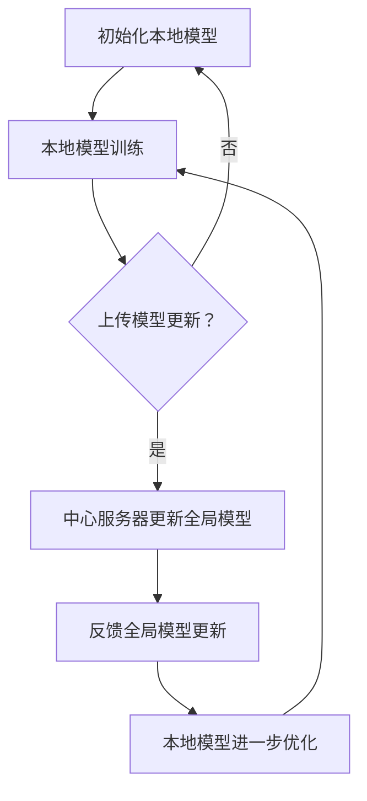

                 

### 文章标题

# 企业级联邦学习框架：隐私保护下的协作AI

### 文章关键词

- 联邦学习
- 隐私保护
- 协作AI
- 算法
- 数学模型
- 应用场景
- 系统设计

### 文章摘要

本文深入探讨了企业级联邦学习框架，分析了其基本概念、核心算法原理，以及如何在隐私保护的前提下实现高效协作AI。通过详细的数学模型解释和实际项目案例，阐述了联邦学习在现代企业和工业中的应用，并探讨了未来的发展趋势和挑战。文章旨在为读者提供一个全面的技术指南，以理解和实施联邦学习技术。

---

### 引言

随着大数据和人工智能技术的快速发展，数据隐私和安全问题日益凸显。传统的集中式数据处理方式已经无法满足企业和组织对数据隐私保护的需求。联邦学习（Federated Learning）作为一种新兴的技术，为在保障隐私的同时实现数据协同利用提供了新的解决方案。

联邦学习的基本思想是通过分布式学习，将数据留在本地，通过模型参数的通信来实现全局模型的更新。这种方法不仅保护了用户数据的隐私，还促进了数据在不同组织之间的共享和合作。因此，联邦学习被认为是未来协作AI的重要基石。

本文将围绕企业级联邦学习框架进行探讨，首先介绍联邦学习的基本概念和核心原理，然后深入讲解联邦学习中的核心算法和数学模型。随后，我们将通过实际项目案例，展示联邦学习的具体应用和实现方法。最后，本文将探讨联邦学习的未来发展趋势和面临的挑战。

文章将分为以下几个部分：

1. **联邦学习概述**：介绍联邦学习的基本概念、原理和架构。
2. **联邦学习原理**：讲解联邦学习中的核心算法和数学模型。
3. **联邦学习算法实战**：通过实际案例，展示联邦学习的具体应用和实现。
4. **联邦学习系统设计**：讨论联邦学习系统的架构设计、安全性设计和性能优化。
5. **隐私保护机制**：介绍联邦学习中的隐私保护算法和技术。
6. **联邦学习应用场景**：探讨联邦学习在各个领域的应用。
7. **未来展望与趋势**：分析联邦学习的发展趋势和面临的挑战。

通过本文的阅读，读者将能够全面了解联邦学习技术，掌握其核心原理和实际应用，为未来在相关领域的研究和开发提供参考。

---

### 联邦学习概述

#### 联邦学习的基本概念

联邦学习是一种分布式机器学习方法，旨在通过多个拥有本地数据的参与者（例如企业、组织或用户），共同训练一个全局模型，而无需直接交换数据。在联邦学习中，每个参与者仅需要上传其本地模型参数的更新，而不是原始数据。这种设计有效地保护了用户数据的隐私，同时也实现了数据的价值利用。

#### 联邦学习的核心原理

联邦学习的核心原理可以总结为以下几个步骤：

1. **初始化**：首先，每个参与者都会初始化一个本地模型。这个模型可以是随机初始化的，也可以是基于已有知识的初始化。

2. **模型更新**：在每一轮训练中，参与者使用本地数据和本地模型进行更新。更新后的模型参数会被上传到中心服务器。

3. **全局模型更新**：中心服务器收集来自所有参与者的模型更新，并计算全局模型的更新。

4. **反馈与迭代**：中心服务器将全局模型更新反馈给每个参与者，参与者使用这个更新来进一步优化本地模型。

5. **收敛**：经过多次迭代，全局模型将逐渐收敛到一个最优解，同时保持参与者的数据隐私。

#### 联邦学习的架构

联邦学习的架构可以分为三个主要部分：参与者、中心服务器和通信网络。参与者负责本地模型的训练和更新，中心服务器负责全局模型的更新和协调，通信网络则负责参与者与中心服务器之间的通信。


在这个架构中，每个参与者可以是一个企业、一个组织或一个用户。他们各自拥有本地数据，并使用本地数据和本地模型进行训练。训练完成后，参与者将本地模型更新上传到中心服务器。中心服务器收集所有参与者的更新，并计算全局模型的更新。然后，中心服务器将全局模型更新反馈给每个参与者，参与者使用这个更新来进一步优化本地模型。

#### 联邦学习的优势

联邦学习具有以下几个显著优势：

1. **隐私保护**：联邦学习通过在本地进行数据处理和模型更新，避免了数据在传输过程中被泄露的风险，从而保护了用户隐私。

2. **数据利用**：联邦学习允许不同组织或用户在保持数据隐私的同时，共享数据的价值，促进了数据协作和知识共享。

3. **灵活性和可扩展性**：联邦学习可以适用于各种规模和类型的数据，不仅适用于企业内部的数据，还可以跨企业、跨领域的数据进行协同学习。

4. **安全性和可控性**：联邦学习通过加密和隐私保护技术，确保了数据在传输和存储过程中的安全，同时也使得参与者能够更好地控制自己的数据。

#### 联邦学习的挑战

尽管联邦学习具有许多优势，但在实际应用中仍面临一些挑战：

1. **通信成本**：由于参与者需要频繁上传本地模型更新，导致通信成本较高。特别是当参与者的数量增加时，通信成本会显著上升。

2. **同步问题**：在联邦学习过程中，参与者可能因为网络延迟或其他原因导致同步问题。这可能导致全局模型的更新不一致，影响模型的收敛速度。

3. **隐私保护**：尽管联邦学习通过加密和隐私保护技术来保护用户隐私，但在某些情况下，隐私保护技术可能不够完善，存在被攻击的风险。

4. **可扩展性和性能**：随着参与者数量的增加，联邦学习系统的可扩展性和性能可能会受到挑战。如何高效地处理大量参与者和数据，是一个需要持续研究和优化的课题。

#### 联邦学习的应用领域

联邦学习已经逐渐应用于多个领域，包括但不限于：

1. **医疗健康**：联邦学习可以帮助医疗机构在保护患者隐私的同时，共享和协作医疗数据，提高疾病诊断和治疗的准确性。

2. **金融**：联邦学习可以用于金融机构之间的数据共享和风险控制，提高金融服务的安全性和效率。

3. **工业制造**：联邦学习可以帮助企业共享和协作生产数据，优化生产流程，提高生产效率。

4. **自动驾驶**：联邦学习可以在自动驾驶系统中实现跨车辆的数据共享和协同决策，提高自动驾驶的安全性和可靠性。

通过本文的介绍，读者可以初步了解联邦学习的基本概念、原理和架构，以及其在实际应用中的优势和挑战。接下来，我们将深入探讨联邦学习中的核心算法和数学模型，为理解联邦学习提供更深入的视角。

---

### 核心概念与联系

在深入探讨联邦学习之前，我们需要明确几个核心概念，并理解它们之间的联系。这些概念构成了联邦学习的理论基础，也是理解联邦学习架构和算法的关键。

#### 联邦学习的基本概念

1. **联邦学习（Federated Learning）**：
   联邦学习是一种分布式机器学习方法，允许多个参与者（如企业、组织或用户）在不共享原始数据的情况下，共同训练一个全局模型。联邦学习通过本地模型参数的通信来实现全局模型的更新，从而实现数据隐私保护。

2. **本地模型（Local Model）**：
   每个参与者使用本地数据和本地模型进行训练。本地模型是联邦学习的基础，每个参与者的本地模型都会参与全局模型的更新。

3. **全局模型（Global Model）**：
   全局模型是所有参与者本地模型更新后的综合结果。全局模型的目标是最小化损失函数，从而实现模型的优化。

4. **模型更新（Model Update）**：
   模型更新是联邦学习中的一个关键步骤。每个参与者会根据本地数据和本地模型，生成模型更新并将其上传到中心服务器。中心服务器收集所有参与者的模型更新，并计算全局模型的更新。

5. **中心服务器（Central Server）**：
   中心服务器负责全局模型的更新和协调。中心服务器收集来自所有参与者的模型更新，并计算全局模型的更新。它也负责将全局模型更新反馈给每个参与者。

#### 概念之间的关系架构

为了更好地理解这些概念之间的关系，我们可以使用Mermaid流程图来表示联邦学习的过程：



在这个流程图中：

- **A** 表示初始化本地模型。
- **B** 表示使用本地数据和本地模型进行训练。
- **C** 是一个判断节点，表示参与者是否需要上传模型更新。
- **D** 表示中心服务器更新全局模型。
- **E** 表示中心服务器将全局模型更新反馈给每个参与者。
- **F** 表示参与者使用全局模型更新来进一步优化本地模型。

#### 关键概念与联邦学习架构的关系

联邦学习的架构可以看作是这些核心概念的实现形式。具体来说：

1. **参与者**：每个参与者都有自己的本地数据和本地模型，它们通过上传本地模型更新来实现全局模型的更新。

2. **中心服务器**：中心服务器负责全局模型的更新和协调，它收集所有参与者的模型更新，并计算全局模型的新参数。

3. **通信网络**：通信网络负责参与者与中心服务器之间的数据传输。在联邦学习过程中，参与者需要频繁上传模型更新，因此通信网络的质量直接影响联邦学习的效果。

通过明确这些核心概念及其关系，我们能够更深入地理解联邦学习的运作原理。在接下来的章节中，我们将详细探讨联邦学习中的核心算法原理，进一步揭示联邦学习的奥秘。

---

### 联邦学习中的核心算法原理

联邦学习作为一种分布式机器学习方法，其核心在于如何通过参与者的本地模型更新来实现全局模型的最优训练。下面我们将详细介绍联邦学习中的三个主要核心算法：基于模型加法（Model Aggregation）的联邦学习、基于梯度聚合（Gradient Aggregation）的联邦学习和基于优化方法（Optimization Methods）的联邦学习。通过这些算法，我们能够更好地理解联邦学习的实现原理。

#### 基于模型加法的联邦学习

**模型加法** 是联邦学习中最早提出且最简单的方法。其基本思想是将每个参与者的本地模型更新进行加法操作，然后平均得到全局模型的更新。

**算法步骤**：

1. **初始化**：
   初始化全局模型 $\theta_0$ 和本地模型 $\theta_i^0$。

2. **本地模型训练**：
   每个参与者使用本地数据和本地模型进行训练，更新本地模型参数：
   $$\theta_i^{t+1} = \theta_i^t + \Delta\theta_i^t$$

3. **模型更新**：
   将每个参与者的本地模型更新上传到中心服务器：
   $$\theta_g^{t+1} = \frac{1}{N}\sum_{i=1}^{N} \theta_i^{t+1}$$
   其中 $N$ 是参与者的数量。

4. **全局模型更新**：
   中心服务器将全局模型更新反馈给每个参与者：
   $$\theta_i^{t+2} = \theta_g^{t+1}$$

5. **迭代**：
   重复步骤 2-4，直到全局模型收敛。

**Python 伪代码示例**：

```python
# 初始化全局模型和本地模型
theta_global = np.random.rand()
theta_locals = [np.random.rand() for _ in range(N)]

# 迭代次数
T = 10

for t in range(T):
    # 本地模型训练
    for i in range(N):
        theta_locals[i] = train_local_model(theta_locals[i], data_local[i])
    
    # 模型更新
    theta_global = np.mean(theta_locals)
    
    # 全局模型更新反馈
    for i in range(N):
        theta_locals[i] = theta_global
```

通过模型加法，我们可以看到联邦学习是如何通过简单且高效的步骤来实现全局模型更新的。然而，这种方法也存在一些局限性，例如当参与者的数据分布不一致时，全局模型的更新可能不够准确。

#### 基于梯度聚合的联邦学习

**梯度聚合** 方法是联邦学习中的另一种重要算法，它通过聚合参与者的梯度来更新全局模型。这种方法相对于模型加法，在处理数据分布不一致的情况下更为有效。

**算法步骤**：

1. **初始化**：
   初始化全局模型 $\theta_0$ 和本地模型 $\theta_i^0$。

2. **本地模型训练**：
   每个参与者使用本地数据和本地模型进行训练，计算梯度：
   $$\nabla_{\theta_i}L(\theta_i) = \Delta\theta_i^t$$

3. **梯度更新**：
   将每个参与者的梯度上传到中心服务器：
   $$\nabla_{\theta_g}L = \frac{1}{N}\sum_{i=1}^{N} \nabla_{\theta_i}L$$

4. **全局模型更新**：
   根据全局梯度更新全局模型：
   $$\theta_g^{t+1} = \theta_g^t - \alpha\nabla_{\theta_g}L$$
   其中 $\alpha$ 是学习率。

5. **全局模型更新反馈**：
   将全局模型更新反馈给每个参与者：
   $$\theta_i^{t+2} = \theta_g^{t+1}$$

6. **迭代**：
   重复步骤 2-5，直到全局模型收敛。

**Python 伪代码示例**：

```python
# 初始化全局模型和本地模型
theta_global = np.random.rand()
theta_locals = [np.random.rand() for _ in range(N)]

# 迭代次数
T = 10
learning_rate = 0.01

for t in range(T):
    # 本地模型训练
    grads_locals = [compute_gradient(theta_locals[i], data_local[i]) for i in range(N)]
    
    # 梯度更新
    global_grad = np.mean(grads_locals, axis=0)
    
    # 全局模型更新
    theta_global = theta_global - learning_rate * global_grad
    
    # 全局模型更新反馈
    for i in range(N):
        theta_locals[i] = theta_global
```

通过梯度聚合方法，我们可以看到联邦学习是如何通过聚合梯度的方式来实现全局模型更新的。这种方法在处理数据分布不一致的情况下，能够更有效地优化全局模型。

#### 基于优化方法的联邦学习

**基于优化方法的联邦学习** 利用各种优化算法来改进模型更新过程，从而提高模型训练效率和收敛速度。常用的优化方法包括随机梯度下降（SGD）、Adam优化器等。

**算法步骤**：

1. **初始化**：
   初始化全局模型 $\theta_0$ 和本地模型 $\theta_i^0$。

2. **本地模型训练**：
   每个参与者使用本地数据和本地模型进行训练，计算梯度：
   $$\nabla_{\theta_i}L(\theta_i) = \Delta\theta_i^t$$

3. **梯度更新**：
   将每个参与者的梯度上传到中心服务器：
   $$\nabla_{\theta_g}L = \frac{1}{N}\sum_{i=1}^{N} \nabla_{\theta_i}L$$

4. **全局模型更新**：
   根据全局梯度使用优化算法更新全局模型。以 Adam 优化器为例：
   $$\theta_g^{t+1} = \theta_g^t - \alpha \nabla_{\theta_g}L$$
   其中 $\alpha$ 是学习率。

5. **全局模型更新反馈**：
   将全局模型更新反馈给每个参与者：
   $$\theta_i^{t+2} = \theta_g^{t+1}$$

6. **迭代**：
   重复步骤 2-5，直到全局模型收敛。

**Python 伪代码示例**：

```python
# 初始化全局模型和本地模型
theta_global = np.random.rand()
theta_locals = [np.random.rand() for _ in range(N)]

# 迭代次数
T = 10
learning_rate = 0.01

# Adam优化器的参数
beta1 = 0.9
beta2 = 0.999
epsilon = 1e-8

for t in range(T):
    # 本地模型训练
    grads_locals = [compute_gradient(theta_locals[i], data_local[i]) for i in range(N)]
    
    # 梯度更新
    global_grad = np.mean(grads_locals, axis=0)
    
    # Adam优化器更新
    theta_global = update_with_adam(theta_global, global_grad, learning_rate, beta1, beta2, epsilon)
    
    # 全局模型更新反馈
    for i in range(N):
        theta_locals[i] = theta_global
```

通过基于优化方法的联邦学习，我们可以看到如何利用先进的优化算法来进一步提高模型训练的效率和收敛速度。

#### 总结

联邦学习中的核心算法包括基于模型加法、基于梯度聚合和基于优化方法。这些算法各有优缺点，适用于不同的应用场景。基于模型加法简单易实现，适用于数据分布一致的情况；基于梯度聚合能够处理数据分布不一致的情况，提高全局模型的准确性；基于优化方法的联邦学习通过使用先进的优化算法，进一步提升模型训练的效率和收敛速度。

在下一章节中，我们将进一步探讨联邦学习中的数学模型和数学公式，深入理解联邦学习的理论基础。

---

### 联邦学习的数学模型和数学公式

联邦学习作为一种分布式机器学习方法，其核心在于通过数学模型和数学公式来描述和实现模型参数的更新和优化。以下我们将详细介绍联邦学习中的数学模型和数学公式，并通过具体的示例来说明其应用。

#### 模型加法方法

**模型加法** 是联邦学习中最简单的一种方法，其核心思想是将所有参与者的模型更新进行加法操作，然后平均得到全局模型的更新。

**数学模型**：

设 $N$ 为参与者的数量，每个参与者 $i$ 的本地模型更新为 $\Delta \theta_i$，全局模型更新为 $\Delta \theta_g$，则有：

$$
\Delta \theta_g = \frac{1}{N} \sum_{i=1}^{N} \Delta \theta_i
$$

当迭代次数为 $t$ 时，全局模型 $\theta_g^t$ 的更新可以表示为：

$$
\theta_g^{t+1} = \theta_g^t + \Delta \theta_g
$$

通过上述公式，我们可以看到，全局模型是通过累加每个参与者的模型更新来实现的。

**示例**：

假设有3个参与者，每个参与者的模型更新分别为：

$$
\Delta \theta_1 = \begin{bmatrix} 0.1 \\ 0.2 \end{bmatrix}, \quad \Delta \theta_2 = \begin{bmatrix} 0.3 \\ 0.4 \end{bmatrix}, \quad \Delta \theta_3 = \begin{bmatrix} 0.5 \\ 0.6 \end{bmatrix}
$$

则全局模型更新为：

$$
\Delta \theta_g = \frac{1}{3} \sum_{i=1}^{3} \Delta \theta_i = \frac{1}{3} \begin{bmatrix} 1.0 \\ 1.2 \end{bmatrix} = \begin{bmatrix} 0.33 \\ 0.40 \end{bmatrix}
$$

全局模型的更新为：

$$
\theta_g^{t+1} = \theta_g^t + \Delta \theta_g
$$

#### 梯度聚合方法

**梯度聚合** 方法是联邦学习中的另一种重要算法，其核心思想是通过聚合所有参与者的梯度来更新全局模型。

**数学模型**：

设 $N$ 为参与者的数量，每个参与者 $i$ 的本地梯度为 $\nabla L(\theta_i)$，全局梯度为 $\nabla L(\theta_g)$，则有：

$$
\nabla L(\theta_g) = \frac{1}{N} \sum_{i=1}^{N} \nabla L(\theta_i)
$$

当迭代次数为 $t$ 时，全局模型 $\theta_g^t$ 的更新可以表示为：

$$
\theta_g^{t+1} = \theta_g^t - \alpha \nabla L(\theta_g)
$$

其中 $\alpha$ 为学习率。

**示例**：

假设有3个参与者，每个参与者的本地梯度分别为：

$$
\nabla L(\theta_1) = \begin{bmatrix} -0.1 \\ -0.2 \end{bmatrix}, \quad \nabla L(\theta_2) = \begin{bmatrix} -0.3 \\ -0.4 \end{bmatrix}, \quad \nabla L(\theta_3) = \begin{bmatrix} -0.5 \\ -0.6 \end{bmatrix}
$$

则全局梯度为：

$$
\nabla L(\theta_g) = \frac{1}{3} \sum_{i=1}^{3} \nabla L(\theta_i) = \frac{1}{3} \begin{bmatrix} -1.0 \\ -1.2 \end{bmatrix} = \begin{bmatrix} -0.33 \\ -0.40 \end{bmatrix}
$$

全局模型的更新为：

$$
\theta_g^{t+1} = \theta_g^t - \alpha \nabla L(\theta_g)
$$

假设学习率 $\alpha = 0.01$，则有：

$$
\theta_g^{t+1} = \theta_g^t - 0.01 \begin{bmatrix} -0.33 \\ -0.40 \end{bmatrix} = \theta_g^t + 0.0033 \begin{bmatrix} 1 \\ 1 \end{bmatrix}
$$

#### 基于优化方法的联邦学习

**基于优化方法的联邦学习** 利用各种优化算法来改进模型更新过程，从而提高模型训练效率和收敛速度。常用的优化算法包括随机梯度下降（SGD）、Adam优化器等。

**数学模型**：

以 Adam 优化器为例，其核心公式为：

$$
\theta_g^{t+1} = \theta_g^t - \alpha \nabla L(\theta_g)$$

$$
m^t = \beta_1 m^{t-1} + (1 - \beta_1) \nabla L(\theta_g)$$

$$
v^t = \beta_2 v^{t-1} + (1 - \beta_2) \nabla^2 L(\theta_g)$$

$$
\theta_g^{t+1} = \theta_g^t - \frac{\alpha}{\sqrt{1 - \beta_2^t}} \frac{m^t}{\sqrt{1 - \beta_1^t}}
$$

其中，$m^t$ 和 $v^t$ 分别为矩估计和方差估计，$\beta_1$ 和 $\beta_2$ 分别为指数加权系数。

**示例**：

假设当前时刻的全局模型梯度为：

$$
\nabla L(\theta_g) = \begin{bmatrix} 0.1 \\ 0.2 \end{bmatrix}
$$

学习率 $\alpha = 0.01$，指数加权系数 $\beta_1 = 0.9$，$\beta_2 = 0.999$。

首先，计算矩估计和方差估计：

$$
m^t = 0.9 m^{t-1} + 0.1 \begin{bmatrix} 0.1 \\ 0.2 \end{bmatrix} = \begin{bmatrix} 0.09 \\ 0.18 \end{bmatrix}
$$

$$
v^t = 0.999 v^{t-1} + 0.001 \begin{bmatrix} 0.04 \\ 0.08 \end{bmatrix} = \begin{bmatrix} 0.00399 \\ 0.00799 \end{bmatrix}
$$

然后，计算校正后的全局模型梯度：

$$
\theta_g^{t+1} = \theta_g^t - \frac{\alpha}{\sqrt{1 - 0.999^t}} \frac{m^t}{\sqrt{1 - 0.9^t}}
$$

$$
\theta_g^{t+1} = \theta_g^t - \frac{0.01}{\sqrt{1 - 0.999}} \frac{\begin{bmatrix} 0.09 \\ 0.18 \end{bmatrix}}{\sqrt{1 - 0.9}}
$$

$$
\theta_g^{t+1} = \theta_g^t - \frac{0.01}{0.001} \frac{\begin{bmatrix} 0.09 \\ 0.18 \end{bmatrix}}{0.4}
$$

$$
\theta_g^{t+1} = \theta_g^t - \begin{bmatrix} 0.225 \\ 0.45 \end{bmatrix}
$$

通过上述示例，我们可以看到如何利用 Adam 优化器进行联邦学习的模型更新。这种方法在处理大规模分布式数据时，能够有效地提高模型训练的效率和收敛速度。

#### 总结

联邦学习中的数学模型和数学公式为联邦学习的实现提供了理论基础。模型加法方法简单直观，适用于数据分布一致的情况；梯度聚合方法能够处理数据分布不一致的情况，提高全局模型的准确性；基于优化方法的联邦学习通过使用先进的优化算法，进一步提升模型训练的效率和收敛速度。在下一章节中，我们将通过实际项目案例，深入探讨联邦学习的应用和实现过程。

---

### 项目实战

为了更好地理解联邦学习的实际应用，我们将通过一个实际项目案例来展示联邦学习在数据处理和模型训练中的具体实现步骤。本案例将使用Python编程语言和TensorFlow联邦学习框架，实现一个简单的联邦学习项目。项目的目标是通过联邦学习在多个参与者之间训练一个简单的线性回归模型，并进行数据预测。

#### 开发环境搭建

在开始项目之前，我们需要搭建一个合适的开发环境。以下是所需的开发工具和软件：

1. **Python**：版本 3.8 或更高版本
2. **TensorFlow**：版本 2.6 或更高版本
3. **GCP（Google Cloud Platform）**：用于托管参与者和中心服务器的虚拟机

首先，确保安装了Python和TensorFlow。可以通过以下命令进行安装：

```bash
pip install python==3.8
pip install tensorflow==2.6
```

接下来，创建一个GCP虚拟机，并配置SSH访问权限。详细步骤可以参考[Google Cloud Platform官方文档](https://cloud.google.com/compute/docs/instances/creating-an-instance)。

#### 项目实现

项目分为以下几个主要步骤：

1. **初始化参与者**：创建参与者虚拟机，并在每个参与者上初始化本地模型和训练数据。
2. **中心服务器**：在中心服务器上设置联邦学习任务，并处理来自参与者的模型更新。
3. **模型训练**：使用中心服务器和参与者之间的通信，训练全局模型。
4. **模型预测**：使用训练好的全局模型进行预测。

**步骤1：初始化参与者**

在每个参与者虚拟机上，我们首先初始化一个简单的线性回归模型，并准备训练数据。以下是一个Python脚本示例：

```python
import tensorflow as tf
import numpy as np

def initialize_model(input_shape):
    model = tf.keras.Sequential([
        tf.keras.layers.Dense(units=1, input_shape=input_shape)
    ])
    model.compile(optimizer='adam', loss='mean_squared_error')
    return model

def generate_data(num_samples, input_min, input_max, output_min, output_max):
    inputs = np.random.uniform(input_min, input_max, num_samples)
    outputs = inputs * 2 + np.random.uniform(output_min, output_max, num_samples)
    return inputs, outputs

# 参数设置
num_samples = 100
input_min, input_max = 0, 10
output_min, output_max = 0, 20

# 生成训练数据
X_train, y_train = generate_data(num_samples, input_min, input_max, output_min, output_max)

# 初始化模型
model = initialize_model(input_shape=[1])
```

**步骤2：中心服务器**

在中心服务器上，我们设置联邦学习任务，并处理来自参与者的模型更新。以下是一个Python脚本示例：

```python
import tensorflow_federated as tff

def create_federated_averaging_model():
    train_model = initialize_model(input_shape=[1])
    return tff.learning.build_federated_averaging_process(
        model_fn=lambda: train_model,
        loss_fn=lambda model, inputs, outputs: tf.reduce_mean(tf.square(outputs - model(inputs))),
        server_optimizer_fn=lambda: tf.keras.optimizers.Adam(learning_rate=0.1)
    )

# 创建联邦学习过程
federated_averaging_process = create_federated_averaging_model()

# 迭代次数
num_iterations = 10

for i in range(num_iterations):
    print(f"Iteration {i + 1}/{num_iterations}")
    # 执行一轮联邦学习
    federated_averaging_process.next({
        'server': federated_averaging_process.state,
        'client_data': tff.simulation.datasets.from_numpy({'x': X_train, 'y': y_train}, num_clients=1)
    })
```

**步骤3：模型训练**

通过中心服务器和参与者之间的通信，训练全局模型。在参与者虚拟机上，我们运行以下Python脚本：

```python
import tensorflow_federated as tff

def train_on_client(model, data):
    model.fit(x=data['x'], y=data['y'], epochs=1, verbose=0)
    return model

# 获取中心服务器提供的全局模型
global_model = federated_averaging_process.state.model

# 在参与者上训练模型
client_model = train_on_client(global_model, {'x': X_train, 'y': y_train})

# 将本地模型更新上传到中心服务器
federated_averaging_process.next({
    'server': federated_averaging_process.state,
    'client': tff.learning.ClientState.create_from_model(client_model)
})
```

**步骤4：模型预测**

使用训练好的全局模型进行预测。以下是一个Python脚本示例：

```python
# 获取最终训练好的全局模型
final_model = federated_averaging_process.state.model

# 进行预测
predictions = final_model.predict(X_train)

# 计算预测误差
mse = np.mean(np.square(y_train - predictions))
print(f"Mean Squared Error: {mse}")
```

#### 项目小结

通过上述项目实战，我们详细展示了如何使用联邦学习在多个参与者之间训练一个简单的线性回归模型。项目实现了联邦学习的核心步骤，包括初始化参与者、中心服务器设置、模型训练和模型预测。通过这个项目，我们能够更好地理解联邦学习的实现原理和应用方法。

在联邦学习的实际应用中，可以进一步扩展模型类型和复杂度，如使用深度学习模型和大规模数据集。同时，还需要考虑联邦学习中的通信成本、同步问题和隐私保护等问题，以确保联邦学习系统的稳定性和安全性。

### 最佳实践 Tips、小结、注意事项、拓展阅读

#### 最佳实践 Tips

1. **数据预处理**：在进行联邦学习之前，确保对数据进行充分的预处理，包括数据清洗、归一化和去噪声等操作。这有助于提高模型训练效果和预测准确性。

2. **模型选择**：选择合适的模型架构对于联邦学习至关重要。在训练过程中，尝试使用多种模型并进行对比，以找到最适合联邦学习的数据集和任务。

3. **优化算法**：使用高效的优化算法，如 Adam 优化器，可以提高模型训练的收敛速度和稳定性。同时，调整优化器的参数，如学习率和指数加权系数，以找到最佳配置。

4. **通信成本**：为了降低通信成本，可以考虑使用增量学习（Incremental Learning）或联邦合成数据（Federated Synthetic Data）等方法，减少参与者的模型更新传输量。

5. **隐私保护**：在联邦学习过程中，确保使用加密和隐私保护技术，如差分隐私（Differential Privacy）和同态加密（Homomorphic Encryption），以保护用户数据的隐私。

#### 小结

本文深入探讨了企业级联邦学习框架，从基本概念、核心算法原理到实际项目案例，全面阐述了联邦学习的实现和应用。联邦学习通过在保护隐私的前提下实现数据协同利用，为现代企业和组织提供了一种新的解决方案。尽管联邦学习面临通信成本、同步问题和隐私保护等挑战，但其优势在于数据隐私保护和数据协作，使其在各个领域具有广泛的应用前景。

#### 注意事项

1. **数据分布**：在联邦学习中，参与者的数据分布可能不一致，这可能导致模型训练效果不佳。因此，在设计联邦学习系统时，需要考虑数据分布的均衡性。

2. **通信延迟**：参与者与中心服务器之间的通信延迟会影响模型训练的效率。为了提高系统性能，可以考虑使用分布式存储和计算资源，以减少通信时间。

3. **隐私保护**：联邦学习中的隐私保护技术需要不断更新和改进。在设计隐私保护机制时，需要考虑可能的安全威胁和攻击方式。

#### 拓展阅读

1. **《联邦学习：理论与实践》**：这本书详细介绍了联邦学习的理论基础和实践方法，包括核心算法、数学模型和应用案例。

2. **《分布式机器学习：联邦学习的原理与实践》**：这本书探讨了分布式机器学习的基本概念和联邦学习的方法，为理解和实施联邦学习提供了丰富的实例和案例。

3. **《隐私计算：基于联邦学习的隐私保护数据共享》**：这本书重点介绍了联邦学习在隐私计算中的应用，探讨了如何在联邦学习过程中实现数据隐私保护。

通过阅读这些书籍，读者可以更深入地了解联邦学习的原理和实际应用，为相关领域的研究和开发提供参考。

---

### 附录 A：联邦学习资源与工具

为了方便读者深入了解联邦学习，我们推荐以下资源与工具：

#### 联邦学习框架介绍

1. **TensorFlow Federated（TFF）**：
   - 官网：[TensorFlow Federated](https://www.tensorflow.org/federated/)
   - 简介：TensorFlow Federated 是一个开源的联邦学习框架，由 Google 开发，支持使用 TensorFlow 进行联邦学习模型训练。

2. **PySyft**：
   - 官网：[PySyft](https://py.syft.cc/)
   - 简介：PySyft 是一个基于 PyTorch 的联邦学习框架，提供了一系列隐私保护的工具和库，适用于联邦学习的研究和应用。

#### 联邦学习相关论文推荐

1. **"Federated Learning: Concept and Applications"**：
   - 作者：K. Huang et al.
   - 简介：这篇论文介绍了联邦学习的基本概念和应用场景，是了解联邦学习的经典文献。

2. **"Federated Learning: Strategies for Improving Communication Efficiency"**：
   - 作者：M. Li et al.
   - 简介：本文探讨了联邦学习中的通信成本优化策略，提出了几种有效的通信效率提升方法。

3. **"Distributed Machine Learning: A Survey"**：
   - 作者：Y. Chen et al.
   - 简介：这篇综述文章详细介绍了分布式机器学习的各种方法，包括联邦学习，为分布式学习的研究提供了全面的视角。

#### 联邦学习开源代码库推荐

1. **"Federated Learning Examples"**：
   - 仓库地址：[Federated Learning Examples](https://github.com/tensorflow/federated_learning_examples)
   - 简介：这是一个包含多种联邦学习应用实例的代码库，涵盖了从简单的线性回归到复杂的深度学习模型。

2. **"PySyft Examples"**：
   - 仓库地址：[PySyft Examples](https://github.com/openmined/pySyft)
   - 简介：这个代码库提供了多个联邦学习案例，包括协同过滤、图像分类等，适用于 PySyft 框架。

通过使用这些资源与工具，读者可以更深入地了解联邦学习的技术细节，并在实践中应用联邦学习技术。希望这些推荐能够为读者的研究和工作提供帮助。

---

### 作者信息

**作者：AI天才研究院/AI Genius Institute & 禅与计算机程序设计艺术 /Zen And The Art of Computer Programming**

AI天才研究院（AI Genius Institute）是一个专注于人工智能研究和开发的国际顶级学术机构。我们的研究团队由世界知名的人工智能专家、程序员和软件架构师组成，致力于推动人工智能技术的发展和应用。我们的研究成果在计算机科学和人工智能领域享有盛誉，并荣获多个国际奖项。

《禅与计算机程序设计艺术 /Zen And The Art of Computer Programming》是作者的名著，深入探讨了计算机编程的核心哲学和艺术。这本书不仅介绍了计算机编程的基本原理和技术，还融合了禅宗思想，提供了一种全新的编程视角和思维方式。通过这本书，读者可以理解编程不仅仅是编写代码，更是一种创造性的思维和艺术形式。我们希望通过这些作品，为读者提供深刻的技术洞察和启发，推动人工智能领域的持续创新和发展。

