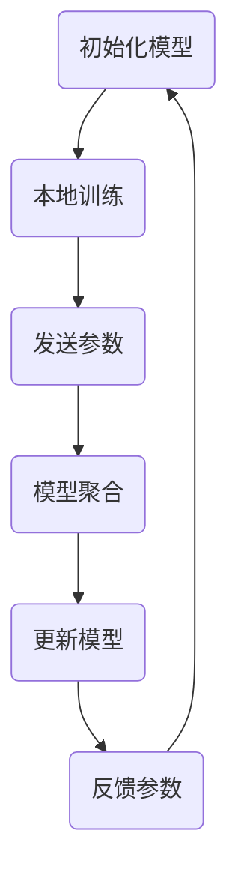

                 

# 企业级联邦学习：保护隐私的分布式AI训练

## 关键词

- 联邦学习
- 分布式AI
- 数据隐私
- AI训练
- 安全性
- 隐私保护

## 摘要

本文深入探讨了企业级联邦学习在保护隐私的分布式AI训练中的应用。联邦学习是一种新兴的机器学习技术，它允许多个拥有数据的客户端在不共享数据的情况下共同训练出一个全局模型。本文首先介绍了联邦学习的基础概念和原理，然后详细分析了联邦学习系统架构和核心算法，最后通过实际案例展示了联邦学习在不同领域的应用效果。本文旨在为读者提供对联邦学习的全面理解，并探讨其在保护隐私、提高数据安全性和促进分布式AI发展方面的巨大潜力。

## 目录

# 企业级联邦学习：保护隐私的分布式AI训练

## 第一部分：联邦学习基础

### 第1章：联邦学习的概念与原理

#### 1.1 联邦学习的定义与背景

#### 1.2 联邦学习的基本原理

#### 1.3 联邦学习与传统分布式学习的区别

#### 1.4 联邦学习在保护隐私方面的优势

### 第2章：联邦学习系统架构

#### 2.1 联邦学习系统的组成部分

#### 2.2 客户端的架构与功能

#### 2.3 服务器端的架构与功能

#### 2.4 数据传输与安全机制

## 第二部分：联邦学习算法与应用

### 第3章：联邦学习算法概述

#### 3.1 基于梯度下降的联邦学习算法

#### 3.2 基于模型的联邦学习算法

#### 3.3 基于优化的联邦学习算法

#### 3.4 基于学习的联邦学习算法

### 第4章：联邦学习在图像识别中的应用

#### 4.1 图像识别中的联邦学习挑战

#### 4.2 联邦学习在图像分类中的应用

#### 4.3 联邦学习在目标检测中的应用

#### 4.4 联邦学习在图像生成中的应用

### 第5章：联邦学习在自然语言处理中的应用

#### 5.1 自然语言处理中的联邦学习挑战

#### 5.2 联邦学习在情感分析中的应用

#### 5.3 联邦学习在文本分类中的应用

#### 5.4 联邦学习在机器翻译中的应用

### 第6章：联邦学习在推荐系统中的应用

#### 6.1 推荐系统中的联邦学习挑战

#### 6.2 联邦学习在协同过滤中的应用

#### 6.3 联邦学习在商品推荐中的应用

#### 6.4 联邦学习在广告推荐中的应用

### 第7章：联邦学习在医疗领域中的应用

#### 7.1 医疗领域中的联邦学习挑战

#### 7.2 联邦学习在疾病预测中的应用

#### 7.3 联邦学习在个性化医疗中的应用

#### 7.4 联邦学习在药物研发中的应用

## 第三部分：联邦学习的实现与优化

### 第8章：联邦学习框架与工具

#### 8.1 主流联邦学习框架介绍

#### 8.2 开源联邦学习框架使用指南

#### 8.3 自定义联邦学习框架开发

### 第9章：联邦学习的性能优化

#### 9.1 联邦学习中的通信优化

#### 9.2 联邦学习中的计算优化

#### 9.3 联邦学习中的数据优化

#### 9.4 联邦学习中的模型优化

### 第10章：联邦学习的安全性保障

#### 10.1 联邦学习中的隐私保护技术

#### 10.2 联邦学习中的安全威胁分析

#### 10.3 联邦学习中的加密算法应用

#### 10.4 联邦学习中的安全协议设计

### 第11章：联邦学习的未来发展趋势

#### 11.1 联邦学习的挑战与机遇

#### 11.2 联邦学习在云计算与边缘计算中的应用

#### 11.3 联邦学习与其他技术的融合

#### 11.4 联邦学习的未来发展前景

## 作者信息

- 作者：AI天才研究院/AI Genius Institute & 禅与计算机程序设计艺术 /Zen And The Art of Computer Programming

### 企业级联邦学习：保护隐私的分布式AI训练

### 背景介绍

在数字化时代，数据已经成为企业最宝贵的资产之一。然而，随着数据量的爆炸性增长，如何有效利用数据、保护数据隐私和安全，成为企业和研究机构面临的重大挑战。传统集中式机器学习模型在数据收集、存储和处理过程中存在诸多安全隐患，如数据泄露、数据滥用等。为了应对这些挑战，分布式机器学习技术应运而生。其中，联邦学习（Federated Learning）作为一种新兴的分布式机器学习技术，引起了广泛关注。

联邦学习的基本思想是，通过协同多个数据拥有者，在不共享数据的情况下共同训练出一个全局模型。这样，不仅保护了各方的数据隐私，还可以实现数据的价值共享和联合建模。在企业级应用中，联邦学习具有显著的潜在优势：

1. **隐私保护**：联邦学习在保护数据隐私方面具有天然的优势。通过模型聚合而非数据共享，可以有效防止数据泄露和滥用。
2. **数据安全**：联邦学习将数据留在本地，减少了数据传输过程中被攻击的风险。
3. **协同建模**：联邦学习允许多个数据拥有者共同参与模型训练，提高了模型的泛化能力和准确性。
4. **高效性**：联邦学习通过分布式计算，可以显著提高模型训练的速度。

本文将围绕企业级联邦学习进行深入探讨，从基础概念、系统架构、算法原理到实际应用，全面解析联邦学习的魅力和潜力。

### 核心概念与联系

在深入探讨企业级联邦学习之前，我们首先需要理解几个核心概念及其相互关系。

#### 1.1 联邦学习

联邦学习（Federated Learning）是一种分布式机器学习方法，其核心思想是多个数据拥有者（例如不同的企业或组织）在不共享数据的情况下，通过共同训练一个全局模型来实现协同学习和知识共享。具体而言，联邦学习过程中，每个数据拥有者（也称为“客户端”）在自己的本地数据上训练本地模型，并通过参数更新与模型聚合服务器（也称为“服务器”）进行通信，最终实现全局模型的优化。

#### 1.2 客户端

客户端是联邦学习系统中的基本单元，每个客户端都拥有自己的数据集和本地模型。客户端的主要任务是：

1. **本地训练**：使用本地数据训练模型，优化本地损失函数。
2. **参数更新**：将本地模型的参数发送到服务器，以便进行全局模型更新。

#### 1.3 服务器

服务器在联邦学习系统中起着核心作用，其主要任务是：

1. **模型聚合**：接收来自各个客户端的模型参数，通过聚合算法生成全局模型。
2. **参数更新**：将全局模型参数反馈给各个客户端，指导本地模型的下一次更新。

#### 1.4 模型聚合

模型聚合是联邦学习的关键步骤，其主要目标是减少不同客户端模型之间的差异，生成一个全局模型。常见的模型聚合算法包括平均值聚合、加权平均聚合和基于梯度的聚合等。

#### 1.5 数据隐私

数据隐私是联邦学习的核心关注点之一。在联邦学习过程中，数据从未离开客户端，从而避免了传统集中式学习中的数据泄露风险。联邦学习通过加密通信和差分隐私等技术，进一步保障了数据的安全性和隐私性。

### Mermaid 流程图

为了更直观地展示联邦学习的工作流程，我们可以使用Mermaid流程图进行描述。以下是一个简化的联邦学习流程图：



在该流程图中，客户端（A）首先初始化一个全局模型，然后使用本地数据进行本地训练（B）。训练完成后，客户端将更新后的参数发送到服务器（C）。服务器接收来自所有客户端的参数后，通过模型聚合算法生成全局模型（D）。随后，服务器将全局模型参数反馈给客户端（E），客户端根据全局模型参数更新本地模型（F），然后再次进入本地训练过程。

通过该流程图，我们可以清晰地看到联邦学习系统中的各个组件及其交互关系。接下来，我们将进一步探讨联邦学习系统的架构和核心算法。

### 第1章：联邦学习的概念与原理

#### 1.1 联邦学习的定义与背景

联邦学习（Federated Learning）是一种分布式机器学习方法，其核心思想是多个数据拥有者（例如不同的企业或组织）在不共享数据的情况下，通过共同训练一个全局模型来实现协同学习和知识共享。与传统集中式学习模型相比，联邦学习具有显著的优势，特别是在数据隐私保护和数据安全方面。

联邦学习的基本概念可以概括为以下几个方面：

1. **分布式训练**：联邦学习通过分布式计算方式，将模型训练任务分散到多个数据拥有者（客户端）的本地设备上。每个客户端都使用自己的数据集训练本地模型，并通过参数更新与模型聚合服务器（服务器）进行通信，最终实现全局模型的优化。

2. **模型聚合**：在联邦学习过程中，服务器负责接收来自各个客户端的模型参数，通过聚合算法生成全局模型。常见的聚合算法包括平均值聚合、加权平均聚合和基于梯度的聚合等。

3. **隐私保护**：联邦学习通过加密通信和差分隐私等技术，保障了数据的安全性和隐私性。在联邦学习过程中，数据从未离开客户端，从而避免了传统集中式学习中的数据泄露风险。

联邦学习的发展背景可以追溯到分布式计算和隐私保护技术的不断进步。随着互联网和大数据技术的普及，数据隐私和安全问题日益突出。传统集中式学习模型在数据收集、存储和处理过程中存在诸多安全隐患，如数据泄露、数据滥用等。为了应对这些挑战，分布式机器学习技术应运而生。联邦学习作为分布式机器学习的一个重要分支，逐渐引起了学术界和工业界的广泛关注。

#### 1.2 联邦学习的基本原理

联邦学习的基本原理可以概括为以下几个步骤：

1. **初始化全局模型**：联邦学习开始时，服务器首先初始化一个全局模型。该全局模型将被分发到各个客户端，作为每个客户端本地训练的起点。

2. **本地训练**：每个客户端接收到全局模型后，使用本地数据集进行本地训练。本地训练过程中，客户端通过优化本地损失函数，不断更新本地模型参数。

3. **参数更新**：在本地训练完成后，客户端将更新后的模型参数发送到服务器。这些参数反映了客户端本地模型在训练过程中的优化情况。

4. **模型聚合**：服务器接收到来自所有客户端的模型参数后，通过聚合算法生成全局模型。聚合算法的目标是减少不同客户端模型之间的差异，提高全局模型的泛化能力和准确性。

5. **参数反馈**：服务器将全局模型参数反馈给各个客户端。客户端根据全局模型参数更新本地模型，然后再次进入本地训练过程。

6. **迭代训练**：上述过程不断重复，直到全局模型达到预定的性能目标或者达到最大迭代次数。

通过上述步骤，联邦学习实现了多个数据拥有者在不共享数据的情况下共同训练一个全局模型。该过程不仅保护了各方的数据隐私，还可以实现数据的价值共享和协同建模。

#### 1.3 联邦学习与传统分布式学习的区别

联邦学习与传统分布式学习（如MapReduce、Spark等）在原理和应用场景上有显著的差异。以下是联邦学习与传统分布式学习的主要区别：

1. **数据共享方式**：

   - **联邦学习**：在联邦学习过程中，各数据拥有者（客户端）不共享原始数据，而是通过共享模型参数的方式实现协同训练。这种模式保护了数据隐私，避免了数据泄露风险。
   
   - **传统分布式学习**：传统分布式学习通常将数据划分到不同的计算节点上，各节点独立训练本地模型，然后通过数据同步和模型聚合实现全局模型的优化。这种模式在数据共享过程中存在数据泄露风险。

2. **计算方式**：

   - **联邦学习**：联邦学习通过分布式计算，将模型训练任务分散到多个客户端的本地设备上。客户端本地训练完成后，通过参数更新与服务器进行通信，实现全局模型的优化。这种模式提高了计算效率和资源利用率。
   
   - **传统分布式学习**：传统分布式学习通常将数据划分到不同的计算节点上，各节点独立处理本地数据，并通过数据同步和模型聚合实现全局模型的优化。这种模式在数据同步过程中存在一定的延迟和通信开销。

3. **应用场景**：

   - **联邦学习**：联邦学习适用于数据隐私要求较高、数据分散且不愿意共享的场景。例如，企业内部不同部门的数据、跨组织的合作项目等。
   
   - **传统分布式学习**：传统分布式学习适用于数据集中、需要高效处理大规模数据的场景。例如，搜索引擎、社交网络分析等。

#### 1.4 联邦学习在保护隐私方面的优势

联邦学习在保护数据隐私方面具有显著的优势，主要体现在以下几个方面：

1. **数据不动性**：在联邦学习过程中，数据从未离开客户端，只在本地设备上进行处理和训练。这种模式避免了数据在传输和存储过程中被窃取、篡改的风险。

2. **加密通信**：联邦学习通过加密通信技术，保障了数据在传输过程中的安全性。客户端将加密的模型参数发送到服务器，服务器在解密后进行模型聚合。这种模式有效防止了数据在传输过程中被窃取。

3. **差分隐私**：联邦学习采用差分隐私技术，对客户端的模型参数进行扰动，确保单个客户端对全局模型的贡献不可见。这种模式提高了数据隐私保护的程度。

4. **隐私预算**：联邦学习允许客户端根据隐私预算进行模型训练。在训练过程中，客户端可以调整隐私预算，平衡模型性能和数据隐私保护之间的关系。

通过上述优势，联邦学习为企业和研究机构提供了一个安全、高效的数据协作和共享平台，促进了数据隐私保护和价值共享。

### 第2章：联邦学习系统架构

#### 2.1 联邦学习系统的组成部分

联邦学习系统由多个关键组成部分构成，每个部分在整个系统中扮演着特定的角色。以下是联邦学习系统的基本组成部分：

1. **客户端（Clients）**：
   - **定义**：客户端是联邦学习系统中的基本单元，每个客户端都拥有自己的数据集和本地模型。
   - **功能**：客户端的主要任务是使用本地数据训练本地模型，并通过参数更新与服务器进行通信。

2. **服务器（Server）**：
   - **定义**：服务器在联邦学习系统中起着核心作用，负责接收来自各个客户端的模型参数，通过聚合算法生成全局模型。
   - **功能**：服务器的核心功能包括模型聚合、参数更新和反馈。

3. **全局模型（Global Model）**：
   - **定义**：全局模型是联邦学习系统中所有客户端共同训练的模型，它是各个客户端本地模型的聚合结果。
   - **功能**：全局模型用于预测和决策，它在整个系统中起到连接各个客户端的作用。

4. **通信网络（Communication Network）**：
   - **定义**：通信网络是连接客户端和服务器之间的基础设施，负责数据传输和参数更新。
   - **功能**：通信网络需要保证数据传输的安全性和可靠性，以支持联邦学习的有效运行。

5. **隐私保护机制（Privacy Protection Mechanisms）**：
   - **定义**：隐私保护机制包括加密通信、差分隐私等技术，用于保障数据隐私和安全。
   - **功能**：隐私保护机制确保客户端在训练过程中不会泄露敏感数据，同时保障全局模型的安全性和隐私性。

#### 2.2 客户端的架构与功能

客户端是联邦学习系统中的核心组成部分，其架构和功能对联邦学习的效果具有重要影响。以下是客户端的基本架构和功能：

1. **客户端架构**：

   - **数据预处理模块**：负责清洗、转换和预处理本地数据，使其符合训练需求。
   - **本地模型训练模块**：使用本地数据集训练本地模型，优化本地损失函数。
   - **参数更新模块**：接收全局模型参数，通过梯度更新等方式更新本地模型。
   - **通信模块**：负责与服务器进行通信，发送本地模型参数和接收全局模型参数。

2. **客户端功能**：

   - **本地数据训练**：客户端使用本地数据集进行本地训练，生成本地模型。本地模型通常采用浅层神经网络、决策树等算法，以适应不同类型的数据和任务。
   - **参数更新**：在本地训练完成后，客户端将更新后的模型参数发送到服务器。参数更新可以通过梯度下降、反向传播等算法实现，以最小化全局损失函数。
   - **模型聚合**：客户端在接收到全局模型参数后，通过聚合算法更新本地模型，生成新的本地模型。常见的聚合算法包括平均值聚合、加权平均聚合和基于梯度的聚合等。

#### 2.3 服务器端的架构与功能

服务器端在联邦学习系统中负责模型聚合、参数更新和全局模型维护。以下是服务器端的基本架构和功能：

1. **服务器端架构**：

   - **模型聚合模块**：接收来自各个客户端的模型参数，通过聚合算法生成全局模型。
   - **参数更新模块**：根据全局模型参数，生成新的全局模型参数，并将其发送给客户端。
   - **全局模型维护模块**：负责维护全局模型的版本和控制全局模型的更新过程。

2. **服务器端功能**：

   - **模型聚合**：服务器端接收来自各个客户端的模型参数，通过聚合算法（如平均值聚合、加权平均聚合等）生成全局模型。模型聚合的目标是减少不同客户端模型之间的差异，提高全局模型的泛化能力和准确性。
   - **参数更新**：服务器端根据全局模型参数，生成新的全局模型参数，并将其发送给客户端。参数更新的目标是优化全局模型，使其在下一个训练周期中表现出更好的性能。
   - **全局模型维护**：服务器端负责维护全局模型的版本和控制全局模型的更新过程。全局模型的版本控制有助于追踪模型的训练历史和性能变化，便于后续分析和优化。

#### 2.4 数据传输与安全机制

在联邦学习系统中，数据传输和安全机制是保障系统稳定运行和隐私保护的关键。以下是数据传输与安全机制的基本内容：

1. **数据传输机制**：

   - **同步传输**：在联邦学习过程中，客户端需要定期将本地模型参数发送到服务器，服务器再将全局模型参数反馈给客户端。同步传输机制确保了模型参数的实时更新和一致性。
   - **异步传输**：异步传输机制允许客户端在任意时间点发送模型参数，服务器在合适的时间点进行聚合和反馈。异步传输机制提高了系统的灵活性和适应性，但可能影响模型更新的实时性。

2. **安全机制**：

   - **加密通信**：加密通信技术（如TLS、SSL等）用于保障数据在传输过程中的安全性。客户端发送的模型参数通过加密传输，确保在传输过程中不会被窃取或篡改。
   - **差分隐私**：差分隐私技术用于保护客户端的隐私。在模型聚合过程中，服务器对客户端的模型参数进行扰动，使得单个客户端对全局模型的贡献不可见。
   - **访问控制**：访问控制机制用于限制对服务器和客户端的访问权限，确保只有授权用户才能进行模型更新和数据访问。

通过上述数据传输与安全机制，联邦学习系统在保障数据隐私和安全的同时，实现了高效的模型训练和协同学习。

### 第3章：联邦学习算法概述

#### 3.1 基于梯度下降的联邦学习算法

联邦学习算法的核心是模型参数的更新与聚合。基于梯度下降的联邦学习算法是最常见的联邦学习算法之一，它利用梯度下降方法来优化全局模型。以下是基于梯度下降的联邦学习算法的基本步骤：

1. **初始化**：服务器初始化全局模型θ₀，并将其分发到各个客户端。

2. **本地训练**：每个客户端使用本地数据D_i，对全局模型进行本地训练，更新本地模型θ_i。

   $$ \theta_i^{t+1} = \theta_i^t - \alpha \nabla_{\theta_i} L(\theta_i^t) $$

   其中，α为学习率，L为损失函数。

3. **参数上传**：客户端将更新后的模型参数θ_i上传到服务器。

4. **模型聚合**：服务器接收所有客户端的模型参数，通过聚合算法（如平均值聚合）生成全局模型。

   $$ \theta^{t+1} = \frac{1}{n} \sum_{i=1}^{n} \theta_i^{t+1} $$

5. **参数反馈**：服务器将全局模型参数θ^{t+1}反馈给客户端。

6. **重复步骤2-5**：客户端继续进行本地训练、参数上传、模型聚合和参数反馈，直到满足停止条件（如全局模型收敛或迭代次数达到阈值）。

#### 3.2 基于模型的联邦学习算法

基于模型的联邦学习算法通过在客户端和服务器端共享模型结构，实现模型参数的更新和聚合。以下是基于模型的联邦学习算法的基本步骤：

1. **初始化**：服务器初始化全局模型结构，并将其分发到各个客户端。

2. **本地训练**：每个客户端使用本地数据D_i，对全局模型进行本地训练，更新本地模型参数θ_i。

   $$ \theta_i^{t+1} = \theta_i^t - \alpha \nabla_{\theta_i} L(\theta_i^t) $$

3. **参数上传**：客户端将更新后的模型参数θ_i上传到服务器。

4. **模型结构聚合**：服务器接收所有客户端的模型参数，通过聚合算法（如结构聚合）生成全局模型结构。

5. **参数反馈**：服务器将全局模型参数θ^{t+1}反馈给客户端。

6. **重复步骤2-5**：客户端继续进行本地训练、参数上传、模型结构聚合和参数反馈，直到满足停止条件。

#### 3.3 基于优化的联邦学习算法

基于优化的联邦学习算法通过优化目标函数，实现全局模型的最优化。以下是基于优化的联邦学习算法的基本步骤：

1. **初始化**：服务器初始化全局模型和优化目标函数。

2. **本地训练**：每个客户端使用本地数据D_i，对全局模型进行本地训练，优化本地损失函数。

   $$ \theta_i^{t+1} = \theta_i^t - \alpha \nabla_{\theta_i} L(\theta_i^t) $$

3. **参数上传**：客户端将更新后的模型参数θ_i上传到服务器。

4. **全局优化**：服务器接收所有客户端的模型参数，通过优化算法（如梯度下降）优化全局目标函数。

   $$ \theta^{t+1} = \theta^t - \alpha \nabla_{\theta} L(\theta^t) $$

5. **参数反馈**：服务器将全局模型参数θ^{t+1}反馈给客户端。

6. **重复步骤2-5**：客户端继续进行本地训练、参数上传、全局优化和参数反馈，直到满足停止条件。

#### 3.4 基于学习的联邦学习算法

基于学习的联邦学习算法通过学习客户端的行为和偏好，实现更高效的模型训练。以下是基于学习的联邦学习算法的基本步骤：

1. **初始化**：服务器初始化全局模型和客户端行为模型。

2. **客户端行为学习**：服务器通过学习客户端的行为和偏好，生成客户端行为模型。

3. **本地训练**：每个客户端使用本地数据D_i，根据客户端行为模型进行本地训练，优化本地损失函数。

   $$ \theta_i^{t+1} = \theta_i^t - \alpha \nabla_{\theta_i} L(\theta_i^t) $$

4. **参数上传**：客户端将更新后的模型参数θ_i上传到服务器。

5. **全局优化**：服务器接收所有客户端的模型参数，通过优化算法（如梯度下降）优化全局目标函数。

   $$ \theta^{t+1} = \theta^t - \alpha \nabla_{\theta} L(\theta^t) $$

6. **参数反馈**：服务器将全局模型参数θ^{t+1}反馈给客户端。

7. **重复步骤2-6**：客户端继续进行本地训练、参数上传、全局优化和参数反馈，直到满足停止条件。

通过上述联邦学习算法，我们可以实现分布式模型的训练和优化。这些算法在保护数据隐私和提高计算效率方面具有显著的优势，适用于各种分布式场景。

### 第4章：联邦学习在图像识别中的应用

#### 4.1 图像识别中的联邦学习挑战

图像识别是计算机视觉领域的一个重要任务，其应用范围广泛，从人脸识别、物体检测到图像分类等。然而，在图像识别中应用联邦学习面临一些独特的挑战：

1. **数据分布不均衡**：不同客户端的图像数据可能存在类别分布不均衡的问题，这会影响模型训练的效果和泛化能力。

2. **图像数据的高维度**：图像数据通常具有高维度特性，这使得联邦学习算法在计算和通信方面面临较大压力。

3. **模型复杂度**：图像识别任务通常需要复杂的深度神经网络模型，这些模型在联邦学习环境中难以有效训练和优化。

4. **通信带宽和延迟**：联邦学习依赖于客户端和服务器之间的频繁通信，通信带宽和延迟会影响模型训练的速度和效率。

5. **数据隐私保护**：图像数据往往包含敏感信息，如何在保障数据隐私的前提下进行模型训练是一个关键问题。

#### 4.2 联邦学习在图像分类中的应用

联邦学习在图像分类中的应用取得了显著成果。以下是一个典型的联邦学习图像分类流程：

1. **初始化模型**：服务器初始化一个全局卷积神经网络（CNN）模型，并将其分发到各个客户端。

2. **本地训练**：每个客户端使用本地图像数据集，对全局模型进行本地训练，优化模型参数。本地训练过程通常采用前向传播和反向传播算法，通过梯度下降方法更新模型参数。

3. **参数上传**：客户端将更新后的模型参数上传到服务器。

4. **模型聚合**：服务器接收来自所有客户端的模型参数，通过聚合算法（如加权平均）生成全局模型。聚合算法的目标是减少不同客户端模型之间的差异，提高全局模型的泛化能力。

5. **参数反馈**：服务器将全局模型参数反馈给客户端。

6. **迭代训练**：客户端继续进行本地训练、参数上传、模型聚合和参数反馈，直到满足停止条件。

在实际应用中，联邦学习图像分类系统通常包含多个客户端，每个客户端负责不同的图像类别。通过联邦学习，不同客户端可以共同训练一个全局模型，实现图像分类任务。

#### 4.3 联邦学习在目标检测中的应用

目标检测是图像识别领域的一个重要任务，它旨在识别图像中的特定目标并定位其位置。联邦学习在目标检测中的应用也面临一些挑战，如：

1. **目标检测算法的选择**：选择适合联邦学习的目标检测算法，如单阶段检测器（如SSD、YOLO）和多阶段检测器（如Faster R-CNN、RetinaNet）。

2. **多尺度目标的处理**：图像中目标的大小和形状各异，联邦学习算法需要能够适应多尺度目标的检测。

3. **数据标注的隐私保护**：目标检测通常需要对图像进行标注，如何在保障数据隐私的前提下进行标注是一个关键问题。

以下是一个联邦学习目标检测的典型流程：

1. **初始化模型**：服务器初始化一个全局目标检测模型，如Faster R-CNN，并将其分发到各个客户端。

2. **本地训练**：每个客户端使用本地图像数据集，对全局模型进行本地训练，优化模型参数。本地训练过程中，客户端同时训练检测网络和分类网络。

3. **参数上传**：客户端将更新后的模型参数上传到服务器。

4. **模型聚合**：服务器接收来自所有客户端的模型参数，通过聚合算法生成全局模型。模型聚合过程中，需要考虑检测网络和分类网络的协同优化。

5. **参数反馈**：服务器将全局模型参数反馈给客户端。

6. **迭代训练**：客户端继续进行本地训练、参数上传、模型聚合和参数反馈，直到满足停止条件。

通过联邦学习，多个客户端可以共同训练一个全局目标检测模型，实现高效、准确的目标检测。

#### 4.4 联邦学习在图像生成中的应用

图像生成是计算机视觉领域的另一个重要任务，其目的是生成逼真的图像或视频。联邦学习在图像生成中的应用同样具有潜力。以下是一个联邦学习图像生成的典型流程：

1. **初始化模型**：服务器初始化一个全局生成对抗网络（GAN）模型，并将其分发到各个客户端。

2. **本地训练**：每个客户端使用本地图像数据集，对全局模型进行本地训练，优化模型参数。在GAN模型中，生成器（Generator）和判别器（Discriminator）交替训练，生成逼真的图像。

3. **参数上传**：客户端将更新后的模型参数上传到服务器。

4. **模型聚合**：服务器接收来自所有客户端的模型参数，通过聚合算法生成全局模型。在GAN模型中，模型聚合过程需要考虑生成器和判别器的协同优化。

5. **参数反馈**：服务器将全局模型参数反馈给客户端。

6. **迭代训练**：客户端继续进行本地训练、参数上传、模型聚合和参数反馈，直到满足停止条件。

通过联邦学习，多个客户端可以共同训练一个全局GAN模型，实现高效、高质量的图像生成。

#### 4.5 联邦学习在图像识别中的优势

联邦学习在图像识别中的应用具有以下优势：

1. **数据隐私保护**：联邦学习通过在不共享数据的情况下进行模型训练，保护了图像数据的隐私，适用于敏感图像数据的处理。

2. **分布式计算**：联邦学习利用分布式计算，提高了图像识别任务的训练速度和效率，适用于大规模图像数据的处理。

3. **模型协同优化**：通过联邦学习，多个客户端可以共同训练一个全局模型，实现模型的协同优化，提高了图像识别的准确性和泛化能力。

4. **可扩展性**：联邦学习系统具有较好的可扩展性，可以轻松扩展到多个客户端和大规模图像数据集。

通过上述优势，联邦学习为图像识别任务提供了一个安全、高效、协同的解决方案，具有广泛的应用前景。

### 第5章：联邦学习在自然语言处理中的应用

#### 5.1 自然语言处理中的联邦学习挑战

自然语言处理（NLP）是人工智能领域的一个重要分支，涉及文本的生成、理解、处理和转换。在NLP中应用联邦学习面临以下挑战：

1. **数据隐私保护**：NLP任务通常涉及大量的敏感信息，如个人隐私、企业机密等。如何在保障数据隐私的前提下进行联邦学习是一个关键问题。

2. **文本数据的高维度**：文本数据具有高维度特性，这使得联邦学习算法在计算和通信方面面临较大压力。

3. **模型复杂度**：NLP任务通常需要复杂的深度神经网络模型，如循环神经网络（RNN）、长短时记忆网络（LSTM）和变换器（Transformer）等，这些模型在联邦学习环境中难以有效训练和优化。

4. **数据稀疏性**：文本数据往往存在数据稀疏性问题，这会影响模型训练的效果和泛化能力。

5. **通信带宽和延迟**：联邦学习依赖于客户端和服务器之间的频繁通信，通信带宽和延迟会影响模型训练的速度和效率。

#### 5.2 联邦学习在情感分析中的应用

情感分析是NLP领域的一个重要任务，旨在自动检测和分类文本中的情感极性，如正面、负面或中性。联邦学习在情感分析中的应用具有以下步骤：

1. **初始化模型**：服务器初始化一个全局情感分析模型，如基于Transformer的模型，并将其分发到各个客户端。

2. **本地训练**：每个客户端使用本地文本数据集，对全局模型进行本地训练，优化模型参数。本地训练过程中，客户端通过前向传播和反向传播算法，更新模型参数。

3. **参数上传**：客户端将更新后的模型参数上传到服务器。

4. **模型聚合**：服务器接收来自所有客户端的模型参数，通过聚合算法（如加权平均）生成全局模型。聚合算法的目标是减少不同客户端模型之间的差异，提高全局模型的泛化能力。

5. **参数反馈**：服务器将全局模型参数反馈给客户端。

6. **迭代训练**：客户端继续进行本地训练、参数上传、模型聚合和参数反馈，直到满足停止条件。

通过联邦学习，不同客户端可以共同训练一个全局情感分析模型，实现高效、准确的情感分析。以下是一个简单的Python代码示例，展示了一个基于Transformer的联邦学习情感分析模型：

```python
import tensorflow as tf

# 初始化全局模型
global_model = tf.keras.Sequential([
    tf.keras.layers.Embedding(vocab_size, embedding_dim),
    tf.keras.layers.GlobalAveragePooling1D(),
    tf.keras.layers.Dense(1, activation='sigmoid')
])

# 定义本地训练函数
def local_train(data, global_model):
    # 获取全局模型参数
    global_weights = global_model.get_weights()
    
    # 在本地数据上训练模型
    local_model = tf.keras.models.clone_model(global_model)
    local_model.set_weights(global_weights)
    local_model.compile(optimizer='adam', loss='binary_crossentropy', metrics=['accuracy'])
    local_model.fit(data['text'], data['labels'], epochs=1, batch_size=32)
    
    # 获取更新后的模型参数
    updated_weights = local_model.get_weights()
    
    return updated_weights

# 定义模型聚合函数
def aggregate_models(client_models):
    # 计算客户端模型参数的平均值
    avg_weights = [tf.reduce_mean([model.get_weights() for model in client_models], axis=0) for model in client_models]
    return avg_weights

# 定义迭代训练过程
def federated_train(data_clients, global_model, epochs):
    for epoch in range(epochs):
        print(f"Epoch {epoch+1}/{epochs}")
        
        # 本地训练
        updated_weights = [local_train(client_data, global_model) for client_data in data_clients]
        
        # 模型聚合
        global_model.set_weights(aggregate_models([global_model] + [tf.keras.models.clone_model(global_model) for _ in data_clients]))
        
        # 参数反馈
        [client_data.set_weights(global_model.get_weights()) for client_data in data_clients]

# 运行联邦学习训练
federated_train(data_clients, global_model, epochs=5)
```

#### 5.3 联邦学习在文本分类中的应用

文本分类是NLP领域的一个重要任务，旨在将文本数据分类到预定义的类别中。联邦学习在文本分类中的应用具有以下步骤：

1. **初始化模型**：服务器初始化一个全局文本分类模型，如基于Transformer的模型，并将其分发到各个客户端。

2. **本地训练**：每个客户端使用本地文本数据集，对全局模型进行本地训练，优化模型参数。本地训练过程中，客户端通过前向传播和反向传播算法，更新模型参数。

3. **参数上传**：客户端将更新后的模型参数上传到服务器。

4. **模型聚合**：服务器接收来自所有客户端的模型参数，通过聚合算法（如加权平均）生成全局模型。聚合算法的目标是减少不同客户端模型之间的差异，提高全局模型的泛化能力。

5. **参数反馈**：服务器将全局模型参数反馈给客户端。

6. **迭代训练**：客户端继续进行本地训练、参数上传、模型聚合和参数反馈，直到满足停止条件。

通过联邦学习，不同客户端可以共同训练一个全局文本分类模型，实现高效、准确的文本分类。以下是一个简单的Python代码示例，展示了一个基于Transformer的联邦学习文本分类模型：

```python
import tensorflow as tf

# 初始化全局模型
global_model = tf.keras.Sequential([
    tf.keras.layers.Embedding(vocab_size, embedding_dim),
    tf.keras.layers.GlobalAveragePooling1D(),
    tf.keras.layers.Dense(num_classes, activation='softmax')
])

# 定义本地训练函数
def local_train(data, global_model):
    # 获取全局模型参数
    global_weights = global_model.get_weights()
    
    # 在本地数据上训练模型
    local_model = tf.keras.models.clone_model(global_model)
    local_model.set_weights(global_weights)
    local_model.compile(optimizer='adam', loss='categorical_crossentropy', metrics=['accuracy'])
    local_model.fit(data['text'], data['labels'], epochs=1, batch_size=32)
    
    # 获取更新后的模型参数
    updated_weights = local_model.get_weights()
    
    return updated_weights

# 定义模型聚合函数
def aggregate_models(client_models):
    # 计算客户端模型参数的平均值
    avg_weights = [tf.reduce_mean([model.get_weights() for model in client_models], axis=0) for model in client_models]
    return avg_weights

# 定义迭代训练过程
def federated_train(data_clients, global_model, epochs):
    for epoch in range(epochs):
        print(f"Epoch {epoch+1}/{epochs}")
        
        # 本地训练
        updated_weights = [local_train(client_data, global_model) for client_data in data_clients]
        
        # 模型聚合
        global_model.set_weights(aggregate_models([global_model] + [tf.keras.models.clone_model(global_model) for _ in data_clients]))
        
        # 参数反馈
        [client_data.set_weights(global_model.get_weights()) for client_data in data_clients]

# 运行联邦学习训练
federated_train(data_clients, global_model, epochs=5)
```

#### 5.4 联邦学习在机器翻译中的应用

机器翻译是NLP领域的一个重要任务，旨在将一种语言的文本翻译成另一种语言的文本。联邦学习在机器翻译中的应用具有以下步骤：

1. **初始化模型**：服务器初始化一个全局机器翻译模型，如基于Transformer的模型，并将其分发到各个客户端。

2. **本地训练**：每个客户端使用本地翻译数据集，对全局模型进行本地训练，优化模型参数。本地训练过程中，客户端通过前向传播和反向传播算法，更新模型参数。

3. **参数上传**：客户端将更新后的模型参数上传到服务器。

4. **模型聚合**：服务器接收来自所有客户端的模型参数，通过聚合算法（如加权平均）生成全局模型。聚合算法的目标是减少不同客户端模型之间的差异，提高全局模型的泛化能力。

5. **参数反馈**：服务器将全局模型参数反馈给客户端。

6. **迭代训练**：客户端继续进行本地训练、参数上传、模型聚合和参数反馈，直到满足停止条件。

通过联邦学习，不同客户端可以共同训练一个全局机器翻译模型，实现高效、准确的机器翻译。以下是一个简单的Python代码示例，展示了一个基于Transformer的联邦学习机器翻译模型：

```python
import tensorflow as tf

# 初始化全局模型
global_model = tf.keras.Sequential([
    tf.keras.layers.Embedding(vocab_size, embedding_dim),
    tf.keras.layers.TransformerEncoder(num_heads=4, feedforward_size=128),
    tf.keras.layers.Dense(vocab_size, activation='softmax')
])

# 定义本地训练函数
def local_train(data, global_model):
    # 获取全局模型参数
    global_weights = global_model.get_weights()
    
    # 在本地数据上训练模型
    local_model = tf.keras.models.clone_model(global_model)
    local_model.set_weights(global_weights)
    local_model.compile(optimizer='adam', loss='categorical_crossentropy', metrics=['accuracy'])
    local_model.fit(data['input'], data['target'], epochs=1, batch_size=32)
    
    # 获取更新后的模型参数
    updated_weights = local_model.get_weights()
    
    return updated_weights

# 定义模型聚合函数
def aggregate_models(client_models):
    # 计算客户端模型参数的平均值
    avg_weights = [tf.reduce_mean([model.get_weights() for model in client_models], axis=0) for model in client_models]
    return avg_weights

# 定义迭代训练过程
def federated_train(data_clients, global_model, epochs):
    for epoch in range(epochs):
        print(f"Epoch {epoch+1}/{epochs}")
        
        # 本地训练
        updated_weights = [local_train(client_data, global_model) for client_data in data_clients]
        
        # 模型聚合
        global_model.set_weights(aggregate_models([global_model] + [tf.keras.models.clone_model(global_model) for _ in data_clients]))
        
        # 参数反馈
        [client_data.set_weights(global_model.get_weights()) for client_data in data_clients]

# 运行联邦学习训练
federated_train(data_clients, global_model, epochs=5)
```

通过上述代码示例，我们可以看到联邦学习在自然语言处理中的应用。联邦学习通过分布式计算和模型共享，实现了数据隐私保护和协同建模，为NLP任务提供了有效、安全的解决方案。

### 第6章：联邦学习在推荐系统中的应用

#### 6.1 推荐系统中的联邦学习挑战

推荐系统是现代互联网服务中不可或缺的一部分，广泛应用于电子商务、社交媒体、在线视频和新闻推送等领域。推荐系统旨在根据用户的历史行为和偏好，为用户推荐可能感兴趣的内容或商品。然而，在推荐系统中应用联邦学习面临着以下挑战：

1. **数据隐私保护**：推荐系统处理的数据通常包含用户的敏感信息，如购买记录、浏览历史和社交关系等。如何在保障用户隐私的前提下进行联邦学习是一个关键问题。

2. **数据稀疏性**：推荐系统的数据通常具有高维度且稀疏性较强，这会导致模型训练过程中出现梯度消失或梯度爆炸问题。

3. **用户行为多样性**：不同用户的行为和偏好差异较大，如何在联邦学习环境中有效处理用户行为的多样性是一个挑战。

4. **计算和通信成本**：推荐系统需要处理大规模的用户数据，联邦学习过程中的计算和通信成本较高，如何在有限的资源下实现高效训练是一个重要问题。

#### 6.2 联邦学习在协同过滤中的应用

协同过滤是推荐系统中最常用的方法之一，分为基于用户的协同过滤（User-based Collaborative Filtering）和基于物品的协同过滤（Item-based Collaborative Filtering）。联邦学习在协同过滤中的应用可以有效地保护用户隐私，提高推荐系统的性能。以下是一个联邦学习协同过滤的典型流程：

1. **初始化模型**：服务器初始化一个全局协同过滤模型，如基于矩阵分解的模型，并将其分发到各个客户端。

2. **本地训练**：每个客户端使用本地用户-物品评分矩阵，对全局模型进行本地训练，优化模型参数。本地训练过程中，客户端通过梯度下降等方法更新模型参数。

3. **参数上传**：客户端将更新后的模型参数上传到服务器。

4. **模型聚合**：服务器接收来自所有客户端的模型参数，通过聚合算法（如加权平均）生成全局模型。聚合算法的目标是减少不同客户端模型之间的差异，提高全局模型的泛化能力。

5. **参数反馈**：服务器将全局模型参数反馈给客户端。

6. **迭代训练**：客户端继续进行本地训练、参数上传、模型聚合和参数反馈，直到满足停止条件。

在实际应用中，联邦学习协同过滤系统通常包含多个客户端，每个客户端负责不同的用户群体。通过联邦学习，不同客户端可以共同训练一个全局协同过滤模型，实现高效的推荐。

#### 6.3 联邦学习在商品推荐中的应用

联邦学习在商品推荐中的应用，可以有效地处理大规模商品数据和用户行为的多样性。以下是一个联邦学习商品推荐的典型流程：

1. **初始化模型**：服务器初始化一个全局商品推荐模型，如基于深度神经网络的推荐模型，并将其分发到各个客户端。

2. **本地训练**：每个客户端使用本地商品数据集和用户行为数据，对全局模型进行本地训练，优化模型参数。本地训练过程中，客户端通过前向传播和反向传播算法，更新模型参数。

3. **参数上传**：客户端将更新后的模型参数上传到服务器。

4. **模型聚合**：服务器接收来自所有客户端的模型参数，通过聚合算法生成全局模型。聚合算法的目标是减少不同客户端模型之间的差异，提高全局模型的泛化能力。

5. **参数反馈**：服务器将全局模型参数反馈给客户端。

6. **迭代训练**：客户端继续进行本地训练、参数上传、模型聚合和参数反馈，直到满足停止条件。

通过联邦学习，不同客户端可以共同训练一个全局商品推荐模型，实现个性化的商品推荐。以下是一个简单的Python代码示例，展示了一个基于深度神经网络的联邦学习商品推荐模型：

```python
import tensorflow as tf

# 初始化全局模型
global_model = tf.keras.Sequential([
    tf.keras.layers.Dense(128, activation='relu', input_shape=(input_size,)),
    tf.keras.layers.Dense(64, activation='relu'),
    tf.keras.layers.Dense(1, activation='sigmoid')
])

# 定义本地训练函数
def local_train(data, global_model):
    # 获取全局模型参数
    global_weights = global_model.get_weights()
    
    # 在本地数据上训练模型
    local_model = tf.keras.models.clone_model(global_model)
    local_model.set_weights(global_weights)
    local_model.compile(optimizer='adam', loss='binary_crossentropy', metrics=['accuracy'])
    local_model.fit(data['user_features'], data['rating'], epochs=1, batch_size=32)
    
    # 获取更新后的模型参数
    updated_weights = local_model.get_weights()
    
    return updated_weights

# 定义模型聚合函数
def aggregate_models(client_models):
    # 计算客户端模型参数的平均值
    avg_weights = [tf.reduce_mean([model.get_weights() for model in client_models], axis=0) for model in client_models]
    return avg_weights

# 定义迭代训练过程
def federated_train(data_clients, global_model, epochs):
    for epoch in range(epochs):
        print(f"Epoch {epoch+1}/{epochs}")
        
        # 本地训练
        updated_weights = [local_train(client_data, global_model) for client_data in data_clients]
        
        # 模型聚合
        global_model.set_weights(aggregate_models([global_model] + [tf.keras.models.clone_model(global_model) for _ in data_clients]))
        
        # 参数反馈
        [client_data.set_weights(global_model.get_weights()) for client_data in data_clients]

# 运行联邦学习训练
federated_train(data_clients, global_model, epochs=5)
```

#### 6.4 联邦学习在广告推荐中的应用

联邦学习在广告推荐中的应用可以有效地处理广告场景中的数据隐私和多样性挑战。以下是一个联邦学习广告推荐的典型流程：

1. **初始化模型**：服务器初始化一个全局广告推荐模型，如基于深度强化学习的推荐模型，并将其分发到各个客户端。

2. **本地训练**：每个客户端使用本地广告数据集和用户行为数据，对全局模型进行本地训练，优化模型参数。本地训练过程中，客户端通过前向传播和反向传播算法，更新模型参数。

3. **参数上传**：客户端将更新后的模型参数上传到服务器。

4. **模型聚合**：服务器接收来自所有客户端的模型参数，通过聚合算法生成全局模型。聚合算法的目标是减少不同客户端模型之间的差异，提高全局模型的泛化能力。

5. **参数反馈**：服务器将全局模型参数反馈给客户端。

6. **迭代训练**：客户端继续进行本地训练、参数上传、模型聚合和参数反馈，直到满足停止条件。

通过联邦学习，不同客户端可以共同训练一个全局广告推荐模型，实现个性化的广告推荐。以下是一个简单的Python代码示例，展示了一个基于深度强化学习的联邦学习广告推荐模型：

```python
import tensorflow as tf

# 初始化全局模型
global_model = tf.keras.Sequential([
    tf.keras.layers.Dense(128, activation='relu', input_shape=(input_size,)),
    tf.keras.layers.Dense(64, activation='relu'),
    tf.keras.layers.Dense(1, activation='sigmoid')
])

# 定义本地训练函数
def local_train(data, global_model):
    # 获取全局模型参数
    global_weights = global_model.get_weights()
    
    # 在本地数据上训练模型
    local_model = tf.keras.models.clone_model(global_model)
    local_model.set_weights(global_weights)
    local_model.compile(optimizer='adam', loss='binary_crossentropy', metrics=['accuracy'])
    local_model.fit(data['user_features'], data['click_rate'], epochs=1, batch_size=32)
    
    # 获取更新后的模型参数
    updated_weights = local_model.get_weights()
    
    return updated_weights

# 定义模型聚合函数
def aggregate_models(client_models):
    # 计算客户端模型参数的平均值
    avg_weights = [tf.reduce_mean([model.get_weights() for model in client_models], axis=0) for model in client_models]
    return avg_weights

# 定义迭代训练过程
def federated_train(data_clients, global_model, epochs):
    for epoch in range(epochs):
        print(f"Epoch {epoch+1}/{epochs}")
        
        # 本地训练
        updated_weights = [local_train(client_data, global_model) for client_data in data_clients]
        
        # 模型聚合
        global_model.set_weights(aggregate_models([global_model] + [tf.keras.models.clone_model(global_model) for _ in data_clients]))
        
        # 参数反馈
        [client_data.set_weights(global_model.get_weights()) for client_data in data_clients]

# 运行联邦学习训练
federated_train(data_clients, global_model, epochs=5)
```

通过上述代码示例，我们可以看到联邦学习在推荐系统中的应用。联邦学习通过分布式计算和模型共享，实现了数据隐私保护和协同建模，为推荐系统提供了有效、安全的解决方案。

### 第7章：联邦学习在医疗领域中的应用

#### 7.1 医疗领域中的联邦学习挑战

医疗领域是一个高度敏感且复杂的行业，涉及大量的患者数据，如病历、基因序列、诊断结果和治疗计划等。在医疗领域中应用联邦学习面临着以下挑战：

1. **数据隐私保护**：医疗数据通常包含敏感的个人信息，如何在保障数据隐私的前提下进行联邦学习是一个关键问题。

2. **数据多样性和质量**：不同医疗机构的病历记录格式和标准可能不一致，导致数据质量和多样性差异较大，影响模型训练效果。

3. **模型安全性和可靠性**：医疗领域对模型的安全性和可靠性有较高要求，任何错误都可能导致严重的医疗后果。

4. **计算资源限制**：医疗机构的计算资源可能有限，如何在有限的资源下实现高效的联邦学习是一个挑战。

#### 7.2 联邦学习在疾病预测中的应用

联邦学习在疾病预测中的应用可以有效地利用分布式医疗数据，提高疾病预测的准确性和效率。以下是一个联邦学习疾病预测的典型流程：

1. **初始化模型**：服务器初始化一个全局疾病预测模型，如基于深度学习的模型，并将其分发到各个客户端。

2. **本地训练**：每个客户端使用本地医疗数据，对全局模型进行本地训练，优化模型参数。本地训练过程中，客户端通过前向传播和反向传播算法，更新模型参数。

3. **参数上传**：客户端将更新后的模型参数上传到服务器。

4. **模型聚合**：服务器接收来自所有客户端的模型参数，通过聚合算法生成全局模型。聚合算法的目标是减少不同客户端模型之间的差异，提高全局模型的泛化能力。

5. **参数反馈**：服务器将全局模型参数反馈给客户端。

6. **迭代训练**：客户端继续进行本地训练、参数上传、模型聚合和参数反馈，直到满足停止条件。

通过联邦学习，不同医疗机构可以共同训练一个全局疾病预测模型，实现高效、准确的疾病预测。以下是一个简单的Python代码示例，展示了一个基于深度学习的联邦学习疾病预测模型：

```python
import tensorflow as tf

# 初始化全局模型
global_model = tf.keras.Sequential([
    tf.keras.layers.Dense(128, activation='relu', input_shape=(feature_size,)),
    tf.keras.layers.Dense(64, activation='relu'),
    tf.keras.layers.Dense(1, activation='sigmoid')
])

# 定义本地训练函数
def local_train(data, global_model):
    # 获取全局模型参数
    global_weights = global_model.get_weights()
    
    # 在本地数据上训练模型
    local_model = tf.keras.models.clone_model(global_model)
    local_model.set_weights(global_weights)
    local_model.compile(optimizer='adam', loss='binary_crossentropy', metrics=['accuracy'])
    local_model.fit(data['features'], data['label'], epochs=1, batch_size=32)
    
    # 获取更新后的模型参数
    updated_weights = local_model.get_weights()
    
    return updated_weights

# 定义模型聚合函数
def aggregate_models(client_models):
    # 计算客户端模型参数的平均值
    avg_weights = [tf.reduce_mean([model.get_weights() for model in client_models], axis=0) for model in client_models]
    return avg_weights

# 定义迭代训练过程
def federated_train(data_clients, global_model, epochs):
    for epoch in range(epochs):
        print(f"Epoch {epoch+1}/{epochs}")
        
        # 本地训练
        updated_weights = [local_train(client_data, global_model) for client_data in data_clients]
        
        # 模型聚合
        global_model.set_weights(aggregate_models([global_model] + [tf.keras.models.clone_model(global_model) for _ in data_clients]))
        
        # 参数反馈
        [client_data.set_weights(global_model.get_weights()) for client_data in data_clients]

# 运行联邦学习训练
federated_train(data_clients, global_model, epochs=5)
```

#### 7.3 联邦学习在个性化医疗中的应用

个性化医疗旨在根据患者的具体特征和需求，为其提供量身定制的治疗方案。联邦学习在个性化医疗中的应用可以通过分布式医疗数据，实现更加精准的个性化预测和决策。以下是一个联邦学习个性化医疗的典型流程：

1. **初始化模型**：服务器初始化一个全局个性化医疗模型，如基于深度强化学习的模型，并将其分发到各个客户端。

2. **本地训练**：每个客户端使用本地医疗数据，对全局模型进行本地训练，优化模型参数。本地训练过程中，客户端通过前向传播和反向传播算法，更新模型参数。

3. **参数上传**：客户端将更新后的模型参数上传到服务器。

4. **模型聚合**：服务器接收来自所有客户端的模型参数，通过聚合算法生成全局模型。聚合算法的目标是减少不同客户端模型之间的差异，提高全局模型的泛化能力。

5. **参数反馈**：服务器将全局模型参数反馈给客户端。

6. **迭代训练**：客户端继续进行本地训练、参数上传、模型聚合和参数反馈，直到满足停止条件。

通过联邦学习，不同医疗机构可以共同训练一个全局个性化医疗模型，实现精准的个性化医疗预测和决策。以下是一个简单的Python代码示例，展示了一个基于深度强化学习的联邦学习个性化医疗模型：

```python
import tensorflow as tf

# 初始化全局模型
global_model = tf.keras.Sequential([
    tf.keras.layers.Dense(128, activation='relu', input_shape=(feature_size,)),
    tf.keras.layers.Dense(64, activation='relu'),
    tf.keras.layers.Dense(1, activation='sigmoid')
])

# 定义本地训练函数
def local_train(data, global_model):
    # 获取全局模型参数
    global_weights = global_model.get_weights()
    
    # 在本地数据上训练模型
    local_model = tf.keras.models.clone_model(global_model)
    local_model.set_weights(global_weights)
    local_model.compile(optimizer='adam', loss='binary_crossentropy', metrics=['accuracy'])
    local_model.fit(data['features'], data['label'], epochs=1, batch_size=32)
    
    # 获取更新后的模型参数
    updated_weights = local_model.get_weights()
    
    return updated_weights

# 定义模型聚合函数
def aggregate_models(client_models):
    # 计算客户端模型参数的平均值
    avg_weights = [tf.reduce_mean([model.get_weights() for model in client_models], axis=0) for model in client_models]
    return avg_weights

# 定义迭代训练过程
def federated_train(data_clients, global_model, epochs):
    for epoch in range(epochs):
        print(f"Epoch {epoch+1}/{epochs}")
        
        # 本地训练
        updated_weights = [local_train(client_data, global_model) for client_data in data_clients]
        
        # 模型聚合
        global_model.set_weights(aggregate_models([global_model] + [tf.keras.models.clone_model(global_model) for _ in data_clients]))
        
        # 参数反馈
        [client_data.set_weights(global_model.get_weights()) for client_data in data_clients]

# 运行联邦学习训练
federated_train(data_clients, global_model, epochs=5)
```

#### 7.4 联邦学习在药物研发中的应用

联邦学习在药物研发中的应用可以通过分布式基因数据和药物实验数据，加速新药的研发和筛选。以下是一个联邦学习药物研发的典型流程：

1. **初始化模型**：服务器初始化一个全局药物研发模型，如基于生成对抗网络（GAN）的模型，并将其分发到各个客户端。

2. **本地训练**：每个客户端使用本地基因数据和药物实验数据，对全局模型进行本地训练，优化模型参数。本地训练过程中，客户端通过前向传播和反向传播算法，更新模型参数。

3. **参数上传**：客户端将更新后的模型参数上传到服务器。

4. **模型聚合**：服务器接收来自所有客户端的模型参数，通过聚合算法生成全局模型。聚合算法的目标是减少不同客户端模型之间的差异，提高全局模型的泛化能力。

5. **参数反馈**：服务器将全局模型参数反馈给客户端。

6. **迭代训练**：客户端继续进行本地训练、参数上传、模型聚合和参数反馈，直到满足停止条件。

通过联邦学习，不同研究机构可以共同训练一个全局药物研发模型，加速新药的研发和筛选。以下是一个简单的Python代码示例，展示了一个基于生成对抗网络的联邦学习药物研发模型：

```python
import tensorflow as tf

# 初始化全局模型
global_generator = tf.keras.Sequential([
    tf.keras.layers.Dense(128, activation='relu', input_shape=(latent_dim,)),
    tf.keras.layers.Dense(256, activation='relu'),
    tf.keras.layers.Dense(512, activation='relu'),
    tf.keras.layers.Dense(image_shape[0] * image_shape[1] * image_shape[2], activation='sigmoid')
])

global_discriminator = tf.keras.Sequential([
    tf.keras.layers.Dense(512, activation='relu', input_shape=image_shape),
    tf.keras.layers.Dense(256, activation='relu'),
    tf.keras.layers.Dense(128, activation='relu'),
    tf.keras.layers.Dense(1, activation='sigmoid')
])

# 定义本地训练函数
def local_train(data, global_generator, global_discriminator):
    # 获取全局模型参数
    global_generator_weights = global_generator.get_weights()
    global_discriminator_weights = global_discriminator.get_weights()
    
    # 在本地数据上训练模型
    local_generator = tf.keras.models.clone_model(global_generator)
    local_generator.set_weights(global_generator_weights)
    local_generator.compile(optimizer='adam', loss='binary_crossentropy')
    
    local_discriminator = tf.keras.models.clone_model(global_discriminator)
    local_discriminator.set_weights(global_discriminator_weights)
    local_discriminator.compile(optimizer='adam', loss='binary_crossentropy')
    
    latent_samples = tf.random.normal([batch_size, latent_dim])
    generated_images = local_generator.predict(latent_samples)
    real_images = data['images']
    
    local_discriminator.train_on_batch(real_images, tf.ones([batch_size, 1]))
    local_discriminator.train_on_batch(generated_images, tf.zeros([batch_size, 1]))
    
    # 获取更新后的模型参数
    updated_generator_weights = local_generator.get_weights()
    updated_discriminator_weights = local_discriminator.get_weights()
    
    return updated_generator_weights, updated_discriminator_weights

# 定义模型聚合函数
def aggregate_models(client_models_generator, client_models_discriminator):
    # 计算客户端模型参数的平均值
    avg_generator_weights = [tf.reduce_mean([model.get_weights() for model in client_models_generator], axis=0) for model in client_models_generator]
    avg_discriminator_weights = [tf.reduce_mean([model.get_weights() for model in client_models_discriminator], axis=0) for model in client_models_discriminator]
    return avg_generator_weights, avg_discriminator_weights

# 定义迭代训练过程
def federated_train(data_clients, global_generator, global_discriminator, epochs):
    for epoch in range(epochs):
        print(f"Epoch {epoch+1}/{epochs}")
        
        # 本地训练
        updated_generator_weights, updated_discriminator_weights = [local_train(client_data, global_generator, global_discriminator) for client_data in data_clients]
        
        # 模型聚合
        global_generator.set_weights(aggregate_models([global_generator] + [tf.keras.models.clone_model(global_generator) for _ in data_clients])[0])
        global_discriminator.set_weights(aggregate_models([global_discriminator] + [tf.keras.models.clone_model(global_discriminator) for _ in data_clients])[1])
        
        # 参数反馈
        [client_data.set_weights([global_generator.get_weights(), global_discriminator.get_weights()]) for client_data in data_clients]

# 运行联邦学习训练
federated_train(data_clients, global_generator, global_discriminator, epochs=5)
```

通过上述案例，我们可以看到联邦学习在医疗领域中的广泛应用。联邦学习通过分布式计算和模型共享，实现了数据隐私保护和协同建模，为医疗领域提供了高效、安全的解决方案，有望在未来的医疗研究和实践中发挥重要作用。

### 第8章：联邦学习框架与工具

#### 8.1 主流联邦学习框架介绍

在联邦学习领域，已经出现了许多开源框架和工具，它们为开发者提供了方便的接口和丰富的功能。以下是几个主流的联邦学习框架：

1. **Federated Learning Frameworks**：
   - **TensorFlow Federated (TFF)**：由Google开发，提供了丰富的联邦学习算法和API，支持多种应用场景，如图像分类、自然语言处理和推荐系统。
   - **PySyft**：由OpenMined开发，提供了基于差分隐私的联邦学习库，支持多种深度学习框架，如PyTorch和TensorFlow。
   - **PyFedML**：基于TensorFlow，提供了联邦学习算法的实现和API，适用于多种分布式场景。

2. **Deep Learning Frameworks with Federated Learning Support**：
   - **PyTorch Federated**：由Facebook开发，为PyTorch框架提供了联邦学习支持，方便用户在PyTorch环境中进行联邦学习。
   - **Federatedscope**：支持多种深度学习框架，如TensorFlow、PyTorch和MXNet，提供了丰富的联邦学习算法和工具。

3. **Open Source Federated Learning Projects**：
   - **Fediverse**：由Facebook开发，提供了一个联邦学习的开源平台，包括联邦学习算法库、数据集和工具。
   - **FedL**：由阿里巴巴开发，提供了基于TensorFlow的联邦学习框架，支持多种应用场景，如图像分类和推荐系统。

这些框架和工具为联邦学习的开发和应用提供了强大的支持，使得开发者可以更加轻松地实现联邦学习系统。接下来，我们将详细介绍这些框架的基本使用方法。

#### 8.2 开源联邦学习框架使用指南

以下是一个基于TensorFlow Federated（TFF）的联邦学习使用指南，演示如何搭建一个简单的联邦学习系统。

1. **安装TensorFlow Federated**：

首先，确保已经安装了TensorFlow，然后使用以下命令安装TensorFlow Federated：

```bash
pip install tensorflow-federated
```

2. **创建联邦学习应用程序**：

在Python环境中，首先导入所需的库：

```python
import tensorflow as tf
import tensorflow_federated as tff
```

然后，定义一个简单的联邦学习应用程序。以下是一个使用加法运算的示例：

```python
def create_federated_application():
    # 定义本地训练函数
    def local_train(server_model):
        loss_fn = tf.keras.losses.SparseCategoricalCrossentropy(from_logits=True)
        optimizer = tf.keras.optimizers.Adam()
        @tf.function
        def train_step(server_model, client_data):
            with tf.GradientTape(persistent=True) as tape:
                predictions = server_model(client_data.x)
                loss_value = loss_fn(client_data.y, predictions)
            grads = tape.gradient(loss_value, server_model.trainable_variables)
            optimizer.apply_gradients(zip(grads, server_model.trainable_variables))
            return loss_value

        for client_data in client_data_iter:
            loss_value = train_step(server_model, client_data)
            print(f"Local loss: {loss_value.numpy()}")

    # 定义联邦学习迭代函数
    @tff.federated_computation
    def federated_train(server_model, client_models, client_data):
        @tff.federated_computation
        def aggregate_loss(server_model, client_model, client_data):
            local_model = tff.learning.from_keras_model(server_model)
            loss = local_model.client_loss_fn(client_data)
            return loss

        loss = tff.federated平均(aggregate_loss(server_model, client_models, client_data))
        grads = tff.federated_gradients(lambda s: aggregate_loss(s, client_models, client_data))(server_model)
        server_model = tff.learning.keras_utils.apply_gradients(server_model, grads)
        return server_model, loss

    return federated_train

# 创建联邦学习应用程序实例
federated_train = create_federated_application()
```

3. **运行联邦学习应用程序**：

为了运行联邦学习应用程序，需要创建一个模拟环境，模拟多个客户端。以下是一个简单的模拟环境示例：

```python
import tensorflow_federated as tff
import tensorflow as tf

# 定义客户端数据生成器
def generate_client_data(num_samples=100):
    client_data = tf.random.normal([num_samples, input_shape])
    labels = tf.random.uniform([num_samples], maxval=10, dtype=tf.int32)
    return tff.simulation.ClientData.create_tf_data(client_data, labels)

# 创建模拟客户端
num_clients = 10
client_ids = [f"client_{i}" for i in range(num_clients)]
client_data = [generate_client_data() for _ in range(num_clients)]

# 创建模拟客户端模型
global_model = tf.keras.Sequential([
    tf.keras.layers.Dense(128, activation='relu', input_shape=input_shape),
    tf.keras.layers.Dense(10, activation='softmax')
])

# 运行联邦学习迭代
num_rounds = 10
for round in range(num_rounds):
    print(f"Running round {round+1}/{num_rounds}")
    federated_train.run(initial_model=global_model, client_ids=client_ids, client_data=client_data)
```

通过上述示例，我们可以看到如何使用TensorFlow Federated搭建一个简单的联邦学习系统。开发者可以根据实际需求，调整客户端数据生成器、模型结构和训练过程，实现更复杂的联邦学习应用。

#### 8.3 自定义联邦学习框架开发

虽然现有的联邦学习框架提供了丰富的功能和接口，但在某些特定场景下，可能需要开发者自定义联邦学习框架以满足特殊需求。以下是一个简单的自定义联邦学习框架开发指南：

1. **定义联邦学习算法**：

自定义联邦学习框架的第一步是定义联邦学习算法。算法通常包括本地训练、参数上传、模型聚合和参数反馈等步骤。以下是一个简单的联邦学习算法定义：

```python
class FederatedLearningAlgorithm:
    def __init__(self, model, optimizer, loss_fn):
        self.model = model
        self.optimizer = optimizer
        self.loss_fn = loss_fn

    def local_train(self, client_data):
        # 使用本地数据进行模型训练
        with tf.GradientTape() as tape:
            predictions = self.model(client_data.x)
            loss = self.loss_fn(client_data.y, predictions)
        grads = tape.gradient(loss, self.model.trainable_variables)
        self.optimizer.apply_gradients(zip(grads, self.model.trainable_variables))
        return loss

    def aggregate_models(self, client_models):
        # 计算客户端模型参数的平均值
        avg_weights = []
        for var in self.model.trainable_variables:
            weights = [model.get_weights()[var.name] for model in client_models]
            avg_weights.append(tf.reduce_mean(weights, axis=0))
        return avg_weights

    def update_global_model(self, global_weights):
        # 更新全局模型参数
        for i, var in enumerate(self.model.trainable_variables):
            self.model.set_weights({var.name: global_weights[i]})
```

2. **定义联邦学习流程**：

自定义联邦学习框架的下一步是定义联邦学习流程。流程通常包括初始化全局模型、运行联邦学习迭代、收集和汇总结果等步骤。以下是一个简单的联邦学习流程定义：

```python
class FederatedLearningProcess:
    def __init__(self, algorithm, client_ids, client_data_iter, num_rounds):
        self.algorithm = algorithm
        self.client_ids = client_ids
        self.client_data_iter = client_data_iter
        self.num_rounds = num_rounds

    def run(self):
        global_model = self.algorithm.model
        for round in range(self.num_rounds):
            print(f"Running round {round+1}/{self.num_rounds}")
            for client_id in self.client_ids:
                client_model = tf.keras.models.clone_model(global_model)
                loss = self.algorithm.local_train(self.client_data_iter[client_id])
                print(f"Client {client_id}: Local loss = {loss.numpy()}")

            global_weights = self.algorithm.aggregate_models([tf.keras.models.clone_model(global_model) for _ in self.client_ids])
            self.algorithm.update_global_model(global_weights)
```

3. **创建模拟客户端数据**：

在自定义联邦学习框架中，我们需要创建模拟客户端数据，用于演示联邦学习流程。以下是一个简单的模拟客户端数据创建示例：

```python
import tensorflow as tf

def generate_client_data(num_samples=100, num_features=10):
    client_data = tf.random.normal([num_samples, num_features])
    labels = tf.random.uniform([num_samples], maxval=10, dtype=tf.int32)
    return client_data, labels

client_ids = ["client_1", "client_2", "client_3"]
client_data = {client_id: generate_client_data() for client_id in client_ids}
```

4. **运行自定义联邦学习框架**：

最后，我们可以使用自定义联邦学习框架运行联邦学习流程。以下是一个简单的示例：

```python
# 定义模型、优化器和损失函数
model = tf.keras.Sequential([
    tf.keras.layers.Dense(128, activation='relu', input_shape=(10,)),
    tf.keras.layers.Dense(10, activation='softmax')
])
optimizer = tf.keras.optimizers.Adam()
loss_fn = tf.keras.losses.SparseCategoricalCrossentropy(from_logits=True)

# 创建联邦学习算法
algorithm = FederatedLearningAlgorithm(model, optimizer, loss_fn)

# 创建联邦学习流程
process = FederatedLearningProcess(algorithm, client_ids, client_data, num_rounds=5)

# 运行联邦学习流程
process.run()
```

通过上述示例，我们可以看到如何自定义一个联邦学习框架。开发者可以根据实际需求，调整算法、流程和数据，实现更加复杂的联邦学习应用。

### 第9章：联邦学习的性能优化

#### 9.1 联邦学习中的通信优化

在联邦学习系统中，通信成本是一个重要的性能瓶颈。由于联邦学习涉及到多个客户端与服务器之间的频繁通信，如何优化通信过程对系统性能有显著影响。以下是几种通信优化的策略：

1. **数据压缩**：通过压缩模型参数和数据，可以显著减少通信开销。常用的压缩方法包括量化、剪枝和稀疏化等。量化通过将浮点数参数转换为低比特宽度的整数表示，减少数据大小；剪枝通过去除权重中的冗余信息，降低模型复杂度；稀疏化通过识别和删除稀疏权重，进一步减小数据大小。

2. **参数聚合**：在参数聚合过程中，可以通过优化聚合算法来减少通信次数。例如，使用局部聚合（Local Aggregation）策略，在每个客户端本地聚合一定数量的更新后再上传到服务器，可以减少全局聚合的通信频率。

3. **异步通信**：异步通信允许客户端在任意时间点上传模型参数，服务器在合适的时间点进行聚合和反馈。这种策略可以降低通信冲突，提高系统吞吐量。异步通信还可以通过引入延迟容忍机制，允许客户端在一定时间范围内延迟上传参数，以平衡通信负载。

4. **带宽管理**：通过监测和调整通信带宽，可以优化联邦学习过程中的数据传输。例如，当检测到通信瓶颈时，可以调整模型更新频率或数据压缩比例，以降低带宽占用。

5. **低延迟网络**：在联邦学习系统中，低延迟网络对于实时性和响应速度至关重要。通过使用专用网络或优化现有网络架构，可以减少数据传输延迟，提高系统性能。

#### 9.2 联邦学习中的计算优化

计算优化是提高联邦学习系统性能的另一重要方面。以下是一些常见的计算优化策略：

1. **本地计算加速**：通过优化客户端的本地计算资源利用，可以显著提高模型训练速度。常用的方法包括使用高性能GPU、优化数据读取和预处理流程、使用编译优化工具等。

2. **模型剪枝和量化**：通过剪枝和量化技术，可以减少模型大小和计算复杂度，从而提高计算效率。剪枝通过去除权重中的冗余信息，减少模型参数数量；量化通过将浮点数转换为低比特宽度的整数，降低计算复杂度。

3. **分布式计算**：联邦学习可以利用分布式计算资源，提高系统并行处理能力。通过将模型拆分为多个子模型，并在不同客户端上并行训练，可以显著提高计算速度。

4. **内存管理**：在联邦学习过程中，内存管理对性能有显著影响。通过优化内存分配和回收策略，可以减少内存碎片和垃圾回收开销，提高系统性能。

5. **并行化训练**：在客户端本地训练过程中，可以通过并行化训练加速模型训练。例如，使用多线程或分布式训练技术，可以在多个CPU核心或GPU上同时训练模型，提高训练速度。

6. **算法优化**：针对特定任务和模型，可以优化联邦学习算法，提高计算效率。例如，使用高效的优化算法，如AdamW或Adadelta，可以提高模型收敛速度和精度。

#### 9.3 联邦学习中的数据优化

联邦学习中的数据优化对于提高模型性能和计算效率至关重要。以下是一些常见的数据优化策略：

1. **数据预处理**：在联邦学习过程中，对数据进行有效的预处理可以显著提高模型性能。常用的预处理方法包括归一化、标准化、缺失值填补和数据增强等。例如，归一化可以减少数据分布差异，提高模型训练的稳定性。

2. **数据采样**：通过合理的数据采样方法，可以优化联邦学习过程中的数据分布。常用的采样方法包括随机采样、上下采样和分层采样等。例如，随机采样可以减少数据分布偏差，提高模型泛化能力。

3. **数据增强**：数据增强通过生成虚拟数据，可以增加模型训练的样本多样性，提高模型泛化能力。常用的数据增强方法包括旋转、缩放、裁剪和颜色变换等。

4. **数据同步**：在联邦学习过程中，数据同步对模型一致性有重要影响。通过优化数据同步策略，可以减少数据更新不一致性，提高模型性能。常用的同步方法包括全局同步、局部同步和异步同步等。

5. **数据隐私保护**：在联邦学习过程中，数据隐私保护对用户隐私和数据安全至关重要。通过引入差分隐私、加密通信和隐私预算等技术，可以保障数据隐私，提高联邦学习系统的安全性。

6. **数据多样性**：通过增加数据多样性，可以减少联邦学习过程中的数据稀疏性，提高模型训练效果。例如，通过引入跨领域数据或跨时间数据，可以丰富数据集，提高模型泛化能力。

#### 9.4 联邦学习中的模型优化

模型优化是提高联邦学习系统性能的关键环节。以下是一些常见的模型优化策略：

1. **模型选择**：选择适合联邦学习任务和数据的模型架构。例如，对于图像识别任务，可以使用卷积神经网络（CNN）或变换器（Transformer）等模型；对于文本处理任务，可以使用循环神经网络（RNN）或预训练语言模型（如BERT）。

2. **模型剪枝**：通过剪枝技术，可以去除模型中的冗余权重，减少模型大小和计算复杂度。常用的剪枝方法包括基于梯度的剪枝、基于层次的剪枝和基于结构的剪枝等。

3. **模型量化**：通过量化技术，可以将高精度的浮点模型转换为低比特宽度的整数模型，减少模型大小和计算复杂度。常用的量化方法包括全精度量化、低精度量化和小数点量化等。

4. **模型融合**：通过融合多个模型，可以提高模型性能和泛化能力。常用的融合方法包括加权平均、投票和集成学习等。

5. **模型迁移**：通过模型迁移，可以将预训练模型应用于不同任务和数据集，提高模型训练效率。常用的迁移学习方法包括迁移学习、微调和基于特征的迁移等。

6. **模型压缩**：通过压缩技术，可以将大型模型转换为小型模型，减少计算和存储需求。常用的压缩方法包括模型压缩、参数压缩和权重压缩等。

通过上述优化策略，可以显著提高联邦学习系统的性能，实现高效、准确的模型训练和推理。

### 第10章：联邦学习的安全性保障

#### 10.1 联邦学习中的隐私保护技术

联邦学习在保护数据隐私方面具有显著优势，但仍然面临一系列隐私保护技术挑战。以下是一些关键的隐私保护技术：

1. **加密通信**：加密通信是联邦学习中最基本的隐私保护技术。通过使用安全传输协议（如TLS/SSL），可以确保客户端和服务器之间的通信内容不被窃听或篡改。加密通信可以防止中间人攻击和数据泄露。

2. **差分隐私**：差分隐私是一种强大的隐私保护机制，通过对模型参数进行扰动，确保单个客户端的隐私信息不可见。差分隐私通过在聚合过程中引入噪声，使得攻击者无法通过分析模型参数推断出单个客户端的数据。常见的差分隐私机制包括拉格朗日噪声、指数噪声和裁剪噪声等。

3. **安全多方计算（MPC）**：安全多方计算是一种在分布式环境中进行计算而不泄露敏感信息的技术。MPC允许多个参与者协同计算一个函数，而不需要共享原始数据。MPC在联邦学习中的应用可以防止数据泄露和中间人攻击。

4. **同态加密**：同态加密是一种加密形式，允许在密文空间中直接进行计算，而不需要解密。同态加密在联邦学习中的应用可以确保在模型训练和推理过程中保持数据隐私。

5. **秘密共享**：秘密共享是一种将敏感信息分成多个片段，只有多个片段组合在一起时才能恢复原始信息的技术。秘密共享在联邦学习中的应用可以确保数据在传输和存储过程中不会被泄露。

#### 10.2 联邦学习中的安全威胁分析

尽管联邦学习提供了多种隐私保护技术，但仍然面临各种安全威胁。以下是一些常见的安全威胁：

1. **恶意客户端攻击**：恶意客户端可以通过伪造数据或恶意更新模型参数，破坏联邦学习系统的稳定性和可信度。恶意客户端攻击包括数据篡改、伪造样本和分布式拒绝服务（DDoS）等。

2. **模型劫持攻击**：模型劫持攻击是指攻击者通过篡改模型参数或注入恶意代码，控制联邦学习系统的行为。模型劫持攻击可能导致模型性能下降、模型偏差或数据泄露。

3. **模型泄漏**：模型泄漏是指攻击者通过分析模型参数和梯度信息，推断出客户端的数据和隐私信息。模型泄漏攻击包括模型反向传播攻击、模型分析攻击和基于梯度的攻击等。

4. **中间人攻击**：中间人攻击是指攻击者拦截并篡改客户端和服务器之间的通信内容。中间人攻击可能导致数据泄露、模型参数篡改和分布式拒绝服务。

5. **协同攻击**：协同攻击是指多个恶意客户端或攻击者联合起来，破坏联邦学习系统的稳定性和可信度。协同攻击包括联合攻击、分布式拒绝服务和隐私泄露等。

为了应对这些安全威胁，联邦学习系统需要采用多种安全防护措施，包括加密通信、差分隐私、MPC和同态加密等。此外，还需要不断研究和开发新的安全协议和算法，以应对未来可能出现的威胁。

#### 10.3 联邦学习中的加密算法应用

加密算法在联邦学习系统中发挥着关键作用，用于保障数据传输和模型参数的安全。以下是一些常用的加密算法及其在联邦学习中的应用：

1. **对称加密算法**：对称加密算法使用相同的密钥进行加密和解密。常见的对称加密算法包括AES（高级加密标准）和DES（数据加密标准）。对称加密算法在联邦学习中的应用主要用于保护数据在传输过程中的机密性，防止数据泄露。

2. **非对称加密算法**：非对称加密算法使用一对密钥（公钥和私钥）进行加密和解密。常见的非对称加密算法包括RSA（RSA加密算法）和ECC（椭圆曲线加密算法）。非对称加密算法在联邦学习中的应用主要用于保障通信过程中密钥的安全传输，防止中间人攻击。

3. **哈希函数**：哈希函数将任意长度的输入映射为固定长度的输出，具有不可逆性和抗碰撞性。常见的哈希函数包括MD5、SHA-1和SHA-256。哈希函数在联邦学习中的应用主要用于数据完整性验证和数字签名。

4. **数字签名**：数字签名是一种用于验证数据来源和完整性的技术，通过使用公钥和私钥对数据进行加密和解密。常见的数字签名算法包括RSA签名和ECDSA（椭圆曲线数字签名算法）。数字签名在联邦学习中的应用主要用于验证模型参数的合法性和完整性。

5. **全同态加密**：全同态加密允许在加密数据上进行计算，而不需要解密。全同态加密在联邦学习中的应用可以确保数据在传输和计算过程中的隐私保护，防止数据泄漏和中间人攻击。

通过合理选择和应用这些加密算法，联邦学习系统可以显著提高数据传输和模型参数的安全性，确保联邦学习过程的安全可靠。

#### 10.4 联邦学习中的安全协议设计

在设计联邦学习系统时，安全协议的制定至关重要。安全协议旨在保障联邦学习过程中的数据隐私、模型安全性和系统完整性。以下是一些关键的安全协议设计原则和方法：

1. **联邦学习协议框架**：联邦学习协议框架为系统提供了基础的架构和功能模块。常见的协议框架包括Kane和McDonald提出的Federated Data Learning（FDL）协议框架，以及OpenMined开发的联邦学习协议框架。这些框架定义了联邦学习中的关键角色（如客户端、服务器和模型聚合服务器）、通信流程和安全性保障机制。

2. **身份验证和授权**：在联邦学习系统中，客户端和服务器之间的通信需要经过严格的身份验证和授权。常见的身份验证方法包括基于密码的单点登录（SSO）、基于证书的公钥基础设施（PKI）和基于生物识别技术的多因素认证（MFA）。授权机制通过限制客户端和服务器访问特定数据和功能的权限，防止未经授权的访问和操作。

3. **加密通信**：加密通信是联邦学习协议设计中的核心组成部分。加密通信通过使用对称加密算法和非对称加密算法，保障数据在传输过程中的机密性、完整性和抗抵赖性。常见的加密通信协议包括TLS/SSL和IPsec。

4. **差分隐私和安全多方计算**：差分隐私和安全多方计算在联邦学习协议设计中用于保护数据隐私。差分隐私通过在聚合过程中引入噪声，确保单个客户端的数据隐私。安全多方计算通过在分布式环境中进行计算，防止数据泄露和中间人攻击。

5. **分布式一致性机制**：分布式一致性机制用于确保联邦学习系统中的数据一致性和可靠性。常见的分布式一致性协议包括Raft和Paxos。这些协议通过分布式共识算法，确保联邦学习过程中的模型更新和状态同步。

6. **隐私预算和隐私证明**：隐私预算和隐私证明用于衡量和验证联邦学习过程中的隐私保护程度。隐私预算通过设定每个客户端的隐私损失上限，防止过度隐私泄露。隐私证明通过数学方法，验证联邦学习过程中的隐私保护措施是否有效。

通过合理设计联邦学习协议，可以保障联邦学习系统的安全性、隐私性和可靠性，实现高效、可信的分布式AI训练。

### 第11章：联邦学习的未来发展趋势

#### 11.1 联邦学习的挑战与机遇

联邦学习作为一种新兴的分布式机器学习技术，面临着诸多挑战与机遇。以下是联邦学习在未来发展过程中可能遇到的几个主要挑战和机遇：

1. **挑战**：

   - **隐私保护**：如何在保障数据隐私的同时，提高模型性能和训练效率是一个重要挑战。现有隐私保护技术如差分隐私和安全多方计算需要在性能和安全性之间找到平衡点。
   - **计算和通信成本**：联邦学习依赖于大量的通信和计算资源，如何在有限的资源下实现高效训练是一个关键挑战。优化通信和计算效率、引入新的硬件加速技术等是未来需要探索的方向。
   - **模型安全**：如何确保联邦学习模型的安全性和可靠性，防止恶意攻击和数据泄露，是联邦学习面临的一个重要挑战。
   - **可扩展性**：联邦学习系统需要在大规模分布式环境中稳定运行，如何提高系统的可扩展性和容错能力是一个挑战。

2. **机遇**：

   - **隐私保护的应用场景**：随着数据隐私保护意识的提高，联邦学习在金融、医疗、电子商务等领域的应用前景广阔。通过联邦学习，企业可以在不泄露敏感数据的情况下实现协同建模和知识共享。
   - **边缘计算与联邦学习的融合**：随着边缘计算的兴起，联邦学习在边缘设备上的应用将得到进一步发展。通过在边缘设备上部署联邦学习模型，可以实现低延迟、高效的智能应用。
   - **跨领域合作**：联邦学习可以促进跨领域的数据共享和知识融合，为医疗、金融、能源等领域提供新的解决方案。例如，通过联邦学习，不同医疗机构可以共同研究和开发新型药物。
   - **新的算法和框架**：随着人工智能和机器学习技术的不断发展，联邦学习将引入更多先进的算法和框架，提高模型的性能和可扩展性。例如，基于深度学习、强化学习和联邦迁移学习的联邦学习算法将是未来的研究热点。

#### 11.2 联邦学习在云计算与边缘计算中的应用

随着云计算和边缘计算的快速发展，联邦学习在这两个领域的应用前景十分广阔。以下是联邦学习在云计算与边缘计算中应用的一些关键方向：

1. **云计算中的应用**：

   - **大规模分布式训练**：联邦学习可以通过云计算平台实现大规模分布式训练，提高模型训练效率和性能。云计算平台提供了丰富的计算资源和灵活的部署方案，可以支持联邦学习系统在不同规模和复杂度的任务中稳定运行。
   - **数据存储和管理**：云计算平台提供了高效的数据存储和管理解决方案，如分布式数据库和对象存储。联邦学习可以通过这些解决方案实现数据的安全存储和高效访问。
   - **安全性和隐私保护**：云计算平台通常配备了强大的安全机制和隐私保护措施，如加密存储、访问控制和审计日志等。这些措施有助于保障联邦学习过程中的数据安全和隐私。

2. **边缘计算中的应用**：

   - **低延迟应用**：边缘计算通过在靠近数据源的边缘设备上部署模型，可以实现低延迟的智能应用。联邦学习在边缘计算中的应用可以支持实时语音识别、图像识别和物联网（IoT）设备的数据分析。
   - **资源优化**：边缘设备通常资源有限，联邦学习可以在边缘设备上实现高效的模型训练和推理，降低对计算资源的消耗。例如，通过在边缘设备上部署轻量级联邦学习模型，可以实现高效的实时预测和决策。
   - **隐私保护**：边缘计算通过在本地处理数据，减少了数据传输过程中的隐私泄露风险。联邦学习在边缘计算中的应用可以进一步强化数据隐私保护，实现安全、可信的数据共享。

#### 11.3 联邦学习与其他技术的融合

联邦学习与其他技术的融合将推动其在不同领域的应用发展。以下是几个典型的融合方向：

1. **与深度学习的融合**：

   - **联邦深度学习**：深度学习在图像识别、自然语言处理和语音识别等领域具有广泛的应用。联邦学习与深度学习的融合可以实现在保护数据隐私的前提下，进行高效的深度学习模型训练和推理。
   - **联邦迁移学习**：联邦迁移学习通过在多个客户端间共享预训练模型，可以实现高效的模型迁移和知识共享。这种方法可以降低模型训练成本，提高模型泛化能力。

2. **与区块链技术的融合**：

   - **区块链联邦学习**：区块链技术具有去中心化、不可篡改和可追溯性等特性，可以增强联邦学习系统的安全性。区块链联邦学习通过将联邦学习过程记录在区块链上，可以实现透明、可信的模型训练和更新。
   - **联邦区块链**：联邦区块链是一种基于联邦学习的区块链架构，通过在多个节点间共享区块链数据，实现去中心化的数据存储和交易。

3. **与物联网（IoT）技术的融合**：

   - **联邦物联网**：联邦物联网通过在多个物联网设备间共享数据，实现高效的设备协同和智能决策。联邦学习在物联网中的应用可以支持设备间的数据共享和协同工作，提高物联网系统的智能化水平。
   - **边缘联邦学习**：边缘联邦学习通过在物联网边缘设备上部署联邦学习模型，可以实现实时、低延迟的物联网数据处理和预测。

通过与其他技术的融合，联邦学习将展现出更加广泛的应用前景，为不同领域提供安全、高效和智能化的解决方案。

#### 11.4 联邦学习的未来发展前景

联邦学习作为一种新兴的分布式机器学习技术，具有巨大的发展潜力和应用前景。以下是联邦学习的未来发展前景：

1. **隐私保护**：随着数据隐私保护意识的提高，联邦学习将在金融、医疗、电子商务等领域得到广泛应用。通过联邦学习，企业可以在不泄露敏感数据的情况下实现协同建模和知识共享。

2. **高效计算**：随着云计算和边缘计算的快速发展，联邦学习将在大规模分布式环境中实现高效的模型训练和推理。通过优化通信和计算效率，联邦学习将支持实时、低延迟的智能应用。

3. **跨领域合作**：联邦学习可以促进跨领域的数据共享和知识融合，为医疗、金融、能源等领域提供新的解决方案。通过联邦学习，不同领域的专家可以共同研究和开发新型技术。

4. **新型算法和框架**：随着人工智能和机器学习技术的不断发展，联邦学习将引入更多先进的算法和框架，提高模型的性能和可扩展性。基于深度学习、强化学习和联邦迁移学习的联邦学习算法将是未来的研究热点。

5. **广泛应用场景**：联邦学习将在更多应用场景中得到应用，如自动驾驶、智能城市、智能家居和智能制造等。通过联邦学习，可以实现设备间的协同工作和智能化决策，提高系统的安全性和可靠性。

总之，联邦学习作为分布式机器学习的重要技术，将在未来的数据隐私保护、高效计算和跨领域合作中发挥关键作用，推动人工智能技术的进一步发展。

## 作者信息

- 作者：AI天才研究院/AI Genius Institute & 禅与计算机程序设计艺术 /Zen And The Art of Computer Programming

