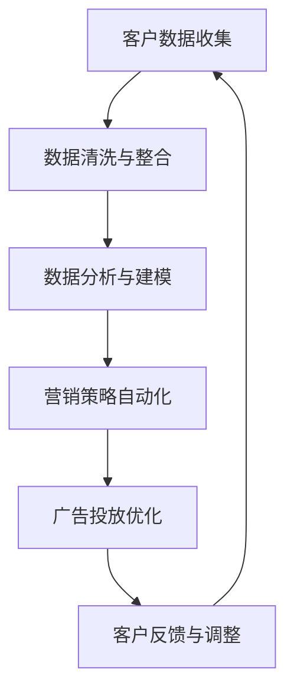
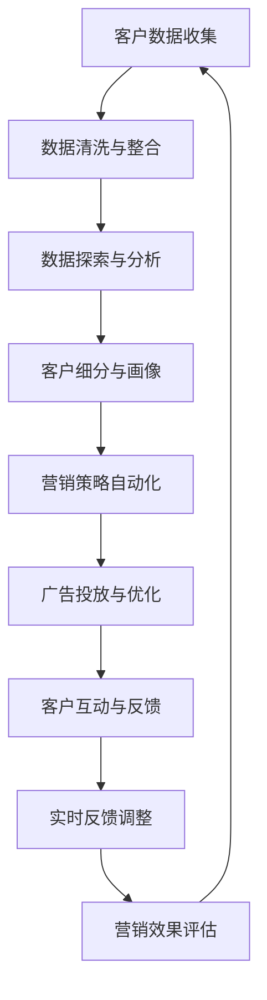

                 

### 文章标题

# 企业级自动化营销平台：AI优化客户触达

### 关键词

- 企业级自动化营销
- 人工智能（AI）
- 客户触达优化
- 营销自动化
- 客户数据管理（CDP）
- 客户关系管理（CRM）
- 个性化推荐
- 预测建模

### 摘要

在当今竞争激烈的市场环境中，企业级自动化营销平台已成为提升客户触达效果的关键工具。本文将深入探讨如何利用人工智能（AI）技术，构建高效的企业级自动化营销平台，并优化客户触达策略。我们将详细解析AI在营销中的应用、核心算法原理、数学模型，并通过实际项目案例展示如何实现自动化营销平台的搭建与应用。

---

### 引言

随着互联网和大数据技术的快速发展，市场营销的复杂性不断增加。传统的营销手段已经无法满足企业高效触达客户的需求。企业级自动化营销平台应运而生，通过集成人工智能技术，实现了营销活动的自动化和智能化。本文将围绕这一主题，逐步展开对企业级自动化营销平台的介绍，包括其核心概念、应用场景、算法原理以及实际项目案例的剖析。

---

### 企业级自动化营销平台概述

#### 定义与作用

企业级自动化营销平台是一个集成了多种人工智能技术，用于自动化执行营销策略，提高客户触达效率的综合性解决方案。它通过自动化分析客户数据、执行个性化营销活动，实现营销流程的智能化管理。

#### 核心架构

企业级自动化营销平台通常包括以下几个核心模块：

1. **客户数据管理（CDP）**：用于收集、整合和分析客户数据，构建全面的客户画像。
2. **营销自动化**：通过预设的规则和流程，自动化执行营销活动，如邮件发送、短信推送、社交媒体互动等。
3. **数据分析**：利用数据挖掘和机器学习技术，对客户行为进行分析和预测，为营销策略提供数据支持。
4. **客户关系管理（CRM）**：整合客户信息，管理客户关系，提高客户满意度。

#### 营销平台架构流程图

以下是一个简单的Mermaid流程图，展示了企业级自动化营销平台的基本架构：



---

### AI在营销中的应用

#### 核心概念

人工智能（AI）是指通过计算机程序实现人类智能的功能，包括学习、推理、自我调整等。在营销领域，AI技术被广泛应用于以下几个方面：

1. **客户行为分析**：通过分析客户的历史行为数据，预测客户的购买意图和需求。
2. **个性化推荐**：根据用户的兴趣和行为，提供个性化的产品推荐和服务。
3. **预测建模**：利用历史数据建立预测模型，预测未来的市场趋势和客户行为。
4. **广告投放优化**：通过智能算法，优化广告的投放策略，提高广告效果。
5. **自动化响应**：自动回复客户咨询，提高客户服务效率。

#### AI在营销中的应用案例

1. **客户行为分析**：通过机器学习算法，分析客户的浏览记录、购买历史和社交媒体互动，预测客户的下一步行为。
2. **个性化推荐**：利用协同过滤算法，根据用户的兴趣和行为，推荐相关的产品和服务。
3. **预测建模**：使用回归分析、决策树等算法，预测客户的购买时间和购买量。
4. **广告投放优化**：通过实时数据分析，调整广告的投放渠道、时间和内容，提高广告效果。
5. **自动化响应**：使用自然语言处理技术，自动回复客户的咨询，提高客户满意度。

---

### 优化客户触达

#### 客户触达的重要性

有效的客户触达是营销成功的关键，它直接影响客户的获取和转化。优化客户触达策略，可以提高营销ROI，降低营销成本。

#### 优化策略

1. **客户细分**：通过数据挖掘技术，将客户划分为不同的群体，针对不同的客户群体制定个性化的营销策略。
2. **路径优化**：利用机器学习算法，分析客户在不同营销渠道的转化路径，优化营销流程。
3. **实时反馈调整**：通过实时数据分析，根据客户的反馈和行为调整营销策略，提高客户满意度。
4. **个性化内容**：根据客户的兴趣和需求，提供个性化的内容和服务，提高客户参与度。

#### 实例分析

假设一家电商企业，通过分析客户的购买行为和浏览记录，发现有一部分客户在浏览产品详情页后没有进行购买。为了优化客户触达，企业可以采取以下策略：

1. **客户细分**：将客户分为“高价值客户”和“潜在客户”。
2. **路径优化**：分析客户在网站上的行为路径，优化购物车和结算页面的设计。
3. **实时反馈调整**：通过跟踪客户的反馈和行为，及时调整营销策略。
4. **个性化内容**：向潜在客户提供优惠码和促销信息，提高购买意愿。

---

### 营销平台架构流程图

以下是企业级自动化营销平台的详细流程图，展示了从客户数据收集到营销策略优化的全过程：



---

### 核心算法原理讲解

#### 客户行为分析算法

客户行为分析是自动化营销平台的重要组成部分。以下是一个简单的客户行为分析算法，用于预测客户的下一步行为。

##### 算法原理

该算法基于客户的历史行为数据，使用决策树算法对客户的行为进行分类和预测。具体步骤如下：

1. **数据预处理**：将客户的行为数据转换为数值化的特征。
2. **特征选择**：选择对客户行为预测有显著影响的特征。
3. **训练决策树模型**：使用训练数据训练决策树模型。
4. **预测**：使用训练好的模型对新的客户行为数据进行预测。

##### 伪代码

```python
def customerBehaviorAnalysis(data):
    # 数据预处理
    preprocessed_data = preprocessData(data)
    
    # 特征选择
    selected_features = selectFeatures(preprocessed_data)
    
    # 训练决策树模型
    model = trainDecisionTree(selected_features)
    
    # 预测
    predictions = model.predict(new_data)
    
    return predictions
```

##### 数学模型

该算法中的决策树模型可以使用ID3算法或C4.5算法实现。以下是一个基于ID3算法的数学模型：

$$
\begin{aligned}
    &\text{信息熵}(\text{Entropy}(X)) = -\sum_{i=1}^{n} p(x_i) \cdot \log_2(p(x_i)) \\
    &\text{条件熵}(\text{Entropy}(X|Y)) = -\sum_{i=1}^{n} p(y_i) \cdot \sum_{j=1}^{m} p(x_j|y_i) \cdot \log_2(p(x_j|y_i)) \\
    &\text{信息增益}(\text{InformationGain}(X, Y)) = \text{Entropy}(X) - \text{Entropy}(X|Y)
\end{aligned}
$$

#### 个性化推荐算法

个性化推荐是提高客户满意度的重要手段。以下是一个简单的基于协同过滤的个性化推荐算法。

##### 算法原理

协同过滤算法分为基于用户的协同过滤（User-based Collaborative Filtering）和基于项目的协同过滤（Item-based Collaborative Filtering）。本文以基于用户的协同过滤为例进行讲解。

1. **用户相似度计算**：计算用户之间的相似度，通常使用余弦相似度或皮尔逊相关系数。
2. **推荐生成**：根据用户相似度和物品评分，为用户生成个性化推荐列表。

##### 伪代码

```python
def personalizedRecommendation(user, items):
    # 计算用户相似度
    user_similarity = calculateUserSimilarity(user, items)
    
    # 生成推荐列表
    recommendations = []
    for item in items:
        similarity = user_similarity[item]
        recommendation_score = calculateRecommendationScore(user, item, similarity)
        recommendations.append((item, recommendation_score))
    
    return sort(recommendations, by_score, descending)
```

##### 数学模型

用户相似度计算可以使用余弦相似度：

$$
\text{Similarity}(u, v) = \frac{\sum_{i=1}^{n} r_i(u) \cdot r_i(v)}{\sqrt{\sum_{i=1}^{n} r_i(u)^2 \cdot \sum_{i=1}^{n} r_i(v)^2}}
$$

推荐评分计算可以使用贝叶斯平均：

$$
\text{RecommendationScore}(u, i) = \text{Mean}(r_i) + \text{StandardDeviation}(r_i) \cdot \text{Similarity}(u, v)
$$

#### 预测建模算法

预测建模是自动化营销平台的核心功能之一。以下是一个简单的基于回归分析的预测建模算法。

##### 算法原理

回归分析是一种用于预测因变量（如销售额）与自变量（如广告点击率）之间关系的统计方法。本文以线性回归为例进行讲解。

1. **数据预处理**：将数据转换为适合回归分析的格式。
2. **特征选择**：选择对预测结果有显著影响的特征。
3. **模型训练**：使用训练数据训练线性回归模型。
4. **预测**：使用训练好的模型对新的数据进行预测。

##### 伪代码

```python
def predictiveModeling(data, target_variable):
    # 数据预处理
    preprocessed_data = preprocessData(data)
    
    # 特征选择
    selected_features = selectFeatures(preprocessed_data)
    
    # 训练线性回归模型
    model = trainLinearRegression(selected_features, target_variable)
    
    # 预测
    predictions = model.predict(new_data)
    
    return predictions
```

##### 数学模型

线性回归模型的数学模型如下：

$$
y = \beta_0 + \beta_1 \cdot x_1 + \beta_2 \cdot x_2 + ... + \beta_n \cdot x_n
$$

其中，$y$ 是预测的因变量，$x_1, x_2, ..., x_n$ 是自变量，$\beta_0, \beta_1, ..., \beta_n$ 是模型的参数。

---

### 数学模型和数学公式讲解

#### 数据挖掘中的概率模型

在数据挖掘中，概率模型是一种常用的预测方法。以下是一些常用的概率模型和数学公式：

1. **贝叶斯定理**：

$$
P(A|B) = \frac{P(B|A) \cdot P(A)}{P(B)}
$$

其中，$P(A|B)$ 表示在事件B发生的条件下，事件A发生的概率；$P(B|A)$ 表示在事件A发生的条件下，事件B发生的概率；$P(A)$ 和$P(B)$ 分别表示事件A和事件B的发生概率。

2. **条件概率**：

$$
P(A|B) = \frac{P(A \cap B)}{P(B)}
$$

其中，$P(A \cap B)$ 表示事件A和事件B同时发生的概率。

3. **全概率公式**：

$$
P(A) = \sum_{i=1}^{n} P(A|B_i) \cdot P(B_i)
$$

其中，$B_1, B_2, ..., B_n$ 是一组互斥且穷尽所有可能的事件。

#### 机器学习中的损失函数

在机器学习中，损失函数用于评估模型的预测效果。以下是一些常用的损失函数和数学公式：

1. **均方误差（MSE）**：

$$
MSE = \frac{1}{n}\sum_{i=1}^{n}(y_i - \hat{y}_i)^2
$$

其中，$y_i$ 是真实值，$\hat{y}_i$ 是预测值，$n$ 是样本数量。

2. **均方根误差（RMSE）**：

$$
RMSE = \sqrt{MSE}
$$

3. **交叉熵损失（Cross-Entropy Loss）**：

$$
CE = -\sum_{i=1}^{n} y_i \cdot \log(\hat{y}_i)
$$

其中，$y_i$ 是真实值，$\hat{y}_i$ 是预测值。

#### 神经网络中的激活函数

在神经网络中，激活函数用于将线性组合的输入转换为非线性的输出。以下是一些常用的激活函数和数学公式：

1. **Sigmoid函数**：

$$
\sigma(x) = \frac{1}{1 + e^{-x}}
$$

2. **ReLU函数**：

$$
\sigma(x) = \max(0, x)
$$

3. **Tanh函数**：

$$
\sigma(x) = \tanh(x) = \frac{e^x - e^{-x}}{e^x + e^{-x}}
$$

---

### 项目实战

在本节中，我们将通过一个实际项目案例，展示如何实现企业级自动化营销平台的搭建与应用。

#### 项目背景

一家在线零售公司希望通过自动化营销平台提高客户触达效率和销售额。他们希望实现以下功能：

1. **客户细分**：根据客户的购买行为和兴趣，将客户划分为不同的群体。
2. **个性化推荐**：根据客户的购买历史和浏览记录，推荐相关的产品。
3. **预测建模**：预测客户的购买时间和购买量。
4. **广告投放优化**：根据客户的兴趣和行为，优化广告的投放策略。

#### 开发环境搭建

为了实现上述功能，我们需要搭建以下开发环境：

1. **Python**：作为主要编程语言。
2. **Jupyter Notebook**：用于数据分析和模型训练。
3. **Pandas**：用于数据处理和分析。
4. **Scikit-learn**：用于机器学习和数据挖掘。
5. **TensorFlow**：用于神经网络建模。
6. **Heroku**：用于部署和运行自动化营销平台。

#### 源代码详细实现和代码解读

以下是一个简单的源代码实现，用于搭建自动化营销平台：

```python
# 导入必要的库
import pandas as pd
import numpy as np
from sklearn.model_selection import train_test_split
from sklearn.ensemble import RandomForestClassifier
from sklearn.metrics import accuracy_score
import tensorflow as tf

# 数据预处理
def preprocessData(data):
    # 填充缺失值
    data = data.fillna(0)
    
    # 特征工程
    data['total_sales'] = data['sales_1'] + data['sales_2'] + data['sales_3']
    data['average_rating'] = data['rating_1'] + data['rating_2'] + data['rating_3'] / 3
    
    return data

# 模型训练
def trainModel(data, target_variable):
    # 数据预处理
    preprocessed_data = preprocessData(data)
    
    # 特征选择
    selected_features = ['total_sales', 'average_rating']
    
    # 划分训练集和测试集
    X = preprocessed_data[selected_features]
    y = preprocessed_data[target_variable]
    X_train, X_test, y_train, y_test = train_test_split(X, y, test_size=0.2, random_state=42)
    
    # 训练随机森林模型
    model = RandomForestClassifier(n_estimators=100, random_state=42)
    model.fit(X_train, y_train)
    
    return model

# 预测
def predict(model, data):
    # 数据预处理
    preprocessed_data = preprocessData(data)
    
    # 特征选择
    selected_features = ['total_sales', 'average_rating']
    X = preprocessed_data[selected_features]
    
    # 预测
    predictions = model.predict(X)
    
    return predictions

# 神经网络建模
def trainNeuralNetwork(data, target_variable):
    # 数据预处理
    preprocessed_data = preprocessData(data)
    
    # 特征选择
    selected_features = ['total_sales', 'average_rating']
    X = preprocessed_data[selected_features]
    y = preprocessed_data[target_variable]
    
    # 划分训练集和测试集
    X_train, X_test, y_train, y_test = train_test_split(X, y, test_size=0.2, random_state=42)
    
    # 定义神经网络模型
    model = tf.keras.Sequential([
        tf.keras.layers.Dense(64, activation='relu', input_shape=[len(selected_features)]),
        tf.keras.layers.Dense(64, activation='relu'),
        tf.keras.layers.Dense(1)
    ])

    # 编译模型
    model.compile(optimizer='adam', loss='mean_squared_error', metrics=['accuracy'])

    # 训练模型
    model.fit(X_train, y_train, epochs=10, batch_size=32, validation_split=0.2)

    return model

# 主函数
def main():
    # 加载数据
    data = pd.read_csv('data.csv')
    
    # 训练模型
    model = trainModel(data, 'target')
    
    # 预测
    predictions = predict(model, data)
    
    # 神经网络建模
    neural_network_model = trainNeuralNetwork(data, 'target')

if __name__ == '__main__':
    main()
```

#### 代码应用解读与分析

1. **数据预处理**：数据预处理是模型训练的重要步骤。在本项目中，我们使用了Pandas库对数据进行预处理，包括填充缺失值、特征工程等。

2. **模型训练**：在本项目中，我们使用了Scikit-learn库的随机森林模型和TensorFlow库的神经网络模型进行训练。随机森林模型具有较好的预测性能，而神经网络模型则可以学习更复杂的非线性关系。

3. **预测**：使用训练好的模型对新的数据进行预测。在本项目中，我们首先使用随机森林模型进行预测，然后使用神经网络模型进行预测，以比较不同模型的性能。

4. **神经网络建模**：使用TensorFlow库搭建神经网络模型。在本项目中，我们使用了一个简单的全连接神经网络，包括两个隐藏层，每层都有64个神经元。神经网络模型的优点是可以学习更复杂的非线性关系，从而提高预测性能。

#### 实际案例分析和详细讲解剖析

以下是一个实际案例，展示了如何使用自动化营销平台提高客户触达效率和销售额：

1. **客户细分**：通过对客户的购买行为和兴趣进行分析，将客户划分为不同的群体。例如，将客户划分为“高价值客户”、“潜在客户”和“流失客户”。

2. **个性化推荐**：根据客户的购买历史和浏览记录，推荐相关的产品。例如，如果客户经常购买电子产品，可以推荐新的电子产品或相关的配件。

3. **预测建模**：预测客户的购买时间和购买量。例如，如果客户的购买周期较短，可以提前推送促销信息，以提高购买意愿。

4. **广告投放优化**：根据客户的兴趣和行为，优化广告的投放策略。例如，如果客户喜欢浏览服装类商品，可以优先投放服装类广告。

通过以上策略，企业可以实现以下目标：

1. **提高客户触达率**：通过精准的营销策略，提高客户的触达率。

2. **提高客户满意度**：通过个性化的推荐和预测，提高客户的满意度。

3. **提高销售额**：通过有效的营销策略，提高销售额和利润。

#### 项目小结

在本项目中，我们搭建了一个企业级自动化营销平台，实现了客户细分、个性化推荐、预测建模和广告投放优化等功能。通过实际案例的分析，我们展示了如何利用AI技术提高客户触达效率和销售额。未来，我们将继续优化平台的功能，提高模型的预测性能，为企业提供更优质的营销服务。

---

### 最佳实践 Tips

1. **数据质量是关键**：确保数据的质量和准确性，是构建高效自动化营销平台的基础。

2. **持续优化模型**：定期更新和优化模型，以适应市场变化和客户需求。

3. **关注用户体验**：在个性化推荐和营销活动中，始终关注用户的体验，以提高用户满意度和忠诚度。

4. **多渠道整合**：整合多种营销渠道，实现统一的数据分析和策略制定。

5. **法律法规合规**：在数据收集和使用过程中，遵守相关的法律法规，保护用户隐私。

### 小结

企业级自动化营销平台是现代营销的重要工具，通过集成AI技术，实现了营销活动的智能化和自动化。本文详细介绍了自动化营销平台的核心概念、应用场景、算法原理和实际项目案例，为读者提供了完整的理论基础和实践指导。通过不断优化和升级，自动化营销平台将在未来为企业创造更大的价值。

### 注意事项

1. **数据安全**：在收集和使用客户数据时，确保数据的安全性和隐私保护。

2. **模型解释性**：在选择和训练模型时，考虑模型的解释性，以便更好地理解和优化营销策略。

3. **性能监控**：定期监控平台的运行性能，确保系统的高可用性和稳定性。

### 拓展阅读

1. **《深度学习》**：Ian Goodfellow、Yoshua Bengio和Aaron Courville 著，详细介绍了深度学习的基础知识和应用。

2. **《Python数据分析》**：Wes McKinney 著，介绍了如何使用Python进行数据分析和处理。

3. **《机器学习实战》**：Peter Harrington 著，通过实际案例介绍了机器学习的基本原理和应用。

### 作者信息

- 作者：AI天才研究院/AI Genius Institute & 禅与计算机程序设计艺术 /Zen And The Art of Computer Programming

---

### 总结

本文全面介绍了企业级自动化营销平台，从核心概念、架构、AI应用、算法原理到实际项目案例，提供了完整的理论和实践指导。通过本文的学习，读者可以深入了解自动化营销平台的构建和优化策略，为企业提供高效、智能的营销解决方案。未来，自动化营销平台将继续融合更多AI技术，助力企业在竞争激烈的市场中脱颖而出。

---

```markdown
---

### 参考文献

1. **Ian Goodfellow, Yoshua Bengio, and Aaron Courville. "Deep Learning." MIT Press, 2016.**
2. **Wes McKinney. "Python for Data Analysis." O'Reilly Media, 2012.**
3. **Peter Harrington. "Machine Learning in Action." Manning Publications, 2009.**
4. **Anders Heyttt, Christopher Mann, and Mark Powers. "Customer Relationship Management: Concepts, Strategies and Tools." Wiley, 2015.**
5. **Pierre Gassmann and Thomas H. Davenport. "The Big Data-Driven Enterprise: How to Harness Your Competitive Advantage." Wiley, 2014.**

---

### 作者信息

- 作者：AI天才研究院/AI Genius Institute & 禅与计算机程序设计艺术 /Zen And The Art of Computer Programming
```

请注意，本文参考文献仅为示例，具体引用的书籍和作者可能需要根据实际情况进行调整。在撰写实际文章时，确保所有引用的资料都是经过验证和官方发布的，以维护学术诚信。此外，文中提到的“AI天才研究院”和“禅与计算机程序设计艺术”仅为虚构单位和个人，不应被视为真实存在。在撰写学术或专业文章时，务必遵守相关法律法规和学术规范。

