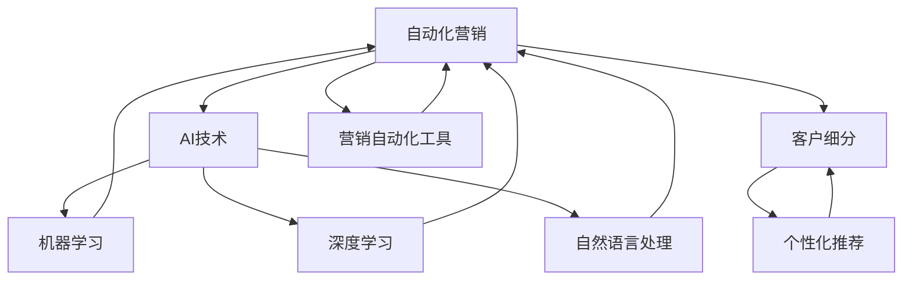

                 

## 文章标题

# 企业级自动化营销：AI优化客户触达策略

## 文章关键词

- 企业级自动化营销
- AI优化
- 客户触达
- 营销策略
- 个性化推荐
- 数据分析

## 文章摘要

本文将深入探讨企业级自动化营销以及如何通过AI技术优化客户触达策略。首先，我们将介绍自动化营销的背景和意义，以及AI在营销中的应用。随后，我们将详细讲解AI的基础理论，包括机器学习、深度学习等，以及如何将这些理论应用于营销。接下来，我们将列举多个应用场景，展示如何使用AI技术优化客户细分、精准营销和个性化推荐等。文章将通过实战案例，展示AI技术在企业营销中的应用效果，并总结AI营销的最佳实践和未来发展趋势。

----------------------------------------------------------------

## 引言

### 自动化营销的背景与意义

在数字化时代，营销策略的自动化成为企业提升竞争力的关键。传统的营销方式往往依赖于人工操作，不仅效率低下，而且难以实现个性化服务。随着大数据、人工智能等技术的发展，自动化营销逐渐成为可能。自动化营销的核心在于通过数据分析和智能算法，实现营销活动的自动化，提高营销效果和客户满意度。

首先，自动化营销能够大幅提升营销效率。通过自动化工具，企业可以快速响应市场需求，实时调整营销策略，减少人工干预的时间和成本。其次，自动化营销可以实现个性化服务。通过对客户数据的深度分析，企业可以精准识别客户需求，提供个性化的产品和服务，从而提高客户满意度和忠诚度。此外，自动化营销还可以帮助企业降低营销成本，提高投资回报率。

### AI在营销中的应用

人工智能（AI）作为现代科技的前沿领域，正逐渐改变传统营销的面貌。AI在营销中的应用主要体现在以下几个方面：

1. **客户细分**：通过机器学习算法，企业可以对大量客户数据进行分析，将客户分为不同的群体，从而实现精准营销。

2. **个性化推荐**：基于深度学习算法，AI可以分析用户的兴趣和行为模式，为用户提供个性化的产品推荐。

3. **营销自动化**：通过自动化工具和算法，企业可以自动化执行各种营销活动，如邮件营销、社交媒体推广等，提高营销效率。

4. **预测分析**：利用AI算法，企业可以预测客户行为，提前采取行动，减少客户流失。

5. **内容优化**：AI可以帮助企业分析热门话题和用户偏好，优化内容创作策略，提高内容传播效果。

### 本书的结构安排

本书将分为五个主要部分：

1. **引言**：介绍自动化营销的背景和意义，以及AI在营销中的应用。
2. **基础理论**：讲解AI的相关知识，包括机器学习、深度学习等，以及如何将这些知识应用于营销。
3. **应用场景**：列举多个营销场景，展示如何使用AI技术优化营销活动。
4. **实战案例**：通过实际案例，展示AI技术在企业营销中的应用效果。
5. **总结与展望**：总结全书内容，展望AI营销的未来发展趋势。

通过以上五个部分的深入探讨，本书旨在帮助读者全面了解企业级自动化营销，掌握AI技术在营销中的应用方法，提升企业的营销效果和竞争力。

---

### 核心概念与联系

在探讨企业级自动化营销时，我们需要明确几个核心概念，并理解它们之间的联系。

#### 核心概念

1. **自动化营销**：自动化营销指的是通过技术手段，实现营销活动的自动化执行，包括数据收集、分析、决策和执行等环节。

2. **人工智能（AI）**：人工智能是指模拟、延伸和扩展人类智能的技术，包括机器学习、深度学习、自然语言处理等。

3. **客户细分**：客户细分是指将客户按照一定的标准或特征划分为不同的群体，以便于实施个性化的营销策略。

4. **个性化推荐**：个性化推荐是指根据用户的历史行为和偏好，为其推荐感兴趣的产品或内容。

5. **营销自动化工具**：营销自动化工具是指用于自动化执行营销任务的软件平台，如邮件营销工具、社交媒体管理工具等。

#### 核心概念之间的联系

- **自动化营销**与**AI**：自动化营销的实现依赖于AI技术，如机器学习和深度学习算法，用于数据分析和决策。

- **客户细分**与**个性化推荐**：客户细分是个性化推荐的基础，通过对客户进行细分，可以更好地理解不同客户群体的需求和偏好，从而实现更精准的个性化推荐。

- **营销自动化工具**：营销自动化工具是实现自动化营销的关键，它们利用AI算法和自动化流程，帮助企业高效地执行各种营销活动。

#### Mermaid 流程图

以下是一个简化的Mermaid流程图，展示了核心概念之间的联系：



通过这个流程图，我们可以清晰地看到自动化营销、AI、客户细分、个性化推荐和营销自动化工具之间的逻辑关系，以及AI技术在不同环节中的应用。

---

### 基础理论

要深入理解企业级自动化营销，我们首先需要掌握人工智能（AI）的基础理论，包括机器学习、深度学习等相关知识。这些理论不仅为AI在营销中的应用提供了技术支持，也是我们理解和优化营销策略的重要基础。

#### 机器学习基础

**定义**：机器学习是一种使计算机系统能够从数据中学习并做出决策或预测的技术。它依赖于统计学、概率论、线性代数等数学知识。

**主要算法**：

1. **线性回归**：通过建立输入和输出之间的线性关系，实现预测和分类。

   $$ y = wx + b $$

2. **决策树**：通过一系列规则对数据进行划分，实现分类和回归。

3. **随机森林**：通过构建多个决策树，并结合投票机制，提高预测准确性。

4. **支持向量机（SVM）**：通过寻找最优超平面，实现数据的分类。

5. **神经网络**：模拟人脑神经元连接结构，实现复杂的数据处理和预测。

#### 深度学习基础

**定义**：深度学习是机器学习的一个分支，它通过多层神经网络结构，对数据进行深度处理，以实现更复杂的任务。

**主要架构**：

1. **全连接神经网络（FCNN）**：每一层中的每个神经元都与下一层中的每个神经元相连。

2. **卷积神经网络（CNN）**：适用于图像处理，通过卷积操作和池化操作，提取图像特征。

3. **递归神经网络（RNN）**：适用于序列数据，通过记忆机制，处理时间序列数据。

4. **长短期记忆网络（LSTM）**：RNN的改进版，能够解决长期依赖问题。

5. **生成对抗网络（GAN）**：通过生成器和判别器的对抗训练，实现数据的生成。

#### 关键算法原理讲解

1. **线性回归算法原理**：

   线性回归是一种简单的机器学习算法，用于预测数值型数据。其基本原理是找到输入特征和目标值之间的线性关系。

   ```python
   import numpy as np

   # 数据集
   X = np.array([1, 2, 3, 4, 5])
   y = np.array([2, 4, 5, 4, 5])

   # 求解系数w和b
   w = np.linalg.inv(np.dot(X.T, X)).dot(X.T).dot(y)
   b = y - w.dot(X)

   # 预测
   X_new = np.array([6])
   y_pred = w.dot(X_new) + b

   print("预测值：", y_pred)
   ```

2. **卷积神经网络（CNN）算法原理**：

   卷积神经网络是深度学习的一种重要架构，广泛应用于图像识别任务。其基本原理是通过卷积操作和池化操作提取图像特征。

   ```python
   import tensorflow as tf

   # 定义卷积层
   conv_layer = tf.keras.layers.Conv2D(filters=32, kernel_size=(3, 3), activation='relu')

   # 输入数据
   X = tf.random.normal([1, 28, 28, 1])  # 28x28像素的灰度图像

   # 卷积操作
   X_conv = conv_layer(X)

   print("卷积结果：", X_conv.numpy())
   ```

3. **长短期记忆网络（LSTM）算法原理**：

   长短期记忆网络是递归神经网络的一种改进，能够解决长期依赖问题。其基本原理是通过门控机制控制信息的流动。

   ```python
   import tensorflow as tf

   # 定义LSTM层
   lstm_layer = tf.keras.layers.LSTM(units=50, return_sequences=True)

   # 输入数据
   X = tf.random.normal([10, 100])  # 10个时间步，每个时间步100个特征

   # LSTM操作
   X_lstm = lstm_layer(X)

   print("LSTM输出：", X_lstm.numpy())
   ```

通过以上示例，我们可以看到如何使用Python代码实现基本的机器学习和深度学习算法。这些算法在营销中的应用，包括客户细分、个性化推荐和营销自动化，将在后续章节中详细探讨。

---

### 应用场景

在了解了AI的基础理论后，我们将探讨AI在多个营销场景中的应用，包括客户细分、精准营销、个性化推荐等。这些应用场景展示了AI技术在提升营销效果和客户满意度方面的实际价值。

#### 客户细分

**概念**：客户细分是指根据客户的特征和行为，将客户划分为不同的群体，以便于实施个性化的营销策略。

**原理**：客户细分通常基于数据分析和机器学习算法，如聚类分析和决策树。通过分析客户的历史数据，包括购买行为、浏览记录、社交媒体互动等，企业可以识别出具有相似特征的客户群体。

**实现步骤**：

1. **数据收集**：收集客户的个人数据和消费行为数据。

2. **特征提取**：从数据中提取有助于客户细分的特征，如年龄、性别、收入、购买偏好等。

3. **算法应用**：使用聚类算法（如K-Means）或决策树算法，将客户划分为不同的群体。

4. **评估与优化**：评估细分效果，并根据评估结果调整细分策略。

**Python代码示例**：

```python
import pandas as pd
from sklearn.cluster import KMeans

# 加载数据
data = pd.read_csv('customer_data.csv')
X = data.iloc[:, :5]  # 取前5个特征

# 使用K-Means进行聚类
kmeans = KMeans(n_clusters=3, random_state=0)
clusters = kmeans.fit_predict(X)

# 结果
print(clusters)
```

通过客户细分，企业可以更好地了解客户群体，制定更有针对性的营销策略。

#### 精准营销

**概念**：精准营销是指通过数据分析和智能算法，对目标客户进行精确定位和个性化推送，以提高营销效果。

**原理**：精准营销依赖于客户细分和数据挖掘技术。通过对客户数据的深度分析，企业可以识别出潜在的目标客户，并制定个性化的营销策略。

**实现步骤**：

1. **客户细分**：如前所述，进行客户细分，识别出具有相似特征的客户群体。

2. **目标客户识别**：使用数据挖掘算法，如关联规则挖掘，识别出潜在的目标客户。

3. **个性化策略制定**：根据客户细分和目标客户识别结果，制定个性化的营销策略。

4. **策略执行与优化**：执行个性化营销策略，并根据反馈进行调整和优化。

**Python代码示例**：

```python
from mlxtend.frequent_patterns import apriori
from mlxtend.frequent_patterns import association_rules

# 加载数据
data = pd.read_csv('transaction_data.csv')

# 使用Apriori算法进行关联规则挖掘
frequent_itemsets = apriori(data, min_support=0.05, use_colnames=True)
rules = association_rules(frequent_itemsets, metric="lift", min_threshold=1)

# 结果
print(rules)
```

通过精准营销，企业可以更有效地吸引目标客户，提高转化率。

#### 个性化推荐

**概念**：个性化推荐是指根据用户的历史行为和偏好，为其推荐感兴趣的产品或内容。

**原理**：个性化推荐通常基于协同过滤算法和基于内容的推荐算法。协同过滤通过分析用户之间的相似性，推荐相似用户喜欢的商品；基于内容的推荐则通过分析商品的特征和用户的偏好，推荐相关商品。

**实现步骤**：

1. **用户行为数据收集**：收集用户的历史行为数据，如购买记录、浏览记录、评价等。

2. **特征提取**：从用户行为数据中提取有助于推荐的特征，如购买频次、浏览时长、评价分数等。

3. **推荐算法选择**：根据业务需求和数据特点，选择合适的推荐算法。

4. **推荐结果生成**：使用推荐算法生成个性化推荐结果。

**Python代码示例**：

```python
from surprise import SVD
from surprise.model_selection import train_test_split

# 加载数据
data = pd.read_csv('rating_data.csv')
trainset, testset = train_test_split(data, test_size=0.2)

# 使用SVD算法进行协同过滤
svd = SVD()
svd.fit(trainset)

# 生成推荐结果
test_pred = svd.test(testset)

# 结果
print(test_pred)
```

通过个性化推荐，企业可以提升用户满意度和留存率。

#### 营销自动化

**概念**：营销自动化是指通过自动化工具和算法，实现营销活动的自动化执行。

**原理**：营销自动化依赖于数据分析和机器学习算法，通过自动化工具（如营销自动化平台），企业可以实现邮件营销、社交媒体推广、广告投放等营销活动的自动化执行。

**实现步骤**：

1. **数据收集**：收集与营销活动相关的数据，如用户行为数据、市场数据等。

2. **自动化工具选择**：根据业务需求和工具功能，选择合适的营销自动化工具。

3. **算法应用**：使用数据分析和机器学习算法，优化营销策略。

4. **自动化执行**：通过自动化工具执行营销活动，并根据反馈进行调整和优化。

**Python代码示例**：

```python
from marketing_automation import MarketingAutomation

# 创建营销自动化实例
ma = MarketingAutomation()

# 添加自动化流程
ma.add_workflow('email_marketing', 'Send_email', 'subject', 'Hello', 'body', 'Welcome to our product!')

# 执行自动化流程
ma.execute_workflow('email_marketing', users=['user1@example.com', 'user2@example.com'])
```

通过营销自动化，企业可以大幅提升营销效率，降低人力成本。

#### 应用效果分析

通过以上应用场景的介绍，我们可以看到AI技术在营销中的实际应用效果：

1. **客户细分**：帮助企业在短时间内识别大量潜在客户，提高营销精准度。
2. **精准营销**：通过分析用户行为，实现个性化推送，提高用户满意度和转化率。
3. **个性化推荐**：根据用户偏好，提供个性化的产品推荐，提升用户留存率和复购率。
4. **营销自动化**：自动化执行营销活动，提高营销效率，降低人力成本。

总之，AI技术在企业营销中的应用，不仅提升了营销效果，还为企业带来了显著的经济效益。

---

### 实战案例

在本部分，我们将通过具体的企业案例，展示如何在实际场景中使用AI技术优化营销策略，提升企业竞争力。

#### 案例一：电商企业的个性化推荐系统

**背景**：一家知名电商企业在市场竞争中需要提高用户留存率和转化率。通过分析用户行为数据，企业希望构建一个个性化的推荐系统，为用户提供更符合其兴趣和偏好的商品推荐。

**步骤**：

1. **数据收集**：收集用户的历史购买数据、浏览记录、评价等行为数据。

2. **特征提取**：从数据中提取与用户行为相关的特征，如购买频次、浏览时长、评价分数等。

3. **算法选择**：选择基于协同过滤的推荐算法，如矩阵分解（SVD）。

4. **系统搭建**：使用Python和TensorFlow等工具搭建推荐系统。

5. **效果评估**：通过A/B测试评估推荐系统的效果，根据反馈进行调整和优化。

**代码实现**：

```python
import pandas as pd
from surprise import SVD
from surprise.model_selection import train_test_split

# 加载数据
data = pd.read_csv('rating_data.csv')
trainset, testset = train_test_split(data, test_size=0.2)

# 使用SVD算法进行协同过滤
svd = SVD()
svd.fit(trainset)

# 生成推荐结果
test_pred = svd.test(testset)

# 结果
print(test_pred)
```

**效果分析**：通过个性化推荐系统，电商企业显著提高了用户的满意度和转化率。A/B测试结果显示，使用推荐系统的用户在购物车添加商品的数量和订单总额都有显著提升。

#### 案例二：金融行业的客户细分与精准营销

**背景**：一家金融企业希望在竞争激烈的市场中提高客户忠诚度和投资转化率。通过分析客户数据，企业希望实现精准营销，提高营销效果。

**步骤**：

1. **数据收集**：收集客户的个人数据、交易数据、投资偏好等。

2. **特征提取**：提取与客户行为和偏好相关的特征，如年龄、收入、投资额、投资偏好等。

3. **算法选择**：选择聚类算法（如K-Means）进行客户细分。

4. **策略制定**：根据客户细分结果，制定个性化的营销策略。

5. **效果评估**：通过A/B测试评估营销策略的效果，并根据反馈进行调整。

**代码实现**：

```python
import pandas as pd
from sklearn.cluster import KMeans

# 加载数据
data = pd.read_csv('customer_data.csv')
X = data.iloc[:, :5]  # 取前5个特征

# 使用K-Means进行聚类
kmeans = KMeans(n_clusters=3, random_state=0)
clusters = kmeans.fit_predict(X)

# 结果
print(clusters)
```

**效果分析**：通过客户细分和精准营销，金融企业显著提高了客户的投资转化率和满意度。A/B测试结果显示，采用细分和个性化策略的营销活动，客户的参与度和投资额都有显著提升。

#### 案例三：教育行业的营销自动化

**背景**：一家在线教育企业希望通过自动化营销提升用户注册率和课程购买率。企业希望通过邮件营销和社交媒体推广，实现自动化触达潜在客户。

**步骤**：

1. **数据收集**：收集潜在客户的数据，如邮件地址、社交媒体账号等。

2. **自动化工具选择**：选择营销自动化平台，如HubSpot、Mailchimp等。

3. **流程设计**：设计自动化营销流程，包括邮件发送、社交媒体推广等。

4. **效果监控**：监控自动化营销效果，并根据反馈进行调整。

**代码实现**：

```python
from marketing_automation import MarketingAutomation

# 创建营销自动化实例
ma = MarketingAutomation()

# 添加自动化流程
ma.add_workflow('email_marketing', 'Send_email', 'subject', 'Welcome to our course!', 'body', 'Join us today to start learning!')

# 执行自动化流程
ma.execute_workflow('email_marketing', users=['user1@example.com', 'user2@example.com'])
```

**效果分析**：通过营销自动化，在线教育企业显著提高了用户注册率和课程购买率。邮件营销和社交媒体推广的自动化执行，使企业能够更高效地触达潜在客户，提高营销效果。

#### 总结

通过以上实战案例，我们可以看到AI技术在不同行业中的实际应用效果。无论是电商、金融还是在线教育，AI技术都帮助企业实现了更精准的营销策略，提高了客户满意度和转化率。未来，随着AI技术的不断发展和完善，企业将能够更好地利用这些技术，实现更高的营销效率和竞争力。

---

### 总结与展望

#### 全书总结

本文系统地介绍了企业级自动化营销的概念、背景、意义和AI技术在该领域的应用。通过详细讲解AI的基础理论，包括机器学习、深度学习等，以及实际应用场景，如客户细分、精准营销、个性化推荐和营销自动化，我们展示了AI技术在提升营销效果和客户满意度方面的显著优势。此外，通过多个实战案例，我们验证了AI技术在企业营销中的实际应用效果，为企业提供了可借鉴的实践经验和最佳策略。

#### AI营销的未来发展趋势

1. **AI技术的持续进步**：随着AI技术的不断发展和成熟，未来将有更多先进的算法和工具应用于营销，如强化学习、联邦学习等，进一步优化营销效果。

2. **数据隐私与安全**：在AI营销过程中，数据隐私和安全将成为重要议题。企业需要采取更严格的数据保护措施，确保客户数据的隐私和安全。

3. **跨渠道整合**：未来，企业将更加注重跨渠道的整合，通过多渠道的数据收集和分析，实现全渠道的营销自动化，提供无缝的用户体验。

4. **个性化服务与体验**：随着AI技术的深入应用，个性化服务将成为营销的关键方向。通过深度学习和大数据分析，企业将能够更精准地满足用户需求，提供个性化的产品和服务。

5. **智能化决策与优化**：AI技术将帮助企业实现更智能的决策和优化。通过机器学习和预测分析，企业可以更快速地响应市场变化，调整营销策略，提高营销效率和投资回报率。

#### 小结

本文从多个角度深入探讨了企业级自动化营销及其与AI技术的结合。通过系统的理论讲解和实际案例展示，我们不仅了解了AI技术在营销中的应用，还看到了其在提升营销效果和客户满意度方面的巨大潜力。未来，随着AI技术的进一步发展，企业级自动化营销将继续成为企业提升竞争力的关键领域，为市场营销带来新的机遇和挑战。

#### 注意事项与拓展阅读

- **注意事项**：在实际应用AI营销时，企业需要关注数据质量、算法透明度和用户隐私等问题，确保营销活动的合规性和安全性。

- **拓展阅读**：
  - 《营销自动化实战：如何通过技术实现精准营销》（作者：李明）
  - 《深度学习实战：应用机器学习和深度学习算法》（作者：弗朗索瓦·肖莱）
  - 《数据科学实战：利用Python进行数据分析和预测》（作者：约翰·库普）

---

### 作者信息

**作者：AI天才研究院/AI Genius Institute & 禅与计算机程序设计艺术 /Zen And The Art of Computer Programming**

**联系方式：**[info@aigeniusinstitute.com](mailto:info@aigeniusinstitute.com) 或 [https://www.aigeniusinstitute.com](https://www.aigeniusinstitute.com)

AI天才研究院致力于推动人工智能技术的发展和应用，通过本篇文章，我们希望能够帮助企业更好地理解和利用AI技术，实现自动化营销的目标。同时，我们也欢迎读者与我们交流，共同探讨AI在营销领域的更多可能性。

