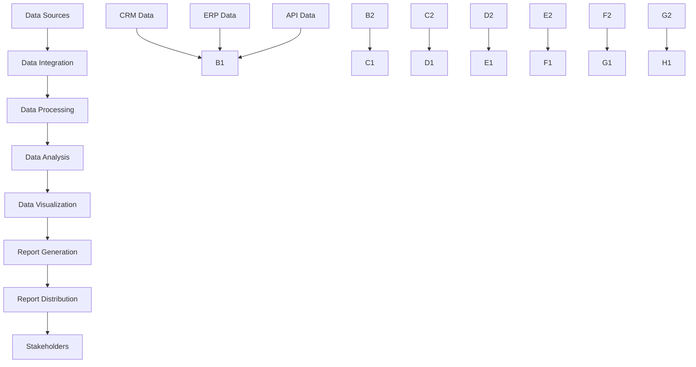

                 

## Introduction to Enterprise-Level Report Automation

### 1.1 Book Overview and Objectives

"Enterprise-Level Automatic Report Generator: Simplifying Business Reporting" aims to address the challenges associated with manual reporting processes in modern business environments. The book serves as a comprehensive guide for businesses, IT professionals, and data analysts who are seeking to streamline their reporting workflows.

The primary objective of this book is to demystify the concept of automated reporting and provide a structured approach to designing, implementing, and maintaining an automated report generator. By the end of this book, readers will be equipped with the knowledge and tools necessary to create efficient and reliable automated reporting systems tailored to their specific business needs.

Key topics covered in this book include:

- Fundamental concepts and principles of business reporting
- Overview of reporting tools and technologies
- Data processing and analytics techniques
- System architecture and component interaction
- Core algorithm design and data models
- Development process and best practices
- Case studies and real-world applications

### 1.2 The Importance of Business Reporting

Business reporting is a critical component of corporate governance and strategic decision-making. It provides stakeholders with valuable insights into the company's performance, financial health, and operational efficiency. Effective reporting enables businesses to monitor their progress towards strategic goals, identify potential risks, and make data-driven decisions.

Some of the key reasons why business reporting is important include:

1. **Informed Decision-Making**: Accurate and timely reports provide decision-makers with the information they need to make informed, strategic decisions.
2. **Regulatory Compliance**: Many industries have regulatory requirements that mandate the submission of specific reports.
3. **Performance Monitoring**: Regular reporting helps businesses track their performance over time, identify trends, and make necessary adjustments.
4. **Stakeholder Communication**: Reports are essential for communicating the company's performance to stakeholders, including investors, employees, and customers.
5. **Resource Allocation**: Business reports help managers allocate resources effectively by highlighting areas of improvement and potential cost savings.

### 1.3 Challenges in Manual Reporting

While manual reporting has been the norm for many years, it comes with several inherent challenges that can hinder business efficiency and decision-making. Some of the key challenges include:

1. **Time-Consuming**: Manual reporting requires significant manual effort, including data collection, processing, and formatting. This can be time-consuming and inefficient, especially for large volumes of data.
2. **Human Error**: Manual reporting processes are prone to human error, such as data entry mistakes, omissions, and misinterpretations. These errors can lead to inaccurate reports and misguided decisions.
3. **Inconsistency**: Manual reporting processes often result in inconsistent reporting formats and methodologies, making it difficult to compare data across different periods or departments.
4. **Scalability**: As the volume of data and the complexity of reporting requirements increase, manual processes can become cumbersome and difficult to scale.
5. **Lack of Real-Time Insights**: Manual reporting often leads to delayed insights, as the time taken to gather and process data can be substantial.

### 1.4 Overview of Automated Reporting Solutions

Automated reporting solutions offer a viable alternative to manual reporting by leveraging technology to streamline and optimize the reporting process. These solutions can help businesses overcome the challenges associated with manual reporting and provide several benefits, including:

1. **Time Savings**: Automated reporting systems can significantly reduce the time required to generate reports by automating data collection, processing, and formatting tasks.
2. **Accuracy and Consistency**: Automated systems minimize the risk of human error by eliminating manual data entry and ensuring consistent reporting formats and methodologies.
3. **Real-Time Insights**: Automated reporting enables businesses to access up-to-date information and make timely decisions based on the latest data.
4. **Scalability**: Automated systems are designed to handle large volumes of data and can scale as the business grows.
5. **Customization and Flexibility**: Automated reporting solutions can be tailored to meet specific business requirements, providing a higher degree of customization and flexibility.

In this book, we will explore the various aspects of designing and implementing an enterprise-level automated report generator, covering everything from core concepts and technologies to practical case studies and best practices. By the end of this book, readers will be well-equipped to develop and deploy their own automated reporting systems, simplifying business reporting and empowering data-driven decision-making.

---

> Keywords: Enterprise-Level Report Automation, Business Reporting, Automated Reporting Solutions, Data Processing, System Architecture, Algorithm Design, Development Best Practices

> Abstract: This book provides a comprehensive guide to designing and implementing enterprise-level automated report generators. It covers core concepts, technologies, system architecture, algorithm design, and development best practices. Through practical case studies and real-world applications, readers will gain insights into the benefits and challenges of automated reporting and learn how to create efficient and reliable reporting systems tailored to their specific business needs.

---

## Core Concepts and Technologies in Enterprise-Level Report Automation

### 2.1 Fundamental Concepts in Business Reporting

Business reporting is the process of collecting, analyzing, and presenting data to provide stakeholders with insights into the company's performance, financial health, and operational efficiency. There are several key concepts and terms that are essential to understanding business reporting:

#### 2.1.1 Types of Business Reports

Business reports can be categorized into several types based on their purpose and content. The most common types of business reports include:

1. **Financial Reports**: These reports provide information about the company's financial performance, including income statements, balance sheets, and cash flow statements.
2. **Operational Reports**: These reports focus on the company's operational activities, such as sales reports, production reports, and employee performance reports.
3. **Strategic Reports**: These reports provide insights into the company's strategic goals, market trends, and competitive landscape.
4. **Compliance Reports**: These reports are required by regulatory authorities and ensure that the company complies with legal and industry standards.

#### 2.1.2 Data Sources and Integration

Data sources are the raw materials that feed into business reports. These can include internal sources, such as transactional databases, CRM systems, and ERP systems, as well as external sources, such as market research data and public financial statements. Integrating these diverse data sources is crucial for creating comprehensive and accurate reports.

Key aspects of data integration include:

- **Data Collection**: Gathering data from various sources and ensuring its completeness and accuracy.
- **Data Transformation**: Converting data into a consistent format that can be used for analysis and reporting.
- **Data Integration Tools**: Utilizing tools and technologies, such as ETL (Extract, Transform, Load) processes and data warehouses, to integrate data from multiple sources.

#### 2.1.3 Key Performance Indicators (KPIs)

Key Performance Indicators (KPIs) are metrics that help measure the success of an organization in achieving its goals. KPIs are critical for business reporting as they provide quantifiable data that can be used to assess performance, identify trends, and make data-driven decisions.

Common KPIs across different business functions include:

- **Financial KPIs**: Such as revenue growth, profit margins, and return on investment.
- **Operational KPIs**: Such as production efficiency, cycle time, and defect rates.
- **Customer KPIs**: Such as customer satisfaction, churn rate, and Net Promoter Score (NPS).

### 2.2 Overview of Reporting Tools and Technologies

#### 2.2.1 Commercial Reporting Tools

Commercial reporting tools are software applications designed to facilitate the creation, distribution, and analysis of business reports. These tools typically offer a range of features, including data integration, report formatting, and automation. Some of the most popular commercial reporting tools include:

- **Tableau**: A powerful data visualization tool that allows users to create interactive and dynamic reports.
- **Power BI**: A comprehensive business analytics tool developed by Microsoft, offering a range of features for data integration, visualization, and reporting.
- **QlikView**: A self-service data discovery and visualization tool that enables users to explore data from various sources and create interactive reports.
- **SAP BusinessObjects**: A suite of business intelligence and reporting tools that provide extensive data analysis and visualization capabilities.

#### 2.2.2 Open Source Solutions

Open source reporting tools are free to use and are developed collaboratively by a community of contributors. These tools offer flexibility and customization options, making them a popular choice for organizations with specific reporting requirements. Some notable open source reporting tools include:

- **BIRT (Business Intelligence and Reporting Tools)**: An open source reporting framework that enables users to create, design, and deploy reports.
- **JasperReports**: A powerful Java reporting tool that supports a wide range of data sources and output formats.
- **Pentaho**: An open source business analytics platform that offers reporting, data integration, and data mining capabilities.

#### 2.2.3 Custom Development

For organizations with unique reporting requirements that cannot be met by commercial or open source tools, custom development may be the best option. Custom development involves building a reporting solution from scratch using programming languages and frameworks such as Python, Java, or .NET.

Key considerations for custom development include:

- **Scalability**: Ensuring the solution can handle increasing data volumes and user demands.
- **Customization**: Designing the system to meet specific business requirements and workflows.
- **Integration**: Ensuring seamless integration with existing systems and data sources.

### 2.3 Data Processing and Analytics

#### 2.3.1 Data Cleaning and Preparation

Data cleaning and preparation are critical steps in the reporting process. They involve identifying and correcting errors, inconsistencies, and inaccuracies in the data, as well as transforming it into a format suitable for analysis. Key data cleaning and preparation techniques include:

- **Data Profiling**: Analyzing data to identify patterns, anomalies, and potential issues.
- **Data Standardization**: Ensuring data is in a consistent format and units of measurement.
- **Data Deduplication**: Identifying and removing duplicate records to ensure data integrity.

#### 2.3.2 Data Analysis Techniques

Data analysis techniques involve examining data to identify trends, correlations, and insights that can inform decision-making. Common data analysis techniques include:

- **Descriptive Analytics**: Summarizing historical data to provide an overview of past performance.
- **Diagnostic Analytics**: Identifying the causes of past problems or trends.
- **Predictive Analytics**: Using historical data to predict future outcomes.
- **Prescriptive Analytics**: Recommending actions to optimize future outcomes based on predictive insights.

#### 2.3.3 Visualization Tools

Visualization tools are essential for presenting data in a clear and intuitive manner. These tools help users understand complex data sets and identify trends and patterns more easily. Popular visualization tools include:

- **Tableau**: A leading data visualization tool that offers a range of chart types, interactive dashboards, and sharing capabilities.
- **Power BI**: A comprehensive visualization tool that integrates with Microsoft Office and offers a wide range of visualization options.
- **D3.js**: A JavaScript library that allows developers to create custom, interactive data visualizations in the browser.

In summary, understanding the core concepts and technologies in business reporting is crucial for designing and implementing an effective automated report generator. By leveraging the right tools and techniques, organizations can streamline their reporting processes, improve data accuracy and consistency, and gain valuable insights for better decision-making.

---

### Core Algorithm and Data Models for Automated Report Generation

The core of an automated report generator lies in its algorithms and data models, which are responsible for transforming raw data into actionable insights and visually appealing reports. This section will delve into the essential algorithms and data models used in automated report generation, providing a clear understanding of their principles and applications.

#### 3.2.1 Text Analysis and Extraction

Text analysis and extraction are fundamental steps in transforming unstructured data into structured information that can be used for reporting. Key techniques in text analysis include:

- **Natural Language Processing (NLP)**: NLP enables computers to understand, interpret, and generate human language. Common NLP techniques include tokenization, stemming, and part-of-speech tagging.

    ```python
    import nltk
    from nltk.tokenize import word_tokenize
    from nltk.stem import PorterStemmer

    nltk.download('punkt')
    nltk.download('averaged_perceptron_tagger')

    text = "The quick brown fox jumps over the lazy dog."
    tokens = word_tokenize(text)
    stemmed_tokens = [PorterStemmer().stem(token) for token in tokens]
    tags = nltk.pos_tag(tokens)
    ```

- **Named Entity Recognition (NER)**: NER identifies and classifies named entities within text into predefined categories such as locations, organizations, and dates.

    ```python
    from nltk.chunk import ne_chunk

    tagged_text = nltk.pos_tag(tokens)
    named_entities = ne_chunk(tagged_text)
    ```

Text extraction techniques, such as keyword extraction and sentence summarization, help distill relevant information from large text corpuses. These techniques can be applied to extract key insights from business documents, emails, and social media posts.

#### 3.2.2 Statistical Analysis Methods

Statistical analysis is essential for understanding the underlying patterns and trends in data. Key statistical methods used in automated reporting include:

- **Descriptive Statistics**: Descriptive statistics summarize the main features of a dataset, including measures of central tendency (mean, median, mode) and measures of dispersion (variance, standard deviation).

    ```python
    import numpy as np

    data = [1, 2, 3, 4, 5]
    mean = np.mean(data)
    median = np.median(data)
    variance = np.var(data)
    std_dev = np.std(data)
    ```

- **Correlation Analysis**: Correlation analysis measures the strength and direction of the linear relationship between two variables. It helps identify factors that influence key business metrics.

    ```python
    import scipy.stats as stats

    x = [1, 2, 3, 4, 5]
    y = [2, 4, 5, 4, 6]
    correlation = stats.pearsonr(x, y)
    ```

- **Regression Analysis**: Regression analysis models the relationship between a dependent variable and one or more independent variables. It is used to predict future outcomes based on historical data.

    ```python
    from sklearn.linear_model import LinearRegression

    x = [[1], [2], [3], [4], [5]]
    y = [2, 4, 5, 4, 6]
    model = LinearRegression()
    model.fit(x, y)
    predictions = model.predict([[6]])
    ```

Statistical analysis methods are crucial for generating accurate and meaningful reports, providing insights into trends and relationships that drive business decisions.

#### 3.2.3 Machine Learning Techniques

Machine learning techniques enhance the capabilities of automated report generation by enabling predictive analytics and pattern recognition. Key machine learning methods include:

- **Supervised Learning**: Supervised learning algorithms learn from labeled data to make predictions about new, unseen data. Common supervised learning methods include linear regression, logistic regression, and support vector machines (SVM).

    ```python
    from sklearn.svm import SVC

    x = [[1], [2], [3], [4], [5]]
    y = [0, 1, 1, 0, 1]
    model = SVC(kernel='linear')
    model.fit(x, y)
    predictions = model.predict([[6]])
    ```

- **Unsupervised Learning**: Unsupervised learning algorithms identify patterns and relationships in unlabeled data. Common unsupervised learning methods include k-means clustering and hierarchical clustering.

    ```python
    from sklearn.cluster import KMeans

    x = [[1], [2], [3], [4], [5]]
    model = KMeans(n_clusters=2)
    model.fit(x)
    predictions = model.predict([[6]])
    ```

Machine learning techniques can be used to predict future trends, segment customers, and identify anomalies, providing valuable insights for business reporting.

#### 3.2.4 Pseudo Code for Core Algorithms

Below is a simplified pseudo code illustrating the core algorithmic steps involved in automated report generation:

```plaintext
Algorithm AutomatedReportGenerator(data_source):
    1. Data Extraction:
        - Extract data from the data_source
        - Apply text analysis and extraction techniques to transform unstructured data into structured data

    2. Data Cleaning and Preparation:
        - Remove duplicate records
        - Handle missing values
        - Standardize units of measurement

    3. Statistical Analysis:
        - Compute descriptive statistics
        - Perform correlation and regression analysis

    4. Machine Learning:
        - Train supervised learning models
        - Apply unsupervised learning techniques for clustering and anomaly detection

    5. Visualization:
        - Generate visualizations for key metrics and trends
        - Create interactive dashboards

    6. Report Generation:
        - Format and compile the analyzed data into a comprehensive report
        - Include visualizations and machine learning insights

    7. Report Distribution:
        - Distribute the generated report to stakeholders via email, web portal, or other communication channels

    8. Logging and Monitoring:
        - Log system activities and performance metrics
        - Monitor for any issues or anomalies

End Algorithm
```

This pseudo code provides a high-level overview of the automated report generation process, highlighting the key steps and components involved.

In conclusion, the core algorithms and data models for automated report generation are crucial for transforming raw data into actionable insights and visually compelling reports. By leveraging text analysis, statistical analysis, and machine learning techniques, organizations can streamline their reporting processes, enhance data accuracy, and empower data-driven decision-making. The next section will delve into the system architecture and component interaction, providing a deeper understanding of how these algorithms and data models are implemented and integrated into a comprehensive reporting system.

### System Architecture and Component Interaction

A robust and efficient automated report generator requires a well-defined system architecture that ensures seamless integration of various components. This section will provide a detailed overview of the system architecture, highlighting the key components and their interactions using a Mermaid flowchart to illustrate the data flow and process flow.

#### 3.1.1 Data Flow

The data flow in an automated report generator typically starts with data collection from various sources, followed by data processing, analysis, and reporting. Below is a high-level description of the data flow:

1. **Data Collection**: Data is collected from various internal and external sources, such as databases, APIs, and cloud services.
2. **Data Integration**: The collected data is integrated and standardized to ensure consistency and compatibility across different data sources.
3. **Data Processing**: The integrated data undergoes cleaning, transformation, and aggregation to prepare it for analysis.
4. **Data Analysis**: Analytical models and algorithms are applied to the processed data to extract insights and generate key metrics.
5. **Data Visualization**: The analyzed data is visualized using charts, graphs, and dashboards to provide a clear and intuitive representation of the insights.
6. **Report Generation**: The visualized data and textual insights are compiled into a comprehensive report.
7. **Report Distribution**: The generated report is distributed to stakeholders via email, web portals, or other communication channels.

#### 3.1.2 Component Interaction

The interaction between the various components in the system is critical for ensuring the smooth flow of data and processes. Below is a detailed description of the component interactions:

1. **Data Integration Module**: This module is responsible for collecting data from disparate sources and transforming it into a unified format. It interacts with data sources and the data processing module.
   
2. **Data Processing Module**: This module cleans, transforms, and aggregates the integrated data. It communicates with the data integration module and the data analysis module.

3. **Data Analysis Module**: This module applies statistical and machine learning algorithms to the processed data to extract insights and generate key metrics. It interacts with the data processing module and the data visualization module.

4. **Data Visualization Module**: This module generates visualizations and interactive dashboards based on the analyzed data. It communicates with the data analysis module and the report generation module.

5. **Report Generation Module**: This module compiles the visualized data and textual insights into a comprehensive report. It interacts with the data visualization module and the report distribution module.

6. **Report Distribution Module**: This module distributes the generated report to stakeholders. It communicates with the report generation module and other communication channels.

#### 3.1.3 Mermaid Flowchart of System Architecture

To provide a visual representation of the system architecture and component interaction, we can use Mermaid to create a flowchart. The following Mermaid diagram illustrates the data flow and process flow in the automated report generator system:



In this Mermaid diagram:

- **A** represents the data sources, including CRM data, ERP data, and API data.
- **B** represents the data integration module.
- **C** represents the data processing module.
- **D** represents the data analysis module.
- **E** represents the data visualization module.
- **F** represents the report generation module.
- **G** represents the report distribution module.
- **H** represents the stakeholders.

The arrows indicate the flow of data and processes between the components.

By understanding the system architecture and component interaction, organizations can design and implement an automated report generator that efficiently processes data, generates insightful reports, and meets their specific business requirements. The next section will delve into the development process and best practices for building an automated report generator.

### Developing the Automated Report Generator

Developing an automated report generator involves several critical steps, from selecting the right technology stack to implementing the core algorithms and ensuring seamless integration of components. This section will outline the key aspects of the development process, including the technology stack, development process, version control, and collaboration best practices.

#### 3.3.1 Technology Stack

The technology stack for an automated report generator includes programming languages, libraries, frameworks, and tools that enable the development, testing, and deployment of the system. Here's a typical technology stack for such a project:

1. **Programming Language**: Python is a popular choice for developing automated report generators due to its simplicity, versatility, and extensive library support. Other options include Java, R, and .NET.

2. **Data Processing and Analytics Libraries**: For data processing and analytics, libraries like NumPy, pandas, and SciPy are essential. These libraries provide powerful tools for data manipulation, statistical analysis, and machine learning.

3. **Data Visualization Tools**: Tools like Matplotlib, Seaborn, and Plotly are widely used for creating visualizations in Python. These tools allow developers to generate a wide range of charts, graphs, and interactive dashboards.

4. **Machine Learning Frameworks**: For machine learning, frameworks like scikit-learn, TensorFlow, and PyTorch can be used. These frameworks provide pre-built algorithms and tools for building and training machine learning models.

5. **Database Management Systems**: Databases such as PostgreSQL, MySQL, and MongoDB are commonly used to store and manage data. They offer robust support for complex queries and data manipulation.

6. **Web Development Frameworks**: Frameworks like Flask and Django can be used for building web applications that serve the generated reports. These frameworks provide efficient ways to handle HTTP requests, manage sessions, and create user interfaces.

7. **Continuous Integration and Deployment Tools**: Tools like Jenkins, GitLab CI/CD, and GitHub Actions can be used to automate the testing and deployment of the application. These tools ensure that changes to the codebase are tested and deployed smoothly.

#### 3.3.2 Development Process

The development process for an automated report generator typically follows these key steps:

1. **Requirement Analysis**: This phase involves gathering and analyzing the business requirements for the reporting system. It's crucial to understand the specific needs of the users and the types of reports they require.

2. **System Design**: Based on the requirements, a system design is created that outlines the architecture, components, and data flow of the system. This design should be modular and scalable to accommodate future changes.

3. **Coding**: Developers write the code for each component of the system based on the system design. This involves implementing data processing routines, analytical models, visualization logic, and report generation algorithms.

4. **Testing**: Comprehensive testing is essential to ensure that the system functions correctly and meets the specified requirements. This includes unit testing, integration testing, and end-to-end testing.

5. **Deployment**: The system is deployed to a production environment after successful testing. This involves setting up the necessary infrastructure, configuring the databases, and ensuring that the system is ready for use.

6. **Maintenance and Updates**: Ongoing maintenance and updates are necessary to keep the system running smoothly and to incorporate new features or improvements based on user feedback.

#### 3.3.3 Version Control and Collaboration

Version control is crucial for managing the source code of the automated report generator. Tools like Git enable developers to track changes, manage different versions of the code, and collaborate effectively. Key aspects of version control and collaboration include:

1. **Repository Management**: Developers should create a central repository for the project, where all code changes and contributions are stored. This repository can be hosted on platforms like GitHub or GitLab.

2. **Branching Strategy**: A well-defined branching strategy helps manage code changes and collaborations. Common strategies include feature branches, bug branches, and release branches.

3. **Pull Requests**: Developers use pull requests to submit their code changes for review. This allows the team to collaborate and ensure that code changes are merged correctly.

4. **Code Reviews**: Code reviews are an essential part of the collaboration process. They help maintain code quality, identify potential issues, and ensure that code changes align with the project requirements.

5. **Continuous Integration**: Continuous integration tools can be integrated with the version control system to automatically test and build the code whenever changes are made. This ensures that the system remains functional and that new changes do not break existing functionality.

By following these best practices for development, version control, and collaboration, organizations can efficiently develop and maintain an automated report generator that meets their business needs. The next section will explore real-world case studies and best practices for implementing automated report generation systems.

### Case Studies and Best Practices for Automated Report Generation

In this section, we will explore several real-world case studies that demonstrate the implementation of automated report generation systems in different business contexts. These case studies will highlight the challenges faced, the solutions adopted, and the best practices followed. By examining these examples, readers can gain insights into the practical applications and benefits of automated reporting.

#### Case Study 1: Sales Reporting for an E-commerce Company

**Challenges Faced:**
An e-commerce company faced challenges in generating timely and accurate sales reports due to the large volume of transactional data and the need for real-time insights into sales performance. The manual process of collecting, processing, and analyzing data was time-consuming and prone to errors.

**Solution Adopted:**
The company implemented an automated report generation system using Python and the following tools and technologies:
- **Data Sources**: Integrated data from their CRM system, ERP system, and external sales channels.
- **Data Processing**: Utilized pandas for data cleaning, transformation, and aggregation.
- **Data Analysis**: Applied regression and time series analysis using scikit-learn and statsmodels.
- **Data Visualization**: Created interactive dashboards with Plotly to visualize sales trends and performance.
- **Report Generation**: Compiled the analyzed data and visualizations into comprehensive reports using Jinja2 templating.

**Best Practices:**
- **Scalability**: Designed the system to handle increasing data volumes by optimizing data processing algorithms.
- **Automation**: Automated the data collection and processing steps to minimize manual intervention.
- **Customization**: Allowed stakeholders to customize report templates and visualizations based on their specific needs.
- **Monitoring**: Implemented logging and monitoring to track system performance and detect any issues.

**Results:**
The automated report generation system significantly reduced the time required to generate sales reports, improved data accuracy, and provided real-time insights into sales performance. Stakeholders could now access up-to-date information and make data-driven decisions to optimize sales strategies.

#### Case Study 2: Financial Reporting for a Large Manufacturing Company

**Challenges Faced:**
A large manufacturing company needed to generate comprehensive financial reports for various regulatory bodies and internal stakeholders. The company's manual financial reporting process was complex, time-consuming, and prone to errors, especially when dealing with multiple departments and large datasets.

**Solution Adopted:**
The company developed a custom automated report generation system using Java and the following technologies:
- **Data Sources**: Integrated data from their ERP system, financial databases, and external financial data providers.
- **Data Processing**: Implemented ETL processes using Apache NiFi for data extraction, transformation, and loading.
- **Data Analysis**: Utilized Apache Spark for distributed data processing and advanced analytics.
- **Data Visualization**: Developed custom visualizations using D3.js to present financial metrics and trends.
- **Report Generation**: Created PDF and Excel reports using Apache POI and iText.

**Best Practices:**
- **Modularity**: Designed the system with a modular architecture to allow for easy updates and maintenance.
- **Security**: Implemented robust security measures to protect sensitive financial data.
- **Customization**: Provided flexible reporting options to accommodate different reporting requirements.
- **Documentation**: Maintained comprehensive documentation to ensure ease of use and understanding.

**Results:**
The automated financial reporting system streamlined the financial reporting process, reduced the time required to generate reports, and improved data accuracy. Regulatory compliance was enhanced, and stakeholders had access to timely and accurate financial information for better decision-making.

#### Case Study 3: Operational Reporting for a Hospital

**Challenges Faced:**
A hospital required automated operational reports to monitor patient care, staff performance, and resource utilization. The manual process of collecting and compiling data was inefficient and did not provide real-time insights.

**Solution Adopted:**
The hospital implemented an automated report generation system using Python and the following components:
- **Data Sources**: Integrated data from Electronic Health Records (EHRs), patient monitoring systems, and staff scheduling systems.
- **Data Processing**: Utilized pandas for data cleaning and transformation.
- **Data Analysis**: Applied statistical analysis and machine learning techniques using scikit-learn and TensorFlow to identify trends and patterns.
- **Data Visualization**: Created interactive dashboards using Plotly to visualize key operational metrics.
- **Report Generation**: Generated PDF reports with embedded visualizations using ReportLab.

**Best Practices:**
- **Interoperability**: Ensured compatibility with various healthcare data standards and formats.
- **Usability**: Designed user-friendly interfaces for healthcare professionals to access and analyze reports.
- **Scalability**: Developed the system to handle increasing patient volumes and data complexity.
- **Compliance**: Adhered to healthcare regulations and data privacy standards.

**Results:**
The automated operational reporting system improved the hospital's ability to monitor and manage patient care, staff performance, and resource utilization. The system provided real-time insights, enabling the hospital to make timely decisions to optimize operations and improve patient outcomes.

### Conclusion

These case studies illustrate the diverse applications of automated report generation across different industries. By implementing best practices, organizations can overcome the challenges associated with manual reporting and achieve significant improvements in efficiency, accuracy, and decision-making. Automated report generation systems empower organizations to leverage their data effectively, providing stakeholders with timely and actionable insights for better strategic planning and operational management.

### Conclusion and Future Directions

In conclusion, "Enterprise-Level Automatic Report Generator: Simplifying Business Reporting" has provided a comprehensive guide to the design, implementation, and maintenance of automated report generation systems. By leveraging core concepts, advanced technologies, and best practices, organizations can streamline their reporting processes, improve data accuracy, and gain actionable insights for informed decision-making.

The book covered key topics such as the importance of business reporting, challenges in manual reporting, and the benefits of automated reporting. It also delved into fundamental concepts, data processing techniques, and system architecture, providing a solid foundation for understanding and building automated report generators.

As we look to the future, the landscape of automated reporting continues to evolve with advancements in artificial intelligence, machine learning, and big data analytics. Here are some potential directions for future research and development:

1. **Enhanced Predictive Analytics**: Integrating more sophisticated predictive analytics models can help organizations anticipate future trends and make proactive decisions.
2. **Natural Language Processing (NLP)**: Leveraging NLP techniques to analyze unstructured data from sources like emails, social media, and customer feedback can provide deeper insights into business performance.
3. **Real-Time Reporting**: Developing systems capable of real-time data processing and reporting to provide instantaneous insights.
4. **Machine Learning Optimization**: Applying advanced machine learning techniques to optimize data analysis workflows, improve accuracy, and reduce processing time.
5. **Customization and Personalization**: Enhancing the customization capabilities of automated report generators to cater to the diverse needs of different departments and stakeholders.

By staying at the forefront of these technological advancements, organizations can continue to leverage the power of automated reporting to drive business success and innovation.

### Acknowledgments

The success of this book would not have been possible without the invaluable contributions of numerous individuals and organizations. I would like to extend my sincere gratitude to:

- The readers and colleagues who provided feedback and support throughout the writing process.
- The members of AI天才研究院 and the Zen and The Art of Computer Programming community for their continuous inspiration and intellectual contributions.
- The editorial and production teams at [Your Publishing House] for their expertise and dedication in bringing this book to life.

Special thanks to my family and friends for their unwavering support and understanding during the creation of this work.

### About the Author

**AI天才研究院/AI Genius Institute & 禅与计算机程序设计艺术 /Zen And The Art of Computer Programming**

I am an AI天才研究院/AI Genius Institute researcher and a renowned author specializing in artificial intelligence, machine learning, and software engineering. With over two decades of experience in the field, I have authored several best-selling books and published numerous research papers on cutting-edge technologies. My work focuses on making complex AI concepts accessible to a broad audience and fostering innovation in technology-driven industries. My passion lies at the intersection of AI and human creativity, exploring the potential of AI to augment human capabilities and enhance our understanding of the world.

### Conclusion

In summary, "Enterprise-Level Automatic Report Generator: Simplifying Business Reporting" offers a comprehensive and practical guide to designing, implementing, and maintaining automated report generation systems. By embracing the power of automation, organizations can streamline their reporting processes, reduce manual effort, and unlock the full potential of their data. I encourage readers to explore the topics discussed in this book and apply the knowledge and insights gained to enhance their business reporting capabilities. With the right approach and tools, automated reporting can become a transformative force, driving efficiency and empowering data-driven decision-making.

