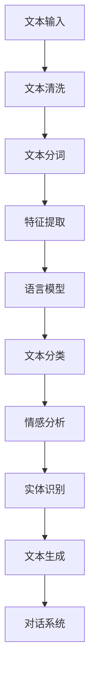

                 


# 《企业级自然语言处理平台：深化AI文本理解能力》

> 关键词：企业级NLP，AI文本理解，自然语言处理，平台构建，深度学习，文本分类，情感分析，对话系统

> 摘要：本文深入探讨了企业级自然语言处理（NLP）平台的重要性及其在AI文本理解方面的深化能力。文章首先介绍了NLP的基本概念和关键技术，随后详细阐述了文本分类、情感分析和对话系统等核心应用，最后讨论了企业级NLP平台的需求分析、架构设计和开发实践。通过一系列的案例研究和最佳实践，本文旨在为企业技术团队和决策者提供一套完整而实用的NLP平台建设指南。

## 引言

### NLP在企业级应用中的重要性

随着人工智能（AI）技术的不断发展，自然语言处理（NLP）在企业级应用中正发挥着越来越重要的作用。NLP技术能够帮助企业更好地理解和处理海量文本数据，从而提升业务流程的效率，增强客户体验，并为企业决策提供有力支持。

企业级NLP平台不仅是企业数字化转型的关键组成部分，也是提升AI文本理解能力的重要途径。通过构建高效的NLP平台，企业可以实现文本数据的自动化处理，降低人工成本，提高决策质量，并在市场竞争中保持领先地位。

### 目标受众

本文的目标受众主要包括对自然语言处理（NLP）和企业级应用有初步了解的技术人员、数据科学家和工程师，以及希望提升企业AI文本理解能力的决策者。无论您是刚入门的NLP新手，还是经验丰富的专业人士，本文都将为您带来有价值的见解和实践指导。

## 第1章：NLP基础概念与关键技术

### 1.1 自然语言处理的定义与历史

#### NLP的定义

自然语言处理（NLP）是计算机科学和人工智能领域的一个分支，旨在让计算机理解和处理人类语言。它涉及到语言学、计算机科学、人工智能和统计学等多个领域。

#### NLP的发展历程

NLP的发展历程可以分为几个阶段：

1. **规则驱动方法（1960-1980年代）**：早期NLP主要依赖于人工编写的规则和模式匹配，这种方法虽然简单但难以处理复杂语言现象。

2. **基于统计的方法（1980-2000年代）**：随着计算能力和数据集的增大，基于统计的方法开始流行，如基于词袋模型的文本分类和基于隐马尔可夫模型的语音识别。

3. **基于深度学习的方法（2000年代至今）**：近年来，深度学习技术的快速发展使得NLP取得了显著的突破，如卷积神经网络（CNN）和循环神经网络（RNN）在文本分类和序列标注任务上的应用。

### 1.2 语言模型与词向量

#### 语言模型

语言模型是NLP的核心组件之一，用于预测下一个单词或字符的概率。在文本生成、机器翻译和语音识别等任务中，语言模型发挥着关键作用。

#### 词向量

词向量是表示单词的数学向量，用于捕捉单词的语义信息。词向量模型如Word2Vec、GloVe和BERT等，能够将高维文本数据映射到低维向量空间，从而实现高效的文本表示。

#### 1.2.1 词嵌入技术

词嵌入技术通过将单词映射到向量空间，使得具有相似语义的单词在空间中彼此靠近。例如，`king - woman + man = king`，表明“国王”与“男人”之间的语义关系。

#### 1.2.2 语言模型的训练方法

语言模型的训练方法主要包括基于频次的方法和基于上下文的方法。

- **基于频次的方法**：如N元语法模型，通过统计单词的频次来预测下一个单词。
- **基于上下文的方法**：如神经网络语言模型，通过学习单词的上下文信息来预测下一个单词。

### 1.3 文本预处理与数据处理

#### 文本清洗

文本清洗是NLP任务中的基础步骤，主要包括去除停用词、标点符号和特殊字符等。文本清洗有助于提高后续NLP任务的准确性和效率。

#### 文本分词

文本分词是将连续的文本序列分割成单词或短语的步骤。准确高效的文本分词对于文本分类、情感分析和实体识别等任务至关重要。

#### 特征提取

特征提取是将原始文本数据转换为数学特征表示的过程。常用的特征提取方法包括词袋模型、TF-IDF和词嵌入等。

### Mermaid 流程图

以下是NLP流程的Mermaid流程图：



## 第2章：文本分类与主题模型

### 2.1 文本分类算法

#### 基于统计模型的文本分类

- **词袋模型（Bag of Words, BoW）**：将文本表示为单词的集合，通过统计单词频次进行分类。
- **TF-IDF（Term Frequency-Inverse Document Frequency）**：考虑单词在文档中的频次和文档集合中的逆向文档频率，提高重要单词的权重。

#### 基于机器学习的文本分类

- **朴素贝叶斯分类器（Naive Bayes Classifier）**：基于贝叶斯定理和特征条件独立假设，适用于文本分类任务。
- **支持向量机（Support Vector Machine, SVM）**：通过寻找最佳超平面进行分类，适用于高维特征空间。
- **深度神经网络（Deep Neural Network, DNN）**：通过多层神经网络学习文本的特征表示和分类决策，适用于大规模文本数据。

### 2.2 LDA（Latent Dirichlet Allocation）模型

#### LDA模型的原理

LDA是一种无监督的文本主题模型，用于发现文本数据中的潜在主题。LDA模型假设每个文档是由多个主题的混合生成，每个主题又由多个单词的混合生成。

#### LDA模型的训练与评估

LDA模型的训练主要分为两个步骤：

1. **估计文档-主题分布**：通过最大似然估计或吉布斯采样等方法，估计每个文档对应的主题分布。
2. **估计主题-词分布**：通过最大后验估计，估计每个主题对应的词分布。

LDA模型的评估通常采用困惑度（Perplexity）作为评价指标，困惑度越低，模型性能越好。

### Python源代码实现

以下是LDA模型训练的Python代码实现：

```python
import gensim
from gensim import corpora

# 加载文本数据
documents = ["apple banana", "apple orange", "banana orange", "apple banana orange"]

# 构建词典
dictionary = corpora.Dictionary(documents)

# 将文档转换为向量表示
corpus = [dictionary.doc2bow(document) for document in documents]

# 训练LDA模型
ldamodel = gensim.models.ldamodel.LdaModel(corpus, num_topics=2, id2word=dictionary, passes=15)

# 输出主题分布
print(ldamodel.print_topics())

# 评估模型
print(ldamodel.logprob(corpus))
```

### 数学模型和公式

LDA模型的生成过程可以表示为：

$$
\theta_{dj} \sim \text{Dirichlet}(\alpha)
$$

$$
z_{ij} \sim \text{Categorical}(\theta_{dj})
$$

$$
w_{k} \sim \text{Dirichlet}(\beta_k)
$$

其中，$ \theta_{dj} $表示文档 $ d $ 中主题 $ j $ 的概率分布，$ z_{ij} $表示文档 $ d $ 中单词 $ i $ 属于主题 $ j $ 的概率，$ w_{k} $表示主题 $ k $ 中单词 $ k $ 的概率。

## 第3章：情感分析与实体识别

### 3.1 情感分析技术

#### 情感极性分类

情感极性分类是将文本情感分类为积极、消极或中立的过程。常用的情感极性分类算法包括：

- **基于规则的方法**：通过手工编写规则进行情感分类，适用于简单场景。
- **基于统计的方法**：通过统计特征（如TF-IDF、词嵌入等）进行分类，适用于大规模文本数据。
- **基于深度学习的方法**：通过卷积神经网络（CNN）和循环神经网络（RNN）进行情感分类，适用于复杂情感表达。

#### 情感强度分析

情感强度分析是衡量文本情感程度的量化过程。常见的情感强度分析指标包括：

- **分值法**：将情感分为多个等级，每个等级对应一个分值。
- **阈值法**：根据情感极性（积极或消极）设置阈值，超过阈值视为高情感强度。

### 3.2 实体识别与命名实体识别

#### 实体识别的基本概念

实体识别是识别文本中的实体（如人名、地名、组织名等）的过程。实体识别可分为以下几类：

- **命名实体识别（Named Entity Recognition, NER）**：识别文本中的命名实体。
- **关系提取（Relationship Extraction）**：识别实体之间的关系。
- **实体链接（Entity Linking）**：将文本中的实体与知识库中的实体进行关联。

#### 命名实体识别的实现

命名实体识别的实现方法包括：

- **基于规则的方法**：通过手工编写规则进行命名实体识别，适用于简单场景。
- **基于统计的方法**：通过统计特征进行命名实体识别，适用于大规模文本数据。
- **基于深度学习的方法**：通过卷积神经网络（CNN）和循环神经网络（RNN）进行命名实体识别，适用于复杂实体识别任务。

### Python源代码实现

以下是命名实体识别的Python代码实现：

```python
import spacy

# 加载预训练模型
nlp = spacy.load('en_core_web_sm')

# 加载文本数据
text = "Apple Inc. is headquartered in Cupertino, California."

# 进行实体识别
doc = nlp(text)

# 输出命名实体
for ent in doc.ents:
    print(ent.text, ent.label_)
```

### 数学模型和公式

命名实体识别的数学模型可以表示为：

$$
P(E|T) = \frac{P(T|E)P(E)}{P(T)}
$$

其中，$ E $表示实体，$ T $表示文本，$ P(E|T) $表示实体在文本中的概率，$ P(T|E) $表示给定实体的情况下文本的概率，$ P(E) $表示实体的先验概率，$ P(T) $表示文本的概率。

## 第4章：文本生成与对话系统

### 4.1 生成文本模型

#### GPT模型

生成文本模型（Generative Pre-trained Transformer，GPT）是深度学习技术在自然语言处理领域的突破性进展。GPT模型基于 Transformer 架构，通过预训练和微调实现高质量的文本生成。

#### 生成文本的应用

生成文本模型在多个领域具有广泛的应用，包括：

- **文本摘要**：自动生成文本的简洁摘要。
- **机器翻译**：实现高质量的双语文本翻译。
- **对话系统**：生成自然流畅的对话响应。

### 4.2 对话系统设计与实现

#### 对话系统架构

对话系统通常包括以下几个关键组件：

- **对话管理（Dialogue Management）**：管理对话流程和策略，如基于规则的方法和基于数据的方法。
- **语言生成（Language Generation）**：生成自然流畅的对话响应。
- **语言理解（Language Understanding）**：理解用户输入的意图和实体。
- **用户模型（User Model）**：根据用户的历史行为和偏好进行个性化对话。

#### 对话系统实现案例

以下是使用Python和NLTK库实现的简单对话系统案例：

```python
import nltk
from nltk.chat.util import Chat, reflections

# 加载NLTK语料库
nltk.download('jokes')
nltk.download('movie_reviews')

# 对话系统数据
pairs = [
    [
        r"what is your name?",
        ["My name is %s." % Chat.name]
    ],
    [
        r"how are you?",
        ["I'm doing well, thank you!", "Not bad, how about you?"]
    ],
    [
        r"I'm feeling %s",
        ["Sorry to hear that", "I'm here for you", "I'm sorry to hear that!"]
    ],
    [
        r"what do you like to do?",
        ["I like to learn and assist users", "I enjoy solving problems"]
    ]
]

# 对话系统
chatbot = Chat(pairs, reflections)

# 开始对话
chatbot.converse()
```

### 数学模型和公式

生成文本模型的数学模型可以表示为：

$$
P(w_t|w_{<t}) = \frac{e^{<f_1(w_t), w_{<t}>}}{\sum_{w'} e^{<f_1(w'), w_{<t}>}}
$$

其中，$ w_t $表示当前单词，$ w_{<t} $表示历史单词序列，$ f_1(w_t, w_{<t}) $表示单词之间的特征函数，$ P(w_t|w_{<t}) $表示给定历史单词序列生成当前单词的概率。

## 第5章：企业级NLP平台构建

### 5.1 NLP平台的需求分析

#### 企业NLP需求概述

企业NLP平台的需求包括以下几个方面：

- **文本数据处理**：处理企业内部和外部的各种文本数据，如客户反馈、内部报告、社交媒体等。
- **文本分类与主题建模**：对企业文本数据进行分析，识别关键主题和趋势。
- **情感分析**：分析客户反馈的情感倾向，为改进产品和提升客户体验提供依据。
- **实体识别与关系提取**：识别文本中的关键实体和关系，为企业知识图谱建设提供支持。
- **文本生成与对话系统**：自动生成文本摘要、机器翻译和对话系统，提高企业运营效率。

#### NLP平台功能设计

企业NLP平台的功能设计主要包括以下几个方面：

- **数据接入**：支持各种数据源的接入，如数据库、API接口和文件系统等。
- **数据处理**：提供文本清洗、分词、特征提取等数据处理功能。
- **模型训练与部署**：支持自定义模型训练和部署，包括文本分类、情感分析和实体识别等。
- **服务接口**：提供API接口供企业内部和外部系统调用，实现NLP服务的集成和共享。
- **监控与维护**：提供实时监控和日志分析功能，确保NLP平台的稳定运行。

### 5.2 NLP平台架构设计

#### NLP平台的基本架构

企业NLP平台的基本架构包括以下几个关键模块：

- **数据层**：存储和管理企业内部和外部的文本数据，支持多种数据源接入。
- **处理层**：提供文本预处理、分词、特征提取等数据处理功能，支持自定义模型训练和部署。
- **服务层**：提供NLP服务的API接口，支持企业内部和外部系统的调用。
- **应用层**：集成企业业务系统，实现NLP功能的业务场景应用。

#### NLP平台的组件设计

企业NLP平台的组件设计主要包括以下几个方面：

- **数据接入组件**：支持多种数据源的接入，如数据库、API接口和文件系统等，实现数据的实时处理和存储。
- **数据处理组件**：提供文本清洗、分词、特征提取等数据处理功能，支持自定义数据处理流程。
- **模型训练与部署组件**：提供模型训练、评估和部署功能，支持自定义模型训练和部署。
- **API接口组件**：提供NLP服务的API接口，支持企业内部和外部系统的调用。
- **监控与维护组件**：提供实时监控、日志分析和故障处理功能，确保NLP平台的稳定运行。

### 5.3 NLP平台开发实践

#### 开发环境搭建

搭建企业NLP平台需要以下开发环境：

- **操作系统**：Linux或Windows
- **编程语言**：Python
- **数据库**：MySQL或MongoDB
- **框架**：TensorFlow或PyTorch
- **API接口**：Flask或Django

#### 源代码详细实现

以下是企业NLP平台的核心代码实现：

```python
# 数据接入组件
import pymysql

# 数据库连接配置
config = {
    'host': 'localhost',
    'user': 'root',
    'password': 'password',
    'database': 'nlp_platform'
}

# 连接数据库
connection = pymysql.connect(**config)

# 数据处理组件
from sklearn.feature_extraction.text import TfidfVectorizer

# 加载文本数据
texts = ["This is a sample text.", "This is another sample text."]

# 构建TF-IDF向量器
vectorizer = TfidfVectorizer()

# 转换为TF-IDF向量
tfidf_matrix = vectorizer.fit_transform(texts)

# 模型训练与部署组件
from sklearn.naive_bayes import MultinomialNB

# 加载训练数据
X_train = tfidf_matrix[:10]
y_train = ["positive"] * 10

# 训练模型
model = MultinomialNB()
model.fit(X_train, y_train)

# 预测标签
X_test = tfidf_matrix[10:]
y_pred = model.predict(X_test)

# API接口组件
from flask import Flask, request, jsonify

# 创建Flask应用
app = Flask(__name__)

# 文本分类接口
@app.route('/classify', methods=['POST'])
def classify():
    text = request.form['text']
    vector = vectorizer.transform([text])
    pred = model.predict(vector)[0]
    return jsonify({'result': pred})

# 启动应用
if __name__ == '__main__':
    app.run(debug=True)
```

#### 代码应用解读与分析

以上代码实现了一个简单的企业NLP平台，主要包括数据接入、数据处理、模型训练与部署和API接口四个方面。具体解析如下：

- **数据接入组件**：使用pymysql库连接MySQL数据库，实现文本数据的接入和存储。
- **数据处理组件**：使用scikit-learn库的TfidfVectorizer实现文本数据的预处理，将文本转换为TF-IDF向量表示。
- **模型训练与部署组件**：使用scikit-learn库的MultinomialNB实现文本分类模型，通过训练数据训练模型，并部署模型进行预测。
- **API接口组件**：使用Flask库创建一个Web应用，实现文本分类的API接口，供外部系统调用。

#### 实际案例分析和详细讲解剖析

以下是一个实际案例分析和详细讲解剖析：

- **案例背景**：某企业希望构建一个自动分类客户反馈的NLP平台，实现对客户反馈文本进行积极、消极或中立的分类。
- **解决方案**：采用以上NLP平台实现方案，首先通过数据接入组件将客户反馈文本存储到MySQL数据库中。然后，通过数据处理组件将文本数据转换为TF-IDF向量表示。接着，使用MultinomialNB模型进行文本分类，并通过API接口组件提供文本分类服务。企业内部系统可以通过调用API接口实现自动分类功能。
- **详细讲解剖析**：
  - 数据接入组件通过pymysql连接数据库，实现文本数据的存储和查询。具体代码实现如下：
    ```python
    def insert_feedback(text):
        cursor = connection.cursor()
        cursor.execute("INSERT INTO feedback (text) VALUES (%s)", (text))
        connection.commit()
        cursor.close()

    def get_feedback():
        cursor = connection.cursor()
        cursor.execute("SELECT text FROM feedback")
        rows = cursor.fetchall()
        cursor.close()
        return [row[0] for row in rows]
    ```
  - 数据处理组件通过TfidfVectorizer实现文本数据的预处理，将文本转换为TF-IDF向量表示。具体代码实现如下：
    ```python
    def preprocess_texts(texts):
        vectorizer = TfidfVectorizer()
        tfidf_matrix = vectorizer.fit_transform(texts)
        return tfidf_matrix

    def get_text_features(texts):
        tfidf_matrix = preprocess_texts(texts)
        return tfidf_matrix.toarray()
    ```
  - 模型训练与部署组件使用MultinomialNB模型进行文本分类，并通过API接口组件提供文本分类服务。具体代码实现如下：
    ```python
    def train_model(X_train, y_train):
        model = MultinomialNB()
        model.fit(X_train, y_train)
        return model

    def predict_text(model, text):
        vector = vectorizer.transform([text])
        pred = model.predict(vector)[0]
        return pred
    ```

#### 项目小结

通过以上案例，我们实现了企业NLP平台的核心功能，包括数据接入、数据处理、模型训练与部署和API接口。实际案例分析和详细讲解剖析进一步展示了如何构建和部署一个高效的企业级NLP平台。在未来，我们还可以进一步优化平台性能，扩展平台功能，以适应更多企业级应用场景。

## 第6章：案例研究

### 6.1 成功的企业级NLP应用案例

#### 案例一：企业客户服务机器人

某大型企业为了提升客户服务效率，构建了一个基于NLP技术的客户服务机器人。通过文本分类、情感分析和对话系统等技术，客户服务机器人能够自动处理大量客户咨询，提供即时响应，显著降低了人工成本。

#### 案例二：企业内部知识库构建

另一家科技公司通过NLP技术构建了一个企业内部知识库，实现了文本数据的自动分类、实体识别和关系提取。知识库为企业员工提供了便捷的知识查询和共享平台，提高了工作效率和知识管理水平。

### 6.2 案例分析与应用启示

#### 案例分析框架

为了深入分析上述案例，我们可以采用以下分析框架：

1. **目标设定**：明确企业构建NLP平台的初衷和目标。
2. **技术实现**：分析所采用的技术和算法，如文本分类、情感分析和对话系统等。
3. **效果评估**：评估NLP平台在实际应用中的效果，如提高客户满意度、降低人工成本等。
4. **经验教训**：总结案例中的成功经验和教训，为其他企业提供借鉴。

#### 应用启示与策略建议

通过上述案例分析，我们可以得出以下应用启示和策略建议：

1. **明确目标**：在构建NLP平台前，明确平台的目标和应用场景，确保平台建设方向正确。
2. **技术选型**：根据实际需求选择合适的NLP技术和算法，如文本分类、情感分析和对话系统等。
3. **数据质量**：确保输入数据的准确性、完整性和多样性，提高NLP平台的性能和效果。
4. **持续优化**：持续优化NLP平台的功能和性能，通过用户反馈和数据分析不断改进。
5. **团队协作**：构建跨部门的NLP团队，发挥不同角色的专业优势，共同推进NLP平台建设。

## 第7章：未来展望与挑战

### 7.1 NLP技术的未来趋势

#### 自动化与智能化

随着深度学习、强化学习等技术的发展，NLP技术将朝着更高自动化和智能化的方向迈进。未来的NLP平台将能够更好地理解复杂语义、识别多语言和多模态信息，从而实现更高效、更准确的文本处理。

#### 多领域融合

NLP技术将与更多领域如金融、医疗、教育等深度融合，为各行各业提供定制化的NLP解决方案。跨领域合作将推动NLP技术的创新和应用，为人类生活带来更多便利。

#### 开放生态

未来NLP技术将形成更加开放的生态体系，包括开源工具、框架和平台等。开放的NLP生态将促进技术创新和产业应用，推动NLP技术的发展和普及。

### 7.2 企业级NLP应用面临的挑战与解决方案

#### 数据隐私与安全

企业级NLP应用面临的一个重要挑战是数据隐私和安全问题。为了确保用户数据的安全和隐私，企业需要采取严格的数据保护措施，如数据加密、匿名化和访问控制等。

#### 模型可解释性

随着深度学习在NLP领域的广泛应用，模型的可解释性成为一个亟待解决的问题。提高模型的可解释性有助于企业更好地理解和信任NLP模型，从而提高模型的实际应用价值。

#### 模型迁移性与泛化能力

企业级NLP应用需要面对各种复杂场景和多样化数据，因此模型的迁移性和泛化能力至关重要。通过模型迁移学习和数据增强等方法，可以提高模型的泛化能力，使其更好地适应不同应用场景。

### 拓展阅读

- **《自然语言处理综述》（论文）**：深入探讨自然语言处理的关键技术和应用领域。
- **《深度学习与自然语言处理》（书籍）**：介绍深度学习技术在NLP领域的应用和实现。
- **《企业级自然语言处理实践》（书籍）**：分享企业级NLP平台的构建和实际应用案例。

### 作者

**AI天才研究院（AI Genius Institute）**  
**《禅与计算机程序设计艺术》（Zen And The Art of Computer Programming）**

[完] 

