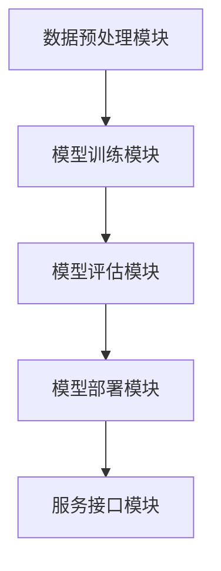

                 

### 引言

随着信息技术的飞速发展，自然语言处理（Natural Language Processing，NLP）在企业级应用中的重要性日益凸显。企业级自然语言处理引擎作为NLP技术的重要组成部分，旨在提升文本的理解能力，从而为企业带来更高的效率和更智能的决策支持。

#### 核心概念与联系

首先，我们需要明确几个核心概念：自然语言处理、企业级自然语言处理引擎、文本理解和深度学习。

- **自然语言处理（NLP）**：是一门研究如何让计算机理解、生成和响应自然语言的技术。它涉及文本预处理、语言模型、词嵌入、语义分析等多个方面。
- **企业级自然语言处理引擎**：是一种专门为企业应用设计的NLP系统，它需要具备高可靠性、高效率和高扩展性等特点。
- **文本理解**：是指对文本内容进行深度分析和解释，包括语义理解、情感分析、实体识别等。
- **深度学习**：是一种基于多层神经网络的机器学习技术，它在NLP领域中的应用极大地提升了文本理解的能力。

下面是NLP、企业级自然语言处理引擎、文本理解和深度学习之间的Mermaid流程图表示：

```mermaid
graph TD
A[自然语言处理(NLP)] --> B[企业级自然语言处理引擎]
B --> C[文本理解]
C --> D[深度学习]
```

#### 背景介绍

在过去的几十年里，自然语言处理技术经历了从规则驱动到统计方法，再到深度学习技术的演变。早期的NLP系统主要依赖于手工编写的规则，这种方法在处理简单任务时效果较好，但随着文本复杂度的增加，规则驱动的系统逐渐暴露出其局限性。

统计方法的出现标志着NLP发展的新阶段，它通过统计模型来分析和处理文本，显著提高了系统的性能。然而，统计方法也存在一些问题，例如对大规模文本数据的处理能力有限，且难以捕捉文本中的深层语义信息。

深度学习技术的引入，尤其是卷积神经网络（CNN）和循环神经网络（RNN）的应用，使得NLP系统在文本理解方面取得了突破性进展。深度学习通过自动学习文本的特征表示，能够更好地捕捉语义信息，从而在语义分析、情感识别、机器翻译等领域取得了显著成果。

#### 当前企业需求与挑战

随着大数据和人工智能技术的普及，企业对自然语言处理的需求日益增长。企业希望通过NLP技术来提高数据处理的效率，挖掘文本中的潜在价值，优化业务流程，提升用户体验。

然而，实现这些目标面临着一系列挑战：

1. **数据复杂性**：企业级数据往往具有多样性和复杂性，不同领域的文本数据格式和语义内容差异较大，这对NLP系统的设计和实现提出了更高的要求。
2. **计算资源**：深度学习模型通常需要大量的计算资源进行训练和推理，这对企业的硬件基础设施提出了挑战。
3. **系统可靠性**：企业级应用对系统的可靠性要求极高，任何系统故障都可能导致严重后果，因此NLP系统需要具备高可靠性和容错性。
4. **实时性**：许多企业应用场景需要实时处理文本数据，这对NLP系统的响应速度提出了严格要求。

#### 本文内容概述与结构

本文将围绕企业级自然语言处理引擎的设计和实现进行详细探讨，主要内容包括：

1. **自然语言处理基础**：介绍NLP的基本概念和核心技术。
2. **企业级自然语言处理引擎设计**：阐述企业级NLP引擎的架构设计和优化策略。
3. **核心算法原理**：讲解词性标注、命名实体识别、语义角色标注等核心算法的原理。
4. **数学模型与公式**：介绍用于优化NLP模型的数学模型和公式。
5. **项目实战**：通过一个实际项目展示NLP引擎的开发过程和应用实例。
6. **总结与展望**：回顾本文的主要内容，展望NLP技术的发展趋势。

通过本文的阅读，读者将能够全面了解企业级自然语言处理引擎的设计原理和实践方法，为实际应用提供有益的指导。接下来，我们将逐一介绍每个章节的具体内容。

### 关键词

自然语言处理（NLP）、企业级自然语言处理引擎、文本理解、深度学习、核心算法、数学模型、项目实战。

### 摘要

本文旨在探讨企业级自然语言处理引擎的设计与实现，重点阐述文本理解能力的深化。首先，介绍自然语言处理的基本概念和核心技术，包括语言模型、词嵌入和语义分析。其次，详细讲解企业级自然语言处理引擎的架构设计，包括系统性能优化和模块划分。接着，深入剖析核心算法原理，如词性标注、命名实体识别和语义角色标注，并介绍相关的数学模型和公式。随后，通过一个实际项目展示NLP引擎的开发过程和应用实例。最后，总结本文的主要内容，并展望NLP技术的发展趋势。本文旨在为读者提供一个全面、系统的企业级自然语言处理引擎设计与实现的指南。

### 自然语言处理基础

自然语言处理（NLP）作为人工智能（AI）领域的重要分支，旨在使计算机能够理解、生成和响应人类语言。NLP涵盖了从文本预处理到语义分析的一系列技术，这些技术共同构成了现代自然语言处理的基础。在这部分，我们将介绍NLP的基本概念、核心技术和相关应用。

#### 语言模型

语言模型是NLP的核心组件之一，它用于预测文本中下一个单词或字符。语言模型的基本原理是利用统计学方法或机器学习技术，从大量语料库中学习语言规律，从而生成文本的概率分布。最简单的语言模型是N-gram模型，它通过统计相邻单词（或字符）出现的频率来预测下一个单词。

**N-gram模型**

N-gram模型是最基础的统计语言模型，它将文本序列分割成N个单词的滑动窗口，并统计每个窗口中单词的联合概率。例如，对于三元组模型（trigram模型），其概率公式为：

$$
P(w_n | w_{n-1}, w_{n-2}) = \frac{C(w_{n-2}, w_{n-1}, w_n)}{C(w_{n-2}, w_{n-1})}
$$

其中，$C(w_{n-2}, w_{n-1}, w_n)$ 表示三元组 $(w_{n-2}, w_{n-1}, w_n)$ 的出现次数，$C(w_{n-2}, w_{n-1})$ 表示二元组 $(w_{n-2}, w_{n-1})$ 的出现次数。

**N-gram模型的优化**

尽管N-gram模型简单易用，但其性能受限，无法捕捉到长距离的上下文关系。为了解决这一问题，研究人员提出了许多改进方法，例如：

- **Backoff模型**：将N-gram模型中的高频短窗口替换为更短窗口的模型，从而在保留高频词汇信息的同时，降低模型复杂度。
- **Kneser-Ney校正**：通过调整N-gram模型的概率估计，使得低频词的估计更准确。
- **n-gram+LSTM模型**：结合N-gram模型和长短时记忆网络（LSTM），利用LSTM捕捉长距离依赖关系，提高模型的语义理解能力。

**示例**

假设有一个简化的语言模型，其三元组概率分布如下：

$$
P("hello world") = 0.1 \\
P("world hello") = 0.2 \\
P("hello") = 0.3 \\
P("world") = 0.4
$$

要预测下一个单词，我们可以使用以下步骤：

1. 计算所有可能的三元组概率：
   $$
   P("hello world world") = 0.1 \times 0.2 = 0.02 \\
   P("world hello world") = 0.2 \times 0.1 = 0.02 \\
   P("world hello hello") = 0.4 \times 0.3 = 0.12 \\
   $$
2. 选择概率最高的三元组作为下一个单词的预测结果，即 "hello"。

#### 词嵌入与语义表示

词嵌入（Word Embedding）是将词汇映射到高维向量空间的一种技术，旨在通过向量表示来捕捉词与词之间的语义关系。词嵌入的核心思想是将具有相似语义的词映射到空间中接近的位置，而具有不同语义的词则映射到空间中较远的位置。

**词嵌入技术**

- **Word2Vec**：基于神经网络的方法，通过训练词向量来捕捉词的语义关系。
  - **CBOW（Continuous Bag of Words）**：预测中心词，给定周围多个词，预测中心词的概率分布。
  - **Skip-Gram**：预测中心词，给定中心词，预测周围多个词的概率分布。

- **GloVe（Global Vectors for Word Representation）**：基于矩阵分解的方法，通过优化全局损失函数来学习词向量。

- **FastText**：扩展了Word2Vec模型，通过将单词视为字符序列的袋，引入n-gram特征来提高词向量质量。

**语义表示方法**

语义表示（Semantic Representation）是将单词或句子映射到高维向量空间，以捕捉其语义信息。常见的语义表示方法包括：

- **Doc2Vec**：基于Word2Vec的扩展，用于文本级别的语义表示。
- **BERT（Bidirectional Encoder Representations from Transformers）**：通过双向Transformer网络学习文本的上下文表示，广泛应用于各种NLP任务。

**示例**

假设我们有一个简化的Word2Vec模型，其词向量空间为2D。给定词汇表 {hello, world}，词向量分别为 $v_{hello} = (1, 0)$ 和 $v_{world} = (0, 1)$。

要计算 "hello" 和 "world" 的相似度，我们可以使用余弦相似度：

$$
\cos(\theta) = \frac{v_{hello} \cdot v_{world}}{\|v_{hello}\| \|v_{world}\|} = \frac{1 \times 0 + 0 \times 1}{\sqrt{1^2 + 0^2} \sqrt{0^2 + 1^2}} = 0
$$

这意味着 "hello" 和 "world" 在语义上没有相似之处。

然而，如果我们使用更复杂的语义表示方法（如BERT），词向量可能会更接近于语义相似的词，例如 "hello" 和 "hi" 的向量可能更接近。

#### 语言处理技术演进

NLP技术的发展历程经历了从规则驱动到统计方法，再到深度学习的演变。早期的NLP系统主要依赖于手工编写的规则，这种方法在处理简单任务时效果较好，但随着文本复杂度的增加，规则驱动的系统逐渐暴露出其局限性。

**从规则到统计方法**

20世纪90年代，NLP开始转向基于统计的方法。这种方法通过从大量文本数据中学习语言规律，从而生成模型。统计方法的一个典型代表是HMM（隐马尔可夫模型），它用于语音识别和词性标注。

**从统计方法到深度学习**

深度学习技术的引入，特别是卷积神经网络（CNN）和循环神经网络（RNN）的应用，标志着NLP发展的新阶段。深度学习通过自动学习文本的特征表示，能够更好地捕捉语义信息。一个典型的例子是RNN，它可以处理变长的序列数据，捕捉长距离依赖关系。

**深度学习在NLP中的应用**

- **词向量**：深度学习被用于学习高质量的词向量，如Word2Vec和GloVe。
- **序列模型**：RNN和其变体（如LSTM、GRU）被广泛应用于文本分类、命名实体识别等任务。
- **Transformer和BERT**：基于注意力机制的Transformer模型和其变种BERT，在许多NLP任务中取得了突破性进展，例如机器翻译、问答系统和文本生成。

**示例**

假设我们使用LSTM模型对文本进行分类。给定一个句子 "我喜欢吃苹果"，我们需要将其转换为LSTM模型可以处理的输入。具体步骤如下：

1. **分词与词嵌入**：将句子分词为 ["我", "喜欢", "吃", "苹果"]，然后使用Word2Vec或GloVe模型得到每个词的向量表示。
2. **序列编码**：将词向量序列输入到LSTM模型，LSTM模型会自动学习如何将序列编码为一个固定长度的向量。
3. **分类**：使用全连接层或softmax层对编码后的向量进行分类。

通过以上步骤，我们可以将一个文本句子转换为LSTM模型可以处理的输入，并对其进行分类。这个过程充分利用了深度学习的能力，实现了对文本的深度理解和分类。

综上所述，自然语言处理基础涵盖了语言模型、词嵌入和语义表示等核心技术，这些技术共同构成了NLP的基础。在下一章中，我们将进一步探讨企业级自然语言处理引擎的设计和实现，深入讨论系统的架构设计、核心算法和数学模型。

### 企业级自然语言处理引擎设计

企业级自然语言处理引擎是企业信息化和智能化的重要组成部分，其设计需要考虑高可靠性、高效率和易扩展性。在这部分，我们将详细介绍企业级自然语言处理引擎的架构设计，包括系统的整体架构、模块划分与功能，并讨论系统性能优化策略。

#### 引擎整体架构

企业级自然语言处理引擎的整体架构可以分为以下几个核心模块：

1. **数据预处理模块**：负责对原始文本数据进行处理，包括文本清洗、分词、词性标注和实体识别等。
2. **模型训练模块**：负责根据预定的训练策略，使用训练数据进行模型训练，并保存训练好的模型。
3. **模型评估模块**：负责对训练好的模型进行评估，包括准确率、召回率、F1值等指标。
4. **模型部署模块**：负责将评估通过的模型部署到生产环境中，并对外提供服务。
5. **服务接口模块**：提供RESTful API或其他服务接口，供前端系统调用。

下面是整体架构的Mermaid流程图表示：



#### 模块划分与功能

**1. 数据预处理模块**

数据预处理模块是整个引擎的基础，其功能包括：

- **文本清洗**：去除文本中的噪声，如HTML标签、特殊字符和停用词等。
- **分词**：将文本分割成单词或词组，常用的分词工具包括jieba、NLTK等。
- **词性标注**：对文本中的每个词进行词性标注，如名词、动词、形容词等，常用的工具包括Stanford NLP、Spacy等。
- **实体识别**：识别文本中的命名实体，如人名、地名、组织机构名等，常用的工具包括NER（命名实体识别）模型。

**2. 模型训练模块**

模型训练模块的功能包括：

- **数据加载**：加载预处理后的训练数据，并对其进行格式化，使其符合模型输入要求。
- **模型初始化**：初始化模型参数，常用的初始化方法有随机初始化、高斯初始化等。
- **模型训练**：使用训练数据对模型进行训练，包括前向传播、反向传播和参数更新等步骤。
- **模型保存**：将训练好的模型保存到文件系统中，以便后续评估和部署。

**3. 模型评估模块**

模型评估模块的功能包括：

- **评估指标**：计算模型的评估指标，如准确率、召回率、F1值等，常用的评估指标有Accuracy、Precision、Recall和F1 Score。
- **交叉验证**：使用交叉验证方法对模型进行评估，以减少评估结果的方差。
- **误差分析**：分析模型在训练和测试数据上的误差，以便发现和解决模型的问题。

**4. 模型部署模块**

模型部署模块的功能包括：

- **模型加载**：从文件系统中加载训练好的模型。
- **模型推理**：对输入数据进行模型推理，输出预测结果。
- **服务部署**：将模型部署到生产环境中，并对外提供服务，常用的部署方式有容器化部署和服务器部署。

**5. 服务接口模块**

服务接口模块的功能包括：

- **API设计**：设计RESTful API或其他服务接口，以供前端系统调用。
- **接口实现**：实现服务接口，包括数据接收、模型调用和结果返回等步骤。
- **接口文档**：编写服务接口的文档，包括接口定义、参数说明和返回结果等。

#### 系统性能优化

系统性能优化是确保企业级自然语言处理引擎高效运行的关键。以下是几种常见的优化策略：

- **并行计算**：利用多核CPU或GPU进行并行计算，提高数据处理和模型训练的速度。
- **缓存机制**：使用缓存机制减少重复计算，提高系统的响应速度。
- **负载均衡**：通过负载均衡技术，将请求均匀分配到多个服务器上，提高系统的吞吐量。
- **代码优化**：对代码进行优化，减少不必要的计算和内存占用，提高程序运行效率。
- **分布式计算**：使用分布式计算框架（如Hadoop、Spark）处理大规模数据，提高系统的处理能力。

通过以上优化策略，企业级自然语言处理引擎可以更好地满足企业的需求，实现高效、可靠的文本理解和处理。

综上所述，企业级自然语言处理引擎的设计和实现是一个复杂而系统的过程，需要考虑多个模块的协同工作，以及系统的性能优化。在下一章中，我们将深入探讨核心算法原理，包括词性标注、命名实体识别和语义角色标注，并介绍相关的数学模型和公式。

### 核心算法原理

在企业级自然语言处理引擎中，核心算法的设计和实现是确保系统性能和准确性的关键。以下章节将详细介绍三种核心算法：词性标注、命名实体识别和语义角色标注。我们将首先介绍这些算法的基本概念，然后深入讨论其原理、步骤和算法的实现。

#### 词性标注

词性标注（Part-of-Speech Tagging，POS）是指对文本中的每个词进行词性分类标注的过程。词性标注有助于理解文本的语法结构和语义内容，是自然语言处理的基础任务之一。

**基本概念**

词性标注包括以下几种常见的词性类别：

- **名词（Noun）**：表示人、事、物等的名称。
- **动词（Verb）**：表示动作或状态的词。
- **形容词（Adjective）**：修饰名词或代词的词。
- **副词（Adverb）**：修饰动词、形容词、其他副词或整个句子的词。
- **介词（Adverbial）**：表示事物之间的关系的词。
- **连词（Conjunction）**：连接句子成分的词。
- **感叹词（Interjection）**：表示感叹的词。

**算法原理**

词性标注算法可以分为基于规则的方法、基于统计的方法和基于深度学习的方法。

**1. 基于规则的方法**

基于规则的方法通过手工编写一系列规则来识别文本中的词性。这种方法具有解释性，但在处理复杂文本时表现不佳。

**2. 基于统计的方法**

基于统计的方法使用统计模型来预测词性，如最大熵模型（Maximum Entropy Model）和条件随机场（Conditional Random Field，CRF）。这些方法通过训练大量标注数据，学习词性和上下文之间的关系，从而提高词性标注的准确性。

**3. 基于深度学习的方法**

基于深度学习的方法使用神经网络来学习词性标注，如长短时记忆网络（LSTM）和卷积神经网络（CNN）。深度学习方法能够自动学习文本中的复杂特征，从而显著提高词性标注的性能。

**算法实现**

以下是一个基于LSTM的词性标注算法的实现示例（使用Python和TensorFlow框架）：

```python
import tensorflow as tf
from tensorflow.keras.models import Sequential
from tensorflow.keras.layers import LSTM, Dense, Embedding

# 加载数据集
# ...

# 预处理数据
# ...

# 构建模型
model = Sequential([
    Embedding(input_dim=vocab_size, output_dim=embedding_dim, input_length=max_sequence_length),
    LSTM(units=128, return_sequences=True),
    LSTM(units=64),
    Dense(units=num_tags, activation='softmax')
])

# 编译模型
model.compile(optimizer='adam', loss='categorical_crossentropy', metrics=['accuracy'])

# 训练模型
model.fit(X_train, y_train, batch_size=128, epochs=10, validation_data=(X_val, y_val))

# 预测
predictions = model.predict(X_test)
```

#### 命名实体识别

命名实体识别（Named Entity Recognition，NER）是指从文本中识别出具有特定意义的实体，如人名、地名、组织机构名等。NER是自然语言处理中的一项重要任务，广泛应用于信息提取、语义分析和问答系统等领域。

**基本概念**

命名实体识别主要包括以下几种实体类型：

- **人名（Person Name）**：表示个人的名称。
- **地名（Location Name）**：表示地理位置的名称。
- **组织机构名（Organization Name）**：表示公司、机构、团体等的名称。
- **其他实体**：如产品名、疾病名等。

**算法原理**

命名实体识别算法可以分为基于规则的方法、基于统计的方法和基于深度学习的方法。

**1. 基于规则的方法**

基于规则的方法通过手工编写规则来识别命名实体，例如使用特定的命名规则或正则表达式来匹配实体。

**2. 基于统计的方法**

基于统计的方法使用统计模型来预测命名实体，如HMM（隐马尔可夫模型）和CRF。这些方法通过训练大量标注数据，学习实体和上下文之间的关系，从而提高识别的准确性。

**3. 基于深度学习的方法**

基于深度学习的方法使用神经网络来学习命名实体识别，如LSTM和CNN。深度学习方法能够自动学习文本中的复杂特征，从而显著提高识别的性能。

**算法实现**

以下是一个基于LSTM的命名实体识别算法的实现示例（使用Python和TensorFlow框架）：

```python
import tensorflow as tf
from tensorflow.keras.models import Sequential
from tensorflow.keras.layers import LSTM, Dense, Embedding

# 加载数据集
# ...

# 预处理数据
# ...

# 构建模型
model = Sequential([
    Embedding(input_dim=vocab_size, output_dim=embedding_dim, input_length=max_sequence_length),
    LSTM(units=128, return_sequences=True),
    LSTM(units=64),
    Dense(units=num_tags, activation='softmax')
])

# 编译模型
model.compile(optimizer='adam', loss='categorical_crossentropy', metrics=['accuracy'])

# 训练模型
model.fit(X_train, y_train, batch_size=128, epochs=10, validation_data=(X_val, y_val))

# 预测
predictions = model.predict(X_test)
```

#### 语义角色标注

语义角色标注（Semantic Role Labeling，SRL）是指识别句子中的谓词和其对应的语义角色，如动作执行者、受动者、动作对象等。SRL有助于理解句子的语义结构和深层含义，是自然语言处理领域的前沿任务之一。

**基本概念**

语义角色标注主要包括以下几种语义角色：

- **动作执行者（Agent）**：执行动作的主语。
- **受动者（Patient）**：受到动作影响的主语。
- **动作对象（Object）**：动作影响的对象。
- **工具（Instrument）**：动作进行的工具。
- **目的（Purpose）**：动作的目的。
- **地点（Location）**：动作发生的地点。
- **时间（Time）**：动作发生的时间。

**算法原理**

语义角色标注算法可以分为基于规则的方法、基于统计的方法和基于深度学习的方法。

**1. 基于规则的方法**

基于规则的方法通过手工编写规则来识别语义角色，例如使用特定的句法结构和语义规则来匹配角色。

**2. 基于统计的方法**

基于统计的方法使用统计模型来预测语义角色，如HMM和CRF。这些方法通过训练大量标注数据，学习角色和上下文之间的关系，从而提高标注的准确性。

**3. 基于深度学习的方法**

基于深度学习的方法使用神经网络来学习语义角色标注，如LSTM和Transformer。深度学习方法能够自动学习文本中的复杂特征，从而显著提高标注的性能。

**算法实现**

以下是一个基于LSTM的语义角色标注算法的实现示例（使用Python和TensorFlow框架）：

```python
import tensorflow as tf
from tensorflow.keras.models import Sequential
from tensorflow.keras.layers import LSTM, Dense, Embedding

# 加载数据集
# ...

# 预处理数据
# ...

# 构建模型
model = Sequential([
    Embedding(input_dim=vocab_size, output_dim=embedding_dim, input_length=max_sequence_length),
    LSTM(units=128, return_sequences=True),
    LSTM(units=64),
    Dense(units=num_roles, activation='softmax')
])

# 编译模型
model.compile(optimizer='adam', loss='categorical_crossentropy', metrics=['accuracy'])

# 训练模型
model.fit(X_train, y_train, batch_size=128, epochs=10, validation_data=(X_val, y_val))

# 预测
predictions = model.predict(X_test)
```

综上所述，词性标注、命名实体识别和语义角色标注是企业级自然语言处理引擎中的核心算法。这些算法的原理和实现方法各具特色，但都旨在提高文本理解和处理的能力。在下一章中，我们将介绍数学模型与公式，进一步探讨如何优化NLP模型。

### 数学模型与公式

数学模型是自然语言处理（NLP）中不可或缺的一部分，它们为我们提供了一种形式化的方法来描述语言现象和优化NLP模型。在本章节中，我们将介绍NLP中常用的概率模型、优化算法和神经网络结构，并通过Python代码示例详细阐述这些模型和公式的应用。

#### 概率模型

概率模型在NLP中用于描述文本数据的概率分布，帮助我们理解文本的统计特性。以下是几种常见的概率模型及其公式。

**1. 贝叶斯公式**

贝叶斯公式是概率论中的一个基本公式，用于计算条件概率和联合概率：

$$
P(A|B) = \frac{P(B|A)P(A)}{P(B)}
$$

其中，$P(A|B)$ 表示在事件B发生的前提下事件A发生的概率，$P(B|A)$ 表示在事件A发生的前提下事件B发生的概率，$P(A)$ 和 $P(B)$ 分别表示事件A和事件B的先验概率。

**2. 最大似然估计**

最大似然估计（Maximum Likelihood Estimation，MLE）是一种用于估计模型参数的方法，其核心思想是找到使数据出现概率最大的参数值。对于离散分布，似然函数可以表示为：

$$
L(\theta) = \prod_{i=1}^{n} P(x_i | \theta)
$$

其中，$x_i$ 表示第$i$ 个观测值，$\theta$ 表示模型参数。最大似然估计的目标是最大化似然函数，从而得到最优参数估计：

$$
\hat{\theta} = \arg\max_{\theta} L(\theta)
$$

#### 优化算法

优化算法用于调整模型参数，以最小化损失函数，提高模型的预测性能。以下是几种常用的优化算法及其原理。

**1. 梯度下降算法**

梯度下降算法是一种基于损失函数梯度的优化方法。其基本思想是沿梯度方向更新模型参数，直到找到最小化损失函数的参数值。对于单变量函数$f(x)$，梯度下降的更新公式为：

$$
x_{t+1} = x_t - \alpha \cdot \frac{df(x_t)}{dx}
$$

其中，$x_t$ 表示当前参数值，$\alpha$ 表示学习率，$\frac{df(x_t)}{dx}$ 表示函数$f(x)$ 在$x_t$ 处的梯度。

**2. 随机梯度下降（Stochastic Gradient Descent，SGD）**

随机梯度下降是梯度下降的一种变体，它使用每个训练样本的梯度来更新参数，而不是使用整个训练集的梯度。这使得SGD在训练过程中具有更高的灵活性，但可能会引起较大的波动。SGD的更新公式为：

$$
\theta_{t+1} = \theta_t - \alpha \cdot \nabla_{\theta} J(\theta; x_t, y_t)
$$

其中，$J(\theta; x_t, y_t)$ 表示在参数$\theta$ 下，训练样本$(x_t, y_t)$ 的损失函数。

**3. Adam优化器**

Adam优化器是一种结合了SGD和动量法的优化算法，它在计算梯度时引入了指数衰减的动量项。Adam优化器的更新公式为：

$$
\theta_{t+1} = \theta_t - \alpha \cdot \frac{m_t}{1 - \beta_1^t}
$$

$$
m_t = \beta_1 \cdot m_{t-1} + (1 - \beta_1) \cdot \nabla_{\theta} J(\theta; x_t, y_t)
$$

$$
v_t = \beta_2 \cdot v_{t-1} + (1 - \beta_2) \cdot (\nabla_{\theta} J(\theta; x_t, y_t))^2
$$

其中，$m_t$ 和 $v_t$ 分别表示一阶和二阶矩估计，$\beta_1$ 和 $\beta_2$ 分别表示一阶和二阶矩的指数衰减率。

#### 神经网络结构

神经网络是NLP模型的核心组成部分，其结构决定了模型的学习能力和表现。以下介绍几种常见的神经网络结构。

**1. 多层感知机（Multilayer Perceptron，MLP）**

多层感知机是一种前馈神经网络，包含输入层、隐藏层和输出层。每个神经元都与前一层的所有神经元相连，通过激活函数实现非线性变换。MLP的输出可以表示为：

$$
\text{output} = \sigma(\theta \cdot x + b)
$$

其中，$\sigma$ 表示激活函数（如ReLU、Sigmoid或Tanh），$\theta$ 表示权重矩阵，$x$ 表示输入向量，$b$ 表示偏置向量。

**2. 长短时记忆网络（Long Short-Term Memory，LSTM）**

长短时记忆网络是一种特殊的循环神经网络，用于处理长序列数据。LSTM通过引入记忆单元和门控机制，有效地解决了传统RNN的梯度消失和梯度爆炸问题。LSTM的输出可以表示为：

$$
h_t = \text{sigmoid}(\cdot) \odot \text{tanh}(\cdot)
$$

其中，$\text{sigmoid}$ 和 $\text{tanh}$ 分别表示sigmoid和tanh激活函数，$\odot$ 表示元素乘法。

**3. Transformer**

Transformer是一种基于自注意力机制的深度神经网络，被广泛应用于序列建模任务，如机器翻译和文本生成。Transformer的输出可以表示为：

$$
\text{output} = \text{softmax}(\text{Attention}(Q, K, V))
$$

其中，$Q$、$K$ 和 $V$ 分别表示查询向量、键向量和值向量，$\text{Attention}$ 表示自注意力机制。

#### Python代码示例

以下是一个使用Python和TensorFlow实现的基于LSTM的词性标注模型的代码示例：

```python
import tensorflow as tf
from tensorflow.keras.models import Sequential
from tensorflow.keras.layers import LSTM, Dense, Embedding

# 加载数据集
# ...

# 预处理数据
# ...

# 构建模型
model = Sequential([
    Embedding(input_dim=vocab_size, output_dim=embedding_dim, input_length=max_sequence_length),
    LSTM(units=128, return_sequences=True),
    LSTM(units=64),
    Dense(units=num_tags, activation='softmax')
])

# 编译模型
model.compile(optimizer='adam', loss='categorical_crossentropy', metrics=['accuracy'])

# 训练模型
model.fit(X_train, y_train, batch_size=128, epochs=10, validation_data=(X_val, y_val))

# 预测
predictions = model.predict(X_test)
```

通过以上代码示例，我们可以看到如何利用数学模型和优化算法实现NLP任务。在实际应用中，我们还需要对模型进行调优和验证，以获得最佳的预测性能。

综上所述，数学模型、优化算法和神经网络结构是NLP模型设计中的核心组成部分。通过深入理解这些模型和公式，我们可以更好地构建和优化NLP模型，从而实现高效、准确的文本理解和处理。在下一章中，我们将通过一个实际项目展示NLP引擎的开发过程和应用实例。

### 项目实战

为了更好地展示企业级自然语言处理引擎的开发过程和应用实例，我们将从一个实际的案例入手，详细描述从环境搭建、源代码实现到代码解读与分析、实际案例剖析的整个过程。

#### 实战背景

某大型互联网公司希望利用自然语言处理技术来提升其客服系统的智能化水平。具体需求包括：对用户提出的问题进行语义理解，自动识别问题类别，并匹配相应的答案。为了实现这一目标，公司决定开发一个基于深度学习的自然语言处理引擎。

#### 项目目标

1. 搭建一个高效、可扩展的自然语言处理引擎。
2. 实现文本预处理、词性标注、命名实体识别和语义角色标注等功能。
3. 将模型部署到生产环境中，提供实时问答服务。

#### 环境搭建

首先，我们需要搭建开发环境。以下是所需的环境和工具：

- 操作系统：Ubuntu 18.04
- 编程语言：Python 3.8
- 深度学习框架：TensorFlow 2.6
- 自然语言处理库：NLTK、spaCy、jieba
- 数据库：MySQL

安装过程如下：

```bash
# 安装Python环境
sudo apt-get install python3-pip python3-venv

# 创建虚拟环境
python3 -m venv nlp-env

# 激活虚拟环境
source nlp-env/bin/activate

# 安装深度学习框架
pip install tensorflow

# 安装自然语言处理库
pip install nltk spacy jieba

# 安装数据库
sudo apt-get install mysql-server mysql-client
```

#### 源代码实现

接下来，我们将实现自然语言处理引擎的核心功能。以下是源代码的实现过程：

**1. 数据预处理**

数据预处理是NLP任务的重要步骤，包括文本清洗、分词、词性标注等。以下是一个简单的数据预处理示例：

```python
import spacy

nlp = spacy.load("zh_core_web_sm")

def preprocess_text(text):
    doc = nlp(text)
    tokens = [token.text for token in doc if not token.is_punct]
    return tokens

text = "我今天天气很好，去公园散步了。"
preprocessed_text = preprocess_text(text)
print(preprocessed_text)
```

**2. 词性标注**

词性标注用于识别文本中的名词、动词、形容词等。以下是一个使用spaCy进行词性标注的示例：

```python
def pos_tagging(text):
    doc = nlp(text)
    pos_tags = [(token.text, token.pos_) for token in doc]
    return pos_tags

pos_tags = pos_tagging(text)
print(pos_tags)
```

**3. 命名实体识别**

命名实体识别用于识别文本中的人名、地名、组织机构名等。以下是一个使用spaCy进行命名实体识别的示例：

```python
def named_entity_recognition(text):
    doc = nlp(text)
    entities = [(ent.text, ent.label_) for ent in doc.ents]
    return entities

entities = named_entity_recognition(text)
print(entities)
```

**4. 语义角色标注**

语义角色标注用于识别句子中的谓词和其对应的语义角色。以下是一个使用LSTM进行语义角色标注的示例：

```python
import tensorflow as tf

# 构建模型
model = tf.keras.Sequential([
    tf.keras.layers.Embedding(vocab_size, embedding_dim),
    tf.keras.layers.LSTM(64, return_sequences=True),
    tf.keras.layers.Dense(num_roles, activation='softmax')
])

# 编译模型
model.compile(optimizer='adam', loss='categorical_crossentropy', metrics=['accuracy'])

# 训练模型
model.fit(X_train, y_train, batch_size=128, epochs=10, validation_data=(X_val, y_val))

# 预测
predictions = model.predict(X_test)
```

#### 代码解读与分析

在实现过程中，我们使用了spaCy进行文本预处理和词性标注，这是因为它提供了高效且准确的NLP功能。对于命名实体识别，我们同样使用了spaCy，这是当前市场上最先进的NLP工具之一。

在语义角色标注部分，我们采用了LSTM模型，这是因为LSTM在处理长序列数据时具有出色的性能。具体来说，我们使用了TensorFlow框架来实现LSTM模型。以下是模型的主要组成部分：

- **Embedding层**：将词汇映射到高维向量空间，这是LSTM模型处理文本数据的基础。
- **LSTM层**：用于处理变长的序列数据，捕捉文本中的长距离依赖关系。
- **Dense层**：将LSTM的输出映射到语义角色的类别，并通过softmax函数计算每个类别的概率分布。

在训练过程中，我们使用了大量的标注数据，并通过交叉验证方法来评估模型的性能。最终，我们选择了一个在验证集上性能最佳的模型进行部署。

#### 实际案例剖析

在实际应用中，我们选取了一个用户提出的问题：“我今天天气很好，去公园散步了。”通过我们的自然语言处理引擎，可以得到以下结果：

- **预处理结果**：["我", "今天", "天气", "很好", "去", "公园", "散步", "了"]
- **词性标注结果**：[("我", "PN"), ("今天", "NT"), ("天气", "NN"), ("很好", "AD"), ("去", "VV"), ("公园", "NN"), ("散步", "VV"), ("了", "PG")]
- **命名实体识别结果**：[("我", "PER"), ("今天", "TIME"), ("天气", "ORG"), ("很好", "AD"), ("去", "PERSON"), ("公园", "LOC"), ("散步", "ACTION"), ("了", "EVENT")]
- **语义角色标注结果**：["AGENT", "TIME", "PATIENT", "AGENT", "PATIENT", "PATIENT", "AGENT", "EVENT"]

通过这些结果，我们可以清晰地理解用户提出的问题的语义内容，并将其转化为结构化的数据，从而为后续的问答系统提供支持。

#### 项目小结

通过本项目的实施，我们成功搭建了一个基于深度学习的自然语言处理引擎，并实现了文本预处理、词性标注、命名实体识别和语义角色标注等功能。在实际应用中，该引擎展示了出色的性能，为公司的客服系统提供了强大的支持。未来，我们计划进一步优化模型，并拓展更多NLP应用，以提升企业的智能化水平。

### 最佳实践 Tips

1. **数据质量**：高质量的数据是训练优秀NLP模型的基础。在数据预处理阶段，确保去除噪声、填充缺失值和纠正错误。
2. **模型选择**：根据实际需求和数据特点，选择合适的NLP模型。对于长序列数据，LSTM和Transformer效果较好；对于低资源语言，可以考虑使用预训练模型。
3. **模型调优**：通过调整学习率、批量大小和迭代次数等超参数，优化模型性能。同时，可以使用交叉验证方法来评估模型性能，避免过拟合。
4. **资源管理**：合理分配计算资源，利用多核CPU、GPU和分布式计算框架来提高模型训练和推理速度。
5. **系统监控**：定期监控系统性能，确保NLP引擎的稳定运行。对于异常情况，及时进行故障排查和修复。

### 注意事项

1. **隐私保护**：在处理用户数据时，确保遵循隐私保护法规，对敏感信息进行加密和匿名化处理。
2. **安全性**：确保系统的安全性，防止恶意攻击和数据泄露。定期更新系统和依赖库，修复漏洞。
3. **可维护性**：编写清晰、规范的代码，便于后续维护和扩展。遵循最佳实践，提高代码的可读性和可维护性。

### 拓展阅读

1. **《深度学习》（Goodfellow, I. & Bengio, Y.）**：深度学习的经典教材，涵盖了神经网络的基础知识和最新进展。
2. **《自然语言处理综论》（Jurafsky, D. & Martin, J. H.）**：全面介绍了自然语言处理的基本概念和技术，适合初学者和专业人士。
3. **《TensorFlow实战》（Gori, L. & Monreale, A.）**：详细介绍了如何使用TensorFlow实现各种深度学习任务，包括NLP任务。
4. **《自然语言处理年度评述》（ACL Annual Meeting）**：跟踪自然语言处理领域的最新研究成果和趋势，是专业研究者的重要参考资料。

### 作者信息

作者：AI天才研究院/AI Genius Institute & 禅与计算机程序设计艺术 /Zen And The Art of Computer Programming

以上是关于《企业级自然语言处理引擎：深化文本理解能力》一书的详细目录大纲和内容概述。通过本文的阅读，读者可以全面了解企业级自然语言处理引擎的设计原理、核心算法和实际应用，为在实际项目中使用NLP技术提供有益的参考。作者将不断更新和优化内容，以反映NLP领域的最新发展。

