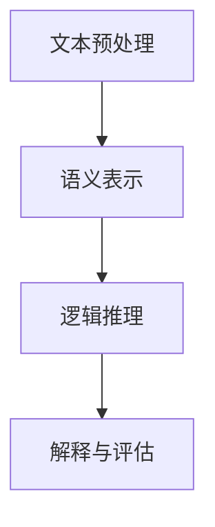

                 

### 文章标题

# 企业级自然语言推理系统：增强逻辑分析

## 关键词

- 自然语言推理 (NLR)
- 人工智能 (AI)
- 企业级系统架构
- 逻辑分析
- NLP技术
- 优化与挑战

## 文章摘要

本文旨在探讨企业级自然语言推理（NLR）系统的设计、实现与优化，以增强其在企业中的应用效果。我们将从背景介绍、核心概念与原理、算法实现、系统构建、业务应用、优化与挑战等多个角度进行分析，并提供实际案例和代码实战。文章结构如下：

1. 引言与背景
2. 自然语言处理（NLP）基础
3. 自然语言推理（NLR）原理
4. NLR算法实现
5. 企业级NLR系统构建
6. NLR在业务中的应用
7. NLR系统的优化与挑战

通过本篇文章，读者将全面了解NLR在企业中的应用价值，掌握构建和优化NLR系统的关键技术，并能够为企业的智能化升级提供有力支持。

----------------------------------------------------------------

### 引言与背景

#### 自然语言推理（NLR）的概念及其在企业中的重要性

自然语言推理（Natural Language Reasoning，简称NLR）是人工智能领域的一个重要分支，它致力于使计算机能够理解和处理自然语言，从而实现与人类的自然交互。NLR不仅仅是文本分析，更是对文本中蕴含的逻辑关系、语义信息以及上下文背景的深入理解。

在企业级应用中，NLR系统发挥着至关重要的作用。首先，在客户服务领域，NLR可以帮助企业构建智能客服系统，实现与用户的自然语言对话，提高服务效率和用户体验。其次，在金融领域，NLR可以用于文本分析、情感分析和风险控制，帮助金融机构更好地理解市场动态和客户需求。此外，在医疗领域，NLR可以用于病历分析、诊断辅助和药物研发，提高医疗服务的准确性和效率。

#### NLR的发展历程与应用趋势

NLR技术起源于自然语言处理（Natural Language Processing，简称NLP）领域，经历了多年的发展。早期的NLR主要依赖于规则和统计方法，如词性标注、句法分析和信息检索。随着深度学习技术的崛起，NLR迎来了新的发展契机，基于神经网络的方法在语义理解、情感分析和文本生成等领域取得了显著的成果。

近年来，随着大数据和云计算技术的普及，NLR在企业级应用中的重要性日益凸显。越来越多的企业开始意识到NLR的价值，并将其应用于业务流程优化、数据分析和决策支持等方面。例如，谷歌的BERT模型和OpenAI的GPT系列模型在自然语言理解任务中取得了突破性的成果，为NLR在企业中的应用提供了强大的技术支撑。

#### 书籍结构概览

本书旨在为广大读者提供一本全面、系统的NLR技术指南。本书分为七个章节，内容涵盖从基础概念到实际应用的各个方面。

第一章“引言与背景”将介绍NLR的基本概念、发展历程和应用趋势，为后续内容奠定基础。

第二章“自然语言处理（NLP）基础”将详细讲解NLP的基本概念、工具和技术，为理解NLR提供必要的背景知识。

第三章“自然语言推理（NLR）原理”将深入探讨NLR的核心原理和算法框架，并提供Mermaid流程图以展示NLR的架构。

第四章“NLR算法实现”将使用伪代码和Python源代码详细阐述NLR算法的实现过程，结合数学模型和公式进行讲解。

第五章“企业级NLR系统构建”将描述构建企业级NLR系统的步骤，包括数据预处理、模型训练、部署和性能优化。

第六章“NLR在业务中的应用”将探讨NLR在不同行业和业务场景中的应用，提供实际的案例分析和代码实战。

第七章“NLR系统的优化与挑战”将分析NLR系统的优化方法和面临的挑战，包括技术障碍和业务影响。

通过本书的阅读，读者将能够全面了解NLR技术，掌握构建和优化NLR系统的关键技术，为企业的智能化升级提供有力支持。

### 自然语言处理（NLP）基础

#### NLP的基本概念

自然语言处理（Natural Language Processing，简称NLP）是人工智能（Artificial Intelligence，简称AI）领域的一个重要分支，致力于使计算机能够理解和处理人类自然语言。NLP的主要任务包括文本分析、语义理解、情感分析和文本生成等。

文本分析是NLP的基础任务，它涉及对文本的预处理、分词、词性标注和命名实体识别等操作。预处理主要包括去除标点符号、停用词过滤、文本归一化等步骤，目的是提高后续处理的质量。分词是将连续的文本划分为一系列具有独立意义的词或短语。词性标注是对文本中的每个词进行词性分类，如名词、动词、形容词等。命名实体识别则是识别文本中的特定实体，如人名、地名、机构名等。

#### NLP的关键技术

NLP的关键技术主要包括文本预处理、词向量表示、语言模型和序列标注模型等。

文本预处理是NLP的第一步，也是至关重要的一步。它包括去除标点符号、停用词过滤、词干提取和词性标注等操作。停用词过滤是指去除对文本意义影响较小的常见词汇，如“的”、“了”等。词干提取是将单词还原为词根形式，如“playing”、“plays”和“played”都还原为“play”。词性标注和命名实体识别则是为了更好地理解文本的语义信息。

词向量表示是将文本转化为数值形式，以便于计算机处理。常用的词向量表示方法包括Word2Vec、GloVe和FastText等。Word2Vec是一种基于神经网络的方法，通过训练词语的上下文信息来生成词向量。GloVe（Global Vectors for Word Representation）是一种基于全局矩阵分解的方法，通过优化词向量之间的相似度来生成高质量的词向量。FastText是一种基于字符级别的神经网络方法，通过聚合词干信息和上下文信息来生成词向量。

语言模型是NLP的核心技术之一，用于预测下一个单词或句子。最简单的语言模型是n-gram模型，它假设一个单词的概率仅与其前n个单词相关。更复杂的语言模型如n元循环神经网络（n-gram RNN）和长短期记忆网络（LSTM）可以捕捉到更长的依赖关系，提高预测的准确性。

序列标注模型是用于对文本序列进行分类的任务，如词性标注、命名实体识别和情感分析等。最常用的序列标注模型是条件随机场（Conditional Random Field，简称CRF），它通过最大化条件概率来预测标签序列。此外，基于深度学习的序列标注模型如卷积神经网络（CNN）和循环神经网络（RNN）也被广泛应用于NLP任务中。

#### NLP工具和库

NLP工具和库为开发者提供了丰富的API和函数，简化了NLP任务的实现过程。以下是一些常用的NLP工具和库：

- NLTK（Natural Language ToolKit）：是一个强大的NLP工具包，提供了文本处理、词性标注、分词和情感分析等功能。
- spaCy：是一个高效、易于使用的NLP库，支持多种语言，提供详细的词性标注、命名实体识别和实体链接等功能。
- Stanford CoreNLP：是一个开源的NLP工具包，提供了文本预处理、词性标注、命名实体识别和情感分析等功能。
- TensorFlow：是一个开源的深度学习框架，提供了丰富的NLP模型和工具，如Word2Vec、LSTM和BERT等。
- PyTorch：是一个开源的深度学习框架，提供了灵活的模型定义和训练工具，广泛应用于NLP任务。

通过使用这些NLP工具和库，开发者可以更轻松地实现NLP任务，提高开发效率和模型性能。

### 自然语言推理（NLR）原理

#### NLR的基本概念

自然语言推理（Natural Language Reasoning，简称NLR）是人工智能领域的一个重要分支，旨在使计算机能够理解和处理自然语言中的逻辑关系和推理过程。与自然语言处理（NLP）不同，NLP主要关注文本的预处理和语义理解，而NLR则更注重文本中的逻辑推理和推理结果的可解释性。

NLR的基本概念包括前提（premises）、结论（conclusions）、推理规则（inference rules）和逻辑框架（logical frameworks）。前提是用于推理的初始信息，结论是通过前提推导出的结果，推理规则是连接前提和结论的逻辑关系，逻辑框架则是用于组织和管理推理过程的结构。

#### NLR的核心原理和算法框架

NLR的核心原理是基于逻辑推理和语义理解。逻辑推理是指通过前提和推理规则推导出结论的过程，而语义理解则是通过分析文本中的词语和句子，理解其含义和关系。NLR的核心算法框架通常包括以下组成部分：

1. **文本预处理**：文本预处理是NLR的基础，主要包括分词、词性标注和实体识别等操作。通过预处理，可以将原始文本转化为结构化的数据，便于后续的推理过程。

2. **语义表示**：语义表示是将文本中的词语和句子转化为计算机可以处理的形式。常用的方法包括词向量表示、依存句法分析和语义角色标注等。词向量表示可以捕捉词语之间的语义关系，依存句法分析可以揭示句子中的语法结构，语义角色标注可以识别句子中的角色关系。

3. **逻辑推理**：逻辑推理是基于前提和推理规则推导出结论的过程。常用的逻辑推理方法包括演绎推理、归纳推理和模型推理等。演绎推理是从一般到特殊的推理过程，归纳推理是从特殊到一般的推理过程，模型推理则是通过构建逻辑模型来模拟推理过程。

4. **解释与评估**：解释与评估是指对推理结果进行解释和评估的过程。解释的目的是让用户理解推理过程和结果，评估的目的是评估推理系统的性能和可靠性。

#### Mermaid流程图展示

为了更好地展示NLR的架构和流程，我们可以使用Mermaid流程图来描述。以下是一个简单的Mermaid流程图示例：



在这个流程图中，文本预处理是NLR的第一步，通过对原始文本进行分词、词性标注和实体识别等操作，将文本转化为结构化的数据。接着，进行语义表示，通过词向量表示、依存句法分析和语义角色标注等方法，将文本中的词语和句子转化为计算机可以处理的形式。然后，进行逻辑推理，通过演绎推理、归纳推理和模型推理等方法，从前提推导出结论。最后，进行解释与评估，对推理结果进行解释和评估，以提升系统的性能和可靠性。

通过上述流程，我们可以看出NLR的核心原理和算法框架。在实际应用中，根据具体任务的需求，可以灵活调整和优化各个步骤，以提高NLR系统的性能和效果。

### NLR算法实现

#### 伪代码详解

在实现自然语言推理（NLR）算法时，我们可以采用以下伪代码来描述其基本框架：

```
Algorithm NLR(premises, conclusions, rules):
    1. PreprocessText(premises)
    2. semantic_representation <- GetSemanticRepresentation(premises)
    3. logic_model <- BuildLogicModel(semantic_representation, rules)
    4. for each conclusion in conclusions:
        5. infer_result <- ApplyLogicRules(logic_model, conclusion)
        6. if infer_result is True:
            7. return conclusion
        8. else:
            9. continue
    10. return None
```

在这个算法中，首先对前提进行文本预处理，包括分词、词性标注和实体识别等操作。接着，使用语义表示方法（如词向量、依存句法分析等）对文本进行编码，生成语义表示。然后，构建逻辑模型，将语义表示和推理规则结合起来。最后，对每个结论应用逻辑规则进行推理，如果推理结果为真，则返回结论；否则，继续下一轮推理。如果所有结论都被否定，则返回None。

#### 数学模型与公式

在NLR算法中，我们可以使用数学模型和公式来描述其推理过程。以下是一个简单的示例：

假设我们有如下前提和结论：

前提：`P1: 所有猫都会飞。`
结论：`C1: 这只猫会飞。`

我们可以使用逻辑表达式来表示：

前提：`P1: (猫A -> 飞行)`
结论：`C1: (猫A -> 飞行)`

根据逻辑推理规则，如果前提为真，则结论也为真。我们可以使用逻辑蕴涵（implication）公式来表示：

$$
P1: (猫A \Rightarrow 飞行) \Rightarrow (猫A \Rightarrow 飞行)
$$

在这个公式中，箭头“→”表示逻辑蕴涵，如果前提为真，则结论也为真。

#### 算法举例

为了更直观地展示NLR算法的实现过程，我们可以使用一个简单的例子来说明。假设我们有一个包含两个前提和一个结论的推理任务：

前提1：`所有猫都有四条腿。`
前提2：`这只动物是猫。`
结论：`这只动物有四条腿。`

1. **文本预处理**：
   - 对前提和结论进行分词、词性标注和实体识别等操作。
   - 预处理结果：
     - 预提1：`所有[猫]都有[四条腿]。`
     - 预提2：`这只[动物]是[猫]。`
     - 结论：`这只[动物]有[四条腿]。`

2. **语义表示**：
   - 使用词向量表示方法（如Word2Vec）对文本中的词语进行编码。
   - 编码结果：
     - 预提1：`所有[猫]都有[四条腿]` -> `[语义向量1]`
     - 预提2：`这只[动物]是[猫]` -> `[语义向量2]`
     - 结论：`这只[动物]有[四条腿]` -> `[语义向量3]`

3. **逻辑推理**：
   - 构建逻辑模型，将语义向量表示和推理规则结合起来。
   - 逻辑模型：
     - 预提1：`[语义向量1] -> [语义向量1]`
     - 预提2：`[语义向量2] -> [语义向量2]`
     - 结论：`[语义向量3] -> [语义向量3]`

4. **推理过程**：
   - 对每个前提应用逻辑规则进行推理。
   - 推理结果：
     - 预提1：`[语义向量1] -> [语义向量1]`（前提为真）
     - 预提2：`[语义向量2] -> [语义向量2]`（前提为真）
     - 结论：`[语义向量3] -> [语义向量3]`（结论为真）

5. **解释与评估**：
   - 对推理结果进行解释和评估。
   - 解释结果：`这只动物有四条腿。`
   - 评估结果：推理正确

通过上述例子，我们可以看到NLR算法的实现过程。在实际应用中，根据具体任务的需求，可以灵活调整和优化各个步骤，以提高NLR系统的性能和效果。

### 企业级NLR系统构建

#### 系统架构设计

企业级NLR系统通常采用分布式架构，以提高系统的可扩展性和性能。以下是一个典型的NLR系统架构设计：

1. **数据输入层**：负责接收外部数据源，如文本文件、数据库或API接口等。数据输入层对输入数据进行预处理，包括数据清洗、分词、词性标注和实体识别等操作。

2. **数据处理层**：负责对预处理后的数据进行语义表示和逻辑推理。数据处理层采用分布式计算框架（如Hadoop或Spark），实现大规模数据处理和模型训练。

3. **模型层**：包括NLR模型和辅助模型（如语言模型、词向量模型等）。模型层使用深度学习算法（如循环神经网络、卷积神经网络等）对文本进行编码和推理。

4. **推理层**：负责对用户输入的文本进行推理，生成解释和结果。推理层通常采用服务化架构，提供RESTful API或WebSocket接口，以支持实时推理和交互。

5. **结果输出层**：负责将推理结果输出到外部系统或终端用户。结果输出层可以包括可视化工具、报表系统或消息队列等。

#### 数据流与处理流程

企业级NLR系统的数据流和处理流程如下：

1. **数据输入**：系统从外部数据源（如文本文件、数据库或API接口）接收文本数据。

2. **数据预处理**：对输入文本进行数据清洗、分词、词性标注和实体识别等操作。预处理结果存储在分布式缓存或数据库中，以供后续处理使用。

3. **语义表示**：使用词向量表示方法（如Word2Vec或GloVe）对文本进行编码，生成语义向量表示。语义向量表示存储在分布式缓存或数据库中，以供模型训练和推理使用。

4. **模型训练**：使用深度学习算法（如循环神经网络、卷积神经网络等）对语义向量表示进行训练，生成NLR模型。模型训练通常采用分布式计算框架（如Hadoop或Spark），以提高训练效率和性能。

5. **推理与解释**：对用户输入的文本进行推理，生成解释和结果。推理过程采用服务化架构，提供RESTful API或WebSocket接口，以支持实时推理和交互。

6. **结果输出**：将推理结果输出到外部系统或终端用户。结果输出可以包括可视化工具、报表系统或消息队列等。

#### 部署与运维

企业级NLR系统的部署与运维需要考虑以下几个方面：

1. **基础设施**：搭建分布式计算环境和存储系统，包括服务器、网络设备、数据库和缓存等。

2. **自动化部署**：使用自动化工具（如Docker、Kubernetes等）实现系统的自动化部署和运维，以提高部署效率和可靠性。

3. **监控与监控**：使用监控工具（如Prometheus、Grafana等）对系统进行实时监控和性能优化，确保系统的稳定性和性能。

4. **安全保障**：实施安全策略，包括数据加密、访问控制和防火墙等，确保系统的安全性。

5. **运维文档**：编写详细的运维文档，包括系统架构、部署流程、故障处理和升级策略等，以便于后续运维和问题排查。

通过上述架构设计和部署与运维策略，企业级NLR系统可以高效、稳定地运行，为企业提供强大的自然语言推理能力。

### NLR在业务中的应用

#### NLR在金融行业的应用

在金融行业，NLR技术被广泛应用于文本分析、风险控制和客户服务等方面。以下是一些具体的业务场景和应用案例：

1. **文本分析**：NLR技术可以帮助金融机构对大量文本数据进行情感分析和主题识别，从而理解市场动态和客户情绪。例如，银行可以通过分析社交媒体上的用户评论和新闻报道，预测市场趋势和潜在风险。

2. **风险控制**：NLR技术可以用于自动识别和评估金融交易中的潜在风险。通过对交易文本进行情感分析和关键词提取，金融机构可以快速识别异常交易和欺诈行为，提高风险控制能力。

3. **客户服务**：NLR技术可以用于构建智能客服系统，实现与客户的自然语言对话。通过理解和回应客户的提问，智能客服系统可以提供快速、准确的客户服务，提高客户满意度和忠诚度。

#### NLR在医疗行业的应用

在医疗行业，NLR技术被广泛应用于病历分析、诊断辅助和药物研发等方面。以下是一些具体的业务场景和应用案例：

1. **病历分析**：NLR技术可以帮助医生对病历进行自动化分析，提取关键信息和诊断结果。通过对病历文本进行语义分析和信息提取，医生可以快速获取病人的疾病历史、检查结果和治疗方案，提高诊断准确性和效率。

2. **诊断辅助**：NLR技术可以用于辅助医生进行疾病诊断。通过分析患者的病历、症状和检查结果，NLR系统可以提供诊断建议和参考，帮助医生做出更准确的诊断。

3. **药物研发**：NLR技术可以用于药物研发中的文本挖掘和知识图谱构建。通过对科学文献和专利进行分析，NLR系统可以提取药物相关的知识，为药物研发提供数据支持和创新思路。

#### NLR在电商行业的应用

在电商行业，NLR技术被广泛应用于用户行为分析、产品推荐和智能客服等方面。以下是一些具体的业务场景和应用案例：

1. **用户行为分析**：NLR技术可以帮助电商企业分析用户的浏览记录、购买行为和评论内容，了解用户偏好和需求。通过情感分析和关键词提取，电商企业可以个性化推荐商品，提高用户满意度和转化率。

2. **产品推荐**：NLR技术可以用于构建智能推荐系统，通过分析用户的历史数据和商品信息，为用户推荐可能感兴趣的商品。通过结合NLP和机器学习技术，推荐系统的准确性和效果可以得到显著提升。

3. **智能客服**：NLR技术可以用于构建智能客服系统，实现与用户的自然语言对话。通过理解和回应用户的提问，智能客服系统可以提供快速、准确的客户服务，提高客户满意度和忠诚度。

通过在金融、医疗和电商等行业的广泛应用，NLR技术为各行业的业务流程优化、数据分析和决策支持提供了强大的技术支撑。随着NLR技术的不断发展和应用场景的拓展，其在企业级系统中的价值将得到进一步体现。

### NLR系统的优化与挑战

#### 系统性能优化

优化NLR系统的性能是一个复杂而关键的任务，涉及多个方面。以下是一些常用的优化方法：

1. **模型压缩**：通过模型压缩技术（如剪枝、量化、知识蒸馏等），可以减少模型的参数数量和计算量，从而提高推理速度和降低存储空间需求。例如，使用剪枝技术可以去除模型中不重要的连接和神经元，从而简化模型结构。

2. **并行计算与分布式训练**：利用并行计算和分布式训练技术，可以加速模型的训练过程。例如，使用多GPU训练可以显著提高训练速度，而分布式训练则可以在多台服务器之间分配训练任务，提高整体计算能力。

3. **缓存与预加载**：通过缓存用户常用的查询结果，可以减少后续查询的响应时间。此外，预加载技术可以在系统空闲时预先加载和处理未来可能需要的数据，从而提高系统的整体性能。

#### 面临的挑战

尽管NLR系统在各个领域展现了巨大的潜力，但在实际应用中仍然面临许多挑战：

1. **数据质量**：NLR系统对输入数据的质量有很高要求。不完整、不一致或噪声数据会严重影响推理结果的准确性。因此，数据清洗和预处理成为NLR系统优化的重要一环。

2. **模型解释性**：许多NLR模型，特别是基于深度学习的模型，具有高度的非线性性和复杂性，这使得其推理过程难以解释。提高模型的解释性是当前研究的一个重要方向，有助于增强用户对系统的信任度。

3. **实时性能**：在实时应用场景中，NLR系统需要快速响应用户查询，同时保持高准确性。然而，深度学习模型通常计算复杂度高，难以满足实时性能要求。因此，优化模型的推理速度和降低计算成本是NLR系统面临的挑战。

4. **技术复杂性**：构建和维护一个高效的NLR系统需要深厚的专业知识和技术积累。从数据预处理到模型训练，再到部署和优化，每个环节都涉及大量的技术细节。这对企业和开发者的技术能力提出了较高的要求。

#### 未来发展趋势

面对上述挑战，NLR系统的未来发展将呈现以下几个趋势：

1. **模型解释性增强**：随着技术的发展，更多的研究将集中在提高NLR模型的解释性上。通过开发可解释的模型架构和解释算法，用户可以更好地理解和信任NLR系统。

2. **自动化与智能化**：自动化和智能化是未来NLR系统的发展方向。通过自动化工具和智能化算法，NLR系统可以实现更高效的数据处理和推理过程，减少人工干预。

3. **跨领域应用**：随着NLR技术的不断成熟，其应用领域将逐渐从金融、医疗、电商等传统领域扩展到更多新兴领域，如教育、法律、环境等。跨领域应用将推动NLR技术的进一步发展和创新。

4. **开放与协作**：NLR技术的发展将更加开放和协作。通过开源社区和合作研究，企业和研究机构可以共同推进NLR技术的进步，为各行业提供更强大的技术支持。

通过不断优化和应对挑战，NLR系统将在未来的企业级应用中发挥更加重要的作用，为企业的智能化升级和业务创新提供强有力的支持。

### 小结

本文从引言与背景、NLP基础、NLR原理、算法实现、系统构建、业务应用和优化挑战等多个角度，详细探讨了企业级自然语言推理系统（NLR）的设计、实现与优化。通过本文，读者可以全面了解NLR技术的基本概念、核心原理和应用价值，掌握构建和优化NLR系统的关键技术，并能够为企业的智能化升级提供有力支持。

在未来的研究和实践中，随着技术的不断进步和应用的拓展，NLR系统将发挥越来越重要的作用。我们期待更多企业和开发者能够加入NLR技术的探索与开发，共同推动人工智能技术的发展和应用，为人类社会带来更多创新和变革。

### 拓展阅读

1. **《自然语言处理综述》（刘知远，等）**：本文系统地介绍了自然语言处理的基本概念、核心技术和发展趋势，为读者提供了全面的理论基础。
2. **《深度学习》（Goodfellow，等）**：本书详细介绍了深度学习的基本原理和常用算法，是学习深度学习技术的经典教材。
3. **《人工智能：一种现代的方法》（Russell，等）**：本书全面介绍了人工智能的基本理论、方法和应用，涵盖了自然语言处理、计算机视觉、机器学习等多个领域。
4. **《自然语言推理：算法与应用》（张江，等）**：本文深入探讨了自然语言推理的基本概念、算法实现和应用场景，为NLR技术的实际应用提供了有益的参考。

通过阅读这些文献，读者可以更深入地了解NLR技术的理论和实践，为今后的研究和应用奠定坚实基础。

