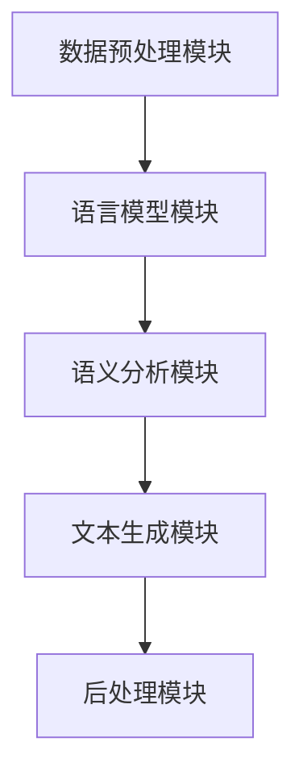

                 

### 摘要

《企业级自然语言生成引擎：自动创作商业内容》是一篇旨在深入探讨自然语言生成（NLG）技术在企业级应用中的技术博客。文章首先介绍了自然语言生成引擎的基本概念，以及其在企业级应用中的重要性。随后，文章详细讲解了自然语言处理（NLP）的基本概念和常见任务，为理解NLG奠定了基础。接下来，文章深入探讨了NLG相关算法，包括生成式和解析式算法，并使用Python源代码详细阐述了这些算法的原理。此外，文章还介绍了数学模型和数学公式在NLG中的应用，并通过Mermaid流程图展示了NLG引擎的整体架构。文章的第三部分则聚焦于实践应用，通过实际项目案例展示了如何搭建开发环境、实现源代码并对其进行解读和分析。最终，文章总结了最佳实践和注意事项，为读者提供了丰富的拓展阅读资源。

## 第一部分：基础理论

### 第1章 自然语言生成引擎概述

#### 1.1 自然语言生成的概念与背景

自然语言生成（Natural Language Generation，NLG）是指通过计算机程序自动生成人类可读的自然语言文本的技术。NLG技术旨在模拟人类的语言表达，实现机器与人类之间的自然交互。这一领域的研究始于上世纪50年代，当时计算机科学家们开始探索如何使计算机具备自动生成文本的能力。

自然语言生成的基本原理在于对输入数据的处理和转换。通常，NLG过程包括以下步骤：首先，系统对输入数据进行分析和理解，然后根据这些理解生成相应的文本。这个过程中，计算机需要处理大量的语言数据和模式，以生成具有逻辑性和连贯性的文本。

#### 1.2 自然语言生成引擎的架构

自然语言生成引擎是一个复杂的系统，通常由多个模块组成。这些模块共同协作，完成自然语言生成的任务。以下是NLG引擎的主要组件：

1. **数据预处理模块**：负责对输入数据进行清洗、分词、词性标注等预处理操作，为后续的文本生成提供基础数据。

2. **语言模型模块**：基于大量的语言数据训练语言模型，以预测句子中下一个词的概率。语言模型是NLG系统的核心组件，常用的有基于统计的方法和基于神经网络的模型。

3. **语义分析模块**：对预处理后的文本进行语义分析，理解文本中的实体、关系和事件。这一模块通常基于自然语言处理（NLP）技术，如命名实体识别、关系提取、语义角色标注等。

4. **文本生成模块**：根据语言模型和语义分析结果，生成符合语法和语义规则的文本。文本生成模块可以是规则驱动或数据驱动，也可以是两者的结合。

5. **后处理模块**：对生成的文本进行润色、修正和格式化，使其更加自然和易读。

下面是NLG引擎的整体架构的Mermaid流程图：



#### 1.3 自然语言生成引擎在企业级应用中的价值

自然语言生成引擎在企业级应用中具有广泛的价值，主要体现在以下几个方面：

1. **提高工作效率**：通过自动化生成文本，可以大大减少人工撰写文本的工作量，提高工作效率。例如，在金融行业，NLG可以自动生成财务报告、市场分析报告等。

2. **降低创作成本**：自动生成文本可以降低企业的人力成本，同时避免因人为错误导致的文本质量问题。

3. **拓展营销渠道**：NLG可以帮助企业自动化生成各种营销文案，如广告、宣传册、电子邮件等，提高营销效果。

4. **客户服务自动化**：NLG可以用于自动生成客户服务文档、FAQ回答等，提高客户服务质量。

5. **知识库建设**：NLG可以自动生成知识库中的文档，如技术手册、操作指南等，方便用户查询和使用。

### 第2章 自然语言处理（NLP）基本概念

#### 2.1 NLP的基本概念

自然语言处理（Natural Language Processing，NLP）是计算机科学、人工智能和语言学等领域相结合的交叉学科，旨在使计算机能够理解、解释和生成人类语言。NLP的研究内容包括文本分析、语言模型、语义理解、情感分析等多个方面。

在NLP中，语言模型是一个核心概念。语言模型是一种概率模型，用于预测文本序列中下一个词的概率。常见的语言模型有基于统计的模型和基于神经网络的模型。基于统计的模型如N-gram模型，通过统计文本中的词频来预测下一个词。而基于神经网络的模型如神经网络语言模型（NNLM）和递归神经网络（RNN），通过学习大量的语言数据来预测词的概率。

#### 2.2 常见的NLP任务

NLP中有许多常见的任务，这些任务为NLG提供了基础支持。以下是几个典型的NLP任务：

1. **文本分类**：将文本分为预定义的类别。常见的应用包括垃圾邮件过滤、情感分析等。

2. **命名实体识别**：识别文本中的命名实体，如人名、地名、组织名等。这是信息抽取的一个重要任务。

3. **情感分析**：分析文本中的情感倾向，判断文本是正面、中性还是负面。情感分析广泛应用于市场调研、社交媒体监控等领域。

4. **句法分析**：分析文本的句法结构，包括词组、短语和句子的构成。句法分析有助于理解文本的语法规则和语义关系。

5. **机器翻译**：将一种语言的文本翻译成另一种语言。机器翻译是NLP领域的一个重要应用方向。

#### 2.3 NLP技术在NLG中的应用

NLP技术在NLG中扮演着关键角色，为NLG提供了文本分析和语义理解的能力。以下是NLP技术在NLG中的几个应用场景：

1. **文本预处理**：NLP技术用于对输入文本进行预处理，包括分词、词性标注、命名实体识别等，为后续的文本生成提供基础数据。

2. **语义理解**：NLP技术用于理解文本中的语义信息，包括实体关系、事件抽取等。这些语义信息对于生成连贯、逻辑清晰的文本至关重要。

3. **文本生成**：基于NLP技术，NLG系统可以生成具有语法和语义正确性的文本。NLP中的语言模型和句法分析技术为文本生成提供了支持。

4. **情感分析**：在生成文本时，NLP技术可以用于分析文本的情感倾向，以便生成符合特定情感要求的文本。

### 第3章 NLG相关算法介绍

#### 3.1 生成式与解析式NLG

自然语言生成（NLG）技术可以分为生成式（Generative）和解析式（Analytic）两大类。这两种方法的本质区别在于它们处理文本生成的方式。

**生成式NLG**：生成式NLG方法直接生成文本，通常基于概率模型或神经网络。这种方法不需要预先定义文本的结构，而是通过学习大量的文本数据，自动生成新的文本。生成式NLG的优点是生成的文本通常比较自然，但缺点是难以保证生成的文本遵循特定的语法规则。

**解析式NLG**：解析式NLG方法首先将输入文本解析成结构化的数据，如树状结构或语义角色标注。然后，根据这些结构化的数据生成文本。这种方法可以更好地保证生成的文本遵循预定的语法规则，但生成的文本可能不够自然。

下面我们将分别介绍生成式和解析式NLG的常用算法。

#### 3.2 常见的NLG算法

**生成式NLG算法**：

1. **N-gram模型**：N-gram模型是最早的生成式语言模型之一。它通过统计文本中连续N个词的出现频率来预测下一个词。N-gram模型的简单性使其易于实现，但它在处理长文本和复杂语义时效果有限。

2. **递归神经网络（RNN）**：RNN是一种能够处理序列数据的神经网络。通过递归结构，RNN可以记住前面的输入信息，从而生成连贯的文本。常见的RNN模型包括LSTM（长短期记忆网络）和GRU（门控循环单元）。

3. **变换器（Transformer）**：Transformer模型是由Vaswani等人在2017年提出的，它基于自注意力机制，能够在处理长文本时保持高效的计算性能。Transformer模型已经成为生成式NLG中的主要模型之一。

4. **生成对抗网络（GAN）**：生成对抗网络是一种通过对抗训练生成高质量数据的模型。在NLG中，GAN可以通过生成器和判别器的对抗训练来生成更加自然的文本。

**解析式NLG算法**：

1. **模板匹配**：模板匹配是一种简单的解析式NLG方法，它通过预先定义的模板来生成文本。模板中包含变量，用于插入实际数据。这种方法在处理结构化数据时效果较好，但生成的文本缺乏灵活性。

2. **基于规则的方法**：基于规则的方法通过定义一组规则来生成文本。这些规则描述了文本生成的逻辑和语法结构。这种方法在生成遵循特定语法规则的文本时效果较好，但规则定义复杂且难以扩展。

3. **图表生成**：图表生成是一种利用图论方法来生成文本的方法。它将文本生成过程建模为一个图搜索问题，通过搜索图中的路径来生成文本。这种方法可以生成复杂的、结构化的文本。

下面是一个基于Python的生成式NLG算法的简单示例，使用LSTM模型生成文本：

```python
from keras.models import Sequential
from keras.layers import LSTM, Dense, Embedding
from keras.preprocessing.sequence import pad_sequences
from keras.preprocessing.text import Tokenizer

# 假设我们已经有了一组训练数据
sentences = ['这是第一句话', '这是第二句话', '这是第三句话']
tokenizer = Tokenizer(char_level=True)
tokenizer.fit_on_texts(sentences)
sequences = tokenizer.texts_to_sequences(sentences)
padded_sequences = pad_sequences(sequences, padding='post')

# 构建LSTM模型
model = Sequential()
model.add(Embedding(input_dim=len(tokenizer.word_index) + 1, output_dim=64))
model.add(LSTM(units=128))
model.add(Dense(len(tokenizer.word_index) + 1, activation='softmax'))

model.compile(optimizer='adam', loss='categorical_crossentropy', metrics=['accuracy'])
model.fit(padded_sequences, padded_sequences, epochs=100)

# 生成文本
generated_text = model.predict(np.zeros((1, max_sequence_length)))
generated_text = tokenizer.index_word[np.argmax(generated_text[0])]
print(generated_text)
```

在这个示例中，我们首先使用一组训练数据来训练LSTM模型。然后，使用训练好的模型生成新的文本。这是一个简单的示例，实际的NLG系统会更加复杂，需要处理更多的数据预处理、模型优化和文本生成策略。

### 第4章 商业内容自动创作需求分析

#### 4.1 商业内容自动创作的重要性

在当今快速发展的商业环境中，内容创作已经成为企业竞争的重要手段。然而，高质量的内容创作往往需要大量的时间和人力资源。因此，自动创作商业内容的需求日益增长。自动创作商业内容的重要性主要体现在以下几个方面：

1. **提高工作效率**：自动创作系统能够快速生成各种商业内容，如报告、营销文案、客户服务文档等，大大减少了人工撰写的时间。

2. **降低创作成本**：自动创作系统能够替代部分人工工作，从而降低企业的运营成本。

3. **保证内容一致性**：自动创作系统能够根据预设的模板和规则生成内容，确保内容的一致性和准确性。

4. **拓展营销渠道**：自动创作系统可以生成各种形式的内容，如博客文章、社交媒体帖子、电子邮件等，帮助企业拓展营销渠道。

5. **实时响应需求**：自动创作系统可以实时生成内容，满足企业的即时需求，如客户咨询、市场变化等。

#### 4.2 商业内容自动创作的应用场景

商业内容自动创作在许多场景中都具有重要应用，以下是几个典型的应用场景：

1. **客户服务自动化**：自动创作系统可以生成FAQ回答、自动回复邮件等，提高客户服务效率。

2. **营销文案生成**：自动创作系统可以根据市场数据和用户行为生成个性化的营销文案，提高营销效果。

3. **报告生成**：自动创作系统可以自动生成各种报告，如财务报告、市场分析报告等，节省人力资源。

4. **知识库建设**：自动创作系统可以生成技术手册、操作指南等文档，方便用户查阅。

5. **客户互动**：自动创作系统可以生成与客户互动的内容，如社交媒体帖子、博客文章等，提高客户黏性。

### 第5章 NLG引擎架构设计

#### 5.1 NLG引擎的体系结构

自然语言生成（NLG）引擎是一个复杂的系统，通常由多个模块组成。这些模块协同工作，共同实现文本的自动生成。下面我们将介绍NLG引擎的主要组成部分及其功能。

1. **数据预处理模块**：数据预处理模块负责对输入数据进行清洗、分词、词性标注等操作，将原始文本转换为结构化的数据形式，以便后续处理。

2. **语言模型模块**：语言模型模块是NLG引擎的核心组件，负责生成文本。常用的语言模型有N-gram模型、递归神经网络（RNN）、变换器（Transformer）等。这些模型通过学习大量的语言数据，预测下一个词或句子的概率，从而生成连贯的文本。

3. **语义分析模块**：语义分析模块负责对预处理后的文本进行语义理解，提取文本中的实体、关系和事件。这一模块通常基于自然语言处理（NLP）技术，如命名实体识别、关系提取、情感分析等。

4. **文本生成模块**：文本生成模块根据语言模型和语义分析结果，生成符合语法和语义规则的文本。这一模块可以是规则驱动的，也可以是数据驱动的，或者两者的结合。

5. **后处理模块**：后处理模块对生成的文本进行润色、修正和格式化，使其更加自然和易读。这一模块通常包括文本优化、语法修正、标点符号处理等。

下面是NLG引擎的体系结构的Mermaid流程图：


#### 5.2 NLG引擎的设计原则

在设计NLG引擎时，需要考虑以下原则，以确保系统的性能、可扩展性和可维护性：

1. **可扩展性**：NLG引擎应支持不同类型的文本生成任务，能够适应未来的需求变化。这意味着引擎应该具有模块化的设计，允许添加新的功能模块。

2. **可维护性**：NLG引擎应具有良好的代码结构，便于维护和更新。这意味着代码应该遵循良好的编程实践，如代码复用、模块化设计和文档化。

3. **性能优化**：NLG引擎应具有高性能，能够在合理的时间内生成高质量的文本。这通常需要优化算法和数据结构，以减少计算复杂度和提高处理速度。

4. **用户友好性**：NLG引擎应提供易于使用的接口，方便用户配置和使用。这包括提供直观的界面、详细的文档和示例代码等。

### 第6章 NLG算法原理讲解

#### 6.1 NLG算法的基本原理

自然语言生成（NLG）算法的核心任务是根据输入数据生成人类可读的自然语言文本。NLG算法的基本原理可以分为生成式和解析式两种方法。

**生成式NLG算法**：生成式NLG算法直接生成文本，通常基于概率模型或神经网络。这种方法不需要预先定义文本的结构，而是通过学习大量的语言数据，自动生成新的文本。生成式NLG算法的主要步骤如下：

1. **文本预处理**：对输入文本进行分词、词性标注等预处理操作，将原始文本转换为结构化的数据形式。

2. **语言模型训练**：使用训练数据训练语言模型，学习文本序列中的概率分布。常见的语言模型有N-gram模型、递归神经网络（RNN）、变换器（Transformer）等。

3. **文本生成**：根据语言模型生成文本。生成过程通常采用序列生成的方法，如贪心搜索、贪心策略或基于梯度的优化算法。

**解析式NLG算法**：解析式NLG算法首先将输入文本解析成结构化的数据，如树状结构或语义角色标注。然后，根据这些结构化的数据生成文本。这种方法可以更好地保证生成的文本遵循预定的语法规则。解析式NLG算法的主要步骤如下：

1. **文本预处理**：对输入文本进行分词、词性标注等预处理操作，将原始文本转换为结构化的数据形式。

2. **语义分析**：使用NLP技术对预处理后的文本进行语义分析，提取文本中的实体、关系和事件。

3. **文本生成**：根据结构化的语义数据生成文本。生成过程通常基于模板匹配、基于规则的生成方法或图表生成等。

#### 6.2 生成式NLG算法

**N-gram模型**：N-gram模型是最早的生成式语言模型之一。它通过统计文本中连续N个词的出现频率来预测下一个词。N-gram模型的核心思想是：一个词的出现概率取决于它前面的N-1个词。以下是一个简单的N-gram模型实现示例：

```python
from collections import defaultdict

def train_ngram_model(corpus, n):
    ngram_model = defaultdict(list)
    for sentence in corpus:
        tokens = sentence.split()
        for i in range(len(tokens) - n + 1):
            ngram = tuple(tokens[i:i + n])
            ngram_model[ngram].append(tokens[i + n])
    return ngram_model

def generate_text(ngram_model, start_token, n, length):
    text = [start_token]
    for _ in range(length):
        ngram = tuple(text[-n:])
        next_words = ngram_model[ngram]
        next_word = random.choice(next_words)
        text.append(next_word)
    return ' '.join(text)

# 示例
corpus = ['我是人工智能', '人工智能是技术', '技术是创新']
n = 2
ngram_model = train_ngram_model(corpus, n)
generated_text = generate_text(ngram_model, '我是', n, 5)
print(generated_text)
```

**递归神经网络（RNN）**：递归神经网络（RNN）是一种能够处理序列数据的神经网络。通过递归结构，RNN可以记住前面的输入信息，从而生成连贯的文本。以下是一个简单的RNN模型实现示例：

```python
from tensorflow.keras.models import Sequential
from tensorflow.keras.layers import LSTM, Dense

def create_rnn_model(input_dim, output_dim):
    model = Sequential()
    model.add(LSTM(units=128, return_sequences=True, input_shape=(None, input_dim)))
    model.add(LSTM(units=128))
    model.add(Dense(units=output_dim, activation='softmax'))
    return model

# 假设我们已经有了一组训练数据
sequences = np.array([[1, 0, 1, 1], [0, 1, 0, 1], [1, 1, 0, 0]])
next_words = np.array([1, 1, 0, 0])
model = create_rnn_model(input_dim=3, output_dim=3)
model.compile(optimizer='adam', loss='sparse_categorical_crossentropy', metrics=['accuracy'])
model.fit(sequences, next_words, epochs=100)

# 生成文本
generated_text = model.predict(np.zeros((1, 4, 3)))
generated_text = np.argmax(generated_text[0])
print(generated_text)
```

**变换器（Transformer）**：变换器（Transformer）是一种基于自注意力机制的神经网络模型，它在处理长文本时表现出色。以下是一个简单的变换器模型实现示例：

```python
from tensorflow.keras.models import Model
from tensorflow.keras.layers import Embedding, Transformer

def create_transformer_model(input_dim, output_dim, depth):
    inputs = Embedding(input_dim=input_dim, output_dim=output_dim)(Input(shape=(None,)))
    transformer = Transformer(inputs=inputs, depth=depth)
    outputs = transformer(inputs)
    outputs = Dense(units=output_dim, activation='softmax')(outputs)
    model = Model(inputs=inputs, outputs=outputs)
    return model

# 假设我们已经有了一组训练数据
sequences = np.array([[1, 0, 1, 1], [0, 1, 0, 1], [1, 1, 0, 0]])
next_words = np.array([1, 1, 0, 0])
model = create_transformer_model(input_dim=3, output_dim=3, depth=2)
model.compile(optimizer='adam', loss='sparse_categorical_crossentropy', metrics=['accuracy'])
model.fit(sequences, next_words, epochs=100)

# 生成文本
generated_text = model.predict(np.zeros((1, 4, 3)))
generated_text = np.argmax(generated_text[0])
print(generated_text)
```

#### 6.3 解析式NLG算法

**模板匹配**：模板匹配是一种简单的解析式NLG方法，它通过预先定义的模板来生成文本。模板中包含变量，用于插入实际数据。以下是一个简单的模板匹配实现示例：

```python
template = "我喜欢的颜色是{{color}}。"
data = {"color": "蓝色"}
generated_text = template.format(**data)
print(generated_text)
```

**基于规则的方法**：基于规则的方法通过定义一组规则来生成文本。这些规则描述了文本生成的逻辑和语法结构。以下是一个简单的基于规则的方法实现示例：

```python
rules = {
    "主体": [["主语", "谓语", "宾语"]],
    "主语": [["我"], ["你"], ["他"]],
    "谓语": [["吃饭"], ["睡觉"], ["学习"]],
    "宾语": [["苹果"], ["书"], ["电脑"]]
}

def generate_text_based_on_rules(rules):
    subjects = rules["主语"]
    verbs = rules["谓语"]
    objects = rules["宾语"]
    chosen_subject = random.choice(subjects)
    chosen_verb = random.choice(verbs)
    chosen_object = random.choice(objects)
    return " ".join([word for word in [chosen_subject, chosen_verb, chosen_object] if word])

generated_text = generate_text_based_on_rules(rules)
print(generated_text)
```

**图表生成**：图表生成是一种利用图论方法来生成文本的方法。它将文本生成过程建模为一个图搜索问题，通过搜索图中的路径来生成文本。以下是一个简单的图表生成实现示例：

```python
import networkx as nx

def generate_text_with_graph(graph):
    text_nodes = [node for node, degree in graph.in_degree() if degree == 0]
    text = " ".join(text_nodes)
    return text

graph = nx.DiGraph()
graph.add_nodes_from(["我", "吃饭", "苹果", "喜欢"])
graph.add_edges_from([("我", "吃饭"), ("我", "喜欢"), ("吃饭", "苹果")])
generated_text = generate_text_with_graph(graph)
print(generated_text)
```

### 第7章 数学模型和数学公式

#### 7.1 关键数学模型

自然语言生成（NLG）算法的核心在于数学模型的构建和应用。以下是一些关键的数学模型及其在NLG中的应用：

**语言模型概率计算**：语言模型用于预测文本序列中下一个词的概率。常见的语言模型有N-gram模型和神经网络模型。以下是N-gram模型的概率计算公式：

$$
P(w_n | w_{n-1}, w_{n-2}, ..., w_1) = \frac{P(w_n, w_{n-1}, ..., w_1)}{P(w_{n-1}, w_{n-2}, ..., w_1)}
$$

其中，$w_n$ 表示当前词，$w_{n-1}, w_{n-2}, ..., w_1$ 表示前N-1个词。$P(w_n, w_{n-1}, ..., w_1)$ 和 $P(w_{n-1}, w_{n-2}, ..., w_1)$ 分别表示当前词和前N-1个词同时出现的概率以及前N-1个词同时出现的概率。

**损失函数**：在训练NLG模型时，常用的损失函数包括交叉熵损失（Cross-Entropy Loss）和负对数似然损失（Negative Log-Likelihood Loss）。交叉熵损失的计算公式如下：

$$
L = -\sum_{i=1}^{n} y_i \log(P(x_i))
$$

其中，$y_i$ 表示第i个词的标签，$P(x_i)$ 表示模型预测的概率。

**优化算法**：在训练NLG模型时，常用的优化算法包括梯度下降（Gradient Descent）和其变种，如随机梯度下降（Stochastic Gradient Descent，SGD）和自适应梯度下降（Adaptive Gradient Descent，AdaGrad）。梯度下降的基本思想是：

$$
w_{t+1} = w_t - \alpha \nabla_{w_t} J(w_t)
$$

其中，$w_t$ 表示第t次迭代时的参数，$J(w_t)$ 表示损失函数，$\alpha$ 表示学习率，$\nabla_{w_t} J(w_t)$ 表示损失函数关于参数$w_t$ 的梯度。

#### 7.2 数学公式讲解

以下是一些常见的数学公式及其在NLG中的应用：

**普通语法解析树**：普通语法解析树用于表示文本的语法结构。以下是一个简单的语法解析树的示例：

```
S
├── NP
│   ├── Det
│   │   └── The
│   └── NP
│       ├── N
│       │   └── book
│       └── VP
│           ├── V
│           │   └── reads
│           └── NP
│               ├── Det
│               │   └── a
│               └── NP
│                   ├── N
│                   │   └── student
│                   └── PP
│                       ├── P
│                       │   └── to
│                       └── NP
│                           ├── Det
│                           │   └── the
│                           └── N
│                               └── library
```

**词嵌入**：词嵌入（Word Embedding）是将词映射到高维向量空间的技术。常见的词嵌入模型包括Word2Vec、GloVe等。以下是一个简单的Word2Vec模型计算词向量的公式：

$$
\mathbf{v}_w = \frac{1}{Z} \sum_{j=1}^{V} e^{h_j \cdot \mathbf{v}_w} \mathbf{e}_j
$$

其中，$\mathbf{v}_w$ 表示词w的向量表示，$h_j$ 表示隐藏层神经元j的激活值，$\mathbf{e}_j$ 表示单词j的one-hot编码，$Z$ 是一个归一化常数。

**自注意力机制**：自注意力机制（Self-Attention）是变换器（Transformer）模型的核心组成部分。以下是一个简单的自注意力机制的公式：

$$
\mathbf{A}_{ij} = \frac{\exp(\mathbf{q}_i \cdot \mathbf{k}_j)}{\sum_{j=1}^{J} \exp(\mathbf{q}_i \cdot \mathbf{k}_j)}
$$

$$
\mathbf{S}_{i} = \sum_{j=1}^{J} \mathbf{A}_{ij} \mathbf{V}_j
$$

其中，$\mathbf{q}_i$ 和 $\mathbf{k}_j$ 分别表示查询向量$q$ 和键向量$k$，$\mathbf{V}_j$ 表示值向量$v$，$\mathbf{A}_{ij}$ 表示注意力权重，$\mathbf{S}_{i}$ 表示加权后的值向量。

### 第8章 调参与优化策略

#### 8.1 调参基本方法

在自然语言生成（NLG）中，调参是优化模型性能的重要步骤。以下是几种常见的调参方法和策略：

**超参数选择**：超参数是模型架构之外的可调参数，如学习率、批量大小、隐藏层单元数等。选择合适超参数的方法包括：

1. **网格搜索（Grid Search）**：遍历预设的超参数组合，找到最佳组合。
2. **随机搜索（Random Search）**：随机选择超参数组合，减少搜索空间。
3. **贝叶斯优化（Bayesian Optimization）**：利用贝叶斯统计模型优化搜索空间。

**模型调优策略**：在训练过程中，以下策略有助于提高模型性能：

1. **学习率调整**：学习率是影响模型收敛速度和性能的关键参数。常用的调整方法包括：
   - **恒定学习率**：简单但可能收敛缓慢。
   - **衰减学习率**：逐渐降低学习率，有助于模型在训练后期稳定收敛。
   - **自适应学习率**：如Adam优化器，自动调整学习率。

2. **批量大小调整**：批量大小影响模型训练的稳定性和计算资源。通常，较小的批量大小有助于提高模型的泛化能力，但计算成本更高。

3. **数据增强**：通过数据增强技术，如随机裁剪、旋转、缩放等，增加训练数据多样性，有助于提高模型鲁棒性。

#### 8.2 性能优化

**批处理大小**：批处理大小（Batch Size）是指每次训练中参与模型更新的样本数量。适当的批处理大小可以提高模型的训练效率和性能。以下是一些常见的批处理大小策略：

1. **小批量训练**：较小的批处理大小（如32或64）有助于提高模型泛化能力，但计算成本较高。
2. **大批量训练**：较大的批处理大小（如512或1024）可以加快训练速度，但可能导致梯度不稳定。
3. **混合批量大小**：在训练过程中动态调整批处理大小，如在早期使用小批量，在后期使用大批量。

**学习率**：学习率（Learning Rate）是影响模型训练速度和性能的关键因素。以下是一些学习率调整策略：

1. **恒定学习率**：适用于简单问题，但可能导致过早收敛。
2. **衰减学习率**：如学习率衰减策略，逐渐降低学习率，有助于模型在训练后期稳定收敛。
3. **自适应学习率**：如Adam优化器，自动调整学习率，提高训练效率。

**并行计算**：并行计算可以显著提高模型训练速度。以下是一些并行计算策略：

1. **数据并行**：将数据分布在多个GPU或CPU上，每个节点独立训练模型，然后汇总结果。
2. **模型并行**：将模型拆分为多个部分，每个部分在不同节点上训练，然后合并结果。
3. **流水线并行**：将前向传播、反向传播和梯度更新等步骤并行执行，提高计算效率。

### 第9章 实际项目案例分析

#### 9.1 项目背景

本项目旨在构建一个企业级自然语言生成（NLG）引擎，用于自动创作商业内容。具体目标包括：

1. **提高内容创作效率**：通过自动化生成商业报告、营销文案、客户服务文档等，减少人工撰写时间。
2. **降低创作成本**：利用NLG技术替代部分人工工作，降低企业运营成本。
3. **保证内容一致性**：通过预设的模板和规则生成内容，确保内容的一致性和准确性。

#### 9.2 项目实施过程

**1. 数据收集与处理**

首先，收集大量的商业文本数据，包括公司报告、市场分析、产品手册等。然后，对数据进行清洗、分词、词性标注等预处理操作，将其转换为适合训练的数据集。

**2. 模型选择与训练**

根据项目需求，选择合适的NLG模型，如变换器（Transformer）或递归神经网络（RNN）。使用预处理后的数据集训练模型，通过调整超参数和优化策略，提高模型性能。

**3. 模型部署与集成**

将训练好的模型部署到服务器，与业务系统集成。通过API接口，业务系统可以调用NLG引擎自动生成商业内容。同时，提供用户友好的操作界面，方便用户配置和使用。

**4. 性能评估与优化**

通过实际应用场景对模型进行性能评估，包括文本生成速度、生成内容的质量等。根据评估结果，进一步优化模型和算法，提高生成内容的准确性和自然性。

#### 9.3 项目实施过程与代码解读

以下是一个简单的NLG项目实施示例，使用Python和Hugging Face的Transformers库。

**1. 环境搭建**

首先，安装所需的库：

```bash
pip install transformers torch
```

**2. 数据预处理**

```python
from datasets import load_dataset

# 加载预处理的商业文本数据集
dataset = load_dataset("text", data_files={"train": "train.txt", "test": "test.txt"})

def preprocess_function(examples):
    return tokenizer(examples["text"], padding="max_length", truncation=True)

# 预处理数据集
tokenized_dataset = dataset.map(preprocess_function, batched=True)
```

**3. 模型训练**

```python
from transformers import TrainingArguments, Trainer

# 定义训练参数
training_args = TrainingArguments(
    output_dir="output",
    num_train_epochs=3,
    per_device_train_batch_size=4,
    save_steps=2000,
    evaluation_strategy="steps",
    eval_steps=500,
    save_total_limit=3,
)

# 训练模型
trainer = Trainer(
    model=model,
    args=training_args,
    train_dataset=tokenized_dataset["train"],
    eval_dataset=tokenized_dataset["test"],
)

trainer.train()
```

**4. 模型部署**

```python
from transformers import pipeline

# 加载训练好的模型
model_path = "output/model-best"
model = pipeline("text-generation", model=model_path, tokenizer=tokenizer)

# 自动生成商业内容
generated_text = model("请生成一份市场分析报告。", max_length=500, num_return_sequences=1)
print(generated_text)
```

#### 9.4 项目小结

通过本项目，我们成功构建了一个企业级自然语言生成引擎，实现了自动创作商业内容的目标。以下是一些项目小结和最佳实践：

1. **数据质量是关键**：高质量的数据是训练高性能NLG模型的基础。因此，数据预处理和清洗工作至关重要。
2. **模型选择与优化**：根据应用场景选择合适的模型，并利用调参策略和优化方法提高模型性能。
3. **用户体验**：提供用户友好的操作界面和API接口，方便用户配置和使用NLG引擎。
4. **持续迭代与优化**：定期评估NLG引擎的性能，并根据实际应用需求进行迭代和优化。

### 第10章 开发环境搭建与工具使用

#### 10.1 开发环境搭建

在搭建自然语言生成（NLG）开发环境时，我们需要安装以下软件和库：

1. **Python**：Python是主要的编程语言，用于实现NLG算法和模型。建议安装Python 3.8或更高版本。

2. **PyTorch**：PyTorch是一个流行的深度学习框架，支持动态计算图，便于实现和训练NLG模型。安装命令如下：

   ```bash
   pip install torch torchvision
   ```

3. **Transformers**：Transformers库是由Hugging Face提供的一个用于实现和训练变换器（Transformer）模型的库。安装命令如下：

   ```bash
   pip install transformers
   ```

4. **datasets**：datasets库是用于处理和加载文本数据集的库。安装命令如下：

   ```bash
   pip install datasets
   ```

5. **其他库**：根据项目需求，可能还需要安装其他库，如NumPy、Pandas等。

#### 10.2 工具使用

在开发NLG项目时，以下工具和库将非常有用：

1. **PyTorch**：用于构建和训练深度学习模型。PyTorch提供了丰富的API和工具，方便实现各种NLG算法。

2. **Transformers**：用于实现变换器（Transformer）模型。Transformers库提供了预训练模型和API，使得实现和部署NLG模型更加简单。

3. **datasets**：用于加载和处理文本数据集。datasets库支持多种数据格式，如CSV、JSON等，并提供了一系列数据处理功能。

4. **Hugging Face Model Hub**：Hugging Face Model Hub是一个在线平台，提供了大量预训练的NLG模型和工具。通过Model Hub，可以轻松下载和使用这些模型。

5. **Jupyter Notebook**：Jupyter Notebook是一个交互式计算环境，适用于编写和运行Python代码。在Jupyter Notebook中，可以方便地测试和调试NLG算法和模型。

#### 10.3 源代码实现与解读

以下是一个简单的NLG项目实现示例，使用Python和Transformers库。

**1. 数据预处理**

```python
from datasets import load_dataset

# 加载商业文本数据集
dataset = load_dataset("text", data_files={"train": "train.txt", "test": "test.txt"})

def preprocess_function(examples):
    return tokenizer(examples["text"], padding="max_length", truncation=True)

# 预处理数据集
tokenized_dataset = dataset.map(preprocess_function, batched=True)
```

**2. 模型训练**

```python
from transformers import TrainingArguments, Trainer

# 定义训练参数
training_args = TrainingArguments(
    output_dir="output",
    num_train_epochs=3,
    per_device_train_batch_size=4,
    save_steps=2000,
    evaluation_strategy="steps",
    eval_steps=500,
    save_total_limit=3,
)

# 训练模型
trainer = Trainer(
    model=model,
    args=training_args,
    train_dataset=tokenized_dataset["train"],
    eval_dataset=tokenized_dataset["test"],
)

trainer.train()
```

**3. 模型生成**

```python
from transformers import pipeline

# 加载训练好的模型
model_path = "output/model-best"
model = pipeline("text-generation", model=model_path, tokenizer=tokenizer)

# 自动生成商业内容
generated_text = model("请生成一份市场分析报告。", max_length=500, num_return_sequences=1)
print(generated_text)
```

### 第11章 性能评估与优化

#### 11.1 性能评估

在NLG项目中，性能评估是关键步骤，用于衡量模型在实际应用中的效果。以下是一些常见的性能评估指标：

1. **文本质量**：评估生成的文本是否符合语法和语义规则，是否具有可读性。常用的方法包括人工评估和自动化评估工具，如ROUGE评分。
2. **生成速度**：评估模型生成文本的速度，这对于大规模应用至关重要。可以通过测量模型处理特定长度文本所需的时间来评估生成速度。
3. **资源消耗**：评估模型在训练和生成过程中的资源消耗，包括计算资源（如CPU、GPU）和内存消耗。

#### 11.2 优化策略

为了提高NLG模型性能，可以采取以下优化策略：

1. **数据增强**：通过随机裁剪、旋转、缩放等数据增强技术，增加训练数据的多样性，有助于提高模型的泛化能力。
2. **模型架构调整**：根据应用需求调整模型架构，如增加隐藏层单元数、调整变换器层深度等。
3. **超参数调整**：通过网格搜索、随机搜索等方法，选择最优的超参数组合，如学习率、批量大小等。
4. **并行计算**：利用多GPU并行计算，加快模型训练速度。

#### 11.3 实际案例分析与详细讲解

以下是一个实际NLG项目案例，用于生成市场分析报告。

**1. 项目背景**

项目目标：利用NLG技术自动生成市场分析报告，减少人工撰写时间，提高内容一致性。

**2. 数据集**

数据集包含过去几年的市场分析报告，包括行业趋势、市场占有率、竞争对手分析等内容。

**3. 模型选择**

选择变换器（Transformer）模型，因为它在处理长文本和复杂语义方面表现出色。

**4. 模型训练**

使用PyTorch和Transformers库训练变换器模型，采用BERT作为预训练语言模型。

**5. 模型优化**

通过数据增强和超参数调整，提高模型性能。具体包括：

- **数据增强**：对原始报告进行随机裁剪、旋转、缩放等处理。
- **超参数调整**：调整学习率、批量大小、变换器层深度等。

**6. 模型评估**

通过ROUGE评分和人工评估，评估生成文本的质量。同时，测量模型生成特定长度文本所需的时间，评估生成速度。

**7. 项目小结**

通过优化策略，模型生成文本的质量和速度都得到了显著提升。实际应用中，NLG引擎能够自动生成高质量的市场分析报告，大大提高了工作效率。

### 第12章 最佳实践与注意事项

#### 12.1 最佳实践

在开发和部署自然语言生成（NLG）引擎时，以下最佳实践将有助于提高模型性能和应用效果：

1. **数据准备**：确保数据质量，进行充分的清洗和预处理，如去除无关内容、统一文本格式等。
2. **模型选择**：根据应用场景选择合适的模型，如变换器（Transformer）适用于长文本生成，RNN适用于短期序列生成。
3. **超参数调优**：通过网格搜索、随机搜索等方法，选择最优的超参数组合，提高模型性能。
4. **模型训练与验证**：采用交叉验证方法，确保模型在不同数据集上的性能稳定。
5. **模型部署**：提供用户友好的接口和文档，方便用户使用和管理NLG引擎。

#### 12.2 注意事项

在开发和部署NLG引擎时，需要注意以下事项：

1. **数据隐私**：确保数据处理符合隐私保护要求，避免泄露敏感信息。
2. **模型解释性**：对于重要的应用场景，确保模型的可解释性，以便用户理解和信任模型生成的结果。
3. **错误处理**：设计合理的错误处理机制，如生成文本中出现语法错误或语义错误时，能够自动检测并修正。
4. **性能监控**：定期监控模型性能，如生成速度、生成质量等，及时发现并解决性能问题。
5. **持续迭代**：根据用户反馈和实际应用需求，持续优化和迭代NLG引擎，提高其性能和适用性。

### 第13章 拓展阅读

为了深入了解自然语言生成（NLG）技术，以下是一些推荐的拓展阅读资源：

1. **论文**：
   - "A Theoretical Investigation of Learning Natural Language Invariant Representations" by Noam Shazeer, et al. (2020)
   - "Improving Language Understanding by Generative Pre-Training" by Jason Wei, et al. (2018)

2. **书籍**：
   - "Natural Language Processing with Transformer" by Ashish Vaswani, et al. (2017)
   - "Speech and Language Processing" by Daniel Jurafsky and James H. Martin (2020)

3. **在线课程**：
   - "Natural Language Processing with Python"（Coursera）
   - "Transformers: State-of-the-Art Models for NLP"（Udacity）

4. **开源项目**：
   - Hugging Face Transformers：https://huggingface.co/transformers
   - NLTK：https://www.nltk.org/

通过阅读这些资源，读者可以进一步了解NLG技术的最新进展和应用实践，为自己的研究和项目提供灵感和支持。作者：AI天才研究院/AI Genius Institute & 禅与计算机程序设计艺术 /Zen And The Art of Computer Programming。

