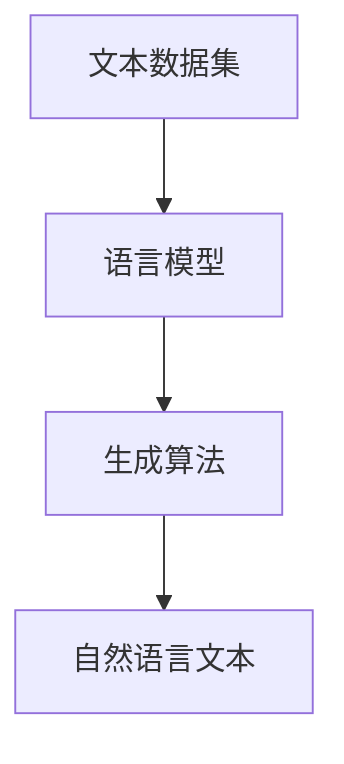

                 

## 引言：企业级自然语言生成系统的诞生与变革

### 关键词
- 自然语言生成（NLG）
- 自动化内容创作
- 企业级应用
- 人工智能
- 业务变革

### 摘要
本文旨在探讨企业级自然语言生成系统（NLG）的发展背景、核心概念、技术架构和应用场景，通过深入分析NLG系统在企业自动化内容创作中的作用和优势，揭示其背后的技术原理和实现方法，展望NLG系统在未来企业中的应用前景。

### 1.1 自然语言生成系统概述

自然语言生成（Natural Language Generation，NLG）是人工智能领域的一个重要分支，它通过机器学习、深度学习等技术，自动生成自然语言文本。NLG系统的发展起源于自然语言处理（Natural Language Processing，NLP）和计算机生成文本的需求。随着互联网的普及和大数据时代的到来，大量的文本数据需要被处理和生成，NLG技术开始在企业中得到广泛应用。

#### 1.1.1 核心概念与联系

自然语言生成系统（NLG System）的核心概念包括：

- **文本数据集**：NLG系统的基础是大规模的文本数据集，这些数据集来源于各种领域，如新闻报道、学术论文、用户评论等。
- **语言模型**：NLG系统的核心是语言模型，它能够预测下一个词或句子，从而生成完整的文本。
- **生成算法**：NLG系统使用生成算法来生成文本，常见的生成算法包括基于统计的方法、基于神经网络的方法和混合方法。

#### Mermaid流程图表示核心概念和架构

### 1.2 技术基础

NLG系统的技术基础主要涉及自然语言处理（NLP）和机器学习（ML）技术。NLP是NLG系统的重要组成部分，它负责处理自然语言文本，包括文本预处理、语义理解等。ML则是NLG系统的核心，通过学习大量文本数据，构建出能够生成文本的模型。

#### 1.2.1 自然语言处理技术

自然语言处理（NLP）技术主要包括以下几个层次：

- **文本预处理**：包括文本清洗、分词、词性标注等，目的是将原始文本转换为计算机可以处理的格式。
- **语义理解**：包括词义消歧、实体识别、情感分析等，目的是理解文本的深层含义。
- **文本生成**：将理解后的语义转换为自然语言文本。

#### 1.2.2 机器学习与深度学习技术

机器学习（ML）和深度学习（DL）是NLG系统的主要技术手段，它们通过学习大量文本数据，构建出能够生成文本的模型。常见的ML和DL模型包括：

- **监督学习模型**：如朴素贝叶斯、支持向量机等。
- **神经网络模型**：如循环神经网络（RNN）、长短时记忆网络（LSTM）、变换器（Transformer）等。

#### 1.2.3 语言模型与生成算法

语言模型是NLG系统的核心组件，它负责预测下一个词或句子。生成算法则负责将语言模型的预测结果转换为自然语言文本。常见的生成算法包括：

- **基于统计的方法**：如N-gram模型、马尔可夫模型等。
- **基于神经网络的方法**：如循环神经网络（RNN）、长短时记忆网络（LSTM）、变换器（Transformer）等。

### 1.3 架构设计

企业级NLG系统的架构设计包括数据处理模块、模型训练模块、模型部署与优化模块等。每个模块都有其特定的功能和作用。

#### 1.3.1 数据处理模块

数据处理模块负责收集、清洗、预处理和存储文本数据。具体包括：

- **数据收集**：从各种来源收集文本数据，如新闻、论文、社交媒体等。
- **数据清洗**：去除文本中的噪声和无关信息，如HTML标签、特殊字符等。
- **数据预处理**：将文本转换为适合模型训练的格式，如分词、词性标注等。
- **数据存储**：将预处理后的文本数据存储在数据库或数据仓库中，以供模型训练和部署使用。

#### 1.3.2 模型训练模块

模型训练模块负责构建和训练语言模型。具体包括：

- **模型选择**：根据任务需求选择合适的语言模型，如基于统计的方法、基于神经网络的方法等。
- **数据标注**：对训练数据进行标注，如词性标注、实体标注等。
- **模型训练**：使用标注数据进行模型训练，优化模型参数。
- **模型评估**：使用评估指标（如生成文本的质量、速度等）对模型进行评估。

#### 1.3.3 模型部署与优化模块

模型部署与优化模块负责将训练好的模型部署到生产环境中，并对模型进行持续优化。具体包括：

- **模型部署**：将模型部署到服务器或云平台上，提供API接口供应用程序调用。
- **性能优化**：通过调整模型参数、优化算法等手段，提高模型性能。
- **持续学习**：根据用户反馈和实际应用情况，对模型进行持续更新和优化。

### 总结与展望

企业级自然语言生成系统（NLG）以其强大的自动化内容创作能力，正在逐渐改变企业的业务模式和工作流程。通过对NLG系统核心概念、技术基础、架构设计的深入分析，我们能够更好地理解其在企业中的应用价值和前景。未来，随着技术的不断进步和应用的深入，NLG系统将在更多领域发挥重要作用，为企业创造更大的价值。

### 下一章预告
在下一章中，我们将深入探讨NLG系统的具体实现方法和技术细节，包括数据处理、模型训练、模型部署等，通过实际案例展示NLG系统的应用场景和效果。敬请期待！

### 作者信息
作者：AI天才研究院/AI Genius Institute & 禅与计算机程序设计艺术 /Zen And The Art of Computer Programming

