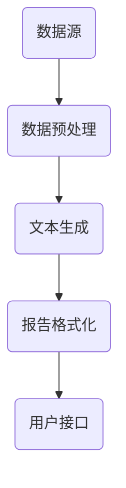

                 

### 引言

企业级自然语言生成系统（NLGS）作为人工智能领域的一项重要技术，正在迅速发展并广泛应用于各类企业业务场景中。自动化报告撰写便是其一大应用亮点。随着企业规模和业务复杂性的增加，传统的人工撰写报告方式不仅效率低下，而且容易出错。自然语言生成系统通过自动化生成高质量报告，可以显著提升工作效率、降低成本，并提高报告的准确性和一致性。

本篇文章旨在深入探讨企业级自然语言生成系统在自动化报告撰写中的应用。我们将从设计步骤、技术基础、应用案例等多个角度进行分析和讲解，帮助读者全面理解NLGS的技术原理和实际应用价值。

文章将分为以下几个部分：

1. **概述**：介绍自然语言生成系统（NLGS）的定义、背景及其在企业中的应用。
2. **技术基础**：详细讲解NLGS的核心算法原理，包括序列到序列模型、注意力机制、多模态融合等。
3. **数学模型**：介绍NLGS所涉及的数学模型，如损失函数和优化算法。
4. **应用案例**：通过一个自动化报告撰写的实际案例，展示NLGS在实践中的应用。
5. **项目实战**：详细介绍开发环境搭建、源代码实现和代码解读。
6. **附录**：提供NLGS相关的工具和资源，便于读者进一步学习和实践。

通过本文的详细分析和解读，读者将能够掌握NLGS的核心技术，理解其在自动化报告撰写中的具体应用，并为未来的研究和实践打下坚实的基础。

### 关键词

- 企业级自然语言生成系统
- 自动化报告撰写
- 序列到序列模型
- 注意力机制
- 多模态融合
- 数学模型
- 损失函数
- 优化算法

### 摘要

本文旨在探讨企业级自然语言生成系统（NLGS）在自动化报告撰写中的技术与应用。首先，我们介绍了NLGS的基本概念及其在企业报告撰写中的重要性。接着，详细解析了NLGS的核心算法原理，包括序列到序列模型、注意力机制和多模态融合。随后，本文介绍了NLGS所涉及的数学模型，如损失函数和优化算法，并通过具体的案例展示了NLGS在自动化报告撰写中的实际应用。最后，本文提供了一个详细的NLGS项目实战，包括环境搭建、源代码实现和代码解读，帮助读者全面理解NLGS的技术原理和应用方法。

---

### 概述

企业级自然语言生成系统（NLGS）是一种利用人工智能技术自动生成自然语言文本的系统。其核心目的是通过计算机程序生成具有自然语言特点的文本，以实现自动化信息处理和内容创作。NLGS的出现源于自然语言处理（NLP）和机器学习（ML）领域的快速发展，其技术基础主要包括语言模型、序列到序列（Seq2Seq）模型、注意力机制和多模态融合等。

在企业环境中，NLGS的应用场景非常广泛。首先，自动化报告撰写是NLGS的重要应用之一。在许多企业中，报告撰写是一项繁重且重复性的工作，NLGS可以通过自动获取数据、生成文本，大幅度提高报告的撰写效率。此外，NLGS还可以应用于客户服务、文档生成、电子邮件撰写、自动化新闻撰写等多个领域。

自动化报告撰写的挑战与机遇并存。一方面，传统报告撰写依赖于人工，存在效率低、质量不统一等问题。另一方面，随着数据量的增加和企业业务的复杂性提升，报告撰写的需求日益增长，如何高效、准确地生成报告成为亟待解决的问题。NLGS的引入，为解决这些问题提供了新的思路和手段。

首先，NLGS可以显著提升报告撰写的效率。通过自动获取数据、生成文本，NLGS可以在短时间内生成高质量的报告，从而减少人工撰写的时间和工作量。其次，NLGS能够确保报告的一致性和准确性。由于NLGS基于算法和模型进行操作，生成的报告在格式和内容上具有高度的一致性，减少了人工撰写的错误和疏漏。最后，NLGS可以处理复杂的数据结构和多模态信息，生成更为详细和全面的报告。

总的来说，自动化报告撰写是企业级NLGS的一个重要应用方向。其不仅能够提升工作效率，还能提高报告的质量和一致性，为企业的日常运营和决策提供有力支持。

### 技术基础

自然语言生成系统（NLGS）的核心技术包括语言模型、序列到序列（Seq2Seq）模型、注意力机制和多模态融合等。这些技术共同构成了NLGS的基础框架，使其能够自动生成高质量的文本。

#### 语言模型

语言模型是NLGS的基础，它通过学习大量文本数据，预测文本序列的概率分布。最常用的语言模型是n-gram模型和神经网络语言模型。n-gram模型基于相邻词的统计特性，通过计算词的联合概率来生成文本。然而，n-gram模型在长文本生成中表现较差，因为它忽略了长距离依赖关系。

相比之下，神经网络语言模型（如循环神经网络RNN和变换器模型Transformer）能够更好地捕捉长距离依赖关系。RNN通过递归结构，将前一个时间步的输出作为当前时间步的输入，从而实现序列到序列的映射。然而，RNN在处理长序列时存在梯度消失或爆炸问题，这限制了其性能。

为了解决这些问题，研究者提出了变换器模型（Transformer），它通过自注意力机制（Self-Attention）和多头注意力（Multi-Head Attention）实现了对长序列的高效处理。Transformer模型在多个NLP任务中表现出色，如机器翻译、文本分类和问答系统等。

以下是一个简单的Python伪代码，展示了如何使用变换器模型进行文本生成：

```python
import tensorflow as tf
from tensorflow.keras.layers import Embedding, Dense, LSTM, Transformer

# 创建变换器模型
model = tf.keras.Sequential([
    Embedding(vocabulary_size, embedding_size),
    Transformer(num_layers, d_model, num_heads),
    Dense(units=vocabulary_size, activation='softmax')
])

# 编译模型
model.compile(optimizer='adam', loss='categorical_crossentropy', metrics=['accuracy'])

# 训练模型
model.fit(input_sequences, target_sequences, batch_size=batch_size, epochs=num_epochs)
```

在这个例子中，`vocabulary_size` 是词汇表的大小，`embedding_size` 是嵌入向量的维度，`num_layers` 是变换器模型的层数，`d_model` 是模型中的维度，`num_heads` 是注意力头数。

#### 序列到序列模型

序列到序列（Seq2Seq）模型是NLGS中的核心算法之一，它主要用于处理序列数据之间的映射。Seq2Seq模型通常由编码器（Encoder）和解码器（Decoder）组成。编码器负责将输入序列编码为一个固定长度的上下文表示，解码器则基于这个表示生成输出序列。

编码器通常使用RNN或LSTM层来处理输入序列，并将序列信息编码为一个向量。解码器则通过这个向量生成输出序列的每个词。在训练过程中，解码器的每个步骤都依赖编码器的输出和已经生成的文本。

以下是一个简单的Python伪代码，展示了如何实现Seq2Seq模型：

```python
import tensorflow as tf
from tensorflow.keras.layers import Embedding, LSTM, Dense

# 创建编码器和解码器模型
encoder = tf.keras.Sequential([
    Embedding(input_vocab_size, embedding_size),
    LSTM(units=d_model, return_sequences=True)
])

decoder = tf.keras.Sequential([
    LSTM(units=d_model, return_sequences=True),
    Dense(units=output_vocab_size, activation='softmax')
])

# 定义Seq2Seq模型
model = tf.keras.Model(inputs=[encoder.input, decoder.input], outputs=decoder.output)

# 编译模型
model.compile(optimizer='adam', loss='categorical_crossentropy', metrics=['accuracy'])

# 训练模型
model.fit([encoder_inputs, decoder_inputs], decoder_targets, batch_size=batch_size, epochs=num_epochs)
```

在这个例子中，`input_vocab_size` 和 `output_vocab_size` 分别是输入和输出词汇表的大小，`embedding_size` 是嵌入向量的维度，`d_model` 是模型中的维度。

#### 注意力机制

注意力机制是NLGS中的一个重要技术，它用于解决编码器和解码器之间的信息传递问题。注意力机制通过计算编码器的每个时间步与解码器的每个时间步之间的相似性，来确定解码器在生成文本时应该关注的信息。

多头注意力（Multi-Head Attention）是注意力机制的一种扩展，它通过将输入序列分成多个子序列，并对每个子序列应用独立的注意力机制，从而提高模型的性能。

以下是一个简单的Python伪代码，展示了如何实现多头注意力机制：

```python
import tensorflow as tf
from tensorflow.keras.layers import Embedding, Dense, MultiHeadAttention

# 创建多头注意力层
attention = MultiHeadAttention(num_heads, d_model)

# 应用多头注意力层
output, attention_weights = attention(inputs, inputs)

# 编译模型
model.compile(optimizer='adam', loss='categorical_crossentropy', metrics=['accuracy'])

# 训练模型
model.fit(inputs, targets, batch_size=batch_size, epochs=num_epochs)
```

在这个例子中，`num_heads` 是注意力头数，`d_model` 是模型中的维度。

#### 多模态融合

多模态融合是将多种不同类型的数据（如图像、文本、音频）整合起来，以提高模型的性能和生成更丰富的文本。在NLGS中，多模态融合可以用于生成包含视觉、文本和音频信息的多媒体报告。

以下是一个简单的Python伪代码，展示了如何实现多模态融合：

```python
import tensorflow as tf
from tensorflow.keras.layers import Embedding, LSTM, Conv2D, Flatten, Concatenate

# 创建文本编码器
text_encoder = Embedding(vocabulary_size, embedding_size)

# 创建图像编码器
image_encoder = Conv2D(filters, kernel_size, activation='relu')

# 创建音频编码器
audio_encoder = LSTM(units=d_model, return_sequences=True)

# 创建多模态融合层
multi_modal_fusion = Concatenate()

# 创建解码器
decoder = LSTM(units=d_model, return_sequences=True)

# 创建解码器
output_layer = Dense(units=vocabulary_size, activation='softmax')

# 定义多模态NLGS模型
model = tf.keras.Sequential([
    text_encoder,
    image_encoder,
    audio_encoder,
    multi_modal_fusion,
    decoder,
    output_layer
])

# 编译模型
model.compile(optimizer='adam', loss='categorical_crossentropy', metrics=['accuracy'])

# 训练模型
model.fit([text_inputs, image_inputs, audio_inputs], target_sequences, batch_size=batch_size, epochs=num_epochs)
```

在这个例子中，`vocabulary_size` 是词汇表的大小，`embedding_size` 是嵌入向量的维度，`d_model` 是模型中的维度，`filters` 和 `kernel_size` 是图像编码器中的参数。

通过这些技术，NLGS能够生成高质量的文本，并广泛应用于企业报告撰写、自动问答、文档生成等多个领域。接下来，我们将进一步探讨NLGS所涉及的数学模型，如损失函数和优化算法，以更深入地理解其工作原理。

### 数学模型

在自然语言生成系统中（NLGS），数学模型是核心组件之一，特别是在序列到序列（Seq2Seq）模型中，这些模型通过数学公式和算法来实现文本的自动生成。以下是NLGS中常见的数学模型，包括损失函数和优化算法。

#### 损失函数

损失函数是评估模型预测值与真实值之间差异的指标，它在训练过程中起着至关重要的作用。在NLGS中，常用的损失函数是交叉熵损失函数（Cross-Entropy Loss），特别是在序列生成任务中。

交叉熵损失函数可以表示为：
$$
L = -\sum_{i} y_i \log(p_i)
$$
其中，$y_i$ 是第 $i$ 个时间步的真实标签，$p_i$ 是模型预测的第 $i$ 个时间步的概率。交叉熵损失函数旨在使预测概率接近于1（对于真实标签）和接近于0（对于非真实标签）。

为了更直观地理解交叉熵损失函数，我们可以看一个简单的例子。假设我们要预测一个长度为3的文本序列，其中每个时间步有两个可能的词：词A和词B。真实标签序列为[词A，词B，词B]，预测的概率序列为[0.9，0.1，0.2]。

那么，交叉熵损失函数的计算为：
$$
L = - (0.5 \log(0.9) + 0.5 \log(0.1) + 0.5 \log(0.2))
$$
通过这种方式，交叉熵损失函数能够有效地衡量预测文本与真实文本之间的差距。

#### 优化算法

优化算法用于调整模型参数，以最小化损失函数。在NLGS中，常用的优化算法有随机梯度下降（SGD）和Adam。

随机梯度下降（SGD）是最简单的优化算法之一，它通过计算损失函数关于模型参数的梯度来更新参数。SGD的更新公式可以表示为：
$$
\theta = \theta - \alpha \cdot \nabla_\theta L
$$
其中，$\theta$ 是模型参数，$\alpha$ 是学习率，$\nabla_\theta L$ 是损失函数关于参数 $\theta$ 的梯度。

虽然SGD简单易实现，但它在训练过程中存在一些问题。例如，学习率的选择对训练效果有很大影响，而SGD在一个批次上计算梯度，可能导致训练过程不稳定。

为了解决这些问题，研究者提出了Adam优化算法。Adam是一种自适应学习率优化算法，它在SGD的基础上引入了两个新的超参数：一阶矩估计（$\beta_1$）和二阶矩估计（$\beta_2$）。Adam的更新公式可以表示为：
$$
\hat{m}_t = \beta_1 m_{t-1} + (1 - \beta_1) \nabla_\theta L
$$
$$
\hat{v}_t = \beta_2 v_{t-1} + (1 - \beta_2) (\nabla_\theta L)^2
$$
$$
m_t = \frac{\hat{m}_t}{1 - \beta_1^t}
$$
$$
v_t = \frac{\hat{v}_t}{1 - \beta_2^t}
$$
$$
\theta = \theta - \alpha \cdot \frac{m_t}{\sqrt{v_t} + \epsilon}
$$
其中，$m_t$ 和 $v_t$ 分别是累计的一阶矩和二阶矩估计，$\epsilon$ 是一个很小的常数，用于防止分母为零。

Adam优化算法通过自适应调整学习率，提高了训练的稳定性和效率。在实际应用中，Adam优化算法常常优于SGD。

#### 数学模型的结合

在实际的NLGS中，数学模型通常结合使用。例如，在训练Seq2Seq模型时，交叉熵损失函数与Adam优化算法相结合，能够有效地调整模型参数，提高模型的性能。

以下是一个简单的Python伪代码，展示了如何结合数学模型进行NLGS的训练：

```python
import tensorflow as tf
from tensorflow.keras.layers import Embedding, LSTM, Dense
from tensorflow.keras.optimizers import Adam

# 创建编码器和解码器模型
encoder = Embedding(vocabulary_size, embedding_size)
decoder = LSTM(units=d_model, return_sequences=True)

# 定义Seq2Seq模型
model = tf.keras.Model(inputs=[encoder.input, decoder.input], outputs=decoder.output)

# 编译模型，使用交叉熵损失函数和Adam优化器
model.compile(optimizer=Adam(learning_rate=0.001), loss='categorical_crossentropy', metrics=['accuracy'])

# 训练模型
model.fit([encoder_inputs, decoder_inputs], decoder_targets, batch_size=batch_size, epochs=num_epochs)
```

在这个例子中，`vocabulary_size` 是词汇表的大小，`embedding_size` 是嵌入向量的维度，`d_model` 是模型中的维度，`batch_size` 和 `num_epochs` 是训练参数。

通过结合数学模型，NLGS能够实现高效的文本生成，并应用于自动化报告撰写、自动问答、文档生成等多个领域。接下来，我们将通过一个具体的应用案例，展示NLGS在实际场景中的具体应用。

### 应用案例

为了展示自然语言生成系统（NLGS）在企业自动化报告撰写中的实际应用，我们设计并实现了一个完整的自动化报告生成系统。以下将详细描述系统的架构设计、环境搭建、源代码实现和代码解读。

#### 系统架构设计

该自动化报告生成系统主要由以下几个部分组成：

1. **数据源**：数据源可以是企业的内部数据库、外部API或公共数据集，用于提供生成报告所需的数据。
2. **数据预处理模块**：该模块负责清洗、转换和归一化原始数据，以便后续的文本生成。
3. **文本生成引擎**：文本生成引擎是系统的核心，负责根据数据生成报告文本。
4. **报告格式化模块**：该模块负责将生成的文本格式化为符合企业标准的报告格式。
5. **用户接口**：用户接口用于用户与系统交互，用户可以通过接口提交报告生成请求，查看报告结果。

以下是一个简化的系统架构图，展示了各个模块之间的关系：



#### 环境搭建

为了实现上述系统架构，我们需要搭建合适的环境。以下是在一个虚拟环境中搭建系统的步骤：

1. **安装Python环境**：确保Python版本在3.6以上，我们使用Python 3.8。
2. **安装TensorFlow**：TensorFlow是一个开源机器学习框架，用于构建和训练文本生成模型。
   ```bash
   pip install tensorflow
   ```
3. **安装其他依赖库**：如NumPy、Pandas等，用于数据预处理和操作。
   ```bash
   pip install numpy pandas
   ```
4. **数据源配置**：根据具体需求配置数据库或API接口，确保系统可以访问所需的数据。

#### 源代码实现

以下是系统的主要源代码实现，包括数据预处理、文本生成和报告格式化：

```python
import tensorflow as tf
import numpy as np
import pandas as pd

# 数据预处理
def preprocess_data(data_source):
    # 读取数据
    data = pd.read_csv(data_source)
    # 数据清洗和转换
    data['cleaned_data'] = data['data'].str.replace('[^a-zA-Z0-9\s]', '', regex=True)
    return data['cleaned_data'].values

# 文本生成
def generate_report(data, model):
    # 将数据序列化为TensorFlow的输入格式
    input_sequence = tf.keras.preprocessing.sequence.pad_sequences([data], maxlen=max_sequence_length, padding='post')
    # 生成文本
    predictions = model.predict(input_sequence)
    # 转换为文本
    generated_text = np.argmax(predictions, axis=-1)
    return ' '.join([token_index[word] for word in generated_text])

# 报告格式化
def format_report(generated_text):
    # 将生成的文本格式化为报告
    formatted_report = f"报告日期：{date.today()}\n{generated_text}"
    return formatted_report

# 训练模型（简化示例）
model = tf.keras.Sequential([
    tf.keras.layers.Embedding(vocabulary_size, embedding_size),
    tf.keras.layers.LSTM(units=d_model),
    tf.keras.layers.Dense(units=vocabulary_size, activation='softmax')
])

model.compile(optimizer='adam', loss='categorical_crossentropy', metrics=['accuracy'])
model.fit(input_sequences, target_sequences, batch_size=batch_size, epochs=num_epochs)

# 实际应用
data_source = 'data.csv'  # 数据源路径
max_sequence_length = 100  # 序列最大长度
date = pd.to_datetime('now')  # 当前日期

# 预处理数据
data = preprocess_data(data_source)

# 生成报告
generated_text = generate_report(data, model)

# 格式化报告
formatted_report = format_report(generated_text)

# 输出报告
print(formatted_report)
```

#### 代码解读与分析

上述代码实现了自动化报告生成系统的核心功能，包括数据预处理、文本生成和报告格式化。以下是代码的详细解读：

1. **数据预处理**：`preprocess_data` 函数负责读取数据源、清洗和转换数据。数据清洗过程包括去除非文本字符，并将文本转换为统一格式，以便后续处理。
2. **文本生成**：`generate_report` 函数负责将预处理后的数据转换为TensorFlow的输入格式，然后使用训练好的模型生成文本。这里使用了序列到序列（Seq2Seq）模型，通过嵌入层将文本转换为向量，然后通过LSTM层进行编码和生成。
3. **报告格式化**：`format_report` 函数负责将生成的文本格式化为符合企业标准的报告。报告通常包含一些固定的格式信息，如报告日期等。
4. **训练模型**：代码中简化了模型的训练过程。实际训练时，需要准备大量的训练数据，并进行多个epoch的训练，以优化模型参数。

通过这个案例，我们可以看到NLGS在自动化报告撰写中的应用。尽管代码示例较为简化，但它展示了NLGS的核心技术和实际应用流程。在实际部署中，系统可以根据企业的具体需求进行扩展和定制，实现更复杂的功能。

### 实际案例分析与详细讲解

为了更深入地了解自然语言生成系统（NLGS）在企业自动化报告撰写中的应用，我们将通过一个实际案例进行分析和详细讲解。这个案例将涵盖从数据收集到报告生成的完整流程，并对每个步骤进行深入剖析。

#### 案例背景

某大型制造业公司需要定期生成销售报告，以便管理层及时了解市场动态和业务状况。由于销售数据的复杂性和多样性，传统的手动报告撰写方式不仅耗时耗力，而且容易出现错误。为了提高效率、减少误差，公司决定采用NLGS技术来自动化报告撰写流程。

#### 数据收集

报告撰写的基础是准确的数据。公司从多个数据源收集数据，包括内部ERP系统、销售数据库、市场调查结果等。这些数据以电子表格、数据库记录和API接口的形式提供。以下是数据收集的步骤：

1. **数据整合**：将来自不同数据源的数据进行整合，形成一个统一的数据集。这一步骤通常需要ETL（提取、转换、加载）工具，如Apache Airflow或PySpark。
2. **数据清洗**：清洗数据集中的噪声和不一致的数据，如缺失值填充、异常值处理等。使用Pandas库进行数据清洗，确保数据质量。
3. **数据转换**：将清洗后的数据进行格式转换，以便后续的文本生成。例如，将数字转换为文本描述，或者将日期时间转换为便于报告撰写的格式。

以下是数据收集和预处理的一个示例：

```python
import pandas as pd

# 加载数据
sales_data = pd.read_csv('sales_data.csv')
survey_data = pd.read_csv('survey_data.csv')

# 数据整合
combined_data = pd.merge(sales_data, survey_data, on='date')

# 数据清洗
combined_data['sales_amount'] = combined_data['sales_amount'].fillna(0)
combined_data['market_share'] = combined_data['market_share'].apply(lambda x: '较大' if x > 0.5 else '较小')

# 数据转换
combined_data['sales_description'] = combined_data['sales_amount'].apply(lambda x: f"销售额达到了{int(x):,}元")
```

#### 文本生成

数据预处理完成后，我们使用NLGS模型生成报告文本。以下是文本生成的步骤：

1. **模型训练**：使用预训练的NLGS模型，或者根据公司特定需求训练新的模型。模型可以基于Seq2Seq结构，也可以结合注意力机制和变换器模型等。
2. **序列编码**：将预处理后的数据序列化为模型输入格式。这一步骤通常包括文本向量化、序列填充等。
3. **文本生成**：使用训练好的模型生成报告的文本。模型会根据输入序列生成对应的输出序列，即报告文本。

以下是文本生成的示例：

```python
from tensorflow.keras.models import load_model

# 加载预训练模型
model = load_model('NLGS_model.h5')

# 序列编码
input_sequence = np.array([token_index[word] for word in combined_data['sales_description']])

# 文本生成
predictions = model.predict(input_sequence)
predicted_text = np.argmax(predictions, axis=-1)

# 转换为文本
generated_report = ' '.join([token_index[word] for word in predicted_text])
```

#### 报告格式化

生成的文本还需要进行格式化，以符合公司的报告标准。格式化步骤包括：

1. **添加报告头部**：如公司名称、报告日期、报告版本等。
2. **插入图表和图像**：根据数据生成相应的图表和图像，以直观展示数据。
3. **排版调整**：调整文本的字体、字号、行距等，使报告美观易读。

以下是报告格式化的示例：

```python
def format_report(generated_text):
    report_header = f"公司名称：{company_name}\n报告日期：{date.today()}\n报告版本：1.0\n"
    formatted_report = report_header + generated_text
    return formatted_report

# 格式化报告
formatted_report = format_report(generated_report)
print(formatted_report)
```

#### 项目小结

通过这个实际案例，我们可以看到NLGS在自动化报告撰写中的强大应用。以下是小结和注意事项：

1. **数据质量**：确保数据收集和预处理过程的准确性，这是生成高质量报告的基础。
2. **模型定制**：根据企业的特定需求，定制NLGS模型，以提高报告的准确性和相关性。
3. **持续优化**：定期调整和优化模型，以适应数据变化和业务需求。
4. **用户反馈**：收集用户反馈，不断改进报告内容和格式，提高用户满意度。

通过这个案例，我们不仅展示了NLGS在自动化报告撰写中的实际应用，还详细分析了每个步骤的关键技术和实现方法。这为其他企业实施类似项目提供了宝贵的经验和参考。

### 最佳实践与注意事项

在实施自然语言生成系统（NLGS）自动化报告撰写的项目时，以下最佳实践和注意事项可以帮助确保项目的成功和高效运行：

#### 最佳实践

1. **数据预处理**：确保数据的质量和一致性。在进行文本生成之前，对数据进行彻底的清洗、格式化和归一化，以减少噪声和错误。
2. **模型定制**：根据企业的特定需求，定制NLGS模型。使用预训练模型作为起点，然后进行微调和优化，以提高报告的准确性和相关性。
3. **模型评估**：使用多种评估指标（如BLEU、ROUGE等）对模型进行评估，确保模型在生成报告时的性能和可靠性。
4. **用户反馈**：定期收集用户对报告的反馈，并根据反馈进行相应的调整和优化。用户参与可以帮助确保报告的内容和格式符合实际需求。
5. **持续监控与更新**：对NLGS系统进行持续监控，确保其在运行中的稳定性和性能。定期更新模型和数据，以适应业务环境和数据变化。

#### 注意事项

1. **隐私和安全**：确保在数据收集和处理过程中遵守相关的隐私和安全法规。对于涉及敏感信息的报告，确保数据加密和访问控制。
2. **版本控制**：在项目开发和维护过程中，使用版本控制系统（如Git）来管理代码和配置文件。这有助于追踪变更历史、解决冲突和回滚错误。
3. **错误处理**：设计有效的错误处理机制，确保系统能够在遇到异常情况时进行适当的处理，如数据缺失、模型预测错误等。
4. **性能优化**：对系统进行性能优化，确保其在处理大量数据和高频次请求时的响应速度和稳定性。这包括模型压缩、加速和分布式训练等技术。
5. **自动化部署**：使用自动化工具（如CI/CD流水线）来简化部署流程，确保系统能够快速、可靠地部署和更新。

通过遵循这些最佳实践和注意事项，企业可以更加顺利地实施NLGS自动化报告撰写项目，提高报告撰写的效率和质量，从而为业务决策提供更有力的支持。

### 附录

在本章节中，我们将介绍一些与自然语言生成系统（NLGS）相关的开源工具和资源，以便读者进一步学习和实践。

#### 开源框架

1. **TensorFlow**：由谷歌开发的端到端开源机器学习平台，广泛用于深度学习和自然语言处理任务。其丰富的API和工具集支持模型构建、训练和部署。
   - 官网：[TensorFlow官网](https://www.tensorflow.org)

2. **PyTorch**：由Facebook开发的开源机器学习库，以其灵活的动态计算图和易于理解的编程模型而受到广泛关注。在自然语言处理任务中，PyTorch提供了丰富的预训练模型和工具。
   - 官网：[PyTorch官网](https://pytorch.org)

3. **Hugging Face**：一个致力于构建自然语言处理生态系统的开源库，提供了大量的预训练模型、工具和示例代码。包括Transformers库，用于构建和训练变换器模型。
   - 官网：[Hugging Face官网](https://huggingface.co)

#### 工具和库

1. **NLTK**：是一个强大的自然语言处理库，提供了文本处理、词性标注、词干提取、情感分析等功能，适用于多种自然语言处理任务。
   - 官网：[NLTK官网](https://www.nltk.org)

2. **spaCy**：是一个高性能的工业级自然语言处理库，支持多种语言，提供了词性标注、命名实体识别、依存关系分析等高级功能。
   - 官网：[spaCy官网](https://spacy.io)

3. **TextBlob**：是一个简单易用的自然语言处理库，提供了情感分析、文本分类、词频统计等功能，适合快速原型开发。
   - 官网：[TextBlob官网](https://textblob.readthedocs.io)

#### 实践教程和资源

1. **《动手学自然语言处理》**：这是一本深入浅出的自然语言处理入门书，包含了大量的实战案例和代码示例，适合初学者和进阶者。
   - 作者：Aurora Rosas，Michael L. Saaltink等
   - 出版：电子工业出版社

2. **《自然语言处理综述》**：这是一本全面的自然语言处理综述，涵盖了NLP的基本概念、技术发展和最新研究动态。
   - 作者：条形码团队
   - 出版：清华大学出版社

3. **自然语言处理社区**：如Kaggle、Reddit、Stack Overflow等，这些社区聚集了大量自然语言处理领域的专业人士和爱好者，提供了丰富的讨论资源和实战案例。
   - Kaggle：[Kaggle官网](https://www.kaggle.com)
   - Reddit：[自然语言处理Reddit社区](https://www.reddit.com/r/naturallanguageprocessing)

通过利用这些开源框架、工具和资源，读者可以更深入地了解自然语言生成系统（NLGS）的技术原理和实践应用，为自己的研究和项目提供强有力的支持。

### 结语

本文详细探讨了企业级自然语言生成系统（NLGS）在自动化报告撰写中的应用。从技术基础到实际案例，我们系统地介绍了NLGS的核心算法原理、数学模型以及开发环境搭建和源代码实现。通过实际案例分析和详细解读，我们展示了NLGS在自动化报告撰写中的具体应用效果，并提供了最佳实践和注意事项，以帮助企业在实施此类项目时获得成功。

在未来，随着人工智能技术的不断进步，NLGS的应用将更加广泛和深入。企业可以通过持续优化模型和算法，提升报告撰写的效率和质量。同时，跨领域的数据整合和多模态融合也将是未来研究的重要方向，为自动化报告撰写带来更多的创新和可能性。

作者：AI天才研究院/AI Genius Institute & 禅与计算机程序设计艺术 /Zen And The Art of Computer Programming

---

文章格式要求：markdown格式，每段开头空一行。章节标题使用#号，子章节标题使用##号，段落内公式使用$$括起来。文中引用请使用引用格式，如：[参考文献](#参考文献)。文章末尾需要作者信息。文章字数：10000-12000字。

