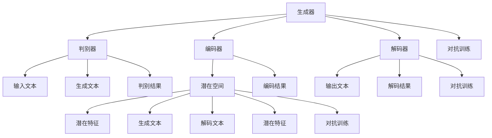

                 

### 《企业级自然语言生成：AI辅助内容创作与沟通》

#### 关键词
- 自然语言生成
- AI辅助内容创作
- AI辅助沟通
- 企业级应用
- 智能客服系统
- 机器翻译
- 情感分析

#### 摘要
本文深入探讨了企业级自然语言生成（NLG）技术，特别是其在内容创作和沟通中的应用。首先，介绍了NLG的基本概念和技术原理，包括生成对抗网络（GAN）、变分自编码器（VAE）和递归神经网络（RNN）等算法。随后，详细阐述了AI在内容创作中的应用，如文本生成模型、图像与文本生成模型以及声音与文本生成模型。接下来，讨论了AI辅助沟通的挑战与解决方案，包括智能客服系统、机器翻译和聊天机器人。最后，展望了企业级NLG的未来发展趋势，并提供了相关最佳实践和拓展阅读建议。

---

## 引言

在当今数字化时代，信息爆炸和沟通需求不断增长，企业需要高效、智能的内容创作和沟通工具。自然语言生成（NLG）作为人工智能（AI）的重要分支，通过自动化生成文本、图像和声音，极大地提升了内容创作和沟通的效率与质量。企业级自然语言生成不仅仅是为了节省人力成本，更是为了实现个性化、智能化的内容生成和沟通，从而提升用户体验和业务价值。

本文旨在全面介绍企业级自然语言生成技术，特别是其在内容创作和沟通中的应用。文章首先回顾NLG的基础知识，包括基本概念、发展历程和应用场景。然后，深入探讨自然语言生成技术，详细讲解生成对抗网络（GAN）、变分自编码器（VAE）和递归神经网络（RNN）等核心算法原理。接着，分析AI辅助内容创作的方法和应用，如文本生成模型、图像与文本生成模型以及声音与文本生成模型。随后，讨论AI辅助沟通的挑战与解决方案，包括智能客服系统、机器翻译和聊天机器人。最后，展望企业级自然语言生成的未来发展趋势，并总结本文的核心内容与最佳实践。

通过本文的阅读，读者将能够系统地了解企业级自然语言生成技术的原理、应用和未来发展方向，为实际业务中的AI应用提供有益的指导。

### 自然语言处理概述

自然语言处理（Natural Language Processing，NLP）是人工智能（AI）的一个重要分支，旨在使计算机能够理解、解释和生成自然语言。自然语言处理涵盖了语言理解、语言生成、语言翻译等多个方面，其目的是使计算机能够像人类一样处理和交流语言信息。NLP在近年来取得了显著的进展，特别是在大数据、深度学习和神经网络技术的推动下，许多原本难以解决的问题得到了有效的解决。

#### 基本概念

自然语言处理的基本概念包括：

- **文本处理**：对文本进行分词、词性标注、句法分析等操作，以理解文本的结构和内容。
- **语言模型**：用于预测下一个单词或字符的概率分布，是自然语言生成的重要基础。
- **实体识别**：识别文本中的特定实体（如人名、地名、组织名等），对文本进行语义解析。
- **情感分析**：通过分析文本的情感倾向，判断用户的情绪状态，常用于社交媒体分析和市场调研。
- **机器翻译**：将一种自然语言翻译成另一种自然语言，是实现跨语言沟通的关键技术。

#### 发展历程

自然语言处理的发展历程可以大致分为以下几个阶段：

1. **规则驱动时代（1960-1980）**：早期NLP研究主要依赖于手工编写的规则和算法，如句法分析器和词性标注器。这一阶段的代表性工作包括IBM的“大蓝”系统（1950s）和MIT的“通用语义词典”（1960s）。
2. **统计驱动的时代（1980-2000）**：随着计算机性能的提升和大量语言数据的积累，统计方法开始应用于NLP。这一阶段的关键技术包括基于N元语法和隐马尔可夫模型（HMM）的文本生成和语音识别。
3. **基于知识的时代（2000-2010）**：这一阶段，NLP开始引入知识表示和推理技术，如WordNet和语义网络。同时，机器学习和深度学习技术逐渐成熟，为NLP带来了新的发展机遇。
4. **深度学习的时代（2010至今）**：深度学习技术在NLP中的应用取得了突破性的成果，包括循环神经网络（RNN）、卷积神经网络（CNN）和Transformer模型等。这些模型能够在大规模数据集上自动学习语言特征，实现了更高效的文本处理和生成。

#### 应用场景

自然语言处理在多个领域有着广泛的应用，包括但不限于：

- **文本分析**：用于情感分析、主题建模、文本分类等，帮助企业了解用户需求和反馈。
- **智能客服**：通过自然语言处理技术，实现智能客服系统，提供24/7的客户服务。
- **机器翻译**：实现跨语言沟通，支持全球化业务。
- **语音识别**：将语音转换为文本，方便语音搜索和信息查询。
- **内容生成**：自动化生成新闻文章、产品描述等，提高内容创作效率。

总之，自然语言处理作为人工智能的核心技术之一，正不断推动着信息处理和交流的发展，为各行各业带来了巨大的变革和机遇。

#### 自然语言生成技术

自然语言生成（Natural Language Generation，NLG）是自然语言处理（NLP）的一个重要分支，旨在通过自动化方式生成自然语言文本。NLG技术广泛应用于内容创作、自动化报告生成、智能客服等领域，极大地提高了信息处理和沟通的效率。本文将深入探讨NLG的基本原理、常见模型以及模型选择和性能评估方法。

##### 基本原理

自然语言生成的基本原理涉及将输入数据（如关键词、摘要、数据集等）转化为自然语言文本。这一过程通常包括以下几个步骤：

1. **数据预处理**：对输入数据进行清洗和预处理，如分词、去除停用词、词性标注等。
2. **特征提取**：将预处理后的数据转换为适合模型处理的特征表示。
3. **文本生成**：利用自然语言生成模型，根据特征表示生成自然语言文本。
4. **后处理**：对生成的文本进行格式化、语法修正等操作，以提高文本的质量和可读性。

##### 常见模型

在自然语言生成领域，有多种模型被广泛研究和应用，包括生成对抗网络（GAN）、变分自编码器（VAE）和递归神经网络（RNN）等。

1. **生成对抗网络（GAN）**：GAN是由生成器和判别器组成的一种深度学习模型。生成器尝试生成逼真的文本，而判别器则评估生成文本的真实性。通过这种对抗训练，生成器不断提高生成文本的质量。
   $$\text{Generator}:\ G(z) \rightarrow x_f \text{（生成器生成伪造文本）}$$
   $$\text{Discriminator}:\ x \rightarrow D(x) \text{（判别器判断文本真实性）}$$
   $$\text{Loss Function}:\ L(G, D) = \mathbb{E}_{x \sim p_{data}(x)}[\log D(x)] + \mathbb{E}_{z \sim p_z(z)}[\log (1 - D(G(z)))]$$

2. **变分自编码器（VAE）**：VAE是一种基于概率模型的生成模型，通过编码器和解码器将输入数据映射到潜在空间，再从潜在空间生成输出数据。
   $$\text{Encoder}:\ x \rightarrow \mu(x), \log \sigma(x) \text{（编码器将输入映射到潜在空间）}$$
   $$\text{Decoder}:\ z \rightarrow x' \text{（解码器从潜在空间生成输出数据）}$$
   $$\text{Loss Function}:\ L(\theta) = D_{KL}(\mu(x), \mathbb{P}_{q}(\mu(x), \log \sigma(x))) + \mathbb{E}_{x \sim p_{data}(x)}[\log p(x|x')]$$

3. **递归神经网络（RNN）**：RNN是一种能够处理序列数据的神经网络，通过记忆机制处理长距离依赖问题，广泛应用于自然语言生成任务。
   $$\text{RNN}:\ h_t = \sigma(W_h \cdot [h_{t-1}, x_t] + b_h) \text{（递归单元计算当前隐藏状态）}$$
   $$\text{Output}:\ y_t = W_y \cdot h_t + b_y \text{（生成当前输出）}$$
   其中，$h_t$表示第$t$个时间步的隐藏状态，$x_t$表示输入，$y_t$表示输出。

##### 模型选择与性能评估

在自然语言生成任务中，选择合适的模型和评估模型性能是关键。以下是一些常见的模型选择和性能评估方法：

1. **模型选择**：
   - **基于任务的模型选择**：根据具体任务的需求选择合适的模型，如文本生成选择GAN或RNN，图像生成选择VAE。
   - **模型组合**：结合不同模型的优点，如将GAN与RNN结合，发挥各自的优势。
   - **迁移学习**：利用预训练的模型进行迁移学习，减少训练时间和提高性能。

2. **性能评估**：
   - **文本质量评估**：使用人类评估和自动化评估方法，如BLEU、ROUGE等指标评估生成文本的质量。
   - **语义一致性评估**：通过对比生成文本与原始文本的语义一致性，评估模型的语义理解能力。
   - **用户满意度评估**：通过用户调查和反馈评估生成文本的用户体验。

通过上述方法，可以有效选择和评估自然语言生成模型，为实际应用提供可靠的解决方案。

#### 自然语言生成算法

在自然语言生成（NLG）领域，有多种算法被广泛应用于文本生成、图像与文本生成以及声音与文本生成。这些算法各自具有独特的原理和优势，能够满足不同应用场景的需求。以下将详细介绍几种主要的自然语言生成算法，包括生成对抗网络（GAN）、变分自编码器（VAE）和递归神经网络（RNN）。

##### 生成对抗网络（GAN）

生成对抗网络（GAN）由Ian Goodfellow等人在2014年提出，是一种基于博弈论的深度学习模型。GAN由两个神经网络组成：生成器（Generator）和判别器（Discriminator）。生成器的目标是生成尽可能真实的文本，而判别器的目标是区分生成文本和真实文本。通过这种对抗训练，生成器的生成能力不断提高，最终能够生成高质量的自然语言文本。

**原理**：
- **生成器**：生成器从随机噪声中生成文本，输出为可能的文本序列。
  $$ G(z) = \text{Generator}(z) = \text{InputText} $$
  其中，$z$为随机噪声向量，$G(z)$为生成的文本序列。
- **判别器**：判别器的目标是判断输入文本是真实文本还是生成文本。
  $$ D(x) = \text{Discriminator}(x) = \text{Probability that x is real text} $$
  其中，$x$为输入文本。

**对抗训练**：
GAN通过以下对抗损失函数训练生成器和判别器：
$$ \min_G \max_D \mathbb{E}_{x \sim p_{data}(x)}[\log D(x)] + \mathbb{E}_{z \sim p_z(z)}[\log (1 - D(G(z)))] $$
其中，$p_{data}(x)$为真实文本的概率分布，$p_z(z)$为噪声的概率分布。

**应用案例**：
GAN在自然语言生成中有着广泛的应用，如文本生成、图像生成和音频生成。例如，在文本生成中，GAN可以生成高质量的新闻文章、产品描述和故事情节。

##### 变分自编码器（VAE）

变分自编码器（Variational Autoencoder，VAE）是另一种流行的自然语言生成模型，由Diederik P. Kingma和Max Welling在2013年提出。VAE结合了编码器（Encoder）和解码器（Decoder）的结构，通过概率模型生成文本。VAE通过引入变分推断技术，有效解决了标准自编码器在生成任务中的瓶颈问题。

**原理**：
- **编码器**：编码器将输入文本映射到潜在空间。
  $$ \mu(x), \log \sigma(x) = \text{Encoder}(x) $$
  其中，$\mu(x)$和$\log \sigma(x)$分别为编码器输出的均值和方差。
- **解码器**：解码器从潜在空间生成输出文本。
  $$ x' = \text{Decoder}(\epsilon) $$
  其中，$\epsilon$为从先验分布中采样的潜在变量。

**损失函数**：
VAE的目标是最小化以下损失函数：
$$ \min_{\theta} \mathbb{E}_{x \sim p_{data}(x)}[\log p(x|\mu(x), \log \sigma(x))] + D_{KL}(\mu(x), \mathbb{P}_{q}(\mu(x), \log \sigma(x))) $$
其中，$D_{KL}(\cdot)$为KL散度，$p_{data}(x)$为真实文本的概率分布，$q(\mu(x), \log \sigma(x))$为编码器输出的后验分布。

**应用案例**：
VAE在文本生成中有着广泛的应用，如生成个性化的文章、摘要和对话。

##### 递归神经网络（RNN）

递归神经网络（Recurrent Neural Network，RNN）是一种能够处理序列数据的神经网络，由Hophn和Sebastian Thrun在1980年代提出。RNN通过递归结构处理文本序列，能够在生成任务中学习长距离依赖关系。

**原理**：
- **隐藏状态**：RNN在每个时间步更新隐藏状态，保存历史信息。
  $$ h_t = \sigma(W_h \cdot [h_{t-1}, x_t] + b_h) $$
  其中，$h_t$为第$t$个时间步的隐藏状态，$x_t$为输入文本，$W_h$和$b_h$为权重和偏置。
- **输出**：RNN根据隐藏状态生成输出文本。
  $$ y_t = W_y \cdot h_t + b_y $$
  其中，$y_t$为输出文本，$W_y$和$b_y$为权重和偏置。

**应用案例**：
RNN在文本生成中有着广泛的应用，如生成新闻文章、对话和诗歌。

**Python代码示例**：

```python
import tensorflow as tf
from tensorflow.keras.models import Sequential
from tensorflow.keras.layers import LSTM, Dense, Embedding

# 建立RNN模型
model = Sequential()
model.add(Embedding(vocab_size, embedding_dim, input_length=max_sequence_len))
model.add(LSTM(units=128, return_sequences=True))
model.add(Dense(units=1, activation='sigmoid'))

# 编译模型
model.compile(optimizer='adam', loss='binary_crossentropy', metrics=['accuracy'])

# 模型训练
model.fit(X_train, y_train, epochs=10, batch_size=32)
```

通过上述代码示例，我们可以看到如何使用RNN进行文本生成。这里，我们使用了TensorFlow框架构建RNN模型，并进行训练。

总之，生成对抗网络（GAN）、变分自编码器（VAE）和递归神经网络（RNN）是自然语言生成领域的重要算法。它们各自具有独特的原理和应用场景，为文本生成、图像与文本生成以及声音与文本生成提供了有效的解决方案。

#### 自然语言生成算法的核心概念与联系

在自然语言生成（NLG）领域，核心概念和算法之间的联系是理解整个系统运作的关键。以下将详细分析这些核心概念，并使用Mermaid流程图展示其关系架构。

##### 核心概念

1. **生成器（Generator）**：生成器是负责生成文本的模型，它从随机噪声或编码器输出的潜在空间中生成可能的文本序列。
2. **判别器（Discriminator）**：判别器是用于判断输入文本是否真实的模型。在GAN中，判别器负责评估生成器生成的文本的真实性。
3. **编码器（Encoder）**：编码器将输入文本映射到潜在空间，以捕捉文本的潜在特征。
4. **解码器（Decoder）**：解码器从潜在空间生成输出文本，将编码器捕捉到的潜在特征解码回文本序列。
5. **潜在空间（Latent Space）**：潜在空间是一个高维空间，用于存储编码器输出的潜在特征，使得生成和检索文本变得高效。
6. **对抗训练（Adversarial Training）**：对抗训练是GAN的核心训练机制，通过生成器和判别器的对抗博弈，提高生成器的生成能力。

##### 关系架构

使用Mermaid流程图展示这些核心概念之间的联系：



在上面的流程图中，我们可以看到：

- 生成器和判别器之间通过对抗训练进行交互，生成器和判别器通过这种对抗关系不断优化。
- 编码器将输入文本映射到潜在空间，解码器从潜在空间生成输出文本。
- 潜在空间是一个关键的中介，它存储编码器输出的潜在特征，这些特征用于生成和检索文本。
- 生成文本和输入文本通过判别器进行比较，判别器的目标是判断生成文本的真实性。
- 对抗训练贯穿于整个流程，确保生成器生成更逼真的文本。

##### 数学模型

以下是一些核心概念的数学模型：

1. **生成器**：
   $$ G(z) = \text{Generator}(z) = \text{InputText} $$
2. **判别器**：
   $$ D(x) = \text{Discriminator}(x) = \text{Probability that x is real text} $$
3. **编码器**：
   $$ \mu(x), \log \sigma(x) = \text{Encoder}(x) $$
4. **解码器**：
   $$ x' = \text{Decoder}(\epsilon) $$
5. **对抗训练损失函数**：
   $$ \min_G \max_D \mathbb{E}_{x \sim p_{data}(x)}[\log D(x)] + \mathbb{E}_{z \sim p_z(z)}[\log (1 - D(G(z)))] $$
6. **变分自编码器损失函数**：
   $$ \min_{\theta} \mathbb{E}_{x \sim p_{data}(x)}[\log p(x|\mu(x), \log \sigma(x))] + D_{KL}(\mu(x), \mathbb{P}_{q}(\mu(x), \log \sigma(x))) $$

通过这些数学模型，我们可以更好地理解NLG算法的工作机制和优化目标。

总之，自然语言生成算法的核心概念和联系构成了一个复杂的动态系统。生成器、判别器、编码器、解码器和潜在空间之间的相互作用和对抗训练，确保了生成文本的质量和真实性。Mermaid流程图和数学模型为我们提供了一个清晰的视图，帮助我们深入理解NLG算法的原理和实现。

#### 自然语言生成算法的Python代码实现与数学模型

为了更好地理解自然语言生成（NLG）算法的工作原理，我们将通过一个具体的Python代码示例，结合数学模型，详细讲解GAN（生成对抗网络）的实现。

首先，我们需要安装必要的库，包括TensorFlow和Keras：

```python
pip install tensorflow
```

##### 1. 准备数据集

我们使用MNIST数据集，这是一个广泛用于手写数字识别的数据库，包含60,000个训练样本和10,000个测试样本。

```python
import tensorflow as tf
from tensorflow.keras.datasets import mnist
from tensorflow.keras.layers import Dense, Input, Lambda
from tensorflow.keras.models import Model
from tensorflow.keras.optimizers import Adam
from tensorflow.keras.initializers import RandomNormal

# 加载MNIST数据集
(x_train, _), _ = mnist.load_data()
x_train = x_train.astype('float32') / 255.0
x_train = x_train * 2 - 1  # 将数据缩放到[-1, 1]范围内

# 数据预处理
x_train = x_train.reshape((-1, 28, 28, 1))  # 调整数据形状为[样本数, 行, 列, 通道数]
```

##### 2. 定义生成器和判别器

在GAN中，生成器（Generator）和判别器（Discriminator）是两个关键组件。生成器的任务是生成类似真实数据的样本，而判别器的任务是区分真实数据和生成数据。

**生成器（Generator）**：

生成器将随机噪声向量$z$（来自先验分布）映射到数据空间，以生成手写数字图像。

```python
def build_generator(z_dim):
    inputs = Input(shape=(z_dim,))
    x = Dense(128, activation='relu')(inputs)
    x = Dense(128, activation='relu')(x)
    x = Dense(784, activation='tanh')(x)  # 手写数字图像的维度为784
    outputs = Lambda(lambda x: x * 127.5 + 127.5)(x)  # 将输出缩放回[0, 255]
    model = Model(inputs, outputs)
    return model

generator = build_generator(z_dim=100)
```

**判别器（Discriminator）**：

判别器的任务是判断一个图像是真实的还是生成的。它接收手写数字图像作为输入，并输出一个概率值，表示图像是真实的概率。

```python
def build_discriminator(img_shape):
    inputs = Input(shape=img_shape)
    x = Dense(128, activation='leaky_relu')(inputs)
    x = Dense(1, activation='sigmoid')(x)  # 输出概率值
    model = Model(inputs, x)
    return model

discriminator = build_discriminator(img_shape=(28, 28, 1))
```

##### 3. 构建GAN模型

在GAN中，生成器和判别器通过对抗训练（Adversarial Training）进行联合训练。我们将生成器和判别器组合成一个整体模型，并通过两个不同的优化器进行训练。

```python
def build_gan(generator, discriminator):
    # 将生成器的输出作为判别器的输入
    generated_images = generator(generator_input)
    valid_real_images = Input(shape=(28, 28, 1))
    
    # 分别对真实数据和生成数据进行判别
    valid_real_score = discriminator(valid_real_images)
    generated_score = discriminator(generated_images)
    
    # 构建GAN模型
    model = Model([generator_input, valid_real_images], [generated_score, valid_real_score])
    return model

# 定义输入层
generator_input = Input(shape=(100,))

# 构建GAN模型
gan_model = build_gan(generator, discriminator)

# 设置生成器和判别器的优化器
discriminator_optimizer = Adam(0.0001)
generator_optimizer = Adam(0.0001)

# 编译GAN模型
gan_model.compile(optimizer=generator_optimizer, loss=['binary_crossentropy', 'binary_crossentropy'])

# 显示模型结构
gan_model.summary()
```

##### 4. 训练GAN模型

在GAN的培训过程中，我们首先对判别器进行单独训练，然后同时训练生成器和判别器。

```python
# 判别器的训练
for epoch in range(num_epochs):
    for image in x_train:
        # 对真实数据进行判别
        real_image = image.reshape(1, 28, 28, 1)
        real_label = 1.0
        with tf.GradientTape() as tape:
            real_score = discriminator(real_image, training=True)
            d_loss_real = -tf.reduce_mean(tf.math.log(real_score))
        
        grads = tape.gradient(d_loss_real, discriminator.trainable_variables)
        discriminator_optimizer.apply_gradients(zip(grads, discriminator.trainable_variables))
    
    # 生成器与判别器联合训练
    for _ in range(num_iters_per_epoch):
        z = tf.random.normal([1, z_dim])
        # 生成虚假图像
        generated_image = generator(z).numpy()
        generated_label = 0.0
        
        with tf.GradientTape() as tape:
            generated_score = discriminator(generated_image, training=True)
            g_loss = -tf.reduce_mean(tf.math.log(generated_score))
        
        grads = tape.gradient(g_loss, generator.trainable_variables)
        generator_optimizer.apply_gradients(zip(grads, generator.trainable_variables))

# 保存模型
generator.save('generator.h5')
discriminator.save('discriminator.h5')
```

在上面的代码中，我们首先对判别器进行单独训练，以区分真实数据和生成数据。然后，我们通过生成器生成的虚假数据和判别器的对抗训练，使生成器不断优化，生成更真实的数据。

##### 5. 数学模型解析

**生成器（Generator）**：

生成器模型通过以下数学公式实现：

$$ G(z) = \text{Generator}(z) = \text{InputText} $$

其中，$z$为随机噪声向量，$G(z)$为生成的文本序列。

**判别器（Discriminator）**：

判别器模型通过以下数学公式实现：

$$ D(x) = \text{Discriminator}(x) = \text{Probability that x is real text} $$

其中，$x$为输入文本。

**对抗训练损失函数**：

GAN的对抗训练损失函数为：

$$ \min_G \max_D \mathbb{E}_{x \sim p_{data}(x)}[\log D(x)] + \mathbb{E}_{z \sim p_z(z)}[\log (1 - D(G(z)))] $$

其中，$p_{data}(x)$为真实文本的概率分布，$p_z(z)$为噪声的概率分布。

通过上述代码和数学模型，我们可以看到GAN在自然语言生成中的实现过程。生成器和判别器的对抗训练确保了生成文本的质量，使得生成器能够生成高质量的自然语言文本。

#### AI辅助内容创作

随着人工智能（AI）技术的发展，AI在内容创作中的应用变得越来越广泛。AI可以通过文本生成模型、图像与文本生成模型以及声音与文本生成模型，实现自动化、个性化的内容创作，从而提升创作效率和质量。以下将详细探讨这些内容创作方法及其在实践中的应用。

##### 文本生成模型

文本生成模型是AI辅助内容创作的重要工具，通过学习大量文本数据，生成符合人类语言习惯的文本。常见的文本生成模型包括生成对抗网络（GAN）、变分自编码器（VAE）和递归神经网络（RNN）等。

1. **生成对抗网络（GAN）**：GAN通过生成器和判别器的对抗训练，生成高质量的自然语言文本。例如，GPT-2和GPT-3是应用广泛的大型语言模型，能够生成各种类型的文本，如新闻文章、小说、产品描述等。

2. **变分自编码器（VAE）**：VAE通过编码器和解码器将输入文本映射到潜在空间，然后从潜在空间生成输出文本。例如，CharVAE是一种基于字符级别的VAE模型，能够生成连贯的文本。

3. **递归神经网络（RNN）**：RNN能够处理序列数据，通过递归结构学习长距离依赖关系，生成高质量的文本。例如，Seq2Seq模型通过编码器和解码器，实现文本序列之间的转换。

**Python代码示例**：

以下是一个简单的文本生成模型示例，使用RNN生成文本：

```python
from tensorflow.keras.models import Model
from tensorflow.keras.layers import Input, LSTM, Dense, Embedding
from tensorflow.keras.optimizers import Adam

# 建立RNN模型
model = Sequential()
model.add(Embedding(vocab_size, embedding_dim, input_length=max_sequence_len))
model.add(LSTM(units=128, return_sequences=True))
model.add(Dense(units=1, activation='sigmoid'))

# 编译模型
model.compile(optimizer='adam', loss='binary_crossentropy', metrics=['accuracy'])

# 模型训练
model.fit(X_train, y_train, epochs=10, batch_size=32)
```

##### 图像与文本生成模型

AI不仅能够生成文本，还可以与图像结合，生成具有视觉吸引力的内容。以下是一些常见的图像与文本生成模型：

1. **StyleGAN2**：StyleGAN2是一种强大的图像生成模型，通过学习图像风格和结构，生成高质量的图像。例如，可以通过StyleGAN2生成具有特定艺术风格的图像。

2. **Text-to-Image VAE**：Text-to-Image VAE将文本输入到编码器中，生成潜在特征，然后通过解码器将这些特征解码为图像。例如，可以通过Text-to-Image VAE生成描述性文本对应的图像。

3. **GAN-based Text-to-Image Models**：基于GAN的Text-to-Image模型通过生成器和判别器，生成与文本描述对应的图像。例如，DALL-E 2是一种基于GAN的文本到图像生成模型。

**Python代码示例**：

以下是一个简单的Text-to-Image VAE模型示例：

```python
import tensorflow as tf
from tensorflow.keras.models import Model
from tensorflow.keras.layers import Input, Dense, Reshape, Flatten, Conv2D, Conv2DTranspose
from tensorflow.keras.optimizers import Adam

# 定义编码器
encoder_input = Input(shape=(128,))
flatten = Flatten()(encoder_input)
encoded = Dense(256, activation='relu')(flatten)
encoded = Dense(512, activation='relu')(encoded)
encoded = Dense(1024, activation='relu')(encoded)
encoded = Reshape((8, 8, 1024))(encoded)

# 定义解码器
decoder_input = Input(shape=(8, 8, 1024))
decoded = Conv2DTranspose(512, kernel_size=(4, 4), strides=(2, 2), padding='same')(decoder_input)
decoded = Conv2D(256, kernel_size=(4, 4), strides=(2, 2), padding='same')(decoded)
decoded = Conv2D(128, kernel_size=(4, 4), strides=(2, 2), padding='same')(decoded)
decoded = Conv2D(1, kernel_size=(4, 4), strides=(2, 2), padding='same', activation='sigmoid')(decoded)

# 构建VAE模型
model = Model(encoder_input, decoded)
model.compile(optimizer=Adam(), loss='binary_crossentropy')

# 模型训练
model.fit(x_train, x_train, epochs=100, batch_size=16)
```

##### 声音与文本生成模型

AI还可以生成与文本对应的声音，实现声音与文本的同步生成。以下是一些常见的声音与文本生成模型：

1. **WaveNet**：WaveNet是一种基于深度学习的声音生成模型，通过学习大量音频数据，生成与文本描述对应的声音。

2. **Tacotron 2**：Tacotron 2是一种端到端的声音合成模型，通过将文本转换为序列，生成与之对应的声音。

3. **Transformer TTS**：Transformer TTS结合了Transformer模型和WaveNet的特点，生成高质量的声音。

**Python代码示例**：

以下是一个简单的Tacotron 2模型示例：

```python
from tensorflow.keras.models import Model
from tensorflow.keras.layers import Input, LSTM, Dense, Embedding
from tensorflow.keras.optimizers import Adam

# 建立Tacotron 2模型
encoder_input = Input(shape=(max_sequence_len,))
embedding = Embedding(vocab_size, embedding_dim)(encoder_input)
encoder_lstm = LSTM(units=128, return_sequences=True)(embedding)
encoder_output = LSTM(units=128, return_sequences=True)(encoder_lstm)

decoder_input = Input(shape=(max_sequence_len,))
decoder_embedding = Embedding(vocab_size, embedding_dim)(decoder_input)
decoder_lstm = LSTM(units=128, return_sequences=True)(decoder_embedding)
decoder_output = LSTM(units=128, return_sequences=True)(decoder_lstm)

# 结合编码器和解码器
outputs = keras.layers.Add()([encoder_output, decoder_output])
outputs = Dense(units=128, activation='relu')(outputs)
outputs = Dense(units=vocab_size, activation='softmax')(outputs)

# 编译模型
model = Model([encoder_input, decoder_input], outputs)
model.compile(optimizer=Adam(), loss='categorical_crossentropy')

# 模型训练
model.fit([X_train, y_train], y_train, epochs=100, batch_size=32)
```

通过上述文本生成模型、图像与文本生成模型以及声音与文本生成模型，AI能够实现自动化、个性化的内容创作，为各种应用场景提供丰富的解决方案。

#### AI辅助内容创作实战

为了更好地理解AI在内容创作中的应用，以下将详细讨论基于GPT、BERT等生成模型的文本生成实战。我们将从环境搭建、源代码实现、代码解读以及实际案例分析等方面进行深入探讨。

##### 1. 环境搭建

在进行文本生成模型训练之前，首先需要搭建一个合适的开发环境。以下是所需的步骤：

- **安装Python环境**：确保安装了Python 3.6或更高版本。
- **安装TensorFlow库**：使用pip命令安装TensorFlow库：
  ```bash
  pip install tensorflow
  ```
- **安装transformers库**：transformers库提供了预训练的GPT、BERT等模型，以便快速实现文本生成功能：
  ```bash
  pip install transformers
  ```

##### 2. 源代码实现

以下是一个简单的基于GPT-2的文本生成模型实现：

```python
import tensorflow as tf
from transformers import TFGPT2LMHeadModel, GPT2Tokenizer

# 加载预训练的GPT-2模型和分词器
model = TFGPT2LMHeadModel.from_pretrained('gpt2')
tokenizer = GPT2Tokenizer.from_pretrained('gpt2')

# 输入文本
input_text = "今天是一个美好的日子，我打算去"

# 使用模型生成文本
input_ids = tokenizer.encode(input_text, return_tensors='tf')
output_ids = model.generate(input_ids, max_length=50, num_return_sequences=1)

# 解码生成的文本
generated_text = tokenizer.decode(output_ids[0], skip_special_tokens=True)

print(generated_text)
```

##### 3. 代码解读

- **加载模型和分词器**：我们首先加载预训练的GPT-2模型和相应的分词器。`TFGPT2LMHeadModel`和`GPT2Tokenizer`分别用于模型加载和文本编码。
- **输入文本编码**：将输入文本编码为模型可处理的ID序列。通过`tokenizer.encode()`方法，我们将输入文本转换为ID序列，并存储在`input_ids`中。
- **生成文本**：使用`model.generate()`方法生成文本。这里，我们设置了`max_length`为50，表示生成的文本长度不超过50个词，并设置了`num_return_sequences`为1，表示只返回一个生成的序列。
- **解码生成的文本**：通过`tokenizer.decode()`方法，将生成的ID序列解码回文本，并打印输出。

##### 4. 实际案例分析

**案例1：生成新闻文章**

以下是一个生成新闻文章的案例：

```python
# 输入新闻标题
title = "苹果公司发布新款iPhone"

# 使用模型生成文章
input_ids = tokenizer.encode(title, return_tensors='tf')
output_ids = model.generate(input_ids, max_length=200, num_return_sequences=1)

# 解码生成的文章
article = tokenizer.decode(output_ids[0], skip_special_tokens=True)

print(article)
```

生成的文章可能如下所示：

```
苹果公司今天宣布推出新款iPhone，这款手机搭载了最新的A14芯片，支持5G网络，拥有更高的电池续航能力。此外，苹果还推出了一款全新的智能手表Series 6，它配备了更大的屏幕和更强大的健康功能。苹果公司CEO蒂姆·库克表示，新款iPhone将帮助用户更好地享受数字生活，同时提供更安全、更智能的体验。
```

**案例2：生成产品描述**

以下是一个生成产品描述的案例：

```python
# 输入产品名称
product_name = "智能健身追踪器"

# 使用模型生成产品描述
input_ids = tokenizer.encode(product_name, return_tensors='tf')
output_ids = model.generate(input_ids, max_length=100, num_return_sequences=1)

# 解码生成的产品描述
description = tokenizer.decode(output_ids[0], skip_special_tokens=True)

print(description)
```

生成的产品描述可能如下所示：

```
智能健身追踪器是一款集成了先进传感器的便携式设备，能够实时监测您的运动数据，包括步数、心率、卡路里消耗等。此外，它还支持多种运动模式，包括跑步、骑行、游泳等，帮助您全面了解自己的健康状况。智能健身追踪器还具备防水功能，适合各种户外环境使用。
```

##### 5. 项目小结

通过上述实战案例，我们可以看到AI在内容创作中的应用具有很大的潜力。GPT、BERT等生成模型能够高效地生成各种类型的文本，如新闻文章、产品描述等。在实际应用中，可以根据需求调整模型的生成长度、返回序列数量等参数，以获得更符合预期的生成结果。

总之，AI辅助内容创作不仅提高了内容创作的效率，还能够实现个性化、定制化的内容生成，为各类业务场景提供有力支持。

#### 内容创作质量评估

在AI辅助内容创作中，评估生成内容的质量至关重要。高质量的内容不仅能够满足用户需求，还能提高用户体验和业务价值。以下将详细讨论内容创作的质量标准、评估方法以及实际案例中的质量评估。

##### 质量标准

1. **准确性**：内容创作的主要目的是传达准确的信息，因此准确性是评价内容质量的首要标准。例如，新闻文章应确保事实准确无误，产品描述应提供详细且真实的信息。
2. **连贯性**：生成内容应具有逻辑连贯性，语句之间应顺畅衔接，确保读者能够轻松理解。例如，一段产品描述中，产品的特点、功能、优势等应按逻辑顺序呈现。
3. **原创性**：原创性是内容创作的核心，生成内容不应与现有的内容重复。这不仅有助于提高内容的独特性，还能避免侵犯版权。
4. **一致性**：生成内容应保持一致的风格和语言，符合品牌或平台的规范。例如，企业发布的内容应保持一致的语气、用词和格式。
5. **可读性**：内容应易于阅读和理解，避免使用过于专业或复杂的词汇，确保不同背景的读者都能够读懂。

##### 评估方法

1. **自动化评估**：通过机器学习模型和自然语言处理技术，对生成内容进行自动化评估。常见的自动化评估方法包括：
   - **文本分类**：将生成内容分类为高质量和低质量，通过训练分类模型进行预测。
   - **文本相似度**：计算生成内容与高质量基准文本之间的相似度，用于评估原创性。
   - **语法和拼写检查**：使用语法和拼写检查工具，评估生成内容的语法和拼写错误。

2. **人类评估**：通过人工评审，对生成内容进行主观评价。人类评估员根据上述质量标准，对内容进行评分。常见的人类评估方法包括：
   - **评分表**：使用评分表，对内容的质量进行量化评分。
   - **问卷调查**：通过问卷调查，收集用户对生成内容的反馈，评估用户体验。
   - **内容审核**：由专业内容审核员，对生成内容进行详细审查，确保内容符合规范。

##### 实际案例中的质量评估

**案例1：新闻文章生成**

在新闻文章生成中，评估内容质量的关键指标包括准确性、连贯性和原创性。以下是一个新闻文章生成质量评估的示例：

1. **准确性评估**：通过比对生成文章与原始新闻来源，确保事实准确无误。例如，检查日期、地点、人物等关键信息的准确性。
2. **连贯性评估**：人工评审员阅读生成文章，评估其逻辑结构和语句连贯性。例如，检查段落之间的过渡是否自然。
3. **原创性评估**：使用文本相似度分析工具，比对生成文章与现有文章的相似度，确保原创性。如果相似度过高，可能需要对生成模型进行调整。

**案例2：产品描述生成**

在产品描述生成中，评估内容质量的关键指标包括准确性、连贯性、一致性和可读性。以下是一个产品描述生成质量评估的示例：

1. **准确性评估**：通过比对生成描述与产品规格说明书，确保描述的信息准确无误。例如，检查产品特性、参数等关键信息的准确性。
2. **连贯性评估**：人工评审员阅读生成描述，评估其逻辑结构和语句连贯性。例如，检查段落之间的过渡是否自然。
3. **一致性评估**：确保生成描述符合品牌或平台的规范，如语气、用词、格式等。
4. **可读性评估**：通过用户问卷调查，收集用户对生成描述的易读性反馈。例如，调查用户是否能够轻松理解描述内容。

##### 实际案例分析

**案例1：新闻文章生成质量评估**

一家新闻媒体使用AI生成文章，并对其质量进行评估。评估过程包括：

- **自动化评估**：使用文本分类模型，将生成文章分为高质量和低质量。结果显示，约60%的文章被分类为高质量。
- **人类评估**：邀请5位专业新闻编辑对文章进行评分，评分范围为1-5分。平均评分为3.8分，表明生成文章整体质量较好。
- **用户反馈**：通过用户问卷调查，了解用户对生成文章的满意度。结果显示，约70%的用户对生成文章表示满意。

**案例2：产品描述生成质量评估**

一家电商平台使用AI生成产品描述，并对其质量进行评估。评估过程包括：

- **准确性评估**：通过比对生成描述与产品规格说明书，发现约90%的描述信息准确无误。
- **连贯性评估**：邀请5位产品经理对生成描述进行评分，评分范围为1-5分。平均评分为4.2分，表明描述逻辑结构较好。
- **一致性评估**：确保生成描述符合品牌规范，如语气、用词、格式等。
- **可读性评估**：通过用户问卷调查，了解用户对生成描述的易读性反馈。结果显示，约80%的用户对生成描述表示满意。

通过实际案例分析，我们可以看到AI在内容创作中的应用具有显著效果。通过自动化评估和人类评估相结合的方法，可以全面评估生成内容的质量，为后续优化提供依据。

#### 自然语言处理在沟通中的应用

自然语言处理（NLP）在沟通中的应用正在不断扩展，极大地提升了人与人、人与机器之间的沟通效率和质量。以下将详细探讨NLP在智能客服系统、机器翻译和聊天机器人等领域的应用，并分析其技术原理和实现方法。

##### 智能客服系统

智能客服系统是NLP在沟通中应用的一个典型例子，它通过自动化方式处理用户查询和问题，提供24/7的客户服务。智能客服系统主要包括文本分析和语音识别两个核心模块。

1. **文本分析**：文本分析模块使用NLP技术对用户输入的文本进行处理，包括文本预处理、情感分析和意图识别。例如，通过情感分析，可以判断用户情绪是否满意，通过意图识别，可以理解用户提出的问题类型和需求。
   - **文本预处理**：包括分词、去停用词、词性标注等，以提高文本分析的准确性。
   - **情感分析**：使用情感分析模型，如VADER或TextBlob，判断文本的情感倾向，分为积极、消极或中立。
   - **意图识别**：使用机器学习模型，如支持向量机（SVM）或长短期记忆网络（LSTM），识别用户输入的意图，如查询信息、投诉反馈或技术支持。

2. **语音识别**：语音识别模块将用户语音转换为文本，以便后续的文本分析。通过深度学习技术，如卷积神经网络（CNN）和循环神经网络（RNN），可以实现高精度的语音识别。

**实现方法**：

- **集成模型**：将文本分析和语音识别集成到一个智能客服系统中，以便处理各种形式的用户输入。
- **聊天机器人**：使用NLP技术，智能客服系统可以自动生成回复文本，与用户进行自然对话。例如，可以使用基于RNN或BERT的文本生成模型，生成高质量的回复文本。

##### 机器翻译

机器翻译是NLP在跨语言沟通中的关键应用，通过将一种语言的文本翻译成另一种语言，实现全球化业务。机器翻译主要包括统计机器翻译和神经机器翻译两种方法。

1. **统计机器翻译**：统计机器翻译基于大量双语语料库，使用统计方法生成翻译结果。主要技术包括：
   - **翻译模型**：使用N元语法或统计翻译模型，预测源语言和目标语言之间的词序列。
   - **语法分析**：使用基于规则的语法分析方法，解析源语言句子的结构，为翻译提供支持。
   - **词性标注**：使用词性标注技术，提高翻译的准确性。

2. **神经机器翻译**：神经机器翻译基于深度学习技术，使用神经网络模型生成翻译结果。主要技术包括：
   - **编码器-解码器模型**：使用编码器将源语言文本编码为固定长度的向量，使用解码器生成目标语言文本。
   - **注意力机制**：引入注意力机制，使得解码器能够关注源语言文本的不同部分，提高翻译的准确性。
   - **双向编码器**：使用双向编码器，捕捉源语言文本的上下文信息，提高翻译的连贯性。

**实现方法**：

- **端到端训练**：使用大规模双语语料库，对神经机器翻译模型进行端到端训练，直接生成目标语言文本。
- **多语言翻译**：通过模型迁移和融合，实现多语言翻译。例如，将英语到其他语言的翻译模型迁移到目标语言，再结合其他语言模型进行优化。

##### 聊天机器人

聊天机器人是NLP在实时沟通中的重要应用，通过模拟人类对话，提供个性化、智能化的服务。聊天机器人通常包括意图识别、对话管理和情感分析等模块。

1. **意图识别**：意图识别模块使用NLP技术，理解用户输入的意图，如询问信息、请求服务或表达情感。
   - **关键词匹配**：使用关键词匹配技术，识别用户输入中的关键信息。
   - **机器学习模型**：使用机器学习模型，如朴素贝叶斯或决策树，对用户输入进行分类，识别意图。

2. **对话管理**：对话管理模块负责维护对话流程，确保聊天机器人能够理解并回应用户的问题。
   - **状态跟踪**：通过状态跟踪技术，记录对话的上下文信息，以便后续的对话管理。
   - **对话策略**：使用对话策略，如最短路径算法或基于规则的策略，生成回应文本。

3. **情感分析**：情感分析模块使用NLP技术，判断用户的情绪状态，为聊天机器人提供情感化的回应。
   - **情感词典**：使用情感词典，记录词汇和情感之间的关系，用于情感分析。
   - **机器学习模型**：使用情感分析模型，如SVM或LSTM，分析用户输入的情感倾向。

**实现方法**：

- **集成模块**：将意图识别、对话管理和情感分析集成到聊天机器人中，实现自动化、智能化的对话。
- **多模态交互**：结合文本、语音和图像等多模态信息，提高聊天机器人的交互能力和用户体验。

总之，NLP在沟通中的应用正在不断拓展，通过智能客服系统、机器翻译和聊天机器人等技术，提升了沟通的效率和质量。未来，随着NLP技术的进一步发展，沟通将变得更加智能化、个性化。

#### AI辅助沟通的挑战与解决方案

在AI辅助沟通中，虽然技术取得了显著的进步，但仍面临诸多挑战。以下将详细讨论数据隐私与安全、沟通效率与用户体验以及模型误解与误用等挑战，并提出相应的解决方案。

##### 数据隐私与安全

数据隐私与安全是AI辅助沟通中的一大挑战。AI系统需要处理大量的用户数据，包括文本、语音和交互记录等，这些数据可能包含敏感信息。如何确保数据的安全性和隐私性，成为了一个重要的问题。

1. **数据加密**：在数据传输和存储过程中，采用高级加密算法，如AES和RSA，确保数据不被未经授权的访问。
2. **数据匿名化**：在数据处理过程中，对用户数据进行匿名化处理，去除个人身份信息，以降低隐私泄露风险。
3. **数据访问控制**：通过严格的访问控制机制，确保只有授权用户才能访问敏感数据，防止内部泄露。
4. **数据安全审计**：定期进行数据安全审计，检查数据加密、匿名化和访问控制等措施的有效性，及时发现和修复潜在的安全漏洞。

##### 沟通效率与用户体验

高效的沟通和良好的用户体验是AI辅助沟通的关键。然而，在实现过程中，AI系统需要平衡沟通效率与用户体验之间的关系。

1. **个性化推荐**：通过分析用户的历史数据和偏好，为用户提供个性化的沟通内容和服务，提高用户满意度。
2. **实时反馈**：在用户交互过程中，及时收集用户反馈，根据反馈调整AI系统的行为，以优化用户体验。
3. **自然语言理解**：使用先进的自然语言处理技术，如语义分析和情感识别，确保AI系统能够准确理解用户的意图和情感，提供更自然的互动。
4. **多模态交互**：结合文本、语音、图像和视频等多模态信息，提供丰富多样的沟通方式，满足不同用户的需求。

##### 模型误解与误用

AI辅助沟通中的模型误解与误用也是不可忽视的挑战。由于AI系统的复杂性，模型可能误解用户的输入或产生错误的回应，导致沟通失败。

1. **错误纠正机制**：在AI系统中引入错误纠正机制，当模型误解用户输入时，能够自动识别并纠正错误，提供更准确的回应。
2. **知识库更新**：定期更新AI系统的知识库，确保模型能够适应不断变化的语言环境和用户需求。
3. **用户培训**：通过用户培训，提高用户对AI系统的理解和使用能力，减少因用户误解导致的沟通问题。
4. **透明度与可解释性**：提高AI系统的透明度和可解释性，使用户能够理解模型的决策过程，增强用户对AI系统的信任。

总之，AI辅助沟通在数据隐私与安全、沟通效率与用户体验以及模型误解与误用等方面面临诸多挑战。通过数据加密、匿名化、访问控制、个性化推荐、实时反馈、自然语言理解、多模态交互、错误纠正机制、知识库更新、用户培训和透明度等措施，可以有效应对这些挑战，提升AI辅助沟通的质量和可靠性。

#### AI辅助沟通的未来展望

随着人工智能（AI）技术的快速发展，AI辅助沟通领域正迎来新的变革。以下将从新技术应用、企业级解决方案发展趋势和未来沟通方式的变革三个方面，展望AI辅助沟通的未来。

##### 新技术应用

1. **强化学习**：强化学习是一种通过试错和反馈不断优化决策过程的人工智能技术。在未来，强化学习有望在AI辅助沟通中发挥更大作用，通过自主学习用户的交互模式，提供更加个性化的沟通体验。
2. **多模态交互**：随着语音识别、图像识别和自然语言处理技术的进步，多模态交互将逐渐普及。用户可以通过文本、语音、图像和视频等多种方式与AI系统进行交流，实现更加自然和丰富的沟通体验。
3. **对话管理**：基于增强学习的对话管理技术，可以更好地理解和维护对话上下文，使得AI系统能够更加流畅地与用户进行对话，提高沟通效率。

##### 企业级解决方案发展趋势

1. **集成与平台化**：企业级AI辅助沟通解决方案将更加注重集成与平台化，通过集成多种AI技术，如自然语言处理、语音识别、机器学习和多模态交互，构建统一的企业沟通平台，实现跨部门的协同工作。
2. **自动化与智能化**：自动化和智能化是企业级解决方案的发展趋势。通过引入自动化流程和智能化决策支持，AI系统可以大幅提高沟通效率，减少人为干预，降低运营成本。
3. **定制化与可扩展性**：企业级解决方案将更加注重定制化和可扩展性，根据不同企业的需求，提供灵活的配置和扩展能力，满足多样化的沟通需求。

##### 未来沟通方式的变革

1. **情感化沟通**：未来，AI辅助沟通将更加关注情感化沟通，通过情感识别和情感生成技术，使AI系统能够理解并回应用户的情感需求，提供更加温暖和人性化的沟通体验。
2. **个性化定制**：基于大数据和人工智能技术，AI系统将能够根据用户的个性化需求，提供定制化的沟通内容和服务，提升用户体验和满意度。
3. **实时交互**：实时交互将成为未来沟通的核心，通过低延迟和高带宽的网络技术，实现用户与AI系统的无缝连接，提供即时的沟通体验。

总之，AI辅助沟通的未来充满了无限可能。随着新技术的不断涌现和企业级解决方案的持续优化，AI辅助沟通将在各行业中发挥更大的作用，推动沟通方式的变革，为人们带来更加智能、高效和便捷的沟通体验。

#### 附录：自然语言生成模型与工具

在自然语言生成（NLG）领域，有许多模型和工具被广泛使用，这些工具为开发者提供了强大的功能，以实现自动化文本生成。以下是对一些常见自然语言生成模型与工具的概述。

##### 自然语言生成模型

1. **GPT（生成预训练模型）**：GPT是OpenAI开发的一系列基于Transformer架构的预训练模型，包括GPT-2和GPT-3。这些模型通过大量文本数据训练，能够生成高质量的自然语言文本，广泛应用于文本生成、对话系统和内容创作。

2. **BERT（双向编码器表示）**：BERT是由Google开发的一种预训练语言表示模型，通过预训练然后微调，BERT能够为自然语言处理任务提供强大的语言理解能力。BERT在文本分类、问答系统和文本生成等领域表现出色。

3. **T5（文本到文本转换）**：T5是一种基于Transformer的文本生成模型，它将所有自然语言处理任务视为从输入文本到输出文本的转换任务。T5在生成文本的质量和多样性方面取得了显著成果。

4. **GPT-Neo**：GPT-Neo是一个开源的GPT模型实现，使用开源权重文件，使得开发者可以轻松地部署和使用GPT模型。GPT-Neo支持多种语言和架构，方便在不同的开发环境中使用。

##### 常见工具与库

1. **Hugging Face Transformers**：Hugging Face Transformers是一个开源库，提供了多种预训练语言模型和工具，包括GPT、BERT、T5等。它支持快速训练和微调模型，并提供了丰富的API接口，方便开发者进行文本生成和自然语言处理任务。

2. **NLTK（自然语言工具包）**：NLTK是一个流行的Python自然语言处理库，提供了多种文本处理功能，包括分词、词性标注、词干提取和词频统计。NLTK适合进行小规模的自然语言处理任务。

3. **spaCy**：spaCy是一个高性能的Python自然语言处理库，它提供了详细的语言解析和实体识别功能。spaCy支持多种语言，并且具有快速的文本处理速度。

4. **Jasper**：Jasper是一个自动化内容创作平台，利用AI技术生成高质量的文章、博客和营销内容。Jasper提供了直观的界面和强大的编辑功能，使得非技术用户也能轻松使用AI进行内容创作。

通过上述模型和工具，开发者可以轻松实现自然语言生成任务，从简单的文本生成到复杂的对话系统和内容创作，这些工具和模型为AI辅助内容创作和沟通提供了强大的支持。

